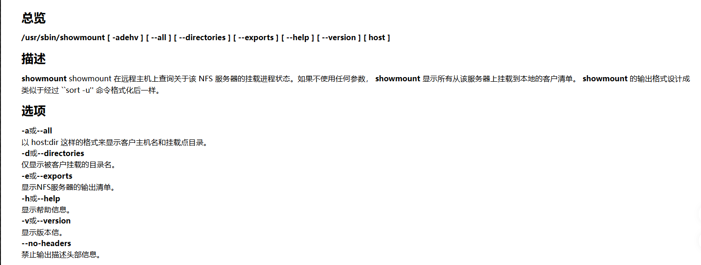

---
title: "内网渗透之NFS服务如何读取文件"
date: 2025-04-29T14:49:21+08:00
summary: "一次项目中的发现"
url: "/posts/内网渗透之NFS服务如何读取文件/"
categories:
  - "内网渗透"
tags:
  - "内网渗透"
draft: false
---

来源于一次内网渗透测试项目中遇到的情况，当时并不知道NFS是干啥的

# 什么是NFS

NFS（Network File System，网络文件系统）是一种分布式文件系统协议，允许客户端通过网络访问远程服务器上的文件，就像访问本地文件一样。

其实本质上就是一个文件共享

# 过程

fscan扫描内网后发现主机端口2049开启，是NFS共享文件的默认端口

NFS的请求原理是这样的

 ```bash
 客户端                    服务器
   |                         |
   |--- 挂载请求 (2049端口) -->|
   |<-- 返回共享目录 ---------|
   |                         |
   |--- 读写文件请求 -------->|
   |<-- 返回文件内容 ---------|
 ```

当NFS存在配置错误，比如将共享文件的权限开放时，就会出现任意文件读取的情况，尽管NFS服务对应的客户端不是攻击者IP

可以用showmount命令



```bash
`showmount -e` 会列出目标机器导出（export）的共享目录
```

如果想读取文件，需要在本地创建一个挂载目录，并使用 `mount` 命令将远程共享目录挂载到该目录。

```bash
mkdir -p /mnt/nfs
mount -t nfs [IP]:/[文件] /mnt/nfs
ls /mnt/nfs
cat /mnt/nfs/[文件]
# 创建本地挂载点
mkdir -p /mnt/nfs_data

# 挂载 NFS 文件系统
mount -t nfs 192.168.1.100:/home/data /mnt/nfs_data
# 查看目录内容
ls -l /mnt/nfs_data

# 使用 cat 读取文件内容
cat /mnt/nfs_data/readme.txt

# 使用 less 分页查看
less /mnt/nfs_data/large_file.log
```

# 成果

我也不知道能不能展示，最后的话是读取到有一个key.txt 文件，里面有一些user的用户名密码，也算是打出效果了，但总感觉捡漏了？
