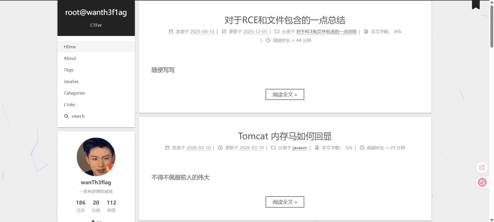
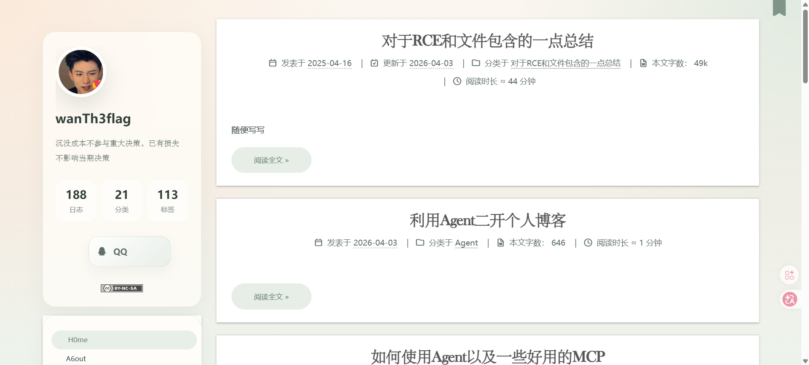
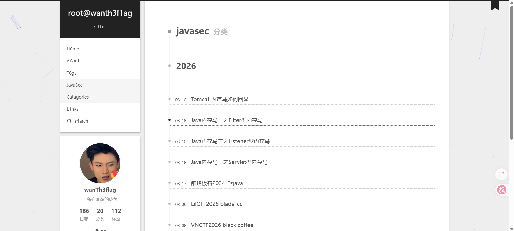
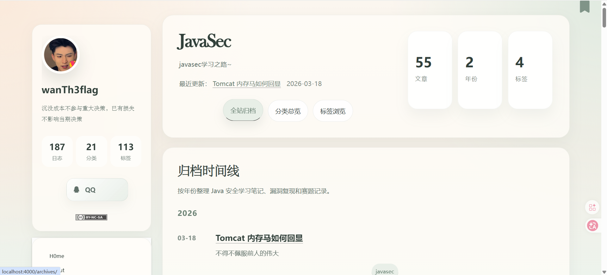
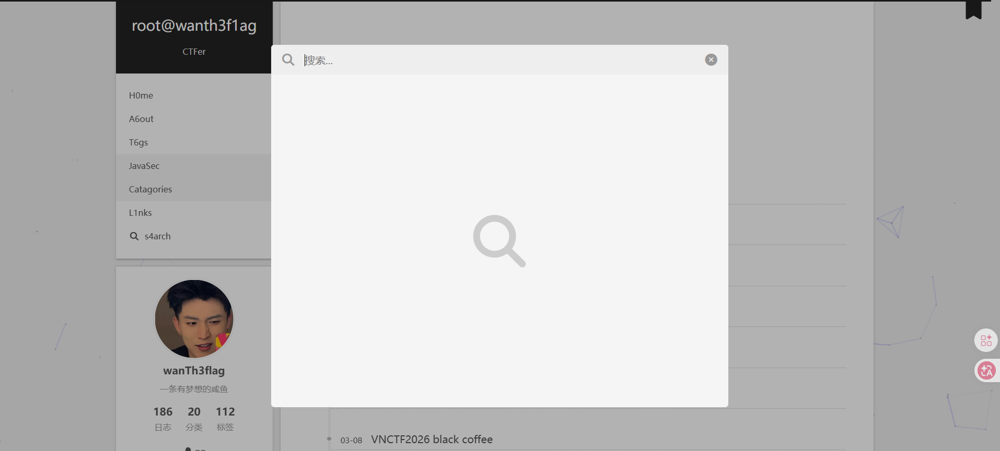
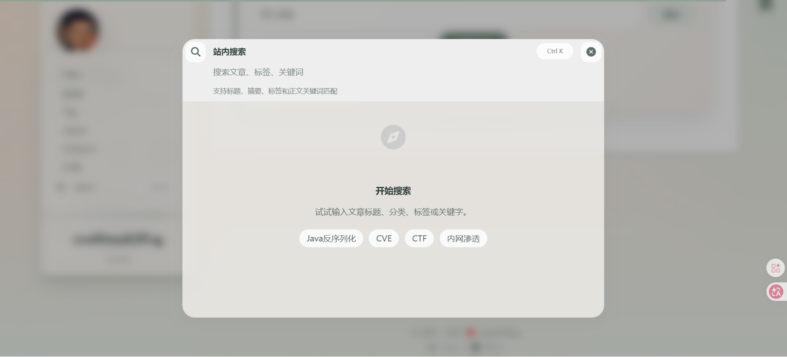
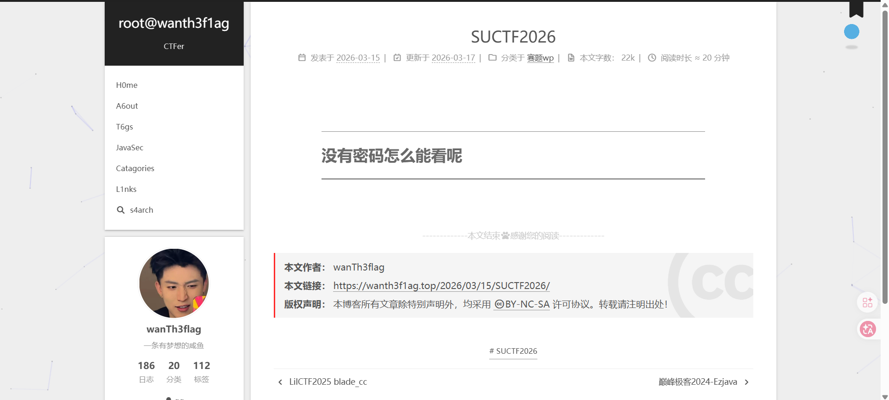
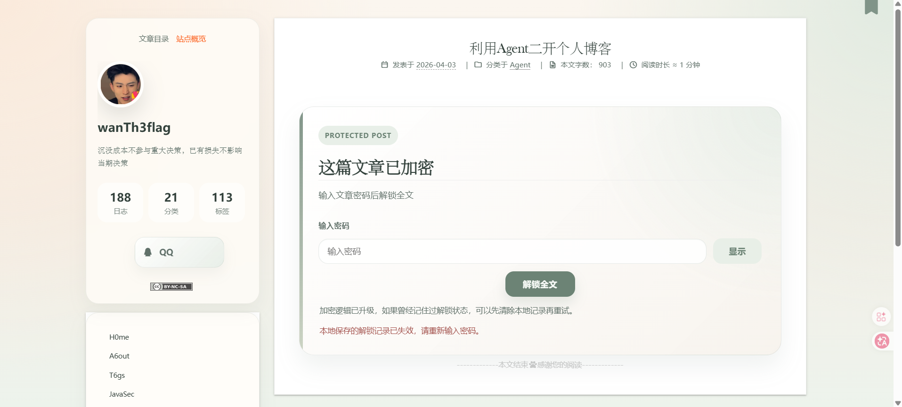
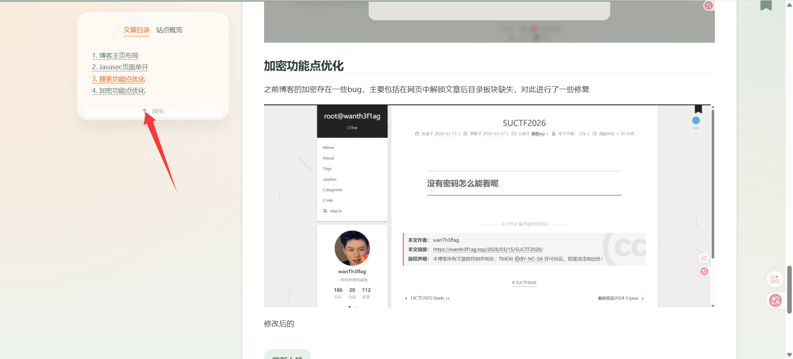

---
title: "利用Agent二开个人博客"
date: 2026-04-03T11:20:46+08:00
summary: " "
url: "/posts/利用Agent二开个人博客/"
categories:
  - "Agent"
tags:
  - "Agent"
draft: false
---

这段时间买了120刀额度的订阅，结果发现每天120刀强度不大的话压根用不了多少，这两天心血来潮，加上看到包师傅也优化了一下博客，所以也打算用AI优化一下

这次优化是一种持续更新，目前主要集中在：

- 博客主页布局
- Javasec页面单开
- 搜索功能点优化
- 加密功能点优化
- 文章阅读的一些bug优化

# 博客主页布局

我目前的博客主要是Hexo+github搭建的Next主题博客

初始页面是这样的


个人看感觉有点过于紧凑而且比较单调，所以让Agent帮我优化了一下布局，Agent的话我用的是Codex，LLM是Gpt5.4

优化博客建议用多Agent模式，这样完成任务更能达到预期而且精准

举个例子，比如我在他初次优化博客后想把一部分内容删掉，我的prompt是这样的

```bash
这是我个人博客的目录，我希望把主页的Recent Note和javasec下的Java Security Archive去掉，在主页做一个小布局的Archives统计，并且把主页每篇文章的方格大小缩小一些，可以参考这个博客作为demo：https://baozongwi.xyz/ 请使用多agent模式帮我优化一下博客页面，可以运行hexo s命令，这样会在本地开启4000端口作为本地博客环境地址
```

给Agent一个运行hexo s本地启动的思路，这样他能自主查看优化后是否完整且精确

但是后面最后再加一个让Agent完成任务后关闭端口的提示词

不过其实也得益于我一个js逆向的mcp吧，他有一个截图的功能，agent会自动调用这个mcp去截图检查

初步优化的效果是这样的



# Javasec页面单开

算是一直困扰我的一个问题，因为开始学java了，我想整理出java的文章进行一个单开页面展示，但是一开始的效果是点击菜单中的javasec后仅仅只是跳转到/categories/javasec/



让ai单开了一个页面后就很舒服了



# 搜索功能点优化

hexo的搜索插件一直都不是很稳定，这次让ai优化了一下，具体效果暂时看是不错的，响应也很快

原来的：



修改之后的：



# 加密功能点优化

之前博客的加密存在一些bug，主要包括在网页中解锁文章后目录板块缺失，对此进行了一些修复



修改后的



解开后里面的目录也是能正常显示的



# 文章阅读的一些bug优化

其实目前的话解决的就是点击目录栏中标题无法跳转的bug（不过不清楚是否彻底解决，有遇到的师傅环境咨询我）

另外还优化了一下图片预览功能，我发现自己之前写文章有时候放的图片如果不预览放大会看不清楚，所以加上了这个功能
