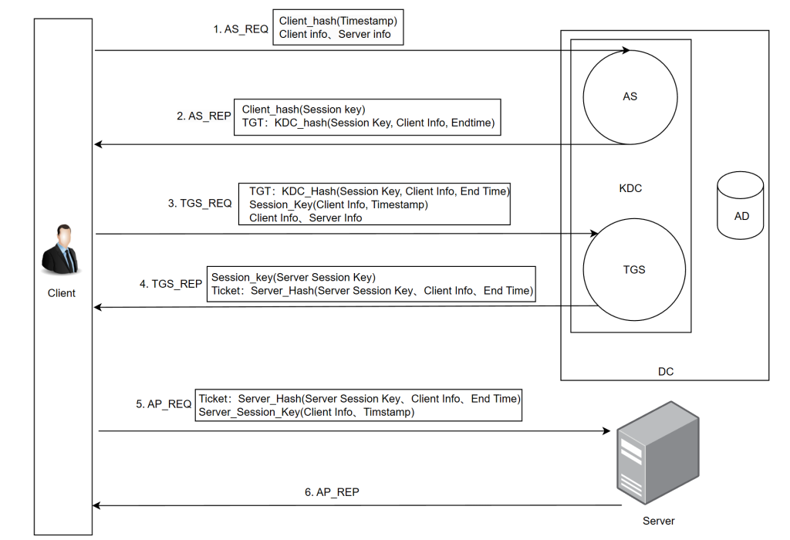
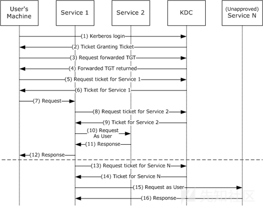

打靶场的时候遇到了，正好学习一下

## Kerberos是什么

Kerberos是一种网络身份认证协议，由MIT麻省理工学院开发，其设计理念是通过使用密钥加密技术为客户机/服务器之间提供强大的认证服务

在域环境下，AD域使用Kerberos协议进行验证，熟悉和掌握`Kerberos`协议是域渗透的基础。

在fushuling师傅中借用过一位大师傅的话：”Kerberos协议要解决的实际上就是一个身份认证的问题，顾名思义，**当一个客户机去访问一个服务器的某服务时，服务器如何判断该客户机是否有权限来访问本服务器上的服务，同时保证在该过程中的通讯内容即便被拦截或者被篡改也不影响整个通讯的安全性**。”

Kerberos协议中的角色主要包括三种：

- 访问服务的客户机client
- 提供服务的服务器Server
- 密钥分发中心KDC(Key Distribution Center)

然后KDC分为两部分

- 身份验证服务器AS（Authentication Service）：验证Client的身份，验证通过之后，AS就会发放TGT票据给Client。
- 票据授予服务器TGS（Ticket Granting Service）：当Client获取的TGT票据后，TGS会给Clinet换取访问Server端的ST服务票据给client

另外还需要介绍一下其他的几个名词：

- TGT ：认证票据 Ticket Granting Ticket，
- ST  ：服务票据 Service Ticket，由TGS服务发布.
- DC：域控制器Domain Controller
- AD：活动目录Active Directory，集中管理网络中的用户、计算机、权限、策略和资源访问。

其实从上面已经能猜到，**Kerberos协议是一种利用票据进行认证的认证协议，KDC服务默认会安装在域控DC中，而Client和Server分别是域中的用户和服务，而在Kerberos中Client是否有权限访问Server端的服务由KDC发放的票据来决定。**

## Kerberos认证过程

Kerberos认证流程大致为以下几步：

- 客户端client向KDC的AS请求TGT票据
- 客户端通过AS认证后，AS会向客户端发放TGT票据
- 客户端携带TGT票据，向KDC的TGS请求ST服务票据
- 客户端通过TGS认证后，TGS会向客户端发放ST服务票据
- 客户端使用ST服务票据向服务器请求服务

fushuling师傅的图




具体分步骤来详细讲一下

首先是客户端与KDC中AS之间的认证，使用 AS_REQ 和 AS_REP 两个步骤

### 第一步：AS_REQ

当我们client访问服务器Server时，需要输入用户名和密码，此时kerberos服务会向KDC的AS发送认证请求，**请求包中包含：请求用户名，主机名，加密类型和Authenticator(用户NTLM hash加密的时间戳)以及一些其他信息。**

### 第二步：AS_REP

KDC在接收请求后会进行认证，检查用户的密码Hash，对请求包中的Authenticator进行解密时间戳，如果时间戳在范围内则认证成功并**返回krbtgt hash加密的TGT票据。**

AS_REP 返回包包含两个主要信息：ticket和enc-part：

ticket包含了TGT，而TGT就是ticket分类下的enc-part。此部分enc-part内容是由域控的NTLM-HASH加密的，只有域控上的KDC能够解密，用于下一步的凭证。TGT中包含了一个关键信息：login session key。独立出来的另一个enc-part包含用户hash加密后的login session key。用户解密该部分后可以拿到原始的login session key。

**TGT票据凭据里面最核心的东西就是krbtgt hash加密的TGT票据和用户hash加密的session key。**

当client客户端获取到TGT票据和原始的login session key后就可以向KDC的TGS请求ST服务票据和请求访问了，使用TGS_REQ 和 TGS_REP 两个步骤

### 第三步：TGS_REQ

client客户端携带着TGT票据和原始的login session key向TGS认证服务请求ST票据，此时TGS通过krbtgt的hash解密TGT票据，然后验证客户端的身份。

### 第四步：TGS_REP

**TGS会首先检查自身是否存在客户端所请求的服务**，如果存在则会使用krbtgt用户的NTLM Hash解密TGT并得到Login session key，然后用Login session key解密Authenticator，如果解密成功，且验证时间戳在范围内则通过TGS认证，随后TGS将会给客户端用户发放ST服务票据。TGS生成的ST服务票据其中包括ticket和一个新的session key。其中ticket中enc_part部分是使用要请求的服务的hash进行加密的。

### 关于SPN

我们知道，域是基于微软的活动目录(AD)服务工作的。而每个在域内运行的使用Kerberos的服务都需要一个SPN。每个SPN信息都包含一个服务以及一个允许登录的用户。并且一个服务可以注册多条SPN用来绑定多个用户。只有这样，在客户端client拿着TGT请求访问某个服务的时候，TGS才能通过查询SPN来确定域内是否存在该请求的服务

SPN分为两种，一种是注册在AD上机器用户下，另一种注册在域用户账户下：当一个服务的权限为Local System或Network Service，则SPN注册在机器帐户(Computers)下，当一个服务的权限为一个域用户，则SPN注册在域用户帐户(Users)下

SPN的格式

```bash
service/hostname[:port][/instance]
```

- serviceclass是服务的名称，常见的有SMTP、WWW、HOST等
- hostname是主机名或 FQDN，也就是**完全限定域名**（包含主机名和完整域名路径的完整域名）

> [!IMPORTANT]
>
> 需要注意的是：查询SPN的操作不只是KDC才能做，因为不管提供的域账户有无访问指定服务的权限，KDC都会查找SPN所对应的服务，所以只要是拥有TGT的客户端用户也能完成。这也就涉及到一个重要的攻击Kerberosating攻击了

**到这里我们能明白TGS的一个工作原理：在TGS工作的认证上，他只负责认证用户带来的TGT是否有效，以及请求的对应服务是否存在，而并不在乎用户是否有访问权限**

### 第五步：AP_REQ和AP_REP

经过了前面的认证过程，一直都是client在和KDC进行交互，接下来就是client和Server的真正通讯了

当客户端拿到TGS_REP发来的ST服务票据后，就需要拿着ST去请求访问服务了。

客户端首先将ST票据中解密后的session key缓存，然后客户端将ST服务票据和session key加密的时间戳一起发送给服务端。

服务端会使用自己的hash解密ST服务票据从中提取Session Key，并用Session Key验证时间戳，从而确立客户端的身份

## PAC是什么

其实早期的Kerberos认证在TGS_REP的过程中存在一个认证的缺陷，在这个过程中，KDC不会验证用户是否有权限访问服务，只要请求的TGT票据解密结果是正确的，则会返回ST服务票据，这也导致了一个很严重的安全漏洞，只要我们提供用户的hash是正确的，那么都可以请求域中的任何一个服务的票据。

为了解决相关的权限认证问题，微软引入了PAC（Privilege Attribute Certificate）即特权属性证书

在前面我们也说过在AS_REQ返回的TGT票据中会包含PAC，PAC中包含用户的sid，用户所在的组，并且在后续的TGS_REQ过程中KDC也会验证PAC签名，确保PAC没有被篡改，如果PAC完好，则重新构造新的PAC放在TGS票据中，到最后一步AP_Rep这里，服务会拿着PAC去KDC那边询问用户有没有访问权限，KDC解密PAC。获取用户的sid，以及所在的组，再判断用户是否有访问服务的权限，有访问权限就允许用户访问。

## Attack_methods

## AS_REQ阶段的攻击

前面我们就知道在该阶段的请求包会包含请求用户名，主机名，加密类型和Authenticator(用户NTLM hash加密的时间戳)等信息，其中核心信息就是加密后的时间戳。只要时间戳信息满足要求，就能通过认证。

可以看到这里用到了用户的hash，那么就可能出现以下几种攻击手法

### 利用手法

- 哈希传递（PTH）

因为使用的是用户的HASH加密的时间戳作为请求凭据，所以我们可以通过hash传递来伪造用户发起请求，这是最常规的方法了

- 用户枚举

KDC在对于错误用户名和错误密码以及正确用户名和错误密码上会返回不同的报错信息，那么就可以对用户名进行枚举

- 密码喷洒攻击

内网一般管理的都很薄弱，为了方便通常会使用相同的密码对服务器进行配置，当用户名存在，密码正确或者错误的时候，返回包也不一样，因此通过密码喷洒可能会出现意想不到的效果

需要注意的是：由于Kerberos内置安全机制，用户认证失败多次就会锁定用户，所以我们只能指定用户密码去爆破用户名

这里的话可以用到`GetTGT`工具来向域控制器申请并获取 Kerberos 的 TGT，他会使用有效凭据向KDC发起AS-REQ来换取TGT

## AS_REP阶段的攻击

### 黄金票据

简单来说如果我们拥有了krbtgt用户的hash，就可以自己给自己签发任意用户的TGT票据，从而跳过AS验证，但是需要具备的条件：

1. 域名称
2. 域的KRBTGT账户NTLM密码哈希，也就是hash
3. 需要伪造的用户名
4. 域的SID值

impacket中的工具ticketer（该工具是本地生成的）

```
ticketer -domain-sid sid值 -nthash krbtgt-hash -domain 域名 伪造的用户
```

mimikatz导出krbtgt的Hash

```bash
lsadump::dcsync /domain:域名 /user:krbtgt
```

然后结合域的SID和krbtgt的Hash，生成黄金票据

```bash
Kerberos::golden /user:administrator /domain:域名 /sid：SID值 /krbtgt:哈希值 /ptt(后面如果携带ptt就会自动注入到内存，如果不携带就会在本地生成)
```

## TGS_REQ & TGS_REP阶段的攻击

### Kerberosating攻击

https://www.freebuf.com/articles/network/365349.html

Kerberosating攻击发生在Kerberos协议的TGS_REP阶段，KDC的TGS服务返回一个由服务Hash 加密的ST给客户端。由于该ST是用服务Hash进行加密的，因此客户端在拿到该ST后可以用于本地离线爆破。

Kerberosating攻击过程：

1. 攻击者提供一个正常的域用户密码对域进行身份认证，KDC在验证账户和密码的有效性，会返回一个TGT票据。该TGT票据用于以后的ST服务票据请求。
2. 攻击者使用获得的TGT请求针对指定SPN的ST，而在TGS_REQ过程中攻击者可以指定Kerberos加密类型，其中RC4_HMAC_MD5加密算法比较相比于其他加密算法更容易被破解，所以可以指定RC4_HMAC_MD5
3. 之前就讲过，如果攻击者的TGT是有效的，不管提供的域账户有无访问指定服务的权限，KDC都会查找该账户注册了所请求的SPN，然后用该用户的Hash以RC4_HMAC_MD5加密类型加密ST并在TGS_REP包中发送给攻击者。
4. 攻击者从TGS_REP包中提取加密的ST并进行离线破解，可以破解出该SPN对应的用户的明文密码

Kerberosating攻击在实战中主要分为以下四步：

1. 查询域内注册于域用户下的SPN
2. 请求指定的SPN的ST
3. 导出请求的ST
4. 对该导出的ST进行离线爆破

例如利用GetUserSPNs

```bash
proxychains4 impacket-GetUserSPNs -request -dc-ip [域控制器IP] [域/用户名:密码]
```

参考文章：

https://fushuling.com/index.php/2023/09/02/windows%e5%9f%9f%e6%b8%97%e9%80%8f%e4%b9%8bkerberos%e5%8d%8f%e8%ae%ae/

https://www.cnblogs.com/smileleooo/p/18187195

### 白银票据

之前就说过，**在TGS工作的认证上，他只负责认证用户带来的TGT是否有效，以及请求的对应服务是否存在，而并不在乎用户是否有访问权限** ，**在ST服务票据的ticket中的encpart是使用服务的hash进行加密的**，所以如果我们拥有了ST票据，也就拿到了服务账户的NTLM-HASH，NTLM-HASH是根据密码hash而来，且其算法是公开的，只要枚举服务账户原始密码，进行爆破，再匹配解密后的格式特征，就能拿到服务账户的密码，前提是密码在你的密码字典中。

拿到服务账户的密码后就可以自己签发任意用户的ST票据，这个ST票据就是白银票据。与黄金票据相比，白银票据只能访问特定访问，并且伪造的白银票据没有带有有效KDC签名的PAC。如果将目标主机配置为验证KDC PAC签名，则银票将不起作用。这里需要具备的条件：

1. 域名称
2. 域的SID值
3. 服务名
4. 服务的hash
5. 伪造的用户名
6. 目标服务FQDN

但是白银票据的关键就是在于如何获取到服务的密钥哈希，有时候就会需要用到Kerberoasting进行破解，或者用猕猴桃从内存中进行获取哈希

```bash
mimikatz.exe "privilege::debug" "sekurlsa::logonPasswords" > 'xxx.txt'
```

然后用猕猴桃进行制造白银票据

```bash
kerberos::golden /user:用户名 /domain:域名 /sid:域sid /target:目标服务器 /service:目标服务 /rc4:目标服务器的hash /ptt
```

## 委派攻击

参考文章：

https://forum.butian.net/share/1591

https://y4er.com/posts/kerberos-unconstrained-delegation/

### 什么是域委派

简单来说就是域内用户账户的权限委派给服务账号，服务账号能以用户账号的身份在域内展开活动。

微软的官方流程图



跟以往的Kerberos请求服务的流程有什么不一样呢？其实就在于委派可以大量减轻用户和目标服务的直接直接交互和参与，更多的是依靠委派去和目标服务进行交互

### 委派的分类

主要分为三类：

- 非约束委派
- 约束委派
- 基于资源的约束委派

### 非约束委派攻击

非约束委派其实是用户账户将自身的TGT转发给服务账户使用。服务账户可以请求得到域用户的TGT票据
