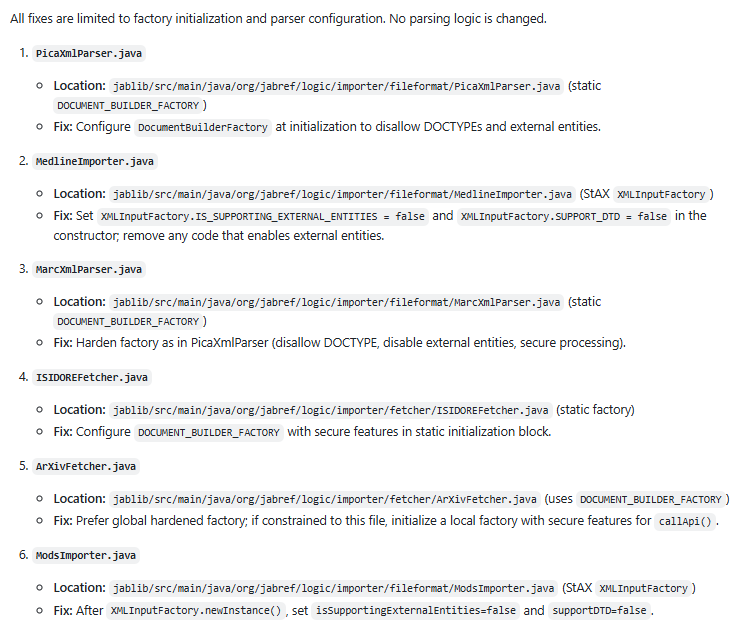
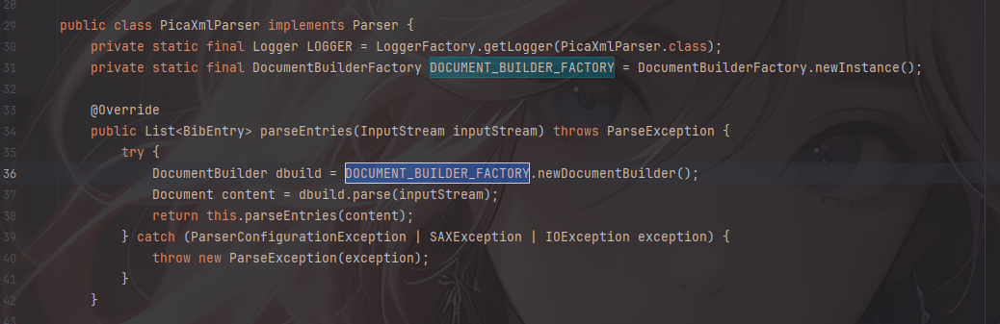
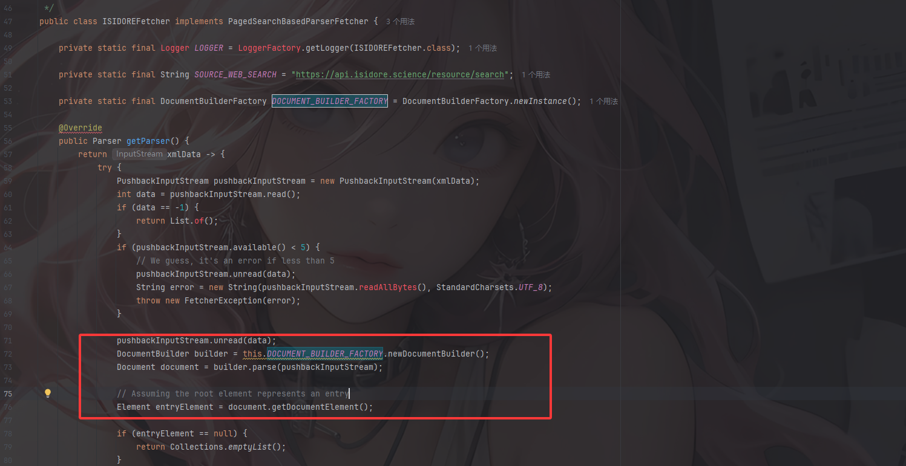
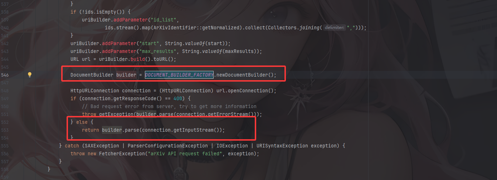
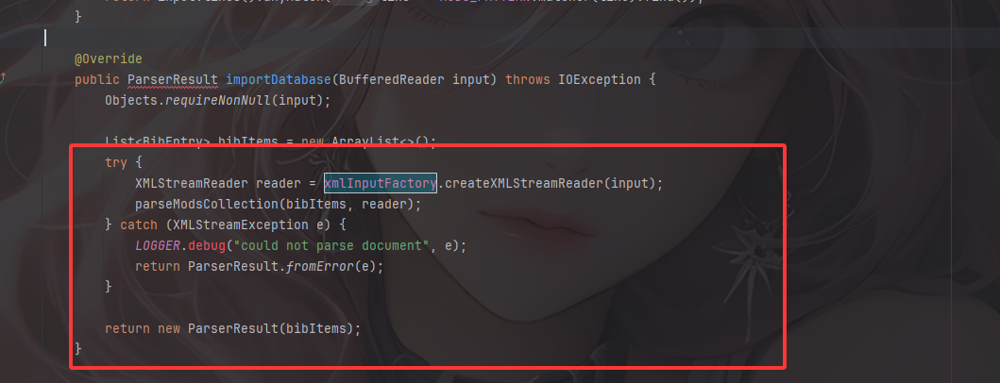

---
title: "基于Jabref的PR的一些XXE猜测"
date: 2025-09-25T16:31:03+08:00
summary: "基于Jabref的PR的一些XXE猜测"
url: "/posts/基于Jabref的PR的一些猜测/"
categories:
  - "漏洞分析"
tags:
  - "Jabref"
draft: true
---

## 前言

刚好在做完一个比赛的题后看到一个pull的修复 https://github.com/JabRef/jabref/pull/13966 ，那就来分析验证一下吧



这里的话主要是修复了六个地方，其实说来也是，我本身对XXE的了解是很浅的，甚至于我很多时候都不清楚他具体的原理以及源码中的实现，也算是借此机会多了解一下了

## 漏洞分析

由于这个pull给出的代码commit还没有合并到项目中：https://github.com/JabRef/jabref/pull/13966/commits/34b75d6250c0d02e210a67f1d7b41e4658735062，所以是暂不明确影响版本的，只能把最新版拉下来看看

https://github.com/JabRef/jabref/archive/refs/tags/v5.15.zip

### 漏洞点1

首先是第一处，在src/main/java/org/jabref/logic/importer/fileformat/PicaXmlParser.java和src/main/java/org/jabref/logic/importer/fileformat/MarcXmlParser.java中



很经典的DOM 解析，DocumentBuilder能将XML解析成DOM，但是问题出现在哪呢？跟进PR中的描述就是DocumentBuilderFactory中的默认配置，默认情况下，`DocumentBuilderFactory`启用了以下危险功能：

- 外部实体解析
- DOCTYPE声明处理
- 外部DTD处理

所以如果没有禁用 DOCTYPE 和外部实体解析，就可能产生XXE

在`parseEntries(InputStream inputStream)`中可以看到会`return this.parseEntries(content)`，跟进这个函数看看

```java
    private List<BibEntry> parseEntries(Document content) {
        List<BibEntry> result = new ArrayList<>();

        // used for creating test cases
        // XMLUtil.printDocument(content);

        Element root = (Element) content.getElementsByTagName("zs:searchRetrieveResponse").item(0);
        Element srwrecords = getChild("zs:records", root);
        if (srwrecords == null) {
            // no records found -> return empty list
            return result;
        }
        List<Element> records = getChildren("zs:record", srwrecords);
        for (Element gvkRecord : records) {
            Element e = getChild("zs:recordData", gvkRecord);
            if (e != null) {
                e = getChild("record", e);
                if (e != null) {
                    BibEntry bibEntry = parseEntry(e);
                    // TODO: Add filtering on years (based on org.jabref.logic.importer.fetcher.transformers.YearRangeByFilteringQueryTransformer.getStartYear)
                    result.add(bibEntry);
                }
            }
        }
        return result;
    }
```

content就是我们已经解析的DOM，先是查找里面的`zs:searchRetrieveResponse根元素`以及`zs:record`子元素，随后遍历所有的`zs:record`元素，在`zs:record`元素中查找`zs:recordData`，继续查找`record`，最后调用parseEntry()解析数据

所以我们可以试着写出一个预想的POC

```xml
<?xml version="1.0" encoding="UTF-8"?>
<!DOCTYPE zs:searchRetrieveResponse [
  <!ENTITY xxe SYSTEM "file:///etc/passwd">
]>
<zs:searchRetrieveResponse xmlns:zs="http://www.loc.gov/zing/srw/">
    <zs:records>
        <zs:record>
            <zs:recordData>
                <record>
                    <test>&xxe;</test>
                </record>
            </zs:recordData>
        </zs:record>
    </zs:records>
</zs:searchRetrieveResponse>
```

但是在找功能点的时候受挫了，一直没找到可以利用的功能点。。。

### 修复方案1

最直接的就是对`DOCUMENT_BUILDER_FACTORY` 做一次 **安全配置**

```java
static {
        try {
            // This prevents XXE
            DOCUMENT_BUILDER_FACTORY.setFeature("http://apache.org/xml/features/disallow-doctype-decl", true);
            DOCUMENT_BUILDER_FACTORY.setFeature("http://xml.org/sax/features/external-general-entities", false);
            DOCUMENT_BUILDER_FACTORY.setFeature("http://xml.org/sax/features/external-parameter-entities", false);
            DOCUMENT_BUILDER_FACTORY.setExpandEntityReferences(false);
            // Optionally, disable XInclude
            DOCUMENT_BUILDER_FACTORY.setXIncludeAware(false);
        } catch (ParserConfigurationException e) {
            throw new ExceptionInInitializerError("Failed to securely configure XML parser for PicaXmlParser: " + e.getMessage());
        }
    }
```

通过禁用`DOCTYPE`声明以及禁止外部通用实体和外部参数实体等方式去防止此漏洞

### 漏洞点2

同样的，在src/main/java/org/jabref/logic/importer/fileformat/MedlineImporter.java中找到XMLInputFactory类型的变量的用法

首先是构造函数

```java
    public MedlineImporter() {
        this.xmlInputFactory = XMLInputFactory.newInstance();
        // prevent xxe (https://rules.sonarsource.com/java/RSPEC-2755)
        // Not supported by aalto-xml
        // xmlInputFactory.setProperty(XMLConstants.ACCESS_EXTERNAL_SCHEMA, "");
        // required for reading Unicode characters such as &#xf6;
        xmlInputFactory.setProperty(XMLInputFactory.IS_COALESCING, true);
        // TODO: decide if necessary, if disabled MedlineImporterTestNbib fails
        xmlInputFactory.setProperty(XMLInputFactory.IS_NAMESPACE_AWARE, false);
        xmlInputFactory.setProperty(XMLInputFactory.IS_SUPPORTING_EXTERNAL_ENTITIES, true);
    }
```

会实例化一个XMLInputFactory对象，并进行相关的配置，可以关注到最后一个`IS_SUPPORTING_EXTERNAL_ENTITIES = true` 表示解析器允许处理外部实体。

然后我们看一下他这里的具体关于xml解析的代码

```java
    @Override
    public ParserResult importDatabase(BufferedReader input) throws IOException {
        Objects.requireNonNull(input);

        List<BibEntry> bibItems = new ArrayList<>();

        try {
            XMLStreamReader reader = xmlInputFactory.createXMLStreamReader(input);//用XMLInputFactory 创建 XMLStreamReader

            while (reader.hasNext()) {//迭代 XML 文档的每个事件
                reader.next();//移动到下一个 XML 事件。
                if (isStartXMLEvent(reader)) {//判断当前事件是否是 开始标签（<PubmedArticle> 或 <PubmedBookArticle>）
                    String elementName = reader.getName().getLocalPart();//获取当前元素的名称（去掉命名空间前缀）。
                    switch (elementName) {
                        case "PubmedArticle" -> {//如果元素是PubmedArticle
                            parseArticle(reader, bibItems, elementName);
                        }
                        case "PubmedBookArticle" -> {//如果元素是PubmedBookArticle
                            parseBookArticle(reader, bibItems, elementName);
                        }
                    }
                }
            }
        } catch (XMLStreamException e) {
            LOGGER.debug("could not parse document", e);
            return ParserResult.fromError(e);
        }

        return new ParserResult(bibItems);
    }
```

所以这里的话可以写出两种poc

```xml
<?xml version="1.0" encoding="UTF-8"?>
<!DOCTYPE root [
    <!ENTITY xxe SYSTEM "file:///etc/passwd">
]>
<root>
    <PubmedArticle>
        <data>&xxe;</data>
    </PubmedArticle>
</root>

或者

<?xml version="1.0" encoding="UTF-8"?>
<!DOCTYPE root [
    <!ENTITY xxe SYSTEM "file:///etc/passwd">
]>
<root>
    <PubmedBookArticle>
        <data>&xxe;</data>
    </PubmedBookArticle>
</root>
```

修复commit跟前面的没啥区别，也是增加安全配置

### 漏洞点3

src/main/java/org/jabref/logic/importer/fetcher/ISIDOREFetcher.java中DOCUMENT_BUILDER_FACTORY并没有设置安全配置



这里的话就是最简单的xxe了，可以直接构造poc

```java
<?xml version="1.0" encoding="UTF-8"?>
   <!DOCTYPE foo [
     <!ENTITY xxe SYSTEM "file:///etc/passwd">
   ]>
   <root>&xxe;</root>
```

src/main/java/org/jabref/logic/importer/fetcher/ArXivFetcher.java中都有相关的体现

修复方案如上

### 漏洞点4

在src/main/java/org/jabref/logic/importer/fetcher/ArXivFetcher.java中



没啥说法，还是跟之前的差不多其实

### 漏洞点5

在src/main/java/org/jabref/logic/importer/fileformat/ModsImporter.java中

```java
    public ModsImporter(ImportFormatPreferences importFormatPreferences) {
        keywordSeparator = importFormatPreferences.bibEntryPreferences().getKeywordSeparator() + " ";
        xmlInputFactory = XMLInputFactory.newInstance();
        // prevent xxe (https://rules.sonarsource.com/java/RSPEC-2755)
        // Not supported by aalto-xml
        // xmlInputFactory.setProperty(XMLConstants.ACCESS_EXTERNAL_DTD, "");
        // xmlInputFactory.setProperty(XMLConstants.ACCESS_EXTERNAL_SCHEMA, "");
    }
```

也就没做任何安全配置，然后看sink点



## 漏洞利用

暂时还没翻到相关的功能点，更多的是对源码的审计吧，等找到功能点再说吧
