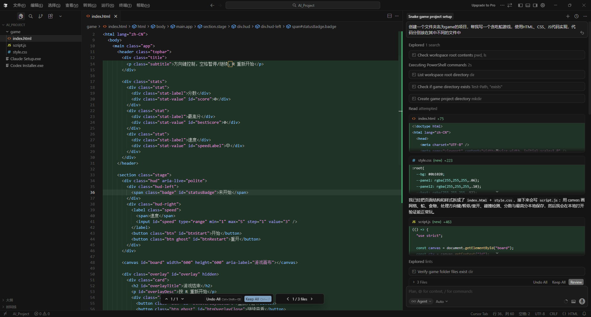
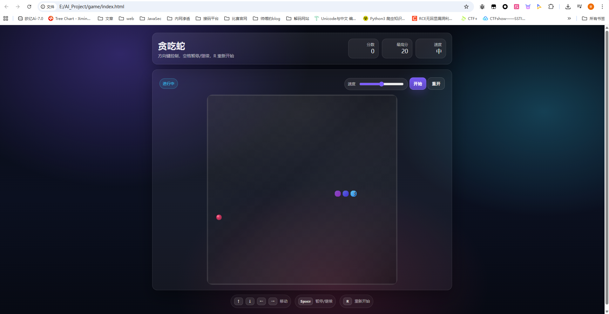
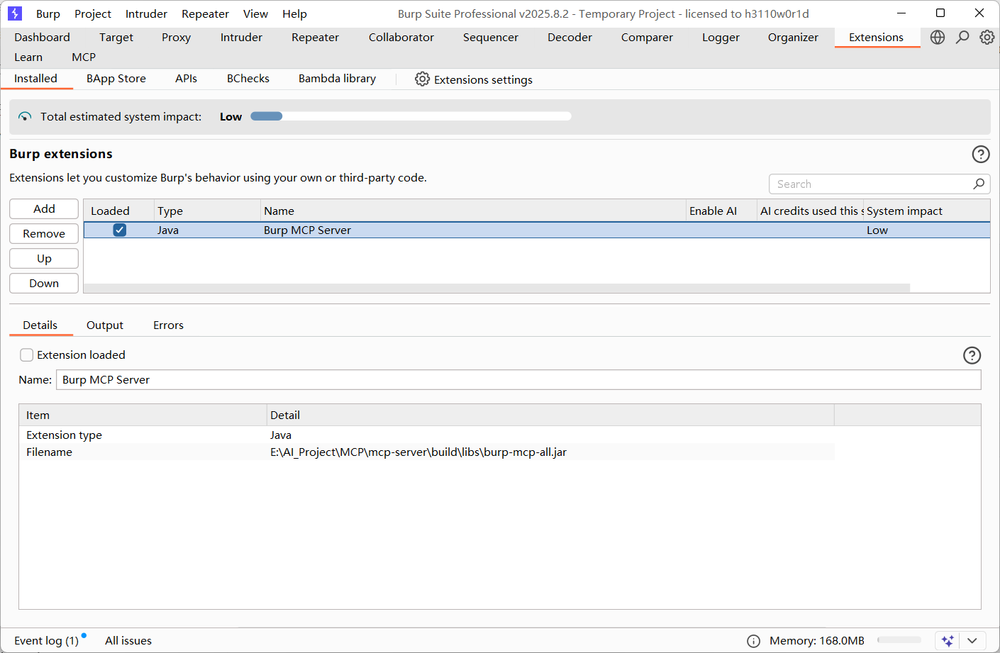
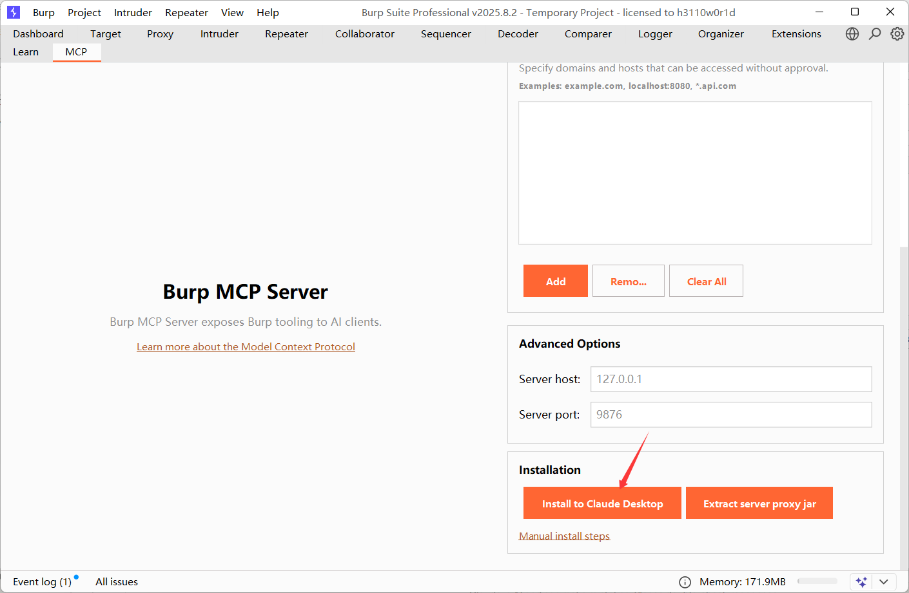
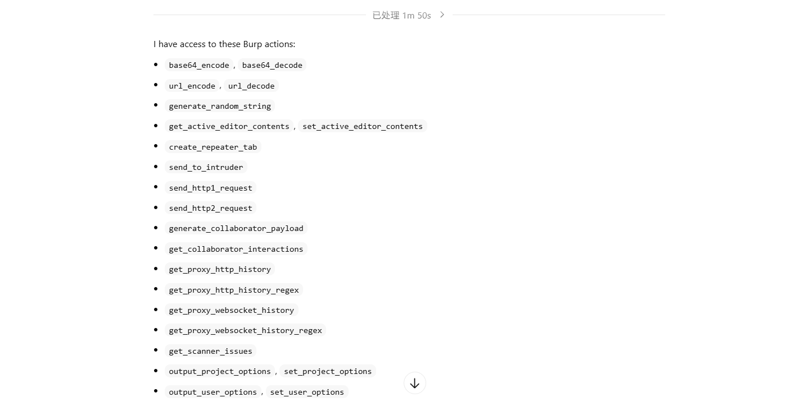
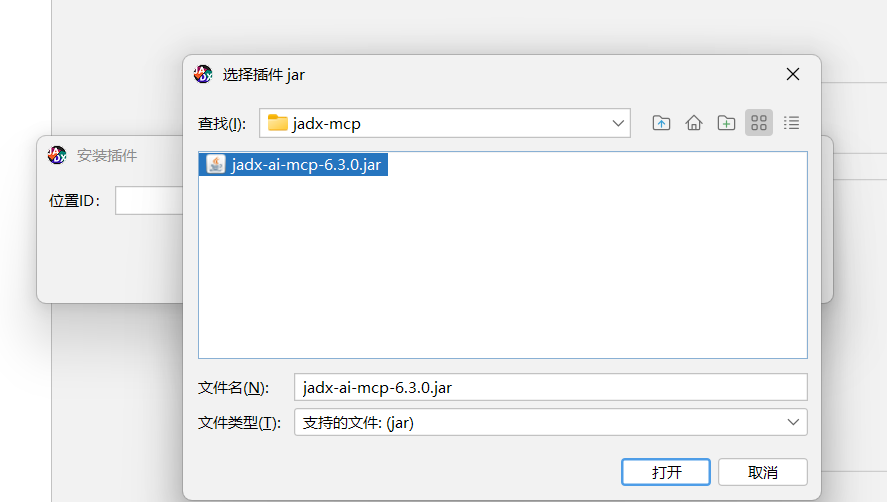

LLM和AI Agent的区别主要是在于处理事件的流程上有所不同，LLM更偏向于回答我们提出的问题，而AI Agent智能体则是能实际参与到我们需要完成的项目和工作上。

相比于LLM，agent是在LLM大模型的基础上加入了一套工具和工作流水线，而这些工具的调用最终要来源自MCP

比如用Cursor写一个贪吃蛇的项目



最终效果还是嘎嘎好的



# 一些好用的MCP

MCP（Model Context Protool模型上下文）意思是统一的工具接入标准，其实本质上是为了协调各个平台不同的工具接入规范所整理出来的一种统一标准

因为我主要是做一些代码审计和CTF解题方面的事情，所以网上搜集加上咨询师傅拿到了一些好用的MCP工具

参考文章：https://www.cnblogs.com/alexander17/p/19453947

## BurpSuite-mcp

mcp项目：https://github.com/portswigger/mcp-server

BurpSuite mcp服务其实就是让AI 可以直接调用 BurpSuite 的功能进行抓包发包，进行一些自动化渗透测试任务

```bash
git clone https://github.com/PortSwigger/mcp-server.git
cd mcp-server

./gradlew embedProxyJar
```

执行上述命令后会构建 Burp 扩展 JAR，注意这里对JDK版本有要求，比如JDK8在构建的时候会出现报错

我这里换成jdk17后显示网络有问题，还是手动下一个Gradle吧

```bash
gradle embedProxyJar
```

然后在bp中把生成的Jar包导入拓展



可以看到选项里多了一个MCP

接下来就是在Codex和Claude Code中配置MCP了

- Claude中配置MCP

这个很简单，在MCP页面下方就有一个install安装的选项，点击之后就会自动配置



也可以直接运行命令打开`%APPDATA%\Claude\claude_desktop_config.json`并写入

```json
    "mcpServers": {
        "burp": {
            "command": "E:\\BurpSuiteprofessional\\BurpSuitePro\\jre\\bin\\java.exe",
            "args": [
                "-jar",
                "C:\\Users\\23232\\AppData\\Roaming\\BurpSuite\\mcp-proxy\\mcp-proxy-all.jar",
                "--sse-url",
                "http://127.0.0.1:9876"
            ]
        }
    }
```

配置好后重启Claude，可以新建会话并提问`What Burp tools do you have access to?`，如果能列出burp的工具就可以了

- Codex中配置MCP

我是直接用的cli命令行去配的

```bash
codex mcp add burp -- "E:\BurpSuiteprofessional\BurpSuitePro\jre\bin\java.exe" -jar "C:\Users\23232\AppData\Roaming\BurpSuite\mcp-proxy\mcp-proxy-all.jar" --sse-url http://127.0.0.1:9876
```

当然也可以直接在`~/.codex/config.toml`中进行配置

```json
[mcp_servers.burp]
command = "E:\\BurpSuiteprofessional\\BurpSuitePro\\jre\\bin\\java.exe"
args = [
    "-jar",
    "C:\\Users\\23232\\AppData\\Roaming\\BurpSuite\\mcp-proxy\\mcp-proxy-all.jar",
    "--sse-url",
    "http://127.0.0.1:9876"
]
```

和Claude一样，验证一下



## jadx-mcp

BurpSuite mcp服务其实就是让AI 可以直接调用 jadx 的功能进行反编译分析操作

mcp项目：https://github.com/zinja-coder/jadx-ai-mcp/releases

下载`https://github.com/zinja-coder/jadx-ai-mcp`

然后在jadx中导入jar



因为是python编写的mcp，所以需要安装依赖

```bash
# 安装 uv（如果没有）
curl -LsSf https://astral.sh/uv/install.sh | sh

# 进入解压目录
cd jadx-mcp-server

# 可选：初始化虚拟环境
uv venv
# Windows:
.venv\Scripts\activate

# 安装依赖
uv pip install httpx fastmcp
```

然后就是Claude和Codex的配置了

- Claude配置

```json
{
    "mcpServers": {
        "jadx-mcp-server": {
            "command": "/path/to/uv",
            "args": [
                "--directory",
                "C:\\path\\to\\jadx-mcp-server\\",
                "run",
                "jadx_mcp_server.py",
                "--jadx-port",
                "8652"
            ]
        }
    }
}
```

- Codex配置

```json
[mcp_servers.jadx-mcp-server]
command = "/path/to/uv"
args = [
    "--directory",
    "C:\\path\\to\\jadx-mcp-server\\",
    "run",
    "jadx_mcp_server.py"
]
```

## js-reverse-mcp

JavaScript 逆向工程 MCP 服务器，让AI能自主调试和分析网页中的 JavaScript 代码。

mcp项目：https://github.com/zhizhuodemao/js-reverse-mcp/blob/main/README_zh.md

这个很简单，直接一行命令就行了

```bash
codex
codex mcp add js-reverse -- npx js-reverse-mcp

claude
claude mcp add js-reverse npx js-reverse-mcp
```

#  一些好用的SKILL

SKILL相比于MCP，更像是一种“菜谱”，它会规定像“这道菜需要翻炒5分钟后加入xxx调料”这样的行为规范

在 [openai官方](https://help.openai.com/en/articles/20001066-skills-in-chatgpt) 介绍中是这样的：

技能是可重复使用、可共享的工作流程，它们明确地告诉ChatGPT如何执行特定任务，使ChatGPT能够更好地、更一致地完成该任务。一个技能可以捆绑指令、示例，甚至代码。一旦技能被创建并安装，ChatGPT在需要时可以自动使用一个技能（或多个技能）。

一个技能可以包括您希望ChatGPT在您要求它执行特定任务时使用的指令和支持资源。对于更结构化的工作，技能可以包括一组每次都以相同方式运行的步骤。

首先Chatgpt最常用的SKILL就是Skill Creator了，这个是自带的系统SKILL

## Skill Creator

这个skill能帮你创建自己想要的SKILL，根据用户提出的要求，帮用户写一个符合要求的SKILL，可谓是很常用的了

## 办公四大件

[doc](https://github.com/openai/skills/tree/main/skills/.curated/doc)、[pdf](https://github.com/openai/skills/tree/main/skills/.curated/pdf)、[spreadsheet](https://github.com/openai/skills/tree/main/skills/.curated/spreadsheet)、[slides](https://github.com/openai/skills/tree/main/skills/.curated/slides)：这组是办公文档四件套，处理 Word、PDF、Excel、PPT 时很值，适合报告、表格分析、材料整理和导出。

安装也很简单，在Codex的技能里选择skill后就能看到了，当然也可以直接让agent给你安装

## playwright

[playwright](https://github.com/openai/skills/tree/main/skills/.curated/playwright)是用来做网页自动化的，也很方便，可以让AI通过代码或命令直接操作浏览器进行一些前端调试、抓取数据等一系列网页工作

这个也是可以直接在skill里面一键安装的

## PUA

项目地址：https://github.com/tanweai/pua/blob/main/README.zh-CN.md

这个SKILL在很多时候能帮你解决AI效率不高和工作质量低下的问题，比如有时候ai会将一个任务反复做两三遍，无论你如何想让他完成任务，他总是会给不到你想要的效果，这时候用pua会有出其不意的效果。
