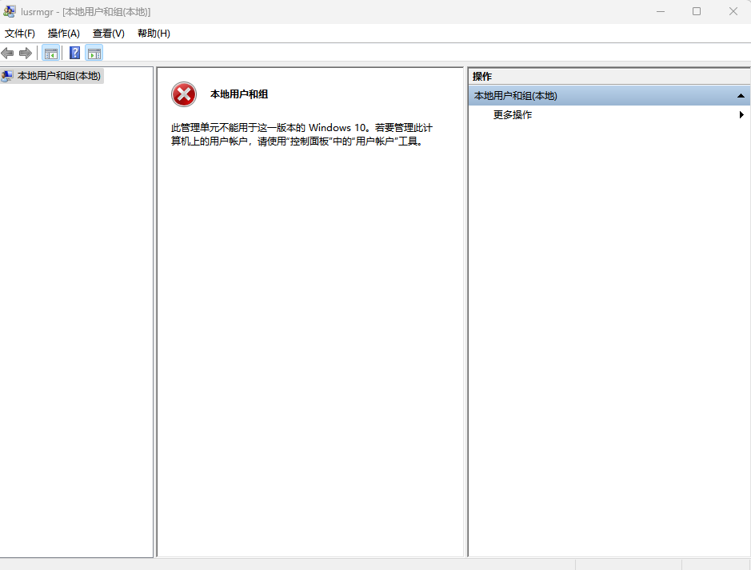
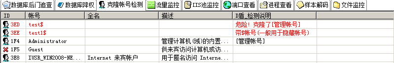
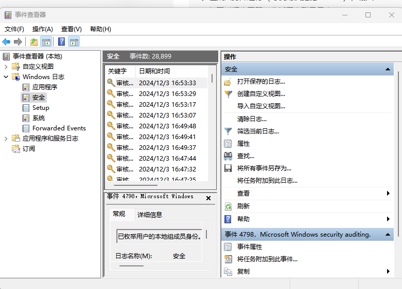
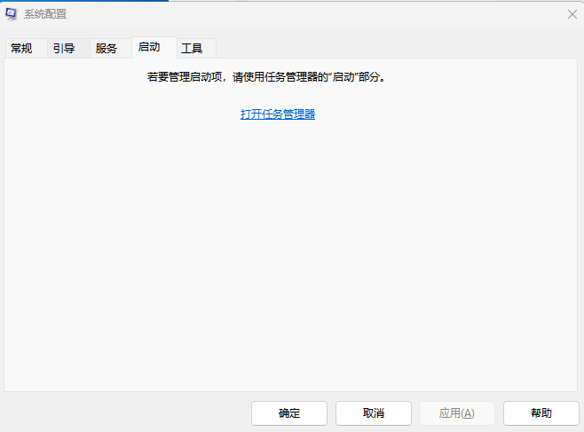
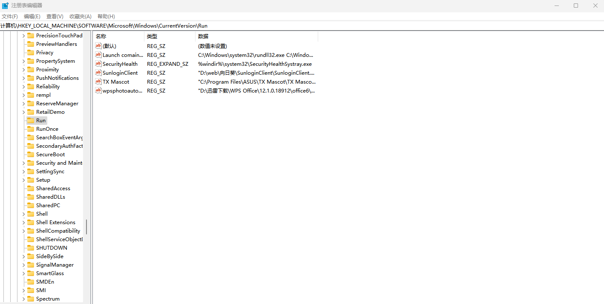
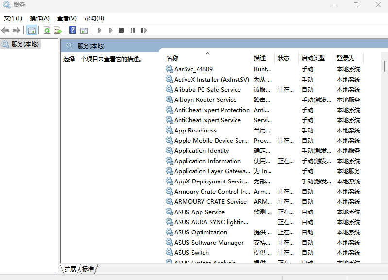
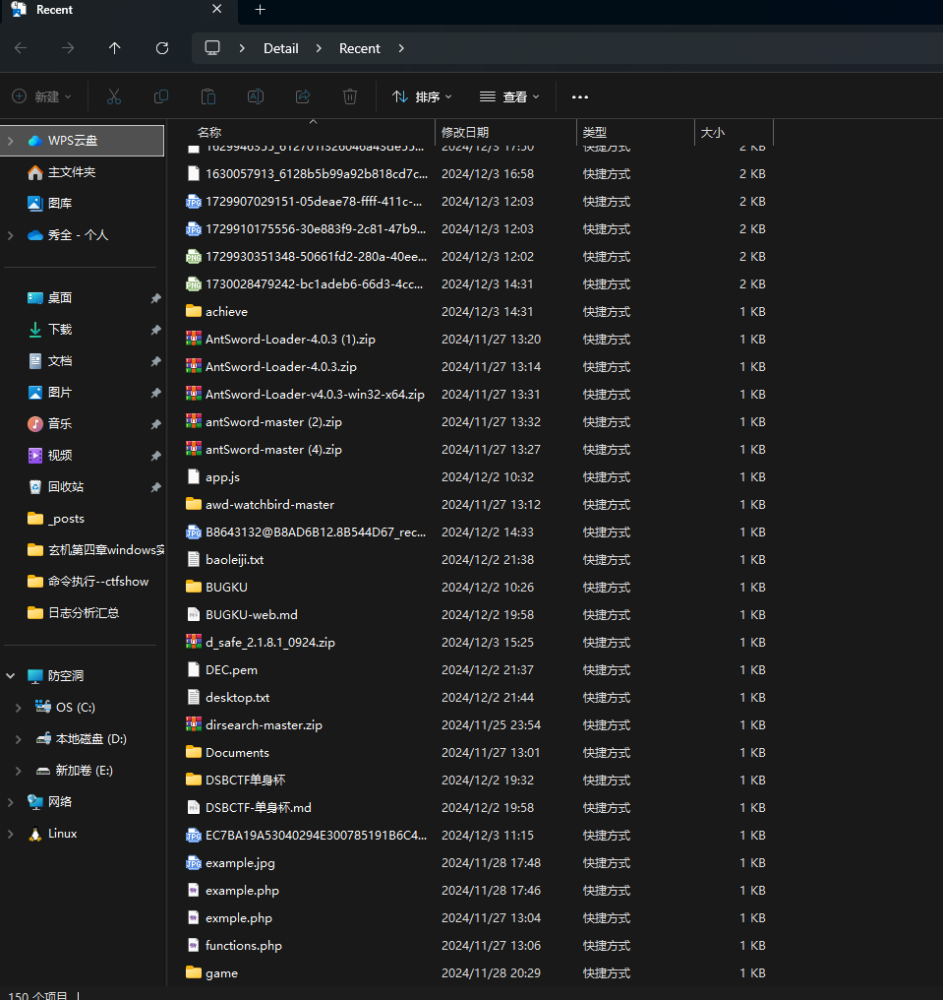

# 0x01前言

应急响应的话我认为是每一个学信安的人需要去学习的，所以我也是对此进行了响应的学习和积累，希望在以后发生真实的事件时能第一时间进行良好的反馈

借鉴师傅的文章:(这里的话还是有点多的，毕竟这个话题的分区还是蛮多的)

https://bypass007.github.io/Emergency-Response-Notes/Summary/%E7%AC%AC1%E7%AF%87%EF%BC%9AWindow%E5%85%A5%E4%BE%B5%E6%8E%92%E6%9F%A5.html

windows入侵排查:https://www.freebuf.com/articles/network/286270.html

windows分析事件日志:https://zone.huoxian.cn/d/868-windows

常见Windows事件ID状态码:https://www.cnblogs.com/chddt/p/13262385.html

# 0x02应急响应

在学习应急响应之前，我们首先要先了解什么是应急响应

## 什么是应急响应？

应急响应（Incident Response Service，IRS）是当企业系统遭受病毒传播、网络攻击、黑客入侵等安全事件导致信息业务中断、系统宕机、网络瘫痪，数据丢失、企业声誉受损，并对组织和业务运行产生直接或间接的负面影响时，急需第一时间进行处理，使企业的网络信息系统在最短时间内恢复正常工作，同时分析入侵原因、还原入侵过程、评估业务损失、溯源黑客取证并提出解决方案和防范措施，减少企业因黑客带来的相关损失。

## 常见的应急响应事件分类

web入侵：网页挂马、主页篡改、Webshell

系统入侵：病毒木马、勒索软件、远控后门

网络攻击：DDOS攻击、DNS劫持、ARP欺骗

讲完了基础的概念，接下来我们进行学习不同的一些应急响应的排查思路

## 一.windows入侵排查

如果我们的Windows操作系统被黑客入侵或攻击了，我们第一要做的不是怎么去做防御和应急响应，而是去分析黑客入侵的过程，然后根据可能的入侵点逐步去拆解分析，这样才能更快更高效的进行应急响应

### 分析入侵过程

攻击者入侵windows系统往往从弱口令、系统漏洞以及服务漏洞进行切入，获得一个普通的系统权限，再经过提权后进行创建启动项、修改注册表、植入病毒和木马等一系列操作，从而维持对目标主机的控制权(也就是我们说的权限维持)。而与此同时操作系统也会出现异常，包括账户、端口、进程、网络、启动、服务、任务以及文件等，系统运维人员可以根据以上异常情况来知道攻击者从何处入侵、攻击者以何种方式入侵以及攻击者在入侵后做了什么这几个问题的答案，从而为之后的系统加固、安全防护提供针对性建议。

暴力破解：针对系统有包括rdp、ssh、telnet等，针对服务有包括mysql、ftp等，一般可以通过超级弱口令工具、hydra进行爆破

漏洞利用：通过系统、服务的漏洞进行攻击，如永恒之蓝、Redis未授权访问等

流量攻击：主要是对目标机器进行dos攻击，从而导致服务器瘫痪

木马控制：主要分为webshell和PC木马，webshell是存在于网站应用中，而PC木马是进入系统进行植入。目的都是对操作系统进行持久控制

病毒感染：主要分挖矿病毒、蠕虫病毒、勒索病毒等，植入病毒后往往会影响受感染电脑的正常运作，或是被控制而不自知，电脑正常运作仅盗窃资料、或者被利用做其他用途等用户非自发引导的行为

这些的话我们后面会分别去具体讲解，这里的话就只是提一下攻击的方式

### 入侵排查思路

#### 1.1检查系统账号安全

攻击者面对windows系统会先从用户密码入手，首先是通过rdp服务对Administrator、Guest等默认账户的口令爆破，如果爆破没结果的话会固定密码，对用户账号进行爆破，再之后加入还是失败的话就是社工生成账号、密码字典，运气好那么就可以直接登录到管理员账号。在拿到系统权限后，权限维持则是必不可少的一步，创造一个新的管理账号方便后期登录查看就是一个不错的方法，当然为了增加隐蔽性该账号可以是影子账户。根据这几方面，检查看系统账号时可以重点关注弱口令、可疑账号、影子账户。

1.查看服务器是否存在弱口令，远程管理端口是否对公网开放。

- 据实际情况咨询相关服务器管理员。

- 尝试使用弱口令登录爆破

2.排查是否存在可疑账号或新增账号

- 打开 cmd 窗口，输入`lusrmgr.msc`命令，查看是否有新增/可疑的账号，如有管理员群组的（Administrators）里的新增账户，如有，请立即禁用或删除掉。



这里的话因为版本问题我只能去控制面板里面去进行查看

3.查看服务器是否存在隐藏账号、克隆账号。

- 打开注册表，查看管理员对应键值
  1、win+R，输入 regedit，打开注册表编辑器
  2、选择 HKEY_LOCAL_MACHINE/SAM/SAM，默认无法查看该选项内容，右键菜单选择权限，打开权限管理窗口
  3、选择当前用户（一般为 administrator），将权限勾选为完全控制，然后确定并关闭注册表编辑器
  4、再次打开注册表编辑器，即可选择 HKEY_LOCAL_MACHINE/SAM/SAM/Domains/Account/Users
  5、在 Names 项下可以看到实例所有用户名，如出现本地账户中没有的账户，即为隐藏账户，在确认为非系统用户的前提下，可删除此用户
- 使用D盾_web查杀工具，集成了对克隆账号检测的功能。




4.结合日志，查看管理员登录时间、用户名是否存在异常

- 检查方法：

  a、Win+R打开运行，输入“eventvwr.msc”，回车运行，打开“事件查看器”,分析用户登录日志



​	b、通过LogFusion查看日志记录


​	下载地址:https://www.logfusion.ca/

​	付费软件，可以有免费试用版

​	也可以用Log Parser

​	下载地址:http://www.logparser.com/

#### 1.2检查异常端口、进程

什么是端口?端口是一个数字标识符，用于在计算机网络中区分不同的通信会话。每个应用程序或服务都可以通过特定的端口号来接收和发送数据。端口号位于IP地址的基础上，形成一个完整的网络地址，使得多个应用程序可以在同一台计算机上同时运行而不会相互干扰。

端口作为计算机内部与外部数据交互的窗口，在攻击者眼里也是作为`香饽饽`的存在，在入侵系统后，攻击者可以在计算机上开启专属的端口来访问被害主机或植入病毒用于挖矿等，熟悉计算机的朋友应该都知道常用的端口也就那么几个，所以通过排查可疑端口能确定主机是否存在后门、是否被植入挖矿病毒等，再根据端口的PID对可疑进程对应的程序排查，确定是否为恶意程序。

1、检查端口连接情况，是否有远程连接、可疑连接

- 检查方法1：

  a、查看目前的网络连接，定位可疑的ESTABLISHED

  ```
  netstat -ano 
  ```

  b、根据netstat 定位出的pid，再通过tasklist命令进行进程定位 

  ```
  tasklist | findstr “PID”
  ```

- 检查方法2:

​	a、通过D盾web查杀工具进行端口查看


2.检查排查可疑的进程

- 检查方法1：

​	a、开始--运行--输入msinfo32，依次点击“软件环境→正在运行任务”就可以查看到进程的详细信息，比如进程路径、进程ID、文件创建日期、启动时间等。

- 检查方法2：

​	a、打开D盾_web查杀工具的进程查看，关注没有签名信息的进程

- 检查方法3：

​	a、通过微软官方提供的 Process Explorer 等工具进行排查

在查看可疑的进程及其子进程。可以重点观察以下内容：

> 1、没有签名验证信息的进程
> 2、没有描述信息的进程
> 3、进程的属主
> 4、进程的路径是否合法
> 5、CPU 或内存资源占用长时间过高的进程

#### 1.3检查启动项，计划任务，服务

什么是启动项、计划任务、服务？

启动项（Startup Items）

**定义**: 启动项是指在操作系统启动时自动加载和运行的程序或服务。它们通常在系统启动阶段被调用，以便提供系统所需的功能或用户应用程序。

**作用**:

- 快速访问常用程序：例如，某些聊天软件、云存储客户端等可以在启动时自动运行，便于用户快速使用。
- 提供系统服务：某些驱动程序和系统服务需要在启动时加载，以确保设备正常工作。

计划任务（Scheduled Tasks）

**定义**: 计划任务是指在指定时间或按特定条件自动执行的任务或程序。用户可以设置这些任务在系统空闲时，或者在特定的时间（如每天、每周等）运行。

**作用**:

- 自动化重复性工作：例如，定期备份文件、自动更新或运行维护脚本等。
- 资源管理：可以在系统负载较低的时段运行资源密集型任务，以提高效率。

服务（Services）

**定义**: 服务是指在后台运行的程序，通常没有用户界面，负责执行某些系统级或应用级的功能。服务在操作系统启动时加载，并在系统运行期间持续运行。

**作用**:

- 提供系统功能：例如，打印服务、网络服务、数据库服务等。
- 支持客户端应用程序：许多应用程序依赖于在后台运行的服务，例如Web服务器（如Apache或Nginx）和邮件服务器。

启动项、计划任务、服务是攻击者维持权限的惯用手段。在入侵windows计算机后，攻击者可以通过修改注册表、替换粘滞键程序在系统启动时就获得权限，也能够在管理员权限下设置计划任务，因为计划任务后门分为管理员权限和普通用户权限两种。管理员权限可以设置更多的计划任务，例如重启后运行等。也可以通过meterpreter创建后门服务。

1.排查异常启动项

- 检查方法1:

​	a、登录服务器，单击【开始】>【所有程序】>【启动】，默认情况下此目录在是一个空目录，确认是否有非业务程序在该目录下。

- 检查方法2:

​	a.win+R并键入msconfig，查看是否存在命名异常的启动项目，是则取消勾选命名异常的启动项目，并到命令中显示的路径删除文件。



- 检查方法3：

​	a.win+R并键入regedit，打开注册表，查看开机启动项是否正常，特别注意如下三个注册表项：

```
HKEY_CURRENT_USER\Software\Microsoft\Windows\CurrentVersion\run
HKEY_LOCAL_MACHINE\Software\Microsoft\Windows\CurrentVersion\Run
HKEY_LOCAL_MACHINE\Software\Microsoft\Windows\CurrentVersion\Runonce
```



- 检查方法4:

​	a.用安全软件查看启动项、开机时间管理等。

- 检查方法5:

​	a.组策略，win+R运行gpedit.msc


2.排查计划任务

- 检查方法1：

​	a.win+R并键入control打开控制面板

​	b.在 系统与安全 中查看计划任务属性，便可以发现木马文件的路径。

- 检查方法2:

​	a.打开命令行窗口并键入at检查计算机与网络上的其它计算机之间的会话或计划任务，如有，则确认是否为正常连接。在windows7及之前版本的操作系统中使用at命令进行调用，在从windows8版本开始的操作系统中使用schtasks命令调用。

- 检查方法3：

​	a.利用安全软件查看计划任务。

3.排除服务自启动

- 检查方法：win+R输入services.msc，注意服务状态和启动类型，检查是否有异常服务。



#### 1.4检查系统相关信息

前面我们有提到，攻击者入侵windows系统往往从弱口令、系统漏洞以及服务漏洞进行切入，那么如果我们系统本身存在漏洞，这种的危害和结果往往是最致命的，例如风靡全球的永恒之蓝漏洞，如果计算机存在永恒之蓝漏洞且未采取防护措施。那么攻击者就能直接通过MSF的漏洞利用程序获取目标windows系统的system权限。与此同时，攻击者在进入系统后往往也会留一些蛛丝马迹，如未将上传文件清除、浏览器浏览记录未删除、下载的文件未删除等。在检查系统相关信息时就需要重点关注系统本身存在的漏洞以及攻击者使用过的文件。

1.查看系统版本以及补丁信息

- 检查方法1：

​	a.win+R输入systeminfo，查看系统信息和补丁状态

- 检查方法2:

​	a.将内容导入文本，利用 windows-exploit-suggester 对系统补丁进行漏洞利用分析

```
python windows-exploit-suggester.py --database 2021-08-26-mssb.xls --systeminfo systeminfo.txt
```


2.查看可疑的目录和文件

- 检查方法1：

​	a.查看用户目录，是否存在新建用户目录

Window 2003版本 : C:\Documents and Settings 

Window 2003以后版本 : C:\Users\

- 检查方法2:

​	a.win+R输入%UserProfile%\Recent，分析最近打开分析可疑文件。



- 检查方法3:

​	a.、点击文件资源管理器，查找服务器内中的各个文件夹

​	b、将文件夹文件按时间进行排序，查找可疑文件，其中修改时间在创建时间之前的为可疑文件，也可以在搜索中搜索某一时间修改的文件。重点关注windows\system32的sethc.exe是否被替换为cmd程序

- 检查方法4:

​	a.排查回收站，浏览器下载目录以及历史记录

3.查看隐藏文件

1、win+R输入 control，进入控制面板
2、找到文件资源管理器选项，点击 查看 后，取消”隐藏受保护的操作系统文件“勾选，在隐藏文件和文件夹下面的单选选择显示隐藏的文件、文件夹和驱动器

4.得到发现webshell、远控木马的创建时间，如何找出同一时间范围内创建的文件？

 a、利用 Registry Workshop 注册表编辑器的搜索功能，可以找到最后写入时间区间的文件。

 b、利用计算机自带文件搜索功能，指定修改时间进行搜索。

#### 1.5日志分析

windows日志分为五类

- 应用程序日志--安装应用程序产生的事件
- 安全日志--主要记录用户操作产生的日志，例如登入/登出，清除日志等。
- Setup日志 #安装日志--记录安装中间件或者框架类似的事件产生的日志。
- 系统日志--主要记录关于windwos系统产生的事件id
- Forwarded Events日志 #转发日志--一般没什么值得看的

主要查看系统日志和web日志，通过日志可以帮助我们验证对入侵过程的判断和发现其他入侵行为。但它的前提则是日志记录已开启的情况下才能获取。这块具体会在之后的日志分析篇提到

进行Windows安全日志分析首先需要了解一些事件ID

系统日志

- 分析方法：

  a、前提：开启审核策略，若日后系统出现故障、安全事故则可以查看系统的日志文件，排除故障，追查入侵者的信息等。

  b、Win+R打开运行，输入“eventvwr.msc”，回车运行，打开“事件查看器”。

  C、可以直接分析(包括应用程序、安全、Setup、系统、事件)也可以导出应用程序日志、安全日志、系统日志，利用Log Parser进行分析。

##### 常见的Windows事件ID

- \### 用户操作事件id ### 
- 1102-清理审计日志 
- 1105-自动备份事件日志 
- 4624-帐户已成功登录 
- 4625-帐户登录失败 
- 4634-帐户被注销包括锁屏 
- 4647-用户发起注销 
- 4648-使用显式凭据尝试登录 
- 4649-检测到重播攻击 
- 4657-修改注册表值 
- 4665-尝试创建应用程序客户端上下文。 
- 4666-应用程序尝试了一个操作 
- 4670-对象的权限已更改 
- 4672-给新登录分配特权 
- 4674-尝试对特权对象执行操作 
- 4692-尝试备份数据保护主密钥 
- 4696-主要令牌已分配给进程 
- 4697-添加服务 

**计划任务事件id**

- 4698-已创建计划任务 
- 4699-计划任务已删除 
- 4700-已启用计划任务 
- 4701-计划任务已禁用 
- 4702-计划任务已更新 
- 4703-令牌权已经调整 
- 4704-已分配用户权限 
- 4705-用户权限已被删除 
- 4706-为域创建了新的信任 
- 4707-已删除对域的信任 
- 4709-IPsec服务已启动 
- 4710-IPsec服务已禁用 
- 4713-Kerberos策略已更改 
- 4717-系统安全访问权限已授予帐户 
- 4718-系统安全访问已从帐户中删除 
- 4719-系统审核策略已更改 
- 4720-已创建用户帐户 
- 4722-用户帐户已启用 
- 4723-尝试更改帐户的密码 
- 4724-尝试重置帐户密码 
- 4725-用户帐户已被禁用 
- 4726-用户帐户已删除 
- 4727-已创建启用安全性的全局组 
- 4728-已将成员添加到启用安全性的全局组中 
- 4729-成员已从启用安全性的全局组中删除 
- 4730-已删除启用安全性的全局组 
- 4731-已创建启用安全性的本地组 
- 4732-已将成员添加到启用安全性的本地组 
- 4733-成员已从启用安全性的本地组中删除 
- 4734-已删除已启用安全性的本地组 
- 4735-已启用安全性的本地组已更改 
- 4737-启用安全性的全局组已更改 
- 4738-用户帐户已更改 
- 4740-用户帐户已被锁定 
- 4741-已创建计算机帐户 
- 4742-计算机帐户已更改 
- 4743-计算机帐户已删除 
- 4744-已创建禁用安全性的本地组 
- 4745-已禁用安全性的本地组已更改 
- 4746-已将成员添加到已禁用安全性的本地组
-  4747-已从安全性已禁用的本地组中删除成员 
- 4756-已将成员添加到启用安全性的通用组中 
- 4765-SID历史记录已添加到帐户中 
- 4767-用户帐户已解锁 
- 4768-请求了Kerberos身份验证票证（TGT） 
- 4769-请求了Kerberos服务票证 
- 4770-更新了Kerberos服务票证 
- 4774-已映射帐户以进行登录 
- 4775-无法映射帐户以进行登录 
- 4776-域控制器尝试验证帐户的凭据 
- 4777-域控制器无法验证帐户的凭据 
- 4778-会话重新连接到Window Station 
- 4782-密码哈希帐户被访问 
- 4794-尝试设置目录服务还原模式管理员密码 
- 4797-试图查询帐户是否存在空白密码 
- 4798-枚举了用户的本地组成员身份。 
- 4799-已枚举启用安全性的本地组成员身份 
- 4800-工作站已锁定 
- 4801-工作站已解锁 
- 4802-屏幕保护程序被调用 

**域相关事件id** 

- 4820-Kerberos票证授予票证（TGT）被拒绝，因为该设备不符合访问控制限制 
- 4821-Kerberos服务票证被拒绝，因为用户，设备或两者都不符合访问控制限制 
- 4822-NTLM身份验证失败，因为该帐户是受保护用户组的成员 
- 4823-NTLM身份验证失败，因为需要访问控制限制 
- 4825-用户被拒绝访问远程桌面。默认情况下，仅当用户是Remote Desktop Users组或Administrators组的成员时才允许用户进行连接 

**防火墙策略事件id** 

- 4946-已对Windows防火墙例外列表进行了更改。增加了一条规则 
- 4947-已对Windows防火墙例外列表进行了更改。规则被修改了 
- 4948-已对Windows防火墙例外列表进行了更改。规则已删除 
- 5024-Windows防火墙服务已成功启动 
- 5025-Windows防火墙服务已停止  

**目录服务事件id** 

- 5137-已创建目录服务对象 
- 5140-访问了网络共享对象 
- 5142-添加了网络共享对象。 
- 5145-检查网络共享对象以查看是否可以向客户端授予所需的访问权限 
- 5156-Windows筛选平台允许连接 5157-Windows筛选平台已阻止连接

- 事件ID 7045 - 系统中安装了服务

突然出现未知服务可能表明恶意软件安装,因为许多类型的恶意软件会将自己安装为服务。

WEB访问日志

- 分析方法：

  a、找到中间件的web日志，打包到本地方便进行分析。

  b、推荐工具：Window下，推荐用 EmEditor 进行日志分析，支持大文本，搜索效率还不错。

   Linux下，使用Shell命令组合查询分析

#### 1.6工具查杀

推荐用D盾或者河马进行查杀

D盾_Web查杀：http://www.d99net.net/index.asp

河马webshell查杀：[http://www.shellpub.com](http://www.shellpub.com/)

# 0x03日志分析

## linux日志分析

### 日志介绍

在 Linux 系统中，日志记录了系统中包括内核、服务和其它应用程序等在内的运行信息。在我们解决问题的时候，日志是非常有用的，它可以帮助我们快速的定位遇到的问题。

### 常见日志文件

#### 日志文件的分类

1. 系统日志（System Logs）：
   - 这些日志记录了系统整体运行情况、错误信息等。
   - 常见的系统日志文件包括`/var/log/messages`、`/var/log/syslog`等。
   - 这些文件通常包含由系统服务rsyslog或systemd-journald管理的内核消息及各种系统程序消息。
2. 用户日志（User Logs）：
   - 用于记录用户操作、登录信息等。
   - 常见的用户日志文件包括`/var/log/wtmp`（记录所有用户的登录和注销信息）、`/var/log/lastlog`（记录每个用户最近一次登录时间）等。
3. 应用程序日志（Application Logs）：
   - 记录各个应用程序的运行情况、错误信息等。
   - 这些日志通常保存在应用程序的特定目录下，如Apache的日志文件`/var/log/apache2/access.log`（访问日志）和`error.log`（错误日志）。
   - 不同的应用程序可能使用不同的日志格式和命名方式。
4. 安全日志（Security Logs）：
   - 记录系统的安全事件信息，包括登录、权限变更等。
   - 常见的安全日志文件包括`/var/log/auth.log`（在Debian和Ubuntu系统中）、`/var/log/secure`（在Red Hat和CentOS系统中）等。
5. 内核日志（Kernel Logs）：
   - 记录Linux内核的运行信息、错误信息等。
   - 常见的内核日志文件包括`/var/log/kern.log`等。
   - 内核日志对于诊断内核相关的问题非常有用。
6. 软件包管理器日志（Package Manager Logs）：
   - 记录软件包管理器（如apt、yum等）的操作信息。
   - 常见的软件包管理器日志文件包括`/var/log/dpkg.log`（在Debian和Ubuntu系统中）、`/var/log/yum.log`（在Red Hat和CentOS系统中）等。
7. 其他特定日志文件：
   - 根据系统和安装的软件，可能还有其他特定的日志文件。
   - 例如，`/var/log/dmesg`记录了内核启动时的消息，`/var/log/cron`记录了定时任务的执行情况等。

日志默认存放位置：/var/log/
查看日志配置情况：more /etc/rsyslog.conf

#### 常见的日志文件

1. **`/var/log/syslog`** 或 **`/var/log/messages`**
   - **用途**: 记录系统范围内的通用日志消息，包括启动信息、设备事件和其他系统级事件。
   - **注意**: `syslog` 通常在 Debian 系及其衍生版本中使用，而 `messages` 通常在 Red Hat 系及其衍生版本中使用。
2. **`/var/log/auth.log`** 或 **`/var/log/secure`**
   - **用途**: 记录与系统认证相关的事件，如用户登录尝试、`sudo` 操作、SSH 登录等。
   - **注意**: `auth.log` 常用于 Debian 系，`secure` 常用于 Red Hat 系。
3. **`/var/log/kern.log`**
   - **用途**: 记录所有内核生成的消息。对于调试硬件相关问题非常有用。
4. **`/var/log/dmesg`**
   - **用途**: 记录系统引导期间内核检测到的硬件信息。可以使用 `dmesg` 命令查看。
5. **`/var/log/boot.log`**
   - **用途**: 记录系统启动过程中服务启动和停止的信息。
6. **`/var/log/cron.log`**
   - **用途**: 记录由 cron 和 at 调度服务执行的任务。
7. **`/var/log/maillog`** 或 **`/var/log/mail.log`**
   - **用途**: 记录邮件系统活动，如发送和接收的邮件、邮件服务器的错误等。
8. **`/var/log/httpd/`** 或 **`/var/log/apache2/`**
   - **用途**: 包含 Apache HTTP Server 的访问日志和错误日志。
9. **`/var/log/mysql/`**
   - **用途**: 包含 MySQL 服务器的日志文件，包括错误日志、查询日志等。
10. **`/var/log/faillog`**
    - **用途**: 记录用户登录失败的尝试和失败原因。
11. **`/var/log/lastlog`**
    - **用途**: 包含每个用户最后一次登录的时间信息。
12. **`/var/log/btmp`**
    - **用途**: 记录失败的登录尝试。可以使用 `lastb` 命令查看。
13. **`/var/log/wtmp`**
    - **用途**: 记录所有用户登录和注销事件。可以使用 `last` 命令查看

### 系统日志级别

数值越小，优先级越高，级别越高

| 数值 | 类型    | 说明                                                     |
| ---- | ------- | -------------------------------------------------------- |
| 0    | emerg   | 紧急情况，系统不可用（例如系统崩溃），一般会通知所有用户 |
| 1    | alert   | 需要立即修复，例如系统数据库损坏                         |
| 2    | crit    | 危险情况，例如硬盘错误，可能会阻碍程序的部分功能         |
| 3    | err     | 一般错误消息                                             |
| 4    | warning | 警告                                                     |
| 5    | notice  | 不是错误，但是可能需要处理                               |
| 6    | info    | 通用性消息，一般用来提供有用信息                         |
| 7    | debug   | 调试程序产生的信息                                       |

### 日志分析技巧

Linux下常用的shell命令如：find、grep 、[egrep](https://so.csdn.net/so/search?q=egrep&spm=1001.2101.3001.7020)、awk、sed

grep 查找含有某字符串的所有文件

```
grep -rn "hello,world!"
* : 表示当前目录所有文件，也可以是某个文件名
-r 是递归查找
-n 是显示行号
-R 查找所有文件包含子目录
-i 忽略大小写
```

```
1、定位有多少IP在爆破主机的root帐号：
cat /var/log/auth.log.1 | grep -a "Failed password for root" | awk '{print $11}' | sort | uniq -c | sort -nr | more
2.定位有哪些IP在爆破：
grep "Failed password" /var/log/secure|grep -E -o "(25[0-5]|2[0-4][0-9]|[01]?[0-9][0-9]?)\.
(25[0-5]|2[0-4][0-9]|[01]?[0-9][0-9]?)\.(25[0-5]|2[0-4][0-9]|[01]?[0-9][0-9]?)\.(25[0-5]|2[0-4]
[0-9]|[01]?[0-9][0-9]?)"|uniq -c
3.爆破成功登陆的IP
cat auth.log.1 | grep -a "Accepted " | awk '{print $11}' | sort | uniq -c | sort -nr | more
4.爆破用户名字典是什么？
cat auth.log.1 | grep -a "Failed password" |perl -e 'while($_=<>){ /for(.*?) from/; print "$1\n";}'|uniq -c|sort -nr
5.成功登录 root 用户的 ip 一共爆破了多少次
cat /var/log/auth.log.1 | grep -a "Failed password for root" | awk '{print $11}' | sort | uniq -c | sort -nr | more
6、登录成功的IP有哪些：
grep "Accepted " /var/log/secure | awk '{print $11}' | sort | uniq -c | sort -nr | more
7.登录成功的日期、用户名、IP：
grep "Accepted " /var/log/secure | awk '{print $1,$2,$3,$9,$11}'
分析用户日志
增加一个用户kali日志：
Jul 10 00:12:15 localhost useradd[2382]: new group: name=kali, GID=1001
Jul 10 00:12:15 localhost useradd[2382]: new user: name=kali, UID=1001, GID=1001,home=/home/kali, shell=/bin/bash
Jul 10 00:12:58 localhost passwd: pam_unix(passwd:chauthtok): password changed for kali
#grep "useradd" /var/log/secure
删除用户kali日志：
Jul 10 00:14:17 localhost userdel[2393]: delete user 'kali'
Jul 10 00:14:17 localhost userdel[2393]: removed group 'kali' owned by 'kali'
Jul 10 00:14:17 localhost userdel[2393]: removed shadow group 'kali' owned by 'kali'
# grep "userdel" /var/log/secure
5、su切换用户：
Jul 10 00:38:13 localhost su: pam_unix(su-l:session): session opened for user good by
root(uid=0)
sudo授权执行:
sudo -l
Jul 10 00:43:09 localhost sudo: good : TTY=pts/4 ; PWD=/home/good ; USER=root ;
COMMAND=/sbin/shutdown -r now

```

## mysql日志分析

常见的数据库攻击包括SQL注入，弱口令，提权，窃取备份等。对数据库日志进行分析，可以发现攻击行为，进一步还原攻击场景及追溯攻击源。

MySQL日志分类:

- 错误日志
- 查询日志
- 慢查询日志
- 事务日志(Redo log)
- 二进制日志
- 中继日志

### 1.开启日志分析
