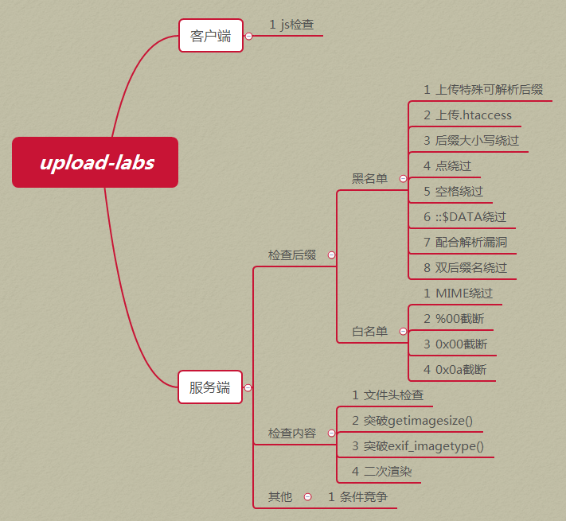
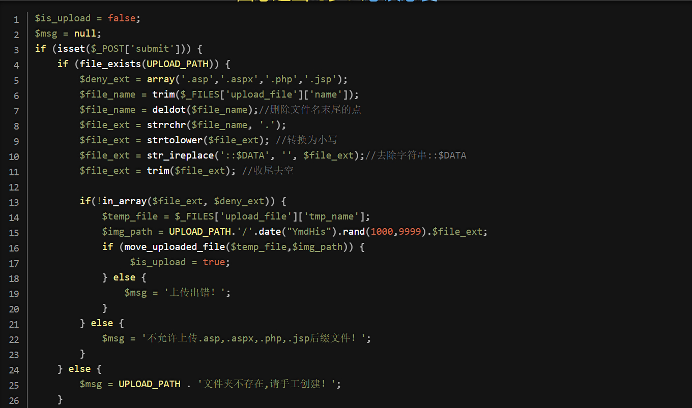
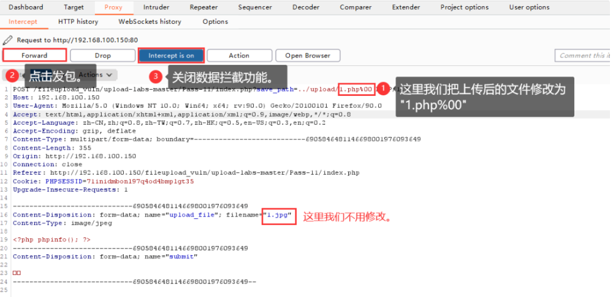

---
title: "文件上传的一些积累"
date: 2025-03-11T18:17:37+08:00
summary: "文件上传的一些积累"
url: "/posts/文件上传的一些积累/"
categories:
  - "文件上传的一些积累"
tags:
  - "文件上传"
draft: false
---

# 文件上传漏洞是什么？

**文件上传漏洞是指用户上传了一个可执行的脚本文件，并通过此脚本文件获得了执行服务器端命令的能力。**“文件上传”本身并没有问题，但是关键在于服务器怎么去处理上传的文件，如果服务器对上传的文件处理不够到位，没有做到一些恶意代码的过滤，就会导致很严重的后果

所以文件上传漏洞的利用条件就是

- 上传一个可执行文件或者恶意木马文件
- 服务器解析不合理，导致文件成功执行

需要额外注意的是，我们上传的文件需要可以被脚本语言所解析执行

- 说明一：如果对方服务器运行的是PHP环境，你不能上传一个JAVA的后门代码
- 说明二：上传文件的目录可以被脚本语言解析执行，如果没有执行权限也不行
- 说明三：一般文件上传后会返回一个地址，如果无法连接到也不能构成文件上传漏洞

1. **文件上传漏洞常存在的地方**就是网站中任何可以上传文件的地方例如上传头像，上传文档的口子

那么我们上传的文件通常就是webshell，后门文件

# webshell是什么？

具体的直接看文章

[一文详解Webshell](https://www.freebuf.com/articles/web/235651.html)

**Webshell是黑客经常使用的一种恶意脚本，其目的是获得对服务器的执行操作权限，比如执行系统命令、窃取用户数据、删除web页面、修改主页等**其实就是一种网页后门，通常用php，asp或jsp去编写

## 常见的一句话木马

- PHP

```
<?php eval($_GET['x'])?>
<?php assert($_POST['x']);?>
<?php eval($_POST['x'])?>
x就是我们传入的参数，也就是蚁剑的密码
```

- ASP

```
<%eval request("x")%>   
<%execute request("x")%>
```

- JSP

```
<%Runtime.getRuntime().exec(request.getParameter("x"));%>
```


# 文件上传的攻击方法

在目标网站中找到可以上传文件的地方->尝试上传.php .aspx等动态脚本语言文件测试其是否可以直接上传->需要绕过的地方进行绕过

# 文件上传校验以及绕过姿势

参考文章https://cloud.tencent.com/developer/article/1938541

分为前端(客户端)和后端(服务端)



## 客户端前端JavaScript校验

Web应用系统虽然对用户上传的文件进行了校验，但是校验是通过前端javascript代码完成的。

前端的验证通常只有对文件后缀名进行验证，通常可以通过以下两个方法去绕过

- 禁用浏览器JavaScript功能

从根源解决问题，如果JS被禁用了，那么前端的JavaScript校验就失效了，此时我们就可以正常上传恶意文件

- 在当前网站源码中删除相应的JavaScript代码

- BP上传改包

例如一个只存在前端校验的网站要求我们上传png文件，此时我们可以先将我们的恶意文件的后缀名改成png，然后在上传的时候将请求包用BP抓包，在请求包中将后缀名改成可以被web服务器解析的后缀名，达到一个绕过前端验证的效果

如何判断当前页面使用前端is的验证方式:

>    前端验证通过以后，表单成功提交后会通过浏览器发出─条网络请求，但是如果前端验证不成功，则不会发出这项网络请求;可以在浏览器的网络元素中查看是否发出了网络请求。

## 服务端后端校验

## 扩展名检测

通常是针对文件的扩展名后缀进行检测，主要是通过黑白名单进行过滤检测，如果不符全过滤规则则不允许上传。

首先是关于后缀名的解析漏洞

### 黑白名单检测绕过方法

黑名单就是对某些后缀名开启了过滤，要求只要是这些后缀名的文件都不被允许上传，例如upload-labs靶场的Pass-03



### 服务器解析漏洞

#### Apache解析漏洞

漏洞原理

`Apache` 解析文件的规则是`从右到左`开始判断解析，如果`后缀名`为`不可识别`文件解析，就再往左判断。比如`test.php.a.b`的“`.a`”和“`.b`”这两种后缀是`apache`不可识别解析，`apache`就会把`test.php.a.b`解析成`test.php`。

影响版本

```
apache 1.x  apache 2.2.x
```

#### .htaccess文件解析漏洞

**前提条件**：Apache 的 AllowOverride 指令来设置启动.htaccess文件的使用

htaccess 文件是一种用于 Apache Web 服务器的配置文件，它允许网站管理员对网站的访问权限、重写规则（URL 重写）、错误页面处理、MIME 类型设置以及其他服务器配置进行精细控制。这个文件通常位于网站的根目录或子目录中，并且其名称前面的点（.）表示它是一个隐藏文件，在大多数操作系统中默认不会显示。

需要注意，.htaccess文件的作用域为其所在目录与其所有的子目录，若是子目录也存在.htaccess文件，则会覆盖父目录的.htaccess效果。

如果**Web服务器是Apache**且**黑名单没有对.htaccess做限制**，那么可以上传.htaccess配置文件到目录中覆盖Apache的设置，可以通过配置执行webshell。

.htaccess 常见指令

- **AddType 指令**

```
AddType application/x-httpd-php .jpeg .png
```

**AddType 指令可以将给定的文件扩展名映射到指定的内容类型。**

这个指令的主要作用是文件上传时候如果我们上传一个后缀为png或者jpeg的文件，当它们被访问时，应该用PHP解析器来解析。意味着我们可以通过在这些后缀的文件中插入恶意php代码去达到我们的进攻目的

或者也可以这样设置

- **SetHandler指令**

```
plaintext
SetHandler application/x-httpd-php
```

**SetHandler 指令可以强制所有匹配的文件被一个指定的处理器处理。**

这个指令的主要作用是告诉 Apache，任何匹配的文件都应该通过 PHP 处理器来处理。当前目录及其子目录下所有文件都会被当做 php 解析。

攻击方法

如果我们的黑名单对所有php文件都进行了严格过滤，前面的绕过行不通，那么我们可以利用.htaccess文件的指令让Apache去执行我们的php文件，例如
上传一个.htaccess文件去覆盖原有的配置，文件内容:

```
AddType application/x-httpd-php .jpeg .png
```

我们可以上传一个后缀名为png或者jpeg的一句话木马，上传后Apache会根据配置文件里指定的后缀名文件按照php去解析执行，从而达到一个文件上传getshell的效果

#### .user.ini文件解析漏洞

首先了解一下什么是.user.ini文件

.user.ini 是 PHP 的用户级配置文件。这个文件允许用户在特定目录中自定义一些 PHP 配置选项，以覆盖全局 PHP 配置。

```
auto_prepend_file=top.html   ; 指定一个文件，自动包含在要执行的文件前。
auto_append_file=down.html  ; 指定一个文件，自动包含在要执行的文件后。
```

`.user.ini`和`.htaccess`一样是对当前目录的所以`php`文件的配置设置，即写了`.user.ini`和它同目录的文件会优先使用`.user.ini`中设置的配置属性。

攻击方法

为了利用auto_append_file，我们首先上传.user.ini内容为 `auto_append_file=“xxx”` xxx为我们上传的文件名，接着上传一个带木马的文件(根据黑名单过滤来确定可上传文件后缀名) 因为upload有php文件，所以这个php就会添加一个include(“shell.png”)，就会包含到木马,这样就在每个php文件上包含了我们的木马文件。

#### 目录解析漏洞

在 IIS5.x/6.0 中，在网站下建立文件夹的名字为*.asp、*.asa、*.cer、*.cdx 的文件夹，那么其目录内的任何扩展名的文件都会被IIS当做asp文件来解释并执行。例如创建目录 test.asp，那么 /test.asp/1.jpg 将被当做asp文件来执行。假设黑客可以控制上传文件夹路径，就可以不管上传后你的图片改不改名都能拿shell了

#### 文件解析漏洞

在 IIS5.x/6.0 中， 分号后面的不被解析，也就是说 a.asp;.jpg 会被服务器看成是a.asp。还有IIS6.0默认的可执行文件除了asp还包含这两种 .asa  .cer 。而有些网站对用户上传的文件进行校验，只是校验其后缀名。所以我们只要上传 *.asp;.jpg、*.asa;.jpg、*.cer;.jpg 后缀的文件，就可以通过服务器校验，并且服务器会把它当成asp文件执行。

#### IIS7.0 | IIS7.5 的解析漏洞

其实就是nginx对文件的检索规则，举个例子，当php遇到文件路径/1.jpg/2.txt/3.php时，若/1.jpg/2.txt/3.php不存在，则会去掉最后的/3.php，然后判断/1.jpg/2.txt是否存在，若存在，则把/1.jpg/2.txt当做文件/1.jpg/2.txt/3.php，若/1.jpg/2.txt仍不存在，则继续去掉/2.txt，以此类推。

### Windows下绕过后缀名验证

基于windows特性，同样的使用 1.php. . 1.php空格 1.php.空格  1.php::$DATA等格式都可以，可以绕过黑名单，也能让文件最终保存为 1.php 。

### 后缀名空格绕过

windows系统中，在文件名后面留一个空格，然后上传上去后空格会被自动的省略，对于有些过滤规则来说有没有空格是不一样的，但是对于操作系统来说，文件名的最后一个是空格会直接将其删除。

### 后缀名大小写绕过

- 文件后缀名大小写绕过：例如`*.Php`，`*.Jsp`

大小写绕过原理：windows系统下，对于文件名中的大小写不敏感，例如：text.php和Test.PHP是一样的，但是linux系统下。对于文件名中的大小写敏感。例如text.php和TexT.php就是不一样的
 基于windows可以上传一些安全漏洞

### 后缀名双写绕过

- 文件后缀名双写绕过：例如`*.pphphp`，检测会将中间的php过滤掉，替换成空格，然后会继续拼接成php，但这取决于检测的方法是什么样的

### **可解析后缀绕过**

```
asp: asa cer aspx
jsp: jspx jspf jspa 
php: php php3 php4 php5 phtml pht 
exe: exee 
```

### Windows命名机制绕过后缀

- 特殊文件后缀名绕过：**利用Windows的命名机制**，修改数据包里的文件名改为 test.php. 或者 test.asp_。在绕过上传之后windows系统会自动去掉 点和空格，但是Unix/Linux没有这个机制

### %00截断绕过

截断条件：PHP版本小于5.3.4，PHP的magic_quotes_gpc为OFF状态

在 PHP 中，`magic_quotes_gpc` 是一个配置选项，用于自动转义通过 GET、POST、COOKIE 等方式传递的数据。当 `magic_quotes_gpc` 的值为 `OFF` 时，PHP 不会自动对这些数据进行转义处理。

原理:由于文件上传后的`路径用户可以控制`，攻击者可以利用手动添加字符串标识符`0X00`的方式来将后面的拼接的内容`进行截断`，导致后面的内容无效，而且后面的内容又可以帮助我们绕过黑白名单的检测。

攻击方法



### `\.绕过后缀名检测`

参考文章：[文件上传upload-labs 第20关 pathinfo()函数](https://blog.csdn.net/YYYYU_ZHIZZZ/article/details/134287200)

如果PHP版本过高那空字符截断就无效了，只能用一个之前从未使用的方法，在两个系统环境使用有一点点区别。在windows下部署可以抓包保存文件名使用1.php/.    1.php\.   1.php/\.等，在linux下部署就只能用1.php/. 这个了。原因很简单，文件命名的时候 / \ 在windows是禁止的而 / 在linux也是禁止的，所以不会出现在文件名中最终保存还是1.php文件名。但是 \ 在linux是一个转义符号允许出现在文件名中，出现在后缀(1.php\.)那就没什么意义了。

​    关于为什么 / 后面要一个点，是因为pathinfo函数返回后缀名（最后一个点号后面的字符串）的时候会去除 / 和 \ 。如果使用1.php/的话，那么去除 / 后返回的真实的php后缀被读取到就会黑名单匹配上。加上一个点pathinfo函数读取的就是最后的点后面的字符串，点后面是空字符串不是有效拓展名它就返回为空，空就不会匹配黑名单以达到绕过黑名单目的。

​    再拓展一下 \. 在linux的作用。如果linux下有一个文件1.php\.的文件，使用php  1.php\.命令去执行，那么会认为文件名是 1.php. 就会找不到这个文件。正确做法是php '1.php\.'告诉系统 \ 是文件名一部分而不是转义符号。

## MIME 类型检测

MIME 类型（Multipurpose Internet Mail Extensions， 多用途互联网邮件扩展）是一种标准，用于表示文件的类型和格式，通常用于网络传输。MIME 类型主要由两部分组成：主类型和子类型，中间用斜杠（/）分隔。

常见的MIME类型:

> `text/plain` （纯文本） 
>
>  `text/html` （HTML文档）
>
>  `text/javascript` （js代码） 
>
>  `application/xhtml+xml` （XHTML文档） 
>
> `image/gif` （GIF图像） 
>
>  `image/jpeg` （JPEG图像） 
>
>  `image/png` （PNG图像）  
>
> `video/mpeg` （MPEG动画） 
>
>  `application/octet-stream` （二进制数据）  
>
> `application/pdf` （PDF文档）

这是在服务端的对文件头content-type的检测，大致代码实现如下

```php
//upload-labs(Pass-02)
<?php
if (($_FILES['upload_file']['type'] == 'image/jpeg') || ($_FILES['upload_file']['type'] == 'image/png') || ($_FILES['upload_file']['type'] == 'image/gif'))
```

在文件上传的过程中，服务端会针对我们上传的文件生成一个数组，其中有一项就是文件的类型type；根据黑白名单里和我们上传的文件的类型进行比较，符合要求才能上传文件到服务端

绕过方法

部分Web应用系统判定文件类型是通过`content-type字段`

```
抓包后更改Content-Type为允许的类型绕过该代码限制，比如将php文件的Content-Type:application/octet-stream修改为image/jpeg、image/png、image/gif等就可以
```

## 文件内容检测

### 文件头类型检测

在每一个文件（包括图片，视频或其他的非ASCII文件）的开头（十六进制表示）实际上都有一片区域来显示这个文件的实际用法，这就是文件头标志。我们可以通过16进制编辑器例如010editor打开文件，添加服务器允许的文件头以绕过检测。

常见的文件头：

```
gif: GIF89a(47 49 46 38 39 61)
jpg: jpeg: FF D8 FF
png: 89 50 4E 47 0D 0A
在进行文件头绕过时，我们可以把上面的文件头添加到我们的一句话木马内容最前面，达到绕过文件头检测的目的。
```

### 对关键字的绕过

- 如果过滤了php的话，我们可以换成别的一句话木马或者用短标签去进行绕过


这里的 `<?=` 是一个完整的输出语句，它会执行 `echo eval($_POST['cmd'])` 并输出其结果。由于 `<?=` 本身就是一个输出语句，因此在这种情况下，不需要额外的分号 `;` 来结束语句。

- 过滤了一句话木马中的`[]`方括号，可以用`{}`替换，在 PHP 中，使用方括号 `[]` 或花括号 `{}` 都可以用于访问数组的元素。

- 过滤括号，可以用内联执行去绕过

使用内联执行会将 ``内的输出作为前面命令的输入

- 当命令执行跟木马上传失败的时候，可以利用日志包含上传或者直接包含文件去进行读取

### getimagesize函数检测

一般文件内容验证使用getimagesize函数检测会判断文件是否是一个有效的文件图片，这时候就需要我们制作图片马去进行绕过

#### 图片马制作

准备一张图片，这里为`a.png`，和一个一句话木马`a.php`，通过以下命令合成一个图片马`3.php`

```
copy a.png /b + a.php /a 3.php  
/b:指定以二进制格式复制、合并文件，用于图像或者声音类文件
/a:指定以ascii格式复制、合并文件用于txt等文本类文件
```

**这条命令的意思是：通过`copy命令`，把`a.png`图片文件，以二进制文件形式添加到`a.php`文件中，以`ASCII文本文件`形式输出为`3.php`文件。**
