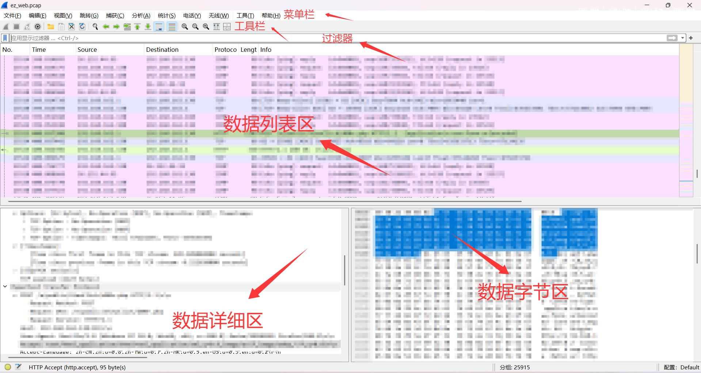
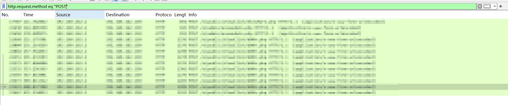
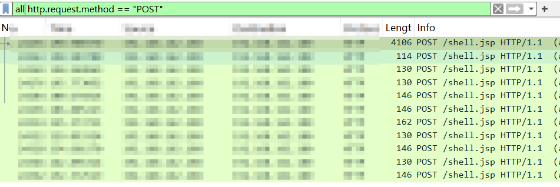
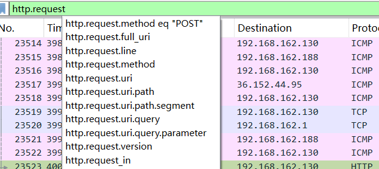
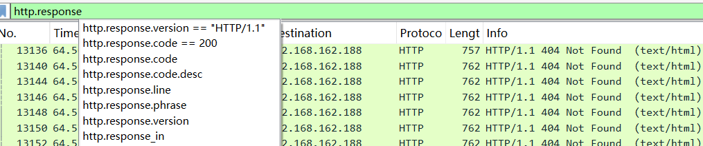
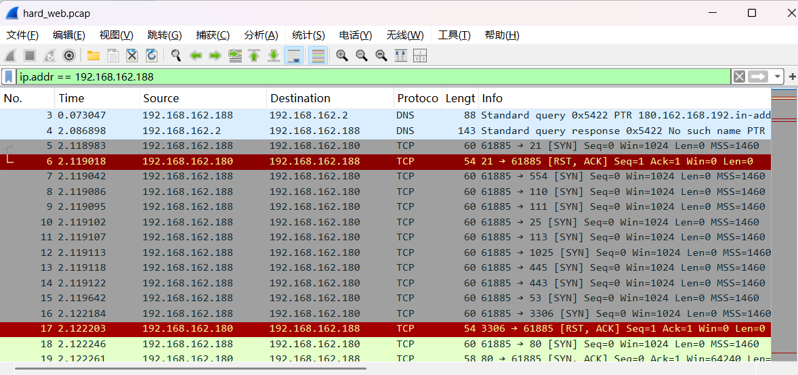
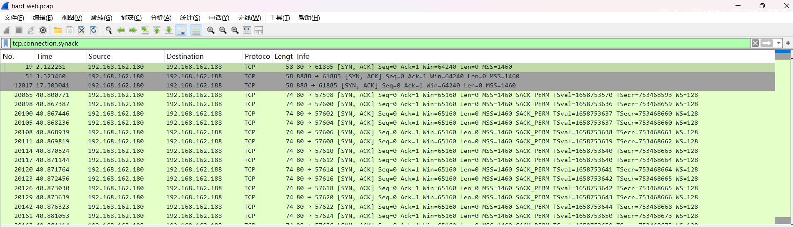

---
title: "流量分析"
date: 2025-04-22T00:24:08+08:00
summary: "流量分析"
url: "/posts/流量分析/"
categories:
  - "流量分析"
tags:
  - "流量分析"
draft: true
---

# Wireshark的使用

http contains "/system/index.php" &&http.request.method == "POST"

## **Wireshark抓包原理**

Wireshark使用的环境大致分为两种，一种是电脑直连互联网的单机环境，另外一种就是应用比较多的互联网环境，也就是连接交换机的情况。

「单机情况」下，Wireshark直接抓取本机网卡的网络流量；

「交换机情况」下，Wireshark通过端口镜像、ARP欺骗等方式获取局域网中的网络流量。

- 端口镜像：利用交换机的接口，将局域网的网络流量转发到指定电脑的网卡上。
- ARP欺骗：交换机根据MAC地址转发数据，伪装其他终端的MAC地址，从而获取局域网的网络流量。

## Wireshark抓包页面介绍

先来看看wireshark的页面



## 协议分级统计表

Wireshark 的 **协议分级统计表**（Protocol Hierarchy Statistics）是通过 **协议栈分层解析** 生成的，其分级逻辑遵循网络通信的 **OSI 模型** 或 **TCP/IP 协议栈**，从底层到上层逐层拆解数据包。

### **协议分级的核心逻辑**

#### **(1) 分层依据**

Wireshark 会按以下顺序解析每个数据包，并统计各层协议的占比：

```
1. **物理层**（如 Ethernet、Wi-Fi）  
2. **网络层**（如 IPv4/IPv6）  
3. **传输层**（如 TCP/UDP）  
4. **应用层**（如 HTTP/DNS/SMB）  
5. **载荷数据**（如 JSON/图片/加密流）
```

#### **(2) 统计规则**

- 按分组百分比

  ：统计某协议在所有数据包中出现的频率。

  - 例如：`TCP 占 99.45%` 表示 99.45% 的包包含 TCP 头。

- 按字节百分比

  ：统计某协议在所有字节中的占比（含下层协议头开销）。

  - 例如：`HTTP 占 56.3%` 表示 HTTP 及其载荷占总流量的 56.3%。

# Wireshark过滤器语法

参考文章：https://www.cnblogs.com/-wenli/p/13096718.html

官方文档：https://www.wireshark.org/docs/man-pages/wireshark-filter.html

## 比较运算符

```
eq, == 等于
ne, != 不等于
gt, > 大于
lt, < 小于
ge, >= 大于或等于
le, <= 小于或等于
```

举个例子

```
http.request.method eq "POST"
当然也可以用
http.request.method == "POST"
```



当然，一个字段在给定帧中可能出现不止一次。在这种情况下，相等性可以是严格的（所有字段必须匹配条件）或不严格的（任何字段必须匹配条件）。

```
eq, any_eq, == 任何字段必须相等
	all_eq, === 所有字段必须相等
ne, all_ne, != 所有字段必须不相等
    any_ne, !== 任何字段必须不相等
```

运算符“any”或“all”可以与任何比较运算符一起使用，例如

```
all http.request.method == "POST"
```



需要注意的是，“any”和“all”修饰符优先于“=”和“any_eq”等比较运算符。

## 搜索和匹配运算符

### contains运算符

```
contains 	协议、字段或切片是否包含值
```

关于contains：“contains”运算符允许过滤器搜索以字符串表示的字符序列或以字节数组表示的字节序列。“contains”运算符左侧的类型在任何隐式或显式转换后必须与右侧的类型相当。

例如我们希望搜索包含file_put_contents的HTTP协议流，可以使用以下过滤器

```
http contains "file_put_contents"
```

### matches, ~运算符

```
match,~		字符串是否匹配给定的不区分大小写的
             兼容perl的正则表达式
```

“matches”或“~”运算符允许将过滤器应用于指定的 Perl 兼容正则表达式 (PCRE2)。该正则表达式必须是双引号括起来的字符串。“matches”运算符的左侧必须是字符串，可以是隐式或显式转换为字符串的非字符串字段。默认情况下，匹配不区分大小写。

## 常见的过滤函数

```
upper(string-field) - 将字符串字段转换为大写
lower(string-field) - 将字符串字段转换为小写
len(field) - 返回字符串或字节字段的字节长度
count(field) - 返回帧中字段出现的次数
string(field) - 将非字符串字段转换为字符串
vals(field) - 将字段值转换为其值字符串
dec(field) - 将无符号整数转换为十进制字符串
hex(field) - 将无符号整数转换为十六进制字符串
max(f1,...,fn) - 返回最大值
min(f1,...,fn) - 返回最小值
abs(field) - 返回数字字段的绝对值
```

此时就可以看到，当upper() 和 lower() 在执行不区分大小写的字符串比较时很有用。例如结合matches

```
upper(http.request.method) == "POST"//将http.request.method的结果转化成大写后进行比较
```


## http模式过滤

### 过滤1：http.request



```
1：http.request.method -> 用于筛选特定 HTTP 请求方法的流量。
http.request.method == "GET"
http.request.method == "POST"

2.http.request.uri -> 用于捕获请求中的资源路径、查询参数（如 /api/data?id=123）。
http.request.uri == "/index.php"

3.http.request.full_uri -> 用于捕获 HTTP 请求的完整 URI（包括协议、主机名、路径、查询参数等）。如 https://example.com/api/data?id=123#section。
http.request.full_uri == "http://192.168.162.130:82/e/public/ViewClick/d00r.php"

4.http.request.uri.path -> 用于专门匹配 HTTP 请求 URI 中的路径部分（不包含查询参数、片段或主机名）。例如，对于 URI /api/data?id=123#section，http.request.uri.path 仅匹配 /api/data。
http.request.uri.path == "/api/data"

5.http.request.uri.query -> 用于专门匹配 HTTP 请求 URI 中的查询字符串（Query String），即 ? 后面的部分（不包含路径、片段或 ? 本身）。
http.request.uri.query == "?id=1"

6.http.request.version -> 用于匹配 HTTP 请求的协议版本（如 HTTP/1.0、HTTP/1.1 或 HTTP/2）。
http.request.version == "HTTP/1.0"

7.http.request.line -> 用于匹配 HTTP 请求的起始行（Request Line），即 HTTP 请求的第一行内容。
格式：
METHOD URI HTTP/VERSION
如（GET /index.html HTTP/1.1）
http.request.line == "GET /index.html HTTP/1.1"
```

### 过滤2：http.response



```
1.http.response.code -> 用于匹配 HTTP 响应的状态码（如 200、404、500 等）。
http.response.code == 200

2.http.response.line -> 用于匹配 HTTP 响应报文中的第一行（状态行），包含 协议版本、状态码和状态短语。例如：HTTP/1.1 200 OK 或 HTTP/2 404 Not Found。
http.response.line == "HTTP/1.1 200 OK"

3.http.response.version -> 用于匹配 HTTP 响应的协议版本（如 HTTP/1.1、HTTP/2 等）。
http.response.version == "HTTP/1.1"

4.http.response.code.desc -> 用于匹配 HTTP 响应状态码对应的文本描述（状态短语）。如 OK、Not Found、Internal Server Error 等），而非状态码本身。
http.response.code.desc == "OK"

5.http.response.phrase ->用于匹配 HTTP 响应状态行中的状态短语（Status Phrase），即状态码后的文本描述。如 OK、Not Found、Internal Server Error 等），而非状态码本身。
http.response.phrase == "OK"
```

## IP模式过滤

### 过滤1：ip.src和ip.dst

- **ip.src**：用于筛选 **IP 数据包的源地址（Source IP Address）**。

```
ip.src == 192.168.162.188
```

- **ip.dst**：用于筛选 **IP 数据包的目的地址（Source IP Address）**。

```
ip.dst == 192.168.162.188
```

### 过滤2：ip.addr

ip.addr 可以匹配数据包的源IP地址或目标IP地址，它会同时检查源IP和目标IP，只要其中一个匹配就会显示该数据包。

```
ip.addr == 192.168.162.188
```



### 过滤3：

## TCP模式过滤

### 过滤1：tcp.connection.synack

tcp.connection.synack 是 Wireshark 中用于分析 TCP 连接建立过程的一个特殊过滤器。它主要用于识别 TCP 三次握手中的 SYN-ACK 包。

这个过滤器用于显示 TCP 连接建立过程中的 SYN-ACK 数据包。



### 过滤2：tcp.dstport和tcp.srcport

1. tcp.dstport（目标端口）:
   - 用于过滤特定目标端口的 TCP 数据包
   - 示例：tcp.dstport == 80 （显示所有发往 HTTP 默认端口的数据包）
2. tcp.srcport（源端口）:
   - 用于过滤特定源端口的 TCP 数据包
   - 示例：tcp.srcport == 443 （显示所有来自 HTTPS 默认端口的数据包）

### 过滤3：tcp.port 

1. 基本功能：
   - 匹配源端口或目标端口中的任何一个
   - 等同于 (tcp.srcport or tcp.dstport)
2. 使用示例：
   - tcp.port == 80 这会显示所有源端口或目标端口为 80 的 TCP 数据包
3. 多端口过滤：
   - tcp.port in {80, 443, 8080} 这会显示端口为 80、443 或 8080 的所有 TCP 数据包
4. 范围过滤：
   - tcp.port >= 1024 and tcp.port <= 49151 显示所有使用注册端口范围的 TCP 数据包

# ifconfig命令

`ifconfig`（**Interface Configurer**）是 Linux/Unix 系统中用于查看和配置网络接口（网卡）信息的经典命令。

# 什么是内网ip

内网（**内部网络**，也称为**私有网络**或**局域网 LAN**）是指在一个组织、家庭或特定范围内建立的封闭网络环境，**不直接暴露在公共互联网上**。内网中的设备可以互相通信，但通常需要通过网关（如路由器、防火墙）才能访问外网（Internet）。

# 内网ip的范围

内网设备通常使用 **RFC 1918** 定义的私有 IP 地址范围，这些地址在互联网上不可路由：

- **`10.0.0.0/8`**（`10.0.0.0` ~ `10.255.255.255`）
- **`172.16.0.0/12`**（`172.16.0.0` ~ `172.31.255.255`）
- **`192.168.0.0/16`**（`192.168.0.0` ~ `192.168.255.255`）

# **IPv4 地址分类**

在早期的 IPv4 分类中，IP 地址被分为 **A、B、C、D、E 五类**，其中 **C 类地址** 适用于小型网络：

| **类别** | **IP 范围**                     | **默认子网掩码** | **适用场景**     |
| -------- | ------------------------------- | ---------------- | ---------------- |
| A 类     | `1.0.0.0` ~ `126.255.255.255`   | `255.0.0.0`      | 大型企业、运营商 |
| B 类     | `128.0.0.0` ~ `191.255.255.255` | `255.255.0.0`    | 中型企业、校园网 |
| **C 类** | `192.0.0.0` ~ `223.255.255.255` | `255.255.255.0`  | **小型局域网**   |
| D 类     | `224.0.0.0` ~ `239.255.255.255` | 无（组播地址）   | 视频会议、流媒体 |
| E 类     | `240.0.0.0` ~ `255.255.255.255` | 保留（实验用途） | 未分配           |

# 常见webshell工具流量特征

## 哥斯拉流量

**哥斯拉流量**是指使用哥斯拉（Godzilla）WebShell工具进行攻击时产生的网络流量。哥斯拉是一种功能强大的WebShell工具，常用于渗透测试和网络攻击。它的流量具有特定的特征，我们可以通过分析这些特征来检测和防御哥斯拉攻击。
