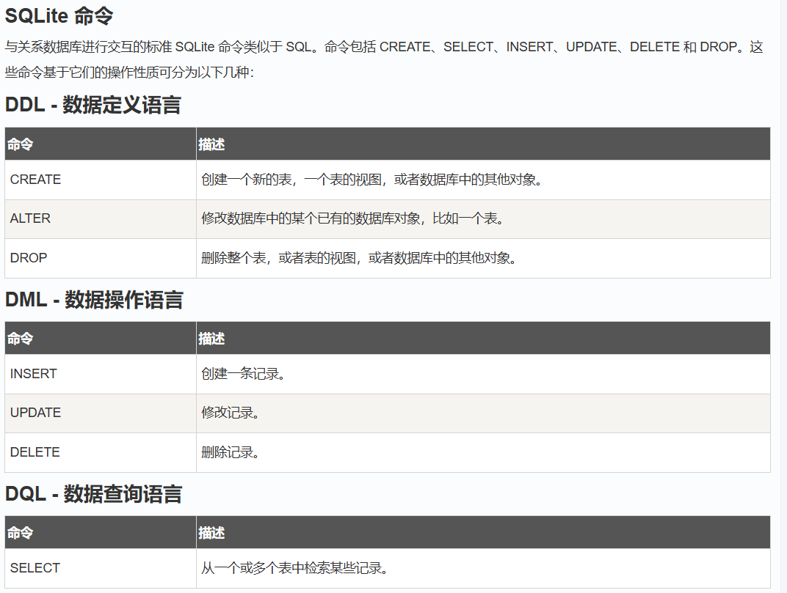
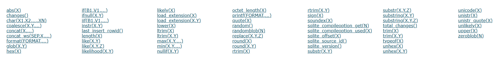

---
title: "深入浅出sql注入之sqlite"
date: 2025-08-29T11:09:17+08:00
summary: "深入浅出sql注入之sqlite"
url: "/posts/深入浅出sql注入之sqlite/"
categories:
  - "SQL注入"
tags:
  - "SQLITE注入"
draft: false
---

之前的文章写的太长了，感觉打开看的时候加载很慢，所以打算分章节去写了

# sqlite基础知识

基础知识参考:[菜鸟教程](https://www.runoob.com/sqlite/sqlite-tutorial.html)

什么是sqlite?

SQLite 是一个轻量级的关系型数据库管理系统（RDBMS），它以 C 语言编写，SQLite是一个进程内的库，实现了自给自足的、无服务器的、零配置的、事务性的 SQL 数据库引擎。

关于sqlite的命令，还是跟其他数据库一样，有DDL，DML，DQL三种命令



和mysql一样，我们先学习一些基础语句

## Sqlite服务搭建

这次测试我就放Windows里面测了，这样方便些

先去SQLite下载Windows版本的二进制文件，需要下载一个[sqlite-tools-win-x64-3500400.zip](https://www.sqlite.org/2025/sqlite-tools-win-x64-3500400.zip)和[sqlite-dll-win-x64-3500400.zip](https://www.sqlite.org/2025/sqlite-dll-win-x64-3500400.zip)

- `sqlite-tools-win-x64-*.zip` —— 包含 `sqlite3.exe` 命令行工具（推荐用于日常管理数据库）。
- 可选：`sqlite-dll-win-x64-*.zip` —— 包含 DLL，用于程序中调用 SQLite。

然后我们解压两个二进制文件，并将当前文件夹添加到PATH中

并在命令行中进行验证

```shell
C:\Users\23232>sqlite3
SQLite version 3.50.4 2025-07-30 19:33:53
Enter ".help" for usage hints.
Connected to a transient in-memory database.
Use ".open FILENAME" to reopen on a persistent database.
sqlite>
```

出现版本号以及命令行界面，就代表安装成功了

## sqlite命令

介绍几个sqlite比较重要的命令

首先就是`.help`命令，该命令可以获取所有的点命令及其介绍

```sqlite
sqlite> .help
.archive ...             Manage SQL archives
.auth ON|OFF             Show authorizer callbacks
.backup ?DB? FILE        Backup DB (default "main") to FILE
.bail on|off             Stop after hitting an error.  Default OFF
.cd DIRECTORY            Change the working directory to DIRECTORY
.changes on|off          Show number of rows changed by SQL
.check GLOB              Fail if output since .testcase does not match
.clone NEWDB             Clone data into NEWDB from the existing database
.connection [close] [#]  Open or close an auxiliary database connection
.crlf ?on|off?           Whether or not to use \r\n line endings
.databases               List names and files of attached databases
.dbconfig ?op? ?val?     List or change sqlite3_db_config() options
.dbinfo ?DB?             Show status information about the database
.dbtotxt                 Hex dump of the database file
.dump ?OBJECTS?          Render database content as SQL
.echo on|off             Turn command echo on or off
.eqp on|off|full|...     Enable or disable automatic EXPLAIN QUERY PLAN
.excel                   Display the output of next command in spreadsheet
.exit ?CODE?             Exit this program with return-code CODE
.expert                  EXPERIMENTAL. Suggest indexes for queries
.explain ?on|off|auto?   Change the EXPLAIN formatting mode.  Default: auto
.filectrl CMD ...        Run various sqlite3_file_control() operations
.fullschema ?--indent?   Show schema and the content of sqlite_stat tables
.headers on|off          Turn display of headers on or off
.help ?-all? ?PATTERN?   Show help text for PATTERN
.import FILE TABLE       Import data from FILE into TABLE
.indexes ?TABLE?         Show names of indexes
.intck ?STEPS_PER_UNLOCK?  Run an incremental integrity check on the db
.limit ?LIMIT? ?VAL?     Display or change the value of an SQLITE_LIMIT
.lint OPTIONS            Report potential schema issues.
.load FILE ?ENTRY?       Load an extension library
.log FILE|on|off         Turn logging on or off.  FILE can be stderr/stdout
.mode ?MODE? ?OPTIONS?   Set output mode
.nonce STRING            Suspend safe mode for one command if nonce matches
.nullvalue STRING        Use STRING in place of NULL values
.once ?OPTIONS? ?FILE?   Output for the next SQL command only to FILE
.open ?OPTIONS? ?FILE?   Close existing database and reopen FILE
.output ?FILE?           Send output to FILE or stdout if FILE is omitted
.parameter CMD ...       Manage SQL parameter bindings
.print STRING...         Print literal STRING
.progress N              Invoke progress handler after every N opcodes
.prompt MAIN CONTINUE    Replace the standard prompts
.quit                    Stop interpreting input stream, exit if primary.
.read FILE               Read input from FILE or command output
.recover                 Recover as much data as possible from corrupt db.
.restore ?DB? FILE       Restore content of DB (default "main") from FILE
.save ?OPTIONS? FILE     Write database to FILE (an alias for .backup ...)
.scanstats on|off|est    Turn sqlite3_stmt_scanstatus() metrics on or off
.schema ?PATTERN?        Show the CREATE statements matching PATTERN
.separator COL ?ROW?     Change the column and row separators
.session ?NAME? CMD ...  Create or control sessions
.sha3sum ...             Compute a SHA3 hash of database content
.shell CMD ARGS...       Run CMD ARGS... in a system shell
.show                    Show the current values for various settings
.stats ?ARG?             Show stats or turn stats on or off
.system CMD ARGS...      Run CMD ARGS... in a system shell
.tables ?TABLE?          List names of tables matching LIKE pattern TABLE
.timeout MS              Try opening locked tables for MS milliseconds
.timer on|off            Turn SQL timer on or off
.trace ?OPTIONS?         Output each SQL statement as it is run
.version                 Show source, library and compiler versions
.vfsinfo ?AUX?           Information about the top-level VFS
.vfslist                 List all available VFSes
.vfsname ?AUX?           Print the name of the VFS stack
.width NUM1 NUM2 ...     Set minimum column widths for columnar output
.www                     Display output of the next command in web browser
```

我们关注几个比较重要的命令

```sqlite
.help   获取可用的点命令的清单
.show   显示各种设置的当前值
.quite 退出SQLite 提示符
.databases 列出数据库的名称及其所依附的文件
.schema ?TABLE? 显示 CREATE 语句,例如.schema sqlite_master
```

## sqlite语法

### sqlite注释

SQL 注释以两个连续的 `-` 字符（ASCII 0x2d）开始，并扩展至下一个换行符（ASCII 0x0a）或直到输入结束，以先到者为准。

也可以使用 C 风格的注释，以 `"/*"` 开始，并扩展至下一个 `"*/"` 字符对或直到输入结束，以先到者为准。SQLite的注释可以跨越多行。

### 语句的开始和结束

所有的 SQLite 语句可以以任何关键字开始，如 SELECT、INSERT、UPDATE、DELETE、ALTER、DROP 等，所有的语句以分号 **;** 结束。

### 1、创建数据库

在sqlite中，每个数据库都是以文件的形式存在的

所以我们要创建数据库的语法就是：

```sqlite
sqlite3 test.db
```

然后我们在当前目录下可以看到创建的数据库文件

```sqlite
E:\SQLite>sqlite3 test.db
SQLite version 3.50.4 2025-07-30 19:33:53
Enter ".help" for usage hints.
sqlite> .databases;
Error: unknown command or invalid arguments:  "databases;". Enter ".help" for help
sqlite> .databases
main: E:\SQLite\test.db r/w
sqlite> .quit

E:\SQLite>dir
 驱动器 E 中的卷是 web
 卷的序列号是 3492-78F9

 E:\SQLite 的目录

2025/08/29  15:17    <DIR>          .
2025/07/31  03:48         3,176,960 sqldiff.exe
2025/08/29  14:59         1,344,617 sqlite-dll-win-x64-3500400.zip
2025/08/29  14:59         6,430,656 sqlite-tools-win-x64-3500400.zip
2025/07/31  03:49             8,280 sqlite3.def
2025/07/31  03:49         3,232,256 sqlite3.dll
2025/07/31  03:48         3,885,056 sqlite3.exe
2025/07/31  03:48         4,439,040 sqlite3_analyzer.exe
2025/07/31  03:49         3,122,688 sqlite3_rsync.exe
2025/08/29  15:17                 0 test.db
               9 个文件     25,639,553 字节
               1 个目录 58,361,475,072 可用字节
```

此时生成的test.db数据库文件将被sqlite引擎用作数据库，并且可以发现在创建了数据库文件后会自动进入sqlite提示符

#### .open命令

另外我们也可以在sqlite的命令行中用.open去打开数据库文件，如果数据库存在则打开他，不存在则创建

```sqlite
.open test.db
```

这里的话会直接进入该数据库文件

#### .databases命令

`.databases` 是一个命令，用于显示当前已连接数据库的列表及其相关信息。

```sqlite
sqlite> .open test.db
sqlite> .databases
main: E:\SQLite\test.db r/w
```

#### .quit命令

该命令会退出sqlite提示符

#### .dump命令

`.dump` 命令用于导出数据库或特定表的内容


上面结果说明当前数据库没有表或数据

### 2、 附加(选择)数据库

如果我们有多个数据库文件可以操作使用，而我们想要使用其中一个的时候，我们就可以用SQLite 的 **ATTACH DATABASE** 语句来选择一个特定的数据库，使用该命令后，所有的 SQLite 语句将在附加的数据库下执行。

其作用是什么呢？前面我们可以知道，sqlite中每个数据库就代表一个文件，那我们一次也只能打开一个数据库文件，此时如果我们希望用到其他数据库的内容该怎么办呢？这时候就可以用到附加数据库去进行处理了

举个例子，假如我们需要对两个数据库 `user.db` 和 `new.db`，我们需要将user的表复制到new.db中

```sqlite
ATTACH DATABASE 'new.db' AS newdb;
CREATE TABLE newdb.users AS SELECT * FROM main.users;
```

在 `newdb` 数据库里创建一张新表 `users`，并把 `main.users` 表里的所有数据完整复制过去。

#### ATTACH DATABASE命令

基础语法

```sqlite
ATTACH DATABASE file_name AS database_name;
```

我们测试一下

```sqlite
sqlite> attach database 'test.db' as 'TEST';
sqlite> .databases
main: E:\SQLite\test.db r/w
TEST: E:\SQLite\test.db r/w
```

为什么这里有两个呢？其实是因为当我们用open命令去打开一个数据库文件的时候，sqlite会自动将该数据库文件挂载到main中，而后面我们自己附加的数据库设置为TEST没问题

#### .database命令

该命令会显示当前 SQLite 连接中所有已附加的数据库

```sqlite
sqlite> attach database 'test.db' as 'TEST';
sqlite> .databases
main: E:\SQLite\test.db r/w
TEST: E:\SQLite\test.db r/w
sqlite> .database
main: E:\SQLite\test.db r/w
TEST: E:\SQLite\test.db r/w
```

其实区别不大

> [!IMPORTANT]
>
> 数据库名称 **main** 和 **temp** 被保留用于主数据库和存储临时表及其他临时数据对象的数据库。这两个数据库名称可用于每个数据库连接，且不应该被用于附加，否则将得到一个警告消息

```sqlite
sqlite> attach database 'test.db' as 'main';
Runtime error: database main is already in use
sqlite> attach database 'test.db' as 'temp';
Runtime error: database temp is already in use
```

可以看到这两个名称都是被占用了的

### 3、分离数据库

和上面的附加数据库相反，分离数据库主要是将我们附加的数据库从当前会话中删除

#### DETACH DATABASE命令

*SQLite 的* **DETACH DATABASE** *语句是用来把命名数据库从一个数据库连接分离和游离出来，连接是之前使用 ATTACH 语句附加的。*但是我们无法分离main或temp数据库

基础语法

```sqlite
DETACH DATABASE 别名;
```

举个例子

我们先附加两个数据库`TEST`和`TEST2`

```sqlite
sqlite> attach database 'test.db' as 'TEST2'
   ...> ;
sqlite> .database
main: E:\SQLite\test.db r/w
TEST: E:\SQLite\test.db r/w
TEST2: E:\SQLite\test.db r/w
```

然后我们尝试将TEST2给分离出去

```sqlite
sqlite> detach database 'TEST2';
sqlite> .database
main: E:\SQLite\test.db r/w
TEST: E:\SQLite\test.db r/w
```

此时不难看到，之前的TEST是不会受影响的，仍然和main保持连接

### 4、创建数据表

#### CREATE TABLE命令

SQLite 的 **CREATE TABLE** 语句用于在任何给定的数据库创建一个新表。创建基本表，涉及到命名表、定义列及每一列的数据类型。其实和mysql的创建表是一样的

语法

```sqlite
CREATE TABLE database_name.table_name(
   column1 datatype  PRIMARY KEY(one or more columns),
   column2 datatype,
   column3 datatype,
   .....
   columnN datatype,
);

```

好了，又该了解一下数据类型了

#### sqlite数据类型

https://www.runoob.com/sqlite/sqlite-data-types.html

常用的数据类型主要有五大类

| 数据类型 | 描述                                                         |
| :------- | :----------------------------------------------------------- |
| NULL     | 值是一个 NULL 值。                                           |
| INTEGER  | 值是一个带符号的整数，根据值的大小存储在 1、2、3、4、6 或 8 字节中。 |
| REAL     | 值是一个浮点值，存储为 8 字节的 IEEE 浮点数字。              |
| TEXT     | 值是一个文本字符串，使用数据库编码（UTF-8、UTF-16BE 或 UTF-16LE）存储。 |
| BLOB     | 值是一个 blob 数据，完全根据它的输入存储。                   |

往细分的话就是很多小类了，可以直接看菜鸟教程中的亲和类型

然后还要sqlite的约束

#### sqlite约束

https://www.runoob.com/sqlite/sqlite-constraints.html

约束其实就是用来限制插入到表中的数据类型

常用的约束

- **NOT NULL 约束**：确保某列不能有 NULL 值。
- **DEFAULT 约束**：当某列没有指定值时，为该列提供默认值。
- **UNIQUE 约束**：确保某列中的所有值是不同的。
- **PRIMARY Key 约束**：唯一标识数据库表中的各行/记录。
- **CHECK 约束**：CHECK 约束确保某列中的所有值满足一定条件。

介绍完了，我们回到创建数据表中

尝试创建一个数据表

```sqlite
sqlite> create table helloworld(
(x1...> id integer primary key not null,
(x1...> username text not null,
(x1...> password text not null
(x1...> );
```

#### **.tables** 命令

**.tables** 命令可以用于 **显示当前数据库里所有表的列表**。

我们看看刚刚创建的数据表是否存在

```sqlite
sqlite> create table helloworld(
(x1...> id integer primary key not null,
(x1...> username text not null,
(x1...> password text not null
(x1...> );
sqlite> .tables
TEST.helloworld  helloworld
```

1. **主数据库表**：`helloworld` 是您在当前数据库中创建的表，属于主数据库（通常是 `main` 数据库）。
2. **附加数据库表**：`TEST.helloworld` 表示在一个名为 `TEST` 的附加数据库中的 `helloworld` 表。

#### **.schema** 命令

**.schema** 命令可以用于查看数据库对象的 **所有表、索引、触发器等对象的创建 SQL**。**创建 SQL**（通常指 **CREATE 语句**）是用来 **创建数据库对象** 的 SQL 命令。

```sqlite
sqlite> .schema
CREATE TABLE helloworld(
id integer primary key not null,
username text not null,
password text not null
);
CREATE TABLE TEST.helloworld(
id integer primary key not null,
username text not null,
password text not null
);
```

### 5、删除数据表

#### DROP TABLE 命令

*SQLite 的* **DROP TABLE** *语句用来删除表定义及其所有相关数据、索引、触发器、约束和该表的权限规范。*

基本语法

```sqlite
drop  table database_name.table_name;
```

例如把刚刚的helloworld表删除

```sqlite
sqlite> .tables
helloworld
sqlite> drop table helloworld;
sqlite> .tables
sqlite>
```

### 6、插入数据

#### INSERT INTO 命令

SQLite 的 **INSERT INTO** 语句用于向数据库的表中添加新的数据行。

基础语法

```sqlite
INSERT INTO TABLE_NAME [(column1, column2, column3,...columnN)]  
VALUES (value1, value2, value3,...valueN);
```

例如重新创建helloworld数据表后insert into插入数据

```sqlite
sqlite> insert into helloword (id,username,password)
   ...> values(1,'wanth3f1ag','123456');
```

如果我们不是对指定的字段进行添加数据的话，也可以直接写成这种格式

```sqlite
sqlite> insert into helloword 
   ...> values(2,'test1','123123123');
```

#### SQLite的单双引号

在 SQLite 中， **双引号 `"` 是用来引用标识符（例如表名、列名）的**，而 **单引号 `'` 才是用来表示字符串字面值** 的。

### 7、查询数据

#### SELECT 命令

SQLite 的 **SELECT** 语句用于从 SQLite 数据库表中获取数据，以结果表或结果集的形式返回数据。

基础语法

```sqlite
SELECT column1, column2, columnN FROM table_name;
```

如果是全部字段的话

```sqlite
SELECT * FROM table_name;
```

例如刚刚插入的数据

```sqlite
sqlite> .header on
sqlite> .mode column
sqlite> select * from helloword;
id  username    password
--  ----------  ---------
1   wanth3f1ag  123456
2   test1       123123123
```

#### `.header on` 命令

```sqlite
.header默认是off，当它开启时，执行 SELECT 查询时会在结果的第一行显示列名。
如果 .header off，结果会变成：
1   wanth3f1ag  123456
2   test1       123123123
```

#### `.mode column` 命令

```sqlite
是用来设置输出格式的，column 模式表示以“列对齐”的方式输出结果。

其他常见的 .mode 值还有：

.mode list → 逗号分隔（默认）

.mode csv → 适合导出 CSV 文件

.mode line → 每一行数据按列逐项换行显示

.mode json → 以 JSON 格式输出（较新版本支持）
```

### SQLite运算符

运算符主要是用于SQLite语句中的WHERE子语句指定条件的

- 算术运算符
- 比较运算符
- 逻辑运算符
- 位运算符

这里就不介绍了，很基础的东西 https://www.runoob.com/sqlite/sqlite-operators.html

主要看看逻辑运算符

| 运算符  | 描述                                                         |
| :------ | :----------------------------------------------------------- |
| AND     | AND 运算符允许在一个 SQL 语句的 WHERE 子句中的多个条件的存在。 |
| BETWEEN | BETWEEN 运算符用于在给定最小值和最大值范围内的一系列值中搜索值。 |
| EXISTS  | EXISTS 运算符用于在满足一定条件的指定表中搜索行的存在。      |
| IN      | IN 运算符用于把某个值与一系列指定列表的值进行比较。          |
| NOT IN  | IN 运算符的对立面，用于把某个值与不在一系列指定列表的值进行比较。 |
| LIKE    | LIKE 运算符用于把某个值与使用通配符运算符的相似值进行比较。  |
| GLOB    | GLOB 运算符用于把某个值与使用通配符运算符的相似值进行比较。GLOB 与 LIKE 不同之处在于，它是大小写敏感的。 |
| NOT     | NOT 运算符是所用的逻辑运算符的对立面。比如 NOT EXISTS、NOT BETWEEN、NOT IN，等等。**它是否定运算符。** |
| OR      | OR 运算符用于结合一个 SQL 语句的 WHERE 子句中的多个条件。    |
| IS NULL | NULL 运算符用于把某个值与 NULL 值进行比较。                  |
| IS      | IS 运算符与 = 相似。                                         |
| IS NOT  | IS NOT 运算符与 != 相似。                                    |
| \|\|    | 连接两个不同的字符串，得到一个新的字符串。                   |
| UNIQUE  | UNIQUE 运算符搜索指定表中的每一行，确保唯一性（无重复）。    |

### 8、WHERE子语句

*SQLite的* **WHERE** *子句用于指定从一个表或多个表中获取数据的条件。*

基础语法

```sqlite
SELECT column1, column2, columnN 
FROM table_name
WHERE [condition]
```

例如我们希望查询id小于2以及小于3的数据内容

```sqlite
sqlite> select * from helloword where id < 2;
id  username    password
--  ----------  --------
1   wanth3f1ag  123456
sqlite> select * from helloword where id < 3;
id  username    password
--  ----------  ---------
1   wanth3f1ag  123456
2   test1       123123123
```

### 9、更新数据

#### UPDATE命令

SQLite的**UPDATE**语句用于修改表中已有的数据行的数据

基础语法

```sqlite
UPDATE table_name
SET column1 = value1, column2 = value2...., columnN = valueN
WHERE [condition];
```

举个例子

```sqlite
sqlite> select * from helloword;
id  username    password
--  ----------  ---------
1   wanth3f1ag  123456
2   test1       123123123
sqlite> update helloword
   ...> set username = 'test2',password = '456456456' where id = 1;
sqlite> select * from helloword;
id  username  password
--  --------  ---------
1   test2     456456456
2   test1     123123123
```

更新数据最好结合where子语句去准确定位需要更新的数据行，如果没有的话就是更新所有的数据

举个例子

```sqlite
sqlite> select * from helloword;
id  username  password
--  --------  ---------
1   test2     456456456
2   test1     123123123
sqlite> update helloword
   ...> set username = 'All_user' , password = '123456';
sqlite> select * from helloword;
id  username  password
--  --------  --------
1   All_user  123456
2   All_user  123456
```

可以看到这里所有的数据行都更新了

### 10、删除数据

#### DELETE 命令

*SQLite 的* **DELETE** *查询用于删除表中已有的记录。可以使用带有 WHERE 子句的 DELETE 查询来删除选定行，否则所有的记录都会被删除。*

基础语法

```sqlite
DELETE FROM table_name
WHERE [condition];
```

我们尝试删除刚刚的id为2的数据

```sqlite
sqlite> select * from helloword;
id  username  password
--  --------  --------
1   All_user  123456
2   All_user  123456
sqlite> delete from helloword where id = 2;
sqlite> select * from helloword;
id  username  password
--  --------  --------
1   All_user  123456
```

如果没有指定where子语句的话

```sqlite
sqlite> select * from helloword;
id  username  password
--  --------  --------
1   All_user  123456
sqlite> insert into helloword values(2,'111','123123');
sqlite> select * from helloword;
id  username  password
--  --------  --------
1   All_user  123456
2   111       123123
sqlite> delete from helloword;
sqlite> select * from helloword;
sqlite>
```

### LIKE运算符

`LIKE` 是一种 **模糊匹配** 运算符，用来在 `WHERE` 子句中匹配**部分字符串**。，如果匹配则返回真(TRUE)，否则为假(FALSE)

LIKE子语句中的通配符有`%`和`_`

*百分号（`%`）代表零个、一个或多个数字或字符。下划线（`_`）代表一个单一的数字或字符。这些符号可以被组合使用。*

```sqlite
WHERE column_name LIKE 'pattern'
```

举例子

例如我们需要找到密码为admin开头的

```sqlite
sqlite> select * from helloword;
id  username  password
--  --------  --------
1   admin     123123
2   admin123  admin123
sqlite> select * from helloword where password like 'admin%';
id  username  password
--  --------  --------
2   admin123  admin123
```

### GLob运算符

`GLOB` 是 SQLite 提供的**基于 shell-style 模式匹配**的运算符，用于在 `WHERE` 子句中对字符串做模式匹配。

> [!IMPORTANT]
>
> 需要注意的是，和LIKE运算符不同，GLob运算符是大小写敏感的

GLob运算符中的通配符有：

- `*` — 匹配任意长度（包括 0 个）的任意字符
- `?` — 匹配任意单个字符
- `[abc]` — 匹配方括号中的任意一个字符（也支持范围如 `[a-z]`）
- `[^abc]` 或 `[!abc]` — 排除方括号内的字符（注意：SQLite 支持 `[^...]` 用法）

通配符是遵循UNIX语法Shell 风格的

拿上面的例子用GLob运算符试一下

```sqlite
sqlite> select * from helloword where password glob 'admin*';
id  username  password
--  --------  --------
2   admin123  admin123
sqlite> select * from helloword where password glob 'admi[a-z]*';
id  username  password
--  --------  --------
2   admin123  admin123
sqlite> select * from helloword where password glob 'admi[1-9]*';
```

### Limit子语句

和mysql一样的，用于限制由SELECT语句返回的数据结果集的数量

### Order By子语句

SQLite 的 **ORDER BY** 子句是用来基于一个或多个列按升序或降序顺序排列数据。

基础语法

```sqlite
SELECT column-list 
FROM table_name 
[WHERE condition] 
[ORDER BY column1, column2, .. columnN] [ASC | DESC];
```

- **ASC** 默认值，从小到大，升序排列
- **DESC** 从大到小，降序排列

```sqlite
sqlite> select * from helloword order by 3;
id  username  password
--  --------  --------
1   admin     123123
2   admin123  admin123
sqlite> select * from helloword order by 4;
Parse error: 1st ORDER BY term out of range - should be between 1 and 3
```

很明显能看到，这里和mysql一样能用来测试字段数

### Group By子语句

SQLite的**Group By**通常用于把查询结果按照某一列或多列的值分成“组”，**常与** `COUNT()`、`SUM()`、`AVG()`、`MAX()`、`MIN()` 等聚合函数一起使用。

基础语法

```sqlite
SELECT column-list
FROM table_name
WHERE [ conditions ]
GROUP BY column1, column2....columnN
ORDER BY column1, column2....columnN
```

需要注意的是GROUP BY 子句必须放在 WHERE 子句中的条件之后，必须放在 ORDER BY 子句之前。

group by 子句也可以用来测试字段数

```sqlite
sqlite> select * from helloword group by 3;
id  username  password
--  --------  --------
1   admin     123123
2   admin123  admin123
sqlite> select * from helloword group by 4;
Parse error: 1st GROUP BY term out of range - should be between 1 and 3
```

### UNION联合查询

SQLite的 **UNION** 子句/运算符用于合并两个或多个 SELECT 语句的结果，不返回任何重复的行。

使用 UNION要求每个 SELECT 被选择的列数必须是相同的，相同数目的列表达式，相同的数据类型，并确保它们有相同的顺序，但它们不必具有相同的长度。

UNION ALL 运算符用于结合两个 SELECT 语句的结果，包括重复行。

这里的话其实和mysql的union是一样的

```sqlite
sqlite> select id from helloword union select password from helloword where id = 1;
id
------
1
2
123123
```

# 讲点之前没有的

之前在讲mysql的时候一直都是停留在cli命令行界面去介绍，并没有和实际的编程语言结合起来，然后现在我们来讲讲不同语言下是如何连接和操作sqlite中的数据库的

## 不同语言下操作SQLite3

### Python

举个例子

```python
import sqlite3

#1.连接数据库，没有则创建数据库文件
conn = sqlite3.connect('test.db')

#2.创建游标对象
c = conn.cursor()

#3.执行传教数据表的SQL语句
c.execute("""
    create table helloworld(
    id integer primary key not null,
    username text not null,
    password text not null
    )
""")

#4.执行插入数据的SQL语句
c.execute("insert into helloworld (id, username, password) values (?, ?, ?)",(1,"wanth3f1ag","admin123"))

#5.提交事务
conn.commit()

#5.执行查询的SQL语句
c.execute("select * from helloworld")
rows1 = c.fetchall()
for row in rows1:
    print(row)

#7.执行更新数据的查询语句
c.execute("update helloworld set password=? where id=?",("123123123",1))
conn.commit()

c.execute("select * from helloworld")
rows2 = c.fetchall()
for row in rows2:
    print(row)

#8.执行删除数据的SQL语句
c.execute("delete from helloworld where id=?",(1,))
conn.commit()
c.execute("select * from helloworld")
rows3 = c.fetchall()
for row in rows3:
    print(row)

#9.执行删除数据表的SQL语句
c.execute("drop table helloworld")
conn.commit()

c.close()
conn.close()

```

然后我们挨个看看

- 连接或创建一个 SQLite 数据库文件

```python
import sqlite3
conn = sqlite3.connect("test.db")
```

- 创建游标对象用于执行SQL

```python
c = conn.cursor()
```

- 执行SQL语句，params 是可选的占位参数

```python
c.execute(sql, params)
```

- 提交事件（当数据库发生改变的时候）

```python
conn.commit()
```

- 取一条查询数据

```php
c.fetchone()
```

- 取所有查询数据

```python
c.fetchall()
```

- 释放资源、关闭连接

```python
c.close() / conn.close()
```

### PHP

通常使用PDO进行w

```php
```

# SQLite注入

其实大部分跟mysql是差不多的，少了一些我们经常使用的函数，mid、left，sleep，甚至if函数都没有

## **sqlite_master**表

在SQLite中，**sqlite_master**是我们数据库的“目录表”或“元数据表”，这个表保存了当前数据库中所有对象的定义信息

我们看看这个表里有什么

```sqlite
sqlite> SELECT * FROM sqlite_master;
type   name        tbl_name    rootpage  sql
-----  ----------  ----------  --------  --------------------------------
table  helloworld  helloworld  2         CREATE TABLE helloworld(
                                         id integer primary key not null,
                                         username text not null,
                                         password text not null
                                         )
```

可以看到这个表记录了当前数据库中的一个表的表名以及他对应的sql语句

所以由此可以得出我们常规的查询表的语句就是

### 查询表名

```sqlite
SELECT name FROM sqlite_master WHERE type='table';
SELECT tbl_name FROM sqlite_master WHERE type='table';
```

### 获取表名和字段名

从上面其实可以看出，唯一一个可以获取字段名的只有sql字段了，同时sql字段也能获取到表名

```sqlite
SELECT sql FROM sqlite_master WHERE type='table';
```

基础的查询注入的语句有了，接下来看一下

### SQLite内置函数

前面说过SQLite和mysql主要的区别就是在于函数的不同，所以我们先看一下sqlite的内置函数：

首先是内置的标量函数

https://sqlite.org/lang_corefunc.html



我们分开看一下

#### 字符串操作函数

- LENGTH(X)	——返回字符长度
- LOWER(X)          ——lower(X)函数会将其中所有ASCII字符都被转换为小写
- UPPER(X)           ——upper(X)函数会将其中所有ASCII字符都被转换为大写
- SUBSTR(X, start, len)        ——截取字符串，x为需要截取的字符串，字符串索引从1开始，start为字符串截取起始位置，len为截取的字符长度，结果返回截取的子字符串，如果省略len，则返回从start个字符开始到X字符串结尾，如果start是负数则表示从右侧开始往左侧进行索引
- SUBSTRING(X, start, len)   ——从SQLite版本3.34开始，“substring()”是“substr()”的别名。
- CHAR(X1,X2, ...)      ——char(X1,X2,...,XN)函数返回由整数X1至XN的Unicode码点值对应的字符组成的字符串。例如`CHAR(65,66,67) → 'ABC'`
- UNICODE(X)       ——unicode(X)函数返回字符串X的第一个字符对应的数字Unicode码点。如果unicode(X)的参数不是字符串，则结果是不确定的。

然后是内置的聚合函数 https://sqlite.org/lang_aggfunc.html

主要就是我们常用的group_concat函数了

group_concat(X)/group_concat(X,Y) 函数能将多行值拼接成字符串，中间用逗号分隔。如果存在参数 *Y*，则将其用作 *X* 实例之间的分隔符。如果省略 *Y*，则使用逗号 （“，”） 作为分隔符。

举个例子

```sqlite
sqlite> select tbl_name from sqlite_master where type = 'table';
tbl_name
-----------
helloworld
helloworld2
sqlite> select group_concat(tbl_name) from sqlite_master where type = 'table';
group_concat(tbl_name)
----------------------
helloworld,helloworld2
sqlite> select group_concat(tbl_name,'111') from sqlite_master where type = 'table';
group_concat(tbl_name,'111')
----------------------------
helloworld111helloworld2
```

大致sqlite注入需要的函数都介绍的差不多了，接下来我们就开始讲注入的类型和手法吧

## 1、联合注入

和mysql注入本质没什么区别，都是先用order by以及union select x1,x2...等进行判断字段数和回显位置后用系统自带的库和表结合union进行查询

## 2、布尔盲注

利用substr进行截取字符，可以结合unicode函数去进行编码

测试一下

```sqlite
sqlite> select tbl_name from sqlite_master where type = 'table' and substr((select group_concat(sql) from sqlite_master),1,1)>'a';
sqlite> select tbl_name from sqlite_master where type = 'table' and substr((select group_concat(sql) from sqlite_master),1,1)<'a';
tbl_name
-----------
helloworld
helloworld2
```

如果结合编码函数就是

```sqlite
sqlite> select tbl_name from sqlite_master where type = 'table' and unicode(substr((select group_concat(sql) from sqlite_master),1,1))>97;
sqlite> select tbl_name from sqlite_master where type = 'table' and unicode(substr((select group_concat(sql) from sqlite_master),1,1))<97;
tbl_name
-----------
helloworld
helloworld2
```

## 3、时间盲注
